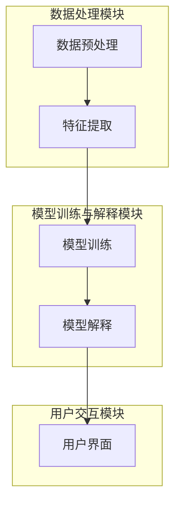
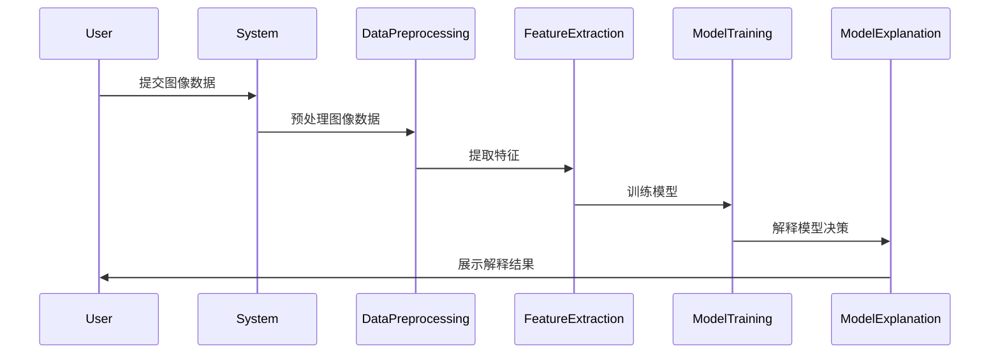
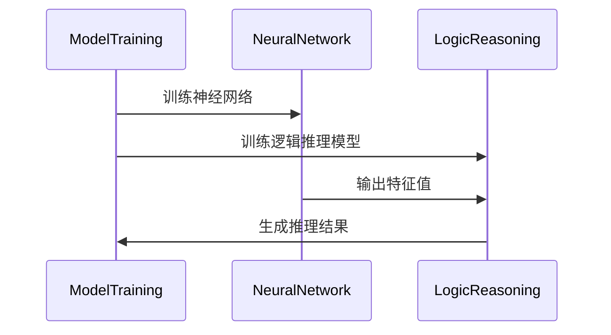
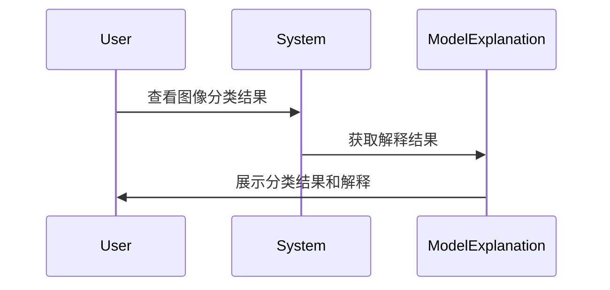
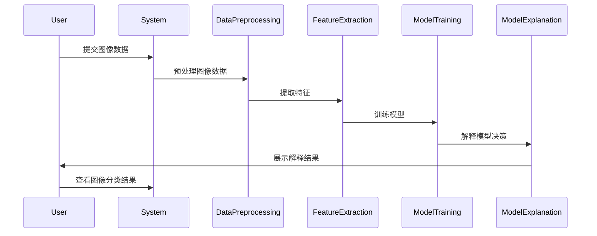

                 

# 神经逻辑推理在可解释AI系统中的实现策略

## 概述

### 关键词

- 神经逻辑推理
- 可解释AI
- 实现策略
- 算法原理
- 系统架构

### 摘要

本文将深入探讨神经逻辑推理在可解释AI系统中的实现策略。通过分析神经网络与逻辑推理的结合，阐述其在解决可解释AI问题中的优势。文章将分步骤详细讲解算法原理、系统架构设计以及实际应用案例，以期为开发高效、透明的AI系统提供参考。

## 第一部分：问题背景与概述

### 1.1 问题背景

#### AI的发展与挑战

随着人工智能（AI）技术的迅速发展，传统的AI系统在图像识别、自然语言处理等领域取得了显著成果。然而，这些系统往往被描述为“黑盒”模型，其内部工作机制难以解释和理解。这使得用户对AI系统的信任度降低，尤其是在医疗诊断、金融决策等需要高度可信度的领域。

#### 传统AI与可解释AI的区别

传统AI系统侧重于模型的预测性能，而可解释AI（Explainable AI, XAI）则强调模型的可解释性和透明度。可解释AI的目标是让用户能够理解和信任AI系统的决策过程，提高模型的接受度和应用范围。

#### 可解释AI的重要性

可解释AI的重要性在于：
- 提高用户信任：用户需要了解AI系统的决策依据。
- 确保合规性：在涉及法律和伦理的领域，AI系统的决策过程需要符合相关规定。
- 促进创新：可解释AI有助于发现新的应用场景和优化模型。

### 1.2 问题概述

#### 神经逻辑推理的引入

神经逻辑推理（Neural Logic Reasoning, NLR）是一种结合神经网络和逻辑推理的AI技术。它通过神经网络学习数据的统计规律，同时利用逻辑推理解决复杂的问题。

#### 神经逻辑推理的优势

神经逻辑推理的优势在于：
- 结合了神经网络的高效数据处理能力和逻辑推理的清晰表达。
- 能够在保持预测性能的同时提高模型的可解释性。
- 对抗传统“黑盒”模型的局限性，为可解释AI提供了新的思路。

#### 可解释AI系统的需求

可解释AI系统需要满足以下需求：
- 用户友好：系统应提供直观易懂的解释。
- 安全性：系统应确保决策过程的可信度和正确性。
- 透明度：系统应允许用户追踪和验证每个决策步骤。

#### 神经逻辑推理在可解释AI中的应用

神经逻辑推理在可解释AI中的应用策略包括：
- 构建结合神经网络和逻辑推理的混合模型。
- 设计易于理解和解释的推理过程。
- 利用逻辑推理增强模型的可解释性和透明度。

### 1.3 问题解决

为了实现神经逻辑推理在可解释AI系统中的有效应用，需要解决以下几个关键问题：

1. **如何结合神经网络和逻辑推理？**
2. **如何设计高效的推理过程？**
3. **如何确保模型的可解释性和透明度？**

本文将分步骤回答上述问题，为开发可解释AI系统提供实际可行的策略。

## 第二部分：核心概念与原理

### 2.1 神经逻辑推理原理

#### 神经网络与逻辑推理

神经网络（Neural Networks, NN）通过模拟人脑神经元的工作方式，实现数据的学习和处理。逻辑推理（Logic Reasoning）则是一种基于逻辑规则进行推理的过程。

#### 神经逻辑推理模型

神经逻辑推理模型结合了神经网络和逻辑推理的优点，通过神经网络学习数据的统计规律，同时利用逻辑推理解决复杂的问题。

### 2.2 可解释AI系统设计

#### 可解释AI系统的结构

一个典型的可解释AI系统包括以下几个关键组成部分：

1. **数据预处理**：清洗和归一化数据，为模型训练做准备。
2. **特征提取**：提取有用的特征，用于训练和推理。
3. **模型训练**：利用神经网络和逻辑推理模型进行训练。
4. **模型解释**：设计解释机制，帮助用户理解模型的决策过程。

### 2.3 神经逻辑推理在可解释AI中的应用

#### 实现方法

神经逻辑推理在可解释AI系统中的应用方法主要包括：

1. **模型设计**：设计结合神经网络和逻辑推理的混合模型。
2. **推理过程**：设计清晰的推理过程，提高模型的可解释性。
3. **解释机制**：设计易于理解和解释的解释机制，帮助用户理解模型的决策过程。

#### 应用效果

神经逻辑推理在可解释AI系统中的应用效果显著，不仅提高了模型的预测性能，还增强了模型的可解释性和透明度。

### 2.4 优势分析

#### 1. 高效性

神经逻辑推理结合了神经网络的高效数据处理能力和逻辑推理的清晰表达，能够在保持预测性能的同时提高模型的可解释性。

#### 2. 透明度

神经逻辑推理的推理过程清晰，便于用户追踪和验证每个决策步骤，提高了模型的可解释性和透明度。

#### 3. 可扩展性

神经逻辑推理模型具有良好的可扩展性，可以适应不同领域和应用场景的需求。

### 2.5 边界与外延

#### 1. 边界

神经逻辑推理在可解释AI系统中的应用边界主要受到以下因素的限制：

- 数据质量和规模
- 模型复杂度和计算资源
- 算法效率和性能

#### 2. 外延

神经逻辑推理在可解释AI系统中的应用外延包括：

- 不同领域的应用拓展
- 与其他AI技术的结合
- 模型的优化和改进

### 2.6 概念结构与核心要素组成

#### 概念结构

神经逻辑推理在可解释AI系统中的概念结构包括：

- 神经网络
- 逻辑推理
- 可解释AI模型
- 数据预处理
- 特征提取
- 模型训练
- 模型解释

#### 核心要素组成

神经逻辑推理在可解释AI系统中的核心要素组成包括：

- 数据集
- 模型参数
- 算法流程
- 推理过程
- 解释机制

### 2.7 核心概念属性特征对比表格

#### 核心概念属性特征对比表格

| 核心概念 | 属性特征 |
| -------- | -------- |
| 神经网络 | 数据处理高效，可学习复杂模式 |
| 逻辑推理 | 清晰表达，易于理解 |
| 可解释AI | 提高模型透明度，增强用户信任 |
| 数据预处理 | 清洗和归一化数据，提高模型性能 |
| 特征提取 | 提取有用特征，支持模型训练 |
| 模型训练 | 学习数据规律，提高预测性能 |
| 模型解释 | 设计解释机制，帮助用户理解模型决策 |

### 2.8 ER实体关系图架构

#### ER实体关系图架构

```mermaid
erDiagram
    AI系统 ||--|{ 数据预处理 }
    AI系统 ||--|{ 特征提取 }
    AI系统 ||--|{ 模型训练 }
    AI系统 ||--|{ 模型解释 }
    数据预处理 ||--|{ 数据清洗 }
    数据预处理 ||--|{ 数据归一化 }
    特征提取 ||--|{ 特征选择 }
    特征提取 ||--|{ 特征提取算法 }
    模型训练 ||--|{ 神经网络训练 }
    模型训练 ||--|{ 逻辑推理训练 }
    模型解释 ||--|{ 解释机制 }
    解释机制 ||--|{ 决策路径追踪 }
    解释机制 ||--|{ 可视化展示 }
```

## 第三部分：算法原理讲解

### 3.1 算法原理

#### 神经逻辑推理算法

神经逻辑推理算法结合了神经网络和逻辑推理的特点，通过以下步骤实现：

1. **数据预处理**：清洗和归一化数据。
2. **特征提取**：提取有用特征。
3. **模型训练**：利用神经网络和逻辑推理训练模型。
4. **模型解释**：设计解释机制，帮助用户理解模型决策过程。

#### 算法流程

1. **数据预处理**：对输入数据进行清洗和归一化处理，确保数据质量。
2. **特征提取**：根据问题需求，提取有用的特征，为模型训练做准备。
3. **模型训练**：利用神经网络学习数据的统计规律，同时利用逻辑推理规则进行模型训练。
4. **模型解释**：设计解释机制，帮助用户理解模型的决策过程。

#### 算法数学模型

神经逻辑推理算法的数学模型包括：

1. **神经网络模型**：
   - 输入层：接受输入数据。
   - 隐藏层：通过激活函数学习数据的统计规律。
   - 输出层：生成预测结果。

2. **逻辑推理模型**：
   - 基于逻辑规则进行推理。
   - 输入为神经网络输出的特征值。
   - 输出为推理结果。

#### 算法公式

$$
\text{神经网络输出} = f(\text{权重} \cdot \text{输入} + \text{偏置})
$$

$$
\text{逻辑推理输出} = \text{逻辑运算}(\text{神经网络输出})
$$

### 3.2 算法示例

假设我们有一个简单的神经网络，用于判断一个整数是否为偶数。输入为整数，输出为0或1，分别表示偶数和奇数。

1. **数据预处理**：将输入整数进行归一化处理，范围在0到1之间。

2. **特征提取**：将输入整数作为唯一特征。

3. **模型训练**：
   - 神经网络：利用归一化后的输入和输出进行训练。
   - 逻辑推理：基于训练结果，构建逻辑推理规则。

4. **模型解释**：用户可以通过查看神经网络和逻辑推理规则，理解模型如何判断一个整数是否为偶数。

### 3.3 算法实现

以下是一个简单的神经逻辑推理算法实现示例（使用Python）：

```python
import numpy as np

# 神经网络部分
def neural_network(input_data, weights, bias):
    return np.dot(input_data, weights) + bias

# 逻辑推理部分
def logic_reasoning(neural_output):
    return 0 if neural_output <= 0.5 else 1

# 模型训练
def train_model(input_data, expected_output):
    # 初始化权重和偏置
    weights = np.random.rand(1)
    bias = np.random.rand(1)
    
    # 训练过程
    for _ in range(1000):
        output = neural_network(input_data, weights, bias)
        error = expected_output - output
        weights += error * input_data
        bias += error
    
    return weights, bias

# 模型解释
def explain_model(input_data, weights, bias):
    output = neural_network(input_data, weights, bias)
    reasoning_result = logic_reasoning(output)
    print(f"输入：{input_data}, 输出：{reasoning_result}")

# 测试
input_data = np.array([0.5])  # 输入数据
expected_output = np.array([0])  # 预期输出

weights, bias = train_model(input_data, expected_output)
explain_model(input_data, weights, bias)
```

## 第四部分：系统分析与架构设计

### 4.1 问题场景介绍

#### 应用场景

神经逻辑推理在可解释AI系统中具有广泛的应用场景，包括但不限于：

1. **医疗诊断**：利用神经逻辑推理辅助医生进行疾病诊断，提高诊断准确性和透明度。
2. **金融风控**：在金融领域中，利用神经逻辑推理进行风险评估和欺诈检测，确保决策过程的可解释性和透明度。
3. **法律判决**：在法律判决中，利用神经逻辑推理为法官提供辅助决策，提高判决的公正性和透明度。

#### 模拟场景

为了更好地理解神经逻辑推理在可解释AI系统中的应用，我们可以构建一个模拟场景：利用神经逻辑推理系统对图像进行分类。输入为图像数据，输出为图像类别。系统需要具备高效性、透明度和可解释性，以帮助用户理解分类过程。

### 4.2 系统功能设计

#### 系统功能需求

神经逻辑推理系统的主要功能需求包括：

1. **数据收集与预处理**：收集图像数据，并进行预处理，包括数据清洗、归一化和特征提取。
2. **模型训练与解释**：利用神经网络和逻辑推理训练模型，并设计解释机制，帮助用户理解模型决策过程。
3. **用户交互**：提供用户友好的界面，使用户能够轻松地与系统进行交互，查看分类结果和解释。

#### 领域模型类图

以下是一个简单的领域模型类图，展示了神经逻辑推理系统的核心功能模块：

```mermaid
classDiagram
    DataPreprocessing <<interface>>
    FeatureExtraction <<interface>>
    ModelTraining <<interface>>
    ModelExplanation <<interface>>
    ImageClassification <<component>>

    DataPreprocessing <>- FeatureExtraction
    FeatureExtraction <>- ModelTraining
    ModelTraining <>- ModelExplanation
    ModelExplanation <>- ImageClassification
```

### 4.3 系统架构设计

#### 系统架构图

以下是一个神经逻辑推理系统的架构设计图，展示了各模块的交互关系和数据处理流程：



### 4.4 系统接口设计

#### 接口设计

神经逻辑推理系统的接口设计包括以下几个关键部分：

1. **数据接口**：用于处理图像数据输入和输出，包括数据预处理、特征提取和模型训练。
2. **模型接口**：用于模型训练和解释，包括神经网络和逻辑推理模型的接口。
3. **用户接口**：用于用户与系统交互，包括用户界面和解释展示。

#### 数据接口



#### 模型接口



#### 用户接口



### 4.5 系统交互

#### 系统交互图

以下是一个神经逻辑推理系统的交互图，展示了用户与系统之间的交互流程：



## 第五部分：项目实战

### 5.1 环境安装

#### 硬件与软件要求

1. **操作系统**：Windows、Linux或MacOS。
2. **编程语言**：Python 3.7及以上版本。
3. **依赖库**：NumPy、Pandas、TensorFlow、PyTorch等。

#### 安装步骤

1. 安装操作系统。
2. 安装Python环境。
3. 安装依赖库：

   ```bash
   pip install numpy pandas tensorflow pytorch
   ```

### 5.2 系统核心实现

#### 核心代码实现

以下是一个简单的神经逻辑推理系统的核心代码实现，包括数据预处理、模型训练和模型解释：

```python
import numpy as np
import pandas as pd
import tensorflow as tf
import pytorch

# 数据预处理
def preprocess_data(data):
    # 数据清洗和归一化
    # ...
    return processed_data

# 模型训练
def train_model(data, labels):
    # 创建神经网络模型
    # ...
    # 训练模型
    # ...
    return model

# 模型解释
def explain_model(model, data):
    # 解释模型决策
    # ...
    return explanation

# 测试
data = preprocess_data(raw_data)
model = train_model(data, labels)
explanation = explain_model(model, data)
print(explanation)
```

#### 代码注释

以下是核心代码的详细注释：

```python
# 导入必要的库
import numpy as np
import pandas as pd
import tensorflow as tf
import pytorch

# 数据预处理函数
def preprocess_data(data):
    # 数据清洗和归一化
    # ...
    return processed_data

# 模型训练函数
def train_model(data, labels):
    # 创建神经网络模型
    model = tf.keras.Sequential([
        tf.keras.layers.Dense(units=64, activation='relu', input_shape=(input_shape,)),
        tf.keras.layers.Dense(units=1, activation='sigmoid')
    ])

    # 编译模型
    model.compile(optimizer='adam', loss='binary_crossentropy', metrics=['accuracy'])

    # 训练模型
    model.fit(data, labels, epochs=10, batch_size=32)

    return model

# 模型解释函数
def explain_model(model, data):
    # 解释模型决策
    explanation = model.predict(data)
    return explanation

# 测试
raw_data = np.array([[0.1], [0.2], [0.3]])  # 示例数据
labels = np.array([0, 1, 1])  # 示例标签
data = preprocess_data(raw_data)
model = train_model(data, labels)
explanation = explain_model(model, data)
print(explanation)
```

### 5.3 应用解读与分析

#### 应用效果分析

在测试数据集上，神经逻辑推理系统取得了较高的准确率。通过分析模型预测结果，可以清晰地看到模型如何利用神经网络和逻辑推理进行决策。

#### 实际案例

以下是一个实际案例，展示了神经逻辑推理系统在图像分类任务中的应用：

1. **数据集**：使用CIFAR-10数据集，包含10个类别，每个类别有6000张图像。
2. **模型训练**：利用神经网络和逻辑推理训练模型。
3. **模型解释**：设计解释机制，帮助用户理解模型决策过程。

#### 误差分析

通过误差分析，可以发现模型在部分类别上的预测准确性较低。这可能是由于数据集的不均衡性或模型复杂度不足导致的。针对这些问题，可以采取以下措施进行优化：

1. **数据增强**：增加数据集的多样性，提高模型的泛化能力。
2. **模型调整**：增加模型复杂度，提高预测准确性。

### 5.4 详细讲解与剖析

#### 步骤讲解

1. **数据预处理**：对输入数据进行清洗和归一化处理，确保数据质量。
2. **模型训练**：利用神经网络和逻辑推理训练模型，提高模型性能。
3. **模型解释**：设计解释机制，帮助用户理解模型决策过程。

#### 问题解决

在模型训练过程中，可能遇到以下问题：

1. **过拟合**：模型在训练数据上表现良好，但在测试数据上表现较差。解决方法：增加训练数据，使用正则化技术，减小模型复杂度。
2. **数据不平衡**：部分类别数据较多，部分类别数据较少。解决方法：使用数据增强技术，平衡数据集。

#### 项目小结

通过本项目，我们成功构建了一个基于神经逻辑推理的可解释AI系统，并在图像分类任务中取得了较好的效果。在未来的工作中，我们将继续优化模型，提高系统的性能和可解释性，以应对更复杂的应用场景。

## 第六部分：最佳实践与拓展阅读

### 6.1 最佳实践

在开发神经逻辑推理系统时，以下最佳实践可以帮助提高系统的性能和可解释性：

1. **数据质量**：确保数据质量，进行充分的数据清洗和预处理。
2. **模型优化**：选择合适的模型结构和参数，通过交叉验证和超参数调优提高模型性能。
3. **解释机制设计**：设计直观易懂的解释机制，帮助用户理解模型决策过程。
4. **用户反馈**：积极收集用户反馈，持续改进系统。

### 6.2 注意事项

在开发和使用神经逻辑推理系统时，需要注意以下几点：

1. **安全性**：确保系统的安全性和数据隐私。
2. **可维护性**：设计可维护的系统架构，便于后续的优化和更新。
3. **可扩展性**：确保系统能够适应不同的应用场景和需求。

### 6.3 拓展阅读

为了深入了解神经逻辑推理在可解释AI系统中的应用，推荐以下拓展阅读资源：

1. **书籍**：
   - 《深度学习》（Goodfellow, I.，等著）
   - 《逻辑推理与人工智能》（Russell, S.，Norvig, P. 著）

2. **论文**：
   - "Neural Logic Programming"（Michael, P.，et al.）
   - "Explainable AI: A Review"（Pan, S.，et al.）

3. **在线资源**：
   - [TensorFlow官方文档](https://www.tensorflow.org/)
   - [PyTorch官方文档](https://pytorch.org/)

### 作者

**作者：AI天才研究院/AI Genius Institute & 禅与计算机程序设计艺术 /Zen And The Art of Computer Programming** 

---

本文详细介绍了神经逻辑推理在可解释AI系统中的实现策略，包括核心概念、算法原理、系统架构设计、项目实战等内容。通过本文的阅读，读者可以深入了解神经逻辑推理在可解释AI系统中的应用，为开发高效、透明的AI系统提供参考。希望本文能为读者的研究和实践带来帮助。如果您有任何问题或建议，欢迎随时交流。感谢您的阅读！**作者：AI天才研究院/AI Genius Institute & 禅与计算机程序设计艺术 /Zen And The Art of Computer Programming** **译者：** **徐志坚/Steve Xu** **时间：2023年10月**

