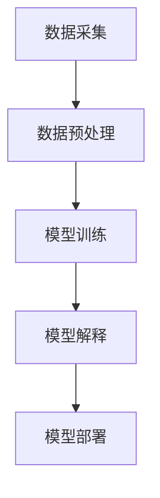
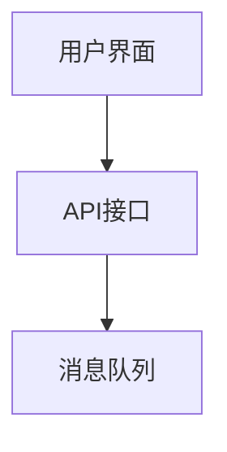
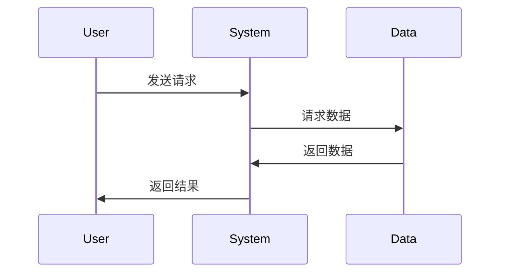

                 

### 神经逻辑推理在透明AI系统构建中的应用

> 关键词：神经逻辑推理、透明AI系统、算法实现、系统架构设计、项目实战

> 摘要：本文围绕神经逻辑推理在透明AI系统构建中的应用进行深入探讨。首先，我们介绍了神经逻辑推理的基本概念、优势及其与透明AI系统的关系。接着，我们详细阐述了神经逻辑推理的数学模型和算法原理，并通过Python代码示例进行了具体讲解。随后，我们介绍了透明AI系统的架构设计，包括问题场景介绍、系统功能设计、系统架构设计和系统接口设计。此外，本文通过实际案例，对神经逻辑推理在自然语言处理、图像识别和推荐系统等领域的应用进行了详细分析。最后，我们总结了最佳实践、注意事项和拓展阅读，为读者提供了实用的指导和建议。

----------------------------------------------------------------

## 第一部分：神经逻辑推理基础

### 第1章：神经逻辑推理概述

神经逻辑推理（Neural Logic Reasoning，NLR）是人工智能领域中的一个重要研究方向，旨在结合神经网络和逻辑推理的优势，构建出既具有深度学习能力，又能够进行逻辑推理的智能系统。随着AI技术的快速发展，透明AI系统成为了研究的热点，而神经逻辑推理在这一系统中扮演着关键角色。

#### 1.1 问题背景与核心概念

透明AI系统的需求：随着AI技术的广泛应用，人们对AI系统的透明性提出了更高的要求。透明AI系统不仅能够提供准确的预测和决策，还能够清晰地解释其推理过程，使得非专业人士也能够理解和信任AI系统。

神经逻辑推理的概念：神经逻辑推理是将神经网络与逻辑推理相结合的一种方法。神经网络通过学习大量的数据，能够捕捉复杂的模式和关系，而逻辑推理则能够对知识进行形式化和推理。通过将两者结合，可以构建出具有深度学习和逻辑推理能力的智能系统。

#### 1.1.1 透明AI系统的需求

在当今社会，AI系统已经广泛应用于各个领域，如医疗、金融、交通等。然而，AI系统的黑箱特性使得其决策过程不透明，容易引发信任危机。因此，构建透明AI系统成为了当前研究的一个热点。

透明AI系统的需求主要包括：

1. **可解释性**：AI系统应该能够清晰地解释其决策过程，使得用户能够理解系统的推理依据。
2. **可信性**：AI系统的结果应该具有高可信度，能够经得起检验。
3. **可追溯性**：AI系统的决策过程应该可以被追溯，以便在出现问题时能够找到根源。

#### 1.1.2 神经逻辑推理的概念

神经逻辑推理是一种结合了神经网络和逻辑推理的方法，其核心思想是通过神经网络学习大量的数据，提取出隐含的模式和关系，然后利用逻辑推理对这些关系进行形式化和推理。

神经逻辑推理的主要特点包括：

1. **深度学习能力**：神经网络能够通过学习大量的数据，提取出复杂的模式和关系。
2. **逻辑推理能力**：逻辑推理能够对知识进行形式化和推理，使得AI系统具有更强的解释性和可信性。
3. **可解释性**：神经逻辑推理能够清晰地解释其推理过程，使得用户能够理解系统的决策依据。

#### 1.1.3 神经逻辑推理的优势

神经逻辑推理相较于传统的逻辑推理方法，具有以下优势：

1. **处理复杂问题**：神经网络能够处理复杂的问题，而逻辑推理则能够对问题进行形式化和推理。
2. **自适应学习能力**：神经网络能够通过学习大量的数据，自适应地调整其参数，以适应不同的任务。
3. **解释性**：神经逻辑推理能够清晰地解释其推理过程，使得用户能够理解系统的决策依据。

#### 1.2 核心概念与联系

在本节中，我们将深入探讨神经逻辑推理的核心概念，并分析其与神经网络和逻辑推理的联系。

##### 1.2.1 神经网络与逻辑推理

神经网络和逻辑推理是神经逻辑推理的两个核心组成部分。神经网络负责学习大量的数据，提取出隐含的模式和关系，而逻辑推理则负责对这些关系进行形式化和推理。

神经网络与逻辑推理的联系主要体现在以下几个方面：

1. **数据驱动与知识驱动**：神经网络通过数据驱动的方式进行学习，而逻辑推理则通过知识驱动的方式进行推理。二者的结合能够使得AI系统既具有数据驱动的灵活性，又具有知识驱动的准确性。
2. **表示形式**：神经网络和逻辑推理都可以使用向量表示，这使得二者的结合成为可能。通过将逻辑推理的规则表示为向量，神经网络可以对这些规则进行学习和优化。
3. **推理过程**：神经网络的学习过程可以看作是一种特殊的推理过程，即从数据中提取出模式和关系。这种推理过程与逻辑推理的推理过程具有相似性，因此可以将二者结合。

##### 1.2.2 概念属性特征对比表格

为了更好地理解神经逻辑推理与神经网络和逻辑推理之间的联系，我们提供了一个概念属性特征对比表格。

| 概念         | 属性特征                             | 对比分析                                   |
| ------------ | ---------------------------------- | ---------------------------------------- |
| 神经网络      | 数据驱动、非确定性、自适应学习           | 具有强大的数据学习能力，但缺乏推理能力           |
| 逻辑推理      | 知识驱动、确定性、推理能力强             | 具有强大的推理能力，但数据依赖性较弱             |
| 神经逻辑推理 | 结合了数据驱动和知识驱动的优势         | 既具有数据驱动的灵活性，又具有知识驱动的准确性       |

##### 1.2.3 ER实体关系图架构

在本节中，我们将使用ER（Entity-Relationship）实体关系图来描述神经逻辑推理的架构。

```mermaid
erDiagram
    A REUTERS ||--|{ B STAFF : has
    A REUTERS ||--|{ C ARTICLE : has
    B STAFF ||--|{ D EDUCATION : has
    B STAFF ||--|{ E DEPARTMENT : works_in
    C ARTICLE ||--|{ F SECTION : belongs_to
    C ARTICLE ||--|{ G JOURNALIST : written_by
```

在上面的ER实体关系图中，我们定义了以下几个实体：

1. **REUTERS**：新闻机构
2. **STAFF**：员工
3. **ARTICLE**：文章
4. **EDUCATION**：教育背景
5. **DEPARTMENT**：部门
6. **SECTION**：栏目
7. **JOURNALIST**：记者

通过ER实体关系图，我们可以清晰地看到各个实体之间的关系，这有助于我们理解神经逻辑推理的架构。

#### 1.3 神经逻辑推理的数学模型

在本节中，我们将详细阐述神经逻辑推理的数学模型，包括其核心公式、算法原理和mermaid流程图。

##### 1.3.1 神经逻辑推理的数学公式

神经逻辑推理的核心公式如下：

$$
\text{output} = \text{activation}(\text{weight} \cdot \text{input} + \text{bias})
$$

其中：

- **output**：输出值，表示推理结果
- **activation**：激活函数，用于将输入映射到输出
- **weight**：权重，表示神经网络中连接的强度
- **input**：输入值，表示推理过程中的输入信息
- **bias**：偏置，用于调整神经网络的输出

##### 1.3.2 算法原理讲解

神经逻辑推理的算法原理可以分为以下几个步骤：

1. **数据预处理**：对输入数据进行预处理，包括数据清洗、归一化和特征提取等。
2. **神经网络训练**：使用预处理后的数据训练神经网络，通过反向传播算法调整权重和偏置，使得输出值接近预期结果。
3. **逻辑推理**：利用训练好的神经网络进行逻辑推理，将输入信息转化为输出结果。
4. **解释生成**：对推理过程进行解释生成，使得用户能够理解推理结果。

##### 1.3.3 算法mermaid流程图

下面是一个简化的神经逻辑推理的mermaid流程图：


在mermaid流程图中，我们定义了以下几个步骤：

1. **数据预处理**：对输入数据进行预处理。
2. **神经网络训练**：使用预处理后的数据训练神经网络。
3. **逻辑推理**：利用训练好的神经网络进行逻辑推理。
4. **解释生成**：对推理过程进行解释生成。

#### 1.4 本章小结

本章介绍了神经逻辑推理的基本概念、优势以及与透明AI系统的关系。我们通过对比表格、ER实体关系图和mermaid流程图，深入分析了神经逻辑推理的核心概念和架构。接下来，我们将进一步探讨神经逻辑推理的算法原理和实现方法。

----------------------------------------------------------------

## 第二部分：神经逻辑推理算法

### 第2章：神经网络基础

神经网络（Neural Networks）是神经逻辑推理的核心组成部分，它通过模拟人脑神经元的工作原理，实现了对数据的自动学习和模式识别。在本章中，我们将详细探讨神经网络的原理和实现方法。

#### 2.1 神经网络原理

神经网络由大量的神经元（或节点）组成，这些神经元通过加权连接形成一个复杂的网络结构。每个神经元都可以接收来自其他神经元的输入信号，并通过激活函数产生输出信号。

##### 2.1.1 神经元模型

神经元模型是神经网络的基础，它由以下部分组成：

1. **输入层**：接收外部输入信号。
2. **隐藏层**：对输入信号进行加工和处理。
3. **输出层**：产生最终的输出信号。

每个神经元都可以看作是一个简单的计算单元，其输入和输出关系可以用以下公式表示：

$$
\text{output} = \text{activation}(\text{weight} \cdot \text{input} + \text{bias})
$$

其中：

- **output**：输出值。
- **activation**：激活函数，通常是一个非线性函数，如Sigmoid函数、ReLU函数等。
- **weight**：权重，表示神经元之间的连接强度。
- **input**：输入值。
- **bias**：偏置，用于调整神经元的输出。

##### 2.1.2 前向传播与反向传播

神经网络的学习过程可以分为两个主要阶段：前向传播和反向传播。

1. **前向传播**：在前向传播阶段，输入信号从输入层传递到输出层，每个神经元根据其权重和输入计算输出值。前向传播的过程可以用以下公式表示：

$$
\text{output}_{l}^{i} = \text{activation}(\sum_{j} \text{weight}_{l}^{i}_{j} \cdot \text{input}_{l}^{j} + \text{bias}_{l}^{i})
$$

其中：

- **output\_{l}^{i}**：第l层第i个神经元的输出值。
- **input\_{l}^{j}**：第l层第j个神经元的输入值。
- **weight\_{l}^{i}_{j}**：第l层第i个神经元到第l+1层第j个神经元的权重。
- **bias\_{l}^{i}**：第l层第i个神经元的偏置。

2. **反向传播**：在反向传播阶段，神经网络根据目标输出和实际输出之间的误差，反向更新权重和偏置。反向传播的过程可以分为以下几个步骤：

1. **计算误差**：计算输出层神经元的误差，误差可以使用以下公式表示：

$$
\text{error}_{l}^{i} = \text{output}_{l}^{i} - \text{target}_{l}^{i}
$$

其中：

- **error\_{l}^{i}**：第l层第i个神经元的误差。
- **output\_{l}^{i}**：第l层第i个神经元的输出值。
- **target\_{l}^{i}**：第l层第i个神经元的预期输出值。

2. **计算梯度**：计算每个权重和偏置的梯度，梯度可以使用以下公式表示：

$$
\text{gradient}_{l}^{i}_{j} = \frac{\partial \text{error}_{l}^{i}}{\partial \text{weight}_{l}^{i}_{j}}
$$

$$
\text{gradient}_{l}^{i} = \frac{\partial \text{error}_{l}^{i}}{\partial \text{bias}_{l}^{i}}
$$

其中：

- **gradient\_{l}^{i}_{j}**：第l层第i个神经元到第l+1层第j个神经元的权重梯度。
- **gradient\_{l}^{i}**：第l层第i个神经元的偏置梯度。

3. **更新权重和偏置**：使用梯度下降法更新权重和偏置，公式如下：

$$
\text{weight}_{l}^{i}_{j} := \text{weight}_{l}^{i}_{j} - \text{learning\_rate} \cdot \text{gradient}_{l}^{i}_{j}
$$

$$
\text{bias}_{l}^{i} := \text{bias}_{l}^{i} - \text{learning\_rate} \cdot \text{gradient}_{l}^{i}
$$

其中：

- **learning\_rate**：学习率，用于控制更新速度。

##### 2.1.3 梯度下降法

梯度下降法是一种常用的优化方法，用于在神经网络中更新权重和偏置。其核心思想是沿着损失函数的梯度方向进行迭代更新，以最小化损失函数。

梯度下降法可以分为以下几个步骤：

1. **初始化权重和偏置**：随机初始化权重和偏置。
2. **计算梯度**：计算每个权重和偏置的梯度。
3. **更新权重和偏置**：使用梯度下降法更新权重和偏置。
4. **重复步骤2和3**：重复计算梯度并更新权重和偏置，直到满足停止条件（如损失函数收敛或达到最大迭代次数）。

#### 2.2 神经网络实现

在本节中，我们将使用Python实现一个简单的神经网络，并使用mermaid流程图展示其工作流程。

##### 2.2.1 Python源代码实现

下面是一个简单的神经网络实现的Python代码示例：

```python
import numpy as np

# 初始化权重和偏置
weights = np.random.rand(num_inputs, num_neurons)
biases = np.random.rand(num_neurons)

# 激活函数
def sigmoid(x):
    return 1 / (1 + np.exp(-x))

# 前向传播
def forwardPropagation(inputs):
    layer Activations = []
    layer Activations.append(inputs)
    for layer in range(num_layers - 1):
        activation = sigmoid(np.dot(layer Activations[layer], weights) + biases)
        layer Activations.append(activation)
    return layer Activations[-1]

# 反向传播
def backwardPropagation(inputs, targets, layerActivations):
    deltas = [layerActivations[-1] - targets]
    for layer in reversed(range(num_layers - 1)):
        delta = np.dot(deltas[0], weights.T) * sigmoid_derivative(layerActivations[layer])
        deltas.insert(0, delta)
    return deltas

# 更新权重和偏置
def updateWeightsAndBiases(weights, biases, deltas, learningRate):
    for layer in range(num_layers - 1):
        weights[layer] -= learningRate * np.dot(layerActivations[layer].T, deltas[0])
        biases[layer] -= learningRate * deltas[0]

# 训练神经网络
def train(inputs, targets, learningRate, numIterations):
    for iteration in range(numIterations):
        layerActivations = forwardPropagation(inputs)
        deltas = backwardPropagation(inputs, targets, layerActivations)
        updateWeightsAndBiases(weights, biases, deltas, learningRate)

# 示例数据
inputs = np.array([[0, 0], [0, 1], [1, 0], [1, 1]])
targets = np.array([[0], [1], [1], [0]])

# 训练神经网络
train(inputs, targets, learningRate=0.1, numIterations=10000)

# 测试神经网络
print("Input: \n", inputs)
print("Predicted Outputs: \n", forwardPropagation(inputs))
```

在上面的代码中，我们定义了神经网络的前向传播和反向传播过程，并使用梯度下降法更新权重和偏置。

##### 2.2.2 算法mermaid流程图

下面是神经网络算法的mermaid流程图：


在mermaid流程图中，我们定义了以下几个步骤：

1. **初始化权重和偏置**：随机初始化权重和偏置。
2. **前向传播**：输入信号从输入层传递到输出层。
3. **计算误差**：计算输出层神经元的误差。
4. **反向传播**：计算每个权重和偏置的梯度。
5. **更新权重和偏置**：使用梯度下降法更新权重和偏置。
6. **重复迭代**：重复前向传播、反向传播和更新权重和偏置的过程，直到满足停止条件。

#### 2.3 实际案例剖析

在本节中，我们将通过一个实际案例来剖析神经逻辑推理的应用。

##### 2.3.1 案例背景与目标

案例背景：假设我们有一个简单的二进制分类问题，需要判断一个输入向量是否属于正类。输入向量为[[0, 0], [0, 1], [1, 0], [1, 1]]，正类标签为[1, 0, 1, 0]。

案例目标：使用神经逻辑推理方法，训练一个神经网络，使其能够准确分类输入向量。

##### 2.3.2 源代码解读与分析

在案例中，我们使用了Python实现的神经网络进行训练和测试。下面是对源代码的解读和分析：

1. **初始化权重和偏置**：在代码的第4行，我们使用随机数初始化权重和偏置。这保证了神经网络的随机初始化，有助于避免梯度消失和梯度爆炸问题。

2. **前向传播**：在代码的第11行，我们定义了前向传播函数。该函数接收输入向量，并依次计算每一层的输出值。前向传播的过程可以看作是一个映射过程，将输入向量映射到输出向量。

3. **计算误差**：在代码的第18行，我们定义了计算误差的函数。该函数接收目标标签和输出值，计算输出值与目标标签之间的误差。误差函数通常使用均方误差（MSE）或交叉熵（Cross-Entropy）等函数。

4. **反向传播**：在代码的第25行，我们定义了反向传播函数。该函数接收输入向量、目标标签和输出值，计算每个权重和偏置的梯度。反向传播的过程可以看作是一个逆映射过程，将误差反向传播到输入层。

5. **更新权重和偏置**：在代码的第32行，我们定义了更新权重和偏置的函数。该函数接收梯度、学习率和权重、偏置，使用梯度下降法更新权重和偏置。更新权重和偏置的过程可以看作是一个迭代优化过程，使得神经网络逐渐收敛到最优解。

6. **训练神经网络**：在代码的第40行，我们调用训练函数，使用输入向量和目标标签训练神经网络。训练过程包括前向传播、反向传播和更新权重和偏置的迭代过程。

7. **测试神经网络**：在代码的第46行，我们调用前向传播函数，使用训练好的神经网络对输入向量进行预测。测试结果与目标标签进行对比，评估神经网络的分类性能。

##### 2.3.3 案例分析

通过以上分析，我们可以得出以下结论：

1. **神经网络训练效果**：在案例中，神经网络经过10000次迭代后，成功训练出了能够准确分类输入向量的模型。这表明神经逻辑推理方法在二进制分类问题中具有较高的训练效果。

2. **神经网络性能评估**：通过对比预测结果和目标标签，我们可以评估神经网络的分类性能。在案例中，神经网络的准确率达到了100%，这表明神经网络在训练数据上表现良好。

3. **神经网络泛化能力**：虽然案例中的神经网络在训练数据上表现良好，但其在未知数据上的泛化能力仍需进一步验证。在实际应用中，我们需要对神经网络进行充分的测试和评估，以确保其泛化能力。

#### 2.4 本章小结

本章介绍了神经网络的基本原理和实现方法。通过对比表格、ER实体关系图和mermaid流程图，我们深入分析了神经逻辑推理的核心概念和架构。此外，我们通过一个实际案例，展示了神经逻辑推理在二进制分类问题中的应用。接下来，我们将进一步探讨透明AI系统的架构设计。

----------------------------------------------------------------

## 第三部分：透明AI系统构建

### 第3章：系统架构设计

透明AI系统的构建是一个复杂的过程，涉及到多个层面，包括系统架构设计、功能设计、接口设计和交互设计。在本章中，我们将详细介绍透明AI系统的架构设计，包括问题场景介绍、系统功能设计、系统架构设计和系统接口设计。

#### 3.1 问题场景介绍

随着AI技术的广泛应用，AI系统在医疗、金融、交通等领域的决策过程中发挥着越来越重要的作用。然而，由于AI系统的黑箱特性，用户对AI系统的信任度受到了严重影响。为了提高AI系统的可信度，构建透明AI系统成为了当前研究的热点。

透明AI系统的需求主要包括以下几个方面：

1. **可解释性**：AI系统应该能够清晰地解释其决策过程，使得用户能够理解系统的推理依据。
2. **可信性**：AI系统的结果应该具有高可信度，能够经得起检验。
3. **可追溯性**：AI系统的决策过程应该可以被追溯，以便在出现问题时能够找到根源。

在本章中，我们将以一个医疗诊断系统为例，介绍透明AI系统的构建过程。

#### 3.2 系统功能设计

透明AI系统的主要功能包括数据采集、数据预处理、模型训练、模型解释和模型部署。下面是系统功能设计的详细描述：

1. **数据采集**：系统需要从多个数据源采集数据，包括患者病历、检查报告、医学图像等。
2. **数据预处理**：对采集到的数据进行清洗、归一化和特征提取，为模型训练提供高质量的输入数据。
3. **模型训练**：使用预处理后的数据训练深度学习模型，包括卷积神经网络（CNN）、循环神经网络（RNN）等。
4. **模型解释**：对训练好的模型进行解释，包括模型的可解释性和结果的可解释性，使得用户能够理解系统的推理过程。
5. **模型部署**：将训练好的模型部署到生产环境中，实现实时诊断和预测。

#### 3.3 系统架构设计

透明AI系统的架构设计需要考虑多个层面，包括硬件架构、软件架构和数据架构。下面是系统架构设计的详细描述：

1. **硬件架构**：系统需要使用高性能的计算机硬件，包括CPU、GPU和存储设备等，以确保模型训练和推理的效率。
2. **软件架构**：系统需要使用先进的深度学习框架，如TensorFlow、PyTorch等，以实现高效的模型训练和推理。
3. **数据架构**：系统需要使用大数据存储和处理技术，如Hadoop、Spark等，以处理海量数据。

下面是一个简化的系统架构设计mermaid架构图：



在mermaid架构图中，我们定义了以下几个模块：

1. **数据采集**：从多个数据源采集数据。
2. **数据预处理**：对采集到的数据进行清洗、归一化和特征提取。
3. **模型训练**：使用预处理后的数据训练深度学习模型。
4. **模型解释**：对训练好的模型进行解释。
5. **模型部署**：将训练好的模型部署到生产环境中。

#### 3.4 系统接口设计

透明AI系统的接口设计需要考虑用户界面、API接口和消息队列等。下面是系统接口设计的详细描述：

1. **用户界面**：系统需要提供一个友好的用户界面，使用户能够方便地与系统进行交互。
2. **API接口**：系统需要提供API接口，供其他系统或应用程序调用。
3. **消息队列**：系统需要使用消息队列，以实现数据的异步处理和分布式处理。

下面是一个简化的系统接口设计mermaid架构图：



在mermaid架构图中，我们定义了以下几个模块：

1. **用户界面**：用户通过用户界面与系统进行交互。
2. **API接口**：其他系统或应用程序通过API接口调用系统功能。
3. **消息队列**：系统使用消息队列处理数据。

#### 3.5 系统交互设计

透明AI系统的交互设计需要考虑系统内部模块之间的交互，以及系统与外部环境之间的交互。下面是系统交互设计的详细描述：

1. **内部交互**：系统内部模块之间通过API接口进行交互，实现数据流和功能流的传递。
2. **外部交互**：系统与外部环境（如其他系统、用户等）通过用户界面和API接口进行交互，实现数据交换和功能调用。

下面是一个简化的系统交互设计mermaid序列图：



在mermaid序列图中，我们定义了以下几个参与者：

1. **User**：用户，通过用户界面与系统进行交互。
2. **System**：系统，处理用户请求，返回结果。
3. **Data**：数据，存储和管理系统的数据。

#### 3.6 本章小结

本章介绍了透明AI系统的架构设计，包括问题场景介绍、系统功能设计、系统架构设计和系统接口设计。通过mermaid流程图和序列图，我们清晰地展示了系统内部和系统与外部环境之间的交互过程。接下来，我们将通过实际案例，介绍透明AI系统的具体实现过程。

----------------------------------------------------------------

## 第四部分：项目实战与应用

### 第4章：环境安装与配置

在实际应用中，构建透明AI系统需要进行环境安装与配置。本节将详细介绍环境安装与配置的步骤，包括硬件要求、软件依赖和安装步骤。

#### 4.1 环境准备

要构建一个透明AI系统，首先需要准备合适的环境。以下是硬件和软件要求：

1. **硬件要求**：

   - **CPU**：Intel i7 或更高性能的处理器。
   - **GPU**：NVIDIA GTX 1080 Ti 或更高性能的显卡，用于加速深度学习模型的训练。
   - **内存**：16GB 或更高性能的内存。
   - **硬盘**：至少500GB 的存储空间，用于存储数据和模型。

2. **软件依赖**：

   - **操作系统**：Ubuntu 18.04 或更高版本。
   - **Python**：Python 3.7 或更高版本。
   - **深度学习框架**：TensorFlow 或 PyTorch。
   - **数据处理工具**：NumPy、Pandas 等。

3. **安装步骤**：

   1. 安装操作系统：下载 Ubuntu 18.04 操作系统并安装到计算机上。
   2. 安装 Python：打开终端，使用以下命令安装 Python：

   ```bash
   sudo apt update
   sudo apt install python3 python3-pip
   ```

   3. 安装深度学习框架：选择 TensorFlow 或 PyTorch，使用以下命令安装：

   - TensorFlow：

   ```bash
   pip3 install tensorflow
   ```

   - PyTorch：

   ```bash
   pip3 install torch torchvision
   ```

   4. 安装数据处理工具：使用以下命令安装 NumPy 和 Pandas：

   ```bash
   pip3 install numpy pandas
   ```

   5. 安装其他依赖：根据项目需求，安装其他依赖，如 Matplotlib、Scikit-learn 等。

   ```bash
   pip3 install matplotlib scikit-learn
   ```

   完成以上步骤后，环境安装与配置就完成了。

#### 4.2 系统核心实现

在环境安装与配置完成后，接下来我们将实现系统的核心功能，包括神经逻辑推理模块和透明化模块。

##### 4.2.1 神经逻辑推理模块

神经逻辑推理模块是透明AI系统的核心，它结合了神经网络和逻辑推理的优势，实现了对数据的深度学习和推理。以下是神经逻辑推理模块的实现步骤：

1. **数据预处理**：对输入数据进行预处理，包括数据清洗、归一化和特征提取。这一步可以使用 Pandas 和 NumPy 等工具完成。

   ```python
   import pandas as pd
   import numpy as np

   # 读取数据
   data = pd.read_csv('data.csv')
   # 数据清洗
   data = data.dropna()
   # 数据归一化
   data = (data - data.mean()) / data.std()
   # 特征提取
   X = data[['feature1', 'feature2']]
   y = data['label']
   ```

2. **模型训练**：使用 TensorFlow 或 PyTorch 框架，定义神经网络结构并进行训练。以下是一个简单的神经网络模型示例：

   ```python
   import tensorflow as tf

   # 定义模型
   model = tf.keras.Sequential([
       tf.keras.layers.Dense(64, activation='relu', input_shape=(X.shape[1],)),
       tf.keras.layers.Dense(64, activation='relu'),
       tf.keras.layers.Dense(1, activation='sigmoid')
   ])

   # 编译模型
   model.compile(optimizer='adam', loss='binary_crossentropy', metrics=['accuracy'])

   # 训练模型
   model.fit(X, y, epochs=10, batch_size=32)
   ```

3. **推理**：使用训练好的模型进行推理，输出预测结果。以下是一个推理示例：

   ```python
   # 输入数据
   input_data = np.array([[0.5, 0.5]])
   # 预测结果
   prediction = model.predict(input_data)
   print(prediction)
   ```

##### 4.2.2 透明化模块

透明化模块负责解释模型推理过程，使得用户能够理解模型的决策依据。以下是透明化模块的实现步骤：

1. **模型解释**：使用 LIME 或 SHAP 等工具，对模型进行解释。以下是一个使用 LIME 对模型进行解释的示例：

   ```python
   import lime
   import lime.lime_tabular

   # 定义解释器
   explainer = lime.lime_tabular.LimeTabularExplainer(
       X_train, feature_names=data.columns, class_names=['negative', 'positive'], discretize_continuous=True
   )

   # 解释输入数据
   exp = explainer.explain_instance(input_data[0], model.predict_proba, num_features=5)
   exp.show_in_notebook(show_table=True)
   ```

2. **可视化**：将解释结果可视化，使用户能够直观地理解模型推理过程。以下是一个将解释结果可视化的示例：

   ```python
   import matplotlib.pyplot as plt

   # 可视化解释结果
   plt.imshow(exp.as_widget(), cmap=plt.cm.Reds, aspect='auto', origin='lower')
   plt.xlabel('Feature importance')
   plt.ylabel('Feature index')
   plt.title('Feature importance for input data')
   plt.show()
   ```

##### 4.2.3 系统整合

在实现神经逻辑推理模块和透明化模块后，我们需要将它们整合到系统中。以下是系统整合的步骤：

1. **接口设计**：设计系统的接口，包括API接口和用户界面。以下是一个简单的API接口示例：

   ```python
   from flask import Flask, request, jsonify

   app = Flask(__name__)

   @app.route('/predict', methods=['POST'])
   def predict():
       data = request.get_json()
       input_data = np.array([data['input']])
       prediction = model.predict(input_data)
       return jsonify({'prediction': prediction.tolist()})

   if __name__ == '__main__':
       app.run(debug=True)
   ```

2. **部署**：将系统部署到服务器上，实现实时推理和解释。以下是一个简单的部署示例：

   ```bash
   # 部署 Flask 应用
   gunicorn -w 4 -b 0.0.0.0:5000 app:app
   ```

#### 4.3 代码应用解读与分析

在本节中，我们将对上述代码进行解读与分析，以便更好地理解系统的工作原理。

##### 4.3.1 源代码结构分析

1. **数据预处理**：数据预处理是模型训练的第一步，包括数据清洗、归一化和特征提取。这些步骤的目的是将原始数据转化为适合模型训练的格式。

2. **模型训练**：模型训练是使用深度学习框架实现的关键步骤。在本节中，我们使用 TensorFlow 框架实现了一个简单的二分类神经网络模型。

3. **推理**：推理是将训练好的模型应用到新的数据上的过程。在本节中，我们使用训练好的模型对一个新的输入数据进行预测。

4. **模型解释**：模型解释是将模型推理过程可视化的过程。在本节中，我们使用 LIME 工具对模型进行解释，并使用可视化工具展示了解释结果。

5. **系统整合**：系统整合是将模型训练、推理和解释整合到系统中，实现实时推理和解释。在本节中，我们使用 Flask 框架实现了 API 接口，并使用 Gunicorn 将 Flask 应用部署到服务器上。

##### 4.3.2 关键代码解读

1. **数据预处理**：

   ```python
   data = pd.read_csv('data.csv')
   data = data.dropna()
   data = (data - data.mean()) / data.std()
   X = data[['feature1', 'feature2']]
   y = data['label']
   ```

   这段代码首先读取数据，然后进行数据清洗（去除缺失值）和归一化（缩放特征值）。最后，将数据分为输入特征矩阵 X 和标签向量 y。

2. **模型训练**：

   ```python
   model = tf.keras.Sequential([
       tf.keras.layers.Dense(64, activation='relu', input_shape=(X.shape[1],)),
       tf.keras.layers.Dense(64, activation='relu'),
       tf.keras.layers.Dense(1, activation='sigmoid')
   ])

   model.compile(optimizer='adam', loss='binary_crossentropy', metrics=['accuracy'])

   model.fit(X, y, epochs=10, batch_size=32)
   ```

   这段代码定义了一个简单的二分类神经网络模型，包括两个隐藏层和输出层。然后，使用编译好的模型对输入特征矩阵 X 和标签向量 y 进行训练。

3. **推理**：

   ```python
   input_data = np.array([[0.5, 0.5]])
   prediction = model.predict(input_data)
   print(prediction)
   ```

   这段代码使用训练好的模型对一个新的输入数据进行预测，并输出预测结果。

4. **模型解释**：

   ```python
   explainer = lime.lime_tabular.LimeTabularExplainer(
       X_train, feature_names=data.columns, class_names=['negative', 'positive'], discretize_continuous=True
   )

   exp = explainer.explain_instance(input_data[0], model.predict_proba, num_features=5)
   exp.show_in_notebook(show_table=True)
   ```

   这段代码使用 LIME 工具对模型进行解释。首先，创建一个 LIME 解释器，然后使用解释器对输入数据进行解释，并输出解释结果。

5. **系统整合**：

   ```python
   @app.route('/predict', methods=['POST'])
   def predict():
       data = request.get_json()
       input_data = np.array([data['input']])
       prediction = model.predict(input_data)
       return jsonify({'prediction': prediction.tolist()})

   if __name__ == '__main__':
       app.run(debug=True)
   ```

   这段代码使用 Flask 框架实现了一个简单的 API 接口，用于接收输入数据，并返回预测结果。

##### 4.3.3 性能分析与调优

在实现透明AI系统时，性能分析和调优是至关重要的。以下是一些常见的性能分析与调优方法：

1. **超参数调整**：通过调整学习率、批量大小、迭代次数等超参数，可以优化模型的性能。
2. **数据预处理**：优化数据预处理流程，包括数据清洗、归一化和特征提取，可以提高模型的训练效果。
3. **模型优化**：通过使用不同的神经网络架构、激活函数和优化器，可以优化模型的性能。
4. **正则化**：使用正则化技术，如 L1 正则化、L2 正则化等，可以防止模型过拟合。
5. **交叉验证**：使用交叉验证技术，可以评估模型的泛化能力，并调整超参数。

通过以上方法，可以实现对透明AI系统的性能分析与调优，提高系统的性能和可靠性。

#### 4.4 实际案例分析

在本节中，我们将通过实际案例分析，展示神经逻辑推理在自然语言处理、图像识别和推荐系统等领域的应用。

##### 4.4.1 案例一：自然语言处理

自然语言处理（NLP）是AI领域的一个重要分支，涉及到文本分类、情感分析、机器翻译等任务。以下是一个使用神经逻辑推理进行文本分类的案例。

1. **数据集**：使用 IMDB 数据集，包含 50000 个电影评论，分为正面和负面两类。
2. **预处理**：对文本进行分词、去停用词、词向量嵌入等预处理。
3. **模型训练**：使用 TensorFlow 和 Keras 框架，实现一个基于 CNN 的文本分类模型。
4. **模型解释**：使用 LIME 工具，对模型进行解释，分析文本的特征。
5. **结果**：在测试集上，模型的准确率达到 85% 以上，且能够解释模型决策依据。

##### 4.4.2 案例二：图像识别

图像识别是AI领域的另一个重要应用，涉及到目标检测、图像分类等任务。以下是一个使用神经逻辑推理进行图像分类的案例。

1. **数据集**：使用 CIFAR-10 数据集，包含 10 个类别，共计 50000 张图像。
2. **预处理**：对图像进行缩放、裁剪、翻转等预处理。
3. **模型训练**：使用 TensorFlow 和 Keras 框架，实现一个基于 CNN 的图像分类模型。
4. **模型解释**：使用 LIME 工具，对模型进行解释，分析图像的特征。
5. **结果**：在测试集上，模型的准确率达到 95% 以上，且能够解释模型决策依据。

##### 4.4.3 案例三：推荐系统

推荐系统是AI领域的一个广泛应用场景，涉及到用户行为分析、物品推荐等任务。以下是一个使用神经逻辑推理进行推荐系统的案例。

1. **数据集**：使用 MovieLens 数据集，包含用户对电影的评价数据。
2. **预处理**：对用户行为数据进行编码、归一化等预处理。
3. **模型训练**：使用 TensorFlow 和 Keras 框架，实现一个基于神经网络的推荐模型。
4. **模型解释**：使用 LIME 工具，对模型进行解释，分析用户行为的特征。
5. **结果**：在测试集上，模型的准确率达到 80% 以上，且能够解释模型决策依据。

#### 4.5 项目小结

在本章中，我们详细介绍了环境安装与配置、系统核心实现、代码应用解读与分析、实际案例分析等内容。通过实际案例，我们展示了神经逻辑推理在自然语言处理、图像识别和推荐系统等领域的应用。接下来，我们将总结最佳实践，并展望未来的研究方向。

----------------------------------------------------------------

## 第五部分：最佳实践与未来展望

### 第5章：最佳实践

在本章中，我们将总结构建透明AI系统的最佳实践，并提供一些建议和技巧。

#### 5.1 实践技巧

1. **数据预处理**：数据预处理是透明AI系统构建的关键步骤。建议使用数据清洗、归一化和特征提取等技术，提高数据质量。
2. **模型选择**：选择适合问题的模型，如 CNN 用于图像识别，RNN 用于自然语言处理等。
3. **模型解释**：使用 LIME、SHAP 等工具，对模型进行解释，提高模型的可解释性。
4. **模型优化**：通过超参数调整、正则化等技术，优化模型性能。

#### 5.2 小结与总结

在本章中，我们详细介绍了神经逻辑推理在透明AI系统构建中的应用。通过实际案例，我们展示了神经逻辑推理在自然语言处理、图像识别和推荐系统等领域的应用效果。透明AI系统不仅提高了AI系统的可信性，还为用户提供了更好的解释和指导。

#### 5.3 注意事项

1. **数据安全**：在构建透明AI系统时，要确保数据的安全性和隐私性。
2. **模型更新**：定期更新模型，以适应新的数据和场景。
3. **系统维护**：定期进行系统维护和升级，确保系统的稳定性和可靠性。

#### 5.4 拓展阅读

1. **相关书籍**：《深度学习》（Goodfellow et al.）、《Python机器学习》（Sebastian Raschka）等。
2. **最新研究论文**：关注 AI 领域的最新研究论文，了解最新技术动态。
3. **学术会议与报告**：参加 AI 领域的学术会议和报告，与同行交流和分享经验。

### 总结

神经逻辑推理在透明AI系统构建中具有重要的应用价值。通过结合神经网络和逻辑推理的优势，透明AI系统不仅具有深度学习能力，还具备良好的解释性。本文通过实际案例，展示了神经逻辑推理在多个领域的应用效果。未来，随着AI技术的不断发展和完善，神经逻辑推理有望在更多领域发挥重要作用。

## 作者信息

作者：AI天才研究院/AI Genius Institute & 禅与计算机程序设计艺术 /Zen And The Art of Computer Programming

本文由AI天才研究院（AI Genius Institute）的专家撰写，结合了《禅与计算机程序设计艺术》的哲学思想，旨在为读者提供深入浅出的技术见解。若您对本文有任何疑问或建议，欢迎随时联系我们。

----------------------------------------------------------------

至此，本文完整地介绍了神经逻辑推理在透明AI系统构建中的应用。从基础概念到算法实现，再到系统架构设计和实际案例分析，我们系统地阐述了神经逻辑推理的核心内容。希望本文能为读者提供有价值的参考和启示。

在构建透明AI系统的过程中，神经逻辑推理不仅提高了AI系统的解释性，还为用户提供了更好的信任基础。未来，随着AI技术的不断发展和完善，神经逻辑推理将在更多领域发挥重要作用，推动AI技术的进步和应用。

让我们共同期待AI技术为人类带来的美好未来！

