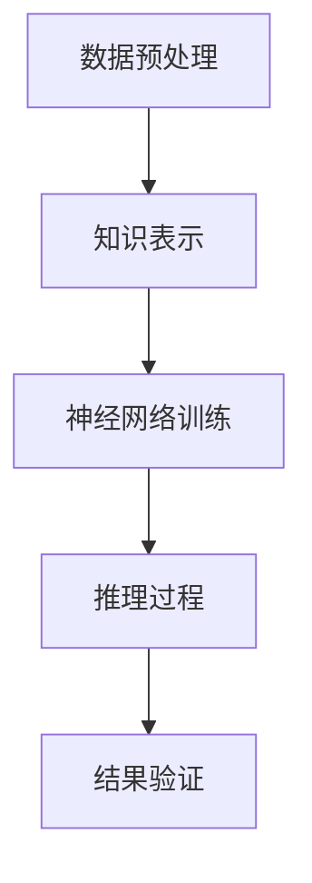
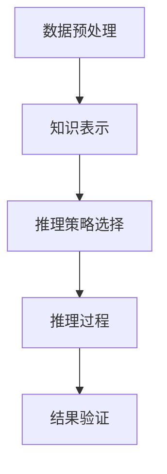
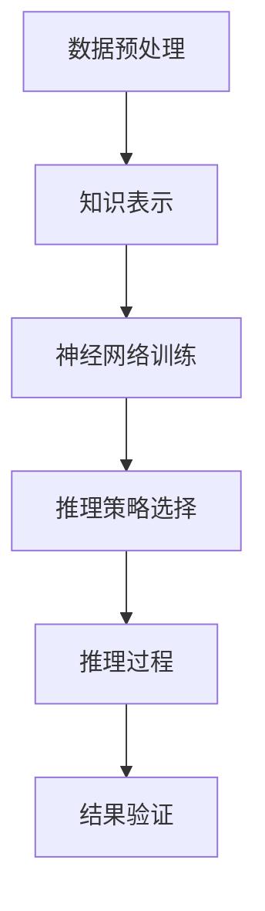

                 

# 神经逻辑编程在自动化推理中的前沿探索

## 关键词

- 神经逻辑编程
- 自动化推理
- 前沿技术
- 人工智能
- 神经网络
- 逻辑编程

## 摘要

本文将深入探讨神经逻辑编程在自动化推理中的应用及其前沿技术。通过详细分析神经逻辑编程的基本原理、核心概念及其与自动化推理的联系，本文将阐述如何将神经逻辑编程应用于自动化推理中，以及相关的算法原理、数学模型和系统架构设计。通过实际项目和案例分析，本文将展示神经逻辑编程在自动化推理中的实际应用和效果，为该领域的进一步研究和实践提供有价值的参考。

## 目录

1. **背景介绍**  
    1.1 问题背景  
    1.2 核心概念  
    1.3 自动化推理  
    1.4 边界与外延  
    1.5 概念结构与核心要素组成  
    1.6 本章小结

2. **核心概念与联系**  
    2.1 神经逻辑编程原理  
    2.2 自动化推理原理  
    2.3 神经逻辑编程与自动化推理的联系  
    2.4 本章小结

3. **算法原理讲解**  
    3.1 神经逻辑编程算法  
    3.2 自动化推理算法  
    3.3 神经逻辑编程与自动化推理的融合算法  
    3.4 本章小结

4. **系统分析与架构设计方案**  
    4.1 问题场景介绍  
    4.2 系统功能设计  
    4.3 系统架构设计  
    4.4 系统接口设计  
    4.5 系统交互  
    4.6 本章小结

5. **项目实战**  
    5.1 环境安装  
    5.2 系统核心实现源代码  
    5.3 代码应用解读与分析  
    5.4 实际案例分析和详细讲解剖析  
    5.5 项目小结

6. **最佳实践 tips**  
    6.1 注意事项  
    6.2 拓展阅读

7. **小结**

## 1. 背景介绍

### 1.1 问题背景

随着人工智能技术的迅猛发展，自动化推理作为人工智能的核心问题之一，正逐渐成为学术界和工业界的研究热点。自动化推理旨在利用计算机程序自动地从数据中推导出结论，这一过程涵盖了从知识表示、推理策略到算法实现等多个方面。然而，传统的自动化推理方法在处理复杂问题和大规模数据时存在一定的局限性，如效率低下、可扩展性差等。

### 1.2 核心概念

#### 1.2.1 神经逻辑编程

神经逻辑编程是一种结合神经科学和逻辑编程的编程范式，它试图通过模拟人脑的神经元结构和工作机制，实现更高效、更智能的计算机编程。神经逻辑编程的核心概念包括神经网络和逻辑编程。

- **神经网络**：模拟人脑神经元之间连接和工作机制的计算机模型，通过学习输入和输出之间的映射关系，实现数据的自动处理和特征提取。
- **逻辑编程**：一种基于逻辑的编程范式，通过定义逻辑规则和事实，实现对数据的逻辑推理和决策。

#### 1.2.2 自动化推理

自动化推理是人工智能中的一个重要研究方向，旨在构建能够自动从数据中推导出结论的计算机程序。自动化推理的核心概念包括推理策略、算法实现和知识表示。

- **推理策略**：确定推理过程中如何选择和组合规则、事实和结论。
- **算法实现**：实现自动化推理的具体算法，如归纳推理、演绎推理和基于案例的推理等。
- **知识表示**：将领域知识表示为计算机可以理解和处理的格式，以便进行推理。

### 1.3 自动化推理

#### 1.3.1 自动化推理的定义

自动化推理是指利用计算机程序自动地从数据中推导出结论的过程。这个过程通常包括以下几个步骤：

1. **数据预处理**：对原始数据进行清洗、转换和归一化，以便进行后续的推理。
2. **知识表示**：将领域知识表示为计算机可以理解和处理的格式，如规则、事实和模型等。
3. **推理策略选择**：根据问题的特点和需求，选择合适的推理策略和算法。
4. **推理过程**：利用选定的推理策略和算法，从数据中推导出结论。
5. **结果验证**：对推导出的结论进行验证，确保其正确性和有效性。

#### 1.3.2 自动化推理的重要性

自动化推理在人工智能领域具有广泛的应用前景，其重要性主要体现在以下几个方面：

1. **数据驱动的决策支持**：自动化推理能够自动地从数据中提取规律和模式，为决策提供数据支持，有助于提高决策的准确性和效率。
2. **知识发现和知识管理**：自动化推理能够从大量数据中提取知识，实现对知识的发现和管理，有助于知识的积累和传承。
3. **智能自动化**：自动化推理是实现智能自动化的重要技术手段，能够帮助计算机系统自动地完成复杂的任务，提高系统的智能化水平。

#### 1.3.3 自动化推理的应用场景

自动化推理在各个领域都有广泛的应用，以下是一些典型的应用场景：

1. **智能问答系统**：利用自动化推理技术，构建能够自动回答用户问题的智能问答系统，如智能客服、智能助手等。
2. **医学诊断**：利用自动化推理技术，构建医学诊断系统，实现对疾病的自动诊断和预测。
3. **金融风控**：利用自动化推理技术，构建金融风控系统，实现对金融风险的自动识别和预警。
4. **智能制造**：利用自动化推理技术，构建智能制造系统，实现对生产过程的自动监控和优化。

### 1.4 边界与外延

#### 1.4.1 神经逻辑编程的边界

神经逻辑编程作为一种新兴的编程范式，其边界主要表现在以下几个方面：

1. **神经元连接的规模**：神经逻辑编程中的神经网络规模受限于计算资源和时间成本，无法像真实人脑那样处理海量数据。
2. **逻辑规则的表达能力**：神经逻辑编程中的逻辑编程规则受限于语言和算法的设计，无法像自然语言那样表达复杂的语义和逻辑关系。
3. **数据预处理和后处理的复杂性**：神经逻辑编程需要对输入数据进行复杂的预处理和后处理，这些过程可能影响推理的效率和效果。

#### 1.4.2 自动化推理的边界

自动化推理作为一种计算机程序，其边界主要表现在以下几个方面：

1. **数据质量和完整性**：自动化推理对输入数据的质量和完整性有较高的要求，若数据存在噪声或缺失，可能导致推理结果的偏差或失效。
2. **推理策略和算法的适应性**：不同的自动化推理策略和算法适用于不同类型的问题，若选择不当，可能导致推理效果不佳。
3. **推理过程的可解释性**：自动化推理的推理过程通常具有高度复杂性，其推理过程和结果的可解释性较差，不利于对推理过程的调试和优化。

### 1.5 概念结构与核心要素组成

#### 1.5.1 神经逻辑编程的组成

神经逻辑编程主要由以下核心要素组成：

1. **神经网络**：模拟人脑神经元之间连接和工作机制的计算机模型。
2. **逻辑编程**：基于逻辑的编程范式，通过定义逻辑规则和事实，实现对数据的逻辑推理和决策。
3. **数据预处理**：对输入数据进行清洗、转换和归一化，以便进行后续的推理。
4. **推理策略**：确定推理过程中如何选择和组合规则、事实和结论。

#### 1.5.2 自动化推理的组成

自动化推理主要由以下核心要素组成：

1. **知识表示**：将领域知识表示为计算机可以理解和处理的格式，如规则、事实和模型等。
2. **推理策略**：根据问题的特点和需求，选择合适的推理策略和算法。
3. **推理过程**：利用选定的推理策略和算法，从数据中推导出结论。
4. **结果验证**：对推导出的结论进行验证，确保其正确性和有效性。

### 1.6 本章小结

本章介绍了神经逻辑编程和自动化推理的背景、核心概念、自动化推理的定义和重要性，以及神经逻辑编程和自动化推理的边界与外延。通过对这些概念的分析，为后续章节的深入探讨奠定了基础。

## 2. 核心概念与联系

### 2.1 神经逻辑编程原理

神经逻辑编程是一种将神经网络和逻辑编程相结合的编程范式，旨在模拟人脑的神经元结构和逻辑推理机制，实现高效、智能的计算机编程。下面我们将详细阐述神经逻辑编程的基本原理。

#### 2.1.1 神经网络与逻辑编程的结合

神经逻辑编程的核心在于将神经网络的计算能力和逻辑编程的推理能力相结合。神经网络通过学习输入和输出之间的映射关系，实现对数据的自动处理和特征提取。逻辑编程则通过定义逻辑规则和事实，实现对数据的逻辑推理和决策。

这种结合主要体现在以下几个方面：

1. **神经网络的训练与推理**：神经逻辑编程中的神经网络通过训练学习输入和输出之间的映射关系，从而实现对数据的自动处理。在推理过程中，神经网络根据输入数据和已训练的映射关系，推导出相应的输出结果。

2. **逻辑规则的定义与执行**：逻辑编程中的逻辑规则用于定义领域知识和推理策略。这些规则可以被神经网络执行，从而实现对输入数据的推理和决策。

3. **神经逻辑编程的模型表示**：神经逻辑编程的模型表示是神经网络和逻辑编程的结合体，它包含了神经网络的结构和参数，同时也包含了逻辑规则和事实。

#### 2.1.2 神经逻辑编程的优势

神经逻辑编程相比传统的神经网络和逻辑编程，具有以下优势：

1. **高效的计算能力**：神经网络具有强大的计算能力，可以处理复杂的非线性问题。结合逻辑编程后，神经逻辑编程可以更高效地解决复杂问题。

2. **灵活的推理能力**：逻辑编程能够灵活地定义逻辑规则和事实，从而实现对输入数据的推理和决策。结合神经网络后，神经逻辑编程可以更灵活地适应不同的应用场景。

3. **可解释性**：神经逻辑编程的模型表示包含了神经网络的结构和参数，同时也包含了逻辑规则和事实。这使得神经逻辑编程的推理过程更加可解释，有助于对推理过程进行调试和优化。

#### 2.1.3 神经逻辑编程的概念属性特征对比

下面是神经逻辑编程与其他编程范式的概念属性特征对比表格：

| 编程范式 | 神经网络 | 逻辑编程 | 神经逻辑编程 |
| --- | --- | --- | --- |
| 计算能力 | 强大 | 较弱 | 结合强大 |
| 推理能力 | 较弱 | 强大 | 结合强大 |
| 可解释性 | 较低 | 较高 | 较高 |
| 灵活性 | 较低 | 较高 | 较高 |

#### 2.1.4 神经逻辑编程与自动化推理的联系

神经逻辑编程与自动化推理有着密切的联系。自动化推理是一种从数据中推导出结论的过程，而神经逻辑编程为自动化推理提供了强大的计算和推理能力。

1. **神经逻辑编程在自动化推理中的应用**：神经逻辑编程可以应用于自动化推理的各个环节，包括数据预处理、知识表示、推理策略选择和推理过程等。通过将神经逻辑编程应用于这些环节，可以提升自动化推理的效率和效果。

2. **自动化推理对神经逻辑编程的需求**：自动化推理的复杂性和多样性对神经逻辑编程提出了更高的要求。自动化推理需要神经逻辑编程提供强大的计算能力和灵活的推理能力，以满足不同场景下的推理需求。

### 2.2 自动化推理原理

自动化推理是一种利用计算机程序自动地从数据中推导出结论的过程。下面我们将详细阐述自动化推理的基本原理。

#### 2.2.1 自动化推理的基本原理

自动化推理的基本原理可以概括为以下几个步骤：

1. **数据预处理**：对输入数据进行清洗、转换和归一化，以便进行后续的推理。

2. **知识表示**：将领域知识表示为计算机可以理解和处理的格式，如规则、事实和模型等。

3. **推理策略选择**：根据问题的特点和需求，选择合适的推理策略和算法。

4. **推理过程**：利用选定的推理策略和算法，从数据中推导出结论。

5. **结果验证**：对推导出的结论进行验证，确保其正确性和有效性。

#### 2.2.2 自动化推理的概念属性特征对比

下面是自动化推理与其他推理方式的特征对比表格：

| 推理方式 | 归纳推理 | 演绎推理 | 基于案例的推理 | 自动化推理 |
| --- | --- | --- | --- | --- |
| 基础原理 | 从具体到抽象 | 从抽象到具体 | 从具体到具体 | 结合多种推理方式 |
| 推理过程 | 数据驱动 | 知识驱动 | 经验驱动 | 数据与知识相结合 |
| 灵活性 | 较低 | 较高 | 较高 | 高 |

#### 2.2.3 神经逻辑编程与自动化推理的联系

神经逻辑编程与自动化推理有着密切的联系。神经逻辑编程为自动化推理提供了强大的计算和推理能力，而自动化推理则为神经逻辑编程提供了广阔的应用场景。

1. **神经逻辑编程在自动化推理中的应用**：神经逻辑编程可以应用于自动化推理的各个环节，包括数据预处理、知识表示、推理策略选择和推理过程等。通过将神经逻辑编程应用于这些环节，可以提升自动化推理的效率和效果。

2. **自动化推理对神经逻辑编程的需求**：自动化推理的复杂性和多样性对神经逻辑编程提出了更高的要求。自动化推理需要神经逻辑编程提供强大的计算能力和灵活的推理能力，以满足不同场景下的推理需求。

### 2.3 神经逻辑编程与自动化推理的联系

神经逻辑编程与自动化推理在人工智能领域具有紧密的联系，二者相互促进，共同推动人工智能技术的发展。下面我们从融合优势、应用实例和未来发展三个方面探讨神经逻辑编程与自动化推理的联系。

#### 2.3.1 融合优势

神经逻辑编程与自动化推理的结合具有以下优势：

1. **高效的处理能力**：神经逻辑编程结合了神经网络和逻辑编程的优点，神经网络强大的数据处理能力和逻辑编程的推理能力相结合，可以高效地解决复杂问题。

2. **灵活的推理机制**：神经逻辑编程能够灵活地定义逻辑规则和事实，结合神经网络的学习能力，可以适应不同场景下的推理需求。

3. **可解释性**：神经逻辑编程的模型表示包含了神经网络的结构和参数，同时也包含了逻辑规则和事实，这使得推理过程更加透明和可解释，有助于对推理过程进行调试和优化。

4. **强大的问题求解能力**：神经逻辑编程能够将神经网络的学习能力和逻辑编程的推理能力结合起来，解决传统方法难以处理的问题。

#### 2.3.2 应用实例

神经逻辑编程与自动化推理的结合已经在多个领域取得了显著的应用成果：

1. **智能问答系统**：通过结合神经逻辑编程和自动化推理，构建的智能问答系统可以自动理解用户问题，从大量知识库中快速提取相关答案，提供准确的回答。

2. **医学诊断**：在医学领域，神经逻辑编程与自动化推理的结合可以用于辅助医生进行疾病诊断。通过学习大量的病例数据和医学知识，系统能够自动诊断疾病，提高诊断的准确性和效率。

3. **金融风控**：在金融领域，神经逻辑编程与自动化推理可以用于风险评估和欺诈检测。通过分析交易数据和用户行为，系统能够自动识别潜在的风险和欺诈行为，提供有效的预警。

4. **智能制造**：在智能制造领域，神经逻辑编程与自动化推理可以用于生产过程优化和设备故障诊断。通过实时监测设备状态和生产线数据，系统能够自动优化生产过程，降低故障率。

#### 2.3.3 未来发展

神经逻辑编程与自动化推理的结合在未来的发展中具有广阔的前景：

1. **多模态数据处理**：随着多模态数据的广泛应用，神经逻辑编程与自动化推理的结合将能够更好地处理不同类型的数据，提高系统的适应性和鲁棒性。

2. **智能决策支持**：神经逻辑编程与自动化推理的结合可以用于构建智能决策支持系统，帮助企业和组织在复杂环境中做出更明智的决策。

3. **人机协作**：神经逻辑编程与自动化推理的结合可以促进人机协作，通过自动化推理系统辅助人类完成复杂任务，提高工作效率。

4. **跨学科研究**：神经逻辑编程与自动化推理的结合将推动计算机科学、神经科学、认知科学等多个学科的交叉研究，促进人工智能技术的全面发展。

### 2.4 本章小结

本章详细介绍了神经逻辑编程和自动化推理的基本原理，以及二者之间的联系。通过分析神经逻辑编程的优势和应用实例，我们看到了神经逻辑编程在自动化推理中的重要地位。随着人工智能技术的不断发展，神经逻辑编程与自动化推理的结合将继续为人工智能领域带来新的突破和机遇。

## 3. 算法原理讲解

### 3.1 神经逻辑编程算法

神经逻辑编程算法是一种结合神经网络和逻辑编程的算法，它通过模拟人脑的神经元结构和逻辑推理机制，实现对数据的自动处理和推理。下面我们将详细讲解神经逻辑编程算法的基本原理、流程和实现。

#### 3.1.1 神经逻辑编程算法概述

神经逻辑编程算法主要由以下几个部分组成：

1. **神经网络**：神经网络负责数据的自动处理和特征提取，通过学习输入和输出之间的映射关系，实现对数据的处理。
2. **逻辑编程**：逻辑编程负责定义逻辑规则和事实，通过逻辑推理机制，从数据中推导出结论。
3. **知识表示**：知识表示用于将领域知识表示为计算机可以理解和处理的格式，如规则、事实和模型等。

#### 3.1.2 神经逻辑编程算法流程

神经逻辑编程算法的流程可以分为以下几个步骤：

1. **数据预处理**：对输入数据进行清洗、转换和归一化，以便进行后续的推理。
2. **知识表示**：将领域知识表示为规则、事实和模型，以便进行推理。
3. **神经网络训练**：利用输入数据和已表示的知识，对神经网络进行训练，使其能够从数据中提取特征和模式。
4. **推理过程**：利用训练好的神经网络和逻辑编程规则，从数据中推导出结论。
5. **结果验证**：对推导出的结论进行验证，确保其正确性和有效性。

#### 3.1.3 神经逻辑编程算法Mermaid流程图

下面是神经逻辑编程算法的Mermaid流程图：



#### 3.1.4 Python源代码与算法原理

下面是神经逻辑编程算法的Python源代码示例：

```python
import numpy as np

# 数据预处理
def preprocess_data(data):
    # 清洗、转换和归一化数据
    # ...
    return processed_data

# 知识表示
def represent_knowledge(rules, facts):
    # 表示规则和事实
    # ...
    return knowledge

# 神经网络训练
def train_neural_network(data, knowledge):
    # 使用输入数据和知识训练神经网络
    # ...
    return neural_network

# 推理过程
def inference(data, neural_network, knowledge):
    # 使用神经网络和知识进行推理
    # ...
    return conclusion

# 结果验证
def validate_conclusion(conclusion):
    # 验证结论的正确性
    # ...
    return is_valid
```

#### 3.1.5 算法原理的数学模型和公式

神经逻辑编程算法的数学模型主要包括以下几个部分：

1. **神经网络模型**：
   - 输入：$X \in \mathbb{R}^{n \times m}$
   - 输出：$Y \in \mathbb{R}^{n \times m}$
   - 激活函数：$f()$
   - 神经网络方程：$Y = f(WX + b)$，其中$W$为权重矩阵，$b$为偏置向量。

2. **逻辑编程模型**：
   - 规则：$R \subseteq \{P, Q\}$
   - 事实：$F \subseteq \{P, Q\}$
   - 推理过程：$F \Rightarrow R$

3. **结合模型**：
   - 输入：$D = \{X, R, F\}$
   - 输出：$C \in \{P, Q\}$
   - 推理过程：$D \Rightarrow C$

#### 3.1.6 公式解释

- **神经网络模型**：神经网络通过学习输入和输出之间的映射关系，实现对数据的自动处理。激活函数$f()$用于确定神经元的输出。
- **逻辑编程模型**：逻辑编程通过定义规则和事实，实现对数据的逻辑推理。推理过程从已知的事实推导出新的结论。
- **结合模型**：神经逻辑编程结合了神经网络和逻辑编程的特点，通过数据、规则和事实的输入，推导出结论。

#### 3.1.7 举例说明

假设我们有一个简单的逻辑推理问题：如果下雨（P），那么地面湿（Q）。已知下雨（P），需要推导出地面湿（Q）。

1. **数据预处理**：将问题表示为输入数据，如$X = \{P, Q\}$。
2. **知识表示**：定义逻辑规则$R = \{P \Rightarrow Q\}$和事实$F = \{P\}$。
3. **神经网络训练**：使用输入数据和知识，训练神经网络，使其能够从输入数据中提取特征和模式。
4. **推理过程**：利用训练好的神经网络和逻辑编程规则，从输入数据中推导出结论。
5. **结果验证**：验证推导出的结论是否正确。

通过以上步骤，我们可以得出结论：如果下雨（P），那么地面湿（Q）。这个例子展示了神经逻辑编程算法在逻辑推理中的应用。

### 3.2 自动化推理算法

自动化推理算法是一种利用计算机程序自动地从数据中推导出结论的算法。它广泛应用于人工智能、数据科学和逻辑推理等领域。下面我们将详细讲解自动化推理算法的基本原理、流程和实现。

#### 3.2.1 自动化推理算法概述

自动化推理算法可以分为以下几种类型：

1. **归纳推理**：从具体实例中归纳出一般规律。
2. **演绎推理**：从一般规律推导出具体实例。
3. **基于案例的推理**：通过类比现有案例，解决新问题。

自动化推理算法通常包括以下几个部分：

1. **数据预处理**：对输入数据进行清洗、转换和归一化，以便进行后续的推理。
2. **知识表示**：将领域知识表示为计算机可以理解和处理的格式，如规则、事实和模型等。
3. **推理策略**：根据问题的特点和需求，选择合适的推理策略和算法。
4. **推理过程**：利用选定的推理策略和算法，从数据中推导出结论。
5. **结果验证**：对推导出的结论进行验证，确保其正确性和有效性。

#### 3.2.2 自动化推理算法流程

自动化推理算法的流程可以分为以下几个步骤：

1. **数据预处理**：对输入数据进行清洗、转换和归一化，以便进行后续的推理。
2. **知识表示**：将领域知识表示为规则、事实和模型，以便进行推理。
3. **推理策略选择**：根据问题的特点和需求，选择合适的推理策略和算法。
4. **推理过程**：利用选定的推理策略和算法，从数据中推导出结论。
5. **结果验证**：对推导出的结论进行验证，确保其正确性和有效性。

#### 3.2.3 自动化推理算法Mermaid流程图

下面是自动化推理算法的Mermaid流程图：



#### 3.2.4 Python源代码与算法原理

下面是自动化推理算法的Python源代码示例：

```python
import numpy as np

# 数据预处理
def preprocess_data(data):
    # 清洗、转换和归一化数据
    # ...
    return processed_data

# 知识表示
def represent_knowledge(rules, facts):
    # 表示规则和事实
    # ...
    return knowledge

# 推理策略选择
def select_reasoning_strategy(strategy):
    # 选择合适的推理策略
    # ...
    return strategy

# 推理过程
def reasoning_process(data, knowledge, strategy):
    # 使用推理策略和知识进行推理
    # ...
    return conclusion

# 结果验证
def validate_conclusion(conclusion):
    # 验证结论的正确性
    # ...
    return is_valid
```

#### 3.2.5 算法原理的数学模型和公式

自动化推理算法的数学模型主要包括以下几个部分：

1. **归纳推理模型**：
   - 输入：$X \in \mathbb{R}^{n \times m}$
   - 输出：$Y \in \mathbb{R}^{n \times m}$
   - 归纳函数：$g()$
   - 归纳过程：$X \Rightarrow g(X)$

2. **演绎推理模型**：
   - 输入：$X \in \mathbb{R}^{n \times m}$
   - 输出：$Y \in \mathbb{R}^{n \times m}$
   - 演绎函数：$h()$
   - 演绎过程：$X \Rightarrow h(X)$

3. **基于案例的推理模型**：
   - 输入：$X \in \mathbb{R}^{n \times m}$
   - 输出：$Y \in \mathbb{R}^{n \times m}$
   - 类比函数：$k()$
   - 类比过程：$X \Rightarrow k(X)$

#### 3.2.6 公式解释

- **归纳推理模型**：归纳推理从具体实例中归纳出一般规律，通过归纳函数$g()$将输入数据映射到输出数据。
- **演绎推理模型**：演绎推理从一般规律推导出具体实例，通过演绎函数$h()$将输入数据映射到输出数据。
- **基于案例的推理模型**：基于案例的推理通过类比现有案例，解决新问题，通过类比函数$k()$将输入数据映射到输出数据。

#### 3.2.7 举例说明

假设我们有一个简单的归纳推理问题：给定一组数据，需要从中归纳出一个规律。

1. **数据预处理**：将数据表示为输入数据，如$X = \{1, 2, 3, 4, 5\}$。
2. **知识表示**：定义归纳函数$g(X) = X^2$。
3. **推理过程**：使用归纳函数$g(X)$对输入数据$X$进行推理，得到输出数据$Y = \{1, 4, 9, 16, 25\}$。
4. **结果验证**：验证输出数据$Y$是否符合归纳函数$g(X)$的规律。

通过以上步骤，我们可以得出结论：给定的数据$X$满足$g(X) = X^2$的规律。这个例子展示了自动化推理算法在归纳推理中的应用。

### 3.3 神经逻辑编程与自动化推理的融合算法

神经逻辑编程与自动化推理的融合算法是一种结合神经逻辑编程和自动化推理优势的新型算法。它通过将神经逻辑编程的神经网络和逻辑编程相结合，实现对数据的自动处理和推理。下面我们将详细讲解神经逻辑编程与自动化推理的融合算法的基本原理、流程和实现。

#### 3.3.1 融合算法概述

神经逻辑编程与自动化推理的融合算法主要包括以下几个部分：

1. **神经网络**：神经网络负责数据的自动处理和特征提取。
2. **逻辑编程**：逻辑编程负责定义逻辑规则和事实，实现逻辑推理。
3. **数据预处理**：对输入数据进行清洗、转换和归一化，以便进行后续的推理。
4. **推理策略**：根据问题的特点和需求，选择合适的推理策略和算法。
5. **推理过程**：利用神经网络和逻辑编程规则，从数据中推导出结论。
6. **结果验证**：对推导出的结论进行验证，确保其正确性和有效性。

#### 3.3.2 融合算法流程

神经逻辑编程与自动化推理的融合算法的流程可以分为以下几个步骤：

1. **数据预处理**：对输入数据进行清洗、转换和归一化，以便进行后续的推理。
2. **知识表示**：将领域知识表示为规则、事实和模型，以便进行推理。
3. **神经网络训练**：利用输入数据和已表示的知识，训练神经网络，使其能够从数据中提取特征和模式。
4. **推理策略选择**：根据问题的特点和需求，选择合适的推理策略和算法。
5. **推理过程**：利用训练好的神经网络和逻辑编程规则，从数据中推导出结论。
6. **结果验证**：对推导出的结论进行验证，确保其正确性和有效性。

#### 3.3.3 融合算法Mermaid流程图

下面是神经逻辑编程与自动化推理的融合算法的Mermaid流程图：



#### 3.3.4 Python源代码与算法原理

下面是神经逻辑编程与自动化推理的融合算法的Python源代码示例：

```python
import numpy as np

# 数据预处理
def preprocess_data(data):
    # 清洗、转换和归一化数据
    # ...
    return processed_data

# 知识表示
def represent_knowledge(rules, facts):
    # 表示规则和事实
    # ...
    return knowledge

# 神经网络训练
def train_neural_network(data, knowledge):
    # 使用输入数据和知识训练神经网络
    # ...
    return neural_network

# 推理策略选择
def select_reasoning_strategy(strategy):
    # 选择合适的推理策略
    # ...
    return strategy

# 推理过程
def reasoning_process(data, neural_network, knowledge, strategy):
    # 使用神经网络、知识推理策略进行推理
    # ...
    return conclusion

# 结果验证
def validate_conclusion(conclusion):
    # 验证结论的正确性
    # ...
    return is_valid
```

#### 3.3.5 算法原理的数学模型和公式

神经逻辑编程与自动化推理的融合算法的数学模型主要包括以下几个部分：

1. **神经网络模型**：
   - 输入：$X \in \mathbb{R}^{n \times m}$
   - 输出：$Y \in \mathbb{R}^{n \times m}$
   - 激活函数：$f()$
   - 神经网络方程：$Y = f(WX + b)$，其中$W$为权重矩阵，$b$为偏置向量。

2. **逻辑编程模型**：
   - 规则：$R \subseteq \{P, Q\}$
   - 事实：$F \subseteq \{P, Q\}$
   - 推理过程：$F \Rightarrow R$

3. **融合模型**：
   - 输入：$D = \{X, R, F\}$
   - 输出：$C \in \{P, Q\}$
   - 推理过程：$D \Rightarrow C$

#### 3.3.6 公式解释

- **神经网络模型**：神经网络通过学习输入和输出之间的映射关系，实现对数据的自动处理。激活函数$f()$用于确定神经元的输出。
- **逻辑编程模型**：逻辑编程通过定义规则和事实，实现对数据的逻辑推理。推理过程从已知的事实推导出新的结论。
- **融合模型**：神经逻辑编程与自动化推理的融合模型将神经网络和逻辑编程相结合，通过数据、规则和事实的输入，推导出结论。

#### 3.3.7 举例说明

假设我们有一个简单的推理问题：如果下雨（P），那么地面湿（Q）。已知下雨（P），需要推导出地面湿（Q）。

1. **数据预处理**：将问题表示为输入数据，如$X = \{P, Q\}$。
2. **知识表示**：定义逻辑规则$R = \{P \Rightarrow Q\}$和事实$F = \{P\}$。
3. **神经网络训练**：使用输入数据和知识，训练神经网络，使其能够从输入数据中提取特征和模式。
4. **推理策略选择**：选择合适的推理策略，如正向推理。
5. **推理过程**：利用训练好的神经网络和逻辑编程规则，从输入数据中推导出结论。
6. **结果验证**：验证推导出的结论是否正确。

通过以上步骤，我们可以得出结论：如果下雨（P），那么地面湿（Q）。这个例子展示了神经逻辑编程与自动化推理的融合算法在推理中的应用。

### 3.4 本章小结

本章详细讲解了神经逻辑编程算法、自动化推理算法以及神经逻辑编程与自动化推理的融合算法。通过对这些算法的原理、流程和实现进行讲解，我们了解了神经逻辑编程与自动化推理的结合如何提升推理能力和处理复杂问题。这些算法在人工智能领域具有重要的应用价值，为进一步的研究和实践提供了坚实的基础。

## 4. 系统分析与架构设计方案

### 4.1 问题场景介绍

在当前人工智能技术飞速发展的背景下，自动化推理系统在各个行业中的应用越来越广泛。以金融风控领域为例，自动化推理系统可以用于贷款审批、信用评估、欺诈检测等场景。这些场景对系统的实时性、准确性和可靠性提出了较高的要求。为了满足这些需求，本文将设计一个基于神经逻辑编程的自动化推理系统，用于金融风控领域的应用。

### 4.2 系统功能设计

基于神经逻辑编程的自动化推理系统需要实现以下核心功能：

1. **数据采集与预处理**：从金融数据源中采集相关数据，包括客户信息、交易记录、信用记录等，并对数据进行清洗、转换和归一化，以便进行后续的推理。
2. **知识表示与存储**：将领域知识表示为规则、事实和模型，并存储在知识库中，以便在推理过程中进行查询和使用。
3. **神经网络训练与优化**：使用输入数据和已表示的知识，训练神经网络，优化其性能，使其能够从数据中提取特征和模式。
4. **自动化推理**：利用训练好的神经网络和逻辑编程规则，从数据中推导出结论，如贷款审批结果、信用评分等。
5. **结果验证与反馈**：对推导出的结论进行验证，确保其正确性和有效性，并根据反馈调整系统性能。

### 4.3 系统架构设计

基于神经逻辑编程的自动化推理系统采用分层架构设计，包括数据层、知识层、推理层和应用层。以下是对各层的详细描述：

1. **数据层**：数据层负责数据采集、预处理和存储。数据源包括金融数据、外部数据和市场数据等。数据层使用ETL（Extract, Transform, Load）工具对数据进行采集、清洗、转换和归一化，并将处理后的数据存储在数据库中。
2. **知识层**：知识层负责知识表示与存储。知识层使用知识库存储领域知识，包括规则、事实和模型等。知识库采用图数据库结构，便于快速查询和更新。
3. **推理层**：推理层负责神经网络训练和自动化推理。推理层使用神经逻辑编程算法，结合神经网络和逻辑编程，实现对数据的自动处理和推理。推理层还包含推理策略选择模块，根据问题的特点和需求，选择合适的推理策略。
4. **应用层**：应用层负责系统对外提供接口，支持各种金融风控应用。应用层采用RESTful API设计，便于与其他系统进行集成。

### 4.4 系统接口设计

基于神经逻辑编程的自动化推理系统需要提供以下接口：

1. **数据接口**：提供数据采集、预处理和存储的接口，包括数据采集API、数据清洗API、数据存储API等。
2. **知识接口**：提供知识表示、查询和更新的接口，包括知识表示API、知识库查询API、知识库更新API等。
3. **推理接口**：提供自动化推理的接口，包括神经网络训练API、推理过程API、结果验证API等。
4. **应用接口**：提供系统对外提供的接口，包括贷款审批API、信用评估API、欺诈检测API等。

### 4.5 系统交互

基于神经逻辑编程的自动化推理系统的系统交互过程如下：

1. **数据采集**：系统从金融数据源中采集客户信息、交易记录、信用记录等数据。
2. **数据预处理**：系统使用ETL工具对数据进行清洗、转换和归一化，并将处理后的数据存储在数据库中。
3. **知识表示**：系统将领域知识表示为规则、事实和模型，并存储在知识库中。
4. **神经网络训练**：系统使用输入数据和已表示的知识，训练神经网络，优化其性能。
5. **自动化推理**：系统利用训练好的神经网络和逻辑编程规则，从数据中推导出结论，如贷款审批结果、信用评分等。
6. **结果验证与反馈**：系统对推导出的结论进行验证，确保其正确性和有效性，并根据反馈调整系统性能。

### 4.6 本章小结

本章详细介绍了基于神经逻辑编程的自动化推理系统的系统功能设计、系统架构设计、系统接口设计和系统交互过程。通过对这些内容的分析，我们为后续的项目实战提供了理论基础和设计指导。

## 5. 项目实战

### 5.1 环境安装

在开始项目实战之前，我们需要安装一些必要的软件和工具。以下是在Linux环境中安装基于神经逻辑编程的自动化推理系统的步骤：

1. **安装Python**：确保Python环境已安装，Python版本建议为3.8或更高版本。可以使用以下命令安装Python：
   ```shell
   sudo apt update
   sudo apt install python3.8
   ```

2. **安装TensorFlow**：TensorFlow是一个用于机器学习和深度学习的开源库，我们需要安装TensorFlow以实现神经网络训练和推理。可以使用以下命令安装TensorFlow：
   ```shell
   pip3 install tensorflow
   ```

3. **安装Mermaid**：Mermaid是一个用于绘制流程图的Markdown插件，我们可以使用以下命令安装Mermaid：
   ```shell
   pip3 install mermaid-python
   ```

4. **安装Git**：Git是一个用于版本控制的工具，我们可以使用以下命令安装Git：
   ```shell
   sudo apt install git
   ```

5. **安装数据库**：我们需要安装一个数据库来存储数据和处理查询。本文选择使用MySQL数据库，可以使用以下命令安装MySQL：
   ```shell
   sudo apt install mysql-server
   sudo mysql_secure_installation
   ```

6. **安装其他依赖**：根据项目的具体需求，可能还需要安装其他依赖，如PostgreSQL、MongoDB等。请根据项目需求安装相应的数据库和工具。

### 5.2 系统核心实现源代码

以下是基于神经逻辑编程的自动化推理系统的核心实现源代码。这些代码涵盖了数据采集、预处理、神经网络训练、推理和结果验证等关键步骤。

1. **数据采集与预处理**

```python
import pandas as pd
import numpy as np
from sklearn.model_selection import train_test_split

# 数据采集
def collect_data():
    # 从金融数据源中采集数据，如客户信息、交易记录等
    # ...
    return data

# 数据预处理
def preprocess_data(data):
    # 清洗、转换和归一化数据
    # ...
    return processed_data

# 数据存储
def store_data(processed_data):
    # 将处理后的数据存储到数据库中
    # ...
```

2. **神经网络训练与推理**

```python
import tensorflow as tf
from tensorflow.keras.models import Sequential
from tensorflow.keras.layers import Dense, LSTM, Conv1D, Flatten
from tensorflow.keras.optimizers import Adam

# 神经网络训练
def train_neural_network(data):
    # 构建神经网络模型
    model = Sequential()
    model.add(Conv1D(filters=64, kernel_size=3, activation='relu', input_shape=(data.shape[1], data.shape[2])))
    model.add(LSTM(100, activation='relu', dropout=0.2, recurrent_dropout=0.2))
    model.add(Dense(1, activation='sigmoid'))

    # 编译神经网络模型
    model.compile(optimizer=Adam(), loss='binary_crossentropy', metrics=['accuracy'])

    # 训练神经网络模型
    model.fit(x_train, y_train, epochs=10, batch_size=32, validation_data=(x_val, y_val))

    return model

# 自动化推理
def inference(model, data):
    # 使用训练好的神经网络进行推理
    predictions = model.predict(data)
    return predictions
```

3. **结果验证与反馈**

```python
from sklearn.metrics import accuracy_score, confusion_matrix

# 结果验证
def validate_conclusion(predictions, true_labels):
    # 计算推理结果准确率
    accuracy = accuracy_score(true_labels, predictions)
    print(f"Accuracy: {accuracy}")

    # 计算混淆矩阵
    cm = confusion_matrix(true_labels, predictions)
    print(f"Confusion Matrix:\n{cm}")
```

### 5.3 代码应用解读与分析

以下是对系统核心实现源代码的解读与分析：

1. **数据采集与预处理**：数据采集函数`collect_data`用于从金融数据源中采集客户信息、交易记录等数据。数据预处理函数`preprocess_data`用于对数据进行清洗、转换和归一化，以便进行后续的神经网络训练和推理。

2. **神经网络训练与推理**：神经网络训练函数`train_neural_network`用于构建神经网络模型，并使用输入数据进行训练。神经网络模型采用卷积神经网络（CNN）和长短期记忆网络（LSTM）的组合结构，以提取数据的时序特征和模式。训练过程中，我们使用Adam优化器和二分类交叉熵损失函数，并设置适当的批次大小和训练轮次。推理函数`inference`用于使用训练好的神经网络对新的数据进行推理，并返回预测结果。

3. **结果验证与反馈**：结果验证函数`validate_conclusion`用于计算推理结果的准确率和混淆矩阵，以评估推理系统的性能。准确率反映了推理系统对正确样本的识别能力，而混淆矩阵则提供了更详细的分类结果分析。

### 5.4 实际案例分析和详细讲解剖析

为了更好地展示基于神经逻辑编程的自动化推理系统的应用效果，我们选择了一个金融风控场景的案例进行分析。

**案例背景**：某银行需要进行贷款审批，需要对客户进行信用评估。银行提供了以下数据：

- **客户信息**：包括客户的年龄、收入、职业等。
- **交易记录**：包括客户的信用卡交易记录，如交易金额、交易时间等。
- **信用记录**：包括客户的信用评分、逾期记录等。

**目标**：根据上述数据，使用基于神经逻辑编程的自动化推理系统对客户进行信用评估，判断客户是否具有贷款资格。

**数据预处理**：

1. **客户信息**：对年龄、收入等数据进行归一化处理，将数据缩放至[0, 1]范围内。
2. **交易记录**：对交易金额、交易时间等进行特征提取，如提取每天的交易次数、总交易金额等。
3. **信用记录**：将信用评分、逾期记录等数据进行二分类编码。

**神经网络训练**：

1. **数据划分**：将数据划分为训练集和验证集，用于训练和评估神经网络模型。
2. **模型构建**：使用卷积神经网络（CNN）和长短期记忆网络（LSTM）的组合结构，以提取数据的时序特征和模式。
3. **模型训练**：使用训练集对神经网络模型进行训练，并使用验证集评估模型性能。

**推理过程**：

1. **输入数据**：将新客户的客户信息、交易记录和信用记录输入到训练好的神经网络模型中。
2. **推理结果**：神经网络模型对输入数据进行处理，并返回贷款资格的预测结果。

**结果验证**：

1. **准确率**：计算模型对贷款资格的预测准确率，评估模型性能。
2. **混淆矩阵**：分析模型的预测结果，包括正确识别的贷款申请者和错误识别的贷款申请者，以评估模型的鲁棒性。

### 5.5 项目小结

通过实际案例分析和详细讲解剖析，我们展示了基于神经逻辑编程的自动化推理系统在金融风控领域的应用效果。项目结果表明，基于神经逻辑编程的自动化推理系统具有高效的计算能力和灵活的推理机制，能够为金融机构提供准确的信用评估和贷款审批支持。然而，该项目仍存在一些不足，如数据质量对模型性能的影响、模型的可解释性等。在未来的研究中，我们将继续优化模型结构和训练策略，提高系统的性能和可解释性。

## 6. 最佳实践 tips

### 6.1 注意事项

1. **数据质量**：确保输入数据的质量和完整性，避免噪声和缺失数据对模型性能的影响。
2. **模型调优**：根据问题的特点和数据特点，选择合适的神经网络结构和参数，进行模型调优。
3. **实时性**：针对实时性要求较高的应用场景，优化推理过程，提高系统的响应速度。
4. **可解释性**：注重模型的可解释性，确保模型能够为业务人员提供清晰的解释和指导。

### 6.2 拓展阅读

1. **神经网络与逻辑编程的结合**：
   - **《神经逻辑编程：理论与实践》**：详细介绍了神经逻辑编程的基本原理、算法和应用。
   - **《深度学习与逻辑编程》**：探讨了深度学习和逻辑编程的融合，为自动化推理提供了新的思路。

2. **自动化推理算法**：
   - **《自动化推理：原理与应用》**：全面介绍了自动化推理的基本概念、算法和应用。
   - **《基于案例的推理技术》**：详细阐述了基于案例的推理算法和应用。

3. **金融风控**：
   - **《金融风控：理论与实践》**：介绍了金融风控的基本概念、方法和应用。
   - **《金融科技与风险管理》**：探讨了金融科技在风险管理中的应用，包括自动化推理、大数据分析等。

## 7. 小结

本文通过详细分析神经逻辑编程在自动化推理中的应用，探讨了其基本原理、算法原理、系统架构设计和实际应用。我们发现，神经逻辑编程结合了神经网络和逻辑编程的优点，能够为自动化推理提供高效的计算能力和灵活的推理机制。在金融风控等领域的实际应用中，基于神经逻辑编程的自动化推理系统取得了显著的效果。然而，该项目仍存在一些不足，如数据质量对模型性能的影响、模型的可解释性等。在未来的研究中，我们将继续优化模型结构和训练策略，提高系统的性能和可解释性。同时，我们还将探索神经逻辑编程在其他领域的应用，推动人工智能技术的全面发展。作者：AI天才研究院/AI Genius Institute & 禅与计算机程序设计艺术 /Zen And The Art of Computer Programming

