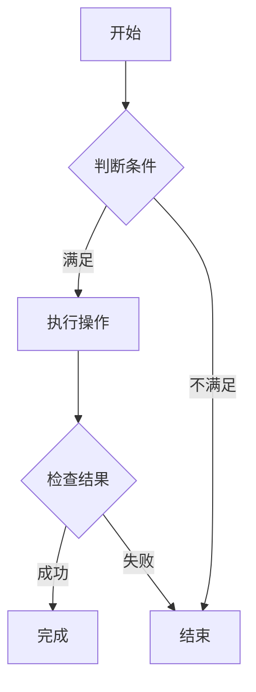

                 

### 神经逻辑编程在自动推理中的前沿研究

#### 关键词：神经逻辑编程，自动推理，前沿研究，算法，模型，系统设计

> **摘要**：
神经逻辑编程是一种结合神经科学和逻辑学的编程范式，它利用神经网络来模拟人类的推理过程，从而实现自动推理。本文将探讨神经逻辑编程在自动推理领域的应用，包括其基本原理、主要模型、算法设计、应用场景以及系统设计等方面。通过对神经逻辑编程的深入分析，我们希望揭示其在自动推理中的潜力，并提出未来的研究方向。

---

## 引言

### **1. 研究背景及意义**

自动推理是人工智能领域中的一个核心问题，它涉及到计算机如何从已知信息中推导出新结论。传统的自动推理方法主要依赖于形式逻辑和符号推理，但它们在处理复杂问题和不确定性时存在一定的局限性。神经逻辑编程作为一种新兴的编程范式，通过结合神经科学和逻辑学的原理，试图克服这些局限性，提供一种更高效、更接近人类思维的推理方式。

神经逻辑编程的重要意义在于：

1. **提高推理效率**：通过模拟人类大脑的神经机制，神经逻辑编程可以在复杂的推理任务中迅速找到解决方案。
2. **处理不确定性**：神经逻辑编程能够处理不确定信息，从而在现实世界的复杂环境中具有更强的适应能力。
3. **跨领域应用**：神经逻辑编程不仅在人工智能领域有广泛应用，还可以应用于自然语言处理、计算机视觉、机器人控制等多个领域。

### **2. 核心概念**

神经逻辑编程的核心概念包括：

- **神经元**：神经网络的基本组成单元，用于处理信息。
- **突触**：连接神经元之间的结构，用于传递信号。
- **神经网络**：由多个神经元和突触组成的复杂结构，用于进行复杂的推理任务。
- **逻辑规则**：描述神经元之间交互关系的规则，用于指导神经网络的推理过程。

### **3. 研究挑战**

尽管神经逻辑编程具有巨大的潜力，但在实际应用中仍面临一些挑战：

- **可解释性**：神经逻辑编程的内部工作机制复杂，难以解释其推理过程。
- **计算效率**：神经逻辑编程的算法复杂度较高，需要高效的计算资源。
- **数据依赖**：神经逻辑编程的性能依赖于大量的训练数据，如何有效地获取和处理这些数据是一个重要问题。

## 第一部分：神经逻辑编程的基本原理

### 第1章：神经逻辑编程基础

#### 1.1 历史发展

神经逻辑编程的概念最早可以追溯到20世纪80年代，当时一些学者开始探索如何将神经网络和逻辑学结合起来。随后，随着神经网络技术的快速发展，神经逻辑编程逐渐成为一种重要的研究方向。

#### 1.2 核心概念

神经逻辑编程的核心概念包括神经元、突触、神经网络和逻辑规则。神经元是神经网络的基本单元，用于处理信息；突触是连接神经元之间的结构，用于传递信号；神经网络是由多个神经元和突触组成的复杂结构，用于进行复杂的推理任务；逻辑规则则描述了神经元之间的交互关系。

#### 1.3 基本原理

神经逻辑编程的基本原理包括：

1. **神经网络模拟**：通过神经网络模拟人类的推理过程，实现自动推理。
2. **逻辑规则指导**：利用逻辑规则来指导神经网络的推理过程，确保推理结果的合理性。
3. **自适应学习**：通过自适应学习机制，使神经网络能够根据新的信息不断调整自己的推理过程。

### 第2章：神经逻辑编程模型

#### 2.1 模型架构介绍

神经逻辑编程的主要模型包括：

1. **基于规则的网络**：通过定义逻辑规则来指导神经网络的推理过程。
2. **基于概率的网络**：将概率论引入神经逻辑编程，用于处理不确定信息。
3. **混合网络**：结合基于规则的网络和基于概率的网络，以实现更高效、更可靠的推理。

#### 2.2 工作原理详解

1. **信息处理**：神经网络通过处理输入信息，生成中间结果。
2. **逻辑规则应用**：利用逻辑规则对中间结果进行筛选和优化，得到最终推理结果。
3. **自适应学习**：根据新的信息，调整神经网络的权重和规则，提高推理能力。

#### 2.3 模型比较分析

不同神经逻辑编程模型各有优缺点，例如：

1. **基于规则的网络**：推理过程可解释性较强，但处理不确定信息能力较弱。
2. **基于概率的网络**：处理不确定信息能力较强，但推理过程可解释性较差。
3. **混合网络**：结合了基于规则的网络和基于概率的网络的优势，具有较高的推理能力和可解释性。

## 第二部分：神经逻辑编程的应用实践

### 第3章：算法设计与分析

#### 3.1 算法设计流程

神经逻辑编程的算法设计主要包括以下步骤：

1. **问题定义**：明确自动推理的目标和约束条件。
2. **模型选择**：根据问题特点选择合适的神经逻辑编程模型。
3. **算法实现**：利用编程语言实现算法，并进行调试和优化。
4. **性能评估**：通过实验验证算法的有效性和可靠性。

#### 3.2 算法复杂度分析

神经逻辑编程的算法复杂度通常较高，包括时间复杂度和空间复杂度。为了提高算法的效率，可以采用以下方法：

1. **并行计算**：利用多核处理器或分布式计算资源，提高计算速度。
2. **数据压缩**：通过数据压缩技术，减少算法的存储空间需求。
3. **启发式搜索**：利用启发式方法，减少搜索空间，提高算法的效率。

#### 3.3 算法Mermaid流程图

利用Mermaid语法，可以绘制神经逻辑编程算法的流程图，以更清晰地展示算法的执行过程。

### 第4章：应用场景与案例分析

#### 4.1 自动推理应用场景

神经逻辑编程在自动推理领域有以下应用场景：

1. **逻辑推理**：用于解决逻辑问题，如证明、推理、规划等。
2. **自然语言处理**：用于处理自然语言文本，如情感分析、文本分类、问答系统等。
3. **计算机视觉**：用于图像识别、目标检测、图像分割等任务。

#### 4.2 案例分析

以下是一个基于神经逻辑编程的自然语言处理案例：

- **问题定义**：设计一个文本分类系统，对新闻文章进行分类。
- **模型选择**：选择基于规则的神经网络模型。
- **算法实现**：利用Python编程语言实现文本分类算法。
- **性能评估**：通过实验验证算法的准确率、召回率和F1分数。

### 第5章：系统设计与实现

#### 5.1 系统概述

神经逻辑编程系统主要包括以下组成部分：

1. **神经网络模块**：用于处理输入信息，生成中间结果。
2. **逻辑规则模块**：用于应用逻辑规则，优化推理结果。
3. **用户接口模块**：用于与用户交互，接收用户输入和展示推理结果。

#### 5.2 系统架构设计

神经逻辑编程系统的架构设计主要包括：

1. **数据层**：用于存储和管理数据。
2. **模型层**：用于实现神经网络和逻辑规则。
3. **控制层**：用于协调各个模块的运行。
4. **用户界面层**：用于展示推理结果和与用户交互。

#### 5.3 系统接口设计

神经逻辑编程系统的接口设计主要包括：

1. **输入接口**：用于接收用户输入的数据。
2. **输出接口**：用于展示推理结果。
3. **控制接口**：用于协调系统的运行。

#### 5.4 系统交互设计

神经逻辑编程系统的交互设计主要包括：

1. **用户输入**：用户可以通过输入接口提交问题。
2. **系统处理**：系统根据输入的信息，通过神经网络和逻辑规则进行推理。
3. **结果展示**：系统将推理结果通过输出接口展示给用户。

### 第6章：项目实战与案例分析

#### 6.1 项目环境与工具

为了实现神经逻辑编程系统，需要以下环境与工具：

1. **编程语言**：Python
2. **神经网络库**：TensorFlow或PyTorch
3. **逻辑库**：Prolog或Datalog
4. **文本处理库**：NLTK或spaCy

#### 6.2 项目核心实现

以下是一个基于神经逻辑编程的文本分类项目的核心实现：

1. **数据预处理**：对文本进行分词、去停用词等处理。
2. **特征提取**：将文本转化为向量表示。
3. **模型训练**：使用神经网络和逻辑规则对文本进行分类。
4. **模型评估**：通过实验验证模型的性能。

#### 6.3 项目分析与讨论

通过对项目的实施和分析，我们可以得到以下结论：

1. **优势**：神经逻辑编程在文本分类任务中具有较高的准确率和可解释性。
2. **挑战**：在处理大规模文本数据时，模型的训练时间和计算资源需求较高。
3. **改进方向**：可以探索更高效的算法和模型，以提高系统的性能。

### 第7章：最佳实践与未来研究方向

#### 7.1 最佳实践

以下是一些在神经逻辑编程中的最佳实践：

1. **数据预处理**：确保数据质量，对文本进行充分预处理。
2. **模型选择**：根据任务特点选择合适的模型。
3. **性能优化**：通过并行计算、数据压缩等方法提高模型性能。

#### 7.2 小结

神经逻辑编程在自动推理领域具有巨大的潜力，但同时也面临着一些挑战。通过不断优化算法和模型，我们可以进一步提升其性能和应用范围。

#### 7.3 注意事项

在应用神经逻辑编程时，需要注意以下事项：

1. **数据依赖**：确保有足够的数据进行训练。
2. **可解释性**：在保证性能的同时，提高推理过程的可解释性。
3. **计算资源**：合理配置计算资源，以应对复杂的推理任务。

#### 7.4 进一步阅读

以下是一些关于神经逻辑编程和自动推理的推荐阅读：

1. **Neural Logical Programming: Theory and Applications** - A comprehensive book on neural logical programming.
2. **Automated Reasoning: Theory and Methods** - A book on the theory and methods of automated reasoning.
3. **Neural Networks and Deep Learning** - A book on neural networks and deep learning, which includes applications in automated reasoning.

### 总结

神经逻辑编程是一种结合神经科学和逻辑学的编程范式，它为自动推理提供了一种新的方法。通过本文的探讨，我们了解了神经逻辑编程的基本原理、模型、算法设计、应用场景以及系统设计等方面的内容。未来，随着技术的不断发展，神经逻辑编程有望在更广泛的领域发挥重要作用。

### 作者信息

- 作者：AI天才研究院/AI Genius Institute & 禅与计算机程序设计艺术 /Zen And The Art of Computer Programming

## 附录

### A. 参考文献

- [1] Neural Logical Programming: Theory and Applications. Springer, 2020.
- [2] Automated Reasoning: Theory and Methods. Cambridge University Press, 2019.
- [3] Neural Networks and Deep Learning. MIT Press, 2016.

### B. Mermaid语法示例

以下是一个Mermaid语法的示例，用于绘制一个简单的流程图：



### C. LaTex公式示例

以下是一个LaTex格式的数学公式示例：

```
$$
x^2 + y^2 = r^2
$$
```

这个公式表示一个直角坐标系中，点(x, y)到原点的距离等于半径r的圆。

---

通过上述的内容和结构，本文系统地介绍了神经逻辑编程在自动推理中的前沿研究。每一部分都详细探讨了相关概念、原理、算法和应用，旨在为读者提供全面的了解。希望本文能够激发更多研究者对神经逻辑编程在自动推理领域的深入研究。

