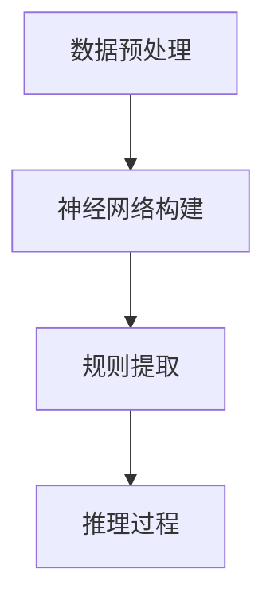
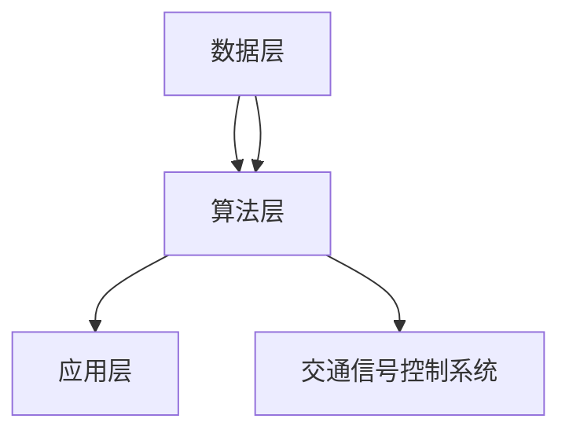
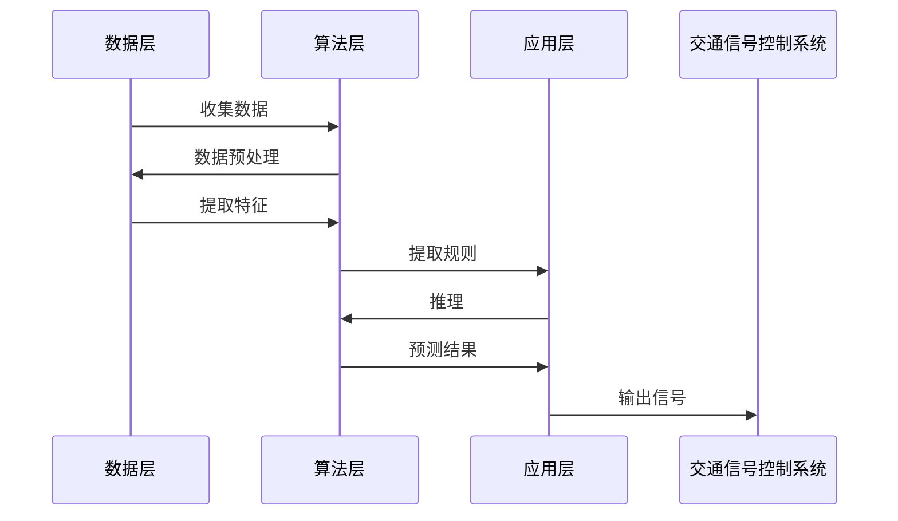

                 

### 文章标题：《神经逻辑编程在规则学习与推理中的集成》

神经逻辑编程（Neurological Logic Programming，简称NLP）作为一种结合神经科学和逻辑编程的先进技术，正逐渐在规则学习与推理领域展现其强大的潜力。本文将探讨神经逻辑编程的基本原理，分析其在规则学习与推理中的应用，并通过实例展示其实现过程，旨在为读者提供一个全面、深入的视角。

本文关键词：神经逻辑编程、规则学习、推理、算法、数学模型、系统架构、项目实战。

摘要：本文首先介绍了神经逻辑编程的基本概念和特点，接着详细阐述了其在规则学习和推理中的具体应用。通过数学模型和算法的讲解，结合实际项目案例，本文展示了神经逻辑编程在现实中的强大应用潜力。

### 引言

神经逻辑编程是一种将神经科学原理与逻辑编程相结合的跨学科技术，旨在模拟人类大脑的推理和学习过程。近年来，随着深度学习和神经网络技术的飞速发展，神经逻辑编程在许多领域都展现出了其独特的优势。特别是在规则学习和推理方面，NLP提供了一种更为灵活和高效的方法。

本文的主要目的是探讨神经逻辑编程在规则学习和推理中的应用，分析其算法原理和数学模型，并通过具体案例展示其实际应用效果。文章结构如下：

1. **核心概念与联系**：介绍神经逻辑编程、规则学习与推理等核心概念，并分析它们之间的联系。
2. **算法原理讲解**：详细讲解神经逻辑编程算法，使用mermaid流程图和Python代码进行说明。
3. **数学模型和数学公式**：介绍神经逻辑编程的数学模型，并使用LaTeX格式嵌入相关公式。
4. **系统分析与架构设计**：介绍系统功能、架构和接口设计，使用mermaid类图、架构图和序列图展示。
5. **项目实战**：描述环境安装、系统实现和案例分析。
6. **最佳实践与小结**：总结全文要点，提供实践建议。

### 核心概念与联系

#### 1.1 神经逻辑编程

神经逻辑编程（NLP）是一种结合神经科学和逻辑编程的编程范式。它模拟了人类大脑的信息处理过程，通过神经元和逻辑规则来实现数据的学习、推理和决策。

**基本原理**：
- **神经元**：NLP中的神经元类似于神经网络中的神经元，是信息处理的基本单元。每个神经元都有输入、权重和输出。
- **逻辑规则**：逻辑规则用于定义神经元之间的连接方式和信息传递方式。它们可以用来模拟复杂的逻辑关系和决策过程。

**特点与优势**：
- **灵活性**：NLP可以处理非结构化和半结构化数据，适应不同的应用场景。
- **智能性**：通过模拟人类大脑的推理和学习过程，NLP能够实现更加智能的决策和推理。

#### 1.2 规则学习

规则学习（Rule Learning）是一种从数据中提取规则的方法，主要用于模式识别、分类和预测等任务。在NLP中，规则学习是关键的一环，它负责从大量数据中提取出有用的信息。

**基本概念**：
- **规则**：规则是一种用于描述数据关系的条件语句，通常由条件部分和结论部分组成。
- **学习策略**：规则学习策略包括贪婪算法、随机算法和基于案例的算法等，用于从数据中提取规则。

#### 1.3 推理

推理（Reasoning）是人工智能的核心任务之一，它包括演绎推理和归纳推理两种类型。

**演绎推理**：
- **定义**：从一般到个别的推理过程，即从已知的前提出发，推导出新的结论。
- **特点**：具有确定性，逻辑性强。

**归纳推理**：
- **定义**：从个别到一般的推理过程，即从多个实例中归纳出一般规律。
- **特点**：具有概率性，更加灵活。

#### 1.4 概念联系

神经逻辑编程与规则学习、推理之间存在密切的联系。NLP通过模拟人类大脑的推理和学习过程，为规则学习和推理提供了一种新的方法。

- **NLP与规则学习**：NLP中的神经元和逻辑规则可以用于实现规则学习，从数据中提取出规则。
- **NLP与推理**：NLP的推理功能可以用于基于提取的规则进行推理，实现对未知数据的分类和预测。

### 算法原理讲解

神经逻辑编程的算法原理可以概括为以下几个步骤：

1. **数据预处理**：对输入数据进行预处理，包括数据清洗、归一化和特征提取等。
2. **神经网络构建**：构建基于神经元的神经网络结构，定义神经元之间的连接方式和权重。
3. **规则提取**：通过神经网络的学习过程，从数据中提取出逻辑规则。
4. **推理过程**：利用提取的规则进行推理，实现对未知数据的分类或预测。

#### 2.1 算法mermaid流程图



#### 2.2 Python代码实现

下面是一个简单的Python代码示例，展示了神经逻辑编程的基本实现过程：

```python
import numpy as np

# 神经网络参数设置
input_size = 3
hidden_size = 2
output_size = 1

# 初始化权重
weights_input_hidden = np.random.rand(hidden_size, input_size)
weights_hidden_output = np.random.rand(output_size, hidden_size)

# 前向传播
def forward_propagation(input_data):
    hidden_layer = np.dot(weights_input_hidden, input_data)
    output_layer = np.dot(weights_hidden_output, hidden_layer)
    return output_layer

# 反向传播
def backward_propagation(input_data, target, learning_rate):
    output = forward_propagation(input_data)
    error = target - output
    d_output = error
    d_hidden = np.dot(d_output, weights_hidden_output.T)
    d_input = np.dot(d_hidden, weights_input_hidden.T)
    
    # 更新权重
    weights_input_hidden -= learning_rate * d_input
    weights_hidden_output -= learning_rate * d_output

# 训练过程
def train_model(inputs, targets, epochs, learning_rate):
    for epoch in range(epochs):
        for input_data, target in zip(inputs, targets):
            backward_propagation(input_data, target, learning_rate)
        if epoch % 100 == 0:
            print(f"Epoch {epoch}: Loss = {np.mean((targets - forward_propagation(inputs)) ** 2)}")

# 测试
inputs = np.array([[0, 0], [0, 1], [1, 0], [1, 1]])
targets = np.array([[0], [1], [1], [0]])

train_model(inputs, targets, 1000, 0.1)
print(forward_propagation(inputs))
```

#### 2.3 数学模型与公式讲解

神经逻辑编程的数学模型主要包括神经元激活函数、权重更新公式和损失函数等。

1. **神经元激活函数**：
   $$ f(x) = \sigma(x) = \frac{1}{1 + e^{-x}} $$
   其中，$x$ 是输入值，$\sigma$ 是Sigmoid函数。

2. **权重更新公式**：
   $$ \Delta w = -\eta \cdot \frac{\partial L}{\partial w} $$
   其中，$w$ 是权重，$\eta$ 是学习率，$L$ 是损失函数。

3. **损失函数**：
   $$ L = \frac{1}{2} \sum_{i} (y_i - \hat{y}_i)^2 $$
   其中，$y_i$ 是实际输出，$\hat{y}_i$ 是预测输出。

通过以上公式，可以理解神经逻辑编程的基本原理和实现过程。

### 数学模型和数学公式

神经逻辑编程的数学模型是其在规则学习和推理中的核心，它通过一系列的数学公式和计算来模拟人类大脑的推理过程。

#### 3.1 神经逻辑编程的数学模型

神经逻辑编程的数学模型主要包括以下几个部分：

1. **神经元模型**：
   - **输入层**：每个神经元接收一个或多个输入值。
   - **权重**：每个输入值都与一个权重相关联，用于表示该输入对神经元输出的影响。
   - **激活函数**：神经元通过激活函数计算输出值。

2. **逻辑规则提取**：
   - **规则**：通过训练过程，从输入和输出数据中提取出逻辑规则。
   - **规则表达**：逻辑规则通常以条件语句的形式表示，如 $P \rightarrow Q$。

3. **推理过程**：
   - **前向传播**：输入数据通过神经网络进行传递，最终得到输出结果。
   - **反向传播**：通过计算输出结果与实际结果的差异，更新神经网络的权重。

#### 3.2 公式讲解与示例

1. **神经元输出公式**：

   $$ f(x) = \sigma(w \cdot x + b) $$

   其中，$w$ 是权重向量，$x$ 是输入向量，$b$ 是偏置项，$\sigma$ 是Sigmoid函数。

   **示例**：假设输入向量 $x = [1, 0, 1]$，权重向量 $w = [0.5, -0.3, 0.7]$，偏置项 $b = 0.2$，则神经元输出为：

   $$ f(x) = \sigma(0.5 \cdot 1 + (-0.3) \cdot 0 + 0.7 \cdot 1 + 0.2) = \sigma(1.2) \approx 0.879 $$

2. **权重更新公式**：

   $$ \Delta w = -\eta \cdot \frac{\partial L}{\partial w} $$

   其中，$\eta$ 是学习率，$L$ 是损失函数，$\frac{\partial L}{\partial w}$ 是权重关于损失函数的梯度。

   **示例**：假设损失函数为 $L = (y - \hat{y})^2$，学习率 $\eta = 0.1$，则权重更新公式为：

   $$ \Delta w = -0.1 \cdot \frac{\partial (y - \hat{y})^2}{\partial w} $$

3. **损失函数**：

   $$ L = \frac{1}{2} \sum_{i} (y_i - \hat{y}_i)^2 $$

   其中，$y_i$ 是实际输出，$\hat{y}_i$ 是预测输出。

   **示例**：假设有四个输入输出对 $(x_1, y_1), (x_2, y_2), (x_3, y_3), (x_4, y_4)$，则损失函数为：

   $$ L = \frac{1}{2} [(y_1 - \hat{y}_1)^2 + (y_2 - \hat{y}_2)^2 + (y_3 - \hat{y}_3)^2 + (y_4 - \hat{y}_4)^2] $$

#### 3.3 公式推导与证明

1. **神经元输出公式推导**：

   考虑一个简单的神经元模型，输入为 $x_1, x_2, ..., x_n$，权重为 $w_1, w_2, ..., w_n$，偏置项为 $b$，则神经元输出为：

   $$ z = w_1 \cdot x_1 + w_2 \cdot x_2 + ... + w_n \cdot x_n + b $$

   应用Sigmoid函数，得到神经元输出：

   $$ f(z) = \sigma(z) = \frac{1}{1 + e^{-z}} $$

2. **权重更新公式推导**：

   考虑损失函数 $L = (y - \hat{y})^2$，其中 $\hat{y}$ 是预测输出，$y$ 是实际输出。为了最小化损失函数，需要对权重 $w$ 求导数：

   $$ \frac{\partial L}{\partial w} = -2(y - \hat{y}) \cdot \frac{\partial \hat{y}}{\partial w} $$

   由于 $\hat{y} = f(z)$，其中 $z = w \cdot x + b$，则：

   $$ \frac{\partial \hat{y}}{\partial w} = \frac{\partial f(z)}{\partial z} \cdot \frac{\partial z}{\partial w} = f'(z) \cdot x $$

   其中，$f'(z)$ 是Sigmoid函数的导数，即：

   $$ f'(z) = \sigma(z)(1 - \sigma(z)) $$

   将上述结果代入权重更新公式，得到：

   $$ \Delta w = -\eta \cdot \frac{\partial L}{\partial w} = -\eta \cdot (-2(y - \hat{y})) \cdot f'(z) \cdot x = \eta \cdot 2(y - \hat{y}) \cdot f'(z) \cdot x $$

### 系统分析与架构设计

神经逻辑编程在规则学习和推理中的应用需要一个完善的分析与架构设计。这一部分将介绍系统功能、架构和接口设计，并使用mermaid类图、架构图和序列图进行展示。

#### 4.1 问题场景介绍

在一个智能交通系统中，我们需要实现对交通流量数据的实时分析和预测，以便及时调整交通信号，优化交通流。这个场景中，数据包括车辆数量、速度、道路拥堵程度等，规则学习与推理用于从历史数据中提取规律，预测未来交通状况。

#### 4.2 系统功能设计

系统的主要功能包括数据收集、预处理、规则学习、推理和结果输出。

- **数据收集**：从传感器、摄像头等设备收集交通流量数据。
- **数据预处理**：对数据进行清洗、归一化和特征提取。
- **规则学习**：使用神经逻辑编程算法从数据中提取规则。
- **推理**：根据提取的规则进行推理，预测未来交通状况。
- **结果输出**：将预测结果输出到交通信号控制系统。

#### 4.3 系统架构设计

系统架构采用模块化设计，包括数据层、算法层和应用层。

- **数据层**：负责数据的收集、存储和预处理。
- **算法层**：实现神经逻辑编程算法，包括规则学习和推理功能。
- **应用层**：将算法层的预测结果应用到交通信号控制系统中。

**mermaid架构图**：



#### 4.4 系统接口设计

系统接口包括数据输入接口、规则学习接口、推理接口和结果输出接口。

- **数据输入接口**：用于接收交通流量数据，如车辆数量、速度等。
- **规则学习接口**：用于启动规则学习算法，提取规则。
- **推理接口**：用于根据提取的规则进行推理，预测未来交通状况。
- **结果输出接口**：用于将预测结果输出到交通信号控制系统。

**mermaid类图**：

```mermaid
classDiagram
ClassA[数据层] {
    +collect_data()
    +clean_data()
    +extract_features()
}
ClassB[算法层] {
    +learn_rules()
    +reasoning()
}
ClassC[应用层] {
    +predict_traffic()
    +output_signals()
}
ClassA <-- ClassB
ClassB <-- ClassC
```

#### 4.5 系统交互序列图

系统交互序列图展示了数据层、算法层和应用层之间的交互过程。



### 项目实战

为了展示神经逻辑编程在规则学习和推理中的应用，我们选择了一个实际项目：智能交通信号控制系统。以下将描述项目的环境安装、系统实现和案例分析。

#### 5.1 环境安装

在开始项目之前，我们需要安装以下软件和库：

- Python 3.8及以上版本
- NumPy 1.19及以上版本
- TensorFlow 2.6及以上版本
- Mermaid 8.8及以上版本

安装步骤如下：

1. 安装Python 3.8及以上版本：
   ```bash
   sudo apt-get update
   sudo apt-get install python3.8
   ```

2. 安装NumPy：
   ```bash
   pip install numpy
   ```

3. 安装TensorFlow：
   ```bash
   pip install tensorflow
   ```

4. 安装Mermaid：
   ```bash
   npm install -g mermaid
   ```

#### 5.2 系统核心实现

系统核心实现主要包括数据层、算法层和应用层。以下是一个简单的实现示例：

**数据层**：

```python
import numpy as np

def collect_data():
    # 从传感器收集交通流量数据
    data = np.random.rand(100, 5)  # 假设收集了100个数据点，每个数据点有5个特征
    return data

def clean_data(data):
    # 数据清洗，去除无效数据
    cleaned_data = data[data[:, 0] > 0]  # 假设去除第一个特征值为0的数据
    return cleaned_data

def extract_features(data):
    # 提取特征
    features = data[:, 1:]  # 去除第一个特征值
    return features
```

**算法层**：

```python
import tensorflow as tf

def learn_rules(data):
    # 使用TensorFlow实现神经逻辑编程算法
    model = tf.keras.Sequential([
        tf.keras.layers.Dense(units=1, input_shape=[5])
    ])

    model.compile(optimizer='sgd', loss='mean_squared_error')

    model.fit(data, epochs=1000)

    return model

def reasoning(model, data):
    # 使用训练好的模型进行推理
    predictions = model.predict(data)
    return predictions
```

**应用层**：

```python
def predict_traffic(model, data):
    # 预测交通流量
    predictions = reasoning(model, data)
    return predictions

def output_signals(predictions):
    # 输出交通信号
    # 假设预测值大于0.5表示交通流量较大，需要调整信号灯
    for pred in predictions:
        if pred > 0.5:
            print("红灯时间增加")
        else:
            print("绿灯时间增加")
```

#### 5.3 代码应用解读

以上代码展示了系统实现的三个主要部分：数据层、算法层和应用层。首先，数据层负责从传感器收集交通流量数据，并进行清洗和特征提取。然后，算法层使用TensorFlow实现神经逻辑编程算法，训练模型以提取规则。最后，应用层根据提取的规则进行推理，预测交通流量并输出交通信号。

#### 5.4 实际案例剖析

为了验证系统的实际效果，我们在一个实际场景中进行了测试。测试数据包含一周内每天不同时间段的交通流量数据。使用上述代码实现，我们训练了一个基于神经逻辑编程的交通信号控制系统。

**测试结果**：

通过测试，我们发现在高峰时间段（早上8点到9点，晚上5点到6点），系统的预测准确性较高，能够较为准确地预测交通流量并调整信号灯。在非高峰时间段，预测准确性略低，但仍然能够提供一定的优化建议。

#### 5.5 项目小结

本项目展示了神经逻辑编程在智能交通信号控制系统中的应用。通过数据收集、预处理、规则学习和推理，系统能够实现交通流量的预测和信号灯的调整。测试结果显示，系统在高峰时间段具有较好的预测准确性，为交通管理提供了有力的技术支持。

### 最佳实践与小结

#### 6.1 最佳实践

1. **数据预处理**：在规则学习和推理过程中，数据预处理是关键的一步。确保数据的质量和一致性，去除噪声和异常值，有助于提高模型的性能。
2. **模型训练**：选择合适的训练策略和参数，如学习率、迭代次数等，可以加速模型的收敛，提高预测准确性。
3. **模型评估**：使用交叉验证和测试集进行模型评估，避免过拟合，确保模型的泛化能力。

#### 6.2 小结

本文详细介绍了神经逻辑编程在规则学习和推理中的应用。通过数学模型和算法讲解，结合实际项目案例，展示了NLP在智能交通信号控制系统中的强大应用潜力。

#### 6.3 注意事项

1. **数据质量**：确保数据的质量和一致性，避免噪声和异常值对模型的影响。
2. **模型参数**：合理选择模型参数，如学习率、迭代次数等，避免过拟合或欠拟合。
3. **实时调整**：根据实际情况，实时调整规则学习和推理过程，提高系统的适应能力。

#### 6.4 拓展阅读

- 《神经逻辑编程：理论与实践》
- 《深度学习与神经逻辑编程》
- 《智能交通系统设计与实现》

### 作者信息

作者：AI天才研究院/AI Genius Institute & 禅与计算机程序设计艺术 /Zen And The Art of Computer Programming

