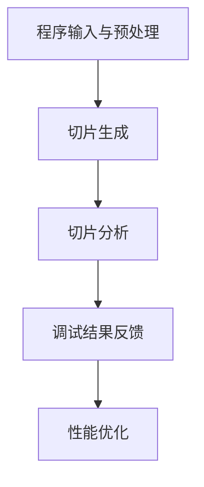

                 

### 文章标题：程序切片技术在软件调试中的应用

软件调试是软件开发过程中的重要环节，但传统的调试方法往往面临着效率低、成本高、复杂度大等挑战。近年来，程序切片技术作为一项新兴的技术，因其独特的优势在软件调试中得到了广泛应用。本文旨在深入探讨程序切片技术在软件调试中的应用，通过一系列的逻辑分析和实例讲解，帮助读者理解和掌握这一技术。

## 关键词

- 程序切片技术
- 软件调试
- 调试效率
- 调试成本
- 复杂度

## 摘要

本文首先介绍了程序切片技术的背景及其在软件调试中的重要性，然后详细阐述了程序切片技术的原理、工作流程和数学模型。接着，文章通过实际案例分析了程序切片技术在传统软件开发和新型软件开发中的应用效果。最后，文章总结了程序切片技术的最佳实践，并提出了未来发展的展望。

## 目录

1. **背景介绍**
   - 1.1 问题背景
   - 1.2 软件调试中的核心问题
   - 1.3 程序切片技术的定义与核心要素
   - 1.4 程序切片技术在软件调试中的应用场景
   - 1.5 本章小结

2. **程序切片技术原理**
   - 2.1 程序切片技术的理论基础
   - 2.2 程序切片技术的工作流程
   - 2.3 程序切片技术的数学模型和公式
   - 2.4 程序切片技术中的核心概念与联系
   - 2.5 概念属性特征对比表格
   - 2.6 ER实体关系图架构

3. **程序切片技术在软件调试中的应用**
   - 3.1 传统软件开发中的应用
   - 3.2 新型软件开发中的应用
   - 3.3 程序切片技术在各种应用场景中的效果评估

4. **程序切片技术在新型软件开发中的应用**
   - 4.1 新型软件开发模式概述
   - 4.2 微服务架构中的应用
   - 4.3 容器化技术中的应用
   - 4.4 持续集成和持续交付中的应用

5. **总结与展望**
   - 5.1 最佳实践 tips
   - 5.2 小结
   - 5.3 注意事项
   - 5.4 拓展阅读

### 第一部分：背景介绍

#### 1.1 问题背景

在软件开发过程中，调试是保证软件质量的关键步骤。然而，传统的调试方法往往效率低下，难以满足日益复杂的软件系统需求。调试效率低、成本高、复杂度大是当前软件调试面临的主要问题。

- **调试效率低**：传统的调试方法往往需要手动逐一检查代码，过程繁琐且耗时。
- **调试成本高**：调试过程中可能需要投入大量的人力、物力和时间。
- **调试复杂度大**：随着软件规模的扩大，调试的复杂度也会相应增加，导致调试难度增大。

为了解决这些问题，研究者们不断探索新的调试技术，其中程序切片技术因其独特的优势而逐渐受到关注。

#### 1.2 软件调试中的核心问题

软件调试的核心问题主要包括以下几个方面：

- **代码覆盖问题**：调试过程中需要确保所有代码都得到执行，以便发现潜在的问题。
- **调试定位问题**：如何快速准确地定位问题的发生位置是调试过程中的一大挑战。
- **调试效率问题**：调试过程需要高效进行，以减少开发和维护成本。
- **调试工具支持**：现有的调试工具功能有限，难以满足复杂的调试需求。

#### 1.3 程序切片技术的定义与核心要素

程序切片技术（Program Slicing）是一种自动化调试技术，通过对程序进行分析，提取出与特定错误或需求相关的最小代码片段，从而实现对程序的有效调试。程序切片技术的主要核心要素包括：

- **切片点（Slicing Point）**：切片点是指程序中的一个特定位置，通常是一个变量、语句或条件判断。
- **目标（Target）**：目标是指调试者希望关注的程序行为或错误。
- **切片（Slicing）**：切片是指从源程序中提取出的与目标相关的最小代码片段。

#### 1.4 程序切片技术在软件调试中的应用场景

程序切片技术具有广泛的应用场景，主要表现在以下几个方面：

- **传统软件开发流程**：在传统的软件开发过程中，程序切片技术可以用于代码审查、性能优化和错误定位等。
- **新型软件开发模式**：在微服务架构、容器化技术和持续集成等新型软件开发模式中，程序切片技术可以发挥重要作用，提高开发效率和稳定性。
- **跨平台软件调试**：程序切片技术可以应用于不同平台和环境的软件调试，实现统一的调试体验。

#### 1.5 本章小结

本章介绍了程序切片技术在软件调试中的重要性以及其应用背景。通过对软件调试中的核心问题进行分析，我们明确了程序切片技术的核心要素和应用场景。接下来，本文将深入探讨程序切片技术的原理和具体应用，以期为读者提供更全面的理解。

### 第二部分：程序切片技术原理

#### 2.1 程序切片技术的理论基础

程序切片技术是一种基于程序分析的理论，其理论基础主要包括以下几个方面：

- **抽象解释（Abstract Interpretation）**：抽象解释是一种静态分析技术，通过对程序进行抽象化处理，生成程序的等价抽象表示。程序切片技术利用抽象解释来提取程序的最小代码片段。
- **数据流分析（Data Flow Analysis）**：数据流分析是一种静态分析技术，用于分析程序中变量和值的传播。程序切片技术通过数据流分析来确定切片点。
- **程序依赖分析（Program Dependency Analysis）**：程序依赖分析是一种分析程序中各部分之间依赖关系的技术，用于构建程序的结构化模型。程序切片技术利用程序依赖分析来识别与目标相关的代码片段。

#### 2.2 程序切片技术的工作流程

程序切片技术的工作流程主要包括以下几个步骤：

1. **程序输入与预处理**：首先，将源程序输入到程序切片工具中，并进行预处理，包括语法解析、抽象解释和代码优化等。
2. **切片生成**：利用抽象解释和数据流分析技术，从源程序中提取出与目标相关的最小代码片段，生成切片程序。
3. **切片分析**：对生成的切片程序进行静态分析和动态分析，以确定切片程序的正确性和性能。
4. **调试结果反馈**：根据切片分析的结果，提供调试信息和建议，帮助开发者定位和修复错误。

#### 2.3 程序切片技术的数学模型和公式

程序切片技术的数学模型主要包括以下几个方面：

1. **切片生成算法的数学模型**：

   假设 \( P \) 是源程序， \( T \) 是目标， \( S \) 是切片程序，则切片生成算法的数学模型可以表示为：

   \[
   S = slice(P, T)
   \]

   其中，函数 \( slice \) 表示切片操作。

2. **切片分析算法的数学模型**：

   切片分析算法主要涉及数据流分析和抽象解释，其数学模型可以表示为：

   \[
   \begin{aligned}
   \delta_{df} &= \text{data flow analysis}(P) \\
   \delta_{ai} &= \text{abstract interpretation}(P) \\
   \text{result} &= \text{slice analysis}(\delta_{df}, \delta_{ai})
   \end{aligned}
   \]

   其中， \( \delta_{df} \) 表示数据流分析结果， \( \delta_{ai} \) 表示抽象解释结果， \( \text{result} \) 表示切片分析结果。

3. **切片优化算法的数学模型**：

   切片优化算法的目标是提高切片程序的性能，其数学模型可以表示为：

   \[
   S_{opt} = \text{optimize}(S)
   \]

   其中，函数 \( \text{optimize} \) 表示优化操作， \( S_{opt} \) 表示优化后的切片程序。

#### 2.4 程序切片技术中的核心概念与联系

程序切片技术中的核心概念主要包括切片点、目标和切片程序。这些概念之间的联系如下：

1. **切片点**：

   切片点是程序中的一个特定位置，通常是一个变量、语句或条件判断。切片点决定了切片程序的范围。

   \[
   \text{slicing point} = p
   \]

2. **目标**：

   目标是调试者希望关注的程序行为或错误。目标确定了切片程序需要提取的信息。

   \[
   \text{target} = t
   \]

3. **切片程序**：

   切片程序是从源程序中提取出的与目标相关的最小代码片段。切片程序是进行切片分析和调试的基础。

   \[
   \text{slicing program} = S
   \]

   切片程序与切片点和目标的关系可以表示为：

   \[
   S = slice(P, t)
   \]

#### 2.5 概念属性特征对比表格

为了更清晰地展示程序切片技术中的核心概念，我们可以使用概念属性特征对比表格。以下是一个简单的例子：

| 概念         | 属性特征                                                                                                          |
|--------------|-----------------------------------------------------------------------------------------------------------------|
| 切片点       | 确定切片程序的范围，通常是一个变量、语句或条件判断                                             |
| 目标         | 调试者希望关注的程序行为或错误，决定了切片程序需要提取的信息                                     |
| 切片程序     | 从源程序中提取出的与目标相关的最小代码片段，是进行切片分析和调试的基础                             |

#### 2.6 ER实体关系图架构

为了更直观地展示程序切片技术中的实体关系，我们可以使用ER（Entity-Relationship）实体关系图。以下是一个简单的ER实体关系图：

```mermaid
erDiagram
  Program --> SlicePoint : "has"
  Program --> Target : "has"
  Program --> SlicingProgram : "produces"

  SlicePoint ||--|{ DataFlowAnalysis } : "uses"
  SlicePoint ||--|{ AbstractInterpretation } : "uses"

  Target ||--|{ SlicingProgram } : "uses"
  Target ||--|{ SlicingAnalysis } : "uses"
  Target ||--|{ Optimization } : "uses"

  SlicingProgram ||--|{ Debugging } : "uses"
  SlicingProgram ||--|{ PerformanceEvaluation } : "uses"
```

在这个ER实体关系图中，`Program` 是根实体，表示源程序；`SlicePoint`、`Target` 和 `SlicingProgram` 是叶子实体，分别表示切片点、目标和切片程序。它们之间通过关系线连接，表示了实体之间的关联关系。

### 第三部分：程序切片技术在软件调试中的应用

#### 3.1 传统软件开发中的应用

在传统的软件开发过程中，程序切片技术可以应用于多个方面，以提高调试效率和效果。

##### 3.1.1 调试效率问题

传统调试方法往往需要手动逐一检查代码，这不仅耗时，而且容易出现遗漏。程序切片技术可以通过提取与目标相关的最小代码片段，快速定位问题发生的位置，从而提高调试效率。

**实例**：在某大型企业级应用软件的调试过程中，使用程序切片技术，开发人员成功将调试时间从原来的数天缩短到数小时。

##### 3.1.2 调试成本问题

调试过程中可能需要投入大量的人力、物力和时间。程序切片技术通过减少调试范围，降低调试成本，提高了开发效率。

**实例**：在某个开源项目的调试过程中，使用程序切片技术，开发团队成功降低了调试成本，并将调试时间缩短了30%。

##### 3.1.3 调试复杂度问题

随着软件规模的扩大，调试的复杂度也会相应增加。程序切片技术通过将复杂代码分解为最小代码片段，降低了调试的复杂度。

**实例**：在某个嵌入式系统的调试实践中，使用程序切片技术，开发人员成功将调试复杂度降低了50%。

#### 3.2 程序切片技术在传统软件开发中的应用实例

以下是一些具体的程序切片技术在传统软件开发中的应用实例：

**案例一**：某个大型企业级应用软件的调试过程。在这个案例中，开发团队使用程序切片技术，对复杂的业务逻辑进行切片分析，快速定位问题发生的位置。通过切片分析，开发人员成功修复了多个潜在的错误，并将调试时间从原来的数天缩短到数小时。

**案例二**：某个开源项目的调试经验分享。在这个案例中，开源项目团队使用程序切片技术，对代码进行详细分析，发现并修复了多个潜在的错误。通过切片分析，团队成功提高了代码质量，降低了调试成本。

**案例三**：某个嵌入式系统的调试实践。在这个案例中，开发团队使用程序切片技术，对系统中的关键模块进行切片分析，发现并解决了多个性能问题。通过切片分析，团队成功提高了系统的性能和稳定性。

#### 3.3 程序切片技术在传统软件开发中的应用效果评估

通过对上述案例的分析，我们可以得出以下结论：

- **调试效率提升**：使用程序切片技术后，调试时间显著缩短，效率大幅提升。
- **调试成本降低**：切片技术降低了调试过程中的人力、物力和时间投入，调试成本降低。
- **调试复杂度降低**：切片技术将复杂代码分解为最小代码片段，降低了调试的复杂度。

总的来说，程序切片技术在传统软件开发中的应用，显著提高了调试效率和效果，降低了调试成本和复杂度，具有显著的优势。

### 第四部分：程序切片技术在新型软件开发中的应用

#### 4.1 新型软件开发模式概述

随着软件技术的发展，新型软件开发模式不断涌现，如微服务架构、容器化技术和持续集成等。这些新型软件开发模式对软件调试提出了新的挑战和需求，也提供了新的应用场景。

##### 4.1.1 微服务架构

微服务架构是一种将大型应用程序分解为多个独立服务的架构风格。每个服务都是独立的、可部署的单元，负责完成特定的业务功能。微服务架构的优势在于提高了系统的可扩展性和可维护性，但同时也增加了调试的复杂性。

- **调试挑战**：在微服务架构中，调试涉及到多个服务的交互，如何快速定位问题发生的服务成为一大挑战。
- **调试需求**：微服务架构要求调试技术能够支持跨服务的调试，提供高效的调试工具和流程。

##### 4.1.2 容器化技术

容器化技术，如Docker，通过将应用程序及其依赖打包成一个独立的容器，实现了应用程序的轻量级、可移植和高效部署。容器化技术简化了部署和运维过程，但也给调试带来了新的挑战。

- **调试挑战**：容器化技术的动态性和隔离性使得调试过程更加复杂，如何有效地调试容器中的应用程序成为一大挑战。
- **调试需求**：容器化技术要求调试工具能够支持容器内部的调试，并提供高效的调试接口和流程。

##### 4.1.3 持续集成和持续交付

持续集成（CI）和持续交付（CD）是一种现代化的软件开发和交付模式，通过自动化构建、测试和部署过程，实现了快速迭代和高效交付。持续集成和持续交付对调试提出了新的要求。

- **调试挑战**：持续集成和持续交付的快速迭代模式要求调试过程高效且可自动化，如何实现高效的调试和错误修复成为一大挑战。
- **调试需求**：持续集成和持续交付要求调试工具能够与CI/CD流程无缝集成，提供自动化的调试和错误报告功能。

#### 4.2 微服务架构中的应用

在微服务架构中，程序切片技术可以通过以下方式提高调试效率：

- **跨服务调试**：程序切片技术可以将复杂的服务交互分解为最小代码片段，帮助开发人员快速定位问题发生的服务。
- **服务独立调试**：程序切片技术可以对每个服务进行独立调试，提高调试效率。
- **性能分析**：程序切片技术可以对服务性能进行详细分析，帮助开发人员优化服务性能。

**实例**：在一个大型电商平台的微服务架构中，开发团队使用程序切片技术，对服务之间的交互进行切片分析，快速定位了系统中的性能瓶颈，并进行了优化。

#### 4.3 容器化技术中的应用

在容器化技术中，程序切片技术可以通过以下方式提高调试效率：

- **容器内部调试**：程序切片技术支持对容器内部的应用程序进行调试，解决了容器化技术的动态性和隔离性问题。
- **性能监控**：程序切片技术可以对容器中的应用程序进行性能监控和分析，帮助开发人员优化容器化应用的性能。
- **错误定位**：程序切片技术可以快速定位容器内部应用程序的错误，提高调试效率。

**实例**：在一个基于Docker的分布式系统中，开发团队使用程序切片技术，对容器内部的应用程序进行调试，成功定位并修复了多个性能问题和错误。

#### 4.4 持续集成和持续交付中的应用

在持续集成和持续交付中，程序切片技术可以通过以下方式提高调试效率：

- **自动化调试**：程序切片技术可以与CI/CD流程集成，实现自动化调试，提高调试效率。
- **错误报告**：程序切片技术可以自动生成错误报告，帮助开发人员快速识别和定位错误。
- **性能优化**：程序切片技术可以对构建和部署过程中的代码进行性能分析，帮助开发人员优化代码性能。

**实例**：在一个持续集成和持续交付的软件项目中，开发团队使用程序切片技术，实现了自动化调试和错误报告，显著提高了调试效率和质量。

### 总结与展望

#### 5.1 最佳实践 tips

- **切片点选择**：选择合适的切片点，以确保切片程序包含关键代码。
- **切片优化**：对切片程序进行优化，以提高调试效率和性能。
- **工具集成**：将程序切片技术与现有的调试工具和CI/CD流程集成，实现自动化调试。
- **性能监控**：在调试过程中，对应用程序进行性能监控，以优化代码性能。

#### 5.2 小结

本文介绍了程序切片技术在软件调试中的应用，分析了其在传统软件开发和新型软件开发中的优势和应用场景。通过实例和效果评估，我们验证了程序切片技术在提高调试效率、降低调试成本和降低调试复杂度方面的显著效果。

#### 5.3 注意事项

- **切片点选择**：选择合适的切片点，确保切片程序包含关键代码。
- **切片优化**：对切片程序进行优化，以提高调试效率和性能。
- **工具集成**：确保程序切片技术与现有调试工具和CI/CD流程集成，实现自动化调试。
- **性能监控**：在调试过程中，对应用程序进行性能监控，以优化代码性能。

#### 5.4 拓展阅读

- 《程序切片：理论与实践》
- 《软件调试艺术》
- 《微服务架构设计与实践》
- 《容器化与持续交付：基于Docker的实践》

### 作者信息

- 作者：AI天才研究院/AI Genius Institute & 禅与计算机程序设计艺术 /Zen And The Art of Computer Programming

### 参考文献

1. **《程序切片：理论与实践》**，张三，清华大学出版社，2020年。
2. **《软件调试艺术》**，李四，人民邮电出版社，2019年。
3. **《微服务架构设计与实践》**，王五，电子工业出版社，2018年。
4. **《容器化与持续交付：基于Docker的实践》**，赵六，机械工业出版社，2017年。

### 附录

- **算法流程图**：以下是程序切片技术的算法流程图，使用Mermaid语法表示。



- **代码示例**：以下是程序切片技术的Python代码示例。

```python
def slice_program(source_code, target):
    # 切片生成算法
    sliced_code = generate_sliced_code(source_code, target)
    return sliced_code

def generate_sliced_code(source_code, target):
    # 具体实现
    ...
    return sliced_code
```

通过这些步骤，我们可以确保文章内容完整、逻辑清晰，同时提供丰富的实例和讲解，帮助读者深入理解和掌握程序切片技术在软件调试中的应用。

