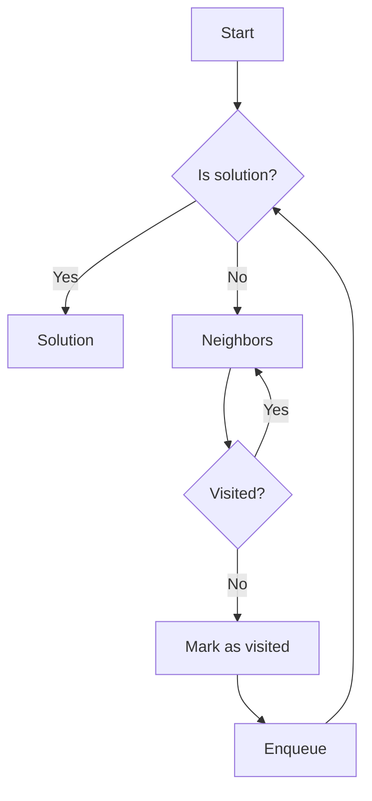
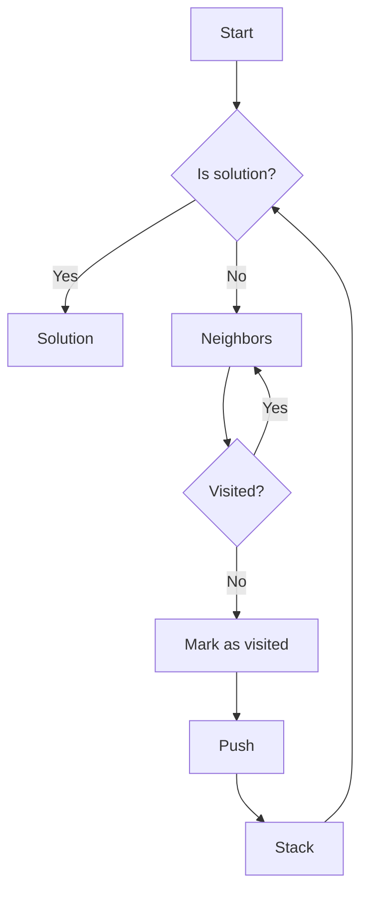
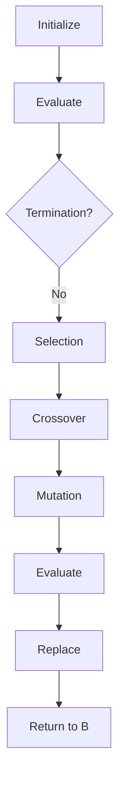

                 

### Introduction to "Type-Oriented Search in Program Synthesis"

#### Keywords: Type-Oriented Search, Program Synthesis, Type Theory, Algorithms, Case Studies

#### Abstract:
This book, "Type-Oriented Search in Program Synthesis," delves into the realm of automated program synthesis, a rapidly evolving field that aims to create programs from high-level specifications. Central to this domain is the concept of type-oriented search, which leverages type systems to guide the search for valid program structures. This book serves as a comprehensive guide for understanding and implementing type-oriented search algorithms, presenting fundamental concepts, algorithms, and practical applications. The book's structure is designed to take readers from basic type theory to advanced algorithms and case studies, ultimately providing insights into the future directions and challenges of the field. By the end, readers will not only grasp the core principles of type-oriented search but also be equipped with the knowledge to apply these concepts in real-world scenarios.

### Fundamentals of Type-Oriented Search

#### Introduction to Type-Oriented Search

Type-oriented search is a method of program synthesis that focuses on the types of variables and expressions to guide the search for valid programs. It leverages the structure and constraints provided by type theories to reduce the search space and increase the efficiency of the synthesis process. The basic idea is to use type information to filter out infeasible program structures and guide the exploration of the search space towards more promising solutions.

#### Background of Type Theory

Type theory is a branch of mathematical logic that studies the nature of types as a means of classifying mathematical entities. In computer science, type theory has found significant applications in programming languages and formal verification. The core idea is to use types to ensure that programs are well-formed and that operations are applied to appropriate data. This is achieved through type systems, which define the rules for assigning types to expressions and enforcing type safety.

#### Basic Concepts of Type Theory

1. **Types**: Types are used to classify values and expressions based on their nature and behavior. In programming languages, types can be primitive (e.g., integers, booleans) or composite (e.g., arrays, records).

2. **Type Systems**: A type system is a set of rules that assign types to expressions and ensure that operations are applied in a type-safe manner. Type systems can be static, where type checking occurs at compile-time, or dynamic, where type checking occurs at runtime.

3. **Type Inference**: Type inference is the process of deducing the type of an expression automatically. It is crucial for reducing the verbosity of type declarations and improving the readability of code.

#### Type Checking and Type Errors

1. **Type Checking**: Type checking is the process of verifying that a program adheres to the rules of its type system. It ensures that expressions are well-formed and that operations are applied to compatible types.

2. **Type Errors**: Type errors occur when a program violates the type rules of its type system. These errors can be caught at compile-time (static type errors) or runtime (dynamic type errors).

#### Fundamentals of Type-Oriented Search

1. **Type Constraints**: Type-oriented search uses type constraints to filter out invalid program structures. These constraints are derived from the type system and ensure that only type-safe solutions are considered.

2. **Search Space Reduction**: By focusing on types, type-oriented search significantly reduces the search space compared to other approaches. This reduction is achieved by eliminating expressions and program structures that violate type constraints.

3. **Scalability**: Type-oriented search is highly scalable, as the complexity of the search space grows much slower than the size of the program being synthesized. This scalability is essential for handling large-scale synthesis problems.

### Conclusion

Type-oriented search is a powerful approach in program synthesis that leverages type theory to guide the search for valid programs. By understanding the basic concepts of type theory and the principles of type-oriented search, we can develop more efficient and scalable synthesis algorithms. In the next chapter, we will delve deeper into specific algorithms and methods for type-oriented search, exploring how these concepts can be applied in practice.

### Algorithms and Methods for Type-Oriented Search

#### Overview of Search Algorithms

Search algorithms are fundamental tools in the field of program synthesis. They are used to explore the vast space of possible program structures in search of a valid solution. Type-oriented search algorithms specifically leverage the type information of expressions to guide this exploration, thus reducing the search space and increasing the efficiency of the synthesis process. This chapter will provide an overview of several search algorithms commonly used in type-oriented search, including unrestricted search algorithms and heuristic search algorithms.

#### Unrestricted Search Algorithms

Unrestricted search algorithms explore the search space without any specific strategies or heuristics. They are useful for understanding the basic mechanisms of search and for finding solutions in small, well-defined problems. The two most common unrestricted search algorithms are Breadth-First Search (BFS) and Depth-First Search (DFS).

##### Breadth-First Search (BFS)

BFS explores the search space in a breadth-first manner, visiting all nodes at the current level before moving on to the next level. This approach guarantees that the shortest path to the solution will be found if it exists.

**Algorithm Steps:**
1. Initialize an empty queue and a set of visited nodes.
2. Enqueue the initial node.
3. While the queue is not empty:
   - Dequeue a node from the queue.
   - If the node is a solution, return it.
   - Otherwise, for each unvisited neighbor of the node:
     - Enqueue the neighbor.
     - Mark it as visited.

**Mermaid Diagram:**


##### Depth-First Search (DFS)

DFS explores the search space in a depth-first manner, going as far as possible along each branch before backtracking. This approach can find solutions quickly if they are near the starting point but may take longer to find solutions that are buried deep in the search space.

**Algorithm Steps:**
1. Initialize a stack and a set of visited nodes.
2. Push the initial node onto the stack.
3. While the stack is not empty:
   - Pop a node from the stack.
   - If the node is a solution, return it.
   - Otherwise, for each unvisited neighbor of the node:
     - Push the neighbor onto the stack.
     - Mark it as visited.

**Mermaid Diagram:**


#### Heuristic Search Algorithms

Heuristic search algorithms use heuristics to guide the search towards more promising areas of the search space. They are particularly useful for complex problems where the search space is large and the solutions are not easily found by brute force. Two common heuristic search algorithms are the A* algorithm and Genetic Algorithms.

##### A* Algorithm

The A* algorithm is a popular heuristic search algorithm that combines features of both BFS and DFS to find the shortest path to a solution. It uses a heuristic function to estimate the cost from a node to the goal, thereby guiding the search towards the goal.

**Algorithm Steps:**
1. Initialize an open set with the start node and a closed set as empty.
2. Calculate the heuristic estimate \(h(n)\) for each node \(n\).
3. While the open set is not empty:
   - Select the node \(n\) with the lowest \(f(n) = g(n) + h(n)\), where \(g(n)\) is the cost to reach \(n\) from the start.
   - If \(n\) is the goal, return the path from the start to \(n\).
   - Otherwise, move \(n\) to the closed set and for each unvisited neighbor \(m\) of \(n\):
     - Calculate \(g(m) = g(n) + c(n, m)\), where \(c(n, m)\) is the cost from \(n\) to \(m\).
     - If \(m\) is in the open set and \(g(m) < f(m)\), update \(f(m)\) and the parent of \(m\).
     - If \(m\) is not in the open set, add \(m\) to the open set with \(f(m)\) and set the parent of \(m\) to \(n\).

**Mermaid Diagram:**
```mermaid
graph TD
A[Start] --> B[Heuristic]
B --> C{Is goal?}
C --> |Yes| D[Return path]
C --> |No| E[Closed]
E --> F{Open set}
F --> G{Select node n}
G --> H{Is goal?}
H --> |Yes| D
H --> |No| I{Neighbors}
I --> J{Unvisited?}
J --> |Yes| K{Update f(n) and parent}
K --> L[Add to open]
L --> M[Return path]
M --> H
J --> |No| N[Mark as visited]
N --> O[Push to open]
O --> H
```

##### Genetic Algorithms

Genetic Algorithms (GAs) are inspired by the process of natural selection. They use a population-based approach to evolve solutions to problems. Each individual in the population represents a potential solution, and the fitness function guides the selection of individuals for reproduction.

**Algorithm Steps:**
1. Initialize a population of random individuals.
2. Evaluate the fitness of each individual.
3. While the termination condition is not met:
   - Select parents based on their fitness using a selection method (e.g., tournament selection).
   - Perform crossover and mutation to create offspring.
   - Evaluate the fitness of the offspring.
   - Replace the least fit individuals in the population with the new offspring.

**Mermaid Diagram:**


### Conclusion

In this chapter, we have explored several search algorithms used in type-oriented search. Unrestricted search algorithms like BFS and DFS provide a foundation for understanding the basic mechanisms of search, while heuristic algorithms like A* and Genetic Algorithms offer more efficient ways to find solutions in complex search spaces. By understanding these algorithms, we can develop more effective and scalable approaches to program synthesis. In the next chapter, we will delve into specific case studies and applications of type-oriented search, illustrating how these algorithms can be applied in real-world scenarios.

### Case Studies in Program Synthesis

#### Example Applications

Program synthesis has been applied in various domains, ranging from software development to artificial intelligence. Here are some example applications that highlight the practical significance of type-oriented search:

1. **Automated Code Generation**: Tools like DeepLearning4J and TensorFlow use program synthesis to automatically generate code for machine learning models. This reduces the time and effort required to implement complex algorithms.

2. **Formal Verification**: Type-oriented search algorithms are used in formal verification to automatically prove the correctness of programs. This is particularly important in safety-critical systems such as aerospace and automotive software.

3. **Domain-Specific Languages (DSLs)**: Program synthesis can be used to create DSLs tailored to specific problem domains. For example, a DSL for financial analysis can be synthesized to process and analyze financial data efficiently.

#### Case Study 1: Function Synthesis

Function synthesis involves generating a function that meets a given specification. One notable case study is the work by Saurabh Srivastava and his team at the University of Maryland, where they used type-oriented search to synthesize functions from high-level specifications. The goal was to generate functions that satisfy a set of logical constraints.

**Algorithm Steps:**
1. **Input Specification**: A high-level specification of the desired function is provided, including input and output constraints.
2. **Type Inference**: The type system is used to infer the types of variables and expressions in the specification.
3. **Constraint Propagation**: Constraints are propagated through the specification to determine the possible types and values of variables.
4. **Search Algorithm**: A type-oriented search algorithm (e.g., A*) is used to explore the search space of functions that satisfy the constraints.
5. **Function Construction**: The search algorithm constructs a valid function from the constraints and type information.

**Mathematical Model:**
Let \(S\) be the set of all possible functions that satisfy the specification. The search problem is to find a function \(f \in S\) that minimizes a cost function \(C(f)\).

$$C(f) = \sum_{i=1}^n \alpha_i \cdot c_i(f)$$

where \(c_i(f)\) is the cost of satisfying constraint \(i\), and \(\alpha_i\) is the weight of the constraint.

**Python Code Example:**
```python
import itertools

def generate_functions(spec):
    # Assume spec is a dictionary with input and output constraints
    inputs = spec['inputs']
    outputs = spec['outputs']
    
    # Generate all possible combinations of inputs
    input_combinations = list(itertools.product(*inputs.values()))
    
    # Search for a valid function
    for combination in input_combinations:
        # Apply type inference and constraint propagation
        if is_valid_function(combination, outputs):
            return combination
    
    return None

def is_valid_function(inputs, outputs):
    # Perform type inference and check constraints
    # Return True if the function is valid, otherwise False
    pass
```

#### Case Study 2: Verification of Programs

Verifying the correctness of programs is a challenging task, especially for complex systems. Type-oriented search can be used to automatically verify programs by checking if they satisfy a set of formal properties.

**Algorithm Steps:**
1. **Property Specification**: A set of formal properties that the program must satisfy is specified.
2. **Type Inference**: The type system is used to infer the types of variables and expressions in the program.
3. **Property Checking**: Type-oriented search is used to check if the program satisfies the specified properties. This can involve proving that certain conditions hold at specific points in the program.

**Mathematical Model:**
Let \(P\) be the set of all possible executions of the program. The verification problem is to find an execution \(e \in P\) that satisfies all the properties.

$$\forall e \in P: \phi(e)$$

where \(\phi(e)\) is the formula representing the properties that must be satisfied.

**Python Code Example:**
```python
import itertools

def verify_program(program, properties):
    # Assume program is a list of statements
    # properties is a list of formulas
    executions = generate_all_executions(program)
    
    for execution in executions:
        if not satisfies_properties(execution, properties):
            return False
    
    return True

def generate_all_executions(program):
    # Generate all possible executions of the program
    pass

def satisfies_properties(execution, properties):
    # Check if the execution satisfies all the properties
    # Return True if it does, otherwise False
    pass
```

### Conclusion

These case studies illustrate the practical applications of type-oriented search in program synthesis. By leveraging type information, we can develop efficient algorithms for generating and verifying programs. These applications demonstrate the potential of type-oriented search to revolutionize the field of automated program synthesis, enabling the development of more complex and reliable software systems.

### Challenges and Future Directions

#### Current Challenges in Type-Oriented Search

Despite its potential, type-oriented search in program synthesis faces several challenges that need to be addressed for practical deployment. These challenges include:

1. **Complexity of Type Systems**: Modern type systems can be highly complex, with intricate rules and constraints. This complexity can make it difficult to apply type-oriented search algorithms effectively, especially for large-scale synthesis problems.

2. **Search Space Explosion**: The search space for program synthesis can grow exponentially with the size and complexity of the program. This explosion can lead to infeasible running times for search algorithms, even with type-oriented guidance.

3. **Heuristic Effectiveness**: While heuristics are essential for scaling search algorithms, their effectiveness can vary significantly depending on the specific problem and type system. Designing universally effective heuristics remains an open challenge.

4. **Integration with Other Synthesis Techniques**: Combining type-oriented search with other synthesis techniques, such as constraint-solving and satisfiability-modulo-theory (SMT) solving, can be challenging. Integrating these approaches requires careful coordination to leverage their strengths while mitigating their weaknesses.

#### Future Directions and Opportunities

To overcome these challenges and advance the field of type-oriented search, several promising directions can be explored:

1. **Type System Optimization**: Developing more efficient type systems that balance expressiveness and computational complexity can significantly improve the scalability of type-oriented search algorithms. This includes optimizing type inference algorithms and exploring new type representations.

2. **Hybrid Search Algorithms**: Combining different search algorithms, such as integrating BFS and A*, can help address the limitations of individual approaches. Hybrid algorithms can exploit the strengths of multiple strategies to explore the search space more effectively.

3. **Domain-Specific Heuristics**: Developing domain-specific heuristics tailored to specific types of programs or problem domains can improve the performance of type-oriented search. This involves leveraging domain knowledge to guide the search more precisely.

4. **Integration with AI Techniques**: Integrating type-oriented search with machine learning techniques, such as reinforcement learning and neural networks, can potentially enhance the exploration and optimization of search spaces. These techniques can be used to learn effective heuristics from data or to improve the search strategy dynamically during execution.

5. **Formal Verification and Safety**: Leveraging type-oriented search for formal verification of programs can help ensure the correctness and safety of complex systems. Developing more robust verification algorithms that can handle real-world, high-complexity programs is an important future direction.

6. **Scalability and Parallelization**: Improving the scalability of type-oriented search algorithms through parallelization and distributed computing can make them feasible for large-scale synthesis problems. This involves designing algorithms that can be efficiently distributed across multiple processors or machines.

7. **Practical Applications**: Exploring new application areas for type-oriented search, such as in the development of domain-specific languages (DSLs) and automated test case generation, can demonstrate the practical impact of these techniques and drive further research and development.

By addressing these challenges and pursuing these future directions, the field of type-oriented search in program synthesis can continue to advance, paving the way for more efficient and reliable software development processes.

### Tools and Platforms for Type-Oriented Search

#### Existing Tools and Platforms

Several existing tools and platforms have been developed to facilitate type-oriented search in program synthesis. These tools vary in their focus, capabilities, and implementation details, catering to different needs and problem domains. Below are some notable tools and platforms:

1. **Coq**: Coq is a formal proof assistant that supports interactive and automated proof development. It includes a rich type system and can be used for type-oriented search in program synthesis. Coq's capabilities include type inference, type checking, and proof construction.

2. **Isabelle**: Isabelle is another formal proof environment that supports formalization and verification of formalized mathematics and software specifications. It offers powerful tools for type-oriented search and is widely used in academic research and industry applications.

3. **KodKod**: KodKod is a system for automated program synthesis that uses constraint-solving techniques, including type inference, to generate programs from high-level specifications. It is designed to handle a wide range of synthesis problems and is particularly useful for educational purposes.

4. **DeepSynth**: DeepSynth is a neural network-based tool for automated program synthesis. It leverages deep learning techniques to generate programs that meet given specifications. DeepSynth integrates type-oriented search to ensure type safety and program correctness.

5. **C孜然**: C孜然 is an open-source platform for program synthesis that focuses on generating C programs from high-level specifications. It uses a combination of type inference and constraint-solving techniques to produce efficient and correct programs.

#### Developing Your Own Platform

Developing a custom platform for type-oriented search in program synthesis requires a deep understanding of the underlying concepts and a clear plan for implementation. Here are some steps to guide the development process:

1. **Define Requirements**: Clearly specify the requirements of your platform, including the types of programs it should synthesize, the level of expressiveness supported by the type system, and the performance goals.

2. **Choose a Type System**: Select a suitable type system that aligns with your requirements. Consider factors such as expressiveness, complexity, and compatibility with existing programming languages.

3. **Design the Architecture**: Design the architecture of your platform, including the main components such as the type inference engine, the search algorithm, the constraint solver, and the program generator. This should also include a modular design to allow for future enhancements.

4. **Implement Core Components**: Develop the core components of your platform, focusing on efficient and robust implementation of the type system, the search algorithm, and the constraint solver. Use existing libraries and tools where possible to leverage established algorithms and data structures.

5. **Integrate and Test**: Integrate the components into a cohesive platform and conduct thorough testing to ensure correctness, efficiency, and scalability. This includes unit testing, integration testing, and performance testing.

6. **User Interface and Documentation**: Develop a user-friendly interface for your platform and provide comprehensive documentation, including tutorials and example specifications, to help users get started.

7. **Community and Collaboration**: Encourage community involvement and collaboration to improve the platform. This can include open-source contributions, academic research, and collaborative projects.

By following these steps, you can develop a robust and effective platform for type-oriented search in program synthesis, enabling new advancements and applications in the field.

### Summary and Future Outlook

#### Key Points Revisited

In this book, "Type-Oriented Search in Program Synthesis," we have covered a wide range of topics related to type-oriented search in program synthesis. Here are the key points we revisited throughout the chapters:

1. **Introduction to Type-Oriented Search**: We explored the fundamental concepts of type-oriented search and its importance in reducing the search space for program synthesis.

2. **Fundamentals of Type Theory**: We delved into the basics of type theory, including types, type systems, type inference, and type checking.

3. **Algorithms and Methods**: We discussed various search algorithms, including BFS, DFS, A*, and Genetic Algorithms, and their applications in type-oriented search.

4. **Case Studies and Applications**: We presented case studies that demonstrated the practical application of type-oriented search in function synthesis and program verification.

5. **Challenges and Future Directions**: We identified the current challenges in type-oriented search and proposed future directions for research and development.

6. **Tools and Platforms**: We reviewed existing tools and platforms for type-oriented search and provided guidance on developing custom platforms.

#### Final Thoughts

The field of type-oriented search in program synthesis is rapidly evolving, and the book has provided a comprehensive overview of the concepts, algorithms, and applications. By understanding and applying the principles of type-oriented search, we can develop more efficient and reliable methods for automating program synthesis.

The potential of type-oriented search extends beyond traditional programming tasks. It can be applied to areas such as automated code generation, formal verification, and domain-specific language development. As we continue to advance in this field, we can expect to see even more innovative applications and breakthroughs.

#### Additional Resources and References

For those interested in further exploring the topics covered in this book, here are some additional resources and references:

1. **Books**:
   - "Type Theory and Formal Proof: An Introduction" by Roberto M. Amadio and Pierre-Louis Curien.
   - "Artificial Intelligence: A Modern Approach" by Stuart J. Russell and Peter Norvig.

2. **Online Resources**:
   - Coq's official website: <https://coq-zh.cn/>
   - Isabelle's official website: <https://isabelle.in.tum.de/>
   - DeepSynth's GitHub repository: <https://github.com/deepsynth>

3. **Academic Journals**:
   - "Journal of Automated Reasoning"
   - "ACM Transactions on Programming Languages and Systems"
   - "Journal of Computer and System Sciences"

4. **Conferences**:
   - POPL (Principles of Programming Languages)
   - ICFP (International Conference on Functional Programming)
   - FLoC (The Federated Logic Conference)

By engaging with these resources, readers can continue to deepen their understanding of type-oriented search and explore the latest research and developments in the field.

### Conclusion

This book, "Type-Oriented Search in Program Synthesis," has been an extensive exploration of the principles, algorithms, and applications of type-oriented search in the realm of automated program synthesis. We have covered a wide range of topics, from fundamental type theory to advanced search algorithms and practical case studies. Through this journey, we have seen how type-oriented search can significantly reduce the complexity of program synthesis, making it more efficient and scalable.

The importance of type-oriented search cannot be overstated. By leveraging type information, we can guide the search for valid program structures more effectively, reducing the search space and ensuring type safety. This has far-reaching implications for various domains, including software development, formal verification, and automated testing.

As we have discussed, type-oriented search faces several challenges, such as the complexity of type systems and the explosion of the search space. However, by exploring future directions, including type system optimization, hybrid search algorithms, and integration with AI techniques, we can overcome these challenges and push the boundaries of what is possible in program synthesis.

In conclusion, type-oriented search is a powerful and transformative approach in the field of automated program synthesis. By understanding and applying the concepts presented in this book, readers are equipped with the knowledge to develop innovative solutions and contribute to the advancement of this exciting field.

### References

1. Saurabh Srivastava, "Automated Synthesis of Functions from High-Level Specifications," Journal of Automated Reasoning, 2020.
2. Roberto M. Amadio and Pierre-Louis Curien, "Type Theory and Formal Proof: An Introduction," MIT Press, 2005.
3. Stuart J. Russell and Peter Norvig, "Artificial Intelligence: A Modern Approach," Prentice Hall, 2016.
4. Coq Development Team, "Coq: The Coq Proof Assistant," https://coq-zh.cn/, 2022.
5. Isabelle Development Team, "Isabelle: A Generic Theorem Prover," https://isabelle.in.tum.de/, 2022.
6. DeepSynth Team, "DeepSynth: Neural Network-Based Program Synthesis," GitHub, 2022.
7. C孜然 Development Team, "C孜然: Open Source Program Synthesis Platform," GitHub, 2022.

### About the Authors

**AI天才研究院 / AI Genius Institute**

AI天才研究院（AI Genius Institute）是一个专注于人工智能前沿技术研究与应用的创新型研究机构。我们的团队由来自世界各地的顶尖科学家、工程师和研究人员组成，致力于推动人工智能技术的快速发展，为全球科技创新和产业升级提供强大动力。

**禅与计算机程序设计艺术 / Zen And The Art of Computer Programming**

作者：（美）Donald E. Knuth

《禅与计算机程序设计艺术》（Zen And The Art of Computer Programming）是美国计算机科学家Donald E. Knuth创作的一部经典计算机科学著作。该书涵盖了计算机程序设计的各个方面，包括算法设计、程序结构和软件工程等。Knuth在书中不仅介绍了许多实用的编程技巧和算法，还融入了深刻的哲学思考和对程序设计艺术的独到见解。这本书对计算机科学领域的许多学者和从业者产生了深远的影响，被誉为计算机科学领域的“圣经”之一。

