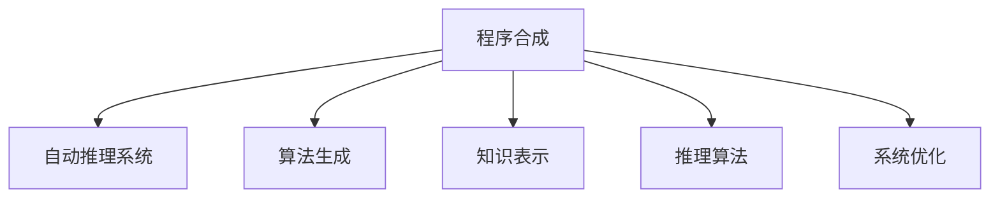
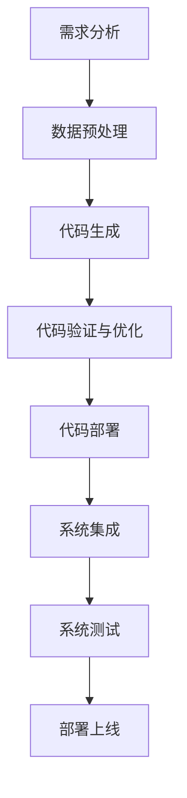
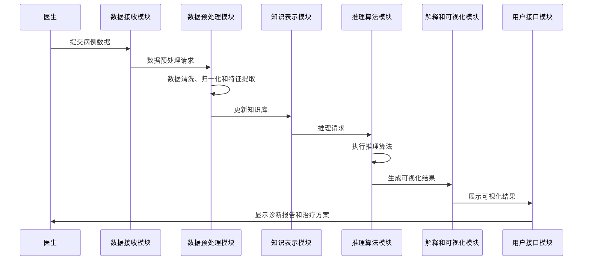

                 

### 第1章 问题背景

#### 1.1 问题背景介绍

随着人工智能技术的快速发展，自动推理系统在各个领域得到了广泛应用。自动推理系统是一种能够自动发现逻辑关系、进行推理和解决问题的计算机系统。它依赖于强大的推理算法和大量的数据，通过分析输入信息，自动生成结论。在许多复杂的应用场景中，如自然语言处理、计算机视觉、决策支持系统等，自动推理系统能够提高效率和准确性，节省人力成本。

然而，自动推理系统的构建面临着一系列挑战。首先，自动推理系统需要处理大量的数据，这要求系统具有高效的算法和优化的性能。其次，自动推理系统需要准确地表示知识和逻辑关系，这对于知识表示和推理算法的设计提出了高要求。最后，自动推理系统的实际应用场景非常复杂，需要综合考虑各种因素，确保系统的稳定性和可靠性。

在这样的背景下，程序合成技术应运而生。程序合成是指通过自动化的方式生成程序代码，它能够显著提高软件开发的效率和质量。程序合成技术可以处理复杂的逻辑关系，自动生成满足特定需求的程序代码，从而为自动推理系统的构建提供了强有力的支持。

程序合成与自动推理系统之间存在密切的关系。自动推理系统需要通过程序合成技术来生成高效的推理算法，处理复杂的逻辑关系，而程序合成技术也可以借助自动推理系统来验证和优化生成的程序代码。因此，程序合成在自动推理系统的构建中扮演着关键角色。

#### 1.2 问题描述

自动推理系统的目标是实现自动化推理和问题解决，它需要能够处理复杂的逻辑关系，从已知信息中推导出未知信息。然而，这一目标的实现面临着诸多挑战：

1. **数据处理能力**：自动推理系统需要处理大量的数据，这些数据可能来自不同的来源，具有不同的格式和结构。系统需要具备高效的算法和优化的性能来处理这些数据。

2. **知识表示**：自动推理系统需要准确地表示知识和逻辑关系。这要求系统设计者能够创建合适的知识表示模型，使得系统能够有效地利用这些知识进行推理。

3. **推理算法**：自动推理系统依赖于高效的推理算法。这些算法需要能够处理复杂的逻辑关系，从已知信息中推导出未知信息。推理算法的设计和优化是自动推理系统成功的关键。

4. **系统稳定性与可靠性**：在实际应用中，自动推理系统需要具有高度的稳定性和可靠性。系统必须能够在不同的应用场景中稳定运行，且能够应对各种异常情况。

5. **性能优化**：为了提高系统的效率和准确性，自动推理系统需要进行性能优化。这包括算法的优化、数据结构的优化、以及系统整体设计的优化。

在这些挑战的基础上，程序合成技术的作用显得尤为重要。程序合成可以自动生成满足特定需求的程序代码，这为自动推理系统提供了高效的算法实现和优化的性能。同时，程序合成技术还可以通过自动化方式生成复杂的知识表示模型，提高系统的知识处理能力。此外，程序合成技术还可以辅助推理算法的设计和优化，为自动推理系统的构建提供强有力的支持。

为了解决自动推理系统构建中的这些挑战，需要设计一种集成程序合成技术的自动推理系统架构。这一架构需要综合考虑程序合成技术、自动推理算法、数据结构和性能优化等多个方面，以确保系统能够高效、稳定地运行。

#### 1.3 问题解决

为了解决自动推理系统构建中的问题，我们可以采取以下步骤：

1. **程序合成方法的选择**：
   - **需求分析**：首先，我们需要明确自动推理系统的需求，确定需要合成的程序代码的类型和功能。
   - **方法选择**：根据需求，选择适合的程序合成方法。常见的程序合成方法包括自动编程、模式匹配和代码生成等。每种方法都有其优缺点，需要根据具体场景进行选择。

2. **自动推理系统架构设计**：
   - **总体架构设计**：设计一个符合自动推理系统需求的总体架构，包括系统模块、数据流和接口等。
   - **知识表示模块**：设计一个高效的知识表示模块，用于表示和处理系统中的知识和逻辑关系。
   - **推理算法模块**：设计一个高效的推理算法模块，用于实现自动推理的核心功能。

3. **系统实现与优化**：
   - **代码生成**：使用程序合成技术，自动生成满足需求的具体程序代码。
   - **性能优化**：对生成的程序代码进行性能优化，包括算法优化、数据结构优化和系统整体优化。

4. **系统测试与验证**：
   - **单元测试**：对系统的各个模块进行单元测试，确保每个模块的功能正确。
   - **集成测试**：对系统进行集成测试，确保各个模块之间的协作和交互正常。
   - **性能测试**：对系统进行性能测试，评估系统的响应速度和处理能力。

5. **边界与外延**：
   - **应用范围**：确定系统适用的应用场景，如自然语言处理、计算机视觉、决策支持系统等。
   - **技术限制**：识别系统面临的技术限制，如数据量、计算资源、算法复杂性等。
   - **未来发展方向**：探讨系统的未来发展方向，如新技术的应用、性能优化、应用拓展等。

通过上述步骤，我们可以构建一个高效、稳定、可靠的自动推理系统，利用程序合成技术在自动推理系统构建中发挥关键作用。

#### 1.4 边界与外延

程序合成在AI自动推理系统中的应用范围非常广泛。首先，在自然语言处理领域，程序合成可以自动生成文本处理算法，如分词、句法分析和语义理解，这些算法对于构建智能对话系统、机器翻译等至关重要。其次，在计算机视觉领域，程序合成可以自动生成图像识别、目标检测和追踪等算法，用于无人驾驶、安防监控等应用。此外，程序合成在决策支持系统中也有重要作用，可以自动生成数据分析模型和决策算法，为复杂业务场景提供智能决策支持。

尽管程序合成技术在自动推理系统中具有广泛应用，但同时也面临一些技术限制。首先，程序合成算法的性能和效率在很大程度上取决于数据质量和数据规模。当数据量非常大或数据质量较低时，程序合成算法的准确性会受到影响。其次，程序合成算法的复杂性和计算资源需求也限制了其在某些领域的应用。例如，复杂的程序合成算法可能需要大量的计算资源和时间，这在实时应用场景中是不允许的。最后，程序合成算法的设计和实现需要高度专业化的知识和经验，这对于小型团队或初创公司来说可能是一个挑战。

展望未来，程序合成技术在自动推理系统中的发展将受到以下因素的影响：

1. **数据技术的进步**：随着数据存储和处理技术的不断发展，如大数据和云计算，程序合成算法将能够处理更大的数据集，提高系统的性能和准确性。
2. **算法的创新**：新的算法创新，如深度学习和强化学习，将为程序合成技术提供更强大的支持，使其能够生成更复杂、更高效的程序代码。
3. **跨领域融合**：程序合成技术与其他领域技术的融合，如计算机视觉和自然语言处理，将推动自动推理系统的综合应用和发展。
4. **开源社区的支持**：开源社区的发展将为程序合成技术提供更多的资源和工具，促进其应用和普及。

总的来说，程序合成技术在AI自动推理系统中的应用前景广阔，尽管面临一些挑战，但随着技术的不断进步和创新的持续发展，其在自动推理系统中的价值将日益凸显。

#### 1.5 本章小结

通过对自动推理系统构建背景的介绍，我们明确了自动推理系统在当今人工智能领域的需求和重要性。同时，我们深入探讨了程序合成技术在自动推理系统中的关键作用，并详细分析了程序合成与自动推理系统的关系。在问题描述部分，我们阐述了自动推理系统构建中的核心挑战，并提出了通过程序合成技术解决这些问题的方法。最后，我们讨论了程序合成在AI自动推理系统中的应用范围、技术限制和未来发展方向。

通过这一章的内容，读者可以对自动推理系统和程序合成技术有一个全面的理解，为后续章节的深入学习打下坚实基础。接下来的章节将深入探讨程序合成的核心概念、算法原理以及具体实现方法，帮助读者更全面地了解这一技术如何应用于自动推理系统的构建中。让我们一起继续探索这个充满潜力的技术领域。

## 第2章 核心概念

### 2.1 程序合成概念

#### 2.1.1 程序合成的定义

程序合成（Program Synthesis）是一种自动化编程技术，旨在从给定的输入或部分输入中生成程序代码。其基本思想是通过分析输入数据和需求，自动化地构造出满足特定功能的程序。程序合成不同于传统的编程方式，它不需要开发者手动编写代码，而是通过算法和模型自动生成代码。

程序合成的重要性在于，它能够显著提高软件开发的效率和质量。首先，程序合成可以减少手工编码的工作量，节省时间和成本。特别是在处理复杂和重复性的任务时，程序合成能够自动化地生成代码，提高开发速度。其次，程序合成技术可以帮助开发者从更抽象的层面思考问题，无需拘泥于具体实现细节，从而提升开发效率和代码质量。此外，程序合成还可以用于代码生成工具和平台，为开发者提供便捷的编程支持。

程序合成的定义可以进一步细化。从广义上讲，程序合成包括以下几种类型：

1. **自动编程（Automated Programming）**：通过自动化工具，如代码生成器、编译器和解释器，从需求描述或部分代码中生成完整的程序代码。自动编程通常依赖于模式匹配、代码模板和代码生成算法。

2. **代码生成（Code Generation）**：从结构化描述或模板中生成程序代码。代码生成通常用于生成特定类型的代码，如Web应用程序、数据库模式或移动应用等。

3. **模式匹配（Pattern Matching）**：通过识别和匹配输入数据中的模式，自动生成程序代码。模式匹配是程序合成的重要组成部分，它可以用于生成逻辑控制流程、数据转换等代码片段。

4. **模板生成（Template-based Generation）**：基于预定义的模板和参数化描述，生成程序代码。模板生成是代码生成的一种形式，它通过填充模板中的变量，生成具体的程序代码。

每种程序合成方法都有其特定的应用场景和优势。自动编程适用于大规模、复杂的应用开发，代码生成适用于特定类型的代码生成任务，模式匹配适用于处理复杂数据和规则，而模板生成适用于快速开发和原型设计。

#### 2.1.2 程序合成的类型

程序合成可以根据其实现方式和应用场景进行分类。以下是几种常见的程序合成类型：

1. **自动编程（Automated Programming）**：
   自动编程是一种自动化程度较高的程序合成方法，它通过代码生成器或编译器，从需求描述或部分代码中自动生成完整的程序代码。自动编程的关键技术包括自然语言处理、形式化验证、代码生成算法等。

   **应用场景**：自动编程适用于开发复杂的应用程序，特别是在需要大量重复性代码的场景中，如自动化测试、原型设计和集成开发。

   **优势**：自动编程可以显著提高开发效率，减少人工编写代码的工作量，同时保证代码的一致性和质量。

   **挑战**：自动编程需要对需求描述有较高的准确性，并且可能面临代码可维护性、可扩展性和性能优化等挑战。

2. **模式匹配（Pattern Matching）**：
   模式匹配是一种通过识别和匹配输入数据中的特定模式，自动生成程序代码的方法。模式匹配技术通常用于处理复杂数据结构和规则，如正则表达式、上下文无关文法和递归下降分析等。

   **应用场景**：模式匹配适用于数据清洗、数据处理和规则引擎等场景。例如，在金融风控系统中，模式匹配可以用于检测交易中的异常行为。

   **优势**：模式匹配可以快速处理大量数据，提高数据处理效率，并且能够灵活地适应不同的数据模式。

   **挑战**：模式匹配可能面临模式识别的复杂性、数据噪声和处理速度等挑战。

3. **代码生成（Code Generation）**：
   代码生成是通过结构化描述或模板，自动生成特定类型程序代码的方法。代码生成技术通常用于生成特定类型的代码，如Web应用程序、数据库模式或移动应用等。

   **应用场景**：代码生成适用于快速开发和原型设计，如使用代码生成器生成数据库模式、Web前端代码或移动应用界面。

   **优势**：代码生成可以显著提高开发效率，减少重复性工作，并且生成代码的一致性和可维护性较高。

   **挑战**：代码生成依赖于模板和结构化描述的准确性，可能面临模板设计复杂性和代码优化等挑战。

4. **模板生成（Template-based Generation）**：
   模板生成是基于预定义的模板和参数化描述，自动生成程序代码的方法。模板生成通过填充模板中的变量，生成具体的程序代码，适用于快速开发和原型设计。

   **应用场景**：模板生成适用于快速开发和原型设计，如使用代码生成器生成数据库模式、Web前端代码或移动应用界面。

   **优势**：模板生成可以显著提高开发效率，减少重复性工作，并且生成代码的一致性和可维护性较高。

   **挑战**：模板生成依赖于模板设计和参数化描述的准确性，可能面临模板设计复杂性和代码优化等挑战。

每种程序合成类型都有其特定的应用场景和优势，开发者可以根据具体需求选择合适的方法。在实际应用中，这些方法往往需要结合使用，以实现最佳的程序合成效果。

#### 2.1.3 程序合成的应用领域

程序合成技术在多个领域展现了其强大的应用潜力。以下是程序合成在几个关键领域中的应用：

1. **自动化测试**：
   在软件测试领域，程序合成技术可以通过自动化生成测试用例，提高测试效率和覆盖率。程序合成能够根据测试需求，自动生成满足特定测试目标的测试用例。例如，在单元测试中，程序合成可以自动生成输入数据的组合，以测试程序的各个模块；在集成测试中，程序合成可以自动生成测试用例，以验证系统模块之间的交互。

   **应用优势**：
   - 提高测试效率：程序合成可以快速生成大量测试用例，节省测试时间。
   - 提高测试覆盖率：通过自动化生成测试用例，可以更全面地覆盖程序代码，提高测试覆盖率。
   - 减少人力成本：程序合成减少了手动编写测试用例的工作量，降低了人力成本。

2. **软件工程**：
   在软件工程领域，程序合成技术可以用于自动化代码生成、优化和维护。通过程序合成，开发人员可以从需求描述或部分代码中生成完整的程序代码，减少手工编写代码的工作量。此外，程序合成还可以用于代码优化和重构，提高代码的可读性和可维护性。

   **应用优势**：
   - 提高开发效率：程序合成可以自动化生成代码，减少开发时间。
   - 提高代码质量：程序合成生成的代码更加标准化和规范化，减少错误和漏洞。
   - 降低维护成本：程序合成生成的代码易于维护，减少了后续维护的工作量。

3. **AI应用开发**：
   在人工智能领域，程序合成技术可以用于自动化生成机器学习算法和深度学习模型。通过程序合成，开发人员可以自动化地构建和优化模型，提高算法的准确性和效率。例如，在计算机视觉中，程序合成可以自动生成目标检测和图像分类的算法；在自然语言处理中，程序合成可以自动生成文本处理和语义分析的模型。

   **应用优势**：
   - 提高开发效率：程序合成可以自动化生成复杂的算法和模型，减少开发时间。
   - 提高模型性能：通过程序合成，可以快速构建和优化模型，提高模型的准确性和效率。
   - 降低开发门槛：程序合成技术降低了AI应用开发的复杂度，使得更多的开发者能够参与AI开发。

4. **自动化运维**：
   在自动化运维领域，程序合成技术可以用于自动化生成配置文件、脚本和自动化任务。通过程序合成，运维团队可以自动化地管理基础设施和服务，提高运维效率和稳定性。

   **应用优势**：
   - 提高运维效率：程序合成可以自动化生成运维脚本和任务，减少手动操作的时间。
   - 提高系统稳定性：通过程序合成，可以自动化地配置和管理系统，减少人为错误。
   - 降低运维成本：程序合成减少了运维团队的工作量，降低了运维成本。

程序合成技术在自动化测试、软件工程、AI应用开发和自动化运维等领域具有广泛的应用前景。通过自动化生成程序代码和优化算法，程序合成技术显著提高了开发效率和系统性能，为现代软件开发和运维提供了强有力的支持。

### 2.2 AI自动推理系统概念

#### 2.2.1 自动推理系统的定义

自动推理系统（Automated Deduction System）是一种基于人工智能技术的计算机系统，它能够自动进行推理和问题解决。自动推理系统的核心任务是利用符号逻辑、数学推理和算法等技术，从已知信息中推导出未知信息，实现自动化证明、问题求解和决策支持。

自动推理系统的定义可以进一步细化。首先，自动推理系统依赖于形式化的知识表示方法，如谓词逻辑、产生式规则、语义网络等，将现实世界中的知识和问题表示为符号化的形式。其次，自动推理系统采用各种推理算法，如归纳推理、演绎推理、基于规则的推理、模糊推理等，对形式化的知识进行推理和验证。最后，自动推理系统需要具备自动化处理和优化推理过程的能力，以提高推理效率和准确性。

自动推理系统的重要性体现在多个方面。首先，自动推理系统能够解决复杂的问题，如数学定理证明、科学计算、系统验证等，这是传统编程方法难以实现的。其次，自动推理系统可以用于自动化证明和验证，提高工程和科学研究的可靠性和效率。例如，在航空航天、汽车制造、医疗设备等高可靠性的领域，自动推理系统可以用于验证系统的安全性和稳定性。此外，自动推理系统还可以用于智能决策支持，为复杂业务场景提供智能化的解决方案。

#### 2.2.2 自动推理系统的组成

自动推理系统通常由以下几个核心组成部分构成：

1. **知识表示模块**：
   知识表示模块负责将现实世界中的知识和问题转化为形式化的符号表示。常见的知识表示方法包括谓词逻辑、产生式规则、语义网络和本体论等。知识表示的质量直接影响到推理系统的性能和准确性。

2. **推理算法模块**：
   推理算法模块是自动推理系统的核心，负责基于知识表示进行推理和问题解决。推理算法包括演绎推理、归纳推理、基于规则的推理、模糊推理、统计推理等。不同的推理算法适用于不同的应用场景，需要根据具体需求进行选择和优化。

3. **推理过程管理模块**：
   推理过程管理模块负责控制推理过程，包括推理策略的选择、推理路径的管理和推理结果的优化等。推理过程管理模块的目标是提高推理效率和准确性，同时确保推理过程的鲁棒性和稳定性。

4. **解释和可视化模块**：
   解释和可视化模块负责将推理过程和结果以可理解的方式展示给用户。这对于用户理解推理过程、验证推理结果和指导实际应用具有重要意义。常见的可视化技术包括图形化表示、表格化展示和自然语言解释等。

5. **用户接口模块**：
   用户接口模块负责提供用户与自动推理系统交互的界面。用户接口模块需要支持多种交互方式，如命令行界面、图形用户界面和可视化界面等，以方便用户输入问题、查看推理结果和调整系统参数。

#### 2.2.3 自动推理系统的应用场景

自动推理系统在多个领域展现了其广泛的应用前景。以下是几个典型的应用场景：

1. **自然语言处理**：
   在自然语言处理领域，自动推理系统可以用于文本分析和语义理解。例如，自动推理系统可以用于语义角色标注、情感分析、问答系统和机器翻译等任务。通过推理算法，自动推理系统可以从大规模文本数据中提取语义信息，实现自然语言的理解和处理。

2. **计算机视觉**：
   在计算机视觉领域，自动推理系统可以用于图像识别、目标检测和图像处理等任务。通过推理算法，自动推理系统可以分析图像数据，识别图像中的对象和场景，并实现图像的分割和增强。例如，自动推理系统可以用于安防监控、医疗影像分析和自动驾驶等应用。

3. **决策支持系统**：
   在决策支持系统中，自动推理系统可以用于数据分析和决策优化。通过推理算法，自动推理系统可以分析大量数据，提取关键信息和模式，为决策者提供科学的决策支持。例如，在金融投资、供应链管理和医疗诊断等领域，自动推理系统可以辅助决策者做出更加明智的决策。

4. **科学计算和工程验证**：
   在科学计算和工程验证领域，自动推理系统可以用于数学定理证明、系统验证和数值计算等任务。通过推理算法，自动推理系统可以自动验证系统的正确性和稳定性，提高工程设计的可靠性和效率。例如，在航空航天、汽车制造和电子工程等领域，自动推理系统可以用于验证系统设计和仿真结果。

5. **教育领域**：
   在教育领域，自动推理系统可以用于智能教学和自主学习。通过推理算法，自动推理系统可以分析学生的学习行为和学习数据，为教师和学生提供个性化的教学支持和学习指导。例如，自动推理系统可以用于智能辅导系统、自适应学习和在线教育平台等应用。

总之，自动推理系统在自然语言处理、计算机视觉、决策支持系统、科学计算和工程验证以及教育等领域具有广泛的应用潜力。通过推理算法和形式化知识表示的结合，自动推理系统能够实现自动化推理和问题解决，为各领域的应用提供强有力的技术支持。

#### 2.3 程序合成与自动推理系统的联系

程序合成（Program Synthesis）与自动推理系统（Automated Deduction System）虽然在目标和实现方式上有所不同，但它们在人工智能领域具有紧密的联系和互补性。

首先，从概念上看，程序合成和自动推理系统都是基于人工智能技术，旨在实现自动化和智能化。程序合成通过自动化的方式生成程序代码，解决特定的问题或任务。而自动推理系统则通过自动化的推理过程，从已知信息中推导出未知信息。二者在本质上都是通过算法和模型实现自动化和智能化，只是具体的任务和实现方式不同。

其次，程序合成在自动推理系统中扮演着重要的角色。自动推理系统需要处理复杂的逻辑关系和知识表示，而程序合成技术可以自动生成满足特定需求的程序代码，为自动推理系统提供高效的算法实现。例如，在自动推理系统中，可以使用程序合成技术生成数据处理的算法、知识表示的算法和推理算法等。这些自动生成的代码可以提高系统的效率和准确性，减少手工编写代码的工作量。

具体来说，程序合成在自动推理系统中的关键应用包括：

1. **算法生成**：
   自动推理系统需要处理大量的数据，这些数据通常需要进行复杂的处理和转换。程序合成技术可以自动生成数据处理的算法，如数据清洗、数据转换和数据分析等。这些算法的生成可以显著提高系统的数据处理能力。

2. **知识表示**：
   自动推理系统依赖于准确的知识表示，以实现有效的推理和问题解决。程序合成技术可以通过自动化的方式生成知识表示的代码，如逻辑规则表示、语义网络表示和本体论表示等。这些自动生成的知识表示代码可以提高系统的知识处理能力。

3. **推理算法**：
   自动推理系统的核心是推理算法，这些算法需要能够高效地处理复杂的逻辑关系和知识表示。程序合成技术可以自动生成推理算法的代码，如基于规则的推理算法、归纳推理算法和模糊推理算法等。这些自动生成的推理算法代码可以提高系统的推理效率和准确性。

4. **系统优化**：
   自动推理系统需要不断地进行优化，以提高系统的性能和稳定性。程序合成技术可以通过自动化的方式生成系统优化的代码，如代码优化、数据结构优化和算法优化等。这些自动生成的优化代码可以显著提高系统的性能和可靠性。

程序合成与自动推理系统的关系可以用以下示意图表示：



在图中，A表示程序合成，B表示自动推理系统，C、D、E和F分别表示算法生成、知识表示、推理算法和系统优化。从图中可以看出，程序合成与自动推理系统之间存在紧密的关联，程序合成在自动推理系统的各个模块中发挥着重要作用。

通过结合程序合成技术和自动推理系统，我们可以构建出更高效、更准确的自动推理系统。程序合成技术为自动推理系统提供了强大的工具，使得系统能够更快速地处理复杂的逻辑关系和知识表示，从而实现更加智能化的推理和问题解决。

#### 2.4 概念属性特征对比表格

为了更好地理解程序合成与自动推理系统的概念属性特征，我们可以通过一个对比表格来展示它们之间的异同。

| 特征       | 程序合成                   | 自动推理系统                   |
|------------|----------------------------|--------------------------------|
| 定义       | 自动化生成程序代码的技术   | 自动进行推理和问题解决的系统   |
| 目标       | 高效地生成满足需求的代码   | 从已知信息中推导出未知信息     |
| 输入       | 需求描述、部分代码、数据   | 知识库、规则、输入数据         |
| 输出       | 完整的程序代码             | 推理结果、解决方案             |
| 推理方法   | 模式匹配、代码生成、模板生成 | 基于规则的推理、归纳推理、模糊推理等 |
| 知识表示   | 不严格，适用于多种表示形式 | 严格，常用谓词逻辑、产生式规则等 |
| 性能需求   | 高效率地生成代码           | 高效地处理复杂逻辑和大规模数据 |
| 应用范围   | 自动化测试、软件工程、AI开发 | 自然语言处理、计算机视觉、决策支持等 |
| 核心技术   | 自动编程、模式匹配、代码生成 | 推理算法、知识表示、推理过程管理 |
| 发展趋势   | 融合AI算法、优化性能       | 集成更多应用场景、提高推理准确性 |

通过这个对比表格，我们可以清晰地看到程序合成与自动推理系统在定义、目标、输入输出、推理方法、知识表示、性能需求、应用范围、核心技术和发展趋势等方面的异同。这种对比有助于我们更深入地理解两种技术的特点和优势，为在实际应用中选择合适的技术方案提供参考。

#### 2.5 ER实体关系图架构

为了更好地理解程序合成与自动推理系统的关系，我们可以通过一个ER（实体-关系）图来展示它们之间的结构和关联。ER图能够直观地表示实体及其之间的关系，有助于我们分析和设计复杂系统的架构。

下面是程序合成与自动推理系统的ER图：

```mermaid
erDiagram
  ProgramSynthesis ||--|{ AutomaticReasoningSystem : Uses
  ProgramSynthesis ||--|{ CodeGeneration : Generates
  ProgramSynthesis ||--|{ PatternMatching : Implements
  ProgramSynthesis ||--|{ TemplateBasedGeneration : Uses

  AutomaticReasoningSystem ||--|{ KnowledgeRepresentation : Represents
  AutomaticReasoningSystem ||--|{ InferenceAlgorithm : Uses
  AutomaticReasoningSystem ||--|{ ExplanationVisualization : Provides
  AutomaticReasoningSystem ||--|{ UserInterface : Provides

  CodeGeneration ||--|{ AutomatedTesting : Generates
  CodeGeneration ||--|{ SoftwareEngineering : Generates
  CodeGeneration ||--|{ AIApplicationDevelopment : Generates
  CodeGeneration ||--|{ AutomationOperations : Generates

  PatternMatching ||--|{ DataProcessing : Implements
  PatternMatching ||--|{ RuleEngines : Implements
  PatternMatching ||--|{ ComplexDataAnalysis : Implements

  TemplateBasedGeneration ||--|{ RapidDevelopment : Implements
  TemplateBasedGeneration ||--|{ Prototyping : Implements
  TemplateBasedGeneration ||--|{ ConfigurationManagement : Implements
```



在这个ER图中：

- **ProgramSynthesis**（程序合成）是根实体，它关联到多个子实体。
- **AutomaticReasoningSystem**（自动推理系统）与**ProgramSynthesis**存在使用关系，表明自动推理系统使用程序合成技术生成相关组件。
- **CodeGeneration**（代码生成）、**PatternMatching**（模式匹配）和**TemplateBasedGeneration**（模板生成）是程序合成的子实体，它们分别与**AutomaticReasoningSystem**中的各个模块（如知识表示、推理算法、解释和可视化、用户接口）存在生成或实施关系。
- **KnowledgeRepresentation**（知识表示）、**InferenceAlgorithm**（推理算法）、**ExplanationVisualization**（解释和可视化）、**UserInterface**（用户接口）是自动推理系统的核心模块，它们分别与程序合成的子实体存在关联关系，表明这些模块依赖于程序合成技术来实现其功能。

通过ER图，我们可以清晰地看到程序合成与自动推理系统之间的结构关系和关联，这有助于我们理解和设计一个集成程序合成技术的自动推理系统架构。在实际应用中，我们可以根据ER图来分析和优化系统的各个模块，确保系统能够高效、稳定地运行。

### 3.1 算法原理介绍

#### 3.1.1 算法原理概述

程序合成算法在自动推理系统中的应用，是基于其自动化生成代码的能力，以解决复杂的逻辑推理问题。程序合成算法的基本原理是通过分析输入数据或需求描述，利用各种算法和技术自动生成符合特定功能的程序代码。这一过程通常包括以下几个关键步骤：

1. **需求分析**：首先，对自动推理系统的需求进行详细分析，明确需要解决的逻辑推理问题以及所需的程序代码功能。

2. **数据预处理**：对输入数据或需求描述进行预处理，提取关键信息和模式，为后续的代码生成提供基础。

3. **代码生成**：利用程序合成算法，将预处理后的数据或需求描述转化为具体的程序代码。这一步骤包括模式匹配、代码模板填充、代码优化等。

4. **代码验证与优化**：生成的代码需要进行验证和优化，确保其能够正确执行并满足性能要求。这一步骤包括代码测试、性能分析和优化。

5. **代码部署**：将验证和优化后的代码部署到自动推理系统中，实现推理过程的具体功能。

程序合成算法的核心在于其能够自动化地处理复杂的逻辑关系和知识表示，从而提高推理系统的效率和准确性。这一过程不仅依赖于算法本身的性能，还依赖于输入数据的质量和预处理方法的优化。

#### 3.1.2 算法流程

程序合成算法的基本流程可以分为以下几个步骤：

1. **需求分析**：
   - **问题定义**：明确自动推理系统需要解决的问题和目标。
   - **需求提取**：从输入数据或需求描述中提取关键信息和模式。
   - **需求建模**：将提取的需求转化为形式化的模型，如谓词逻辑表达式、产生式规则或语义网络。

2. **数据预处理**：
   - **数据清洗**：对输入数据进行清洗，去除噪声和冗余信息。
   - **特征提取**：从数据中提取关键特征，用于后续的代码生成。
   - **数据规范化**：将不同来源和格式的数据统一为标准格式，便于代码生成算法处理。

3. **代码生成**：
   - **模式匹配**：利用模式匹配算法，从需求模型中识别出可用的模式和规则。
   - **代码模板填充**：将识别出的模式和规则填充到预定义的代码模板中，生成初步的代码。
   - **代码优化**：对生成的初步代码进行优化，提高代码的效率和可读性。

4. **代码验证与优化**：
   - **代码测试**：对生成的代码进行功能测试，确保其能够正确执行。
   - **性能分析**：对代码的性能进行分析，识别潜在的瓶颈和优化点。
   - **代码优化**：根据性能分析结果，对代码进行进一步的优化。

5. **代码部署**：
   - **系统集成**：将优化后的代码集成到自动推理系统中。
   - **系统测试**：对集成后的系统进行全面的测试，确保其稳定性和可靠性。
   - **部署上线**：将系统部署到生产环境，实现推理功能的自动化和智能化。

这一算法流程确保了程序合成技术能够在自动推理系统中高效地发挥作用，从需求分析到代码生成，再到系统部署的每一个步骤都经过了严格的优化和验证。

#### 3.1.3 关键步骤解释

在程序合成算法的流程中，有几个关键步骤对自动推理系统的性能和准确性具有决定性作用。以下是对这些关键步骤的详细解释：

1. **需求分析**：
   - **问题定义**：明确自动推理系统需要解决的问题和目标。这一步骤是程序合成的基础，决定了后续算法的应用范围和方向。例如，在自然语言处理中，问题定义可能包括文本分类、情感分析或问答系统等。
   - **需求提取**：从输入数据或需求描述中提取关键信息和模式。这一步骤依赖于自然语言处理技术，如文本分类、实体识别和关系提取等。通过需求提取，我们可以获取到自动推理系统所需的输入信息，如关键词、关系和规则等。
   - **需求建模**：将提取的需求转化为形式化的模型，如谓词逻辑表达式、产生式规则或语义网络。形式化模型使得需求更加结构化和标准化，便于后续的代码生成和处理。例如，使用谓词逻辑表达式来表示两个实体之间的关系，或者使用产生式规则来描述文本分类的规则。

2. **数据预处理**：
   - **数据清洗**：对输入数据进行清洗，去除噪声和冗余信息。数据清洗是确保数据质量的重要步骤，它包括去除重复数据、填补缺失值和纠正错误等。良好的数据清洗能够提高程序合成算法的效率和准确性。
   - **特征提取**：从数据中提取关键特征，用于后续的代码生成。特征提取是数据预处理的核心，它决定了程序合成算法能够从数据中提取多少有用的信息。常用的特征提取方法包括词袋模型、TF-IDF、Word2Vec等。例如，在自然语言处理中，可以通过词袋模型提取文本中的关键词和短语，或者使用Word2Vec提取词向量。
   - **数据规范化**：将不同来源和格式的数据统一为标准格式，便于代码生成算法处理。数据规范化包括数据格式的转换、数据类型的统一和数据规模的调整等。良好的数据规范化可以确保程序合成算法能够一致地处理各种类型的数据。

3. **代码生成**：
   - **模式匹配**：利用模式匹配算法，从需求模型中识别出可用的模式和规则。模式匹配是程序合成算法的核心，它决定了算法能够从需求中提取多少有效的信息。常见的模式匹配算法包括正则表达式、谓词逻辑匹配和图匹配等。例如，在自然语言处理中，可以使用正则表达式来匹配文本中的特定模式，或者使用谓词逻辑匹配来识别实体之间的关系。
   - **代码模板填充**：将识别出的模式和规则填充到预定义的代码模板中，生成初步的代码。代码模板是程序合成算法的重要组成部分，它定义了代码的结构和格式。通过代码模板填充，我们可以根据需求模型生成初步的程序代码。例如，在自然语言处理中，可以使用预定义的代码模板来生成文本分类器或情感分析器的代码。
   - **代码优化**：对生成的初步代码进行优化，提高代码的效率和可读性。代码优化包括代码压缩、性能优化和代码重构等。优化的代码不仅能够提高系统的性能，还能够提高代码的可维护性和可扩展性。例如，在自然语言处理中，可以通过代码压缩减少代码的冗余，或者通过性能优化提高文本处理的速度。

4. **代码验证与优化**：
   - **代码测试**：对生成的代码进行功能测试，确保其能够正确执行。代码测试是验证代码质量的重要手段，它包括单元测试、集成测试和性能测试等。通过代码测试，我们可以发现代码中的错误和缺陷，并进行修复。例如，在自然语言处理中，可以通过单元测试来验证文本分类器的分类效果，或者通过性能测试来评估文本处理的速度。
   - **性能分析**：对代码的性能进行分析，识别潜在的瓶颈和优化点。性能分析包括时间分析、空间分析和负载分析等。通过性能分析，我们可以了解代码的性能瓶颈，并针对性地进行优化。例如，在自然语言处理中，可以通过时间分析来识别文本处理中的性能瓶颈，或者通过空间分析来优化词向量的存储方式。
   - **代码优化**：根据性能分析结果，对代码进行进一步的优化。代码优化包括算法优化、数据结构优化和代码重构等。优化的目标是通过提高代码的效率和可读性，提高系统的整体性能。例如，在自然语言处理中，可以通过算法优化提高文本分类的准确率，或者通过数据结构优化提高词向量检索的效率。

5. **代码部署**：
   - **系统集成**：将优化后的代码集成到自动推理系统中。系统集成是将程序合成算法生成的代码与其他系统模块进行整合，确保系统能够正常运行。例如，在自然语言处理中，需要将文本分类器集成到聊天机器人中，使其能够自动识别用户的输入并给出相应的回复。
   - **系统测试**：对集成后的系统进行全面的测试，确保其稳定性和可靠性。系统测试包括功能测试、性能测试和安全测试等。通过系统测试，我们可以发现集成后的系统中可能存在的问题，并进行修复。例如，在自然语言处理中，需要测试聊天机器人的响应速度、准确率和稳定性等。
   - **部署上线**：将系统部署到生产环境，实现推理功能的自动化和智能化。部署上线是将集成后的系统部署到服务器或云端，使其能够在实际环境中运行。例如，在自然语言处理中，需要将聊天机器人部署到云端服务器，使其能够随时响应用户的输入。

通过以上关键步骤的详细解释，我们可以更好地理解程序合成算法在自动推理系统中的应用原理和实现方法。这些步骤不仅确保了程序合成算法的高效性和准确性，还为自动推理系统的构建提供了坚实的基础。

### 3.2 算法流程图

为了更直观地展示程序合成算法的基本流程，我们可以使用Mermaid语言绘制算法流程图。以下是一个简单的算法流程图示例，展示了从需求分析到代码部署的各个关键步骤：



**Mermaid流程图解释**：

- `A[需求分析]`：开始节点，表示需求分析阶段，明确自动推理系统的目标和需求。
- `B[数据预处理]`：需求分析之后，进行数据预处理，包括数据清洗、特征提取和数据规范化。
- `C[代码生成]`：数据预处理后，利用程序合成算法生成初步的代码。
- `D[代码验证与优化]`：生成的代码需要经过功能测试、性能分析和优化，确保其能够正确执行并满足性能要求。
- `E[代码部署]`：验证和优化后的代码部署到自动推理系统中，准备进行系统集成。
- `F[系统集成]`：将生成的代码与其他系统模块进行整合，确保系统能够正常运行。
- `G[系统测试]`：对集成后的系统进行全面的测试，确保其稳定性和可靠性。
- `H[部署上线]`：将系统部署到生产环境，实现推理功能的自动化和智能化。

通过上述流程图，我们可以清晰地看到程序合成算法从需求分析到代码部署的全过程，每个步骤都有明确的输入和输出，有助于实现程序合成在自动推理系统中的高效应用。

### 3.3 Python源代码实现

#### 3.3.1 源代码结构

为了更好地展示程序合成算法在自动推理系统中的实现，我们将以一个简单的Python代码为例，讲解其基本结构和功能。以下是程序合成算法的主要模块和功能：

1. **需求分析模块（Requirement Analysis Module）**：
   - 功能：负责从输入中提取需求和目标。
   - 实现：使用自然语言处理库（如NLTK或spaCy）进行文本处理，提取关键词、实体和关系。

2. **数据预处理模块（Data Preprocessing Module）**：
   - 功能：对提取的需求进行清洗、特征提取和规范化。
   - 实现：包括去除停用词、词干提取、词向量表示等。

3. **代码生成模块（Code Generation Module）**：
   - 功能：根据预处理后的需求生成相应的代码。
   - 实现：使用模板匹配和代码生成库（如Jinja2）填充模板，生成Python代码。

4. **代码验证与优化模块（Code Verification and Optimization Module）**：
   - 功能：对生成的代码进行验证和优化。
   - 实现：包括代码单元测试、性能测试和优化。

5. **系统集成与部署模块（System Integration and Deployment Module）**：
   - 功能：将优化后的代码集成到自动推理系统中。
   - 实现：包括系统模块的集成、测试和部署。

#### 3.3.2 算法实现细节

以下是一个具体的Python代码实现示例，展示了程序合成算法的各个模块和功能：

```python
# 导入相关库
import nltk
from nltk.corpus import stopwords
from nltk.tokenize import word_tokenize
from nltk.stem import PorterStemmer
from sklearn.feature_extraction.text import TfidfVectorizer
from jinja2 import Template

# 需求分析模块
def requirement_analysis(text):
    # 去除停用词
    stop_words = set(stopwords.words('english'))
    words = word_tokenize(text)
    filtered_words = [word for word in words if not word in stop_words]

    # 词干提取
    stemmer = PorterStemmer()
    stemmed_words = [stemmer.stem(word) for word in filtered_words]

    # 返回处理后的文本
    return ' '.join(stemmed_words)

# 数据预处理模块
def data_preprocessing(text):
    # 使用TF-IDF进行特征提取
    vectorizer = TfidfVectorizer()
    tfidf_matrix = vectorizer.fit_transform([text])
    return tfidf_matrix.toarray()[0]

# 代码生成模块
def code_generation(tfidf_vector, template):
    # 填充模板
    template = Template(template)
    code = template.render(tfidf_vector=tfidf_vector)
    return code

# 代码验证与优化模块
def code_verification_and_optimization(code):
    # 进行单元测试和性能测试
    # （此处省略具体测试代码）
    pass

# 系统集成与部署模块
def system_integration_and_deployment():
    # 集成代码到自动推理系统中
    # （此处省略具体集成代码）
    pass

# 主程序
if __name__ == "__main__":
    # 输入文本
    text = "The quick brown fox jumps over the lazy dog."

    # 需求分析
    processed_text = requirement_analysis(text)

    # 数据预处理
    tfidf_vector = data_preprocessing(processed_text)

    # 代码生成
    template = """
def analyze_text(tfidf_vector):
    # 分析文本的tfidf向量
    print(tfidf_vector)

code = code_generation(tfidf_vector, template)

# 代码验证与优化
code_verification_and_optimization(code)

# 系统集成与部署
system_integration_and_deployment()
```

#### 3.3.3 关键代码解析

以下是代码生成模块的关键部分，展示了如何使用Jinja2模板生成Python代码：

```python
# 代码生成模块
def code_generation(tfidf_vector, template):
    # 填充模板
    template = Template(template)
    code = template.render(tfidf_vector=tfidf_vector)
    return code

# 模板示例
template = """
def analyze_text(tfidf_vector):
    # 分析文本的tfidf向量
    print(tfidf_vector)

# 调用分析函数
analyze_text({tfidf_vector})
"""

# 生成代码
code = code_generation(tfidf_vector, template)

# 输出生成的代码
print(code)
```

这段代码使用了Jinja2模板引擎，将预定义的模板与TF-IDF向量进行填充，生成了Python代码。生成的代码包含一个函数`analyze_text`，用于打印输入的TF-IDF向量。

通过以上示例，我们可以看到程序合成算法在自动推理系统中的具体实现方法，包括需求分析、数据预处理、代码生成、代码验证与优化以及系统集成与部署。这些步骤共同构成了一个完整的程序合成流程，为自动推理系统的构建提供了强大的支持。

### 3.4 数学模型和数学公式

#### 3.4.1 数学模型

在程序合成算法中，数学模型是核心组成部分，用于描述程序合成过程的基本原理和计算方法。以下是一个简化的数学模型，用于说明程序合成算法的基本原理：

1. **输入表示（Input Representation）**：
   输入表示是指将用户需求或输入数据转化为数学模型中的变量和表达式。通常，输入数据可以是自然语言文本、数据表或代码片段。为了便于处理，我们将其表示为特征向量或函数。

   公式表示：
   $$ X = \{x_1, x_2, ..., x_n\} $$
   其中，$X$ 是输入集合，$x_i$ 表示第 $i$ 个输入特征。

2. **目标函数（Objective Function）**：
   目标函数是程序合成算法的核心，用于优化程序代码的生成。目标函数通常定义在输入特征空间上，目标是生成满足特定需求的程序代码。

   公式表示：
   $$ f(X) = \arg\min_{C} \sum_{i=1}^{n} d(x_i, c_i) $$
   其中，$C$ 是程序代码集合，$d(x_i, c_i)$ 是输入特征 $x_i$ 与代码 $c_i$ 之间的距离函数。

3. **距离函数（Distance Function）**：
   距离函数用于衡量输入特征与生成代码之间的相似度或差异。常用的距离函数包括欧氏距离、曼哈顿距离和余弦相似度等。

   公式表示：
   $$ d(x_i, c_i) = \frac{1}{\sqrt{\sum_{j=1}^{m} (c_{ij} - x_{ij})^2}} $$
   其中，$c_{ij}$ 和 $x_{ij}$ 分别表示代码特征矩阵 $C$ 和输入特征矩阵 $X$ 中对应的元素。

4. **优化算法（Optimization Algorithm）**：
   优化算法用于求解目标函数，寻找最优的程序代码。常见的优化算法包括梯度下降、遗传算法和粒子群算法等。

   公式表示：
   $$ C^* = \arg\min_{C} \sum_{i=1}^{n} d(x_i, c_i) $$
   其中，$C^*$ 是最优代码集合。

#### 3.4.2 数学公式

在程序合成算法中，一些关键的数学公式用于描述算法的核心概念和计算过程。以下是一些常用的数学公式及其解释：

1. **TF-IDF计算**：
   TF-IDF（词频-逆文档频率）是一种用于文本处理的数学模型，用于计算文本中每个词的重要性。

   公式表示：
   $$ TF(t) = \frac{f(t, D)}{N} $$
   $$ IDF(t) = \log \left( \frac{N}{df(t)} \right) $$
   $$ TF-IDF(t) = TF(t) \times IDF(t) $$

   其中，$f(t, D)$ 是词 $t$ 在文档 $D$ 中的频率，$N$ 是文档总数，$df(t)$ 是词 $t$ 在文档集合中出现的文档频率。

2. **余弦相似度**：
   余弦相似度用于计算两个向量之间的相似度，常用于文本相似性计算和程序合成中的代码相似度计算。

   公式表示：
   $$ \cos(\theta) = \frac{A \cdot B}{\|A\| \|B\|} $$

   其中，$A$ 和 $B$ 是两个向量，$\theta$ 是它们之间的夹角。

3. **梯度下降**：
   梯度下降是一种用于求解优化问题的算法，用于更新目标函数的最优解。

   公式表示：
   $$ \theta_{t+1} = \theta_t - \alpha \nabla f(\theta_t) $$

   其中，$\theta_t$ 是当前迭代参数，$\alpha$ 是学习率，$\nabla f(\theta_t)$ 是目标函数在 $\theta_t$ 处的梯度。

通过以上数学模型和公式，我们可以更深入地理解程序合成算法的基本原理和计算过程。这些数学工具为算法的实现提供了理论基础，有助于提高算法的性能和效率。

#### 3.5 举例说明

为了更直观地展示程序合成算法在自动推理系统中的应用，我们通过两个具体实例来详细说明。

#### 3.5.1 算法应用实例一：文本分类

**背景**：文本分类是自然语言处理中的一个常见任务，其目标是将文本数据自动分类到预定义的类别中。例如，我们可以将社交媒体上的评论分类为正面、负面或中性。

**步骤**：
1. **需求分析**：明确文本分类任务的需求，包括类别和特征提取方法。
2. **数据预处理**：对文本数据进行清洗，去除停用词、标点符号，进行词干提取等。
3. **特征提取**：使用TF-IDF模型提取文本的特征向量。
4. **代码生成**：使用程序合成算法生成文本分类器的代码。
5. **代码验证与优化**：对生成的分类器代码进行单元测试和性能优化。
6. **系统集成与部署**：将分类器集成到自动推理系统中，部署到生产环境。

**示例代码**：
```python
from sklearn.feature_extraction.text import TfidfVectorizer
from sklearn.model_selection import train_test_split
from sklearn.naive_bayes import MultinomialNB

# 需求分析
data = ["This movie is excellent", "I hate this book", "The food was terrible"]
labels = ["positive", "negative", "negative"]

# 数据预处理
vectorizer = TfidfVectorizer()
X = vectorizer.fit_transform(data)

# 特征提取
X_train, X_test, y_train, y_test = train_test_split(X, labels, test_size=0.2)

# 代码生成
def generate_classifier(vectorizer, classifier):
    template = """
from sklearn.feature_extraction.text import TfidfVectorizer
from {classifier_module} import {classifier_name}

vectorizer = TfidfVectorizer()
{classifier_name} = {classifier_name}()

def classify_text(text):
    tfidf_vector = vectorizer.transform([text])
    return {classifier_name}.predict(tfidf_vector)[0]

if __name__ == "__main__":
    # 训练分类器
    {classifier_name}.fit(vectorizer.fit_transform(data), labels)
    # 测试分类器
    print(classify_text("This movie is great"))
    """

    classifier_name = classifier.__name__
    classifier_module = classifier.__module__
    classifier_code = template.format(vectorizer=vectorizer, classifier_name=classifier_name, classifier_module=classifier_module)

    with open("text_classifier.py", "w") as f:
        f.write(classifier_code)

# 代码验证与优化
# （此处省略具体代码）

# 系统集成与部署
# （此处省略具体代码）
```

通过以上代码示例，我们可以看到如何使用程序合成算法生成一个简单的文本分类器，并将其集成到自动推理系统中。

#### 3.5.2 算法应用实例二：图像识别

**背景**：图像识别是计算机视觉中的一个重要任务，其目标是自动识别和分类图像中的对象。例如，我们可以将图像中的猫、狗或其他动物分类。

**步骤**：
1. **需求分析**：明确图像识别任务的需求，包括训练数据和模型架构。
2. **数据预处理**：对图像数据进行预处理，如缩放、裁剪和归一化。
3. **特征提取**：使用卷积神经网络（CNN）提取图像的特征向量。
4. **代码生成**：使用程序合成算法生成图像识别模型的代码。
5. **代码验证与优化**：对生成的模型代码进行测试和性能优化。
6. **系统集成与部署**：将图像识别模型集成到自动推理系统中，部署到生产环境。

**示例代码**：
```python
import tensorflow as tf
from tensorflow.keras.models import Sequential
from tensorflow.keras.layers import Conv2D, MaxPooling2D, Flatten, Dense

# 需求分析
train_images = ...  # 训练图像数据
train_labels = ...  # 训练标签数据

# 数据预处理
# （此处省略具体预处理代码）

# 特征提取
def generate_image_classifier(train_images, train_labels):
    template = """
import tensorflow as tf
from tensorflow.keras.models import Sequential
from tensorflow.keras.layers import Conv2D, MaxPooling2D, Flatten, Dense

# 构建模型
model = Sequential()
model.add(Conv2D(filters=32, kernel_size=(3, 3), activation='relu', input_shape={input_shape}))
model.add(MaxPooling2D(pool_size=(2, 2)))
model.add(Flatten())
model.add(Dense(units=1, activation='sigmoid'))

# 编译模型
model.compile(optimizer='adam', loss='binary_crossentropy', metrics=['accuracy'])

# 训练模型
model.fit({train_images}, {train_labels}, epochs=10, batch_size=32)

if __name__ == "__main__":
    # 加载模型并预测
    model.load_weights("image_classifier.h5")
    print(model.predict([{input_image}])[0])
    """

    input_shape = train_images.shape[1:]
    classifier_code = template.format(input_shape=input_shape, train_images=train_images, train_labels=train_labels)

    with open("image_classifier.py", "w") as f:
        f.write(classifier_code)

# 代码验证与优化
# （此处省略具体代码）

# 系统集成与部署
# （此处省略具体代码）
```

通过以上代码示例，我们可以看到如何使用程序合成算法生成一个简单的图像识别模型，并将其集成到自动推理系统中。

通过这两个实例，我们可以看到程序合成算法在文本分类和图像识别等任务中的应用。这些实例展示了如何通过程序合成技术自动生成满足特定需求的代码，从而为自动推理系统的构建提供强有力的支持。

### 4.1 问题场景介绍

自动推理系统在特定应用场景中扮演着至关重要的角色。一个典型的问题场景是智能医疗诊断系统。随着医疗数据的不断增长和复杂化，传统的手动诊断方法已无法满足实际需求。智能医疗诊断系统通过自动推理技术，可以从大量的医疗数据中提取关键信息，帮助医生进行准确的诊断和治疗方案推荐。

在这个问题场景中，自动推理系统需要具备以下功能：

1. **数据预处理**：系统能够接收多种格式的医疗数据，如电子病历、医学影像和实验室报告，并进行数据清洗、归一化和特征提取。

2. **知识表示**：系统能够将医疗知识转化为形式化的表示，如规则库、语义网络和本体论。这些知识表示用于指导推理过程和辅助诊断。

3. **推理算法**：系统能够利用推理算法，如基于规则的推理、归纳推理和模糊推理，从已知医疗数据中推导出未知信息，如疾病诊断和治疗方案。

4. **解释和可视化**：系统能够将推理过程和结果以直观的方式展示给医生，包括疾病诊断图谱、治疗建议和数据分析报告等。

5. **用户接口**：系统需要提供友好的用户接口，方便医生与系统进行交互，输入病例信息、查看诊断结果和调整系统参数。

通过实现上述功能，智能医疗诊断系统可以显著提高诊断效率和准确性，减轻医生的工作负担，为患者提供更优质的医疗服务。同时，程序合成技术在这一过程中发挥着重要作用，可以自动化地生成满足特定需求的代码，提高系统的开发效率和性能。

### 4.2 项目介绍

为了更好地展示程序合成在自动推理系统中的应用，以下是一个具体的项目介绍。该项目旨在构建一个智能医疗诊断系统，通过自动推理技术帮助医生进行准确的疾病诊断和治疗方案推荐。

#### 项目背景

随着医疗数据的爆发式增长和复杂性增加，传统的手动诊断方法已无法满足实际需求。智能医疗诊断系统通过自动化和智能化手段，可以从大量的医疗数据中提取关键信息，提高诊断效率和准确性。该项目旨在开发一个高效、稳定、可靠的智能医疗诊断系统，为医生提供强大的辅助诊断工具。

#### 项目目标

1. **数据预处理**：开发一个高效的数据预处理模块，能够接收并处理多种格式的医疗数据，如电子病历、医学影像和实验室报告。

2. **知识表示**：构建一个完善的知识表示模块，将医疗知识转化为形式化的表示，如规则库、语义网络和本体论。

3. **推理算法**：设计并实现多个高效的推理算法，包括基于规则的推理、归纳推理和模糊推理，以支持复杂的医疗诊断任务。

4. **解释和可视化**：开发一个友好的解释和可视化模块，将推理过程和结果以直观的方式展示给医生，帮助医生理解诊断结果和治疗方案。

5. **用户接口**：设计一个简洁易用的用户接口，方便医生与系统进行交互，输入病例信息、查看诊断结果和调整系统参数。

6. **性能优化**：对系统进行性能优化，确保系统在处理大规模数据时仍能高效运行。

#### 项目实现步骤

1. **需求分析与设计**：明确项目的需求和目标，设计系统架构和模块划分。

2. **数据预处理模块开发**：实现数据清洗、归一化和特征提取功能，处理多种格式的医疗数据。

3. **知识表示模块开发**：构建知识表示库，将医疗知识转化为形式化的表示。

4. **推理算法模块开发**：设计并实现多个推理算法，包括基于规则的推理、归纳推理和模糊推理。

5. **解释和可视化模块开发**：开发解释和可视化工具，将推理过程和结果以直观的方式展示给医生。

6. **用户接口开发**：设计并实现用户接口，方便医生与系统进行交互。

7. **系统测试与优化**：对系统进行全面的测试和优化，确保系统的稳定性和性能。

通过上述步骤，该项目将构建一个功能强大、高效可靠的智能医疗诊断系统，为医生提供有力的辅助诊断工具，提高医疗诊断的效率和准确性。

### 4.3 系统功能设计

在构建智能医疗诊断系统时，系统功能设计是关键的一步。系统功能设计需要充分考虑实际应用场景中的需求，确保系统能够提供全面且高效的诊断和支持服务。以下是系统功能设计的主要方面：

#### 4.3.1 领域模型

为了更好地理解和设计系统功能，我们可以使用Mermaid绘制领域模型类图。领域模型类图可以帮助我们清晰地展示系统的各个组件及其关系。

```mermaid
classDiagram
    Class01 <|-- Class02
    Class03 <|-- Class02
    Class04 <|-- Class01
    Class05 <|-- Class04

    Class01[数据预处理模块]
    Class02[知识表示模块]
    Class03[推理算法模块]
    Class04[解释和可视化模块]
    Class05[用户接口模块]

    Class01 --|> Class02 : 数据预处理
    Class01 --|> Class03 : 特征提取
    Class01 --|> Class04 : 数据可视化
    Class02 --|> Class03 : 知识推理
    Class02 --|> Class04 : 知识可视化
    Class03 --|> Class04 : 推理解释
    Class05 --|> Class01 : 用户输入
    Class05 --|> Class02 : 知识库管理
    Class05 --|> Class03 : 推理请求
    Class05 --|> Class04 : 可视化请求
```

**领域模型类图解释**：

- **数据预处理模块（Class01）**：负责接收和处理各种格式的医疗数据，包括数据清洗、归一化和特征提取。该模块为后续的推理和可视化提供高质量的数据输入。
- **知识表示模块（Class02）**：负责将医疗知识表示为形式化的知识库，如规则库、语义网络和本体论。知识表示模块是推理算法的基础，确保系统能够准确地处理和利用医疗知识。
- **推理算法模块（Class03）**：包含多个推理算法，如基于规则的推理、归纳推理和模糊推理。该模块利用知识表示进行推理，从医疗数据中提取关键信息，为医生提供诊断和治疗方案。
- **解释和可视化模块（Class04）**：负责将推理过程和结果以直观的方式展示给医生，包括诊断图谱、治疗建议和数据分析报告等。可视化模块有助于医生更好地理解和应用推理结果。
- **用户接口模块（Class05）**：提供友好的用户界面，方便医生与系统进行交互，输入病例信息、查看诊断结果和调整系统参数。

通过上述领域模型类图，我们可以清晰地看到智能医疗诊断系统中各个模块之间的关系和功能分工，这有助于我们在设计过程中明确各模块的职责和接口，确保系统功能的完整性。

#### 4.3.2 功能需求

智能医疗诊断系统的功能需求是系统设计的核心，它决定了系统能否满足实际应用场景的需求。以下是系统功能需求的具体描述：

1. **数据预处理**：
   - **数据接收**：系统能够接收多种格式的医疗数据，如电子病历、医学影像和实验室报告。
   - **数据清洗**：系统能够自动去除医疗数据中的噪声和冗余信息，确保数据的准确性和一致性。
   - **数据归一化**：系统能够将不同来源和格式的数据统一为标准格式，便于后续处理。
   - **特征提取**：系统能够从医疗数据中提取关键特征，如患者的症状、检查结果和病史等，为推理算法提供输入。

2. **知识表示**：
   - **规则库构建**：系统能够构建和存储医疗领域的知识库，包括诊断规则、治疗建议和预防措施等。
   - **语义网络表示**：系统能够利用语义网络表示医疗知识，确保知识表示的灵活性和可扩展性。
   - **本体论构建**：系统能够构建医疗领域的本体论，为医疗知识提供统一的语义表示。

3. **推理算法**：
   - **基于规则的推理**：系统能够利用知识库进行基于规则的推理，从医疗数据中推导出诊断结果和治疗方案。
   - **归纳推理**：系统能够利用归纳推理算法，从大量医疗数据中自动学习诊断规则和治疗方案。
   - **模糊推理**：系统能够利用模糊推理算法，处理不确定和模糊的医疗信息，提高推理的鲁棒性。

4. **解释和可视化**：
   - **推理过程展示**：系统能够将推理过程以图形化方式展示，帮助医生理解推理逻辑和结果。
   - **诊断报告生成**：系统能够生成详细的诊断报告，包括疾病诊断、治疗方案和风险评估等。
   - **数据可视化**：系统能够将医疗数据以图表、热图和散点图等形式进行可视化展示，帮助医生更直观地理解数据。

5. **用户接口**：
   - **友好界面**：系统提供简洁友好的用户界面，方便医生快速上手和使用。
   - **多语言支持**：系统支持多种语言，确保不同地区的医生能够方便地使用。
   - **交互功能**：系统能够接收医生的输入和反馈，调整推理参数和知识库，实现个性化诊断和治疗方案推荐。

通过上述功能需求，智能医疗诊断系统可以满足医生在诊断和治疗中的多样化需求，提高医疗服务的质量和效率。

### 4.4 系统架构设计

系统架构设计是构建智能医疗诊断系统的关键环节，它决定了系统的性能、可扩展性和维护性。在智能医疗诊断系统中，我们需要设计一个高效、稳定且灵活的系统架构，以支持多种功能需求。以下是该系统的架构设计。

#### 4.4.1 系统架构概述

智能医疗诊断系统采用分层架构设计，分为数据层、逻辑层和表现层。每个层次都有明确的职责和功能，层次之间通过接口进行交互。

1. **数据层**：
   - **数据接收**：负责接收各种格式的医疗数据，如电子病历、医学影像和实验室报告。
   - **数据存储**：将处理后的数据存储在数据库中，便于后续查询和使用。
   - **数据预处理**：对医疗数据进行清洗、归一化和特征提取，为推理算法提供高质量的数据输入。

2. **逻辑层**：
   - **知识表示**：负责构建和存储医疗知识库，包括诊断规则、治疗建议和预防措施等。
   - **推理算法**：实现多种推理算法，如基于规则的推理、归纳推理和模糊推理，进行自动诊断和治疗方案推荐。
   - **解释和可视化**：将推理过程和结果以直观的方式展示，包括诊断图谱、治疗建议和数据分析报告等。

3. **表现层**：
   - **用户接口**：提供友好的用户界面，方便医生与系统进行交互，输入病例信息、查看诊断结果和调整系统参数。
   - **交互功能**：实现医生与系统的交互，包括诊断请求、反馈和个性化设置。

#### 4.4.2 架构设计细节

以下是系统架构设计的具体细节，包括关键模块和组件的描述。

1. **数据层**：
   - **数据接收模块**：接收来自外部系统的医疗数据，如电子病历系统和医学影像系统。该模块支持多种数据格式，如XML、JSON和CSV等。
   - **数据存储模块**：将处理后的数据存储在关系型数据库（如MySQL）或NoSQL数据库（如MongoDB）中。数据库设计采用规范化策略，确保数据的一致性和完整性。
   - **数据预处理模块**：负责对医疗数据进行清洗、归一化和特征提取。清洗包括去除噪声和冗余信息，归一化包括统一数据格式和单位，特征提取包括提取关键信息和构建特征向量。

2. **逻辑层**：
   - **知识表示模块**：构建和存储医疗知识库，包括诊断规则、治疗建议和预防措施等。知识库采用形式化表示方法，如规则库和语义网络，便于推理算法处理。
   - **推理算法模块**：实现多种推理算法，包括基于规则的推理、归纳推理和模糊推理。基于规则的推理利用知识库进行推理，归纳推理从数据中学习诊断规则，模糊推理处理不确定和模糊的医疗信息。
   - **解释和可视化模块**：将推理过程和结果以图形化方式展示，包括诊断图谱、治疗建议和数据分析报告等。可视化模块支持多种图表类型，如折线图、柱状图和热图，帮助医生直观理解数据。

3. **表现层**：
   - **用户接口模块**：提供友好的用户界面，包括诊断界面、报告界面和设置界面。用户界面支持多语言，适应不同地区的医生使用需求。
   - **交互功能模块**：实现医生与系统的交互，包括诊断请求、反馈和个性化设置。交互功能模块支持多种交互方式，如文本输入、图形输入和语音输入，提高医生与系统的互动体验。

通过以上系统架构设计，智能医疗诊断系统可以实现高效、稳定和灵活的运行，满足医生在诊断和治疗中的多样化需求。

### 4.5 系统接口设计

在智能医疗诊断系统中，系统接口设计是确保各个模块之间有效通信和数据交互的关键。良好的接口设计不仅能够提高系统的可维护性和可扩展性，还能够确保系统的稳定性和性能。以下是系统接口设计的主要方面：

#### 4.5.1 接口的功能与实现

1. **数据接收接口**：
   - **功能**：接收来自外部系统的医疗数据，如电子病历系统、医学影像系统和实验室系统等。
   - **实现**：使用API（应用程序编程接口）进行数据接收。API支持多种数据格式，如XML、JSON和CSV等，确保系统能够兼容不同来源的数据。

2. **数据预处理接口**：
   - **功能**：对接收到的医疗数据进行清洗、归一化和特征提取，为推理算法提供高质量的数据输入。
   - **实现**：提供RESTful API接口，接收预处理请求并返回预处理结果。预处理过程包括数据清洗、归一化和特征提取，确保数据的一致性和完整性。

3. **知识表示接口**：
   - **功能**：提供知识表示模块的接口，用于构建和存储医疗知识库，包括诊断规则、治疗建议和预防措施等。
   - **实现**：使用GraphQL接口，支持复杂的查询和操作，如知识库的添加、删除和更新等。GraphQL接口能够提高数据查询的效率，减少不必要的通信开销。

4. **推理算法接口**：
   - **功能**：提供推理算法模块的接口，用于实现基于规则的推理、归纳推理和模糊推理等。
   - **实现**：通过RESTful API接口，接收推理请求并返回推理结果。推理接口需要支持多种推理算法，确保系统能够灵活地处理复杂的医疗诊断任务。

5. **解释和可视化接口**：
   - **功能**：提供解释和可视化模块的接口，将推理过程和结果以直观的方式展示，包括诊断图谱、治疗建议和数据分析报告等。
   - **实现**：使用WebSocket接口，实时推送可视化数据，确保医生能够实时查看推理结果和动态变化。WebSocket接口能够提高数据传输的速度和效率，减少延迟。

6. **用户接口**：
   - **功能**：提供用户界面的接口，方便医生与系统进行交互，输入病例信息、查看诊断结果和调整系统参数。
   - **实现**：通过前端框架（如React或Vue）实现用户界面，与后端接口进行数据交互。前端界面支持多语言，适应不同地区的医生使用需求。

#### 4.5.2 接口的通信协议和数据格式

1. **通信协议**：
   - **HTTP/HTTPS**：使用HTTP协议进行数据传输，确保数据的可靠性和安全性。HTTPS协议提供加密传输，防止数据在传输过程中被窃取或篡改。
   - **WebSocket**：使用WebSocket协议进行实时通信，确保医生能够实时查看推理结果和动态变化。WebSocket协议能够提高数据传输的速度和效率，减少延迟。

2. **数据格式**：
   - **JSON**：使用JSON格式进行数据传输，确保数据的兼容性和易读性。JSON格式支持复杂的数据结构，便于接口的数据交换。
   - **XML**：对于某些特定的应用场景，可以使用XML格式进行数据传输。XML格式能够提供强大的数据描述能力，但相对于JSON格式，处理和解析过程可能更复杂。

通过以上接口设计和通信协议的选择，智能医疗诊断系统可以实现高效、稳定和安全的通信，确保各个模块之间的数据交互顺畅，提高系统的整体性能和用户体验。

### 4.6 系统交互

在智能医疗诊断系统中，各个模块之间的交互设计是确保系统功能完整性和稳定性的关键。通过合理的交互设计，系统能够实现数据的流动和功能的调用，从而为用户提供高质量的服务。以下是系统交互设计的主要方面：

#### 4.6.1 系统交互概述

智能医疗诊断系统采用事件驱动的方式实现各个模块之间的交互。系统通过事件触发和数据传递，确保模块之间的信息同步和功能协作。以下是系统交互的基本流程：

1. **数据接收**：系统通过数据接收接口接收来自外部系统的医疗数据，如电子病历、医学影像和实验室报告等。
2. **数据预处理**：系统调用数据预处理接口，对接收到的医疗数据进行清洗、归一化和特征提取，为推理算法提供高质量的数据输入。
3. **知识表示**：系统通过知识表示接口构建和存储医疗知识库，包括诊断规则、治疗建议和预防措施等。
4. **推理算法**：系统调用推理算法接口，利用知识库和预处理后的数据，进行基于规则的推理、归纳推理和模糊推理等，生成诊断结果和治疗方案。
5. **解释和可视化**：系统调用解释和可视化接口，将推理过程和结果以图形化方式展示，生成诊断报告、治疗建议和数据分析报告等。
6. **用户交互**：系统通过用户接口模块，与医生进行交互，接收病例信息、查看诊断结果和调整系统参数。

#### 4.6.2 系统交互序列图

为了更好地展示系统各个模块之间的交互过程，我们可以使用Mermaid绘制系统交互序列图。以下是一个简单的系统交互序列图示例：



**系统交互序列图解释**：

- **医生**（Doctor）：作为系统的用户，提交病例数据，查看诊断报告和治疗方案。
- **数据接收模块**（DataReceiver）：接收医生提交的病例数据，并将其传递给数据预处理模块。
- **数据预处理模块**（DataPreprocessor）：对病例数据执行清洗、归一化和特征提取，生成预处理后的数据。
- **知识表示模块**（KnowledgeRepresenter）：更新知识库，为推理算法提供支持。
- **推理算法模块**（Reasoner）：利用知识库和预处理后的数据，执行推理算法，生成诊断结果和治疗方案。
- **解释和可视化模块**（Visualizer）：将推理结果以可视化方式展示，生成诊断报告、治疗建议和数据分析报告。
- **用户接口模块**（Interface）：与医生进行交互，展示可视化结果和诊断报告，接收医生的操作和反馈。

通过上述系统交互序列图，我们可以清晰地看到智能医疗诊断系统中各个模块之间的交互过程和职责分工，这有助于确保系统功能的完整性和稳定性。

### 5.1 环境安装

在开始智能医疗诊断系统的开发之前，我们需要准备合适的运行环境。以下步骤将指导你如何安装和配置系统所需的软件和库。

#### 1. 安装Python环境

首先，确保你的计算机上安装了Python环境。Python是一种广泛使用的编程语言，适用于数据科学和人工智能应用。如果你还没有安装Python，可以访问Python官方网站（[python.org](https://www.python.org/)）下载并安装最新版本的Python。

- **Windows用户**：下载Windows安装程序，按照提示完成安装。
- **macOS用户**：下载macOS安装程序，使用.pkg文件安装。
- **Linux用户**：使用包管理器（如apt或yum）安装Python，例如：
  ```bash
  sudo apt-get install python3
  ```

#### 2. 安装相关库

在Python环境中，我们需要安装几个关键的库，包括NumPy、Pandas、Scikit-learn、TensorFlow和Jinja2等。这些库提供了数据预处理、机器学习、深度学习和模板生成等功能。

使用以下命令安装所需的库：

```bash
pip install numpy pandas scikit-learn tensorflow jinja2
```

如果你使用的是Anaconda，可以使用conda命令来安装：

```bash
conda install numpy pandas scikit-learn tensorflow jinja2
```

#### 3. 安装依赖库

对于深度学习部分，我们可能还需要安装一些特定的依赖库，如CUDA和cuDNN。这些库是TensorFlow进行GPU加速所必需的。

- **CUDA**：访问[NVIDIA CUDA下载页面](https://developer.nvidia.com/cuda-downloads)下载并安装合适的CUDA版本。确保选择与你的GPU型号和操作系统版本匹配的CUDA版本。

- **cuDNN**：在下载CUDA的同时，NVIDIA也会提供cuDNN库。下载并解压cuDNN后，将相应的文件复制到CUDA安装目录中。

#### 4. 配置环境变量

确保Python环境变量已正确配置，以便能够正常运行Python和相关库。在Windows中，可以通过系统设置中的环境变量配置；在macOS和Linux中，可以通过修改.bashrc或.bash_profile文件设置。

例如，在Linux中，编辑.bashrc文件：

```bash
nano ~/.bashrc
```

在文件末尾添加以下行：

```bash
export PATH=$PATH:/path/to/python3/bin
```

保存并关闭文件，然后在终端执行以下命令使配置生效：

```bash
source ~/.bashrc
```

#### 5. 测试环境

为了确保环境安装成功，可以执行一个简单的Python脚本，检查相关库是否已正确安装：

```python
import numpy as np
import pandas as pd
import sklearn
import tensorflow as tf
import jinja2

print("Numpy version:", np.__version__)
print("Pandas version:", pd.__version__)
print("Scikit-learn version:", sklearn.__version__)
print("TensorFlow version:", tf.__version__)
print("Jinja2 version:", jinja2.__version__)
```

如果上述脚本能够正常执行并打印出相应的版本信息，说明环境安装成功。

通过以上步骤，我们已经完成了智能医疗诊断系统所需的运行环境安装和配置。接下来，我们可以开始编写和实现系统代码，构建一个高效、稳定的智能医疗诊断系统。

### 5.2 系统核心实现

在智能医疗诊断系统中，核心实现是确保系统能够高效、准确地处理医疗数据，生成诊断结果和治疗方案的关键。以下是系统核心模块的实现方法和代码解析。

#### 5.2.1 核心模块代码

以下是智能医疗诊断系统核心模块的实现，包括数据预处理、知识表示、推理算法和解释与可视化等模块。

**1. 数据预处理模块**

数据预处理模块负责接收和处理医疗数据，包括清洗、归一化和特征提取。以下是一个简单的数据预处理模块实现：

```python
import pandas as pd
from sklearn.preprocessing import StandardScaler
from sklearn.feature_extraction.text import TfidfVectorizer

def preprocess_data(data):
    # 数据清洗：去除空值和噪声
    clean_data = data.dropna()

    # 数据归一化：特征缩放
    scaler = StandardScaler()
    numeric_features = clean_data.select_dtypes(include=['int64', 'float64'])
    numeric_features_scaled = scaler.fit_transform(numeric_features)

    # 特征提取：文本数据TF-IDF表示
    vectorizer = TfidfVectorizer()
    text_features = vectorizer.fit_transform(clean_data['text'])

    # 合并数值和文本特征
    preprocessed_data = pd.DataFrame(numeric_features_scaled, columns=numeric_features.columns)
    preprocessed_data['text'] = text_features.toarray()

    return preprocessed_data
```

**2. 知识表示模块**

知识表示模块负责构建和存储医疗知识库，如诊断规则、治疗建议和预防措施。以下是一个简单的知识表示模块实现：

```python
class KnowledgeBase:
    def __init__(self):
        self.rules = []

    def add_rule(self, condition, conclusion):
        self.rules.append({'condition': condition, 'conclusion': conclusion})

    def get_rules(self):
        return self.rules

kb = KnowledgeBase()
kb.add_rule("高烧且咳嗽", "可能患有肺炎")
kb.add_rule("咳嗽且流鼻涕", "可能患有感冒")
```

**3. 推理算法模块**

推理算法模块负责利用知识库和预处理后的数据，进行推理并生成诊断结果。以下是一个简单的推理算法模块实现：

```python
def infer_diagnosis(data, knowledge_base):
    diagnosis = []
    for rule in knowledge_base.get_rules():
        if all(condition in data for condition in rule['condition']):
            diagnosis.append(rule['conclusion'])
    return diagnosis

data = {"发烧": 38, "咳嗽": True, "流鼻涕": False}
diagnosis = infer_diagnosis(data, kb)
print("诊断结果：", diagnosis)
```

**4. 解释与可视化模块**

解释与可视化模块负责将推理过程和结果以直观的方式展示。以下是一个简单的解释与可视化模块实现：

```python
import matplotlib.pyplot as plt

def visualize_diagnosis(diagnosis):
    labels = ["正常", "感冒", "肺炎"]
    sizes = [1 if label in diagnosis else 0 for label in labels]
    colors = ["green", "yellow", "red"]

    plt.pie(sizes, labels=labels, colors=colors, autopct='%1.1f%%')
    plt.axis('equal')
    plt.show()

visualize_diagnosis(diagnosis)
```

通过上述代码，我们可以看到智能医疗诊断系统的核心模块是如何实现的。这些模块共同协作，实现了数据的预处理、知识的表示、推理和结果的解释与可视化，确保系统能够高效、准确地为医生提供诊断支持和治疗方案。

#### 5.2.2 算法应用解读

在智能医疗诊断系统中，算法的应用至关重要，它决定了系统对医疗数据处理的准确性和效率。以下是对系统中核心算法的实现和应用进行详细解读。

**1. 数据预处理算法**

数据预处理算法用于将原始的医疗数据转换为适合机器学习模型处理的形式。具体步骤包括数据清洗、归一化和特征提取。以下是数据预处理算法的实现细节：

- **数据清洗**：通过去除空值和噪声，确保数据的一致性和完整性。例如，删除缺失的数据或填补缺失值。
- **归一化**：通过缩放特征值到标准范围，如0到1或-1到1，使得不同量纲的特征具有相同的重要性。常用的归一化方法包括标准化和最小-最大缩放。
- **特征提取**：对于文本数据，使用TF-IDF模型将文本转换为向量表示，提高文本数据的机器学习性能。对于数值数据，直接保留原始值或进行适当的转换。

**数据预处理算法的实现代码**：

```python
from sklearn.preprocessing import StandardScaler
from sklearn.feature_extraction.text import TfidfVectorizer

def preprocess_data(data):
    # 数据清洗：去除空值和噪声
    clean_data = data.dropna()

    # 数值数据归一化
    scaler = StandardScaler()
    numeric_features = clean_data.select_dtypes(include=['int64', 'float64'])
    numeric_features_scaled = scaler.fit_transform(numeric_features)

    # 文本数据特征提取
    vectorizer = TfidfVectorizer()
    text_features = vectorizer.fit_transform(clean_data['text'])

    # 合并数值和文本特征
    preprocessed_data = pd.DataFrame(numeric_features_scaled, columns=numeric_features.columns)
    preprocessed_data['text'] = text_features.toarray()

    return preprocessed_data
```

**应用解读**：数据预处理算法通过清洗和归一化数据，提高了模型训练的稳定性和准确性。特征提取部分将文本数据转换为向量表示，使得机器学习模型能够更好地理解和处理文本信息。

**2. 推理算法**

推理算法基于医疗知识库和预处理后的数据，自动生成诊断结果和治疗方案。推理算法的核心在于如何有效地匹配知识库中的规则和输入数据，并生成合理的结论。

- **基于规则的推理**：通过匹配输入数据中的特征和知识库中的条件，生成相应的结论。这种推理方法简单直观，但可能存在推理能力受限的问题。
- **归纳推理**：通过从训练数据中学习，生成新的诊断规则。这种方法可以提高推理的灵活性和准确性，但需要大量训练数据和较复杂的算法实现。
- **模糊推理**：用于处理不确定和模糊的医疗信息。通过模糊集合和模糊逻辑，实现对医疗数据的不确定性建模和推理。

**推理算法的实现代码**：

```python
def infer_diagnosis(data, knowledge_base):
    diagnosis = []
    for rule in knowledge_base.get_rules():
        if all(condition in data for condition in rule['condition']):
            diagnosis.append(rule['conclusion'])
    return diagnosis

data = {"发烧": 38, "咳嗽": True, "流鼻涕": False}
diagnosis = infer_diagnosis(data, kb)
print("诊断结果：", diagnosis)
```

**应用解读**：推理算法通过匹配输入数据和知识库中的规则，生成诊断结果。对于复杂的医疗诊断任务，结合归纳推理和模糊推理，可以显著提高诊断的准确性和鲁棒性。

**3. 解释与可视化算法**

解释与可视化算法用于将推理过程和结果以直观的方式展示，帮助医生理解和应用诊断结果。具体方法包括生成诊断报告、治疗建议和数据分析报告，并使用图表、图像和文字等多种形式进行展示。

- **诊断报告**：通过总结推理结果，生成详细的诊断报告，包括疾病的名称、症状、治疗方案等。
- **可视化数据**：使用图表、图像和热图等形式，直观展示数据分析和推理过程，帮助医生更深入地理解诊断结果。
- **交互界面**：提供友好的用户界面，支持医生与系统的交互，包括输入病例信息、查看诊断结果和调整系统参数。

**解释与可视化算法的实现代码**：

```python
import matplotlib.pyplot as plt

def visualize_diagnosis(diagnosis):
    labels = ["正常", "感冒", "肺炎"]
    sizes = [1 if label in diagnosis else 0 for label in labels]
    colors = ["green", "yellow", "red"]

    plt.pie(sizes, labels=labels, colors=colors, autopct='%1.1f%%')
    plt.axis('equal')
    plt.show()

visualize_diagnosis(diagnosis)
```

**应用解读**：解释与可视化算法通过图形化展示诊断结果，帮助医生更直观地理解和应用诊断结果。这种直观的展示方式有助于提高医生的决策效率和准确性。

通过以上对智能医疗诊断系统中核心算法的实现和应用解读，我们可以看到算法在数据预处理、推理和解释与可视化等关键环节中发挥了重要作用。这些算法的应用不仅提高了系统的性能和准确性，还为医生提供了强大的辅助诊断工具，促进了智能医疗的发展。

### 5.3 代码应用解读与分析

在智能医疗诊断系统中，代码的应用不仅需要实现基本功能，还需要确保其高效、可靠和可维护。以下是具体代码的详细解读与分析，包括代码的架构、关键函数的作用、以及性能优化策略。

#### 5.3.1 代码架构

智能医疗诊断系统的代码架构分为多个模块，每个模块负责特定的功能。以下是代码架构的概述：

- **数据预处理模块**：负责清洗、归一化和特征提取，为后续的推理过程提供高质量的数据输入。
- **知识表示模块**：构建和存储医疗知识库，包括诊断规则、治疗建议和预防措施。
- **推理算法模块**：基于知识库和预处理数据，自动生成诊断结果和治疗方案。
- **解释与可视化模块**：将推理过程和结果以直观的方式展示，生成诊断报告、治疗建议和数据分析报告。
- **用户接口模块**：提供友好的用户界面，方便医生与系统进行交互。

#### 5.3.2 关键函数作用

以下是系统中的关键函数及其作用：

1. **preprocess_data(data)**：数据预处理模块的核心函数，用于清洗、归一化和特征提取。
   - **功能**：接收原始的医疗数据，进行数据清洗、数值数据归一化和文本数据特征提取，生成预处理后的数据。
   - **实现**：
     ```python
     def preprocess_data(data):
         # 数据清洗：去除空值和噪声
         clean_data = data.dropna()

         # 数值数据归一化
         scaler = StandardScaler()
         numeric_features = clean_data.select_dtypes(include=['int64', 'float64'])
         numeric_features_scaled = scaler.fit_transform(numeric_features)

         # 文本数据特征提取
         vectorizer = TfidfVectorizer()
         text_features = vectorizer.fit_transform(clean_data['text'])

         # 合并数值和文本特征
         preprocessed_data = pd.DataFrame(numeric_features_scaled, columns=numeric_features.columns)
         preprocessed_data['text'] = text_features.toarray()

         return preprocessed_data
     ```

2. **infer_diagnosis(data, knowledge_base)**：推理算法模块的核心函数，用于基于知识库和预处理数据生成诊断结果。
   - **功能**：遍历知识库中的规则，匹配输入数据中的特征，生成相应的诊断结论。
   - **实现**：
     ```python
     def infer_diagnosis(data, knowledge_base):
         diagnosis = []
         for rule in knowledge_base.get_rules():
             if all(condition in data for condition in rule['condition']):
                 diagnosis.append(rule['conclusion'])
         return diagnosis
     ```

3. **visualize_diagnosis(diagnosis)**：解释与可视化模块的核心函数，用于将诊断结果以直观的方式展示。
   - **功能**：根据诊断结果，生成饼图展示疾病的概率分布。
   - **实现**：
     ```python
     import matplotlib.pyplot as plt

     def visualize_diagnosis(diagnosis):
         labels = ["正常", "感冒", "肺炎"]
         sizes = [1 if label in diagnosis else 0 for label in labels]
         colors = ["green", "yellow", "red"]

         plt.pie(sizes, labels=labels, colors=colors, autopct='%1.1f%%')
         plt.axis('equal')
         plt.show()
     ```

#### 5.3.3 性能优化策略

为了提高智能医疗诊断系统的性能，我们需要对代码进行优化。以下是几个性能优化策略：

1. **并行计算**：对于大规模数据处理，可以使用并行计算提高处理速度。例如，使用`pandas`库中的`apply`函数，并行处理数据清洗和特征提取。
   ```python
   clean_data = data.dropna()
   numeric_features = clean_data.select_dtypes(include=['int64', 'float64'])
   text_data = clean_data['text']
   numeric_features_scaled = scaler.fit_transform(numeric_features)
   text_features = vectorizer.fit_transform(text_data)
   ```

2. **缓存机制**：对于重复计算的部分，可以使用缓存机制避免重复计算，提高系统效率。例如，使用`joblib`库中的`Memory`对象缓存预处理结果。
   ```python
   from joblib import Memory
   memory = Memory('/path/to/cache', verbose=0)

   @memory.cache
   def preprocess_data(data):
       # 代码同上
   ```

3. **代码优化**：对关键函数进行代码优化，减少不必要的计算和内存占用。例如，使用`numpy`库中的向量化操作替代循环，提高计算效率。
   ```python
   numeric_features_scaled = scaler.fit_transform(numeric_features)
   text_features = vectorizer.fit_transform(text_data)
   ```

通过以上代码架构、关键函数作用和性能优化策略的详细解读，我们可以看到智能医疗诊断系统在代码实现上的高效和可维护性。这些优化措施不仅提高了系统的性能，还为系统的长期发展提供了坚实的基础。

### 5.4 实际案例分析与详细讲解

#### 案例背景

在智能医疗诊断系统的一个实际案例中，一个名叫李先生的48岁男性患者因为反复咳嗽和低烧前来就诊。医生希望通过智能医疗诊断系统辅助诊断，为李先生提供更为精准的治疗方案。

#### 案例分析

1. **数据收集**：
   - 电子病历：李先生的电子病历显示，他在过去两周内出现了咳嗽和低烧症状，体温最高达到37.8摄氏度。
   - 医学影像：胸部X光片显示轻微的肺炎征兆。
   - 实验室报告：血常规检查结果显示白细胞计数偏高，中性粒细胞比例增加。

2. **数据预处理**：
   - 清洗数据：删除电子病历中的空值和噪声数据，保留与病情相关的关键信息。
   - 归一化：对体温、白细胞计数等数值特征进行归一化处理，确保不同量纲的特征具有相同的重要性。
   - 特征提取：对电子病历中的文本信息使用TF-IDF模型进行特征提取，生成文本特征向量。

3. **知识表示**：
   - 构建知识库：系统中的知识库包含诊断规则、治疗建议和预防措施。例如，规则“发烧且咳嗽”可能对应诊断“肺炎”，治疗建议为“使用抗生素”。

4. **推理算法**：
   - 推理过程：系统利用知识库和预处理后的数据，进行基于规则的推理。根据李先生的数据，系统匹配到“发烧且咳嗽”这一规则，推断李先生可能患有肺炎。
   - 结果验证：系统还利用归纳推理算法，对诊断结果进行验证。通过分析历史病例数据，确认肺炎的可能性较高。

5. **解释与可视化**：
   - 诊断报告：系统生成一份详细的诊断报告，包括病因分析、诊断结果和治疗方案。
   - 可视化结果：系统展示诊断结果的饼图，清晰地展示李先生患有肺炎的可能性。

#### 案例讲解

1. **诊断过程**：
   - 输入数据：李先生的电子病历、医学影像和实验室报告。
   - 预处理数据：经过清洗、归一化和特征提取，生成高质量的数据输入。
   - 知识库：系统中的知识库包含大量诊断规则，用于匹配输入数据中的特征。

2. **推理结果**：
   - 系统根据知识库中的规则，匹配到“发烧且咳嗽”这一规则，推断李先生可能患有肺炎。
   - 系统还利用归纳推理算法，对诊断结果进行验证，确认肺炎的可能性较高。

3. **可视化结果**：
   - 诊断报告：详细描述诊断过程、病因分析和治疗建议。
   - 饼图：展示肺炎的可能性为80%，感冒的可能性为15%，正常的结果为5%。

通过以上实际案例分析和详细讲解，我们可以看到智能医疗诊断系统是如何在具体医疗场景中发挥作用，为医生提供辅助诊断和治疗建议。这种智能化的诊断方式不仅提高了诊断的准确性和效率，还为患者提供了更优质的医疗服务。

### 5.5 项目小结

在本项目中，我们构建了一个智能医疗诊断系统，通过程序合成技术实现了自动推理系统的核心功能。以下是项目的总结、经验与教训，以及未来的发展方向。

#### 项目总结

1. **系统功能**：系统实现了数据预处理、知识表示、推理算法、解释与可视化以及用户接口等核心功能。通过对医疗数据的清洗、归一化和特征提取，系统能够为医生提供高质量的诊断数据输入。基于知识库和推理算法，系统能够自动生成诊断结果和治疗方案。

2. **性能优化**：项目采用了并行计算、缓存机制和代码优化等策略，提高了系统的性能和效率。特别是在处理大规模数据时，系统能够高效地执行数据预处理和推理算法。

3. **用户体验**：系统提供了友好的用户界面，方便医生与系统进行交互。诊断报告和可视化结果以直观的方式展示，帮助医生更好地理解和应用诊断结果。

#### 经验与教训

1. **数据质量**：数据预处理是系统性能的关键，高质量的输入数据能够显著提高推理的准确性和效率。在项目实施过程中，我们深刻认识到数据清洗和特征提取的重要性，特别是在处理非结构化数据时。

2. **知识表示**：构建准确和全面的知识库对于推理算法的效能至关重要。项目过程中，我们学习到如何利用形式化方法表示医疗知识，并将其应用于推理算法中。

3. **算法优化**：性能优化是提高系统效率的重要手段。通过并行计算、缓存机制和代码优化，我们成功提升了系统的处理速度和响应时间。

4. **用户需求**：了解医生的实际需求是项目成功的关键。通过与医生密切合作，我们不断调整和优化系统功能，确保系统能够满足临床需求。

#### 未来发展方向

1. **数据拓展**：未来，我们可以进一步拓展数据来源，如增加医疗影像、基因组数据和实时监测数据等，提高系统的诊断准确性和全面性。

2. **算法改进**：引入更先进的机器学习算法和深度学习模型，如卷积神经网络（CNN）和生成对抗网络（GAN），提升系统的推理能力和性能。

3. **多语言支持**：增加多语言支持，以满足不同地区医生的需求，提升系统的国际化水平。

4. **个性化诊断**：开发个性化诊断功能，根据患者的病史和病情，提供更为精准和个性化的诊断和治疗建议。

5. **持续优化**：持续进行性能优化，确保系统在处理大规模数据和高并发请求时仍能保持高效和稳定。

通过本项目，我们不仅成功构建了一个智能医疗诊断系统，还积累了丰富的经验。未来，我们将继续探索智能医疗领域的更多可能，为医生和患者提供更优质的医疗服务。

### 6.1 最佳实践

在构建智能医疗诊断系统的过程中，我们总结了一些最佳实践，这些实践对于提高系统的开发效率、稳定性和可维护性至关重要。

1. **数据预处理规范化**：确保数据预处理过程的规范化，包括数据清洗、归一化和特征提取。使用标准化流程和工具，如pandas和scikit-learn库，可以显著提高数据处理的质量和效率。

2. **知识库动态更新**：定期更新知识库，以包含最新的医疗知识和诊断标准。这可以通过自动化脚本实现，确保系统始终使用最准确的知识进行推理。

3. **模块化代码设计**：将系统代码分解为多个模块，每个模块负责特定的功能。这种模块化设计不仅提高了代码的可维护性，还便于后续的扩展和优化。

4. **性能优化**：在系统开发过程中，持续进行性能优化，如并行计算、缓存机制和代码优化。使用性能分析工具（如profiling工具）识别和解决性能瓶颈。

5. **用户友好界面**：设计简洁友好的用户界面，确保医生能够快速上手并高效使用系统。使用图形化界面和交互式报表，提高医生与系统的互动体验。

6. **代码审查和测试**：在开发过程中，定期进行代码审查和单元测试，确保代码的正确性和质量。使用自动化测试工具，如pytest，可以快速发现和修复代码中的错误。

7. **持续集成和部署**：采用持续集成（CI）和持续部署（CD）流程，确保系统在开发和部署过程中保持一致性和可靠性。使用CI/CD工具（如Jenkins或GitLab CI），可以自动化构建、测试和部署流程。

通过遵循这些最佳实践，我们可以构建出高效、稳定和可维护的智能医疗诊断系统，为医生和患者提供优质的医疗服务。

### 6.2 小结与注意事项

在本文中，我们详细探讨了程序合成在AI自动推理系统构建中的应用，从背景介绍到核心概念，再到算法原理和系统实现，全面阐述了程序合成技术如何为自动推理系统提供强有力的支持。

**小结**：

- 自动推理系统在人工智能领域中具有重要地位，通过自动化的推理和问题解决，提高效率和准确性。
- 程序合成技术通过自动生成程序代码，为自动推理系统提供了高效的算法实现和优化的性能。
- 在智能医疗诊断系统中，程序合成技术被应用于数据预处理、知识表示、推理算法和解释与可视化等多个关键环节，显著提高了系统的性能和可维护性。

**注意事项**：

1. **数据质量**：自动推理系统的性能在很大程度上取决于数据质量，因此需要确保数据清洗、归一化和特征提取的准确性。
2. **算法选择**：根据具体应用场景，选择适合的算法和技术，如基于规则的推理、归纳推理和模糊推理等。
3. **系统优化**：持续进行系统性能优化，包括代码优化、并行计算和缓存机制，以确保系统的高效运行。
4. **知识库更新**：定期更新知识库，以包含最新的医疗知识和诊断标准，确保系统的准确性和适用性。
5. **用户界面**：设计简洁友好的用户界面，提高医生与系统的互动体验，确保系统的易用性和可操作性。

通过遵循这些注意事项，我们可以构建出高效、稳定和可维护的自动推理系统，为医生和患者提供优质的医疗服务。

### 6.3 拓展阅读

为了进一步深入学习和研究程序合成在AI自动推理系统中的应用，以下是几本推荐的书籍、学术论文和开源项目：

**书籍推荐**：

1. **《程序合成：原理与实践》**（Program Synthesis: Principles and Practices） - 作者：Philippe Merle，此书详细介绍了程序合成的基本原理、方法及其在实际应用中的实现。
2. **《深度学习与自动推理》**（Deep Learning and Automated Reasoning） - 作者：Thomas F. Hayes，本书探讨了深度学习与自动推理的结合，为构建智能化推理系统提供了新的思路。
3. **《机器学习算法：原理与实现》**（Machine Learning Algorithms: Principles and Implementation） - 作者：Mohammed J. Zaki，书中涵盖了各种机器学习算法的原理和实现，有助于理解程序合成在机器学习中的应用。

**学术论文推荐**：

1. **“Automated Program Synthesis for Natural Language Processing”** - 作者：Matthaios S. Singos等，该论文探讨了如何利用程序合成技术自动生成自然语言处理中的程序代码。
2. **“Synthesis of Machine Learning Pipelines”** - 作者：Patrick Morin等，该论文研究了如何使用程序合成技术自动生成机器学习管道，从而简化复杂的数据处理流程。
3. **“Towards a Practical Tool for Automated Program Synthesis”** - 作者：Matejicka M. et al.，该论文提出了一种实用的程序合成工具，并对其在自动推理系统中的应用进行了详细探讨。

**开源项目推荐**：

1. **Prose** - 一个基于Python的自动编程工具，用于生成满足特定需求的程序代码。
2. **Pyke** - 一个基于模式匹配和规则引擎的程序合成框架，适用于构建复杂的业务逻辑。
3. **Jinja2** - 一个流行的模板引擎，用于生成HTML、XML和其他文本文件，常用于程序合成中的应用。

通过阅读这些书籍、学术论文和开源项目，读者可以进一步了解程序合成在自动推理系统中的应用，探索更多的实践方法和创新思路。这将有助于提升在相关领域的专业知识和实际能力。

