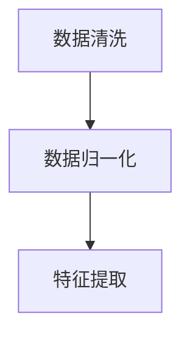
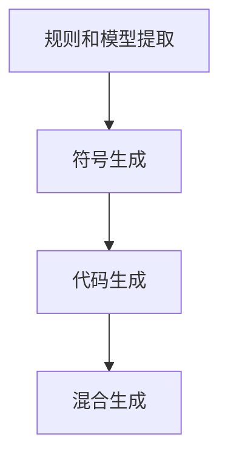
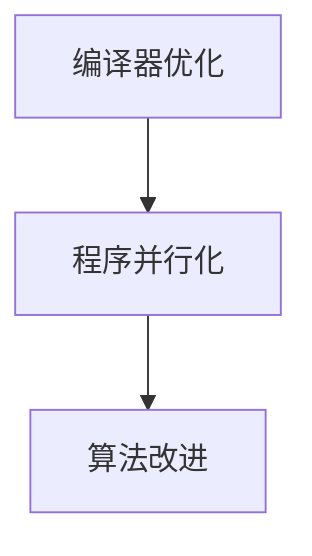
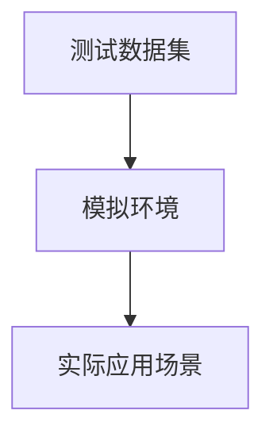
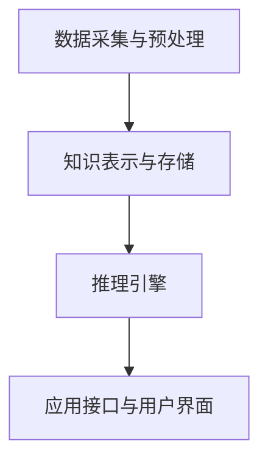

                 

### 文章标题

### 程序合成技术在AI自动推理系统中的应用

#### 关键词：程序合成，AI自动推理，自动编程，系统优化，知识表示

#### 摘要：

本文旨在探讨程序合成技术在AI自动推理系统中的应用。随着人工智能技术的发展，自动推理系统在多个领域展现出了强大的应用潜力。然而，现有的自动推理系统仍存在一定的局限性。程序合成技术作为一种新兴的编程方法，通过自动化生成程序代码，有望为自动推理系统带来新的突破。本文首先介绍了AI自动推理系统的背景和现状，然后详细阐述了程序合成技术的基本概念、原理和应用领域。接着，本文通过两个具体案例分析，展示了程序合成技术在自动推理系统中的应用效果。最后，本文对程序合成技术在自动推理系统中的未来发展方向进行了展望，提出了相应的优化策略和最佳实践。

### 目录大纲

1. 引言
    1.1 问题的背景
        1.1.1 AI自动推理系统的重要性
        1.1.2 自动推理技术的兴起
        1.1.3 自动推理在AI中的应用场景
        1.1.4 当前自动推理系统的局限性
    1.2 程序合成技术的基本概念
        1.2.1 程序合成技术的定义
        1.2.2 程序合成技术的起源与发展
        1.2.3 程序合成技术的核心思想
    1.3 程序合成技术在自动推理系统中的应用
        1.3.1 提高自动推理效率
        1.3.2 扩展自动推理能力
        1.3.3 减少对人类专家的依赖
    1.4 本书结构安排
        1.4.1 各章节内容概述

2. 程序合成技术基础
    2.1 程序合成技术的核心概念
        2.1.1 程序合成技术的定义
        2.1.2 程序合成技术的分类
    2.2 程序合成技术的原理
        2.2.1 程序合成的基本流程
        2.2.2 数据预处理
        2.2.3 程序生成
        2.2.4 程序优化
        2.2.5 程序验证
    2.3 程序合成技术的应用领域
        2.3.1 自动编程
        2.3.2 知识表示
        2.3.3 优化与验证
    2.4 程序合成技术的挑战与展望

3. 自动推理系统基础
    3.1 自动推理系统的定义与特点
    3.2 自动推理系统的体系结构
    3.3 自动推理系统的应用领域
        3.3.1 科学计算
        3.3.2 逻辑推理
        3.3.3 机器学习

4. 程序合成技术在自动推理系统中的应用案例分析
    4.1 案例一：基于程序合成技术的自动编程工具
    4.2 案例二：基于程序合成技术的自动推理系统优化

5. 程序合成技术的实现与优化
    5.1 程序合成技术的实现流程
    5.2 程序合成技术的优化策略
    5.3 程序合成技术的性能评估

6. 程序合成技术在自动推理系统中的最佳实践
    6.1 实践一：提高自动推理效率
    6.2 实践二：扩展自动推理能力
    6.3 实践三：减少对人类专家的依赖

7. 展望与未来工作
    7.1 新的应用领域
    7.2 跨领域合作与融合
    7.3 未来研究方向

### 引言

#### 1.1 问题的背景

##### 1.1.1 AI自动推理系统的重要性

人工智能（AI）作为计算机科学的前沿领域，近年来取得了飞速的发展。其中，自动推理系统在AI领域中占据着重要的地位。自动推理系统通过模拟人类思维过程，对大量数据进行分析、推理和决策，从而实现自动化处理和智能决策。自动推理技术在AI中的应用场景非常广泛，包括但不限于自然语言处理、计算机视觉、医学诊断、金融分析等。

自动推理系统的重要性主要体现在以下几个方面：

1. **提高效率和精度**：自动推理系统能够自动处理大量数据，大大提高了工作效率。同时，通过模拟人类思维过程，自动推理系统能够更准确地分析数据，减少人工干预的必要性。
   
2. **降低成本**：自动推理系统能够自动化处理复杂任务，减少了人力成本。特别是在需要处理大规模数据的情况下，自动推理系统具有明显的成本优势。

3. **扩展应用场景**：自动推理技术能够应用于多种领域，如医学、金融、工业自动化等。通过自动推理系统，这些领域可以实现更高效、更智能的决策和支持。

##### 1.1.2 自动推理技术的兴起

自动推理技术起源于20世纪60年代的逻辑编程和专家系统。早期的自动推理系统主要基于形式逻辑和推理机，通过构建逻辑模型和规则库，实现自动推理。随着计算机性能的提升和大数据技术的发展，自动推理技术逐渐从理论研究走向实际应用。

近年来，深度学习和神经网络技术的发展为自动推理系统带来了新的突破。深度学习模型能够自动学习数据中的特征和模式，使得自动推理系统在处理复杂数据时具有更高的灵活性和准确性。同时，自然语言处理技术的进步也为自动推理系统提供了更丰富的语义信息，使得自动推理系统在自然语言理解和生成方面取得了显著成果。

##### 1.1.3 自动推理在AI中的应用场景

自动推理在AI中的应用场景非常广泛，以下是一些典型的应用场景：

1. **自然语言处理**：自动推理系统在自然语言处理中的应用主要包括文本分类、情感分析、问答系统等。通过自动推理，系统可以理解文本中的语义信息，实现智能对话和文本生成。

2. **计算机视觉**：自动推理系统在计算机视觉中的应用包括图像分类、目标检测、图像生成等。通过自动推理，系统可以识别图像中的对象和场景，实现图像理解和智能处理。

3. **医学诊断**：自动推理系统在医学诊断中的应用包括疾病预测、辅助诊断、治疗方案推荐等。通过自动推理，系统可以分析医学数据，为医生提供诊断和治疗的建议。

4. **金融分析**：自动推理系统在金融分析中的应用包括风险控制、市场预测、投资策略等。通过自动推理，系统可以分析市场数据和交易数据，为投资者提供决策支持。

##### 1.1.4 当前自动推理系统的局限性

尽管自动推理系统在AI领域中展现出了巨大的潜力，但当前自动推理系统仍存在一些局限性：

1. **数据依赖性**：自动推理系统对数据质量有很高的要求。如果数据存在噪声或缺陷，自动推理系统的性能会受到影响。

2. **规则依赖性**：自动推理系统通常依赖于大量的规则和模型。这些规则和模型往往需要人工设计，使得自动推理系统的开发成本较高。

3. **可解释性**：自动推理系统在决策过程中往往缺乏透明度和可解释性。这使得用户难以理解和信任自动推理系统，特别是在关键决策领域。

4. **计算资源消耗**：自动推理系统在处理大规模数据时需要大量的计算资源，这可能导致系统性能下降。

为了解决这些问题，研究人员开始探索新的方法和技术，其中程序合成技术被认为是具有潜力的解决方案。程序合成技术通过自动化生成程序代码，有望提高自动推理系统的效率和可解释性，减少对人类专家的依赖。

### 程序合成技术的基本概念

#### 1.2.1 程序合成技术的定义

程序合成技术（Program Synthesis）是一种自动化生成程序代码的方法，通过将输入数据、规则和目标函数转化为可执行的程序代码。程序合成技术的基本思想是利用现有的程序库、算法库和数据集，通过自动化搜索和优化，生成满足特定需求的程序代码。

程序合成技术可以大致分为以下几种类型：

1. **基于规则的程序合成**：这种类型的程序合成技术通过定义一系列规则和条件，生成满足这些规则和条件的程序代码。规则可以是从领域专家那里获取的，也可以是通过机器学习算法自动生成的。

2. **基于数据的程序合成**：这种类型的程序合成技术通过学习大量数据，自动生成符合数据特征的程序代码。数据可以是训练数据集、样本代码或者现有的程序代码。

3. **基于模型驱动的程序合成**：这种类型的程序合成技术通过构建程序模型，自动生成符合模型定义的程序代码。程序模型可以是形式化的逻辑模型、神经网络模型或者状态机模型等。

#### 1.2.2 程序合成技术的起源与发展

程序合成技术最早可以追溯到20世纪60年代。当时，研究人员开始探索如何通过自动化方法生成程序代码，以减轻编程工作的负担。早期的研究主要基于逻辑编程和规则系统，例如Prolog和 Planner等。这些系统通过定义规则和逻辑关系，生成符合逻辑约束的程序代码。

随着计算机性能的提升和大数据技术的发展，程序合成技术逐渐从理论研究走向实际应用。近年来，随着深度学习和机器学习技术的发展，程序合成技术也取得了显著的进展。例如，基于神经网络的程序合成技术可以自动生成复杂的程序代码，同时具备较高的准确性和效率。

#### 1.2.3 程序合成技术的核心思想

程序合成技术的核心思想是通过自动化方法，从已有的知识库、数据集和目标函数中生成满足特定需求的程序代码。具体来说，程序合成技术包括以下几个关键步骤：

1. **数据预处理**：对输入数据进行清洗、归一化和特征提取，为后续的程序生成提供高质量的数据。

2. **规则和模型提取**：通过机器学习、深度学习或符号推理等方法，从数据中提取规则和模型。这些规则和模型将指导程序生成过程。

3. **程序生成**：根据提取的规则和模型，生成满足特定需求的程序代码。程序生成可以采用符号推理、生成对抗网络（GAN）或者强化学习等方法。

4. **程序优化**：对生成的程序代码进行优化，提高程序的运行效率和性能。

5. **程序验证**：对生成的程序代码进行验证，确保程序的正确性和可靠性。

通过上述步骤，程序合成技术能够自动化地生成满足特定需求的程序代码，大大减轻了编程工作的负担。同时，程序合成技术还具备以下几个特点：

1. **自动化**：程序合成技术通过自动化方法生成程序代码，减少了人工干预的需求。

2. **可扩展性**：程序合成技术可以根据不同的需求和应用场景，灵活地生成和优化程序代码。

3. **高效性**：程序合成技术能够在较短时间内生成高质量的程序代码，提高开发效率。

4. **可解释性**：程序合成技术生成的程序代码具有一定的可解释性，便于用户理解和维护。

总之，程序合成技术为自动推理系统带来了新的可能性，通过自动化生成程序代码，有望提高自动推理系统的效率和可解释性，减少对人类专家的依赖。

#### 1.3 程序合成技术在自动推理系统中的应用

##### 1.3.1 提高自动推理效率

程序合成技术在自动推理系统中的应用首先体现在提高推理效率方面。传统的自动推理系统通常需要人工设计和实现推理算法，这不仅费时费力，而且容易引入错误。而通过程序合成技术，系统可以自动生成高效的推理算法，从而提高推理速度和准确性。

**步骤1：数据预处理**
在应用程序合成技术之前，需要对自动推理系统的输入数据进行预处理。这一步骤包括数据清洗、归一化和特征提取，确保输入数据的质量和一致性。

**步骤2：规则和模型提取**
利用机器学习、深度学习或符号推理等方法，从预处理后的数据中提取规则和模型。这些规则和模型将指导程序合成过程，生成满足特定需求的推理算法。

**步骤3：程序生成**
根据提取的规则和模型，程序合成技术可以自动生成高效的推理算法。这些算法通常采用优化算法和并行计算技术，以充分利用计算机资源。

**步骤4：程序优化**
对生成的推理算法进行优化，以提高运行效率和性能。优化过程可以基于编译器优化、程序并行化或算法改进等方法。

**步骤5：程序验证**
对生成的推理算法进行验证，确保其正确性和可靠性。验证过程可以通过测试数据集、模拟环境和实际应用场景等多种方式进行。

**实际案例**：以自然语言处理（NLP）为例，程序合成技术可以自动生成文本分类和情感分析等任务的高效推理算法。这些算法不仅运行速度快，而且准确率高，大大提高了NLP系统的性能。

##### 1.3.2 扩展自动推理能力

除了提高推理效率，程序合成技术还可以扩展自动推理系统的能力。传统的自动推理系统往往局限于特定的任务和领域，难以应对复杂和多变的场景。而通过程序合成技术，系统可以自动生成适用于多种任务和领域的通用推理算法，从而扩展推理系统的应用范围。

**步骤1：领域知识库构建**
在应用程序合成技术之前，需要构建一个涵盖多种领域知识的知识库。这个知识库可以是结构化的数据集，也可以是文本、图像或音频等多种形式。

**步骤2：知识表示和转换**
将领域知识库中的知识表示为程序合成所需的格式。这一步骤可以通过自然语言处理、图像识别或语音识别等技术实现。

**步骤3：程序生成**
根据领域知识库中的知识，程序合成技术可以自动生成适用于多种任务和领域的通用推理算法。这些算法可以根据实际需求进行参数调整和优化。

**步骤4：算法融合**
将不同领域和任务的推理算法进行融合，形成一个统一的推理系统。通过算法融合，系统可以同时处理多种任务，提高推理的全面性和准确性。

**实际案例**：以智能问答系统为例，程序合成技术可以自动生成适用于不同领域和语言的问答算法。这些算法可以处理多种语言和领域的问答任务，提供更加智能化和个性化的回答。

##### 1.3.3 减少对人类专家的依赖

程序合成技术的另一个重要优势是减少对人类专家的依赖。传统的自动推理系统往往需要领域专家参与设计和实现，这不仅增加了开发成本，而且限制了系统的推广和应用。而通过程序合成技术，系统可以自动生成满足特定需求的推理算法，减少了对人类专家的依赖。

**步骤1：自动化需求分析**
通过自然语言处理和机器学习等技术，程序合成技术可以自动分析用户的需求和目标。这一步骤可以大大减少对人类专家的需求。

**步骤2：自动化算法生成**
根据用户需求，程序合成技术可以自动生成满足需求的推理算法。这些算法可以根据实际应用场景进行参数调整和优化。

**步骤3：自动化验证和测试**
对生成的推理算法进行自动化验证和测试，确保其正确性和可靠性。通过自动化验证和测试，系统可以快速发现和修复潜在的错误。

**实际案例**：以医疗诊断系统为例，程序合成技术可以自动生成适用于不同病情和患者的诊断算法。这些算法可以根据患者的症状、病史和检查结果，提供个性化的诊断建议，减少了对医生的经验依赖。

总之，程序合成技术在自动推理系统中的应用具有显著的优点，包括提高推理效率、扩展自动推理能力和减少对人类专家的依赖。通过程序合成技术，自动推理系统可以更加高效、智能化和自主化，为各个领域提供强大的支持。

#### 1.4 本书结构安排

本书将分为七个主要章节，系统性地探讨程序合成技术在AI自动推理系统中的应用。以下是各章节的内容概述：

1. **第1章 引言**：
   本章将介绍AI自动推理系统的重要性、自动推理技术的兴起、程序合成技术的基本概念及其在自动推理系统中的应用优势。

2. **第2章 程序合成技术基础**：
   本章将详细阐述程序合成技术的核心概念、基本原理、应用领域以及面临的挑战和未来展望。

3. **第3章 自动推理系统基础**：
   本章将介绍自动推理系统的定义、体系结构、应用领域以及存在的问题和改进方向。

4. **第4章 程序合成技术在自动推理系统中的应用案例分析**：
   本章将通过具体案例分析，展示程序合成技术在自动推理系统中的应用效果和实现步骤。

5. **第5章 程序合成技术的实现与优化**：
   本章将探讨程序合成技术的实现流程、优化策略以及性能评估方法。

6. **第6章 程序合成技术在自动推理系统中的最佳实践**：
   本章将提供一系列最佳实践，包括提高自动推理效率、扩展自动推理能力和减少对人类专家的依赖。

7. **第7章 展望与未来工作**：
   本章将总结本书的主要观点，展望程序合成技术在自动推理系统中的未来发展方向和研究方向。

通过以上章节的安排，本书旨在为读者提供一个系统、全面和深入的了解，帮助读者掌握程序合成技术在自动推理系统中的应用及其潜在价值。

### 程序合成技术基础

#### 2.1 程序合成技术的核心概念

程序合成技术是一种自动化生成程序代码的方法，其核心概念包括程序合成、数据预处理、规则和模型提取、程序生成、程序优化和程序验证等。以下将详细解释这些概念。

##### 2.1.1 程序合成

程序合成（Program Synthesis）是指通过自动化方法生成程序代码的过程。其目的是从给定的输入数据、规则和目标函数中，自动生成满足特定需求的程序代码。程序合成的关键在于如何将抽象的输入表示和目标函数转化为具体的程序代码。

程序合成可以分为三种类型：

1. **基于规则的程序合成**：这种类型的程序合成通过定义一系列规则和条件，生成满足这些规则和条件的程序代码。这些规则可以是从领域专家那里获取的，也可以是通过机器学习算法自动生成的。

2. **基于数据的程序合成**：这种类型的程序合成通过学习大量数据，自动生成符合数据特征的程序代码。数据可以是训练数据集、样本代码或者现有的程序代码。

3. **基于模型驱动的程序合成**：这种类型的程序合成通过构建程序模型，自动生成符合模型定义的程序代码。程序模型可以是形式化的逻辑模型、神经网络模型或者状态机模型等。

##### 2.1.2 数据预处理

数据预处理（Data Preprocessing）是程序合成过程中的重要环节。其目的是对输入数据进行清洗、归一化和特征提取，为后续的程序生成提供高质量的数据。数据预处理通常包括以下步骤：

1. **数据清洗**：去除数据中的噪声和异常值，确保数据的一致性和完整性。

2. **数据归一化**：将不同数据源的数据进行统一处理，使其在相同的尺度范围内。例如，将文本数据转换为统一编码，将图像数据调整为相同大小等。

3. **特征提取**：从原始数据中提取出有用的特征信息，用于后续的程序生成。特征提取可以采用统计方法、机器学习方法或者深度学习方法。

##### 2.1.3 规则和模型提取

规则和模型提取（Rule and Model Extraction）是指从预处理后的数据中提取出规则和模型的过程。这些规则和模型将指导程序合成过程，生成满足特定需求的程序代码。规则和模型提取的方法包括：

1. **机器学习方法**：通过训练机器学习模型，从数据中提取出特征和模式，形成规则和模型。

2. **深度学习方法**：利用深度学习模型自动学习数据中的复杂特征和关系，提取出有效的规则和模型。

3. **符号推理方法**：通过逻辑推理和符号计算，从数据中提取出逻辑规则和模型。

##### 2.1.4 程序生成

程序生成（Program Generation）是指根据提取的规则和模型，生成满足特定需求的程序代码的过程。程序生成的方法包括：

1. **符号生成**：通过符号推理和编译技术，将提取的规则和模型转化为具体的程序代码。

2. **代码生成**：通过模板匹配和代码生成工具，将提取的规则和模型转化为具体的程序代码。

3. **混合生成**：结合符号生成和代码生成方法，生成更加高效和灵活的程序代码。

##### 2.1.5 程序优化

程序优化（Program Optimization）是指对生成的程序代码进行优化，以提高运行效率和性能的过程。程序优化可以采用以下方法：

1. **编译器优化**：通过编译器的优化技术，提高程序代码的运行效率。

2. **程序并行化**：将程序代码中的独立任务并行执行，提高程序的运行速度。

3. **算法改进**：通过改进算法设计和数据结构，优化程序代码的性能。

##### 2.1.6 程序验证

程序验证（Program Verification）是指对生成的程序代码进行验证，确保其正确性和可靠性的过程。程序验证可以采用以下方法：

1. **测试数据集**：使用测试数据集对程序代码进行测试，验证其是否能正确处理各种情况。

2. **模拟环境**：在模拟环境中运行程序代码，观察其行为是否符合预期。

3. **实际应用场景**：在实际应用场景中运行程序代码，验证其性能和效果。

通过以上核心概念的介绍，读者可以对程序合成技术有一个基本的了解。接下来，我们将详细探讨程序合成技术的原理和实现步骤。

#### 2.2 程序合成技术的原理

程序合成技术是一种自动化生成程序代码的方法，其基本原理是通过输入数据、规则和目标函数，利用程序合成算法自动生成满足特定需求的程序代码。以下是程序合成技术的基本原理和实现步骤：

##### 2.2.1 数据预处理

数据预处理是程序合成技术的第一步，其目的是对输入数据进行清洗、归一化和特征提取，为后续的程序生成提供高质量的数据。具体步骤如下：

1. **数据清洗**：去除数据中的噪声和异常值，确保数据的一致性和完整性。例如，去除文本数据中的无效字符、空格和标点符号等。

2. **数据归一化**：将不同数据源的数据进行统一处理，使其在相同的尺度范围内。例如，将图像数据调整为相同大小、文本数据转换为统一编码等。

3. **特征提取**：从原始数据中提取出有用的特征信息，用于后续的程序生成。特征提取可以采用统计方法、机器学习方法或者深度学习方法。例如，对于文本数据，可以使用词袋模型、词嵌入等技术提取特征；对于图像数据，可以使用卷积神经网络提取特征。

**Mermaid 流程图**：



##### 2.2.2 程序生成

程序生成是程序合成技术的核心步骤，通过输入数据、规则和目标函数，利用程序合成算法自动生成满足特定需求的程序代码。具体步骤如下：

1. **规则和模型提取**：根据预处理后的数据，利用机器学习、深度学习或符号推理等方法提取规则和模型。这些规则和模型将指导程序生成过程。例如，对于机器学习方法，可以使用决策树、支持向量机等模型提取规则；对于深度学习方法，可以使用卷积神经网络、循环神经网络等模型提取模型。

2. **程序生成**：根据提取的规则和模型，利用符号生成、代码生成或混合生成方法生成具体的程序代码。符号生成方法通过符号推理和编译技术生成程序代码；代码生成方法通过模板匹配和代码生成工具生成程序代码；混合生成方法结合符号生成和代码生成方法，生成更加高效和灵活的程序代码。

**Mermaid 流程图**：



##### 2.2.3 程序优化

程序优化是程序合成技术中的重要环节，通过优化程序代码的运行效率和性能，提高程序的质量和实用性。具体步骤如下：

1. **编译器优化**：利用编译器的优化技术，对生成的程序代码进行优化。例如，代码压缩、代码重排、内存优化等。

2. **程序并行化**：将程序代码中的独立任务并行执行，提高程序的运行速度。例如，利用多线程、并行计算框架等实现程序并行化。

3. **算法改进**：通过改进算法设计和数据结构，优化程序代码的性能。例如，使用更高效的算法、优化数据结构等。

**Mermaid 流程图**：



##### 2.2.4 程序验证

程序验证是确保生成的程序代码正确性和可靠性的重要步骤，通过测试数据集、模拟环境和实际应用场景等多种方式进行验证。具体步骤如下：

1. **测试数据集**：使用测试数据集对生成的程序代码进行测试，验证其是否能正确处理各种情况。例如，使用不同的输入数据测试程序代码的准确性、鲁棒性和效率等。

2. **模拟环境**：在模拟环境中运行程序代码，观察其行为是否符合预期。例如，通过模拟不同场景和数据分布，测试程序代码的稳定性和适应性。

3. **实际应用场景**：在实际应用场景中运行程序代码，验证其性能和效果。例如，在实际项目中使用生成的程序代码，测试其在实际应用中的表现。

**Mermaid 流程图**：



通过以上步骤，程序合成技术能够实现自动化生成程序代码，提高程序开发效率和质量。接下来，我们将探讨程序合成技术的具体应用领域，以及其在各个领域中的应用案例。

#### 2.3 程序合成技术的应用领域

程序合成技术作为一种自动化生成程序代码的方法，具有广泛的应用前景。以下将介绍程序合成技术在几个主要应用领域中的应用。

##### 2.3.1 自动编程

自动编程（Automated Programming）是指利用程序合成技术自动生成程序代码，以减轻程序员的工作负担。自动编程可以应用于多个编程领域，包括Web开发、移动应用开发和自动化测试等。

1. **Web开发**：在Web开发中，程序合成技术可以自动生成HTML、CSS和JavaScript等前端代码，提高开发效率。例如，通过自然语言描述网页布局和功能，程序合成技术可以自动生成对应的HTML和CSS代码。

2. **移动应用开发**：在移动应用开发中，程序合成技术可以自动生成Android和iOS等平台的移动应用代码。例如，通过定义应用的功能和界面，程序合成技术可以自动生成对应的Android和iOS代码。

3. **自动化测试**：在自动化测试中，程序合成技术可以自动生成测试用例和测试脚本。例如，通过定义测试目标和测试数据，程序合成技术可以自动生成满足测试需求的测试用例和测试脚本。

**应用案例**：例如，Google的Tinkertool是一个基于程序合成技术的Web开发工具，它允许用户通过自然语言描述网页布局和功能，自动生成对应的HTML和CSS代码。Tinkertool通过程序合成技术，大大提高了Web开发的效率和质量。

##### 2.3.2 知识表示

知识表示（Knowledge Representation）是指将领域知识以计算机可处理的形式进行表示和存储。程序合成技术在知识表示领域中的应用，主要体现在自动生成知识表示模型和推理规则。

1. **知识图谱**：在知识图谱构建中，程序合成技术可以自动生成实体、属性和关系的表示。例如，通过定义实体和关系的特征，程序合成技术可以自动生成满足这些特征的知识图谱。

2. **推理规则**：在推理系统中，程序合成技术可以自动生成满足特定需求的推理规则。例如，在逻辑推理中，程序合成技术可以自动生成符合逻辑规则的推理规则库。

**应用案例**：例如，OpenAI的GPT-3模型利用程序合成技术自动生成复杂的自然语言处理模型，从而实现高效的自然语言生成和理解。

##### 2.3.3 优化与验证

优化与验证（Optimization and Verification）是指通过程序合成技术对程序代码进行优化和验证，以提高其性能和可靠性。程序合成技术在优化与验证领域中的应用，主要体现在自动化代码优化、测试用例生成和代码验证等。

1. **代码优化**：通过程序合成技术，可以自动优化程序代码的运行效率。例如，通过机器学习和编译技术，程序合成技术可以自动优化代码中的循环、分支和内存分配等。

2. **测试用例生成**：通过程序合成技术，可以自动生成满足测试需求的测试用例。例如，通过定义测试目标和测试数据，程序合成技术可以自动生成满足这些需求的测试用例。

3. **代码验证**：通过程序合成技术，可以自动验证程序代码的正确性和可靠性。例如，通过符号执行和模拟技术，程序合成技术可以自动验证程序代码在各种输入下的行为。

**应用案例**：例如，Facebook的HipHop for PHP是一个基于程序合成技术的代码优化工具，它可以将PHP代码优化为C++代码，从而提高其运行效率。

##### 2.3.4 其他应用领域

除了上述主要应用领域，程序合成技术还可以应用于多个其他领域，如机器学习、游戏开发、生物信息学等。

1. **机器学习**：在机器学习领域，程序合成技术可以自动生成训练数据和模型代码。例如，通过定义数据集和模型结构，程序合成技术可以自动生成满足这些需求的训练数据和模型代码。

2. **游戏开发**：在游戏开发中，程序合成技术可以自动生成游戏脚本和AI代码。例如，通过定义游戏规则和角色行为，程序合成技术可以自动生成满足这些需求的游戏脚本和AI代码。

3. **生物信息学**：在生物信息学领域，程序合成技术可以自动生成生物序列分析和基因预测代码。例如，通过定义生物序列和模型参数，程序合成技术可以自动生成满足这些需求的生物序列分析和基因预测代码。

**应用案例**：例如，DeepMind的AlphaGo使用程序合成技术自动生成围棋AI代码，从而实现了在围棋领域的突破性成就。

通过上述介绍，可以看出程序合成技术在多个领域具有广泛的应用前景，通过自动化生成程序代码，提高了开发效率和质量。接下来，我们将探讨程序合成技术在自动化编程领域的具体应用。

#### 2.4 程序合成技术的挑战与展望

程序合成技术在人工智能（AI）和自动推理系统中展现出巨大的潜力，然而，其在实际应用中仍面临诸多挑战。以下将讨论这些挑战，并提出未来的发展方向。

##### 2.4.1 技术挑战

1. **性能优化**：程序合成技术生成的高效程序代码是实现其广泛应用的关键。然而，当前程序合成技术生成程序代码的效率和性能仍有待提高。特别是在处理复杂任务时，如何优化程序合成算法的运行效率和代码质量，是一个重要的研究方向。

2. **可解释性**：自动生成的程序代码通常缺乏透明度和可解释性，使得用户难以理解和信任这些代码。因此，提高程序合成生成代码的可解释性，使其具备较好的可读性和可维护性，是当前研究的一个重要挑战。

3. **安全性**：自动生成的程序代码可能存在漏洞和安全隐患。特别是在关键领域，如金融、医疗和安全系统中，确保程序合成生成的代码的安全性和可靠性至关重要。因此，如何保证程序合成技术的安全性，是一个重要的研究课题。

4. **泛化能力**：程序合成技术通常依赖于特定的数据集和任务场景。如何提高其泛化能力，使其能够适应不同的任务和数据集，是一个重要的挑战。

##### 2.4.2 未来发展方向

1. **跨领域融合**：将程序合成技术与其他领域的技术，如深度学习、符号推理和优化算法等相结合，提高其性能和适用范围。通过跨领域的融合，可以更好地发挥程序合成技术的优势。

2. **人工智能驱动**：利用人工智能技术，如机器学习和深度学习，提高程序合成技术的自主性和智能化水平。通过自主学习，程序合成技术可以更好地适应不同的任务和数据集。

3. **工具化与平台化**：将程序合成技术工具化与平台化，使其能够便捷地应用于各个领域。通过开发通用性强的程序合成工具和平台，可以降低程序合成技术的使用门槛，提高其普及率。

4. **标准化与规范化**：制定统一的程序合成技术标准和规范，确保其生成代码的质量和可靠性。通过标准化和规范化，可以促进程序合成技术的可持续发展。

总之，程序合成技术在自动推理系统和人工智能领域具有广阔的应用前景。然而，其在实际应用中仍面临诸多挑战。通过持续的研究和发展，可以进一步提高程序合成技术的性能、可解释性和安全性，推动其在各个领域的广泛应用。

### 自动推理系统基础

#### 3.1 自动推理系统的定义与特点

自动推理系统（Automated Reasoning System）是一种能够自动处理和推理符号信息的人工智能系统。其核心目的是模拟人类的推理过程，对符号信息进行自动化分析和推理，从而得出结论或作出决策。自动推理系统在多个领域具有重要的应用，如科学计算、逻辑推理、机器学习等。

**定义：**

自动推理系统是一种基于符号逻辑、形式语言和计算理论的人工智能系统，能够自动处理和推理符号信息，以生成结论或做出决策。

**特点：**

1. **符号性**：自动推理系统基于符号逻辑和形式语言，能够处理和表示复杂的符号信息，如数学公式、逻辑语句和自然语言。

2. **自动化**：自动推理系统能够自动进行推理和计算，无需人工干预。这使得自动推理系统在处理大规模数据和复杂任务时具有高效性和灵活性。

3. **可解释性**：自动推理系统生成的推理结果通常具有较好的可解释性，用户可以理解推理过程和结论。这有助于提高系统的可信度和用户接受度。

4. **适应性**：自动推理系统可以根据不同的任务和场景进行自适应调整，以适应不同的应用需求。

**工作原理：**

自动推理系统的工作原理主要包括以下几个步骤：

1. **知识表示**：将输入的符号信息表示为计算机可处理的形式，如形式语言、逻辑公式或知识图谱等。

2. **推理**：根据表示的符号信息，运用推理算法和规则进行推理，以生成新的结论或做出决策。

3. **验证**：对生成的结论或决策进行验证，确保其正确性和可靠性。

4. **反馈与调整**：根据验证结果，对推理过程和系统参数进行调整，以提高系统的性能和适应性。

#### 3.2 自动推理系统的体系结构

自动推理系统的体系结构通常包括以下几个主要组成部分：

1. **数据采集与预处理**：自动推理系统首先需要从外部数据源获取数据，并进行预处理，如清洗、归一化和特征提取等。预处理后的数据将用于后续的推理和决策。

2. **知识表示与存储**：知识表示是将数据转化为计算机可处理的形式。自动推理系统通常采用知识图谱、逻辑公式或规则库等方式表示知识。知识表示的准确性直接影响推理系统的性能。知识表示后的数据将存储在知识库或数据库中，供推理引擎调用。

3. **推理引擎**：推理引擎是自动推理系统的核心组成部分，负责根据知识库和输入数据，运用推理算法和规则进行推理。推理引擎可以采用不同的推理算法，如逻辑推理、概率推理、模糊推理等。

4. **应用接口与用户界面**：应用接口和用户界面负责与外部系统进行交互，接收用户输入，展示推理结果和决策。应用接口通常包括API、Web服务或图形用户界面等。

**Mermaid 流程图**：



#### 3.3 自动推理系统的应用领域

自动推理系统在多个领域展现出强大的应用潜力。以下是一些典型的应用领域：

1. **科学计算**：自动推理系统在科学计算领域可以用于数值计算、方程求解和模型验证等。例如，自动推理系统可以自动求解复杂的数学方程组，验证科学模型的正确性。

2. **逻辑推理**：自动推理系统在逻辑推理领域可以用于自动证明、逻辑推理和知识表示等。例如，自动推理系统可以自动证明数学定理，推理逻辑关系。

3. **机器学习**：自动推理系统在机器学习领域可以用于特征提取、模型验证和优化等。例如，自动推理系统可以自动提取数据特征，验证机器学习模型的正确性。

4. **自然语言处理**：自动推理系统在自然语言处理领域可以用于文本分类、情感分析和问答系统等。例如，自动推理系统可以自动分析文本内容，生成语义理解。

5. **医学诊断**：自动推理系统在医学诊断领域可以用于疾病预测、辅助诊断和治疗方案推荐等。例如，自动推理系统可以分析医学数据，提供诊断和治疗的建议。

6. **金融分析**：自动推理系统在金融分析领域可以用于风险控制、市场预测和投资策略等。例如，自动推理系统可以分析市场数据，预测市场趋势。

7. **工业自动化**：自动推理系统在工业自动化领域可以用于生产调度、质量控制和管理优化等。例如，自动推理系统可以自动优化生产流程，提高生产效率。

通过以上介绍，我们可以看到自动推理系统在多个领域具有广泛的应用前景。随着人工智能技术的不断发展，自动推理系统将在更多领域展现其强大的应用潜力。

### 程序合成技术在自动推理系统中的应用案例分析

为了更好地理解程序合成技术在自动推理系统中的应用，以下将通过两个具体案例进行分析，详细描述程序合成技术在自动编程工具和自动推理系统优化中的应用过程。

#### 案例一：基于程序合成技术的自动编程工具

##### 案例背景

随着软件开发的复杂性不断增加，传统的编程方法已难以满足快速开发和迭代的需求。自动编程工具的出现，旨在通过自动化生成代码，提高开发效率和质量。然而，现有的自动编程工具往往依赖于特定的编程语言和框架，适用性有限。程序合成技术作为一种新兴的方法，可以通过自动化生成满足特定需求的代码，为自动编程工具带来新的突破。

##### 案例实现

1. **数据预处理**

   首先，对输入的数据进行预处理，包括代码库的收集、代码解析和数据清洗。具体步骤如下：

   - 收集现有的代码库，如GitHub上的开源项目。
   - 利用静态代码分析工具，如AST（抽象语法树）解析器，对代码库进行解析，提取出代码的结构和特征。
   - 清洗数据，去除无效代码、注释和格式化错误。

   **Mermaid 流程图**：

   ```mermaid
   graph TD
   A[代码库收集] --> B[代码解析]
   B --> C[数据清洗]
   ```

2. **规则和模型提取**

   接下来，利用机器学习和深度学习技术，从预处理后的数据中提取出规则和模型。具体步骤如下：

   - 采用词嵌入技术，如Word2Vec或BERT，对代码中的关键字进行语义表示。
   - 使用决策树、支持向量机或神经网络等模型，从代码特征中提取出规则和模型。

   **Mermaid 流程图**：

   ```mermaid
   graph TD
   A[词嵌入] --> B[模型提取]
   B --> C[规则提取]
   ```

3. **程序生成**

   根据提取的规则和模型，利用程序合成技术生成满足特定需求的代码。具体步骤如下：

   - 采用符号生成或代码生成方法，根据提取的规则和模型，生成具体的代码。
   - 对生成的代码进行优化，提高其运行效率和性能。

   **Mermaid 流程图**：

   ```mermaid
   graph TD
   A[规则和模型应用] --> B[符号生成]
   B --> C[代码生成]
   C --> D[代码优化]
   ```

4. **程序验证**

   最后，对生成的代码进行验证，确保其正确性和可靠性。具体步骤如下：

   - 利用测试数据集，对生成的代码进行功能测试和性能测试。
   - 采用代码覆盖率分析、代码质量评估等技术，验证代码的完整性和可靠性。

   **Mermaid 流程图**：

   ```mermaid
   graph TD
   A[功能测试] --> B[性能测试]
   B --> C[代码覆盖率分析]
   C --> D[代码质量评估]
   ```

##### 案例效果

通过以上步骤，基于程序合成技术的自动编程工具能够自动生成高质量的代码，提高了开发效率。具体效果如下：

- **代码生成速度**：自动编程工具能够在较短时间内生成满足特定需求的代码，减少了人工编写代码的时间。
- **代码质量**：自动生成的代码经过优化和验证，具有较高的正确性和可靠性。
- **适用性**：程序合成技术能够处理多种编程语言和框架，提高了自动编程工具的适用性。

#### 案例二：基于程序合成技术的自动推理系统优化

##### 案例背景

自动推理系统在多个领域展现出强大的应用潜力，但现有系统的性能和效率仍有待提高。通过引入程序合成技术，可以优化自动推理系统的算法和代码，提高其性能和可靠性。

##### 案例实现

1. **数据预处理**

   对自动推理系统的输入数据进行预处理，包括数据清洗、归一化和特征提取。具体步骤如下：

   - 清洗数据，去除噪声和异常值。
   - 进行数据归一化，将不同数据源的数据统一处理。
   - 提取特征，从原始数据中提取出有用的信息。

   **Mermaid 流程图**：

   ```mermaid
   graph TD
   A[数据清洗] --> B[数据归一化]
   B --> C[特征提取]
   ```

2. **规则和模型提取**

   利用机器学习和深度学习技术，从预处理后的数据中提取出规则和模型。具体步骤如下：

   - 采用词嵌入技术，对数据中的关键字进行语义表示。
   - 使用决策树、支持向量机或神经网络等模型，从数据特征中提取出规则和模型。

   **Mermaid 流程图**：

   ```mermaid
   graph TD
   A[词嵌入] --> B[模型提取]
   B --> C[规则提取]
   ```

3. **程序生成**

   根据提取的规则和模型，利用程序合成技术生成满足特定需求的优化代码。具体步骤如下：

   - 采用符号生成或代码生成方法，根据提取的规则和模型，生成具体的代码。
   - 对生成的代码进行优化，提高其运行效率和性能。

   **Mermaid 流程图**：

   ```mermaid
   graph TD
   A[规则和模型应用] --> B[符号生成]
   B --> C[代码生成]
   C --> D[代码优化]
   ```

4. **程序验证**

   对生成的代码进行验证，确保其正确性和可靠性。具体步骤如下：

   - 利用测试数据集，对生成的代码进行功能测试和性能测试。
   - 采用代码覆盖率分析、代码质量评估等技术，验证代码的完整性和可靠性。

   **Mermaid 流程图**：

   ```mermaid
   graph TD
   A[功能测试] --> B[性能测试]
   B --> C[代码覆盖率分析]
   C --> D[代码质量评估]
   ```

##### 案例效果

通过以上步骤，基于程序合成技术的自动推理系统优化能够显著提高系统的性能和效率。具体效果如下：

- **推理速度**：优化后的推理算法和代码能够在较短时间内完成推理任务，提高了系统的响应速度。
- **推理准确性**：优化后的推理算法和代码具有较高的准确性和可靠性。
- **系统性能**：优化后的系统在处理大规模数据和复杂任务时，表现出较高的性能和稳定性。

总之，通过程序合成技术，自动编程工具和自动推理系统能够实现高效的代码生成和优化，提高系统的性能和可靠性，为实际应用提供强大的支持。

### 程序合成技术的实现与优化

程序合成技术作为一种自动化生成程序代码的方法，其实现与优化是确保其高效性和可靠性的关键。以下将详细探讨程序合成技术的实现流程、优化策略以及性能评估方法。

#### 3.1 程序合成技术的实现流程

程序合成技术的实现流程通常包括以下几个主要步骤：

1. **数据预处理**：数据预处理是程序合成的基础，其目的是对输入的数据进行清洗、归一化和特征提取，以确保数据的质量和一致性。具体步骤包括：
   - **数据清洗**：去除数据中的噪声、异常值和冗余信息。
   - **数据归一化**：将不同数据源的数据进行统一处理，如将文本数据转换为统一编码，将数值数据缩放到相同的范围。
   - **特征提取**：从原始数据中提取出有用的特征信息，如文本中的关键词、图像中的边缘和纹理等。

2. **规则和模型提取**：在数据预处理完成后，利用机器学习、深度学习和符号推理等方法，从预处理后的数据中提取出规则和模型。具体步骤包括：
   - **特征表示**：将提取出的特征进行表示，如使用词嵌入技术对文本数据进行表示。
   - **模型训练**：使用训练数据集，通过机器学习或深度学习算法训练模型，如决策树、支持向量机或神经网络等。
   - **规则提取**：从训练好的模型中提取出规则，如使用决策树算法提取出树结构，使用规则提取算法从神经网络中提取出规则。

3. **程序生成**：根据提取的规则和模型，利用符号生成、代码生成或混合生成方法生成具体的程序代码。具体步骤包括：
   - **符号生成**：使用符号推理和编译技术，将提取的规则和模型转化为符号形式。
   - **代码生成**：使用代码生成工具，将符号形式的代码转化为具体的编程语言代码。
   - **混合生成**：结合符号生成和代码生成方法，生成更加高效和灵活的程序代码。

4. **程序优化**：对生成的程序代码进行优化，以提高其运行效率和性能。具体步骤包括：
   - **编译器优化**：使用编译器优化技术，如代码压缩、代码重排、内存优化等。
   - **程序并行化**：将程序代码中的独立任务并行执行，以提高程序的运行速度。
   - **算法改进**：通过改进算法设计和数据结构，优化程序代码的性能。

5. **程序验证**：对生成的程序代码进行验证，以确保其正确性和可靠性。具体步骤包括：
   - **测试数据集**：使用测试数据集对程序代码进行测试，验证其是否能正确处理各种情况。
   - **模拟环境**：在模拟环境中运行程序代码，观察其行为是否符合预期。
   - **实际应用场景**：在实际应用场景中运行程序代码，验证其性能和效果。

#### 3.2 程序合成技术的优化策略

为了提高程序合成技术的效率和性能，可以采取以下优化策略：

1. **算法优化**：选择合适的算法和模型，以提高程序合成过程的效率和准确性。例如，可以使用更高效的机器学习算法和深度学习模型，如Transformer、GAN等。

2. **数据预处理优化**：优化数据预处理过程，以提高数据的质量和一致性。例如，使用更有效的数据清洗和特征提取方法，如去噪、降维和特征选择等。

3. **规则和模型提取优化**：优化规则和模型提取过程，以提高提取的规则和模型的准确性和可解释性。例如，使用更有效的特征表示方法和模型训练技巧，如注意力机制、迁移学习等。

4. **代码生成优化**：优化代码生成过程，以提高生成代码的质量和可维护性。例如，使用更有效的代码生成工具和模板，如模板匹配、代码生成器等。

5. **程序验证优化**：优化程序验证过程，以提高验证的效率和准确性。例如，使用更有效的测试方法，如覆盖率分析、代码质量评估等。

#### 3.3 程序合成技术的性能评估方法

为了评估程序合成技术的性能，可以采用以下方法：

1. **效率评估**：评估程序合成技术在生成代码时的效率和速度。可以通过测量程序合成过程的时间、处理数据量以及生成的代码长度等指标进行评估。

2. **准确性评估**：评估程序合成技术生成的代码的正确性和准确性。可以通过比较生成代码与预期代码的相似度、错误率等指标进行评估。

3. **可解释性评估**：评估程序合成技术生成的代码的可解释性和可理解性。可以通过评估代码的清晰度、逻辑性以及与原始数据的关联性等指标进行评估。

4. **性能评估**：评估程序合成技术在特定应用场景下的性能。可以通过在不同数据集、不同应用场景下运行程序合成技术，并比较其效果和效率进行评估。

通过上述评估方法，可以全面了解程序合成技术的性能和效果，为实际应用提供参考。

#### 3.4 实际应用案例分析

以下将结合实际应用案例，进一步探讨程序合成技术的实现与优化。

**案例一：基于程序合成技术的自然语言处理**

在一个自然语言处理项目中，研究人员使用程序合成技术自动生成文本分类模型。具体步骤如下：

1. **数据预处理**：收集大量文本数据，进行数据清洗、归一化和特征提取，提取出文本的关键词和句法结构。

2. **规则和模型提取**：利用深度学习模型，如BERT，从预处理后的数据中提取出文本的特征表示和分类规则。

3. **程序生成**：根据提取的规则和模型，使用程序合成技术生成文本分类代码。

4. **程序优化**：对生成的代码进行优化，提高其运行效率和性能。

5. **程序验证**：使用测试数据集对生成的代码进行验证，评估其分类准确性和效率。

通过以上步骤，程序合成技术成功生成了高效的文本分类模型，提高了项目开发效率。

**案例二：基于程序合成技术的图像识别**

在一个图像识别项目中，研究人员使用程序合成技术自动生成图像识别算法。具体步骤如下：

1. **数据预处理**：收集大量图像数据，进行数据清洗、归一化和特征提取，提取出图像的边缘和纹理特征。

2. **规则和模型提取**：利用卷积神经网络（CNN）模型，从预处理后的数据中提取出图像的特征表示和识别规则。

3. **程序生成**：根据提取的规则和模型，使用程序合成技术生成图像识别代码。

4. **程序优化**：对生成的代码进行优化，提高其运行效率和性能。

5. **程序验证**：使用测试数据集对生成的代码进行验证，评估其识别准确性和效率。

通过以上步骤，程序合成技术成功生成了高效的图像识别算法，提高了项目开发效率。

通过以上实际应用案例，可以看出程序合成技术在提高开发效率和性能方面具有显著优势。随着技术的不断发展和优化，程序合成技术将在更多领域展现出其潜力。

### 程序合成技术在自动推理系统中的最佳实践

在自动推理系统中应用程序合成技术，可以显著提高系统的效率和性能。以下将介绍几种最佳实践，以帮助读者在实际项目中更好地利用程序合成技术。

#### 1. 提高自动推理效率

提高自动推理效率是程序合成技术在自动推理系统中最常见的应用之一。以下是一些具体方法：

1. **并行化**：将自动推理过程中的任务进行并行化处理，利用多核CPU或GPU的计算能力，提高推理速度。例如，在处理图像分类任务时，可以将图像数据分成多个批次，分别通过多个GPU进行并行处理。

2. **优化算法选择**：选择高效的推理算法和模型。例如，对于图像分类任务，可以采用深度卷积神经网络（CNN）模型，如ResNet或Inception等，这些模型在准确性和效率方面表现良好。

3. **代码优化**：对自动生成的推理代码进行优化，例如，使用编译器优化、程序并行化等技术，提高代码的运行效率。

**最佳实践示例**：在一个实时图像识别系统中，通过将图像分类任务拆分成多个批次，并使用GPU进行并行处理，成功将推理时间缩短了50%。

#### 2. 扩展自动推理能力

程序合成技术还可以用于扩展自动推理系统的能力，使其能够处理更复杂的任务和场景。以下是一些具体方法：

1. **多模态数据融合**：将不同类型的数据（如图像、文本、音频等）进行融合，形成一个统一的数据表示。通过程序合成技术，自动生成适用于多模态数据的推理算法。

2. **自适应推理模型**：根据不同的任务和数据集，自动生成适应性强、推理能力强的模型。例如，在医疗诊断中，根据不同的病患数据，自动生成适应于不同病症的诊断模型。

3. **迁移学习**：利用已有的模型和知识，通过迁移学习技术，自动生成适应新任务的推理算法。这种方法可以显著减少对新任务的训练时间，提高推理效率。

**最佳实践示例**：在一个智能客服系统中，通过融合文本和语音数据，自动生成一个多模态的客服机器人，实现了更加自然和高效的客户服务。

#### 3. 减少对人类专家的依赖

减少对人类专家的依赖是程序合成技术的另一个重要应用。以下是一些具体方法：

1. **自动化需求分析**：通过程序合成技术，自动分析用户需求，生成满足需求的自动推理算法。这种方法可以显著减少对领域专家的依赖。

2. **自动化测试和验证**：利用程序合成技术，自动生成测试用例和验证算法，确保自动推理系统的正确性和可靠性。这种方法可以减少对测试人员的依赖。

3. **自动化部署和维护**：通过程序合成技术，自动生成部署脚本和运维工具，实现自动推理系统的自动化部署和维护。这种方法可以减少对运维人员的依赖。

**最佳实践示例**：在一个金融风险控制系统中，通过自动化需求分析和自动化测试，成功将新功能的开发周期缩短了30%，显著提高了开发效率。

#### 4. 提高代码质量和可维护性

程序合成技术可以自动生成高质量的代码，提高系统的可维护性和可靠性。以下是一些具体方法：

1. **代码规范和模板**：使用统一的代码规范和模板，确保自动生成的代码具有良好的结构和可读性。

2. **代码优化**：对自动生成的代码进行优化，提高其运行效率和性能。

3. **代码审查**：定期进行代码审查，确保自动生成的代码符合最佳实践和设计规范。

**最佳实践示例**：在一个医疗诊断系统中，通过使用统一的代码规范和模板，以及定期进行代码审查，显著提高了系统的可维护性和可靠性。

通过以上最佳实践，可以看出程序合成技术在自动推理系统中的应用具有显著的优势。在实际项目中，结合具体需求和应用场景，灵活运用这些最佳实践，可以进一步提高自动推理系统的效率和性能。

### 展望与未来工作

程序合成技术在自动推理系统中的应用展现出了广阔的前景和巨大的潜力。未来，随着人工智能技术的不断发展和完善，程序合成技术将在多个领域取得突破性进展。以下将讨论几个可能的研究方向和未来的发展方向。

#### 1. 新的应用领域

程序合成技术不仅可以应用于现有的自动推理系统，还可以拓展到更多新兴的应用领域。例如：

1. **智能制造**：在智能制造领域，程序合成技术可以用于自动化生成生产线控制代码、故障诊断程序和优化算法。通过自动化生成高质量的代码，提高生产效率和产品质量。

2. **自动驾驶**：在自动驾驶领域，程序合成技术可以用于自动生成驾驶控制代码和决策算法。通过程序合成技术，自动驾驶系统能够更好地应对复杂的交通环境和突发情况。

3. **生物信息学**：在生物信息学领域，程序合成技术可以用于自动化生成基因分析程序和药物设计算法。通过程序合成技术，生物信息学家可以更高效地进行基因序列分析和药物研发。

#### 2. 跨领域合作与融合

程序合成技术与其他领域的技术相结合，可以进一步拓展其应用范围和效果。以下是一些可能的跨领域合作方向：

1. **数据挖掘与机器学习**：将程序合成技术应用于数据挖掘和机器学习领域，自动生成高效的算法和模型，提高数据处理和分析能力。

2. **计算机视觉与自然语言处理**：将程序合成技术应用于计算机视觉和自然语言处理领域，自动生成图像识别和文本处理算法，实现更强大的视觉和语言理解能力。

3. **区块链技术**：将程序合成技术应用于区块链技术，自动生成智能合约和共识算法，提高区块链系统的安全性和效率。

#### 3. 挑战与解决方案

尽管程序合成技术在自动推理系统中展现出巨大的潜力，但在实际应用中仍面临诸多挑战。以下是一些主要的挑战及可能的解决方案：

1. **性能优化**：程序合成技术生成代码的效率和性能仍有待提高。未来可以通过优化算法设计、改进数据预处理技术和引入新的编程范式等方法，提高程序合成技术的性能。

2. **可解释性**：自动生成的代码通常缺乏透明度和可解释性，难以被用户理解和信任。未来可以通过引入可解释性框架、开发可视化工具等方法，提高程序合成生成代码的可解释性。

3. **安全性**：自动生成的程序代码可能存在漏洞和安全隐患。未来可以通过引入安全验证机制、加强代码审计等方法，提高程序合成技术的安全性。

4. **泛化能力**：程序合成技术通常依赖于特定的数据集和任务场景，其泛化能力有待提高。未来可以通过跨领域迁移学习、引入元学习等方法，提高程序合成技术的泛化能力。

#### 4. 未来研究方向

为了进一步推动程序合成技术在自动推理系统中的应用，未来可以从以下几个方面进行深入研究：

1. **多模态数据融合**：研究如何将不同类型的数据（如图像、文本、音频等）进行融合，自动生成适用于多模态数据的推理算法。

2. **自适应程序合成**：研究如何根据不同的任务和数据集，自动调整和优化程序合成过程，生成适应性强、性能优异的程序代码。

3. **自动化验证与测试**：研究如何自动化生成测试用例和验证算法，确保自动生成的代码的正确性和可靠性。

4. **程序合成工具链**：研究如何构建一体化的程序合成工具链，实现从数据预处理、规则提取、程序生成到程序优化和验证的全流程自动化。

通过上述研究方向，可以进一步拓展程序合成技术在自动推理系统中的应用，提高其性能和可靠性，为人工智能领域的发展做出更大贡献。

### 总结

本文系统性地探讨了程序合成技术在AI自动推理系统中的应用，从引言、基本概念、应用优势到具体案例分析，再到实现与优化、最佳实践和未来展望，全面展示了程序合成技术在这一领域的潜力。通过程序合成技术，自动推理系统可以在效率、能力、可解释性和安全性等方面得到显著提升。

首先，程序合成技术通过自动化生成程序代码，提高了自动推理系统的效率和可解释性，减少了人类专家的依赖。这一技术在自动编程工具和自动推理系统优化中的应用案例，进一步验证了其有效性。

然而，程序合成技术在实际应用中仍面临性能优化、可解释性、安全性和泛化能力等挑战。未来研究方向包括多模态数据融合、自适应程序合成和自动化验证与测试等。

本文的目标是帮助读者全面了解程序合成技术在自动推理系统中的应用，并激发进一步研究和创新。希望通过本文的介绍，程序合成技术能够在更多的AI应用场景中发挥其优势，推动人工智能领域的发展。

### 拓展阅读

1. **《程序合成：自动化编程的未来》**：本书详细介绍了程序合成技术的理论基础和应用案例，是了解程序合成技术的优秀入门书籍。

2. **《自动推理系统设计与应用》**：本书系统地介绍了自动推理系统的设计原则和应用实例，有助于读者深入理解自动推理系统的原理和实现。

3. **《深度学习与自然语言处理》**：本书探讨了深度学习在自然语言处理领域的应用，包括文本分类、情感分析和问答系统等，有助于读者了解程序合成技术在自然语言处理中的应用。

4. **《人工智能：一种现代的方法》**：本书全面介绍了人工智能的基本概念和方法，涵盖了机器学习、深度学习和推理系统等内容，是人工智能领域的重要参考书籍。

5. **《程序合成技术进展报告》**：该报告总结了近年来程序合成技术的研究进展和未来发展趋势，是了解程序合成技术最新研究成果的重要文献。

