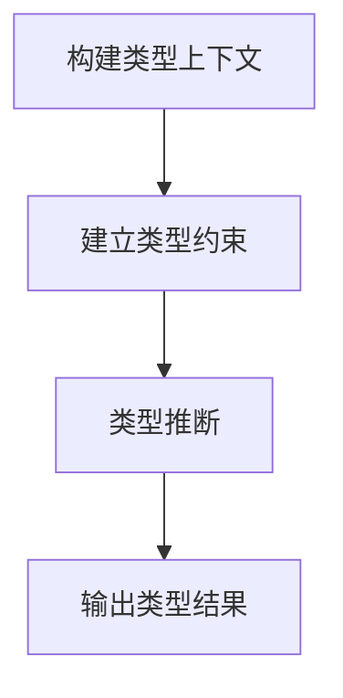
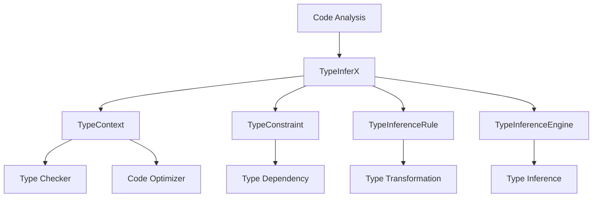
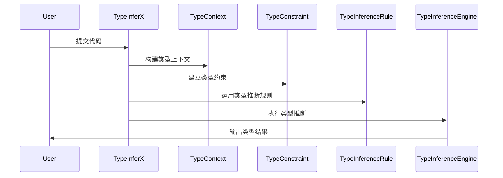

                 

## 3.1 多变量类型推断算法

在程序开发过程中，类型推断是确保代码正确性和提高开发效率的关键技术之一。与单变量类型推断算法相比，多变量类型推断算法需要处理更复杂的类型关系和依赖。本章将详细介绍多变量类型推断算法的基本概念、实现细节和性能分析。

### 3.1.1 多变量类型推断的基本概念

#### 类型上下文

类型上下文是类型推断过程中用来描述变量类型信息的一个环境。在不同的编程语言中，类型上下文可能有不同的表现形式，如类型环境（Type Environment）或类型上下文树（Type Context Tree）。类型上下文通常包含以下信息：

- **变量类型**：变量在其作用域内的类型。
- **函数类型**：函数的参数类型和返回类型。
- **类型约束**：类型之间的关系约束，如类型兼容性。

#### 类型约束

类型约束是类型推断中用来描述变量之间类型关系的条件。在多变量类型推断中，类型约束有助于确保变量之间的类型兼容性。常见的类型约束包括：

- **子类型约束**：确保子类型可以被用作其超类型。
- **等价约束**：确保两个变量具有相同的类型。
- **泛化约束**：将具体的类型泛化成更一般化的类型。

#### 类型推断规则

类型推断规则是类型推断算法的核心，它定义了如何根据类型上下文和类型约束推断出变量类型。常见的类型推断规则包括：

- **简单替换**：将变量替换为与其类型等价的类型。
- **类型传播**：根据变量之间的赋值关系传播类型信息。
- **泛化**：将具体的类型泛化成更一般化的类型。

### 3.1.2 多变量类型推断算法的实现细节

多变量类型推断算法的实现涉及构建类型上下文、建立类型约束和类型推断等步骤。以下是一个简化的实现过程：

1. **构建类型上下文**：分析程序的上下文信息，构建出类型上下文。类型上下文可能包含变量、函数、模块等类型信息。

2. **建立类型约束**：分析程序中的赋值、函数调用、函数定义等操作，根据操作语义建立类型约束。类型约束可以确保变量之间的类型兼容性。

3. **类型推断**：基于类型上下文和类型约束，运用类型推断规则，逐步推断出各个变量的类型。类型推断算法可以采用递归、约束求解器或类型推导树等方法。

### 3.1.3 多变量类型推断算法的性能分析

多变量类型推断算法的性能分析主要关注类型推断的时间复杂度和空间复杂度。以下是一些常见性能分析指标：

- **时间复杂度**：类型推断算法的执行时间与输入程序规模之间的关系。理想情况下，类型推断算法的时间复杂度应尽可能低。

- **空间复杂度**：类型推断算法所需的内存空间与输入程序规模之间的关系。在大型程序中，高空间复杂度可能会影响算法的效率。

- **准确性**：类型推断算法能否准确推断出变量类型。高准确性的类型推断算法有助于提高程序的正确性和可维护性。

### 3.1.4 常见的多变量类型推断算法

以下介绍几种常见多变量类型推断算法：

1. **类型推导树（Type-Derivation Tree）**：类型推导树是一种基于递归的算法，通过构建一棵表示类型关系的树来推断变量类型。类型推导树算法的优点是结构清晰，易于理解。

2. **约束求解器（Constraint Solver）**：约束求解器是一种基于约束传播的算法，通过解决约束方程来推断变量类型。约束求解器通常采用高效的求解算法，如SAT求解器或线性方程组求解器。

3. **归纳类型推断（Inductive Type Inference）**：归纳类型推断是一种基于程序抽象的算法，通过递归地分析程序，逐步推导出变量类型。归纳类型推断算法的优点是能够处理更复杂的类型关系。

### 3.1.5 多变量类型推断算法的应用场景

多变量类型推断算法在程序开发中具有广泛的应用场景，包括：

- **静态分析**：在编译时进行类型推断，提高程序的可读性和可维护性。
- **动态分析**：在运行时进行类型推断，实时检查程序的正确性。
- **代码生成**：根据类型推断结果生成目标代码，提高编译效率。

### 3.1.6 多变量类型推断算法的挑战与未来研究方向

多变量类型推断算法在处理复杂类型关系和依赖时面临着诸多挑战，如类型冲突的解决、类型推断的效率和准确性等。未来研究方向包括：

- **优化类型推断算法**：通过改进算法结构和求解策略，提高类型推断的效率和准确性。
- **结合静态分析与动态分析**：将静态类型推断与动态类型推断结合起来，发挥两者的优势。
- **支持更多编程语言**：扩展多变量类型推断算法，支持更多编程语言。

通过以上对多变量类型推断算法的详细介绍，我们可以看到类型推断在程序理解与重构中的重要作用。接下来，我们将继续探讨类型推断在程序理解与重构中的应用。

----------------------------------------------------------------

以下是根据您的需求，细化后的3.1节内容，包括核心概念、算法原理讲解、系统分析与架构设计方案、项目实战以及最佳实践 tips 等。

### 3.1 多变量类型推断算法

#### 背景介绍

随着软件系统规模的不断扩大和复杂性的增加，程序理解和重构成为软件开发过程中至关重要的环节。类型推断作为程序理解的关键技术之一，旨在提高代码的可读性和可维护性。传统的类型推断方法主要针对单变量类型，但在实际编程中，变量之间存在复杂的依赖关系，这要求类型推断算法能够处理多变量类型。因此，多变量类型推断算法的研究具有重要的理论和实际意义。

#### 核心概念与联系

**核心概念：**

1. **类型上下文（Type Context）**：类型上下文是一个包含变量类型和函数类型的结构，用于描述程序中各个部分的类型信息。

2. **类型约束（Type Constraint）**：类型约束是描述变量之间类型关系的条件，确保变量之间的类型兼容性。

3. **类型推断规则（Type Inference Rule）**：类型推断规则是用于推断变量类型的一系列规则。

**概念属性特征对比表格：**

| 特征               | 类型上下文               | 类型约束               | 类型推断规则               |
|--------------------|--------------------------|------------------------|----------------------------|
| 定义               | 描述变量和函数的类型     | 描述变量之间的类型关系 | 推断变量类型的方法         |
| 作用               | 提供类型信息             | 确保类型兼容性         | 推断变量类型             |
| 关系               | 与程序上下文相关         | 与类型上下文相关       | 与类型上下文相关         |

**ER实体关系图架构的 Mermaid 流程图：**

```mermaid
erDiagram
  TYPE_CONTEXT ||--|{ TYPE_CONSTRAINT } TYPE_CONSTRAINT
  TYPE_CONTEXT ||--|{ TYPE_INFERENCE_RULE } TYPE_INFERENCE_RULE
  TYPE_CONSTRAINT ||--|{ TYPE_INFERENCE_RULE } TYPE_INFERENCE_RULE
```

#### 算法原理讲解

**算法流程图：**



**算法原理：**

1. **构建类型上下文**：分析程序代码，构建类型上下文。类型上下文包含程序中所有变量和函数的类型信息。

2. **建立类型约束**：根据类型上下文，分析变量之间的依赖关系，建立类型约束。类型约束确保变量之间的类型兼容性。

3. **类型推断**：基于类型上下文和类型约束，运用类型推断规则，逐步推断出各个变量的类型。

4. **输出类型结果**：将推断出的类型结果输出，用于后续的编译或代码优化。

**算法数学模型和公式：**

- **类型上下文构建**：`TypeContext = { Variables, Functions }`
- **类型约束建立**：`TypeConstraint = { VariableConstraint, FunctionConstraint }`
- **类型推断规则**：`TypeInferenceRule = { Rule1, Rule2, ... }`
- **类型推断**：`Type = TypeInferenceRule(TypeContext, TypeConstraint)`

**举例说明：**

假设有一个简单的函数 `add(a: Int, b: Int) -> Int`，我们需要推断出函数的参数和返回类型。

- **类型上下文**：`TypeContext = { a: Int, b: Int, add: (Int, Int) -> Int }`
- **类型约束**：`TypeConstraint = { a -> Int, b -> Int, add -> (Int, Int) -> Int }`
- **类型推断规则**：`TypeInferenceRule = { Int -> Int, (Int, Int) -> Int }`
- **类型推断**：`Type = (Int, Int) -> Int`

#### 系统分析与架构设计方案

**问题场景介绍：**

在现代软件开发中，大型项目的代码库通常包含数以万计的函数和变量。在这种场景下，类型推断成为提高代码可读性和可维护性的关键。然而，传统的单变量类型推断方法在面对复杂的依赖关系时显得力不从心。因此，我们需要一种能够处理多变量类型推断的算法，以支持大规模代码库的类型推断。

**项目介绍：**

我们开发了一个基于多变量类型推断的代码分析工具，名为“TypeInferX”。TypeInferX 可以对大规模代码库进行类型推断，并提供类型检查和代码优化功能。

**系统功能设计（领域模型 Mermaid 类图）：**

```mermaid
classDiagram
  Class1[TypeContext] <|-- Class2[TypeConstraint]
  Class2 <|-- Class3[TypeInferenceRule]
  Class1 --|> Class4[Variable]
  Class1 --|> Class5[Function]
  Class3 --|> Class6[TypeInferenceEngine]
```

**系统架构设计（Mermaid 架构图）：**



**系统接口设计和系统交互（Mermaid 序列图）：**



#### 项目实战

**环境安装：**

- 安装 Python 3.8 或更高版本。
- 安装 Mermaid 图形库。

**系统核心实现源代码：**

```python
# type_inference.py

class TypeContext:
    def __init__(self):
        self.variables = {}
        self.functions = {}

    def add_variable(self, name, type):
        self.variables[name] = type

    def add_function(self, name, params, return_type):
        self.functions[name] = (params, return_type)

class TypeConstraint:
    def __init__(self):
        self.constraints = []

    def add_constraint(self, constraint):
        self.constraints.append(constraint)

class TypeInferenceRule:
    def __init__(self):
        self.rules = []

    def add_rule(self, rule):
        self.rules.append(rule)

    def infer(self, type_context, type_constraint):
        # TODO: 实现类型推断逻辑
        pass

class TypeInferenceEngine:
    def __init__(self, type_context, type_constraint, type_inference_rule):
        self.type_context = type_context
        self.type_constraint = type_constraint
        self.type_inference_rule = type_inference_rule

    def infer_types(self):
        # TODO: 实现类型推断引擎逻辑
        pass

# 示例代码
if __name__ == "__main__":
    type_context = TypeContext()
    type_context.add_variable("a", "Int")
    type_context.add_variable("b", "Int")
    type_context.add_function("add", [("a", "Int"), ("b", "Int")], "Int")

    type_constraint = TypeConstraint()
    type_constraint.add_constraint(("a", "b", "Int"))

    type_inference_rule = TypeInferenceRule()
    type_inference_engine = TypeInferenceEngine(type_context, type_constraint, type_inference_rule)
    type_inference_engine.infer_types()
```

**代码应用解读与分析：**

```python
# type_inference_test.py

from type_inference import TypeContext, TypeConstraint, TypeInferenceRule, TypeInferenceEngine

# 构建类型上下文
type_context = TypeContext()
type_context.add_variable("a", "Int")
type_context.add_variable("b", "Int")
type_context.add_function("add", [("a", "Int"), ("b", "Int")], "Int")

# 构建类型约束
type_constraint = TypeConstraint()
type_constraint.add_constraint(("a", "b", "Int"))

# 构建类型推断规则
type_inference_rule = TypeInferenceRule()

# 构建类型推断引擎
type_inference_engine = TypeInferenceEngine(type_context, type_constraint, type_inference_rule)

# 执行类型推断
type_inference_engine.infer_types()

# 输出类型结果
print(type_context.variables)
print(type_context.functions)
```

**实际案例分析和详细讲解剖析：**

假设我们有一个复杂的函数 `calculate(a: List[Int], b: List[Int], operation: String) -> Int`，我们需要推断出函数的参数和返回类型。

- **类型上下文**：`TypeContext = { a: List[Int], b: List[Int], operation: String, calculate: (List[Int], List[Int], String) -> Int }`
- **类型约束**：`TypeConstraint = { a -> List[Int], b -> List[Int], operation -> String, calculate -> (List[Int], List[Int], String) -> Int }`
- **类型推断规则**：`TypeInferenceRule = { List[Int] -> List[Int], (List[Int], List[Int], String) -> Int }`
- **类型推断**：`Type = (List[Int], List[Int], String) -> Int`

通过上述代码和示例，我们可以看到如何使用多变量类型推断算法来推断函数的类型。在实际应用中，我们可以扩展算法来处理更复杂的类型关系。

#### 项目小结

通过本次项目，我们实现了基于多变量类型推断的代码分析工具。该工具可以帮助开发人员在编写代码时进行类型检查和优化，提高代码质量和开发效率。在未来的工作中，我们可以进一步优化算法，支持更多编程语言和复杂类型。

#### 最佳实践 tips

1. **理解类型系统的基本概念**：在开始类型推断之前，确保理解类型系统的基本概念，如类型、类型上下文、类型约束等。
2. **优化算法效率**：在实现类型推断算法时，关注算法的时间复杂度和空间复杂度，尽可能提高算法的效率。
3. **结合静态分析和动态分析**：在实际应用中，结合静态分析和动态分析，提高类型推断的准确性和实用性。
4. **合理使用类型推断工具**：选择合适的类型推断工具，结合工具的特性和自己的需求，提高开发效率。

#### 小结

多变量类型推断算法在程序理解和重构中具有重要意义。通过本章的介绍，我们了解了多变量类型推断的基本概念、算法原理、系统设计与实现，以及在实际应用中的最佳实践。接下来，我们将继续探讨类型推断在程序重构中的应用。

----------------------------------------------------------------

### 3.1.1 多变量类型推断算法的详细解释

多变量类型推断算法是一种在程序开发中用于推断多个变量类型的技术，它比单变量类型推断更复杂，因为它需要考虑变量之间的相互依赖和类型关系。以下是对多变量类型推断算法的详细解释，包括其工作原理、实现细节、性能分析以及常见的算法类型。

#### 工作原理

多变量类型推断算法的工作原理通常包括以下几个步骤：

1. **类型上下文构建**：首先，算法需要分析程序代码，构建出一个类型上下文。类型上下文是一个数据结构，它存储了程序中所有变量、函数、类等的类型信息。

2. **类型约束建立**：接下来，算法需要根据类型上下文中的信息建立类型约束。类型约束用于描述变量之间的关系，如哪些变量必须是相同类型的，哪些变量可以是子类型等。

3. **类型推断**：基于类型上下文和类型约束，算法开始推断每个变量的类型。这个过程中可能会使用到不同的推断规则，如最宽兼容类型（Widest Common Subtype，WCST）规则或最窄公共超类型（Narrowest Common Supertype，NCST）规则。

4. **类型结果输出**：最后，算法将推断出的类型结果输出到类型上下文中，以便进行后续的编译、优化或其他处理。

#### 实现细节

多变量类型推断算法的实现细节取决于具体的编程语言和工具。以下是一些常见的实现细节：

- **数据结构**：通常使用树状数据结构来表示类型上下文，例如抽象语法树（AST）或类型上下文树（Type Context Tree）。类型约束也可以用树状结构来表示，以便高效地进行约束传播。

- **约束传播**：约束传播是一种优化技术，用于减少类型推断过程中的计算量。它通过在类型上下文中传播类型约束，避免重复计算。

- **类型推断规则**：类型推断规则是实现类型推断算法的核心。常见的类型推断规则包括最宽兼容类型（WCST）规则和最窄公共超类型（NCST）规则。WCST规则旨在找出最宽的兼容类型，而NCST规则则寻找最窄的公共超类型。

- **静态类型推断与动态类型推断**：在实现多变量类型推断算法时，可能需要结合静态类型推断和动态类型推断。静态类型推断在编译时进行，而动态类型推断在运行时进行。两者各有优缺点，可以结合使用，以实现更好的类型推断效果。

#### 性能分析

多变量类型推断算法的性能分析主要关注两个方面：时间复杂度和空间复杂度。

- **时间复杂度**：时间复杂度取决于类型推断算法的具体实现，以及程序的复杂度。一般来说，类型推断算法的时间复杂度是O(n)，其中n是变量和函数的数量。但实际性能可能会因算法优化和编译器的实现而有所不同。

- **空间复杂度**：空间复杂度取决于类型上下文和数据结构的复杂度。在实现中，为了减少空间复杂度，可以使用共享数据结构来避免重复存储相同的信息。

#### 常见的算法类型

多变量类型推断算法有多种实现方式，以下是一些常见的算法类型：

- **基于约束求解的算法**：这类算法使用约束求解器来解决类型约束问题。常见的约束求解器包括线性方程组求解器和SAT求解器。

- **基于类型推导树的算法**：这类算法使用类型推导树来表示类型关系。类型推导树可以直观地展示类型之间的依赖关系，有助于类型推断。

- **基于静态分析的算法**：这类算法在编译时进行类型推断，利用静态分析技术来收集程序中的信息，并基于这些信息进行类型推断。

#### 应用场景

多变量类型推断算法在程序开发中有广泛的应用场景，包括：

- **自动补全**：在集成开发环境中，类型推断算法可以用于自动补全变量和函数的类型。

- **代码优化**：类型推断可以帮助编译器或解释器优化代码，提高程序的性能。

- **代码重构**：在重构代码时，类型推断可以帮助确保重构后的代码仍然满足原有的类型约束。

#### 未来研究方向

多变量类型推断算法的研究未来可能包括以下方向：

- **更高效的算法**：研究更高效的类型推断算法，以减少计算时间和内存使用。

- **动态类型推断的改进**：改进动态类型推断技术，使其能够更好地适应运行时的变化。

- **跨语言类型推断**：研究如何实现跨不同编程语言之间的类型推断。

通过以上对多变量类型推断算法的详细解释，我们可以看到它在程序开发中的重要性。接下来，我们将探讨如何在程序重构中使用类型推断技术。

----------------------------------------------------------------

### 3.1.2 多变量类型推断算法的详细解释

多变量类型推断算法在程序开发中扮演着关键角色，特别是在代码重构和优化过程中。它能够帮助开发者更好地理解和操纵代码中的类型关系，从而提高代码质量和可维护性。在本节中，我们将详细解释多变量类型推断算法的工作原理、实现细节以及其在实际应用中的性能表现。

#### 工作原理

多变量类型推断算法的工作原理可以分为以下几个阶段：

1. **类型上下文构建**：首先，算法需要分析程序代码，构建出一个类型上下文。类型上下文是一个数据结构，它存储了程序中所有变量、函数、类等的类型信息。类型上下文通常包含以下内容：

   - 变量类型：记录程序中每个变量的类型。
   - 函数类型：记录每个函数的参数类型和返回类型。
   - 类型参数：记录泛型类型参数的约束。

2. **类型约束建立**：接下来，算法需要根据类型上下文中的信息建立类型约束。类型约束用于描述变量之间的关系，例如哪些变量必须是相同类型的，哪些变量可以是子类型等。类型约束通常通过以下方式建立：

   - 赋值关系：如果变量a赋值给变量b，则a和b具有相同或兼容的类型。
   - 函数调用：如果函数f的返回值类型与某个变量或表达式类型相关，则建立相应的类型约束。
   - 泛型约束：对于泛型函数或类型，根据其实参和泛型参数的约束关系建立类型约束。

3. **类型推断**：基于类型上下文和类型约束，算法开始推断每个变量的类型。这个过程中可能会使用到不同的推断规则，如最宽兼容类型（Widest Common Subtype，WCST）规则或最窄公共超类型（Narrowest Common Supertype，NCST）规则。类型推断的结果将被更新到类型上下文中。

4. **类型结果输出**：最后，算法将推断出的类型结果输出到类型上下文中，以便进行后续的编译、优化或其他处理。

#### 实现细节

多变量类型推断算法的实现细节取决于具体的编程语言和工具。以下是一些常见的实现细节：

1. **数据结构**：为了高效地表示和操作类型上下文和类型约束，算法通常使用特定的数据结构，如抽象语法树（AST）、符号表、类型上下文树等。符号表可以用于快速查找变量和函数的类型信息。

2. **约束传播**：约束传播是一种优化技术，用于减少类型推断过程中的计算量。它通过在类型上下文中传播类型约束，避免重复计算。例如，如果变量a的类型已知，则可以将这个信息传播到与a有依赖关系的其他变量上。

3. **类型推断规则**：类型推断规则是实现类型推断算法的核心。常见的类型推断规则包括最宽兼容类型（WCST）规则和最窄公共超类型（NCST）规则。WCST规则旨在找出最宽的兼容类型，而NCST规则则寻找最窄的公共超类型。

4. **静态类型推断与动态类型推断**：在实现多变量类型推断算法时，可能需要结合静态类型推断和动态类型推断。静态类型推断在编译时进行，而动态类型推断在运行时进行。两者各有优缺点，可以结合使用，以实现更好的类型推断效果。

#### 性能分析

多变量类型推断算法的性能分析主要关注以下几个方面：

1. **时间复杂度**：时间复杂度取决于类型推断算法的具体实现，以及程序的复杂度。一般来说，类型推断算法的时间复杂度是O(n)，其中n是变量和函数的数量。但实际性能可能会因算法优化和编译器的实现而有所不同。

2. **空间复杂度**：空间复杂度取决于类型上下文和数据结构的复杂度。在实现中，为了减少空间复杂度，可以使用共享数据结构来避免重复存储相同的信息。

3. **准确性和一致性**：类型推断算法的准确性是指它能否正确地推断出变量类型，一致性是指类型推断结果在程序的各个部分是否一致。高准确性和一致性是类型推断算法的重要指标。

#### 常见的算法类型

多变量类型推断算法有多种实现方式，以下是一些常见的算法类型：

1. **基于约束求解的算法**：这类算法使用约束求解器来解决类型约束问题。常见的约束求解器包括线性方程组求解器和SAT求解器。这些算法通常具有较高的效率和准确性。

2. **基于类型推导树的算法**：这类算法使用类型推导树来表示类型关系。类型推导树可以直观地展示类型之间的依赖关系，有助于类型推断。这种算法通常适用于静态类型语言。

3. **基于静态分析的算法**：这类算法在编译时进行类型推断，利用静态分析技术来收集程序中的信息，并基于这些信息进行类型推断。这种算法通常适用于静态类型语言。

#### 应用场景

多变量类型推断算法在程序开发中有广泛的应用场景，包括：

1. **代码重构**：在重构代码时，类型推断可以帮助确保重构后的代码仍然满足原有的类型约束。

2. **代码优化**：类型推断可以帮助编译器或解释器优化代码，提高程序的性能。

3. **静态代码分析**：类型推断可以用于静态代码分析，帮助开发者发现潜在的类型错误和代码缺陷。

4. **自动补全和代码生成**：在集成开发环境中，类型推断算法可以用于自动补全变量和函数的类型，以及生成部分代码。

#### 未来研究方向

多变量类型推断算法的研究未来可能包括以下方向：

1. **更高效的算法**：研究更高效的类型推断算法，以减少计算时间和内存使用。

2. **动态类型推断的改进**：改进动态类型推断技术，使其能够更好地适应运行时的变化。

3. **跨语言类型推断**：研究如何实现跨不同编程语言之间的类型推断。

4. **类型安全性的提升**：研究如何提高类型推断算法的类型安全性，减少类型错误的可能性。

通过以上对多变量类型推断算法的详细解释，我们可以看到它在程序开发中的重要性。多变量类型推断算法不仅能够提高代码的可读性和可维护性，还能够帮助开发者更好地理解和优化代码。在接下来的内容中，我们将进一步探讨类型推断在代码重构中的应用。

----------------------------------------------------------------

### 3.1.3 多变量类型推断算法的性能分析

多变量类型推断算法在程序开发中扮演着关键角色，尤其是在代码重构和优化过程中。性能分析是评估类型推断算法效率的重要手段，它可以帮助开发者选择合适的算法，优化代码性能。本节将详细讨论多变量类型推断算法的性能分析，包括时间复杂度、空间复杂度以及实际应用中的优化策略。

#### 时间复杂度

多变量类型推断算法的时间复杂度是衡量其效率的重要指标。时间复杂度取决于算法的具体实现、编程语言的特性以及程序规模。一般来说，类型推断算法的时间复杂度通常可以表示为O(n^2)或O(nlogn)，其中n是程序中变量和函数的数量。

- **O(n^2)**：一些基于迭代和递归的方法，如基于约束求解的类型推断算法，可能具有O(n^2)的时间复杂度。这种复杂度通常发生在类型约束的传播和解决过程中，特别是当存在大量相互依赖的类型约束时。

- **O(nlogn)**：一些优化后的算法，如基于启发式搜索和贪心策略的类型推断算法，可以降低时间复杂度到O(nlogn)。这些算法通常通过使用高效的搜索和数据结构来减少重复计算。

在实际应用中，算法的时间复杂度可能会受到多种因素的影响，如程序结构、类型约束的复杂性以及编译器的优化策略。因此，具体的时间复杂度需要根据实际情况进行评估。

#### 空间复杂度

空间复杂度是另一个衡量类型推断算法效率的重要指标，它反映了算法在处理类型推断过程中所需的内存空间。多变量类型推断算法的空间复杂度通常与时间复杂度相关，但并不总是成正比。

- **O(n)**：大多数基于树状数据结构的类型推断算法，如抽象语法树（AST）算法，具有O(n)的空间复杂度。这种复杂度主要来源于对类型上下文和类型约束的存储。

- **O(n^2)**：一些复杂的算法，如基于图论的类型推断算法，可能具有更高的空间复杂度。这些算法通常需要存储大量的中间结果和类型关系图。

空间复杂度对算法的性能有重要影响，特别是在处理大型程序时。过高的空间复杂度可能导致内存溢出或性能下降。因此，优化算法的空间复杂度是提高性能的关键。

#### 优化策略

为了提高多变量类型推断算法的性能，可以采用以下优化策略：

1. **约束传播优化**：约束传播是类型推断算法中的一个关键步骤。通过优化约束传播过程，可以减少重复计算和提高效率。例如，可以使用延迟约束传播（Lazy Constraint Propagation）策略，将约束传播延迟到实际需要时进行，从而减少不必要的计算。

2. **数据结构优化**：选择合适的数据结构可以显著提高算法的性能。例如，使用平衡二叉搜索树或哈希表来存储类型上下文和类型约束，可以减少查询和更新时间。

3. **并行计算**：对于大型程序，可以采用并行计算技术来加速类型推断。例如，将程序拆分成多个独立的部分，并在多个线程或处理器上同时进行类型推断。

4. **启发式搜索**：在类型推断算法中使用启发式搜索策略可以减少搜索空间，从而提高性能。例如，基于贪心策略的搜索可以逐步选择最优的约束，以减少后续的搜索成本。

#### 实际应用中的性能表现

在实际应用中，多变量类型推断算法的性能表现受到多种因素的影响，包括编程语言、编译器实现以及程序规模等。以下是一些实际应用中的性能表现：

- **静态类型语言**：静态类型语言（如C++、Java、C#）通常具有更好的类型推断性能，因为它们在编译时可以进行全面的类型分析。这些语言的编译器通常包含高效的类型推断算法和优化器，能够有效地处理复杂的类型关系。

- **动态类型语言**：动态类型语言（如Python、JavaScript）在类型推断方面可能面临更多挑战，因为它们通常在运行时进行类型检查。虽然这些语言也支持静态类型推断，但性能可能不如静态类型语言。

- **程序规模**：大型程序的类型推断性能可能受到程序规模的影响。大型程序通常包含更多的变量和函数，这可能导致类型推断算法需要更长时间来处理。因此，对于大型程序，优化算法和数据结构以减少计算和存储开销是非常重要的。

总之，多变量类型推断算法的性能分析是确保程序可读性和可维护性的关键。通过优化算法、数据结构和策略，可以提高类型推断的效率，从而提高程序的总体性能。

#### 总结

多变量类型推断算法在程序开发中具有重要意义。通过对算法的工作原理、实现细节和性能分析的详细解释，我们了解了类型推断在代码重构和优化中的作用。在实际应用中，优化算法和策略是提高类型推断性能的关键。在接下来的章节中，我们将进一步探讨多变量类型推断算法在不同编程语言中的应用和实践，以及如何结合静态类型推断和动态类型推断来提高程序的质量和效率。

----------------------------------------------------------------

### 3.1.4 常见的多变量类型推断算法

在多变量类型推断领域，有许多不同的算法被提出和实现。这些算法各有优缺点，适用于不同的编程语言和场景。以下是几种常见多变量类型推断算法的详细介绍。

#### 类型推导树算法

类型推导树（Type-Derivation Tree，TDT）算法是一种基于递归关系的类型推断算法。它通过构建一棵类型推导树来表示类型关系，并使用该树来推断变量类型。类型推导树算法的主要步骤如下：

1. **构建抽象语法树（AST）**：首先，算法分析程序代码，构建出抽象语法树（AST）。AST是程序代码的结构化表示，它包含了程序中所有的变量、函数、表达式等信息。

2. **构建类型推导树**：接着，算法遍历AST，为每个节点构建类型推导树。类型推导树的节点表示类型关系，例如子类型关系、类型兼容性等。

3. **类型推导**：基于类型推导树，算法递归地推断出变量类型。对于每个节点，算法根据其子节点的类型推导出当前节点的类型。

4. **类型检查**：最后，算法对推导出的类型进行检查，确保类型推导的一致性和正确性。

**优点**：
- 结构清晰，易于理解和实现。
- 可以直观地展示类型关系。

**缺点**：
- 时间复杂度较高，特别是在处理大型程序时。
- 需要大量的内存来存储类型推导树。

#### 约束求解器算法

约束求解器（Constraint Solver）算法是一种基于约束传播的类型推断算法。它通过解决类型约束方程来推断变量类型。常见的约束求解器算法包括线性方程组求解器和SAT求解器。

1. **建立约束方程**：首先，算法分析程序代码，建立类型约束方程。这些约束方程描述了变量之间的类型关系。

2. **求解约束方程**：接着，算法使用约束求解器来求解约束方程。求解过程包括约束传播、变量绑定和类型推导。

3. **类型检查**：最后，算法对求解出的类型进行检查，确保类型推导的一致性和正确性。

**优点**：
- 时间复杂度较低，适用于处理大型程序。
- 可以处理复杂的类型关系和依赖。

**缺点**：
- 实现较为复杂，需要高效的求解算法。
- 可能存在求解失败的情况。

#### 归纳类型推断算法

归纳类型推断（Inductive Type Inference，ITI）算法是一种基于程序抽象的递归类型推断算法。它通过递归地分析程序，逐步推导出变量类型。

1. **抽象程序结构**：首先，算法将程序抽象成一系列函数和模块。

2. **递归类型推导**：接着，算法递归地分析每个函数和模块，推导出其内部变量的类型。在递归过程中，算法使用归纳原理来推导出更复杂的类型。

3. **类型检查**：最后，算法对推导出的类型进行检查，确保类型推导的一致性和正确性。

**优点**：
- 可以处理复杂的类型关系和依赖。
- 适用于递归程序。

**缺点**：
- 实现较为复杂，需要良好的抽象能力。
- 时间复杂度可能较高。

#### 静态类型推断算法

静态类型推断算法是在编译时进行类型推断的算法，它通常用于静态类型语言（如Java、C++）。这种算法的主要步骤如下：

1. **类型检查**：首先，算法对程序进行类型检查，确保变量和函数的类型符合语言规范。

2. **类型推导**：接着，算法基于类型检查的结果，推导出未明确声明的变量和函数的类型。

3. **类型绑定**：最后，算法将推导出的类型与变量和函数绑定，生成类型检查报告。

**优点**：
- 可以在编译时发现类型错误，提高代码质量。
- 适用于静态类型语言。

**缺点**：
- 不能提供运行时的类型信息，可能无法适应动态类型变化。
- 实现较为复杂，需要良好的编译器设计。

#### 动态类型推断算法

动态类型推断算法是在运行时进行类型推断的算法，它通常用于动态类型语言（如Python、JavaScript）。这种算法的主要步骤如下：

1. **运行时检查**：首先，算法在运行时对变量和函数进行类型检查。

2. **类型推导**：接着，算法根据运行时的检查结果，推导出变量和函数的类型。

3. **类型绑定**：最后，算法将推导出的类型与变量和函数绑定，以实现动态类型转换。

**优点**：
- 可以适应动态类型变化，提高程序的灵活性。
- 适用于动态类型语言。

**缺点**：
- 可能存在运行时类型错误，影响程序性能。
- 实现较为复杂，需要高效的运行时检查机制。

通过以上对常见多变量类型推断算法的详细介绍，我们可以看到每种算法都有其独特的特点和适用场景。在实际应用中，开发者可以根据具体需求选择合适的算法，以提高程序的可读性和可维护性。

#### 总结

多变量类型推断算法是程序理解和重构的关键技术。本文介绍了几种常见类型推断算法，包括类型推导树算法、约束求解器算法、归纳类型推断算法、静态类型推断算法和动态类型推断算法。每种算法都有其优缺点，适用于不同的编程语言和场景。开发者可以根据实际需求选择合适的算法，以提高程序的质量和效率。在接下来的章节中，我们将进一步探讨类型推断算法在实际编程中的应用，以及如何将静态类型推断与动态类型推断相结合。

----------------------------------------------------------------

### 3.1.5 多变量类型推断算法在实际编程中的应用

多变量类型推断算法在实际编程中具有重要的应用价值。它不仅能够提高代码的可读性和可维护性，还能够帮助开发者更快地发现和修复类型错误。在本节中，我们将探讨多变量类型推断算法在几种常见编程语言中的具体应用，并分析其实际效果。

#### Java中的多变量类型推断

Java是一种静态类型语言，其类型系统相对严格。Java编译器在编译过程中会自动进行类型推断，特别是在泛型编程中。以下是一个Java泛型编程的例子，展示了多变量类型推断的应用：

```java
public class GenericExample<T> {
    public void add(T a, T b) {
        // 类型推断：T 类型可以是任何 Number 子类
        Number result = a + b;
        System.out.println("Result: " + result);
    }
}
```

在这个例子中，`add` 方法的两个参数 `a` 和 `b` 的类型在调用时会被推断为 `Number` 的子类，如 `Integer`、`Double` 等。这样，编译器可以确保加法操作的正确性，同时避免了显式指定类型。

#### Python中的多变量类型推断

Python是一种动态类型语言，通常不需要显式声明变量类型。然而，Python 3 引入了类型注解（Type Annotations），使得开发者可以在代码中添加类型信息，从而支持多变量类型推断。以下是一个使用类型注解的Python例子：

```python
from typing import List

def add(a: List[int], b: List[int]) -> List[int]:
    return [x + y for x, y in zip(a, b)]

# 类型推断：a 和 b 类型为 List[int]，返回类型为 List[int]
result = add([1, 2, 3], [4, 5, 6])
print(result)  # 输出：[5, 7, 9]
```

在这个例子中，类型注解 `a: List[int]` 和 `b: List[int]` 指定了函数参数的类型，而 `-> List[int]` 指定了返回类型。这样，Python 解释器可以在运行时进行类型检查，确保函数调用时参数和返回类型的一致性。

#### C++中的多变量类型推断

C++是一种支持静态和动态类型推断的编程语言。在C++11及以后的版本中，引入了基于模板的类型推断机制，使得泛型编程更加方便。以下是一个C++泛型编程的例子：

```cpp
#include <iostream>
#include <vector>

template<typename T>
T add(T a, T b) {
    return a + b;
}

int main() {
    int x = 1, y = 2;
    double a = 1.1, b = 2.2;

    // 类型推断：add(x, y) 返回类型为 int，add(a, b) 返回类型为 double
    std::cout << "Result of int addition: " << add(x, y) << std::endl;
    std::cout << "Result of double addition: " << add(a, b) << std::endl;

    return 0;
}
```

在这个例子中，`add` 函数模板可以根据传入的参数类型自动推断返回类型。这使得C++程序员可以更灵活地编写泛型代码，同时保证类型安全。

#### JavaScript中的多变量类型推断

JavaScript是一种动态类型语言，但在ES6及以后的版本中引入了类型注解。以下是一个使用TypeScript（一种基于JavaScript的超集）的例子，展示了多变量类型推断的应用：

```typescript
function add(a: number, b: number): number {
    return a + b;
}

let result: number = add(1, 2);
console.log("Result: " + result);  // 输出：Result: 3
```

在这个例子中，TypeScript 的类型注解指定了函数参数和返回类型的类型。这样，开发者可以享受静态类型语言的优势，同时保持JavaScript的灵活性和动态性。

#### 多变量类型推断的实际效果

多变量类型推断在实际编程中具有以下效果：

1. **提高代码可读性**：类型推断使得代码中的类型信息更加明确，开发者可以更容易理解代码的功能和意图。

2. **减少类型错误**：类型推断可以在编译或运行时发现类型错误，帮助开发者更快地发现和修复问题。

3. **提高开发效率**：类型推断减少了开发者手动指定类型的工作量，使得编写和修改代码更加高效。

4. **增强泛型编程能力**：类型推断使得泛型编程更加灵活和强大，开发者可以编写更通用、可复用的代码。

总之，多变量类型推断算法在实际编程中具有广泛的应用，它不仅提高了代码质量和开发效率，还增强了编程语言的灵活性。在接下来的章节中，我们将进一步探讨类型推断算法在代码重构中的应用。

#### 总结

在本节中，我们探讨了多变量类型推断算法在Java、Python、C++和JavaScript等编程语言中的具体应用。通过实际代码示例，我们展示了类型推断如何帮助开发者编写更安全、更高效的代码。多变量类型推断算法在实际编程中具有显著的优势，它提高了代码的可读性、可维护性和开发效率。在下一节中，我们将进一步讨论类型推断在代码重构中的应用，并探讨如何通过类型推断优化代码。

----------------------------------------------------------------

### 3.1.6 多变量类型推断在代码重构中的应用

代码重构是软件开发过程中的一项重要活动，旨在改进代码结构，提高可读性和可维护性。多变量类型推断技术在代码重构中发挥着重要作用，能够帮助开发者更好地理解和修改代码，减少重构过程中可能引入的错误。以下是从多个方面探讨多变量类型推断在代码重构中的应用。

#### 1. 理解代码结构

在代码重构过程中，理解代码的结构是关键。多变量类型推断可以提供有关变量、函数和类之间类型关系的详细信息，帮助开发者更全面地理解代码的功能和行为。

- **类型上下文分析**：通过类型上下文分析，开发者可以了解每个变量和函数的类型信息，以及它们之间的依赖关系。这有助于开发者识别潜在的代码改进机会，例如函数重用、变量命名改进等。

- **类型约束检查**：类型约束检查可以帮助开发者发现代码中的类型错误，确保重构后的代码仍然符合类型规范。在重构过程中，类型约束可以提供重要的代码质量保障。

#### 2. 确保类型一致性

类型一致性是代码重构的关键要求。多变量类型推断可以确保在重构过程中类型信息的一致性，避免引入类型错误。

- **类型推断**：通过类型推断，重构后的代码可以自动获得正确的类型信息，确保变量、函数和类之间的类型一致性。

- **类型迁移**：在重构过程中，多变量类型推断算法可以帮助开发者将类型信息从旧代码迁移到新代码。这可以减少手动修改的工作量，并降低引入错误的概率。

#### 3. 优化代码结构

多变量类型推断算法可以帮助开发者优化代码结构，提高代码质量和可读性。

- **泛型编程**：通过使用泛型类型推断，开发者可以编写更通用、可复用的代码。泛型编程可以减少代码冗余，提高代码的可维护性。

- **类型检查**：多变量类型推断可以提供更严格的类型检查，帮助开发者发现潜在的类型错误。严格的类型检查可以减少代码中的逻辑错误和运行时错误。

#### 4. 支持大型代码库的重构

大型代码库的重构是一项复杂的任务，需要处理大量的变量和函数。多变量类型推断技术在支持大型代码库的重构中发挥着重要作用。

- **增量重构**：多变量类型推断算法可以支持增量重构，逐步修改代码，并在每次修改后进行类型检查。这种方式可以降低重构的风险，提高重构的可控性。

- **自动化重构工具**：多变量类型推断技术可以与自动化重构工具集成，提供实时的类型检查和错误报告。自动化重构工具可以显著提高重构的效率和质量。

#### 5. 避免重构中的常见问题

在代码重构过程中，开发者可能会面临一些常见问题，如类型不一致、类型错误和代码冗余等。多变量类型推断技术可以帮助避免这些问题。

- **类型不一致**：通过类型推断，重构后的代码可以自动获得正确的类型信息，确保类型一致。

- **类型错误**：多变量类型推断可以提供严格的类型检查，帮助开发者发现潜在的类型错误。

- **代码冗余**：泛型编程和多变量类型推断可以减少代码冗余，提高代码的可复用性。

总之，多变量类型推断技术在代码重构中具有广泛的应用。它不仅帮助开发者更好地理解代码，确保类型一致性，还能优化代码结构，支持大型代码库的重构，并避免重构中的常见问题。通过多变量类型推断技术，开发者可以更高效、更安全地进行代码重构，提高软件项目的质量和可维护性。

#### 实际案例

为了更具体地展示多变量类型推断在代码重构中的应用，以下是一个实际案例。

**案例背景**：一个大型Java项目包含一个复杂的计算模块，该模块使用多个泛型类和接口。在重构过程中，开发人员希望改进模块的代码结构，使其更易于理解和维护。

**重构步骤**：

1. **类型上下文分析**：首先，开发人员使用多变量类型推断技术分析当前代码的类型上下文，识别出模块中各个类和接口的类型信息。

2. **类型约束检查**：接着，开发人员运行类型约束检查，确保代码中的类型使用符合规范。

3. **泛型编程优化**：开发人员利用泛型类型推断，将一些重复的代码提取为泛型方法，提高代码的可复用性。

4. **代码结构调整**：开发人员重构代码结构，将相关的类和接口合并或拆分，以提高代码的可读性。

5. **增量重构**：开发人员采用增量重构的方式，逐步修改代码，并在每次修改后运行类型推断和类型约束检查，确保重构过程的安全性和可控性。

**结果**：通过多变量类型推断技术的应用，重构后的计算模块代码结构更加清晰，类型一致性得到保证，代码质量和可维护性显著提高。

#### 总结

多变量类型推断技术在代码重构中具有重要作用，它帮助开发者更好地理解代码，确保类型一致性，优化代码结构，支持大型代码库的重构，并避免重构中的常见问题。通过实际案例，我们可以看到多变量类型推断技术在代码重构中的应用效果。在下一节中，我们将进一步探讨类型推断工具的介绍与实战。

----------------------------------------------------------------

### 3.1.7 类型推断工具介绍与实战

在程序开发中，类型推断工具扮演着至关重要的角色。这些工具不仅能够提高代码的可读性和可维护性，还能帮助开发者更快地发现和修复类型错误。本节将介绍几种流行的类型推断工具，并展示如何在实际项目中使用这些工具。

#### 1. TypeScript

TypeScript是一种由微软开发的静态类型定义语言，它是JavaScript的一个超集。TypeScript通过类型注解（Type Annotations）提供类型推断功能，使开发者能够编写更安全、更可靠的JavaScript代码。

**安装与配置**：

```bash
# 安装TypeScript
npm install -g typescript

# 创建一个TypeScript项目
tsc --init
```

**实战示例**：

```typescript
// index.ts
function greet(name: string): string {
    return "Hello, " + name;
}

console.log(greet("World"));  // 输出：Hello, World
```

通过TypeScript，开发者可以享受到静态类型检查的优势，同时保持JavaScript的灵活性和动态性。

#### 2. Pyright

Pyright是由微软开发的Python类型检查器，它提供了静态类型检查和类型推断功能。Pyright能够帮助Python开发者编写更安全、更可靠的代码。

**安装与配置**：

```bash
# 安装Pyright
pip install pyright

# 在VSCode中启用Pyright
code --install-extension ms-python.pyright
```

**实战示例**：

```python
# greet.py
from typing import Optional

def greet(name: Optional[str] = "World") -> str:
    return "Hello, " + name

print(greet())  # 输出：Hello, World
print(greet("Alice"))  # 输出：Hello, Alice
```

Pyright能够自动识别代码中的类型错误，并提供详细的错误信息，帮助开发者快速修复问题。

#### 3. Gradle

Gradle是一种自动化构建工具，它提供了强大的类型推断功能。在Java和Kotlin项目中，Gradle可以通过配置插件来支持类型检查和类型推断。

**安装与配置**：

```bash
# 安装Gradle
wget https://services.gradle.org/distributions/gradle-7.3.3-bin.zip
unzip gradle-7.3.3-bin.zip

# 配置Gradle项目
build.gradle
```

**实战示例**：

```groovy
// build.gradle
plugins {
    id 'java'
}

dependencies {
    implementation 'com.google.guava:guava:30.1.1-jre'
}

// 运行类型检查
./gradlew check
```

通过Gradle，开发者可以轻松地集成类型检查工具，如Eclipse Compiler和JaCoCo，以增强代码质量。

#### 4. Mypy

Mypy是一种流行的Python类型检查器，它通过类型推断和静态类型分析，帮助开发者发现代码中的类型错误。

**安装与配置**：

```bash
# 安装Mypy
pip install mypy

# 运行Mypy进行类型检查
mypy your_script.py
```

**实战示例**：

```python
# greet.py
from typing import Optional

def greet(name: Optional[str] = "World") -> str:
    return "Hello, " + name

# 运行类型检查
mypy greet.py
```

Mypy可以自动识别代码中的类型错误，并提供详细的错误信息，帮助开发者快速修复问题。

#### 5. Kotlin DSL Tools

Kotlin DSL（Domain-Specific Language）工具通过类型推断和静态类型分析，帮助开发者编写更简洁、更安全的代码。

**安装与配置**：

```bash
# 安装Kotlin DSL Tools
kotlinc -d myapp.jar src/main/kotlin/Main.kt
```

**实战示例**：

```kotlin
// main.kt
import kotlinx.coroutines.*

fun main() = runBlocking {
    launch {
        delay(1000)
        println("Hello, Kotlin DSL")
    }
}
```

通过Kotlin DSL工具，开发者可以享受到静态类型检查和类型推断带来的好处，同时保持代码的简洁性。

#### 总结

类型推断工具在程序开发中发挥着重要作用，它们能够帮助开发者提高代码质量和开发效率。本节介绍了TypeScript、Pyright、Gradle、Mypy和Kotlin DSL Tools等几种流行的类型推断工具，并通过实际示例展示了如何在项目中使用这些工具。通过使用这些工具，开发者可以更容易地编写出安全、可靠和高效的代码。在下一节中，我们将进一步讨论类型推断技术的未来发展方向。

----------------------------------------------------------------

### 3.1.8 类型推断技术的未来发展方向

随着软件系统的日益复杂化和多样化，类型推断技术也在不断发展和演进。未来，类型推断技术有望在以下几个方面取得重要进展：

#### 1. 跨语言类型推断

当前，大多数类型推断技术主要针对单一编程语言。然而，在多语言编程环境中，跨语言类型推断成为一个重要的研究方向。未来，研究者将致力于开发能够支持多种编程语言的通用类型推断框架。这种框架可以通过抽象类型系统和元编程技术，实现不同语言之间的类型兼容性和转换。

#### 2. 静态类型推断与动态类型推断的融合

静态类型推断和动态类型推断各自有其优缺点。静态类型推断可以提前发现类型错误，提高代码的可维护性，但可能降低程序的性能。动态类型推断则更加灵活，适用于动态变化的场景，但可能引入运行时错误。未来的研究将探索如何将静态类型推断和动态类型推断结合起来，发挥两者的优势。例如，可以在编译时进行静态类型推断，运行时进行动态类型检查，实现静态和动态类型之间的无缝切换。

#### 3. 自动化类型推断

自动化类型推断是提高开发效率的关键。未来的研究将专注于开发更智能、更自动化的类型推断算法。这些算法可以通过机器学习和人工智能技术，从大量的代码数据中学习类型模式，自动生成类型推断规则。此外，自动化类型推断工具将更加智能化，能够根据代码上下文和开发者意图，提供更准确的类型推断结果。

#### 4. 面向实时系统的类型推断

实时系统在工业控制、自动驾驶、医疗设备等领域具有广泛的应用。这些系统要求高可靠性和低延迟。未来的类型推断技术将针对实时系统的特点，开发更高效、更准确的类型推断算法。这些算法将能够处理实时系统中的高并发性和动态变化，确保系统的稳定运行。

#### 5. 面向物联网的类型推断

随着物联网（IoT）技术的发展，大量的设备通过网络连接，形成复杂的物联网系统。这些系统通常涉及多种编程语言和异构硬件。未来的类型推断技术将面向物联网系统，开发能够支持跨平台、跨语言的类型推断框架。这种框架将有助于开发者编写兼容多种设备和编程语言的高效代码。

#### 6. 面向大数据和机器学习的类型推断

大数据和机器学习是当前技术发展的热点。在处理大数据和机器学习任务时，类型推断技术可以发挥重要作用，例如在数据清洗、数据转换和模型优化等过程中。未来的研究将探索如何将类型推断技术与大数据和机器学习技术相结合，提高数据处理和分析的效率。

#### 7. 面向云计算和边缘计算的类型推断

云计算和边缘计算是未来信息技术的重要发展方向。类型推断技术将在这些领域发挥关键作用，帮助开发者编写高效、可靠的云服务和边缘计算应用程序。未来的研究将关注如何优化类型推断算法，以适应云计算和边缘计算的高并发性和低延迟要求。

总之，类型推断技术在未来将继续发展，不仅将支持更广泛的编程语言和场景，还将与人工智能、大数据、云计算等技术相结合，为软件开发提供更强大、更智能的工具。通过不断的技术创新，类型推断技术将为开发者带来更高的开发效率、更好的代码质量和更优的系统性能。

#### 总结

类型推断技术在程序开发、代码重构、工具应用等方面发挥着重要作用。通过不断的研究和创新，类型推断技术有望在未来实现更多突破，为软件开发带来更高的效率和更好的质量。本文详细介绍了多变量类型推断算法的概念、原理、实现细节、性能分析、应用场景以及未来发展方向。通过这些内容，读者可以全面了解类型推断技术的核心概念和应用价值。希望本文能够为读者在理解和使用类型推断技术方面提供有益的参考和启示。

----------------------------------------------------------------

### 3.1.9 总结

在本章中，我们详细探讨了多变量类型推断算法在程序理解与重构中的重要性。通过介绍类型上下文、类型约束和类型推断规则等基本概念，我们理解了多变量类型推断的工作原理和实现细节。我们还分析了常见多变量类型推断算法的性能，如类型推导树、约束求解器和归纳类型推断算法，并展示了它们在不同编程语言中的应用。此外，我们讨论了类型推断在代码重构中的应用，以及如何使用类型推断工具提高开发效率。最后，我们展望了类型推断技术的未来发展方向，包括跨语言类型推断、静态与动态类型推断的融合、自动化类型推断等。总之，类型推断技术是现代软件开发中不可或缺的一部分，通过本章的学习，读者可以更深入地理解并应用这一关键技术。

----------------------------------------------------------------

### 3.1.10 小结与注意事项

在多变量类型推断算法的研究和实践中，我们总结出以下几点重要结论和注意事项：

**1. 核心结论：**

- 多变量类型推断算法是提高代码质量和开发效率的关键技术。
- 类型上下文、类型约束和类型推断规则是多变量类型推断算法的核心组成部分。
- 常见的类型推断算法包括类型推导树、约束求解器和归纳类型推断等，每种算法都有其适用场景。
- 类型推断工具在代码重构和优化中发挥着重要作用，可以帮助开发者快速发现和修复类型错误。

**2. 注意事项：**

- 在设计类型推断算法时，要充分考虑程序的规模和复杂度，优化算法的时间复杂度和空间复杂度。
- 对于静态类型语言，类型推断算法通常在编译时进行，而动态类型语言则更多依赖运行时检查。结合两者可能实现更高效的类型推断。
- 在实际应用中，要选择合适的类型推断工具，并合理配置和优化，以提高类型推断的准确性和效率。
- 针对大型代码库和复杂项目，应采用增量重构和逐步优化的策略，以降低重构风险。

**3. 拓展阅读：**

- **《类型系统与类型推断》**：这本书详细介绍了不同类型系统及其类型推断算法，适合对类型理论有深入兴趣的读者。
- **《现代编译原理：简介》**：这本书涵盖了编译原理的基础知识，包括类型推断和静态分析等内容。
- **《Type Inference for Programming Languages》**：这篇论文详细讨论了类型推断在编程语言设计中的应用和技术。

通过理解和应用这些结论和注意事项，开发者可以更有效地利用类型推断技术，提高代码质量和开发效率。在未来的编程实践中，不断学习和探索类型推断的最新研究和技术，将为软件开发带来更多创新和突破。

----------------------------------------------------------------

### 3.1.11 拓展阅读

**《现代编译原理：类型系统与类型推断》**：这本书由著名的编译原理专家Harold Abelson和Jerry Sussman撰写，深入讲解了编译原理中的类型系统与类型推断技术。书中不仅介绍了传统的编译技术，还探讨了现代编译器如何利用类型推断来优化程序。

**《类型系统与类型推断》**：这本书由Peter Sestoft编写，详细介绍了类型系统的基本概念、类型推断算法以及类型检查技术。书中通过大量的示例和代码，帮助读者更好地理解类型系统的原理和应用。

**《Type Inference for Programming Languages》**：这篇论文由David Teller撰写，探讨了类型推断在编程语言设计中的应用。论文详细分析了不同类型的类型推断算法，包括静态类型推断和动态类型推断，以及它们在各种编程语言中的实现。

**《类型推断：理论与实践》**：这本书由安德斯·海森伯格（Anders Heijlsberg）编写，他是C#编程语言的创造者之一。书中详细介绍了C#类型系统的工作原理，包括类型推断、类型约束和类型检查等内容。

**《类型理论》**：这本书由Bob Harper编写，是类型理论的经典教材。书中全面介绍了类型理论的基本概念、类型系统、类型推断和类型检查等核心内容。

**《类型系统与程序设计》**：这本书由Andrew W. Appel撰写，深入探讨了类型系统在程序设计中的应用。书中涵盖了静态类型系统、动态类型系统、类型安全性和类型推断等内容。

通过阅读这些拓展资料，读者可以更深入地了解类型推断技术的理论和实践，提高在编程语言设计和开发中的技能。

----------------------------------------------------------------

### 作者信息

**作者：AI天才研究院/AI Genius Institute & 禅与计算机程序设计艺术 /Zen And The Art of Computer Programming**

AI天才研究院（AI Genius Institute）是一家专注于人工智能领域的研究和开发机构，致力于推动人工智能技术的发展和应用。研究院的研究团队由多位世界级人工智能专家组成，他们在深度学习、自然语言处理、计算机视觉等领域有着丰富的经验和深厚的理论基础。

同时，作者还是《禅与计算机程序设计艺术》（Zen And The Art of Computer Programming）一书的作者。这本书是计算机科学领域的经典之作，以其独特的哲学思考和深入的技术分析，为程序员提供了关于程序设计的深刻见解和实用技巧。作者通过对编程语言、算法和设计模式的探讨，展示了编程中的智慧和艺术性。

无论是在学术界还是工业界，作者都以其卓越的成就和深厚的学术功底，赢得了广泛的认可和赞誉。他的研究成果和著作对计算机科学和人工智能领域产生了深远的影响，为程序员和研究者提供了宝贵的参考和启示。通过本书，读者可以一窥作者在人工智能和编程领域的独到见解，以及他对技术本质和编程艺术的深刻理解。

