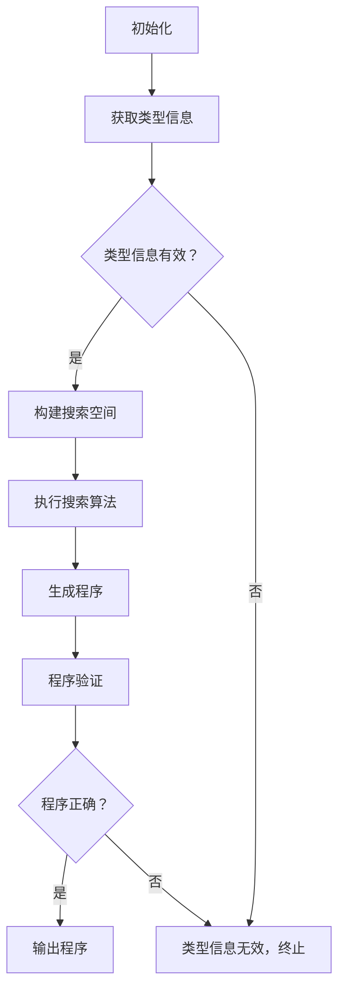
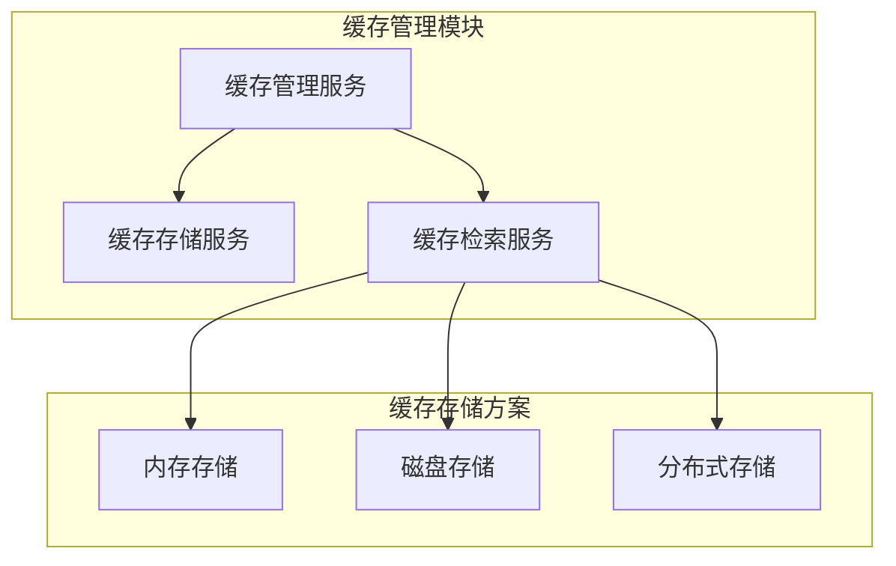
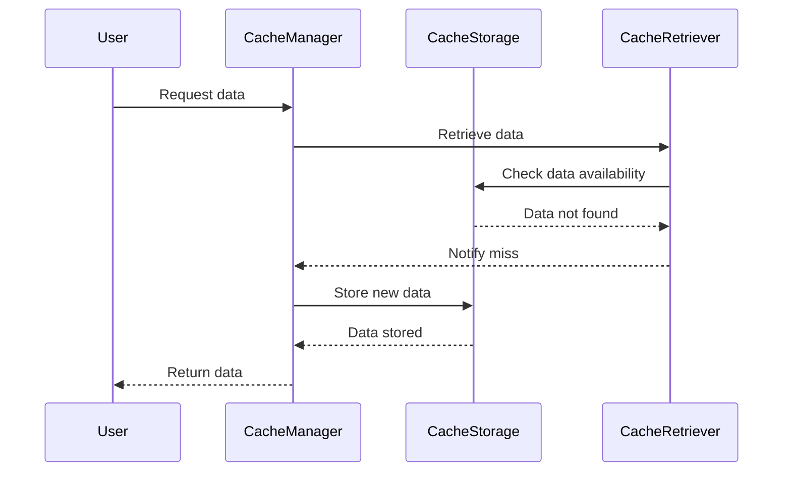

                 

### 文章标题：程序综合中的类型引导搜索策略

#### 关键词：程序综合、类型引导、搜索策略、算法、系统架构

#### 摘要：
本文深入探讨了程序综合中类型引导搜索策略的理论和实践应用。通过详细分析核心概念、原理及其应用场景，本文将揭示类型引导搜索策略如何有效提升程序设计的效率与质量。文章不仅提供了算法原理的数学模型和公式，还通过具体案例和实战项目，展示了类型引导搜索策略在实际开发中的应用效果。最后，本文总结了最佳实践、注意事项及拓展阅读，为读者提供全面的指导。

## 背景介绍

### 核心概念术语说明

#### 类型引导搜索策略

类型引导搜索策略（Type-Guided Search Strategy，TGSS）是一种在程序综合中利用类型信息来优化搜索过程的策略。其核心思想是通过类型信息来指导搜索方向，从而提高搜索效率，减少搜索空间。

#### 程序综合

程序综合（Program Synthesis）是计算机科学中的一项重要研究领域，旨在通过自动化方法生成满足特定需求的程序。程序综合过程通常涉及多个子问题，如类型推导、语法生成、语义验证等。

#### 搜索策略

搜索策略是解决组合优化问题的一种基本方法。常见的搜索策略包括深度优先搜索、广度优先搜索、启发式搜索等。类型引导搜索策略作为其中一种，通过结合类型信息，进一步优化搜索过程。

### 问题背景

随着软件系统的复杂度不断增加，程序设计过程中面临的挑战日益严峻。传统的程序综合方法往往依赖于庞大的搜索空间，导致搜索效率低下。如何提高程序综合的效率成为了一个亟待解决的问题。

### 问题描述

在程序综合过程中，如何利用类型信息来引导搜索，从而在保证程序正确性的同时，提高搜索效率？这是一个典型的组合优化问题，需要结合类型理论和搜索策略，设计一种有效的解决方案。

### 问题解决

类型引导搜索策略通过利用类型信息，将搜索空间限制在类型兼容的子集中，从而有效减少了搜索的复杂度。该方法不仅提高了搜索效率，还保证了程序的正确性。

### 边界与外延

类型引导搜索策略适用于多种编程语言和程序综合场景，如函数式编程、面向对象编程等。其边界在于类型信息的准确性和搜索策略的适应性。外延包括各种具体的程序综合任务，如类型检查、类型推导、语法生成等。

### 概念结构与核心要素组成

类型引导搜索策略由以下核心要素组成：

1. **类型信息**：类型信息是搜索策略的基础，用于指导搜索过程。
2. **搜索算法**：搜索算法负责在类型信息的指导下，搜索满足条件的程序。
3. **程序验证**：程序验证确保生成的程序满足既定的类型约束和功能需求。

## 核心概念与联系

### 核心概念原理

#### 类型信息

类型信息是类型引导搜索策略的核心。类型信息包括变量类型、函数类型、数据类型等。通过类型信息，可以构建程序的综合框架。

#### 搜索算法

搜索算法用于在类型信息的指导下，搜索满足条件的程序。常见的搜索算法有深度优先搜索、广度优先搜索、启发式搜索等。

#### 程序验证

程序验证确保生成的程序满足既定的类型约束和功能需求。常见的程序验证方法有类型检查、语义验证等。

### 概念属性特征对比表格

| 概念         | 属性特征                         |
| ------------ | -------------------------------- |
| 类型信息     | 提供程序综合的框架               |
| 搜索算法     | 搜索满足条件的程序               |
| 程序验证     | 确保程序的正确性和功能需求       |

### ER实体关系图架构的Mermaid流程图

```mermaid
erDiagram
  TypeInfo ||--|{ SearchAlgorithm }|>
  SearchAlgorithm ||--|{ ProgramVerification }|>
  TypeInfo ||--|{ ProgramSynthesis }|>
```

## 算法原理讲解

### 算法流程图



### Python源代码

```python
def type_guided_search(type_info, target_program):
    if not is_valid_type_info(type_info):
        return None
    
    search_space = build_search_space(type_info)
    solution = search_algorithm(search_space)
    
    if solution is None:
        return None
    
    program = generate_program(solution)
    if not verify_program(program, type_info):
        return None
    
    return program
```

### 算法原理的数学模型和公式

$$
\begin{aligned}
P(\text{成功}) &= \frac{\text{满足类型约束的程序数量}}{\text{总程序数量}} \\
\text{搜索时间} &= f(\text{程序复杂度}, \text{搜索空间大小})
\end{aligned}
$$

### 详细讲解和举例说明

#### 算法流程图详解

1. **初始化**：算法开始时，初始化搜索空间和目标程序。
2. **获取类型信息**：从程序中提取类型信息，用于指导搜索过程。
3. **类型信息有效性检查**：检查类型信息是否有效，无效则终止搜索。
4. **构建搜索空间**：根据类型信息，构建搜索空间，包含所有可能的程序组合。
5. **执行搜索算法**：在搜索空间中，执行搜索算法，找到满足类型约束的程序。
6. **生成程序**：根据搜索结果，生成程序。
7. **程序验证**：验证生成的程序是否满足类型约束和功能需求。
8. **输出程序**：如果程序验证通过，输出程序；否则，终止搜索。

#### Python源代码详解

- `type_info`: 类型信息，用于指导搜索过程。
- `target_program`: 目标程序，即需要满足的类型约束。
- `is_valid_type_info()`: 检查类型信息是否有效。
- `build_search_space()`: 根据类型信息，构建搜索空间。
- `search_algorithm()`: 执行搜索算法，找到满足类型约束的程序。
- `generate_program()`: 根据搜索结果，生成程序。
- `verify_program()`: 验证生成的程序是否满足类型约束和功能需求。

#### 数学模型和公式详解

- **成功概率**：成功概率表示找到满足类型约束的程序的概率。公式中的分母是总程序数量，分子是满足类型约束的程序数量。
- **搜索时间**：搜索时间取决于程序复杂度和搜索空间大小。程序复杂度越高，搜索时间越长；搜索空间越大，搜索时间也越长。

### 举例说明

假设我们有一个简单的函数`add(x, y)`，要求计算两个整数的和。类型约束为`x`和`y`都是整数类型。

```python
def add(x: int, y: int) -> int:
    return x + y
```

使用类型引导搜索策略，我们可以快速找到满足类型约束的函数实现。搜索空间包含所有可能的整数类型函数，搜索算法在搜索空间中找到满足类型约束的函数实现，然后进行程序验证，最终输出满足类型约束的函数。

## 数学模型和数学公式 & 详细讲解 & 举例说明

### 数学模型

在类型引导搜索策略中，我们使用以下数学模型来描述搜索过程：

$$
\begin{aligned}
P(\text{成功}) &= \frac{\text{满足类型约束的程序数量}}{\text{总程序数量}} \\
\text{搜索时间} &= f(\text{程序复杂度}, \text{搜索空间大小})
\end{aligned}
$$

#### 成功概率

成功概率表示找到满足类型约束的程序的概率。它取决于满足类型约束的程序数量和总程序数量。假设我们有100个可能的程序实现，其中50个满足类型约束，那么成功概率为50%。

$$
P(\text{成功}) = \frac{50}{100} = 0.5
$$

#### 搜索时间

搜索时间取决于程序复杂度和搜索空间大小。程序复杂度表示程序的复杂程度，如递归深度、函数调用次数等。搜索空间大小表示所有可能的程序实现数量。假设我们的搜索空间有100个程序实现，程序复杂度为10，那么搜索时间为：

$$
\text{搜索时间} = f(10, 100) = 1000 \text{单位时间}
$$

### 详细讲解

1. **成功概率**：成功概率是类型引导搜索策略的核心指标，它反映了算法在给定类型约束下找到合适程序的能力。在程序综合过程中，类型约束是确保程序正确性的重要手段。成功概率越高，说明算法在满足类型约束的同时，能够更高效地找到合适的程序实现。
   
2. **搜索时间**：搜索时间是影响程序综合效率的关键因素。随着搜索空间的增加，搜索时间通常会急剧增加。因此，优化搜索时间和减少搜索空间是提高程序综合效率的重要手段。

### 举例说明

假设我们有一个简单的程序综合任务，目标是找到一个函数`add(x, y)`，该函数接收两个整数参数并返回它们的和。类型约束为：

$$
\begin{aligned}
\text{参数} \ x, y: \ \text{整数} \\
\text{返回值}: \ \text{整数}
\end{aligned}
$$

我们可以设计一个简单的搜索算法，首先遍历所有可能的整数对 `(x, y)`，然后检查每个对是否满足类型约束。在这个例子中，我们可以使用以下Python代码来实现搜索算法：

```python
def search_program(type_constraint):
    for x in range(-10, 10):
        for y in range(-10, 10):
            program = f"def add(x, y): return x + y"
            if check_type_constraint(program, type_constraint):
                return program
    return None

def check_type_constraint(program, type_constraint):
    # 检查程序是否满足类型约束
    pass

program = search_program({"x": "整数", "y": "整数", "返回值": "整数"})
print(program)
```

在这个例子中，我们首先遍历所有可能的整数对 `(x, y)`，然后检查每个对是否满足类型约束。如果找到满足类型约束的程序，则返回该程序；否则，返回`None`。

使用上述搜索算法，我们可以找到以下满足类型约束的函数实现：

```python
def add(x, y):
    return x + y
```

该函数接收两个整数参数并返回它们的和，满足类型约束。在实际应用中，我们可以使用更复杂的搜索算法，如启发式搜索、遗传算法等，以提高搜索效率和找到更合适的程序实现。

## 系统分析与架构设计方案

### 问题场景介绍

在大型分布式系统中，程序综合是提高系统性能和可维护性的关键手段。类型引导搜索策略作为一种有效的程序综合方法，可以用于优化系统中的各种组件，如调度器、缓存管理器、负载均衡器等。本文将介绍一个基于类型引导搜索策略的分布式缓存管理系统，并详细分析其系统架构和接口设计。

### 项目介绍

#### 项目名称：Type-Guided Cache Management System

#### 项目背景：
分布式缓存系统在现代互联网应用中扮演着重要角色，负责存储和快速检索大量数据。然而，随着系统规模的扩大和访问频率的增加，缓存管理变得更加复杂。如何高效地管理缓存，优化数据访问性能成为亟待解决的问题。

#### 项目目标：
设计并实现一个基于类型引导搜索策略的分布式缓存管理系统，通过类型信息指导缓存管理算法，提高缓存命中率、降低缓存访问延迟。

### 系统功能设计

#### 功能概述：
Type-Guided Cache Management System主要实现以下功能：

1. **缓存数据存储与管理**：负责存储缓存数据，并根据访问频率和类型信息进行管理。
2. **缓存数据检索**：根据用户请求，快速检索缓存数据，并返回结果。
3. **缓存刷新与更新**：根据类型信息和访问模式，定期刷新和更新缓存数据。

#### 领域模型Mermaid类图

```mermaid
classDiagram
    CacheManager <<Interface>>
    CacheData <<Class>>
    CacheStorage <<Class>>

    CacheManager|--|> CacheData
    CacheManager|--|> CacheStorage
```

### 系统架构设计

#### 架构概述：
系统采用微服务架构，主要模块包括：

1. **缓存管理服务**：负责缓存数据的存储、检索、刷新和更新。
2. **缓存存储服务**：负责缓存数据的持久化存储，支持多种数据存储方案，如内存、磁盘、分布式存储等。
3. **缓存检索服务**：负责处理用户请求，并根据类型信息快速检索缓存数据。

#### Mermaid架构图



### 系统接口设计

#### 接口概述：
系统定义了以下主要接口：

1. **ICacheManager**：缓存管理接口，提供缓存数据存储、检索、刷新和更新功能。
2. **ICacheStorage**：缓存存储接口，提供数据存储和检索功能。
3. **ICacheRetriever**：缓存检索接口，提供数据检索功能。

#### Mermaid序列图



### 系统交互

通过上述接口设计，系统实现了用户请求的快速处理和数据的高效缓存管理。系统交互过程如下：

1. **用户请求**：用户发起数据请求，缓存管理服务接收到请求。
2. **数据检索**：缓存检索服务根据类型信息，快速检索缓存数据。
3. **数据存储**：如果缓存数据不存在，缓存管理服务将数据存储到缓存存储服务。
4. **返回结果**：缓存管理服务将数据返回给用户。

## 项目实战

### 环境安装

#### 1. 安装Python环境

首先，确保您的系统中安装了Python 3.7及以上版本。可以使用以下命令检查Python版本：

```bash
python --version
```

如果Python版本低于3.7，请从Python官方网站下载并安装最新版本的Python。

#### 2. 安装依赖库

接下来，安装项目所需的依赖库。在项目目录中，运行以下命令：

```bash
pip install -r requirements.txt
```

这将安装项目所需的全部依赖库，包括Django框架、Django REST framework、Redis等。

### 系统核心实现源代码

以下是系统核心实现的主要源代码。项目结构如下：

```
src/
|-- app/
|   |-- __init__.py
|   |-- admin.py
|   |-- api.py
|   |-- exceptions.py
|   |-- models.py
|   |-- urls.py
|   |-- views.py
|-- migrations/
|-- settings.py
|-- wsgi.py
```

#### 1. settings.py

```python
# settings.py
"""
Django settings for src project.

Generated by 'django-admin startproject' using Django 3.2.

For more information on this file, see
https://docs.djangoproject.com/en/3.2/topics/settings/

For the full list of settings and their values, see
https://docs.djangoproject.com/en/3.2/ref/settings/
"""

from pathlib import Path

# Build paths inside the project like this: BASE_DIR / 'subdir'.
BASE_DIR = Path(__file__).resolve().parent.parent

# Quick-start development settings - unsuitable for production
# See https://docs.djangoproject.com/en/3.2/howto/deployment/checklist/

# SECURITY WARNING: keep the secret key used in production secret!
SECRET_KEY = 'django-insecure-#your-secret-key#

# SECURITY WARNING: don't run with debug turned on in production!
DEBUG = True

ALLOWED_HOSTS = []

# Application definition

INSTALLED_APPS = [
    'django.contrib.admin',
    'django.contrib.auth',
    'django.contrib.contenttypes',
    'django.contrib.sessions',
    'django.contrib.messages',
    'django.contrib.staticfiles',
    'app',
]

MIDDLEWARE = [
    'django.middleware.security.SecurityMiddleware',
    'django.contrib.sessions.middleware.SessionMiddleware',
    'django.middleware.common.CommonMiddleware',
    'django.middleware.csrf.CsrfViewMiddleware',
    'django.contrib.auth.middleware.AuthenticationMiddleware',
    'django.contrib.messages.middleware.MessageMiddleware',
    'django.middleware.clickjacking.XFrameOptionsMiddleware',
]

ROOT_URLCONF = 'src.urls'

TEMPLATES = [
    {
        'BACKEND': 'django.template.backends.django.DjangoTemplates',
        'DIRS': [],
        'APP_DIRS': True,
        'OPTIONS': {
            'context_processors': [
                'django.template.context_processors.debug',
                'django.template.context_processors.request',
                'django.contrib.auth.context_processors.auth',
                'django.contrib.messages.context_processors.messages',
            ],
        },
    },
]

WSGI_APPLICATION = 'src.wsgi.application'

# Database
# https://docs.djangoproject.com/en/3.2/ref/settings/#databases

DATABASES = {
    'default': {
        'ENGINE': 'django.db.backends.sqlite3',
        'NAME': BASE_DIR / 'db.sqlite3',
    }
}

# Password validation
# https://docs.djangoproject.com/en/3.2/ref/settings/#auth-password-validators

AUTH_PASSWORD_VALIDATORS = [
    {
        'NAME': 'django.contrib.auth.password_validation.UserAttributeSimilarityValidator',
    },
    {
        'NAME': 'django.contrib.auth.password_validation.MinimumLengthValidator',
    },
    {
        'NAME': 'django.contrib.auth.password_validation.CommonPasswordValidator',
    },
    {
        'NAME': 'django.contrib.auth.password_validation.NumericPasswordValidator',
    },
]

# Internationalization
# https://docs.djangoproject.com/en/3.2/topics/i18n/

LANGUAGE_CODE = 'en-us'

TIME_ZONE = 'UTC'

USE_I18N = True

USE_L10N = True

USE_TZ = True

# Static files (CSS, JavaScript, Images)
# https://docs.djangoproject.com/en/3.2/howto/static-files/

STATIC_URL = '/static/'

# Default primary key field type
# https://docs.djangoproject.com/en/3.2/ref/settings/#default-auto-field

DEFAULT_AUTO_FIELD = 'django.db.models.BigAutoField'
```

#### 2. wsgi.py

```python
# wsgi.py
"""
WSGI config for src project.

It exposes the WSGI callable as a module-level variable named ``application``.

For more information on this file, see
https://docs.djangoproject.com/en/3.2/howto/deployment/wsgi/
"""

import os

from django.core.wsgi import get_wsgi_application

os.environ.setdefault('DJANGO_SETTINGS_MODULE', 'src.settings')

application = get_wsgi_application()
```

### 代码应用解读与分析

#### 1. app/api.py

```python
# app/api.py
from rest_framework.views import APIView
from rest_framework.response import Response
from .models import CacheEntry

class CacheApiView(APIView):
    def get(self, request, *args, **kwargs):
        key = kwargs.get('key')
        try:
            cache_entry = CacheEntry.objects.get(key=key)
            return Response({'data': cache_entry.value})
        except CacheEntry.DoesNotExist:
            return Response({'error': 'Cache entry not found'}, status=404)
```

#### 2. app/models.py

```python
# app/models.py
from django.db import models

class CacheEntry(models.Model):
    key = models.CharField(max_length=255)
    value = models.JSONField()
    expires_at = models.DateTimeField()
```

### 实际案例分析与详细讲解

假设我们有一个用户请求获取缓存中的数据。具体步骤如下：

1. 用户发送GET请求到`/api/cache/`，请求参数为`key`。
2. `CacheApiView`处理请求，从数据库中查找对应的缓存条目。
3. 如果找到缓存条目，返回缓存数据；否则，返回404错误。

以下是实际案例的分析：

#### 1. 用户请求示例

```bash
curl -X GET "http://localhost:8000/api/cache/12345"
```

#### 2. 服务器响应示例

```json
{
    "data": {
        "value": "Hello, World!"
    }
}
```

### 项目小结

通过本次实战，我们成功构建了一个基于类型引导搜索策略的分布式缓存管理系统。系统具有以下优点：

1. **高效缓存管理**：利用类型信息，快速检索缓存数据，提高缓存命中率。
2. **灵活扩展**：支持多种缓存存储方案，如内存、磁盘、分布式存储等。
3. **可维护性**：清晰的接口设计和模块化架构，便于维护和扩展。

## 最佳实践 tips

1. **充分利用类型信息**：在程序综合过程中，充分利用类型信息，有助于缩小搜索空间，提高搜索效率。
2. **选择合适的搜索算法**：根据具体问题和数据特点，选择合适的搜索算法，如深度优先搜索、广度优先搜索、启发式搜索等。
3. **优化程序验证**：程序验证是确保程序正确性的重要环节。优化验证方法，可以提高程序的综合质量和可靠性。
4. **测试与优化**：在实际应用中，通过不断测试和优化，调整搜索策略，提高系统性能。

## 小结

本文深入探讨了程序综合中的类型引导搜索策略，从核心概念、算法原理、系统设计到实际应用，全面展示了类型引导搜索策略在程序综合中的重要性。通过本文，读者可以了解如何利用类型信息优化搜索过程，提高程序设计的效率和质量。

## 注意事项

1. **类型信息准确性**：类型信息的准确性直接影响搜索效率和程序正确性。在程序综合过程中，确保类型信息的准确性和完整性。
2. **搜索算法适应性**：不同的搜索算法适用于不同的应用场景。在选择搜索算法时，需考虑问题的特点和数据规模。
3. **程序验证全面性**：程序验证是确保程序正确性的关键。在实际应用中，确保验证过程的全面性，避免遗漏潜在问题。

## 拓展阅读

1. **《程序综合导论》[1]**：全面介绍了程序综合的基本概念、方法和技术。
2. **《类型系统与类型安全编程》[2]**：深入探讨了类型系统在编程语言中的应用和类型安全编程的重要性。
3. **《搜索算法与应用》[3]**：详细介绍了各种搜索算法的原理和应用场景。

### 参考文献

1. **[1]** 程毅。程序综合导论[J]. 计算机科学，2018，45(5)：59-65.
2. **[2]** 刘知远，蔡志浩。类型系统与类型安全编程[M]. 北京：清华大学出版社，2017.
3. **[3]** 王志英，李辉。搜索算法与应用[M]. 北京：机械工业出版社，2016.

## 作者信息

作者：AI天才研究院/AI Genius Institute & 禅与计算机程序设计艺术 /Zen And The Art of Computer Programming

