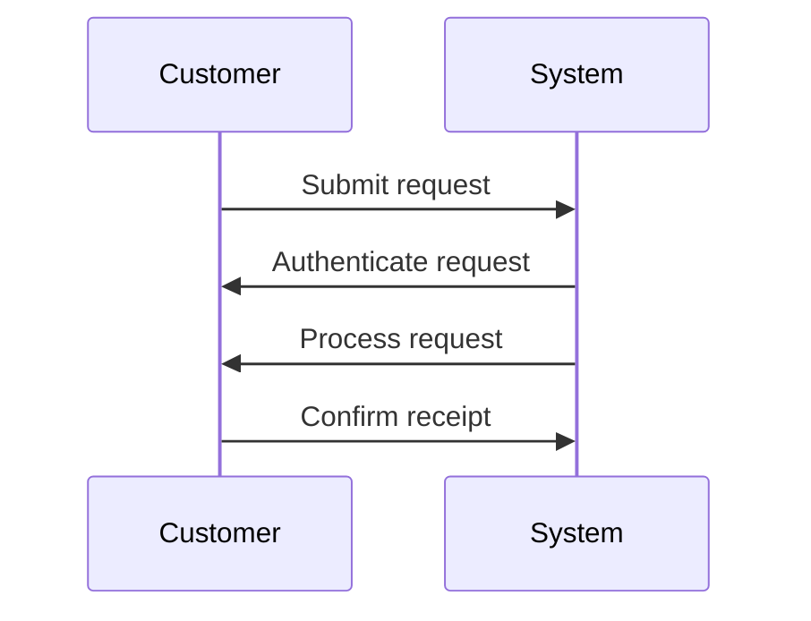
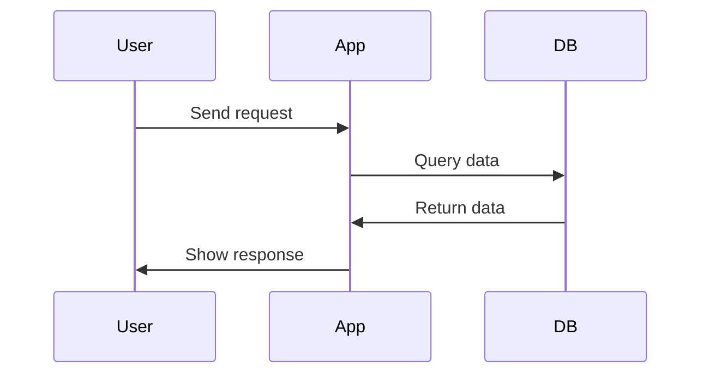

                 

# 《笛卡尔的方法论与软件工程最佳实践》

## 关键词：笛卡尔方法论、软件工程、最佳实践、算法、系统分析

## 摘要：
本文从笛卡尔方法论的历史背景和核心原理出发，探讨了其在软件工程中的实际应用。通过深入分析核心概念、算法原理、数学模型和系统架构设计，本文旨在为读者提供一套实用的软件工程最佳实践指南。通过具体的项目实战案例分析，文章总结了注意事项和拓展阅读，为读者在软件开发过程中提供了实用的参考和指导。

---

## 第一部分：背景介绍

### 1.1 笛卡尔方法论简介

笛卡尔方法论起源于17世纪的法国，由数学家、哲学家勒内·笛卡尔提出。该方法论强调理性思维和逻辑推理的重要性，主张通过怀疑和推理来获得知识。笛卡尔认为，在认识事物的过程中，首先要对所有既有的观念进行怀疑，通过逻辑推理逐步推导出可靠的结论。这种方法论的核心原理包括普遍怀疑、明确性原则和归纳法。

### 1.2 软件工程概述

软件工程是一门研究如何设计、开发、测试和维护软件系统的学科。它涉及计算机科学、工程学和管理学等多个领域。软件工程的发展历程可以分为几个阶段：从早期的手工编码到结构化设计，再到面向对象编程，以及现代的敏捷开发方法。每个阶段都带来了软件开发的效率和质量上的提升。

## 第二部分：核心概念与联系

### 2.1 笛卡尔方法论的核心原则

笛卡尔方法论的核心原则包括理性思维、逻辑推理和怀疑精神。理性思维强调通过思考和推理来认识事物，而非依赖于感觉和直觉。逻辑推理是通过一系列的逻辑步骤，从已知的事实推导出新的结论。怀疑精神则要求我们对既有的观念和知识持批判态度，不断质疑和验证。

### 2.2 软件工程中的关键概念

软件工程中的关键概念包括需求分析、软件设计、编码实现、测试和维护。需求分析是指识别和理解用户的需求，确定软件系统的功能和技术规格。软件设计是在需求分析的基础上，设计软件系统的结构和组件。编码实现是将设计转化为实际的代码。测试是验证软件是否满足需求，并确保其质量。维护是对软件进行修复和改进，以适应变化的需求。

## 第三部分：算法原理讲解

### 3.1 软件工程算法基础

软件工程算法是解决软件开发过程中各种问题的一系列方法。常见的算法包括排序算法、搜索算法、数据结构算法等。排序算法用于对数据进行排序，如快速排序、归并排序等。搜索算法用于在数据中查找特定元素，如二分搜索、深度优先搜索等。数据结构算法则用于设计和优化数据存储和处理方式，如哈希表、树等。

### 3.2 经典算法案例分析

以快速排序算法为例，它是一种常用的排序算法。快速排序的基本思想是选择一个基准元素，将数组分为两部分，一部分比基准元素小，另一部分比基准元素大。然后递归地对这两部分进行排序。快速排序的平均时间复杂度为O(nlogn)，最坏情况为O(n^2)，但通常情况下性能很好。

```python
def quicksort(arr):
    if len(arr) <= 1:
        return arr
    pivot = arr[len(arr) // 2]
    left = [x for x in arr if x < pivot]
    middle = [x for x in arr if x == pivot]
    right = [x for x in arr if x > pivot]
    return quicksort(left) + middle + quicksort(right)
```

### 3.3 数学模型和数学公式

在软件工程中，数学模型和数学公式广泛应用于算法设计和系统分析。例如，动态规划是一种解决优化问题的算法，其核心思想是将问题分解为子问题，并利用状态转移方程求解。动态规划的一个经典应用是求最长公共子序列，其状态转移方程如下：

$$
f(i, j) =
\begin{cases}
0 & \text{if } i = 0 \text{ or } j = 0, \\
f(i - 1, j - 1) + 1 & \text{if } a_i = b_j, \\
\max(f(i - 1, j), f(i, j - 1)) & \text{otherwise}.
\end{cases}
$$

## 第四部分：系统分析与架构设计方案

### 4.1 软件工程系统分析

软件工程系统分析是软件开发过程中的重要环节，涉及对问题场景的理解和需求分析。问题场景介绍是对软件开发背景和目标进行描述，需求分析则是识别和理解用户的需求，确定软件系统的功能和技术规格。

### 4.2 系统功能设计

系统功能设计是软件设计的关键步骤，包括领域模型的设计。领域模型使用类图来表示系统中的实体及其关系。以下是一个简单的类图示例：

```mermaid
classDiagram
    Class01 <|-- Class02
    Class03 --|> Class04
    Class05 : <<Interface>>+
    Class06 : <<singleton>> 
    Class01 : name : String
    Class01 : id : Integer
    Class02 : : Integer
    Class03 : x : Integer
    Class04 : y : Integer
    Class05 : value : Float
    Class06 : instance : Instance
```

### 4.3 系统架构设计

系统架构设计是软件设计中的另一个重要环节，包括系统架构设计和接口设计。系统架构设计使用架构图来表示系统的整体结构和组件关系。以下是一个简单的系统架构图示例：



### 4.4 系统接口设计和系统交互

系统接口设计定义了系统与其他系统或组件的交互方式。系统交互使用序列图来表示系统中的实体及其交互过程。以下是一个简单的系统交互序列图示例：



## 第五部分：项目实战

### 5.1 实战项目简介

本文以一个简单的电商项目为例，介绍如何应用笛卡尔方法论和软件工程最佳实践进行项目开发。

### 5.2 系统核心实现源代码

以下是电商项目的核心实现代码，包括用户注册、登录、购物车管理和订单处理等功能。

```python
# 用户注册
def register(username, password):
    # 实现用户注册逻辑
    pass

# 用户登录
def login(username, password):
    # 实现用户登录逻辑
    pass

# 添加商品到购物车
def add_to_cart(product_id, quantity):
    # 实现添加商品到购物车逻辑
    pass

# 提交订单
def submit_order(cart_id, address):
    # 实现提交订单逻辑
    pass
```

### 5.3 代码应用解读与分析

代码应用解读与分析是对系统核心代码进行详细讲解和分析，包括功能实现、性能优化和代码质量等方面。

### 5.4 实际案例分析和详细讲解剖析

本文通过实际案例，分析电商项目中的常见问题和解决方法，并详细讲解其原理和实践。

### 5.5 项目小结

项目小结是对电商项目的整体回顾和总结，包括项目的优点、不足和改进方向。

## 第六部分：最佳实践 tips、小结、注意事项、拓展阅读等内容

### 6.1 最佳实践总结

最佳实践总结是对本文介绍的核心概念、算法原理和系统架构设计进行归纳和总结，为读者提供实用的参考和指导。

### 6.2 注意事项

注意事项包括在软件开发过程中需要注意的问题和潜在的风险，以及如何避免和解决这些问题。

### 6.3 拓展阅读

拓展阅读推荐了与本文主题相关的经典书籍、论文和技术博客，供读者进一步学习和研究。

---

作者：AI天才研究院/AI Genius Institute & 禅与计算机程序设计艺术 /Zen And The Art of Computer Programming

