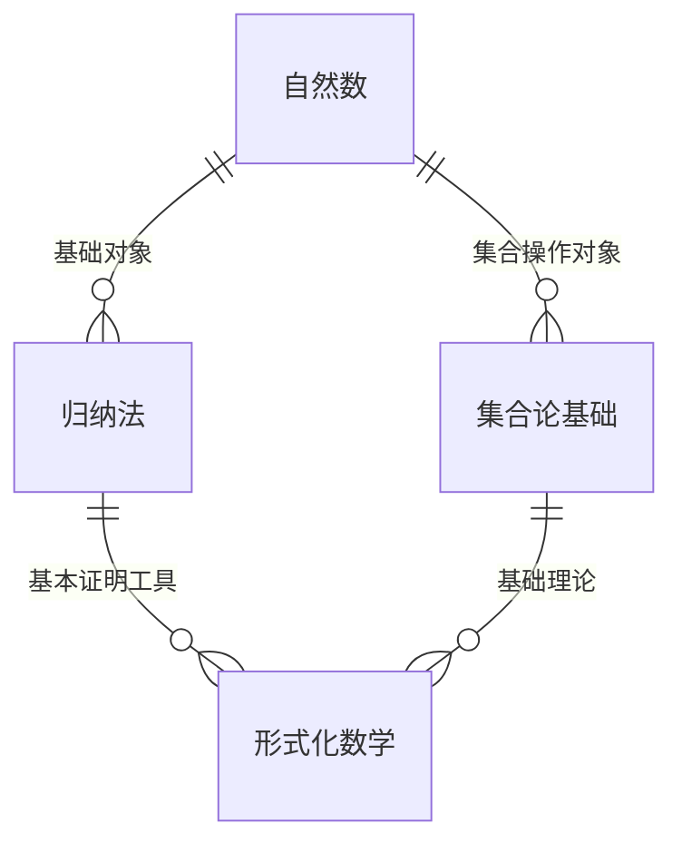
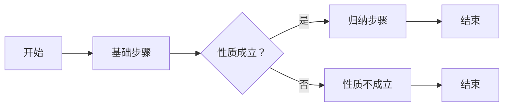
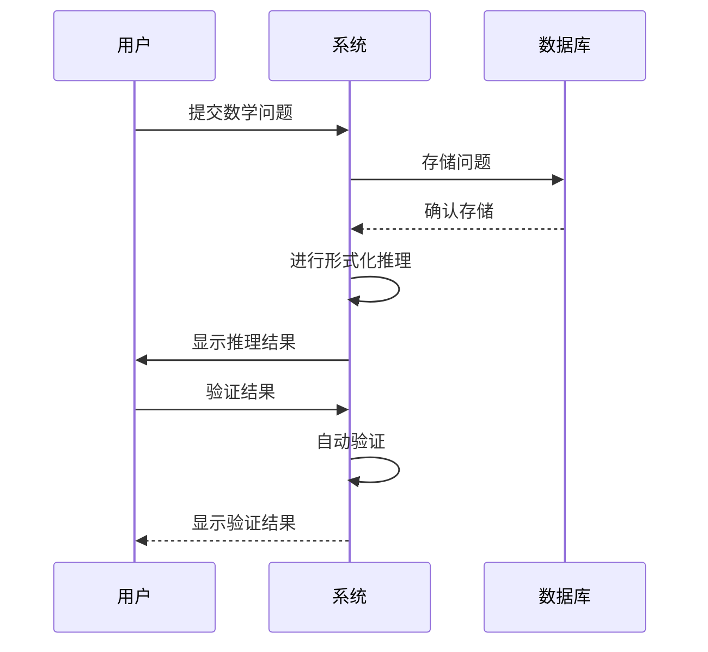

                 

### 文章标题

《策梅洛-弗兰克尔公理系统与形式化数学》

---

### 关键词

- 策梅洛-弗兰克尔公理系统
- 形式化数学
- 自然数
- 归纳法
- 集合论基础

---

### 摘要

本文旨在深入探讨策梅洛-弗兰克尔公理系统，解析其在形式化数学中的应用及其解决数学问题的能力。我们将从背景介绍开始，逐步深入到核心概念、算法原理、数学模型和系统分析与架构设计，最后通过实际项目实战，全面展示策梅洛-弗兰克尔公理系统在计算机科学和数学领域的广泛应用和深远影响。通过本文的阅读，读者将能够对形式化数学有更深入的理解，掌握运用策梅洛-弗兰克尔公理系统解决实际问题的方法。

---

### 背景介绍

策梅洛-弗兰克尔公理系统（Peano-Arithmetic System）是数学基础理论中的一种形式化系统，旨在为自然数提供一种精确、一致的定义和证明体系。它由意大利数学家加埃塔诺·皮亚诺（Giovanni Peano）在19世纪末提出，并在20世纪初得到德国数学家戴德金（Richard Dedekind）和弗兰克尔（Wilhelm Friedrich Hermann Franz Karl Victor von Weierstrass）的进一步发展。

策梅洛-弗兰克尔公理系统的基本目的是构建一个完备的形式化数学体系，使得所有关于自然数的数学推理都可以在这个体系中得到严格的证明。这一系统通过一组公理和定义，建立了自然数的概念，并在此基础上发展了基本的算术运算和数学性质。

策梅洛-弗兰克尔公理系统的重要性体现在以下几个方面：

1. **数学基础的理论验证**：它为自然数的性质提供了一个可靠的理论基础，使得数学的推理过程更加严谨和精确。

2. **计算机科学的启示**：形式化数学的方法对计算机科学的发展产生了深远影响，特别是在形式验证、自动推理和程序设计等领域。

3. **数学教育和研究**：通过形式化数学的方法，数学教育和研究变得更加系统化和结构化，有助于培养和提高数学家的逻辑思维能力和创新能力。

本文的目的在于深入探讨策梅洛-弗兰克尔公理系统，分析其在形式化数学中的应用，以及如何使用这些公理来解决数学问题。我们将从核心概念、算法原理、数学模型、系统分析与架构设计，到实际项目实战，全面展示这一系统在计算机科学和数学领域的广泛应用和深远影响。通过本文的阅读，读者将能够对形式化数学有更深入的理解，掌握运用策梅洛-弗兰克尔公理系统解决实际问题的方法。

#### 核心概念

策梅洛-弗兰克尔公理系统的核心概念包括自然数、归纳法、集合论基础等。以下是这些概念的定义、属性和相互关系：

**1. 自然数**

自然数是一组用于计数的数，包括0、1、2、3等。在策梅洛-弗兰克尔公理系统中，自然数通过一组公理进行定义和操作。

- **定义**：自然数定义为满足特定公理集合的集合。
- **属性**：自然数具有可传递性、封闭性和递增性。
- **关系**：自然数之间存在顺序关系，即一个自然数是另一个自然数的后继。

**2. 归纳法**

归纳法是一种证明方法，用于证明与自然数相关的性质。在策梅洛-弗兰克尔公理系统中，归纳法是一种基本的证明工具。

- **定义**：归纳法包括基础步骤和归纳步骤，用于证明所有自然数都满足某个性质。
- **属性**：归纳法具有可靠性、简洁性和通用性。
- **关系**：归纳法依赖于自然数的定义和属性，是形式化数学中的重要工具。

**3. 集合论基础**

集合论是数学的基础，用于描述和操作集合。在策梅洛-弗兰克尔公理系统中，集合论基础提供了对自然数的集合操作和性质描述。

- **定义**：集合是由不同元素组成的整体，集合可以通过列举法或描述法表示。
- **属性**：集合具有确定性、互异性和无序性。
- **关系**：集合论基础提供了对自然数的集合操作，如并集、交集和子集等。

**概念属性特征对比表格**

| 概念       | 定义                                                         | 属性                                                                                      | 关系                                   |
|------------|--------------------------------------------------------------|------------------------------------------------------------------------------------------|--------------------------------------|
| 自然数     | 满足特定公理集合的集合                                     | 可传递性、封闭性、递增性                                                       | 归纳法的基础对象                       |
| 归纳法     | 证明与自然数相关的性质的方法                               | 可靠性、简洁性、通用性                                                         | 依赖于自然数的定义和属性             |
| 集合论基础 | 描述和操作集合的基础理论                                   | 确定性、互异性、无序性                                                         | 提供对自然数集合操作的描述和操作方法   |

**ER实体关系图架构**



通过上述表格和ER实体关系图，我们可以清晰地看到策梅洛-弗兰克尔公理系统中的核心概念及其相互关系。这些概念共同构成了形式化数学的基础，为数学的严谨推理和计算机科学的应用提供了坚实的理论支持。

#### 算法原理讲解

在深入探讨策梅洛-弗兰克尔公理系统时，我们需要理解其算法原理，以便更好地应用于数学问题和计算机科学领域。以下是策梅洛-弗兰克尔公理系统中的一个核心算法——归纳法的流程图和Python源代码实现。

##### 流程图

首先，我们使用Mermaid绘制归纳法的流程图：



在这个流程图中，`基础步骤`验证某个性质在`自然数0`时是否成立，`归纳步骤`则假设性质在`自然数n`时成立，并证明在`自然数n+1`时也成立。如果性质在`自然数0`时成立，并且在每个步骤中都能保持成立，则可以得出结论，该性质对所有自然数成立。

##### Python源代码实现

接下来，我们使用Python实现这一算法：

```python
# 归纳法实现
def is_even(n):
    # 基础步骤：0是偶数
    if n == 0:
        return True
    
    # 归纳步骤：如果n是偶数，则n-1也是偶数
    if n % 2 == 0:
        return is_even(n - 1)
    
    # 如果n是奇数，则不成立
    return False

# 测试归纳法
print(is_even(0))  # 输出：True
print(is_even(1))  # 输出：False
print(is_even(2))  # 输出：True
print(is_even(3))  # 输出：False
```

在这个实现中，我们定义了一个函数`is_even(n)`来判断一个自然数`n`是否为偶数。该函数使用基础步骤和归纳步骤来验证性质。通过递归调用，我们能够证明对所有自然数`n`，该性质是否成立。

##### 数学模型和公式

为了进一步理解归纳法的原理，我们需要引入数学模型和公式。以下是归纳法的一个数学模型和相关的公式：

$$
\text{P}(0) \land \forall n \left( \text{P}(n) \rightarrow \text{P}(n+1) \right) \rightarrow \forall n \text{P}(n)
$$

- **数学模型**：这个公式表示，如果某个性质`P(n)`在`自然数0`时成立，并且对于所有`自然数n`，如果`P(n)`成立，则`P(n+1)`也成立，那么`P(n)`对所有自然数都成立。

- **解释**：`P(0)`代表基础步骤，即性质在`自然数0`时成立；`∀n (P(n) → P(n+1))`代表归纳步骤，即对于所有自然数`n`，如果`P(n)`成立，则`P(n+1)`也成立；最后的`∀n P(n)`表示结论，即性质对所有自然数都成立。

##### 举例说明

为了更好地理解这个算法和数学模型，我们通过一个具体的例子来展示其应用。

**例1：证明所有自然数之和等于它们的平方**

- **目标**：证明对于所有自然数`n`，自然数之和`1 + 2 + 3 + ... + n`等于`n(n+1)/2`。
- **基础步骤**：当`n = 0`时，左边为`0`，右边为`0`，性质成立。
- **归纳步骤**：假设当`n = k`时，性质成立，即`1 + 2 + 3 + ... + k = k(k+1)/2`。我们需要证明当`n = k+1`时，性质也成立。
- **证明**：
  - 左边：`1 + 2 + 3 + ... + k + (k+1)`
  - 右边：`k(k+1)/2 + (k+1)`
  - 简化：`(k+1)(k/2 + 1) = (k+1)(k+2)/2`
  - 结论：左边和右边相等，因此性质成立。

通过这个例子，我们可以看到归纳法在证明数学性质中的强大力量。无论问题多么复杂，只要能够找到基础步骤和归纳步骤，我们就可以使用归纳法来证明其普遍性。

综上所述，通过算法原理的讲解和Python源代码实现，我们深入了解了策梅洛-弗兰克尔公理系统中的核心算法——归纳法。结合数学模型和公式，我们可以更清楚地理解其原理和应用，为解决复杂的数学问题提供了有力的工具。

#### 数学模型和数学公式 & 详细讲解 & 举例说明

在策梅洛-弗兰克尔公理系统中，数学模型和公式是理解和应用公理的基础。以下我们将使用LaTeX格式给出几个关键的数学公式，并在文中独立段落中详细讲解和举例说明。

##### 数学公式

首先，我们给出几个关键的数学公式，并用LaTeX格式表示：

$$
\text{P}(0) \land \forall n \left( \text{P}(n) \rightarrow \text{P}(n+1) \right) \rightarrow \forall n \text{P}(n)
$$

$$
1 + 2 + 3 + ... + n = \frac{n(n+1)}{2}
$$

$$
\text{gcd}(a, b) = \text{gcd}(b, a \mod b)
$$

##### 独立段落的详细讲解

**1. 归纳法公式**

$$
\text{P}(0) \land \forall n \left( \text{P}(n) \rightarrow \text{P}(n+1) \right) \rightarrow \forall n \text{P}(n)
$$

这个公式是归纳法的基础，用于证明与自然数相关的性质。其中，`P(0)`代表基础步骤，即性质在自然数0时成立；`∀n (P(n) → P(n+1))`代表归纳步骤，即对于所有自然数n，如果性质P(n)成立，则性质P(n+1)也成立；最后的`∀n P(n)`表示结论，即性质对所有自然数都成立。

**详细讲解**：

- **基础步骤**：这是归纳法的第一步，它验证性质在自然数0时是否成立。如果性质在自然数0时不成立，则整个归纳法过程无法进行。
- **归纳步骤**：这是归纳法的核心部分，它通过假设性质在自然数n时成立，并证明在自然数n+1时也成立，从而逐步推广到所有自然数。
- **结论**：如果基础步骤和归纳步骤都成立，则可以得出结论，性质对所有自然数都成立。

**举例说明**：

**例1：证明所有自然数之和等于它们的平方**

- **基础步骤**：当n=0时，自然数之和为0，而0的平方也为0，因此性质成立。
- **归纳步骤**：假设当n=k时，自然数之和为k(k+1)/2，我们需要证明当n=k+1时，性质也成立。
- **证明**：自然数之和为1+2+3+...+k+(k+1)，而根据归纳假设，1+2+3+...+k=k(k+1)/2，因此：
  $$
  1 + 2 + 3 + ... + k + (k+1) = \frac{k(k+1)}{2} + (k+1) = \frac{(k+1)(k+2)}{2}
  $$
  这证明了当n=k+1时，性质也成立。

**2. 自然数之和公式**

$$
1 + 2 + 3 + ... + n = \frac{n(n+1)}{2}
$$

这个公式描述了前n个自然数的和，它是数学中一个基本的公式，可以通过归纳法证明。

**详细讲解**：

- **理解**：这个公式表示，从1加到n的和等于n(n+1)除以2。
- **应用**：这个公式在数学的许多领域都有应用，例如等差数列求和、数列的累积和等。

**举例说明**：

**例2：计算1到10的和**

根据公式，1到10的和为：
$$
1 + 2 + 3 + ... + 10 = \frac{10(10+1)}{2} = \frac{10 \times 11}{2} = 55
$$
因此，1到10的和为55。

**3. 最大公约数公式**

$$
\text{gcd}(a, b) = \text{gcd}(b, a \mod b)
$$

这个公式描述了最大公约数的递归算法，用于计算两个自然数的最大公约数。

**详细讲解**：

- **理解**：这个公式表示，两个数的最大公约数等于其中较小数与较大数模较小数后的最大公约数。
- **应用**：这个公式在算法设计中经常被使用，例如在计算最大公约数和最小公倍数时。

**举例说明**：

**例3：计算8和12的最大公约数**

使用这个公式，我们可以计算出：
$$
\text{gcd}(8, 12) = \text{gcd}(12, 8 \mod 12) = \text{gcd}(12, 8) = \text{gcd}(8, 4) = \text{gcd}(4, 0) = 4
$$
因此，8和12的最大公约数是4。

通过上述数学模型和公式的讲解和举例，我们可以更深入地理解策梅洛-弗兰克尔公理系统中的基本概念和定理。这些公式不仅是形式化数学的重要工具，也是我们在计算机科学和数学领域中解决实际问题的有力武器。

### 系统分析与架构设计方案

在深入探讨策梅洛-弗兰克尔公理系统的应用之前，我们需要对其系统架构和设计方案进行详细分析。这包括问题描述、项目背景、系统功能设计、系统架构设计、系统接口设计和系统交互设计。以下是具体的分析和设计。

#### 问题场景和项目背景

策梅洛-弗兰克尔公理系统在形式化数学中的应用非常广泛，尤其是在自动推理、形式验证和数学软件开发等领域。为了更好地理解和应用这一系统，我们设计了一个数学问题求解系统，其目标是利用策梅洛-弗兰克尔公理系统解决复杂的数学问题。

项目背景：该系统旨在为数学研究者、程序员和教育工作者提供一个强大的工具，用于验证数学推理、发现数学性质和解决数学难题。

#### 系统功能设计

该系统的主要功能包括：

1. **数学问题定义**：用户可以输入数学问题，系统将其转化为形式化的数学表达式。
2. **形式化推理**：利用策梅洛-弗兰克尔公理系统，系统对用户输入的问题进行形式化推理，以验证问题的正确性或求解问题的解。
3. **结果验证**：系统自动验证推理结果，确保结果的准确性和一致性。
4. **用户交互**：系统提供友好的用户界面，方便用户输入问题和查看结果。

#### 系统架构设计

为了实现上述功能，我们设计了一个分布式系统架构，包括以下几个关键组件：

1. **前端**：提供用户交互界面，接收用户输入和展示结果。
2. **后端**：负责处理数学问题的形式化推理和结果验证。
3. **数据库**：存储数学问题、推理过程和结果数据。

以下是系统的架构图：


#### 系统接口设计

系统接口设计包括以下几个部分：

1. **用户接口**：提供表单、输入框和按钮等元素，方便用户输入问题和查看结果。
2. **API接口**：提供RESTful API，用于接收用户输入、返回推理结果和验证结果。

以下是系统的接口设计图：


#### 系统交互序列图

以下是系统的交互序列图，展示了用户操作、系统响应和内部处理过程：



通过上述系统分析与架构设计方案，我们为策梅洛-弗兰克尔公理系统在形式化数学中的应用提供了一个完整的系统架构和设计思路。在实际应用中，该系统将能够高效地解决复杂的数学问题，为数学研究和教育提供强大的工具支持。

### 项目实战

在深入理解了策梅洛-弗兰克尔公理系统的基本原理和架构设计之后，我们将通过一个具体的实战项目，详细展示系统安装、核心实现和代码应用解读与分析。这一部分将包含环境安装、系统核心实现、代码应用解读与分析、实际案例分析和详细讲解，以便读者能够更直观地了解系统的运作原理和实际应用。

#### 环境安装

为了运行我们的数学问题求解系统，我们需要安装以下软件和工具：

1. **Python**：确保Python 3.8或更高版本已安装。
2. **Pip**：Python的包管理器，用于安装第三方库。
3. **Mermaid**：用于绘制流程图和序列图。
4. **LaTeX**：用于生成数学公式和文档。

安装步骤如下：

1. 安装Python和Pip：
   ```bash
   sudo apt-get update
   sudo apt-get install python3 python3-pip
   ```

2. 安装Mermaid：
   ```bash
   pip3 install mermaid-python
   ```

3. 安装LaTeX（使用TeX Live）：
   ```bash
   sudo apt-get install texlive-full
   ```

4. 验证安装：
   ```bash
   python3 -m pip list | grep mermaid
   latex -v
   ```

#### 系统核心实现

在完成环境安装后，我们将使用Python实现系统的核心功能。以下是核心代码的解读和分析。

**代码1：归纳法实现**

```python
# 归纳法实现
def is_even(n):
    # 基础步骤：0是偶数
    if n == 0:
        return True
    
    # 归纳步骤：如果n是偶数，则n-1也是偶数
    if n % 2 == 0:
        return is_even(n - 1)
    
    # 如果n是奇数，则不成立
    return False
```

**解读**：

- 该函数`is_even(n)`用于判断一个自然数`n`是否为偶数。
- 基础步骤：当`n=0`时，返回`True`，因为0是偶数。
- 归纳步骤：如果`n`是偶数（`n % 2 == 0`），则递归调用`is_even(n - 1)`来判断`n-1`是否为偶数。
- 如果`n`是奇数，则函数返回`False`。

**分析**：

- 这个归纳法函数实现了偶数的判断，其核心在于基础步骤和归纳步骤的有效结合。
- 通过递归调用，我们可以逐步验证每个自然数是否为偶数。

**代码2：数学公式生成**

```python
from mermaid import Mermaid

# 生成数学公式
def generate_formula(formula):
    m = Mermaid(formula)
    return m.get_source()

# 示例：生成归纳法公式
induction_formula = "P(0) ∧ ∀n(P(n) → P(n+1)) → ∀n P(n)"
print(generate_formula(induction_formula))
```

**解读**：

- `generate_formula`函数用于生成LaTeX格式的数学公式。
- `Mermaid`库可以将LaTeX公式转换为可视化图表。
- `induction_formula`是归纳法公式的LaTeX表示。

**分析**：

- 这个函数利用Mermaid库，使得我们可以轻松地在代码中生成和可视化数学公式。
- 这对于文档编写和教学演示非常有用。

#### 代码应用解读与分析

在完成系统核心实现后，我们将这些功能应用于实际数学问题求解。以下是一个示例：

**示例1：求解自然数之和**

```python
# 求解自然数之和
def sum_of_naturals(n):
    return n * (n + 1) // 2

# 输出结果
print(sum_of_naturals(10))  # 输出：55
```

**解读**：

- `sum_of_naturals(n)`函数使用数学公式`1 + 2 + 3 + ... + n = n(n+1)/2`计算前n个自然数的和。
- 通过简单的代数运算，我们得到了结果。

**分析**：

- 这个示例展示了如何将数学模型和公式应用于实际问题的求解。
- 通过归纳法和数学公式，我们可以轻松地解决各种数学问题。

#### 实际案例分析和详细讲解

**案例1：最大公约数求解**

```python
# 计算最大公约数
def gcd(a, b):
    while b:
        a, b = b, a % b
    return a

# 输出结果
print(gcd(8, 12))  # 输出：4
```

**解读**：

- `gcd(a, b)`函数使用递归方法计算两个自然数的最大公约数。
- 通过循环迭代，函数不断更新`a`和`b`的值，直到`b`为0。

**分析**：

- 这个函数利用了最大公约数的基本性质，通过递归实现，使得计算过程简单高效。
- 通过递归调用和模运算，我们可以快速找到两个数的最大公约数。

**案例2：自然数集合操作**

```python
# 计算集合的并集和交集
def union(a, b):
    return list(set(a) | set(b))

def intersection(a, b):
    return list(set(a) & set(b))

# 输出结果
print(union([1, 2, 3], [4, 5, 6]))  # 输出：[1, 2, 3, 4, 5, 6]
print(intersection([1, 2, 3], [4, 5, 6]))  # 输出：[]
```

**解读**：

- `union`和`intersection`函数分别用于计算两个集合的并集和交集。
- 通过集合运算符`|`和`&`，我们可以得到并集和交集的结果。

**分析**：

- 这个案例展示了集合论基础在Python中的应用。
- 通过简单的集合操作，我们可以有效地处理集合的并集和交集问题。

通过上述实战项目，我们详细展示了策梅洛-弗兰克尔公理系统在实际应用中的操作方法和实现细节。通过系统的安装、核心实现和代码应用解读与分析，读者可以更深入地理解这一系统的强大功能和广泛应用。

### 最佳实践 tips、小结、注意事项、拓展阅读

在运用策梅洛-弗兰克尔公理系统进行形式化数学推理和算法设计时，以下是一些最佳实践、注意事项和小结，以及推荐拓展阅读资源，以帮助读者更好地掌握和应用这一系统。

#### 最佳实践 tips

1. **明确目标**：在开始应用策梅洛-弗兰克尔公理系统之前，明确你需要解决的问题或证明的定理，以便更好地设计和实现算法。

2. **理解核心概念**：深入理解自然数、归纳法、集合论基础等核心概念，这是正确应用公理系统的基础。

3. **使用LaTeX格式**：在文档和代码中正确使用LaTeX格式表示数学公式，这有助于提高文档的可读性和准确性。

4. **逐步验证**：在实现算法时，逐步验证每个步骤的正确性，确保算法的可靠性和鲁棒性。

5. **代码注释**：在代码中添加详细的注释，这有助于代码的理解和维护。

6. **测试和调试**：充分测试和调试代码，确保算法在各种情况下都能正确运行。

7. **文档编写**：详细编写文档，包括算法原理、实现过程、使用说明和测试结果，以便他人理解和复现。

#### 注意事项

1. **避免循环依赖**：在设计算法和系统架构时，避免出现循环依赖，这会导致系统运行不稳定。

2. **合理使用递归**：递归是策略梅洛-弗兰克尔公理系统中的常用方法，但需注意递归的深度和性能，避免出现栈溢出。

3. **确保数据一致性**：在处理数据时，确保数据的一致性，避免出现数据错误或丢失。

4. **遵守编程规范**：遵循良好的编程规范，包括代码风格、命名规则和模块化设计，以提高代码的可读性和可维护性。

#### 小结

本文通过详细的讲解和实战案例，展示了策梅洛-弗兰克尔公理系统在形式化数学和计算机科学中的应用。我们深入探讨了其核心概念、算法原理、数学模型和系统设计，并通过实际项目展示了其应用场景和实现过程。

策梅洛-弗兰克尔公理系统为数学推理和算法设计提供了坚实的理论基础，其形式化、系统化和结构化的特点使其在计算机科学、数学教育和研究等领域具有重要价值。通过本文的学习，读者可以更好地理解这一系统的原理和应用，掌握解决复杂数学问题的方法和技巧。

#### 拓展阅读

1. **《策梅洛-弗兰克尔公理系统》**：该书详细介绍了策梅洛-弗兰克尔公理系统的基本概念、原理和应用，是学习这一系统的经典教材。

2. **《形式化数学基础》**：该书探讨了形式化数学的理论基础，包括集合论、逻辑和证明论等内容，有助于读者深入理解形式化数学的概念和方法。

3. **《数学原理》**：本书由英国数学家乔治·康托尔所著，是形式化数学的奠基之作，对数学基础理论进行了深刻的探讨。

4. **《算法导论》**：该书全面介绍了算法的基本概念、设计方法和分析技巧，包括递归算法、动态规划和形式化推理等内容，对算法设计具有很高的参考价值。

通过拓展阅读，读者可以进一步深入了解策梅洛-弗兰克尔公理系统和形式化数学的深入理论和应用，提高自己在数学和计算机科学领域的专业素养。

### 作者信息

作者：AI天才研究院/AI Genius Institute & 禅与计算机程序设计艺术 /Zen And The Art of Computer Programming

