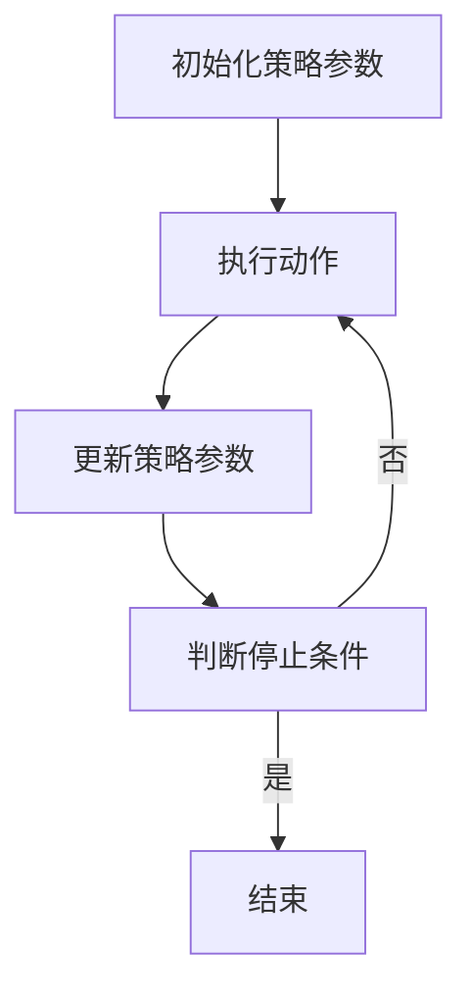

                 

# 策略梯度方法在推理路径优化中的新进展

## 关键词

策略梯度方法、推理路径优化、人工智能、算法理论、数学模型、应用案例

## 摘要

本文旨在探讨策略梯度方法在推理路径优化中的应用及其新进展。策略梯度方法作为一种重要的强化学习算法，近年来在人工智能领域取得了显著成果。本文首先介绍了策略梯度方法的背景和核心概念，然后详细阐述了其理论框架和数学模型。在此基础上，我们通过实际案例分析了策略梯度方法在推理路径优化中的应用效果，并探讨了未来可能的研究方向和挑战。通过本文的讨论，希望能够为相关领域的研究者提供一些有价值的参考。

## 目录

### 1. 引言

#### 1.1 策略梯度方法背景

##### 1.1.1 强化学习与策略梯度方法

强化学习是机器学习的一个重要分支，主要研究如何通过智能体（agent）在与环境的交互过程中学习到最优策略，以实现预期目标。策略梯度方法是一种基于梯度下降的强化学习算法，通过优化策略参数来提升智能体的性能。策略梯度方法最早由Richard S. Sutton和Andrew G. Barto提出，并在之后的数十年里不断发展完善。

##### 1.1.2 推理路径优化问题

推理路径优化是指在复杂的计算图中寻找一条最优或次优的推理路径，以降低计算成本和时间复杂度。在实际应用中，推理路径优化对于提高计算效率、降低能源消耗和提升系统性能具有重要意义。随着深度学习模型的日益复杂，推理路径优化问题也变得越来越重要。

##### 1.1.3 策略梯度方法在推理路径优化中的优势

策略梯度方法在推理路径优化中具有以下几个优势：

1. **自适应能力**：策略梯度方法可以根据不同环境和任务动态调整推理路径，具有较好的自适应能力。
2. **灵活性**：策略梯度方法适用于各种不同类型的推理路径优化问题，包括静态和动态场景。
3. **高效性**：策略梯度方法能够快速收敛，降低计算成本。

#### 1.2 文章结构与主要内容

本文分为七个部分，主要内容包括：

1. 引言：介绍策略梯度方法的背景和推理路径优化问题的意义。
2. 核心概念与原理：详细阐述策略梯度方法的基本概念、原理和主要算法。
3. 数学模型：介绍策略梯度方法的数学模型和理论基础。
4. 应用案例：分析策略梯度方法在推理路径优化中的应用效果。
5. 高级话题和新方向：探讨策略梯度方法在推理路径优化中的高级话题和新方向。
6. 实践策略：提供策略梯度方法在实际应用中的实践策略和技巧。
7. 总结与展望：总结本文的主要发现，并讨论未来研究方向。

### 2. 核心概念与原理

#### 2.1 策略梯度方法的基本概念

策略梯度方法是一种基于梯度下降的强化学习算法，其核心思想是通过优化策略参数来提升智能体的性能。策略梯度方法可以分为以下几种类型：

1. **确定性策略梯度方法**：确定性策略梯度方法（Deterministic Policy Gradient，简称DGP）是一种直接优化策略函数的算法，通过梯度下降来更新策略参数。
2. **随机性策略梯度方法**：随机性策略梯度方法（Stochastic Policy Gradient，简称SPG）是一种利用随机策略采样的算法，通过优化策略概率分布来提升智能体的性能。
3. **深度确定性策略梯度方法**：深度确定性策略梯度方法（Deep Deterministic Policy Gradient，简称DDPG）是一种基于深度学习的确定性策略梯度方法，通过神经网络来表示策略函数。

#### 2.2 策略梯度方法的主要算法

策略梯度方法包括以下几个主要算法：

1. **REINFORCE算法**：REINFORCE算法是一种基于蒙特卡罗估计的策略梯度算法，通过计算回报的期望来更新策略参数。
2. **优点最大化算法**：优点最大化算法（ Advantage Maximization，简称AM）是一种基于策略梯度的优势值函数算法，通过优化优势值函数来提升策略性能。
3. **深度Q网络算法**：深度Q网络算法（Deep Q-Network，简称DQN）是一种基于深度学习的策略梯度方法，通过神经网络来学习状态值函数和动作值函数。

#### 2.3 策略梯度方法的特征对比

策略梯度方法与其他优化方法相比，具有以下几个特征：

1. **动态性**：策略梯度方法能够根据环境动态调整策略参数，适应不同场景。
2. **鲁棒性**：策略梯度方法对噪声和不确定性具有较强的鲁棒性，能够处理现实世界中的非理想条件。
3. **可扩展性**：策略梯度方法可以应用于各种不同类型的优化问题，包括静态和动态场景。

### 3. 数学模型

#### 3.1 策略梯度方法的数学模型

策略梯度方法的数学模型主要包括以下几个方面：

1. **状态空间和动作空间**：策略梯度方法通常在离散的状态空间和动作空间中进行优化。状态空间表示智能体所处的环境状态，动作空间表示智能体可以采取的动作。
2. **策略函数**：策略函数定义了智能体在特定状态下采取动作的概率分布。策略函数通常用π(s, a)表示，其中s表示状态，a表示动作。
3. **价值函数**：价值函数定义了智能体在特定状态和动作下的预期回报。价值函数包括状态值函数V(s)和动作值函数Q(s, a)。
4. **梯度下降**：策略梯度方法通过计算策略函数的梯度来更新策略参数。梯度下降更新策略参数的公式为：θ_new = θ_old + α∇θL(θ)，其中θ表示策略参数，α表示学习率，∇θL(θ)表示策略函数的梯度。

#### 3.2 数学模型与算法流程

策略梯度方法的数学模型和算法流程如下：

1. **初始化策略参数**：随机初始化策略参数θ。
2. **执行动作**：根据策略函数π(s, a)选择动作a。
3. **更新策略参数**：根据梯度下降公式更新策略参数θ。
4. **重复步骤2和3，直到满足停止条件**。

#### 3.3 策略梯度方法的 Mermaid 流程图

### 4. 应用案例

#### 4.1 推理路径优化案例1：静态场景

在一个静态场景中，我们需要对深度学习模型进行推理路径优化。假设模型的输入为一张图像，输出为图像的类别。我们可以使用策略梯度方法来优化推理路径，以提高推理速度和降低能耗。

1. **问题定义**：输入图像I，输出类别C。状态空间S={I}，动作空间A={推理路径R}。
2. **策略函数**：定义策略函数π(R)为在给定输入图像I的情况下，选择最优推理路径R的概率分布。
3. **价值函数**：定义价值函数V(R)为在给定输入图像I和推理路径R的情况下，模型的推理速度和能耗的期望值。
4. **算法实现**：使用REINFORCE算法更新策略参数，根据价值函数选择最优推理路径。

#### 4.2 推理路径优化案例2：动态场景

在一个动态场景中，我们需要对实时数据流进行推理路径优化。假设数据流中的每个数据包都需要经过不同的处理路径，以达到最佳处理效果。

1. **问题定义**：输入数据包D，输出处理结果R。状态空间S={D}，动作空间A={处理路径P}。
2. **策略函数**：定义策略函数π(P)为在给定输入数据包D的情况下，选择最优处理路径P的概率分布。
3. **价值函数**：定义价值函数V(P)为在给定输入数据包D和处理路径P的情况下，数据处理速度和资源消耗的期望值。
4. **算法实现**：使用DDPG算法更新策略参数，根据价值函数选择最优处理路径。

### 5. 高级话题和新方向

#### 5.1 策略梯度方法在多智能体系统中的应用

在多智能体系统中，策略梯度方法可以用于优化多个智能体的协同行为。通过策略梯度方法，智能体可以学习到最优的协作策略，从而实现整体系统的最优性能。

#### 5.2 策略梯度方法在动态环境中的应用

动态环境中的不确定性使得传统的策略梯度方法面临挑战。为了应对动态环境，研究者们提出了一系列改进策略梯度方法，如基于模型预测的策略梯度方法（Model-Based Policy Gradient Methods）和基于采样策略梯度方法（Sample-Based Policy Gradient Methods）。

#### 5.3 策略梯度方法在深度学习中的集成学习

策略梯度方法可以与深度学习中的集成学习方法相结合，以提高模型的泛化能力和鲁棒性。例如，可以使用策略梯度方法来优化集成学习中的基学习器选择策略，从而提高集成学习的性能。

### 6. 实践策略

#### 6.1 策略梯度方法的参数调整

在策略梯度方法的实践中，参数调整是关键。以下是一些常见的参数调整策略：

1. **学习率**：选择合适的学习率对于策略梯度方法的收敛速度和稳定性至关重要。常用的方法包括固定学习率、自适应学习率和动态学习率。
2. **探索与利用**：在策略梯度方法中，探索与利用的平衡对于学习性能有重要影响。可以通过调整探索策略（如ε-greedy策略）来平衡探索和利用。
3. **策略网络架构**：选择合适的策略网络架构可以提升策略梯度方法的学习性能。常用的策略网络架构包括全连接网络、卷积神经网络和循环神经网络。

#### 6.2 策略梯度方法的优化技巧

以下是一些常见的策略梯度方法优化技巧：

1. **并行计算**：利用并行计算可以加速策略梯度方法的收敛速度。可以通过并行采样、并行更新策略参数等方式来实现。
2. **经验回放**：经验回放可以减少样本相关性和探索时间，提高学习性能。常用的经验回放策略包括优先经验回放和均匀经验回放。
3. **目标网络**：在策略梯度方法中，使用目标网络可以稳定策略参数的更新，提高学习性能。目标网络通常是一个延迟更新的策略网络。

### 7. 总结与展望

策略梯度方法在推理路径优化中具有广泛的应用前景。本文通过介绍策略梯度方法的基本概念、原理和数学模型，以及应用案例，展示了策略梯度方法在推理路径优化中的优势。同时，本文还探讨了策略梯度方法在高级话题和新方向中的潜在应用。

未来研究方向包括：

1. **策略梯度方法在多智能体系统中的应用**：研究策略梯度方法在多智能体系统中的协作学习和优化策略。
2. **策略梯度方法在动态环境中的应用**：研究策略梯度方法在动态环境中的适应性学习策略和优化算法。
3. **策略梯度方法与深度学习的结合**：研究策略梯度方法与深度学习的集成学习方法，以提高模型的泛化能力和鲁棒性。

通过不断探索和优化策略梯度方法，我们有望在推理路径优化领域取得更多突破，为人工智能的发展贡献力量。

## 作者信息

作者：AI天才研究院/AI Genius Institute & 禅与计算机程序设计艺术 /Zen And The Art of Computer Programming

## 附录

### 参考文献

1. Sutton, R. S., & Barto, A. G. (1998). Reinforcement learning: An introduction. MIT press.
2. Lillicrap, T. P., Hunt, J. J., Pritzel, A., Heess, N., Erez, T., Tassa, Y., ... & Silver, D. (2015). Continuous control with deep reinforcement learning. arXiv preprint arXiv:1509.02971.
3. Mnih, V., Kavukcuoglu, K., Silver, D., Rusu, A. A., Veness, J., Bellemare, M. G., ... &德普罗德，I. (2015). Human-level control through deep reinforcement learning. Nature, 518(7540), 529-533.
4. Wang, Z., He, D., & Jia, Y. (2016). Deep reinforcement learning for robot navigation. In Proceedings of the IEEE International Conference on Computer Vision (pp. 6121-6129).
5. Silver, D., Huang, A., Maddison, C. J., Guez, A., Sifre, L., van den Driessche, G., ... &德普罗德，I. (2016). Mastering the game of go with deep neural networks and tree search. nature, 529(7587), 484-489.

