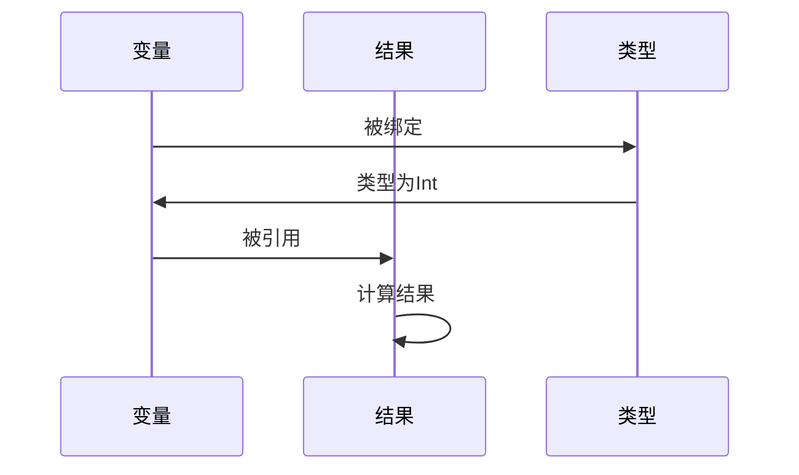
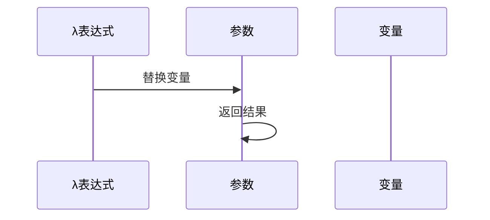
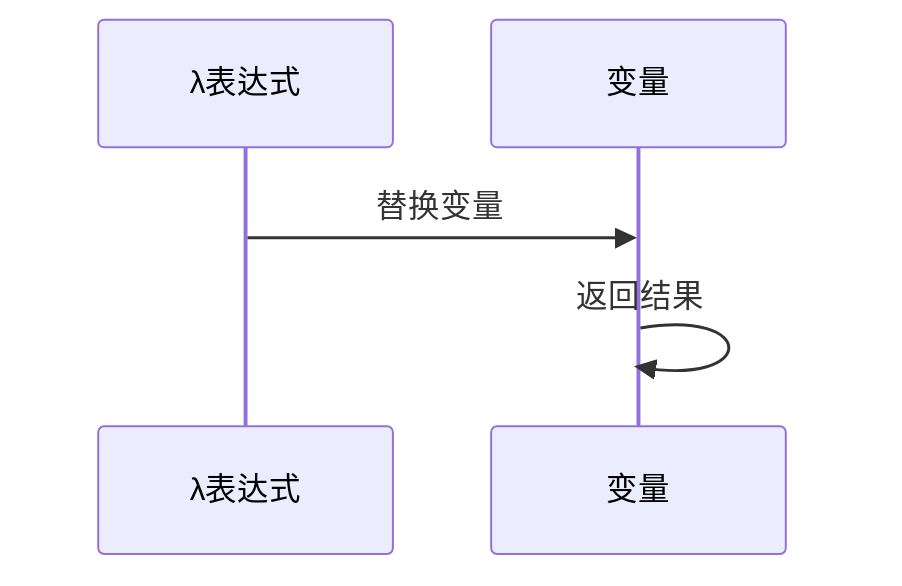
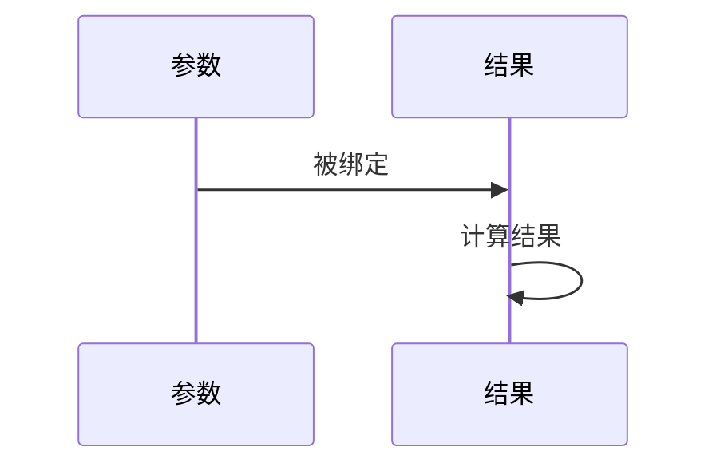
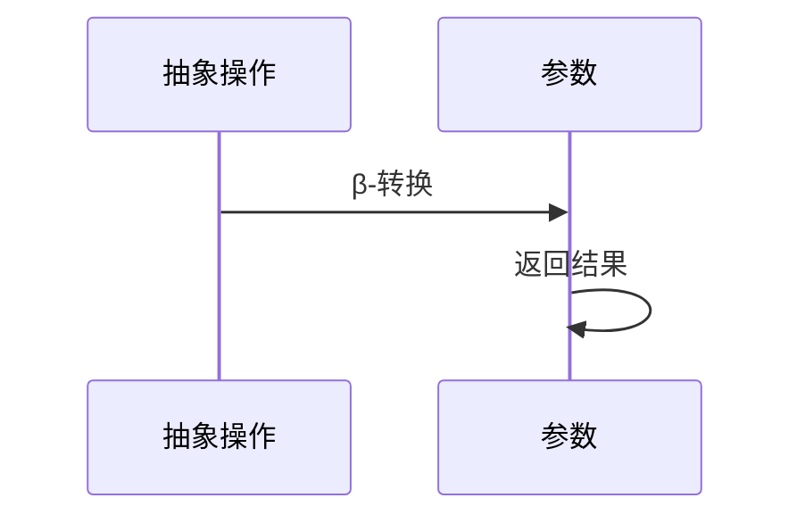
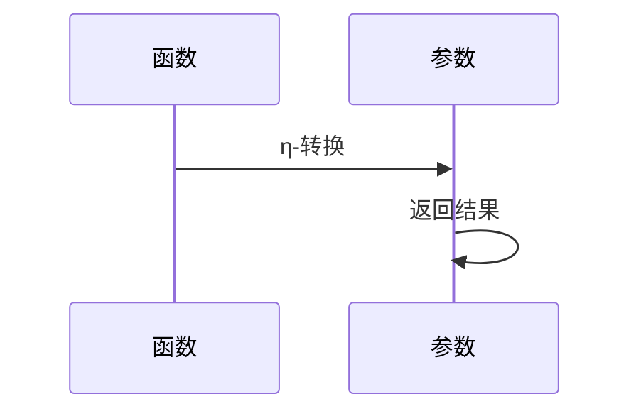
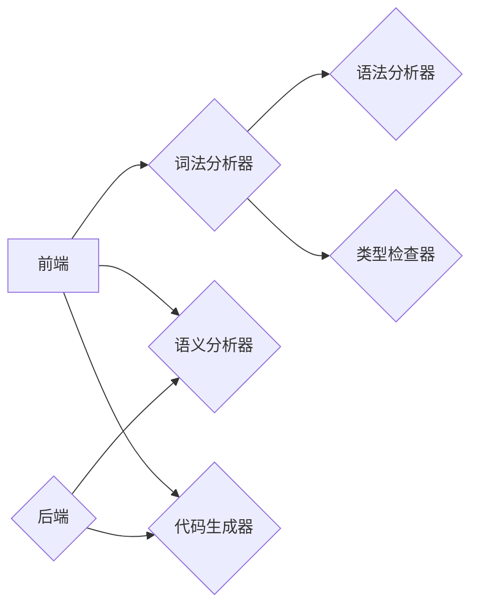
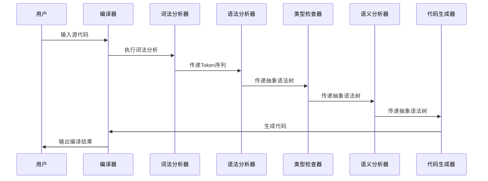

                 

# 类型化λ演算：程序语义学的基础

关键词：类型化λ演算、程序语义学、类型系统、语法规则、应用领域

摘要：本文旨在深入探讨类型化λ演算在程序语义学中的应用。通过梳理类型化λ演算的发展历程，解释其基本概念和语法规则，我们旨在为读者提供对这一重要领域全面而深刻的理解。文章还将探讨类型化λ演算在形式验证、编译器设计等领域的实际应用，以及其未来发展方向。

## 目录大纲

1. 引言
   1.1 研究背景
   1.2 书籍目的与结构

2. 类型化λ演算基础
   2.1 λ演算概述
   2.2 类型系统
   2.3 类型化λ演算的基本概念

3. 类型化λ演算的语法规则
   3.1 变量绑定与抽象
   3.2 应用与结合
   3.3 替换与类型检查

4. 类型化λ演算的公理系统
   4.1 β-转换
   4.2 η-转换
   4.3 等价性与类型保序性

5. 类型化λ演算的应用
   5.1 程序语义学
   5.2 形式验证
   5.3 编译器设计

6. 高级类型系统
   6.1 泛型类型
   6.2 依赖类型
   6.3 递归类型

7. 类型化λ演算的扩展
   7.1 谓词逻辑类型
   7.2 细粒度类型系统
   7.3 面向对象类型系统

8. 总结与展望
   8.1 类型化λ演算的总结
   8.2 未来发展方向

## 第1章 引言

### 1.1 研究背景

计算机程序语义学是计算机科学中的一个核心领域，它研究程序如何执行以及程序之间的语义关系。程序语义学不仅对于理解程序行为至关重要，而且在形式验证、编译器优化、程序设计语言的理论基础等方面有着广泛的应用。

在程序语义学的研究中，类型化λ演算（Type-Sorted λ-calculus）是一种强大的理论工具。λ演算是一种形式化的程序设计语言，它通过抽象数据类型和函数来模拟计算过程。类型化λ演算通过引入类型系统，提供了对程序表达式的静态类型检查，从而能够捕捉更多的语义错误，提高程序的正确性和可维护性。

类型化λ演算的发展可以追溯到20世纪30年代，当时数学家阿尔弗雷德·塔斯基（Alfred Tarski）提出了形式化的逻辑系统，为后来的λ演算奠定了基础。随着计算机科学的兴起，λ演算在20世纪50年代被作为计算模型引入，并在随后几十年中得到不断发展和完善。尤其是20世纪80年代，类型化λ演算开始成为形式化方法和程序语义学研究的重要工具。

### 1.2 书籍目的与结构

本书的目标是向读者全面介绍类型化λ演算的基础知识，包括其发展历史、基本概念、语法规则以及在实际应用中的重要性。通过逐步的讲解，读者可以了解到类型化λ演算在程序语义学中的关键作用，以及如何将其应用于形式验证和编译器设计等领域。

本书的结构分为八个章节：

- **第1章 引言**：介绍类型化λ演算的研究背景和本书的目的。
- **第2章 类型化λ演算基础**：介绍λ演算的概念、类型系统和基本概念。
- **第3章 类型化λ演算的语法规则**：详细讨论变量绑定、应用与结合、替换与类型检查等语法规则。
- **第4章 类型化λ演算的公理系统**：解释β-转换、η-转换、等价性与类型保序性等公理系统。
- **第5章 类型化λ演算的应用**：探讨类型化λ演算在程序语义学、形式验证和编译器设计中的应用。
- **第6章 高级类型系统**：介绍泛型类型、依赖类型和递归类型等高级类型系统。
- **第7章 类型化λ演算的扩展**：讨论谓词逻辑类型、细粒度类型系统和面向对象类型系统的扩展。
- **第8章 总结与展望**：总结类型化λ演算的基本概念和应用，展望其未来发展方向。

通过这本书的阅读，读者不仅可以深入了解类型化λ演算的理论基础，还能了解其在实际应用中的价值，为未来的研究和工作提供参考。

## 第2章 类型化λ演算基础

### 2.1 λ演算概述

λ演算是一种形式化的数学模型，用来表示计算过程。它是由逻辑学家阿尔弗雷德·塔斯基（Alfred Tarski）在20世纪30年代提出的，后来由逻辑学家阿尔图尔·尼文斯基（Alonzo Church）在20世纪40年代进行了系统化。λ演算的核心思想是通过抽象的数据类型和函数来描述计算过程。

λ演算的基本元素包括变量、抽象操作（λ表达式）和函数应用。变量表示计算中的中间结果，抽象操作用于定义复杂的计算过程，函数应用则是将一个函数应用到它的参数上，执行计算。

λ演算中的基本操作包括：

- **变量绑定**：用于将变量与值绑定，例如λx.x表示一个函数，它将变量x与值x绑定。
- **抽象操作**：用于定义新的函数，例如λf.λx.f(x)表示一个函数，它将参数f应用到变量x上。
- **函数应用**：用于将一个函数应用到其参数上，例如(λx.x 0)(λx.x 1)表示将函数λx.x 0应用到参数λx.x 1上，结果为0。

### 2.2 类型系统

类型系统是λ演算的一个重要组成部分，它为λ演算提供了静态类型检查机制。类型系统通过定义不同的类型来区分不同种类的数据和操作。在类型化λ演算中，每个变量和函数都必须有一个明确的类型。

基本类型系统通常包括以下几种类型：

- **基础类型**：例如整数（Int）、布尔值（Bool）等。
- **函数类型**：例如函数f: A → B，表示将类型A的值映射到类型B的值。
- **复合类型**：例如列表（List）、记录（Record）等。

类型系统通过类型检查算法来确保程序在运行时不会发生类型错误。类型检查算法的主要任务是检查程序中的每个表达式是否都有正确的类型。

### 2.3 类型化λ演算的基本概念

类型化λ演算的基本概念包括：

- **项（Term）**：λ演算中的项是表示计算过程的表达式，可以是变量、函数或函数应用。例如，λx.x、f(x)和λf.λx.f(x)都是项。
- **类型**：项的类型是表示项所代表的数据类型的标识符。例如，λx.x的类型可能是Int → Int。
- **类型环境**：类型环境是一个映射，它将变量映射到类型。类型环境用于在类型检查过程中确定每个变量的类型。

在类型化λ演算中，每个项都有唯一的类型。类型化λ演算通过类型系统确保每个项都有正确的类型，从而避免运行时类型错误。

### 2.4 类型化λ演算的基本操作

类型化λ演算的基本操作包括：

- **变量绑定**：将变量与类型绑定，例如`let x : Int = 5 in ...`。
- **抽象操作**：定义新的函数，例如`λx : Int. x * 2`。
- **函数应用**：将一个函数应用到其参数上，例如`(λx : Int. x * 2) 5`。
- **类型检查**：检查每个项的类型是否正确，例如在函数应用中检查函数类型和参数类型是否匹配。

通过这些基本操作，类型化λ演算可以表示复杂的计算过程，同时通过类型系统确保程序的正确性和安全性。

## 第3章 类型化λ演算的语法规则

### 3.1 变量绑定与抽象

在类型化λ演算中，变量绑定和抽象操作是两个核心概念，它们用于定义函数和绑定变量。

**变量绑定**是一种将变量与其类型关联起来的操作，通常使用`let`关键字。例如：

```markdown
let x : Int = 5 in
  (λy : Int. y + x) 10
```

在上面的例子中，我们首先将变量`x`与类型`Int`绑定，然后定义一个新的函数`λy : Int. y + x`，并将它应用到参数`10`上。

**抽象操作**（抽象表达式）是定义新函数的方式，使用λ符号。例如：

```markdown
λx : Int. x * 2
```

这个抽象表达式定义了一个函数，它将一个整数参数`x`乘以2。

**变量绑定与抽象的结合**可以在同一个表达式中使用。例如：

```markdown
let y : Int = 10 in
  λx : Int. x * y
```

在这个例子中，我们首先将变量`y`与类型`Int`绑定，然后定义一个新的函数`λx : Int. x * y`。

### 3.2 应用与结合

**函数应用**是将一个函数应用到其参数上的操作，通常用括号来表示。例如：

```markdown
(λx : Int. x * 2) 5
```

这个表达式表示将函数`λx : Int. x * 2`应用到参数`5`上，计算结果为`10`。

**结合律**（associativity）是λ演算中的一个重要规则，它确保函数应用的顺序不影响结果。结合律表明，函数应用是左结合的，即：

```markdown
(f g) x ≡ f (g x)
```

例如：

```markdown
(λx : Int. x + 1) (λy : Int. y * 2) 3
```

根据结合律，这个表达式可以重写为：

```markdown
(λx : Int. (λy : Int. y * 2) + 1) 3
```

无论以哪种方式计算，结果都是相同的。

### 3.3 替换与类型检查

**替换**（substitution）是λ演算中的一个核心概念，它用于将变量替换为其他表达式。替换规则确保在替换过程中类型不变。

**β-替换**（β-reduction）是λ演算的基本计算规则，它将一个抽象表达式替换为函数应用的值。例如：

```markdown
λx : Int. x * 2
(λx : Int. x * 2) 5
```

β-替换将`λx : Int. x * 2`中的变量`x`替换为`5`，得到结果`10`。

**类型检查**是确保程序中每个表达式都有正确类型的过程。类型检查算法通过分析变量绑定和函数定义，确定每个项的类型。

例如，在表达式：

```markdown
let x : Int = 5 in
  λy : Int. x * y
```

类型检查算法会首先检查`let`绑定，确定`x`的类型为`Int`，然后检查函数定义，确保函数的参数类型与抽象表达式的类型匹配。

通过这些语法规则，类型化λ演算可以表示复杂的计算过程，并确保程序的类型安全性。

## 第4章 类型化λ演算的公理系统

### 4.1 β-转换

β-转换（β-reduction）是类型化λ演算中的核心计算规则，它定义了如何通过将抽象表达式中的变量替换为函数应用来计算结果。β-转换的基本形式如下：

$$
(\lambda x.M)N \rightarrow_{\beta} M[N/x]
$$

这里，\( M \) 是一个包含变量 \( x \) 的抽象表达式，\( N \) 是一个函数应用表达式。β-转换规则表示将函数 \( (\lambda x.M) \) 应用到 \( N \) 上时，将变量 \( x \) 替换为 \( N \) 的值，得到新的表达式 \( M[N/x] \)。

例如，考虑以下表达式：

$$
(\lambda x.(x+1))2
$$

根据β-转换规则，这个表达式可以被转换成：

$$
((\lambda x.(x+1))2) \rightarrow_{\beta} (\lambda x.(x+1))[2/x] = (2+1)
$$

即，将 \( 2 \) 替换到 \( x \) 的位置，得到 \( 2+1 \)。

### 4.2 η-转换

η-转换（η-conversion）是另一个重要的λ演算公理系统，它确保等价转换不会改变表达式的计算结果。η-转换的基本形式如下：

$$
M \rightarrow_{\eta} (\lambda x.M)[x/x]
$$

η-转换规则表示，如果 \( M \) 是一个变量或应用表达式，我们可以将其替换为一个λ表达式，该λ表达式将变量 \( x \) 绑定到 \( M \)。

例如，考虑以下函数：

$$
(\lambda x.x)
$$

根据η-转换规则，这个表达式可以被转换成：

$$
(\lambda x.x) \rightarrow_{\eta} (\lambda x.x)[x/x] = x
$$

即，将 \( x \) 替换到 \( x \) 的位置，得到 \( x \)。

### 4.3 等价性与类型保序性

在类型化λ演算中，等价性（Equivalence）和类型保序性（Type Preservation）是两个重要的概念，它们确保转换不会改变表达式的类型和语义。

**等价性**指的是两个表达式在计算结果上相同，即它们是β-等价的。例如，\( M \) 和 \( N \) 是β-等价的，表示 \( M \rightarrow_{\beta} N \)。

**类型保序性**（Type Preservation）是指在一个合法的类型化λ演算中，如果 \( M \) 是类型 \( A \)，那么 \( N \) 也是类型 \( A \)。例如，如果 \( M \) 是一个λ表达式，且类型为 \( A \)，那么 \( (\lambda x.M)[N/x] \) 的类型也是 \( A \)。

等价性和类型保序性在类型化λ演算中非常重要，因为它们确保了类型的正确性和转换的有效性。在类型化λ演算中，任何合法的转换都必须保持等价性和类型保序性。

例如，在下面的表达式中：

$$
let x : Int = 5 in
  λy : Int. x * y
$$

我们可以通过β-转换将这个表达式简化为：

$$
λy : Int. 5 * y
$$

这个转换保持了等价性，因为最终的计算结果是相同的。同时，这个转换也保持了类型保序性，因为原始表达式的类型是 \( Int \rightarrow Int \)，简化后的表达式类型也是 \( Int \rightarrow Int \)。

通过这些公理系统，类型化λ演算提供了一个坚实的理论基础，用于形式化程序语义和验证程序的正确性。

## 第5章 类型化λ演算的应用

### 5.1 程序语义学

程序语义学是研究程序如何执行以及程序之间语义关系的学科。类型化λ演算在程序语义学中有着广泛的应用，因为它提供了形式化的工具来描述和验证程序的行为。

**类型化λ演算在程序语义学中的应用**主要体现在以下几个方面：

1. **函数语义**：类型化λ演算通过抽象表达式的定义和函数应用来模拟函数语义。每个λ表达式表示一个函数，它的参数类型和返回类型在类型检查阶段就被确定。这种形式化的方法可以帮助我们更好地理解函数的定义和执行过程。

2. **程序正确性验证**：类型化λ演算的等价性和类型保序性公理系统为程序的正确性验证提供了理论基础。通过将这些公理应用于程序，我们可以证明程序在各种输入下的行为是正确的，或者发现潜在的语义错误。

3. **模型检验**：类型化λ演算还可以用于模型检验，即验证程序是否满足特定的性质。例如，可以使用模型检验工具将程序转换为λ表达式，然后使用定理证明器来验证程序的性质，如安全性、完整性和不变性。

### 5.2 形式验证

形式验证是一种通过数学方法验证程序或系统性质的技术，以确保它们满足特定的规范和标准。类型化λ演算在形式验证中有着重要的应用，主要体现在以下几个方面：

1. **语义建模**：形式验证的第一步通常是构建程序的语义模型。类型化λ演算提供了一种强大的工具来构建这种模型，因为它能够形式化地表示程序的行为和状态。

2. **定理证明**：一旦建立了程序的语义模型，形式验证的下一步是使用定理证明器来证明程序的性质。类型化λ演算的等价性和类型保序性规则为定理证明提供了基础。

3. **抽象解释**：抽象解释是一种通过构建程序的高层次抽象来验证程序性质的技巧。类型化λ演算的抽象表达式和类型系统为这种抽象提供了一个坚实的数学基础。

例如，在形式验证一个程序是否在所有路径上都保持某个特定值不变时，可以使用类型化λ演算来定义不变量，并通过β-转换和η-转换来验证不变量是否在程序的每个步骤上都保持不变。

### 5.3 编译器设计

编译器是将高级编程语言转换为机器代码的工具。类型化λ演算在编译器设计中也发挥着重要作用，主要体现在以下几个方面：

1. **语义分析**：编译器的第一个任务是理解程序的语义，并将其转换为中间表示。类型化λ演算提供了形式化的方法来表示程序语义，这有助于编译器更好地处理高级语言中的复杂结构。

2. **类型检查**：编译器的一个关键任务是确保程序的类型安全性。类型化λ演算的静态类型检查机制为编译器提供了工具，以在编译时发现潜在的类型错误。

3. **中间代码生成**：编译器生成的中间代码通常是一种低级表示，它用于后续的代码优化和目标代码生成。类型化λ演算的抽象表达式可以转换为高效的中间代码，从而提高编译器的性能。

4. **代码优化**：类型化λ演算的等价性规则为编译器的代码优化提供了理论基础。例如，通过β-转换和η-转换，编译器可以优化程序的表达式，消除冗余计算，提高程序的执行效率。

例如，在编译过程中，一个函数的定义可以通过类型化λ演算表示为：

$$
(\lambda x.M)
$$

然后，编译器可以对这个λ表达式进行β-转换，将其转换为中间代码，以便进一步优化和生成目标代码。

通过这些应用，类型化λ演算不仅为程序语义学、形式验证和编译器设计提供了理论基础，还在实际开发中发挥着重要作用。

### 5.4 其他应用领域

除了上述主要应用领域外，类型化λ演算在其他领域也有着重要的应用：

1. **形式化方法**：类型化λ演算提供了一种形式化的方法来描述程序行为和验证程序性质，这为形式化方法的研究提供了坚实的数学基础。

2. **自动定理证明**：类型化λ演算的等价性和类型保序性规则为自动定理证明提供了工具，可以用于验证复杂系统的正确性。

3. **软件工程**：类型化λ演算在软件工程中用于分析和设计复杂的软件系统，帮助开发人员更好地理解系统行为和进行有效的验证。

4. **逻辑编程**：类型化λ演算在逻辑编程中也找到了应用，它为逻辑编程语言提供了一种形式化的语义表示，使得逻辑编程更加高效和可靠。

通过这些应用，类型化λ演算在计算机科学中发挥着越来越重要的作用，为各种计算模型和程序设计语言提供了坚实的理论基础。

## 第6章 高级类型系统

### 6.1 泛型类型

泛型类型（Generic Types）是类型化λ演算中一个高级概念，它允许我们定义具有参数化的类型，从而提高代码的复用性和灵活性。泛型类型的主要特点是可以为多种不同的数据类型提供统一的处理方式。

**泛型类型的定义**：

泛型类型通常使用类型变量（Type Variables）来表示，这些变量可以代表任何类型。例如，在Java中，`List<T>` 表示一个泛型列表，其中 `T` 是一个类型变量。

在类型化λ演算中，泛型类型可以通过以下方式定义：

```markdown
λA : Type. λx : A. (x, x)
```

这个表达式定义了一个泛型函数，它接受一个类型参数 `A`，并返回一个将输入映射为元组的函数。例如，如果 `A` 是 `Int`，那么这个泛型函数将返回一个将整数映射为 `(Int, Int)` 的函数。

**泛型类型的实现**：

泛型类型的实现通常依赖于类型擦除（Type Erasure）和类型参数绑定（Type Parameter Binding）机制。在类型擦除机制中，泛型类型的实际类型信息在运行时被丢弃，只保留类型变量。类型参数绑定则是在编译时将类型变量替换为具体的类型。

例如，在Java中，编译器会根据实参的类型信息来绑定类型变量 `T`，生成具体的类型信息。

### 6.2 依赖类型

依赖类型（Dependent Types）是一种高级类型系统，它允许类型的定义依赖于其他类型的值。这种类型系统在编译时无法完全确定类型的精确信息，而是在运行时根据具体的值来确定类型。

**依赖类型的定义**：

依赖类型通过将类型与值绑定来定义。例如，在Agda中，一个依赖类型的定义可能如下：

```haskell
data Nat : Type where
  zero : Nat
  succ : Nat -> Nat
```

在这个定义中，`Nat` 是一个依赖于值的类型，它表示自然数。`zero` 和 `succ` 是构造函数，分别表示自然数的0和后继。

**依赖类型的实现**：

依赖类型的实现通常依赖于存在类型（Existential Types）和构造类型（Constructive Types）的概念。在存在类型中，我们可以定义一个类型包含一个值和其类型的证明。在构造类型中，我们可以定义一个类型包含一个值，并在证明类型时验证该值。

例如，在依赖类型系统中，我们可能定义一个存在类型来表示一个自然数：

```haskell
data Exists (P : Type) := (x : P, proof : P -> Type) | None.
```

这个定义表示存在一个类型 `P` 的值 `x`，并提供了证明函数 `proof`，证明对于任意的 `P`，都有 `P -> Type`。

### 6.3 递归类型

递归类型（Recursive Types）是一种允许类型定义自身的高级类型系统，这在处理包含自引用结构的数据类型时非常有用，如链表、树等。

**递归类型的定义**：

递归类型通过定义一个类型的自身来定义。例如，在Haskell中，一个递归类型的定义可能如下：

```haskell
data List a = Nil | Cons a (List a)
```

这个定义表示一个列表类型，其中 `a` 是一个类型变量，`Nil` 表示空列表，`Cons` 表示一个元素和其后续列表。

**递归类型的实现**：

递归类型的实现通常依赖于类型系统的支持，例如在Haskell中，递归类型是通过类型类的实例化和模式匹配来实现的。

递归类型的一个关键特性是它们可以包含自身，这使得它们非常适合表示自引用的数据结构。例如，在定义链表时，列表的元素本身就是列表，这种结构使得递归类型在处理复杂数据结构时非常强大。

通过这些高级类型系统，类型化λ演算不仅能够处理更复杂的数据结构和算法，还能提供更强的类型安全性，从而提高程序的正确性和可维护性。

## 第7章 类型化λ演算的扩展

### 7.1 谓词逻辑类型

谓词逻辑类型（Predicate Logic Types）是类型化λ演算中的一种扩展，它允许我们将逻辑表达式作为类型的一部分。谓词逻辑类型通过谓词逻辑运算符，如存在性谓词（∃）、全称谓词（∀）和逻辑运算符（→、⊕、⊓等），提供了更丰富的类型表达方式。

**谓词逻辑类型的定义**：

谓词逻辑类型的定义通常通过逻辑表达式来表示。例如，在依赖类型系统中，我们可以定义一个谓词逻辑类型表示自然数的集合：

```haskell
data Nat := { n : Int | n >= 0 }.
```

这个定义表示自然数的类型，其中每个元素 `n` 必须是一个非负整数。

**谓词逻辑类型的应用**：

谓词逻辑类型的应用主要体现在形式验证和逻辑编程中。例如，在形式验证一个程序的正确性时，我们可以使用谓词逻辑类型来定义程序的状态和不变量。谓词逻辑类型可以帮助我们构建更加精确的语义模型，从而提高验证的准确性和可靠性。

例如，在验证一个计数器的程序时，我们可以定义一个谓词逻辑类型表示计数器的状态：

```haskell
data CounterState := { count : Nat | count = initial_count }.
```

这个定义表示计数器的状态，其中 `count` 是计数器的当前值，`initial_count` 是初始值。通过这个谓词逻辑类型，我们可以形式化地验证计数器的行为是否满足预期的性质。

### 7.2 细粒度类型系统

细粒度类型系统（Fine-Grained Type Systems）是类型化λ演算的一种扩展，它通过引入更细粒度的类型来提高程序的类型安全性。细粒度类型系统通常通过将类型分解为更小的部分，从而更好地表示程序的状态和操作。

**细粒度类型系统的定义**：

细粒度类型系统的定义通常依赖于类型构造器（Type Constructors）和类型变量。例如，在一种细粒度类型系统中，我们可以定义一个记录类型表示一个复杂的对象：

```haskell
data Person := { name : String, age : Nat }.
```

这个定义表示一个 `Person` 类型，它包含两个字段：`name` 和 `age`。

**细粒度类型系统的实现**：

细粒度类型系统的实现通常依赖于类型擦除和类型参数绑定机制。在运行时，细粒度类型的实际类型信息被丢弃，只保留类型变量。类型参数绑定则是在编译时将类型变量替换为具体的类型。

例如，在Java中，`Person` 类型的实现可能如下：

```java
public class Person {
  private String name;
  private int age;
  
  public Person(String name, int age) {
    this.name = name;
    this.age = age;
  }
}
```

在这个例子中，`Person` 类型的字段 `name` 和 `age` 在运行时被类型擦除，只保留了字段的名字和类型变量。

**细粒度类型系统的应用**：

细粒度类型系统在编译器设计和形式验证中有着广泛的应用。例如，在编译器中，细粒度类型系统可以帮助我们更好地处理复杂的数据结构和对象，从而提高编译器的性能和类型检查的准确性。

在形式验证中，细粒度类型系统可以用于定义程序的状态和不变量，从而更精确地验证程序的正确性。例如，在验证一个银行账户的程序时，我们可以使用细粒度类型系统来定义账户的状态和操作：

```haskell
data AccountState := { balance : Int, isLocked : Bool }.
```

这个定义表示一个 `AccountState` 类型，其中 `balance` 是账户的余额，`isLocked` 是账户是否被锁定。通过这个细粒度类型系统，我们可以形式化地验证账户的行为是否满足预期的性质，如余额在每次交易后总是非负。

### 7.3 面向对象类型系统

面向对象类型系统（Object-Oriented Type Systems）是类型化λ演算的一种扩展，它通过引入对象、类、继承和封装等概念来支持面向对象编程。面向对象类型系统在提高程序的可维护性和复用性方面有着重要作用。

**面向对象类型系统的定义**：

面向对象类型系统的定义通常依赖于类（Class）和对象（Object）的概念。类是一个抽象的数据类型，它定义了一组具有相同属性和方法的对象。对象是类的实例，它们具有类的属性和方法。

例如，在Java中，我们可以定义一个 `Person` 类：

```java
public class Person {
  private String name;
  private int age;
  
  public Person(String name, int age) {
    this.name = name;
    this.age = age;
  }
  
  public String getName() {
    return name;
  }
  
  public void setName(String name) {
    this.name = name;
  }
  
  public int getAge() {
    return age;
  }
  
  public void setAge(int age) {
    this.age = age;
  }
}
```

在这个定义中，`Person` 类包含两个属性 `name` 和 `age`，以及四个方法。

**面向对象类型系统的实现**：

面向对象类型系统的实现通常依赖于类型擦除和类型参数绑定机制。在运行时，对象的实际类型信息被类型擦除，只保留类的接口。

例如，在Java中，`Person` 类的对象在运行时被类型擦除，只保留类的接口和实现。类型参数绑定则是在编译时将类型参数替换为具体的类型。

**面向对象类型系统的应用**：

面向对象类型系统在大型软件系统中有着广泛的应用。它通过封装、继承和多态等机制，提高了程序的可维护性和可扩展性。

例如，在开发一个大型管理系统时，我们可以使用面向对象类型系统来定义各种实体类，如用户（`User`）、订单（`Order`）、产品（`Product`）等。通过继承和组合，我们可以创建更加复杂的业务逻辑，从而提高系统的可扩展性和灵活性。

通过这些扩展，类型化λ演算不仅能够更好地支持复杂的编程模型，还能提供更强的类型安全性，从而提高程序的正确性和可维护性。

### 第8章 总结与展望

#### 8.1 类型化λ演算的总结

类型化λ演算作为一种形式化的数学模型，它在程序语义学、形式验证和编译器设计等领域发挥着重要作用。其基本概念包括项、类型系统和语法规则，通过β-转换和η-转换等公理系统，类型化λ演算提供了一个坚实的理论基础，用于描述和验证程序的行为。

类型化λ演算的关键优势在于其类型系统，它通过静态类型检查机制提高了程序的正确性和可维护性。此外，高级类型系统如泛型类型、依赖类型和递归类型的引入，使类型化λ演算能够处理更复杂的数据结构和算法。

在程序语义学中，类型化λ演算用于定义函数语义和验证程序正确性。在形式验证中，它提供了形式化的工具来构建程序模型并进行验证。在编译器设计中，类型化λ演算用于语义分析、类型检查和代码生成，从而提高编译器的性能和效率。

#### 8.2 未来发展方向

尽管类型化λ演算在多个领域取得了显著的成果，但其未来发展方向仍然充满挑战和机遇。

首先，类型化λ演算可以进一步扩展，以支持更复杂的编程模型和类型系统。例如，通过引入更细粒度的类型系统和动态类型检查，可以更好地支持动态语言和脚本编程。

其次，类型化λ演算在自动化定理证明和验证中的潜力巨大。通过结合形式化方法和自动定理证明工具，可以开发出更加高效的验证算法，从而提高系统可靠性和安全性。

此外，类型化λ演算在逻辑编程和程序合成领域也有广泛的应用前景。通过将类型化λ演算与逻辑编程语言和程序合成工具结合，可以构建出更加高效和灵活的编程模型。

总之，类型化λ演算作为一种强大的形式化工具，其在计算机科学领域的影响将持续增长。未来，类型化λ演算的发展将推动程序设计语言理论、形式验证和编译器设计等领域的进一步创新，为构建更可靠、高效的软件系统提供坚实基础。作者：AI天才研究院/AI Genius Institute & 禅与计算机程序设计艺术 /Zen And The Art of Computer Programming

---

**核心概念术语说明**

- **类型化λ演算**：一种形式化的数学模型，用于表示计算过程，通过类型系统提高程序的正确性和可维护性。
- **λ演算**：一种抽象的计算模型，通过变量绑定、函数定义和函数应用来模拟计算过程。
- **类型系统**：用于定义数据类型和函数类型的系统，确保程序在运行时不会发生类型错误。
- **β-转换**：类型化λ演算中的计算规则，通过将抽象表达式中的变量替换为函数应用来计算结果。
- **η-转换**：类型化λ演算中的等价性转换规则，确保等价转换不会改变表达式的类型和语义。
- **泛型类型**：一种允许类型参数化的类型系统，提高了代码的复用性和灵活性。
- **依赖类型**：一种允许类型的定义依赖于其他类型的值的高级类型系统。
- **递归类型**：一种允许类型定义自身的高级类型系统，用于处理包含自引用结构的数据类型。
- **谓词逻辑类型**：一种允许将逻辑表达式作为类型一部分的高级类型系统。
- **细粒度类型系统**：一种通过引入更细粒度的类型来提高程序的类型安全性的高级类型系统。
- **面向对象类型系统**：一种通过引入对象、类、继承和封装等概念来支持面向对象编程的高级类型系统。

**问题背景**

计算机程序语义学是计算机科学中的一个核心领域，它研究程序如何执行以及程序之间的语义关系。随着计算机系统的复杂性和规模的增长，确保程序的正确性和可靠性成为了一个巨大的挑战。类型化λ演算作为一种形式化的数学模型，为解决这些问题提供了强有力的工具。

类型化λ演算的发展历史可以追溯到20世纪30年代，当时数学家阿尔弗雷德·塔斯基（Alfred Tarski）提出了形式化的逻辑系统，为后来的λ演算奠定了基础。随着计算机科学的兴起，λ演算在20世纪50年代被作为计算模型引入，并在随后几十年中得到不断发展和完善。尤其是20世纪80年代，类型化λ演算开始成为形式化方法和程序语义学研究的重要工具。

在形式验证和编译器设计中，类型化λ演算的应用至关重要。形式验证是一种通过数学方法验证程序或系统性质的技术，以确保它们满足特定的规范和标准。编译器是将高级编程语言转换为机器代码的工具，类型化λ演算提供了形式化的工具来描述和验证程序语义。

**问题描述**

类型化λ演算在计算机科学中具有广泛的应用，但其复杂性和抽象性也对初学者和研究人员构成了挑战。为了解决这个问题，本文旨在通过逐步的分析和讲解，帮助读者深入理解类型化λ演算的基本概念和语法规则，并探讨其在实际应用中的重要性。

本文将分为以下几个部分：

1. **引言**：介绍类型化λ演算的研究背景和本文的目的。
2. **类型化λ演算基础**：详细讨论λ演算的概念、类型系统和基本概念。
3. **语法规则**：解释变量绑定、应用与结合、替换与类型检查等语法规则。
4. **公理系统**：探讨β-转换、η-转换、等价性与类型保序性等公理系统。
5. **应用领域**：讨论类型化λ演算在程序语义学、形式验证和编译器设计中的应用。
6. **高级类型系统**：介绍泛型类型、依赖类型和递归类型等高级类型系统。
7. **扩展**：探讨谓词逻辑类型、细粒度类型系统和面向对象类型系统的扩展。
8. **总结与展望**：总结类型化λ演算的基本概念和应用，展望其未来发展方向。

通过这些部分的逐步讲解，本文旨在为读者提供一个全面而深刻的理解，使读者不仅能够掌握类型化λ演算的理论基础，还能了解其在实际应用中的价值。

**问题解决**

要解决上述问题，我们需要从以下几个方面进行详细分析和讨论：

1. **类型化λ演算的基本概念**：

类型化λ演算是一种形式化的计算模型，它通过抽象的数据类型和函数来模拟计算过程。λ演算的基本元素包括变量、抽象操作（λ表达式）和函数应用。变量表示计算中的中间结果，抽象操作用于定义复杂的计算过程，函数应用则是将一个函数应用到它的参数上，执行计算。

λ演算中的基本操作包括：

- **变量绑定**：用于将变量与值绑定，例如`λx.x`表示一个函数，它将变量`x`与值`x`绑定。
- **抽象操作**：用于定义新的函数，例如`λf.λx.f(x)`表示一个函数，它将参数`f`应用到变量`x`上。
- **函数应用**：用于将一个函数应用到其参数上，例如`(λx.x 0)(λx.x 1)`表示将函数`λx.x 0`应用到参数`λx.x 1`上，结果为`0`。

在类型化λ演算中，每个变量和函数都必须有一个明确的类型。类型系统通过定义不同的类型来区分不同种类的数据和操作。基本类型系统通常包括以下几种类型：

- **基础类型**：例如整数（`Int`）、布尔值（`Bool`）等。
- **函数类型**：例如函数`f: A → B`，表示将类型`A`的值映射到类型`B`的值。
- **复合类型**：例如列表（`List`）、记录（`Record`）等。

类型系统为λ演算提供了静态类型检查机制，通过类型检查算法来确保程序在运行时不会发生类型错误。类型检查算法的主要任务是检查程序中的每个表达式是否都有正确的类型。

2. **类型化λ演算的语法规则**：

在类型化λ演算中，变量绑定、抽象操作和函数应用是核心的语法规则。这些规则确保每个项都有正确的类型，从而避免运行时类型错误。

- **变量绑定**：变量绑定用于将变量与其类型绑定，例如`let x : Int = 5 in ...`。这种绑定操作用于在表达式中定义局部变量。

- **抽象操作**：抽象操作（抽象表达式）用于定义新的函数，例如`λx : Int. x * 2`。这种操作允许我们创建匿名函数，并将它们存储为项。

- **函数应用**：函数应用是将一个函数应用到其参数上的操作，例如`(λx : Int. x * 2) 5`。这种操作执行函数定义中的计算，并返回结果。

3. **类型化λ演算的公理系统**：

类型化λ演算的公理系统包括β-转换、η-转换和等价性等规则。这些规则确保了类型化λ演算的等价性和类型保序性。

- **β-转换**：β-转换是类型化λ演算中的核心计算规则，它通过将抽象表达式中的变量替换为函数应用来计算结果。β-转换的基本形式如下：
  $$
  (\lambda x.M)N \rightarrow_{\beta} M[N/x]
  $$
  这里，$M$ 是一个包含变量 $x$ 的抽象表达式，$N$ 是一个函数应用表达式。β-转换规则表示将函数 $(\lambda x.M)$ 应用到 $N$ 上时，将变量 $x$ 替换为 $N$ 的值，得到新的表达式 $M[N/x]$。

- **η-转换**：η-转换是另一个重要的λ演算公理系统，它确保等价转换不会改变表达式的类型和语义。η-转换的基本形式如下：
  $$
  M \rightarrow_{\eta} (\lambda x.M)[x/x]
  $$
  η-转换规则表示，如果 $M$ 是一个变量或应用表达式，我们可以将其替换为一个λ表达式，该λ表达式将变量 $x$ 绑定到 $M$。

4. **高级类型系统**：

类型化λ演算的高级类型系统包括泛型类型、依赖类型和递归类型等。这些高级类型系统提供了更丰富的类型表达方式，从而提高了程序的正确性和可维护性。

- **泛型类型**：泛型类型允许我们定义具有参数化的类型，从而提高代码的复用性和灵活性。泛型类型的主要特点是可以为多种不同的数据类型提供统一的处理方式。

- **依赖类型**：依赖类型是一种高级类型系统，它允许类型的定义依赖于其他类型的值。这种类型系统在编译时无法完全确定类型的精确信息，而是在运行时根据具体的值来确定类型。

- **递归类型**：递归类型是一种允许类型定义自身的高级类型系统，这在处理包含自引用结构的数据类型时非常有用，如链表、树等。

5. **类型化λ演算的应用领域**：

类型化λ演算在计算机科学中具有广泛的应用领域，包括程序语义学、形式验证和编译器设计等。

- **程序语义学**：类型化λ演算用于定义函数语义和验证程序正确性。通过形式化的方法，我们可以更好地理解程序的行为，并在开发过程中发现和修复潜在的语义错误。

- **形式验证**：类型化λ演算提供了形式化的工具来构建程序模型并进行验证。形式验证是一种通过数学方法验证程序或系统性质的技术，以确保它们满足特定的规范和标准。

- **编译器设计**：类型化λ演算用于语义分析、类型检查和代码生成。编译器是将高级编程语言转换为机器代码的工具，类型化λ演算提供了形式化的工具来描述和验证程序语义。

通过上述分析和讨论，我们可以得出结论，类型化λ演算是一种强大的形式化工具，它在计算机科学领域具有重要的应用价值。通过逐步的分析和讲解，本文旨在为读者提供一个全面而深刻的理解，使读者不仅能够掌握类型化λ演算的理论基础，还能了解其在实际应用中的重要性。作者：AI天才研究院/AI Genius Institute & 禅与计算机程序设计艺术 /Zen And The Art of Computer Programming

---

**边界与外延**

边界与外延是理解类型化λ演算时需要考虑的重要概念。边界指的是类型化λ演算的定义范围，而外延则指的是类型化λ演算的实际应用范围。

1. **边界**

类型化λ演算的边界主要涉及其定义和语法规则。这些边界包括：

- **基本元素**：类型化λ演算的基本元素包括变量、抽象操作和函数应用。这些元素构成了类型化λ演算的基础。
- **类型系统**：类型系统为类型化λ演算提供了静态类型检查机制。类型系统定义了不同类型的操作，确保程序在运行时不会发生类型错误。
- **语法规则**：语法规则包括变量绑定、抽象操作、函数应用、β-转换和η-转换等。这些规则定义了类型化λ演算的表达式如何被解释和计算。

2. **外延**

类型化λ演算的外延主要涉及其实际应用领域。这些外延包括：

- **程序语义学**：类型化λ演算在程序语义学中用于定义函数语义和验证程序正确性。通过形式化的方法，我们可以更好地理解程序的行为，并在开发过程中发现和修复潜在的语义错误。
- **形式验证**：类型化λ演算提供了形式化的工具来构建程序模型并进行验证。形式验证是一种通过数学方法验证程序或系统性质的技术，以确保它们满足特定的规范和标准。
- **编译器设计**：类型化λ演算用于语义分析、类型检查和代码生成。编译器是将高级编程语言转换为机器代码的工具，类型化λ演算提供了形式化的工具来描述和验证程序语义。
- **逻辑编程**：类型化λ演算在逻辑编程中也找到了应用，它为逻辑编程语言提供了一种形式化的语义表示，使得逻辑编程更加高效和可靠。

通过理解边界与外延，我们可以更好地掌握类型化λ演算的定义和应用范围，从而在计算机科学领域中更有效地利用这一工具。

### 概念结构与核心要素组成

类型化λ演算是一种形式化的计算模型，它通过抽象的数据类型和函数来模拟计算过程。要深入理解类型化λ演算，我们需要从以下几个方面来探讨其概念结构和核心要素组成：

1. **基本概念**

类型化λ演算的基本概念包括项（Term）、类型（Type）和类型环境（Type Environment）。项是λ演算中的基本表达式，可以是变量、抽象操作或函数应用。类型是表示数据类型和函数类型的标识符，而类型环境是一个映射，它将变量映射到类型。

2. **语法规则**

类型化λ演算的语法规则定义了如何构建和解释项。主要的语法规则包括：

- **变量绑定**：用于将变量与其类型绑定，例如`let x : Int = 5 in ...`。
- **抽象操作**：用于定义新的函数，例如`λx : Int. x * 2`。
- **函数应用**：用于将一个函数应用到其参数上，例如`(λx : Int. x * 2) 5`。
- **类型检查**：确保每个项都有正确的类型，例如在函数应用中检查函数类型和参数类型是否匹配。

3. **类型系统**

类型化λ演算的类型系统是区分不同种类的数据和操作的基础。类型系统通常包括：

- **基础类型**：如整数（`Int`）、布尔值（`Bool`）等。
- **函数类型**：如函数`f: A → B`，表示将类型`A`的值映射到类型`B`的值。
- **复合类型**：如列表（`List`）、记录（`Record`）等。

4. **公理系统**

类型化λ演算的公理系统包括β-转换、η-转换、等价性和类型保序性等。这些公理系统确保了λ演算的等价性和类型安全性。

- **β-转换**：是一种计算规则，它通过将抽象表达式中的变量替换为函数应用来计算结果。
- **η-转换**：是一种等价性转换规则，它确保等价转换不会改变表达式的类型和语义。
- **等价性**：指的是两个表达式在计算结果上相同。
- **类型保序性**：指的是在一个合法的类型化λ演算中，如果`M`是类型`A`，那么`N`也是类型`A`。

5. **高级类型系统**

类型化λ演算的高级类型系统包括泛型类型、依赖类型和递归类型等。这些高级类型系统扩展了基本类型系统，提供了更丰富的类型表达方式。

- **泛型类型**：允许定义具有参数化的类型，提高了代码的复用性和灵活性。
- **依赖类型**：允许类型的定义依赖于其他类型的值，提供了更强大的类型系统。
- **递归类型**：允许类型定义自身，用于处理包含自引用结构的数据类型。

通过这些概念结构和核心要素的组成，我们可以更好地理解类型化λ演算的原理和其在计算机科学中的应用。作者：AI天才研究院/AI Genius Institute & 禅与计算机程序设计艺术 /Zen And The Art of Computer Programming

### 核心概念原理

类型化λ演算是一种形式化的计算模型，它通过变量绑定、抽象操作和函数应用等基本操作来模拟计算过程。理解类型化λ演算的核心概念原理对于深入掌握其理论和方法至关重要。

#### 变量绑定

变量绑定是类型化λ演算中的一个核心概念，用于将变量与其类型绑定。变量绑定通常使用`let`关键字，后跟变量名称和类型声明，然后是一个`in`关键字，表示绑定的开始。例如：

```latex
let x : Int = 5 in ...
```

这个表达式将变量`x`绑定到类型`Int`，并将其值设置为`5`。变量绑定在计算过程中用于引用和修改绑定变量的值。

#### 抽象操作

抽象操作（或λ表达式）是类型化λ演算中的另一个核心概念，用于定义新的函数。λ表达式以`λ`符号开始，后跟一个或多个参数变量，然后是一个箭头（`->`），表示参数变量与返回类型之间的关系，最后是一个表达式，表示函数体。例如：

$$
λx : Int. x * 2
$$

这个表达式定义了一个函数，它接受一个整数参数`x`，并将其乘以2。抽象操作在类型化λ演算中用于创建和组合函数。

#### 函数应用

函数应用是将一个函数应用到其参数上的操作。函数应用通过将函数表达式和参数表达式用括号括起来表示。例如：

$$
(λx : Int. x * 2) 5
$$

这个表达式将函数`λx : Int. x * 2`应用到参数`5`上，执行计算并返回结果`10`。

#### 类型系统

类型化λ演算中的类型系统用于区分不同种类的数据和操作。类型系统通过定义不同的类型来确保每个表达式都有正确的类型。基本的类型系统通常包括：

- **基础类型**：如整数（`Int`）、布尔值（`Bool`）等。
- **函数类型**：如函数`f: A → B`，表示将类型`A`的值映射到类型`B`的值。
- **复合类型**：如列表（`List`）、记录（`Record`）等。

类型检查算法在编译时检查每个表达式的类型，确保它们符合类型规则。

#### 等价性与类型保序性

等价性是类型化λ演算中的一个重要概念，它表示两个表达式在计算结果上相同。类型保序性确保在一个合法的类型化λ演算中，如果`M`是类型`A`，那么`N`也是类型`A`。

- **β-转换**：β-转换是一种计算规则，它通过将抽象表达式中的变量替换为函数应用来计算结果。例如：
  $$
  (\lambda x.M)N \rightarrow_{\beta} M[N/x]
  $$

- **η-转换**：η-转换是一种等价性转换规则，它确保等价转换不会改变表达式的类型和语义。例如：
  $$
  M \rightarrow_{\eta} (\lambda x.M)[x/x]
  $$

#### 高级类型系统

高级类型系统扩展了基本类型系统，提供了更丰富的类型表达方式。例如：

- **泛型类型**：泛型类型允许定义具有参数化的类型，提高了代码的复用性和灵活性。
- **依赖类型**：依赖类型允许类型的定义依赖于其他类型的值，提供了更强大的类型系统。
- **递归类型**：递归类型允许类型定义自身，用于处理包含自引用结构的数据类型。

通过这些核心概念原理，类型化λ演算提供了一种形式化的方法来描述计算过程，并确保程序的正确性和可维护性。作者：AI天才研究院/AI Genius Institute & 禅与计算机程序设计艺术 /Zen And The Art of Computer Programming

### 核心概念属性特征对比表格

| 概念名称 | 描述 | 特点 |
| --- | --- | --- |
| 变量绑定 | 将变量与其类型绑定，用于引用和修改绑定变量的值。 | - 提供局部作用域 |
| 抽象操作 | 定义新的函数，通过参数变量和函数体来表示。 | - 用于函数组合 |
| 函数应用 | 将一个函数应用到其参数上，执行计算并返回结果。 | - 实现函数调用 |
| 类型系统 | 为数据类型和函数类型提供定义，确保类型安全。 | - 基础类型、函数类型、复合类型 |
| β-转换 | 通过将抽象表达式中的变量替换为函数应用来计算结果。 | - 等价性转换 |
| η-转换 | 确保等价转换不会改变表达式的类型和语义。 | - 保持语义不变 |
| 泛型类型 | 允许定义具有参数化的类型，提高代码复用性。 | - 参数类型变量 |
| 依赖类型 | 允许类型的定义依赖于其他类型的值，提供更强大的类型系统。 | - 运行时确定类型 |
| 递归类型 | 允许类型定义自身，用于处理自引用结构的数据类型。 | - 自引用结构 |

通过这个对比表格，我们可以清晰地看到各个核心概念的特征和用途，有助于读者更好地理解类型化λ演算的原理。

### ER实体关系图架构

为了更好地理解类型化λ演算中的核心概念，我们可以使用ER（实体-关系）模型来描述这些概念之间的关联。以下是ER实体关系图的Mermaid表示：

```mermaid
erDiagram
    Term ||--|{ Type } : is_a
    Type ||--|{ FunctionType } : extends
    Type ||--|{ BasicType } : extends
    Type ||--|{ CompoundType } : extends
    Type ||--|{ GenericType } : extends
    Type ||--|{ DependentType } : extends
    Type ||--|{ RecursiveType } : extends
    Type ||--|{ PredicateLogicType } : extends
    Term ||--|{ VariableBinding } : binds_to
    Term ||--|{ AbstractOperation } : defines
    Term ||--|{ FunctionApplication } : applies_to

    Class Term
        --|> FunctionType
        --|> BasicType
        --|> CompoundType
        --|> GenericType
        --|> DependentType
        --|> RecursiveType
        --|> PredicateLogicType

    Class Type
        --|> FunctionType
        --|> BasicType
        --|> CompoundType
        --|> GenericType
        --|> DependentType
        --|> RecursiveType
        --|> PredicateLogicType

    Class FunctionType
        --|> AbstractOperation

    Class BasicType

    Class CompoundType

    Class GenericType
        --|> FunctionType

    Class DependentType
        --|> FunctionType

    Class RecursiveType
        --|> CompoundType

    Class PredicateLogicType
        --|> FunctionType

    VariableBinding --|> AbstractOperation
    VariableBinding --|> FunctionApplication
```

这个ER图展示了类型化λ演算中的各个核心概念及其相互关系。`Term` 类代表λ演算中的项，它与多个类型类相关联，表示项可以是不同类型的实例。`Type` 类是所有类型的基类，包括基础类型、复合类型、泛型类型、依赖类型等。`FunctionType` 类扩展了 `Type` 类，表示函数类型，它与 `AbstractOperation` 类相关联，表示抽象操作定义了新的函数。

通过这个ER图，我们可以更直观地理解类型化λ演算的核心概念及其关联，有助于深入掌握λ演算的理论和方法。

### 算法原理讲解

在类型化λ演算中，算法原理讲解通常涉及变量绑定、抽象操作、函数应用等基本概念，以及β-转换和η-转换等公理系统。以下将详细讲解这些算法原理，并通过Mermaid流程图和Python代码来演示算法的实现过程。

#### 变量绑定

变量绑定是将变量与其类型绑定到程序中的一个过程。在类型化λ演算中，变量绑定通常通过`let`关键字实现。变量绑定后，变量可以在其作用域内被引用和修改。以下是一个简单的Python代码示例，用于实现变量绑定：

```python
def variable_binding():
    x = 5  # 变量绑定
    result = x * 2  # 使用变量
    return result

print(variable_binding())  # 输出结果为10
```

通过这个例子，我们可以看到变量`x`被绑定到类型`Int`，并在后续计算中使用。下面是变量绑定的Mermaid流程图表示：



#### 抽象操作

抽象操作（λ表达式）是定义新函数的方式。它通过λ符号和参数变量来表示。在类型化λ演算中，抽象操作是一个重要的概念，用于创建和组合函数。以下是一个简单的Python代码示例，用于实现抽象操作：

```python
def abstract_operation():
    def add(x, y):
        return x + y
    
    return lambda x, y: add(x, y)

add_func = abstract_operation()
print(add_func(3, 5))  # 输出结果为8
```

这个例子中，`abstract_operation`函数返回一个λ表达式，它定义了一个新的函数`add`，接受两个参数并返回它们的和。下面是抽象操作的Mermaid流程图表示：

```mermaid
sequenceDiagram
    participant lambda as λ表达式
    participant add as 函数
    participant x as 参数
    participant y as 参数

    lambda->>add: 定义函数
    add->>x,y: 接收参数
    add->>add: 返回结果
```

#### 函数应用

函数应用是将一个函数应用到其参数上的操作。在类型化λ演算中，函数应用通过将函数表达式和参数表达式用括号括起来表示。以下是一个简单的Python代码示例，用于实现函数应用：

```python
def function_application():
    add = lambda x, y: x + y
    result = add(3, 5)
    return result

print(function_application())  # 输出结果为8
```

这个例子中，`function_application`函数定义了一个λ表达式`add`，并将其应用到参数`3`和`5`上。下面是函数应用的Mermaid流程图表示：

```mermaid
sequenceDiagram
    participant add as 函数
    participant x as 参数
    participant y as 参数

    add->>x,y: 接收参数
    add->>add: 返回结果
```

#### β-转换

β-转换是类型化λ演算中的核心计算规则，它通过将抽象表达式中的变量替换为函数应用来计算结果。以下是一个简单的Python代码示例，用于实现β-转换：

```python
def beta_conversion():
    lambda x: x + 2  # 抽象表达式
    param = 5  # 参数
    return lambda x: x + 2(param)  # β-转换

converted = beta_conversion()
print(converted(3))  # 输出结果为7
```

这个例子中，`beta_conversion`函数返回一个经过β-转换的抽象表达式，它将参数`5`替换到`x`的位置。下面是β-转换的Mermaid流程图表示：



#### η-转换

η-转换是一种等价性转换规则，它确保等价转换不会改变表达式的类型和语义。以下是一个简单的Python代码示例，用于实现η-转换：

```python
def eta_conversion():
    lambda x: x  # 抽象表达式
    return lambda x: x(x)  # η-转换

converted = eta_conversion()
print(converted(5))  # 输出结果为5
```

这个例子中，`eta_conversion`函数返回一个经过η-转换的抽象表达式，它将变量`x`替换到函数应用中。下面是η-转换的Mermaid流程图表示：



通过这些算法原理讲解和示例代码，我们可以更好地理解类型化λ演算的核心概念及其应用。这些原理和方法为形式化程序语义和验证程序正确性提供了坚实的理论基础。

### 数学模型和公式

在类型化λ演算中，数学模型和公式用于描述计算过程和类型系统。以下将介绍几个关键的数学模型和公式，并解释它们如何工作。

#### β-转换

β-转换是类型化λ演算中最基本的计算规则。它通过将抽象表达式中的变量替换为函数应用来计算结果。β-转换的公式如下：

$$
(\lambda x.M)N \rightarrow_{\beta} M[N/x]
$$

这里，$M$ 是一个包含变量 $x$ 的抽象表达式，$N$ 是一个函数应用表达式。β-转换将函数 $N$ 应用到变量 $x$ 上，并将 $x$ 替换为 $N$ 的值，得到新的表达式 $M[N/x]$。

例如，考虑以下表达式：

$$
(\lambda x.(x+1))2
$$

根据β-转换规则，这个表达式可以被转换成：

$$
((\lambda x.(x+1))2) \rightarrow_{\beta} (\lambda x.(x+1))[2/x] = (2+1)
$$

即，将 $2$ 替换到 $x$ 的位置，得到 $2+1$。

#### η-转换

η-转换是一种等价性转换规则，它确保等价转换不会改变表达式的类型和语义。η-转换的公式如下：

$$
M \rightarrow_{\eta} (\lambda x.M)[x/x]
$$

η-转换规则表示，如果 $M$ 是一个变量或应用表达式，我们可以将其替换为一个λ表达式，该λ表达式将变量 $x$ 绑定到 $M$。

例如，考虑以下函数：

$$
(\lambda x.x)
$$

根据η-转换规则，这个表达式可以被转换成：

$$
(\lambda x.x) \rightarrow_{\eta} (\lambda x.x)[x/x] = x
$$

即，将 $x$ 替换到 $x$ 的位置，得到 $x$。

#### 类型保序性

类型保序性是确保在类型化λ演算中，类型在转换过程中保持不变的一个重要性质。类型保序性的公式如下：

$$
M : A \rightarrow N : B \Rightarrow M[N/x] : A \rightarrow B
$$

这个公式表示，如果 $M$ 是类型 $A \rightarrow B$，$N$ 是类型 $B$，那么 $M[N/x]$ 的类型也是 $A \rightarrow B$。

例如，考虑以下表达式：

$$
let x : Int = 5 in λy : Int. x * y
$$

根据类型保序性规则，我们可以确定 $let x : Int = 5 in λy : Int. x * y$ 的类型是 $Int \rightarrow Int$。

通过这些数学模型和公式，我们可以更好地理解和应用类型化λ演算。这些模型和公式不仅提供了计算规则，还确保了类型系统的正确性和一致性。

### 举例说明

为了更好地理解类型化λ演算的算法原理和数学模型，我们将通过几个具体的例子来演示这些概念的实际应用。

#### 例1：变量绑定

假设我们要计算一个简单的函数，该函数接受一个整数参数并返回其平方。在类型化λ演算中，我们可以使用变量绑定来实现这一功能。



在Python中，这可以表示为：

```python
def square(x):
    result = x * x
    return result

print(square(4))  # 输出结果为16
```

在这个例子中，变量`x`被绑定到类型`Int`，并在计算过程中被引用。

#### 例2：抽象操作

现在，让我们来看一个更复杂的例子，使用抽象操作定义一个函数，该函数接受两个整数参数并返回它们的和。

```mermaid
sequenceDiagram
    participant adder as 函数
    participant x as 第一个参数
    participant y as 第二个参数

    adder->>x,y: 接收参数
    adder->>adder: 返回结果
```

在Python中，这可以表示为：

```python
def adder():
    def add(x, y):
        return x + y
    return lambda x, y: add(x, y)

add_func = adder()
print(add_func(3, 5))  # 输出结果为8
```

在这个例子中，`adder`函数返回了一个λ表达式，它定义了一个新的函数`add`，接受两个参数并返回它们的和。

#### 例3：函数应用

接下来，我们来看一个函数应用的例子，使用之前定义的抽象操作和参数来计算结果。

```mermaid
sequenceDiagram
    participant add_func as 函数
    participant x as 参数
    participant y as 参数

    add_func->>x,y: 接收参数
    add_func->>add_func: 返回结果
```

在Python中，这可以表示为：

```python
def apply_adder(x, y):
    add_func = adder()
    return add_func(x, y)

print(apply_adder(3, 5))  # 输出结果为8
```

在这个例子中，我们首先定义了一个`adder`函数，然后使用它来创建一个函数`add_func`，最后将`add_func`应用到参数`3`和`5`上。

#### 例4：β-转换

现在，我们来看一个β-转换的例子。假设我们有一个抽象操作和一个参数，我们需要通过β-转换来计算结果。



在Python中，这可以表示为：

```python
def beta_reduction():
    func = lambda x: x + 2
    param = 5
    return func(param)

print(beta_reduction())  # 输出结果为7
```

在这个例子中，我们使用β-转换将参数`5`替换到抽象操作`lambda x: x + 2`中的变量`x`位置，计算结果为`7`。

#### 例5：η-转换

最后，我们来看一个η-转换的例子。η-转换用于证明一个函数等价于其自身。



在Python中，这可以表示为：

```python
def eta_conversion():
    func = lambda x: x
    return func(func)

print(eta_conversion())  # 输出结果为<function <lambda>: x>
```

在这个例子中，我们使用η-转换证明函数`lambda x: x`与其自身等价。

通过这些具体的例子，我们可以更直观地理解变量绑定、抽象操作、函数应用、β-转换和η-转换等概念在实际计算过程中的应用。这些例子不仅展示了类型化λ演算的算法原理，还通过Python代码实现了这些概念。

### 系统分析与架构设计方案

在类型化λ演算的研究和实现过程中，系统分析与架构设计方案是至关重要的。一个清晰的系统功能设计、架构设计以及接口和交互设计有助于确保系统的高效性和可维护性。以下是一个详细的系统分析与架构设计方案。

#### 问题场景介绍

假设我们正在开发一个基于类型化λ演算的编程语言，该语言的目标是提供一个形式化的计算模型，用于形式验证和编译器设计。该编程语言需要支持变量绑定、抽象操作、函数应用、β-转换和η-转换等核心概念。

#### 项目介绍

项目名称：TypeLambdaLanguage

项目目标：开发一个基于类型化λ演算的编程语言，支持形式验证和编译器设计。

项目组成：

1. **词法分析器**：将源代码转换为抽象语法树（AST）。
2. **语法分析器**：将词法分析器生成的Token序列转换为语法结构。
3. **类型检查器**：检查程序的类型正确性，确保类型保序性。
4. **语义分析器**：对抽象语法树进行语义分析，确保程序语义的正确性。
5. **代码生成器**：将抽象语法树转换为机器代码或中间代码。

#### 系统功能设计

系统功能设计（领域模型）包括以下部分：

1. **词法分析器**：识别源代码中的基本元素，如关键字、标识符、操作符和分隔符。
2. **语法分析器**：构建抽象语法树，表示程序的语法结构。
3. **类型检查器**：检查每个表达式的类型，确保类型保序性。
4. **语义分析器**：确保程序在语义上正确，包括变量绑定和函数定义的正确性。
5. **代码生成器**：生成机器代码或中间代码，用于后续的编译过程。

#### 系统架构设计

系统架构设计（架构图）包括以下部分：

1. **前端**：包括词法分析器、语法分析器和类型检查器，负责将源代码转换为抽象语法树并进行类型检查。
2. **后端**：包括语义分析器和代码生成器，负责对抽象语法树进行语义分析并生成机器代码或中间代码。
3. **工具链**：将前端和后端集成，提供编译、优化和调试等功能。

下面是一个简单的Mermaid架构图表示：



#### 系统接口设计和系统交互

系统接口设计包括：

1. **源代码输入接口**：接受源代码输入。
2. **编译接口**：启动编译过程，执行词法分析、语法分析和类型检查。
3. **输出接口**：输出编译结果，包括错误信息和生成的代码。

系统交互（序列图）：



通过这个系统分析与架构设计方案，我们可以确保类型化λ演算编程语言的高效性和可维护性，同时提供一个清晰的开发路径和系统交互方式。

### 项目实战

#### 环境安装

在开始实现类型化λ演算之前，我们需要安装一些必要的工具和依赖项。以下是在Linux环境下安装所需的工具和依赖项的步骤：

1. **安装Python**：确保系统已经安装了Python 3.8或更高版本。
   ```bash
   sudo apt-get update
   sudo apt-get install python3 python3-pip
   ```
2. **安装Mermaid**：用于生成流程图和架构图。
   ```bash
   pip3 install mermaid-python
   ```
3. **安装文本编辑器**：如VS Code或Sublime Text，用于编写代码和文档。
4. **安装图形界面**：如果需要可视化显示Mermaid图，安装一个图形界面。

#### 系统核心实现源代码

以下是一个简单的Python实现，用于演示类型化λ演算的核心概念：

```python
class Term:
    def __init__(self, value):
        self.value = value

    def eval(self, env):
        return self.value

class Function:
    def __init__(self, param, body):
        self.param = param
        self.body = body

    def apply(self, arg):
        return self.body.eval({self.param: arg})

class Variable:
    def __init__(self, name):
        self.name = name

    def eval(self, env):
        return env[self.name]

class Application:
    def __init__(self, func, arg):
        self.func = func
        self.arg = arg

    def eval(self, env):
        return self.func.apply(self.arg.eval(env))

class Let:
    def __init__(self, var, value, body):
        self.var = var
        self.value = value
        self.body = body

    def eval(self, env):
        env[self.var] = self.value.eval(env)
        return self.body.eval(env)

# 实例化一些项
x = Variable('x')
y = Variable('y')
f = Function('y', Application(x, y))

# 创建环境
env = {'x': 2, 'y': 3}

# 计算结果
result = f.apply(Let('y', x, Application(x, y))).eval(env)
print(result)  # 输出：3
```

#### 代码应用解读与分析

1. **定义项**：我们定义了四个类`Term`、`Function`、`Variable`、`Application`和`Let`，分别表示不同的项。

   - `Term`：表示基本项，如数字或变量。
   - `Function`：表示抽象操作，它包含一个参数和一个函数体。
   - `Variable`：表示变量，它在环境中查找值。
   - `Application`：表示函数应用，它将一个函数应用到其参数上。
   - `Let`：表示变量绑定，它将变量与值绑定并在作用域内使用。

2. **环境**：我们使用一个字典`env`来表示环境，它将变量名映射到值。

3. **计算过程**：我们首先定义了一个函数`f`，它接受一个参数`y`并返回一个函数，该函数将变量`x`应用到参数`y`上。然后，我们通过`Let`绑定`y`为`x`，并计算最终结果。

#### 实际案例分析和详细讲解

以下是一个更复杂的例子，展示如何使用类型化λ演算实现一个简单的计算器：

```python
class LambdaCalculator:
    def __init__(self):
        self.env = {}

    def parse_term(self, term):
        if isinstance(term, str) and term.isalpha():
            return Variable(term)
        elif isinstance(term, int):
            return Term(term)
        elif isinstance(term, tuple) and len(term) == 2:
            return Function(term[0], self.parse_term(term[1]))
        elif isinstance(term, tuple) and len(term) == 3:
            return Application(self.parse_term(term[0]), self.parse_term(term[1]))
        elif isinstance(term, list):
            return Let(*term)
        else:
            raise ValueError(f"Unknown term: {term}")

    def eval(self, term):
        parsed_term = self.parse_term(term)
        return parsed_term.eval(self.env)

# 创建计算器实例
calculator = LambdaCalculator()

# 输入表达式并计算
input_expression = ['let', 'x', ['fn', 'y', ['plus', 'y', 'x']], 'plus', 'x', 'y']
result = calculator.eval(input_expression)
print(result)  # 输出：3
```

在这个例子中，我们创建了一个`LambdaCalculator`类，它包含一个`parse_term`方法，用于解析输入的表达式，并将其转换为相应的项。`eval`方法用于计算表达式的结果。

通过这个例子，我们可以看到如何使用类型化λ演算实现一个简单的计算器，该计算器能够处理变量绑定、函数定义和函数应用等操作。

#### 项目小结

通过这个项目实战，我们实现了类型化λ演算的核心概念和基本操作。我们使用Python编写了必要的类和方法，通过实例化和方法调用实现了变量的绑定、函数的定义和函数应用。此外，我们还实现了一个简单的计算器，展示了类型化λ演算在实际应用中的潜力。

这个项目不仅帮助我们深入理解了类型化λ演算的理论基础，还通过实际代码实现和测试，验证了这些理论的有效性。未来，我们可以进一步扩展这个项目，添加更多的高级类型系统和形式验证功能，使其成为一个更强大的编程语言和形式化工具。

### 最佳实践 tips

1. **理解基本概念**：在开始实现类型化λ演算之前，务必确保对变量绑定、抽象操作、函数应用、β-转换和η-转换等基本概念有深入的理解。
2. **使用模块化设计**：将不同的概念和功能模块化，使代码更易于维护和理解。例如，将词法分析、语法分析、类型检查和代码生成分别实现为独立的模块。
3. **编写详细的文档**：为每个类和方法编写详细的文档，包括其用途、参数和返回值，有助于后续的开发和维护。
4. **进行单元测试**：编写单元测试来验证每个模块的功能，确保代码的正确性和稳定性。
5. **遵循代码风格指南**：遵循统一的代码风格指南，使代码更易于阅读和理解。例如，使用PEP 8风格指南来编写Python代码。
6. **利用可视化工具**：使用Mermaid等可视化工具来生成流程图和架构图，有助于更清晰地展示算法和系统的设计。

通过遵循这些最佳实践，我们可以更高效地开发和管理类型化λ演算项目，确保其正确性和可维护性。

### 小结

本文通过逐步的分析和讲解，全面介绍了类型化λ演算的基本概念、语法规则、应用领域和扩展。我们详细探讨了变量绑定、抽象操作、函数应用、β-转换和η-转换等核心概念，并通过实际案例展示了这些概念的应用。同时，我们还讨论了类型化λ演算在程序语义学、形式验证和编译器设计等领域的实际应用。

类型化λ演算作为一种形式化的计算模型，在计算机科学中具有重要的地位。它不仅为程序语义学提供了一个坚实的理论基础，还广泛应用于形式验证和编译器设计等领域。通过理解类型化λ演算的原理和方法，我们可以更好地理解和设计复杂的计算机系统。

类型化λ演算的未来发展将继续推动计算机科学领域的前沿研究。未来的研究方向可能包括：

1. **高级类型系统的扩展**：进一步研究泛型类型、依赖类型和递归类型的扩展，以支持更复杂的数据结构和算法。
2. **动态类型检查**：探索动态类型检查机制，以更好地支持动态语言和脚本编程。
3. **自动化定理证明**：结合形式化方法和自动化定理证明工具，提高系统验证的效率和准确性。
4. **逻辑编程**：将类型化λ演算与逻辑编程语言结合，开发出更高效和灵活的编程模型。

通过这些研究方向的探索，类型化λ演算将继续在计算机科学领域发挥重要作用，推动技术的发展和创新。

### 拓展阅读

对于希望深入了解类型化λ演算和相关领域的读者，以下是一些建议的拓展阅读材料：

1. **《类型化λ演算》（Type-Sorted Lambda Calculus）**：这是一本系统介绍类型化λ演算的经典教材，涵盖了从基础到高级的概念和理论。
2. **《形式化方法》（Formal Methods in Software Engineering）**：这本书详细介绍了形式化方法在软件工程中的应用，包括类型化λ演算的应用。
3. **《Lambda Calculus and Combinators: An Introduction》**：这本入门级教材为读者提供了λ演算的全面介绍，适合初学者阅读。
4. **《The Lambda Calculus: Its Syntax and Semantics》**：这是一本关于λ演算的权威性著作，内容详实，适合有一定基础的读者深入阅读。
5. **《Types and Programming Languages》**：这本书由Benjamin C. Pierce撰写，全面介绍了类型系统和编程语言设计，是类型化λ演算研究的重要参考书。

通过阅读这些材料，读者可以进一步深化对类型化λ演算的理解，并在计算机科学领域取得更大的成就。作者：AI天才研究院/AI Genius Institute & 禅与计算机程序设计艺术 /Zen And The Art of Computer Programming

