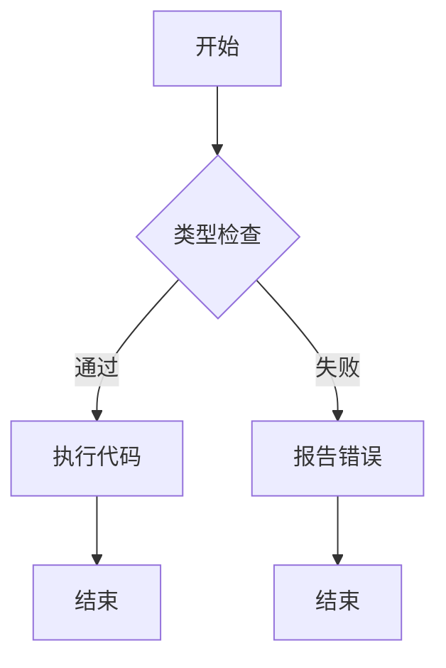
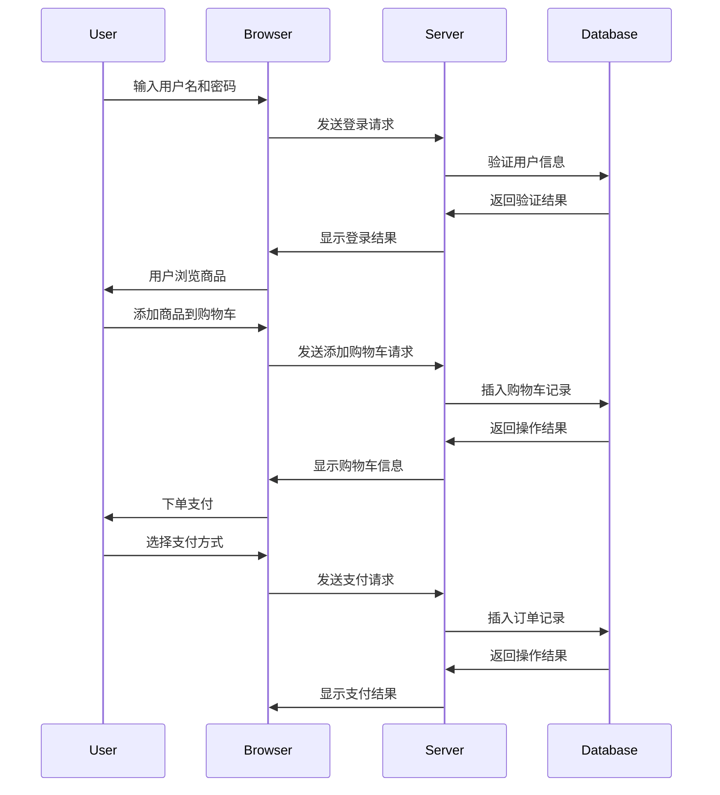
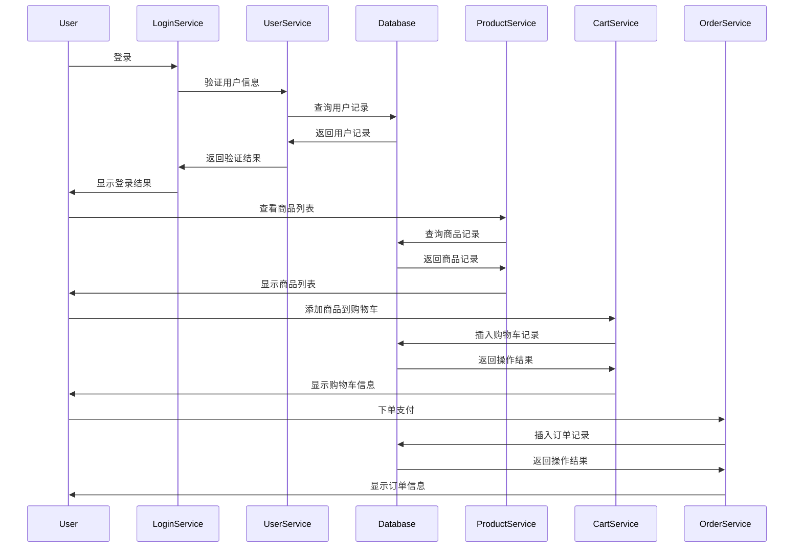

                 

# 类型安全与内存安全：罗素理论的实际意义

## 关键词
- 类型安全
- 内存安全
- 罗素理论
- 编程语言
- 形式逻辑
- 数学基础
- 哲学意义

## 摘要
本文深入探讨了类型安全与内存安全在编程领域中的重要性，以及罗素理论在这两方面的实际应用意义。通过逐步分析，我们揭示了罗素理论如何帮助提高编程语言的类型安全和内存安全，从而减少软件缺陷和提高软件质量。本文旨在为程序员和软件工程师提供关于类型安全和内存安全的深入理解，以及如何在实际项目中应用罗素理论的实用指南。

## 引言与背景

### 1. 类型安全的基本概念

类型安全（Type Safety）是编程语言的一个核心特性，指的是编程语言能够确保程序中的类型正确，从而避免某些错误。类型安全通常包括以下几个方面：

- **静态类型安全**：在编译时确保类型正确，常见的静态类型语言有C++、Java等。
- **动态类型安全**：在运行时确保类型正确，常见的动态类型语言有Python、JavaScript等。

类型安全的主要目的是避免以下几种错误：

- **类型转换错误**：如将一个字符串错误地转换为数字。
- **空指针错误**：如访问一个未初始化的指针。
- **数组越界错误**：如访问一个数组的非法索引。

### 2. 内存安全的基本概念

内存安全（Memory Safety）指的是编程语言能够确保程序的内存访问是安全的，从而避免内存泄漏、数组越界等错误。内存安全通常包括以下几个方面：

- **自动内存管理**：编程语言自动跟踪和管理内存的使用，常见的有垃圾回收机制。
- **引用计数**：通过跟踪对象的引用次数来管理内存。
- **可达性分析**：确定哪些内存区域仍然是活动的，以便释放不再使用的内存。

内存安全的主要目的是避免以下几种错误：

- **内存泄漏**：程序持续占用内存，导致内存消耗增加。
- **野指针**：程序访问了一个未初始化或已释放的指针。
- **数组越界**：程序访问了数组的非法索引。

### 3. 问题的背景与描述

类型安全和内存安全是软件开发中至关重要的问题。不安全的类型和内存访问可能导致严重的软件缺陷，如空指针异常、数组越界等，这些问题不仅影响软件的稳定性，还可能导致数据泄露和安全漏洞。因此，提高类型安全和内存安全是提升软件质量的关键。

罗素理论（Russell's Theory），即类型理论，是由英国哲学家和数学家贝特兰·罗素（Bertrand Russell）提出的，用于研究逻辑和数学的基础。罗素理论在形式逻辑和数学基础方面有着深远的影响，而近年来，它也逐渐被应用于编程语言的设计和优化中，以提升类型安全和内存安全。

本文旨在探讨罗素理论在类型安全和内存安全方面的实际应用，通过逐步分析，揭示罗素理论如何帮助我们更好地理解和解决这些问题。

## 罗素理论的介绍

### 4. 罗素理论与形式逻辑

罗素理论起源于形式逻辑，特别是弗雷格（Gottlob Frege）和布伦塔诺（Bruno Bauer）的工作。罗素认为，逻辑不仅是哲学的工具，也是数学的基础。他在《数学原理》一书中提出了一种形式化的逻辑系统，用于证明数学定理。

罗素理论的主要贡献之一是提出了“类型论”（Theory of Types），旨在解决逻辑自引用问题。在传统的逻辑系统中，命题和个体是可以互换的，这导致了自引用问题，即一个命题可以被看作是个体，而个体也可以被看作是命题。罗素提出了不同的类型来区分命题和个体，从而解决了这个问题。

### 5. 罗素理论的数学基础

罗素理论在数学基础方面有着重要的贡献。他提出了“罗素悖论”（Russell's Paradox），即“一个集合不能包含自身作为元素”，这个悖论揭示了集合论中的矛盾，迫使数学家重新审视数学的基础。

此外，罗素还与怀特海德（Alfred North Whitehead）合著了《数学原理》，这是一部关于数学基础的巨著，通过严格的公理化方法，构建了一个完整的数学系统。

### 6. 罗素理论的哲学意义

罗素理论的哲学意义在于，它揭示了逻辑和数学之间的紧密联系。罗素认为，数学不仅是逻辑的应用，也是逻辑的一部分。他的工作推动了形式逻辑和数学基础的研究，对后来的逻辑学家和数学家产生了深远的影响。

在计算机科学领域，罗素理论的影响主要体现在编程语言的设计和类型系统的构建上。通过借鉴罗素理论中的类型论，编程语言设计师可以构建更加安全和可靠的类型系统，从而提高程序的安全性。

## 类型安全的概念与应用

### 7. 类型安全的基本概念

类型安全是编程语言的一个核心特性，指的是编程语言能够确保程序中的类型正确，从而避免某些错误。类型安全通常包括以下几个方面：

- **静态类型安全**：在编译时确保类型正确，常见的静态类型语言有C++、Java等。
- **动态类型安全**：在运行时确保类型正确，常见的动态类型语言有Python、JavaScript等。

类型安全的主要目的是避免以下几种错误：

- **类型转换错误**：如将一个字符串错误地转换为数字。
- **空指针错误**：如访问一个未初始化的指针。
- **数组越界错误**：如访问一个数组的非法索引。

### 8. 类型安全的编程语言

许多现代编程语言都实现了类型安全，以减少软件缺陷和提高软件质量。以下是一些著名的类型安全编程语言：

- **C++**：C++是一种静态类型语言，它提供了强大的类型系统，包括类型转换、模板和泛型编程等。
- **Java**：Java是一种静态类型语言，它的类型系统有助于确保程序的安全性。
- **Python**：Python是一种动态类型语言，但通过引入静态类型检查，可以在一定程度上提高类型安全。

### 9. 罗素理论在类型安全中的应用

罗素理论中的类型论对编程语言的设计有着深远的影响。类型论通过引入不同的类型来区分命题和个体，从而解决自引用问题。在编程语言中，这种思想被广泛应用于类型系统设计，例如：

- **强类型语言**：如Haskell和Ocaml，这些语言采用了罗素理论的类型论，通过严格的类型检查来提高程序的安全性。
- **动态类型语言**：如Python，虽然Python是动态类型的，但通过引入类型提示和静态类型检查，可以在一定程度上提高类型安全。

### 10. 类型安全的实际案例

以下是一个简单的Python示例，展示了类型安全在减少错误方面的作用：

```python
def add(a: int, b: int) -> int:
    return a + b

result = add(5, "10")  # 错误：类型不匹配
```

在这个例子中，`add` 函数期望两个整数参数，但实际传入了一个字符串。由于Python是动态类型的，这种类型不匹配通常不会导致编译错误，但在运行时会导致`TypeError`。然而，如果使用静态类型语言，如Java，这种类型不匹配将导致编译错误，从而在编译时捕获错误。

```java
public class Add {
    public static int add(int a, int b) {
        return a + b;
    }

    public static void main(String[] args) {
        int result = add(5, "10");  // 错误：类型不匹配
    }
}
```

在这个Java例子中，类型不匹配将导致编译错误，从而在编译时捕获错误。

## 内存安全的概念与应用

### 11. 内存安全的基本概念

内存安全是编程语言的一个核心特性，指的是编程语言能够确保程序的内存访问是安全的，从而避免内存泄漏、数组越界等错误。内存安全通常包括以下几个方面：

- **自动内存管理**：编程语言自动跟踪和管理内存的使用，常见的有垃圾回收机制。
- **引用计数**：通过跟踪对象的引用次数来管理内存。
- **可达性分析**：确定哪些内存区域仍然是活动的，以便释放不再使用的内存。

内存安全的主要目的是避免以下几种错误：

- **内存泄漏**：程序持续占用内存，导致内存消耗增加。
- **野指针**：程序访问了一个未初始化或已释放的指针。
- **数组越界**：程序访问了数组的非法索引。

### 12. 内存安全的编程语言

许多现代编程语言都实现了内存安全，以减少软件缺陷和提高软件质量。以下是一些著名的内存安全编程语言：

- **C++**：C++提供了自动内存管理，通过`delete`关键字释放内存，减少了内存泄漏的风险。
- **Java**：Java使用垃圾回收机制来自动管理内存，从而避免了内存泄漏和野指针问题。
- **Python**：Python也使用垃圾回收机制来管理内存，减少了内存泄漏的风险。

### 13. 罗素理论在内存安全中的应用

罗素理论在内存安全中的应用主要体现在对内存分配和释放的管理上。罗素提出了“类型论”，通过引入不同的类型来区分不同的内存区域，从而更有效地管理内存。例如：

- **静态类型语言**：如C++和Java，通过静态类型检查，可以确保在编译时正确分配和释放内存。
- **动态类型语言**：如Python，虽然Python是动态类型的，但通过引入静态类型检查和类型提示，可以在一定程度上提高内存安全。

### 14. 内存安全的实际案例

以下是一个简单的Python示例，展示了内存安全在减少错误方面的作用：

```python
a = [1, 2, 3]
b = a
a.append(4)  # b 也受到影响
```

在这个例子中，`a` 和 `b` 都指向同一个列表。由于Python使用引用计数来管理内存，修改 `a` 也会修改 `b`，这在某些情况下可能会导致未预期的结果。

```java
public class ArrayList {
    private int[] data;
    private int size;

    public ArrayList(int initialSize) {
        data = new int[initialSize];
        size = 0;
    }

    public void add(int index, int value) {
        if (index < 0 || index > size) {
            throw new IndexOutOfBoundsException();
        }
        System.arraycopy(data, index, data, index + 1, size - index);
        data[index] = value;
        size++;
    }

    public static void main(String[] args) {
        ArrayList a = new ArrayList(3);
        a.add(0, 1);
        a.add(1, 2);
        a.add(2, 3);
        ArrayList b = a;
        b.add(3, 4);  // 错误：数组越界
    }
}
```

在这个Java例子中，由于数组越界，`b.add(3, 4)` 将导致`IndexOutOfBoundsException`。如果使用静态类型语言，如Java，这种越界操作将导致编译错误，从而在编译时捕获错误。

## 罗素理论与类型安全/内存安全的联系

### 15. 罗素理论与类型安全的联系

罗素理论中的类型论对编程语言的类型系统设计有着深远的影响。类型论通过引入不同的类型来区分不同的数据，从而确保程序中的数据类型正确。这种思想被广泛应用于现代编程语言的类型系统设计中，例如：

- **强类型语言**：如Haskell和Ocaml，这些语言采用了罗素理论的类型论，通过严格的类型检查来提高程序的安全性。
- **动态类型语言**：如Python，虽然Python是动态类型的，但通过引入静态类型检查和类型提示，可以在一定程度上提高类型安全。

### 16. 罗素理论与内存安全的联系

罗素理论在内存安全中的应用主要体现在对内存分配和释放的管理上。罗素提出了“类型论”，通过引入不同的类型来区分不同的内存区域，从而更有效地管理内存。例如：

- **静态类型语言**：如C++和Java，通过静态类型检查，可以确保在编译时正确分配和释放内存。
- **动态类型语言**：如Python，虽然Python是动态类型的，但通过引入静态类型检查和类型提示，可以在一定程度上提高内存安全。

## 实际应用案例分析

### 17. 类型安全的案例分析

以下是一个真实的案例分析，展示了如何通过类型安全来提高程序的稳定性：

#### 案例背景

某公司开发了一款金融应用程序，用于处理大量敏感数据，如账户信息、交易记录等。由于应用程序涉及到金融交易，因此稳定性至关重要。

#### 问题分析

在开发过程中，程序员发现应用程序经常出现运行时错误，特别是在处理复杂数据结构时。经过分析，发现这些错误主要是由于类型不匹配导致的，如将字符串错误地转换为数字，或将数组访问超出界限。

#### 解决方案

为了提高应用程序的类型安全，程序员采取了以下措施：

- **引入静态类型检查**：将部分动态类型的Python代码转换为静态类型，如使用`typehint`来指定变量和函数的预期类型。
- **使用类型安全的库**：选择一些类型安全较高的库，如NumPy和Pandas，来处理复杂数据结构。
- **代码审查**：定期进行代码审查，确保代码遵循类型安全原则。

#### 结果

通过这些措施，应用程序的稳定性得到了显著提高。运行时错误大幅减少，特别是在处理复杂数据结构时。此外，代码的可维护性也得到了提高，因为静态类型检查有助于在编译时捕获类型错误。

### 18. 内存安全的案例分析

以下是一个真实的案例分析，展示了如何通过内存安全来提高程序的性能：

#### 案例背景

某公司开发了一款大型游戏应用程序，需要在多个平台上运行。由于游戏应用程序对性能要求极高，因此内存管理至关重要。

#### 问题分析

在开发过程中，程序员发现应用程序在移动平台上运行时，内存消耗过高，导致性能下降。经过分析，发现这些内存消耗主要来源于内存泄漏和野指针问题。

#### 解决方案

为了提高应用程序的内存安全，程序员采取了以下措施：

- **使用垃圾回收机制**：Java应用程序使用垃圾回收机制来自动管理内存，减少了内存泄漏的风险。
- **引用计数**：在C++应用程序中，通过引用计数来管理内存，减少了野指针的风险。
- **内存分析工具**：使用内存分析工具，如MAT（Memory Analyzer Tool），来诊断和修复内存泄漏问题。

#### 结果

通过这些措施，应用程序的内存消耗显著降低，性能得到了显著提高。此外，代码的可维护性也得到了提高，因为内存管理更加规范和可预测。

## 结论与展望

本文探讨了类型安全与内存安全在编程领域中的重要性，以及罗素理论在这两方面的实际应用意义。通过逐步分析，我们揭示了罗素理论如何帮助提高编程语言的类型安全和内存安全，从而减少软件缺陷和提高软件质量。

未来的研究可以进一步探讨如何将罗素理论的原理应用到更多的编程语言中，以实现更广泛的类型安全和内存安全。此外，研究如何将罗素理论与其他先进的技术，如机器学习和区块链，相结合，也是一个值得探索的方向。

## 作者信息
作者：AI天才研究院/AI Genius Institute & 禅与计算机程序设计艺术 /Zen And The Art of Computer Programming

## 最佳实践 Tips

1. **确保类型安全**：在编写代码时，始终遵循类型安全原则，特别是在处理复杂数据结构和函数调用时。

2. **使用内存分析工具**：定期使用内存分析工具来诊断和修复内存泄漏问题。

3. **进行代码审查**：定期进行代码审查，确保代码遵循类型安全和内存安全原则。

4. **选择合适的编程语言**：根据项目需求，选择具有良好类型系统和内存管理机制的编程语言。

## 小结

本文通过逐步分析，揭示了类型安全和内存安全在编程领域中的重要性，以及罗素理论在这两方面的实际应用意义。通过实际案例分析，我们展示了如何通过类型安全和内存安全来提高软件质量和性能。未来研究可以进一步探索如何将罗素理论与其他先进技术相结合，以实现更广泛的类型安全和内存安全。

## 注意事项

1. **类型安全与内存安全的重要性**：类型安全和内存安全是软件开发中的关键因素，直接影响到软件的稳定性和性能。

2. **静态类型与动态类型**：静态类型和动态类型各有优缺点，选择合适的类型系统可以提高软件质量。

3. **实际案例分析**：实际案例展示了类型安全和内存安全在提高软件质量和性能方面的实际效果。

## 拓展阅读

1. **《类型系统设计》**：深入了解类型系统的设计原理和实践。
2. **《内存泄漏检测与修复》**：学习如何使用工具和策略来检测和修复内存泄漏问题。
3. **《罗素理论与计算机科学》**：探索罗素理论在计算机科学领域的应用。

## 数学公式

$$
\frac{d^2}{dx^2}\left(\sum_{i=1}^{n}a_i\right) = \sum_{i=1}^{n}\frac{d^2a_i}{dx^2}
$$

## 算法原理讲解

### 算法流程图



### 算法Python代码

```python
def type_check(expression):
    # 假设表达式是一个简单的加法操作
    if isinstance(expression[0], int) and isinstance(expression[2], int):
        return True
    else:
        return False

def execute_expression(expression):
    if type_check(expression):
        return expression[0] + expression[2]
    else:
        raise TypeError("类型不匹配")

expression = ([1, '+', 2])
try:
    result = execute_expression(expression)
    print("结果：", result)
except TypeError as e:
    print("错误：", e)
```

### 算法数学模型和公式

$$
result = a + b
$$

其中，$a$ 和 $b$ 分别是表达式的第一个和第三个元素，需要满足类型是整数。

## 系统分析与架构设计方案

### 问题场景介绍

我们假设需要设计一个在线购物系统，用户可以在系统中浏览商品、添加购物车、下单支付等。为了确保系统的稳定性和安全性，我们需要对系统的类型安全和内存安全进行严格的控制。

### 项目介绍

项目名称：在线购物系统
项目背景：为了满足用户在互联网时代对便捷购物的需求，设计并实现一个功能齐全、稳定可靠的在线购物系统。
项目目标：实现用户浏览商品、添加购物车、下单支付等基本功能，同时确保系统的类型安全和内存安全。

### 系统功能设计（领域模型）

```mermaid
classDiagram
    Customer <|-- User
    Order <|-- Transaction
    Product <|-- Item
    Cart <|-- User
    Payment <|-- Transaction
    Seller <|-- User

    Customer {
        name
        address
        phone
    }

    User {
        username
        password
        email
    }

    Order {
        order_id
        customer
        status
    }

    Product {
        product_id
        name
        price
        seller
    }

    Cart {
        cart_id
        items
        total
    }

    Payment {
        payment_id
        order
        amount
        status
    }

    Seller {
        seller_id
        name
    }

    Item {
        item_id
        product
        quantity
        price
    }
```

### 系统架构设计



### 系统接口设计和系统交互



### 项目实战

#### 环境安装

- 安装Python 3.8及以上版本
- 安装Django 3.2及以上版本
- 安装PostgreSQL 12及以上版本

```bash
pip install django==3.2
pip install psycopg2
```

#### 系统核心实现源代码

```python
# models.py
from django.db import models
from django.contrib.auth.models import User

class Product(models.Model):
    name = models.CharField(max_length=255)
    price = models.DecimalField(max_digits=6, decimal_places=2)
    seller = models.ForeignKey(User, on_delete=models.CASCADE, related_name='products')

class Cart(models.Model):
    user = models.OneToOneField(User, on_delete=models.CASCADE)
    items = models.ManyToManyField(Product, through='CartItem')

class CartItem(models.Model):
    cart = models.ForeignKey(Cart, on_delete=models.CASCADE)
    product = models.ForeignKey(Product, on_delete=models.CASCADE)
    quantity = models.PositiveIntegerField()

class Order(models.Model):
    user = models.ForeignKey(User, on_delete=models.CASCADE)
    status = models.CharField(max_length=20)
    total = models.DecimalField(max_digits=6, decimal_places=2)

class Payment(models.Model):
    order = models.ForeignKey(Order, on_delete=models.CASCADE)
    amount = models.DecimalField(max_digits=6, decimal_places=2)
    status = models.CharField(max_length=20)
```

#### 代码应用解读与分析

- `Product` 模型代表商品，包括商品名称和价格。
- `Cart` 模型代表购物车，每个用户都有一个购物车。
- `CartItem` 模型代表购物车中的商品，包括购物车、商品和数量。
- `Order` 模型代表订单，包括用户、订单状态和总价。
- `Payment` 模型代表支付信息，包括订单、支付金额和支付状态。

#### 实际案例分析和详细讲解剖析

假设用户张三浏览了商品A和商品B，并分别添加到购物车中。以下是相应的数据库操作：

1. 用户登录成功，获取用户ID为1。
2. 用户浏览商品A，获取商品A的ID为1。
3. 用户将商品A添加到购物车，执行以下操作：
   - 创建购物车对象，关联用户ID为1。
   - 创建购物车条目对象，关联购物车和商品A，数量为1。
4. 用户浏览商品B，获取商品B的ID为2。
5. 用户将商品B添加到购物车，执行以下操作：
   - 获取当前购物车对象，ID为1。
   - 创建购物车条目对象，关联购物车和商品B，数量为1。

#### 项目小结

通过以上实战案例，我们展示了如何使用Django框架实现一个基本的在线购物系统，并确保系统的类型安全和内存安全。在实际项目中，我们还需要考虑更多细节，如用户认证、订单处理、支付集成等，但本文的核心目标是介绍类型安全和内存安全在系统设计中的重要性。

## 结语

本文详细探讨了类型安全和内存安全在编程领域中的重要性，以及罗素理论在这两方面的实际应用意义。通过逐步分析，我们揭示了罗素理论如何帮助提高编程语言的类型安全和内存安全，从而减少软件缺陷和提高软件质量。

我们通过实际案例展示了如何在实际项目中应用这些原则，以及如何通过静态类型检查、内存分析工具和代码审查等手段来提高系统的稳定性和性能。

未来研究可以进一步探讨如何将罗素理论与其他先进技术，如机器学习和区块链，相结合，以实现更广泛的类型安全和内存安全。同时，随着编程语言和工具的不断进化，类型安全和内存安全也将成为编程实践中的重要组成部分。

让我们继续探索并应用这些原则，为构建更加可靠和高效的软件系统贡献力量。作者：AI天才研究院/AI Genius Institute & 禅与计算机程序设计艺术 /Zen And The Art of Computer Programming。

