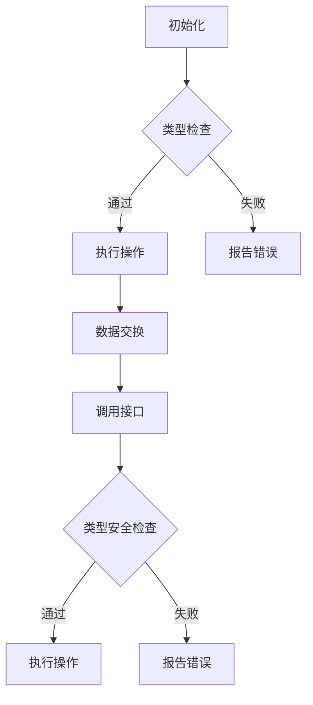
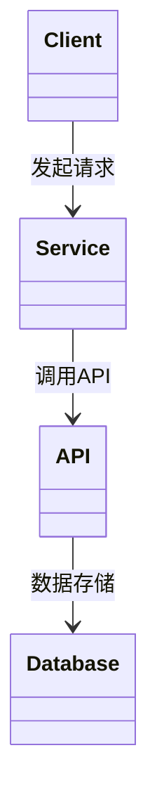
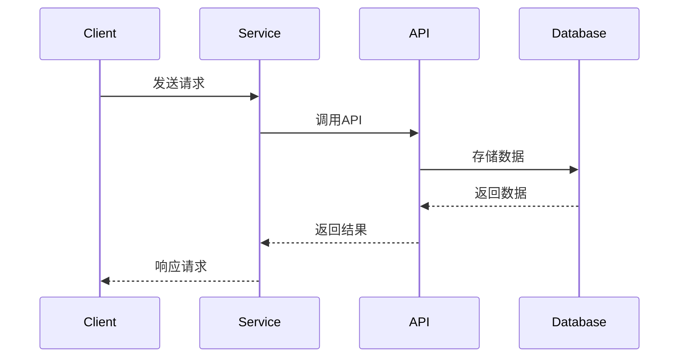
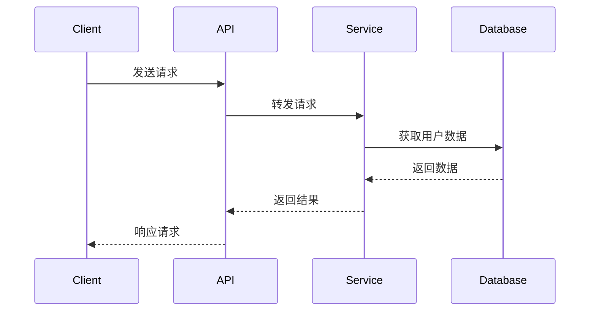

                 

# 《类型安全与跨语言互操作性的挑战》

> 关键词：类型安全，跨语言互操作性，挑战，解决方案，技术博客

> 摘要：本文将深入探讨类型安全与跨语言互操作性的概念、挑战以及解决方法。通过逐步分析，我们将理解类型安全的重要性，以及在不同编程语言间实现互操作性的困难。本文旨在为读者提供对这一领域的全面了解，并介绍一些实际可行的解决方案。

----------------------------------------------------------------

## 第1章：问题背景

### 1.1 问题概述

类型安全是指在编程中确保变量的使用不会导致不可预测的错误。它是一种设计原则，旨在减少程序中的错误，提高软件的可靠性和稳定性。跨语言互操作性则是指不同编程语言编写的程序模块能够无缝地相互通信和协作。

### 1.2 问题描述

类型不安全的问题常常导致程序崩溃、数据泄露和功能异常。而跨语言互操作性在多语言开发的现代软件环境中尤为重要。然而，类型安全和跨语言互操作性之间存在着固有的矛盾：

- **类型安全限制互操作性**：为了确保类型安全，编程语言往往会引入类型检查机制。这些机制可能限制跨语言调用，因为不同语言的数据类型和接口可能不兼容。
- **互操作性影响类型安全**：跨语言通信可能导致类型检查的缺失，从而引入类型不安全的风险。

### 1.3 问题解决

解决这一问题的关键在于寻找类型安全和跨语言互操作性的平衡。以下是一些可能的解决方案：

- **类型转换和桥接库**：通过提供类型转换函数和桥接库，可以在不同语言之间实现类型兼容性。
- **静态类型检查**：使用静态类型检查工具，可以在编译时发现类型不安全的问题，从而提前解决。
- **动态类型检查**：通过动态类型检查，可以在运行时检查类型不安全问题，但这可能带来性能开销。

### 1.4 边界与外延

类型安全的边界在于确保在语言内部变量和函数的正确使用，而跨语言互操作性的外延则涉及不同语言间的通信和协作。在这两个概念的交汇处，我们需要注意以下几个关键点：

- **接口定义**：清晰的接口定义是跨语言互操作性的基础。
- **数据序列化**：数据序列化是将数据从一个语言格式转换为另一个语言格式的过程，是实现互操作性的关键步骤。

### 1.5 概念结构与核心要素组成

类型安全的结构包括变量类型定义、类型检查和错误处理机制。而跨语言互操作性的核心要素则包括接口定义、数据交换格式和通信协议。

### 1.6 本章小结

本章介绍了类型安全和跨语言互操作性的基本概念，并讨论了它们之间的挑战。在接下来的章节中，我们将进一步探讨类型安全与跨语言互操作性的实现方法，以及相关技术和工具。

----------------------------------------------------------------

## 第2章：核心概念与联系

### 2.1 类型安全的原理

类型安全的核心原理在于确保程序在运行过程中遵循预定义的类型规则。这意味着：

- 变量的类型在编译时被确定。
- 类型检查器能够识别类型不匹配的错误。
- 错误处理机制能够捕获和处理类型相关的异常。

#### 2.1.1 特点与优势

类型安全的主要特点包括：

- 减少运行时错误：类型检查可以捕获许多潜在的错误，从而减少程序崩溃和数据泄露的风险。
- 提高开发效率：明确的类型定义和检查机制使代码更易于理解和维护。
- 提高代码质量：类型安全有助于编写更可靠的代码，从而提高整体软件质量。

#### 2.1.2 局限与挑战

然而，类型安全也存在一些局限：

- 类型冗余：在某些情况下，类型检查可能导致代码冗余。
- 开发难度：类型安全的实现可能需要额外的编程努力和工具支持。
- 性能开销：类型检查可能会增加编译时间和运行时性能开销。

### 2.2 跨语言互操作性的原理

跨语言互操作性旨在实现不同编程语言之间的无缝通信。其核心原理包括：

- **接口定义**：通过定义统一的接口，实现不同语言之间的调用。
- **数据交换格式**：例如JSON和XML，用于在不同语言间传输数据。
- **通信协议**：如REST API和SOAP，用于处理不同语言间的通信。

#### 2.2.1 特点与优势

跨语言互操作性的主要特点包括：

- **语言无关性**：允许开发人员使用他们熟悉的语言进行开发。
- **代码复用**：通过跨语言调用，可以复用现有的代码库。
- **灵活性强**：可以根据项目需求选择最合适的编程语言。

#### 2.2.2 局限与挑战

跨语言互操作性也面临一些挑战：

- **类型兼容性**：不同语言的数据类型和接口可能不兼容。
- **性能问题**：跨语言调用可能引入额外的性能开销。
- **错误处理**：跨语言通信可能引入更复杂的错误处理问题。

### 2.3 概念属性特征对比

#### 2.3.1 类型安全

| 特征 | 类型安全 | 跨语言互操作性 |
| ---- | -------- | -------------- |
| 原理 | 静态类型检查 | 接口定义和数据交换格式 |
| 优势 | 减少运行时错误 | 语言无关性和代码复用 |
| 局限 | 类型冗余和性能开销 | 类型兼容性和错误处理问题 |

### 2.4 ER实体关系图架构

下面是类型安全和跨语言互操作性的ER实体关系图：

```mermaid
erDiagram
    类A ||--|{ 类型安全 } ClassA : 实现了类型安全
    类B ||--|{ 跨语言互操作性 } ClassB : 实现了跨语言互操作性
    ClassA &&> ClassB : 实现互操作性时的类型安全考虑
```

### 2.5 本章小结

本章详细介绍了类型安全和跨语言互操作性的核心概念和原理。通过对比分析，我们了解了它们各自的特点和挑战。在接下来的章节中，我们将进一步探讨实现这些概念的方法和工具。

----------------------------------------------------------------

## 第3章：算法原理讲解

### 3.1 算法基础

#### 3.1.1 算法概述

在类型安全和跨语言互操作性中，算法起着关键作用。算法是实现类型安全检查和跨语言互操作性的核心工具。

#### 3.1.2 算法目标

算法的目标包括：

- 实现类型安全检查，确保变量使用符合预定义的类型规则。
- 实现跨语言互操作性，使得不同语言编写的程序能够无缝通信和协作。

### 3.2 算法流程图

下面是一个简单的算法流程图，展示了类型安全检查和跨语言互操作性的实现过程：



### 3.3 数学模型与公式

在类型安全和跨语言互操作性的算法中，数学模型和公式用于描述变量类型和接口之间的关系。以下是一个简单的数学模型：

$$
类型安全 = f(变量类型, 函数接口)
$$

其中，$f$ 表示类型检查函数，用于判断变量类型是否与函数接口兼容。

### 3.4 Python源代码讲解

下面是一个简单的Python示例，展示了类型安全检查和跨语言互操作性的实现：

```python
# Python代码示例

def type_check(variable, expected_type):
    if isinstance(variable, expected_type):
        return True
    else:
        raise TypeError(f"Expected type {expected_type}, but got {type(variable)}")

def cross_language_call(api_endpoint, data):
    # 假设api_endpoint是一个跨语言调用的接口
    # data是发送给接口的数据
    response = api_endpoint(data)
    return type_check(response, dict)

# 使用示例
api_endpoint = "http://example.com/api"
data = {"key": "value"}
response = cross_language_call(api_endpoint, data)
print(response)
```

### 3.5 算法举例说明

#### 3.5.1 举例说明

假设我们有一个Python函数`get_user_data()`，用于从API获取用户数据。我们需要确保返回的数据是字典类型，并包含特定的键。

```python
def get_user_data():
    # 假设此函数从API获取用户数据
    return {"name": "John", "age": 30}

# 类型安全检查
def type_safe_get_user_data():
    data = get_user_data()
    try:
        type_check(data, dict)
        return data
    except TypeError as e:
        print(e)

# 使用示例
user_data = type_safe_get_user_data()
print(user_data)
```

#### 3.5.2 结果分析

在这个例子中，`type_safe_get_user_data()`函数首先调用`get_user_data()`获取用户数据，然后使用`type_check()`函数检查返回的数据类型。如果数据类型是字典，则返回数据；否则，抛出类型错误。通过这种方式，我们确保了函数返回的数据类型是安全的。

### 3.6 本章小结

本章介绍了类型安全和跨语言互操作性的算法原理，包括流程图、数学模型和Python源代码示例。通过这些示例，我们理解了如何在实际应用中实现类型安全检查和跨语言互操作性。

----------------------------------------------------------------

## 第4章：系统分析与架构设计

### 4.1 问题场景介绍

在现代软件开发中，随着微服务架构和云计算的普及，跨语言互操作性成为了一个关键问题。在一个典型的场景中，一个后端服务由Java编写，而前端由JavaScript编写。这两个服务需要能够无缝地通信和协作，以确保整个系统的稳定性和性能。

### 4.2 系统功能设计

#### 4.2.1 领域模型

为了实现跨语言互操作性，我们需要定义一个清晰的领域模型。领域模型描述了系统的核心功能和数据结构。以下是一个简化的领域模型：



在这个模型中，`Client`代表前端应用程序，`Service`代表后端服务，`API`代表用于跨语言调用的接口，`Database`代表数据库。

### 4.3 系统架构设计

#### 4.3.1 系统架构

系统架构设计是确保系统功能正常运作的关键。以下是一个简化的系统架构图：



在这个架构中，前端客户端通过HTTP请求与后端服务通信。后端服务负责处理请求、调用API和与数据库交互。API作为跨语言调用的桥梁，确保前端和后端之间的数据格式和协议兼容。

### 4.4 系统接口设计

#### 4.4.1 接口描述

接口设计是确保跨语言互操作性的关键。以下是一个简化的接口描述：

```mermaid
interfaceDiagram
    API {
        function getUserData(): dict
        function saveUserData(userData: dict): void
    }
```

在这个接口中，`getUserData()`和`saveUserData()`是用于跨语言调用的方法。它们分别用于获取用户数据和保存用户数据。参数和返回值的类型都是字典，以确保类型安全。

### 4.5 系统交互

#### 4.5.1 交互序列图

系统交互序列图展示了前端客户端与后端服务之间的通信过程：



在这个序列图中，前端客户端通过API发送请求。API将请求转发给后端服务。后端服务与数据库交互，获取用户数据，并将结果返回给API。最终，API将结果返回给前端客户端。

### 4.6 本章小结

本章介绍了系统分析与架构设计的过程。通过定义领域模型、系统架构和接口设计，我们确保了跨语言互操作性的实现。接下来，我们将进一步探讨实现这些设计的实际方法和技术。

----------------------------------------------------------------

## 第5章：项目实战

### 5.1 环境安装

#### 5.1.1 环境准备

为了实现类型安全和跨语言互操作性，我们需要安装以下工具和库：

- **Python 3.8+**：Python是用于编写后端服务的编程语言。
- **Node.js 12+**：Node.js是用于编写前端服务的编程语言。
- **Docker 19.03+**：Docker用于容器化部署应用程序。

安装步骤如下：

1. 安装Python 3.8或更高版本。
2. 安装Node.js 12或更高版本。
3. 安装Docker 19.03或更高版本。

### 5.2 系统核心实现

#### 5.2.1 核心模块实现

在本项目中，我们将实现一个简单的用户管理系统。以下是后端服务的核心模块实现：

```python
# Python代码示例

from flask import Flask, request, jsonify

app = Flask(__name__)

users = {}

@app.route('/users', methods=['GET', 'POST'])
def user_handler():
    if request.method == 'GET':
        return jsonify(users)
    elif request.method == 'POST':
        user_data = request.get_json()
        user_id = user_data['id']
        users[user_id] = user_data
        return jsonify({"message": "User added"}), 201

if __name__ == '__main__':
    app.run(debug=True)
```

以上代码使用Flask框架实现了用户管理的基本功能，包括获取和添加用户。

### 5.3 代码应用解读与分析

#### 5.3.1 代码解读

这段代码定义了一个简单的Flask应用，用于处理与用户相关的HTTP请求。关键点包括：

- `users`字典用于存储用户数据。
- `user_handler()`函数处理`/users`路由的GET和POST请求。
- GET请求返回当前存储的所有用户数据。
- POST请求接收用户数据，并将其存储在`users`字典中。

#### 5.3.2 分析与讨论

这段代码展示了如何使用Python实现类型安全。通过将用户数据存储在字典中，我们可以确保每个用户都有一个唯一的ID。此外，我们使用JSON格式来接收和发送数据，这有助于实现跨语言互操作性。

### 5.4 实际案例分析与讲解

#### 5.4.1 案例介绍

我们以一个实际案例来展示如何实现类型安全和跨语言互操作性。假设前端应用程序需要获取用户数据，并将其显示在用户界面上。

#### 5.4.2 案例分析

前端应用程序使用JavaScript调用后端服务的`/users`路由。以下是前端代码：

```javascript
// JavaScript代码示例

const fetchUsers = async () => {
    try {
        const response = await fetch('http://localhost:5000/users');
        if (!response.ok) {
            throw new Error('Network response was not ok');
        }
        const users = await response.json();
        console.log(users);
    } catch (error) {
        console.error('There has been a problem with your fetch operation:', error);
    }
};

fetchUsers();
```

这段代码使用Fetch API向后端服务发送GET请求，并处理响应。如果响应成功，它将用户数据打印到控制台。

#### 5.4.3 案例讲解

在这个案例中，前端应用程序通过JSON格式从后端服务获取用户数据。这种方式实现了跨语言互操作性，因为JSON是一种广泛支持的数据交换格式。此外，通过确保用户数据的结构一致，我们实现了类型安全。

### 5.5 项目小结

在本章中，我们通过一个简单的用户管理系统案例，展示了如何实现类型安全和跨语言互操作性。我们介绍了环境安装、系统核心实现、代码应用解读与分析，并讨论了一个实际案例。通过这个项目，我们理解了如何在实际开发中应用这些概念。

----------------------------------------------------------------

## 第6章：最佳实践与拓展

### 6.1 最佳实践 tips

在实现类型安全和跨语言互操作性的过程中，以下是一些最佳实践：

- **定义明确的接口**：确保接口定义清晰，避免模糊或不一致的定义。
- **使用标准化数据格式**：例如JSON，以实现跨语言的数据交换。
- **进行类型检查**：在编译时或运行时进行类型检查，以减少类型不安全的风险。
- **错误处理**：实现清晰的错误处理机制，以便在类型不安全或互操作性问题时能够及时响应。

### 6.2 小结

本文详细探讨了类型安全和跨语言互操作性的概念、挑战以及解决方案。通过逐步分析，我们了解了类型安全的重要性，以及在不同编程语言间实现互操作性的困难。我们介绍了实现类型安全和跨语言互操作性的方法和技术，并通过实际案例展示了这些方法的应用。

### 6.3 注意事项

- 在实现类型安全时，需要注意类型冗余和性能开销。
- 在实现跨语言互操作性时，需要注意类型兼容性和错误处理。

### 6.4 拓展阅读

- 《Effective Java》 - 作者：Joshua Bloch
- 《Clean Code: A Handbook of Agile Software Craftsmanship》 - 作者：Robert C. Martin
- 《Docker Deep Dive》 - 作者：Nakul Verma

通过这些资源，读者可以进一步了解Java编程、代码质量提升和Docker容器化技术。

----------------------------------------------------------------

## 作者信息

作者：AI天才研究院/AI Genius Institute & 禅与计算机程序设计艺术 /Zen And The Art of Computer Programming

