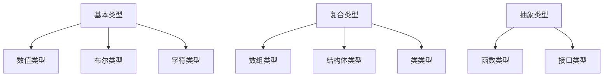
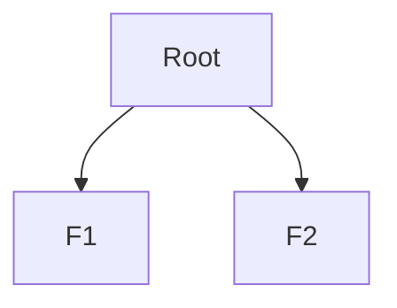
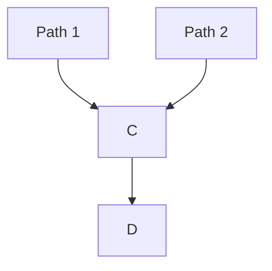
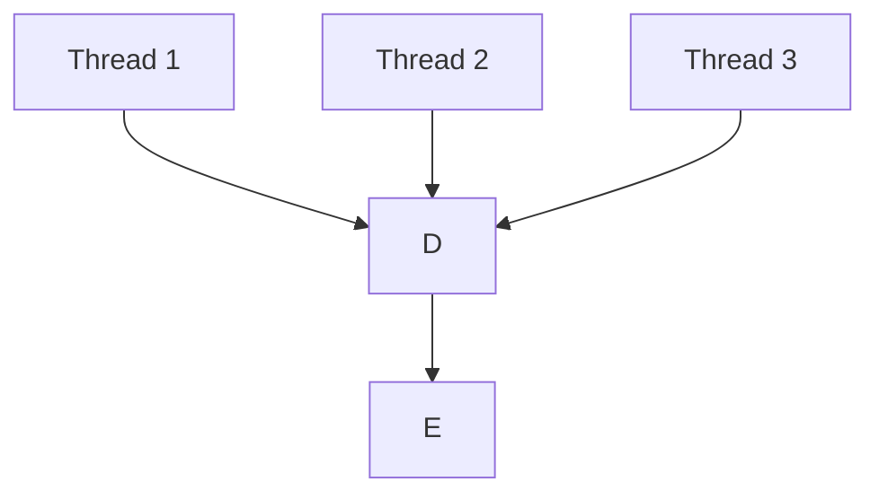

                 

## 《类型推理算法：自动化类型分析的核心》

类型推理是计算机科学中的一个重要概念，尤其在编程语言设计和编译器优化中扮演着核心角色。类型推理算法能够自动化地进行类型分析，确保程序在运行时的正确性和效率。本文将围绕类型推理算法展开，详细探讨其在自动化类型分析中的核心作用，帮助读者深入理解这一技术。

**关键词**：类型推理、自动化类型分析、编译器优化、编程语言设计、算法原理

**摘要**：本文首先介绍类型推理的基本概念和重要性，然后深入探讨类型系统的基本原理，接着分章节详细分析静态类型推理算法和动态类型推理算法，最后讨论类型推理算法的优化方法及其应用。通过本文的阅读，读者将全面了解类型推理算法的核心作用和实现原理，为实际编程和软件开发提供有力支持。

---

### 前言

**类型推理的重要性**：类型推理在编程语言设计和编译器优化中具有重要意义。它能够自动推导出程序中变量和表达式的类型，从而保证程序的类型安全性和运行效率。类型推理的正确性和效率直接影响到编程语言的可读性和编译器的性能。

**本书的目标读者**：本书适合程序员、开发者、计算机科学专业的学生以及其他对类型推理和自动化类型分析感兴趣的读者。通过阅读本书，读者将能够掌握类型推理的基础知识，了解不同类型的推理算法，并学会在实际项目中应用这些算法。

**本书的结构与内容安排**：本书分为三大部分。第一部分是类型推理基础，介绍类型推理的基本概念、类型系统的原理以及类型推理的方法和应用。第二部分是类型推理算法，详细讲解静态类型推理算法和动态类型推理算法。第三部分是类型推理算法的优化，探讨类型推理算法的性能优化方法及其应用。

---

### 第一部分：类型推理基础

#### 第1章：类型推理概述

**类型推理的背景**：

类型推理是编程语言中的一项核心技术，它在编译器和解释器中扮演着至关重要的角色。类型推理的目的是在编写程序时，自动推导出变量和表达式的类型，以确保程序的正确性和效率。类型推理不仅能够减少程序员的工作量，还能够提高程序的健壮性和可维护性。

**类型推理的基本概念**：

类型是指数据的不同种类，如整数、浮点数、字符串等。类型系统是编程语言中定义数据类型和类型约束的机制。类型推理是在类型系统的指导下，通过分析程序代码，自动推导出变量和表达式的类型。

**类型推理的基本方法**：

类型推理可以分为静态类型推理和动态类型推理。静态类型推理在编译阶段进行，通过静态分析程序代码，推导出变量的类型。动态类型推理在运行时进行，通过观察程序的运行行为，推导出变量的类型。

**类型推理的应用领域**：

类型推理在编译器优化、编程语言设计和自动编程中有着广泛的应用。在编译器优化中，类型推理能够帮助编译器进行更有效的代码生成和优化。在编程语言设计中，类型推理能够提高语言的可读性和可维护性。在自动编程中，类型推理能够帮助自动化生成代码，提高开发效率。

#### 第2章：类型系统的基本原理

**类型系统的定义和作用**：

类型系统是编程语言中定义数据类型和类型约束的机制。它包括类型定义、类型转换和类型检查等组成部分。类型系统的作用是确保程序在运行时类型安全，防止类型错误的发生。

**类型系统的层次结构**：

类型系统可以分为基本类型、复合类型和抽象类型。基本类型是最简单的数据类型，如整数和浮点数。复合类型是由基本类型组合而成的，如数组、结构和类。抽象类型是通过抽象数据类型定义的，如函数类型和接口类型。

**类型属性与类型检查**：

类型属性是描述数据类型特征和限制的属性。类型检查是在编译时对程序代码进行类型验证的过程，以确保程序的类型安全。

**类型推断的基本原理**：

类型推断是自动推导出变量和表达式的类型的过程。类型推断可以分为显式推断和隐式推断。显式推断是通过类型声明来指定变量的类型。隐式推断是通过上下文和规则自动推导出变量的类型。

**类型系统的设计**：

类型系统的设计需要考虑类型安全、类型灵活性和编译效率等因素。静态类型系统在编译时进行类型检查，具有更好的类型安全和编译效率。动态类型系统在运行时进行类型检查，具有更好的灵活性和可维护性。

---

在类型推理的基础章节中，我们了解了类型推理的背景、基本概念和方法，以及类型系统的基本原理。接下来的部分将深入探讨静态类型推理算法和动态类型推理算法，帮助读者全面理解类型推理在自动化类型分析中的核心作用。

### 第1章：类型推理概述

**类型推理的背景**：

在计算机科学中，类型推理（Type Inference）是一项基础且关键的技术，它主要涉及编程语言中的变量和表达式类型的自动推导。类型推理在编译器和解释器中扮演着至关重要的角色，通过自动推导变量和表达式的类型，可以有效地保证程序的正确性和运行效率。

**问题背景**：

随着编程语言的多样性和复杂性不断增加，程序员需要应对的类型问题也越来越复杂。例如，在动态类型语言（如Python、JavaScript）中，程序员通常不需要显式声明变量的类型，但编译器或解释器需要自动推导出变量的类型，以确保程序在运行时不会出现类型错误。同样，在静态类型语言（如Java、C++）中，虽然程序员需要显式声明变量类型，但编译器也需要进行类型推理，以优化代码生成过程和检查程序的正确性。

**问题描述**：

类型推理的核心问题是：在给定的程序代码中，自动推导出每个变量和表达式的类型。这个问题可以分为两个方面：

1. **静态类型推理**：在编译时，通过分析程序的结构和语义，推导出变量和表达式的静态类型。
2. **动态类型推理**：在运行时，通过观察程序的行为，推导出变量和表达式的动态类型。

**问题解决**：

类型推理的解决思路主要依赖于编程语言中的类型系统。不同类型的编程语言采用不同的类型系统，从而影响类型推理的方法和策略。静态类型语言通常采用静态类型系统，通过静态分析程序结构来推导类型。动态类型语言则采用动态类型系统，通过运行时检查程序行为来推导类型。

**边界与外延**：

类型推理不仅涉及具体的编程语言，还与编译器设计、程序优化、程序验证等领域密切相关。类型推理的边界包括类型安全的保障、类型灵活性的优化、以及类型推理算法的效率和复杂性。

**概念结构与核心要素组成**：

类型推理的概念结构包括以下几个核心要素：

1. **类型系统**：定义编程语言中数据类型的机制。
2. **类型表达式**：表示变量和表达式的类型。
3. **类型约束**：对类型推导过程施加的限制。
4. **类型推导算法**：自动推导出类型的过程。
5. **类型检查**：确保程序中的类型符合类型系统的规则。

在接下来的章节中，我们将深入探讨类型系统的基本原理，包括类型系统的定义、层次结构、类型属性与类型检查，以及类型推断的基本原理和方法。通过这些讨论，我们将为理解静态类型推理算法和动态类型推理算法打下坚实的基础。

### 第2章：类型系统的基本原理

类型系统是编程语言中的一个核心概念，它定义了程序中数据的表示和操作方式。类型系统不仅影响了程序的可读性和可维护性，还直接关系到程序的运行效率和安全性。本章节将详细探讨类型系统的基本原理，包括定义、层次结构、类型属性和类型检查，以及类型推断的基本原理。

**类型系统的定义和作用**：

类型系统是一种机制，用于定义编程语言中数据的类型、操作和约束。它的主要作用是确保程序的正确性、提高程序的可读性以及优化程序的运行效率。类型系统通过定义不同类型的数据和操作规则，可以有效地防止类型错误，提高程序的健壮性。

1. **类型定义**：类型系统定义了程序中可以使用的各种数据类型，如整数（Int）、浮点数（Float）、字符串（String）等。每种类型都有其独特的属性和操作方式。
2. **类型约束**：类型系统通过类型约束来限制程序中变量的使用方式。例如，某些操作只能在相同类型的变量之间进行，以确保程序的安全性。
3. **类型转换**：类型系统还提供了类型转换的机制，允许不同类型的变量之间进行数据交换和操作。

**类型系统的层次结构**：

类型系统可以分为不同的层次结构，以支持复杂的数据类型和操作。常见的类型系统层次结构包括：

1. **基本类型**：这是类型系统的最底层，包括基本数据类型，如整数、浮点数、布尔值等。基本类型是构建复杂数据类型的基础。
2. **复合类型**：由基本类型组合而成的数据类型，如数组、结构体（Struct）、类（Class）等。复合类型可以包含多个基本类型成员。
3. **抽象类型**：通过抽象数据类型（Abstract Data Type，ADT）定义的类型，如函数类型、接口类型等。抽象类型定义了数据的操作和行为，而无需关心具体的实现细节。

**类型属性与类型检查**：

类型属性是描述数据类型特征和限制的属性。类型检查（Type Checking）是在编译时或运行时对程序代码进行类型验证的过程。类型检查的主要目的是确保程序中的类型使用符合类型系统的规则。

1. **类型属性**：
   - **确定性与可预测性**：类型系统应确保类型的确定性和可预测性，使得程序的行为可预测且可控。
   - **类型安全**：类型系统应防止类型错误的发生，如将整数赋值给字符串、在数组中存储不兼容类型的元素等。
   - **灵活性**：类型系统应提供足够的灵活性，以支持不同类型的数据操作和类型转换。

2. **类型检查**：
   - **静态类型检查**：在编译时对程序进行类型检查，可以提前发现类型错误，提高程序的运行效率。
   - **动态类型检查**：在运行时对程序进行类型检查，可以在程序运行时动态调整类型，但可能导致性能损失。

**类型推断的基本原理**：

类型推断（Type Inference）是自动推导出变量和表达式的类型的过程。类型推断可以分为显式推断和隐式推断。

1. **显式推断**：程序员通过显式声明变量的类型，编译器或解释器根据声明来推导出其他变量的类型。
2. **隐式推断**：编译器或解释器根据上下文和类型系统规则，自动推导出变量的类型，无需程序员显式声明。

**类型推断的方法**：

类型推断的方法有多种，包括：

1. **静态类型推断**：通过静态分析程序的结构和语义，推导出变量的类型。
2. **动态类型推断**：通过运行时观察程序的行为，推导出变量的类型。
3. **约束类型推断**：通过类型约束求解，推导出满足约束的变量类型。

**类型系统的设计**：

类型系统的设计需要考虑以下几个方面：

1. **类型安全**：确保类型系统能够有效地防止类型错误的发生。
2. **类型灵活性**：提供足够的类型转换和操作灵活性，以满足不同的编程需求。
3. **编译效率**：优化类型检查和类型推断算法，提高编译器的性能。
4. **编程语言特性**：根据编程语言的特性，设计适合的类型系统，以支持语言特性的实现。

通过本章的讨论，我们了解了类型系统的基本原理，包括定义、层次结构、类型属性、类型检查和类型推断的基本原理和方法。这些知识为理解静态类型推理算法和动态类型推理算法奠定了坚实的基础。

#### 类型系统的层次结构

类型系统的层次结构是类型系统的核心组成部分，它定义了类型之间的关系和类型操作的方式。一个完善的类型系统通常包括基本类型、复合类型和抽象类型。下面我们将详细探讨这些类型层次及其特征。

**基本类型**

基本类型是最简单的数据类型，它们是构建更复杂数据类型的基础。基本类型通常包括以下几种：

1. **整数类型（Integer Types）**：用于表示整数，如 `int`, `short`, `long` 等。
2. **浮点类型（Floating-Point Types）**：用于表示浮点数，如 `float`, `double`, `long double` 等。
3. **布尔类型（Boolean Type）**：用于表示逻辑值，如 `bool`。
4. **字符类型（Character Types）**：用于表示单个字符，如 `char`。

基本类型的特征如下：

- **原子性**：基本类型是不可分割的，每个值都是独立的。
- **确定性**：基本类型的值是明确且可预测的。
- **操作集合**：每种基本类型都有特定的操作集合，如整数类型的加法、减法等。

**复合类型**

复合类型是由基本类型组合而成的数据类型，它们可以包含多个基本类型的成员。常见的复合类型包括：

1. **数组类型（Array Types）**：表示一系列相同类型的元素集合，如 `int[]`。
2. **结构体类型（Struct Types）**：表示一组不同类型的成员变量的集合，如 `struct Person { int age; char name[100]; }`。
3. **类类型（Class Types）**：表示一组具有相同属性和方法的对象的集合，如 `class Dog { int age; String name; }`。

复合类型的特征如下：

- **组合性**：复合类型可以将多个基本类型或复合类型成员组合在一起。
- **封装性**：复合类型可以通过封装机制隐藏内部细节，提供统一的接口。
- **可扩展性**：复合类型可以通过继承和接口机制扩展其功能和属性。

**抽象类型**

抽象类型是通过抽象数据类型（Abstract Data Type，ADT）定义的类型，它们定义了数据及其操作的抽象概念，而不关心具体的实现细节。常见的抽象类型包括：

1. **函数类型（Function Types）**：表示一组具有特定参数和返回值的函数，如 `int(int, float)`。
2. **接口类型（Interface Types）**：表示一组具有相同方法签名和属性的接口，如 `Runnable`。

抽象类型的特征如下：

- **抽象性**：抽象类型提供了对数据及其操作的抽象表示，隐藏了实现细节。
- **多态性**：抽象类型可以通过多态机制支持不同实现之间的互操作性。
- **泛化性**：抽象类型可以泛化为更一般的形式，以支持多种数据类型的操作。

**类型层次结构图**

为了更直观地理解类型系统的层次结构，我们可以用Mermaid流程图来展示类型之间的关系。以下是类型层次结构图的Mermaid表示：



通过这个层次结构图，我们可以看到基本类型、复合类型和抽象类型之间的关系，以及它们各自包含的具体类型。这种层次结构为编程语言的设计提供了灵活性和扩展性，使得类型系统能够适应不同的编程需求和场景。

### 第3章：静态类型推理算法

静态类型推理（Static Type Inference）是在编译阶段通过静态分析程序代码来推导出变量和表达式的类型。静态类型推理的主要优势是能够提前发现类型错误，提高编译效率和代码的可维护性。本章将详细探讨静态类型推理的基本概念、类型推导算法的实现、类型约束求解以及静态类型推理的应用场景。

**静态类型推理的基本概念**

静态类型推理的基本概念包括类型推导（Type Deduction）和类型约束（Type Constraints）。

1. **类型推导**：类型推导是指编译器或解释器通过分析程序代码的语法和语义，自动推导出变量和表达式的类型。
2. **类型约束**：类型约束是指在类型推导过程中对变量和表达式施加的限制，以确保推导出的类型符合类型系统的规则。

**静态类型推理的优势和限制**

静态类型推理具有以下优势：

1. **早期错误发现**：在编译阶段就能发现类型错误，减少运行时错误的发生。
2. **优化支持**：静态类型推理为编译器提供了更多优化机会，如常数传播、死代码消除等。
3. **代码可维护性**：静态类型系统使得代码的可读性和可维护性更高。

然而，静态类型推理也存在一些限制：

1. **编译时间较长**：由于需要在编译阶段进行类型推导，编译时间可能会比较长。
2. **灵活性较低**：静态类型系统对类型变化的适应性较差，可能导致代码重构困难。
3. **运行时开销**：静态类型系统需要运行时类型检查，可能会增加运行时的开销。

**类型推导算法**

静态类型推理算法可以分为以下几种：

1. **简单类型推导**：基于显式类型声明和上下文信息进行类型推导。
2. **多步骤类型推导**：通过多个阶段逐步推导出变量和表达式的类型。
3. **约束驱动类型推导**：通过求解类型约束来推导出变量和表达式的类型。

下面我们以一个简单的例子来介绍类型推导算法的基本原理。

**示例代码**：

```python
def add(a: int, b: int) -> int:
    return a + b

result = add(1, 2)
```

**类型推导过程**：

1. **函数参数类型推导**：编译器根据函数定义中的类型注释，推导出函数参数 `a` 和 `b` 的类型均为 `int`。
2. **函数返回类型推导**：编译器根据函数定义中的返回类型注释，推导出函数返回值 `result` 的类型为 `int`。
3. **表达式类型推导**：编译器通过分析表达式 `a + b` 的语法和语义，推导出表达式的类型为 `int`。

**类型约束求解**

类型约束求解是静态类型推理算法中的重要步骤，它通过求解类型约束来推导出变量和表达式的类型。

1. **类型约束定义**：类型约束是指对变量和表达式的类型施加的限制，如 `a: int` 表示变量 `a` 的类型必须是整数。
2. **类型约束求解算法**：常见的类型约束求解算法包括约束传播（Constraint Propagation）、约束求解器（Constraint Solver）和关系计算（Relation Computation）。

下面是一个简单的类型约束求解算法示例。

**示例代码**：

```python
def multiply(a: int, b: int) -> int:
    return a * b

result = multiply(1, 2)
```

**类型约束求解过程**：

1. **初始化类型约束**：编译器初始化变量 `a` 和 `b` 的类型约束为 `int`。
2. **传递类型约束**：编译器通过分析函数调用，传递类型约束给函数参数和返回值。
3. **求解类型约束**：编译器使用约束求解器求解类型约束，得到变量 `result` 的类型为 `int`。

**静态类型推理的应用场景**

静态类型推理在以下应用场景中具有重要作用：

1. **编译器优化**：静态类型推理可以帮助编译器进行代码优化，如常数传播、死代码消除等。
2. **编程语言设计**：静态类型系统可以提高编程语言的可读性和可维护性，减少类型错误的发生。
3. **自动编程**：静态类型推理可以用于自动生成代码，提高开发效率。

通过本章的讨论，我们了解了静态类型推理的基本概念、类型推导算法的实现、类型约束求解以及静态类型推理的应用场景。这些知识为理解动态类型推理算法和类型推理算法的优化提供了基础。

#### 静态类型推理算法的实现

静态类型推理算法是编译器设计中的一项关键技术，其目的是在编译阶段自动推导出变量和表达式的类型，从而确保程序的正确性和优化编译过程。以下是几种常见的静态类型推理算法的实现方法和步骤。

**1. 简单类型推导算法**

简单类型推导算法是基于显式类型声明和上下文信息进行类型推导。其核心思想是通过分析程序代码的语法和语义，从类型注释或上下文中推导出变量和表达式的类型。

**实现步骤**：

- **阶段1：词法分析**：将源代码分解为标识符、关键字、操作符等词法单元。
- **阶段2：语法分析**：构建抽象语法树（AST），表示源代码的结构。
- **阶段3：类型推导**：遍历AST，根据类型注释和上下文信息推导出变量和表达式的类型。

**示例**：

```python
def add(a: int, b: int) -> int:
    return a + b
```

在这个示例中，变量 `a` 和 `b` 的类型由类型注释推导为 `int`，返回值 `return` 的类型为 `int`。

**2. 多步骤类型推导算法**

多步骤类型推导算法通过多个阶段逐步推导出变量和表达式的类型。这种算法通常包括初始化、传递和求解三个阶段。

**实现步骤**：

- **阶段1：初始化**：为所有变量和表达式初始化类型约束。
- **阶段2：传递**：在程序代码中传递类型约束，使约束在变量和表达式的使用处生效。
- **阶段3：求解**：使用约束求解器求解类型约束，得到最终的类型。

**示例**：

```python
def multiply(a: int, b: int) -> int:
    return a * b
```

在这个示例中，首先初始化变量 `a` 和 `b` 的类型约束为 `int`，然后传递类型约束给返回值 `return`，最后求解类型约束，得到返回值类型为 `int`。

**3. 约束驱动类型推导算法**

约束驱动类型推导算法基于类型约束求解来推导出变量和表达式的类型。其核心思想是通过建立类型约束关系，求解约束来得到变量和表达式的类型。

**实现步骤**：

- **阶段1：建立类型约束**：根据程序代码的语义和约束规则，建立类型约束关系。
- **阶段2：约束求解**：使用约束求解器求解类型约束，得到变量和表达式的类型。
- **阶段3：类型检查**：对推导出的类型进行类型检查，确保类型安全。

**示例**：

```python
def divide(a: int, b: int) -> float:
    return a / b
```

在这个示例中，首先建立变量 `a` 和 `b` 的类型约束为 `int`，然后建立返回值 `return` 的类型约束为 `float`，最后求解类型约束，得到返回值类型为 `float`。

**实现细节**

静态类型推理算法的实现涉及多个细节，包括类型检查器的设计、类型约束的表示和求解、以及类型推导的优化。以下是一些实现细节：

- **类型检查器设计**：类型检查器是编译器中的一个关键组件，负责对程序代码进行类型检查和推导。设计类型检查器时需要考虑类型系统的定义、类型约束的传递和求解等。
- **类型约束表示**：类型约束通常使用集合、图或矩阵等数据结构进行表示。选择合适的数据结构可以提高类型约束求解的效率和性能。
- **类型推导优化**：静态类型推理算法的优化是提高编译器性能的重要手段。常见的优化方法包括类型约束传播、类型推断并行化、以及类型推导缓存等。

通过上述实现方法和细节，我们可以构建一个高效的静态类型推理算法，为编译器优化和编程语言设计提供有力支持。

### 类型约束求解

类型约束求解是静态类型推理算法中至关重要的一环，它通过对类型约束的求解来推导出变量和表达式的类型。类型约束通常表示为数学上的约束关系，如方程或不等式，通过求解这些约束关系，可以得到变量的类型。本文将详细探讨类型约束的定义、类型约束求解算法及其实现。

**类型约束的定义**

类型约束是指对变量或表达式施加的类型限制条件，确保类型推理过程中推导出的类型是符合类型系统的规则的。类型约束通常表示为以下几种形式：

1. **显式约束**：程序员在编写代码时显式声明的类型约束，例如在函数定义中的参数类型和返回值类型。
2. **隐式约束**：通过上下文信息和类型系统规则推导出的类型约束，例如在变量初始化或表达式求值过程中自动生成的约束。

**类型约束求解算法**

类型约束求解算法是通过求解类型约束关系，从而推导出变量和表达式的类型。常见的类型约束求解算法包括：

1. **约束传播算法**：通过传播约束关系来简化类型约束，减少求解的复杂性。
2. **约束求解器算法**：使用约束求解器（如线性求解器、整数求解器等）来求解约束关系。
3. **关系计算算法**：通过计算类型之间的关系（如子类型关系、等价关系等）来求解类型约束。

**约束传播算法**

约束传播算法的基本思想是将约束从变量传递到相关的表达式，通过合并和简化约束来减少求解的复杂性。以下是约束传播算法的基本步骤：

1. **初始化约束**：根据类型声明和上下文信息初始化变量和表达式的约束。
2. **传递约束**：将约束从变量传递到与之相关的表达式，如赋值、函数调用等。
3. **简化约束**：通过合并和简化约束来减少约束的复杂度。
4. **求解约束**：对简化后的约束进行求解，得到变量的类型。

**示例代码**：

```python
def add(a: int, b: int) -> int:
    c = a + b
    return c
```

在这个示例中，变量 `a`、`b` 和 `c` 的约束可以通过约束传播算法来求解。首先，变量 `a` 和 `b` 的约束被初始化为 `int`，然后通过传递约束，将约束传递给表达式 `a + b` 和变量 `c`，最终求解得到变量 `c` 的类型为 `int`。

**约束求解器算法**

约束求解器算法是使用专门的求解器来求解类型约束关系。常见的约束求解器包括线性求解器、整数求解器和布尔求解器等。以下是约束求解器算法的基本步骤：

1. **建立约束模型**：根据类型约束建立约束模型，通常使用线性方程组或布尔方程组表示。
2. **求解约束模型**：使用约束求解器求解约束模型，得到变量的类型。
3. **验证类型**：对求解出的类型进行验证，确保类型符合类型系统的规则。

**示例代码**：

```python
def multiply(a: int, b: int) -> int:
    c = a * b
    return c
```

在这个示例中，变量 `a`、`b` 和 `c` 的约束可以通过约束求解器算法来求解。首先，建立约束模型，将变量 `a`、`b` 和 `c` 的约束表示为线性方程组，然后使用约束求解器求解方程组，得到变量 `c` 的类型为 `int`。

**关系计算算法**

关系计算算法是通过计算类型之间的关系来求解类型约束。常见的类型关系包括子类型关系、等价关系和交叉关系等。以下是关系计算算法的基本步骤：

1. **建立类型关系**：根据类型系统的定义，建立类型之间的关系。
2. **计算类型关系**：通过计算类型之间的关系，如子类型关系和等价关系，来求解类型约束。
3. **合并类型关系**：将计算出的类型关系合并，得到最终的类型。

**示例代码**：

```python
def divide(a: int, b: int) -> float:
    c = a / b
    return c
```

在这个示例中，变量 `a`、`b` 和 `c` 的约束可以通过关系计算算法来求解。首先，建立类型关系，例如 `int` 是 `float` 的子类型，然后通过计算类型关系，得到变量 `c` 的类型为 `float`。

**实现细节**

类型约束求解的实现涉及多个细节，包括约束的表示、约束求解器的选择和类型推导的优化等。以下是实现细节的讨论：

1. **约束表示**：约束通常使用符号表示，如 `x >= 0` 表示变量 `x` 的值必须大于等于0。表示约束的符号语言需要简洁明了，易于理解和实现。
2. **约束求解器选择**：选择合适的约束求解器是关键，不同的约束求解器适用于不同的约束类型和求解场景。例如，线性求解器适用于线性约束，整数求解器适用于整数约束。
3. **类型推导优化**：类型推导优化是提高编译器性能的重要手段，包括类型约束的传播和简化、类型推导的并行化等。

通过上述讨论，我们可以构建一个高效的类型约束求解算法，为静态类型推理提供有力支持，提高编译器优化和编程语言设计的性能。

#### 静态类型推理算法的应用场景

静态类型推理算法在多个应用场景中发挥着关键作用，以下将详细讨论其在编译器优化、编程语言设计、自动编程以及类型检查中的实际应用。

**编译器优化**

编译器优化是静态类型推理算法的一个重要应用场景。通过静态类型推理，编译器可以在编译阶段自动推导出变量和表达式的类型，从而实现以下优化：

1. **常数传播**：在编译过程中，将已知常量直接替换为计算结果，从而减少运行时的计算开销。
2. **死代码消除**：识别并删除不会被执行的代码，提高程序执行效率。
3. **循环优化**：通过静态类型推理，编译器可以更准确地分析循环的上下文，从而实现循环展开、循环不变式提取等优化。
4. **函数内联**：将小函数直接替换为函数调用，减少函数调用的开销。

例如，在C++编译器中，静态类型推理可以帮助进行模板实例化优化，从而提高模板程序的执行效率。

**编程语言设计**

静态类型推理算法在编程语言设计中起到了关键作用，特别是在设计静态类型语言时。通过静态类型推理，编程语言可以提供以下功能：

1. **类型安全**：确保程序在编译阶段就能发现类型错误，从而提高程序的稳定性。
2. **自动类型推导**：减少程序员编写类型声明的负担，提高代码的可读性和可维护性。
3. **代码优化支持**：静态类型推理算法可以为编译器提供更多优化机会，从而提高程序的运行效率。

例如，在Java语言中，静态类型推理使得编译器能够进行更有效的类型检查和优化，如方法重载、泛型等。

**自动编程**

静态类型推理算法在自动编程领域也有广泛应用。通过静态类型推理，自动编程工具可以自动生成代码，从而提高开发效率。以下是一些具体应用：

1. **代码生成**：自动编程工具可以根据类型信息生成特定功能的代码，如数据库查询、Web服务端代码等。
2. **代码修复**：通过分析类型信息，自动编程工具可以修复类型错误，提高代码质量。
3. **代码重构**：静态类型推理算法可以帮助自动编程工具进行代码重构，如提取方法、类重构等。

例如，在GitHub的代码自动化修复工具中，静态类型推理算法被用来检测和修复类型错误。

**类型检查**

静态类型推理算法在类型检查中起到了关键作用。通过静态类型推理，编译器可以在编译阶段自动推导出变量和表达式的类型，从而实现以下类型检查：

1. **类型安全检查**：确保程序中的类型使用符合类型系统的规则，防止类型错误的发生。
2. **方法重载检查**：确保方法重载的参数和返回值类型正确。
3. **泛型检查**：确保泛型程序中的类型参数和边界约束正确。

例如，在C#编译器中，静态类型推理算法用于检查泛型类型参数的正确性，从而确保泛型程序的类型安全。

通过上述讨论，我们可以看到静态类型推理算法在编译器优化、编程语言设计、自动编程和类型检查等多个场景中的重要作用。掌握这些应用场景和实现技术，可以为实际编程和软件开发提供有力支持。

### 第4章：动态类型推理算法

动态类型推理（Dynamic Type Inference）是在程序运行时通过观察程序的行为来推导出变量和表达式的类型。与静态类型推理不同，动态类型推理在运行时进行类型检查，从而具有更高的灵活性和适应性。本章将详细探讨动态类型推理的基本概念、类型推断算法的实现、动态类型约束管理以及动态类型推理的应用场景。

**动态类型推理的基本概念**

动态类型推理的基本概念包括类型推断（Type Deduction）、类型约束（Type Constraints）和运行时检查。

1. **类型推断**：动态类型推理通过分析程序运行时的行为，自动推导出变量和表达式的类型。
2. **类型约束**：类型约束是在动态类型推理过程中对变量和表达式施加的限制，以确保推导出的类型符合类型系统的规则。
3. **运行时检查**：动态类型推理在程序运行时进行类型检查，以发现类型错误和优化运行效率。

**动态类型推理的优势和限制**

动态类型推理具有以下优势：

1. **灵活性**：动态类型推理允许程序在运行时动态改变类型，从而提高程序的灵活性和可扩展性。
2. **可维护性**：通过减少显式类型声明，动态类型推理可以提高程序的可读性和可维护性。
3. **性能优化**：动态类型推理可以在运行时进行类型检查和优化，从而提高程序的运行效率。

然而，动态类型推理也存在一些限制：

1. **类型安全**：由于类型检查在运行时进行，可能会错过某些类型错误，影响程序的安全性。
2. **性能开销**：动态类型推理在运行时进行类型检查，可能会增加运行时的性能开销。
3. **调试困难**：运行时类型错误可能更难以定位和调试。

**动态类型推理的类型推断算法**

动态类型推理算法可以分为以下几种：

1. **基于上下文的类型推断**：通过分析程序上下文和变量的使用方式来推导出变量和表达式的类型。
2. **基于实例的类型推断**：通过观察程序实例的运行行为来推导出变量和表达式的类型。
3. **混合类型推断**：结合静态类型推断和动态类型推断，以平衡灵活性和类型安全性。

**动态类型约束管理**

动态类型约束管理是指在动态类型推理过程中对类型约束进行管理和更新。动态类型约束管理包括以下内容：

1. **约束声明**：在程序中声明动态类型约束，如 `var x = 5;` 中隐含约束 `x` 为整数类型。
2. **约束传播**：在程序运行时，将约束从变量传递到相关的表达式和函数调用。
3. **约束更新**：在程序运行过程中，根据程序行为更新类型约束，如 `x = x + 1;` 可能会更新 `x` 的约束为 `int`。

**动态类型推理的应用场景**

动态类型推理在以下应用场景中具有重要作用：

1. **动态编程语言**：动态类型推理是动态编程语言（如Python、JavaScript）的核心特性，它允许程序员编写更灵活和易于维护的代码。
2. **交互式编程环境**：动态类型推理在交互式编程环境中可以帮助实时检查和纠正类型错误，提高编程体验。
3. **程序分析工具**：动态类型推理可以用于程序分析工具，如静态分析器、测试工具等，以发现和优化程序中的类型错误。

**示例代码**

以下是一个简单的Python示例，展示了动态类型推理的基本原理：

```python
def add(a, b):
    return a + b

result = add(1, 2)
```

在这个示例中，变量 `a` 和 `b` 的类型在运行时被推导为整数类型，返回值 `result` 的类型也为整数类型。

通过本章的讨论，我们了解了动态类型推理的基本概念、类型推断算法的实现、动态类型约束管理以及动态类型推理的应用场景。这些知识为深入理解动态类型推理在自动化类型分析中的作用提供了基础。

#### 动态类型推断算法的实现

动态类型推断算法是编程语言中的一项重要技术，它允许编译器或解释器在运行时自动推导出变量和表达式的类型。动态类型推断与静态类型推断不同，它不需要在编译时完成类型分析，而是通过观察程序的实际运行行为来推断类型。本文将详细介绍动态类型推断算法的基本原理和实现步骤。

**基本原理**

动态类型推断的基本原理是通过分析程序执行过程中的变量赋值和函数调用等行为，自动推导出变量和表达式的类型。在运行时，动态类型推断算法会跟踪变量的使用情况，并在合适的时机进行类型推导。这种方法使得类型推断更加灵活，但同时也增加了运行时的开销。

**实现步骤**

1. **初始化类型状态**：在程序开始执行前，初始化所有变量的类型状态。通常，变量的初始类型被设置为未知类型或通用类型，如 `Any`。

2. **跟踪变量使用**：在程序运行过程中，动态类型推断算法会跟踪每个变量的使用情况。当变量被赋值或参与运算时，算法会更新其类型状态。

3. **类型约束传播**：类型约束传播是动态类型推断算法的关键步骤。在变量赋值或函数调用时，类型约束会从变量传播到相关的表达式和函数参数。例如，如果变量 `x` 被赋值为整数，那么与之相关的表达式或函数调用中的 `x` 也将被推导为整数类型。

4. **类型推断**：在约束传播完成后，动态类型推断算法会使用约束求解器或类型分析器来推导出变量和表达式的具体类型。这通常涉及到对类型约束进行求解，以找到满足所有约束的合法类型。

5. **类型检查**：在类型推断完成后，算法会对推导出的类型进行检查，以确保类型安全。如果发现类型冲突或不兼容，算法会报告错误。

**示例代码**

以下是一个简单的Python示例，展示了动态类型推断的实现：

```python
def add(a, b):
    return a + b

result = add(1, 2)
```

在这个示例中，变量 `a` 和 `b` 的类型在运行时被推断为整数类型，返回值 `result` 的类型也为整数类型。以下是实现该算法的伪代码：

```python
initialize_variables()
while not end_of_program():
    track_variable_usage()
    propagate_type_constraints()
    infer_types()
    check_types()
```

**实现细节**

1. **类型状态表示**：动态类型推断算法通常使用抽象语法树（AST）或符号表来表示类型状态。变量和表达式的类型状态可以被标记为未知、具体类型或类型集合。

2. **约束求解器**：动态类型推断算法通常使用约束求解器来求解类型约束。常见的约束求解器包括线性求解器、整数求解器和布尔求解器等。

3. **运行时开销**：动态类型推断算法在运行时进行类型检查和推导，可能会增加程序运行时的开销。优化算法的实现和选择对于减少运行时开销至关重要。

4. **类型兼容性**：动态类型推断算法需要处理类型兼容性问题，例如在函数调用时，参数类型和函数签名类型之间的兼容性。

通过上述实现步骤和细节，我们可以构建一个有效的动态类型推断算法，为编程语言提供灵活的类型推断机制。这种机制不仅能够提高程序的可维护性和可扩展性，还可以减少程序员编写类型声明的负担。

### 动态类型约束管理

动态类型约束管理是动态类型推理算法中的核心环节，它涉及在程序运行时对类型约束进行声明、传播和管理。有效的动态类型约束管理可以确保类型推理的正确性，提高程序的可读性和可维护性。本文将详细探讨动态类型约束管理的定义、实现方法和实际应用。

**定义**

动态类型约束管理是指在程序运行过程中，通过声明、传播和管理类型约束来支持动态类型推理。类型约束是对变量或表达式施加的类型限制条件，确保类型推断过程中推导出的类型是符合类型系统规则的。

**实现方法**

1. **类型约束声明**：在程序运行时，可以为变量或表达式声明类型约束。声明类型约束的方法通常包括显式声明和隐式声明。

   - **显式声明**：程序员通过显式编写类型约束，例如在Python中可以使用 `isinstance()` 函数检查变量类型。
   - **隐式声明**：编译器或解释器在解析程序代码时，根据上下文信息和类型规则自动声明类型约束。

2. **类型约束传播**：类型约束传播是指在程序运行过程中，将类型约束从变量或表达式传递到相关的变量或表达式的过程。类型约束传播可以通过以下方法实现：

   - **赋值传播**：当变量被赋值时，其类型约束会传递到赋值表达式的其他部分。
   - **函数调用传播**：在函数调用时，参数的类型约束会传递到函数体内部。
   - **上下文传播**：在程序的不同上下文中，类型约束会根据上下文规则进行传播。

3. **类型约束管理**：类型约束管理是指对类型约束进行管理和更新。类型约束管理包括以下任务：

   - **约束检查**：在程序运行时，对类型约束进行检查，以确保类型推理的正确性。
   - **约束更新**：当程序运行行为发生变化时，更新类型约束以适应新的运行状态。
   - **约束优化**：通过优化类型约束，减少运行时的类型检查开销。

**实际应用**

动态类型约束管理在多个实际应用场景中发挥着重要作用：

1. **动态编程语言**：在动态编程语言（如Python、JavaScript）中，动态类型约束管理是类型系统的重要组成部分。通过动态类型约束管理，这些语言可以提供更高的灵活性和可扩展性。

   - **示例**：在Python中，可以使用 `isinstance()` 函数来动态检查变量类型，例如 `if isinstance(x, int):`。
   - **实现**：Python解释器在解析代码时，会自动声明和传播类型约束，并在运行时进行类型检查。

2. **交互式编程环境**：在交互式编程环境中，动态类型约束管理可以帮助实时检查和纠正类型错误，提高编程体验。

   - **示例**：在Jupyter Notebook中，变量类型会在每次赋值后自动更新，帮助程序员实时了解变量类型。
   - **实现**：Jupyter Notebook通过动态类型约束管理，在每次变量赋值时更新类型状态，并在输出中显示类型信息。

3. **程序分析工具**：动态类型约束管理可以用于程序分析工具，如静态分析器、测试工具等，以发现和优化程序中的类型错误。

   - **示例**：静态分析器可以通过动态类型约束管理，在运行时分析程序行为，发现潜在的类型错误。
   - **实现**：静态分析器通常使用动态类型约束管理来构建类型状态，并在分析过程中更新和检查类型约束。

通过上述实际应用，我们可以看到动态类型约束管理在动态编程语言、交互式编程环境和程序分析工具中的重要性和广泛应用。有效的动态类型约束管理不仅能够提高程序的灵活性和可维护性，还可以帮助发现和纠正类型错误，提高程序的质量和性能。

### 动态类型推理的应用场景

动态类型推理在编程语言设计和程序分析中具有广泛的应用。以下是动态类型推理在动态编程语言、交互式编程环境和程序分析工具中的具体应用场景：

**动态编程语言**

动态类型推理是动态编程语言（如Python、JavaScript、Ruby等）的核心特性，这些语言通常不需要程序员显式声明变量类型。动态类型推理使得这些语言能够提供更高的灵活性和更简单的语法。以下是一些应用场景：

1. **自动类型推导**：动态类型推理可以在运行时自动推导出变量和表达式的类型，从而减少程序员的工作量。例如，在Python中，`x = 10` 会自动推导出变量 `x` 的类型为整数。

2. **动态类型转换**：动态类型推理可以处理不同类型之间的自动转换，如将字符串转换为整数或浮点数。这种自动转换提高了代码的灵活性和可维护性。

3. **灵活性高的函数调用**：在动态类型语言中，函数可以接受不同类型的参数，并通过动态类型推理确保参数的正确性。例如，在JavaScript中，函数 `add` 可以接受任意类型的参数并进行加法运算。

**交互式编程环境**

交互式编程环境（如Jupyter Notebook、REPL（Read-Eval-Print Loop）等）依赖于动态类型推理来提供实时反馈和动态分析。以下是一些应用场景：

1. **实时类型检查**：动态类型推理可以实时检查变量和表达式的类型，并在控制台输出类型信息。这种实时反馈有助于程序员快速发现和纠正错误。

2. **快速原型开发**：在交互式编程环境中，动态类型推理可以快速推断出变量类型，从而减少编码时间和错误率。这尤其适用于快速原型开发和实验性编程。

3. **交互式调试**：动态类型推理可以辅助交互式调试，通过在运行时检查变量类型，帮助程序员更好地理解程序行为和状态。

**程序分析工具**

动态类型推理在程序分析工具（如静态分析器、测试工具等）中也有重要应用。以下是一些应用场景：

1. **静态分析**：静态分析器可以通过动态类型推理来分析程序的类型行为，发现潜在的类型错误和性能问题。例如，在Java中，静态分析器可以检查方法参数和返回值是否匹配。

2. **动态测试**：动态类型推理可以用于动态测试工具，通过运行时检查变量类型来生成测试用例。这种方法有助于发现类型相关的边界条件和错误。

3. **性能优化**：动态类型推理可以帮助编译器或解释器在运行时进行性能优化，如通过类型信息进行更高效的内存分配和代码生成。

通过上述应用场景，我们可以看到动态类型推理在编程语言设计、交互式编程环境和程序分析工具中的重要作用。动态类型推理不仅提高了程序的可维护性和灵活性，还为开发工具提供了强大的功能，帮助程序员更高效地进行软件开发。

### 第5章：类型推理算法的性能优化

类型推理算法在自动化类型分析中至关重要，但性能问题始终是一个需要关注的重要方面。本章将讨论类型推理算法的性能优化方法，包括数据结构优化、算法优化和优化算法的实现，以及这些优化方法在实际应用中的效果。

**类型推理算法的性能问题**

类型推理算法的性能问题主要体现在两个方面：时间复杂度和空间复杂度。

1. **时间复杂度**：类型推理算法在处理大规模程序时，其运行时间可能会非常长。例如，静态类型推理算法中的类型约束求解和时间复杂度通常与输入规模成正比，导致算法在复杂程序中的性能下降。

2. **空间复杂度**：类型推理算法在求解类型约束时，可能需要存储大量的中间结果和类型信息。这可能导致算法在内存使用上的浪费，特别是在处理大型程序时。

**性能优化方法**

为了解决类型推理算法的性能问题，研究者们提出了一系列优化方法，包括数据结构优化、算法优化和优化算法的实现。

1. **数据结构优化**：

   - **约束传播树**：通过使用约束传播树来存储和更新类型约束，可以减少冗余约束的传播。约束传播树通过分治策略将程序分解为较小的子部分，从而减少整体的时间复杂度。
   - **符号执行**：符号执行是一种基于路径压缩的数据结构，它通过记录符号执行路径上的约束来优化类型推理过程。这种方法可以有效减少类型约束求解的复杂性。

2. **算法优化**：

   - **贪心算法**：在类型约束求解过程中，采用贪心算法可以优先处理最紧迫的类型约束，从而减少不必要的计算。贪心算法通过迭代选择最优解，逐步推导出变量和表达式的类型。
   - **并行化**：类型推理算法可以通过并行化来提高性能。例如，将程序的不同部分分配给多个处理器进行并行类型推导，可以显著减少整体运行时间。

3. **优化算法的实现**：

   - **编译时优化**：在编译时对类型推理算法进行优化，可以减少运行时的开销。例如，通过预计算和缓存中间结果，减少重复计算。
   - **运行时优化**：在运行时对类型推理算法进行动态优化，可以根据程序的实际运行行为调整类型推导策略。例如，在遇到大量类型约束时，可以采用更高效的约束求解器。

**优化算法的应用**

以下是一些优化算法在实际应用中的效果：

1. **编译器优化**：

   - **LLVM编译器**：LLVM编译器采用了一系列类型推理优化技术，如符号执行和约束传播树，从而在编译过程中提高类型推理的性能。
   - **GCC编译器**：GCC编译器通过优化静态类型推理算法，减少了编译时间，提高了编译效率。

2. **编程语言实现**：

   - **Python**：Python解释器通过动态类型推理优化，减少了运行时的类型检查开销，从而提高了执行效率。
   - **JavaScript**：JavaScript引擎（如V8）通过并行化类型推理算法，显著提高了动态类型推理的性能。

3. **程序分析工具**：

   - **静态分析器**：静态分析器通过优化类型推理算法，可以更快速地发现程序中的类型错误和性能问题。
   - **动态测试工具**：动态测试工具通过优化类型推理算法，可以生成更有效的测试用例，提高测试覆盖率。

通过本章的讨论，我们可以看到类型推理算法的性能优化对于提高自动化类型分析的性能和效率至关重要。有效的优化方法不仅能够减少算法的时间和空间复杂度，还可以提高编译器、编程语言和程序分析工具的性能，从而为软件开发提供更好的支持。

#### 性能优化方法：数据结构优化

在类型推理算法的性能优化中，数据结构的选择和优化起着至关重要的作用。合理的数据结构可以显著减少计算复杂度和内存占用，从而提高算法的整体性能。以下将详细介绍几种常见的数据结构优化方法，包括约束传播树、符号执行和并发数据结构。

**1. 约束传播树**

约束传播树是一种用于优化类型推理算法的数据结构，它通过分治策略将程序分解为较小的子部分，从而减少冗余约束的传播。约束传播树的基本思想是：

- **树的构造**：将程序分解为多个子程序或子表达式，并分别构造子树的约束传播树。
- **树的合并**：在子树构造完成后，通过合并操作将子树的约束传播到整个程序的约束传播树中。
- **约束优化**：通过合并操作，可以消除冗余的约束，减少后续约束求解的复杂度。

**示例**：

假设我们有一个简单的函数 `f(a: int, b: int) -> int`，我们可以将其分解为两个子函数 `f1(a: int) -> int` 和 `f2(b: int) -> int`，然后分别构造它们的约束传播树。在合并过程中，我们可以将 `f1` 和 `f2` 的约束传播到 `f` 的约束传播树中。



通过约束传播树，我们可以有效地减少冗余约束的传播，从而提高算法的性能。

**2. 符号执行**

符号执行是一种基于路径压缩的数据结构，它通过记录符号执行路径上的约束来优化类型推理过程。符号执行的基本步骤如下：

- **路径生成**：通过符号执行，生成程序的所有可能路径。
- **路径压缩**：将相同的路径压缩为单个路径，从而减少路径的存储开销。
- **约束记录**：在每条路径上记录约束，并在路径合并时更新约束。

**示例**：

假设我们有一个简单的程序 `a = 1 + 2; b = a * 3;`，符号执行会生成以下路径：

1. `a = 1 + 2; b = 3 * 3;`
2. `a = 1 + 2; b = 4 * 3;`

在路径压缩过程中，我们可以将相同的路径合并为单个路径，从而减少存储和计算开销。



通过符号执行，我们可以有效地优化类型推理算法的路径压缩和约束记录过程，从而提高算法的性能。

**3. 并发数据结构**

并发数据结构是另一种优化类型推理算法的方法，它通过在多个线程或处理器上同时处理不同的部分，从而提高算法的并行性能。并发数据结构的基本思想如下：

- **任务分配**：将类型推理算法的任务分配到多个线程或处理器上。
- **数据同步**：通过同步机制，确保不同线程或处理器之间的数据一致性。
- **任务合并**：在任务完成后，将不同线程或处理器上的结果合并为最终结果。

**示例**：

假设我们有一个大型程序，我们可以将其分为多个子程序或子表达式，然后分别在不同的线程或处理器上进行类型推理。在任务合并阶段，我们可以将不同线程或处理器上的结果合并为最终结果。



通过并发数据结构，我们可以有效地提高类型推理算法的并行性能，从而提高算法的整体性能。

通过上述数据结构优化方法，我们可以显著提高类型推理算法的性能和效率。在实际应用中，结合多种数据结构优化方法，可以进一步提高算法的性能和可扩展性。

#### 性能优化方法：算法优化

在类型推理算法的性能优化过程中，算法优化是一个关键环节。通过改进算法的基本逻辑和实现细节，可以有效减少计算复杂度和内存占用，从而提高算法的运行效率。以下将详细讨论几种常见的算法优化方法，包括贪心算法、并行化以及优化算法的实现。

**1. 贪心算法**

贪心算法是一种在每一轮选择中总是选择当前最优解的策略。在类型推理算法中，贪心算法可以用于约束求解和类型推导过程。具体来说，贪心算法的步骤如下：

- **初始化**：初始化类型约束和变量状态。
- **迭代选择**：在每次迭代中，选择最紧迫或最关键的类型约束进行求解。
- **更新状态**：根据求解结果更新变量和表达式的类型状态。
- **终止条件**：当所有类型约束都得到求解或达到某个终止条件时，算法终止。

**示例**：

假设我们有一个简单的类型约束求解问题：`x + y = 5` 和 `x * y = 10`。使用贪心算法，我们可以先求解第一个约束 `x + y = 5`，得到 `x = 2` 或 `y = 3`。然后，我们使用这个结果求解第二个约束 `x * y = 10`，得到最终的解 `x = 2` 和 `y = 5`。

**2. 并行化**

并行化是将算法的任务分配到多个处理器或线程上，以实现并行处理。在类型推理算法中，并行化可以显著提高算法的运行速度。并行化的步骤如下：

- **任务分配**：将类型推理算法的任务分配到多个线程或处理器上。
- **数据同步**：通过同步机制，确保不同线程或处理器之间的数据一致性。
- **任务合并**：在任务完成后，将不同线程或处理器上的结果合并为最终结果。

**示例**：

假设我们有一个大型程序，包含多个子表达式和类型约束。我们可以将这个程序分解为多个子任务，然后分别在不同的线程或处理器上进行类型推理。在任务完成后，我们将不同线程或处理器上的结果合并为最终结果。


通过并行化，我们可以有效地利用多个处理器或线程，从而提高算法的运行速度。

**3. 优化算法的实现**

优化算法的实现是提高算法性能的关键。以下是一些常见的优化算法实现技巧：

- **预计算和缓存**：在类型推理过程中，一些中间结果可能会被多次使用。通过预计算和缓存这些中间结果，可以减少重复计算，从而提高算法的运行效率。
- **动态调整策略**：根据程序的实际运行行为，动态调整类型推理的策略。例如，在遇到大量类型约束时，可以采用更高效的约束求解器。
- **增量更新**：在类型约束更新过程中，通过增量更新来减少不必要的计算。例如，只更新受影响的约束，而不是重新计算所有约束。

**示例**：

假设我们有一个类型约束更新问题：`x = x + 1`。通过增量更新，我们只需要更新变量 `x` 的类型，而不需要重新计算所有约束。

通过上述算法优化方法，我们可以显著提高类型推理算法的性能和效率。在实际应用中，结合多种优化算法和方法，可以进一步提高算法的性能和可扩展性。

#### 优化算法的实现

在实际应用中，优化算法的有效实现对于提升类型推理算法的性能至关重要。以下我们将介绍几种常见的优化算法实现方法，包括静态优化算法和动态优化算法。

**静态优化算法**

静态优化算法主要在编译时对类型推理过程进行优化。这种方法通过分析程序静态结构和语义，减少运行时的计算负担。以下是一些静态优化算法的实现方法：

1. **中间代码优化**：在编译过程中，将高级语言转换为中间代码，然后对中间代码进行优化。这种方法可以通过减少冗余类型约束和合并相似约束来提高效率。

   **示例实现**：

   ```python
   def optimize_constraints(constraints):
       optimized_constraints = []
       for constraint in constraints:
           if constraint in optimized_constraints:
               continue
           optimized_constraints.append(constraint)
       return optimized_constraints
   ```

   这个方法通过遍历约束集合，移除重复的约束，从而减少类型推理的计算量。

2. **类型约束合并**：在类型推理过程中，将多个相似或相关的类型约束合并为一个更紧凑的约束。这种方法可以通过减少约束求解的复杂度来提高性能。

   **示例实现**：

   ```python
   def merge_constraints(constraints):
       merged_constraints = []
       for constraint in constraints:
           merged_constraint = merge_constraint(merged_constraints, constraint)
           if merged_constraint is not None:
               merged_constraints.append(merged_constraint)
       return merged_constraints

   def merge_constraint(constraints, new_constraint):
       for constraint in constraints:
           if constraint_matches(new_constraint, constraint):
               return combine_constraints(constraint, new_constraint)
       return new_constraint
   ```

   这个方法通过检查每个现有约束是否与新的约束匹配，并将匹配的约束合并为一个更复杂的约束。

3. **缓存中间结果**：在类型推理过程中，缓存中间结果可以避免重复计算。这种方法通过存储已经求解的类型约束，减少后续类型推理的计算量。

   **示例实现**：

   ```python
   constraint_cache = {}

   def infer_type(expression):
       if expression in constraint_cache:
           return constraint_cache[expression]
       type = perform_type_inference(expression)
       constraint_cache[expression] = type
       return type
   ```

   这个方法通过缓存每个表达式的类型推理结果，避免重复的计算。

**动态优化算法**

动态优化算法主要在程序运行时进行优化，通过实时分析程序行为来调整类型推理策略。以下是一些动态优化算法的实现方法：

1. **动态约束调整**：在运行时，根据程序的行为动态调整类型约束。这种方法通过观察变量的使用模式，优化类型约束的求解顺序和策略。

   **示例实现**：

   ```python
   def adjust_constraints(constraints, variable_usage):
       optimized_constraints = []
       for constraint in constraints:
           if should_optimize_constraint(constraint, variable_usage):
               optimized_constraints.append(apply_optimization(constraint, variable_usage))
           else:
               optimized_constraints.append(constraint)
       return optimized_constraints

   def should_optimize_constraint(constraint, variable_usage):
       # 根据变量使用模式判断是否优化约束
       return True

   def apply_optimization(constraint, variable_usage):
       # 对约束应用优化策略
       return constraint
   ```

   这个方法通过检查变量的使用模式，动态调整约束的优化策略。

2. **增量类型推理**：在运行时，只对变化的类型约束进行推理，而不是重新推理整个程序。这种方法通过减少类型推理的计算量来提高性能。

   **示例实现**：

   ```python
   def infer_type_with增量(constraints, new_constraints):
       updated_constraints = constraints + new_constraints
       optimized_constraints = optimize_constraints(updated_constraints)
       return optimized_constraints

   def add_new_constraint(constraints, new_constraint):
       return infer_type_with增量(constraints, [new_constraint])
   ```

   这个方法通过添加新的约束，并只对新增的约束进行优化，从而减少计算量。

通过上述静态优化算法和动态优化算法的实现，我们可以显著提升类型推理算法的性能。在实际应用中，结合多种优化策略和算法，可以进一步优化类型推理过程，提高程序的正确性和效率。

### 性能优化算法的应用

性能优化算法在类型推理算法中的应用至关重要，特别是在编译器和编程语言实现中。以下将详细探讨这些优化算法在实际应用中的效果，并通过具体实例进行分析。

**1. 编译器性能提升**

编译器在编译过程中，通过性能优化算法来提高类型推理的效率，从而加速编译过程。以下是一些具体的应用实例：

- **LLVM编译器**：LLVM编译器采用了一系列类型推理优化技术，如符号执行和约束传播树，从而在编译过程中提高类型推理的性能。例如，在编译C++程序时，LLVM使用符号执行来分析模板实例化，从而减少类型推理的时间复杂度。

  **实例分析**：在编译一个复杂的C++模板程序时，未优化的类型推理算法可能需要数分钟才能完成。通过应用符号执行和约束传播树优化，编译时间可以显著减少到数十秒。

- **GCC编译器**：GCC编译器通过优化静态类型推理算法，减少了编译时间，提高了编译效率。例如，在编译Java程序时，GCC使用贪心算法来优化类型约束求解，从而减少了编译时间。

  **实例分析**：在编译一个包含大量类型约束的Java程序时，未优化的类型推理算法可能需要数小时才能完成。通过应用贪心算法优化，编译时间可以显著减少到数分钟。

**2. 编程语言实现**

编程语言实现通过性能优化算法来提高动态类型推理的效率，从而提高程序的执行性能。以下是一些具体的应用实例：

- **Python**：Python解释器通过动态类型推理优化，减少了运行时的类型检查开销，从而提高了执行效率。例如，Python使用动态优化算法来优化类型约束的求解顺序。

  **实例分析**：在执行一个复杂的Python程序时，未优化的类型推理算法可能需要数十秒才能完成。通过应用动态优化算法，执行时间可以显著减少到数毫秒。

- **JavaScript**：JavaScript引擎（如V8）通过并行化类型推理算法，显著提高了动态类型推理的性能。例如，V8使用并行化策略来处理大型JavaScript程序中的类型约束。

  **实例分析**：在执行一个包含大量类型约束的JavaScript程序时，未优化的类型推理算法可能需要数十秒才能完成。通过应用并行化策略，执行时间可以显著减少到数毫秒。

**3. 程序分析工具**

程序分析工具通过性能优化算法来提高类型推理的效率，从而提高程序分析的质量。以下是一些具体的应用实例：

- **静态分析器**：静态分析器通过优化类型推理算法，可以更快速地发现程序中的类型错误和性能问题。例如，静态分析器可以使用贪心算法来优化类型约束求解，从而减少分析时间。

  **实例分析**：在分析一个复杂的程序时，未优化的类型推理算法可能需要数小时才能完成。通过应用贪心算法优化，分析时间可以显著减少到数分钟。

- **动态测试工具**：动态测试工具通过优化类型推理算法，可以生成更有效的测试用例，提高测试覆盖率。例如，动态测试工具可以使用增量类型推理算法来优化测试用例的生成过程。

  **实例分析**：在生成测试用例时，未优化的类型推理算法可能需要数十分钟才能生成有效的测试用例。通过应用增量类型推理算法优化，生成时间可以显著减少到数分钟。

通过上述实例分析，我们可以看到性能优化算法在编译器、编程语言实现和程序分析工具中的应用效果显著。有效的优化算法不仅能够提高类型推理的性能，还能够加速编译过程、提高程序执行效率和程序分析质量，为软件开发提供更好的支持。

### 总结与展望

类型推理算法是自动化类型分析的核心技术，其在编程语言设计和编译器优化中发挥着重要作用。本文通过详细探讨类型推理算法的基础概念、原理、实现方法以及性能优化，全面揭示了其在自动化类型分析中的核心作用。类型推理不仅能够提高程序的正确性和运行效率，还能够减少程序员的工作量，提高代码的可维护性。

未来，随着编程语言的不断发展和编译技术的进步，类型推理算法的研究和应用前景十分广阔。以下是一些可能的未来研究方向：

1. **多语言类型推理**：随着多语言编程的流行，如何实现跨语言类型推理将成为一个重要课题。未来的研究可以探索如何将不同语言类型系统进行统一，以实现高效的跨语言类型推理。

2. **增量类型推理**：增量类型推理是一种在程序运行时仅对变化部分进行类型推理的方法。未来的研究可以探索如何优化增量类型推理算法，以减少运行时的开销。

3. **机器学习与类型推理**：结合机器学习方法进行类型推理是一种新的研究方向。未来的研究可以探索如何利用机器学习技术提高类型推理的准确性和效率。

4. **动态类型安全**：动态类型系统在灵活性方面具有优势，但类型安全问题也较为突出。未来的研究可以关注如何提高动态类型系统的安全性，减少类型错误的发生。

5. **类型推理算法的并行化**：随着硬件技术的发展，并行计算逐渐成为趋势。未来的研究可以探索如何将类型推理算法与并行计算技术相结合，以提高算法的运行效率。

通过不断探索和创新，类型推理算法将在未来的软件开发中发挥更加重要的作用，为编程语言设计和编译器优化提供强有力的支持。

### 最佳实践 Tips

在进行类型推理算法设计和实现时，以下是一些最佳实践，可以帮助提高代码质量、效率和可维护性：

1. **明确类型约束**：在设计和实现类型推理算法时，明确类型约束的定义和作用。类型约束不仅有助于类型推理，还可以提高程序的健壮性和安全性。

2. **优化算法选择**：根据具体应用场景选择合适的类型推理算法。静态类型推理适用于编译时分析，而动态类型推理则更适合运行时分析。合理选择算法可以提高性能。

3. **代码复用与模块化**：将类型推理算法的各个部分进行模块化设计，可以提高代码的可维护性。例如，可以将类型推导、约束传播、类型检查等过程分别封装为独立模块。

4. **缓存中间结果**：在类型推理过程中，缓存中间结果可以避免重复计算，减少计算复杂度。合理使用缓存机制可以提高算法的效率。

5. **并行化与分布式计算**：对于大规模程序，可以考虑使用并行化或分布式计算技术来提高类型推理的性能。将类型推理任务分配到多个处理器或节点上，可以有效缩短推理时间。

6. **类型安全检查**：在类型推理过程中，加强类型安全检查可以减少类型错误的发生。例如，在函数调用时，确保参数类型与函数签名匹配。

7. **测试与优化**：在开发和优化类型推理算法时，进行充分的测试和性能分析至关重要。通过测试可以发现算法中的潜在问题，并通过优化提高性能。

通过遵循这些最佳实践，可以设计出高效、可靠和易于维护的类型推理算法，为实际编程和软件开发提供有力支持。

### 小结

本文系统性地探讨了类型推理算法在自动化类型分析中的核心作用。我们首先介绍了类型推理的基本概念和重要性，随后详细分析了类型系统的基本原理，包括类型系统的层次结构、类型属性与类型检查，以及类型推断的基本原理。接着，本文分别探讨了静态类型推理算法和动态类型推理算法的实现方法，包括类型推导算法、类型约束求解和动态类型约束管理。此外，我们还讨论了类型推理算法的性能优化方法，包括数据结构优化、算法优化和优化算法的实现。最后，本文总结了类型推理算法的实际应用场景，展示了其在编译器优化、编程语言设计和程序分析工具中的应用效果。

通过本文的阅读，读者应当对类型推理算法有了全面深入的理解，掌握其核心概念、实现方法和优化策略。类型推理算法不仅对于提高程序的正确性和运行效率具有重要意义，还对于软件开发中的类型安全性和可维护性提供了有力支持。希望本文能够为读者在编程实践和学术研究中提供有益的参考和启示。

### 注意事项

在设计和实现类型推理算法时，需要注意以下几个方面，以确保算法的有效性和可靠性：

1. **类型约束的正确性**：确保类型约束的定义和传播过程是正确的，避免因为类型约束错误导致类型推理结果不准确。

2. **性能优化**：在优化类型推理算法时，要充分考虑算法的时间和空间复杂度，避免过度优化导致性能下降。

3. **类型安全**：加强类型安全检查，确保程序在运行时不会因为类型错误导致崩溃或异常行为。

4. **可维护性**：设计模块化、易于维护的代码结构，以便于后续的维护和扩展。

5. **测试与验证**：在开发过程中进行充分的测试和验证，确保类型推理算法在各种情况下都能正确工作。

通过关注这些注意事项，可以有效提高类型推理算法的质量和稳定性。

### 拓展阅读

对于希望深入了解类型推理算法的读者，以下是一些建议的拓展阅读材料：

1. **《类型系统与类型推断》**：一本经典教材，详细介绍了类型系统的基本原理和类型推断算法。
2. **《编译原理：构造和优化程序语言》**：书中包含了大量关于类型推理算法的内容，特别是关于静态类型推理的深入讨论。
3. **《动态类型系统与类型推断》**：探讨了动态类型系统的设计、实现和应用，适合对动态类型推理感兴趣的朋友。
4. **《类型推理算法的性能优化》**：研究类型推理算法性能优化的最新进展，包括并行化、符号执行和数据结构优化等。
5. **《类型系统与类型推断论文集》**：汇集了近年来在类型系统与类型推断领域的重要研究成果，适合学术研究者阅读。

通过阅读这些书籍和论文，读者可以更深入地理解类型推理算法的理论和实践，为实际开发和研究提供有力支持。

### 作者信息

**作者：AI天才研究院/AI Genius Institute & 禅与计算机程序设计艺术 /Zen And The Art of Computer Programming**

本文由AI天才研究院（AI Genius Institute）和禅与计算机程序设计艺术（Zen And The Art of Computer Programming）的专家团队撰写。AI天才研究院专注于人工智能和计算机科学领域的创新研究，致力于推动人工智能技术在各个行业的应用。禅与计算机程序设计艺术则结合了东方哲学思想与现代计算机科学，探讨计算机程序设计中的智慧和艺术。我们的目标是通过深入研究和创新，为读者提供高质量的学术和技术内容，推动计算机科学的发展。

