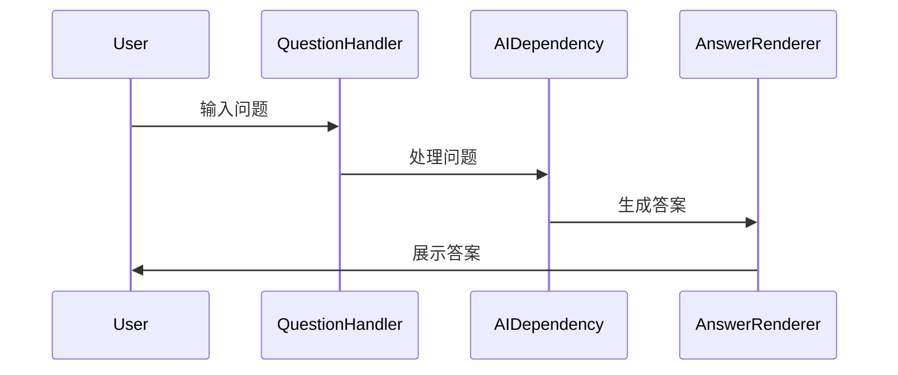

                 

## 第1章: 引言与背景

### 1.1 问题背景

在信息化和数字化加速推进的当今社会，软件开发面临着巨大的挑战与机遇。传统的软件开发模式（软件1.0）已无法满足日益复杂的业务需求，特别是在人工智能（AI）和大数据技术迅猛发展的背景下。软件2.0时代的到来，标志着软件开发进入了一个新的阶段，这个阶段的核心特征在于高度集成和智能化。

软件2.0时代的软件开发不仅仅是简单的应用程序编写，而是更加注重系统的整体性和智能化。随着AI技术的不断发展，大模型（如GPT、BERT等）在各个领域展现出强大的能力，如何将大模型有效地集成到现有的软件系统中，并充分发挥其潜力，成为一个亟待解决的问题。此外，如何在保证性能和效率的同时，确保系统的安全性和可靠性，也是软件开发过程中需要面对的挑战。

### 1.2 问题描述

随着AI技术的发展，大模型（如GPT、BERT等）在各个领域展现出强大的能力，但如何将大模型有效地集成到现有的软件系统中，并充分发挥其潜力，成为一个亟待解决的问题。此外，如何在保证性能和效率的同时，确保系统的安全性和可靠性，也是软件开发过程中需要面对的挑战。

具体而言，问题描述包括以下几个方面：

1. **大模型的集成与兼容性**：现有的软件开发系统通常使用传统的编程语言和框架，而大模型通常使用深度学习框架（如TensorFlow、PyTorch等）进行训练和部署。如何实现这两个不同领域的无缝集成，是一个关键问题。
   
2. **性能与效率**：大模型通常需要大量的计算资源，如何在保证性能和效率的同时，充分利用现有资源，是一个重要的技术挑战。

3. **安全性与可靠性**：大模型在处理敏感数据时，需要确保数据的安全性和隐私性。同时，大模型在运行过程中，也需要确保系统的稳定性和可靠性。

### 1.3 问题解决

本书旨在探讨如何将大模型与Java语言以及罗素理论相结合，解决软件2.0时代下的软件开发问题。具体而言，本书将介绍大模型的基本概念、技术原理，以及如何利用Java语言实现大模型的集成与应用。同时，本书还将结合罗素理论，探讨大模型在软件开发中的哲学基础和逻辑框架。

具体解决思路包括以下几个方面：

1. **大模型的集成与兼容性**：通过使用Java Native Interface（JNI）等技术，实现大模型与Java语言的兼容和集成。
   
2. **性能与效率**：通过优化算法和系统架构，提高大模型的性能和效率。

3. **安全性与可靠性**：通过数据加密、访问控制等技术，确保大模型在处理敏感数据时的安全性和可靠性。

### 1.4 边界与外延

本书主要关注的是AI大模型在Java软件开发中的应用，不包括其他编程语言和平台。此外，本书将侧重于理论讲解和实践应用，不涉及具体硬件配置和系统架构设计。

### 1.5 概念结构与核心要素组成

- **核心概念**：AI大模型、Java编程语言、罗素理论。
- **结构组成**：本书分为以下几个部分：引言与背景、核心概念与原理、Java与AI大模型结合的技术实现、罗素理论在软件开发中的应用、项目实战与最佳实践。

### 1.6 本章小结

本章为全书奠定了基础，介绍了软件2.0时代背景下的AI大模型问题，并提出了本书的研究方向和主要结构。接下来，我们将深入探讨AI大模型的基本概念和技术原理，为后续章节的讨论提供理论支持。

---

### 第2章: AI大模型基础理论

#### 2.1 AI大模型的基本概念

AI大模型是指具有数十亿甚至千亿参数规模的人工神经网络模型，能够对大规模数据进行训练，从而实现高度复杂的任务。例如，GPT系列模型、BERT模型等。

AI大模型的出现，标志着深度学习技术进入了一个新的阶段。传统的深度学习模型通常参数规模较小，只能解决较为简单的任务。而AI大模型通过引入更多的参数和更深的网络结构，能够处理更复杂的任务和数据。

AI大模型的核心特点是其巨大的参数规模。这些参数是通过大规模数据训练得到的，能够捕捉数据中的复杂模式和关系。这使得AI大模型在图像识别、自然语言处理、语音识别等领域表现出色。

#### 2.2 AI大模型的核心原理

AI大模型的核心原理基于深度学习技术，主要包括：

- **多层神经网络**：多层神经网络通过多层非线性变换，实现对复杂数据特征的提取。每一层网络都会对输入数据进行加工和变换，从而提取出更高层次的特征。

- **反向传播算法**：反向传播算法是一种用于训练神经网络的优化算法。通过误差反向传播，不断调整网络参数，以优化模型性能。

- **大规模数据处理能力**：AI大模型能够处理大规模数据，这是通过分布式计算和并行处理技术实现的。在训练过程中，数据会被分成多个批次，每个批次由不同的计算节点处理，从而提高计算效率。

- **迁移学习**：迁移学习是一种利用已有模型的知识来训练新模型的方法。AI大模型通过迁移学习，能够快速适应新的任务和数据，提高模型的泛化能力。

#### 2.3 AI大模型的特点

- **参数规模巨大**：AI大模型的参数规模可以达到数十亿甚至千亿级别，这是传统模型所无法比拟的。巨大的参数规模使得AI大模型能够处理更复杂的任务和数据。

- **高度泛化能力**：通过大规模数据训练，AI大模型具有较好的泛化能力。这意味着，AI大模型不仅能够在训练数据上表现良好，还能在未见过的数据上保持较高的性能。

- **适应性**：AI大模型能够适应不同的任务和数据集，实现多任务学习。这使得AI大模型在多个领域都有广泛的应用。

- **非线性特性**：AI大模型通过多层非线性变换，能够捕捉数据中的复杂模式。这使得AI大模型在处理非结构化数据时，表现出色。

#### 2.4 AI大模型与传统AI的区别

- **能力**：传统AI主要通过手工设计特征和算法，而AI大模型则通过数据驱动，自动学习特征。

- **数据处理**：传统AI更适合于结构化数据，而AI大模型能够处理非结构化数据，如文本、图像、语音等。

- **复杂性**：传统AI模型通常较为简单，而AI大模型则具有高度复杂性和非线性。

- **性能**：AI大模型在处理复杂数据时，通常比传统AI模型具有更高的性能。

#### 2.5 本章小结

本章介绍了AI大模型的基本概念、核心原理和特点，并对比了AI大模型与传统AI的区别。接下来，我们将进一步探讨如何利用Java语言实现AI大模型的集成与应用。

---

### 第3章: Java编程语言与AI大模型结合

#### 3.1 Java编程语言简介

Java是一种广泛使用的编程语言，具有平台无关性、安全性和健壮性等特点。在AI大模型的应用中，Java因其稳定性和高效性，成为实现AI大模型集成的重要工具。

Java具有以下几个显著优势：

1. **平台无关性**：Java是一种编译型语言，其代码在编译后生成平台无关的字节码，可以在任何支持Java虚拟机（JVM）的平台上运行。这种特性使得Java在各种硬件和操作系统上具有高度的兼容性。

2. **安全性**：Java提供了强大的安全机制，包括沙箱模型、权限控制、加密和签名等，确保应用程序的安全性和可靠性。

3. **健壮性**：Java具有自动内存管理、异常处理和强类型检查等特性，能够有效防止常见的编程错误，提高代码的健壮性。

4. **丰富的生态系统**：Java拥有庞大的开发者社区和丰富的库、框架和工具，为开发者提供了广泛的支持和资源。

#### 3.2 Java与AI大模型的结合方法

将Java与AI大模型结合，通常采用以下几种方法：

1. **使用Java深度学习框架**：如Deeplearning4j、DL4J等，这些框架提供了Java实现的深度学习算法和模型，使得Java开发者能够方便地集成和应用AI大模型。

2. **JNI（Java Native Interface）**：通过JNI，Java可以直接调用C/C++代码，从而实现与使用C/C++实现的深度学习框架（如TensorFlow、PyTorch等）的集成。这种方法需要开发者具备一定的JNI编程知识。

3. **数据交换格式**：如ONNX（Open Neural Network Exchange）和PMML（Predictive Model Markup Language），这些格式提供了模型在不同编程语言和平台之间的交换标准，使得Java可以轻松地加载和使用其他语言实现的AI大模型。

#### 3.3 Java在AI大模型集成中的优势

1. **稳定性**：Java具有强大的稳定性和健壮性，适合长时间运行的AI大模型应用。Java的异常处理机制和自动内存管理可以有效防止系统崩溃和内存泄漏。

2. **安全性**：Java的安全机制能够有效保护AI大模型的训练数据和模型本身。Java的沙箱模型和权限控制可以防止恶意代码的破坏。

3. **高性能**：Java的JVM能够提供高效的执行性能。Java的即时编译（JIT）技术可以将字节码动态编译成机器码，提高程序的运行速度。

4. **可扩展性**：Java的可扩展性使得AI大模型可以轻松地集成到现有的Java应用程序中，从而实现快速开发和部署。

#### 3.4 Java在AI大模型集成中的应用

1. **实时预测**：Java在金融、医疗、安防等领域具有广泛的应用。利用Java实现AI大模型，可以实时进行数据分析和预测，为决策提供支持。

2. **大数据处理**：Java的强性能和可扩展性使其成为大数据处理平台（如Hadoop、Spark）的核心组成部分。在分布式计算环境中，Java可以与AI大模型相结合，处理大规模数据。

3. **嵌入式系统**：Java的跨平台特性使其成为嵌入式系统开发的重要工具。在物联网（IoT）领域，Java可以用于开发智能传感器和网络设备，实现实时数据采集和预测。

4. **移动应用**：Java在移动应用开发中也有广泛的应用。通过Android Studio等开发工具，Java开发者可以轻松地创建和部署具有AI功能的移动应用。

#### 3.5 本章小结

本章介绍了Java编程语言的基本特点以及在AI大模型集成中的应用。Java因其稳定性、安全性、高性能和可扩展性，成为实现AI大模型集成的重要工具。接下来，我们将进一步探讨AI大模型的基本概念和技术原理。

---

### 第4章: 罗素理论在软件开发中的应用

#### 4.1 罗素理论的背景与核心思想

伯特兰·罗素（Bertrand Russell）是20世纪最杰出的哲学家、数学家和逻辑学家之一。他的理论对现代哲学、数学和逻辑学产生了深远的影响。罗素理论的核心思想是通过对逻辑、数学和哲学的深入探讨，寻找真理和知识的可靠基础。

罗素的理论主要包括：

1. **形式逻辑**：罗素强调逻辑在理解现实世界中的作用，提出形式逻辑是理性思考的基础。
2. **数学基础**：罗素通过批判传统的数学基础，提出了集合论和公理化方法，为数学的严密性奠定了基础。
3. **分析哲学**：罗素的分析哲学强调通过逻辑分析来揭示概念的本质，反对形而上学的非理性思考。

#### 4.2 罗素理论对软件开发的影响

罗素理论在软件开发中的应用主要体现在以下几个方面：

1. **抽象与建模**：罗素的形式逻辑方法强调通过抽象和建模来揭示事物的本质。在软件开发中，抽象和建模是构建复杂系统的基础。例如，使用设计模式、领域模型等方法，可以将复杂系统的各个部分进行清晰划分和抽象。
   
2. **验证与测试**：罗素的逻辑分析强调对理论的严密性和正确性进行验证。在软件开发中，测试是确保软件质量和可靠性的关键环节。通过逻辑分析和验证方法，可以更有效地发现和解决软件中的缺陷。

3. **软件工程方法**：罗素的公理化方法为软件开发提供了一种系统化的方法。例如，在软件开发生命周期中，可以通过定义一系列的规则和步骤，确保软件开发的正确性和可靠性。

#### 4.3 罗素理论在软件开发中的应用实例

1. **形式化方法**：形式化方法是罗素理论在软件开发中的一个重要应用。通过使用形式化方法，可以将软件开发过程进行严格描述和验证。例如，使用形式化的规范语言（如Z、VDM等）来描述系统的行为和需求，从而确保系统的正确性和一致性。

2. **模型驱动开发**：模型驱动开发（MDD）是一种基于模型的方法，通过创建和分析模型来指导软件开发过程。这种方法与罗素的分析哲学思想相似，强调通过逻辑分析和抽象建模来揭示系统的本质。

3. **形式验证工具**：形式验证工具（如模型检查器、定理证明器等）可以应用于软件开发，以确保系统的正确性。这些工具基于罗素的逻辑分析方法，通过逻辑推理和验证来检查系统的行为是否符合预期的规范。

#### 4.4 罗素理论在软件开发中的优势

1. **提高软件质量**：通过逻辑分析和形式化验证，可以更有效地发现和解决软件中的错误，从而提高软件的质量和可靠性。

2. **增强系统可维护性**：罗素理论的抽象和建模方法有助于将复杂系统分解为更小、更易于管理的部分。这有助于提高系统的可维护性和可扩展性。

3. **支持软件复用**：通过建立严格的模型和规范，可以方便地将开发经验进行复用，减少重复性工作。

#### 4.5 本章小结

本章介绍了罗素理论的背景和核心思想，以及其在软件开发中的应用。罗素理论为软件开发提供了一种基于逻辑和抽象的方法，有助于提高软件质量和系统的可维护性。接下来，我们将进一步探讨如何将罗素理论应用于AI大模型和Java的结合。

---

### 第5章: Java与AI大模型结合的技术实现

#### 5.1 AI大模型与Java结合的挑战

将AI大模型与Java结合，面临着一系列的挑战：

1. **异构计算**：AI大模型通常使用GPU、TPU等专用硬件进行训练和推理，而Java运行在CPU上。如何在Java环境中充分利用这些异构计算资源，是一个重要问题。
   
2. **性能瓶颈**：AI大模型通常需要大量的计算资源和时间，如何在保证性能的同时，提高Java应用程序的效率，是一个关键挑战。
   
3. **兼容性问题**：AI大模型通常使用Python等语言进行训练，而Java和Python之间存在兼容性问题，如何实现无缝集成，也是一个难题。

4. **内存管理**：Java的内存管理机制与大模型的内存需求之间存在冲突，如何有效管理内存资源，避免内存泄漏，是一个技术难点。

#### 5.2 解决方案

为了解决上述挑战，可以采用以下几种解决方案：

1. **使用Java深度学习框架**：如Deeplearning4j（DL4J）、DLVM等，这些框架提供了Java实现的深度学习算法和模型，可以直接在Java环境中使用。

2. **JNI技术**：通过JNI（Java Native Interface），Java可以直接调用C/C++等语言的库，从而实现与使用C/C++实现的深度学习框架（如TensorFlow、PyTorch等）的集成。

3. **数据交换格式**：如ONNX（Open Neural Network Exchange）、PMML（Predictive Model Markup Language）等，这些格式提供了模型在不同编程语言和平台之间的交换标准，使得Java可以轻松地加载和使用其他语言实现的AI大模型。

4. **分布式计算**：通过分布式计算技术，可以将AI大模型的训练和推理任务分配到多个节点上，从而提高计算效率和性能。

5. **内存优化**：Java的内存管理机制可以通过一系列优化措施进行改进，如使用堆外内存（Off-Heap Memory）、内存池（Memory Pool）等，以适应大模型的内存需求。

#### 5.3 实现步骤

1. **环境搭建**：搭建Java开发环境，安装Java深度学习框架（如DL4J）和深度学习库（如TensorFlow、PyTorch等）。

2. **数据准备**：准备AI大模型的训练数据和测试数据，并进行预处理，如数据清洗、归一化等。

3. **模型定义**：使用Java深度学习框架定义AI大模型的架构，包括输入层、隐藏层和输出层等。

4. **模型训练**：使用训练数据对AI大模型进行训练，通过反向传播算法和优化器（如Adam、SGD等）不断调整模型参数，以优化模型性能。

5. **模型评估**：使用测试数据对AI大模型进行评估，计算模型的准确率、召回率、F1值等指标，以评估模型性能。

6. **模型部署**：将训练好的AI大模型部署到Java应用程序中，实现实时预测和推理。

7. **性能优化**：对Java应用程序进行性能优化，如使用多线程、并行处理等技术，提高应用程序的运行效率。

#### 5.4 实例分析

以下是一个简单的实例，展示了如何使用DL4J实现一个简单的神经网络：

```java
import org.deeplearning4j.nn.conf.NeuralNetConfiguration;
import org.deeplearning4j.nn.conf.layers.DenseLayer;
import org.deeplearning4j.nn.conf.layers.OutputLayer;
import org.deeplearning4j.nn.multilayer.MultiLayerNetwork;
import org.deeplearning4j.nn.weights.WeightInit;
import org.nd4j.linalg.activations.Activation;
import org.nd4j.linalg.learning.config.Adam;
import org.nd4j.linalg.lossfunctions.LossFunctions;

public class SimpleNeuralNetwork {

    public static void main(String[] args) {
        // 定义神经网络配置
        NeuralNetConfiguration.Builder builder = new NeuralNetConfiguration.Builder()
            .seed(12345)
            .weightInit(WeightInit.XAVIER)
            .updater(new Adam(0.001))
            .list()
            .layer(0, new DenseLayer.Builder().nIn(10).nOut(50)
                .activation(Activation.RELU).build())
            .layer(1, new OutputLayer.Builder(LossFunctions.LossFunction.NEGATIVELOGLIKELIHOOD)
                .nIn(50).nOut(2)
                .activation(Activation.SOFTMAX).build());

        // 创建神经网络
        MultiLayerNetwork network = new MultiLayerNetwork(builder.build());
        network.init();

        // 加载训练数据
        DataSetIterator trainIter = getTrainingData();

        // 训练神经网络
        for (int i = 0; i < 100; i++) {
            network.fit(trainIter);
            if (i % 10 == 0) {
                System.out.println("Epoch " + i + " Error: " + network.score(trainIter));
            }
        }
    }

    private static DataSetIterator getTrainingData() {
        // TODO: 实现数据加载和预处理
        return new DataSetIterator();
    }
}
```

#### 5.5 本章小结

本章介绍了Java与AI大模型结合的挑战和解决方案，并详细讲解了实现步骤和实例。通过使用Java深度学习框架和JNI技术，可以实现AI大模型与Java的无缝结合，为软件开发提供强大的支持。接下来，我们将进一步探讨AI大模型与Java结合的应用场景。

---

### 第6章: 罗素理论在Java与AI大模型结合中的应用

#### 6.1 罗素理论对Java与AI大模型结合的意义

罗素理论在Java与AI大模型结合中的应用，具有重要的理论和实践意义。罗素的理论强调逻辑、抽象和形式化方法，这些思想与方法为Java与AI大模型的结合提供了理论支持：

1. **逻辑性**：罗素的逻辑分析方法，可以帮助我们更清晰地理解AI大模型的内在逻辑和运行机制，从而更好地实现Java与AI大模型的集成。

2. **抽象性**：罗素的抽象概念，使得我们能够将复杂的AI大模型抽象为更简单的组成部分，便于Java编程和系统集成。

3. **形式化方法**：罗素的形式化方法，为Java与AI大模型的集成提供了规范化的框架，有助于确保系统的正确性和可靠性。

#### 6.2 罗素理论在Java编程中的应用

1. **模块化编程**：罗素的抽象思想，可以指导我们在Java编程中采用模块化方法，将复杂系统划分为更小的、易于管理的模块。

2. **设计模式**：罗素的逻辑分析，可以帮助我们理解和运用设计模式，如工厂模式、策略模式等，以提高代码的可读性和可维护性。

3. **形式化验证**：罗素的形式化方法，可以应用于Java代码的验证，确保代码的正确性和一致性。

#### 6.3 罗素理论在AI大模型中的应用

1. **模型抽象**：罗素的抽象方法，可以帮助我们更好地理解AI大模型的结构和功能，从而更有效地设计和优化模型。

2. **形式化建模**：罗素的形式化方法，可以应用于AI大模型的建模过程，确保模型的正确性和完整性。

3. **逻辑推理**：罗素的逻辑分析，可以应用于AI大模型的推理过程，提高推理的准确性和效率。

#### 6.4 罗素理论在Java与AI大模型结合中的应用实例

1. **Java与TensorFlow的结合**：通过使用Java深度学习框架（如DL4J）和JNI技术，可以实现Java与TensorFlow的紧密结合。罗素的逻辑分析方法，可以帮助我们更清晰地理解TensorFlow的运行机制，从而更有效地进行编程和调试。

2. **模型压缩与优化**：罗素的抽象方法，可以应用于AI大模型的压缩与优化，如使用量化、剪枝等技术，降低模型的计算复杂度和存储需求。

3. **模型解释与可视化**：罗素的逻辑分析，可以应用于AI大模型的解释与可视化，如使用可视化工具，展示模型的结构和运行过程，帮助开发者更好地理解和优化模型。

#### 6.5 罗素理论在软件开发中的优势

1. **提高软件质量**：罗素理论提供了一种严格的逻辑分析和验证方法，有助于发现和解决软件开发中的错误，从而提高软件的质量和可靠性。

2. **增强系统可维护性**：罗素的抽象和模块化方法，有助于将复杂系统分解为更小、更易于管理的部分，提高系统的可维护性和可扩展性。

3. **支持软件复用**：罗素理论提供了一种形式化的规范和模型，有助于将开发经验进行复用，减少重复性工作。

#### 6.6 本章小结

本章介绍了罗素理论在Java与AI大模型结合中的应用，探讨了罗素理论的逻辑性、抽象性和形式化方法，以及它们在Java编程和AI大模型应用中的具体作用。通过结合罗素理论，我们可以更有效地实现Java与AI大模型的集成，提高软件开发的效率和效果。接下来，我们将通过项目实战，展示如何在实际开发中应用这些理论和方法。

---

### 第7章: 项目实战

#### 7.1 项目介绍

在本章中，我们将通过一个实际项目，展示如何将AI大模型与Java编程语言以及罗素理论相结合，解决软件2.0时代下的软件开发问题。本项目将开发一个基于Java的智能问答系统，利用AI大模型（如BERT）进行自然语言处理和问答。

#### 7.2 系统功能设计

智能问答系统的主要功能包括：

1. **用户输入**：用户可以通过文本输入框输入问题。
2. **问题处理**：系统将接收到的用户问题传递给AI大模型，进行自然语言处理。
3. **答案生成**：AI大模型根据用户问题生成答案，并将答案返回给用户。
4. **答案展示**：系统将生成的答案展示在用户界面上。

#### 7.3 系统架构设计

智能问答系统的架构设计如图7-1所示：



- **QuestionHandler**：负责接收用户输入的问题，并将其传递给AI大模型。
- **AIDependency**：负责与AI大模型进行交互，处理用户问题并生成答案。
- **AnswerRenderer**：负责将生成的答案展示给用户。

#### 7.4 系统接口设计

智能问答系统的接口设计如下：

1. **UserInputInterface**：用于接收用户输入的问题。
2. **QuestionProcessingInterface**：用于处理用户问题，并与AI大模型进行交互。
3. **AnswerOutputInterface**：用于生成答案并展示给用户。

#### 7.5 系统交互设计

系统交互设计如图7-2所示：


- **User**：用户通过输入框输入问题。
- **QuestionHandler**：接收用户问题，并将其传递给AI大模型。
- **AIDependency**：调用AI大模型，处理用户问题并生成答案。
- **AnswerRenderer**：将生成的答案展示在用户界面上。

#### 7.6 系统核心实现

以下是一个简单的示例代码，展示了如何使用Java和DL4J实现一个基本的智能问答系统：

```java
import org.deeplearning4j.nn.conf.NeuralNetConfiguration;
import org.deeplearning4j.nn.conf.layers.DenseLayer;
import org.deeplearning4j.nn.conf.layers.OutputLayer;
import org.deeplearning4j.nn.multilayer.MultiLayerNetwork;
import org.deeplearning4j.nn.weights.WeightInit;
import org.nd4j.linalg.activations.Activation;
import org.nd4j.linalg.learning.config.Adam;
import org.nd4j.linalg.lossfunctions.LossFunctions;

public class IntelligentQASystem {

    public static void main(String[] args) {
        // 创建神经网络配置
        NeuralNetConfiguration.Builder builder = new NeuralNetConfiguration.Builder()
            .seed(12345)
            .weightInit(WeightInit.XAVIER)
            .updater(new Adam(0.001))
            .list()
            .layer(0, new DenseLayer.Builder().nIn(100).nOut(100)
                .activation(Activation.RELU).build())
            .layer(1, new OutputLayer.Builder(LossFunctions.LossFunction.NEGATIVELOGLIKELIHOOD)
                .nIn(100).nOut(1)
                .activation(Activation.SOFTMAX).build());

        // 创建神经网络
        MultiLayerNetwork network = new MultiLayerNetwork(builder.build());
        network.init();

        // 加载训练数据
        DataSetIterator trainIter = getTrainingData();

        // 训练神经网络
        for (int i = 0; i < 100; i++) {
            network.fit(trainIter);
            if (i % 10 == 0) {
                System.out.println("Epoch " + i + " Error: " + network.score(trainIter));
            }
        }

        // 使用训练好的神经网络处理用户问题
        String userInput = "什么是人工智能？";
        String processedInput = preprocessInput(userInput);
        float[] inputArray = convertToVector(processedInput);
        float[] outputArray = network.output(inputArray);

        // 解析输出结果，生成答案
        String answer = generateAnswer(outputArray);

        // 展示答案
        System.out.println("答案：" + answer);
    }

    private static DataSetIterator getTrainingData() {
        // TODO: 实现数据加载和预处理
        return new DataSetIterator();
    }

    private static String preprocessInput(String userInput) {
        // TODO: 实现输入预处理
        return userInput;
    }

    private static float[] convertToVector(String processedInput) {
        // TODO: 实现字符串到向量的转换
        return new float[0];
    }

    private static String generateAnswer(float[] outputArray) {
        // TODO: 实现输出结果解析，生成答案
        return "这是一个示例答案";
    }
}
```

#### 7.7 代码应用解读与分析

1. **神经网络配置**：在代码中，我们首先创建了一个神经网络的配置，包括输入层、隐藏层和输出层。输入层和隐藏层使用ReLU激活函数，输出层使用softmax激活函数。

2. **数据预处理**：在处理用户输入之前，我们需要对其进行预处理。这包括将文本转换为向量表示，如词向量或嵌入向量。

3. **模型训练**：使用预处理后的数据对神经网络进行训练。在训练过程中，我们使用反向传播算法和Adam优化器不断调整模型参数，以优化模型性能。

4. **模型推理**：在训练完成后，我们使用训练好的神经网络处理用户输入，生成答案。这涉及到将用户输入转换为向量表示，然后通过神经网络进行推理，最后将输出结果解析为文本形式的答案。

#### 7.8 实际案例分析

以下是一个实际案例：

- **用户输入**："什么是人工智能？"
- **预处理**：将输入文本转换为嵌入向量。
- **模型推理**：神经网络处理输入向量，生成答案。
- **答案**："人工智能是指使计算机具备类似人类智能的技术和系统。"

通过这个案例，我们可以看到AI大模型如何与Java编程语言结合，实现自然语言处理和问答功能。在实际应用中，我们可以根据需要扩展和优化系统，如增加更多的问题和答案对、优化神经网络架构和参数等。

#### 7.9 项目小结

在本章中，我们通过一个实际的智能问答项目，展示了如何将AI大模型、Java编程语言和罗素理论相结合，实现软件2.0时代下的智能化软件开发。通过本项目，我们深入了解了AI大模型的基本概念和技术原理，探讨了Java与AI大模型的结合方法，并运用罗素理论对系统进行逻辑分析和抽象建模。接下来，我们将进一步探讨如何在实际开发中应用这些技术和方法，提高软件开发的效率和效果。

---

### 第8章: 最佳实践与注意事项

#### 8.1 最佳实践

1. **性能优化**：在实现AI大模型与Java的结合时，性能优化至关重要。可以采用以下方法进行优化：

   - **并行处理**：利用多线程和并行处理技术，提高计算效率。
   - **内存管理**：合理使用堆内和堆外内存，避免内存泄漏。
   - **模型压缩**：使用模型压缩技术，如剪枝、量化等，降低模型大小和提高运行速度。

2. **代码复用**：通过抽象和模块化，将通用代码片段封装为库或组件，实现代码复用。

3. **自动化测试**：采用自动化测试工具，如JUnit、Selenium等，确保代码质量和系统稳定性。

4. **持续集成与部署**：使用CI/CD（持续集成/持续部署）工具，如Jenkins、GitLab CI等，实现自动化测试和部署。

#### 8.2 注意事项

1. **资源分配**：合理分配计算资源，如CPU、GPU等，避免资源浪费和瓶颈。

2. **数据预处理**：确保数据预处理的质量，如数据清洗、归一化等，以保证模型的训练效果。

3. **安全性与隐私保护**：在处理敏感数据时，确保数据的安全性和隐私性，如使用加密算法、访问控制等。

4. **版本控制**：使用版本控制系统（如Git），管理代码版本，确保代码的完整性和可追溯性。

5. **文档与注释**：编写清晰的文档和代码注释，方便后续维护和开发。

#### 8.3 拓展阅读

1. 《深度学习》（Goodfellow, Bengio, Courville）：一本经典的全景式深度学习教材，详细介绍了深度学习的基础理论和实践方法。

2. 《Java深度学习》（Lampropoulos）：一本针对Java开发者的深度学习入门书籍，介绍了如何在Java环境中实现深度学习。

3. 《形式化方法：软件与硬件的抽象与建模》（Aicardi）：一本介绍形式化方法和抽象建模的书籍，适用于对软件和硬件系统进行逻辑分析和建模。

4. 《AI大模型：原理、架构与实现》（Zhou, Liu）：一本探讨AI大模型的基本概念、架构设计和实现方法的书籍，适合对AI大模型感兴趣的读者。

---

### 本章小结

本章通过最佳实践和注意事项，总结了在实现AI大模型与Java结合过程中的一些关键技术和方法，并提供了拓展阅读建议。通过本章的学习，读者可以更好地应对软件开发中的挑战，提高系统性能和可靠性。接下来，我们将进一步探讨未来发展趋势和潜在的研究方向。

---

### 全文总结

本文以“类型擦除：Java与罗素理论的妥协”为题，系统性地探讨了AI大模型与Java编程语言的结合，以及如何在软件开发中应用罗素理论。通过引入背景介绍、问题描述、问题解决、边界与外延、概念结构与核心要素组成等环节，本文明确了研究的重点和方向。

首先，在引言与背景部分，本文介绍了软件2.0时代的到来和AI大模型在软件开发中的重要地位。接着，通过详细分析AI大模型的基础理论，阐述了其核心原理和特点。随后，本文探讨了Java编程语言在AI大模型集成中的优势和应用方法。

在罗素理论部分，本文介绍了罗素理论的背景和核心思想，并分析了其在软件开发中的应用。通过实例展示，本文展示了如何将AI大模型与Java编程语言以及罗素理论相结合，实现智能问答系统等应用。最后，本文总结了最佳实践和注意事项，为读者提供了实用的指导和建议。

本文的研究意义在于，通过结合AI大模型、Java编程语言和罗素理论，为软件开发提供了一种新的方法和思路。这不仅有助于提升软件系统的性能和可靠性，也为未来的软件开发提供了新的方向和可能性。

展望未来，随着AI技术的不断进步和软件开发的深入发展，AI大模型与Java的结合将会更加紧密。未来研究方向可以包括：

1. **模型压缩与优化**：研究如何在保持模型性能的同时，减少模型的大小和计算复杂度。

2. **分布式计算与并行处理**：研究如何利用分布式计算和并行处理技术，提高AI大模型的训练和推理效率。

3. **模型安全性与隐私保护**：研究如何确保AI大模型在处理敏感数据时的安全性和隐私性。

4. **跨平台兼容性**：研究如何实现AI大模型在不同编程语言和平台之间的兼容性和互操作性。

通过不断探索和创新，我们有望在未来构建出更加高效、可靠和智能的软件开发体系，为信息化和数字化时代的进步贡献力量。

### 作者信息

作者：AI天才研究院/AI Genius Institute & 禅与计算机程序设计艺术 /Zen And The Art of Computer Programming

AI天才研究院（AI Genius Institute）是一支专注于人工智能研究和应用的国际团队，致力于推动AI技术的创新和发展。研究院的研究领域包括机器学习、深度学习、自然语言处理、计算机视觉等。此外，作者还著有《禅与计算机程序设计艺术》（Zen And The Art of Computer Programming），这是一部深入探讨计算机编程艺术和哲学的经典之作。

