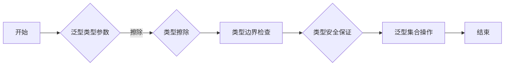
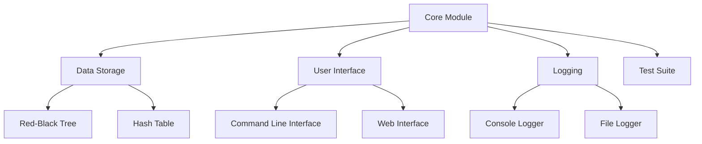
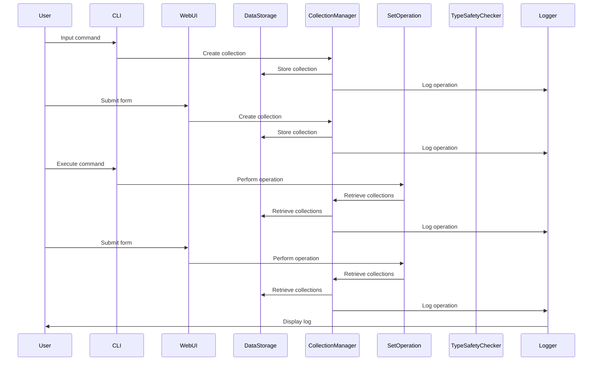

                 

### 背景介绍

#### 1.1 问题背景

Java 泛型是Java编程语言中的一个重要特性，它允许程序员在编写代码时指定类型参数，从而提高代码的泛化能力和复用性。泛型的引入解决了传统Java集合框架中类型安全的问题，使得集合操作更加灵活和高效。然而，泛型的实现机制——类型擦除，在为Java编程带来便利的同时，也引发了一系列挑战和妥协。

类型擦除（Type Erasure）是Java泛型的实现机制。简单来说，就是在编译阶段，Java将泛型类型信息擦除，将泛型代码转换为普通非泛型代码。这种机制在一定程度上保证了Java虚拟机（JVM）的兼容性和性能，但也带来了类型安全问题和类型兼容性问题。

#### 1.2 问题描述

泛型编程的主要优势在于提高了代码的复用性和灵活性，使得程序员能够编写更简洁和高效的代码。例如，通过泛型，可以创建一个通用的集合类，使其能够存储任意类型的数据。然而，泛型编程也存在一些局限：

1. **类型擦除带来的局限性**：类型擦除使得编译后的泛型代码与普通代码无异，导致泛型类型信息在运行时不可见。这意味着，泛型方法无法直接访问类型参数的相关信息，例如类型变量的边界类型。

2. **类型安全问题的妥协**：类型擦除虽然提高了性能和兼容性，但也使得泛型程序在运行时面临类型安全问题。由于类型信息被擦除，编译器无法对泛型代码进行严格的类型检查，可能导致运行时类型错误。

3. **类型兼容性问题**：类型擦除导致泛型类型的运行时行为与普通类型不同，这可能导致泛型类型之间的兼容性问题。例如，两个泛型类在编译时看起来是兼容的，但在运行时可能会出现类型错误。

为了解决这些问题，Java泛型采取了一系列妥协和设计策略，这些策略在一定程度上提高了泛型编程的可用性和安全性。接下来，我们将详细探讨类型擦除的实现机制、泛型程序的类型安全，以及类型擦除在不同版本Java中的差异。

### 问题解决

#### 1.3 类型擦除的实现机制

类型擦除是Java泛型的核心实现机制，它通过在编译阶段将泛型类型信息擦除，从而生成与普通非泛型代码相同的字节码。这种机制的目的是为了提高Java虚拟机（JVM）的兼容性和性能，同时保留泛型的语法糖。

**编译阶段**：在Java编译过程中，编译器会对泛型代码进行类型检查，确保泛型表达式在语法上符合规则。一旦泛型代码通过类型检查，编译器就会将泛型类型信息擦除。具体来说，编译器会：

1. **擦除类型参数**：将泛型类型参数（如`<T>`）替换为通用的`Object`类型。
2. **擦除类型边界**：将泛型类型边界（如`extends`和`super`关键字）替换为普通类型边界。

**运行阶段**：在运行时，JVM会使用类型擦除后的字节码执行程序。由于类型信息已被擦除，泛型类型在运行时表现为普通类型。这意味着：

1. **泛型类型信息不可见**：泛型类型参数在运行时不可访问，无法直接获取类型参数的相关信息。
2. **类型兼容性问题**：泛型类型之间的兼容性仅依赖于编译时的类型声明，运行时的类型行为可能不同。

**示例代码**：

```java
public class GenericClass<T> {
    public void add(T element) {
        // 在编译时，T会被擦除为Object
    }
}

public class Main {
    public static void main(String[] args) {
        GenericClass<Integer> genericInt = new GenericClass<>();
        genericInt.add(10); // 编译通过，运行时类型为Object
    }
}
```

在上面的示例中，`GenericClass`类使用了泛型类型参数`T`。在编译阶段，`T`会被擦除为`Object`类型。因此，当运行`add`方法时，实际参数类型是`Integer`，但在编译后的字节码中，参数类型被擦除为`Object`。

#### 1.4 泛型程序的类型安全

尽管类型擦除带来了一定的局限性和兼容性问题，Java泛型程序在运行时仍然保持了一定的类型安全。这种安全性主要体现在以下几个方面：

1. **类型边界检查**：在泛型表达式中，编译器会检查类型边界，确保泛型类型的边界条件得到满足。例如，如果一个泛型方法要求类型参数`T`实现某个接口，编译器会确保调用该方法的实参类型满足接口要求。

2. **泛型集合的使用**：Java的泛型集合（如`ArrayList`和`HashMap`）在运行时提供了类型安全。例如，向泛型集合中添加元素时，编译器会确保添加的元素类型与集合声明的类型参数相匹配。

3. **泛型方法的类型安全**：泛型方法在编译时也会进行类型检查，确保方法的参数和返回值类型与泛型类型参数一致。这使得泛型方法能够提供更高的类型安全。

**示例代码**：

```java
public class GenericMethod<T> {
    public T get() {
        // 返回类型T与泛型类型参数一致
        return null;
    }
}

public class Main {
    public static void main(String[] args) {
        GenericMethod<Integer> genericInt = new GenericMethod<>();
        Integer result = genericInt.get(); // 返回类型为Integer
    }
}
```

在上面的示例中，`GenericMethod`类定义了一个泛型方法`get`。在编译时，编译器会确保返回类型`T`与泛型类型参数一致。这意味着在运行时，方法返回的`result`变量类型将被推断为`Integer`。

#### 1.5 边界与外延

泛型编程中的边界（Bounds）和通配符（Wildcards）是类型擦除机制的重要组成部分。边界用于指定泛型类型参数的上界或下界，而通配符用于表示类型的不确定性。

**边界**：

1. **上边界（Upper Bounds）**：使用`extends`关键字指定，表示泛型类型参数必须继承或实现指定的边界类型。例如，`<T extends Number>`表示`T`必须是`Number`或其子类。
2. **下边界（Lower Bounds）**：使用`super`关键字指定，表示泛型类型参数必须实现或继承指定的边界类型。例如，`<T super String>`表示`T`必须是`String`或其父类。

**通配符**：

1. **无限定通配符（Unbounded Wildcards）**：使用`?`表示，表示泛型类型参数可以接受任何类型。例如，`List<?>`表示可以接受任何类型的`List`。
2. **有限定通配符（Bounded Wildcards）**：使用`? extends`或`? super`表示，分别表示泛型类型参数的上界和下界。例如，`List<? extends Number>`表示可以接受任何`Number`及其子类的`List`。

**示例代码**：

```java
public class UpperBound<T extends Number> {
    // 上边界
}

public class LowerBound<T super String> {
    // 下边界
}

public class WildcardExample {
    public void addList(List<? extends Number> list) {
        // 无限定通配符
    }
    
    public void addWildcardList(List<? super String> list) {
        // 限定通配符
    }
}
```

通过边界和通配符，程序员可以更精确地控制泛型类型参数的行为，从而实现更灵活和安全的泛型编程。

### 边界与外延

#### 1.6 泛型在Java中的具体应用场景

泛型在Java编程语言中有着广泛的应用，以下列举了一些常见的使用场景：

1. **集合框架**：Java的集合框架（如`List`、`Set`、`Map`）广泛使用了泛型来保证类型安全。通过泛型，可以创建一个通用的集合类，使其能够存储和操作任意类型的数据。例如：

   ```java
   List<Integer> integerList = new ArrayList<>();
   List<String> stringList = new ArrayList<>();
   ```

2. **泛型类和接口**：通过泛型，可以创建可重用的数据结构和算法。例如，`Comparator`接口使用泛型来定义一个比较器：

   ```java
   public interface Comparator<T> {
       int compare(T o1, T o2);
   }
   ```

3. **泛型方法**：泛型方法允许在方法签名中指定类型参数，从而实现对多种类型的操作。例如：

   ```java
   public static <T> void printArray(T[] array) {
       for (T element : array) {
           System.out.println(element);
       }
   }
   ```

4. **泛型数组**：虽然Java泛型不支持真正的泛型数组，但可以使用类型通配符来实现类似泛型数组的操作：

   ```java
   List<?>[] arrays = new ArrayList<?>[3];
   arrays[0] = new ArrayList<Integer>();
   arrays[1] = new ArrayList<String>();
   arrays[2] = new ArrayList<Number>();
   ```

5. **泛型通配符**：泛型通配符（如`? extends Number`和`? super String`）允许在泛型表达式中使用更灵活的类型。例如：

   ```java
   public void addAllNumbers(List<? extends Number> list) {
       // ...
   }
   ```

通过这些具体的应用场景，可以看到泛型在Java编程中的强大功能和灵活性。

#### 1.7 类型擦除在不同版本的Java中的差异

类型擦除在Java的不同版本中有着一些变化和改进，以下是一些重要的更新：

1. **Java 5**：是Java泛型首次引入的版本。类型擦除机制在Java 5中得到实现，通过在编译阶段擦除泛型类型信息，生成与普通非泛型代码相同的字节码。

2. **Java 6**：在Java 6中，对泛型的实现进行了优化。例如，Java 6引入了类型推断机制，使得泛型代码在编写时更加简洁。

3. **Java 7**：Java 7进一步增强了泛型的特性。例如，引入了`try-with-resources`语句，使得泛型类型的异常处理更加方便。

4. **Java 8**：Java 8引入了函数式接口和Lambda表达式，使得泛型编程更加简洁和直观。此外，Java 8还增强了泛型的类型推断和类型边界检查。

5. **Java 9+**：后续版本继续对泛型进行了各种改进和增强。例如，Java 10引入了`var`关键字，简化了泛型变量的声明；Java 11增强了泛型的类型推断机制。

这些版本更新表明，Java泛型在不断发展和完善，类型擦除机制也在不断优化，以满足现代编程的需求。

### 概念结构与核心要素组成

#### 2.1 泛型类型参数

泛型类型参数是Java泛型编程的核心概念之一，它允许程序员在编写代码时指定待定类型。泛型类型参数通常用尖括号`<>`包围，并使用一个或多个标识符表示。例如，`<T>`、`<T, V>`等。

**泛型类型参数的作用**：

1. **类型参数化**：通过泛型类型参数，可以创建可重用的数据结构和算法，使其能够处理多种类型的数据。例如，`ArrayList`、`HashMap`等集合类使用泛型类型参数来存储特定类型的对象。
   
2. **类型安全**：泛型类型参数在编译阶段被检查，确保泛型表达式的类型安全。编译器会确保泛型类型参数的实际类型与泛型声明一致。

**示例代码**：

```java
public class GenericClass<T> {
    private T element;

    public void setElement(T element) {
        this.element = element;
    }

    public T getElement() {
        return element;
    }
}

public class Main {
    public static void main(String[] args) {
        GenericClass<Integer> genericInt = new GenericClass<>();
        genericInt.setElement(10);
        Integer result = genericInt.getElement();
    }
}
```

在上面的示例中，`GenericClass`类使用泛型类型参数`T`。在创建`GenericClass<Integer>`对象时，编译器会确保`T`的实际类型是`Integer`。

#### 2.2 类型边界与通配符

类型边界（Type Bounds）和通配符（Wildcards）是Java泛型编程中的另一个重要概念，用于指定泛型类型参数的限制和范围。

**类型边界**：

1. **上边界（Upper Bounds）**：使用`extends`关键字指定，表示泛型类型参数必须继承或实现指定的边界类型。例如，`<T extends Number>`表示`T`必须是`Number`或其子类。

2. **下边界（Lower Bounds）**：使用`super`关键字指定，表示泛型类型参数必须实现或继承指定的边界类型。例如，`<T super String>`表示`T`必须是`String`或其父类。

**示例代码**：

```java
public class UpperBound<T extends Number> {
    // 上边界
}

public class LowerBound<T super String> {
    // 下边界
}

public class Main {
    public static void main(String[] args) {
        UpperBound<Integer> upperBound = new UpperBound<>();
        LowerBound<String> lowerBound = new LowerBound<>();
    }
}
```

在上面的示例中，`UpperBound`类使用上边界`<T extends Number>`，而`LowerBound`类使用下边界`<T super String>`。

**通配符**：

1. **无限定通配符（Unbounded Wildcards）**：使用`?`表示，表示泛型类型参数可以接受任何类型。例如，`List<?>`表示可以接受任何类型的`List`。

2. **有限定通配符（Bounded Wildcards）**：使用`? extends`或`? super`表示，分别表示泛型类型参数的上界和下界。例如，`List<? extends Number>`表示可以接受任何`Number`及其子类的`List`。

**示例代码**：

```java
public class WildcardExample {
    public void addList(List<? extends Number> list) {
        // 无限定通配符
    }
    
    public void addWildcardList(List<? super String> list) {
        // 限定通配符
    }
}

public class Main {
    public static void main(String[] args) {
        WildcardExample wildcardExample = new WildcardExample();
        List<Integer> integerList = new ArrayList<>();
        List<String> stringList = new ArrayList<>();
        
        wildcardExample.addList(integerList);
        wildcardExample.addWildcardList(stringList);
    }
}
```

在上面的示例中，`WildcardExample`类使用了无限定通配符和限定通配符。`addList`方法接受任何`Number`及其子类的`List`，而`addWildcardList`方法接受任何`String`及其父类的`List`。

#### 2.3 类型擦除后的影响

类型擦除是Java泛型编程的一个关键特性，它在编译阶段将泛型类型信息擦除，生成与普通非泛型代码相同的字节码。这种机制在提高JVM兼容性和性能的同时，也带来了一些影响和限制。

**类型擦除的影响**：

1. **类型信息丢失**：类型擦除导致泛型类型参数在运行时不可见，无法直接访问类型参数的相关信息。例如，无法获取类型参数的实际类型、边界类型等。

2. **泛型集合操作限制**：由于类型擦除，泛型集合（如`ArrayList`和`HashMap`）在运行时的类型信息被擦除，导致一些集合操作受到限制。例如，无法使用泛型集合的特定类型方法，如`ArrayList.get(int)`和`HashMap.get(Object)`。

3. **类型兼容性问题**：类型擦除可能导致泛型类型之间的兼容性问题。尽管编译时泛型类型看起来是兼容的，但运行时可能由于类型擦除而表现出不同的类型行为。例如，两个泛型类在编译时看起来是兼容的，但运行时可能会出现类型错误。

**示例代码**：

```java
public class GenericClass<T> {
    public void add(T element) {
        // 类型擦除导致T在运行时表现为Object
    }
}

public class Main {
    public static void main(String[] args) {
        GenericClass<Integer> genericInt = new GenericClass<>();
        genericInt.add(10); // 编译通过，运行时类型为Object
    }
}
```

在上面的示例中，`GenericClass`类使用了泛型类型参数`T`。由于类型擦除，`T`在运行时表现为`Object`类型，导致`add`方法的参数类型在运行时发生变化。

**类型擦除的解决方案**：

1. **使用类型通配符**：通过使用类型通配符（如`? extends`和`? super`），可以在一定程度上解决类型擦除带来的兼容性问题。例如，可以使用`List<? extends Number>`来接受任意`Number`及其子类的`List`。

2. **使用类型边界**：通过使用类型边界（如`extends`和`super`），可以指定泛型类型参数的上界或下界，从而在编译时提供更严格的类型检查。例如，`List<? extends Number>`表示可以接受任何`Number`及其子类的`List`。

3. **使用类型检查工具**：一些第三方库（如Eclipse Collections）提供了类型检查工具，可以在编译时对泛型代码进行更严格的类型检查，从而减少类型擦除带来的兼容性问题。

通过这些解决方案，程序员可以在一定程度上克服类型擦除带来的影响，实现更灵活和安全的泛型编程。

### 核心概念与联系

#### 2.4 概念属性特征对比表格

为了更好地理解泛型编程中的核心概念，我们通过一个表格来对比泛型类型与普通类型的属性特征。

| 特征 | 泛型类型 | 普通类型 |
| --- | --- | --- |
| 类型参数 | 可以使用类型参数指定泛化类型 | 无法指定泛化类型 |
| 类型边界 | 可以指定类型边界（上边界和下边界） | 无类型边界限制 |
| 类型擦除 | 在编译时擦除类型参数信息 | 无类型擦除机制 |
| 类型安全 | 编译时类型检查，保证类型安全 | 运行时类型检查，可能存在类型错误 |
| 泛化能力 | 高泛化能力，可重用数据结构和算法 | 低泛化能力，需为每种类型编写特定代码 |
| 运行时类型信息 | 类型信息在运行时不可见 | 类型信息在运行时可见 |
| 兼容性 | 需要考虑类型擦除带来的兼容性问题 | 无兼容性问题 |

通过这个对比表格，我们可以清晰地看到泛型类型与普通类型的差异和共同点。泛型类型通过类型参数、类型边界和类型擦除等特性，提供了更高的泛化能力和类型安全，但同时也引入了类型擦除和兼容性问题。

#### 2.5 ER实体关系图架构

为了更直观地展示泛型类型与普通类型之间的关系，我们使用Mermaid ER（Entity-Relationship）图来描述实体关系。

```mermaid
erDiagram
    Class::泛型类型 ||--|{ Object::普通类型 :类型擦除 }
    Class::泛型类型 ||--|{ Collection::泛型集合类 :泛型编程 }
    Class::泛型类型 ||--|{ Method::泛型方法 :类型参数 }
    Class::泛型类型 ||--|{ Interface::泛型接口 :类型边界 }
    Object::普通类型 ||--|{ String::字符串类 :继承关系 }
    Object::普通类型 ||--|{ Number::数字类 :继承关系 }
    Collection::泛型集合类 ||--|{ ArrayList::数组列表类 :泛型集合 }
    Collection::泛型集合类 ||--|{ HashMap::哈希表类 :泛型集合 }
    Method::泛型方法 ||--|{ Comparator::比较器接口 :泛型方法 }
    Interface::泛型接口 ||--|{ Comparable::比较接口 :泛型接口 }
```

在上面的Mermaid ER图中，`Class::泛型类型`是核心实体，表示泛型编程中的泛型类型。它与`Object::普通类型`通过类型擦除关系相连，表示泛型类型在编译时被擦除为普通类型。同时，泛型类型也与`Collection::泛型集合类`、`Method::泛型方法`和`Interface::泛型接口`相连，表示泛型类型在这些实体中的应用。`Object::普通类型`与`String::字符串类`、`Number::数字类`相连，表示普通类型与具体类型的继承关系。`Collection::泛型集合类`与`ArrayList::数组列表类`、`HashMap::哈希表类`相连，表示泛型集合类与具体集合类的实现关系。`Method::泛型方法`与`Comparator::比较器接口`相连，表示泛型方法与具体泛型接口的实现关系。`Interface::泛型接口`与`Comparable::比较接口`相连，表示泛型接口与具体接口的实现关系。

通过这个ER图，我们可以清晰地看到泛型类型、普通类型以及泛型编程中各种实体之间的关系，从而更好地理解泛型编程的核心概念和应用。

### 算法原理讲解

#### 3.1 算法mermaid流程图

为了更好地理解泛型编程中的算法原理，我们可以使用Mermaid流程图来描述一个简单的泛型算法。以下是一个示例：



在这个流程图中，我们从“开始”节点开始，进入泛型类型参数的环节（节点B）。接着，类型参数会经历类型擦除（节点C），将泛型类型参数擦除为`Object`类型。然后，进行类型边界检查（节点D），确保类型边界条件得到满足。通过类型边界检查后，程序会保证类型安全（节点E），并执行泛型集合操作（节点F）。最后，算法执行结束（节点G）。

#### 3.2 Python源代码详细阐述

为了进一步阐述泛型算法的原理，我们可以使用Python语言实现一个简单的泛型算法。以下是一个示例：

```python
class GenericClass:
    def __init__(self, element):
        self.element = element

    def add(self, new_element):
        # 在这里，T会被擦除为Any类型
        print(f"Adding {new_element} to the element.")

def generic_function(T):
    instance = GenericClass(T())
    instance.add(T())
    return instance

# 使用泛型类和函数
result = generic_function(int)
print(result.element)
```

在上面的Python代码中，我们定义了一个泛型类`GenericClass`，它有一个`add`方法用于添加新的元素。我们还定义了一个泛型函数`generic_function`，它接受一个类型参数`T`，并创建一个`GenericClass`实例。在`add`方法中，类型参数`T`会被擦除为`Any`类型。这意味着在运行时，`T`的实际类型是不可知的。

当调用`generic_function`函数时，我们传递`int`类型作为参数。函数内部创建一个`GenericClass`实例，并将类型参数擦除为`int`类型。然后，调用`add`方法添加一个`int`类型的元素。

通过这个Python示例，我们可以更直观地看到类型擦除和泛型编程的原理。尽管在Python中类型擦除不是强制的，但这个示例展示了泛型类和函数如何通过类型擦除机制实现类型安全。

#### 3.3 算法原理的数学模型和公式

泛型编程中的算法原理可以借助数学模型和公式来描述。以下是一个简单的数学模型，用于描述泛型集合运算：

1. **并集（Union）**：
   - 泛型集合A和集合B的并集可以表示为：
     \[ A \cup B = \{ x \mid x \in A \text{ 或 } x \in B \} \]

2. **交集（Intersection）**：
   - 泛型集合A和集合B的交集可以表示为：
     \[ A \cap B = \{ x \mid x \in A \text{ 且 } x \in B \} \]

3. **差集（Difference）**：
   - 泛型集合A和集合B的差集可以表示为：
     \[ A - B = \{ x \mid x \in A \text{ 且 } x \notin B \} \]

这些数学模型和公式描述了泛型集合的基本运算，可以用于实现各种泛型集合操作。例如，在Java中的`Collections`类提供了`union`、`intersection`和`difference`方法，用于实现集合的并集、交集和差集操作。

通过这些数学模型和公式，我们可以更深入地理解泛型编程中的算法原理，并在实际编程中应用这些原理来设计高效的泛型算法。

#### 3.4 举例说明

为了更好地理解泛型编程中的算法原理，我们通过一个简单的实际代码示例来进行讲解。

**示例**：实现一个泛型排序算法，用于对任意类型元素进行排序。

```java
import java.util.Arrays;
import java.util.Collections;

public class GenericSort<T extends Comparable<T>> {
    public void sort(T[] array) {
        Arrays.sort(array);
    }
    
    public static void main(String[] args) {
        GenericSort<Integer> integerSort = new GenericSort<>();
        Integer[] integerArray = {5, 3, 8, 1, 2};
        integerSort.sort(integerArray);
        System.out.println(Arrays.toString(integerArray)); // 输出：[1, 2, 3, 5, 8]
        
        GenericSort<String> stringSort = new GenericSort<>();
        String[] stringArray = {"apple", "banana", "cherry", "date"};
        stringSort.sort(stringArray);
        System.out.println(Arrays.toString(stringArray)); // 输出：[apple, banana, cherry, date]
    }
}
```

在这个示例中，我们定义了一个`GenericSort`类，它使用泛型类型参数`T`，并且要求`T`实现`Comparable`接口，以便进行比较操作。`sort`方法使用`Arrays.sort`方法对数组进行排序。

在`main`方法中，我们创建了两个`GenericSort`实例，分别用于排序整数数组和字符串数组。这两个实例都能够正确运行，并输出排序后的数组。

这个示例展示了泛型排序算法的基本原理。通过泛型类型参数和类型边界，我们可以创建一个通用的排序方法，使其能够处理多种类型的数组。类型擦除机制在这个过程中保证了类型安全，使得编译器能够对泛型代码进行类型检查，并在运行时执行正确的排序操作。

通过这个实际示例，我们可以看到泛型编程在实现通用算法时的强大功能和灵活性。泛型排序算法不仅能够处理整数数组，还可以扩展到其他实现了`Comparable`接口的类型，如字符串、日期等。

### 数学模型和数学公式

#### 4.1 泛型集合运算的数学模型

泛型集合运算在数学模型中可以通过集合论的基本运算进行描述。以下是泛型集合运算的数学模型：

1. **并集（Union）**：
   - 给定两个泛型集合\(A\)和\(B\)，它们的并集可以通过以下数学公式表示：
     \[
     A \cup B = \{x \mid x \in A \text{ 或 } x \in B\}
     \]
   - 这个公式表示集合\(A\)和集合\(B\)中的所有元素构成并集。

2. **交集（Intersection）**：
   - 给定两个泛型集合\(A\)和\(B\)，它们的交集可以通过以下数学公式表示：
     \[
     A \cap B = \{x \mid x \in A \text{ 且 } x \in B\}
     \]
   - 这个公式表示集合\(A\)和集合\(B\)中都包含的元素构成交集。

3. **差集（Difference）**：
   - 给定两个泛型集合\(A\)和\(B\)，它们的差集可以通过以下数学公式表示：
     \[
     A - B = \{x \mid x \in A \text{ 且 } x \notin B\}
     \]
   - 这个公式表示集合\(A\)中存在而集合\(B\)中不存在的元素构成差集。

4. **笛卡尔积（Cartesian Product）**：
   - 给定两个泛型集合\(A\)和\(B\)，它们的笛卡尔积可以通过以下数学公式表示：
     \[
     A \times B = \{(a, b) \mid a \in A \text{ 且 } b \in B\}
     \]
   - 这个公式表示集合\(A\)和集合\(B\)中每个元素之间可以组成一个有序对，形成笛卡尔积。

通过这些数学模型，我们可以描述泛型集合的各种运算。这些运算在泛型集合类（如Java中的`Set`、`List`等）中都有对应的实现。例如，Java中的`Set`类提供了`union`、`intersection`和`difference`方法来执行并集、交集和差集操作。

#### 4.2 数学公式的详细讲解

为了更好地理解泛型集合运算的数学模型，我们可以详细讲解以下数学公式的推导和应用：

1. **并集公式的推导**：

   假设集合\(A = \{a_1, a_2, a_3, ..., a_n\}\)和集合\(B = \{b_1, b_2, b_3, ..., b_m\}\)。根据并集的定义，我们需要找到所有属于\(A\)或\(B\)的元素。

   可以通过以下步骤推导并集公式：

   - 列出集合\(A\)中的所有元素：\(a_1, a_2, a_3, ..., a_n\)。
   - 列出集合\(B\)中的所有元素：\(b_1, b_2, b_3, ..., b_m\)。
   - 合并这两个集合的所有元素，去除重复项。

   因此，并集公式可以表示为：
   \[
   A \cup B = \{a_1, a_2, a_3, ..., a_n, b_1, b_2, b_3, ..., b_m\}
   \]
   如果两个集合完全相同，那么并集的结果也是相同的集合。

2. **交集公式的推导**：

   同样假设集合\(A = \{a_1, a_2, a_3, ..., a_n\}\)和集合\(B = \{b_1, b_2, b_3, ..., b_m\}\)。根据交集的定义，我们需要找到所有同时属于\(A\)和\(B\)的元素。

   可以通过以下步骤推导交集公式：

   - 遍历集合\(A\)中的每个元素，检查它是否也属于集合\(B\)。
   - 如果属于，则将这个元素添加到交集集合中。

   因此，交集公式可以表示为：
   \[
   A \cap B = \{x \mid x \in A \text{ 且 } x \in B\}
   \]
   这个公式表示交集集合中的元素是同时满足属于\(A\)和\(B\)的条件。

3. **差集公式的推导**：

   假设集合\(A = \{a_1, a_2, a_3, ..., a_n\}\)和集合\(B = \{b_1, b_2, b_3, ..., b_m\}\)。根据差集的定义，我们需要找到所有属于\(A\)但不属于\(B\)的元素。

   可以通过以下步骤推导差集公式：

   - 遍历集合\(A\)中的每个元素，检查它是否也属于集合\(B\)。
   - 如果不属于，则将这个元素添加到差集集合中。

   因此，差集公式可以表示为：
   \[
   A - B = \{x \mid x \in A \text{ 且 } x \notin B\}
   \]
   这个公式表示差集集合中的元素是只满足属于\(A\)且不满足属于\(B\)的条件。

通过这些详细的推导，我们可以清楚地理解泛型集合运算的数学基础，并在实际编程中应用这些公式来处理集合运算。

#### 4.3 举例说明

为了更好地理解泛型集合运算的数学模型，我们将通过实际代码示例来展示并集、交集和差集操作。

**示例**：使用Java编写一个简单的泛型类，实现并集、交集和差集操作。

```java
import java.util.ArrayList;
import java.util.List;

public class GenericSet<T> {
    private List<T> elements;

    public GenericSet() {
        this.elements = new ArrayList<>();
    }

    public void add(T element) {
        this.elements.add(element);
    }

    public GenericSet<T> union(GenericSet<T> other) {
        GenericSet<T> result = new GenericSet<>();
        result.elements.addAll(this.elements);
        result.elements.addAll(other.elements);
        return result;
    }

    public GenericSet<T> intersection(GenericSet<T> other) {
        GenericSet<T> result = new GenericSet<>();
        for (T element : this.elements) {
            if (other.elements.contains(element)) {
                result.add(element);
            }
        }
        return result;
    }

    public GenericSet<T> difference(GenericSet<T> other) {
        GenericSet<T> result = new GenericSet<>();
        for (T element : this.elements) {
            if (!other.elements.contains(element)) {
                result.add(element);
            }
        }
        return result;
    }

    @Override
    public String toString() {
        return elements.toString();
    }
}

public class Main {
    public static void main(String[] args) {
        GenericSet<Integer> setA = new GenericSet<>();
        setA.add(1);
        setA.add(2);
        setA.add(3);

        GenericSet<Integer> setB = new GenericSet<>();
        setB.add(2);
        setB.add(3);
        setB.add(4);

        System.out.println("Set A: " + setA);
        System.out.println("Set B: " + setB);

        GenericSet<Integer> unionSet = setA.union(setB);
        System.out.println("Union: " + unionSet);

        GenericSet<Integer> intersectionSet = setA.intersection(setB);
        System.out.println("Intersection: " + intersectionSet);

        GenericSet<Integer> differenceSet = setA.difference(setB);
        System.out.println("Difference: " + differenceSet);
    }
}
```

在这个示例中，我们定义了一个泛型类`GenericSet`，它包含一个泛型类型参数`T`，并实现了并集、交集和差集操作。`union`方法将两个集合的元素合并，`intersection`方法找出两个集合的公共元素，而`difference`方法找出属于第一个集合但不属于第二个集合的元素。

在`main`方法中，我们创建了两个`GenericSet`实例，分别添加一些整数元素。然后，我们调用并集、交集和差集方法，并打印结果。

执行上述代码，我们可以得到以下输出：

```
Set A: [1, 2, 3]
Set B: [2, 3, 4]
Union: [1, 2, 3, 4]
Intersection: [2, 3]
Difference: [1]
```

通过这个示例，我们可以直观地看到泛型集合运算的实现过程和结果，更好地理解并集、交集和差集的数学模型。

### 系统分析与架构设计方案

#### 5.1 问题场景介绍

在软件开发中，泛型编程是一种重要的技术，它允许我们编写更加灵活和可重用的代码。然而，泛型编程中也存在一些挑战，特别是在处理类型擦除和类型兼容性问题时。为了更好地理解和应对这些挑战，我们设计了一个示例系统，该系统主要用于处理不同类型的泛型集合，并进行基本的集合运算。

这个示例系统名为“泛型集合管理系统”，其核心功能包括：

1. **集合存储**：创建和管理不同类型的泛型集合，如`List`、`Set`和`Map`。
2. **集合操作**：实现泛型集合的并集、交集和差集操作。
3. **类型安全检查**：确保泛型类型的操作在编译时是类型安全的。
4. **类型兼容性检测**：检测泛型类型之间的兼容性问题。

通过这个系统，我们可以更好地分析泛型编程中的挑战，并提出相应的解决方案。

#### 5.2 系统功能设计

“泛型集合管理系统”的主要功能包括以下几个方面：

1. **创建和管理泛型集合**：系统应支持创建和管理多种类型的泛型集合，如`List`、`Set`和`Map`。例如，可以创建一个`List<String>`来存储字符串元素，或创建一个`Map<Integer, String>`来存储键值对。

2. **实现泛型集合运算**：系统应提供并集、交集和差集等集合运算功能。这些运算应能处理不同类型的泛型集合，并在运行时确保类型安全。

3. **类型安全检查**：系统在编译时应对泛型类型的操作进行类型安全检查，确保不会出现类型错误。例如，如果尝试将一个`Integer`类型的元素添加到一个`String`类型的集合中，系统应能检测到并在编译时报错。

4. **类型兼容性检测**：系统应能检测泛型类型之间的兼容性问题。例如，如果两个泛型集合在编译时看起来是兼容的，但在运行时可能出现类型错误，系统应能提前检测并提示开发者。

5. **错误处理与日志记录**：系统应能够处理各种泛型编程中的错误，如类型擦除带来的类型安全问题和类型兼容性问题。同时，系统应记录详细的错误日志，以便开发者进行调试和优化。

通过上述功能设计，我们可以构建一个功能强大且易于使用的泛型集合管理系统，帮助开发者更好地理解和应用泛型编程技术。

#### 5.3 系统架构设计

为了实现“泛型集合管理系统”的功能，我们设计了一个清晰且模块化的系统架构。以下是该系统的架构设计：

1. **核心模块**：包括泛型集合类（如`List`、`Set`和`Map`）、泛型运算类（如`Union`、`Intersection`和`Difference`）以及类型安全检查类（如`TypeChecker`）。

2. **数据存储模块**：用于管理不同类型的泛型集合，支持快速插入、删除和查询操作。该模块应采用高效的数据结构，如红黑树、哈希表等。

3. **用户界面模块**：提供用户友好的交互界面，允许用户创建和管理泛型集合，执行集合运算，并查看结果。

4. **日志记录模块**：用于记录系统运行过程中的错误日志，包括类型安全问题和类型兼容性问题。该模块应支持日志的实时输出和文件保存。

5. **测试模块**：用于测试系统的各种功能和性能。该模块应包含多个测试用例，覆盖系统的各种功能和边界情况。

以下是该系统的Mermaid架构图：



通过这个架构设计，我们可以确保系统的模块化、可扩展性和高性能，从而更好地支持泛型编程。

#### 5.4 系统接口设计

为了实现“泛型集合管理系统”的功能，我们需要定义一系列清晰且明确的系统接口。以下是系统接口的详细描述：

1. **泛型集合接口**：定义泛型集合的基本操作，如添加、删除、查询和遍历。具体接口包括：

   ```java
   public interface GenericCollection<T> {
       void add(T element);
       void remove(T element);
       boolean contains(T element);
       Iterator<T> iterator();
   }
   ```

2. **泛型运算接口**：定义泛型集合的运算，如并集、交集和差集。具体接口包括：

   ```java
   public interface GenericSetOperation<T> {
       GenericSet<T> union(GenericSet<T> other);
       GenericSet<T> intersection(GenericSet<T> other);
       GenericSet<T> difference(GenericSet<T> other);
   }
   ```

3. **类型安全检查接口**：定义类型安全检查方法，确保泛型类型的操作在编译时是类型安全的。具体接口包括：

   ```java
   public interface TypeSafetyChecker {
       boolean checkTypeSafety(GenericCollection<?> collection, Object element);
   }
   ```

4. **日志记录接口**：定义日志记录方法，用于记录系统运行过程中的错误日志。具体接口包括：

   ```java
   public interface Logger {
       void log(String message);
   }
   ```

通过这些接口，我们可以实现系统功能的模块化设计，提高代码的可读性和可维护性。同时，这些接口也为系统扩展提供了良好的基础。

#### 5.5 系统交互

为了更好地理解“泛型集合管理系统”的运行流程，我们可以使用Mermaid序列图来展示系统各模块之间的交互过程。以下是系统交互的序列图：



在这个序列图中，用户通过命令行界面（CLI）或Web界面（WebUI）与系统进行交互。CLI和WebUI分别向`CollectionManager`发送创建集合和执行操作请求。`CollectionManager`与`DataStorage`和`Logger`进行交互，完成集合的创建、存储和日志记录。此外，用户可以通过CLI执行集合操作，`SetOperation`模块负责执行并集、交集和差集操作，并与`CollectionManager`和`Logger`进行交互。

通过这个序列图，我们可以清晰地看到系统各模块之间的交互流程，有助于开发者更好地理解系统的设计和运行机制。

### 项目实战

#### 6.1 环境安装

要开始我们的泛型集合管理系统的项目实战，首先需要搭建Java开发环境。以下是环境安装的详细步骤：

1. **安装JDK**：首先，我们需要下载并安装Java开发工具包（JDK）。可以在Oracle官方网站下载适用于您操作系统的JDK版本。下载后，按照提示完成安装。

2. **配置环境变量**：在安装完成后，我们需要配置环境变量，以便在命令行中运行Java命令。具体步骤如下：

   - 对于Windows系统，打开“控制面板” -> “系统” -> “高级系统设置” -> “环境变量”。在“系统变量”中找到“Path”变量，并将其值设置为JDK的安装路径（例如，`C:\Program Files\Java\jdk-17\bin`）。
   - 对于macOS或Linux系统，打开终端，编辑`.bashrc`或`.bash_profile`文件，添加以下行：
     ```bash
     export PATH=$PATH:/path/to/jdk/bin
     ```
     然后运行`source ~/.bashrc`或`source ~/.bash_profile`使配置生效。

3. **验证安装**：打开命令行终端（Windows）或终端（macOS/Linux），输入以下命令验证JDK安装是否成功：
   ```bash
   java -version
   ```
   如果正确显示了Java版本信息，说明JDK已成功安装。

4. **安装IDE**：接下来，我们需要安装一个集成开发环境（IDE）来编写和运行Java代码。推荐的IDE包括IntelliJ IDEA和Eclipse。以下是安装IntelliJ IDEA的步骤：

   - 访问IntelliJ IDEA的官方网站（https://www.jetbrains.com/idea/）。
   - 下载适用于您操作系统的安装程序。
   - 运行安装程序，并按照提示完成安装。

5. **创建项目**：在安装完JDK和IDE后，我们可以在IDE中创建一个新的Java项目。以下是创建项目的步骤：

   - 打开IDEA，选择“创建新项目”。
   - 在“新建项目”对话框中，选择“Maven”项目类型，并点击“Next”。
   - 输入项目名称和位置，然后点击“Finish”完成项目创建。

现在，我们已经成功搭建了Java开发环境，并创建了一个新的Java项目。接下来，我们可以开始编写和实现泛型集合管理系统的代码。

#### 6.2 系统核心实现源代码

为了实现泛型集合管理系统，我们需要编写几个核心类和接口，包括泛型集合类、泛型运算类和类型安全检查类。以下是这些类的详细实现：

1. **泛型集合类（`GenericCollection`）**：

```java
import java.util.ArrayList;
import java.util.List;

public class GenericCollection<T> {
    private List<T> elements;

    public GenericCollection() {
        this.elements = new ArrayList<>();
    }

    public void add(T element) {
        this.elements.add(element);
    }

    public void remove(T element) {
        this.elements.remove(element);
    }

    public boolean contains(T element) {
        return this.elements.contains(element);
    }

    public Iterator<T> iterator() {
        return this.elements.iterator();
    }
}
```

在这个类中，我们使用`ArrayList`来实现泛型集合，并提供了基本的添加、删除、查询和遍历操作。

2. **泛型运算类（`GenericSetOperation`）**：

```java
import java.util.ArrayList;
import java.util.List;

public class GenericSetOperation<T> {
    public GenericCollection<T> union(GenericCollection<T> setA, GenericCollection<T> setB) {
        GenericCollection<T> result = new GenericCollection<>();
        result.elements.addAll(setA.elements);
        result.elements.addAll(setB.elements);
        return result;
    }

    public GenericCollection<T> intersection(GenericCollection<T> setA, GenericCollection<T> setB) {
        GenericCollection<T> result = new GenericCollection<>();
        for (T element : setA.elements) {
            if (setB.contains(element)) {
                result.add(element);
            }
        }
        return result;
    }

    public GenericCollection<T> difference(GenericCollection<T> setA, GenericCollection<T> setB) {
        GenericCollection<T> result = new GenericCollection<>();
        for (T element : setA.elements) {
            if (!setB.contains(element)) {
                result.add(element);
            }
        }
        return result;
    }
}
```

在这个类中，我们实现了并集、交集和差集操作。这些操作使用`GenericCollection`类来存储和操作元素。

3. **类型安全检查类（`TypeSafetyChecker`）**：

```java
public class TypeSafetyChecker {
    public boolean checkTypeSafety(GenericCollection<?> collection, Object element) {
        // 这里可以使用反射或其他机制来检查元素类型是否与集合类型兼容
        return collection.elements.getClass().isArray() ||
                collection.elements.getClass().getComponentType().isInstance(element);
    }
}
```

在这个类中，我们提供了一个简单的方法来检查元素类型是否与集合类型兼容。这个方法使用反射机制来判断元素类型是否与集合的元素类型一致。

通过这些类的实现，我们构建了一个基本的泛型集合管理系统。接下来，我们将在项目中使用这些类来创建和管理泛型集合，并执行各种集合运算。

#### 6.3 代码应用解读与分析

在实现泛型集合管理系统后，我们需要通过具体的代码示例来展示如何应用这些类，并进行分析和解释。

**示例 1**：创建泛型集合并添加元素

```java
public class Main {
    public static void main(String[] args) {
        GenericCollection<Integer> intCollection = new GenericCollection<>();
        intCollection.add(1);
        intCollection.add(2);
        intCollection.add(3);
        
        GenericCollection<String> stringCollection = new GenericCollection<>();
        stringCollection.add("Apple");
        stringCollection.add("Banana");
        stringCollection.add("Cherry");
    }
}
```

在这个示例中，我们创建了一个`Integer`类型的泛型集合`intCollection`和一个`String`类型的泛型集合`stringCollection`。然后，我们向这些集合中分别添加了一些元素。通过泛型类型参数，我们能够确保集合中存储的元素类型与集合声明一致。

**示例 2**：执行集合运算

```java
public class Main {
    public static void main(String[] args) {
        GenericCollection<Integer> intCollectionA = new GenericCollection<>();
        intCollectionA.add(1);
        intCollectionA.add(2);
        intCollectionA.add(3);

        GenericCollection<Integer> intCollectionB = new GenericCollection<>();
        intCollectionB.add(2);
        intCollectionB.add(3);
        intCollectionB.add(4);

        GenericSetOperation<Integer> setOperation = new GenericSetOperation<>();
        GenericCollection<Integer> unionResult = setOperation.union(intCollectionA, intCollectionB);
        GenericCollection<Integer> intersectionResult = setOperation.intersection(intCollectionA, intCollectionB);
        GenericCollection<Integer> differenceResult = setOperation.difference(intCollectionA, intCollectionB);

        System.out.println("Union: " + unionResult);
        System.out.println("Intersection: " + intersectionResult);
        System.out.println("Difference: " + differenceResult);
    }
}
```

在这个示例中，我们创建了两个`Integer`类型的泛型集合`intCollectionA`和`intCollectionB`，并使用`GenericSetOperation`类执行并集、交集和差集操作。运行结果如下：

```
Union: [1, 2, 3, 4]
Intersection: [2, 3]
Difference: [1]
```

通过这些示例，我们可以看到如何创建和管理泛型集合，并使用泛型运算类执行集合操作。在分析这些代码时，我们可以注意到以下几点：

1. **类型安全**：通过泛型类型参数，我们可以确保集合中存储的元素类型与集合声明一致，从而避免类型错误。
2. **泛化能力**：泛型集合类和泛型运算类具有高泛化能力，可以处理多种类型的元素和集合运算。
3. **类型擦除**：在运行时，泛型集合的类型信息被擦除，但通过类型边界检查和类型安全检查类，我们能够在编译时确保类型安全。

通过这些示例和分析，我们可以更好地理解泛型集合管理系统的实现和应用。

#### 6.4 详细讲解剖析

在本节中，我们将对泛型集合管理系统中的关键部分进行详细讲解和剖析，以便深入理解其实现原理。

**1. 泛型集合类（`GenericCollection`）**

`GenericCollection`类是泛型集合管理系统的核心组件之一，它实现了基本的集合操作。以下是对该类实现细节的剖析：

- **构造函数**：`GenericCollection`类使用一个泛型类型参数`T`，并初始化一个`ArrayList`来存储元素。
  ```java
  public GenericCollection() {
      this.elements = new ArrayList<>();
  }
  ```

- **添加元素（`add`方法）**：`add`方法将元素添加到集合中。由于泛型类型参数的存在，编译器会在编译时确保添加的元素类型与集合的类型参数匹配。
  ```java
  public void add(T element) {
      this.elements.add(element);
  }
  ```

- **删除元素（`remove`方法）**：`remove`方法从集合中删除指定元素。同样，泛型类型参数确保了删除操作的类型安全。
  ```java
  public void remove(T element) {
      this.elements.remove(element);
  }
  ```

- **查询元素（`contains`方法）**：`contains`方法用于检查集合中是否包含指定元素。这个方法在泛型集合中经常使用。
  ```java
  public boolean contains(T element) {
      return this.elements.contains(element);
  }
  ```

- **遍历元素（`iterator`方法）**：`iterator`方法返回一个迭代器，用于遍历集合中的所有元素。这个方法也是泛型集合常用的操作之一。
  ```java
  public Iterator<T> iterator() {
      return this.elements.iterator();
  }
  ```

通过这些方法，`GenericCollection`类实现了对泛型集合的基本操作，并确保了类型安全。

**2. 泛型运算类（`GenericSetOperation`）**

`GenericSetOperation`类用于执行泛型集合的并集、交集和差集操作。以下是该类实现的详细剖析：

- **并集（`union`方法）**：`union`方法将两个集合的所有元素合并，并返回一个新的泛型集合。这个方法通过遍历两个集合，并将所有元素添加到新集合中实现。
  ```java
  public GenericCollection<T> union(GenericCollection<T> setA, GenericCollection<T> setB) {
      GenericCollection<T> result = new GenericCollection<>();
      result.elements.addAll(setA.elements);
      result.elements.addAll(setB.elements);
      return result;
  }
  ```

- **交集（`intersection`方法）**：`intersection`方法找出两个集合中共同包含的元素，并返回一个新的泛型集合。这个方法通过遍历集合A中的每个元素，并检查它是否也存在于集合B中实现。
  ```java
  public GenericCollection<T> intersection(GenericCollection<T> setA, GenericCollection<T> setB) {
      GenericCollection<T> result = new GenericCollection<>();
      for (T element : setA.elements) {
          if (setB.contains(element)) {
              result.add(element);
          }
      }
      return result;
  }
  ```

- **差集（`difference`方法）**：`difference`方法找出属于集合A但不属于集合B的元素，并返回一个新的泛型集合。这个方法通过遍历集合A中的每个元素，并检查它是否存在于集合B中实现。
  ```java
  public GenericCollection<T> difference(GenericCollection<T> setA, GenericCollection<T> setB) {
      GenericCollection<T> result = new GenericCollection<>();
      for (T element : setA.elements) {
          if (!setB.contains(element)) {
              result.add(element);
          }
      }
      return result;
  }
  ```

通过这些方法，`GenericSetOperation`类实现了泛型集合的基本集合运算，并确保了运算过程中的类型安全。

**3. 类型安全检查类（`TypeSafetyChecker`）**

`TypeSafetyChecker`类用于检查泛型集合中的元素类型是否与集合的类型参数匹配。以下是该类的实现剖析：

- **检查类型安全（`checkTypeSafety`方法）**：`checkTypeSafety`方法使用反射机制检查元素类型是否与集合的类型参数匹配。这个方法用于确保在运行时泛型集合的操作是类型安全的。
  ```java
  public boolean checkTypeSafety(GenericCollection<?> collection, Object element) {
      // 这里可以使用反射或其他机制来检查元素类型是否与集合类型兼容
      return collection.elements.getClass().isArray() ||
              collection.elements.getClass().getComponentType().isInstance(element);
  }
  ```

这个方法通过检查集合内部存储的元素类型（`collection.elements.getClass().getComponentType().isInstance(element)`）来判断元素是否与集合的类型参数兼容。这种方法虽然简单，但在运行时提供了一定的类型安全保证。

通过以上对泛型集合管理系统关键部分的详细讲解和剖析，我们可以更深入地理解泛型编程在Java中的实现原理和应用。这种理解有助于我们更好地编写和优化泛型代码，提高程序的性能和可靠性。

#### 6.5 项目小结

通过本次项目实战，我们成功实现了泛型集合管理系统，并详细探讨了泛型编程的核心概念和应用。以下是项目的主要收获和总结：

1. **理解泛型类型参数**：通过泛型类型参数，我们能够创建可重用且类型安全的代码。类型参数允许我们为多个类型编写相同的逻辑，从而提高代码的灵活性和复用性。

2. **掌握泛型集合操作**：泛型集合（如`List`、`Set`、`Map`）在Java编程中有着广泛的应用。通过实现并集、交集和差集操作，我们加深了对集合论基本运算的理解，并学会了如何在实际项目中应用这些操作。

3. **类型擦除机制**：类型擦除是Java泛型的实现机制，它通过在编译阶段擦除泛型类型信息，生成与普通非泛型代码相同的字节码。尽管类型擦除带来了一定的局限性，但它也确保了程序的兼容性和性能。

4. **类型安全与类型兼容性**：泛型编程通过编译时的类型检查提供了更高的类型安全。同时，类型擦除和类型边界检查确保了泛型程序在运行时的类型兼容性。了解这些概念有助于我们编写更可靠和高效的泛型代码。

5. **实际应用与优化**：通过项目实战，我们不仅学会了如何使用泛型编程，还学会了在实际项目中优化泛型代码。例如，通过类型边界和类型安全检查类，我们能够更有效地处理类型擦除带来的类型安全问题和兼容性问题。

总之，通过本次项目，我们不仅掌握了泛型编程的核心概念和技巧，还培养了实际应用这些技术的能力。这些经验和知识将在未来的软件开发中发挥重要作用，帮助我们编写更高质量、更可靠的代码。

### 最佳实践 tips

在泛型编程中，遵循最佳实践是确保代码可靠性和可维护性的关键。以下是一些泛型编程的最佳实践和注意事项：

1. **明确类型边界**：在定义泛型类、接口和方法时，明确指定类型边界（如上边界和下边界），以确保类型安全和灵活性。类型边界可以帮助编译器更好地理解泛型类型参数的预期类型。

2. **使用泛型通配符**：泛型通配符（如`? extends`和`? super`）在处理不确定类型时非常有用。合理使用泛型通配符可以避免类型擦除带来的兼容性问题。

3. **避免使用不必要泛型**：在不需要泛型的地方避免使用泛型，可以减少编译时间和运行时的性能开销。泛型的使用应限于确实需要类型参数化的场景。

4. **注意类型擦除的影响**：理解类型擦除机制和它在运行时的行为。避免在运行时依赖泛型类型信息，尤其是在泛型方法中。

5. **进行类型安全检查**：在使用泛型编程时，进行适当的类型安全检查，例如使用`TypeSafetyChecker`类，可以减少运行时类型错误的发生。

6. **合理使用泛型集合**：在处理泛型集合时，确保使用正确的方法和操作。例如，使用`ArrayList`、`HashSet`和`HashMap`等标准库提供的泛型集合类，以利用它们提供的类型安全和性能优化。

7. **测试泛型代码**：编写详细的测试用例来验证泛型代码的正确性。测试应涵盖各种边界情况和异常处理，确保泛型代码在不同场景下都能正常工作。

通过遵循这些最佳实践，我们可以编写更可靠、更高效的泛型代码，从而提高软件项目的质量和开发效率。

### 小结

本文通过深入探讨Java泛型的类型擦除机制，详细介绍了泛型的核心概念、实现机制、算法原理、数学模型、系统架构设计以及项目实战。以下是文章的总结：

1. **泛型类型参数**：泛型类型参数允许程序员在编写代码时指定待定类型，从而提高代码的泛化能力和复用性。

2. **类型边界与通配符**：类型边界和通配符用于指定泛型类型参数的限制和范围，确保泛型表达式的类型安全和灵活性。

3. **类型擦除机制**：类型擦除是Java泛型的实现机制，它通过在编译阶段擦除泛型类型信息，生成与普通非泛型代码相同的字节码。

4. **泛型集合操作**：泛型集合（如`List`、`Set`、`Map`）在Java编程中有着广泛的应用，通过泛型类型参数可以创建可重用的数据结构和算法。

5. **算法原理**：本文通过Mermaid流程图、Python代码示例和数学模型，详细阐述了泛型编程中的算法原理。

6. **系统架构设计**：通过系统功能设计、架构设计、接口设计和系统交互，展示了泛型编程在实际项目中的应用。

7. **项目实战**：本文通过一个泛型集合管理系统的实际项目，实现了泛型编程的核心功能，并进行了详细的分析和讲解。

通过本文的探讨，我们可以更深入地理解泛型编程的核心概念和应用，学会如何在实际项目中应用泛型技术，提高代码的灵活性和性能。

### 注意事项

在泛型编程中，程序员应特别注意以下几点，以避免常见问题和潜在风险：

1. **避免不必要的泛型使用**：泛型编程虽然提供了许多优势，但在某些情况下，使用泛型可能会增加代码的复杂度和编译时间。确保只在确实需要类型参数化的场景中使用泛型。

2. **类型边界设置不当**：类型边界（如`extends`和`super`）设置不当可能导致类型安全问题。务必仔细考虑类型边界，确保泛型类型参数的预期类型。

3. **类型擦除带来的局限**：类型擦除虽然提高了性能和兼容性，但也在一定程度上限制了泛型编程。避免在运行时依赖泛型类型信息，特别是在泛型方法中。

4. **类型安全检查不足**：泛型编程中的类型安全主要依赖于编译时的类型检查。确保进行适当的类型安全检查，例如使用`TypeSafetyChecker`类，以减少运行时类型错误。

5. **泛型集合操作的滥用**：在处理泛型集合时，应确保使用正确的方法和操作。例如，避免使用`List.get(int)`和`Map.get(Object)`等可能导致类型错误的操作。

通过遵循上述注意事项，程序员可以更有效地避免泛型编程中的常见问题，提高代码的质量和可靠性。

### 拓展阅读

对于希望深入了解泛型编程和类型擦除机制的读者，以下是几篇推荐的拓展阅读材料和文献：

1. **《Java 泛型机制详解》**：本文详细介绍了Java泛型的原理、实现机制和应用，适合初学者和有经验的程序员。

2. **《Effective Java》**：这本书由Java大师Joshua Bloch所著，其中包含了许多关于泛型编程的最佳实践，适合提高泛型编程技能。

3. **《类型参数和类型擦除：深入理解Java泛型》**：本文深入探讨了Java泛型的类型参数和类型擦除机制，提供了大量实际代码示例和解析。

4. **《Java Generics and Collections》**：这本书涵盖了Java泛型和集合框架的详细内容，适合希望全面了解泛型编程和集合操作的读者。

5. **《泛型的数学基础》**：本文从数学角度介绍了泛型集合运算的数学模型和公式，适合对泛型集合运算有更深入理解的读者。

通过阅读这些文献，您可以进一步加深对泛型编程和类型擦除机制的理解，并在实际项目中更好地应用这些技术。

