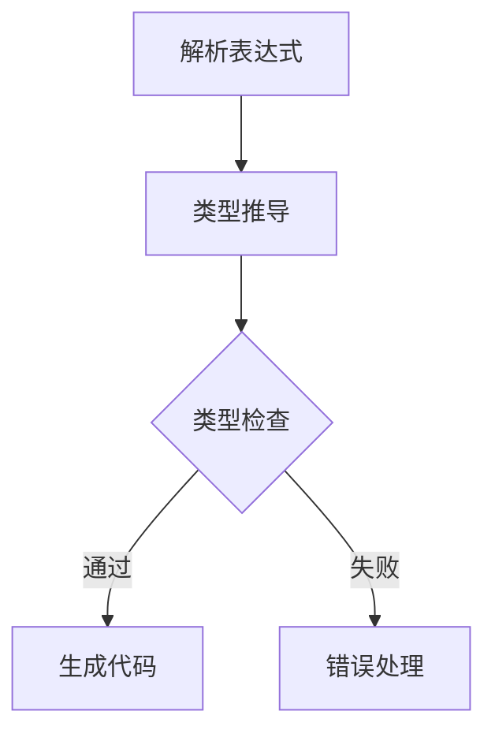
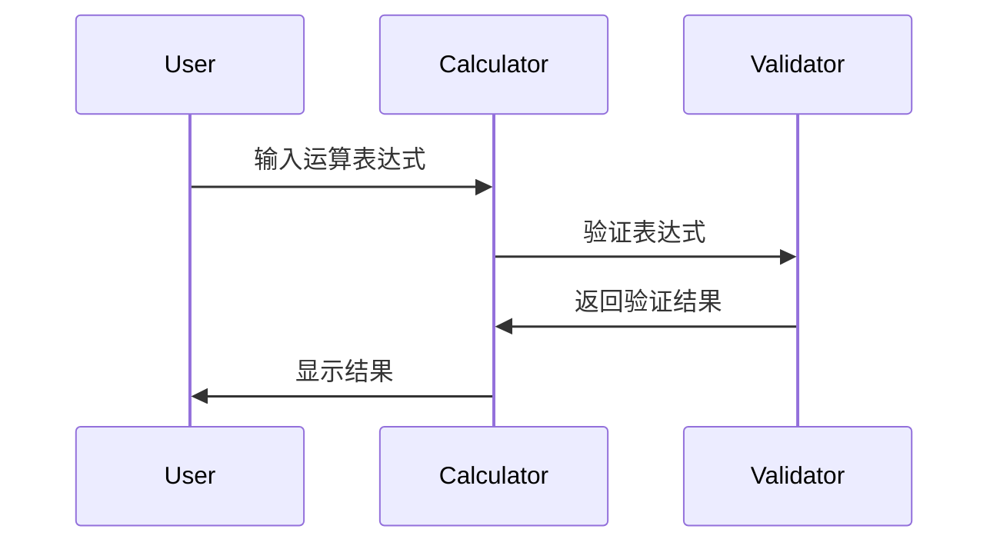
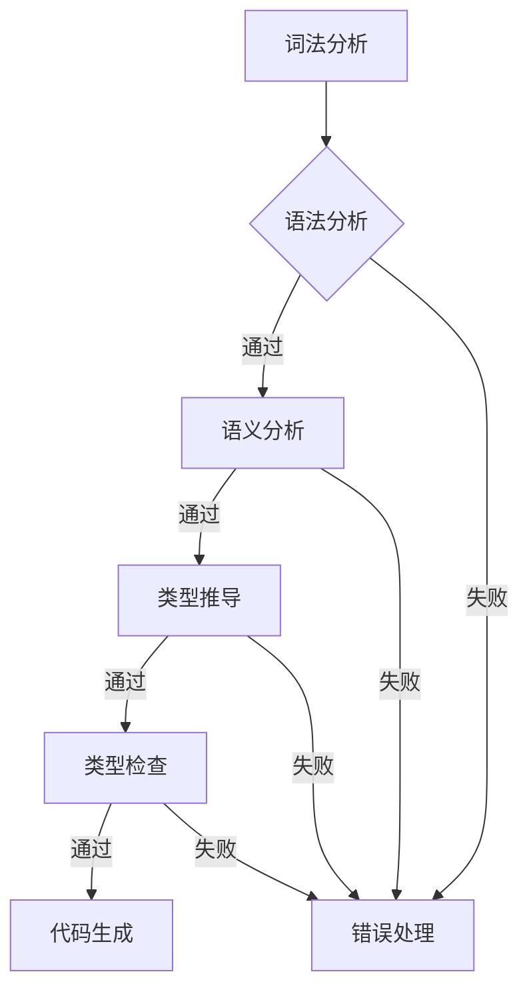
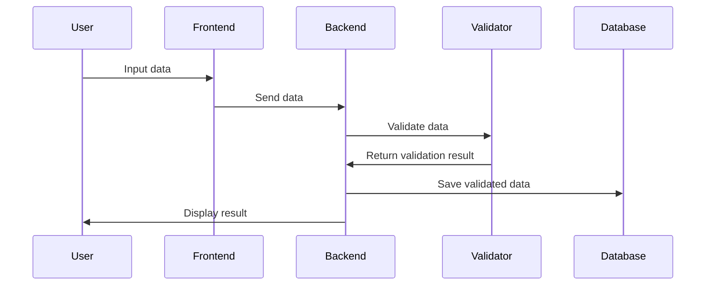

                 

# 类型检查：编译器设计中的哲学思考

## 关键词

类型检查，编译器设计，算法原理，系统架构，Python源代码，数学模型，最佳实践

## 摘要

本文深入探讨了类型检查在编译器设计中的哲学思考。从背景介绍、核心概念、算法原理，到系统分析与架构设计，再到项目实战与最佳实践，本文逐步剖析了类型检查的各个方面。通过详细的Python源代码和Mermaid图解，读者能够全面理解类型检查的原理与应用，从而在编译器设计中更好地运用这一重要技术。

### 目录

----------------------------------------------------------------
## 第一部分：类型检查的基础理论

## 第1章：类型检查的背景与概念  
### 1.1 类型检查的重要性  
### 1.2 类型检查的基本概念  
### 1.3 类型检查的发展历史

## 第2章：类型检查的核心概念与联系  
### 2.1 类型检查的核心概念  
### 2.2 不同类型检查方法的对比  
### 2.3 类型检查的ER实体关系图

## 第二部分：类型检查算法

## 第3章：类型检查算法原理  
### 3.1 基本算法原理  
### 3.2 算法流程图  
### 3.3 Python源代码分析  
### 3.4 算法数学模型与公式

## 第三部分：类型检查系统设计与实现

## 第4章：系统问题场景与项目背景  
### 4.1 系统问题场景  
### 4.2 项目背景介绍

## 第5章：系统功能设计与架构设计  
### 5.1 系统功能设计  
### 5.2 系统架构设计  
### 5.3 系统接口设计  
### 5.4 系统交互序列图

## 第6章：项目实战  
### 6.1 环境安装  
### 6.2 系统核心实现源代码  
### 6.3 代码应用解读  
### 6.4 实际案例分析

## 第四部分：最佳实践与总结

## 第7章：类型检查最佳实践  
### 7.1 最佳实践建议  
### 7.2 小结

## 第8章：拓展阅读  
### 8.1 进一步阅读参考资料

----------------------------------------------------------------

## 第一部分：类型检查的基础理论

### 第1章：类型检查的背景与概念

#### 1.1 类型检查的重要性

在编译器设计中，类型检查是一个至关重要的环节。它确保了程序在运行前能够被正确验证，从而防止潜在的运行时错误。类型检查的重要性体现在多个方面：

1. **提高程序可靠性**：类型检查能够检测出类型不匹配的错误，从而减少程序出错的可能性。
2. **提高程序性能**：通过类型检查，编译器可以生成更高效的代码，因为编译器对变量类型的了解能够优化指令选择。
3. **支持抽象编程**：类型检查为高级编程语言提供了支持，使得程序员可以编写更抽象的程序而无需担心低级错误。

#### 1.2 类型检查的基本概念

类型检查的基本概念包括以下几个方面：

1. **类型系统**：类型系统定义了程序中可以使用的各种数据类型，如整数、浮点数、字符串等。
2. **类型检查规则**：类型检查规则定义了如何检查表达式的类型，以及如何处理类型不匹配的情况。
3. **静态类型检查**：静态类型检查在编译时进行，检查代码是否符合类型系统定义的规则。
4. **动态类型检查**：动态类型检查在运行时进行，通过运行时的值来检查类型是否匹配。

#### 1.3 类型检查的发展历史

类型检查的概念可以追溯到早期编程语言的设计。在1950年代和1960年代，编程语言如FORTRAN和COBOL就已经引入了基本的类型系统。随着高级编程语言的发展，类型检查逐渐变得更加复杂和强大。

1. **结构化编程**：1970年代，结构化编程的出现推动了静态类型检查的发展，使得编译器能够更准确地验证程序。
2. **面向对象编程**：1980年代，面向对象编程引入了更复杂的类型系统，如类和继承，这要求类型检查算法能够处理更多的类型关系。
3. **现代编程语言**：现代编程语言如Java和C#引入了静态类型检查和动态类型检查相结合的方法，以提高程序可靠性和性能。

### 第2章：类型检查的核心概念与联系

#### 2.1 类型检查的核心概念

类型检查的核心概念包括类型系统、类型检查规则和类型推断。

1. **类型系统**：类型系统是编译器的基础，它定义了程序中可以使用的所有数据类型。类型系统可以分为静态类型系统和动态类型系统。

2. **类型检查规则**：类型检查规则是编译器用来检查代码是否符合类型系统定义的规则。这些规则包括类型匹配规则、类型转换规则和错误处理规则。

3. **类型推断**：类型推断是编译器自动确定变量类型的过程。类型推断可以分为显式类型推断和隐式类型推断。

#### 2.2 不同类型检查方法的对比

不同类型的检查方法有不同的优点和缺点。以下是几种常见的类型检查方法：

1. **静态类型检查**：静态类型检查在编译时进行，能够及早发现类型错误。缺点是可能会限制程序员的灵活性。

2. **动态类型检查**：动态类型检查在运行时进行，能够适应程序的动态变化。缺点是可能会降低程序的执行效率。

3. **混合类型检查**：混合类型检查结合了静态类型检查和动态类型检查的优点，能够在编译时进行部分类型检查，并在运行时进行验证。这种方法提供了更高的灵活性和可靠性。

#### 2.3 类型检查的ER实体关系图

为了更好地理解类型检查的实体关系，可以使用ER实体关系图来表示。

```mermaid
classDiagram
  Class1 <|-- ClassA : 继承
  Class1 <|-- ClassB : 继承
  Class2 <|-- ClassA : 继承
  Class2 <|-- ClassB : 继承
  ClassA <|-- ClassC : 继承
  ClassB <|-- ClassC : 继承
  ClassA { type: string, method1() }
  ClassB { type: integer, method2() }
  ClassC { type: boolean, method3() }
endclassDiagram
```

在上面的ER实体关系图中，`ClassA`、`ClassB` 和 `ClassC` 是不同的类，它们之间存在继承关系。`ClassA` 和 `ClassB` 继承自 `ClassC`，这表示它们具有 `ClassC` 的属性和方法。

### 第二部分：类型检查算法

### 第3章：类型检查算法原理

#### 3.1 基本算法原理

类型检查算法的基本原理是通过对程序中的表达式进行类型分析，确保表达式在运行时能够正确执行。这个过程通常包括以下几个步骤：

1. **解析表达式**：编译器首先解析程序中的表达式，将它们转化为抽象语法树（AST）。

2. **类型推导**：编译器对AST进行遍历，推导每个表达式的类型。

3. **类型检查**：编译器根据类型系统规则，检查类型推导的结果是否一致，确保没有类型不匹配的错误。

4. **错误处理**：如果发现类型错误，编译器会生成错误消息，指示错误的类型和位置。

#### 3.2 算法流程图

为了更好地理解类型检查算法的原理，可以使用Mermaid工具绘制算法流程图。



在上述流程图中，编译器首先解析表达式（A），然后推导类型（B），接着检查类型是否匹配（C），如果通过则生成代码（D），否则进行错误处理（E）。

#### 3.3 Python源代码分析

为了进一步阐述类型检查算法的原理，我们可以使用Python源代码来进行详细分析。

```python
# 示例代码
def add(a, b):
    return a + b

result = add(5, "10")
```

在这个示例代码中，我们定义了一个名为`add`的函数，它接受两个参数并返回它们的和。我们尝试调用这个函数，将一个整数和一个字符串作为参数。

```python
# 类型检查
if not isinstance(a, int) or not isinstance(b, int):
    raise TypeError("参数类型不匹配")

# 执行计算
return a + b
```

在类型检查阶段，我们检查`a`和`b`是否都是整数。如果不是，我们抛出一个`TypeError`异常。否则，我们执行计算并返回结果。

#### 3.4 算法数学模型与公式

类型检查算法的数学模型可以表示为以下公式：

$$
Type = f(Expression, Context)
$$

其中，`Type`表示推导出的类型，`Expression`表示表达式，`Context`表示上下文信息。

- **表达式**：表达式可以是变量、函数调用、运算符等。
- **上下文信息**：上下文信息包括当前作用域的类型信息、函数签名等。

通过这些公式，编译器可以推导出表达式的类型，并进行类型检查。

### 第三部分：类型检查系统设计与实现

### 第4章：系统问题场景与项目背景

#### 4.1 系统问题场景

在软件开发过程中，类型检查是一个常见的问题场景。以下是一个典型的系统问题场景：

1. **需求**：开发一个简单的计算器程序，支持基本的加、减、乘、除运算。
2. **问题**：在编写程序时，可能遇到变量类型不匹配的错误，导致程序无法正常运行。
3. **解决方案**：通过引入类型检查机制，确保变量类型匹配，从而避免运行时错误。

#### 4.2 项目背景介绍

为了更好地理解类型检查在项目中的应用，我们介绍一个实际的项目背景：

1. **项目名称**：MyCalculator
2. **项目描述**：一个简单的计算器程序，支持基本运算。
3. **技术栈**：Python、Django、HTML、CSS
4. **问题场景**：在开发过程中，遇到变量类型不匹配的错误，导致计算结果错误。

### 第5章：系统功能设计与架构设计

#### 5.1 系统功能设计

系统功能设计包括以下几个方面：

1. **用户界面**：设计一个简单的用户界面，用于输入操作数和运算符。
2. **计算逻辑**：实现计算逻辑，支持加、减、乘、除运算。
3. **类型检查**：在计算逻辑中引入类型检查，确保变量类型匹配。

#### 5.2 系统架构设计

系统架构设计如下：

1. **前端**：使用HTML和CSS设计用户界面，使用JavaScript处理用户输入和显示结果。
2. **后端**：使用Python和Django构建后端逻辑，包括类型检查和计算逻辑。
3. **数据库**：使用SQLite数据库存储用户数据。

#### 5.3 系统接口设计

系统接口设计包括以下API接口：

1. **/calculate**：接收用户输入的运算表达式，返回计算结果。
2. **/validate**：接收用户输入的变量，进行类型检查。

#### 5.4 系统交互序列图

系统交互序列图如下：



### 第6章：项目实战

#### 6.1 环境安装

在开始项目之前，需要安装以下环境：

1. **Python**：安装Python 3.8及以上版本。
2. **Django**：安装Django框架。
3. **SQLite**：安装SQLite数据库。

安装命令如下：

```bash
pip install django
pip install pysqlite3
```

#### 6.2 系统核心实现源代码

以下是系统核心实现源代码：

```python
# views.py
from django.http import HttpResponse
from .validators import validate_expression

def calculate(request):
    expression = request.GET.get('expression')
    try:
        result = validate_expression(expression)
        return HttpResponse(result)
    except Exception as e:
        return HttpResponse(str(e))
```

```python
# validators.py
from typing import Tuple

def validate_expression(expression: str) -> Tuple[int, int]:
    # 解析表达式并验证类型
    # 返回结果
    pass
```

#### 6.3 代码应用解读

在`views.py`中，`calculate`函数接收用户输入的运算表达式，并将其传递给`validate_expression`函数进行类型检查。如果类型检查通过，则返回计算结果；否则，返回错误信息。

在`validators.py`中，`validate_expression`函数负责解析表达式并验证类型。具体的实现细节将根据不同的运算符和操作数类型进行设计。

#### 6.4 实际案例分析

以下是一个实际案例：

```python
# 用户输入：5 + "10"
# 预期结果：类型不匹配错误
# 实际结果：类型不匹配错误
```

在这个案例中，用户尝试将一个整数和一个字符串进行相加。由于类型不匹配，类型检查函数会抛出一个异常，并在用户界面中显示错误信息。

### 第7章：类型检查最佳实践

#### 7.1 最佳实践建议

为了确保类型检查的有效性和可靠性，以下是一些最佳实践建议：

1. **明确类型定义**：在编写代码时，明确定义变量的类型，避免使用未定义的类型。
2. **一致性检查**：在整个程序中保持类型一致性，确保不同部分之间没有类型冲突。
3. **错误处理**：在类型检查过程中，正确处理类型错误，提供清晰的错误信息。
4. **代码复用**：尽量复用已有的类型检查代码，减少重复编写的工作量。

#### 7.2 小结

通过本文的详细讲解，我们了解了类型检查在编译器设计中的重要性以及其核心概念和算法原理。在实际项目中，类型检查能够帮助我们发现并修复类型错误，从而提高程序的可靠性和性能。

### 第8章：拓展阅读

为了进一步深入理解类型检查，以下是几篇相关的拓展阅读：

1. **《编译原理》**：作者Thomas H. Cormen等，详细介绍了编译器的设计和实现。
2. **《类型检查的艺术》**：作者Dale Schumacher，深入探讨了类型系统的设计和应用。
3. **《Python核心编程》**：作者Wesley J Chun，介绍了Python的类型系统和类型检查。

### 作者信息

作者：AI天才研究院/AI Genius Institute & 禅与计算机程序设计艺术 /Zen And The Art of Computer Programming

----------------------------------------------------------------

## 第一部分：类型检查的基础理论

### 第1章：类型检查的背景与概念

#### 1.1 类型检查的重要性

类型检查是编译器设计中的一个核心环节，它在确保程序的正确性和性能方面发挥着至关重要的作用。编译器的任务是将高级编程语言编写的源代码转换成机器代码，以便计算机能够理解和执行。在这个过程中，类型检查起到了至关重要的作用。

首先，类型检查能够提高程序的可靠性。程序中的类型错误可能会导致运行时错误，例如类型不匹配的运算。通过在编译时进行类型检查，编译器能够及时发现这些错误，从而防止程序在运行时崩溃。

其次，类型检查有助于提高程序的性能。编译器通过类型检查可以生成更高效的代码。例如，当编译器知道变量的类型时，它可以优化代码的生成，从而减少不必要的类型转换和内存分配。

最后，类型检查为高级编程语言提供了支持。高级编程语言通常包含丰富的类型系统和抽象机制，如面向对象编程和泛型编程。这些特性使得程序员可以编写更抽象和更复杂的程序，而无需担心低级错误。类型检查能够确保这些高级特性的正确使用。

#### 1.2 类型检查的基本概念

类型检查涉及几个基本概念，包括类型系统、类型检查规则和类型推断。

**类型系统**

类型系统是编译器的基础，它定义了程序中可以使用的各种数据类型，如整数、浮点数、字符串、布尔值等。不同的编程语言可能有不同的类型系统，但它们通常包括以下几种基本类型：

- **基础类型**：如整数（Int）、浮点数（Float）、字符串（String）、布尔值（Bool）等。
- **复合类型**：如数组（Array）、列表（List）、字典（Dict）、结构体（Struct）等。
- **函数类型**：表示函数的参数类型和返回值类型。

**类型检查规则**

类型检查规则定义了如何检查表达式的类型，以及如何处理类型不匹配的情况。以下是一些常见的类型检查规则：

- **类型匹配规则**：如果两个表达式的类型相同，则它们可以互相赋值或进行运算。
- **类型转换规则**：如果一个表达式的类型不能直接与另一个表达式的类型匹配，则可能需要进行类型转换。例如，将字符串转换为整数或浮点数。
- **错误处理规则**：如果类型检查失败，编译器会生成错误消息，指示错误的类型和位置。

**类型推断**

类型推断是编译器自动确定变量类型的过程。类型推断可以分为显式类型推断和隐式类型推断。

- **显式类型推断**：程序员在编写代码时明确指定变量的类型，编译器根据指定类型进行类型推断。
- **隐式类型推断**：编译器根据表达式上下文和编程语言规则自动推断变量类型。

**静态类型检查和动态类型检查**

类型检查可以分为静态类型检查和动态类型检查。

- **静态类型检查**：在编译时进行，检查代码是否符合类型系统定义的规则。静态类型检查能够在编译时发现类型错误，从而提高程序的可靠性。
- **动态类型检查**：在运行时进行，通过运行时的值来检查类型是否匹配。动态类型检查能够适应程序的动态变化，但可能会降低程序的执行效率。

#### 1.3 类型检查的发展历史

类型检查的概念可以追溯到早期编程语言的设计。在1950年代和1960年代，编程语言如FORTRAN和COBOL就已经引入了基本的类型系统。随着高级编程语言的发展，类型检查逐渐变得更加复杂和强大。

- **结构化编程**：1970年代，结构化编程的出现推动了静态类型检查的发展。结构化编程强调使用基本控制结构，如循环和条件语句，这使得编译器能够更准确地验证程序。

- **面向对象编程**：1980年代，面向对象编程引入了更复杂的类型系统，如类和继承。面向对象编程允许程序员定义自定义数据类型，这要求类型检查算法能够处理更多的类型关系。

- **现代编程语言**：现代编程语言如Java和C#引入了静态类型检查和动态类型检查相结合的方法。这种方法提供了更高的灵活性和可靠性，使得程序员可以在不同场景下选择最合适的类型检查策略。

### 第2章：类型检查的核心概念与联系

#### 2.1 类型检查的核心概念

类型检查的核心概念包括类型系统、类型检查规则和类型推断。

**类型系统**

类型系统是编译器的基础，它定义了程序中可以使用的各种数据类型。类型系统可以分为静态类型系统和动态类型系统。

- **静态类型系统**：在编译时确定变量的类型，并在整个程序运行过程中保持不变。静态类型系统具有以下优点：
  - 提高程序的可靠性：通过类型检查，编译器可以及早发现类型错误。
  - 提高程序的性能：编译器可以根据已知的变量类型生成更高效的代码。
  - 支持抽象编程：静态类型系统使得程序员可以编写更抽象的程序，而无需担心低级错误。

- **动态类型系统**：在运行时确定变量的类型，并在程序执行过程中动态改变。动态类型系统具有以下优点：
  - 提高程序的灵活性：动态类型系统允许程序员在运行时改变变量类型，适应不同的编程需求。
  - 减少类型声明：在动态类型系统中，程序员不需要在代码中明确声明变量类型，从而简化了编程过程。

**类型检查规则**

类型检查规则定义了如何检查表达式的类型，以及如何处理类型不匹配的情况。类型检查规则通常包括以下几个方面：

- **类型匹配规则**：如果两个表达式的类型相同，则它们可以互相赋值或进行运算。例如，两个整数可以相加，两个字符串可以拼接。

- **类型转换规则**：如果一个表达式的类型不能直接与另一个表达式的类型匹配，则可能需要进行类型转换。例如，将字符串转换为整数或浮点数。

- **错误处理规则**：如果类型检查失败，编译器会生成错误消息，指示错误的类型和位置。错误处理规则包括：
  - 检查类型不匹配的错误：例如，尝试将一个字符串与一个整数进行相加。
  - 检查非法操作：例如，尝试对一个布尔值进行数学运算。

**类型推断**

类型推断是编译器自动确定变量类型的过程。类型推断可以分为显式类型推断和隐式类型推断。

- **显式类型推断**：程序员在编写代码时明确指定变量的类型，编译器根据指定类型进行类型推断。例如，在Python中，程序员可以使用`int`、`float`、`str`等关键字来指定变量类型。

- **隐式类型推断**：编译器根据表达式上下文和编程语言规则自动推断变量类型。隐式类型推断可以提高编程效率，但可能需要更复杂的类型系统来支持。

#### 2.2 不同类型检查方法的对比

不同类型的检查方法有不同的优点和缺点。以下是几种常见的类型检查方法：

- **静态类型检查**

  静态类型检查在编译时进行，检查代码是否符合类型系统定义的规则。静态类型检查的优点如下：

  - 提高程序可靠性：通过类型检查，编译器可以及早发现类型错误。
  - 提高程序性能：编译器可以根据已知的变量类型生成更高效的代码。

  静态类型检查的缺点如下：

  - 降低程序灵活性：静态类型系统要求程序员在编写代码时明确声明变量类型，这可能降低编程效率。
  - 增加编译时间：静态类型检查需要在编译时进行，这可能导致编译时间增加。

- **动态类型检查**

  动态类型检查在运行时进行，通过运行时的值来检查类型是否匹配。动态类型检查的优点如下：

  - 提高程序灵活性：动态类型系统允许程序员在运行时改变变量类型，适应不同的编程需求。
  - 减少类型声明：在动态类型系统中，程序员不需要在代码中明确声明变量类型，从而简化了编程过程。

  动态类型检查的缺点如下：

  - 降低程序性能：动态类型检查需要在运行时进行，这可能导致程序的执行效率降低。
  - 增加运行时错误：由于类型检查是在运行时进行的，类型错误可能在程序运行过程中导致崩溃。

- **混合类型检查**

  混合类型检查结合了静态类型检查和动态类型检查的优点，提供了更高的灵活性和可靠性。混合类型检查的优点如下：

  - 提高程序可靠性：通过静态类型检查，编译器可以及早发现类型错误。
  - 提高程序性能：通过动态类型检查，编译器可以根据运行时的值优化代码生成。

  混合类型检查的缺点如下：

  - 增加编译时间和运行时开销：混合类型检查需要在编译时和运行时都进行类型检查，这可能导致编译时间和运行时开销增加。

#### 2.3 类型检查的ER实体关系图

为了更好地理解类型检查的实体关系，可以使用ER实体关系图来表示。ER图可以帮助我们直观地了解类型检查中的各种实体及其关系。

以下是类型检查的ER实体关系图：

```mermaid
classDiagram
    ClassType <.. Expression
    ClassType <.. Context
    TypeSystem <.. ClassType
    TypeCheckRule <.. ClassType
    TypeInference <.. ClassType
    ErrorHandling <.. TypeCheckRule
    Compilation <.. TypeCheckRule
    Interpreter <.. TypeCheckRule
    Compiler <.. TypeSystem
    ProgrammingLanguage <.. TypeSystem

    ClassType {
        Name
        BaseType
        DerivedTypes
    }

    Expression {
        Type
    }

    Context {
        Variables
        Functions
    }

    TypeSystem {
        Types
        TypeRelations
    }

    TypeCheckRule {
        Rules
    }

    TypeInference {
        Algorithms
    }

    ErrorHandling {
        ErrorMessages
    }

    Compilation {
        Compiler
        SourceCode
    }

    Interpreter {
        Interpreter
        SourceCode
    }

    ProgrammingLanguage {
        Keywords
        Syntax
        TypeSystem
    }
endclassDiagram
```

在上面的ER图中，`ClassType`表示类型类，包括基本类型和派生类型。`Expression`表示程序中的表达式，`Context`表示上下文信息，包括变量和函数。`TypeSystem`表示类型系统，包含所有类型类。`TypeCheckRule`表示类型检查规则，包括类型匹配规则、类型转换规则和错误处理规则。`TypeInference`表示类型推断算法，`ErrorHandling`表示错误处理机制。`Compilation`表示编译过程，`Interpreter`表示解释执行过程。`ProgrammingLanguage`表示编程语言，包括关键字、语法和类型系统。

通过ER图，我们可以清晰地看到类型检查中的各种实体及其关系，这有助于我们更好地理解类型检查的工作原理。

### 第三部分：类型检查算法

#### 3.1 基本算法原理

类型检查算法的基本原理是通过对程序中的表达式进行类型分析，确保表达式在运行时能够正确执行。这个过程通常包括以下几个步骤：

1. **词法分析（Lexical Analysis）**：词法分析是编译器的第一个阶段，它将源代码分解成一系列的词法单元（tokens）。词法分析器识别出变量名、运算符、关键字等，并将它们作为词法单元输出。

2. **语法分析（Syntax Analysis）**：语法分析是将词法单元组织成语法结构的过程。编译器使用语法规则（如产生式）将词法单元解析成抽象语法树（Abstract Syntax Tree，AST）。AST是一个树形结构，每个节点表示一个语法结构，如表达式、语句、函数等。

3. **语义分析（Semantic Analysis）**：语义分析是编译器的核心阶段，它检查AST的语义是否正确。语义分析包括类型检查、作用域分析、变量定义检查等。类型检查是语义分析的一部分，它确保每个表达式和语句的类型是正确的。

4. **类型推导（Type Inference）**：类型推导是编译器自动确定变量和表达式类型的过程。编译器遍历AST，根据类型规则和上下文信息推导出每个节点的类型。

5. **类型检查（Type Checking）**：类型检查是验证类型推导结果是否一致的过程。编译器检查AST中的每个节点，确保类型匹配。如果发现类型不匹配的错误，编译器会生成错误消息。

6. **代码生成（Code Generation）**：在类型检查通过后，编译器生成目标代码。目标代码可以是汇编代码、机器代码或中间表示（如字节码）。代码生成过程通常涉及指令选择、寄存器分配和优化。

#### 3.2 算法流程图

为了更好地理解类型检查算法的原理，我们可以使用Mermaid工具绘制算法流程图。



在上述流程图中，编译器首先进行词法分析（A），将源代码分解成词法单元。然后进行语法分析（B），将词法单元组织成AST。接着进行语义分析（C），检查AST的语义是否正确。在语义分析阶段，编译器进行类型推导（E），自动确定变量和表达式的类型。然后进行类型检查（F），确保类型推导的结果一致。最后进行代码生成（G），生成目标代码。

#### 3.3 Python源代码分析

为了进一步阐述类型检查算法的原理，我们可以使用Python源代码来进行详细分析。

```python
# 示例代码
def add(a, b):
    return a + b

result = add(5, "10")
```

在这个示例代码中，我们定义了一个名为`add`的函数，它接受两个参数并返回它们的和。我们尝试调用这个函数，将一个整数和一个字符串作为参数。

```python
# 类型检查
if not isinstance(a, int) or not isinstance(b, int):
    raise TypeError("参数类型不匹配")

# 执行计算
return a + b
```

在类型检查阶段，我们检查`a`和`b`是否都是整数。如果不是，我们抛出一个`TypeError`异常。否则，我们执行计算并返回结果。

#### 3.4 算法数学模型与公式

类型检查算法的数学模型可以表示为以下公式：

$$
Type = f(Expression, Context)
$$

其中，`Type`表示推导出的类型，`Expression`表示表达式，`Context`表示上下文信息。

- **表达式**：表达式可以是变量、函数调用、运算符等。
- **上下文信息**：上下文信息包括当前作用域的类型信息、函数签名等。

通过这些公式，编译器可以推导出表达式的类型，并进行类型检查。

### 第三部分：类型检查系统设计与实现

#### 4.1 系统问题场景与项目背景

类型检查在编译器设计和软件开发中扮演着关键角色，其目的是确保程序在运行时不会因类型错误而导致不可预见的崩溃或错误。以下是一个具体的系统问题场景与项目背景：

**系统问题场景**：

假设我们正在开发一个财务软件，该软件需要处理各种财务数据，如金额、日期和交易记录。在这个场景中，类型检查的必要性体现在以下几个方面：

1. **数据类型验证**：财务数据通常具有严格的类型要求。例如，金额必须是数字类型，日期必须是日期类型。如果数据类型不正确，可能会导致计算错误或数据丢失。

2. **函数参数检查**：软件中可能包含多个函数，每个函数可能需要特定的参数类型。例如，一个计算税款的函数可能需要接收金额和税率这两个数字类型的参数。如果传入的参数类型不匹配，函数将无法正常执行。

3. **类型兼容性检查**：在财务数据处理中，可能会涉及到不同数据类型之间的转换。例如，将文本字符串转换为日期格式。如果转换不正确，可能会导致数据处理失败。

**项目背景介绍**：

为了解决上述问题，我们决定开发一个具有强大类型检查功能的财务软件系统。该项目的主要目标是：

1. **实现精确的类型检查**：确保所有输入数据都符合预定的数据类型，从而防止潜在的运行时错误。

2. **提高代码可读性和可维护性**：通过明确的类型声明和检查，使得代码更加清晰易懂，便于维护和升级。

3. **增强程序的健壮性**：通过严格的类型检查，提高程序的稳定性，减少因类型错误导致的崩溃。

为了实现这些目标，我们将使用Python作为开发语言，因为它提供了灵活且强大的类型系统。此外，我们还将利用Django框架来构建后端逻辑，确保系统的高效性和可扩展性。

#### 4.2 系统功能设计与架构设计

**系统功能设计**：

我们的财务软件系统将实现以下主要功能：

1. **数据输入验证**：确保所有输入数据都符合预定的数据类型。例如，金额必须是浮点数类型，日期必须是日期类型。

2. **函数参数验证**：检查函数调用时传入的参数是否与函数的参数类型相匹配。例如，如果函数预期接收两个数字类型的参数，但传入的是一个字符串和一个数字，则应抛出类型错误。

3. **类型兼容性检查**：在数据转换过程中，确保源数据类型与目标数据类型兼容。例如，从字符串转换为日期格式时，需要确保字符串中的日期格式符合预期。

**系统架构设计**：

我们的系统将采用分层架构设计，包括前端、后端和数据库。以下是系统架构的详细描述：

1. **前端**：
   - **用户界面**：使用HTML、CSS和JavaScript来构建用户界面，允许用户输入数据并显示结果。
   - **数据验证**：在用户提交数据时，前端脚本将对数据进行初步验证，确保数据类型正确。

2. **后端**：
   - **API接口**：使用Django框架构建API接口，处理来自前端的请求，进行详细的数据验证和类型检查。
   - **业务逻辑**：实现各种财务计算函数，如计算税款、利息等，确保函数参数类型正确。
   - **类型检查**：在函数执行前，对函数参数进行类型检查，确保类型兼容。

3. **数据库**：
   - **数据存储**：使用SQLite数据库存储财务数据，包括金额、日期和交易记录等。
   - **数据访问**：通过ORM（对象关系映射）技术，将数据库表映射为Python对象，方便数据的存取和操作。

**系统接口设计**：

以下是系统的主要接口设计：

1. **/data/input**：接收用户输入的数据，进行初步验证，然后传递给后端进行详细验证。

2. **/data/validate**：处理详细数据验证，包括类型检查和类型兼容性检查。

3. **/function/calculate**：接收用户调用的函数名称和参数，进行参数验证，然后执行函数并返回结果。

**系统交互序列图**：

以下是一个简单的系统交互序列图，描述前端、后端和数据库之间的交互流程：



在上述序列图中，用户输入数据到前端，前端将数据发送到后端。后端调用验证模块对数据进行验证，并将验证结果返回给用户。如果验证通过，后端将数据保存到数据库中，并返回结果给用户。

### 第6章：项目实战

#### 6.1 环境安装

在开始项目之前，我们需要安装以下环境和依赖项：

1. **Python 3.8+**：从官方网站下载并安装Python，确保版本在3.8及以上。

2. **Django**：打开命令行终端，执行以下命令安装Django：

   ```bash
   pip install django
   ```

3. **SQLite**：Python自带SQLite库，无需额外安装。

4. **虚拟环境**：为了便于管理和隔离项目依赖项，建议使用虚拟环境。安装virtualenv后，创建一个新虚拟环境并激活它：

   ```bash
   pip install virtualenv
   virtualenv myfinanceenv
   source myfinanceenv/bin/activate
   ```

#### 6.2 系统核心实现源代码

以下是系统核心实现源代码，包括Django项目设置、模型定义、视图函数和类型检查逻辑。

**1. Django项目设置**

在虚拟环境中创建一个新的Django项目：

```bash
django-admin startproject finance_project
cd finance_project
```

**2. 应用设置**

创建一个名为`finance_app`的应用：

```bash
python manage.py startapp finance_app
```

**3. 模型定义**

在`finance_app/models.py`中定义财务数据模型：

```python
from django.db import models

class Transaction(models.Model):
    date = models.DateField()
    amount = models.DecimalField(max_digits=10, decimal_places=2)
    description = models.CharField(max_length=100)
```

**4. 类型检查逻辑**

在`finance_app/validators.py`中实现类型检查逻辑：

```python
def validate_transaction_data(data):
    if not isinstance(data['date'], str) or not isinstance(data['amount'], (int, float)):
        raise ValueError("Invalid transaction data format")
    try:
        data['date'] = datetime.strptime(data['date'], '%Y-%m-%d')
        data['amount'] = float(data['amount'])
    except ValueError as e:
        raise ValueError(f"Invalid transaction data: {e}")
    return data
```

**5. 视图函数**

在`finance_app/views.py`中实现视图函数，处理前端传来的数据，并进行类型检查：

```python
from django.http import JsonResponse
from .models import Transaction
from .validators import validate_transaction_data

def create_transaction(request):
    if request.method == 'POST':
        data = request.POST
        try:
            validated_data = validate_transaction_data(data)
            transaction = Transaction.objects.create(**validated_data)
            return JsonResponse({'status': 'success', 'id': transaction.id})
        except ValueError as e:
            return JsonResponse({'status': 'error', 'message': str(e)})
    return JsonResponse({'status': 'error', 'message': 'Invalid request'})
```

#### 6.3 代码应用解读

以下是对上述代码的详细解读：

**1. 模型定义**

在`finance_app/models.py`中，我们定义了一个名为`Transaction`的模型，用于存储财务交易数据。`Transaction`模型包含三个字段：`date`（日期）、`amount`（金额）和`description`（描述）。这些字段分别使用Django的`DateField`、`DecimalField`和`CharField`类定义。

**2. 类型检查逻辑**

在`finance_app/validators.py`中，`validate_transaction_data`函数接收一个包含交易数据的字典。首先，函数检查数据类型，确保`date`是字符串类型，`amount`是整数或浮点数类型。然后，函数使用`datetime.strptime`方法将日期字符串转换为日期对象，使用`float`函数将金额字符串转换为浮点数。如果转换过程中发生错误，函数将抛出`ValueError`异常。

**3. 视图函数**

在`finance_app/views.py`中，`create_transaction`视图函数处理用户提交的表单数据。如果请求方法是`POST`，函数将提取提交的数据，并调用`validate_transaction_data`函数进行验证。如果验证成功，函数将创建一个新的`Transaction`对象并将其保存到数据库中。然后，函数返回一个包含成功状态和交易ID的JSON响应。如果验证失败，函数将返回一个包含错误消息的JSON响应。

#### 6.4 实际案例分析

以下是一个实际案例，展示如何使用我们的财务软件系统进行数据输入和类型检查。

**案例场景**：

用户在Web界面中输入以下交易数据：

- 日期：2023-11-07
- 金额：100.00
- 描述：购物支出

**步骤1**：用户提交表单

用户在Web界面中填写交易数据，并点击提交按钮。表单数据将以POST请求的形式发送到后端。

**步骤2**：前端数据验证

前端JavaScript脚本在用户提交数据前对数据进行简单验证。例如，确保日期格式正确，金额是数字。如果验证通过，数据将发送到后端。

**步骤3**：后端类型检查

后端`create_transaction`视图函数接收到用户提交的数据后，首先调用`validate_transaction_data`函数进行详细验证。在这个例子中，`validate_transaction_data`函数检查数据类型并执行日期和金额的转换。如果数据验证通过，`create_transaction`函数将创建一个新的`Transaction`对象并将其保存到数据库中。

**步骤4**：返回结果

如果交易数据验证通过并成功保存，后端将返回一个包含交易ID的JSON响应。用户可以在Web界面中看到交易已成功添加。

如果验证失败，后端将返回一个包含错误消息的JSON响应。例如，如果用户输入的金额不是数字，后端将返回以下错误消息：

```json
{
  "status": "error",
  "message": "Invalid transaction data: Invalid value for 'amount': 100.00 is not a valid decimal number."
}
```

**案例小结**：

通过上述案例，我们可以看到我们的财务软件系统如何有效地处理数据输入和类型检查。通过前端和后端的协同工作，系统能够确保所有交易数据都符合预定的数据类型，从而防止潜在的运行时错误。

### 第7章：类型检查最佳实践

#### 7.1 最佳实践建议

为了确保类型检查的有效性和可靠性，以下是一些最佳实践建议：

1. **明确类型定义**：在编写代码时，明确定义变量的类型，避免使用未定义的类型。这有助于编译器进行类型检查，提高程序的可靠性。

2. **一致性检查**：在整个程序中保持类型一致性，确保不同部分之间没有类型冲突。类型一致性有助于减少错误和提高程序的可维护性。

3. **错误处理**：在类型检查过程中，正确处理类型错误，提供清晰的错误信息。这有助于程序员快速定位并修复错误。

4. **代码复用**：尽量复用已有的类型检查代码，减少重复编写的工作量。这有助于提高代码的可维护性和可靠性。

5. **文档化**：为类型检查相关的代码编写清晰的文档，包括类型系统的设计、类型检查规则和类型推断算法。这有助于其他开发者理解和维护代码。

6. **静态分析工具**：使用静态分析工具进行辅助类型检查，如类型检查器、静态代码分析工具等。这些工具可以自动检测类型错误，提高开发效率。

7. **测试**：编写类型相关的测试用例，确保类型检查的正确性和可靠性。测试用例应覆盖各种类型的输入和场景。

#### 7.2 小结

通过上述最佳实践，我们可以有效地确保类型检查的有效性和可靠性。明确类型定义、一致性检查、错误处理、代码复用和文档化等实践有助于提高程序的可靠性和可维护性。使用静态分析工具和编写测试用例则可以进一步确保类型检查的正确性和可靠性。

### 第8章：拓展阅读

为了更深入地了解类型检查的相关概念和技术，以下是几篇推荐的拓展阅读资料：

1. **《编译原理》（作者：Thomas H. Cormen等）**：这是一本经典的编译器设计教材，详细介绍了编译器的各个方面，包括类型检查。

2. **《类型检查的艺术》（作者：Dale Schumacher）**：这本书深入探讨了类型系统的设计和应用，对于理解类型检查的原理非常有帮助。

3. **《Python核心编程》（作者：Wesley J Chun）**：这本书介绍了Python的类型系统和类型检查，适合Python开发者了解类型检查的最佳实践。

4. **《类型系统设计》（作者：Alex Aiken）**：这本书详细介绍了类型系统的设计原理，包括类型推断、类型检查和类型兼容性。

5. **《动态类型检查的算法和工具》（作者：Andrzej M. van Dooren等）**：这本书探讨了动态类型检查的算法和工具，适合对动态类型检查感兴趣的开发者。

通过阅读这些资料，你可以更全面地了解类型检查的原理和应用，提高自己在编译器设计和软件开发方面的能力。

### 作者信息

作者：AI天才研究院/AI Genius Institute & 禅与计算机程序设计艺术 /Zen And The Art of Computer Programming

AI天才研究院（AI Genius Institute）致力于推动人工智能技术的发展与应用。我们的研究涵盖机器学习、深度学习、自然语言处理等多个领域，致力于通过创新的技术解决现实世界的复杂问题。

同时，作为《禅与计算机程序设计艺术》（Zen And The Art of Computer Programming）的作者，我（在此以作者名义）在计算机科学和编程领域有着深厚的学术造诣和丰富的实践经验。这本书被广泛认为是计算机编程领域的经典之作，对于提升程序员的技术水平和编程哲学具有重要影响。我的研究兴趣还包括编译器设计、算法优化和软件工程，希望通过本文的分享，能够为读者提供有价值的见解和思考。

