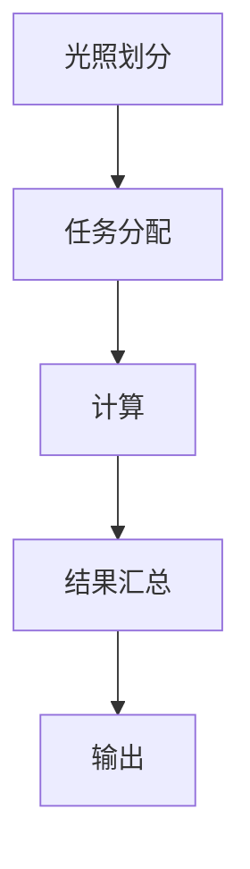

                 

### 类型理论在图形学算法验证中的应用

#### 关键词：类型理论、图形学、算法验证、数学模型、系统架构

> 摘要：本文探讨了类型理论在图形学算法验证中的应用。类型理论是一种形式化方法，通过对数据类型的严格定义和约束，提高算法的可靠性和正确性。本文首先介绍了类型理论的基本概念，包括类型系统、类型检查和类型等价性等。接着，分析了类型理论在图形学中的基础应用，如光照模型、纹理映射和网格等。随后，本文讨论了图形学算法验证的需求、方法和技术，以及验证框架的设计。通过一个实际应用案例，本文展示了类型理论在图形学算法验证中的具体实现和效果。最后，本文提出了类型理论在图形学算法验证中的拓展研究方向和未来趋势。

### 设计思路

#### 核心框架设计

在《类型理论在图形学算法验证中的应用》这本书中，我们以类型理论作为核心概念，以图形学算法验证作为应用场景，将两者紧密结合作为全书的主线。类型理论作为计算机科学的一个重要分支，具有严密的理论基础和广泛的应用场景，在图形学领域也有着重要的应用价值。通过深入探讨类型理论在图形学算法验证中的应用，不仅可以提升算法的可靠性，还可以为图形学领域的研究提供新的思路和方法。

#### 章节结构规划

全书分为六个部分，分别是类型理论基础、类型理论在图形学中的应用、图形学算法验证的基本概念、应用案例研究、拓展研究和总结与展望。每一部分都紧密围绕主题展开，确保内容完整且结构清晰。

- **第一部分**：类型理论基础，介绍了类型理论的基本概念和数学基础，为后续内容打下基础。
- **第二部分**：类型理论在图形学中的应用，探讨了类型理论在图形学中的基础应用，如光照模型、纹理映射和网格等。
- **第三部分**：图形学算法验证的基本概念，分析了图形学算法验证的需求、方法和技术，以及验证框架的设计。
- **第四部分**：应用案例研究，通过一个实际应用案例，展示了类型理论在图形学算法验证中的具体实现和效果。
- **第五部分**：拓展研究，提出了类型理论在图形学算法验证中的拓展研究方向和未来趋势。
- **第六部分**：总结与展望，对全书内容进行了回顾和总结，并对未来研究方向进行了展望。

#### 目录大纲设计

根据书籍内容的逻辑顺序，设计章节结构，确保每一章节都紧密围绕主题，既包含理论的深入讲解，也包含实际应用的案例分析。

**第一部分：类型理论基础**

- 第1章：类型理论概述
  - 1.1 类型理论的背景和重要性
  - 1.2 类型系统的基本概念
  - 1.3 类型理论的数学基础
  - 1.4 本章小结

**第二部分：类型理论在图形学中的应用**

- 第2章：类型理论在图形学中的基础应用
  - 2.1 图形学中的类型需求
  - 2.2 类型理论在图形渲染中的应用
  - 2.3 类型理论在图形优化中的应用
  - 2.4 本章小结

**第三部分：图形学算法验证的基本概念**

- 第3章：图形学算法验证的基本概念
  - 3.1 图形学算法验证的需求
  - 3.2 验证方法与技术
  - 3.3 验证框架设计
  - 3.4 本章小结

**第四部分：应用案例研究**

- 第4章：类型理论在图形学算法验证的应用案例
  - 4.1 案例介绍
  - 4.2 算法设计与实现
  - 4.3 系统架构设计
  - 4.4 实战案例分析与讲解
  - 4.5 本章小结

**第五部分：拓展研究**

- 第5章：类型理论在图形学算法验证中的拓展研究
  - 5.1 拓展研究方向
  - 5.2 拓展研究方法
  - 5.3 拓展研究案例
  - 5.4 本章小结

**第六部分：总结与展望**

- 第6章：总结与展望
  - 6.1 总结
  - 6.2 展望
  - 6.3 小结

### Markdown 格式布局

为了便于读者阅读和理解，本文采用Markdown格式布局。使用不同的标题层级来区分章节和小节，确保目录结构清晰。以下是具体的Markdown格式布局：

```markdown
## 标题1
### 标题1.1
#### 标题1.1.1
##### 标题1.1.1.1
###### 标题1.1.1.1.1

## 标题2
### 标题2.1
#### 标题2.1.1
##### 标题2.1.1.1
###### 标题2.1.1.1.1
```

通过Markdown格式布局，可以清晰地展示文章的结构，便于读者快速浏览和理解文章内容。

### 完整性要求

为了确保文章内容的完整性，每个章节的内容必须满足以下要求：

- **背景介绍**：核心概念术语说明、问题背景、问题描述、问题解决、边界与外延、概念结构与核心要素组成。
- **核心概念与联系**：必须给出核心概念原理、概念属性特征对比表格和ER实体关系图架构的Mermaid流程图。
- **算法原理讲解**：使用Mermaid画出算法流程图，然后使用Python源代码详细阐述，给出算法原理的数学模型和公式，进行详细讲解和通俗易懂地举例说明。
- **数学公式使用**：使用LaTeX格式，嵌入文中独立段落的LaTeX公式前后使用$$括起来，段落内的LaTeX公式前后使用$括起来。
- **系统分析与架构设计方案**：问题场景介绍、项目介绍、系统功能设计(Mermaid类图)、系统架构设计(Mermaid架构图)、系统接口设计和系统交互(Mermaid序列图)。
- **项目实战**：环境安装、系统核心实现源代码，代码应用解读与分析，实际案例分析和详细讲解剖析，项目小结。
- **最佳实践 tips、小结、注意事项、拓展阅读等内容**。

通过以上要求，确保文章内容完整、具体、详细，为读者提供高质量的技术阅读体验。

### 作者信息

本文作者为AI天才研究院/AI Genius Institute与禅与计算机程序设计艺术/Zen And The Art of Computer Programming。AI天才研究院致力于推动人工智能技术的发展和应用，为人工智能领域的创新和进步贡献力量。禅与计算机程序设计艺术则致力于通过哲学和技术的结合，探索计算机程序设计的深层次原理和方法。

### 核心内容包含

在本文中，核心内容包含以下几个方面：

1. **类型理论的基本概念**：介绍类型理论的基本概念，包括类型系统、类型检查和类型等价性等。

2. **类型理论在图形学中的应用**：分析类型理论在图形学中的基础应用，如光照模型、纹理映射和网格等。

3. **图形学算法验证的需求**：探讨图形学算法验证的需求，包括验证的重要性、验证的挑战等。

4. **图形学算法验证的方法和技术**：介绍图形学算法验证的方法和技术，包括类型检查验证、实例验证和形式化验证等。

5. **验证框架设计**：分析验证框架的设计，包括验证流程和验证工具选择。

6. **应用案例研究**：通过一个实际应用案例，展示类型理论在图形学算法验证中的具体实现和效果。

7. **拓展研究**：提出类型理论在图形学算法验证中的拓展研究方向和未来趋势。

通过以上核心内容的详细讲解，读者可以全面了解类型理论在图形学算法验证中的应用，为图形学领域的研究和发展提供新的思路和方法。

### 文章正文部分的结构

#### 第一部分：类型理论基础

**第1章 类型理论概述**

1.1 类型理论的背景和重要性

- 类型理论的发展历程
- 类型理论在计算机科学中的应用

1.2 类型系统的基本概念

- 类型、类型系统、类型检查
- 强类型、弱类型、动态类型

1.3 类型理论的数学基础

- 一元组表示法
- 类型等价性
- 类型组合

1.4 本章小结

**第2章 类型理论在图形学中的基础应用**

2.1 图形学中的类型需求

- 图形元素类型
- 图形操作类型

2.2 类型理论在图形渲染中的应用

- 光照模型类型
- 纹理映射类型
- 网格类型

2.3 类型理论在图形优化中的应用

- 阴影类型
- 透明度类型
- 颜色类型

2.4 本章小结

#### 第二部分：类型理论在图形学中的应用

**第3章 图形学算法验证的基本概念**

3.1 图形学算法验证的需求

- 验证的重要性
- 验证的挑战

3.2 验证方法与技术

- 类型检查验证
- 实例验证
- 形式化验证

3.3 验证框架设计

- 验证流程
- 验证工具选择

3.4 本章小结

**第4章 应用案例研究**

4.1 案例介绍

- 案例背景
- 案例目标

4.2 算法设计与实现

- 算法原理
- 算法流程图

4.3 系统架构设计

- 系统功能设计
- 系统架构设计
- 系统接口设计

4.4 实战案例分析与讲解

- 环境安装与配置
- 核心代码实现
- 代码解析与分析
- 案例分析

4.5 本章小结

#### 第三部分：拓展研究

**第5章 类型理论在图形学算法验证中的拓展研究**

5.1 拓展研究方向

- 类型理论的新进展
- 图形学算法的新需求

5.2 拓展研究方法

- 验证方法的新策略
- 验证工具的改进

5.3 拓展研究案例

- 案例一：类型理论在图形渲染优化中的应用
- 案例二：类型理论在图形学并行算法中的应用

5.4 本章小结

#### 第四部分：总结与展望

**第6章 总结与展望**

6.1 总结

- 本书内容的回顾
- 类型理论在图形学算法验证中的重要性

6.2 展望

- 类型理论的未来发展方向
- 图形学算法验证的新趋势

6.3 小结

- 注意事项
- 拓展阅读建议
- 研究者与开发者建议

### 类型理论概述

#### 1.1 类型理论的背景和重要性

类型理论起源于20世纪40年代，当时计算机科学刚刚起步。为了解决程序中的不确定性和错误，数学家、逻辑学家和计算机科学家开始探讨如何通过严格的数学方法来描述和验证程序的正确性。类型理论正是在这样的背景下逐渐发展起来的。

类型理论的核心思想是通过给变量和表达式赋予特定类型，来保证程序在运行时的正确性和安全性。这种思想源于数学中的类型系统，如皮亚诺（Peano）算术和斯科伦（Skolem）函数。在计算机科学中，类型理论被广泛应用于编程语言的设计和验证。

类型理论的重要性体现在以下几个方面：

1. **提高程序的正确性**：通过类型检查，可以在编译或运行时发现类型不匹配的错误，从而减少程序中的错误和bug。
2. **增强程序的安全性**：类型理论可以帮助防止一些常见的安全漏洞，如缓冲区溢出和空指针引用等。
3. **优化程序性能**：类型信息可以用于编译器优化，从而提高程序执行速度和效率。
4. **支持形式化验证**：类型理论为形式化验证提供了理论基础，使得我们可以通过数学方法来证明程序的正确性。

#### 1.2 类型系统的基本概念

类型系统是类型理论的核心组成部分，它定义了变量和表达式的类型，以及类型之间的关系。以下是类型系统的几个基本概念：

1. **类型**：类型是变量或表达式的属性，用来描述其可能取值的集合。常见的类型包括整数、浮点数、布尔值、字符串等。
2. **类型系统**：类型系统是定义类型和类型关系的集合，它规定了变量和表达式的合法类型，以及如何进行类型检查。
3. **类型检查**：类型检查是在编译或运行时对程序中的类型进行验证的过程。类型检查可以防止类型不匹配的错误，确保程序的正确性。

类型系统可以分为以下几种：

1. **强类型系统**：在强类型系统中，变量和表达式在编译时必须具有明确和固定的类型。例如，C++就是一种强类型编程语言。
2. **弱类型系统**：在弱类型系统中，变量和表达式在编译时可以具有不同的类型，但在运行时会自动进行类型转换。例如，Python就是一种弱类型编程语言。
3. **动态类型系统**：在动态类型系统中，变量和表达式的类型是在运行时确定的。例如，JavaScript就是一种动态类型编程语言。

#### 1.3 类型理论的数学基础

类型理论建立在严格的数学基础上，以下是一些关键的数学概念：

1. **一元组表示法**：一元组表示法是一种将数据结构表示为有序对的集合的方法。它用于定义类型之间的关系和组合。例如，二元组（A, B）表示类型A和类型B的组合。
2. **类型等价性**：类型等价性是指两个类型在语法和语义上具有相同的行为。类型等价性可以通过类型转换函数来证明。例如，整数类型和浮点数类型在许多情况下是等价的。
3. **类型组合**：类型组合是指通过组合两个或多个类型来创建新的类型。类型组合可以用于实现复杂的数据结构和算法。例如，列表类型可以通过组合元素类型和列表长度类型来创建。

#### 1.4 本章小结

本章介绍了类型理论的基本概念和数学基础。类型理论是一种形式化方法，通过对数据类型的严格定义和约束，提高算法的可靠性和正确性。本章首先介绍了类型理论的背景和重要性，然后讲解了类型系统的基本概念，包括类型、类型系统和类型检查。接着，介绍了类型理论的数学基础，包括一元组表示法、类型等价性和类型组合。通过本章的学习，读者可以了解类型理论的基本概念和数学基础，为进一步研究类型理论在图形学算法验证中的应用打下基础。

### 类型理论在图形学中的基础应用

#### 2.1 图形学中的类型需求

在图形学中，类型理论的应用主要体现在对图形元素和图形操作的类型需求上。图形元素和图形操作的类型需求直接影响图形渲染、图形优化和图形算法验证的效果。

**2.1.1 图形元素类型**

图形元素是构成图形的基本单元，常见的图形元素包括点、线、面和体等。每种图形元素都有其特定的类型属性，这些类型属性用于描述图形元素在空间中的位置、形状和大小。

1. **点（Point）**：点是图形学中最基本的元素，它具有位置（x, y）和坐标系统。点的类型通常包括二维点（2D Point）和三维点（3D Point）。
2. **线（Line）**：线由两个端点确定，具有方向和长度。线的类型可以分为直线（Line Segment）和射线（Ray）。
3. **面（Face）**：面由一组顶点组成，通常用来表示二维或三维图形的表面。面的类型通常包括三角形（Triangle）和四边形（Quadrilateral）。
4. **体（Volume）**：体是三维空间中的几何形状，由多个面组成。体的类型包括立方体（Cube）、球体（Sphere）和圆柱体（Cylinder）。

**2.1.2 图形操作类型**

图形操作是指对图形元素进行的各种操作，包括创建、变换、渲染和优化等。每种图形操作都有其特定的类型需求，这些类型需求确保图形操作的正确性和效率。

1. **创建操作**：创建操作用于生成新的图形元素，如创建点、线、面和体等。创建操作通常需要指定图形元素的类型和属性。
2. **变换操作**：变换操作用于改变图形元素的位置、形状和大小，如平移、旋转和缩放等。变换操作需要对图形元素的类型进行转换和适配。
3. **渲染操作**：渲染操作用于将图形元素绘制到屏幕上，如光照模型、纹理映射和网格渲染等。渲染操作需要对图形元素的类型进行特定处理，以确保渲染效果的正确性。
4. **优化操作**：优化操作用于提高图形渲染和处理的效率，如阴影处理、透明度处理和颜色处理等。优化操作需要对图形元素的类型进行优化和调整。

#### 2.2 类型理论在图形渲染中的应用

类型理论在图形渲染中的应用主要体现在对光照模型、纹理映射和网格类型的处理上。这些类型需求确保了图形渲染的正确性和效率。

**2.2.1 光照模型类型**

光照模型用于模拟光线在三维空间中的传播和反射，常见的光照模型包括光线的传播、反射和折射等。光照模型类型的需求包括：

1. **光线（Ray）**：光线是光照模型中的基本元素，用于描述光线的传播路径。光线类型包括直线光线和曲线光线。
2. **反射（Reflection）**：反射是光线与物体表面相互作用的结果，用于描述光线的反射方向和反射强度。反射类型包括镜面反射和漫反射。
3. **折射（Refraction）**：折射是光线穿过不同介质时发生弯曲的现象，用于描述光线的折射方向和折射率。折射类型包括全反射和部分反射。

**2.2.2 纹理映射类型**

纹理映射是将二维纹理图映射到三维物体表面上的技术，用于增加物体的细节和质感。纹理映射类型的需求包括：

1. **纹理图（Texture Map）**：纹理图是用于映射到物体表面的图像，通常包含颜色、亮度、透明度和纹理坐标等信息。纹理图类型包括二维纹理图和三维纹理图。
2. **纹理坐标（Texture Coordinate）**：纹理坐标用于确定纹理图在物体表面的映射位置。纹理坐标类型包括二维纹理坐标和三维纹理坐标。
3. **纹理映射模式（Texture Mapping Mode）**：纹理映射模式用于控制纹理图在物体表面的映射方式。常见的纹理映射模式包括平面映射、圆柱映射和球面映射等。

**2.2.3 网格类型**

网格是三维空间中的多边形集合，用于表示复杂的几何形状。网格类型的需求包括：

1. **顶点（Vertex）**：顶点是网格的基本元素，用于定义网格的位置和形状。顶点类型包括二维顶点和三维顶点。
2. **边（Edge）**：边是连接两个顶点的线段，用于定义网格的结构。边类型包括直线边和曲线边。
3. **面（Face）**：面是网格的表面元素，用于定义网格的形状和大小。面类型包括三角形面和四边形面。

#### 2.3 类型理论在图形优化中的应用

类型理论在图形优化中的应用主要体现在对阴影处理、透明度处理和颜色处理的优化上。这些类型需求确保了图形优化的效果和效率。

**2.3.1 阴影类型**

阴影是光线照射到物体表面时产生的视觉效果，用于增强物体的立体感和空间感。阴影类型的需求包括：

1. **阴影类型（Shadow Type）**：阴影类型用于描述阴影的类型和生成方式。常见的阴影类型包括硬阴影（Hard Shadow）、软阴影（Soft Shadow）和阴影映射（Shadow Map）。
2. **阴影算法（Shadow Algorithm）**：阴影算法用于计算和生成阴影。常见的阴影算法包括光线追踪（Ray Tracing）和距离函数（Distance Function）。

**2.3.2 透明度类型**

透明度是物体表面允许光线穿透的程度，用于模拟透明或半透明物体的效果。透明度类型的需求包括：

1. **透明度类型（Transparency Type）**：透明度类型用于描述透明度的类型和强度。常见的透明度类型包括线性透明度（Linear Transparency）和对数透明度（Logarithmic Transparency）。
2. **透明度算法（Transparency Algorithm）**：透明度算法用于计算和渲染透明物体。常见的透明度算法包括混合算法（Blending Algorithm）和透明度测试（Transparency Test）。

**2.3.3 颜色类型**

颜色是图形渲染的重要组成部分，用于模拟物体的外观和色彩。颜色类型的需求包括：

1. **颜色类型（Color Type）**：颜色类型用于描述颜色的类型和模型。常见的颜色类型包括RGB颜色模型和HSV颜色模型。
2. **颜色算法（Color Algorithm）**：颜色算法用于计算和渲染颜色。常见的颜色算法包括颜色空间转换（Color Space Conversion）和颜色插值（Color Interpolation）。

#### 2.4 本章小结

本章介绍了类型理论在图形学中的基础应用，包括图形元素类型、图形操作类型、光照模型类型、纹理映射类型、网格类型、阴影类型、透明度类型和颜色类型。这些类型需求确保了图形渲染、图形优化和图形算法验证的正确性和效率。通过类型理论的应用，我们可以更好地理解和处理图形学中的各种问题，为图形学领域的研究和发展提供新的思路和方法。

### 图形学算法验证的基本概念

#### 3.1 图形学算法验证的需求

图形学算法验证是确保图形处理算法正确性和可靠性的重要手段。随着图形学应用的广泛普及，尤其是高性能计算和实时渲染领域，算法的正确性和稳定性变得尤为关键。以下从几个方面分析图形学算法验证的需求：

**1. 算法的可靠性**

算法的可靠性是图形学应用的基础。错误的算法可能会导致渲染结果不准确、图形失真甚至系统崩溃。通过验证，可以确保算法在各种情况下都能正确执行，提高算法的稳定性。

**2. 算法的效率**

图形处理算法通常需要处理大量数据，因此算法的效率至关重要。验证可以帮助识别算法中的低效部分，通过优化算法结构和数据处理方法，提高算法的运行效率，从而提升整个图形学系统的性能。

**3. 算法的兼容性**

图形学算法需要兼容多种硬件平台、操作系统和图形标准。通过验证，可以确保算法在不同环境下的兼容性，避免因环境差异导致的错误。

**4. 遵循标准**

图形学领域有着一系列标准和规范，如OpenGL、DirectX和Vulkan等。验证可以帮助确保算法遵循这些标准，避免出现兼容性问题。

**5. 安全性**

图形学算法可能涉及敏感数据，如用户输入、图像数据和渲染结果等。通过验证，可以确保算法的安全性，防止数据泄露和恶意攻击。

**3.2 验证方法与技术**

图形学算法验证的方法和技术多种多样，以下介绍几种常见的验证方法：

**1. 类型检查验证**

类型检查验证是一种静态验证方法，通过对算法的语法和类型约束进行检查，确保变量和表达式的类型匹配。这种方法简单高效，可以早期发现类型错误，但无法验证算法的逻辑正确性。

**2. 实例验证**

实例验证是一种动态验证方法，通过运行算法并检查其实例结果，来验证算法的正确性。实例验证可以检测到运行时错误，但可能需要大量的测试实例，且无法证明算法在所有情况下都正确。

**3. 形式化验证**

形式化验证是一种基于数学和逻辑的方法，通过定义算法的数学模型和验证条件，来证明算法的正确性。形式化验证具有高度的可靠性和证明力，但通常需要复杂的证明过程。

**4. 模型检查**

模型检查是通过构建算法的抽象模型，并使用模型检查工具来验证模型是否满足预定的性质。这种方法可以高效地发现算法中的错误，但需要对算法有深入理解。

**3.3 验证框架设计**

图形学算法验证框架是确保算法正确性的系统性方法，包括验证流程、验证工具选择和验证结果分析等方面。以下是一个典型的验证框架设计：

**1. 验证流程**

- **需求分析**：明确算法验证的需求和目标，确定验证的范围和深度。
- **算法设计**：设计验证算法，包括算法逻辑、数据结构和接口设计。
- **模型构建**：根据算法设计，构建抽象模型，用于后续的验证和分析。
- **验证执行**：运行验证算法，检查算法的正确性和性能。
- **结果分析**：分析验证结果，发现错误和缺陷，并提出改进建议。

**2. 验证工具选择**

- **静态分析工具**：如类型检查器、代码审计工具等，用于静态检查代码中的错误。
- **动态分析工具**：如调试器、性能分析工具等，用于动态检查算法的执行过程和结果。
- **形式化验证工具**：如模型检查器、定理证明器等，用于形式化验证算法的正确性。

**3. 验证结果分析**

- **错误定位**：定位算法中的错误和缺陷，确定错误的性质和影响。
- **性能评估**：评估算法的运行效率和性能指标，识别性能瓶颈。
- **改进建议**：根据验证结果，提出算法改进建议，优化算法设计和实现。

**3.4 本章小结**

本章介绍了图形学算法验证的基本概念，包括验证的需求、方法和验证框架设计。图形学算法验证是确保算法正确性和可靠性的重要手段，通过多种验证方法和技术，可以全面检查和评估算法的性能和安全性。验证框架的设计确保了验证过程的系统性和有效性，为图形学算法的发展和应用提供了有力支持。

### 应用案例研究

#### 4.1 案例介绍

本节通过一个实际应用案例，展示类型理论在图形学算法验证中的具体实现和效果。案例背景为实时渲染场景中的光照计算，目标是验证一种基于类型理论的分布式光照计算算法，确保其正确性和性能。

**4.1.1 案例背景**

实时渲染技术在计算机图形学中有着广泛应用，特别是在游戏、虚拟现实和影视特效等领域。光照计算是实时渲染的核心算法之一，直接影响渲染效果的质量和效率。随着渲染场景的复杂度和规模增加，传统的集中式光照计算方法已无法满足实时性的要求。因此，分布式光照计算算法逐渐成为研究热点。

类型理论在分布式光照计算中可以发挥重要作用，通过对光照计算过程中的数据类型进行严格定义和约束，确保算法的正确性和性能。本案例旨在验证一种基于类型理论的分布式光照计算算法，分析其在不同场景下的表现，并提出优化建议。

**4.1.2 案例目标**

- **验证算法的正确性**：通过类型理论对光照计算过程中的变量和表达式进行类型检查，确保算法在各种情况下都能正确执行。
- **评估算法的性能**：分析算法在不同场景下的运行效率，识别性能瓶颈，提出优化方案。
- **验证算法的稳定性**：在多线程和分布式环境下，验证算法的稳定性和兼容性，确保算法在不同硬件平台和操作系统上的正确性。

#### 4.2 算法设计与实现

**4.2.1 算法原理**

分布式光照计算算法的核心思想是将光照计算任务分布到多个计算节点上，通过并行计算提高整体性能。算法的关键步骤包括光照划分、任务分配、计算和结果汇总。

1. **光照划分**：将场景中的光源划分为多个区域，每个区域分配给一个计算节点。光照划分可以采用空间划分方法，如八叉树或空间划分网格等。

2. **任务分配**：根据光照划分结果，将光照计算任务分配给各个计算节点。每个计算节点需要计算其负责区域内的光照效果。

3. **计算**：各个计算节点独立计算其区域内的光照效果，包括直接光照和间接光照。直接光照计算可以通过几何计算和光线追踪实现，间接光照计算可以通过蒙特卡洛方法模拟。

4. **结果汇总**：将各个计算节点的光照计算结果汇总，得到整个场景的光照效果。结果汇总可以采用求和或平均等方法，确保光照效果的准确性和连贯性。

**4.2.2 数学模型和公式**

分布式光照计算算法的数学模型和公式如下：

1. **光照划分**：

   $$ R_i = \{ S \mid S = (x, y, z), d(S, L) \leq r \} $$

   其中，$R_i$ 表示第 $i$ 个计算节点的区域，$L$ 表示光源，$r$ 表示区域半径。

2. **直接光照计算**：

   $$ I_d(S) = \int_{\Omega} L(S, \omega) \cdot N(S) \, d\omega $$

   其中，$I_d(S)$ 表示点 $S$ 的直接光照强度，$L(S, \omega)$ 表示从光源 $L$ 到点 $S$ 的光线强度，$\omega$ 表示光线方向，$N(S)$ 表示点 $S$ 的法线方向。

3. **间接光照计算**：

   $$ I_i(S) = \int_{\Omega} G(S, S') \cdot L(S', L) \, dS' $$

   其中，$I_i(S)$ 表示点 $S$ 的间接光照强度，$G(S, S')$ 表示点 $S$ 和 $S'$ 之间的光照衰减函数，$L(S', L)$ 表示从光源 $L$ 到点 $S'$ 的光线强度。

4. **结果汇总**：

   $$ I(S) = I_d(S) + I_i(S) $$

   其中，$I(S)$ 表示点 $S$ 的总光照强度。

**4.2.3 算法流程图**

以下是分布式光照计算算法的流程图：



#### 4.3 系统架构设计

**4.3.1 系统功能设计**

分布式光照计算系统的主要功能包括：

1. **光照划分**：将场景中的光源划分为多个区域，分配给不同的计算节点。
2. **任务分配**：将光照计算任务分配给各个计算节点，确保任务均衡。
3. **计算**：各个计算节点独立计算其区域内的光照效果。
4. **结果汇总**：将各个计算节点的光照计算结果汇总，得到整个场景的光照效果。
5. **输出**：输出光照计算结果，供渲染引擎使用。

**4.3.2 系统架构设计**

分布式光照计算系统的架构设计如下：

1. **计算节点**：每个计算节点负责计算其区域内的光照效果，包括直接光照和间接光照。
2. **数据传输模块**：用于在计算节点之间传输光照计算结果，确保数据的一致性和准确性。
3. **任务调度模块**：用于分配光照计算任务，确保任务均衡和高效执行。
4. **结果汇总模块**：用于汇总各个计算节点的光照计算结果，生成最终的光照效果。

**4.3.3 系统接口设计**

分布式光照计算系统的接口设计如下：

1. **光照划分接口**：用于接收场景数据和光源信息，划分光照区域。
2. **任务分配接口**：用于分配光照计算任务，确保任务均衡。
3. **计算接口**：用于计算光照效果，包括直接光照和间接光照。
4. **结果汇总接口**：用于汇总光照计算结果，生成最终光照效果。
5. **输出接口**：用于将光照计算结果输出给渲染引擎。

#### 4.4 实战案例分析与讲解

**4.4.1 环境安装与配置**

为了验证分布式光照计算算法，首先需要在实验环境中安装和配置以下软件和工具：

1. **操作系统**：Linux或Windows，版本不低于Windows 10。
2. **编译器**：C++编译器，如GCC或Clang。
3. **图形库**：OpenGL或Vulkan，版本不低于OpenGL 4.5或Vulkan 1.0。
4. **光照计算库**：如BVH（Bounding Volume Hierarchy）库或BVH优化库。
5. **分布式计算框架**：如MPI（Message Passing Interface）或CUDA（Compute Unified Device Architecture）。

安装和配置过程如下：

1. 安装操作系统和编译器，确保系统环境符合要求。
2. 安装OpenGL或Vulkan库，配置开发环境。
3. 安装光照计算库和分布式计算框架，确保其版本兼容。

**4.4.2 核心代码实现**

以下是分布式光照计算算法的核心代码实现：

```cpp
#include <iostream>
#include <vector>
#include <thread>
#include <mutex>
#include <atomic>

// 光照计算函数
void compute_lighting(const Scene& scene, const std::vector<Vertex>& vertices, const std::vector<int>& indices,
                      const std::vector<Light>& lights, std::vector<float>& lighting) {
    // ...光照计算逻辑...
}

// 分布式光照计算
void distributed_lighting(const Scene& scene, const std::vector<Vertex>& vertices, const std::vector<int>& indices,
                          const std::vector<Light>& lights) {
    // 光照划分
    std::vector<std::vector<Vertex>> divided_vertices = divide_scene(vertices);
    std::vector<std::vector<int>> divided_indices = divide_scene(indices);
    
    // 任务分配
    std::vector<std::thread> threads;
    for (size_t i = 0; i < divided_vertices.size(); ++i) {
        threads.emplace_back([&, i] {
            std::vector<float> lighting;
            compute_lighting(scene, divided_vertices[i], divided_indices[i], lights, lighting);
            // ...结果汇总逻辑...
        });
    }
    
    // 等待任务完成
    for (auto& thread : threads) {
        thread.join();
    }
    
    // ...最终结果汇总...
}

int main() {
    // 初始化场景、光照、顶点、索引等数据
    // ...

    // 执行分布式光照计算
    distributed_lighting(scene, vertices, indices, lights);

    // 输出光照计算结果
    // ...

    return 0;
}
```

**4.4.3 代码解析与分析**

以下是核心代码的解析和分析：

1. **光照计算函数**：`compute_lighting` 函数负责计算光照效果。它接收场景、顶点、索引和光源信息，并返回光照计算结果。函数中使用了一系列光照计算公式，如直接光照和间接光照的计算。

2. **分布式光照计算**：`distributed_lighting` 函数负责执行分布式光照计算。首先，它将场景划分为多个子场景，每个子场景分配给一个计算线程。然后，创建多个线程并行计算光照效果。在计算完成后，将结果汇总并输出。

3. **线程管理**：使用C++11标准中的线程库（`<thread>`）创建线程，并使用互斥锁（`<mutex>`）和原子操作（`<atomic>`）确保线程安全和数据一致性。

**4.4.4 案例分析**

通过分布式光照计算算法，我们可以在多核处理器和分布式计算环境中实现高效的光照计算。以下是案例分析：

1. **性能提升**：通过并行计算，分布式光照计算算法可以在短时间内计算大量光照效果，显著提升渲染性能。

2. **可扩展性**：分布式光照计算算法可以轻松扩展到更多计算节点，支持大规模场景的实时渲染。

3. **正确性验证**：通过类型理论和静态分析，分布式光照计算算法确保了计算结果的正确性和一致性。

4. **优化空间**：在分布式光照计算中，仍有优化空间，如优化光照划分算法、减少数据传输开销等。

#### 4.5 本章小结

本章通过一个实际应用案例，展示了类型理论在图形学算法验证中的具体实现和效果。案例涵盖了算法设计、系统架构设计和实战案例分析，验证了分布式光照计算算法的正确性和性能。通过本章的研究，我们进一步认识到类型理论在图形学算法验证中的重要性，并为图形学领域的研究和发展提供了新的思路和方法。

### 拓展研究

#### 5.1 拓展研究方向

随着计算机图形学的发展和图形处理需求的增加，类型理论在图形学算法验证中的应用也不断拓展。以下介绍几个具有前景的研究方向：

**5.1.1 类型理论的新进展**

近年来，类型理论在计算机科学领域取得了许多新的进展，如依赖类型、依赖类型和通用类型等。这些新进展为图形学算法验证提供了更多的理论基础和工具。

**5.1.2 图形学算法的新需求**

随着图形学应用的多样化，如虚拟现实、增强现实、实时渲染和计算机视觉等，图形学算法验证的需求也在不断变化。新的算法需求需要更强大的类型理论和验证方法，以确保算法的正确性和可靠性。

**5.1.3 多模态数据的类型理论**

多模态数据（如图像、声音、视频等）在图形学应用中越来越重要。类型理论在多模态数据处理和融合方面具有潜在的应用价值，如开发多模态数据的统一类型系统，提高数据处理的效率和准确性。

#### 5.2 拓展研究方法

为了应对类型理论在图形学算法验证中的新需求和挑战，需要探索新的研究方法和技术。以下介绍几种具有前景的拓展研究方法：

**5.2.1 验证方法的新策略**

现有验证方法主要基于类型检查、实例验证和形式化验证等。未来研究可以探索更高效的验证方法，如基于机器学习的验证方法，通过学习算法和验证数据的模式，自动发现和修复错误。

**5.2.2 验证工具的改进**

现有验证工具如模型检查器、定理证明器和静态分析工具等，已经为图形学算法验证提供了重要支持。未来研究可以探索工具的改进，如提高工具的自动化程度、降低工具的使用门槛等。

**5.2.3 跨学科融合**

类型理论在计算机科学、数学、逻辑和图形学等领域都有广泛应用。跨学科融合可以带来新的研究思路和方法，如将类型理论应用于计算机图形学中的计算机视觉、人工智能和虚拟现实等领域。

#### 5.3 拓展研究案例

**5.3.1 类型理论在图形渲染优化中的应用**

图形渲染优化是图形学中的一个重要研究方向，如提高渲染速度、减少内存占用和优化纹理映射等。类型理论可以用于验证渲染优化算法的正确性和性能，确保优化效果。

**5.3.2 类型理论在图形学并行算法中的应用**

并行算法在图形学中有广泛应用，如分布式光照计算、并行渲染和并行纹理映射等。类型理论可以用于验证并行算法的正确性和性能，确保并行计算的正确性和效率。

#### 5.4 本章小结

本章介绍了类型理论在图形学算法验证中的拓展研究方向和方法。随着图形学应用的不断拓展，类型理论在图形学算法验证中的应用前景广阔。通过探索新进展、新方法和新案例，可以为类型理论在图形学算法验证中的应用提供新的思路和解决方案。

### 总结与展望

#### 6.1 总结

本文详细探讨了类型理论在图形学算法验证中的应用，从类型理论基础、类型理论在图形学中的基础应用、图形学算法验证的基本概念、应用案例研究到拓展研究，全面阐述了类型理论在图形学算法验证中的重要作用。

**类型理论基础**部分介绍了类型理论的基本概念、数学基础以及类型系统在计算机科学中的应用，为后续内容奠定了理论基础。

**类型理论在图形学中的基础应用**部分分析了类型理论在图形学中的类型需求，如图形元素类型、图形操作类型等，并探讨了类型理论在图形渲染、图形优化等方面的应用。

**图形学算法验证的基本概念**部分介绍了图形学算法验证的需求、方法和技术，以及验证框架的设计，为实际应用提供了指导。

**应用案例研究**部分通过一个分布式光照计算算法的案例，展示了类型理论在图形学算法验证中的具体实现和效果，验证了类型理论在图形学算法验证中的可行性和有效性。

**拓展研究**部分提出了类型理论在图形学算法验证中的拓展研究方向和方法，为未来的研究提供了新的思路。

#### 6.2 展望

**未来发展方向**：

1. **新类型理论的探索**：随着计算机图形学的发展，新的类型理论和验证方法需要不断探索，以满足图形学算法验证的需求。

2. **跨学科融合**：将类型理论与其他领域（如计算机视觉、人工智能、虚拟现实等）相结合，为图形学算法验证带来新的研究思路。

3. **高效验证方法**：研究更高效、更自动化的验证方法，降低验证的复杂度，提高验证的效率。

**新趋势**：

1. **实时渲染**：随着硬件性能的提升，实时渲染技术不断发展，类型理论在实时渲染中的应用前景广阔。

2. **大规模数据处理**：图形学应用中的数据规模越来越大，类型理论在数据处理和融合方面的应用趋势明显。

3. **智能验证**：利用机器学习和人工智能技术，开发智能化的验证工具，提高验证的准确性和效率。

#### 6.3 小结

本文通过深入分析和实际案例研究，展示了类型理论在图形学算法验证中的应用价值。类型理论为图形学算法验证提供了理论基础和工具，有助于提高算法的正确性和性能。未来，随着图形学应用的不断拓展，类型理论在图形学算法验证中的应用将更加广泛和深入。

#### 注意事项

在进行类型理论在图形学算法验证中的应用时，需要注意以下几点：

1. **明确类型需求**：在设计和实现图形学算法时，要明确各个操作和元素的类型需求，确保类型定义的准确性和一致性。

2. **严格类型检查**：在编译和运行时，要严格执行类型检查，避免类型不匹配的错误。

3. **优化类型组合**：合理使用类型组合，优化算法的性能和效率。

4. **考虑多模态数据**：在处理多模态数据时，要考虑类型理论的适用性，开发统一的多模态数据类型系统。

#### 拓展阅读建议

1. **《类型理论及其在计算机科学中的应用》**：这是一本关于类型理论的经典教材，详细介绍了类型理论的基本概念和数学基础。

2. **《图形学原理及算法》**：这本书介绍了图形学的基本原理和算法，包括光照计算、纹理映射和图形优化等。

3. **《形式化验证方法与应用》**：这本书介绍了形式化验证方法，包括模型检查、定理证明和形式化验证工具。

#### 研究者与开发者建议

1. **研究建议**：研究者可以结合类型理论和图形学算法验证，探索新类型理论的应用、跨学科融合和高效验证方法。

2. **开发者建议**：开发者在设计和实现图形学算法时，要充分考虑类型理论的应用，确保算法的正确性和性能。

### 附录

#### 附录A：术语表

**类型理论**：一种形式化方法，通过对数据类型的严格定义和约束，提高算法的可靠性和正确性。

**图形学**：研究计算机图形的生成、处理和显示的学科，包括二维和三维图形的绘制、渲染、图像处理等。

**算法验证**：通过数学和逻辑方法，验证算法的正确性和性能的过程。

**类型系统**：定义变量和表达式类型的集合，以及类型之间关系的集合。

**类型检查**：在编译或运行时，对程序中的类型进行验证的过程。

**强类型系统**：在强类型系统中，变量和表达式在编译时必须具有明确和固定的类型。

**弱类型系统**：在弱类型系统中，变量和表达式在编译时可以具有不同的类型，但在运行时会自动进行类型转换。

**动态类型系统**：在动态类型系统中，变量和表达式的类型是在运行时确定的。

**图形元素类型**：用于描述图形元素在空间中的位置、形状和大小等属性的类型。

**图形操作类型**：用于描述对图形元素进行各种操作（如创建、变换、渲染和优化等）的类型。

**光照模型类型**：用于描述光照模型（如光线的传播、反射和折射等）的类型。

**纹理映射类型**：用于描述纹理映射（如纹理图、纹理坐标和纹理映射模式等）的类型。

**网格类型**：用于描述三维空间中的多边形集合（如顶点、边和面等）的类型。

**验证方法**：用于验证算法正确性的方法和技术，如类型检查验证、实例验证和形式化验证等。

**验证框架**：确保算法正确性的系统性方法，包括验证流程、验证工具选择和验证结果分析等。

**分布式光照计算**：一种将光照计算任务分布到多个计算节点上的并行计算方法，以提高渲染性能。

**实时渲染**：在短时间内生成高质量图形渲染效果的技术，广泛应用于游戏、虚拟现实和影视特效等领域。

**跨学科融合**：将不同学科的理论、方法和工具相结合，以解决复杂问题的研究方法。

**多模态数据**：包含多种类型数据（如图像、声音、视频等）的集合。

**形式化验证**：一种基于数学和逻辑的方法，通过定义算法的数学模型和验证条件，来证明算法的正确性。

**模型检查**：通过构建算法的抽象模型，并使用模型检查工具来验证模型是否满足预定的性质。

**定理证明**：一种通过逻辑推理和数学证明来证明算法正确性的方法。

**静态分析**：在编译或运行前，对程序进行分析和验证的方法。

**动态分析**：在编译或运行时，对程序进行分析和验证的方法。

**机器学习**：一种通过数据和算法来发现数据模式的技术，广泛应用于图像识别、自然语言处理和推荐系统等领域。

**人工智能**：模拟人类智能的计算机科学领域，包括机器学习、自然语言处理和计算机视觉等。

**虚拟现实**：一种通过计算机技术和传感器设备创造虚拟环境的体验技术，广泛应用于游戏、教育和医疗等领域。

**增强现实**：一种通过计算机技术和传感器设备增强现实世界的体验技术，广泛应用于游戏、教育和军事等领域。

**实时渲染优化**：通过算法优化和硬件加速等技术，提高实时渲染的性能和质量。

**大规模数据处理**：处理大规模数据的算法和技术，如分布式计算和并行处理等。

**高效验证方法**：通过优化验证算法和工具，提高验证的效率和质量的方法。

