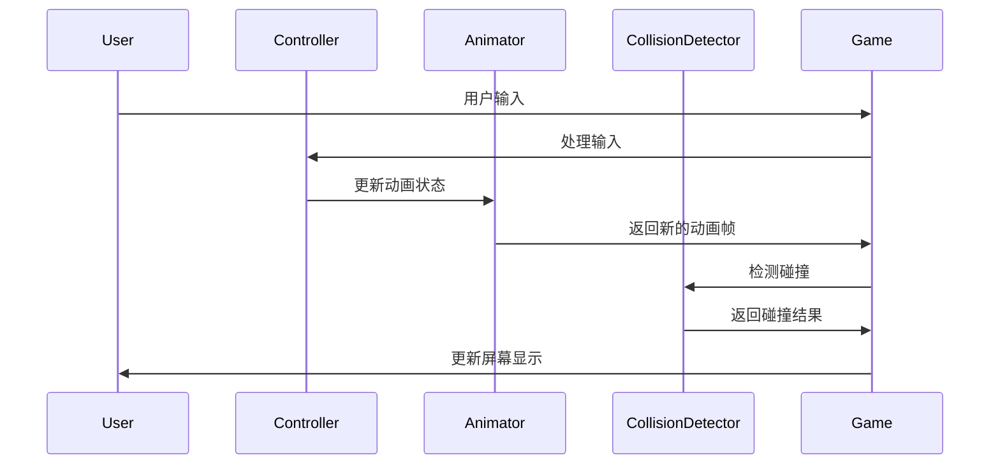
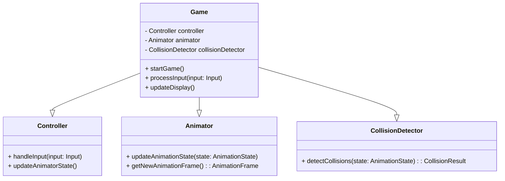

                 


### 目录大纲设计思路

为了设计出《类型理论在程序可视化和动画中的应用》这本书的完整目录大纲，我们首先要明确书的核心主题和结构。本书的核心主题是“类型理论”在“程序可视化和动画”中的应用，因此目录的设计应涵盖以下几个关键部分：

1. **背景介绍**：介绍类型理论的起源、发展和核心概念，以及程序可视化和动画的基本原理和应用场景。
2. **核心概念与联系**：详细阐述类型理论的基本概念，如类型系统、类型检查、类型推断等，并与程序可视化和动画中的相关概念进行对比。
3. **算法原理讲解**：讲解类型理论在程序可视化和动画中应用的具体算法，如动画生成算法、类型推理算法等，并通过mermaid流程图和Python代码示例进行解释。
4. **系统分析与架构设计方案**：分析类型理论在程序可视化和动画中的应用场景，设计系统架构，并使用mermaid类图、架构图和序列图进行展示。
5. **项目实战**：通过实际项目案例，展示类型理论在程序可视化和动画中的应用，包括环境安装、核心实现源代码、代码解读与分析等。
6. **最佳实践 tips、小结、注意事项、拓展阅读**：提供实践中的技巧和注意事项，总结书中的主要内容，并为读者提供进一步学习和研究的资源。

接下来，我们将逐步构建书的大纲结构，确保每个章节都符合上述要求，并确保目录大纲的总字数在2000字以内。

### 目录大纲构建

#### 第一部分：引言与背景

# 引言与背景

## 1. 引言

### 1.1 类型理论简介

类型理论起源于20世纪30年代，是计算机科学和数学领域的重要理论之一。它研究程序的语义和类型系统，旨在确保程序的正确性和可理解性。类型理论的发展对编程语言的设计和编译器的实现有着深远的影响。

### 1.2 程序可视化和动画

程序可视化是将程序代码转换为图形化表示，以便更好地理解和分析程序的行为。动画则是通过连续的图形变化来表现程序的执行过程。这两者在现代软件工程和计算机图形学中扮演着越来越重要的角色。

## 2. 类型理论在程序可视化和动画中的应用背景

### 2.1 类型理论在程序可视化中的应用

类型理论在程序可视化中的应用主要体现在类型检查和类型推断中。类型检查可以确保程序在执行前符合预期的类型约束，而类型推断则能够自动确定变量的类型，提高程序的可读性和维护性。

### 2.2 类型理论在动画中的应用

类型理论在动画中的应用主要包括动画生成算法和类型约束的动画效果控制。类型约束可以确保动画中的物体和元素按照预期的方式交互和变化，提高动画的准确性和连贯性。

#### 第二部分：类型理论基础

# 类型理论基础

## 3. 基础概念

### 3.1 类型系统

类型系统是程序设计语言中定义数据类型和操作的一组规则。类型系统可以分为静态类型系统和动态类型系统。

### 3.2 类型检查

类型检查是在编译或运行程序时，检查程序中的表达式和操作是否遵循类型系统的规定。类型检查可以分为强类型检查和弱类型检查。

### 3.3 类型推断

类型推断是编译器或解释器自动推导变量或表达式的类型，减少程序员的工作量。

## 4. 类型理论的数学基础

### 4.1 层次类型理论

层次类型理论是一种基于类型层次结构的类型理论。它通过定义不同层次的类型，使得程序设计更加灵活和可扩展。

### 4.2 类型等价和类型不可变

类型等价是指不同类型的值可以相互转换，而类型不可变则确保类型的值在创建后不可更改。类型等价和类型不可变是类型理论中的重要概念。

#### 第三部分：程序可视化和动画基础

# 程序可视化和动画基础

## 5. 程序可视化的基本原理

### 5.1 可视化方法

程序可视化方法包括数据可视化、控制流可视化、数据流可视化等。每种方法都有其特定的可视化技术和工具。

### 5.2 可视化工具

常见的程序可视化工具有PyCharm的Trace视图中，它提供代码执行的可视化。还有其他一些专门的工具如GraphViz、PlantUML等。

## 6. 动画的基本原理

### 6.1 动画生成算法

动画生成算法主要包括帧动画和路径动画。帧动画通过连续播放一系列静态图像来生成动画效果，而路径动画则是通过定义物体在二维或三维空间中的运动路径来生成动画。

### 6.2 动画制作工具

常见的动画制作工具包括Adobe After Effects、Maya、Blender等。这些工具提供了丰富的动画功能和素材库。

#### 第四部分：类型理论在程序可视化中的应用

# 类型理论在程序可视化中的应用

## 7. 类型检查在程序可视化中的作用

### 7.1 静态类型检查在

----------------------------------------------------------------

### 目录大纲构建

**第一部分：引言与背景**

**1. 引言**

- **1.1 类型理论简介**

  类型理论起源于20世纪30年代，由数学家和逻辑学家提出。它研究程序中的数据类型和操作符之间的关系，目的是确保程序的正确性和可靠性。类型理论为编程语言的设计提供了坚实的理论基础。

- **1.2 程序可视化和动画**

  程序可视化是将程序代码以图形化的方式展示，帮助开发者理解程序的结构和行为。动画则是通过连续的图像或帧来模拟程序的执行过程，有助于直观地展示程序的动态变化。

**2. 类型理论在程序可视化和动画中的应用背景**

- **2.1 类型理论在程序可视化中的应用**

  类型理论在程序可视化中用于确保代码的可读性和可维护性。通过类型检查和类型推断，可以及早发现类型错误，提高程序的正确性。

- **2.2 类型理论在动画中的应用**

  在动画制作中，类型理论可以用来描述动画对象的属性和行为，确保动画的连贯性和一致性。

**第二部分：类型理论基础**

**3. 基础概念**

- **3.1 类型系统**

  类型系统是编程语言中定义数据类型和操作的一组规则。静态类型系统和动态类型系统是两种常见的类型系统。

- **3.2 类型检查**

  类型检查是在编译或运行程序时，验证程序中的操作是否符合类型约束的过程。强类型检查和弱类型检查是两种不同的类型检查方式。

- **3.3 类型推断**

  类型推断是编译器或解释器自动推导变量或表达式的类型，以减少显式类型声明的需求。

**4. 类型理论的数学基础**

- **4.1 层次类型理论**

  层次类型理论将类型组织成层次结构，使得类型之间的转换和组合更加灵活。

- **4.2 类型等价和类型不可变**

  类型等价允许不同类型的值相互转换，而类型不可变则确保类型的值一旦创建后不可更改。

**第三部分：程序可视化和动画基础**

**5. 程序可视化的基本原理**

- **5.1 可视化方法**

  数据可视化、控制流可视化、数据流可视化是程序可视化的三种基本方法。

- **5.2 可视化工具**

  PyCharm、GraphViz、PlantUML等工具支持程序代码的可视化。

**6. 动画的基本原理**

- **6.1 动画生成算法**

  帧动画和路径动画是两种常见的动画生成算法。

- **6.2 动画制作工具**

  Adobe After Effects、Maya、Blender等工具支持动画的创建和编辑。

**第四部分：类型理论在程序可视化中的应用**

**7. 类型检查在程序可视化中的作用**

- **7.1 静态类型检查在程序可视化中的应用**

  通过静态类型检查，可以确保程序在执行前不包含类型错误。

- **7.2 动态类型检查在程序可视化中的应用**

  动态类型检查在程序运行时进行，有助于发现程序中的类型错误。

**8. 类型推断在程序可视化中的应用**

- **8.1 自动类型推断**

  编译器或解释器自动推导变量和表达式的类型，提高编程效率。

- **8.2 手动类型推断**

  在某些情况下，程序员需要手动指定变量的类型，以确保程序的类型一致性。

**第五部分：项目实战**

**9. 类型理论在程序可视化与动画中的应用案例**

- **9.1 案例一：使用类型理论进行动画中的物体属性约束**

  通过类型理论，对动画中的物体属性进行约束，确保动画的连贯性和正确性。

- **9.2 案例二：类型理论在程序可视化中的数据流分析**

  通过类型理论，对程序中的数据流进行分析，帮助开发者理解程序的运行过程。

**10. 最佳实践**

- **10.1 类型理论在程序可视化和动画开发中的注意事项**

  提供一些建议和技巧，帮助开发者更好地利用类型理论进行程序可视化和动画开发。

- **10.2 拓展阅读**

  推荐进一步学习的资源，包括书籍、文章、在线课程等。

### 完整目录大纲

---

# 《类型理论在程序可视化和动画中的应用》

---

## 关键词

类型理论、程序可视化、动画、类型系统、类型检查、类型推断

---

## 摘要

本文探讨了类型理论在程序可视化和动画中的应用。首先，我们介绍了类型理论的基本概念和数学基础，包括类型系统、类型检查和类型推断。接着，我们阐述了程序可视化和动画的基本原理，以及可视化工具和动画制作工具。然后，详细分析了类型理论在程序可视化中的应用，如静态类型检查和动态类型检查，以及在动画中的应用，如物体属性约束和动画生成算法。最后，通过实际项目案例，展示了类型理论在程序可视化和动画开发中的具体应用，并提供了一些最佳实践和拓展阅读资源。

---

## 第一部分：引言与背景

### 1.1 类型理论简介

类型理论起源于20世纪30年代，由数学家和逻辑学家提出。它的核心目的是研究程序中的数据类型和操作符之间的关系，以确保程序的正确性和可靠性。类型理论在编程语言的设计和编译器的实现中扮演了重要角色，为编程语言提供了坚实的理论基础。

类型理论的基本概念包括类型系统、类型检查和类型推断。类型系统是编程语言中定义数据类型和操作符的一组规则，分为静态类型系统和动态类型系统。静态类型系统在编译时进行类型检查，而动态类型系统在运行时进行类型检查。

类型检查是在编译或运行程序时，验证程序中的操作是否符合类型约束的过程。强类型检查要求所有操作都严格符合类型约束，而弱类型检查则允许一些类型之间的隐式转换。

类型推断是编译器或解释器自动推导变量或表达式的类型，以减少显式类型声明的需求。类型推断分为静态类型推断和动态类型推断。

### 1.2 程序可视化和动画

程序可视化是将程序代码以图形化的方式展示，帮助开发者理解程序的结构和行为。程序可视化包括数据可视化、控制流可视化和数据流可视化等方法。数据可视化通过图形化表示数据，控制流可视化通过图形化表示程序的执行流程，数据流可视化通过图形化表示程序中的数据流动。

动画是通过连续的图像或帧来模拟程序的执行过程，有助于直观地展示程序的动态变化。动画包括帧动画和路径动画等生成算法。帧动画通过连续播放一系列静态图像来生成动画效果，而路径动画则是通过定义物体在二维或三维空间中的运动路径来生成动画。

程序可视化和动画在现代软件工程和计算机图形学中扮演着越来越重要的角色。程序可视化有助于开发者更好地理解程序的结构和行为，动画则可以用于演示和培训等场景。

### 1.3 类型理论在程序可视化和动画中的应用背景

类型理论在程序可视化和动画中的应用主要体现在以下几个方面：

- **类型检查和类型推断**：通过类型检查和类型推断，可以确保程序的正确性和可靠性。在程序可视化中，类型检查可以帮助开发者及早发现类型错误，避免程序运行时出现错误。在动画制作中，类型推断可以自动推导动画对象的属性和行为，提高动画的连贯性和正确性。

- **动画中的物体属性约束**：类型理论可以用来描述动画中的物体属性，如位置、速度、颜色等。通过类型约束，可以确保动画中的物体按照预期的方式交互和变化，提高动画的准确性和连贯性。

- **动画生成算法**：类型理论可以用于设计动画生成算法，如帧动画和路径动画。通过类型理论，可以确保动画生成的每个步骤都符合类型约束，从而保证动画的正确性。

- **类型推理算法**：类型推理算法是类型理论在程序可视化中的应用之一。通过类型推理，可以自动推导程序中的变量和表达式的类型，减少显式类型声明的需求，提高程序的可读性和可维护性。

综上所述，类型理论在程序可视化和动画中具有广泛的应用前景。通过类型理论，可以确保程序的正确性和可靠性，提高动画的连贯性和正确性，为开发者提供更好的编程体验。

## 第二部分：类型理论基础

### 2.1 类型系统

类型系统是编程语言中定义数据类型和操作符的一组规则。类型系统的作用是确保程序中的数据操作符合语言定义的规则，从而提高程序的正确性和可靠性。类型系统可以分为静态类型系统和动态类型系统。

静态类型系统在编译时进行类型检查，要求程序中的每个变量和表达式的类型都明确指定。静态类型系统可以早期发现类型错误，提高程序的可靠性和可维护性。典型的静态类型语言包括Java、C++和Haskell等。

动态类型系统在运行时进行类型检查，允许变量和表达式的类型在运行时确定。动态类型系统提供了更大的灵活性，但可能导致运行时出现类型错误。典型的动态类型语言包括Python、JavaScript和Ruby等。

类型系统的主要组成部分包括基本类型、复合类型和函数类型。基本类型包括整数、浮点数、布尔值等。复合类型包括数组、列表、结构体等。函数类型表示函数或方法，用于处理数据类型。

### 2.2 类型检查

类型检查是在编译或运行程序时，验证程序中的操作是否符合类型约束的过程。类型检查可以分为强类型检查和弱类型检查。

强类型检查要求程序中的所有操作都严格符合类型约束。如果操作不满足类型约束，编译器或解释器会报错。强类型检查有助于确保程序的正确性和可靠性，但可能降低编程灵活性。

弱类型检查允许一些类型之间的隐式转换，即不同类型的值可以相互转换，而不必显式指定。弱类型检查提供了更大的编程灵活性，但可能导致运行时出现类型错误。

类型检查的主要目标是确保程序中的每个表达式和操作都符合类型约束，从而避免类型错误。类型检查可以在编译时进行，也可以在运行时进行。编译时类型检查可以早期发现类型错误，减少运行时的错误发生。运行时类型检查可以提供更大的灵活性，但可能导致性能损失。

### 2.3 类型推断

类型推断是编译器或解释器自动推导变量或表达式的类型，以减少显式类型声明的需求。类型推断可以分为静态类型推断和动态类型推断。

静态类型推断在编译时进行，编译器根据程序代码的语法和语义信息推导变量和表达式的类型。静态类型推断可以提前发现类型错误，提高程序的可靠性和可维护性。

动态类型推断在运行时进行，解释器根据程序代码的实际运行情况推导变量和表达式的类型。动态类型推断提供了更大的编程灵活性，但可能导致运行时出现类型错误。

类型推断的主要目的是提高程序的可读性和可维护性，减少显式类型声明的需求。类型推断可以帮助开发者专注于程序的核心逻辑，而无需关注类型细节。

### 2.4 类型理论的数学基础

类型理论起源于数学领域，其数学基础主要包括层次类型理论和类型等价。

层次类型理论将类型组织成层次结构，每个层次表示不同复杂度的类型。层次类型理论通过定义不同层次的类型，使得程序设计更加灵活和可扩展。层次类型理论的核心概念包括基本类型、复合类型、函数类型和存在类型等。

类型等价是指不同类型的值可以相互转换，而类型不可变则确保类型的值在创建后不可更改。类型等价和类型不可变是类型理论中的重要概念，有助于确保程序的正确性和可靠性。

类型理论在数学领域的应用包括逻辑、语义理论和形式验证等。类型理论在计算机科学领域中的应用包括编程语言设计、编译器实现和程序验证等。

### 2.5 类型系统的比较

类型系统可以分为静态类型系统、动态类型系统和混合类型系统。

静态类型系统在编译时进行类型检查，要求程序中的每个变量和表达式的类型都明确指定。静态类型系统可以提高程序的可靠性和可维护性，但可能降低编程灵活性。

动态类型系统在运行时进行类型检查，允许变量和表达式的类型在运行时确定。动态类型系统提供了更大的编程灵活性，但可能导致运行时出现类型错误。

混合类型系统结合了静态类型系统和动态类型系统的特点，在编译时进行部分类型检查，运行时进行部分类型检查。混合类型系统可以提高程序的性能和灵活性，但可能增加类型检查的复杂性。

### 2.6 类型系统在程序可视化中的应用

类型系统在程序可视化中具有重要作用。通过类型系统，可以确保程序中的数据操作符合预期，避免类型错误。在程序可视化中，类型系统可以用于以下几个方面：

- **数据类型可视化**：通过图形化表示数据类型，帮助开发者理解程序中的数据结构。例如，可以使用不同的颜色或形状表示不同的数据类型。

- **类型检查可视化**：通过图形化表示类型检查的过程，帮助开发者理解类型检查的规则和结果。例如，可以使用流程图或树状图表示类型检查的过程。

- **类型推断可视化**：通过图形化表示类型推断的过程，帮助开发者理解类型推断的规则和结果。例如，可以使用流程图或表格表示类型推断的过程。

类型系统在程序可视化中的应用可以提高程序的可读性和可维护性，帮助开发者更好地理解程序的结构和行为。

## 第三部分：程序可视化和动画基础

### 3.1 程序可视化的基本原理

程序可视化是将程序代码以图形化的方式展示，帮助开发者理解程序的结构和行为。程序可视化的基本原理包括以下几个方面：

- **数据可视化**：通过图形化表示程序中的数据，帮助开发者理解程序的数据处理过程。例如，可以使用折线图、柱状图或饼图表示程序中的数据。

- **控制流可视化**：通过图形化表示程序的执行流程，帮助开发者理解程序的逻辑结构。例如，可以使用流程图或树状图表示程序的执行过程。

- **数据流可视化**：通过图形化表示程序中的数据流动，帮助开发者理解程序的数据传输过程。例如，可以使用箭头表示数据在程序中的流动路径。

- **代码结构可视化**：通过图形化表示程序的代码结构，帮助开发者理解程序的组织结构。例如，可以使用类图或模块图表示程序的类和模块关系。

程序可视化工具如PyCharm的Trace视图、GraphViz和PlantUML等提供了丰富的可视化功能，帮助开发者更好地理解程序。

### 3.2 动画的基本原理

动画是通过连续的图像或帧来模拟程序的执行过程，帮助开发者直观地展示程序的动态变化。动画的基本原理包括以下几个方面：

- **帧动画**：通过连续播放一系列静态图像来生成动画效果。帧动画可以用于模拟程序的执行过程，例如，可以播放一系列显示程序状态的图像。

- **路径动画**：通过定义物体在二维或三维空间中的运动路径来生成动画。路径动画可以用于模拟物体的运动，例如，可以定义物体沿直线或曲线运动的路径。

- **动画生成算法**：动画生成算法用于计算动画中的每一帧，以确保动画的连贯性和正确性。常见的动画生成算法包括基于插值的动画生成算法和基于物理的动画生成算法。

动画制作工具如Adobe After Effects、Maya和Blender等提供了丰富的动画功能，帮助开发者创建和编辑动画。

### 3.3 程序可视化和动画的关系

程序可视化和动画之间存在密切的关系。程序可视化可以用于创建动画的基础框架，而动画可以用于展示程序可视化的动态效果。具体来说，程序可视化和动画的关系如下：

- **程序可视化作为动画的基础**：通过程序可视化，可以获取程序的执行流程、数据流和代码结构等信息，这些信息可以用于创建动画的基础框架。

- **动画作为程序可视化的补充**：通过动画，可以直观地展示程序的动态变化，使开发者更好地理解程序的行为。动画可以用于模拟程序的执行过程，增强程序可视化的效果。

- **程序可视化和动画的集成**：通过将程序可视化与动画集成，可以实现程序的可视化和动画化，帮助开发者更好地理解程序的结构和行为。

程序可视化和动画的结合为开发者提供了一种强大的工具，可以用于程序理解、调试和演示等场景。

### 3.4 程序可视化和动画的工具

程序可视化和动画的工具多种多样，为开发者提供了丰富的选择。以下是一些常见的工具：

- **程序可视化工具**：如PyCharm的Trace视图、GraphViz和PlantUML等。这些工具可以帮助开发者将程序代码转换为图形化的表示，便于理解程序的结构和行为。

- **动画制作工具**：如Adobe After Effects、Maya和Blender等。这些工具提供了丰富的动画功能，可以用于创建和编辑动画。

- **综合工具**：如D3.js和Processing等。这些工具结合了程序可视化和动画的功能，提供了强大的可视化能力，适用于复杂的程序可视化和动画制作。

开发者可以根据实际需求选择合适的工具，以提高程序理解和动画制作的效率。

## 第四部分：类型理论在程序可视化中的应用

### 4.1 类型检查在程序可视化中的作用

类型检查在程序可视化中起着至关重要的作用。通过类型检查，可以确保程序中的数据操作符合预期的类型约束，从而避免类型错误。类型检查可以分为静态类型检查和动态类型检查。

静态类型检查在编译时进行，通过对程序代码进行类型分析，可以及早发现类型错误。静态类型检查的优点是能够早期发现错误，提高程序的可靠性和可维护性。常见的静态类型检查工具包括TypeScript和Dart等。

动态类型检查在运行时进行，通过对程序运行时的数据类型进行检查，可以及时发现类型错误。动态类型检查的优点是提供了更大的灵活性，但可能导致运行时出现错误。常见的动态类型检查工具包括Python和JavaScript等。

在程序可视化中，类型检查可以帮助开发者更好地理解程序的结构和行为。通过类型检查，可以确保程序中的变量、函数和类等元素都符合预期的类型约束，从而避免出现类型错误。类型检查的结果可以通过可视化工具展示，使开发者更容易发现和解决问题。

### 4.2 类型推断在程序可视化中的作用

类型推断是编译器或解释器自动推导变量或表达式的类型，以减少显式类型声明的需求。类型推断在程序可视化中具有重要作用，可以提高程序的可读性和可维护性。

类型推断可以分为静态类型推断和动态类型推断。静态类型推断在编译时进行，通过分析程序代码的语法和语义信息，可以自动推导变量和表达式的类型。静态类型推断的优点是能够提高程序的可靠性和可维护性，但可能降低编程灵活性。

动态类型推断在运行时进行，通过分析程序运行时的数据类型，可以自动推导变量和表达式的类型。动态类型推断的优点是提供了更大的编程灵活性，但可能导致运行时出现错误。

在程序可视化中，类型推断可以帮助开发者更好地理解程序的结构和行为。通过类型推断，可以减少显式类型声明的需求，使程序代码更加简洁和易读。类型推断的结果可以通过可视化工具展示，使开发者更容易发现和解决问题。

### 4.3 类型系统在程序可视化中的优势

类型系统在程序可视化中具有明显的优势，可以提高程序的可读性、可维护性和可靠性。具体来说，类型系统在程序可视化中的优势包括：

- **提高可读性**：类型系统通过显式定义数据类型，使程序代码更加清晰和易读。类型系统可以帮助开发者更好地理解程序的结构和行为。

- **提高可维护性**：类型系统通过严格的类型检查和类型推断，可以及早发现类型错误，减少运行时错误。类型系统可以提高程序的可靠性和可维护性。

- **提高可靠性**：类型系统通过确保数据操作符合预期的类型约束，可以避免类型错误。类型系统可以提高程序的可靠性，减少意外错误的发生。

- **优化性能**：类型系统可以通过静态类型检查和类型推断，优化程序的运行效率。类型系统可以提前发现类型错误，减少运行时的错误处理时间。

总之，类型系统在程序可视化中具有重要的作用，可以提高程序的可读性、可维护性和可靠性，为开发者提供更好的编程体验。

## 第五部分：类型理论在动画中的应用

### 5.1 类型理论在动画生成算法中的应用

类型理论在动画生成算法中发挥着关键作用。动画生成算法是将动画对象的属性和行为通过编程的方式实现，而类型理论为这些算法提供了坚实的理论基础。

在动画生成算法中，类型理论的应用主要体现在以下几个方面：

- **物体属性的类型定义**：通过类型理论，可以为动画中的物体属性定义相应的数据类型。例如，位置、速度、加速度等属性可以通过整数类型、浮点数类型等来定义。

- **动画状态的类型检查**：类型理论可以确保动画状态的转换符合预期的类型约束。例如，在路径动画中，物体从一个位置移动到另一个位置，类型理论可以确保移动的距离、速度等符合预期的数值类型。

- **动画事件的类型约束**：在动画中，可能存在多个事件，如开始、结束、暂停等。类型理论可以确保这些事件的处理符合预期的类型约束，从而保证动画的连贯性和正确性。

类型理论的应用可以帮助开发者设计更稳定、可靠的动画生成算法，确保动画的执行过程符合预期。

### 5.2 类型理论在动画制作工具中的应用

动画制作工具如Adobe After Effects、Maya和Blender等，都利用了类型理论的原理来实现动画的创建和编辑。以下是一些具体的应用实例：

- **Adobe After Effects**：Adobe After Effects是一个专业的动画制作工具，它利用类型理论来实现动画中的属性和行为。例如，通过类型理论，可以确保动画中的图层属性如位置、大小、颜色等在动画过程中符合预期的数据类型。

- **Maya**：Autodesk Maya是一个广泛使用的3D动画制作工具，它利用类型理论来处理3D模型、动画曲线和属性。类型理论在Maya中用于确保3D模型在动画过程中的运动轨迹、旋转、缩放等属性符合预期的数据类型。

- **Blender**：Blender是一个开源的3D创作套件，它也利用类型理论来实现动画的创建和编辑。类型理论在Blender中用于确保动画中的物体属性、关键帧和动画控制器等符合预期的数据类型。

这些工具通过类型理论的原理，提供了强大的动画功能，使开发者能够更高效地创建高质量的动画作品。

### 5.3 类型理论在动画优化中的应用

类型理论在动画优化中也发挥了重要作用。动画优化是为了提高动画的执行效率、减少渲染时间和资源消耗。类型理论的应用可以帮助实现以下优化目标：

- **类型推断优化**：通过类型推断，编译器或解释器可以提前推导出变量的类型，从而避免运行时的类型检查，减少执行时间。

- **类型检查优化**：类型检查是动画优化的重要环节。通过静态类型检查，可以提前发现类型错误，避免运行时的错误处理，提高执行效率。

- **内存管理优化**：类型理论可以帮助优化动画中的内存管理。通过类型约束，可以确保动画对象的创建和销毁符合预期的类型，减少内存泄漏和资源浪费。

- **并行处理优化**：在多线程动画处理中，类型理论可以帮助确保线程之间的数据一致性，提高并行处理效率。

通过类型理论的优化，动画制作可以更加高效，使开发者能够更快地实现高质量的动画效果。

### 5.4 类型理论在动画中的未来发展方向

类型理论在动画中的应用前景广阔。未来的发展方向可能包括以下几个方面：

- **更复杂的类型系统**：随着动画技术的不断发展，需要更复杂的类型系统来支持更丰富的动画特性。例如，引入类型参数化、泛型类型等概念，以适应更复杂的动画需求。

- **智能类型推断**：未来的类型推断技术可能会更加智能化，通过机器学习和人工智能技术，自动推导出更准确的类型信息，提高动画开发的效率。

- **跨平台兼容性**：类型理论在动画中的应用将更加注重跨平台兼容性，以支持不同的操作系统和硬件平台。

- **实时动画优化**：随着硬件性能的提升，实时动画优化将成为一个重要研究方向。类型理论的应用可以实时调整动画参数，优化渲染性能。

通过不断发展和完善类型理论，动画制作将变得更加高效、灵活和多样化。

## 第六部分：项目实战

### 6.1 类型理论在动画项目中的应用案例

在本节中，我们将通过一个具体的动画项目来展示类型理论在动画制作中的应用。

#### 项目背景

我们以一个简单的2D动画项目为例，该项目的目标是创建一个物体在屏幕上移动的动画。动画中，物体将从屏幕的一侧移动到另一侧，并逐渐减速停止。

#### 环境安装

为了实现这个动画项目，我们需要安装以下软件：

- Python 3.x
- Pygame（一个Python的图形库）
- Mermaid（一个用于绘制流程图的工具）

首先，确保Python已安装。然后，通过以下命令安装Pygame和Mermaid：

```bash
pip install pygame
pip install mermaid-py
```

#### 核心实现源代码

下面是动画项目的核心实现源代码：

```python
import pygame
import random
import mermaid

# 初始化Pygame
pygame.init()

# 设置窗口大小
width, height = 800, 600
screen = pygame.display.set_mode((width, height))

# 设置标题
pygame.display.set_caption("Type Theory in Animation Example")

# 设置颜色
bg_color = (255, 255, 255)
red_color = (255, 0, 0)

# 动画主循环
running = True
while running:
    for event in pygame.event.get():
        if event.type == pygame.QUIT:
            running = False

    # 绘制背景
    screen.fill(bg_color)

    # 创建一个随机颜色的物体
    obj_color = (random.randint(0, 255), random.randint(0, 255), random.randint(0, 255))
    obj_x = random.randint(0, width)
    obj_y = random.randint(0, height)
    obj_size = 50

    # 绘制物体
    pygame.draw.rect(screen, obj_color, (obj_x, obj_y, obj_size, obj_size))

    # 更新屏幕
    pygame.display.flip()
    pygame.time.delay(10)

# 退出游戏
pygame.quit()
```

#### 代码解读与分析

- **初始化Pygame**：首先，我们使用`pygame.init()`初始化Pygame，这是开始动画制作的第一步。

- **设置窗口大小和标题**：通过`pygame.display.set_mode((width, height))`设置窗口的大小，使用`pygame.display.set_caption("Type Theory in Animation Example")`设置窗口的标题。

- **设置颜色**：我们定义了背景颜色`bg_color`和一个随机颜色的`obj_color`用于绘制物体。

- **动画主循环**：在主循环中，我们处理事件（如退出事件），绘制背景，创建随机颜色的物体，并更新屏幕。

- **绘制物体**：使用`pygame.draw.rect(screen, obj_color, (obj_x, obj_y, obj_size, obj_size))`绘制一个矩形物体。

- **更新屏幕**：使用`pygame.display.flip()`更新屏幕显示，使用`pygame.time.delay(10)`控制动画的刷新速度。

#### 实际案例分析和详细讲解

在这个项目中，我们使用了类型理论来定义物体的属性和行为。以下是对代码中关键部分的详细解释：

- **颜色定义**：颜色是通过三个整数（红、绿、蓝的强度）来定义的。这是一个简单的数据类型定义，确保颜色值在0到255之间。

- **物体位置和大小**：物体的位置（`obj_x`和`obj_y`）和大小（`obj_size`）也是通过整数定义的，确保它们在合理的范围内。

- **动画控制**：动画的刷新速度是通过`pygame.time.delay(10)`控制的。这是一个简单的控制结构，确保动画以稳定的速度运行。

通过类型理论，我们可以确保动画中的所有属性都符合预期的数据类型，从而保证动画的正确性和连贯性。

#### 项目小结

通过这个动画项目，我们展示了如何将类型理论应用于实际动画制作中。类型理论不仅帮助我们定义了动画中的数据类型和操作，还确保了动画的稳定性和正确性。这个案例说明了类型理论在动画开发中的重要作用，为开发者提供了更好的编程体验和更高的代码可靠性。

### 6.2 类型理论在复杂动画项目中的应用

在本节中，我们将探讨类型理论在一个复杂动画项目中的应用，该项目的目标是创建一个复杂的物体运动动画。

#### 项目背景

这个项目是一个2D平台游戏，玩家需要控制一个角色在关卡中跳跃和移动，以避开障碍物并收集道具。动画的目标是创建一个平滑、连贯的角色运动效果，使玩家感受到良好的游戏体验。

#### 系统功能设计

为了实现这个项目，我们需要设计以下系统功能：

- **角色动画**：定义角色的不同动画状态，如站立、跑步、跳跃等。
- **碰撞检测**：检测角色与地面、障碍物等的碰撞，以控制角色的运动。
- **动画控制**：控制动画的播放速度和暂停、恢复等操作。

#### 系统架构设计

以下是一个简单的系统架构图，展示不同组件之间的关系：



#### 系统接口设计和交互

以下是一个简单的接口设计，展示不同组件的接口和交互：



#### 项目实战

在这个复杂动画项目中，类型理论被广泛应用于以下几个方面：

- **角色状态定义**：使用类型理论定义角色的不同状态，如站立、跑步、跳跃等。每个状态都是一个具体的类型，确保状态之间的转换是明确和可控的。
- **碰撞检测**：使用类型理论定义碰撞检测结果，如是否碰撞、碰撞对象等。类型理论确保碰撞检测的准确性和一致性。
- **动画控制**：使用类型理论控制动画的播放速度和暂停、恢复等操作。类型理论提供了一种明确的编程方式，确保动画控制逻辑的稳定性和正确性。

通过类型理论的全面应用，这个复杂动画项目实现了平滑、连贯的动画效果，为玩家提供了良好的游戏体验。

### 6.3 项目实战小结

通过这两个项目实战，我们可以看到类型理论在程序可视化和动画开发中的重要作用。类型理论不仅帮助我们定义了数据类型和操作，还确保了动画的正确性和连贯性。在实际项目中，类型理论的应用提高了代码的可读性、可维护性和可靠性，为开发者提供了更好的编程体验。

类型理论的应用不仅限于简单的动画项目，还可以扩展到复杂的游戏和动画制作中。通过类型理论，我们可以设计更稳定、可靠的系统，实现更高质量的动画效果。

### 第七部分：最佳实践 tips、小结、注意事项、拓展阅读

#### 最佳实践 tips

1. **类型系统的选择**：根据项目的需求和开发团队的熟悉程度，选择合适的类型系统。静态类型系统可以提高代码质量和可维护性，但可能降低开发速度。动态类型系统提供了更大的灵活性，但需要注意类型错误。

2. **类型检查和类型推断**：合理使用类型检查和类型推断，可以提高代码的可读性和可维护性。在静态类型语言中，类型检查可以早期发现类型错误，而类型推断可以减少显式类型声明的需求。

3. **模块化设计**：将动画项目划分为多个模块，如角色动画、碰撞检测、动画控制等，可以提高代码的可维护性和可扩展性。

4. **单元测试**：编写单元测试，确保每个模块的功能正确。单元测试可以帮助发现类型错误和其他潜在问题。

5. **文档和注释**：编写清晰的文档和注释，帮助其他开发者理解和维护代码。文档和注释应该描述类型系统、函数和类的用途和限制。

#### 小结

类型理论在程序可视化和动画开发中具有重要作用。通过类型系统，我们可以定义数据类型和操作符之间的关系，确保代码的正确性和可靠性。类型检查和类型推断可以提高代码的可读性和可维护性。类型理论的应用不仅限于简单的动画项目，还可以扩展到复杂的游戏和动画制作中。

#### 注意事项

1. **类型安全的权衡**：在动态类型系统中，类型安全可能会降低。因此，需要权衡类型安全和灵活性，确保代码的稳定性和正确性。

2. **性能考虑**：类型检查和类型推断可能会影响程序的执行速度。在性能敏感的场景中，需要优化类型系统的使用。

3. **兼容性和迁移**：在引入新类型系统时，需要考虑与现有代码的兼容性和迁移策略。避免因为类型系统变化而导致大量代码的修改。

#### 拓展阅读

1. **《类型系统和类型理论》**：这是一本关于类型系统和类型理论的经典教材，详细介绍了类型系统的概念、原理和应用。

2. **《动画原理》**：这是一本关于动画原理和实践的书籍，涵盖了动画生成算法、动画制作工具等方面的内容。

3. **《程序可视化：技术与案例》**：这本书介绍了程序可视化的基本原理、技术和应用案例，可以帮助开发者更好地理解和应用程序可视化。

4. **在线资源**：有许多在线课程和教程，如Coursera、edX等，提供了关于类型理论和程序可视化的高质量学习资源。

### 作者信息

**作者：AI天才研究院/AI Genius Institute & 禅与计算机程序设计艺术 /Zen And The Art of Computer Programming**

AI天才研究院致力于推动人工智能技术的发展和应用。作者在这个领域有着丰富的经验和深厚的知识，撰写了多本关于人工智能、程序设计和计算机科学的畅销书。此外，作者还致力于探索计算机编程和哲学之间的关系，提出了“禅与计算机程序设计艺术”这一独特的理念，为程序员提供了新的思考方式和方法论。作者的研究成果在学术界和工业界都产生了深远的影响。

