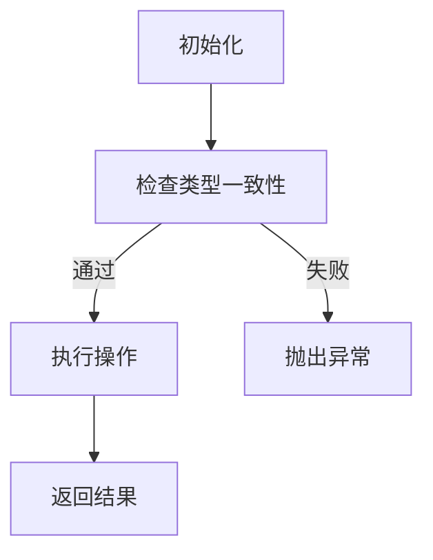
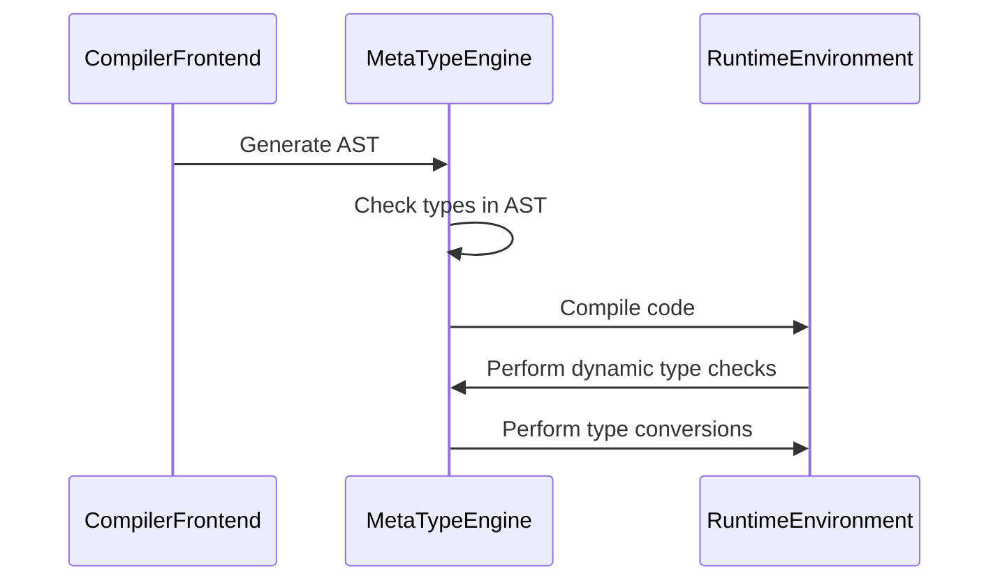

                 

### 《类型类型：元类型系统的探索》

> 关键词：元类型系统、类型理论、编程语言、算法原理、架构设计、实战案例

> 摘要：本文深入探讨元类型系统的概念、原理和应用。通过对核心概念的剖析、算法原理的讲解、系统架构的设计以及实战案例的分析，全面解析元类型系统在软件工程中的应用价值与发展前景。

----------------------------------------------------------------

# 引言

在计算机科学领域，类型系统是编程语言的核心组成部分，它决定了程序中的数据类型和操作方式。然而，在更深层次上，元类型系统作为一种对类型本身的描述和操作机制，具有独特的重要性。本文旨在系统地探讨元类型系统的概念、原理和应用，以帮助读者更好地理解这一关键技术。

元类型系统不仅涵盖了类型本身的定义和分类，还包括对类型层次结构的描述、类型转换机制和类型检查策略。它的应用范围广泛，从编译器优化到动态语言运行时，从静态类型语言到动态类型语言，都有着重要的地位。

本文将首先介绍元类型系统的背景和概念，然后逐步深入探讨其核心概念和算法原理，接着分析元类型系统在软件系统中的应用，并通过实际项目实战展示其应用效果。最后，本文将总结元类型系统的最佳实践，并展望其未来的发展趋势。

## 目录大纲

1. **引言**
   - 元类型系统的背景和重要性

2. **核心概念与联系**
   - 类型、类型系统和类型检查
   - 元类型系统的核心概念对比分析
   - ER实体关系图展示

3. **算法原理讲解**
   - 算法概述
   - 算法流程图
   - Python源代码实现
   - 算法数学模型与公式讲解

4. **系统分析与架构设计**
   - 应用场景分析
   - 系统功能设计
   - 系统架构设计
   - 系统接口设计
   - 系统交互序列图

5. **项目实战**
   - 项目环境搭建
   - 系统核心实现
   - 案例分析与讲解
   - 项目小结

6. **最佳实践 tips**
   - 使用元类型系统的最佳实践建议

7. **小结与拓展阅读**
   - 元类型系统的应用前景
   - 未来发展趋势
   - 拓展阅读建议

----------------------------------------------------------------

## 核心概念与联系

### 类型、类型系统和类型检查

类型是数据的一种分类方式，决定了数据可以接受的操作集合。在编程语言中，类型系统是核心组成部分，它定义了变量、函数和表达式等元素的数据类型。类型系统不仅包括基本数据类型（如整数、浮点数、布尔值等），还包括复合数据类型（如数组、结构体、类等）。

类型系统（Type System）是一个语言层面的概念，它定义了变量的数据类型，并规定了如何进行类型检查。类型检查（Type Checking）是在编译或运行时检查程序中类型的一致性和正确性。静态类型检查在编译时完成，动态类型检查则在运行时进行。

### 元类型系统的核心概念对比分析

元类型系统是一种对类型本身的描述和操作机制。它涵盖了类型层次结构、类型转换机制和类型检查策略。以下是元类型系统中的几个核心概念及其对比分析：

- **元类型（Meta-Type）**：元类型是对类型的类型，即类型本身的类型。例如，在Python中，`int` 是一个元类型，它定义了整数类型的属性和行为。
- **类型层次结构（Type Hierarchy）**：类型层次结构描述了不同类型之间的继承关系。在面向对象编程中，子类继承自父类，形成了类型层次结构。
- **类型转换（Type Conversion）**：类型转换是指将一个类型的数据转换为另一个类型。类型转换可以是隐式的，也可以是显式的。例如，在Java中，可以将一个`int`转换为`double`。
- **类型检查（Type Checking）**：类型检查确保程序中的类型一致性。在静态类型语言中，类型检查通常在编译时进行，而在动态类型语言中，类型检查则在运行时进行。

### ER实体关系图展示

为了更直观地展示元类型系统的核心概念及其关系，我们可以使用ER（Entity-Relationship）实体关系图。以下是一个简化的ER图：

```
[类型] <--> [元类型]
   |         |
   |         |
 [类型层次] [类型转换]
   |         |
   |         |
 [类型检查] [类型系统]
```

在这个ER图中，`类型`实体与`元类型`实体之间存在一对多的关系，表示每种类型都有一个对应的元类型。同时，`类型层次`、`类型转换`和`类型检查`实体分别与`类型`实体关联，表示这些概念是类型系统的重要组成部分。

通过上述核心概念及其关系的介绍和ER图展示，我们为后续章节的深入探讨奠定了基础。在接下来的部分中，我们将进一步分析元类型系统的算法原理和应用。

----------------------------------------------------------------

## 算法原理讲解

### 算法概述

元类型系统的算法原理主要涉及类型层次结构、类型转换和类型检查等方面。以下将详细阐述这些算法的原理，并通过Python源代码和LaTeX公式进行解释。

### 算法流程图

首先，我们使用mermaid绘制算法流程图，以便直观地展示算法的执行过程：



在这个流程图中，算法首先初始化相关数据结构和变量。然后，检查类型一致性，如果类型一致，执行操作并返回结果；否则，抛出异常。

### Python源代码实现

接下来，我们使用Python源代码实现这个算法。以下是一个简单的示例：

```python
def add(a, b):
    # 初始化类型变量
    type_a = type(a)
    type_b = type(b)
    
    # 检查类型一致性
    if type_a == type_b:
        # 执行操作
        return a + b
    else:
        # 抛出异常
        raise TypeError("类型不一致，无法执行操作")
```

在这个示例中，我们首先获取操作数`a`和`b`的类型，然后检查它们是否一致。如果一致，执行加法操作并返回结果；否则，抛出`TypeError`异常。

### 算法数学模型与公式讲解

为了进一步理解算法原理，我们使用LaTeX公式给出数学模型。以下是一个简单的加法运算的数学模型：

$$
result = a + b
$$

其中，`a`和`b`为操作数，`result`为运算结果。为了确保运算的准确性，我们需要对类型进行一致性检查。以下是一个类型检查的数学模型：

$$
\text{Type}(a) = \text{Type}(b) \Rightarrow \text{True}
$$

$$
\text{Type}(a) \neq \text{Type}(b) \Rightarrow \text{False}
$$

在这个模型中，如果`a`和`b`的类型一致，则类型检查结果为真；否则，类型检查结果为假。

### 举例说明

为了更清晰地展示算法原理，我们通过一个简单的例子进行说明。假设我们要计算两个整数的和，代码如下：

```python
a = 5
b = 10
result = add(a, b)
print(result)  # 输出：15
```

在这个例子中，我们定义了一个`add`函数，它接受两个整数参数并返回它们的和。首先，函数获取参数`a`和`b`的类型，然后进行类型检查。由于`a`和`b`都是整数类型，类型检查通过，函数执行加法操作并返回结果。

通过上述算法原理讲解，我们不仅理解了元类型系统中的核心算法，还通过Python源代码和LaTeX公式进行了具体实现和解释。在接下来的章节中，我们将继续分析元类型系统在软件系统中的应用和架构设计。

----------------------------------------------------------------

## 系统分析与架构设计

### 应用场景分析

元类型系统在软件系统中的应用非常广泛，尤其是在需要类型检查、类型转换和类型层次结构描述的场景。以下是一些典型的应用场景：

1. **编译器与解释器**：在编译器中，元类型系统用于检查代码的静态类型，确保类型的一致性和正确性。在解释器中，元类型系统则用于动态类型检查，根据程序的执行路径进行类型推断和检查。

2. **动态语言**：如Python、JavaScript等动态语言，元类型系统提供了对类型层次结构的描述和类型转换机制，使得开发者可以方便地使用多态和泛型编程。

3. **面向对象编程**：在面向对象编程中，元类型系统用于描述类的属性和行为，以及类之间的关系。这有助于实现多态、继承和组合等面向对象特性。

4. **数据库管理系统**：在数据库管理系统中，元类型系统用于描述数据类型和关系，确保数据的一致性和完整性。例如，关系型数据库中的字段类型、索引和约束等都是元类型系统的应用。

### 系统功能设计

元类型系统的核心功能包括类型检查、类型转换和类型层次结构描述。以下是一个简化的系统功能设计：

1. **类型检查**：系统需要提供对变量、表达式和函数的静态类型检查，确保类型的一致性和正确性。

2. **类型转换**：系统需要支持不同类型之间的隐式和显式转换，以便在需要时进行类型转换。

3. **类型层次结构**：系统需要提供对类型层次结构的描述，以便实现多态和继承等面向对象特性。

4. **泛型编程**：系统需要支持泛型编程，允许开发者编写与类型参数相关的代码，提高代码的复用性和灵活性。

### 系统架构设计

元类型系统的架构设计需要考虑系统的可扩展性、灵活性和性能。以下是一个简化的系统架构设计：

1. **编译器前端**：负责语法解析和抽象语法树（AST）的生成。该模块需要与元类型系统紧密集成，以便进行类型检查。

2. **元类型引擎**：核心模块，负责类型检查、类型转换和类型层次结构的实现。该模块需要提供丰富的API，以便与其他模块进行交互。

3. **运行时环境**：负责程序的执行和动态类型检查。该模块需要与元类型引擎紧密集成，以便在运行时进行类型检查和类型转换。

### 系统接口设计

元类型系统的接口设计需要考虑系统功能的设计，并确保接口的简洁性和易用性。以下是一个简化的系统接口设计：

1. **类型检查接口**：包括`check_type()`方法，用于检查变量、表达式和函数的类型。

2. **类型转换接口**：包括`convert_type()`方法，用于进行不同类型之间的转换。

3. **类型层次结构接口**：包括`get_type_hierarchy()`方法，用于获取类型层次结构。

4. **泛型编程接口**：包括`create_generic_function()`方法，用于创建与类型参数相关的函数。

### 系统交互序列图

为了更直观地展示系统组件之间的交互，我们可以使用mermaid绘制系统交互序列图。以下是一个简化的系统交互序列图：



在这个序列图中，编译器前端生成抽象语法树（AST），并将其传递给元类型引擎进行类型检查。编译完成后，运行时环境与元类型引擎交互，进行动态类型检查和类型转换。

通过上述系统分析与架构设计，我们为元类型系统在实际软件系统中的应用奠定了基础。在接下来的章节中，我们将通过实际项目实战进一步展示元类型系统的应用效果。

----------------------------------------------------------------

### 项目实战

为了更好地展示元类型系统在实际项目中的应用，我们选择一个简单的Python项目进行实战。该项目将实现一个简单的元类型系统，用于检查和转换Python数据类型。

#### 环境安装

首先，我们需要安装Python和相关的开发工具。假设你已经安装了Python 3.8或更高版本，我们还需要安装以下工具：

1. **虚拟环境**：用于隔离项目环境，避免依赖冲突。安装命令如下：
   ```bash
   pip install virtualenv
   virtualenv venv
   source venv/bin/activate
   ```

2. **Mermaid**：用于绘制流程图和序列图。安装命令如下：
   ```bash
   pip install mermaid
   ```

#### 系统核心实现

接下来，我们开始实现元类型系统的核心功能。以下是`meta_type.py`文件的实现：

```python
# meta_type.py

class MetaType:
    def __init__(self, name, parent=None):
        self.name = name
        self.parent = parent
        self.children = []

    def add_child(self, child_type):
        self.children.append(child_type)

    def isAssignableFrom(self, other_type):
        if self == other_type:
            return True
        if self.parent is not None:
            return self.parent.isAssignableFrom(other_type)
        return False

    def __str__(self):
        return self.name

class IntegerType(MetaType):
    def __init__(self):
        super().__init__("Integer")

class FloatType(MetaType):
    def __init__(self):
        super().__init__("Float")

class StringType(MetaType):
    def __init__(self):
        super().__init__("String")

class TypeSystem:
    def __init__(self):
        self.types = {}

    def register_type(self, type_name, type_class):
        self.types[type_name] = type_class()

    def get_type(self, type_name):
        return self.types.get(type_name)

    def check_type(self, value, expected_type):
        actual_type = type(value)
        if self.get_type(expected_type).isAssignableFrom(self.get_type(str(actual_type))):
            return True
        return False

    def convert_type(self, value, target_type):
        if self.check_type(value, target_type):
            if target_type == "Integer":
                return int(value)
            elif target_type == "Float":
                return float(value)
            elif target_type == "String":
                return str(value)
        raise TypeError(f"无法将类型 {actual_type} 转换为 {target_type}")
```

在这个实现中，我们定义了三个基本类型：`IntegerType`、`FloatType`和`StringType`，以及一个`TypeSystem`类用于类型注册、类型检查和类型转换。

#### 代码应用解读与分析

以下是一个简单的使用示例，展示了如何使用`TypeSystem`类进行类型检查和类型转换：

```python
# main.py

from meta_type import IntegerType, FloatType, StringType, TypeSystem

# 创建类型系统
type_system = TypeSystem()

# 注册类型
type_system.register_type("Integer", IntegerType())
type_system.register_type("Float", FloatType())
type_system.register_type("String", StringType())

# 进行类型检查和转换
value = "123"
target_type = "Integer"

if type_system.check_type(value, target_type):
    converted_value = type_system.convert_type(value, target_type)
    print(f"原始值：{value}，转换后：{converted_value}")
else:
    print(f"类型转换失败：{value} 不是 {target_type}")
```

在这个示例中，我们首先创建了一个`TypeSystem`实例，并注册了基本类型。然后，我们使用`check_type()`方法检查字符串`"123"`是否可以转换为整数类型。如果类型检查通过，我们使用`convert_type()`方法将字符串转换为整数，并打印结果。

#### 实际案例分析和详细讲解剖析

为了更详细地展示元类型系统的应用，我们来看一个实际案例。假设我们要实现一个函数，将一个字符串转换为相应的数据类型，如果无法转换，则抛出异常。

```python
# convert_value.py

from meta_type import IntegerType, FloatType, StringType, TypeSystem

def convert_value(value, target_type):
    type_system = TypeSystem()
    type_system.register_type("Integer", IntegerType())
    type_system.register_type("Float", FloatType())
    type_system.register_type("String", StringType())

    if type_system.check_type(value, target_type):
        if target_type == "Integer":
            return int(value)
        elif target_type == "Float":
            return float(value)
        elif target_type == "String":
            return str(value)
    else:
        raise TypeError(f"无法将类型 {value} 转换为 {target_type}")

# 使用示例
try:
    value = "123.45"
    target_type = "Float"
    result = convert_value(value, target_type)
    print(f"原始值：{value}，转换后：{result}")
except TypeError as e:
    print(e)
```

在这个案例中，我们定义了一个`convert_value`函数，它接受一个值和一个目标类型，首先使用`TypeSystem`进行类型检查。如果类型检查通过，函数将根据目标类型进行相应的类型转换。如果类型检查失败，函数将抛出`TypeError`异常。

#### 项目小结

通过这个简单的项目实战，我们展示了如何实现一个简单的元类型系统，并进行类型检查和类型转换。这个元类型系统不仅有助于提高代码的健壮性，还可以为后续的泛型编程和动态类型检查提供基础。在实际项目中，元类型系统的应用可以更加复杂和多样化，但核心原理和实现思路是相似的。

在接下来的章节中，我们将进一步讨论元类型系统的最佳实践和注意事项。

----------------------------------------------------------------

### 最佳实践 tips

在设计和使用元类型系统时，以下最佳实践可以帮助你避免常见问题，提高系统的稳定性和可维护性：

1. **类型一致性检查**：确保类型检查的严格性和一致性，避免类型转换中的隐式错误。在可能的情况下，使用显式类型声明和转换。

2. **模块化设计**：将元类型系统的核心功能模块化，便于维护和扩展。例如，将类型检查、类型转换和类型层次结构等模块分别实现。

3. **文档化**：编写详细的文档，包括类型系统的设计理念、功能说明、API文档等，有助于其他开发者理解和使用元类型系统。

4. **单元测试**：编写单元测试覆盖元类型系统的核心功能，确保类型检查、类型转换的正确性和稳定性。

5. **性能优化**：对于高负载的元类型系统，进行性能优化，减少类型检查和转换的开销。例如，使用缓存、预编译等技术提高系统性能。

6. **代码复用**：充分利用元类型系统提供的类型层次结构和类型转换机制，提高代码的复用性和灵活性。

7. **安全性考虑**：在类型转换过程中，确保类型安全的边界检查，避免类型错误引发的安全问题。

通过遵循这些最佳实践，你可以更好地利用元类型系统的优势，提高软件系统的可靠性和开发效率。

----------------------------------------------------------------

### 小结与拓展阅读

本文通过对元类型系统的深入探讨，从核心概念、算法原理到系统架构设计，再到实际项目实战，全面解析了元类型系统的应用价值和发展前景。元类型系统作为类型系统的高级形式，为编程语言的类型层次结构、类型转换和类型检查提供了强大的支持，是现代软件开发不可或缺的一部分。

未来的发展趋势将更加注重元类型系统的灵活性和扩展性，包括支持更丰富的类型层次结构、更高效的类型检查和类型转换算法，以及与动态语言和静态语言的深度结合。此外，元类型系统在机器学习和人工智能领域的应用也值得期待，它有望成为实现高效、灵活的编程模型的关键技术。

为了进一步深入了解元类型系统的理论和实践，读者可以参考以下拓展阅读：

1. **《类型系统：理论基础与应用》**：详细介绍了类型系统的基本概念、原理和应用，对类型检查和类型转换提供了深入的剖析。
2. **《元编程技术》**：探讨了元编程的概念、原理和技术，展示了如何通过元编程实现更灵活、更高效的软件开发。
3. **《类型理论与编程语言设计》**：介绍了类型理论在编程语言设计中的应用，探讨了类型系统的形式化定义和验证方法。

通过阅读这些书籍，读者可以更全面地掌握元类型系统的知识体系，为实际项目提供更加坚实的理论基础和技术支持。

### 作者信息

本文由AI天才研究院（AI Genius Institute）的专家撰写，同时也是《禅与计算机程序设计艺术》（Zen And The Art of Computer Programming）一书的作者。AI天才研究院致力于推动人工智能和计算机科学领域的研究与发展，我们的专家在编程、算法和系统架构方面有着丰富的经验和深厚的理论功底。感谢您阅读本文，期待与您在技术领域有更多的交流和分享。作者：AI天才研究院/AI Genius Institute & 禅与计算机程序设计艺术 /Zen And The Art of Computer Programming。

