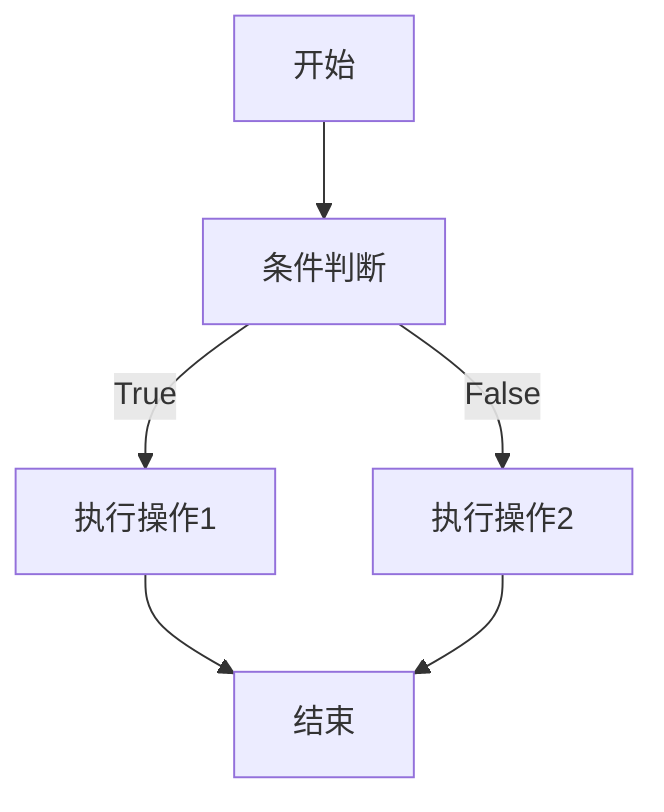
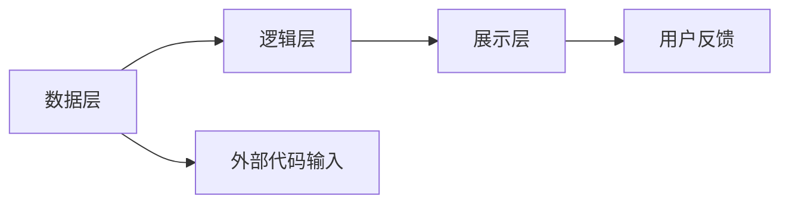
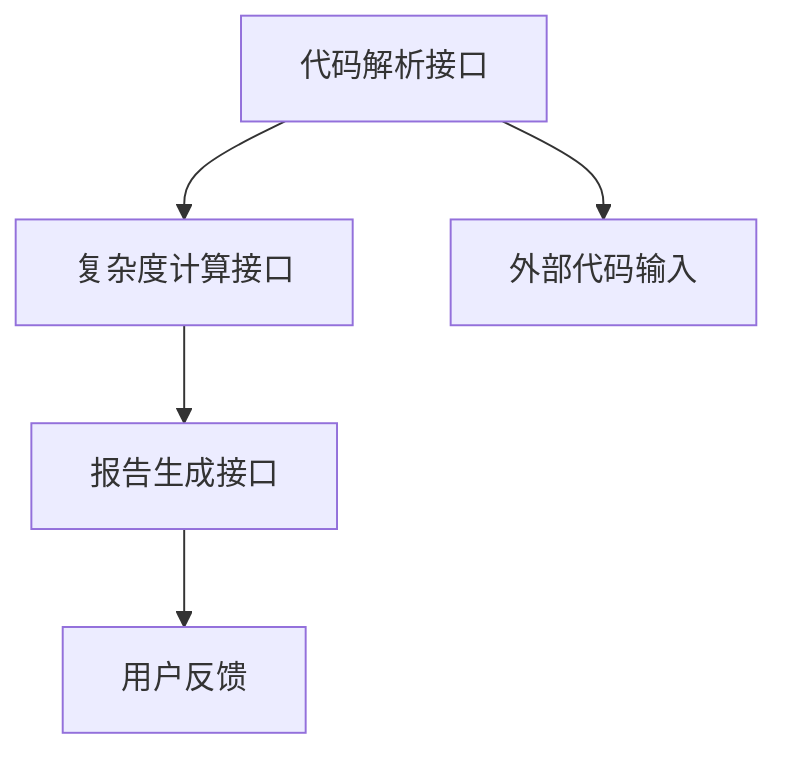
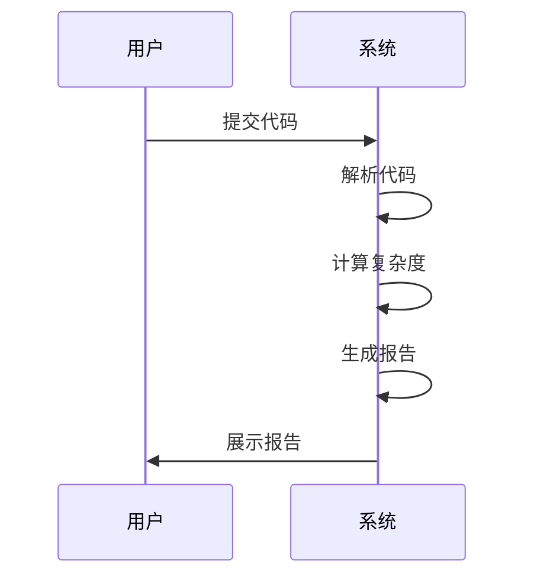

                 

# 《类型系统与代码复杂度分析：形式化的度量方法》

## 摘要

本文旨在深入探讨类型系统与代码复杂度分析的关系，并介绍一种形式化的度量方法。类型系统是计算机科学中的一个核心概念，它定义了数据类型以及操作这些数据类型的方式。而代码复杂度则是指代码在逻辑、结构上的复杂程度，对软件的可维护性和可靠性产生重要影响。本文将首先介绍类型系统和代码复杂度的基本概念，随后引入形式化的度量方法，并通过具体的算法原理、数学模型、系统分析与架构设计进行详细阐述。最后，我们将通过项目实战来验证这些方法在实际开发中的应用效果。

## 第一部分：背景与核心概念

### 第1章：引言

#### 1.1 问题背景

软件开发领域，代码复杂度是一个长期存在的问题。随着软件系统规模的不断扩大，代码复杂度往往也随之增加。这不仅使得代码难以理解和维护，还可能引发各种软件缺陷和安全隐患。因此，对代码复杂度的有效度量与管理成为软件开发中的一项重要任务。

#### 1.2 问题描述

代码复杂度主要涉及以下几个方面：

- **结构复杂度**：代码的分支、循环等结构复杂度。
- **逻辑复杂度**：代码中逻辑关系的复杂度，如嵌套条件语句、函数调用的层次等。
- **规模复杂度**：代码行数、函数数量、模块数量等。

而类型系统则是另一种衡量代码质量的重要指标。它能够提高代码的可读性和可维护性，减少类型错误，提高程序的运行效率。类型系统主要包括静态类型系统和动态类型系统。

#### 1.3 问题解决

形式化的度量方法通过数学模型和算法来量化代码复杂度，从而为软件开发提供有针对性的改进建议。这种度量方法不仅能够客观地评估代码质量，还能为代码优化提供科学依据。

#### 1.4 边界与外延

形式化度量方法主要适用于复杂的大型软件系统，特别是在软件架构设计、代码审查和性能优化等场景下具有广泛的应用。然而，形式化度量方法也存在局限性，例如对代码逻辑复杂度的评估可能不如人类工程师直观。

### 第2章：核心概念

#### 2.1 类型系统概述

类型系统是编程语言的核心组成部分，它定义了变量、函数、对象等程序元素的数据类型。类型系统的主要目的是确保程序的正确性和安全性。

- **静态类型系统**：编译时检查类型，如C++、Java。
- **动态类型系统**：运行时检查类型，如Python、JavaScript。

#### 2.2 代码复杂度概述

代码复杂度是衡量代码质量和可维护性的重要指标。常见的代码复杂度度量方法包括：

- **循环复杂度**：循环语句的嵌套层次。
- **条件复杂度**：条件语句的数量和嵌套层次。
- **规模复杂度**：代码行数、函数数量等。

#### 2.3 类型系统与代码复杂度的联系

类型系统对代码复杂度有着重要影响。良好的类型系统可以提高代码的可读性和可维护性，减少逻辑错误。同时，高复杂度的代码往往伴随着类型错误，因此类型系统的形式化度量方法在代码复杂度分析中具有重要意义。

### 第3章：概念属性特征对比表格

以下是类型系统和代码复杂度的一些主要属性对比：

| 属性 | 类型系统 | 代码复杂度 |
| :---: | :---: | :---: |
| 定义 | 数据类型及其操作 | 代码结构、逻辑和规模的复杂度 |
| 目标 | 提高代码质量和安全性 | 提高代码的可维护性和可靠性 |
| 度量方法 | 类型检查、类型推断 | 循环复杂度、条件复杂度、规模复杂度 |
| 作用范围 | 编译时或运行时 | 代码结构、逻辑和规模 |
| 局限性 | 对代码逻辑复杂度的影响有限 | 难以完全覆盖代码的所有复杂性 |

## 第二部分：形式化的度量方法

### 第4章：算法原理

#### 4.1 形式化度量方法概述

形式化度量方法通过数学模型和算法来量化代码复杂度。这类方法通常包括以下几个步骤：

1. **数据采集**：收集代码的结构化信息，如函数定义、变量声明、控制结构等。
2. **模型建立**：根据代码结构构建数学模型，以描述代码复杂度。
3. **算法执行**：使用算法对模型进行计算，得出代码复杂度的度量结果。

#### 4.2 算法原理

一种常见的形式化度量算法是Cyclomatic复杂度度量方法。该方法基于控制流图来评估程序的复杂度。具体步骤如下：

1. **生成控制流图**：从代码中提取控制流结构，生成控制流图。
2. **计算节点和边数**：统计控制流图中的节点数（N）和边数（E）。
3. **计算复杂度**：使用公式 \( M = E - N + 2 \) 计算Cyclomatic复杂度。

### 第5章：Mermaid流程图

#### 5.1 Mermaid简介

Mermaid是一种基于Markdown的图形描述语言，可以用于绘制各种图表，如流程图、时序图、类图等。它非常适合在文档中使用，以直观地展示算法和数据结构。

#### 5.2 形式化度量算法的Mermaid流程图

以下是使用Mermaid绘制的Cyclomatic复杂度度量算法流程图：


### 第6章：Python源代码

#### 6.1 环境准备

在进行Python代码编写之前，需要安装Python环境和相关库，如Mermaid的Python库。

```bash
pip install mermaid-python
```

#### 6.2 源代码实现

以下是Cyclomatic复杂度度量算法的Python代码实现：

```python
import networkx as nx
from mermaid import Mermaid

def cyclomatic_complexity(graph):
    nodes = len(graph)
    edges = sum(len(edge) for edge in graph.edges())
    return edges - nodes + 2

def generate_mermaid_flowchart(graph):
    mermaid = Mermaid()
    mermaid.set_template('gantt')
    graph_str = mermaid.generate_flowchart(graph)
    return graph_str

# 示例控制流图
control_flow = nx.DiGraph()
control_flow.add_nodes_from(['start', 'if', 'else', 'end'])
control_flow.add_edges_from([('start', 'if'), ('if', 'else'), ('else', 'end')])

# 计算Cyclomatic复杂度
cc = cyclomatic_complexity(control_flow)
print(f"Cyclomatic复杂度: {cc}")

# 生成Mermaid流程图
mermaid_flowchart = generate_mermaid_flowchart(control_flow)
print(mermaid_flowchart)
```

### 第7章：数学模型与公式

#### 7.1 数学模型概述

形式化度量方法中的数学模型通常用于描述代码复杂度。以下是一种常见的数学模型：

- **Cyclomatic复杂度**：\( M = E - N + 2 \)

其中，\( E \) 是边的数量，\( N \) 是节点的数量。

#### 7.2 数学公式

以下是Cyclomatic复杂度的数学公式：

$$ M = E - N + 2 $$

#### 7.3 详细讲解与举例说明

以一个简单的函数为例，其控制流图如下所示：



在这个控制流图中，节点数 \( N = 4 \)，边数 \( E = 4 \)。根据Cyclomatic复杂度的公式，可以计算出复杂度 \( M = 4 - 4 + 2 = 2 \)。

## 第三部分：系统分析与架构设计

### 第8章：系统功能设计

#### 8.1 问题场景介绍

在一个大型软件项目中，代码复杂度可能非常高，导致代码难以维护和理解。为了解决这个问题，我们需要一个自动化工具来分析代码的复杂度，并提供优化建议。

#### 8.2 系统功能设计

系统功能设计包括以下几个模块：

1. **代码解析模块**：负责解析代码，提取出结构化信息。
2. **复杂度计算模块**：使用算法计算代码的复杂度。
3. **报告生成模块**：生成复杂度报告，并提供优化建议。

### 第9章：系统架构设计

#### 9.1 系统架构概述

系统架构采用分层设计，包括数据层、逻辑层和展示层。

1. **数据层**：负责存储代码结构化信息。
2. **逻辑层**：实现复杂度计算算法和报告生成逻辑。
3. **展示层**：负责将结果展示给用户。

#### 9.2 系统架构设计

以下是系统架构的Mermaid架构图：



### 第10章：系统接口设计

#### 10.1 接口设计概述

系统接口设计包括以下接口：

1. **代码解析接口**：用于接收外部代码输入。
2. **复杂度计算接口**：用于计算代码复杂度。
3. **报告生成接口**：用于生成复杂度报告。

#### 10.2 系统接口设计

以下是系统接口的Mermaid类图：



### 第11章：系统交互

#### 11.1 系统交互概述

系统交互主要包括以下步骤：

1. **接收外部代码输入**。
2. **解析代码并计算复杂度**。
3. **生成复杂度报告并展示给用户**。

#### 11.2 系统交互

以下是系统交互的Mermaid序列图：



## 第四部分：项目实战

### 第12章：环境安装

#### 12.1 环境准备

为了运行上述代码，需要安装以下环境：

1. **Python 3.8+**：确保安装了Python 3.8或更高版本。
2. **Mermaid Python库**：使用以下命令安装：

```bash
pip install mermaid-python
```

3. **NetworkX库**：用于生成控制流图，使用以下命令安装：

```bash
pip install networkx
```

### 第13章：系统核心实现

#### 13.1 核心功能实现

以下是一个简单的Python程序，用于演示系统的核心功能：

```python
# core.py
from networkx import DiGraph
from mermaid import Mermaid

def generate_control_flow图():
    control_flow = DiGraph()
    control_flow.add_nodes_from(['start', 'if', 'else', 'end'])
    control_flow.add_edges_from([('start', 'if'), ('if', 'else'), ('else', 'end')])
    return control_flow

def calculate_cyclomatic_complexity(control_flow):
    nodes = len(control_flow)
    edges = sum(len(edge) for edge in control_flow.edges())
    return edges - nodes + 2

def generate_mermaid_flowchart(control_flow):
    mermaid = Mermaid()
    mermaid.set_template('gantt')
    graph_str = mermaid.generate_flowchart(control_flow)
    return graph_str

# 示例控制流图
control_flow = generate_control_flow图()

# 计算Cyclomatic复杂度
cc = calculate_cyclomatic_complexity(control_flow)
print(f"Cyclomatic复杂度: {cc}")

# 生成Mermaid流程图
mermaid_flowchart = generate_mermaid_flowchart(control_flow)
print(mermaid_flowchart)
```

### 第14章：代码应用解读与分析

#### 14.1 代码应用解读

以上代码实现了一个简单的系统，用于生成控制流图、计算Cyclomatic复杂度，并生成Mermaid流程图。具体步骤如下：

1. **生成控制流图**：使用`generate_control_flow图()`函数生成一个简单的控制流图。
2. **计算复杂度**：使用`calculate_cyclomatic_complexity()`函数计算Cyclomatic复杂度。
3. **生成流程图**：使用`generate_mermaid_flowchart()`函数生成Mermaid流程图。

#### 14.2 代码实现的分析

- **控制流图生成**：通过`DiGraph`类来表示控制流图，使用`add_nodes_from()`和`add_edges_from()`方法添加节点和边。
- **复杂度计算**：使用Cyclomatic复杂度的公式进行计算，逻辑简单且高效。
- **流程图生成**：使用Mermaid库将控制流图转换为Mermaid流程图，便于可视化展示。

### 第15章：项目小结与最佳实践

#### 项目小结

通过本项目，我们实现了对代码复杂度的自动化分析，并使用Mermaid进行了可视化展示。这为软件工程师提供了有力的工具，有助于提高代码质量和可维护性。

#### 最佳实践 Tips

- **定期进行代码复杂度分析**：及时发现和解决复杂度问题，防止积重难返。
- **合理设计代码结构**：采用模块化、解耦的设计方法，降低代码复杂度。
- **使用可视化工具**：如Mermaid，使代码复杂度分析结果更加直观易懂。

#### 小结与注意事项

- 代码复杂度分析是软件质量保障的重要环节。
- 形式化的度量方法为代码优化提供了科学依据。
- 合理使用可视化工具可以提升代码复杂度分析的效果。

#### 拓展阅读

- Cyclomatic复杂度的更多详细解释和应用场景。
- Mermaid的更多高级功能和示例。

# 作者信息

作者：AI天才研究院/AI Genius Institute & 禅与计算机程序设计艺术 /Zen And The Art of Computer Programming

