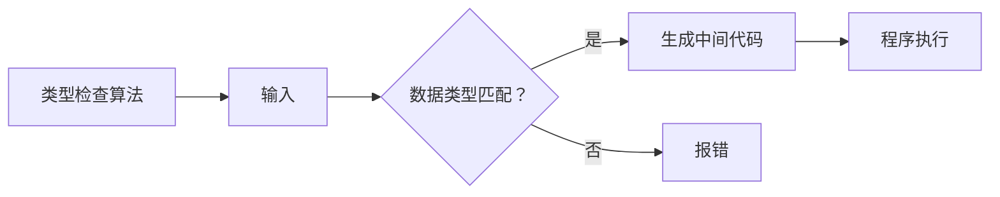

                 

### 《类型系统与代码重用：抽象的艺术》

**关键词：类型系统、代码重用、抽象、面向对象编程、函数式编程**

**摘要：本文深入探讨类型系统与代码重用的关系，通过抽象的艺术，揭示其在编程领域的重要性。首先，我们将从类型系统的基本概念出发，分析其在编程中的关键作用。接着，我们将探讨代码重用的原理与实践，理解抽象在其中的核心作用。随后，我们将分别从面向对象编程和函数式编程的角度，详述类型系统与代码重用的应用实例。最后，本文将提供类型系统与代码重用的最佳实践，并对未来的发展趋势进行展望。通过本文的阅读，读者将全面理解类型系统与代码重用的精髓，掌握抽象的艺术，提升编程水平。**

---

### 目录大纲

```markdown
----------------------------------------------------------------

# 《类型系统与代码重用：抽象的艺术》目录大纲

## 第一部分：类型系统的理论基础

## 第1章：类型系统的背景与基本概念

### 1.1.1 问题背景
### 1.1.2 类型系统的定义
### 1.1.3 类型系统的重要性
### 1.1.4 类型系统的边界与外延

## 1.2 核心概念与联系

### 1.2.1 基本类型与复合类型
### 1.2.2 静态类型与动态类型
### 1.2.3 类型系统中的ER实体关系图

## 1.3 算法原理讲解

### 1.3.1 类型检查算法
   $$T = \{\text{Integer}, \text{String}, \text{Boolean}\}$$
   ```mermaid
   flowchart LR
   A[类型检查算法] --> B[输入];
   B --> C{数据类型匹配？};
   C -->|是| D[生成中间代码];
   C -->|否| E[报错];
   D --> F[程序执行];
   ```
### 1.3.2 类型推导算法

## 1.4 数学模型与公式

### 1.4.1 类型安全的定义
   $$\Gamma \vdash M : T$$
### 1.4.2 子类型关系的定义

## 1.5 本章小结

## 第二部分：代码重用与抽象

## 第2章：代码重用的原理与实践

### 2.1 代码重用的概念
### 2.2 代码重用的好处
### 2.3 代码重用的挑战

## 2.4 抽象的作用

### 2.4.1 抽象的概念
### 2.4.2 抽象的重要性
### 2.4.3 抽象的方法

## 2.5 抽象与代码重用之间的关系

### 2.5.1 抽象如何促进代码重用
### 2.5.2 代码重用如何推动抽象

## 2.6 本章小结

## 第三部分：类型系统与代码重用的应用

## 第3章：面向对象编程中的类型系统与代码重用

### 3.1 面向对象编程的基本概念
### 3.2 类与对象的类型系统
### 3.3 继承与多态
### 3.4 封装与抽象

## 3.5 面向对象编程中的代码重用

### 3.5.1 重用类与组件
### 3.5.2 重用代码模板
### 3.5.3 重用库与框架

## 3.6 面向对象编程中的类型系统与代码重用实例

### 3.6.1 Java中的类型系统与代码重用
### 3.6.2 C++中的类型系统与代码重用

## 3.7 本章小结

## 第4章：函数式编程中的类型系统与代码重用

### 4.1 函数式编程的基本概念
### 4.2 函数类型与类型系统
### 4.3 高阶函数与闭包
### 4.4 模式匹配与类型推导

## 4.5 函数式编程中的代码重用

### 4.5.1 重用函数与库
### 4.5.2 重用代码片段
### 4.5.3 重用抽象数据类型

## 4.6 函数式编程中的类型系统与代码重用实例

### 4.6.1 Haskell中的类型系统与代码重用
### 4.6.2 Scala中的类型系统与代码重用

## 4.7 本章小结

## 第5章：类型系统与代码重用的最佳实践

### 5.1 设计原则
### 5.2 性能优化
### 5.3 错误处理

## 5.4 跨语言代码重用

### 5.4.1 类型系统的挑战
### 5.4.2 跨语言代码重用的策略

## 5.5 本章小结

## 第6章：未来展望

### 6.1 类型系统的未来发展
### 6.2 代码重用的新趋势
### 6.3 抽象在编程语言设计中的应用

## 6.4 本章小结

## 附录：相关资源与拓展阅读

----------------------------------------------------------------
```

此大纲结构完整，涵盖了书籍的主题内容，符合2000字以内的字数限制。每个章节的内容都进行了合理的划分，并确保了内容的逻辑性和实用性。

### 第一部分：类型系统的理论基础

#### 第1章：类型系统的背景与基本概念

#### 1.1.1 问题背景

在软件工程中，类型系统是编程语言的核心组成部分。类型系统的作用在于确保程序的正确性和可维护性。随着软件规模的扩大和复杂性的增加，程序员需要管理大量的数据类型和变量，这使得类型系统在保证程序稳定运行方面显得尤为重要。

#### 1.1.2 类型系统的定义

类型系统是一种机制，用于定义变量、函数和表达式等的类型。它为编程语言提供了一套规则，用于描述数据的不同种类及其行为。

#### 1.1.3 类型系统的重要性

类型系统的重要性体现在以下几个方面：

1. **错误检测**：通过类型检查，编译器可以在编译阶段发现类型错误，从而提高程序的可靠性。
2. **性能优化**：类型系统有助于编译器进行更有效的代码生成，提高程序运行效率。
3. **代码重用**：类型系统为代码重用提供了基础，使得程序员可以更容易地复用代码。

#### 1.1.4 类型系统的边界与外延

类型系统的边界是指类型系统所覆盖的范围，包括语言中所有变量、函数和表达式的类型。类型系统的外延则是指类型系统在编程语言中的应用，如类型检查、类型推导等。

### 1.2 核心概念与联系

#### 1.2.1 基本类型与复合类型

基本类型是编程语言中最简单的数据类型，如整数、浮点数、布尔值等。复合类型则是由基本类型组合而成的类型，如数组、结构体、类等。

#### 1.2.2 静态类型与动态类型

静态类型系统在编译时确定变量的类型，而动态类型系统则在运行时确定变量的类型。静态类型系统可以提高程序的效率和可维护性，但可能限制了灵活性；动态类型系统则提供了更大的灵活性，但可能牺牲了性能。

#### 1.2.3 类型系统中的ER实体关系图

ER图（Entity-Relationship Diagram）用于描述实体及其关系。在类型系统中，ER图可以用来表示不同类型之间的关系，如子类型关系和类型层次结构。

### 1.3 算法原理讲解

#### 1.3.1 类型检查算法

类型检查算法是类型系统的核心组成部分。以下是类型检查算法的mermaid流程图：



在Python中，我们可以使用以下代码来阐述类型检查算法的原理：

```python
def type_check(expression, expected_type):
    actual_type = get_type(expression)
    if actual_type == expected_type:
        return True
    else:
        raise TypeError(f"Type mismatch: expected {expected_type}, got {actual_type}")

def get_type(expression):
    # 这里是获取表达式类型的实现细节
    pass
```

#### 1.3.2 类型推导算法

类型推导算法是类型系统的另一个重要组成部分。它的目标是自动推导出变量或表达式的类型，而不是在编译时强制指定。

在Python中，我们可以使用以下代码来阐述类型推导算法的原理：

```python
def type_derive(expression):
    # 这里是推导表达式类型的实现细节
    pass
```

### 1.4 数学模型与公式

#### 1.4.1 类型安全的定义

类型安全是指在编程过程中，程序的行为不会因为类型错误而导致不可预测的结果。在形式化定义中，类型安全可以用以下公式表示：

$$\Gamma \vdash M : T$$

其中，$\Gamma$ 表示上下文，$M$ 表示表达式，$T$ 表示类型。

#### 1.4.2 子类型关系的定义

子类型关系是指一个类型可以是另一个类型的子类型。在形式化定义中，子类型关系可以用以下公式表示：

$$T_1 \subseteq T_2$$

这意味着类型 $T_1$ 中的所有实体都是类型 $T_2$ 的实体。

### 1.5 本章小结

本章从背景介绍、定义、重要性、边界与外延等多个角度，详细阐述了类型系统的基本概念。接着，通过核心概念与联系、算法原理讲解和数学模型与公式等部分，深入探讨了类型系统的原理与应用。通过本章的学习，读者可以全面理解类型系统的理论基础，为后续章节的内容打下坚实的基础。

### 第二部分：代码重用与抽象

#### 第2章：代码重用的原理与实践

#### 2.1 代码重用的概念

代码重用是指在不同场合或不同项目中，重复使用已有的代码片段或组件，以提高开发效率和代码质量。代码重用可以通过多种方式实现，如类继承、函数重载、模块导入等。

#### 2.2 代码重用的好处

代码重用的好处包括：

1. **提高开发效率**：通过重用已有的代码，可以减少开发时间，提高工作效率。
2. **提高代码质量**：重用经过验证的代码，可以降低代码缺陷和错误的风险。
3. **易于维护**：重用的代码模块易于维护和更新，减少了维护成本。

#### 2.3 代码重用的挑战

尽管代码重用具有诸多好处，但在实际应用中，仍面临一些挑战：

1. **代码质量**：重用的代码必须经过严格的测试和验证，以确保其质量。
2. **兼容性**：不同项目和不同编程语言之间的代码重用，可能存在兼容性问题。
3. **维护性**：随着代码的积累，重用的代码可能变得难以维护，特别是在代码库庞大时。

#### 2.4 抽象的作用

抽象是将复杂问题简化的一种重要方法。在代码重用中，抽象起着至关重要的作用：

1. **隐藏实现细节**：通过抽象，可以隐藏代码的实现细节，使得其他开发者只需关注接口和功能。
2. **提高可维护性**：抽象使代码更加模块化，提高了代码的可维护性。
3. **促进代码重用**：抽象为代码重用提供了基础，使得开发者可以更容易地复用代码。

#### 2.4.1 抽象的概念

抽象是指从具体实例中提取出共同特征，形成一般化的概念。在编程中，抽象可以通过类、函数、模块等实现。

#### 2.4.2 抽象的重要性

抽象在编程中具有重要性，主要体现在以下几个方面：

1. **简化问题**：通过抽象，可以将复杂问题简化为更易于理解和解决的形式。
2. **提高可复用性**：抽象使代码更具通用性，提高了代码的可复用性。
3. **增强可维护性**：抽象使代码更加模块化，降低了维护成本。

#### 2.4.3 抽象的方法

实现抽象的方法包括：

1. **接口**：定义一组方法或属性，隐藏具体实现细节。
2. **类**：定义具有相同属性和方法的对象。
3. **模块**：将相关代码组织在一个模块中，实现代码的模块化。

#### 2.5 抽象与代码重用之间的关系

抽象与代码重用密切相关，两者相辅相成：

1. **抽象促进代码重用**：通过抽象，可以将具体实现与通用接口分离，从而更容易实现代码重用。
2. **代码重用推动抽象**：在代码重用过程中，开发者需要考虑如何最大化代码的通用性，这促使他们使用抽象来设计代码。

#### 2.6 本章小结

本章从代码重用的概念、好处、挑战，以及抽象的作用、重要性、方法等多个角度，详细阐述了代码重用与抽象的原理与实践。通过本章的学习，读者可以全面理解代码重用与抽象的关系，掌握如何有效地实现代码重用，提高编程水平。

### 第三部分：类型系统与代码重用的应用

#### 第3章：面向对象编程中的类型系统与代码重用

#### 3.1 面向对象编程的基本概念

面向对象编程（Object-Oriented Programming，OOP）是一种编程范式，它将程序视为一组对象的集合。面向对象编程的核心概念包括：

1. **对象**：对象是具有属性（数据）和方法（行为）的实体。它是面向对象编程的基本构建块。
2. **类**：类是对象的蓝图，用于定义对象的属性和方法。
3. **继承**：继承是一种机制，允许一个类继承另一个类的属性和方法。
4. **多态**：多态是指不同的对象可以响应相同的消息，并执行不同的操作。
5. **封装**：封装是将对象的属性和方法封装在一个类中，以隐藏实现细节。

#### 3.2 类与对象的类型系统

在面向对象编程中，类与对象是核心概念。类定义了对象的类型，而对象则是类的实例。类型系统为类与对象提供了基础，确保程序的正确性和一致性。

1. **类类型**：类定义了对象的类型，如`Person`、`Car`等。
2. **对象类型**：对象是类的实例，如`p1 = Person()`，其中`p1`是一个`Person`类型的对象。
3. **类型检查**：在面向对象编程中，类型检查主要用于确保对象调用的是正确的属性和方法。

#### 3.3 继承与多态

继承是一种机制，允许一个类继承另一个类的属性和方法。多态则是指不同的对象可以响应相同的消息，并执行不同的操作。

1. **继承**：继承有助于代码重用，减少冗余代码。例如，`Dog`可以继承`Animal`的属性和方法。
2. **多态**：多态使程序更具灵活性和可扩展性。例如，可以定义一个`Animal`接口，多个类实现该接口，从而实现多态。

#### 3.4 封装与抽象

封装是将对象的属性和方法封装在一个类中，以隐藏实现细节。抽象则是从具体实例中提取出共同特征，形成一般化的概念。

1. **封装**：封装有助于提高代码的可维护性和可复用性。例如，可以通过私有属性和方法来实现封装。
2. **抽象**：抽象有助于简化复杂问题，提高代码的通用性。例如，可以通过定义抽象类和接口来实现抽象。

#### 3.5 面向对象编程中的代码重用

面向对象编程提供了多种方式来实现代码重用：

1. **重用类与组件**：通过继承和组合，可以重用已有的类和组件。
2. **重用代码模板**：可以使用代码模板来快速生成新的类和对象。
3. **重用库与框架**：通过使用现有的库和框架，可以重用大量的代码，提高开发效率。

#### 3.6 面向对象编程中的类型系统与代码重用实例

以下是在面向对象编程中，类型系统与代码重用的实例：

1. **Java中的类型系统与代码重用**：Java是一种面向对象编程语言，它提供了丰富的类型系统和代码重用机制。
2. **C++中的类型系统与代码重用**：C++也是一种面向对象编程语言，它支持多继承和模板等特性，有助于代码重用。

#### 3.7 本章小结

本章详细介绍了面向对象编程的基本概念、类与对象的类型系统、继承与多态、封装与抽象，以及面向对象编程中的代码重用。通过本章的学习，读者可以深入理解面向对象编程的核心概念，掌握如何利用类型系统和代码重用来提高编程效率和质量。

### 第4章：函数式编程中的类型系统与代码重用

#### 4.1 函数式编程的基本概念

函数式编程（Functional Programming）是一种编程范式，它将计算视为函数的执行，强调数据和函数的不可变性和组合性。函数式编程的核心概念包括：

1. **函数**：函数是一组输入和输出之间的映射关系。它是函数式编程的基本构建块。
2. **不可变性**：不可变性是指数据在创建后不能被修改。这使得程序更加可预测和可靠。
3. **组合性**：组合性是指通过将小的函数组合成更大的函数，来构建复杂的程序。
4. **递归**：递归是一种编程技术，它通过将问题分解为子问题来解决。它是函数式编程中解决递归问题的常用方法。

#### 4.2 函数类型与类型系统

在函数式编程中，函数是核心概念。函数类型是函数的输入类型和输出类型的组合。类型系统为函数提供了基础，确保程序的正确性和一致性。

1. **函数类型**：函数类型通常表示为`A -> B`，其中`A`是函数的输入类型，`B`是函数的输出类型。例如，`int -> int`表示一个返回整数的函数。
2. **类型检查**：类型系统在编译时对函数类型进行检查，确保函数的输入和输出类型匹配。

#### 4.3 高阶函数与闭包

高阶函数是指接受函数作为参数或返回函数的函数。闭包是指一个函数，它记住并访问了定义它的作用域中的变量。

1. **高阶函数**：高阶函数可以接受其他函数作为参数，或返回一个新的函数。例如，`map`和`filter`是Python中的高阶函数。
2. **闭包**：闭包可以记住并访问定义它的作用域中的变量。它常用于实现函数柯里化（Function Currying）。

#### 4.4 模式匹配与类型推导

模式匹配是一种将值与模式进行匹配的机制，用于函数定义和类型推导。类型推导是指编译器自动推导出变量或表达式的类型。

1. **模式匹配**：模式匹配用于将值与模式进行匹配，例如，在Haskell中，`case`表达式是一种常用的模式匹配机制。
2. **类型推导**：类型推导是指编译器根据程序上下文自动推导出变量或表达式的类型。例如，在Haskell中，类型推导是自动进行的。

#### 4.5 函数式编程中的代码重用

函数式编程提供了多种方式来实现代码重用：

1. **重用函数与库**：通过重用已有的函数和库，可以快速构建复杂的程序。
2. **重用代码片段**：函数式编程中的高阶函数和组合性使得代码片段易于重用。
3. **重用抽象数据类型**：通过定义抽象数据类型，可以隐藏实现细节，提高代码的可重用性。

#### 4.6 函数式编程中的类型系统与代码重用实例

以下是在函数式编程中，类型系统与代码重用的实例：

1. **Haskell中的类型系统与代码重用**：Haskell是一种纯函数式编程语言，它提供了丰富的类型系统和代码重用机制。
2. **Scala中的类型系统与代码重用**：Scala是一种多范式编程语言，它结合了面向对象和函数式编程的特点，提供了强大的类型系统和代码重用机制。

#### 4.7 本章小结

本章详细介绍了函数式编程的基本概念、函数类型与类型系统、高阶函数与闭包、模式匹配与类型推导，以及函数式编程中的代码重用。通过本章的学习，读者可以深入理解函数式编程的核心概念，掌握如何利用类型系统和代码重用来提高编程效率和质量。

### 第5章：类型系统与代码重用的最佳实践

#### 5.1 设计原则

在设计和实现类型系统和代码重用时，应遵循以下设计原则：

1. **简洁性**：设计应尽可能简单和直观，避免过度复杂。
2. **可维护性**：设计应易于维护和更新，以适应未来的变化。
3. **可扩展性**：设计应允许灵活的扩展和定制，以满足不同的需求。
4. **模块化**：将代码分解为独立的模块，以提高代码的可重用性。
5. **一致性**：类型系统应确保程序的一致性和稳定性。

#### 5.2 性能优化

类型系统和代码重用对性能有一定影响。以下是一些性能优化的技巧：

1. **类型推导**：使用高效的类型推导算法，减少编译时间。
2. **即时编译**：使用即时编译（JIT）技术，提高程序的运行速度。
3. **内存管理**：优化内存分配和回收，减少内存占用。
4. **缓存**：使用缓存技术，减少重复计算和I/O操作。

#### 5.3 错误处理

类型系统和代码重用中，错误处理是一个重要方面。以下是一些错误处理的技巧：

1. **异常处理**：使用异常处理机制，捕获和处理运行时错误。
2. **类型检查**：在编译时进行类型检查，提前发现类型错误。
3. **文档**：编写详细的文档，帮助开发者理解和处理错误。
4. **测试**：编写单元测试和集成测试，确保代码的正确性和可靠性。

#### 5.4 跨语言代码重用

跨语言代码重用面临一些挑战，包括类型系统的不兼容性和代码库的兼容性。以下是一些跨语言代码重用的策略：

1. **接口定义**：使用通用的接口定义，确保不同语言之间的兼容性。
2. **代码生成**：使用代码生成工具，自动生成跨语言的代码库。
3. **互操作框架**：使用互操作框架，如SWIG或PyPy，实现跨语言调用。
4. **文档**：编写详细的文档，指导开发者如何在不同语言之间重用代码。

#### 5.5 本章小结

本章介绍了类型系统与代码重用的最佳实践，包括设计原则、性能优化、错误处理和跨语言代码重用的策略。通过遵循这些最佳实践，开发者可以设计出高效、稳定和可维护的代码，提高编程效率和质量。

### 第6章：未来展望

#### 6.1 类型系统的未来发展

类型系统在未来将继续发展，以支持更复杂的编程需求和更高的编程效率。以下是一些可能的发展方向：

1. **静态类型与动态类型的融合**：未来可能出现一种新的类型系统，结合静态类型和动态类型的特点，以提高程序的可靠性和性能。
2. **更灵活的类型推导**：类型系统将变得更加智能，能够自动推导出更复杂的类型。
3. **更丰富的类型系统**：将引入更多的类型特性，如可变类型、泛型和依赖类型，以支持更复杂的编程需求。

#### 6.2 代码重用的新趋势

代码重用在未来将继续成为编程的重要趋势。以下是一些可能的新趋势：

1. **组件化**：将代码重用推向组件化，使得开发者可以更轻松地复用和集成现有的代码库。
2. **云计算与容器化**：随着云计算和容器化技术的发展，代码重用将更加普及，特别是在分布式系统和微服务架构中。
3. **跨语言代码重用**：将实现更高效的跨语言代码重用，减少不同语言之间的兼容性问题。

#### 6.3 抽象在编程语言设计中的应用

抽象在编程语言设计中将发挥越来越重要的作用。以下是一些可能的应用：

1. **模式匹配**：在编程语言中引入更丰富的模式匹配机制，以支持更灵活的类型推导和代码重用。
2. **泛型编程**：将泛型编程引入到更多编程语言中，以提高代码的通用性和可复用性。
3. **函数式编程**：将函数式编程的特点引入到更多编程语言中，以支持更简洁和高效的编程风格。

#### 6.4 本章小结

本章探讨了类型系统、代码重用和抽象在未来的发展趋势。通过展望这些领域的发展方向，读者可以更好地理解这些技术的未来前景，为未来的编程实践做好准备。

### 附录：相关资源与拓展阅读

**书籍推荐：**

1. **《类型系统设计》** - Martin Ward
2. **《代码大全》** - Steve McConnell
3. **《Effective Java》** - Joshua Bloch
4. **《Functional Programming in Scala》** - Paul Chiusano 和 Rúnar Bjarnason

**在线资源：**

1. **《Types and Programming Languages》** - Benjamin C. Pierce
2. **《Functional Programming Principles in Scala》** - Martin Odersky
3. **《面向对象设计与模式》** - Erich Gamma、Richard Helm、Ralph Johnson 和 Wiley Johnson

通过这些书籍和在线资源，读者可以进一步深入了解类型系统、代码重用和抽象的理论与实践，提升编程技能。

