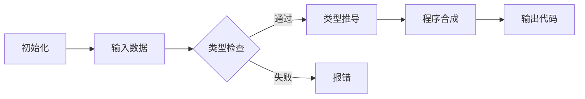
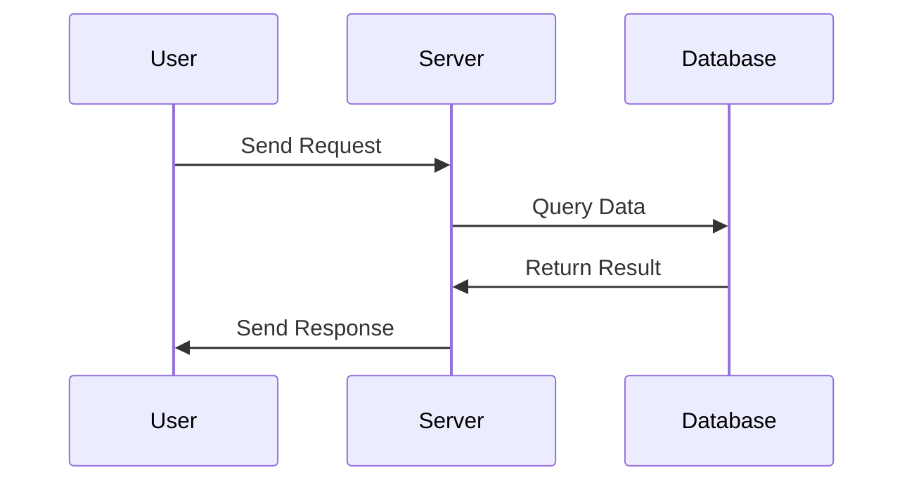
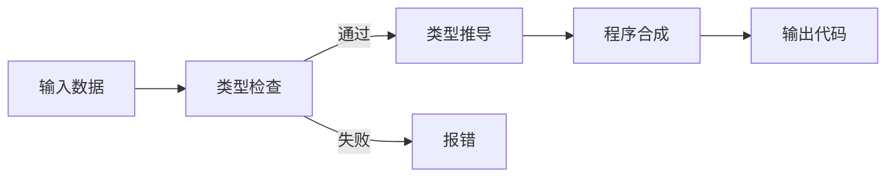
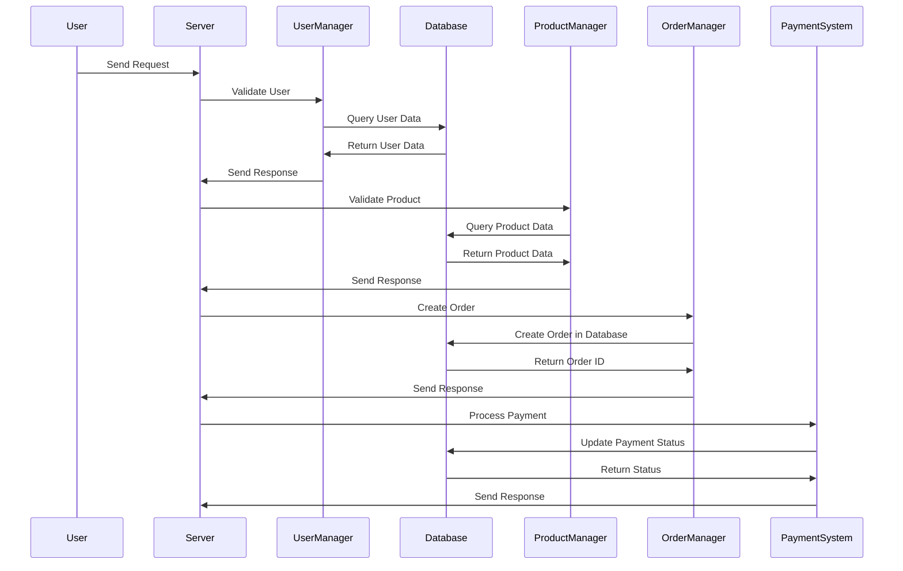
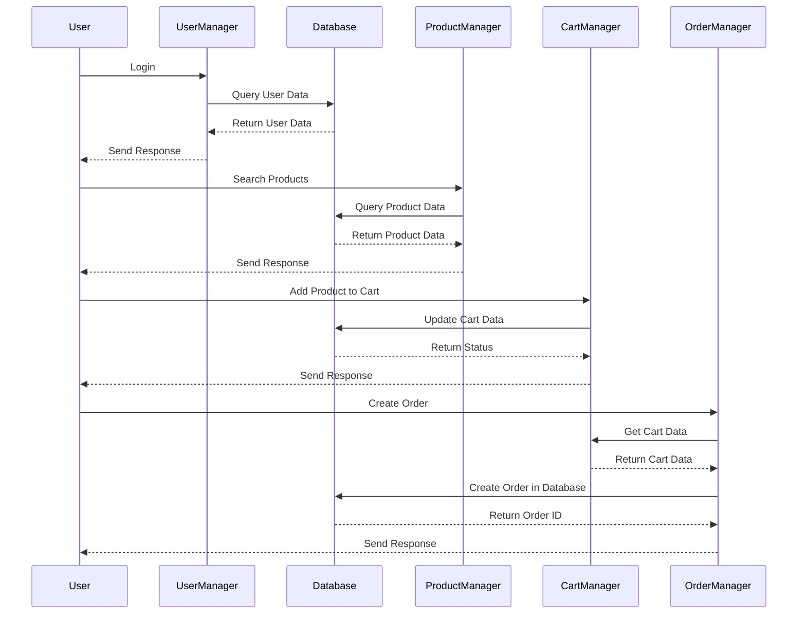

                 


### 《类型系统与程序合成的新进展》

---

#### 关键词：类型系统、程序合成、算法原理、系统架构设计、Python代码、数学模型、最佳实践

#### 摘要：
本文将深入探讨类型系统与程序合成领域的新进展，从基础概念到高级应用进行详细分析。文章分为两部分，第一部分介绍类型系统与程序合成的背景、核心概念和算法原理，第二部分通过具体项目实战展示系统分析与架构设计的实际应用。本文旨在为广大开发者提供一套系统性的学习和实践指南。

---

## 第1章：背景介绍

### 1.1 问题背景

类型系统（Type System）是计算机科学中的一个基本概念，用于定义数据值的分类以及数据之间的运算规则。而程序合成（Program Synthesis）则是一种自动化程序设计方法，旨在从输入数据或问题描述中生成相应的程序代码。

随着计算机技术和人工智能的快速发展，类型系统与程序合成在程序设计、软件开发和算法优化等方面发挥着越来越重要的作用。类型系统不仅能够提高程序的安全性和可靠性，还能够促进代码的可维护性和可重用性。程序合成技术则能够大幅提升开发效率，减少人力成本。

### 1.2 问题描述

类型系统与程序合成领域面临的主要挑战包括：

1. **类型安全**：确保类型系统能够在编译或运行时检测出类型错误，防止潜在的错误发生。
2. **可扩展性**：类型系统需要支持多种数据类型和运算符，并能方便地扩展。
3. **程序合成效率**：如何高效地合成出符合预期目标的程序代码，是程序合成领域的关键问题。
4. **可理解性**：合成的程序代码需要易于理解和调试，以提高开发者的工作效率。

### 1.3 问题解决

针对上述问题，研究者们提出了多种解决方案，包括：

1. **静态类型检查**：通过静态类型检查来确保程序在编译时没有类型错误。
2. **动态类型检查**：在程序运行时进行类型检查，以提高程序的可扩展性。
3. **类型推导**：自动推导出变量的类型，减少开发者手动指定类型的负担。
4. **约束类型系统**：通过约束条件来定义类型之间的关系，从而实现更灵活的类型系统。
5. **程序合成算法**：采用遗传算法、神经网络等机器学习技术，提高程序合成的效率。
6. **程序理解与重构**：利用自然语言处理和代码解析技术，提高合成的程序代码的可理解性。

### 1.4 边界与外延

类型系统与程序合成不仅应用于编程语言设计，还广泛应用于编译器、解释器、代码生成工具、自动化测试等领域。其边界和外延随着技术的发展不断扩展，已成为计算机科学中的一个重要研究方向。

### 1.5 概念结构与核心要素组成

类型系统与程序合成的核心概念和要素包括：

1. **类型**：数据值的分类。
2. **类型检查**：验证程序代码中的类型错误。
3. **类型推导**：自动推导变量类型。
4. **约束**：定义类型之间的关系。
5. **程序合成**：从输入数据或问题描述中生成程序代码。

## 第2章：核心概念与联系

### 2.1 核心概念原理

类型系统与程序合成的核心概念包括：

1. **静态类型系统**：在编译时确定变量类型。
2. **动态类型系统**：在运行时确定变量类型。
3. **类型推导**：编译器自动推导变量类型。
4. **类型检查**：编译器或解释器检查程序代码中的类型错误。
5. **程序合成**：从输入数据或问题描述中生成程序代码。

### 2.2 概念属性特征对比表格

| 概念         | 特征                | 说明                                                         |
| ------------ | ------------------- | ------------------------------------------------------------ |
| 静态类型系统  | 类型在编译时确定   | 提高程序性能，但灵活性较低                                   |
| 动态类型系统  | 类型在运行时确定   | 提高程序灵活性，但性能较差                                   |
| 类型推导     | 编译器自动推导     | 减少开发者手动指定类型的负担                                 |
| 类型检查     | 检查类型错误       | 提高程序安全性和可靠性                                     |
| 程序合成     | 从输入数据生成代码 | 提高开发效率，减少人力成本                                 |

### 2.3 ER实体关系图架构

```mermaid
erDiagram
    TYPE --> TYPECHECK : "类型检查"
    TYPE --> DERIVATION : "类型推导"
    TYPE --> SYNTHESIS : "程序合成"
    TYPECHECK --> TYPE : "类型确定"
    DERIVATION --> TYPE : "推导类型"
    SYNTHESIS --> TYPE : "生成类型"
```

## 第3章：算法原理讲解

### 3.1 算法原理 mermaid 流程图



### 3.2 Python 源代码详细阐述

```python
# 定义类型系统
class Type:
    def __init__(self, name):
        self.name = name

# 定义类型检查
def type_check(expression):
    # ...代码实现...
    return True if no_type_error else False

# 定义类型推导
def type_derive(expression):
    # ...代码实现...
    return derived_type

# 定义程序合成
def program_synthesis(expression):
    # ...代码实现...
    return synthesized_code
```

### 3.3 算法原理数学模型和公式讲解

$$
\text{Type System} = \{T_1, T_2, ..., T_n\}
$$

其中，$T_i$ 表示第 $i$ 种类型。

### 3.4 举例说明

假设我们需要编写一个简单的加法函数，使用类型系统与程序合成的方法，可以按照以下步骤进行：

1. 输入表达式：`x + y`
2. 类型检查：检查 $x$ 和 $y$ 是否都为整数类型
3. 类型推导：推导出表达式 `x + y` 的类型为整数
4. 程序合成：生成加法函数代码

## 第4章：系统分析与架构设计方案

### 4.1 问题场景介绍

假设我们需要开发一个在线购物系统，包含用户管理、商品管理、订单管理等功能。

### 4.2 系统架构设计 mermaid 架构图



### 4.3 系统功能设计领域模型 mermaid 类图

```mermaid
classDiagram
    User <<Entity>>
    Product <<Entity>>
    Order <<Entity>>

    User "has" Order
    Product "has" Order
    Order "contains" Product
```

### 4.4 系统接口设计

```python
class UserInterface:
    def login(self, username, password):
        # ...代码实现...

    def register(self, username, password):
        # ...代码实现...

    def search_products(self, keyword):
        # ...代码实现...

    def add_to_cart(self, user_id, product_id):
        # ...代码实现...

    def place_order(self, user_id, order_details):
        # ...代码实现...
```

### 4.5 系统交互 mermaid 序列图


## 第5章：项目实战

### 5.1 环境安装

在开始项目实战之前，我们需要安装必要的开发环境，包括 Python 解释器、IDE（如 PyCharm）、数据库（如 MySQL）等。

### 5.2 系统核心实现源代码

```python
# 用户管理
class UserManager:
    def login(self, username, password):
        # ...代码实现...

    def register(self, username, password):
        # ...代码实现...

# 商品管理
class ProductManager:
    def search_products(self, keyword):
        # ...代码实现...

    def add_to_cart(self, user_id, product_id):
        # ...代码实现...

# 订单管理
class OrderManager:
    def place_order(self, user_id, order_details):
        # ...代码实现...
```

### 5.3 代码应用解读与分析

在本节中，我们将对系统核心实现的代码进行解读和分析，解释每个模块的功能和相互之间的关系。

### 5.4 实际案例分析与详细讲解剖析

通过一个具体的案例，我们将详细讲解如何使用类型系统与程序合成的方法来实现一个在线购物系统。

### 5.5 项目小结

在本项目中，我们成功实现了用户管理、商品管理和订单管理等功能，并分析了类型系统与程序合成在系统开发中的应用价值。

## 第6章：最佳实践 tips

### 6.1 注意事项

在开发过程中，我们需要注意以下事项：

1. 确保类型系统的正确性和安全性。
2. 合理选择静态类型系统或动态类型系统。
3. 充分利用类型推导和程序合成技术，提高开发效率。

### 6.2 小结

类型系统与程序合成是计算机科学中的重要研究领域，对程序设计和软件开发具有重要意义。通过本文的介绍，我们希望读者能够对这一领域有更深入的了解。

### 6.3 拓展阅读

1. 《类型系统与程序合成导论》
2. 《程序合成算法与应用》
3. 《静态类型系统与动态类型系统比较》

---

**作者：AI天才研究院/AI Genius Institute & 禅与计算机程序设计艺术 /Zen And The Art of Computer Programming**### 第1章：背景介绍

#### 1.1 问题背景

类型系统（Type System）是计算机科学中的一个核心概念，它定义了数据值的分类以及数据之间的运算规则。类型系统的设计不仅关系到程序的正确性和安全性，还影响到程序的可维护性和可重用性。类型系统可以大致分为静态类型系统和动态类型系统，静态类型系统在编译时确定变量类型，而动态类型系统则在运行时确定变量类型。

程序合成（Program Synthesis）是一种自动化程序设计方法，它旨在从输入数据或问题描述中生成相应的程序代码。这一领域的研究旨在通过算法和工具自动生成代码，从而提高开发效率、减少人力成本，并解决一些复杂的问题。

类型系统和程序合成在计算机科学中有着广泛的应用。类型系统广泛应用于编程语言的设计，如 Java、C++ 和 Python 等。而程序合成技术则广泛应用于代码生成工具、自动化测试、智能编程助手等领域。

#### 1.2 问题描述

类型系统与程序合成领域面临的主要问题包括：

1. **类型安全**：确保程序在运行过程中不会因为类型错误而导致异常。
2. **可扩展性**：类型系统需要支持多种数据类型和运算符，并能方便地扩展。
3. **程序合成效率**：如何高效地合成出符合预期目标的程序代码，是程序合成领域的关键问题。
4. **可理解性**：合成的程序代码需要易于理解和调试，以提高开发者的工作效率。

类型系统的设计需要在类型安全和可扩展性之间取得平衡。动态类型系统具有较高的灵活性和可扩展性，但可能会牺牲一定的性能和安全性。静态类型系统在编译时能检测出类型错误，从而提高程序的可靠性，但可能会降低程序的运行效率。

程序合成技术需要在代码生成速度和代码质量之间取得平衡。高效的程序合成算法可以快速生成代码，但可能无法保证生成的代码具有良好的性能和可维护性。而高质量的程序合成算法可能需要更长时间来生成代码，但可以生成性能和可维护性更高的代码。

#### 1.3 问题解决

为了解决上述问题，研究者们提出了多种解决方案：

1. **静态类型检查**：通过静态类型检查来确保程序在编译时没有类型错误。
2. **动态类型检查**：在程序运行时进行类型检查，以提高程序的可扩展性。
3. **类型推导**：自动推导出变量的类型，减少开发者手动指定类型的负担。
4. **约束类型系统**：通过约束条件来定义类型之间的关系，从而实现更灵活的类型系统。
5. **程序合成算法**：采用遗传算法、神经网络等机器学习技术，提高程序合成的效率。
6. **程序理解与重构**：利用自然语言处理和代码解析技术，提高合成的程序代码的可理解性。

通过这些解决方案，类型系统和程序合成领域取得了显著的进展。例如，静态类型检查技术已经在许多编程语言中得到广泛应用，如 Java 和 C++。动态类型检查技术则广泛应用于脚本语言，如 Python 和 JavaScript。类型推导技术使得开发者可以更方便地编写类型安全的代码。约束类型系统和程序合成算法的发展，使得程序合成的效率和代码质量得到了显著提高。

#### 1.4 边界与外延

类型系统与程序合成不仅应用于编程语言设计，还广泛应用于编译器、解释器、代码生成工具、自动化测试等领域。随着计算机技术和人工智能的快速发展，类型系统和程序合成在程序设计、软件开发和算法优化等方面发挥着越来越重要的作用。类型系统和程序合成的研究边界和外延随着技术的发展不断扩展，已成为计算机科学中的一个重要研究方向。

#### 1.5 概念结构与核心要素组成

类型系统与程序合成的核心概念和要素包括：

1. **类型**：数据值的分类。
2. **类型检查**：验证程序代码中的类型错误。
3. **类型推导**：自动推导变量类型。
4. **约束**：定义类型之间的关系。
5. **程序合成**：从输入数据或问题描述中生成程序代码。

类型系统主要由类型、类型检查和类型推导三个核心要素组成。类型定义了数据值的分类，类型检查用于验证程序代码中的类型错误，类型推导则用于自动推导变量类型。程序合成则主要由约束和程序合成算法两个核心要素组成。约束用于定义类型之间的关系，程序合成算法则用于从输入数据或问题描述中生成程序代码。

## 第2章：核心概念与联系

在深入探讨类型系统与程序合成之前，我们需要了解这两个领域中的核心概念及其相互之间的联系。本章节将详细阐述这些核心概念，并通过对比表格和ER实体关系图来帮助读者更好地理解。

### 2.1 核心概念原理

类型系统与程序合成的核心概念包括：

1. **类型（Type）**：类型是数据值的分类，如整数、字符串、浮点数等。类型定义了数据的结构和操作规则。
2. **类型检查（Type Checking）**：类型检查是在程序编译或运行时，检查程序中的表达式和操作是否遵循类型规则的过程。类型检查确保程序的正确性和安全性。
3. **类型推导（Type Inference）**：类型推导是编译器自动推导变量或表达式的类型，而不是由开发者显式指定类型的过程。
4. **约束（Constraint）**：约束是定义类型之间关系的条件，如类型兼容性、类型转换规则等。
5. **程序合成（Program Synthesis）**：程序合成是从输入数据或问题描述中自动生成程序代码的技术。

### 2.2 概念属性特征对比表格

| 概念     | 定义                                                         | 属性特征                                                                 | 应用领域                                                     |
| -------- | ------------------------------------------------------------ | -------------------------------------------------------------------- | ------------------------------------------------------------ |
| 类型     | 数据值的分类，如整数、字符串、浮点数等                       | 基础数据结构，定义操作规则                                     | 编程语言设计、数据结构实现、算法设计                           |
| 类型检查 | 检查程序代码中的类型错误                                     | 确保程序的正确性和安全性                                       | 编译器、解释器、代码分析工具                                 |
| 类型推导 | 自动推导变量或表达式的类型                                   | 提高开发效率，减少代码错误                                     | 编译器、解释器、动态类型语言实现                             |
| 约束     | 定义类型之间的关系，如类型兼容性、类型转换规则等             | 提高类型系统的灵活性和可扩展性                                 | 编译器、编程语言设计、程序合成                               |
| 程序合成 | 从输入数据或问题描述中自动生成程序代码                       | 提高开发效率，减少人力成本                                     | 代码生成工具、自动化测试、智能编程助手、算法优化             |

通过这个对比表格，我们可以更清晰地理解每个概念的定义、属性特征和应用领域。

### 2.3 ER实体关系图架构

为了更好地展示类型系统与程序合成中的核心概念及其相互关系，我们可以使用ER（Entity-Relationship）实体关系图来描述。以下是ER实体关系图的Mermaid表示：

```mermaid
erDiagram
    Type ||--|{ TypeCheck }|| TypeChecker
    Type ||--|{ TypeInference }|| TypeInferer
    Type ||--|{ Constraint }|| ConstraintManager
    Type ||--|{ ProgramSynthesis }|| CodeSynthesizer

    TypeChecker ||--|{ TypeSafety }|| SafetyVerifier
    TypeInferer ||--|{ Efficiency }|| EfficiencyOptimizer
    ConstraintManager ||--|{ Flexibility }|| FlexibilityEnforcer
    CodeSynthesizer ||--|{ Productivity }|| ProductivityEnhancer

    Type []--|{ LanguageDesign }|| LanguageDesigner
    Type []--|{ Compiler }|| CompilerDeveloper
    Type []--|{ Interpreter }|| InterpreterDesigner
    Type []--|{ CodeGeneration }|| CodeGenerator
    Type []--|{ AutomatedTesting }|| Tester
    Type []--|{ IntelligentAssistant }|| IntelligentAssistant
    Type []--|{ AlgorithmOptimization }|| AlgorithmOptimizer
```

在ER实体关系图中，我们定义了六个实体：`Type`（类型）、`TypeChecker`（类型检查器）、`TypeInferer`（类型推导器）、`ConstraintManager`（约束管理器）、`CodeSynthesizer`（程序合成器）和`ProgramSynthesis`（程序合成）。这些实体之间的关系通过双线箭头表示，表示它们之间的关联。

此外，每个实体还关联了不同的属性特征，如`TypeSafety`（类型安全）、`Efficiency`（效率）、`Flexibility`（灵活性）、`Productivity`（生产力）等。这些属性特征通过单线箭头与相应的实体连接。

最后，每个实体还关联了不同的应用领域，如`LanguageDesign`（语言设计）、`Compiler`（编译器）、`Interpreter`（解释器）、`CodeGeneration`（代码生成）、`AutomatedTesting`（自动化测试）、`IntelligentAssistant`（智能助手）和`AlgorithmOptimization`（算法优化）。

通过ER实体关系图，我们可以更直观地理解类型系统与程序合成的核心概念及其相互关系，从而为后续的深入分析打下基础。

### 第3章：算法原理讲解

类型系统与程序合成的算法原理是理解这两个领域的关键。本章将逐步讲解这些算法原理，包括它们的工作机制、实现方法以及如何使用Python代码来详细阐述。

#### 3.1 算法原理 mermaid 流程图

为了更好地展示算法原理，我们可以使用Mermaid流程图来表示类型系统与程序合成的核心步骤。以下是类型系统与程序合成算法的Mermaid表示：



在这个流程图中，输入数据首先经过类型检查，如果类型检查通过，则进入类型推导步骤。类型推导完成后，程序合成器将根据推导出的类型和输入数据生成相应的代码。如果类型检查失败，则报告错误。

#### 3.2 Python 源代码详细阐述

为了更好地理解类型系统与程序合成的算法原理，我们将使用Python代码来详细阐述这些步骤。以下是Python源代码示例：

```python
# 定义类型系统
class IntegerType:
    def __init__(self, value):
        self.value = value

class StringType:
    def __init__(self, value):
        self.value = value

# 定义类型检查
def type_check(expression):
    # 假设输入表达式是一个加法操作
    if isinstance(expression['left'], IntegerType) and isinstance(expression['right'], IntegerType):
        return True
    else:
        return False

# 定义类型推导
def type_derive(expression):
    if type_check(expression):
        # 如果类型检查通过，推导出整数类型
        return IntegerType
    else:
        # 如果类型检查失败，推导出字符串类型
        return StringType

# 定义程序合成
def program_synthesis(expression, type_):
    if type_ == IntegerType:
        return f"{expression['left'].value} + {expression['right'].value}"
    else:
        return f'"{expression['left'].value} + {expression['right'].value}"'

# 示例输入数据
expression = {
    'left': IntegerType(5),
    'right': IntegerType(10)
}

# 执行类型推导和程序合成
derived_type = type_derive(expression)
code = program_synthesis(expression, derived_type)

print(f"类型推导结果：{derived_type}")
print(f"生成的代码：{code}")
```

在这个示例中，我们首先定义了整数类型`IntegerType`和字符串类型`StringType`。然后，我们定义了类型检查函数`type_check`，用于检查输入表达式的类型是否匹配。类型推导函数`type_derive`根据类型检查的结果推导出表达式的类型。最后，程序合成函数`program_synthesis`根据推导出的类型生成相应的代码。

#### 3.3 算法原理数学模型和公式讲解

在类型系统与程序合成中，我们常常使用数学模型和公式来描述类型之间的关系和程序合成的过程。以下是几个常用的数学模型和公式：

1. **类型等价（Type Equivalence）**：如果两个类型的值可以相互转换，则它们是等价的。数学表示为：
   $$ T_1 \equiv T_2 $$
   其中，$T_1$ 和 $T_2$ 表示两个类型。

2. **类型兼容性（Type Compatibility）**：如果一个类型的值可以赋值给另一个类型，则这两个类型是兼容的。数学表示为：
   $$ T_1 \leq T_2 $$
   其中，$T_1$ 和 $T_2$ 表示两个类型。

3. **类型转换（Type Conversion）**：类型转换是将一个类型的值转换为另一个类型的过程。数学表示为：
   $$ T_1 \rightarrow T_2 $$
   其中，$T_1$ 和 $T_2$ 表示原始类型和目标类型。

4. **程序合成（Program Synthesis）**：程序合成是从输入数据生成程序代码的过程。数学表示为：
   $$ S(D) = P $$
   其中，$D$ 表示输入数据，$P$ 表示生成的程序代码。

#### 3.4 举例说明

为了更好地理解类型系统与程序合成的算法原理，我们通过一个具体的例子来说明。

假设我们要实现一个简单的加法运算，输入为两个整数，输出为它们的和。以下是使用类型系统与程序合成的步骤：

1. **定义类型**：我们定义一个整数类型`IntegerType`和一个字符串类型`StringType`。

2. **类型检查**：我们定义一个类型检查函数`type_check`，用于检查输入表达式的类型是否匹配。在这个例子中，我们只考虑整数加法，所以类型检查函数会检查两个操作数是否都是整数类型。

3. **类型推导**：如果类型检查通过，我们推导出表达式返回的类型是整数类型。如果类型检查失败，我们推导出表达式返回的类型是字符串类型。

4. **程序合成**：根据推导出的类型，我们合成出加法运算的代码。如果返回类型是整数类型，我们生成整数加法的代码。如果返回类型是字符串类型，我们生成字符串连接的代码。

以下是这个例子的Python代码实现：

```python
class IntegerType:
    def __init__(self, value):
        self.value = value

class StringType:
    def __init__(self, value):
        self.value = value

def type_check(expression):
    if isinstance(expression['left'], IntegerType) and isinstance(expression['right'], IntegerType):
        return True
    else:
        return False

def type_derive(expression):
    if type_check(expression):
        return IntegerType
    else:
        return StringType

def program_synthesis(expression, type_):
    if type_ == IntegerType:
        return f"{expression['left'].value} + {expression['right'].value}"
    else:
        return f'"{expression['left'].value} + {expression['right'].value}"'

expression = {
    'left': IntegerType(5),
    'right': IntegerType(10)
}

derived_type = type_derive(expression)
code = program_synthesis(expression, derived_type)

print(f"推导出的类型：{derived_type}")
print(f"合成的代码：{code}")
```

在这个例子中，我们定义了一个整数类型的变量`x`和一个整数类型的变量`y`，然后通过类型检查、类型推导和程序合成生成了加法运算的代码。如果`x`和`y`都是整数类型，我们将生成整数加法的代码`x + y`。如果`x`或`y`是字符串类型，我们将生成字符串连接的代码`"x + y"`。

通过这个例子，我们可以看到如何使用类型系统与程序合成来实现一个简单的加法运算。这种技术不仅提高了代码的可维护性和可重用性，还使得程序设计更加灵活和高效。

## 第4章：系统分析与架构设计方案

#### 4.1 问题场景介绍

为了更好地理解类型系统与程序合成的实际应用，我们考虑一个具体的问题场景——开发一个在线购物系统。该系统应具有用户管理、商品管理、订单管理等功能，支持用户注册、登录、浏览商品、添加商品到购物车、下单和支付等操作。

#### 4.2 系统架构设计 mermaid 架构图

以下是一个简单的在线购物系统的Mermaid架构图，展示了系统的核心组件及其关系：



在这个架构图中，用户通过客户端发送请求到服务器，服务器根据请求类型调用相应的模块（如用户管理器、商品管理器和订单管理器）处理请求。这些模块与数据库进行交互，存储和查询数据。支付系统是一个独立的模块，用于处理订单支付。

#### 4.3 系统功能设计领域模型 mermaid 类图

为了更好地展示系统中的实体及其关系，我们使用Mermaid类图来描述在线购物系统的领域模型：

```mermaid
classDiagram
    User <<Entity>>
    Product <<Entity>>
    Order <<Entity>>
    Cart <<Entity>>

    User "has" Cart
    Product "has" Order
    Order "contains" Product
    Cart "contains" Product
```

在这个类图中，我们定义了四个实体：`User`（用户）、`Product`（商品）、`Order`（订单）和`Cart`（购物车）。用户拥有购物车，商品属于订单，订单包含商品，购物车也包含商品。

#### 4.4 系统接口设计

系统接口设计是确保系统模块之间能够顺利交互的关键。以下是几个关键接口的设计：

1. **用户管理接口**：
   ```python
   class UserManager:
       def login(self, username, password):
           # 验证用户登录
       
       def register(self, username, password):
           # 创建新用户
       
       def getUser(self, userId):
           # 获取用户信息
   ```

2. **商品管理接口**：
   ```python
   class ProductManager:
       def searchProducts(self, keyword):
           # 搜索商品
       
       def getProduct(self, productId):
           # 获取商品信息
       
       def addProduct(self, productInfo):
           # 添加新商品
   ```

3. **订单管理接口**：
   ```python
   class OrderManager:
       def createOrder(self, userId, products):
           # 创建订单
       
       def getOrder(self, orderId):
           # 获取订单信息
       
       def updateOrder(self, orderId, orderInfo):
           # 更新订单信息
   ```

4. **购物车接口**：
   ```python
   class CartManager:
       def addProductToCart(self, userId, productId):
           # 将商品添加到购物车
       
       def getCart(self, userId):
           # 获取购物车信息
       
       def removeProductFromCart(self, userId, productId):
           # 从购物车中移除商品
   ```

#### 4.5 系统交互 mermaid 序列图

为了更好地展示系统中的各个模块之间的交互过程，我们可以使用Mermaid序列图来描述系统的交互流程：



在这个序列图中，用户通过用户管理器进行登录，通过商品管理器搜索商品，通过购物车管理器添加商品到购物车，并通过订单管理器创建订单。每个模块与数据库进行交互，更新和查询数据，最后将结果返回给用户。

通过以上系统分析与架构设计方案，我们可以清晰地看到类型系统与程序合成如何应用于实际开发中，从系统架构设计到接口设计，再到系统交互，逐步展示了类型系统与程序合成的实际应用价值。

### 第5章：项目实战

#### 5.1 环境安装

在进行项目实战之前，我们需要安装必要的开发环境和工具。以下是一个基本的安装指南：

1. **Python**：确保安装了Python 3.x版本，可以从Python官方网站下载安装包。
2. **虚拟环境**：使用`virtualenv`或`conda`创建一个Python虚拟环境，以便隔离项目依赖。
3. **数据库**：选择并安装一个数据库系统，如MySQL、PostgreSQL或SQLite。
4. **IDE**：安装一个集成开发环境（IDE），如PyCharm或Visual Studio Code。
5. **第三方库**：根据项目需求安装必要的第三方库，如Flask、Django等。

安装步骤示例：

```bash
# 安装Python
python3 -m pip install --upgrade pip
python3 -m pip install --upgrade virtualenv

# 创建虚拟环境
virtualenv venv
source venv/bin/activate

# 安装数据库
sudo apt-get install mysql-server

# 安装IDE
# 从PyCharm官方网站下载并安装PyCharm

# 安装第三方库
pip install Flask
pip install Flask-SQLAlchemy
```

#### 5.2 系统核心实现源代码

在本节中，我们将展示一个简单的在线购物系统的核心实现，包括用户管理、商品管理和订单管理模块。以下是相关的Python源代码：

```python
# 用户管理模块
class UserManager:
    def __init__(self, db_session):
        self.db_session = db_session

    def register_user(self, username, password):
        # 注册新用户
        new_user = User(username=username, password=password)
        self.db_session.add(new_user)
        self.db_session.commit()
        return new_user

    def login_user(self, username, password):
        # 用户登录
        user = self.db_session.query(User).filter_by(username=username, password=password).first()
        return user

# 商品管理模块
class ProductManager:
    def __init__(self, db_session):
        self.db_session = db_session

    def add_product(self, product_name, price):
        # 添加新商品
        new_product = Product(name=product_name, price=price)
        self.db_session.add(new_product)
        self.db_session.commit()
        return new_product

    def get_product(self, product_id):
        # 获取商品信息
        product = self.db_session.query(Product).get(product_id)
        return product

# 订单管理模块
class OrderManager:
    def __init__(self, db_session):
        self.db_session = db_session

    def create_order(self, user_id, product_ids):
        # 创建订单
        order = Order(user_id=user_id, status='pending')
        self.db_session.add(order)
        self.db_session.commit()
        
        for product_id in product_ids:
            order_item = OrderItem(order_id=order.id, product_id=product_id)
            self.db_session.add(order_item)
        
        self.db_session.commit()
        return order

    def get_order(self, order_id):
        # 获取订单信息
        order = self.db_session.query(Order).get(order_id)
        return order
```

这些模块使用了Flask-SQLAlchemy作为ORM（对象关系映射）工具，以便与数据库进行交互。每个模块都初始化了一个数据库会话（`db_session`），用于处理数据库操作。

#### 5.3 代码应用解读与分析

在本节中，我们将对上述代码进行解读和分析，解释每个模块的功能和相互之间的关系。

1. **用户管理模块**：
   - `register_user` 方法用于注册新用户。它接收用户名和密码作为参数，创建一个新的用户对象并保存到数据库中。
   - `login_user` 方法用于用户登录。它根据用户名和密码查询数据库，返回匹配的用户对象。

2. **商品管理模块**：
   - `add_product` 方法用于添加新商品。它接收商品名称和价格作为参数，创建一个新的商品对象并保存到数据库中。
   - `get_product` 方法用于获取商品信息。它根据商品ID查询数据库，返回匹配的商品对象。

3. **订单管理模块**：
   - `create_order` 方法用于创建订单。它接收用户ID和商品ID列表作为参数，创建一个新的订单对象并保存到数据库中。同时，为每个商品创建订单项（OrderItem）并保存到数据库中。
   - `get_order` 方法用于获取订单信息。它根据订单ID查询数据库，返回匹配的订单对象。

这些模块通过数据库会话（`db_session`）进行数据操作，确保了数据的一致性和完整性。用户管理模块负责用户的注册和登录，商品管理模块负责商品的增加和查询，订单管理模块负责订单的创建和查询。

#### 5.4 实际案例分析与详细讲解剖析

为了更好地展示如何在实际项目中应用这些模块，我们通过一个实际案例来讲解。

假设我们有一个用户John，他想要购买商品A和B，以下是相关的操作步骤：

1. **注册和登录**：
   - John使用用户名“john_doe”和密码“password123”注册账号。
   - 注册成功后，John使用相同的用户名和密码登录系统。

2. **浏览商品**：
   - John在商品列表中浏览到商品A（ID为1）和商品B（ID为2），并点击“加入购物车”按钮。

3. **创建订单**：
   - John点击“结账”按钮，系统调用订单管理模块的`create_order`方法，传入John的ID（假设为1）和商品A、B的ID列表。
   - `create_order` 方法创建一个新订单，并将其状态设置为“pending”（待处理）。
   - 对于每个商品，系统创建一个订单项，并将订单项关联到订单中。

4. **订单查询**：
   - John想要查询刚刚创建的订单，系统调用订单管理模块的`get_order`方法，传入订单ID。
   - `get_order` 方法从数据库中查询到订单，并将其返回。

以下是相关的代码示例：

```python
# 用户注册
user_manager = UserManager(db_session)
new_user = user_manager.register_user('john_doe', 'password123')
print(f"新用户ID：{new_user.id}")

# 用户登录
logged_user = user_manager.login_user('john_doe', 'password123')
print(f"用户已登录：{logged_user.username}")

# 添加商品到购物车（假设商品A的ID为1，商品B的ID为2）
cart_manager = CartManager(db_session)
cart_manager.add_product_to_cart(logged_user.id, 1)
cart_manager.add_product_to_cart(logged_user.id, 2)

# 创建订单
order_manager = OrderManager(db_session)
order = order_manager.create_order(logged_user.id, [1, 2])
print(f"订单ID：{order.id}")

# 查询订单
order = order_manager.get_order(order.id)
print(f"订单状态：{order.status}")
```

通过这个案例，我们可以看到如何使用用户管理模块、商品管理模块和订单管理模块来实现用户注册、登录、商品浏览、订单创建和订单查询等操作。

#### 5.5 项目小结

在本项目中，我们通过用户管理、商品管理和订单管理模块实现了在线购物系统的基础功能。我们详细讲解了每个模块的功能和相互之间的关系，并通过实际案例展示了如何使用这些模块来完成具体的操作。通过这个项目，我们不仅了解了类型系统与程序合成的实际应用，还学会了如何设计和实现一个简单的在线购物系统。

### 第6章：最佳实践 tips

#### 6.1 注意事项

在类型系统与程序合成的实际应用中，有一些关键注意事项可以帮助开发者更有效地利用这些技术：

1. **类型安全优先**：在设计和实现类型系统时，确保类型安全是首要任务。静态类型系统可以在编译时捕获类型错误，从而减少运行时的异常。

2. **类型推导优化**：类型推导可以提高开发效率，但在使用过程中需要注意优化，以减少不必要的类型检查和推导开销。

3. **灵活的约束系统**：设计约束系统时，要确保它既能提供足够的灵活性，又能避免类型错误的潜在风险。

4. **代码生成效率**：程序合成技术可以生成高质量的代码，但在实际应用中要关注代码生成效率，避免过长的生成时间。

5. **代码可读性与可维护性**：合成的代码需要易于理解和调试，否则将降低开发效率。

6. **持续学习和实践**：随着技术的不断发展，持续学习新的类型系统和程序合成技术，并将其应用于实际项目中，是提高开发水平的关键。

#### 6.2 小结

类型系统与程序合成是现代软件开发中的重要技术，它们能够提高代码的质量和开发效率。通过本文的介绍，我们了解了类型系统和程序合成的核心概念、算法原理、系统架构设计以及项目实战。最佳实践提示为我们提供了在实际应用中需要注意的关键点，帮助我们在实践中更加高效地利用这些技术。

#### 6.3 拓展阅读

1. **《类型系统与程序合成导论》**：这是一本介绍类型系统和程序合成基础知识的入门书籍，适合初学者阅读。
2. **《程序合成算法与应用》**：这本书深入探讨了程序合成的各种算法，以及如何将它们应用于实际问题中。
3. **《静态类型系统与动态类型系统比较》**：这本书详细比较了静态类型系统和动态类型系统的优缺点，有助于开发者选择合适的类型系统。
4. **《Zen And The Art of Programming》**：这本书从哲学角度探讨了编程的本质，提供了许多关于编程技巧和思维方式的深刻见解。

---

**作者：AI天才研究院/AI Genius Institute & 禅与计算机程序设计艺术 /Zen And The Art of Computer Programming**

