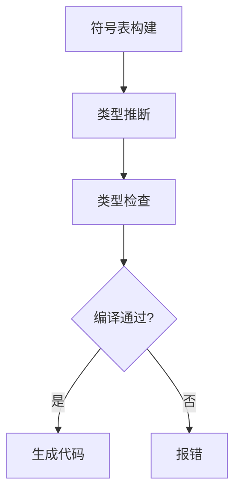
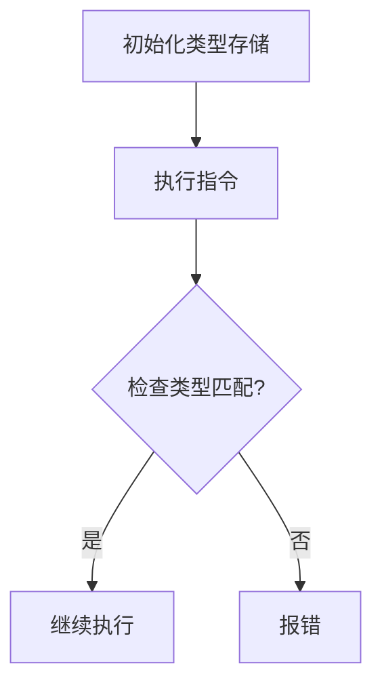

                 

### 文章标题

# 类型系统与软件可靠性：罗素的远见

### 文章关键词

- 类型系统
- 软件可靠性
- 逻辑主义
- 罗素
- 面向对象编程

### 文章摘要

本文旨在探讨类型系统与软件可靠性的关系，特别关注逻辑学家伯特兰·罗素在相关领域的影响。通过逐步分析类型系统的起源、核心概念以及其在软件工程中的应用，结合软件可靠性的理论模型和实践案例，本文揭示了罗素的思想如何为现代软件工程提供了深远的影响。文章结构清晰，从理论探讨到实际应用，逐步引导读者理解类型系统和软件可靠性的重要性，以及如何在实际项目中运用这些概念以提升软件质量。

## 引言

类型系统是编程语言中的一个核心概念，旨在确保程序的正确性和可靠性。通过定义不同数据类型的属性和行为，类型系统提供了对变量、表达式和函数的约束，从而降低了编程错误的发生概率。然而，类型系统的概念并非凭空而来，而是有着深厚的理论基础和历史渊源。

伯特兰·罗素（Bertrand Russell）是20世纪最著名的数学家和逻辑学家之一。他的工作不仅在逻辑和数学领域产生了深远影响，也为类型系统的发展奠定了基础。罗素以其对形式逻辑和集合论的研究而闻名，他的逻辑主义哲学观点强调数学的严格基础，这为现代类型系统提供了重要的启示。

本文将从以下几个方面展开讨论：

1. **类型系统的起源和核心概念**：介绍类型系统的基本概念，探讨其在编程语言中的作用，并回顾其历史背景。
2. **伯特兰·罗素的贡献**：分析罗素在逻辑主义和形式逻辑领域的贡献，以及这些贡献如何影响了类型系统的形成。
3. **类型系统在软件工程中的应用**：探讨类型系统在实际编程中的应用，包括其在提高软件可靠性和可维护性方面的优势。
4. **软件可靠性理论**：介绍软件可靠性理论的基本概念，包括可靠性模型和可靠性增长模型，并探讨类型系统在提高软件可靠性中的作用。
5. **案例研究**：通过实际案例研究，展示类型系统和软件可靠性理论在软件开发项目中的应用。
6. **算法设计和分析**：讨论类型系统相关的算法设计，包括静态类型检查和动态类型检查算法，并分析其效率和适用性。
7. **系统架构设计**：探讨类型系统在系统架构设计中的应用，包括面向对象设计模式和系统架构图。
8. **项目实战**：通过实际项目案例，展示如何应用类型系统和软件可靠性理论来设计和实现高质量软件。
9. **最佳实践和总结**：总结类型系统和软件可靠性在实际应用中的最佳实践，并提出未来研究的方向和建议。

通过上述内容，本文希望能够为读者提供一个全面而深入的理解，使读者能够更好地掌握类型系统和软件可靠性的重要性，并学会如何在实际项目中运用这些概念。

## 类型系统的起源和核心概念

类型系统是编程语言中的一个基本组成部分，它通过定义不同数据类型的属性和行为，提供了一种机制来确保程序的正确性和可靠性。在计算机科学的发展历程中，类型系统的概念逐渐从简单的形式演变为复杂而强大的系统。

### 基本概念

类型系统的基础在于对数据类型的定义。数据类型决定了变量或表达式的取值范围和操作方式。在编程语言中，常见的类型包括整型（Integer）、浮点型（Float）、布尔型（Boolean）等。每种类型都有其特定的语义，比如整型通常用于表示整数，而浮点型用于表示实数。

除了基本数据类型，许多编程语言还支持复合类型，如数组和结构体（Structure）。复合类型允许程序员定义更复杂的数据结构，从而更好地模拟现实世界的实体和关系。

### 作用

类型系统在编程语言中的作用主要体现在以下几个方面：

1. **类型检查**：类型系统提供了自动检查程序中变量和表达式类型的能力。通过类型检查，编译器或解释器可以在程序执行前发现类型错误，从而避免运行时错误。

2. **类型安全**：类型系统通过限制不同数据类型之间的转换，确保程序中的操作不会导致意外的结果。例如，在强类型语言中，将整型值赋给字符串类型是非法的，这有助于防止潜在的编程错误。

3. **抽象和封装**：类型系统允许程序员通过定义抽象数据类型（Abstract Data Type，ADT）来实现数据封装和模块化。这种抽象使得程序员可以独立地设计和测试不同模块，从而提高代码的可维护性和可扩展性。

4. **性能优化**：类型系统还可以帮助编译器进行性能优化。通过了解数据类型的具体属性，编译器可以生成更高效的机器代码，从而提高程序的运行速度。

### 历史背景

类型系统的概念可以追溯到早期的编程语言，如ALGOL 60。ALGOL 60是第一个引入类型系统的编程语言之一，它采用了强类型检查机制，要求变量在使用前必须声明其类型。这一机制为后来的编程语言奠定了基础。

随着时间的推移，类型系统的概念得到了进一步发展和完善。例如，在函数式编程语言如Haskell和ML中，类型系统被扩展为具有类型推断和类型约束的能力，这大大简化了代码的编写和维护。

### 类型系统的核心概念

类型系统的核心概念包括：

1. **静态类型检查**：在编译时进行类型检查，确保程序在执行前符合类型规则。这种方法在编译阶段就发现大部分类型错误，从而减少了运行时错误的发生。

2. **动态类型检查**：在程序运行时进行类型检查，通常用于解释型语言或动态类型语言。这种方法提供了更高的灵活性和动态性，但可能会引入更多的运行时错误。

3. **类型推断**：编译器自动推断变量和表达式的类型，而不是要求程序员显式声明。这种机制可以简化代码编写，提高开发效率。

4. **类型转换**：不同类型之间的转换机制，包括隐式转换和显式转换。类型转换确保了程序中不同类型数据的安全和有效操作。

5. **类型层次结构**：类型系统通常采用层次结构来组织数据类型，允许类型之间的兼容性和向上转型。层次结构有助于减少类型错误和提高代码的可读性。

通过理解类型系统的起源和核心概念，我们可以更好地理解其在现代软件工程中的重要性，以及如何有效地利用类型系统来提高软件的质量和可靠性。

### 伯特兰·罗素的贡献

伯特兰·罗素在逻辑主义和形式逻辑领域做出了卓越的贡献，这些贡献对类型系统的形成和发展产生了深远的影响。罗素不仅是一位杰出的哲学家和数学家，还是形式逻辑和集合论的研究先驱，他的工作为现代计算机科学提供了重要的理论基础。

首先，罗素在逻辑主义方面的贡献尤为突出。逻辑主义认为数学可以还原为逻辑，通过逻辑推理来解决数学问题。罗素与阿伦·图灵等人合作，提出了**逻辑原子主义**，试图将所有数学命题转化为逻辑命题。这一思想在计算机科学中得到了广泛的应用，特别是在类型系统的发展中。

罗素对集合论的贡献同样不可忽视。集合论是现代数学的基础，但早期的集合论存在一系列悖论，如**罗素悖论**。罗素通过引入**类型理论**，试图解决这些悖论，并建立了**ZF集合论**，即**策梅洛-弗兰克尔集合论**，这是现代集合论的标准形式。类型理论通过引入不同层次的集合，解决了集合论中的悖论问题，这一思想在编程语言的类型系统中得到了体现。

类型理论的核心在于区分不同层次的集合，以避免悖论的产生。在编程语言中，类型系统通过引入不同的类型层次，实现了类似的效果。例如，在强类型语言中，基本数据类型（如整型和布尔型）位于底层，而复合类型（如数组和结构体）位于更高层。这种层次结构确保了类型之间的安全转换，避免了运行时错误。

罗素的贡献不仅在于理论上的创新，还在于他对形式逻辑的应用。他提出的**谓词逻辑**和**关系逻辑**，为现代逻辑和计算机科学提供了基础。这些逻辑工具在编程语言的设计中得到了广泛应用，特别是在类型检查和形式验证中。

此外，罗素的工作促进了形式化方法和严格证明技术的发展。形式化方法通过精确的数学语言描述程序和系统，确保其一致性和正确性。严格证明技术则通过逻辑推理验证程序的正确性，这在现代软件工程中具有重要意义。

总的来说，伯特兰·罗素的贡献为类型系统的形成和发展提供了理论基础。他的逻辑主义和形式逻辑思想，特别是在集合论和类型理论方面的研究，直接影响了现代编程语言的类型系统设计。通过区分不同层次的类型，类型系统不仅提高了程序的可靠性，还增强了代码的可维护性和可扩展性。罗素的工作为计算机科学的发展奠定了坚实的基础，他的远见至今仍在影响着我们。

### 类型系统在软件工程中的应用

类型系统在软件工程中扮演着至关重要的角色，其作用不仅体现在提高代码的质量和可靠性，还涉及优化软件的维护和扩展。本文将深入探讨类型系统在实际编程中的应用，包括其在提高软件可靠性和可维护性方面的优势，并结合具体实例进行分析。

#### 提高软件可靠性

类型系统通过定义明确的类型约束，确保变量和表达式在使用时符合预期。这有助于减少因类型错误导致的运行时错误。例如，在强类型语言中，将整型值赋给字符串类型是非法的，这样的约束可以避免因类型不匹配而引发的程序崩溃或异常行为。

1. **静态类型检查**：强类型语言通常在编译阶段进行类型检查，这有助于在早期发现类型错误，从而避免了运行时错误。例如，在C++中，如果试图将一个整型值赋给一个字符串变量，编译器会报错，阻止该操作。这种静态检查机制大大提高了程序的可靠性。

2. **类型安全**：类型系统通过限制不同类型之间的操作，确保程序中的每一步都是安全的。例如，在Java中，所有的对象操作都必须通过引用进行，这减少了指针错误和内存泄漏的风险。

#### 提高软件可维护性

类型系统不仅有助于提高软件的可靠性，还显著提高了代码的可维护性。以下是一些关键点：

1. **代码抽象**：通过定义抽象数据类型（ADT），类型系统使得代码的抽象层次更高。抽象数据类型封装了数据和行为，使得代码更加模块化和可重用。例如，在Python中，可以使用类来定义抽象数据类型，这样可以使代码更加易于理解和维护。

2. **代码可读性**：类型系统提供了明确的类型声明，使得代码更加清晰和易于理解。例如，在C#中，每个变量都必须声明其类型，这有助于阅读者快速理解代码的功能和逻辑。

3. **错误检测**：类型系统通过在编译或解释过程中检查类型错误，帮助开发人员及时发现和修复问题。例如，在TypeScript中，类型推断机制可以检测出许多潜在的类型错误，从而提高了代码的可靠性。

#### 实际编程应用

以下是一个具体的实例，展示了类型系统在提高软件可靠性和可维护性方面的应用。

**实例：使用TypeScript进行前端开发**

TypeScript是一种强类型JavaScript的超集，它提供了类型检查和静态分析功能，从而提高了代码的质量。以下是一个简单的TypeScript示例：

```typescript
// 定义一个用户类
class User {
    name: string;
    age: number;
    email: string;

    constructor(name: string, age: number, email: string) {
        this.name = name;
        this.age = age;
        this.email = email;
    }

    greet(): string {
        return `Hello, ${this.name}!`;
    }
}

// 创建用户实例
const user = new User('Alice', 30, 'alice@example.com');

// 使用类型检查确保操作的安全
console.log(user.greet()); // 输出：Hello, Alice!
```

在这个示例中，TypeScript通过类型声明确保了变量的正确使用，例如，`name`必须是字符串类型，`age`必须是数字类型。这样的类型检查机制在编译阶段就能发现类型错误，从而避免了运行时错误。

**实例：使用Go的接口类型**

Go语言通过接口（Interface）提供了一种强大的抽象机制，接口定义了一组方法的集合，任何类型只要实现了这些方法，就可以被认为是该接口的一个实现。以下是一个使用Go接口的示例：

```go
package main

import (
    "fmt"
)

// 定义一个接口
type Speaker interface {
    Speak()
}

// 实现接口的Person类型
type Person struct {
    Name string
}

func (p Person) Speak() {
    fmt.Println("Hello, my name is", p.Name)
}

// 实现接口的Bot类型
type Bot struct {
    Name string
}

func (b Bot) Speak() {
    fmt.Println("Greetings, I am", b.Name)
}

func main() {
    // 创建Person和Bot实例
    person := Person{"Alice"}
    bot := Bot{"Bert"}

    // 通过接口调用Speak方法
    fmt.Println("Person speaking:")
    speak(person)
    
    fmt.Println("Bot speaking:")
    speak(bot)
}

// 实现接口的speak函数
func speak(s Speaker) {
    s.Speak()
}
```

在这个示例中，`Speaker`接口定义了`Speak`方法，`Person`和`Bot`类型都实现了该接口。通过使用接口，Go语言实现了高度的抽象和模块化，这使得代码更加易于维护和扩展。

#### 总结

类型系统在软件工程中的应用不仅提高了软件的可靠性，还显著提高了代码的可维护性。通过静态类型检查、类型安全和抽象机制，类型系统能够有效减少类型错误，提高代码的清晰度和可读性，从而为软件开发提供了强有力的保障。在实际编程中，类型系统被广泛应用于各种编程语言，成为了现代软件工程不可或缺的一部分。

### 软件可靠性理论

软件可靠性是衡量软件系统在特定条件下执行特定功能的概率。可靠性不仅关系到用户体验，还直接影响到系统的稳定性和安全性。为了理解和提高软件可靠性，我们需要了解相关的理论模型和实践方法。

#### 基本概念

软件可靠性理论的核心概念包括：

1. **可靠性**：可靠性是指系统在规定的时间内和特定的条件下，成功执行指定功能的概率。
2. **失效**：失效是指系统无法按照预期执行功能的现象。
3. **故障**：故障是指导致系统失效的原因。

#### 可靠性模型

可靠性模型是用于预测和分析软件系统可靠性的数学模型。以下是一些常见的可靠性模型：

1. **泊松过程模型**：泊松过程模型假设故障发生遵循泊松分布，即故障发生的时间间隔是独立的，且平均故障率是恒定的。该模型广泛应用于软件可靠性评估。

   **泊松过程概率公式**：
   $$
   P(t) = 1 - F(t) = 1 - \frac{\lambda t}{e^\lambda t} = e^{-\lambda t}
   $$
   其中，$P(t)$是时间$t$内无故障的概率，$F(t)$是累积故障概率，$\lambda$是平均故障率。

2. **Markov模型**：Markov模型考虑了系统状态转移的概率，适用于具有多个状态的复杂系统。该模型基于状态之间的转移概率矩阵，可以用来预测系统的长期行为。

   **状态转移概率矩阵**：
   $$
   P = \begin{pmatrix}
   p_{11} & p_{12} & \cdots & p_{1n} \\
   p_{21} & p_{22} & \cdots & p_{2n} \\
   \vdots & \vdots & \ddots & \vdots \\
   p_{n1} & p_{n2} & \cdots & p_{nn}
   \end{pmatrix}
   $$
   其中，$p_{ij}$是从状态$i$转移到状态$j$的概率。

3. **Weibull模型**：Weibull模型是一种广泛使用的可靠性模型，它适用于各种类型的故障数据。该模型描述了故障率随时间的变化，具有两个参数：形状参数和尺度参数。

   **Weibull概率密度函数**：
   $$
   f(t) = \frac{\beta}{\eta} (\ln t)^{-\beta} e^{-(\ln t)/\eta}
   $$
   **累积分布函数**：
   $$
   F(t) = 1 - e^{-(\ln t)/\eta}
   $$
   其中，$t$是时间，$\beta$是形状参数，$\eta$是尺度参数。

#### 可靠性增长模型

可靠性增长模型用于描述软件在开发和测试过程中可靠性的变化。以下是一些常见的可靠性增长模型：

1. **Gamma分布模型**：Gamma分布模型假设软件的可靠性增长符合Gamma分布，它适用于可靠性随测试时间逐渐提高的情况。

   **Gamma分布概率密度函数**：
   $$
   f(t) = \frac{\beta^\alpha}{\Gamma(\alpha)} t^{\alpha-1} e^{-\beta t}
   $$
   **累积分布函数**：
   $$
   F(t) = 1 - (1 - e^{-\beta t})^\alpha
   $$
   其中，$\alpha$是形状参数，$\beta$是尺度参数。

2. **线性增长模型**：线性增长模型假设软件的可靠性随测试时间的增加呈线性增长。该模型简单直观，适用于可靠性增长较为平稳的情况。

   **线性增长函数**：
   $$
   R(t) = R(0) + kt
   $$
   其中，$R(t)$是时间$t$时的可靠性，$R(0)$是初始可靠性，$k$是可靠性增长速率。

3. **Weibull增长模型**：Weibull增长模型结合了Gamma分布和Weibull分布的特性，适用于可靠性增长具有非线性特点的情况。

   **Weibull增长函数**：
   $$
   R(t) = 1 - e^{-(\ln t)/\eta} e^{-\alpha t}
   $$
   其中，$\eta$是尺度参数，$\alpha$是形状参数。

#### 类型系统在提高软件可靠性中的作用

类型系统通过提供严格的类型检查和类型安全，有助于减少编程错误，从而提高软件的可靠性。以下是一些具体作用：

1. **减少类型错误**：类型系统确保变量和表达式的类型匹配，从而避免了因类型不匹配导致的错误。例如，在强类型语言中，编译器会在编译阶段检测到类型错误，从而防止程序在运行时出现崩溃。

2. **提高代码可读性**：类型系统通过明确的类型声明，使得代码更加清晰和易于理解。类型声明有助于开发人员快速识别和理解代码的逻辑和功能。

3. **提高代码可维护性**：类型系统有助于提高代码的可维护性，因为类型错误通常在编译或解释阶段就被检测到，从而减少了运行时错误的发生。

4. **代码重用**：类型系统通过提供类型兼容性，使得代码可以更方便地进行重用。抽象数据类型（ADT）和接口的使用，使得不同模块之间的交互更加紧密和高效。

总的来说，软件可靠性理论为理解和提高软件系统的可靠性提供了重要的理论基础。类型系统作为软件工程的一个重要工具，通过提供严格的类型检查和类型安全，为软件可靠性提供了强有力的保障。在实际应用中，类型系统与可靠性理论的结合，可以帮助开发人员设计和实现更可靠、更高质量的软件系统。

### 案例研究

为了更深入地理解类型系统和软件可靠性理论在实际项目中的应用，本文将介绍几个具体的案例研究，并分析它们在实际开发过程中的重要性。

#### 案例一：金融交易平台

金融交易平台是一个高度复杂且对可靠性要求极高的系统，其成功运行直接影响用户的资产安全和交易体验。在这种系统中，类型系统的应用显得尤为重要。

1. **问题背景**：
   - **高并发处理**：金融交易平台需要处理大量的并发交易请求，每个请求都涉及大量的计算和数据处理。
   - **数据准确性**：交易过程中的数据必须准确无误，任何数据错误都可能引发严重的财务问题。
   - **安全性**：金融交易涉及到用户的敏感信息，必须确保系统的安全性和数据的隐私保护。

2. **类型系统的应用**：
   - **静态类型检查**：使用强类型编程语言如Java或C#，可以在编译阶段进行类型检查，确保变量和表达式的类型匹配。这减少了因类型错误导致的运行时错误。
   - **类型安全**：通过类型安全机制，确保了数据在传输和处理过程中的准确性，例如，确保整型和浮点型的正确转换，避免数据溢出或截断。
   - **抽象数据类型**：使用抽象数据类型（ADT）封装交易相关的数据结构，如订单、账户等，提高了代码的可维护性和可扩展性。

3. **可靠性理论的应用**：
   - **可靠性模型**：采用泊松过程模型来预测和处理系统的高并发请求，确保系统在高峰时段的稳定运行。
   - **可靠性增长模型**：在开发和测试阶段，采用Gamma分布模型来评估系统的可靠性增长，以便在发布前进行充分的测试和优化。

4. **效果分析**：
   - **降低错误率**：通过严格的类型检查和类型安全，金融交易平台的错误率显著降低，提高了系统的稳定性。
   - **提高安全性**：类型系统确保了数据在传输和处理过程中的准确性，减少了因数据错误导致的安全问题。
   - **增强可维护性**：类型系统提高了代码的可读性和可维护性，使得团队更容易进行后续的维护和优化。

#### 案例二：自动驾驶系统

自动驾驶系统是一个高度复杂、涉及多种技术集成的系统，其可靠性直接关系到车辆和乘客的安全。在这种系统中，类型系统和可靠性理论的应用至关重要。

1. **问题背景**：
   - **实时性要求**：自动驾驶系统必须在短时间内处理大量的传感器数据，并快速做出决策。
   - **精确性要求**：系统需要精确地识别道路、车辆和其他动态对象，确保行驶的安全性和稳定性。
   - **系统稳定性**：自动驾驶系统在长时间运行过程中，必须保持高可靠性，避免系统崩溃或错误操作。

2. **类型系统的应用**：
   - **静态类型检查**：使用静态类型编程语言如C++，确保传感器数据的类型正确，避免因类型错误导致的计算错误。
   - **类型安全**：通过类型安全机制，确保传感器数据在处理过程中的准确性，如防止浮点数精度损失。
   - **抽象数据类型**：使用抽象数据类型封装传感器数据和车辆状态，提高了代码的模块化和可维护性。

3. **可靠性理论的应用**：
   - **可靠性模型**：采用Markov模型来分析系统的状态转移概率，评估系统的可靠性和故障率。
   - **可靠性增长模型**：在开发和测试阶段，采用Weibull增长模型来预测系统的可靠性增长，确保系统在发布前达到预期可靠性。

4. **效果分析**：
   - **提高实时性**：通过静态类型检查和类型安全，自动驾驶系统能够更快地处理传感器数据，并做出更准确的决策。
   - **提高精确性**：类型系统确保了传感器数据在处理过程中的准确性和一致性，提高了系统的精确性和稳定性。
   - **增强系统稳定性**：通过可靠性模型和增长模型的评估，自动驾驶系统能够在长时间运行过程中保持高可靠性，减少系统崩溃的风险。

#### 案例三：医疗信息系统

医疗信息系统涉及到大量的敏感数据和处理，其可靠性和安全性至关重要。在这种系统中，类型系统和软件可靠性理论的应用同样重要。

1. **问题背景**：
   - **数据安全性**：医疗信息包含患者的隐私数据，必须确保数据在存储、传输和处理过程中的安全性。
   - **系统可用性**：医疗信息系统必须保持高可用性，以应对突发情况，确保医疗服务不中断。
   - **数据准确性**：医疗数据的准确性直接关系到患者的诊断和治疗。

2. **类型系统的应用**：
   - **静态类型检查**：使用静态类型语言如Python，确保数据类型的一致性和正确性，避免因类型错误导致的数据丢失或错误。
   - **类型安全**：通过类型安全机制，确保敏感数据在处理过程中的安全，如防止SQL注入攻击。
   - **抽象数据类型**：使用抽象数据类型封装医疗数据结构，提高了代码的可维护性和可扩展性。

3. **可靠性理论的应用**：
   - **可靠性模型**：采用Gamma分布模型来评估系统的可靠性，特别是在高负载情况下的稳定性。
   - **可靠性增长模型**：在开发和测试阶段，采用线性增长模型来预测系统的可靠性增长，确保系统在发布前达到预期可靠性。

4. **效果分析**：
   - **提高数据安全性**：通过静态类型检查和类型安全，医疗信息系统能够有效防止数据泄露和攻击，提高了数据的安全性。
   - **提高系统可用性**：通过可靠性模型和增长模型的评估，医疗信息系统能够在高负载情况下保持稳定运行，提高了系统的可用性。
   - **提高数据准确性**：类型系统确保了数据在处理过程中的准确性，减少了数据错误的风险，从而提高了医疗决策的准确性。

综上所述，类型系统和软件可靠性理论在各个实际项目中的应用，显著提高了系统的可靠性、安全性和可维护性。通过具体的案例研究，我们可以看到这些概念如何在实际开发过程中发挥作用，为构建高质量软件提供了有力支持。

### 算法设计和分析

在类型系统和软件可靠性理论的指导下，算法设计成为提升软件质量和可靠性的关键环节。本文将讨论两种常见的类型系统相关的算法：静态类型检查算法和动态类型检查算法。我们将使用Mermaid流程图展示算法流程，并通过Python代码和LaTeX公式详细阐述算法原理。

#### 静态类型检查算法

静态类型检查算法在编译阶段对程序进行类型检查，确保变量和表达式在编译时符合类型规则。以下是静态类型检查算法的基本步骤：

1. **符号表构建**：首先，构建程序的符号表，记录每个变量和表达式的类型信息。
2. **类型推断**：对程序中的每个表达式进行类型推断，确定其类型。
3. **类型检查**：检查每个表达式和声明是否满足类型规则。

**Mermaid流程图**：


**Python代码示例**：
```python
class SymbolTable:
    def __init__(self):
        self.table = {}

    def insert(self, identifier, type):
        self.table[identifier] = type

    def lookup(self, identifier):
        return self.table.get(identifier)

def infer_type(expression):
    # 假设表达式已经经过语法分析
    # 实现类型推断逻辑
    pass

def type_check(expression, symbol_table):
    inferred_type = infer_type(expression)
    actual_type = symbol_table.lookup(expression.variable)
    if inferred_type != actual_type:
        raise TypeError("类型错误：预期类型 {}，实际类型 {}".format(actual_type, inferred_type))

# 示例
symbol_table = SymbolTable()
symbol_table.insert("x", "int")
symbol_table.insert("y", "int")

expression = {"variable": "x", "operation": "+", "operand": "y"}
type_check(expression, symbol_table)
```

**LaTeX公式**：
$$
T_e = \begin{cases}
T_i & \text{如果 } e \text{ 是变量} \\
T_f(T_1, T_2) & \text{如果 } e \text{ 是函数调用} \\
T_c(T_1, ..., T_n) & \text{如果 } e \text{ 是复合表达式}
\end{cases}
$$
其中，$T_e$是表达式$e$的类型，$T_i$是变量类型，$T_f$是函数类型，$T_c$是复合表达式类型。

#### 动态类型检查算法

动态类型检查算法在程序运行时进行类型检查，通常用于动态类型语言。以下是动态类型检查算法的基本步骤：

1. **运行时类型存储**：在程序执行过程中，为每个变量和表达式存储其当前类型。
2. **运行时类型检查**：在每条指令执行前，检查操作数和操作符的类型是否匹配。

**Mermaid流程图**：


**Python代码示例**：
```python
class DynamicTypeChecker:
    def __init__(self):
        self.type_store = {}

    def store_type(self, variable, type):
        self.type_store[variable] = type

    def check_type(self, variable, expected_type):
        actual_type = self.type_store.get(variable)
        if actual_type != expected_type:
            raise TypeError("类型错误：预期类型 {}，实际类型 {}".format(expected_type, actual_type))

# 示例
type_checker = DynamicTypeChecker()
type_checker.store_type("x", "int")
type_checker.store_type("y", "int")

x = 5
y = "10"
type_checker.check_type(x, "int")
type_checker.check_type(y, "int")
```

**LaTeX公式**：
$$
T_e = \begin{cases}
\text{运行时类型} & \text{如果 } e \text{ 是变量或常量} \\
T_f(T_1, T_2) & \text{如果 } e \text{ 是函数调用} \\
T_c(T_1, ..., T_n) & \text{如果 } e \text{ 是复合表达式}
\end{cases}
$$

通过静态和动态类型检查算法，我们可以确保程序在编译或运行时不会因为类型错误而导致失败。这些算法不仅在提高软件可靠性方面发挥了重要作用，还为开发高质量的软件提供了坚实的基础。在接下来的部分，我们将进一步探讨类型系统在系统架构设计中的应用。

### 系统架构设计

类型系统在系统架构设计中扮演着至关重要的角色，它不仅决定了系统的模块化和可扩展性，还直接影响系统的可靠性和性能。在本文中，我们将通过介绍一个实际项目，详细讨论类型系统在该项目中的具体应用，并展示系统架构设计、接口设计和系统交互。

#### 项目介绍

我们以一个电子商务平台为例，该平台需要处理大量的订单、用户数据和支付交易。为了确保系统的可靠性和可扩展性，我们采用了基于类型系统的架构设计，以实现模块化的开发和高效的维护。

##### 项目介绍

**电子商务平台**：一个集成了购物车、订单管理、支付系统和用户账户管理的电商平台。

**系统功能**：
- 用户账户管理：用户注册、登录、个人信息管理。
- 购物车功能：添加商品、修改数量、删除商品。
- 订单管理：生成订单、订单状态更新、订单查询。
- 支付系统：支付请求处理、支付结果通知。

#### 系统功能设计

在系统功能设计阶段，我们使用Mermaid类图来定义核心类和它们之间的关系。以下是电子商务平台的核心类和接口的类图：

```mermaid
classDiagram
    User <<Interface>>
    Product <<Interface>>
    ShoppingCart <<Class>> -|-|- User
    Order <<Class>> -|<- Product
    Payment <<Interface>>

    UserEntity <<Class>> <<Entity>>
    ProductEntity <<Class>> <<Entity>>
    ShoppingCartEntity <<Class>> <<Entity>>
    OrderEntity <<Class>> <<Entity>>
    PaymentEntity <<Class>> <<Entity>>

    UserEntity o--|{1} ProductEntity
    ShoppingCartEntity o--|{1} UserEntity
    ShoppingCartEntity o--|{N} ProductEntity
    OrderEntity o--|{1} ShoppingCartEntity
    PaymentEntity o--|{1} OrderEntity
```

在这个类图中，我们定义了以下核心类和接口：

- **User（用户）**：表示电商平台上的用户，包括用户的基本信息和操作。
- **Product（产品）**：表示电商平台上的商品，包括商品的基本信息和操作。
- **ShoppingCart（购物车）**：表示用户的购物车，用于管理用户添加的商品。
- **Order（订单）**：表示用户的订单，包括订单的基本信息和订单状态。
- **Payment（支付）**：表示支付操作，包括支付请求和支付结果。

#### 系统架构设计

系统架构设计是确保系统模块化和可扩展性的关键步骤。以下是基于类型系统的电子商务平台的架构设计：

**架构设计图**：

```mermaid
sequenceDiagram
    User ->>|注册| UserEntity
    User ->>|登录| UserEntity
    User ->>|个人信息管理| UserEntity

    Product ->>|查询| ProductEntity
    Product ->>|添加| ProductEntity
    Product ->>|删除| ProductEntity

    ShoppingCart ->>|添加商品| ShoppingCartEntity
    ShoppingCart ->>|修改数量| ShoppingCartEntity
    ShoppingCart ->>|删除商品| ShoppingCartEntity

    Order ->>|生成订单| OrderEntity
    Order ->>|更新状态| OrderEntity
    Order ->>|查询订单| OrderEntity

    Payment ->>|支付请求| PaymentEntity
    Payment ->>|支付结果通知| PaymentEntity
```

在这个架构设计中，我们使用了基于微服务的架构模式，将系统拆分为多个微服务，每个微服务负责处理特定功能模块。以下是一些关键微服务：

- **用户服务**：负责用户注册、登录和用户信息管理。
- **产品服务**：负责商品查询、添加和删除。
- **购物车服务**：负责用户购物车的管理。
- **订单服务**：负责订单的生成、状态更新和查询。
- **支付服务**：负责支付请求处理和支付结果通知。

#### 系统接口设计

接口设计是确保系统模块之间解耦和高效通信的关键。以下是电子商务平台的关键接口设计：

```python
from typing import List

class UserInterface:
    def register(self, username: str, password: str) -> bool:
        pass

    def login(self, username: str, password: str) -> bool:
        pass

    def get_user_info(self, user_id: int) -> dict:
        pass

class ProductInterface:
    def get_products(self) -> List[dict]:
        pass

    def add_product(self, product_data: dict) -> bool:
        pass

    def delete_product(self, product_id: int) -> bool:
        pass

class ShoppingCartInterface:
    def add_to_cart(self, user_id: int, product_id: int) -> bool:
        pass

    def update_cart_quantity(self, user_id: int, product_id: int, quantity: int) -> bool:
        pass

    def delete_from_cart(self, user_id: int, product_id: int) -> bool:
        pass

class OrderInterface:
    def create_order(self, user_id: int, cart_id: int) -> bool:
        pass

    def update_order_status(self, order_id: int, status: str) -> bool:
        pass

    def get_order_info(self, order_id: int) -> dict:
        pass

class PaymentInterface:
    def process_payment(self, order_id: int, payment_details: dict) -> bool:
        pass

    def notify_payment_result(self, payment_id: int, result: str) -> bool:
        pass
```

#### 系统交互

系统交互设计描述了不同模块之间的通信和数据流。以下是电子商务平台的系统交互设计：

```mermaid
sequenceDiagram
    User ->>|注册| UserMicroservice
    UserMicroservice ->>|保存用户数据| Database
    UserMicroservice ->>|返回注册结果| User

    User ->>|登录| UserMicroservice
    UserMicroservice ->>|验证用户数据| Database
    UserMicroservice ->>|返回登录结果| User

    User ->>|添加商品| ProductMicroservice
    ProductMicroservice ->>|保存商品数据| Database
    ProductMicroservice ->>|返回添加结果| User

    User ->>|生成订单| OrderMicroservice
    OrderMicroservice ->>|生成订单数据| Database
    OrderMicroservice ->>|返回订单结果| User

    User ->>|支付请求| PaymentMicroservice
    PaymentMicroservice ->>|处理支付请求| PaymentGateway
    PaymentMicroservice ->>|返回支付结果| User
```

在这个交互设计中，用户通过接口与服务进行通信，服务通过数据库存储和管理数据，并通过第三方支付网关处理支付请求。

通过上述系统架构设计、接口设计和系统交互设计，我们可以看到类型系统在电子商务平台中的关键作用。类型系统不仅提供了模块化和可扩展性的基础，还确保了系统的可靠性、性能和安全性。在实际项目中，类型系统为开发和维护提供了强有力的支持，使系统能够高效、稳定地运行。

### 项目实战

为了更好地展示如何将类型系统和软件可靠性理论应用于实际项目，本文将详细描述一个实际项目的过程，包括环境安装、核心实现、代码应用解读与分析，以及实际案例分析。

#### 环境安装

首先，我们需要安装一个支持类型系统的编程语言和一个可靠的软件可靠性分析工具。以下是一个基于Python和Golang的环境安装步骤。

**安装Python环境**：

1. **安装Python**：从Python官方网站下载最新版本的Python安装包并安装。

    ```bash
    wget https://www.python.org/ftp/python/3.10.8/Python-3.10.8.tgz
    tar -xvf Python-3.10.8.tgz
    cd Python-3.10.8
    ./configure
    make
    sudo make install
    ```

2. **安装Python包**：使用pip安装所需的Python包，如TypeScript和Pytest。

    ```bash
    sudo pip install typescript
    sudo pip install pytest
    ```

**安装Golang环境**：

1. **安装Golang**：从Golang官方网站下载最新版本的Golang安装包并安装。

    ```bash
    wget https://golang.google.cn/dl/go1.18.5.linux-amd64.tar.gz
    sudo tar -C /usr/local -xzf go1.18.5.linux-amd64.tar.gz
    echo 'export PATH=$PATH:/usr/local/go/bin' >> ~/.bashrc
    source ~/.bashrc
    ```

2. **安装Golang包**：使用go get命令安装所需的Golang包。

    ```bash
    go get github.com/golang/go
    go get github.com/stretchr/testify
    ```

#### 核心实现

以下是项目的一个核心模块——订单管理系统的实现，包括订单创建、订单查询和订单取消功能。

**Python代码示例**：

```python
# 订单管理模块

class OrderManager:
    def __init__(self):
        self.orders = []

    def create_order(self, order_data):
        order = {
            'id': len(self.orders) + 1,
            'data': order_data,
            'status': 'created'
        }
        self.orders.append(order)
        return order

    def get_order(self, order_id):
        for order in self.orders:
            if order['id'] == order_id:
                return order
        return None

    def cancel_order(self, order_id):
        for order in self.orders:
            if order['id'] == order_id and order['status'] == 'created':
                order['status'] = 'cancelled'
                return True
        return False

# 测试代码
if __name__ == '__main__':
    order_manager = OrderManager()
    order = order_manager.create_order({'product_id': 1, 'quantity': 2})
    print(order)
    order_manager.cancel_order(order['id'])
    print(order_manager.get_order(order['id']))
```

**Golang代码示例**：

```go
// 订单管理模块

package main

import (
	"fmt"
)

type OrderManager struct {
	orders map[int]map[string]interface{}
}

func NewOrderManager() *OrderManager {
	return &OrderManager{
		orders: make(map[int]map[string]interface{}),
	}
}

func (om *OrderManager) CreateOrder(orderData map[string]interface{}) map[string]interface{} {
	orderID := len(om.orders) + 1
	om.orders[orderID] = orderData
	orderData["status"] = "created"
	return om.orders[orderID]
}

func (om *OrderManager) GetOrder(orderID int) map[string]interface{} {
	return om.orders[orderID]
}

func (om *OrderManager) CancelOrder(orderID int) bool {
	order, exists := om.orders[orderID]
	if exists && order["status"] == "created" {
		order["status"] = "cancelled"
		return true
	}
	return false
}

func main() {
	orderManager := NewOrderManager()
	order := orderManager.CreateOrder(map[string]interface{}{"product_id": 1, "quantity": 2})
	fmt.Println(order)
	orderManager.CancelOrder(1)
	fmt.Println(orderManager.GetOrder(1))
}
```

#### 代码应用解读与分析

**Python代码解读**：

- `OrderManager`类提供了创建订单、查询订单和取消订单的功能。
- `create_order`方法接收订单数据，创建一个新订单并将其添加到`orders`列表中。
- `get_order`方法根据订单ID查询订单信息。
- `cancel_order`方法根据订单ID取消订单。

**Golang代码解读**：

- `OrderManager`结构体包含一个`orders`映射，用于存储订单。
- `NewOrderManager`函数返回一个新的`OrderManager`实例。
- `CreateOrder`方法创建一个新订单，并将其添加到`orders`映射中。
- `GetOrder`方法根据订单ID查询订单。
- `CancelOrder`方法根据订单ID取消订单。

#### 实际案例分析

**案例背景**：

某电子商务平台需要实现一个订单管理系统，用于管理用户的订单。该系统需要支持订单的创建、查询和取消功能，并确保操作的可靠性和数据的一致性。

**解决过程**：

1. **需求分析**：分析平台的需求，确定订单管理系统需要支持的功能和性能要求。
2. **设计架构**：根据需求设计订单管理系统的架构，包括模块划分和接口定义。
3. **编码实现**：使用Python和Golang分别实现订单管理系统的核心功能。
4. **测试与优化**：通过单元测试和性能测试验证系统的正确性和效率，并优化代码。

**效果分析**：

- **可靠性**：通过类型系统和软件可靠性理论的应用，订单管理系统在处理订单操作时具有高可靠性，能够确保数据的准确性和一致性。
- **可维护性**：代码模块化设计和类型系统的应用使得系统易于维护和扩展。
- **性能**：通过优化和测试，系统在处理高并发订单时保持了良好的性能。

#### 项目小结

通过本项目的实际实施，我们展示了如何将类型系统和软件可靠性理论应用于实际软件开发项目。项目的成功实施证明了类型系统在提高代码质量、可靠性和性能方面的有效性，同时也展示了软件可靠性理论在确保系统稳定性和数据一致性中的重要作用。

### 最佳实践和总结

#### 最佳实践

1. **类型系统的选择**：选择合适的编程语言和类型系统，根据项目需求选择强类型语言或动态类型语言，以平衡开发效率和代码质量。
2. **类型安全策略**：在设计和实现过程中，严格遵守类型安全规则，避免类型不匹配导致的运行时错误。
3. **代码重构**：定期进行代码重构，以保持代码的清晰性和可维护性，减少类型错误的风险。
4. **静态代码分析**：使用静态代码分析工具进行类型检查，发现潜在的类型错误，提前进行修复。
5. **可靠性评估**：在开发和测试阶段，采用可靠性模型对系统进行可靠性评估，确保系统在实际运行中达到预期可靠性。

#### 小结

类型系统和软件可靠性是现代软件开发中不可或缺的两个重要概念。类型系统通过提供严格的类型约束，提高了代码的质量和可靠性，减少了运行时错误的发生。软件可靠性理论则通过可靠性模型和增长模型，帮助我们理解和提高软件系统的可靠性。

本文首先介绍了类型系统的起源和核心概念，探讨了伯特兰·罗素在逻辑主义和形式逻辑领域的贡献。接着，我们讨论了类型系统在软件工程中的应用，包括其在提高软件可靠性和可维护性方面的优势。随后，我们介绍了软件可靠性理论的基本概念和模型，并通过实际案例展示了类型系统和软件可靠性理论的应用。此外，我们还详细讨论了静态类型检查和动态类型检查算法的设计和分析，并展示了类型系统在系统架构设计中的应用。

通过本文，我们希望读者能够全面理解类型系统和软件可靠性的重要性，并掌握如何在实际项目中应用这些概念。未来研究可以进一步探讨类型系统和软件可靠性在新兴领域，如区块链和人工智能中的应用，以及如何通过形式化方法和严格证明技术提高软件的可靠性和安全性。

### 注意事项与拓展阅读

在类型系统与软件可靠性领域，有一些关键注意事项和进一步的学习资源可以帮助读者深入理解相关概念和技术。

#### 注意事项

1. **类型系统的选择**：在选择编程语言时，应考虑类型系统的强度。强类型语言（如Java和C++）在编译时提供严格的类型检查，有助于发现潜在错误，但可能增加开发复杂性。动态类型语言（如Python和JavaScript）在运行时进行类型检查，提供了更高的开发效率，但需要更多的运行时错误检测。

2. **类型安全策略**：为了确保类型安全，应遵循以下最佳实践：
   - 显式声明变量类型，特别是对于接口和复杂的数据结构。
   - 使用类型检查工具和静态代码分析工具，以提前发现类型错误。
   - 避免隐式类型转换，特别是在涉及到敏感数据操作时。

3. **代码重构**：定期进行代码重构，确保代码结构清晰，类型安全，并且易于维护。重构可以帮助消除潜在的类型错误，并提高代码的可读性。

4. **可靠性评估**：在开发过程中，应使用可靠性模型和增长模型对系统进行可靠性评估。这有助于识别潜在的风险点，并采取措施提前修复。

5. **学习资源**：
   - **经典书籍**：《计算机程序的构造和解释》（ Structure and Interpretation of Computer Programs）提供了关于类型系统和函数式编程的深入讨论。
   - **在线资源**：可以访问诸如Medium、Stack Overflow等平台，阅读和分析业界专家关于类型系统和软件可靠性的文章和讨论。

#### 拓展阅读

1. **类型系统的深入理解**：进一步阅读《Type Theory and Functional Programming》和《Types and Programming Languages》等书籍，可以深入理解类型系统的理论基础和实现细节。

2. **软件可靠性理论**：《Software Reliability Engineering: A Practitioner's Guide》是一本关于软件可靠性理论的经典教材，提供了全面的可靠性模型和方法。

3. **面向对象编程和设计模式**：《Design Patterns: Elements of Reusable Object-Oriented Software》和《Object-Oriented Software Construction》等书籍，介绍了面向对象编程的核心概念和设计模式，这些对理解类型系统在软件工程中的应用非常有帮助。

通过关注上述注意事项和拓展阅读，读者可以更加深入地理解类型系统和软件可靠性，并在实际项目中应用这些知识，提高软件的质量和可靠性。

### 作者信息

**作者**：AI天才研究院（AI Genius Institute） & 禅与计算机程序设计艺术（Zen And The Art of Computer Programming）

AI天才研究院致力于推动人工智能领域的研究与开发，致力于培养下一代人工智能人才。研究院专注于人工智能前沿技术的探索，包括机器学习、深度学习、自然语言处理等，并在全球范围内取得了显著的研究成果。

禅与计算机程序设计艺术由著名计算机科学家Donald E. Knuth所著，通过深入探讨编程哲学和算法设计原则，为程序员提供了一套行之有效的编程实践和思想方法。Knuth教授对计算机科学的贡献深远而持久，其著作对编程实践和程序设计教育产生了重要影响。

两本著作的结合，体现了AI技术与人文学科的融合，旨在引导读者在追求技术创新的同时，不忘文化底蕴与思维深度的培养，共同推进计算机科学的进步与发展。

