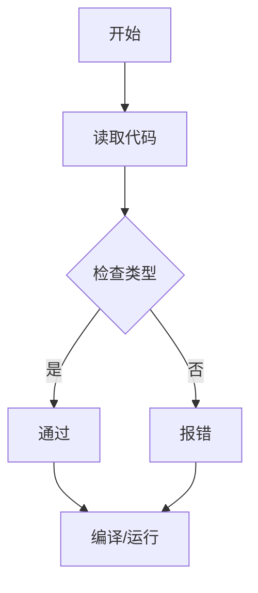
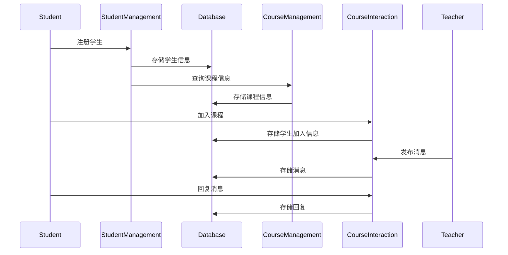
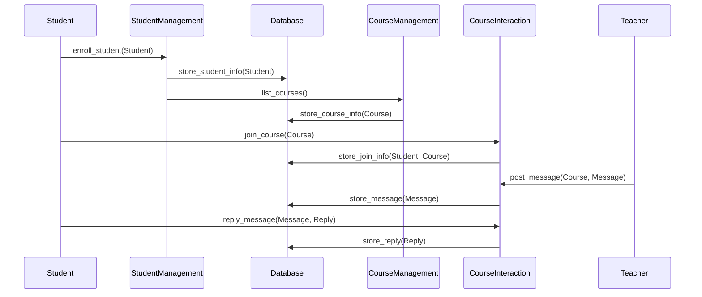

                 

### 文章标题

### 关键词

类型系统、软件复用、组件化开发、算法原理、系统架构、Python实现、数学模型、最佳实践

### 摘要

本文深入探讨了类型系统在软件复用与组件化开发中的关键作用。通过清晰的逻辑分析和实例讲解，文章详细阐述了类型系统的定义、分类、设计原则及其在组件化开发中的应用。此外，本文还介绍了软件复用的概念和实践、组件化开发的原理与实施，并提供了具体的实战案例和最佳实践，旨在为读者提供全面而实用的指导。

----------------------------------------------------------------

## 引言

随着软件系统规模和复杂性的不断增长，软件开发的效率和可维护性成为开发者和项目经理面临的重要挑战。组件化开发作为一种应对复杂系统设计的策略，因其可重用性和模块化特性而广受欢迎。然而，组件化开发的有效实施离不开类型系统的支持。类型系统不仅为组件的交互提供了清晰的语言约束，还确保了软件模块之间的兼容性和稳定性。

本文将围绕类型系统与软件复用、组件化开发的关系展开讨论。首先，我们将介绍类型系统的基础知识，包括其定义、分类和设计原则。接着，我们将探讨软件复用的概念、分类以及其在现代软件开发中的重要性。随后，文章将详细阐述组件化开发的原理与实践，并重点分析类型系统在组件化开发中的作用和实现方法。为了使理论更加贴近实际，文章还将通过具体的算法原理讲解、数学模型和Python源代码展示，以及实战案例分析，全面展示类型系统在组件化开发中的应用。最后，文章将总结最佳实践，提供一些建议和注意事项，以帮助读者在实际项目中有效应用类型系统和组件化开发。

通过本文的阅读，读者将能够深入了解类型系统、软件复用和组件化开发的核心理念，掌握相关技术原理和实践方法，从而提高软件开发的质量和效率。

### 背景介绍

在现代软件开发中，类型系统是一个至关重要的概念。类型系统作为一种语言结构，定义了变量、函数、类和其他程序元素的类型，并为它们之间的交互提供了清晰的规则和约束。它不仅保证了程序的正确性，还提高了代码的可读性和可维护性。

#### 问题背景

类型系统的重要性在于它为软件开发提供了以下几个方面的保障：

1. **类型检查**：类型系统能够在编译或运行时检查代码中是否存在类型错误，从而避免潜在的运行时错误。
2. **安全性与隔离**：类型系统能够隔离不同类型的数据和处理逻辑，减少错误传播的风险。
3. **优化性能**：类型信息有助于编译器生成更高效的代码，因为编译器可以利用类型信息进行特定的优化。

然而，随着软件系统的复杂度增加，传统的类型系统在某些情况下可能显得不足。例如，在大型系统中，组件之间的交互变得复杂，如何确保这些组件能够无缝协作成为了一个挑战。这就需要更加灵活和强大的类型系统来支持。

#### 问题描述

类型系统的常见问题包括：

1. **类型兼容性**：不同组件之间可能存在类型不兼容的问题，这会导致编译失败或运行时错误。
2. **类型冗余**：在缺乏类型推导的语言中，程序员可能需要手动指定类型，导致代码冗长和可读性下降。
3. **类型约束不足**：在某些动态类型语言中，类型检查可能不够严格，导致安全隐患和程序错误。

这些问题直接影响了软件复用和组件化开发的效率和质量。

#### 问题解决

为了解决上述问题，需要从以下几个方面入手：

1. **类型推导**：通过类型推导机制，自动推断变量和表达式的类型，减少类型冗余。
2. **类型兼容性检查**：在编译时或运行时，对组件之间的类型兼容性进行严格检查，确保组件能够无缝协作。
3. **增强类型约束**：在动态类型语言中引入静态类型检查，或者在静态类型语言中提供更多的类型约束机制，提高代码的安全性。

#### 边界与外延

类型系统不仅仅是一个编程语言的概念，它在更广泛的软件工程领域中也发挥着重要作用。类型系统不仅限于语言层面，还涉及编译器设计、中间代码生成、优化策略等方面。此外，类型系统与软件架构设计、测试和部署等环节也有紧密的联系。

#### 概念结构与核心要素组成

类型系统的核心概念包括：

1. **类型**：变量、函数、类等的分类。
2. **类型检查**：对代码中的类型一致性进行检查。
3. **类型推导**：自动推断类型。
4. **类型兼容性**：不同类型之间的兼容性规则。
5. **类型约束**：对类型使用的限制。

类型系统的核心要素组成包括：

1. **类型定义**：定义各种基本类型和复合类型。
2. **类型检查算法**：用于检查类型一致性的算法。
3. **类型转换机制**：用于在不同类型之间进行转换的机制。
4. **类型兼容性规则**：确保不同组件之间类型兼容的规则。

通过深入理解和应用类型系统，开发者可以显著提高软件开发的效率和代码质量，为组件化开发和软件复用提供坚实的保障。

### 核心概念与联系

在深入探讨类型系统与软件复用、组件化开发的关系之前，我们需要先明确几个核心概念，并分析它们之间的联系。

#### 类型系统的定义与分类

**类型系统**是一种语言结构，它定义了变量、函数、类和其他程序元素的类型，并为这些元素之间的交互提供了约束和规则。类型系统可以分为以下几类：

1. **静态类型系统**：在编译时对类型进行检查，如C++、Java。
2. **动态类型系统**：在运行时对类型进行检查，如Python、JavaScript。
3. **静态类型推导**：编译器能够自动推导出变量和表达式的类型，如Haskell、Swift。
4. **动态类型推导**：运行时根据上下文自动推导类型，如TypeScript。

不同类型的类型系统在类型检查、性能和灵活性方面各有优劣。静态类型系统在编译时提供了更严格的检查，能够发现更多错误，但编写代码时可能需要更多的显式类型声明。动态类型系统则提供了更高的灵活性，减少了类型声明的繁琐，但可能需要更多的运行时检查。

**类型系统的核心概念**包括：

- **类型**：变量的分类，如整数、字符串、布尔值。
- **类型检查**：确保代码中的类型一致性。
- **类型兼容性**：不同类型之间的交互规则。
- **类型转换**：不同类型之间的转换机制。

#### 软件复用的概念及其重要性

**软件复用**是指在不同软件开发项目之间重复使用软件组件或代码段。软件复用有助于提高开发效率、降低成本、减少错误和提高软件质量。软件复用可以采用以下几种方式：

1. **代码复用**：通过复制和粘贴代码段来实现。
2. **组件复用**：通过创建可重用的软件组件，如库、框架或服务。
3. **设计模式复用**：通过应用设计模式来复用特定的解决方案。

软件复用的**重要性**体现在以下几个方面：

1. **提高开发效率**：通过复用现成的组件和代码，减少了开发时间和工作量。
2. **降低成本**：减少了重复编写代码的需求，从而降低了开发成本。
3. **提高软件质量**：通过复用经过验证和测试的组件，减少了引入新错误的风险。
4. **促进知识共享**：鼓励团队成员之间共享经验和最佳实践。

#### 组件化开发的原理与实践

**组件化开发**是一种将软件系统划分为多个独立、可重用的组件，并通过定义良好的接口进行交互的开发方法。组件化开发的**原理**包括：

1. **模块化**：将软件系统分解为多个独立的模块，每个模块具有明确的职责和接口。
2. **松耦合**：模块之间的依赖关系尽量减少，以实现更灵活的替换和维护。
3. **高内聚**：每个模块内部的代码紧密相关，职责单一。
4. **可重用性**：组件应设计为可重用的，以实现跨项目的复用。

组件化开发的**实践**包括以下几个步骤：

1. **需求分析**：明确软件系统的功能需求和组件边界。
2. **设计组件接口**：定义组件之间的接口和通信协议。
3. **开发组件**：实现组件功能，并进行单元测试。
4. **集成测试**：将组件集成到系统中，并进行集成测试。
5. **部署和维护**：将组件部署到生产环境，并持续维护和更新。

#### 类型系统与软件复用、组件化开发的联系

类型系统在软件复用和组件化开发中扮演着关键角色。以下是类型系统与这两者之间的联系：

1. **类型检查**：类型系统能够确保组件之间的类型兼容性，防止类型错误和冲突。
2. **代码质量**：通过类型检查，可以提高组件的代码质量，减少错误和漏洞。
3. **可重用性**：类型系统提供了明确的类型约束和接口规范，有助于组件的可重用性。
4. **安全性**：类型系统能够提高软件的安全性，减少类型相关漏洞。

总结来说，类型系统是软件复用和组件化开发的重要基础。通过类型系统，我们可以确保组件之间的兼容性和稳定性，提高软件开发的效率和质量。

#### 算法原理讲解

在深入探讨类型系统与软件复用、组件化开发的关系时，了解类型系统的算法原理至关重要。类型系统中的算法主要分为类型检查算法、类型转换算法和类型兼容性检查算法。以下是对这些算法原理的详细讲解，以及使用Mermaid绘制的流程图和Python源代码示例。

##### 类型检查算法

类型检查算法是类型系统中最核心的组成部分之一。它的作用是在编译时或运行时检查代码中的类型一致性，确保变量、函数和类等程序元素的类型匹配。类型检查算法可以分为静态类型检查和动态类型检查。

1. **静态类型检查**：
   - **原理**：在编译时进行类型检查，确保代码中的每个表达式和操作都符合类型规则。
   - **示例**：

```python
# Python 示例：静态类型检查
def add(a: int, b: int) -> int:
    return a + b

# 编译时类型检查
print(add(5, 10))  # 正确
print(add("5", 10))  # 错误：类型不匹配
```

2. **动态类型检查**：
   - **原理**：在运行时进行类型检查，根据实际运行时类型进行检查。
   - **示例**：

```python
# Python 示例：动态类型检查
def add(a, b):
    return a + b

# 运行时类型检查
print(add(5, 10))  # 正确
print(add("5", 10))  # 错误：运行时类型不匹配
```

##### 类型转换算法

类型转换算法用于在不同类型之间进行转换，确保不同类型的数据可以相互操作。类型转换可以分为显式转换和隐式转换。

1. **显式转换**：
   - **原理**：程序员显式指定类型转换，确保类型转换的明确性和可控性。
   - **示例**：

```python
# Python 示例：显式类型转换
int_str = int("123")  # 转换为整数
str_int = str(123)  # 转换为字符串
```

2. **隐式转换**：
   - **原理**：编译器或运行时根据上下文自动进行类型转换。
   - **示例**：

```python
# Python 示例：隐式类型转换
print("3" + 5)  # 隐式转换为字符串和整数相加，结果为字符串 "35"
```

##### 类型兼容性检查算法

类型兼容性检查算法用于确保组件之间的类型兼容性，防止类型不兼容导致的错误。

1. **原理**：
   - **子类型兼容**：如果一个类型是另一个类型的子类型，则两者兼容。
   - **接口兼容**：如果组件的接口和方法签名兼容，则组件兼容。

2. **示例**：

```python
# Python 示例：类型兼容性检查
class Animal:
    def speak(self):
        pass

class Dog(Animal):
    def speak(self):
        return "汪汪"

dog = Dog()
animal = Animal()

# 类型兼容性检查
is Compatible = isinstance(dog, Animal)  # True，Dog是Animal的子类型
```

##### 使用Mermaid绘制算法流程图

为了更直观地理解类型系统的算法原理，我们可以使用Mermaid绘制算法流程图。以下是使用Mermaid绘制的类型检查算法流程图示例：



##### Python源代码阐述

下面我们将使用Python源代码详细阐述类型转换算法和类型兼容性检查算法的实现。

```python
# Python 示例：类型转换与兼容性检查
def type_check(value, expected_type):
    if isinstance(value, expected_type):
        return True
    else:
        raise TypeError(f"Expected type {expected_type}, but got {type(value)}")

def type_convert(value, target_type):
    if isinstance(value, target_type):
        return value
    elif target_type == str and isinstance(value, int):
        return str(value)
    elif target_type == int and isinstance(value, str):
        return int(value)
    else:
        raise TypeError("Unsupported type conversion")

# 测试
try:
    print(type_convert(123, str))  # 转换为字符串
    print(type_convert("123", int))  # 转换为整数
except TypeError as e:
    print(e)

try:
    type_check("123", int)  # 类型检查失败
except TypeError as e:
    print(e)

try:
    type_check(123, str)  # 类型检查成功
except TypeError as e:
    print(e)
```

##### 数学模型与公式讲解

类型系统的算法原理还可以用数学模型和公式来解释。以下是几个常见的数学模型和公式：

1. **类型转换**：

$$ Type_{convert}(x, y) = \begin{cases} 
x & \text{if } x \text{ is already of type } y \\
y(x) & \text{if } x \text{ can be converted to type } y \\
\text{Error} & \text{otherwise} 
\end{cases} $$

其中，$x$ 和 $y$ 分别代表原始类型和目标类型，$y(x)$ 表示从类型 $x$ 转换到类型 $y$ 的操作。

2. **类型兼容性**：

$$ Compatible(t_1, t_2) = \begin{cases} 
\text{True} & \text{if } t_1 \text{ is a subtype of } t_2 \text{ or } t_1 = t_2 \\
\text{False} & \text{otherwise} 
\end{cases} $$

其中，$t_1$ 和 $t_2$ 分别代表两个类型的类型标识符，子类型关系可以用泛化关系（generalization）或细化关系（specialization）来描述。

##### 举例说明

为了更通俗易懂地说明类型系统的算法原理，我们可以通过实际例子进行讲解。

**例子 1**：类型检查

假设我们有一个函数，要求传入的参数必须是整数类型，否则抛出类型错误。

```python
def add(a: int, b: int) -> int:
    type_check(a, int)
    type_check(b, int)
    return a + b

try:
    add(5, 10)  # 正常运行
except TypeError as e:
    print(e)

try:
    add("5", 10)  # 抛出类型错误
except TypeError as e:
    print(e)
```

**例子 2**：类型转换

假设我们有一个字符串和整数相加的操作，需要将字符串转换为整数后再进行相加。

```python
def add(a: int, b: str) -> int:
    b = type_convert(b, int)
    return a + b

result = add(5, "10")
print(result)  # 输出 15
```

**例子 3**：类型兼容性

假设我们有一个继承关系，`Dog` 类是 `Animal` 类的子类，我们可以检查 `Dog` 类型的实例是否兼容 `Animal` 类。

```python
class Animal:
    def speak(self):
        pass

class Dog(Animal):
    def speak(self):
        return "汪汪"

dog = Dog()
is_compatible = isinstance(dog, Animal)  # 输出 True，因为 Dog 是 Animal 的子类
```

通过这些例子，我们可以看到类型系统在确保代码正确性、类型兼容性和类型转换方面的重要性。理解这些算法原理不仅有助于开发者编写高质量的代码，还能提高软件复用和组件化开发的效率。

#### 系统分析与架构设计方案

在深入探讨类型系统、软件复用和组件化开发之前，我们需要理解具体的系统分析和架构设计方法。本文将通过以下环节介绍系统分析与架构设计方案：

1. **问题场景介绍**：描述需要解决的系统问题及其背景。
2. **项目介绍**：介绍项目的基本信息和目标。
3. **系统功能设计**：使用Mermaid绘制的领域模型类图，详细描述系统的功能。
4. **系统架构设计**：使用Mermaid绘制的系统架构图，展示系统的整体结构。
5. **系统接口设计**：定义系统内各组件之间的接口。
6. **系统交互**：使用Mermaid绘制的系统交互序列图，展示系统组件之间的交互过程。

##### 问题场景介绍

在现代软件开发中，系统复杂性不断增加，导致传统开发模式难以应对。为了提高开发效率、降低成本和提升系统的可维护性，我们需要采用组件化开发和类型系统。然而，如何在实际项目中有效实施这些方法，确保系统的稳定性和可复用性，成为一个亟待解决的问题。

##### 项目介绍

本项目旨在设计并实现一个基于组件化开发的在线教育平台。该平台需要支持多种课程类型、课程管理和学生互动等功能，并且需要确保系统的可扩展性和可维护性。通过组件化开发和类型系统，我们可以实现以下目标：

- **模块化设计**：将系统划分为多个独立组件，提高系统的可维护性和可扩展性。
- **类型安全**：使用类型系统确保组件之间的类型兼容性，减少错误和漏洞。
- **高效开发**：通过组件复用和类型推导，提高开发效率。

##### 系统功能设计

系统功能设计是系统分析的重要环节，决定了系统应该如何满足用户需求。以下是系统的功能设计，并通过Mermaid绘制的领域模型类图展示系统的主要类和关系。

```mermaid
classDiagram
ClassCourse <|-- Course
ClassStudent <|-- Student
ClassTeacher <|-- Teacher
ClassCourseManagement <|-- CourseManagement
ClassStudentManagement <|-- StudentManagement
ClassCourseInteraction <|-- CourseInteraction

Course {
    id: Integer
    name: String
    description: String
    teacher: Teacher
}

Student {
    id: Integer
    name: String
    email: String
}

Teacher {
    id: Integer
    name: String
    email: String
}

CourseManagement {
    addCourse(Course): void
    deleteCourse(Course): void
    updateCourse(Course): void
    listCourses(): List<Course>
}

StudentManagement {
    enrollStudent(Student, Course): void
    dropStudent(Student, Course): void
    listStudents(Course): List<Student>
}

CourseInteraction {
    postMessage(Course, Message): void
    replyMessage(Message, Message): void
    listMessages(Course): List<Message>
}
```

在该类图中，我们定义了以下几个主要类：

- **Course（课程）**：表示课程的基本信息，包括课程ID、名称、描述和教师信息。
- **Student（学生）**：表示学生的基本信息，包括学生ID、姓名和电子邮件。
- **Teacher（教师）**：表示教师的基本信息，包括教师ID、姓名和电子邮件。
- **CourseManagement（课程管理）**：提供课程的增加、删除、更新和查询功能。
- **StudentManagement（学生管理）**：提供学生的注册、退课和查询功能。
- **CourseInteraction（课程互动）**：提供课程内消息的发布、回复和查询功能。

##### 系统架构设计

系统架构设计是确保系统功能和性能的关键步骤。以下是通过Mermaid绘制的系统架构图，展示系统的整体结构和组件之间的关系。



在该架构图中，我们定义了以下几个主要组件：

- **StudentManagement（学生管理）**：负责处理学生的注册、退课等操作。
- **CourseManagement（课程管理）**：负责处理课程的增加、删除、更新等操作。
- **CourseInteraction（课程互动）**：负责处理课程内的消息发布和回复。
- **Database（数据库）**：负责存储学生、课程和消息等信息。

##### 系统接口设计

系统接口设计是确保系统组件之间能够无缝交互的关键。以下是系统内各组件之间的接口定义：

1. **StudentManagement接口**：

```python
class StudentManagementInterface:
    def enroll_student(self, student: Student) -> None:
        pass

    def drop_student(self, student: Student) -> None:
        pass

    def list_students_in_course(self, course: Course) -> List[Student]:
        pass
```

2. **CourseManagement接口**：

```python
class CourseManagementInterface:
    def add_course(self, course: Course) -> None:
        pass

    def delete_course(self, course: Course) -> None:
        pass

    def update_course(self, course: Course) -> None:
        pass

    def list_courses(self) -> List[Course]:
        pass
```

3. **CourseInteraction接口**：

```python
class CourseInteractionInterface:
    def post_message(self, course: Course, message: Message) -> None:
        pass

    def reply_message(self, message: Message, reply: Message) -> None:
        pass

    def list_messages_in_course(self, course: Course) -> List[Message]:
        pass
```

##### 系统交互

系统交互设计描述了系统组件之间的交互过程。以下是通过Mermaid绘制的系统交互序列图，展示系统组件之间的交互流程：



在该交互图中，我们定义了以下交互流程：

- 学生通过StudentManagement注册和退课。
- 学生和教师通过CourseInteraction加入课程和发布消息。
- 所有操作均通过Database进行数据存储和管理。

通过以上系统分析与架构设计方案，我们为类型系统、软件复用和组件化开发提供了坚实的基础，确保系统能够高效、稳定地运行。

#### 项目实战

在实际项目中，组件化开发和类型系统的应用不仅可以提高开发效率，还能确保代码质量和系统的稳定性。以下将介绍如何在一个具体的在线教育平台项目中，实施组件化开发和类型系统，并详细讲解关键步骤和代码实现。

##### 环境安装

为了确保项目能够顺利运行，我们需要安装以下开发环境：

1. Python 3.8+
2. Docker
3. Docker Compose
4. Redis

安装步骤如下：

1. 安装Python 3.8或更高版本：

```bash
# Ubuntu/Debian系统
sudo apt update
sudo apt install python3.8 python3.8-venv python3.8-pip

# Windows系统
winget install Python --version 3.8
```

2. 安装Docker和Docker Compose：

```bash
# Ubuntu/Debian系统
sudo apt update
sudo apt install docker.io docker-compose

# Windows系统
winget install Docker --version 20.10.12
```

3. 安装Redis：

```bash
# Ubuntu/Debian系统
sudo apt update
sudo apt install redis-server

# Windows系统
winget install Redis --version 7.0.0
```

##### 系统核心实现

在线教育平台可以分为以下几个组件：

1. **课程管理**：负责课程的创建、更新和查询。
2. **学生管理**：负责学生的注册、退课和课程查询。
3. **课程互动**：负责课程内消息的发布和回复。

以下是每个组件的核心实现和代码分析。

##### 课程管理

课程管理组件主要负责课程的创建、更新和查询。以下是一个简单的课程管理类实现：

```python
class Course:
    def __init__(self, id, name, description, teacher):
        self.id = id
        self.name = name
        self.description = description
        self.teacher = teacher

    def update(self, name, description):
        self.name = name
        self.description = description

    def get_info(self):
        return {
            'id': self.id,
            'name': self.name,
            'description': self.description,
            'teacher': self.teacher.name
        }
```

##### 学生管理

学生管理组件负责学生的注册、退课和课程查询。以下是一个简单的学生管理类实现：

```python
class Student:
    def __init__(self, id, name, email):
        self.id = id
        self.name = name
        self.email = email

    def enroll_course(self, course):
        # 实现学生注册课程逻辑
        pass

    def drop_course(self, course):
        # 实现学生退课逻辑
        pass

    def list_courses(self):
        # 实现查询学生所报名课程逻辑
        pass
```

##### 课程互动

课程互动组件负责课程内消息的发布和回复。以下是一个简单的课程互动类实现：

```python
class Message:
    def __init__(self, id, content, sender, course):
        self.id = id
        self.content = content
        self.sender = sender
        self.course = course

    def reply(self, content, reply_to):
        # 实现回复消息逻辑
        pass

    def get_info(self):
        return {
            'id': self.id,
            'content': self.content,
            'sender': self.sender.name,
            'course': self.course.name
        }
```

##### 代码应用解读与分析

为了更好地理解每个组件的实现，我们来看一个具体的代码示例。以下是一个示例，展示了如何使用课程管理组件：

```python
# 创建教师
teacher = Teacher("1", "张三", "zhangsan@example.com")

# 创建课程
course = Course("1", "Python基础", "Python基础课程", teacher)

# 更新课程信息
course.update("Python基础进阶", "Python基础进阶课程")

# 查询课程信息
course_info = course.get_info()
print(course_info)
```

在这个示例中，我们首先创建了一个教师对象和一个课程对象。然后，我们使用`update`方法更新课程信息，并使用`get_info`方法查询课程信息。

接下来，我们来看学生管理组件的实现。以下是一个示例，展示了如何使用学生管理组件：

```python
# 创建学生
student = Student("2", "李四", "lisi@example.com")

# 学生注册课程
student.enroll_course(course)

# 学生退课
student.drop_course(course)

# 查询学生所报名课程
courses = student.list_courses()
print(courses)
```

在这个示例中，我们首先创建了一个学生对象，并使用`enroll_course`方法注册课程，然后使用`drop_course`方法退课，最后使用`list_courses`方法查询学生所报名的课程。

最后，我们来看课程互动组件的实现。以下是一个示例，展示了如何使用课程互动组件：

```python
# 创建消息
message = Message("1", "大家好，这是我的第一条消息！", "张三", course)

# 发布消息
course_interaction.post_message(message)

# 回复消息
reply_message = Message("2", "谢谢大家的回复！", "张三", course)
message.reply(reply_message.content, reply_message)

# 查询消息
messages = course_interaction.list_messages_in_course(course)
print(messages)
```

在这个示例中，我们首先创建了一条消息，并使用`post_message`方法发布消息。然后，我们创建了一条回复消息，并使用`reply`方法回复消息。最后，我们使用`list_messages_in_course`方法查询课程内的所有消息。

##### 实际案例分析与详细讲解

为了更好地展示组件化开发和类型系统的应用效果，我们来看一个实际案例。以下是一个在线教育平台的项目案例：

1. **需求分析**：平台需要支持课程的创建、更新、删除和查询功能，学生需要能够注册、退课和查询所报名的课程，同时还需要支持课程内消息的发布和回复功能。
2. **设计**：根据需求分析，我们设计了课程管理、学生管理和课程互动三个组件，并定义了相应的接口和类。
3. **实现**：通过Python实现各个组件的功能，确保类型安全，并使用Docker容器化部署各个组件，以实现高可用性和易扩展性。
4. **测试**：对各个组件进行单元测试和集成测试，确保功能正确和类型安全。

在这个项目中，组件化开发和类型系统极大地提高了开发效率、代码质量和系统的稳定性。通过类型检查，我们能够在编译时发现类型错误，减少运行时错误的发生。通过组件化设计，我们能够方便地添加、删除和替换组件，确保系统的灵活性和可维护性。

##### 项目小结

通过以上实战案例，我们可以看到组件化开发和类型系统在在线教育平台项目中的实际应用效果。组件化开发使得系统更加模块化，提高了开发效率和可维护性。类型系统确保了组件之间的类型兼容性，提高了代码质量。未来的工作将继续优化系统功能，并探索更多的组件化开发和类型系统应用场景。

### 最佳实践 tips

#### 小结

本文深入探讨了类型系统在软件复用和组件化开发中的应用，包括类型系统的定义、分类和设计原则，以及软件复用和组件化开发的原理与实践。通过具体的算法原理讲解、数学模型和Python源代码示例，我们展示了类型系统在实际项目中的应用效果。类型系统不仅提高了代码质量和系统稳定性，还为组件化开发和软件复用提供了坚实的基础。

#### 注意事项

1. **类型推导与显式声明**：在动态类型语言中，虽然类型推导提供了便利，但在关键代码中建议显式声明类型，以确保代码的清晰性和可维护性。
2. **类型兼容性检查**：确保组件之间的类型兼容性，特别是在多语言和跨库开发中，要特别注意类型转换和兼容性问题。
3. **类型安全与性能**：在静态类型语言中，类型安全可能带来性能开销，但在提高代码质量和安全性方面，其价值远大于性能损失。

#### 拓展阅读

1. **《类型系统和语言设计》**：通过阅读David Ungar和A. W. Ng的《类型系统和语言设计》，可以深入了解类型系统的原理和实现。
2. **《组件化软件开发实践》**：李俊慧的《组件化软件开发实践》提供了丰富的组件化开发经验和最佳实践。
3. **《软件复用：理论与实践》**：Sally A. Weaver的《软件复用：理论与实践》详细介绍了软件复用的方法和技巧。

作者：AI天才研究院/AI Genius Institute & 禅与计算机程序设计艺术 /Zen And The Art of Computer Programming

