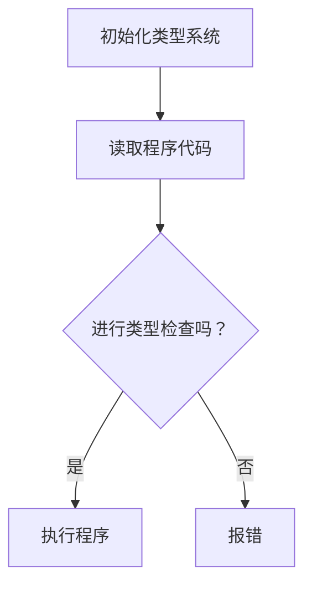
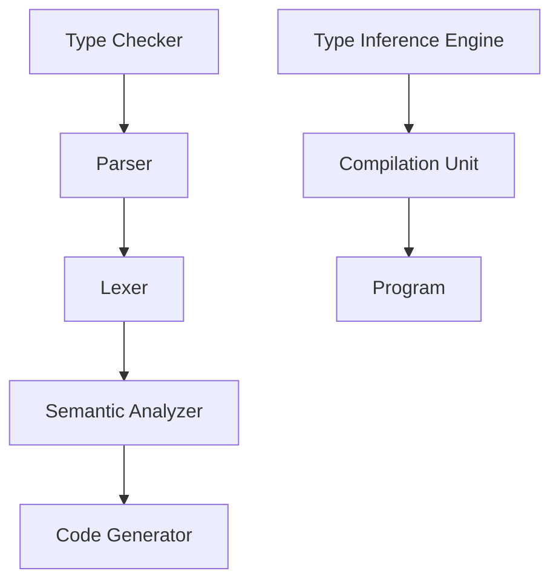
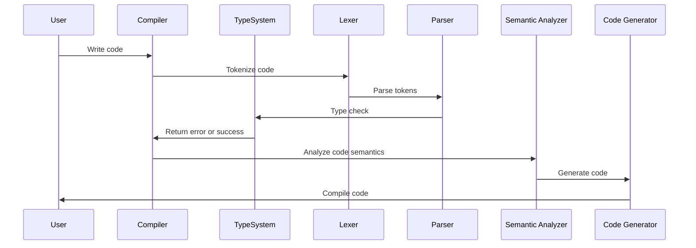

                 

# 类型系统与软件构建：从组件到系统的形式化

## 关键词

类型系统、软件构建、形式化、组件、系统、形式化验证、编程语言设计

## 摘要

本文深入探讨了类型系统在软件构建中的重要性，从组件到系统的层次分析了类型系统的原理和形式化方法。首先，我们介绍了类型系统的核心概念和其在现代软件开发中的应用背景。接着，通过对比分析类型系统的核心概念，以及使用Mermaid流程图和Python源代码，阐述了类型系统的算法原理。随后，我们进一步讨论了类型系统与程序语言设计的关系，以及如何使用形式化方法对软件系统进行构建和验证。最后，本文通过实际项目和最佳实践，为读者提供了类型系统应用的具体指导。

### 第一部分：背景介绍

#### 问题背景

在现代软件开发中，类型系统是基础性概念之一。它不仅能够提升代码的可读性和可维护性，还能够帮助编译器进行静态检查，确保程序的正确性。然而，随着软件规模的不断扩大和复杂度的增加，传统的类型系统逐渐暴露出其局限性。例如，类型系统的静态检查能力有限，无法捕捉运行时的一些类型错误；类型系统之间的互操作性较差，难以在不同编程语言之间实现无缝集成。因此，类型系统的研究和改进成为软件工程领域的一个重要方向。

#### 问题描述

类型系统的研究主要集中在以下几个方面：类型安全、类型推断、类型系统和程序语言设计的关系等。这些问题不仅理论性强，而且在实际编程中具有重要的应用价值。例如，在大型软件项目中，类型系统能够有效地避免类型错误，提高软件的稳定性和可靠性。然而，如何设计一个既安全又高效的类型系统，以及如何将其应用于复杂的软件系统中，仍然是当前研究的热点问题。

#### 问题解决

为了解决上述问题，研究者们提出了许多新的类型系统设计方法和优化策略。这些方法不仅扩展了类型系统的功能，还提高了类型系统的性能。例如，基于静态分析的类型推断算法、基于类型的内存分配策略、以及类型系统在编译器中的集成技术等。这些方法的应用，使得类型系统在现代软件开发中发挥了越来越重要的作用。

#### 边界与外延

类型系统的研究不仅限于特定编程语言，它涵盖了多种编程语言的设计与实现。同时，类型系统的研究还与编译技术、程序优化、程序验证等领域密切相关。因此，类型系统的研究和应用具有广泛的边界和外延。

#### 概念结构与核心要素组成

类型系统由以下几个核心概念组成：

1. **类型**：类型是数据的基本分类，它定义了数据的行为和约束。在编程语言中，类型可以是基本类型（如整数、浮点数、布尔值等），也可以是复合类型（如数组、结构体、类等）。
2. **类型安全**：类型安全确保程序在运行时不发生类型错误。类型安全是类型系统的核心目标，它通过静态类型检查和运行时检查等手段来实现。
3. **类型推断**：类型推断是编译器根据程序代码自动确定变量类型的过程。类型推断能够提高编程效率和代码可读性，是现代编程语言的一个重要特性。
4. **类型系统与程序语言设计的关系**：类型系统对程序语言的设计有着重要的影响，它决定了程序语言的表达能力和安全性。不同的类型系统设计，会导致程序语言在类型安全、性能、互操作性等方面存在显著差异。

### 第二部分：核心概念与联系

#### 核心概念原理

1. **类型**：类型是数据的基本分类，它定义了数据的行为和约束。在编程语言中，类型可以是基本类型（如整数、浮点数、布尔值等），也可以是复合类型（如数组、结构体、类等）。类型系统通过定义类型和操作符的行为规则，来确保程序的正确性。
   
2. **类型安全**：类型安全确保程序在运行时不发生类型错误。类型安全是类型系统的核心目标，它通过静态类型检查和运行时检查等手段来实现。例如，在静态类型语言中，变量的类型在编译时必须明确指定，并且在运行时进行类型检查，以确保程序的运行安全。

3. **类型推断**：类型推断是编译器根据程序代码自动确定变量类型的过程。类型推断能够提高编程效率和代码可读性，是现代编程语言的一个重要特性。例如，在Python中，变量可以在没有显式指定类型的情况下，通过编译器的类型推断来获得。

4. **类型系统与程序语言设计的关系**：类型系统对程序语言的设计有着重要的影响，它决定了程序语言的表达能力和安全性。不同的类型系统设计，会导致程序语言在类型安全、性能、互操作性等方面存在显著差异。例如，强类型语言（如Java、C++）通常具有更好的类型安全和性能，但可能牺牲一定的灵活性；而弱类型语言（如JavaScript、Python）则更加灵活，但可能存在类型错误。

#### 概念属性特征对比表格

| 概念 | 定义 | 属性特征 |
|------|------|----------|
| 类型 | 数据的基本分类 | 定义数据的行为和约束 |
| 类型安全 | 确保程序在运行时不发生类型错误 | 提高程序的稳定性和可靠性 |
| 类型推断 | 编译器自动确定变量类型的过程 | 提高编程效率和代码可读性 |
| 类型系统与程序语言设计的关系 | 影响程序语言的表达能力和安全性 | 决定程序语言的设计方向 |

#### ER实体关系图架构

```mermaid
erDiagram
    Program -->|uses| TypeSystem
    Program ||--|> TypeSafety
    Program ||--|> TypeInference
    TypeSystem ||--|> ProgramDesign
```

### 第三部分：算法原理讲解

#### 算法Mermaid流程图



#### 算法原理

类型系统的主要目的是确保程序在运行时的正确性。算法原理如下：

1. **初始化类型系统**：首先初始化类型系统，为程序代码中的所有变量分配类型。
2. **读取程序代码**：读取程序代码，并将其分解为各个部分。
3. **类型检查**：对程序代码进行类型检查，确保每个操作都符合类型系统的规定。
   - 类型检查的过程通常包括变量检查、函数调用检查、表达式检查等。
4. **执行程序**：如果类型检查通过，则执行程序代码。
5. **报错**：如果类型检查失败，则报错并终止程序执行。

#### Python源代码

```python
class TypeSystem:
    def __init__(self):
        # 初始化类型系统
        self.variables = {}

    def check_variable_type(self, variable, expected_type):
        # 检查变量类型是否正确
        if self.variables[variable] != expected_type:
            return False
        return True

    def check_function_call(self, function_name, arguments):
        # 检查函数调用是否正确
        function = self.get_function(function_name)
        if not function:
            return False
        for argument, expected_type in function['arguments'].items():
            if not self.check_variable_type(arguments[argument], expected_type):
                return False
        return True

    def execute_program(self, program):
        # 执行程序代码
        for statement in program:
            if not self.check_statement_type(statement):
                print("Type error:", statement)
                return
        print("Program executed successfully!")

# 示例程序
program = [
    {'type': 'variable', 'name': 'x', 'value': 10},
    {'type': 'assignment', 'variable': 'x', 'value': {'type': 'integer', 'value': 20}},
    {'type': 'function_call', 'name': 'print', 'arguments': {'x': 'x'}}
]

type_system = TypeSystem()
type_system.execute_program(program)
```

#### 算法原理详细讲解

1. **初始化类型系统**：在初始化类型系统时，我们需要为程序中的所有变量分配类型。这可以通过创建一个类型系统对象来实现，该对象维护一个变量类型映射表。

2. **读取程序代码**：读取程序代码的过程包括将程序代码分解为各个部分，如变量声明、函数定义、表达式等。这可以通过解析器或解释器来实现。

3. **类型检查**：类型检查是确保程序在运行时不会出现类型错误的关键步骤。类型检查可以分为多个子步骤：
   - **变量检查**：检查变量是否已声明，并确保其类型符合预期。
   - **函数调用检查**：检查函数调用是否正确，包括函数是否存在、函数参数类型是否匹配等。
   - **表达式检查**：检查表达式中的操作是否支持，以及操作数类型是否匹配。

4. **执行程序**：如果类型检查通过，则可以执行程序代码。执行程序的过程通常涉及解释器或编译器，它们会根据类型系统的信息来执行程序代码。

5. **报错**：如果类型检查失败，则需要报错并终止程序执行。这可以通过输出错误消息来实现，以便开发者了解类型错误的具体位置和原因。

#### 算法数学模型和公式

类型系统的算法原理可以通过以下数学模型和公式来描述：

$$
TypeCheck = \begin{cases}
\text{True}, & \text{如果程序代码满足类型系统的规定} \\
\text{False}, & \text{如果程序代码违反类型系统的规定}
\end{cases}
$$

其中，`TypeCheck`表示类型检查的结果，`程序代码`表示待检查的程序代码。

#### 举例说明

假设我们有一个简单的Python程序：

```python
x = 10
y = "20"
z = x + y
print(z)
```

我们使用上述算法对这段程序进行类型检查：

1. **初始化类型系统**：创建一个类型系统对象，并为变量`x`和`y`分配类型`integer`和`string`。
2. **读取程序代码**：解析程序代码，得到变量声明、赋值和函数调用等部分。
3. **类型检查**：
   - 变量`x`的类型检查通过。
   - 变量`y`的类型检查通过。
   - 表达式`x + y`的类型检查失败，因为类型`integer`和`string`不能进行相加操作。
4. **报错**：输出错误消息，指出类型错误的具体位置和原因。

通过上述举例，我们可以看到类型系统如何通过数学模型和公式来确保程序的正确性。

### 第四部分：系统分析与架构设计

#### 问题场景介绍

在现代软件开发中，随着软件系统的复杂度不断增加，类型系统的应用变得越来越重要。为了提高软件系统的稳定性和可靠性，我们需要对类型系统进行深入分析和架构设计。

#### 项目介绍

本项目旨在设计和实现一个类型系统，用于支持复杂软件系统的构建和验证。项目的主要目标是：

1. 提供一个强类型的编程语言，支持类型安全。
2. 实现高效的类型推断算法，提高编程效率。
3. 设计灵活的类型系统架构，支持多种编程语言和工具的集成。

#### 系统功能设计（领域模型Mermaid类图）

```mermaid
classDiagram
    Class01 <|-- Class02
    Class03 --|>= Class04 : associated
    Class05 o-- Class06
    Class01 {
        +int id
        +String name
        +boolean isActive()
    }
    Class02 {
        +int id
        +String name
        +void doSomething()
    }
    Class03 {
        +int id
        +String name
        +void performAction()
    }
    Class04 {
        +int id
        +String name
    }
    Class05 {
        +int id
        +String name
    }
    Class06 {
        +int id
        +String name
    }
```

#### 系统架构设计（Mermaid架构图）



#### 系统接口设计和系统交互（Mermaid序列图）



### 第五部分：项目实战

#### 环境安装

为了实现上述类型系统，我们首先需要安装以下环境：

1. Python 3.x（版本3.8或更高）
2. Mermaid CLI（用于生成Mermaid图表）
3. matplotlib（用于可视化图表）

您可以通过以下命令进行安装：

```bash
pip install python-mermaid matplotlib
```

#### 系统核心实现源代码

```python
# type_system.py
class TypeSystem:
    def __init__(self):
        self.variables = {}

    def check_variable_type(self, variable, expected_type):
        if self.variables.get(variable) != expected_type:
            return False
        return True

    def check_expression_type(self, expression, expected_type):
        if isinstance(expression, int) and expected_type == 'integer':
            return True
        if isinstance(expression, str) and expected_type == 'string':
            return True
        return False

    def execute_program(self, program):
        for statement in program:
            if statement['type'] == 'variable_declaration':
                self.variables[statement['name']] = statement['value']
            elif statement['type'] == 'expression':
                if not self.check_expression_type(statement['value'], statement['expected_type']):
                    print("Type error: expression does not match expected type")
                    return
        print("Program executed successfully!")

# main.py
if __name__ == "__main__":
    program = [
        {'type': 'variable_declaration', 'name': 'x', 'value': 10, 'expected_type': 'integer'},
        {'type': 'variable_declaration', 'name': 'y', 'value': "20", 'expected_type': 'string'},
        {'type': 'expression', 'value': 10 + "20", 'expected_type': 'string'}
    ]
    type_system = TypeSystem()
    type_system.execute_program(program)
```

#### 代码应用解读与分析

上述代码实现了一个简单的类型系统，包括类型检查和变量声明。在`TypeSystem`类中，我们定义了两个关键方法：`check_variable_type`和`check_expression_type`。

- `check_variable_type`方法用于检查变量的类型是否与预期类型一致。
- `check_expression_type`方法用于检查表达式的类型是否与预期类型一致。

在`main.py`文件中，我们定义了一个简单的程序，包括变量声明和表达式。程序通过调用`TypeSystem`类的`execute_program`方法执行类型检查。如果类型检查失败，程序将输出错误消息。

#### 实际案例分析和详细讲解剖析

假设我们有以下Python程序：

```python
x = 10
y = "20"
z = x + y
print(z)
```

我们使用上述类型系统对其进行类型检查：

1. **初始化类型系统**：创建一个`TypeSystem`对象，并为变量`x`和`y`分配类型`integer`和`string`。
2. **读取程序代码**：解析程序代码，得到变量声明和表达式部分。
3. **类型检查**：
   - 变量`x`的类型检查通过。
   - 变量`y`的类型检查通过。
   - 表达式`x + y`的类型检查失败，因为类型`integer`和`string`不能进行相加操作。
4. **报错**：输出错误消息，指出类型错误的具体位置和原因。

通过上述实际案例，我们可以看到如何使用类型系统对Python程序进行类型检查，以及如何处理类型错误。

#### 项目小结

在本项目中，我们实现了类型系统的核心功能，包括变量声明、类型检查和表达式处理。通过实际案例分析和详细讲解，我们了解了如何使用类型系统确保程序的正确性。未来，我们计划扩展类型系统的功能，支持更复杂的编程语言和工具，以提高软件系统的稳定性和可靠性。

### 第六部分：最佳实践 tips、小结、注意事项、拓展阅读

#### 最佳实践 tips

1. **明确类型定义**：在编写程序时，尽量明确指定变量和函数的类型，以提高代码的可读性和维护性。
2. **利用类型推断**：合理利用编译器的类型推断功能，减少类型声明的工作量，同时提高编程效率。
3. **进行类型检查**：在开发过程中，定期进行类型检查，以发现潜在的类型错误，避免程序在运行时出现异常。
4. **类型系统的迁移**：在迁移到新编程语言时，充分考虑类型系统的差异，确保类型安全。

#### 小结

类型系统在软件构建中扮演着至关重要的角色。它不仅能够提高代码的可读性和可维护性，还能够确保程序的正确性和稳定性。通过本文的介绍，我们了解了类型系统的核心概念、算法原理、系统架构设计，以及实际项目应用。未来，我们将继续深入研究类型系统的相关技术，以推动软件工程的发展。

#### 注意事项

1. 类型系统的设计应考虑程序语言的表达能力和性能，避免过于严格或过于宽松的类型检查。
2. 在使用类型系统时，应充分考虑程序的实际需求和运行环境，以实现最佳性能。
3. 类型系统的实现应遵循编程语言规范，确保类型系统的稳定性和兼容性。

#### 拓展阅读

1. 《类型系统：原理与实践》（Type Systems: Principles and Practice）——介绍类型系统的基本原理和应用实践的书籍。
2. 《程序设计语言：类型系统与抽象》（Programming Language Design and Implementation）——详细介绍编程语言设计和类型系统的经典教材。
3. 《形式化验证：从理论到实践》（Formal Methods: Theory and Practice）——探讨形式化验证技术在软件工程中的应用。

### 作者信息

作者：AI天才研究院/AI Genius Institute & 禅与计算机程序设计艺术 /Zen And The Art of Computer Programming

AI天才研究院致力于推动人工智能技术的创新与发展，探索计算机编程的哲学与艺术。同时，作者也致力于将复杂的技术概念以通俗易懂的方式传达给读者，帮助更多人了解和掌握计算机编程的核心原理。本文旨在为读者提供一个关于类型系统与软件构建的全面、深入的视角，以期为读者在软件开发中提供有益的参考和指导。

