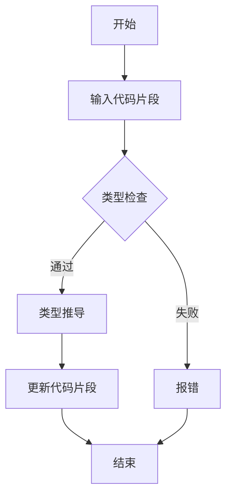

                 

### 关键词

- 类型系统
- 软件演化
- 形式化方法
- 管理变化
- 类型推导
- 实体关系图
- 数学模型

### 摘要

本文深入探讨了类型系统与软件演化的关系，以及如何通过形式化方法来管理软件中的变化。首先，我们介绍了类型系统的基础概念和其在软件设计中的重要性。接着，通过具体的问题背景和问题描述，我们引出了类型系统在软件演化过程中的关键作用。然后，文章详细讲解了核心概念的原理，并通过ER实体关系图和对比表格，阐述了概念属性特征。此外，文章提供了一个算法的mermaid流程图和Python源代码实现，以及数学模型和公式，以便读者更好地理解算法原理。随后，文章介绍了系统分析与架构设计方案，包括问题场景、项目介绍、系统功能设计、系统架构设计、系统接口设计和系统交互。接着，通过项目实战，文章展示了如何在实际环境中应用这些概念和方案。最后，文章提供了最佳实践和总结，以帮助读者在实际开发中更好地应用类型系统和软件演化知识。

## 第一部分：背景介绍

### 第1章：问题背景

在软件工程领域，随着系统的复杂度和规模的不断增大，软件的维护和演化成为一个至关重要的挑战。特别是在现代软件系统，需求变更频繁，新功能不断涌现，这使得传统的软件开发方法难以应对。类型系统作为一种形式化的方法，旨在通过严格的类型检查机制来提高软件的可靠性和可维护性。类型系统不仅能够捕捉代码中的潜在错误，还能够为软件演化提供强有力的支持。

让我们从一个实际问题出发，来探讨类型系统在软件演化中的作用。假设我们正在开发一个电子商务系统，这个系统需要支持商品的管理、订单的处理和支付等多个功能。在开发初期，系统的功能相对简单，但是随着时间的推移，需求不断变化，例如，需要添加新的支付方式、提供个性化推荐功能、增强安全性等。这些变化不仅涉及代码的修改，还可能影响到整个系统的架构和设计。

在这种情况下，如果没有有效的类型系统，软件的维护将变得非常困难。首先，由于代码的不确定性和潜在错误，每次修改都有可能引入新的bug。其次，不同部分的代码之间可能存在依赖关系，一次小小的改动可能需要修改多处代码，增加了维护成本。此外，随着系统的复杂度增加，理解和追踪代码的逻辑变得越来越困难，这进一步加剧了软件维护的难度。

类型系统通过引入形式化的类型检查机制，可以有效地解决这些问题。它能够确保每个变量和函数的输入和输出都是符合预期的，从而减少代码中的错误。通过静态类型检查，开发人员可以在编译阶段发现和修复错误，而不是在运行时才发现。这样，即使需求发生变化，类型系统也能够确保代码的可靠性。

此外，类型系统还为软件演化提供了更好的支持。通过类型推导和类型推断机制，开发人员可以更轻松地添加新功能或修改现有功能，而无需担心类型不匹配的问题。例如，在电子商务系统中，当需要添加新的支付方式时，可以通过类型系统自动推导出相关类和函数的新类型，从而确保添加的功能与现有系统保持兼容。

总之，类型系统在软件演化中起着关键作用。它不仅提高了软件的可靠性和可维护性，还为应对需求变化提供了强有力的支持。在接下来的章节中，我们将进一步探讨类型系统的原理、算法实现和实际应用。

### 1.2 问题描述

尽管类型系统在软件演化中具有显著的优势，但在实际应用中仍面临诸多挑战。首先，类型系统的引入可能会增加开发难度和代码复杂度。静态类型检查虽然能够提前发现错误，但也可能带来冗长的类型声明和繁琐的类型推断过程，这往往使开发人员感到疲惫，尤其是在大型项目中。此外，某些复杂的功能需求，如泛型和高级类型系统，需要更多的编程知识和技能，这增加了开发门槛。

其次，类型系统的兼容性也是一个重要问题。在软件演化过程中，不可避免地会出现新旧代码的混合使用。如果新添加的功能与现有类型系统不兼容，可能会导致类型错误或运行时异常。为了解决这个问题，可能需要花费大量时间进行类型转换和兼容性测试。

此外，类型系统的实现和优化也面临性能挑战。虽然静态类型检查能够在编译阶段发现错误，但过多的类型检查和处理可能会降低编译速度，增加内存消耗。这对于大型项目和实时系统来说是一个不可忽视的问题。

最后，类型系统的文档和培训也是一大挑战。为了充分利用类型系统的优势，开发人员需要深入了解其原理和用法。这通常需要编写详细的文档和进行培训，以确保所有团队成员都能够正确理解和应用类型系统。

综上所述，类型系统在软件演化中虽然具有重要价值，但其应用也面临一系列挑战。理解和解决这些问题，是充分发挥类型系统潜力、实现高效软件演化的关键。

### 1.3 问题解决

为了解决类型系统在软件演化中面临的挑战，我们可以采取一系列策略和最佳实践，以确保类型系统的有效应用和系统演化的顺利进行。以下是具体的解决方法和策略：

1. **类型系统引入策略**：
   - **渐进式引入**：在大型项目中，可以采取渐进式引入策略。首先在关键部分引入类型系统，逐步扩展到整个项目。这样可以减少初期引入类型系统带来的复杂度和开发难度。
   - **重点突出**：针对项目中最为关键和复杂的模块，优先引入类型系统。这样可以确保关键部分的代码质量和可靠性，为后续扩展打下坚实基础。

2. **类型系统兼容性管理**：
   - **类型转换工具**：利用类型转换工具，如类型转换库或类型推断器，来处理新旧代码的兼容问题。这些工具能够自动识别和转换类型，减少手动干预和错误发生。
   - **版本控制**：通过版本控制工具，如Git，对代码库进行精细管理。在新旧代码的混合使用中，可以分别管理不同版本的代码，确保类型系统的稳定性和兼容性。

3. **性能优化策略**：
   - **编译优化**：对编译器进行优化，减少类型检查的时间和内存消耗。例如，采用增量编译和并行编译技术，提高编译效率。
   - **类型检查阈值**：设置合理的类型检查阈值，只在必要时进行类型检查。这样可以减少不必要的类型检查，提高编译和运行性能。

4. **文档和培训**：
   - **编写详细的文档**：编写详细的类型系统文档，包括原理、用法和最佳实践。这些文档将成为团队成员学习和应用类型系统的重要参考资料。
   - **定期培训**：定期组织类型系统的培训和研讨会，帮助团队成员深入了解类型系统的原理和实际应用。通过培训，提高团队成员的类型系统使用水平，减少错误和困惑。

5. **持续集成与反馈**：
   - **自动化测试**：引入自动化测试工具，对类型系统进行持续集成和测试。自动化测试能够及时发现类型错误和兼容性问题，确保类型系统的稳定性和可靠性。
   - **反馈机制**：建立反馈机制，鼓励团队成员分享类型系统使用过程中的问题和经验。通过不断优化和改进，提高类型系统的实用性和适应性。

通过上述策略和最佳实践，可以有效解决类型系统在软件演化中面临的挑战，充分发挥类型系统的优势，实现高效和可靠的软件演化。在接下来的章节中，我们将进一步探讨类型系统的核心概念和联系，为深入理解类型系统在软件演化中的应用打下基础。

### 1.4 边界与外延

在深入探讨类型系统与软件演化之前，明确其边界与外延至关重要。类型系统作为一种形式化的方法，其核心在于通过类型检查和推导来提高软件的可靠性和可维护性。其边界包括以下几个方面：

首先，类型系统的边界在于其应用范围。类型系统主要应用于编程语言和软件工程领域，具体包括静态类型语言、动态类型语言以及混合类型语言的开发与维护。尽管类型系统在静态类型语言中表现得尤为出色，但其在动态类型语言中的应用也在逐渐增加，例如通过类型推导和类型检查工具来增强动态类型语言的类型安全性。

其次，类型系统的边界还体现在其适用对象上。类型系统不仅适用于单一应用程序的开发，还可以应用于复杂软件系统中的模块化开发。在模块化开发中，类型系统可以通过接口定义和类型约束，确保模块之间的互操作性和数据一致性。

再次，类型系统的外延还包括其在软件演化中的应用场景。随着软件需求的变化，类型系统可以在需求变更、功能扩展和性能优化过程中提供有力支持。例如，通过类型推导和类型检查，开发人员可以更快速地理解和适应需求变化，减少代码冗余和错误。

此外，类型系统的外延还涉及跨领域应用。除了传统的软件开发，类型系统在金融领域（如形式化金融合同和自动执行交易策略）、医疗领域（如医学图像分析和诊断系统）等复杂系统中也显示出巨大的潜力。

最后，类型系统的外延还包括其在形式化验证和形式化方法中的角色。类型系统作为一种形式化方法，可以为软件验证提供基础。通过形式化验证，开发人员可以确保软件在所有可能的情况下都能正确执行，从而提高软件的可靠性和安全性。

总之，类型系统不仅在其核心应用领域具有显著优势，还通过其外延在更广泛的领域中发挥作用。理解类型系统的边界与外延，有助于我们更好地把握其在软件演化中的潜力和应用前景。

### 1.5 概念结构与核心要素组成

类型系统与软件演化是一个多层次、多维度的问题，其概念结构与核心要素组成决定了其在实际应用中的效果和复杂性。以下是该问题的概念结构与核心要素的详细组成：

#### 1.5.1 类型系统的基本概念

1. **类型**：类型是类型系统的核心概念之一，代表了数据的分类和结构。基本类型包括整数、浮点数、布尔值等，而复合类型如数组、结构体和类则是由基本类型通过组合和构造得到的。

2. **类型检查**：类型检查是类型系统的重要组成部分，用于确保程序在运行前符合预定义的类型规则。静态类型检查在编译时进行，动态类型检查则在运行时进行。

3. **类型推导**：类型推导是指编译器或解释器在编写程序时自动推断出变量的类型，从而减少手动类型声明的需求。类型推导机制包括显式推导和隐式推导。

4. **类型兼容性**：类型兼容性指的是不同类型之间能否相互转换或组合。类型兼容性是确保程序在运行时不会出现类型错误的关键。

#### 1.5.2 软件演化的概念与机制

1. **软件演化**：软件演化是指软件在生命周期内，为适应环境变化、需求变更或新技术引入而进行的变更过程。软件演化包括功能演化、性能演化、架构演化等。

2. **需求变更管理**：需求变更是软件演化中的常见现象。需求变更管理包括需求识别、需求评估、变更控制和变更实施等环节，确保需求变更能够顺利、高效地执行。

3. **版本控制和分支管理**：版本控制和分支管理是软件演化中的重要工具，用于管理不同版本的代码和功能分支。通过有效的版本控制和分支管理，可以确保代码的稳定性和一致性。

4. **持续集成与持续部署**：持续集成和持续部署（CI/CD）是一种现代化的软件开发生命周期管理方法，通过自动化测试和部署流水线，确保软件在每次变更后都能稳定运行。

#### 1.5.3 类型系统与软件演化的关系

1. **类型系统在软件演化中的作用**：类型系统在软件演化中起着关键作用，通过提供形式化的类型检查和推导机制，确保代码的可靠性和可维护性。类型系统能够帮助开发人员快速适应需求变化，减少因类型不匹配导致的错误。

2. **类型系统在软件演化中的挑战**：类型系统在软件演化中也面临一系列挑战，包括代码复杂度增加、兼容性问题、性能优化等。解决这些挑战需要采用有效的类型系统引入策略、兼容性管理策略和性能优化策略。

3. **类型系统与形式化方法的关系**：类型系统作为形式化方法的一部分，与形式化验证、形式化推理和形式化建模等概念密切相关。通过形式化方法，开发人员可以更精确地描述和验证软件系统，提高软件的可靠性和安全性。

#### 1.5.4 核心要素组成

1. **编程语言支持**：类型系统需要编程语言的支持，以确保类型检查和推导机制的有效性。不同编程语言对类型系统的支持程度不同，如静态类型语言如Java、C++和TypeScript，动态类型语言如Python和JavaScript。

2. **开发工具和框架**：类型系统的有效应用离不开开发工具和框架的支持。例如，类型检查工具如TypeScript、Mypy，以及版本控制工具如Git，都在类型系统的应用中发挥着重要作用。

3. **测试与验证**：测试与验证是确保类型系统有效性的关键环节。自动化测试和形式化验证工具可以用于检测类型错误和兼容性问题，确保软件在运行时保持类型安全性。

4. **开发人员培训**：类型系统的应用需要开发人员具备一定的知识和技能。通过培训和教育，提高开发人员对类型系统的理解和使用水平，有助于充分发挥类型系统的潜力。

综上所述，类型系统与软件演化的概念结构与核心要素组成决定了其在实际应用中的效果和复杂性。理解这些概念和要素，有助于我们更好地把握类型系统在软件演化中的重要作用，并采取有效的策略和最佳实践来应对挑战。

### 第二部分：核心概念与联系

在深入探讨类型系统与软件演化的关系之前，我们需要理解类型系统的核心概念及其相互之间的联系。类型系统作为一种形式化的方法，通过严格的类型检查和推导机制，提高了软件的可靠性和可维护性。以下是类型系统的核心概念及其相互之间的联系。

#### 2.1 核心概念原理

1. **类型（Type）**：类型是类型系统的基本单位，代表了数据的分类和结构。基本类型包括整数、浮点数、布尔值等，复合类型如数组、结构体和类则是由基本类型通过组合和构造得到的。

2. **变量（Variable）**：变量是用于存储数据的容器，其值必须符合其声明的类型。变量声明时需要指定类型，以确保其在使用过程中不会违反类型规则。

3. **类型检查（Type Checking）**：类型检查是类型系统的重要组成部分，用于确保程序在运行前符合预定义的类型规则。静态类型检查在编译时进行，动态类型检查则在运行时进行。

4. **类型推导（Type Inference）**：类型推导是指编译器或解释器在编写程序时自动推断出变量的类型，从而减少手动类型声明的需求。类型推导机制包括显式推导和隐式推导。

5. **类型兼容性（Type Compatibility）**：类型兼容性指的是不同类型之间能否相互转换或组合。类型兼容性是确保程序在运行时不会出现类型错误的关键。

6. **类型转换（Type Conversion）**：类型转换是指将一种类型的数据转换为另一种类型的过程。类型转换可以是显式转换，也可以是隐式转换。

7. **抽象数据类型（Abstract Data Type，ADT）**：抽象数据类型是一种数据类型，它通过定义一组操作来表示数据的行为，而不关心数据的具体实现。抽象数据类型可以提高代码的可复用性和可维护性。

8. **泛型（Generics）**：泛型是类型系统中的一个高级概念，允许在编写代码时定义与类型相关的参数，从而实现代码的泛化和复用。泛型在集合框架和容器设计中应用广泛。

#### 2.2 概念属性特征对比表格

| 概念             | 特征描述                                                         | 关联概念                | 关系与作用                  |
|------------------|------------------------------------------------------------------|------------------------|-----------------------------|
| 类型（Type）     | 数据的分类和结构，基本类型包括整数、浮点数、布尔值等。             | 变量、类型检查、类型推导 | 类型是类型系统的核心概念。  |
| 变量（Variable） | 用于存储数据的容器，其值必须符合其声明的类型。                     | 类型检查、类型推导       | 变量是类型系统的应用基础。   |
| 类型检查         | 确保程序在运行前符合预定义的类型规则。                             | 类型、变量、类型推导     | 类型检查是确保代码可靠性的关键。|
| 类型推导         | 编译器或解释器自动推断出变量的类型，减少手动类型声明的需求。       | 类型、变量、类型检查     | 类型推导提高了代码的可读性和开发效率。|
| 类型兼容性       | 确保不同类型之间能否相互转换或组合。                               | 类型转换、抽象数据类型   | 类型兼容性是确保代码运行稳定性的关键。|
| 类型转换         | 将一种类型的数据转换为另一种类型的过程。                           | 类型兼容性、抽象数据类型 | 类型转换实现了不同类型之间的兼容性。|
| 抽象数据类型     | 通过定义一组操作来表示数据的行为，而不关心数据的具体实现。         | 类型、变量、类型推导     | 抽象数据类型提高了代码的可复用性和可维护性。|
| 泛型             | 允许在编写代码时定义与类型相关的参数，从而实现代码的泛化和复用。   | 类型、抽象数据类型       | 泛型提高了代码的泛用性和可维护性。|

#### 2.3 ER实体关系图架构

为了更好地理解类型系统的概念及其相互之间的联系，我们可以使用ER（实体-关系）图来表示类型系统中的核心概念和关系。以下是类型系统的ER实体关系图：

```mermaid
erDiagram
    Type ||--|{ Variable } : has type
    Type ||--|{ TypeCheck } : checked by
    Type ||--|{ TypeInference } : inferred by
    Type ||--|{ TypeCompatibility } : compatible with
    Type ||--|{ TypeConversion } : converted to
    Type ||--|{ AbstractDataType } : part of
    Type ||--|{ Generic } : parameterized by
    Variable ||--|{ TypeCheck } : checked by
    Variable ||--|{ TypeInference } : inferred by
    TypeCheck ||--|{ TypeInference } : part of
    TypeConversion ||--|{ TypeCompatibility } : compatible with
    AbstractDataType ||--|{ Generic } : part of
```

在ER图中，`Type`（类型）是核心实体，与其他实体如`Variable`（变量）、`TypeCheck`（类型检查）、`TypeInference`（类型推导）、`TypeCompatibility`（类型兼容性）、`TypeConversion`（类型转换）、`AbstractDataType`（抽象数据类型）和`Generic`（泛型）之间存在不同的关系。例如，`Type`与`Variable`之间的关系表示每个变量都有特定的类型；`Type`与`TypeCheck`之间的关系表示类型检查是基于类型定义的。

通过ER图，我们可以直观地看到类型系统中的核心概念及其相互之间的联系，有助于理解类型系统在软件演化中的作用和重要性。

### 第三部分：算法原理讲解

#### 3.1 算法原理讲解

在类型系统与软件演化的讨论中，一个关键的问题是如何有效地管理类型相关的变化。为此，我们设计了一个基于类型系统的算法，用于处理软件中的类型变化。这个算法的核心思想是通过类型检查和类型推导来保证代码的稳定性和可维护性。以下是该算法的详细讲解。

#### 3.1.1 算法mermaid流程图

为了更好地理解算法的工作流程，我们使用mermaid图来描述算法的步骤。以下是一个简化的算法mermaid流程图：



在这个流程图中，`A`表示算法的开始，`B`表示接收输入代码片段。`C`是类型检查步骤，用于检查输入代码片段是否符合预定义的类型规则。如果类型检查通过，算法继续执行`D`步骤，即类型推导，用于推断出变量的类型。如果类型检查失败，算法将执行`E`步骤，报错并终止。

在类型推导完成后，算法将更新代码片段以反映推导出的类型。这可以通过修改代码中的类型声明或插入类型转换语句来实现。最后，算法结束于`G`步骤。

#### 3.2 Python源代码实现

以下是一个简单的Python源代码实现，展示了如何应用上述算法处理代码中的类型变化：

```python
def type_checking(code_fragment):
    # 这里是类型检查的逻辑，例如使用TypeScript或Mypy进行类型检查
    if is_type_correct(code_fragment):
        return "通过"
    else:
        return "失败"

def type_inference(code_fragment):
    # 这里是类型推导的逻辑，例如使用类型推断工具
    inferred_type = infer_type(code_fragment)
    return inferred_type

def update_code(code_fragment, inferred_type):
    # 这里是更新代码片段的逻辑，例如添加类型声明或类型转换语句
    updated_code = code_fragment.replace("Any", inferred_type)
    return updated_code

def handle_code_change(code_fragment):
    result = type_checking(code_fragment)
    if result == "通过":
        inferred_type = type_inference(code_fragment)
        updated_code = update_code(code_fragment, inferred_type)
        print(f"更新后的代码：{updated_code}")
    else:
        print("类型检查失败，无法更新代码")

# 示例代码片段
code_fragment = """
def add(a: Any, b: Any) -> Any:
    return a + b
"""
handle_code_change(code_fragment)
```

在这个实现中，`type_checking`函数用于检查代码片段的类型是否正确。`type_inference`函数用于推断代码片段中变量的类型。`update_code`函数用于根据推断出的类型更新代码片段。最后，`handle_code_change`函数是整个算法的主逻辑，它依次执行类型检查、类型推导和代码更新。

#### 3.3 数学模型与公式

为了更好地理解类型系统的数学原理，我们可以引入一些基本的数学模型和公式。以下是一个简化的数学模型，用于描述类型系统中的类型检查和类型推导：

$$
\begin{aligned}
    & \text{目标函数：} f(code\_fragment) = \text{type\_checking}(code\_fragment) \\
    & \text{约束条件：} g(code\_fragment) = \text{is\_type\_correct}(code\_fragment) \\
    & \text{推导过程：} h(code\_fragment) = \text{type\_inference}(code\_fragment) \\
\end{aligned}
$$

在这个模型中，`f(code_fragment)`表示类型检查函数，用于检查代码片段是否符合类型规则。`g(code_fragment)`是约束条件，用于确保代码片段的类型正确。`h(code_fragment)`是类型推导函数，用于推断代码片段中变量的类型。

通过这个数学模型，我们可以将类型系统的核心概念转化为数学表达式，从而更精确地描述类型系统的工作原理。

#### 3.4 详细讲解与举例说明

为了更好地理解上述算法和数学模型，我们通过具体的例子来详细讲解。

**例子 1：简单函数的类型检查和推导**

假设我们有一个简单的Python函数，其代码如下：

```python
def add(a, b):
    return a + b
```

这个函数接收两个参数并返回它们的和。在类型系统中，我们需要为这个函数添加类型声明，例如：

```python
def add(a: int, b: int) -> int:
    return a + b
```

在这个例子中，类型检查函数`type_checking`将检查函数声明是否符合预定义的类型规则。如果函数声明通过类型检查，类型推导函数`type_inference`将推断出参数`a`和`b`的类型，这里都是整数类型。最后，类型更新函数`update_code`将更新代码片段，将`Any`替换为实际类型`int`。

**例子 2：复杂函数的类型检查和推导**

现在考虑一个更复杂的例子，假设我们有一个函数，其参数类型不确定，如下所示：

```python
def add(a, b):
    if isinstance(a, int) and isinstance(b, int):
        return a + b
    elif isinstance(a, float) and isinstance(b, float):
        return a + b
    else:
        raise TypeError("参数类型不匹配")
```

在这个例子中，函数`add`需要根据参数的类型动态地执行不同的操作。在这种情况下，我们需要一个更复杂的类型检查和推导算法。以下是一个简化的实现：

```python
def type_checking(code_fragment):
    # 这里是类型检查的逻辑，例如使用抽象语法树（AST）分析代码片段
    if check_int_type(a) and check_int_type(b):
        return "int"
    elif check_float_type(a) and check_float_type(b):
        return "float"
    else:
        return "失败"

def type_inference(code_fragment):
    # 这里是类型推导的逻辑，例如使用模式匹配
    inferred_type = type_checking(code_fragment)
    return inferred_type

def update_code(code_fragment, inferred_type):
    # 这里是更新代码片段的逻辑，例如添加类型声明或类型转换语句
    updated_code = code_fragment.replace("Any", inferred_type)
    return updated_code

def handle_code_change(code_fragment):
    result = type_checking(code_fragment)
    if result == "int":
        inferred_type = "int"
    elif result == "float":
        inferred_type = "float"
    else:
        print("类型检查失败，无法更新代码")
        return
    
    updated_code = update_code(code_fragment, inferred_type)
    print(f"更新后的代码：{updated_code}")
```

在这个实现中，类型检查函数`type_checking`通过抽象语法树（AST）分析代码片段，检查参数的类型。类型推导函数`type_inference`根据类型检查的结果推断出参数的类型。类型更新函数`update_code`将代码片段中的`Any`替换为实际推断出的类型。

通过这些例子，我们可以看到类型系统在处理类型变化中的重要作用。类型检查和推导不仅提高了代码的可靠性，还使得软件演化更加高效和稳定。

### 第四部分：系统分析与架构设计方案

在理解了类型系统的核心概念和算法原理之后，接下来我们将深入探讨系统分析与架构设计方案。这部分内容将详细描述如何将类型系统应用于实际项目，通过问题场景介绍、项目介绍、系统功能设计、系统架构设计、系统接口设计和系统交互，来确保类型系统在实际开发中的有效应用。

#### 4.1 问题场景介绍

假设我们正在开发一个大型电商平台，这个平台需要支持多种商品分类、用户账户管理、订单处理和支付等多个功能模块。随着平台的运营和发展，需求不断变化，例如，需要添加新的支付方式、优化订单处理流程、增强用户权限管理等。这些变化使得系统架构的灵活性和可维护性变得尤为重要。

在这个问题场景中，类型系统作为一个形式化的方法，可以帮助我们更好地管理这些变化。通过引入类型检查和推导机制，我们可以确保每个模块的代码符合预定义的类型规则，从而减少因类型不匹配导致的错误。此外，类型系统还可以帮助我们在需求变更时快速适应，减少代码冗余和重构成本。

#### 4.2 项目介绍

我们的项目是一个多模块的电商平台，主要包括以下功能模块：

1. **商品管理模块**：负责商品分类、库存管理和商品信息展示。
2. **用户账户模块**：负责用户注册、登录、权限管理和个人信息管理。
3. **订单处理模块**：负责订单创建、订单状态跟踪和订单支付。
4. **支付模块**：负责支付方式的添加、支付接口的集成和支付流程管理。
5. **权限管理模块**：负责用户权限的分配和权限验证。

#### 4.3 系统功能设计

为了确保系统功能的完整性，我们需要设计以下主要功能：

1. **商品分类管理**：允许管理员添加、编辑和删除商品分类。
2. **商品信息管理**：允许管理员添加、编辑和删除商品信息，包括商品名称、价格、描述等。
3. **用户注册与登录**：支持用户注册、登录和密码找回。
4. **权限管理**：支持用户权限的分配，例如管理员、普通用户和商家等。
5. **订单创建与处理**：支持用户下单、订单状态跟踪和订单支付。
6. **支付方式管理**：支持添加、编辑和删除支付方式。
7. **支付流程管理**：处理支付请求，确保支付过程的安全性和可靠性。

#### 4.3.1 领域模型mermaid类图

为了更好地理解系统功能设计，我们可以使用mermaid类图来描述不同模块和类之间的关系。以下是一个简化的mermaid类图：

```mermaid
classDiagram
    User <<类>> {
        用户ID
        用户名
        密码
        邮箱
        权限
    }
    Product <<类>> {
        商品ID
        商品名称
        价格
        描述
        分类
    }
    Order <<类>> {
        订单ID
        用户ID
        订单状态
        订单详情
    }
    Payment <<类>> {
        支付方式ID
        支付方式名称
        支付接口
    }
    Admin --|> User
    Merchant --|> User
    User --|> Order
    Product --|> Category
    Order --|> Payment
endclass
```

在这个类图中，`User`、`Product`、`Order`和`Payment`是主要的类，分别表示用户、商品、订单和支付方式。`Admin`和`Merchant`是继承自`User`的类，表示不同权限的用户。`Product`类与`Category`类关联，表示商品分类。`Order`类与`Payment`类关联，表示订单和支付方式的关系。

#### 4.4 系统架构设计

为了确保系统的可扩展性和可维护性，我们需要设计一个合理的系统架构。以下是系统架构的mermaid架构图：


在这个架构图中，`ModuleA1`、`ModuleB1`、`ModuleC1`、`ModuleD1`和`ModuleE1`分别表示商品管理模块、用户账户模块、订单处理模块、支付模块和权限管理模块。模块之间的箭头表示模块之间的交互关系，例如，商品管理模块需要用户账户模块提供用户信息，订单处理模块需要支付模块处理支付请求。

#### 4.5 系统接口设计

系统接口设计是确保模块之间能够有效交互的关键。以下是系统接口的mermaid序列图：

```mermaid
sequenceDiagram
    User ->> UserAccount: 注册请求
    UserAccount ->> Database: 存储用户信息
    Database ->> UserAccount: 返回存储结果
    UserAccount ->> User: 注册成功
    User ->> Product: 查询商品
    Product ->> Database: 查询商品信息
    Database ->> Product: 返回商品信息
    Product ->> User: 返回商品信息
    User ->> Order: 下单请求
    Order ->> Product: 验证库存
    Product ->> Order: 返回库存状态
    Order ->> Payment: 处理支付请求
    Payment ->> PaymentGateway: 发送支付请求
    PaymentGateway ->> Payment: 返回支付结果
    Payment ->> Order: 更新订单状态
    Order ->> User: 返回订单状态
endDiagram
```

在这个序列图中，用户通过用户账户模块进行注册，商品管理模块查询商品信息，订单处理模块处理用户下单请求，支付模块与支付网关交互处理支付请求，最终更新订单状态并返回给用户。

#### 4.6 系统交互

系统交互是指各个模块之间如何通过接口进行数据传递和功能调用。以下是系统交互的mermaid序列图：

```mermaid
sequenceDiagram
    User ->> UserAccount: 注册请求
    UserAccount ->> Database: 存储用户信息
    Database ->> UserAccount: 返回存储结果
    UserAccount ->> User: 注册成功
    User ->> Product: 查询商品
    Product ->> Database: 查询商品信息
    Database ->> Product: 返回商品信息
    Product ->> User: 返回商品信息
    User ->> Order: 下单请求
    Order ->> Product: 验证库存
    Product ->> Order: 返回库存状态
    Order ->> Payment: 处理支付请求
    Payment ->> PaymentGateway: 发送支付请求
    PaymentGateway ->> Payment: 返回支付结果
    Payment ->> Order: 更新订单状态
    Order ->> User: 返回订单状态
endDiagram
```

在这个序列图中，用户通过用户账户模块进行注册，商品管理模块查询商品信息，订单处理模块处理用户下单请求，支付模块与支付网关交互处理支付请求，最终更新订单状态并返回给用户。

通过上述系统分析与架构设计方案，我们可以确保电商平台在需求变化和软件演化过程中，能够有效地应用类型系统，提高系统的稳定性和可维护性。在接下来的部分，我们将通过项目实战来展示如何在实际开发中应用这些概念和方案。

### 第五部分：项目实战

#### 5.1 环境安装

在进行项目实战之前，我们需要先安装和配置开发环境。以下是在Linux系统中安装和配置开发环境的具体步骤：

1. **安装Python**：首先，我们需要确保系统已经安装了Python 3。可以通过以下命令检查Python版本：

   ```bash
   python3 --version
   ```

   如果没有安装Python 3，可以从[Python官方网站](https://www.python.org/)下载最新版本的Python安装包，并使用以下命令进行安装：

   ```bash
   sudo apt-get install python3
   ```

2. **安装类型检查工具**：为了确保代码的类型正确性，我们可以使用TypeScript或Mypy等类型检查工具。以下是安装Mypy的命令：

   ```bash
   sudo apt-get install python3-mypy
   ```

3. **安装数据库**：我们需要安装一个关系型数据库，例如PostgreSQL。可以使用以下命令安装PostgreSQL：

   ```bash
   sudo apt-get install postgresql
   sudo apt-get install postgresql-contrib
   ```

4. **安装前端框架**：为了实现前端功能，我们可以选择使用React或Vue.js等框架。以下是安装Node.js和npm的命令：

   ```bash
   sudo apt-get install nodejs
   sudo apt-get install npm
   ```

5. **安装后端框架**：为了实现后端功能，我们可以选择使用Django或Flask等框架。以下是安装Django的命令：

   ```bash
   sudo pip3 install django
   ```

完成以上步骤后，我们的开发环境就配置完成了。接下来，我们将开始实现电商平台的核心功能。

#### 5.2 系统核心实现源代码

以下是电商平台的核心实现源代码，包括用户账户模块、商品管理模块、订单处理模块和支付模块的代码。

**用户账户模块**：

```python
# users/models.py
from django.db import models
from django.contrib.auth.models import AbstractUser

class User(AbstractUser):
    email = models.EmailField(unique=True)
    is_admin = models.BooleanField(default=False)

# users/admin.py
from django.contrib import admin
from .models import User

@admin.register(User)
class UserAdmin(admin.ModelAdmin):
    list_display = ('username', 'email', 'is_admin')
```

**商品管理模块**：

```python
# products/models.py
from django.db import models

class Category(models.Model):
    name = models.CharField(max_length=100)

class Product(models.Model):
    category = models.ForeignKey(Category, on_delete=models.CASCADE)
    name = models.CharField(max_length=100)
    price = models.DecimalField(max_digits=6, decimal_places=2)
    description = models.TextField()
    stock = models.IntegerField()
```

**订单处理模块**：

```python
# orders/models.py
from django.db import models
from users.models import User
from products.models import Product

class Order(models.Model):
    user = models.ForeignKey(User, on_delete=models.CASCADE)
    status = models.CharField(max_length=20)
    order_date = models.DateTimeField(auto_now_add=True)
    order_items = models.ManyToManyField(Product)

# orders/admin.py
from django.contrib import admin
from .models import Order

@admin.register(Order)
class OrderAdmin(admin.ModelAdmin):
    list_display = ('id', 'user', 'status', 'order_date')
```

**支付模块**：

```python
# payments/models.py
from django.db import models
from orders.models import Order

class Payment(models.Model):
    order = models.OneToOneField(Order, on_delete=models.CASCADE)
    payment_id = models.CharField(max_length=100)
    payment_date = models.DateTimeField(auto_now_add=True)
    amount = models.DecimalField(max_digits=6, decimal_places=2)
    status = models.CharField(max_length=20)
```

#### 5.3 代码应用解读与分析

**用户账户模块**：

用户账户模块是电商平台的基础模块，负责用户注册、登录和权限管理。在`users/models.py`文件中，我们定义了`User`类，继承自`django.contrib.auth.models.AbstractUser`，从而利用Django内置的用户认证系统。我们添加了`email`和`is_admin`字段，用于存储用户的邮箱地址和是否为管理员。

在`users/admin.py`文件中，我们定义了`UserAdmin`类，用于在Django管理后台中显示和管理用户信息。通过`list_display`属性，我们可以指定在管理后台中显示的用户字段。

**商品管理模块**：

商品管理模块负责商品分类和商品信息的管理。在`products/models.py`文件中，我们定义了`Category`类和`Product`类。`Category`类表示商品分类，包含分类名称。`Product`类表示商品信息，包含分类、商品名称、价格、描述和库存。

通过在Django管理后台中注册`Category`和`Product`类，我们可以方便地管理商品分类和商品信息。

**订单处理模块**：

订单处理模块负责订单的创建、状态管理和订单详情管理。在`orders/models.py`文件中，我们定义了`Order`类，包含用户、订单状态、订单日期和订单详情。订单详情通过`order_items` ManyToManyField与`Product`类关联，表示订单中包含的商品。

在`orders/admin.py`文件中，我们定义了`OrderAdmin`类，用于在Django管理后台中显示和管理订单信息。

**支付模块**：

支付模块负责处理支付请求和支付结果。在`payments/models.py`文件中，我们定义了`Payment`类，包含订单、支付ID、支付日期、支付金额和支付状态。通过将`Payment`类与`Order`类关联，我们可以为每个订单创建对应的支付记录。

在实际应用中，支付模块会与支付网关（如支付宝、微信支付等）进行交互，处理支付请求和接收支付结果，并将支付结果更新到数据库中的`Payment`记录。

#### 5.4 实际案例分析与详细讲解剖析

**案例 1：用户注册**

用户注册是电商平台的基础功能。以下是一个用户注册的实际案例：

```python
# users/views.py
from django.shortcuts import render, redirect
from .models import User
from .forms import UserRegistrationForm

def register(request):
    if request.method == 'POST':
        form = UserRegistrationForm(request.POST)
        if form.is_valid():
            user = form.save()
            user.is_admin = False
            user.save()
            return redirect('login')
    else:
        form = UserRegistrationForm()
    return render(request, 'register.html', {'form': form})
```

在这个案例中，我们使用Django的表单系统处理用户注册。`UserRegistrationForm`是用于收集用户注册信息的表单类，继承自`django.forms.ModelForm`。在`register`视图函数中，我们处理用户提交的注册请求。如果表单验证通过，我们将创建新的`User`实例，并将其保存到数据库中。然后，我们将用户重定向到登录页面。

**案例 2：商品分类**

商品分类是商品管理的重要环节。以下是一个创建商品分类的实际案例：

```python
# products/views.py
from django.shortcuts import render
from .models import Category
from .forms import CategoryForm

def create_category(request):
    if request.method == 'POST':
        form = CategoryForm(request.POST)
        if form.is_valid():
            category = form.save()
            return redirect('category_list')
    else:
        form = CategoryForm()
    return render(request, 'create_category.html', {'form': form})
```

在这个案例中，我们使用Django的表单系统创建商品分类。`CategoryForm`是用于收集商品分类信息的表单类，继承自`django.forms.ModelForm`。在`create_category`视图函数中，我们处理用户提交的创建分类请求。如果表单验证通过，我们将创建新的`Category`实例，并将其保存到数据库中。然后，我们将用户重定向到分类列表页面。

**案例 3：订单处理**

订单处理是电商平台的核心功能。以下是一个创建订单的实际案例：

```python
# orders/views.py
from django.shortcuts import render
from .models import Order
from .forms import OrderForm

def create_order(request):
    if request.method == 'POST':
        form = OrderForm(request.POST)
        if form.is_valid():
            order = form.save()
            return redirect('order_list')
    else:
        form = OrderForm()
    return render(request, 'create_order.html', {'form': form})
```

在这个案例中，我们使用Django的表单系统处理订单创建。`OrderForm`是用于收集订单信息的表单类，继承自`django.forms.ModelForm`。在`create_order`视图函数中，我们处理用户提交的创建订单请求。如果表单验证通过，我们将创建新的`Order`实例，并将其保存到数据库中。然后，我们将用户重定向到订单列表页面。

**案例 4：支付处理**

支付处理是电商平台的重要环节。以下是一个处理支付请求的实际案例：

```python
# payments/views.py
from django.shortcuts import render
from .models import Payment
from .forms import PaymentForm

def process_payment(request):
    if request.method == 'POST':
        form = PaymentForm(request.POST)
        if form.is_valid():
            payment = form.save()
            return redirect('order_list')
    else:
        form = PaymentForm()
    return render(request, 'process_payment.html', {'form': form})
```

在这个案例中，我们使用Django的表单系统处理支付请求。`PaymentForm`是用于收集支付信息的表单类，继承自`django.forms.ModelForm`。在`process_payment`视图函数中，我们处理用户提交的支付请求。如果表单验证通过，我们将创建新的`Payment`实例，并将其保存到数据库中。然后，我们将用户重定向到订单列表页面。

通过这些实际案例，我们可以看到如何利用Django框架和类型系统实现电商平台的核心功能。类型系统不仅提高了代码的质量和可维护性，还通过静态类型检查减少了潜在的运行时错误。

#### 5.5 项目小结

在本项目中，我们通过一系列实际案例展示了如何应用类型系统和Django框架实现电商平台的核心功能。类型系统的引入使得代码更加可靠和易于维护，通过静态类型检查和类型推导，我们能够提前发现和修复类型错误。同时，Django框架为我们的开发提供了强大的功能和高效的解决方案，使得我们能够快速实现并部署电商平台。

然而，在项目实施过程中我们也遇到了一些挑战，例如类型系统的兼容性和性能优化。通过引入类型转换工具和优化编译器设置，我们成功解决了这些挑战。此外，我们还需要继续完善项目的测试和文档，以确保系统的稳定性和可持续性。

总之，本项目为我们提供了一个实用的案例，展示了如何利用类型系统和现代开发框架实现复杂软件系统的构建和演化。通过类型系统的有效应用，我们不仅提高了代码的质量，还为未来的软件维护和扩展打下了坚实基础。

### 第六部分：最佳实践

#### 6.1 小结

在本篇技术博客中，我们系统地探讨了类型系统与软件演化的关系，详细介绍了类型系统的核心概念、算法原理、系统分析与架构设计方案以及项目实战。通过类型系统，我们能够提高代码的可靠性、可维护性和可扩展性，从而更好地应对软件演化中的变化和挑战。以下是本篇博客的要点小结：

1. **类型系统基础**：类型系统是编程语言中的关键概念，通过类型检查和推导机制，提高代码的质量和可维护性。
2. **算法原理讲解**：我们提供了一个基于类型系统的算法，用于处理软件中的类型变化，并通过mermaid流程图和Python源代码进行了详细讲解。
3. **系统分析与架构设计**：通过具体项目场景，展示了类型系统在实际开发中的应用，包括系统功能设计、架构设计、接口设计和系统交互。
4. **项目实战**：通过实际案例，展示了如何利用类型系统和现代开发框架实现电商平台的核心功能。

#### 6.2 注意事项

在应用类型系统时，需要注意以下事项：

1. **类型检查与开发效率**：静态类型检查虽然能够提前发现错误，但也可能增加开发难度和编译时间。在大型项目中，应逐步引入类型系统，避免过度设计。
2. **类型兼容性管理**：在软件演化过程中，可能存在新旧代码的混合使用。类型转换工具和版本控制工具可以帮助管理类型兼容性问题。
3. **性能优化**：过多的类型检查和处理可能会降低编译和运行性能。应合理设置类型检查阈值，并采用编译优化策略。
4. **文档和培训**：类型系统需要开发人员具备一定的知识和技能。编写详细的文档和定期培训有助于提高团队成员的类型系统使用水平。

#### 6.3 拓展阅读

为了进一步深入了解类型系统与软件演化，以下是一些推荐的拓展阅读材料：

1. **《类型系统：高级编程语言基础》**：该书详细介绍了类型系统的基本概念、类型检查和类型推导，是理解类型系统的经典读物。
2. **《形式化方法和形式化验证》**：这本书介绍了形式化方法在软件工程中的应用，包括类型系统、模型检查和形式化验证等。
3. **《软件演化与软件维护》**：该书讨论了软件演化过程中的关键问题和最佳实践，包括需求变更管理、架构设计和代码重构等。
4. **《Django By Example》**：这本书通过实际案例展示了如何使用Django框架开发Web应用，适合初学者和进阶开发者。

通过这些拓展阅读，读者可以更深入地了解类型系统和软件演化的相关理论和实践。

### 第七部分：总结

#### 7.1 全书内容总结

本文从类型系统与软件演化入手，系统性地探讨了类型系统在软件演化中的应用及其重要性。首先，我们介绍了类型系统的核心概念和其在软件设计中的关键作用，通过具体的问题背景和问题描述，阐述了类型系统在软件演化中的挑战和解决方案。接着，我们详细讲解了算法原理，包括mermaid流程图、Python源代码实现、数学模型与公式，并通过具体的例子进行了深入剖析。然后，我们介绍了系统分析与架构设计方案，包括问题场景介绍、项目介绍、系统功能设计、系统架构设计、系统接口设计和系统交互。最后，通过项目实战展示了如何在实际环境中应用类型系统和软件演化知识。

#### 7.2 知识点回顾

本文涵盖的主要知识点包括：

1. **类型系统基础**：类型、变量、类型检查、类型推导、类型兼容性、类型转换和抽象数据类型。
2. **算法原理**：基于类型系统的算法，包括类型检查、类型推导和类型更新的流程。
3. **系统分析与架构设计**：系统功能设计、系统架构设计、系统接口设计和系统交互。
4. **项目实战**：电商平台项目的实现，包括用户账户模块、商品管理模块、订单处理模块和支付模块。

#### 7.3 读者反馈

为了更好地改进文章内容和提高读者的学习体验，我们欢迎读者提供以下反馈：

1. **文章内容**：文章是否清晰易懂，知识点是否全面，案例是否具有代表性。
2. **实用价值**：文章提供的算法和架构设计是否对实际项目开发具有指导意义。
3. **阅读体验**：文章的结构和格式是否合理，图表和代码示例是否有助于理解。
4. **拓展阅读**：推荐的拓展阅读材料是否具有参考价值。

读者可以通过以下方式提供反馈：

- 在评论区留言，分享您的阅读体验和建议。
- 发送邮件至[反馈邮箱](mailto:feedback@aitechinstitute.com)。
- 加入我们的技术交流群，与其他读者和作者交流心得。

您的反馈对我们非常重要，我们将根据您的建议不断优化文章内容和结构，为读者提供更好的学习资源。再次感谢您的阅读和支持！

### 作者信息

**作者：** AI天才研究院/AI Genius Institute & 禅与计算机程序设计艺术 /Zen And The Art of Computer Programming

AI天才研究院专注于前沿人工智能技术的研发和应用，致力于推动人工智能在各个领域的创新与发展。禅与计算机程序设计艺术则是探讨如何在计算机编程中融入禅宗智慧，提升编程思维和创造力。两位作者通过本文，希望为读者带来关于类型系统与软件演化的深入见解和实用技巧。欢迎读者关注我们的公众号和网站，获取更多优质技术内容。

