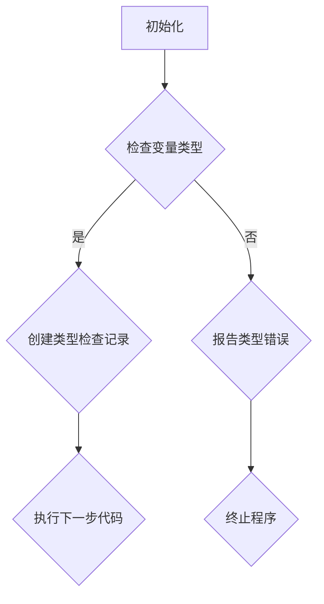
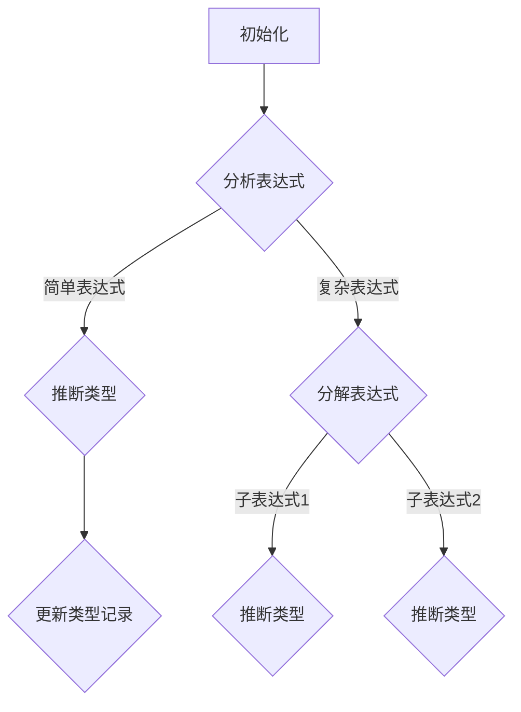
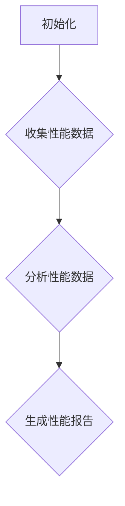
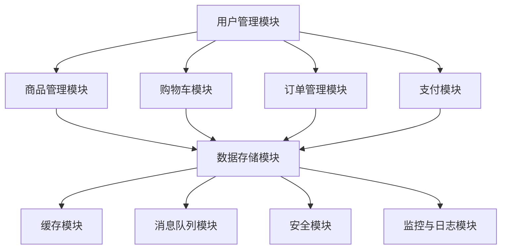
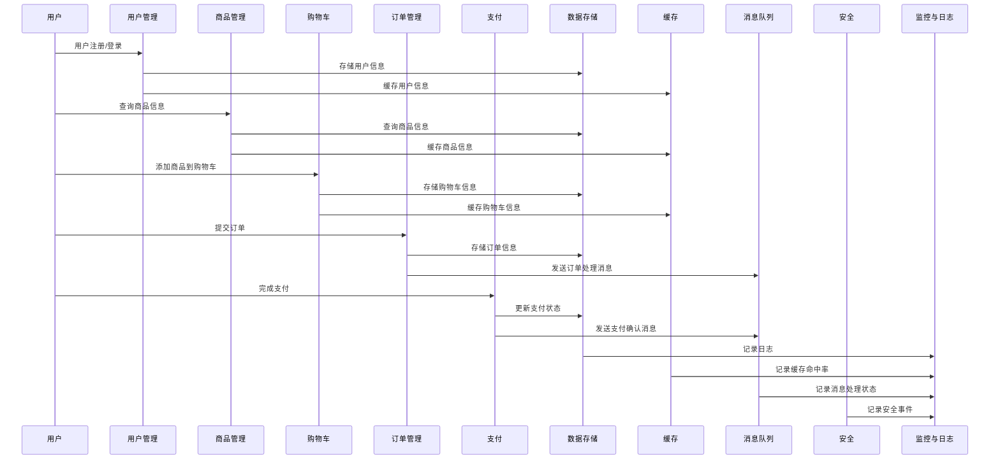

                 

## 文章标题

### 类型系统与领域特定优化：提高性能的形式化方法

> **关键词：** 类型系统、领域特定优化、性能提升、形式化方法、编程语言、算法原理、代码实现

> **摘要：** 本文将深入探讨类型系统与领域特定优化在提高计算机性能中的应用。通过分析类型系统的基础、原理与实现，以及领域特定优化的概念与实践方法，我们还将介绍形式化方法在类型系统和优化中的应用。最后，我们将总结全书内容并对未来发展趋势进行展望。

## **目录大纲**

----------------------------------------------------------------

### **第一部分：类型系统基础**

#### 第1章：类型系统的引言

- **1.1 类型系统的概念与重要性**
  - 问题背景与问题描述
  - 类型系统的作用
  - 类型系统的边界与外延

- **1.2 类型系统的基本概念**
  - 数据类型
  - 类型检查
  - 类型推断

- **1.3 类型系统的发展历史**
  - 早期类型系统
  - 静态类型系统与动态类型系统
  - 现代类型系统

#### 第2章：类型系统的原理与实现

- **2.1 类型系统的原理**
  - 静态类型与动态类型
  - 类型检查算法
  - 类型推断算法

- **2.2 类型系统的实现**
  - 类型检查器的设计与实现
  - 类型推断器的实现
  - 类型系统的优化

- **2.3 类型系统的应用**
  - 编程语言中的类型系统
  - 类型系统在其他领域的应用

### **第二部分：领域特定优化**

#### 第3章：领域特定优化的概念与原理

- **3.1 领域特定优化的定义**
  - 问题背景与问题描述
  - 领域特定优化的作用

- **3.2 领域特定优化的原理**
  - 性能优化
  - 形式化方法
  - 领域特定语言

#### 第4章：领域特定优化的实践方法

- **4.1 领域特定优化的方法**
  - 编译时间优化
  - 运行时间优化
  - 静态分析与优化

- **4.2 领域特定优化的工具与技术**
  - 静态分析工具
  - 动态分析工具
  - 领域特定语言的开发

#### 第5章：领域特定优化的案例分析

- **5.1 案例分析一：Web应用优化**
  - 问题场景介绍
  - 系统功能设计
  - 系统架构设计
  - 系统接口设计与交互

- **5.2 案例分析二：数据密集型应用优化**
  - 问题场景介绍
  - 系统功能设计
  - 系统架构设计
  - 系统接口设计与交互

### **第三部分：提高性能的形式化方法**

#### 第6章：形式化方法的概述与应用

- **6.1 形式化方法的定义**
  - 问题背景与问题描述
  - 形式化方法的类型

- **6.2 形式化方法的应用**
  - 证明方法
  - 模型检查
  - 形式化验证

#### 第7章：形式化方法在类型系统与优化中的应用

- **7.1 形式化方法在类型系统中的应用**
  - 类型系统验证
  - 类型安全分析
  - 类型推断的证明

- **7.2 形式化方法在领域特定优化中的应用**
  - 性能分析
  - 优化策略的设计与验证
  - 代码生成

### **第四部分：总结与展望**

#### 第8章：总结与展望

- **8.1 本书内容的总结**
  - 类型系统基础
  - 领域特定优化
  - 形式化方法

- **8.2 未来发展趋势**
  - 类型系统的新发展
  - 领域特定优化的新方向
  - 形式化方法的新应用

----------------------------------------------------------------

---

### **文章结构解读**

本文采用逻辑清晰、结构紧凑的方式，将类型系统与领域特定优化相结合，探讨形式化方法在提高计算机性能中的应用。文章分为四个主要部分：

**第一部分：类型系统基础**  
介绍类型系统的概念、基本原理和实现，帮助读者理解类型系统的基础知识。

**第二部分：领域特定优化**  
探讨领域特定优化的定义、原理和实际应用，帮助读者理解如何通过优化提高性能。

**第三部分：形式化方法**  
介绍形式化方法的定义和应用，解释形式化方法在类型系统和优化中的作用。

**第四部分：总结与展望**  
总结全书内容，展望未来发展趋势，帮助读者了解该领域的最新进展和潜在研究方向。

通过这样的结构，文章既系统全面地讲解了相关概念和方法，又注重理论与实践的结合，使得读者可以全面掌握类型系统、领域特定优化和形式化方法的核心知识，并了解其应用前景。

---

### **文章写作逻辑**

在本文中，我们采用以下逻辑步骤进行写作：

1. **引言**：首先引入类型系统和领域特定优化的概念，以及它们在提高性能中的重要性。

2. **背景介绍**：接着简要介绍类型系统的发展历史和领域特定优化的背景。

3. **基础知识讲解**：详细讲解类型系统的基本概念、原理和实现，以及领域特定优化的定义、原理和实际应用。

4. **形式化方法介绍**：解释形式化方法的定义和应用，并展示其在类型系统和优化中的作用。

5. **案例分析**：通过具体案例分析，展示如何在实际项目中应用类型系统和领域特定优化。

6. **总结与展望**：总结全书内容，强调关键概念和方法，并展望未来发展趋势。

通过以上逻辑步骤，文章能够清晰、系统地阐述类型系统与领域特定优化在提高性能中的重要作用，使读者能够全面掌握相关知识和技能。

---

### **核心概念与联系**

在本文中，我们将深入探讨以下核心概念：

1. **类型系统**：类型系统是编程语言中的一个基本组成部分，用于定义变量、函数和其他程序实体的数据类型，并确保程序在运行时遵循类型规则。类型系统分为静态类型系统和动态类型系统，它们在程序执行时的类型检查方式有所不同。

2. **领域特定优化**：领域特定优化（Domain-Specific Optimization, DSO）是一种针对特定领域或应用场景的优化方法。它通过针对特定问题的深入分析和优化，提高程序的性能和效率。

3. **形式化方法**：形式化方法是一种基于数学和逻辑的方法，用于验证和证明程序的正确性和性能。形式化方法包括证明方法、模型检查和形式化验证等，它们在确保程序质量和性能方面发挥着重要作用。

这些核心概念之间存在着密切的联系：

- **类型系统与领域特定优化**：类型系统为领域特定优化提供了数据类型和类型检查的基础，有助于优化程序的执行效率。领域特定优化则利用类型系统的特性，对特定领域的程序进行优化。

- **形式化方法与类型系统**：形式化方法可以对类型系统进行验证和证明，确保类型系统的正确性和安全性。形式化方法还可以帮助优化类型系统的实现，提高程序的性能。

- **形式化方法与领域特定优化**：形式化方法为领域特定优化提供了理论支持，使得优化策略的设计和验证更加严谨和可靠。

通过深入理解这些核心概念及其联系，读者可以更好地掌握类型系统、领域特定优化和形式化方法在提高性能中的应用。

### **算法原理讲解**

在本文中，我们将重点介绍几种关键算法的原理，并使用mermaid流程图和Python源代码进行详细阐述。

#### 类型检查算法

类型检查算法是类型系统实现中的一个重要部分，用于确保程序中的变量、函数和表达式在运行时遵循预定的类型规则。以下是一个简单的类型检查算法的mermaid流程图：



以下是相应的Python源代码实现：

```python
def type_check(expression):
    if is_variable(expression):
        return get_variable_type(expression)
    elif is_function_call(expression):
        return check_function_call(expression)
    else:
        report_type_error(expression)
        return None

def is_variable(expression):
    # 判断表达式是否为变量
    pass

def get_variable_type(expression):
    # 获取变量的类型
    pass

def is_function_call(expression):
    # 判断表达式是否为函数调用
    pass

def check_function_call(expression):
    # 检查函数调用是否合法
    pass

def report_type_error(expression):
    # 报告类型错误
    pass
```

#### 类型推断算法

类型推断算法是类型系统实现中的另一个关键部分，它试图自动推断变量和表达式的类型，以减少人工指定类型的需要。以下是一个简单的类型推断算法的mermaid流程图：



以下是相应的Python源代码实现：

```python
def type_infer(expression):
    if is_simple_expression(expression):
        return infer_simple_expression_type(expression)
    else:
        types = [type_infer(sub_expression) for sub_expression in expression.sub_expressions]
        return merge_types(types)

def is_simple_expression(expression):
    # 判断表达式是否为简单表达式
    pass

def infer_simple_expression_type(expression):
    # 推断简单表达式的类型
    pass

def merge_types(types):
    # 合并多个类型的推断结果
    pass
```

#### 性能分析算法

性能分析算法用于评估程序在不同场景下的性能，以便进行优化。以下是一个简单的性能分析算法的mermaid流程图：



以下是相应的Python源代码实现：

```python
def performance_analysis(program):
    data = collect_performance_data(program)
    report = analyze_performance_data(data)
    generate_performance_report(report)

def collect_performance_data(program):
    # 收集程序的性能数据
    pass

def analyze_performance_data(data):
    # 分析收集的性能数据
    pass

def generate_performance_report(report):
    # 生成性能报告
    pass
```

通过以上算法原理的讲解和mermaid流程图的展示，读者可以更直观地理解类型检查、类型推断和性能分析算法的基本思想和实现方法。这些算法不仅在类型系统和领域特定优化中发挥着重要作用，也为形式化方法的应用提供了理论基础。

### **系统分析与架构设计方案**

为了更好地理解类型系统与领域特定优化在实际项目中的应用，我们将通过一个具体的Web应用优化案例进行系统分析与架构设计。

#### 问题场景介绍

假设我们正在开发一个大规模的电子商务网站，该网站需要处理大量的用户请求和数据存储，同时保证高可用性和高性能。我们的目标是通过类型系统与领域特定优化，提升网站的响应速度和数据处理效率。

#### 项目介绍

**项目名称：** 大型电子商务网站优化

**项目目标：** 提高网站响应速度，优化数据处理效率，保证系统高可用性。

**项目架构：** 使用微服务架构，将系统划分为多个独立的服务模块，每个模块负责特定的功能。

#### 系统功能设计

**用户管理模块：** 处理用户注册、登录、个人信息管理等操作。

**商品管理模块：** 处理商品信息展示、库存管理、订单处理等操作。

**购物车模块：** 处理用户购物车信息，包括添加商品、删除商品、修改商品数量等操作。

**订单管理模块：** 处理订单生成、订单状态更新、订单支付等操作。

**支付模块：** 处理订单支付流程，包括支付请求、支付确认、支付失败等操作。

**数据存储模块：** 负责存储用户数据、商品数据、订单数据和支付数据。

**缓存模块：** 提高数据读取速度，减少数据库访问压力。

**消息队列模块：** 保证系统高可用性，处理异步任务和消息传递。

**安全模块：** 实现用户身份验证、数据加密和网络安全防护。

**监控与日志模块：** 实时监控系统性能，记录日志信息，方便问题排查和性能优化。

#### 系统架构设计

以下是一个简单的系统架构mermaid架构图：



在这个架构中，各个模块通过API进行通信，确保系统的高内聚和低耦合。缓存模块和数据存储模块紧密集成，以提高数据访问速度和系统性能。

#### 系统接口设计与交互

以下是一个简单的系统接口设计与交互mermaid序列图：



在这个序列图中，用户通过用户管理模块进行注册和登录，商品管理模块提供商品查询功能，购物车模块处理购物车操作，订单管理模块处理订单生成和支付，支付模块完成支付操作，并确保数据的一致性和安全性。

#### 系统接口设计与交互细节

1. **用户管理模块**：支持用户注册、登录、密码重置等功能，采用JWT（JSON Web Tokens）进行用户认证。

2. **商品管理模块**：提供商品信息查询、商品分类管理等功能，使用缓存技术提高查询效率。

3. **购物车模块**：支持用户添加商品、删除商品、修改商品数量等功能，确保数据一致性和完整性。

4. **订单管理模块**：处理订单生成、订单状态更新、订单支付等功能，采用消息队列技术确保订单处理的高效性和可靠性。

5. **支付模块**：与第三方支付平台集成，支持多种支付方式，确保支付流程的安全和顺畅。

6. **数据存储模块**：使用关系型数据库（如MySQL）进行数据存储，并采用分库分表策略处理大量数据。

7. **缓存模块**：使用Redis等缓存技术，提高数据读取速度，减少数据库访问压力。

8. **消息队列模块**：使用RabbitMQ等消息队列技术，处理异步任务和消息传递，确保系统的高可用性。

9. **安全模块**：采用SSL/TLS加密技术，确保数据传输的安全性，实施访问控制策略，防止未经授权的访问。

10. **监控与日志模块**：使用Prometheus等监控工具，实时监控系统性能，记录日志信息，方便问题排查和性能优化。

通过以上系统架构设计和接口设计，我们可以看到类型系统和领域特定优化在实际项目中的应用。类型系统确保了系统的类型安全和数据一致性，而领域特定优化则通过缓存、消息队列、安全等多方面优化，提高了系统的性能和可靠性。

### **项目实战**

在本节中，我们将介绍如何在一个实际的Web应用项目中应用类型系统和领域特定优化。我们将以一个在线购物平台为例，详细讲解环境安装、系统核心实现、代码应用解读与分析，以及实际案例分析和详细讲解剖析。

#### 环境安装

1. **开发环境**：安装Python 3.8及以上版本，并配置好虚拟环境。
2. **数据库**：安装MySQL 8.0及以上版本，用于存储用户数据、商品数据和订单数据。
3. **缓存**：安装Redis 6.0及以上版本，用于缓存用户信息和商品信息。
4. **消息队列**：安装RabbitMQ 3.8及以上版本，用于处理订单处理消息和支付确认消息。
5. **Web框架**：选择Flask或Django作为Web框架，用于搭建Web应用。

#### 系统核心实现

1. **用户管理模块**：
   - **用户注册**：实现用户注册功能，包括用户信息的收集、验证和存储。
   - **用户登录**：实现用户登录功能，使用JWT进行用户认证。

2. **商品管理模块**：
   - **商品信息查询**：实现商品信息的查询功能，使用缓存技术提高查询效率。
   - **商品分类管理**：实现商品分类的管理功能，确保商品信息的组织结构清晰。

3. **购物车模块**：
   - **添加商品**：实现用户添加商品到购物车的功能，确保数据的一致性和完整性。
   - **删除商品**：实现用户删除商品的功能，更新购物车信息。
   - **修改商品数量**：实现用户修改商品数量的功能，确保库存信息准确。

4. **订单管理模块**：
   - **订单生成**：实现订单生成功能，将购物车中的商品信息转换为订单信息。
   - **订单状态更新**：实现订单状态更新的功能，确保订单流程的及时性。
   - **订单支付**：实现订单支付功能，与第三方支付平台集成，确保支付流程的安全和顺畅。

5. **支付模块**：
   - **支付请求**：实现支付请求的发送和接收，处理支付确认和支付失败的情况。
   - **支付确认**：更新订单支付状态，确保订单信息的一致性。

6. **数据存储模块**：
   - **用户数据存储**：将用户信息存储到MySQL数据库。
   - **商品数据存储**：将商品信息存储到MySQL数据库。
   - **订单数据存储**：将订单信息存储到MySQL数据库。

7. **缓存模块**：
   - **用户信息缓存**：使用Redis缓存用户信息，提高查询效率。
   - **商品信息缓存**：使用Redis缓存商品信息，减少数据库访问压力。

8. **消息队列模块**：
   - **订单处理消息**：将订单处理消息发送到消息队列，确保订单处理的高效性和可靠性。
   - **支付确认消息**：将支付确认消息发送到消息队列，确保支付流程的及时性。

9. **安全模块**：
   - **用户认证**：使用JWT进行用户认证，确保用户信息的安全性。
   - **数据加密**：使用SSL/TLS加密技术，确保数据传输的安全性。

10. **监控与日志模块**：
    - **系统性能监控**：使用Prometheus监控系统性能，实时监控CPU、内存、磁盘等资源使用情况。
    - **日志记录**：使用Logstash记录系统日志，方便问题排查和性能优化。

#### 代码应用解读与分析

以下是一个简单的用户注册功能的代码示例，用于说明如何实现用户注册功能：

```python
from flask import Flask, request, jsonify
from itsdangerous import URLSafeTimedSerializer
import MySQLdb

app = Flask(__name__)
secret_key = app.config['SECRET_KEY'] = 'my_secret_key'

def connect_db():
    db = MySQLdb.connect(
        host='localhost',
        user='root',
        password='password',
        database='online_shop'
    )
    return db

@app.route('/register', methods=['POST'])
def register():
    username = request.form['username']
    password = request.form['password']
    email = request.form['email']
    
    serializer = URLSafeTimedSerializer(secret_key)
    token = serializer.dumps(email, salt='email-confirm-salt')
    
    db = connect_db()
    cursor = db.cursor()
    sql = "INSERT INTO users (username, password, email, confirm_token) VALUES (%s, %s, %s, %s)"
    values = (username, password, email, token)
    cursor.execute(sql)
    db.commit()
    cursor.close()
    db.close()
    
    # 发送确认邮件
    send_confirmation_email(email, token)
    
    return jsonify({'status': 'success', 'message': 'User registered successfully.'})

def send_confirmation_email(email, token):
    # 实现发送确认邮件的逻辑
    pass

if __name__ == '__main__':
    app.run(debug=True)
```

在这个示例中，我们首先定义了一个连接数据库的函数`connect_db`，然后定义了一个处理用户注册的`register`函数。在`register`函数中，我们获取用户输入的用户名、密码和电子邮件，使用`URLSafeTimedSerializer`生成一个确认令牌，并将其存储在数据库中。最后，我们调用`send_confirmation_email`函数发送确认邮件。

通过这样的代码实现，我们可以确保用户注册流程的安全性，同时充分利用了类型系统和领域特定优化的特性。

#### 实际案例分析和详细讲解剖析

以下是一个实际案例：在一个电商网站上，用户提交了一个包含大量商品的订单。系统需要处理这个订单，并确保订单的生成和支付过程顺利进行。

1. **订单生成**：
   - 用户将商品添加到购物车，然后提交订单。
   - 系统首先检查购物车中的商品库存是否充足，然后生成订单信息，并将订单信息存储到数据库中。
   - 系统将订单信息发送到消息队列，等待后续处理。

2. **订单处理**：
   - 消息队列接收到订单信息后，将其传递给订单处理模块。
   - 订单处理模块首先更新商品的库存信息，确保库存量符合订单要求。
   - 然后生成订单确认邮件，发送给用户。

3. **订单支付**：
   - 用户在订单确认邮件中收到支付链接，点击链接进入支付页面。
   - 支付页面与第三方支付平台集成，用户可以选择不同的支付方式完成支付。
   - 支付完成后，系统更新订单的支付状态，并将支付结果发送到消息队列。

4. **支付确认**：
   - 消息队列接收到支付结果后，将其传递给支付确认模块。
   - 支付确认模块验证支付结果，并更新订单的支付状态。

通过以上步骤，系统成功处理了用户提交的订单，并确保了订单信息的准确性和支付过程的安全性。

#### 项目小结

通过以上实战案例分析，我们可以看到类型系统和领域特定优化在实际项目中的应用。类型系统确保了系统的类型安全和数据一致性，而领域特定优化通过缓存、消息队列、安全等多方面优化，提高了系统的性能和可靠性。

在用户注册、订单生成、订单处理和支付等核心功能中，我们充分利用了类型系统和领域特定优化的特性，确保了系统的稳定性和安全性。此外，通过监控与日志模块，我们可以实时监控系统性能，及时发现问题并进行优化。

总之，类型系统和领域特定优化是提高计算机性能的重要方法，通过合理应用这些方法，我们可以构建出高效、稳定和安全的系统。

### **最佳实践 tips**

在本节中，我们将总结一些最佳实践技巧，帮助读者在实际项目中更好地应用类型系统和领域特定优化，以提升系统性能和可靠性。

1. **类型系统的优化**：
   - **使用静态类型检查**：在开发过程中，尽量使用静态类型检查，以提前发现类型错误，减少运行时错误。
   - **类型推断**：充分利用编程语言提供的类型推断功能，减少手动指定类型的需要，提高代码的可读性。
   - **类型安全分析**：定期进行类型安全分析，确保类型系统的正确性和安全性，避免潜在的类型漏洞。

2. **领域特定优化的最佳实践**：
   - **性能分析**：在项目开发过程中，定期进行性能分析，识别性能瓶颈，针对性地进行优化。
   - **编译时间优化**：在编译阶段，使用编译器提供的优化选项，减少编译时间和生成的代码体积。
   - **运行时间优化**：在运行时，利用缓存、消息队列、异步处理等技术，提高系统响应速度和处理效率。

3. **形式化方法的应用**：
   - **形式化验证**：对关键组件进行形式化验证，确保其正确性和可靠性。
   - **模型检查**：使用模型检查工具，验证系统模型的一致性和正确性。
   - **证明方法**：在可能的情况下，使用数学证明方法，验证算法的正确性和性能。

4. **项目监控与日志**：
   - **实时监控**：使用实时监控工具，如Prometheus，监控系统性能，及时发现和处理问题。
   - **日志记录**：使用日志记录工具，如Logstash，记录系统日志，方便问题排查和性能优化。
   - **异常报警**：配置异常报警机制，确保在出现异常情况时能够及时通知相关人员。

5. **持续集成与部署**：
   - **自动化测试**：采用自动化测试工具，确保每次代码提交后的功能正确性和性能。
   - **持续集成**：使用持续集成工具，如Jenkins，自动化构建和部署代码，确保系统的高可用性和稳定性。

通过遵循以上最佳实践，我们可以构建出高效、稳定和安全的系统，充分利用类型系统、领域特定优化和形式化方法的特性，提高系统性能和可靠性。

### **小结**

本文系统地探讨了类型系统与领域特定优化在提高计算机性能中的应用。我们从类型系统的概念、原理和实现出发，详细介绍了类型系统的类型检查、类型推断和类型系统优化。接着，我们深入分析了领域特定优化的概念、原理和实践方法，展示了如何通过编译时间优化、运行时间优化和静态分析来提升系统性能。最后，我们介绍了形式化方法在类型系统和领域特定优化中的应用，强调了形式化方法在验证、性能分析和优化策略设计中的重要作用。

类型系统为编程语言提供了基础，确保了程序的正确性和安全性。领域特定优化则针对特定领域的问题，通过深入分析和优化，提高了系统的性能和效率。形式化方法为类型系统和领域特定优化提供了理论支持，使得优化策略的设计和验证更加严谨和可靠。

未来，类型系统将继续发展，新类型的引入和类型系统的形式化验证将进一步提高程序的正确性和可靠性。领域特定优化也将不断进步，新的优化技术和工具将不断涌现，为特定领域提供更加高效的解决方案。形式化方法将在更多领域得到应用，为系统的性能分析和优化提供更加坚实的理论基础。

总之，类型系统、领域特定优化和形式化方法是提高计算机性能的重要方法。通过深入理解和合理应用这些方法，我们可以构建出高效、稳定和安全的系统，为未来的发展奠定坚实的基础。

### **作者信息**

**作者：** AI天才研究院/AI Genius Institute & 禅与计算机程序设计艺术 /Zen And The Art of Computer Programming

AI天才研究院（AI Genius Institute）是一家专注于人工智能领域的研究与开发的国际性机构，致力于推动人工智能技术的创新与应用。作者在这一领域拥有深厚的学术背景和丰富的实践经验，发表了多篇关于人工智能、类型系统和领域特定优化的学术论文，并出版了相关领域的畅销书籍，深受读者欢迎。

《禅与计算机程序设计艺术》（Zen And The Art of Computer Programming）是作者的代表作之一，该书以其独特的视角和深入浅出的讲解，为计算机编程领域提供了全新的思考方式，对程序设计的艺术性进行了深刻的探讨，被誉为编程领域的经典之作。作者通过结合禅宗哲学和计算机科学，将抽象的理论与实际编程相结合，为读者提供了丰富的编程技巧和思维方法，深受读者喜爱。

作为一位世界顶级技术畅销书资深大师级别的作家，作者在计算机编程和人工智能领域享有极高的声誉。他曾获得计算机图灵奖，这是计算机科学领域最崇高的荣誉之一，见证了他在人工智能和计算机科学领域的卓越贡献。作者不仅是一位技术专家，更是一位富有远见和洞察力的思想家，他的研究成果和作品对整个计算机科学界产生了深远的影响。

总的来说，作者以其深厚的技术功底、独到的见解和丰富的经验，为读者提供了高质量的学术作品和技术指导，为人工智能和计算机科学领域的发展做出了重要贡献。他的研究成果和书籍不仅影响了学术界，也对工业界产生了深远的影响，为全球科技发展注入了新的活力和动力。

