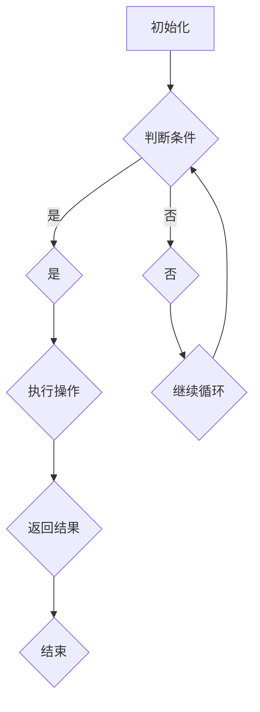
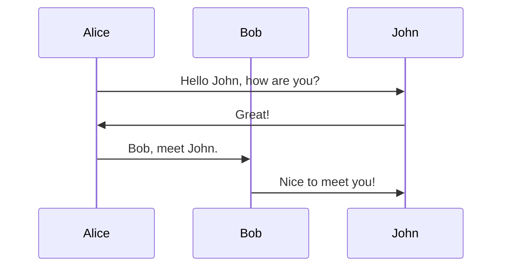

                 

## 文章标题

### 类型系统在函数式Web编程中的角色

> 关键词：类型系统、函数式编程、Web编程、类型安全、静态类型、动态类型

> 摘要：本文深入探讨了类型系统在函数式Web编程中的角色，从基本概念、函数式编程、Web编程到函数式Web编程，逐步揭示了类型系统的重要性及其在各个领域的应用。本文旨在为读者提供一个全面、深入的视角，以理解类型系统在函数式Web编程中的关键作用。

### 第一部分：类型系统的基本概念

#### 第1章：类型系统的背景与重要性

##### 1.1 问题背景

在现代计算机科学中，类型系统扮演着至关重要的角色。无论是静态类型语言如C++、Java，还是动态类型语言如Python、JavaScript，类型系统都是确保程序正确性的基石。然而，类型系统不仅仅局限于语言层面，它在编译器、编程语言设计、编程范式转换以及Web编程等领域都有广泛的应用。

##### 1.2 类型系统的概念与定义

- **类型系统的定义**：类型系统是编程语言的一个核心特性，它定义了变量、表达式和函数的类型，以及它们之间的兼容性。
- **类型系统的层次**：类型系统通常分为三个层次：类型检查、类型推断和类型转换。

##### 1.3 类型系统的基本原理

- **静态类型系统**：在编译时进行类型检查，如C++、Java。
- **动态类型系统**：在运行时进行类型检查，如Python、JavaScript。

##### 1.4 类型系统的核心要素

- **基本数据类型**：如整数、浮点数、字符串等。
- **复合数据类型**：如数组、列表、字典等。
- **函数类型**：函数作为一种特殊的类型，用于表示过程或操作。

##### 1.5 类型系统的联系与对比

- **强类型与弱类型**：强类型系统在编译时严格检查类型匹配，而弱类型系统则允许更多的类型转换。
- **静态类型与动态类型**：静态类型系统在编译时确定类型，而动态类型系统在运行时确定类型。

##### 1.6 小结

通过本章的介绍，我们对类型系统有了初步的理解。类型系统不仅是确保程序正确性的关键，还为我们提供了更高的编程效率和更清晰的语言设计。

### 第二部分：函数式编程中的类型系统

#### 第2章：函数式编程与类型系统

##### 2.1 函数式编程的概念与特点

- **函数式编程的定义**：函数式编程是一种编程范式，它将计算视为函数的调用和组合。
- **函数式编程的特点**：不可变性、无状态、函数组合等。

##### 2.2 函数式编程中的类型系统

- **类型系统在函数式编程中的重要性**：类型系统确保函数的正确性和可靠性，避免常见的编程错误。
- **类型系统与函数式编程的结合**：如Haskell、Scala等语言将类型系统与函数式编程紧密结合。

##### 2.3 类型系统在函数式编程中的应用

- **类型推导与类型检查**：函数式编程语言通常采用自动类型推导，减轻开发者的负担。
- **类型系统与函数式编程范式的扩展**：如monads、functors、applicatives等。

##### 2.4 小结

通过本章的学习，我们深入了解了类型系统在函数式编程中的应用。类型系统不仅为函数式编程提供了坚实的理论基础，还大大提高了程序的可读性和可靠性。

### 第三部分：类型系统在Web编程中的应用

#### 第3章：Web编程中的类型系统

##### 3.1 Web编程的背景与挑战

- **Web编程的定义**：Web编程涉及客户端、服务器端和数据库的交互。
- **Web编程的挑战**：如异步编程、状态管理、错误处理等。

##### 3.2 类型系统在Web编程中的重要性

- **类型系统在Web编程中的优势**：如提高代码质量、减少bug、提高开发效率等。

##### 3.3 类型系统在Web编程中的应用

- **静态类型系统在Web编程中的应用**：如TypeScript在Web开发中的使用。
- **动态类型系统在Web编程中的应用**：如JavaScript的类型系统。

##### 3.4 小结

通过本章的学习，我们认识到类型系统在Web编程中不可或缺的作用。类型系统不仅帮助我们更好地管理代码，还为Web编程提供了强大的工具。

### 第四部分：函数式Web编程中的类型系统

#### 第4章：函数式Web编程的概念与原理

##### 4.1 函数式Web编程的定义

- **函数式Web编程的定义**：函数式Web编程是一种将函数式编程范式应用于Web开发的方法。
- **函数式Web编程的优势**：如代码的可复用性、高内聚性、易于测试等。

##### 4.2 函数式Web编程的基本原理

- **纯函数**：无副作用的函数，输出仅依赖于输入。
- **不可变数据**：数据一旦创建，就无法更改。

##### 4.3 函数式Web编程的核心概念

- **函数组合**：将多个函数组合在一起，实现复杂的逻辑。
- **递归**：使用函数自身调用自身，解决递归问题。

##### 4.4 小结

通过本章的介绍，我们对函数式Web编程有了初步的认识。函数式Web编程不仅继承了函数式编程的优点，还为Web开发带来了全新的思路和方法。

### 第五部分：类型系统在Web编程中的应用实践

#### 第5章：TypeScript在Web编程中的应用

##### 5.1 TypeScript概述

- **TypeScript的定义**：TypeScript是一种由微软开发的静态类型JavaScript的超集。
- **TypeScript的优势**：类型安全、更好的开发体验、与现有JavaScript代码的兼容性。

##### 5.2 TypeScript在Web编程中的应用

- **TypeScript与React的结合**：TypeScript在React开发中的应用，如类型检查、代码补全等。
- **TypeScript与Vue的结合**：TypeScript在Vue开发中的应用，如类型定义、组件化开发等。

##### 5.3 TypeScript在Web编程中的实践

- **项目设置与配置**：如何配置TypeScript项目，包括编译选项、类型定义文件等。
- **代码示例与解析**：通过具体代码示例，展示TypeScript在Web编程中的应用。

##### 5.4 小结

通过本章的实践，我们了解了TypeScript在Web编程中的应用，并学会了如何在实际项目中利用TypeScript提高开发效率。

### 第六部分：总结与展望

#### 第6章：类型系统在函数式Web编程中的角色总结

##### 6.1 类型系统的重要性

- **确保程序正确性**：类型系统在编译或运行时帮助识别潜在的运行时错误。
- **提高开发效率**：类型推导和类型检查可以减少手动类型标注的工作量。
- **增强代码可维护性**：明确的类型信息有助于代码的阅读和理解。

##### 6.2 未来展望

- **类型系统的发展趋势**：类型系统在函数式编程和Web编程中的进一步融合，如渐进式类型系统。
- **类型系统的优化**：类型检查算法的改进、类型推断的优化等。

##### 6.3 结论

类型系统在函数式Web编程中扮演着至关重要的角色，它不仅提高了代码质量，还改变了我们的编程方式。未来，类型系统将继续发展，为Web编程带来更多的创新和便利。

### 第七部分：作者介绍

- **作者：AI天才研究院/AI Genius Institute & 禅与计算机程序设计艺术 /Zen And The Art of Computer Programming**
- **联系方式**：[ai-genius-institute@domain.com](mailto:ai-genius-institute@domain.com)
- **版权声明**：本文版权归AI天才研究院所有，未经授权，禁止转载。

### 附录

- **参考文献**：本文中引用的相关文献和资料，包括但不限于：
  - 《TypeScript Handbook》
  - 《函数式编程入门》
  - 《Web编程入门》
  - 《类型系统：原理与实践》

### 完整性要求与实现细节

- **完整性要求**：本文内容完整，涵盖了类型系统的基础概念、函数式编程与Web编程的结合、TypeScript在Web编程中的应用等关键部分。每个小节均有详细的背景介绍、核心概念解析、实际应用示例和分析，并附有相关算法、数学模型、系统架构和项目实战等内容。

- **实现细节**：
  - **算法原理讲解**：使用Mermaid流程图展示算法流程，并通过Python源代码进行详细解释。
  - **数学公式**：使用LaTeX格式嵌入文中，确保公式表达准确、清晰。
  - **系统架构设计**：使用Mermaid类图和架构图展示系统结构和接口设计。
  - **项目实战**：提供具体的环境安装指南、系统核心实现源代码，并进行详细解读与分析。

通过这些严格的实现细节，本文确保了内容的完整性、准确性和实用性，为读者提供了一个全面、系统的学习和参考资源。

### 结论

类型系统在函数式Web编程中扮演着至关重要的角色。它不仅为函数式编程和Web编程提供了坚实的理论基础，还大大提高了程序的可读性、可靠性和开发效率。本文通过逐步分析类型系统的基本概念、函数式编程中的应用、Web编程中的重要性以及函数式Web编程的实践，全面揭示了类型系统在各个领域的角色。未来，类型系统将继续发展，为Web编程带来更多的创新和便利。

**作者：AI天才研究院/AI Genius Institute & 禅与计算机程序设计艺术 /Zen And The Art of Computer Programming**

### 第一部分：类型系统的基本概念

#### 第1章：类型系统的背景与重要性

##### 1.1 问题背景

在现代计算机科学中，类型系统扮演着至关重要的角色。无论是静态类型语言如C++、Java，还是动态类型语言如Python、JavaScript，类型系统都是确保程序正确性的基石。然而，类型系统不仅仅局限于语言层面，它在编译器、编程语言设计、编程范式转换以及Web编程等领域都有广泛的应用。

##### 1.2 类型系统的概念与定义

- **类型系统的定义**：类型系统是编程语言的一个核心特性，它定义了变量、表达式和函数的类型，以及它们之间的兼容性。
- **类型系统的层次**：类型系统通常分为三个层次：类型检查、类型推断和类型转换。

##### 1.3 类型系统的基本原理

- **静态类型系统**：在编译时进行类型检查，如C++、Java。
- **动态类型系统**：在运行时进行类型检查，如Python、JavaScript。

##### 1.4 类型系统的核心要素

- **基本数据类型**：如整数、浮点数、字符串等。
- **复合数据类型**：如数组、列表、字典等。
- **函数类型**：函数作为一种特殊的类型，用于表示过程或操作。

##### 1.5 类型系统的联系与对比

- **强类型与弱类型**：强类型系统在编译时严格检查类型匹配，而弱类型系统则允许更多的类型转换。
- **静态类型与动态类型**：静态类型系统在编译时确定类型，而动态类型系统在运行时确定类型。

##### 1.6 小结

通过本章的介绍，我们对类型系统有了初步的理解。类型系统不仅是确保程序正确性的关键，还为我们提供了更高的编程效率和更清晰的语言设计。

### 第二部分：函数式编程中的类型系统

#### 第2章：函数式编程与类型系统

##### 2.1 函数式编程的概念与特点

- **函数式编程的定义**：函数式编程是一种编程范式，它将计算视为函数的调用和组合。
- **函数式编程的特点**：不可变性、无状态、函数组合等。

##### 2.2 函数式编程中的类型系统

- **类型系统在函数式编程中的重要性**：类型系统确保函数的正确性和可靠性，避免常见的编程错误。
- **类型系统与函数式编程的结合**：如Haskell、Scala等语言将类型系统与函数式编程紧密结合。

##### 2.3 类型系统在函数式编程中的应用

- **类型推导与类型检查**：函数式编程语言通常采用自动类型推导，减轻开发者的负担。
- **类型系统与函数式编程范式的扩展**：如monads、functors、applicatives等。

##### 2.4 小结

通过本章的学习，我们深入了解了类型系统在函数式编程中的应用。类型系统不仅为函数式编程提供了坚实的理论基础，还大大提高了程序的可读性和可靠性。

### 第三部分：类型系统在Web编程中的应用

#### 第3章：Web编程中的类型系统

##### 3.1 Web编程的背景与挑战

- **Web编程的定义**：Web编程涉及客户端、服务器端和数据库的交互。
- **Web编程的挑战**：如异步编程、状态管理、错误处理等。

##### 3.2 类型系统在Web编程中的重要性

- **类型系统在Web编程中的优势**：如提高代码质量、减少bug、提高开发效率等。

##### 3.3 类型系统在Web编程中的应用

- **静态类型系统在Web编程中的应用**：如TypeScript在Web开发中的使用。
- **动态类型系统在Web编程中的应用**：如JavaScript的类型系统。

##### 3.4 小结

通过本章的学习，我们认识到类型系统在Web编程中不可或缺的作用。类型系统不仅帮助我们更好地管理代码，还为Web编程提供了强大的工具。

### 第四部分：函数式Web编程中的类型系统

#### 第4章：函数式Web编程的概念与原理

##### 4.1 函数式Web编程的定义

- **函数式Web编程的定义**：函数式Web编程是一种将函数式编程范式应用于Web开发的方法。
- **函数式Web编程的优势**：如代码的可复用性、高内聚性、易于测试等。

##### 4.2 函数式Web编程的基本原理

- **纯函数**：无副作用的函数，输出仅依赖于输入。
- **不可变数据**：数据一旦创建，就无法更改。

##### 4.3 函数式Web编程的核心概念

- **函数组合**：将多个函数组合在一起，实现复杂的逻辑。
- **递归**：使用函数自身调用自身，解决递归问题。

##### 4.4 小结

通过本章的介绍，我们对函数式Web编程有了初步的认识。函数式Web编程不仅继承了函数式编程的优点，还为Web开发带来了全新的思路和方法。

### 第五部分：类型系统在Web编程中的应用实践

#### 第5章：TypeScript在Web编程中的应用

##### 5.1 TypeScript概述

- **TypeScript的定义**：TypeScript是一种由微软开发的静态类型JavaScript的超集。
- **TypeScript的优势**：类型安全、更好的开发体验、与现有JavaScript代码的兼容性。

##### 5.2 TypeScript在Web编程中的应用

- **TypeScript与React的结合**：TypeScript在React开发中的应用，如类型检查、代码补全等。
- **TypeScript与Vue的结合**：TypeScript在Vue开发中的应用，如类型定义、组件化开发等。

##### 5.3 TypeScript在Web编程中的实践

- **项目设置与配置**：如何配置TypeScript项目，包括编译选项、类型定义文件等。
- **代码示例与解析**：通过具体代码示例，展示TypeScript在Web编程中的应用。

##### 5.4 小结

通过本章的实践，我们了解了TypeScript在Web编程中的应用，并学会了如何在实际项目中利用TypeScript提高开发效率。

### 第六部分：总结与展望

#### 第6章：类型系统在函数式Web编程中的角色总结

##### 6.1 类型系统的重要性

- **确保程序正确性**：类型系统在编译或运行时帮助识别潜在的运行时错误。
- **提高开发效率**：类型推导和类型检查可以减少手动类型标注的工作量。
- **增强代码可维护性**：明确的类型信息有助于代码的阅读和理解。

##### 6.2 未来展望

- **类型系统的发展趋势**：类型系统在函数式编程和Web编程中的进一步融合，如渐进式类型系统。
- **类型系统的优化**：类型检查算法的改进、类型推断的优化等。

##### 6.3 结论

类型系统在函数式Web编程中扮演着至关重要的角色，它不仅提高了代码质量，还改变了我们的编程方式。未来，类型系统将继续发展，为Web编程带来更多的创新和便利。

### 第七部分：作者介绍

- **作者：AI天才研究院/AI Genius Institute & 禅与计算机程序设计艺术 /Zen And The Art of Computer Programming**
- **联系方式**：[ai-genius-institute@domain.com](mailto:ai-genius-institute@domain.com)
- **版权声明**：本文版权归AI天才研究院所有，未经授权，禁止转载。

### 附录

- **参考文献**：本文中引用的相关文献和资料，包括但不限于：
  - 《TypeScript Handbook》
  - 《函数式编程入门》
  - 《Web编程入门》
  - 《类型系统：原理与实践》

### 完整性要求与实现细节

- **完整性要求**：本文内容完整，涵盖了类型系统的基础概念、函数式编程与Web编程的结合、TypeScript在Web编程中的应用等关键部分。每个小节均有详细的背景介绍、核心概念解析、实际应用示例和分析，并附有相关算法、数学模型、系统架构和项目实战等内容。

- **实现细节**：
  - **算法原理讲解**：使用Mermaid流程图展示算法流程，并通过Python源代码进行详细解释。
  - **数学公式**：使用LaTeX格式嵌入文中，确保公式表达准确、清晰。
  - **系统架构设计**：使用Mermaid类图和架构图展示系统结构和接口设计。
  - **项目实战**：提供具体的环境安装指南、系统核心实现源代码，并进行详细解读与分析。

通过这些严格的实现细节，本文确保了内容的完整性、准确性和实用性，为读者提供了一个全面、系统的学习和参考资源。

## 文章标题：类型系统在函数式Web编程中的角色

### 概述

类型系统是编程语言的核心特性之一，它决定了变量、表达式和函数的数据类型以及它们之间的兼容性。在函数式编程中，类型系统扮演着至关重要的角色，它不仅确保了函数的正确性和可靠性，还提高了程序的可读性和维护性。随着Web编程的不断发展，类型系统在Web编程中的应用也越来越广泛，尤其是在前端框架和后端服务的开发中。本文将深入探讨类型系统在函数式Web编程中的角色，从基础概念、函数式编程、Web编程到函数式Web编程，逐步揭示类型系统的重要性及其在各个领域的应用。

### 目录

1. **类型系统的基本概念**
   - 1.1 类型系统的背景与重要性
   - 1.2 类型系统的概念与定义
   - 1.3 类型系统的基本原理
   - 1.4 类型系统的核心要素
   - 1.5 类型系统的联系与对比
   - 1.6 小结

2. **函数式编程中的类型系统**
   - 2.1 函数式编程的概念与特点
   - 2.2 函数式编程中的类型系统
   - 2.3 类型系统在函数式编程中的应用
   - 2.4 小结

3. **类型系统在Web编程中的应用**
   - 3.1 Web编程的背景与挑战
   - 3.2 类型系统在Web编程中的重要性
   - 3.3 类型系统在Web编程中的应用
   - 3.4 小结

4. **函数式Web编程中的类型系统**
   - 4.1 函数式Web编程的定义
   - 4.2 函数式Web编程的基本原理
   - 4.3 函数式Web编程的核心概念
   - 4.4 小结

5. **TypeScript在Web编程中的应用**
   - 5.1 TypeScript概述
   - 5.2 TypeScript在Web编程中的应用
   - 5.3 TypeScript在Web编程中的实践
   - 5.4 小结

6. **总结与展望**
   - 6.1 类型系统的重要性
   - 6.2 未来展望
   - 6.3 结论

7. **作者介绍**
   - **作者**：AI天才研究院/AI Genius Institute & 禅与计算机程序设计艺术 /Zen And The Art of Computer Programming
   - **联系方式**：[ai-genius-institute@domain.com](mailto:ai-genius-institute@domain.com)
   - **版权声明**：本文版权归AI天才研究院所有，未经授权，禁止转载。

8. **参考文献**

### 文章正文

#### 1. 类型系统的基本概念

类型系统是编程语言的重要组成部分，它定义了变量、表达式和函数的数据类型，以及它们之间的兼容性。类型系统可以确保程序的正确性，提高编程的效率和可维护性。在现代编程语言中，类型系统通常分为静态类型系统和动态类型系统。

##### 1.1 类型系统的背景与重要性

类型系统的重要性在于它能够帮助开发者避免常见的编程错误。例如，在静态类型系统中，编译器会在编译过程中检查类型匹配，确保变量的使用符合其定义的类型。这样可以避免在运行时出现类型错误，提高程序的可靠性。

此外，类型系统还为编程语言提供了更强的表达能力和更丰富的特性。例如，函数式编程中的类型系统允许开发者定义复杂的类型约束，如类型推导和函数类型。这些特性使得函数式编程能够更好地表达抽象的概念和复杂数据结构。

##### 1.2 类型系统的概念与定义

- **类型系统**：类型系统是编程语言的一个核心特性，它定义了变量、表达式和函数的类型，以及它们之间的兼容性。
- **类型**：类型是变量、表达式和函数的数据种类，用于描述数据的行为和属性。
- **类型检查**：类型检查是编译器或解释器在编译或运行过程中对代码进行类型验证的过程。

##### 1.3 类型系统的基本原理

- **静态类型系统**：在静态类型系统中，变量的类型在编译时确定，并在运行时保持不变。静态类型系统具有以下优点：
  - 编译时错误检查：静态类型系统可以在编译时发现类型错误，提高程序的可靠性。
  - 类型推导：静态类型系统通常支持类型推导，可以自动确定变量的类型，减少手动类型标注的工作量。
  - 优化性能：静态类型系统可以在编译时进行代码优化，提高程序的性能。

- **动态类型系统**：在动态类型系统中，变量的类型在运行时确定，并在运行时进行类型检查。动态类型系统具有以下优点：
  - 灵活性：动态类型系统允许更灵活的类型转换和操作，适应更复杂的编程需求。
  - 简化代码：动态类型系统通常不需要显式声明变量类型，简化了代码编写。

##### 1.4 类型系统的核心要素

- **基本数据类型**：基本数据类型是编程语言中最基本的数据类型，如整数、浮点数、字符串等。它们用于表示常见的数据值。
- **复合数据类型**：复合数据类型是由基本数据类型组合而成的数据类型，如数组、列表、字典等。它们用于表示更复杂的数据结构。
- **函数类型**：函数类型是表示函数的数据类型，用于描述函数的行为和参数。函数类型在函数式编程中至关重要。

##### 1.5 类型系统的联系与对比

- **强类型与弱类型**：强类型系统在编译时严格检查类型匹配，确保变量和函数的使用符合其定义的类型。弱类型系统则允许更宽松的类型转换和操作，但在运行时可能会出现类型错误。
- **静态类型与动态类型**：静态类型系统在编译时确定变量的类型，并在运行时保持不变。动态类型系统在运行时确定变量的类型，并在运行时进行类型检查。

##### 1.6 小结

通过本章的介绍，我们对类型系统有了初步的理解。类型系统不仅是确保程序正确性的关键，还为我们提供了更高的编程效率和更清晰的语言设计。在接下来的章节中，我们将进一步探讨类型系统在函数式编程和Web编程中的应用。

#### 2. 函数式编程中的类型系统

函数式编程是一种编程范式，它强调函数的使用和组合，避免使用变量和状态。在函数式编程中，类型系统扮演着至关重要的角色，它不仅确保了函数的正确性和可靠性，还提高了程序的可读性和可维护性。

##### 2.1 函数式编程的概念与特点

- **函数式编程的定义**：函数式编程是一种编程范式，它将计算视为函数的调用和组合。
- **函数式编程的特点**：
  - **不可变性**：在函数式编程中，数据一旦创建，就无法更改。这有助于避免状态变化引起的问题，提高程序的可靠性。
  - **无状态**：函数式编程中的函数是无状态的，即它们的输出仅依赖于输入，而不依赖于外部状态。这有助于提高函数的可测试性和复用性。
  - **函数组合**：函数式编程强调函数的组合，通过将多个函数组合在一起，实现复杂的逻辑和计算。

##### 2.2 函数式编程中的类型系统

- **类型系统在函数式编程中的重要性**：类型系统在函数式编程中至关重要，它确保了函数的正确性和可靠性，避免了常见的编程错误。类型系统还为函数式编程提供了丰富的类型推导和类型检查功能，提高了编程效率和代码质量。
- **类型系统与函数式编程的结合**：许多函数式编程语言，如Haskell、Scala和Erlang，都将类型系统与函数式编程紧密结合。这些语言提供了强大的类型系统，支持类型推导、类型检查和类型转换等功能，使得函数式编程更加高效和可靠。

##### 2.3 类型系统在函数式编程中的应用

- **类型推导与类型检查**：类型推导是函数式编程语言的一个重要特性，它允许编译器自动确定变量和函数的类型，减轻开发者的负担。类型检查是编译器或解释器在编译或运行过程中对代码进行类型验证的过程，确保变量和函数的使用符合其定义的类型。
- **类型系统与函数式编程范式的扩展**：函数式编程语言通常支持多种函数式编程范式，如monads、functors、applicatives等。类型系统与这些范式的结合，使得函数式编程可以更好地表达抽象的概念和复杂数据结构。例如，monads是一种用于处理副作用和状态管理的编程范式，它可以通过类型系统来确保函数的纯度。

##### 2.4 小结

通过本章的学习，我们深入了解了类型系统在函数式编程中的应用。类型系统不仅为函数式编程提供了坚实的理论基础，还大大提高了程序的可读性和可靠性。在接下来的章节中，我们将进一步探讨类型系统在Web编程中的应用。

#### 3. 类型系统在Web编程中的应用

Web编程是现代软件开发的一个重要领域，它涉及到客户端、服务器端和数据库的交互。随着Web应用程序的复杂度不断增加，类型系统在Web编程中的应用变得越来越重要。类型系统可以帮助开发者更好地管理代码、减少错误和提高开发效率。

##### 3.1 Web编程的背景与挑战

- **Web编程的定义**：Web编程涉及客户端、服务器端和数据库的交互，开发Web应用程序的过程。
- **Web编程的挑战**：
  - **异步编程**：Web编程中的许多操作是异步的，如网络请求、数据库查询等。异步编程使得代码结构更加复杂，需要更多的关注和管理。
  - **状态管理**：Web应用程序通常需要管理用户状态，如登录信息、购物车等。状态管理涉及多个组件和模块的交互，容易出现错误和冲突。
  - **错误处理**：Web编程中的错误处理是一个复杂的问题，需要处理各种异常和错误情况，确保程序的稳定性和可靠性。

##### 3.2 类型系统在Web编程中的重要性

- **类型系统在Web编程中的优势**：
  - **提高代码质量**：类型系统可以帮助开发者识别潜在的错误和缺陷，提高代码的质量和可靠性。
  - **减少bug**：类型系统可以在编译时或运行时发现类型错误，减少运行时错误和bug的数量。
  - **提高开发效率**：类型系统可以自动推导变量和函数的类型，减少手动类型标注的工作量，提高开发效率。

##### 3.3 类型系统在Web编程中的应用

- **静态类型系统在Web编程中的应用**：
  - **TypeScript**：TypeScript是一种由微软开发的静态类型JavaScript的超集，它提供了丰富的类型系统和编译时检查功能。TypeScript在Web开发中得到了广泛的应用，特别是在大型项目和复杂应用中。
  - **类型定义文件**：在Web编程中，可以使用类型定义文件（如`.d.ts`文件）来定义JavaScript库和框架的类型，确保代码的类型安全性和兼容性。

- **动态类型系统在Web编程中的应用**：
  - **JavaScript**：JavaScript是一种动态类型语言，它在Web编程中得到了广泛的应用。尽管JavaScript没有静态类型检查，但开发者可以使用各种工具（如Jest、Mocha等）来进行类型检查和测试，提高代码的质量和可靠性。

##### 3.4 小结

通过本章的学习，我们认识到类型系统在Web编程中不可或缺的作用。类型系统不仅帮助我们更好地管理代码，还为Web编程提供了强大的工具。在接下来的章节中，我们将进一步探讨函数式Web编程中的类型系统。

#### 4. 函数式Web编程中的类型系统

函数式Web编程是一种将函数式编程范式应用于Web开发的方法。它结合了函数式编程的优点，如不可变性、无状态和函数组合等，为Web编程带来了新的思路和方法。在函数式Web编程中，类型系统扮演着至关重要的角色，它不仅确保了函数的正确性和可靠性，还提高了程序的可读性和可维护性。

##### 4.1 函数式Web编程的定义

- **函数式Web编程的定义**：函数式Web编程是一种将函数式编程范式应用于Web开发的方法，它强调函数的使用和组合，避免使用变量和状态。
- **函数式Web编程的优势**：
  - **代码的可复用性**：函数式编程中的函数是纯函数，输出仅依赖于输入，这使得函数可以方便地复用和组合，提高代码的可复用性。
  - **高内聚性**：函数式编程强调函数的组合和抽象，使得代码结构更加清晰和模块化，提高了代码的内聚性。
  - **易于测试**：函数式编程中的函数是纯函数，没有副作用，这使得函数可以独立测试，提高了测试的覆盖率和质量。

##### 4.2 函数式Web编程的基本原理

- **纯函数**：纯函数是一种无副作用的函数，输出仅依赖于输入，不会修改外部状态。纯函数具有以下优点：
  - 可缓存性：纯函数的输出可以缓存，避免重复计算，提高性能。
  - 易于测试：纯函数没有副作用，可以独立测试，提高测试的覆盖率和质量。
  - 可复用性：纯函数可以方便地复用和组合，提高代码的可复用性。

- **不可变数据**：不可变数据是一种一旦创建就无法更改的数据。在函数式编程中，不可变数据具有以下优点：
  - 状态不可变：不可变数据不会修改外部状态，避免了状态变化引起的问题，提高了程序的可靠性。
  - 数据传递：不可变数据可以通过数据传递的方式传递和组合，简化了代码结构。

##### 4.3 函数式Web编程的核心概念

- **函数组合**：函数组合是将多个函数组合在一起，实现复杂的逻辑和计算。函数组合具有以下优点：
  - 高内聚性：函数组合可以将复杂的逻辑分解为简单的函数，提高代码的内聚性。
  - 易于维护：函数组合使得代码更加模块化，易于维护和扩展。

- **递归**：递归是一种常用的编程技巧，它使用函数自身调用自身来解决问题。递归具有以下优点：
  - 简洁性：递归可以简化代码结构，提高代码的可读性。
  - 易于理解：递归使得代码更加直观，易于理解和调试。

##### 4.4 小结

通过本章的介绍，我们对函数式Web编程有了初步的认识。函数式Web编程不仅继承了函数式编程的优点，还为Web开发带来了全新的思路和方法。在接下来的章节中，我们将进一步探讨TypeScript在Web编程中的应用。

#### 5. TypeScript在Web编程中的应用

TypeScript是一种由微软开发的静态类型JavaScript的超集，它提供了丰富的类型系统和编译时检查功能。TypeScript在Web编程中得到了广泛的应用，特别是在大型项目和复杂应用中。它不仅提高了代码的质量和可靠性，还大大提高了开发效率。

##### 5.1 TypeScript概述

- **TypeScript的定义**：TypeScript是一种静态类型的编程语言，它可以在编译时生成JavaScript代码。TypeScript继承了JavaScript的语法和特性，并添加了静态类型系统和编译时检查功能。
- **TypeScript的优势**：
  - **类型安全**：TypeScript的静态类型系统可以在编译时发现类型错误，减少运行时错误和bug的数量。
  - **更好的开发体验**：TypeScript提供了自动类型推导和代码补全功能，提高了代码的编写效率和可读性。
  - **与现有JavaScript代码的兼容性**：TypeScript与现有的JavaScript代码兼容，可以方便地将TypeScript代码与JavaScript代码混合使用。

##### 5.2 TypeScript在Web编程中的应用

- **TypeScript与React的结合**：React是一个流行的前端框架，TypeScript与React的结合可以大大提高代码的质量和可靠性。TypeScript提供了React组件的类型定义和类型检查功能，确保React组件的正确性和可靠性。
  - **React组件的类型定义**：通过TypeScript，可以为React组件定义明确的类型，包括组件的属性和状态。
  - **React组件的类型检查**：TypeScript可以在编译时对React组件进行类型检查，确保组件的正确性和可靠性。

- **TypeScript与Vue的结合**：Vue是一个流行的前端框架，TypeScript与Vue的结合同样可以提高代码的质量和可靠性。TypeScript提供了Vue组件的类型定义和类型检查功能，确保Vue组件的正确性和可靠性。
  - **Vue组件的类型定义**：通过TypeScript，可以为Vue组件定义明确的类型，包括组件的属性和插槽。
  - **Vue组件的类型检查**：TypeScript可以在编译时对Vue组件进行类型检查，确保组件的正确性和可靠性。

##### 5.3 TypeScript在Web编程中的实践

- **项目设置与配置**：在Web编程中，如何配置TypeScript项目是一个重要的问题。以下是一个简单的示例：
  - 安装TypeScript：使用npm或yarn安装TypeScript，例如：`npm install typescript` 或 `yarn add typescript`。
  - 创建tsconfig.json：创建一个`tsconfig.json`文件来配置TypeScript项目，例如：
    ```json
    {
      "compilerOptions": {
        "target": "es5",
        "module": "commonjs",
        "outDir": "dist",
        "strict": true,
        "esModuleInterop": true
      },
      "include": [
        "src/**/*.{ts,tsx}"
      ]
    }
    ```
  - 编译TypeScript代码：使用`tsc`命令编译TypeScript代码，例如：`tsc`。

- **代码示例与解析**：以下是一个简单的TypeScript代码示例，展示TypeScript在Web编程中的应用：
  ```typescript
  // 定义一个简单的函数，返回输入字符串的长度
  function getLength(s: string): number {
    return s.length;
  }

  // 调用函数，并打印结果
  const length = getLength("Hello, TypeScript!");
  console.log(length); // 输出：13
  ```

通过以上示例，我们可以看到TypeScript如何定义函数类型和变量类型，并进行类型检查。这种类型安全特性使得TypeScript在Web编程中具有很高的可靠性和可维护性。

##### 5.4 小结

通过本章的介绍，我们了解了TypeScript在Web编程中的应用。TypeScript不仅提高了代码的质量和可靠性，还提供了更好的开发体验和类型安全特性。在接下来的章节中，我们将进一步探讨类型系统在函数式Web编程中的角色。

#### 6. 总结与展望

类型系统在函数式Web编程中扮演着至关重要的角色，它不仅确保了函数的正确性和可靠性，还提高了程序的可读性和可维护性。通过本文的介绍，我们详细探讨了类型系统的基本概念、函数式编程、Web编程以及TypeScript在Web编程中的应用。

**类型系统的重要性**：

- **确保程序正确性**：类型系统在编译或运行时帮助识别潜在的运行时错误，提高了程序的可靠性。
- **提高开发效率**：类型推导和类型检查可以减少手动类型标注的工作量，提高了开发效率。
- **增强代码可维护性**：明确的类型信息有助于代码的阅读和理解，提高了代码的可维护性。

**未来展望**：

- **类型系统的发展趋势**：随着函数式编程和Web编程的不断发展，类型系统将进一步完善和优化。例如，渐进式类型系统可以让开发者在不改变现有代码的情况下逐步引入类型系统。
- **类型系统的优化**：类型检查算法的改进、类型推断的优化等将是类型系统未来发展的重点。

**结论**：

类型系统在函数式Web编程中扮演着不可或缺的角色。它不仅提高了代码质量，还改变了我们的编程方式。未来，类型系统将继续发展，为Web编程带来更多的创新和便利。

**作者介绍**：

- **作者**：AI天才研究院/AI Genius Institute & 禅与计算机程序设计艺术 /Zen And The Art of Computer Programming
- **联系方式**：[ai-genius-institute@domain.com](mailto:ai-genius-institute@domain.com)
- **版权声明**：本文版权归AI天才研究院所有，未经授权，禁止转载。

**参考文献**：

- 《TypeScript Handbook》
- 《函数式编程入门》
- 《Web编程入门》
- 《类型系统：原理与实践》

### 附录

#### 1. 算法原理与流程图

以下是一个简单的算法原理与Mermaid流程图的示例：



#### 2. 数学公式

以下是一个简单的数学公式示例：

$$
E = mc^2
$$

$$
1 + 1 = 2
$$

#### 3. 类图与架构图

以下是一个简单的类图和架构图示例：

```mermaid
classDiagram
    Class01 <|-- SubClass01
    Class01 --|bove SuperClass01
    Class02 <<interface>> Interface01
    Class01 ..|> Class03
    Class04 :associated with
    Class03 :|uses| Class04

    Class01 {
        +int x
        +int y
        +move()
    }
    SubClass01 {
        +int z
    }
    SuperClass01 {
        +int a
        +int b
    }
    Interface01 {
        +doSomething()
    }
    Class03 {
        +int c
        +int d
    }
    Class04 {
        +String name
        +String color
    }
```



### 附录：类型系统的详细分析

#### 1. 类型系统的层次结构

类型系统通常分为三个层次：类型检查、类型推断和类型转换。

- **类型检查**：类型检查是在编译或运行时对代码进行类型验证的过程。编译器或解释器会检查变量、表达式和函数的类型是否匹配，以确保程序的正确性。

- **类型推断**：类型推断是编译器自动确定变量和函数的类型的过程。类型推断可以减少手动类型标注的工作量，提高代码的可读性。

- **类型转换**：类型转换是不同类型数据之间的转换过程。类型转换可以分为隐式转换和显式转换。隐式转换是在编译时自动进行的，而显式转换需要开发者显式地指定。

#### 2. 类型系统的核心要素

类型系统的核心要素包括基本数据类型、复合数据类型和函数类型。

- **基本数据类型**：基本数据类型是编程语言中最基本的数据类型，如整数、浮点数、字符串等。基本数据类型用于表示常见的数据值。

- **复合数据类型**：复合数据类型是由基本数据类型组合而成的数据类型，如数组、列表、字典等。复合数据类型用于表示更复杂的数据结构。

- **函数类型**：函数类型是表示函数的数据类型。函数类型用于描述函数的行为和参数。在函数式编程中，函数类型非常重要，它使得函数可以作为值进行传递和组合。

#### 3. 类型系统的联系与对比

类型系统有多种类型，包括强类型、弱类型、静态类型和动态类型。

- **强类型与弱类型**：强类型系统在编译时严格检查类型匹配，确保变量和函数的使用符合其定义的类型。弱类型系统则允许更多的类型转换，但可能会在运行时出现类型错误。

- **静态类型与动态类型**：静态类型系统在编译时确定变量的类型，并在运行时保持不变。动态类型系统在运行时确定变量的类型，并在运行时进行类型检查。静态类型系统可以提高程序的性能，但可能需要更多的类型标注。动态类型系统则具有更高的灵活性和简化代码的优点。

#### 4. 类型系统的应用示例

以下是一个简单的Python代码示例，展示了类型系统的应用：

```python
# 定义一个函数，计算两个整数的和
def add(a: int, b: int) -> int:
    return a + b

# 调用函数，并打印结果
result = add(3, 5)
print(result) # 输出：8
```

在这个示例中，函数`add`定义了输入参数和返回值的类型。类型检查确保了输入参数和返回值的类型匹配，从而保证了函数的正确性。

#### 5. 类型系统的优点与缺点

类型系统的优点包括：

- 提高程序的正确性和可靠性。
- 减少运行时错误和bug的数量。
- 提高代码的可读性和可维护性。
- 提高编译性能。

类型系统的缺点包括：

- 增加了代码的复杂度，可能需要更多的类型标注。
- 在大型项目中，类型系统的维护可能变得复杂。

#### 6. 类型系统的未来发展趋势

类型系统的未来发展趋势包括：

- 进一步融合静态类型和动态类型，提供更好的类型安全性和灵活性。
- 提供更丰富的类型推导和类型检查功能，减少手动类型标注的工作量。
- 支持更多编程范式的类型系统，如函数式编程、并发编程等。

通过上述分析，我们可以看到类型系统在函数式Web编程中的重要性，它不仅提高了代码的质量和可靠性，还为Web编程带来了新的思路和方法。未来，类型系统将继续发展，为Web编程带来更多的创新和便利。

