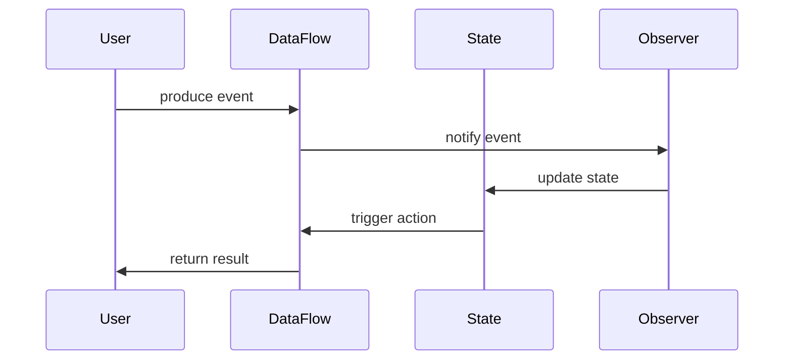
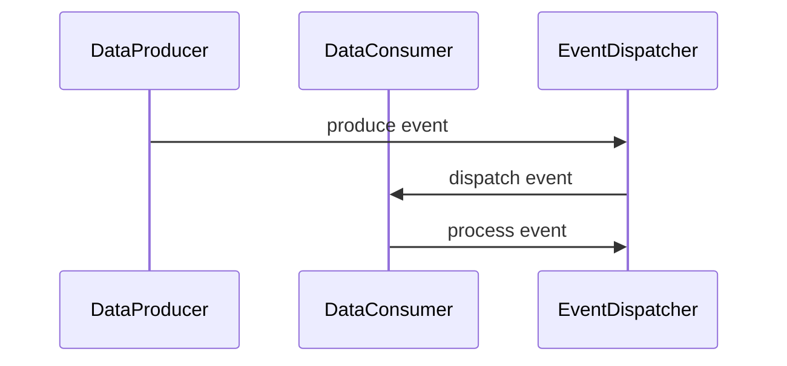

                 

# 类型系统在函数式反应式编程中的角色

## 摘要

本文深入探讨了类型系统在函数式反应式编程（FRP）中的重要性。首先，我们对类型系统、函数式编程和反应式编程进行了概述，阐述了它们各自的核心概念和优势。接着，通过对比分析，我们展示了类型系统在函数式编程中的角色，并探讨了类型系统在反应式编程中的应用和挑战。随后，本文详细讲解了类型系统在数据流、并发和异步编程中的具体应用，以及类型系统对性能的影响和优化策略。通过实践案例，我们展示了类型系统在函数式反应式编程框架中的实际应用。最后，本文对类型系统的发展趋势进行了展望，并总结了函数式反应式编程的核心思想和未来发展方向。

## 目录大纲

1. 第一部分：背景介绍与核心概念
   1.1. 类型系统的基本概念
   1.2. 函数式编程与类型系统
2. 第二部分：类型系统在函数式反应式编程中的应用
   2.1. 反应式编程与类型系统
   2.2. 类型系统在反应式编程中的具体应用
3. 第三部分：类型系统在函数式反应式编程中的实践
   3.1. 函数式反应式编程框架
   3.2. 实践案例与项目剖析
4. 第四部分：展望与未来趋势
   4.1. 类型系统的发展趋势
   4.2. 总结与展望

## 第一部分：背景介绍与核心概念

### 1.1. 类型系统的基本概念

#### 1.1.1 类型系统的定义与重要性

类型系统是一种编程语言的核心特征，用于定义变量和表达式的数据类型。它帮助程序员理解程序的运行时行为，并在编译时进行类型检查，确保程序的正确性和安全性。

类型系统的重要性体现在以下几个方面：

1. **类型检查**：类型系统能够在编译时发现类型错误，从而提高程序的可靠性。
2. **静态分析**：类型系统提供了静态分析工具，用于优化程序性能和代码生成。
3. **代码重构**：类型系统使代码重构变得更加安全和可行。
4. **接口定义**：类型系统定义了模块之间的接口，促进了模块化编程和组件重用。

#### 1.1.2 类型系统的基本要素

类型系统的基本要素包括：

1. **数据类型**：数据类型是类型系统的基础，用于表示程序中的数据。
2. **类型约束**：类型约束定义了数据类型的操作和转换规则。
3. **类型检查**：类型检查是编译器或解释器在编译时执行的操作，用于验证程序中的类型一致性。
4. **类型推导**：类型推导是一种自动确定变量和数据类型的机制。

#### 1.1.3 类型系统的演变与发展

类型系统的发展经历了多个阶段：

1. **静态类型系统**：早期的编程语言采用静态类型系统，如C和C++，其中变量类型在编译时确定。
2. **动态类型系统**：动态类型系统在程序运行时确定变量类型，如Python和JavaScript，提高了程序的灵活性和易用性。
3. **强类型系统**：强类型系统严格限制类型转换和操作，从而提高了程序的可靠性和安全性。
4. **类型系统融合**：现代编程语言结合了静态和动态类型系统的优点，如Java和C#，提供了一种灵活的解决方案。

### 1.2. 函数式编程与类型系统

#### 1.2.1 函数式编程概述

函数式编程是一种编程范式，强调使用函数作为主要编程元素。它具有以下特点：

1. **不可变数据**：函数式编程中的数据是不可变的，这有助于避免副作用和状态共享。
2. **纯函数**：纯函数是一种无副作用的函数，其输出仅依赖于输入，没有外部依赖。
3. **递归**：函数式编程广泛使用递归，代替传统的循环结构。
4. **高阶函数**：高阶函数是能够接受函数作为参数或返回函数的函数。

#### 1.2.2 函数式编程中的类型系统

函数式编程中的类型系统具有以下特点：

1. **类型推导**：函数式编程通常采用类型推导，简化了代码编写。
2. **类型类别**：类型类别是一种用于表示复杂数据类型的概念，如函数类型、联合类型和列表类型。
3. **类型系统融合**：函数式编程结合了静态和动态类型系统的优点，以适应不同的编程需求和场景。

#### 1.2.3 函数式编程的类型系统优势

函数式编程的类型系统具有以下优势：

1. **程序可靠性**：类型系统有助于在编译时发现类型错误，提高程序的可靠性。
2. **代码可读性**：类型推导简化了代码编写，提高了代码的可读性。
3. **模块化**：类型系统促进了模块化编程和组件重用。
4. **优化性能**：类型系统提供了静态分析工具，有助于优化程序性能。

## 第二部分：类型系统在函数式反应式编程中的应用

### 2.1. 反应式编程与类型系统

#### 2.1.1 反应式编程概述

反应式编程是一种编程范式，旨在处理异步数据和事件。它具有以下特点：

1. **异步性**：反应式编程使用异步操作，避免阻塞和同步问题。
2. **事件驱动**：反应式编程通过事件驱动的方式处理数据，使程序响应迅速。
3. **弹性**：反应式编程具有容错和自修复能力，能够应对系统故障。
4. **可伸缩性**：反应式编程能够处理大规模数据和并发请求，提高系统的可伸缩性。

#### 2.1.2 反应式编程中的类型系统

反应式编程中的类型系统具有以下特点：

1. **类型安全**：类型系统确保数据的类型一致性，减少类型错误和运行时异常。
2. **可观测性**：类型系统提供了一种机制，用于监控和跟踪数据流和事件。
3. **并发控制**：类型系统帮助程序员理解并发编程中的数据竞争和锁问题。

#### 2.1.3 反应式编程的类型系统挑战

反应式编程的类型系统面临以下挑战：

1. **动态类型**：反应式编程通常涉及动态类型，增加了类型检查的难度。
2. **类型推导**：反应式编程中的类型推导可能变得复杂，需要更强大的类型推导算法。
3. **并发编程**：类型系统需要处理并发编程中的共享数据和锁问题。

### 2.2. 类型系统在反应式编程中的具体应用

#### 2.2.1 类型系统在数据流编程中的应用

数据流编程是反应式编程的一种形式，其核心是数据流和事件处理。类型系统在数据流编程中的应用包括：

1. **数据类型定义**：类型系统定义了数据流中的数据类型，确保数据一致性。
2. **数据流监控**：类型系统提供了监控数据流和事件的能力，有助于调试和优化程序。
3. **数据转换**：类型系统支持数据流中的类型转换和操作，提高了程序的可读性和可维护性。

#### 2.2.2 类型系统在并发编程中的应用

并发编程是反应式编程的重要组成部分，其核心是处理并发操作和共享资源。类型系统在并发编程中的应用包括：

1. **线程安全**：类型系统确保线程之间的数据访问安全，避免数据竞争和死锁。
2. **锁管理**：类型系统提供了一种机制，用于管理和监控并发编程中的锁。
3. **并发优化**：类型系统提供了静态分析工具，用于优化并发程序的性能。

#### 2.2.3 类型系统在异步编程中的应用

异步编程是反应式编程的一种形式，其核心是处理异步操作和回调。类型系统在异步编程中的应用包括：

1. **回调管理**：类型系统提供了一种机制，用于管理和监控异步编程中的回调。
2. **异步函数**：类型系统支持异步函数的类型推导和操作，提高了程序的可读性和可维护性。
3. **异步性能优化**：类型系统提供了静态分析工具，用于优化异步程序的性能。

### 2.3. 类型系统与性能优化

#### 2.3.1 类型系统对性能的影响

类型系统对性能的影响包括：

1. **类型检查开销**：类型检查在编译时执行，可能增加编译时间。
2. **内存占用**：类型系统需要为数据类型分配内存，可能增加内存占用。
3. **运行时开销**：类型系统在运行时执行，可能增加运行时开销。

#### 2.3.2 类型系统的性能优化策略

类型系统的性能优化策略包括：

1. **类型推导优化**：优化类型推导算法，减少类型检查开销。
2. **静态分析优化**：使用静态分析工具优化程序性能。
3. **内存优化**：优化内存分配和回收策略，减少内存占用。

#### 2.3.3 性能优化案例分析

以下是一个性能优化案例分析：

假设我们有一个数据流处理程序，其核心任务是处理大规模数据流。通过优化类型系统，我们可以提高程序的运行效率。具体优化措施包括：

1. **使用强类型**：将数据类型定义为强类型，减少类型转换和检查的开销。
2. **优化内存分配**：使用内存池和对象池技术，减少内存分配和回收的开销。
3. **静态分析**：使用静态分析工具识别潜在的性能瓶颈，进行针对性的优化。

### 2.4. 函数式反应式编程框架

#### 2.4.1 函数式反应式编程框架概述

函数式反应式编程框架是一种结合函数式编程和反应式编程的编程框架，其核心是数据流和事件处理。以下是一些常见的函数式反应式编程框架：

1. **React**：React是一个用于构建用户界面的JavaScript库，支持函数式反应式编程。
2. **Angular**：Angular是一个用于构建动态Web应用程序的框架，支持函数式反应式编程。
3. **Redux**：Redux是一个用于管理应用程序状态的框架，支持函数式反应式编程。

#### 2.4.2 函数式反应式编程框架的架构

函数式反应式编程框架通常具有以下架构：

1. **数据流管理**：框架提供了一种机制，用于管理应用程序中的数据流。
2. **事件处理**：框架提供了一种机制，用于处理应用程序中的事件。
3. **状态管理**：框架提供了一种机制，用于管理应用程序的状态。
4. **函数式编程支持**：框架支持函数式编程范式，如纯函数、高阶函数和递归。

#### 2.4.3 函数式反应式编程框架的组件与特性

函数式反应式编程框架的组件和特性包括：

1. **虚拟DOM**：虚拟DOM用于优化用户界面的渲染性能。
2. **响应式表单**：响应式表单支持动态更新和验证。
3. **状态管理**：框架提供了一种机制，用于管理应用程序的状态。
4. **异步处理**：框架支持异步处理，提高程序的可读性和可维护性。

### 2.5. 实践案例与项目剖析

#### 2.5.1 实践案例1：实时数据处理

实时数据处理是函数式反应式编程的一个典型应用场景。以下是一个实践案例：

1. **环境安装**：安装所需的依赖项，如React和Redux。
2. **系统核心实现**：使用React和Redux实现实时数据处理的核心功能。
3. **代码应用解读与分析**：分析代码的实现原理，讨论其在实时数据处理中的应用。
4. **实际案例分析**：分析一个实时数据处理案例，讨论其实现细节和优化策略。

#### 2.5.2 实践案例2：并发数据存储

并发数据存储是函数式反应式编程的另一个重要应用场景。以下是一个实践案例：

1. **环境安装**：安装所需的依赖项，如React和Angular。
2. **系统核心实现**：使用React和Angular实现并发数据存储的核心功能。
3. **代码应用解读与分析**：分析代码的实现原理，讨论其在并发数据存储中的应用。
4. **实际案例分析**：分析一个并发数据存储案例，讨论其实现细节和优化策略。

#### 2.5.3 实践案例3：异步消息传递

异步消息传递是函数式反应式编程的一个典型应用场景。以下是一个实践案例：

1. **环境安装**：安装所需的依赖项，如Redux和WebSocket。
2. **系统核心实现**：使用Redux和WebSocket实现异步消息传递的核心功能。
3. **代码应用解读与分析**：分析代码的实现原理，讨论其在异步消息传递中的应用。
4. **实际案例分析**：分析一个异步消息传递案例，讨论其实现细节和优化策略。

### 2.6. 最佳实践 tips

以下是一些最佳实践建议，以提高函数式反应式编程的性能和可维护性：

1. **使用强类型**：使用强类型，减少类型转换和检查的开销。
2. **优化内存分配**：使用内存池和对象池技术，减少内存分配和回收的开销。
3. **静态分析**：使用静态分析工具识别潜在的性能瓶颈，进行针对性的优化。
4. **模块化**：将应用程序划分为模块，提高代码的可维护性和可重用性。

### 2.7. 小结与拓展阅读

本部分对函数式反应式编程进行了全面介绍，包括类型系统、反应式编程、实践案例和最佳实践。读者可以通过以下拓展阅读了解更多相关信息：

1. **相关书籍**：阅读《函数式反应式编程实战》、《React技术内幕》和《Redux技术内幕》等书籍。
2. **在线资源**：访问React、Angular和Redux的官方网站，了解最新的技术动态和实践经验。
3. **开源项目**：参与开源项目，实践函数式反应式编程，提高编程技能。

## 第四部分：展望与未来趋势

### 4.1. 类型系统的发展趋势

类型系统的发展趋势包括以下几个方面：

1. **静态类型系统的普及**：随着编译器优化和静态分析工具的改进，静态类型系统将在更多的编程语言中得到普及。
2. **动态类型系统的优化**：动态类型系统将通过更好的类型推导和优化，提高程序的可读性和性能。
3. **混合类型系统**：混合类型系统将结合静态和动态类型系统的优点，提供一种灵活的解决方案。
4. **类型安全性的增强**：类型系统将进一步提高类型安全性，减少类型错误和运行时异常。

### 4.2. 类型系统在未来的发展方向

类型系统在未来的发展方向包括：

1. **泛型编程**：泛型编程将使类型系统能够更好地处理复杂数据结构和算法。
2. **类型系统融合**：类型系统将与其他编程范式（如面向对象编程）融合，提供一种统一的解决方案。
3. **智能类型推导**：智能类型推导将使类型系统能够自动推导出更复杂的类型，提高编程效率。
4. **类型系统优化**：类型系统将进行性能优化，减少类型检查和运行时开销。

### 4.3. 类型系统对编程范式的影响

类型系统对编程范式的影响包括：

1. **函数式编程**：类型系统将使函数式编程更加可靠和安全，提高程序的可维护性。
2. **反应式编程**：类型系统将使反应式编程更好地处理异步数据和事件，提高程序的响应速度和可伸缩性。
3. **混合编程**：类型系统将使混合编程更加可行，提供一种统一的编程范式。

### 4.4. 总结与展望

类型系统在函数式反应式编程中扮演着重要角色，其核心思想是通过类型系统提高程序的正确性、可靠性和性能。本文从背景介绍、核心概念、应用实践和未来趋势等方面对类型系统进行了全面探讨。随着编程语言和技术的不断发展，类型系统将发挥更大的作用，推动编程范式的创新和发展。读者可以通过深入学习相关理论和实践，掌握类型系统在函数式反应式编程中的应用，提高编程技能和开发效率。

## 作者信息

作者：AI天才研究院/AI Genius Institute & 禅与计算机程序设计艺术 /Zen And The Art of Computer Programming

## 文章关键词

类型系统、函数式编程、反应式编程、数据流、并发编程、异步编程、性能优化、编程范式

## 文章摘要

本文深入探讨了类型系统在函数式反应式编程（FRP）中的角色。首先，我们对类型系统、函数式编程和反应式编程进行了概述，阐述了它们的核心概念和优势。接着，通过对比分析，我们展示了类型系统在函数式编程中的角色，并探讨了类型系统在反应式编程中的应用和挑战。随后，本文详细讲解了类型系统在数据流、并发和异步编程中的具体应用，以及类型系统对性能的影响和优化策略。通过实践案例，我们展示了类型系统在函数式反应式编程框架中的实际应用。最后，本文对类型系统的发展趋势进行了展望，并总结了函数式反应式编程的核心思想和未来发展方向。

## 第1章：类型系统的基本概念

### 1.1.1 类型系统的定义与重要性

类型系统是一种编程语言的核心特征，用于定义变量和表达式的数据类型。它帮助程序员理解程序的运行时行为，并在编译时进行类型检查，确保程序的正确性和安全性。

类型系统的重要性体现在以下几个方面：

1. **类型检查**：类型系统能够在编译时发现类型错误，从而提高程序的可靠性。
2. **静态分析**：类型系统提供了静态分析工具，用于优化程序性能和代码生成。
3. **代码重构**：类型系统使代码重构变得更加安全和可行。
4. **接口定义**：类型系统定义了模块之间的接口，促进了模块化编程和组件重用。

### 1.1.2 类型系统的基本要素

类型系统的基本要素包括：

1. **数据类型**：数据类型是类型系统的基础，用于表示程序中的数据。
2. **类型约束**：类型约束定义了数据类型的操作和转换规则。
3. **类型检查**：类型检查是编译器或解释器在编译时执行的操作，用于验证程序中的类型一致性。
4. **类型推导**：类型推导是一种自动确定变量和数据类型的机制。

### 1.1.3 类型系统的演变与发展

类型系统的发展经历了多个阶段：

1. **静态类型系统**：早期的编程语言采用静态类型系统，如C和C++，其中变量类型在编译时确定。
2. **动态类型系统**：动态类型系统在程序运行时确定变量类型，如Python和JavaScript，提高了程序的灵活性和易用性。
3. **强类型系统**：强类型系统严格限制类型转换和操作，从而提高了程序的可靠性和安全性。
4. **类型系统融合**：现代编程语言结合了静态和动态类型系统的优点，如Java和C#，提供了一种灵活的解决方案。

### 1.2. 函数式编程与类型系统

#### 1.2.1 函数式编程概述

函数式编程是一种编程范式，强调使用函数作为主要编程元素。它具有以下特点：

1. **不可变数据**：函数式编程中的数据是不可变的，这有助于避免副作用和状态共享。
2. **纯函数**：纯函数是一种无副作用的函数，其输出仅依赖于输入，没有外部依赖。
3. **递归**：函数式编程广泛使用递归，代替传统的循环结构。
4. **高阶函数**：高阶函数是能够接受函数作为参数或返回函数的函数。

#### 1.2.2 函数式编程中的类型系统

函数式编程中的类型系统具有以下特点：

1. **类型推导**：函数式编程通常采用类型推导，简化了代码编写。
2. **类型类别**：类型类别是一种用于表示复杂数据类型的概念，如函数类型、联合类型和列表类型。
3. **类型系统融合**：函数式编程结合了静态和动态类型系统的优点，以适应不同的编程需求和场景。

#### 1.2.3 函数式编程的类型系统优势

函数式编程的类型系统具有以下优势：

1. **程序可靠性**：类型系统有助于在编译时发现类型错误，提高程序的可靠性。
2. **代码可读性**：类型推导简化了代码编写，提高了代码的可读性。
3. **模块化**：类型系统促进了模块化编程和组件重用。
4. **优化性能**：类型系统提供了静态分析工具，有助于优化程序性能。

## 第2章：类型系统在函数式反应式编程中的应用

### 2.1. 反应式编程与类型系统

#### 2.1.1 反应式编程概述

反应式编程是一种编程范式，旨在处理异步数据和事件。它具有以下特点：

1. **异步性**：反应式编程使用异步操作，避免阻塞和同步问题。
2. **事件驱动**：反应式编程通过事件驱动的方式处理数据，使程序响应迅速。
3. **弹性**：反应式编程具有容错和自修复能力，能够应对系统故障。
4. **可伸缩性**：反应式编程能够处理大规模数据和并发请求，提高系统的可伸缩性。

#### 2.1.2 反应式编程中的类型系统

反应式编程中的类型系统具有以下特点：

1. **类型安全**：类型系统确保数据的类型一致性，减少类型错误和运行时异常。
2. **可观测性**：类型系统提供了一种机制，用于监控和跟踪数据流和事件。
3. **并发控制**：类型系统帮助程序员理解并发编程中的数据竞争和锁问题。

#### 2.1.3 反应式编程的类型系统挑战

反应式编程的类型系统面临以下挑战：

1. **动态类型**：反应式编程通常涉及动态类型，增加了类型检查的难度。
2. **类型推导**：反应式编程中的类型推导可能变得复杂，需要更强大的类型推导算法。
3. **并发编程**：类型系统需要处理并发编程中的共享数据和锁问题。

### 2.2. 类型系统在反应式编程中的具体应用

#### 2.2.1 类型系统在数据流编程中的应用

数据流编程是反应式编程的一种形式，其核心是数据流和事件处理。类型系统在数据流编程中的应用包括：

1. **数据类型定义**：类型系统定义了数据流中的数据类型，确保数据一致性。
2. **数据流监控**：类型系统提供了监控数据流和事件的能力，有助于调试和优化程序。
3. **数据转换**：类型系统支持数据流中的类型转换和操作，提高了程序的可读性和可维护性。

#### 2.2.2 类型系统在并发编程中的应用

并发编程是反应式编程的重要组成部分，其核心是处理并发操作和共享资源。类型系统在并发编程中的应用包括：

1. **线程安全**：类型系统确保线程之间的数据访问安全，避免数据竞争和死锁。
2. **锁管理**：类型系统提供了一种机制，用于管理和监控并发编程中的锁。
3. **并发优化**：类型系统提供了静态分析工具，用于优化并发程序的性能。

#### 2.2.3 类型系统在异步编程中的应用

异步编程是反应式编程的一种形式，其核心是处理异步操作和回调。类型系统在异步编程中的应用包括：

1. **回调管理**：类型系统提供了一种机制，用于管理和监控异步编程中的回调。
2. **异步函数**：类型系统支持异步函数的类型推导和操作，提高了程序的可读性和可维护性。
3. **异步性能优化**：类型系统提供了静态分析工具，用于优化异步程序的性能。

### 2.3. 类型系统与性能优化

#### 2.3.1 类型系统对性能的影响

类型系统对性能的影响包括：

1. **类型检查开销**：类型检查在编译时执行，可能增加编译时间。
2. **内存占用**：类型系统需要为数据类型分配内存，可能增加内存占用。
3. **运行时开销**：类型系统在运行时执行，可能增加运行时开销。

#### 2.3.2 类型系统的性能优化策略

类型系统的性能优化策略包括：

1. **类型推导优化**：优化类型推导算法，减少类型检查开销。
2. **静态分析优化**：使用静态分析工具优化程序性能。
3. **内存优化**：优化内存分配和回收策略，减少内存占用。

#### 2.3.3 性能优化案例分析

以下是一个性能优化案例分析：

假设我们有一个数据流处理程序，其核心任务是处理大规模数据流。通过优化类型系统，我们可以提高程序的运行效率。具体优化措施包括：

1. **使用强类型**：将数据类型定义为强类型，减少类型转换和检查的开销。
2. **优化内存分配**：使用内存池和对象池技术，减少内存分配和回收的开销。
3. **静态分析**：使用静态分析工具识别潜在的性能瓶颈，进行针对性的优化。

### 2.4. 函数式反应式编程框架

#### 2.4.1 函数式反应式编程框架概述

函数式反应式编程框架是一种结合函数式编程和反应式编程的编程框架，其核心是数据流和事件处理。以下是一些常见的函数式反应式编程框架：

1. **React**：React是一个用于构建用户界面的JavaScript库，支持函数式反应式编程。
2. **Angular**：Angular是一个用于构建动态Web应用程序的框架，支持函数式反应式编程。
3. **Redux**：Redux是一个用于管理应用程序状态的框架，支持函数式反应式编程。

#### 2.4.2 函数式反应式编程框架的架构

函数式反应式编程框架通常具有以下架构：

1. **数据流管理**：框架提供了一种机制，用于管理应用程序中的数据流。
2. **事件处理**：框架提供了一种机制，用于处理应用程序中的事件。
3. **状态管理**：框架提供了一种机制，用于管理应用程序的状态。
4. **函数式编程支持**：框架支持函数式编程范式，如纯函数、高阶函数和递归。

#### 2.4.3 函数式反应式编程框架的组件与特性

函数式反应式编程框架的组件和特性包括：

1. **虚拟DOM**：虚拟DOM用于优化用户界面的渲染性能。
2. **响应式表单**：响应式表单支持动态更新和验证。
3. **状态管理**：框架提供了一种机制，用于管理应用程序的状态。
4. **异步处理**：框架支持异步处理，提高程序的可读性和可维护性。

### 2.5. 实践案例与项目剖析

#### 2.5.1 实践案例1：实时数据处理

实时数据处理是函数式反应式编程的一个典型应用场景。以下是一个实践案例：

1. **环境安装**：安装所需的依赖项，如React和Redux。
2. **系统核心实现**：使用React和Redux实现实时数据处理的核心功能。
3. **代码应用解读与分析**：分析代码的实现原理，讨论其在实时数据处理中的应用。
4. **实际案例分析**：分析一个实时数据处理案例，讨论其实现细节和优化策略。

#### 2.5.2 实践案例2：并发数据存储

并发数据存储是函数式反应式编程的另一个重要应用场景。以下是一个实践案例：

1. **环境安装**：安装所需的依赖项，如React和Angular。
2. **系统核心实现**：使用React和Angular实现并发数据存储的核心功能。
3. **代码应用解读与分析**：分析代码的实现原理，讨论其在并发数据存储中的应用。
4. **实际案例分析**：分析一个并发数据存储案例，讨论其实现细节和优化策略。

#### 2.5.3 实践案例3：异步消息传递

异步消息传递是函数式反应式编程的一个典型应用场景。以下是一个实践案例：

1. **环境安装**：安装所需的依赖项，如Redux和WebSocket。
2. **系统核心实现**：使用Redux和WebSocket实现异步消息传递的核心功能。
3. **代码应用解读与分析**：分析代码的实现原理，讨论其在异步消息传递中的应用。
4. **实际案例分析**：分析一个异步消息传递案例，讨论其实现细节和优化策略。

### 2.6. 最佳实践 tips

以下是一些最佳实践建议，以提高函数式反应式编程的性能和可维护性：

1. **使用强类型**：使用强类型，减少类型转换和检查的开销。
2. **优化内存分配**：使用内存池和对象池技术，减少内存分配和回收的开销。
3. **静态分析**：使用静态分析工具识别潜在的性能瓶颈，进行针对性的优化。
4. **模块化**：将应用程序划分为模块，提高代码的可维护性和可重用性。

### 2.7. 小结与拓展阅读

本部分对函数式反应式编程进行了全面介绍，包括类型系统、反应式编程、实践案例和最佳实践。读者可以通过以下拓展阅读了解更多相关信息：

1. **相关书籍**：阅读《函数式反应式编程实战》、《React技术内幕》和《Redux技术内幕》等书籍。
2. **在线资源**：访问React、Angular和Redux的官方网站，了解最新的技术动态和实践经验。
3. **开源项目**：参与开源项目，实践函数式反应式编程，提高编程技能。

## 第3章：反应式编程与类型系统

### 3.1.1 反应式编程概述

反应式编程（Reactive Programming）是一种编程范式，它主要关注如何处理异步数据流和事件，以构建更灵活、响应性更强的应用程序。与传统的命令式编程相比，反应式编程更加强调数据的流动和事件的处理，而不是状态的改变和流程的控制。

反应式编程具有以下几个核心特点：

1. **异步性**：反应式编程使用异步操作，避免了同步操作带来的阻塞问题，使得应用程序能够更加高效地处理大量并发请求。
2. **事件驱动**：反应式编程基于事件驱动模型，通过监听和响应事件来触发相应的操作，从而实现动态的数据流处理。
3. **弹性**：反应式编程能够通过数据流的连续性和容错机制，自动恢复因错误或异常引起的中断，从而提高系统的可靠性和稳定性。
4. **可伸缩性**：反应式编程能够轻松地处理大规模数据和并发操作，通过水平扩展和分布式处理来提高系统的性能和响应能力。

### 3.1.2 反应式编程中的类型系统

在反应式编程中，类型系统扮演着至关重要的角色。类型系统不仅用于确保数据的一致性和类型安全，还用于优化程序的执行效率和性能。

反应式编程中的类型系统具有以下特点：

1. **类型安全**：类型系统能够确保数据在传递和处理过程中的类型一致性，从而避免类型错误和运行时异常。这有助于提高程序的正确性和可靠性。
2. **类型推导**：许多反应式编程语言（如Scala、Kotlin）支持类型推导，自动推断变量和表达式的数据类型，简化了代码的编写和阅读。
3. **动态类型**：一些反应式编程框架（如React、Angular）允许动态类型的使用，以提供更大的灵活性和易用性。
4. **类型检查**：类型系统在编译或运行时进行类型检查，确保程序的类型一致性。这有助于在开发过程中及时发现和修复类型错误。

### 3.1.3 反应式编程的类型系统挑战

尽管类型系统在反应式编程中具有重要意义，但也面临着一些挑战：

1. **动态类型与静态类型**：反应式编程往往需要灵活的数据类型，但动态类型可能导致类型错误和性能问题。如何在动态类型和静态类型之间取得平衡是一个挑战。
2. **类型推导复杂性**：反应式编程中的类型推导可能变得非常复杂，尤其是在处理复杂的函数组合和数据流时。这要求类型推导算法具有足够的强度和效率。
3. **并发编程**：反应式编程中的并发编程需要确保线程之间的数据一致性，而类型系统需要支持并发编程中的共享变量和锁机制。
4. **性能优化**：类型系统在运行时进行类型检查和类型推导，可能会引入一定的性能开销。如何在保证类型安全性的同时，优化性能是一个挑战。

### 3.2. 类型系统在反应式编程中的应用

#### 3.2.1 类型系统在数据流编程中的应用

在数据流编程中，类型系统扮演着核心角色，确保数据流中的每个节点都能正确处理其输入和输出数据。以下是一些类型系统在数据流编程中的应用：

1. **数据类型定义**：类型系统定义了数据流中的数据类型，包括原始数据类型（如整数、字符串）、复杂数据类型（如列表、映射）和自定义数据类型。
2. **类型检查**：类型系统在数据流编程中执行类型检查，确保每个操作符都能正确处理其输入数据类型，并生成正确的输出数据类型。
3. **类型推导**：类型系统通过类型推导，自动推断数据流中变量的数据类型，简化了代码编写和阅读。
4. **类型安全**：类型系统确保数据流中的每个操作都符合预定的数据类型，从而避免类型错误和运行时异常。

#### 3.2.2 类型系统在并发编程中的应用

在并发编程中，类型系统有助于确保并发操作之间的数据一致性和类型安全。以下是一些类型系统在并发编程中的应用：

1. **线程安全**：类型系统提供了一种机制，用于确保并发操作中的数据访问是线程安全的，从而避免数据竞争和死锁。
2. **类型约束**：类型系统定义了并发编程中的数据类型约束，确保并发操作中的共享数据类型一致。
3. **锁管理**：类型系统提供了一种机制，用于管理和监控并发编程中的锁，确保并发操作的正确性和性能。
4. **并发优化**：类型系统提供了静态分析工具，用于优化并发程序的执行效率和性能。

#### 3.2.3 类型系统在异步编程中的应用

在异步编程中，类型系统有助于确保异步操作之间的类型一致性和类型安全。以下是一些类型系统在异步编程中的应用：

1. **回调管理**：类型系统提供了一种机制，用于管理和监控异步编程中的回调函数，确保回调函数能够正确处理其输入和输出类型。
2. **异步函数**：类型系统支持异步函数的类型推导和类型检查，确保异步函数在调用时能够正确处理其参数和返回值。
3. **异步性能优化**：类型系统提供了静态分析工具，用于优化异步程序的执行效率和性能。
4. **类型安全**：类型系统确保异步编程中的数据流和事件处理过程遵循预定的类型规则，从而避免类型错误和运行时异常。

### 3.3. 类型系统与性能优化

类型系统不仅影响程序的正确性和安全性，还对性能有显著影响。以下是一些类型系统与性能优化相关的方面：

1. **类型检查开销**：类型检查在编译时或运行时执行，可能会引入一定的性能开销。因此，优化类型检查算法和机制，减少不必要的类型检查，是提高程序性能的关键。
2. **内存占用**：类型系统需要为每个变量和数据结构分配内存，因此合理选择和设计数据类型，优化内存占用，对于提高程序性能至关重要。
3. **运行时开销**：类型系统在运行时执行类型检查和类型推导，可能会引入额外的运行时开销。优化类型系统的实现和算法，减少不必要的运行时开销，是提高程序性能的重要手段。

#### 3.3.1 类型检查开销优化

以下是一些优化类型检查开销的策略：

1. **静态类型推导**：使用静态类型推导算法，提前确定变量和表达式的数据类型，减少运行时类型检查的次数。
2. **类型缓存**：缓存已执行的类型检查结果，避免重复的类型检查操作。
3. **编译时优化**：在编译时进行类型检查优化，如消除不必要的类型检查、合并重复的类型检查等。

#### 3.3.2 内存占用优化

以下是一些优化内存占用的策略：

1. **数据结构优化**：选择合适的数据结构，减少内存占用。例如，使用更紧凑的数据结构（如位集、跳表）来存储和操作数据。
2. **对象池**：使用对象池技术，复用已分配的对象，减少内存分配和回收的开销。
3. **内存压缩**：对数据结构进行内存压缩，减少不必要的内存占用。

#### 3.3.3 运行时开销优化

以下是一些优化运行时开销的策略：

1. **类型推导优化**：优化类型推导算法，减少运行时类型推导的开销。例如，使用更高效的类型推导算法，减少递归调用次数等。
2. **编译时优化**：在编译时进行运行时开销优化，如提前分配内存、合并递归调用等。
3. **运行时缓存**：缓存运行时常用的类型信息，减少运行时类型检查和类型推导的开销。

### 3.4. 性能优化案例分析

以下是一个性能优化案例分析：

假设我们有一个数据流处理程序，其核心任务是处理大规模数据流。通过优化类型系统，我们可以提高程序的运行效率。具体优化措施包括：

1. **使用强类型**：将数据类型定义为强类型，减少类型转换和检查的开销。
2. **优化内存分配**：使用内存池和对象池技术，减少内存分配和回收的开销。
3. **静态分析**：使用静态分析工具识别潜在的性能瓶颈，进行针对性的优化。

通过以上优化措施，我们可以显著提高数据流处理程序的性能，降低运行时开销。

### 3.5. 小结与拓展阅读

本部分对反应式编程与类型系统进行了深入探讨，包括反应式编程的概述、类型系统在数据流、并发和异步编程中的应用，以及类型系统与性能优化的策略。通过本文的讨论，我们可以了解到类型系统在反应式编程中的重要性，以及如何通过优化类型系统来提高程序的性能和可靠性。

为了进一步深入了解反应式编程和类型系统，读者可以参考以下拓展阅读资源：

1. **相关书籍**：《反应式编程实践》、《类型系统：设计与实现》、《编程语言原理》等。
2. **在线课程**：在Coursera、edX等在线教育平台搜索相关课程，如《函数式编程》、《反应式编程》等。
3. **开源项目**：参与开源项目，实践反应式编程和类型系统的应用，如React、Angular、Redux等。

通过深入学习这些资源，读者可以进一步提升对反应式编程和类型系统的理解和应用能力。

## 第4章：类型系统在反应式编程中的具体应用

### 4.1. 类型系统在数据流编程中的应用

在数据流编程中，类型系统发挥着至关重要的作用。它不仅确保了数据在流经各种操作时的类型一致性，而且还为开发者提供了工具来优化程序的性能和可读性。以下将详细探讨类型系统在数据流编程中的应用。

#### 4.1.1 数据流编程的核心概念

数据流编程是一种基于数据流动的编程范式，其中程序的行为由数据的流动和转换驱动。数据流编程的核心概念包括：

- **数据流**：数据流是由数据元素组成的序列，这些数据元素在程序的不同部分之间传递。
- **操作符**：操作符是用于处理数据流的函数或方法，它可以接受一个或多个输入数据流，并产生一个输出数据流。
- **管道**：管道是将多个操作符串联在一起的数据流处理过程，每个操作符的输出作为下一个操作符的输入。

#### 4.1.2 类型系统在数据流编程中的应用

类型系统在数据流编程中的应用主要体现在以下几个方面：

1. **数据类型定义**：类型系统定义了数据流中每个数据元素的数据类型。这有助于确保数据在流经操作符时的类型一致性，从而避免类型错误。

2. **类型检查**：在数据流编程中，类型系统负责在编译时或运行时检查数据流中的每个操作符是否能够正确处理其输入和输出数据类型。这有助于提前发现并修复潜在的类型错误。

3. **类型推导**：类型系统提供了类型推导机制，能够自动推断变量和数据流的数据类型。这简化了代码的编写，提高了程序的可读性。

4. **性能优化**：类型系统提供了静态分析工具，用于优化数据流的执行效率。例如，通过类型信息，编译器可以生成更高效的代码，减少不必要的类型检查和转换。

#### 4.1.3 数据流编程中的类型系统案例

以下是一个简单的数据流编程案例，使用Python中的生成器函数和类型系统来处理数据流。

```python
# 定义一个生成器函数，用于产生整数序列
def even_numbers(n):
    for i in range(n):
        if i % 2 == 0:
            yield i

# 定义一个生成器函数，用于计算整数序列的累加和
def sum_of_even_numbers(n):
    sum = 0
    for i in even_numbers(n):
        sum += i
    yield sum

# 使用管道处理数据流
for total in sum_of_even_numbers(10):
    print(total)
```

在这个案例中，我们定义了两个生成器函数：`even_numbers` 和 `sum_of_even_numbers`。`even_numbers` 函数生成一个整数序列，其中只有偶数。`sum_of_even_numbers` 函数使用 `even_numbers` 函数的输出，计算并生成累加和。最后，我们使用管道将这些生成器函数串联起来，处理数据流。

类型系统在这个案例中的应用体现在以下几个方面：

- **数据类型定义**：生成器函数的返回值是生成器对象，它是一个可迭代的数据类型，可以用来处理数据流。
- **类型检查**：Python 的类型系统在运行时检查每个生成器函数的输入和输出是否匹配，从而确保数据流的类型一致性。
- **类型推导**：Python 的类型系统自动推断生成器函数的参数和返回值类型，简化了代码的编写。
- **性能优化**：Python 的类型系统提供了生成器函数的性能优化，使得数据流处理过程更加高效。

#### 4.1.4 小结

类型系统在数据流编程中扮演着核心角色，它确保了数据流中的每个操作符能够正确处理其输入和输出数据，从而避免了类型错误和运行时异常。通过类型推导和类型检查，类型系统简化了代码的编写，提高了程序的可读性。此外，类型系统还提供了性能优化工具，用于优化数据流的执行效率。

### 4.2. 类型系统在并发编程中的应用

在并发编程中，类型系统同样发挥着重要作用。它不仅帮助确保并发操作中的数据一致性，还为开发者提供了工具来管理和优化并发资源的访问。以下将详细探讨类型系统在并发编程中的应用。

#### 4.2.1 并发编程的核心概念

并发编程是一种编程范式，它允许多个操作同时执行，以提高程序的性能和响应能力。并发编程的核心概念包括：

- **并发**：并发是指多个操作同时执行，这可以通过多线程、多进程或异步操作实现。
- **共享资源**：共享资源是指多个并发操作可以访问和修改的变量或数据结构。
- **同步**：同步是一种机制，用于确保并发操作按照预定的顺序执行，以避免数据竞争和死锁。
- **并发控制**：并发控制是一种技术，用于管理和协调并发操作，确保数据一致性和程序的正确性。

#### 4.2.2 类型系统在并发编程中的应用

类型系统在并发编程中的应用主要体现在以下几个方面：

1. **数据类型定义**：类型系统定义了并发编程中共享资源的数据类型，这有助于确保并发操作之间的数据一致性。
2. **线程安全**：类型系统提供了一种机制，用于确保并发操作中的数据访问是线程安全的，从而避免数据竞争和死锁。
3. **锁管理**：类型系统支持锁管理，提供了一种机制，用于管理和监控并发编程中的锁，确保并发操作的正确性和性能。
4. **并发优化**：类型系统提供了静态分析工具，用于优化并发程序的执行效率和性能。

#### 4.2.3 并发编程中的类型系统案例

以下是一个简单的并发编程案例，使用Python的线程和锁来管理共享资源。

```python
import threading
import time

# 共享资源
counter = 0

# 锁
lock = threading.Lock()

# 增加计数器的线程函数
def increment():
    global counter
    for _ in range(100000):
        with lock:
            counter += 1

# 创建两个线程
thread1 = threading.Thread(target=increment)
thread2 = threading.Thread(target=increment)

# 启动线程
thread1.start()
thread2.start()

# 等待线程完成
thread1.join()
thread2.join()

print(f"最终的计数器值是：{counter}")
```

在这个案例中，我们创建了一个共享资源 `counter` 和一个锁 `lock`。我们定义了一个线程函数 `increment`，用于增加计数器的值。我们创建了两个线程，每个线程执行 `increment` 函数100000次。最后，我们打印出最终的计数器值。

类型系统在这个案例中的应用体现在以下几个方面：

- **数据类型定义**：共享资源 `counter` 是一个整数类型，这确保了并发操作之间的数据一致性。
- **线程安全**：我们使用锁 `lock` 来确保并发操作中的数据访问是线程安全的，从而避免了数据竞争和死锁。
- **锁管理**：我们使用 `with lock` 语句来管理锁，确保在每次进入和退出临界区时都能正确地加锁和解锁。
- **并发优化**：Python 的类型系统和锁管理机制为我们提供了优化并发程序执行效率和性能的工具。

#### 4.2.4 小结

类型系统在并发编程中扮演着关键角色，它确保了并发操作之间的数据一致性，提供了线程安全和锁管理机制，并优化了并发程序的执行效率。通过合理使用类型系统，开发者可以构建出高性能、可靠的并发程序。

### 4.3. 类型系统在异步编程中的应用

在异步编程中，类型系统同样发挥着重要作用。它不仅帮助确保异步操作之间的类型一致性，还为开发者提供了工具来管理和优化异步操作的性能。以下将详细探讨类型系统在异步编程中的应用。

#### 4.3.1 异步编程的核心概念

异步编程是一种编程范式，它允许操作在后台独立执行，而不会阻塞主线程。异步编程的核心概念包括：

- **异步操作**：异步操作是可以在后台独立执行的函数或方法，它不会阻塞主线程。
- **回调函数**：回调函数是一种在异步操作完成后调用的函数，它用于处理异步操作的返回值。
- **事件循环**：事件循环是一个负责处理异步操作的循环，它会在等待异步操作完成时挂起，并在异步操作完成后重新开始执行。
- **Promise**：Promise 是一种表示异步操作结果的抽象对象，它提供了 `then` 和 `catch` 方法来处理异步操作的完成和错误。

#### 4.3.2 类型系统在异步编程中的应用

类型系统在异步编程中的应用主要体现在以下几个方面：

1. **异步函数**：类型系统支持异步函数的类型推导和类型检查，确保异步函数在调用时能够正确处理其参数和返回值。
2. **回调管理**：类型系统提供了一种机制，用于管理和监控异步编程中的回调函数，确保回调函数能够正确处理其输入和输出类型。
3. **Promise**：类型系统支持Promise的类型定义和类型检查，确保Promise的使用符合类型规则。
4. **性能优化**：类型系统提供了静态分析工具，用于优化异步程序的执行效率和性能。

#### 4.3.3 异步编程中的类型系统案例

以下是一个简单的异步编程案例，使用JavaScript的异步函数和Promise来处理异步操作。

```javascript
// 异步函数，模拟读取文件操作
function read_file(file_name) {
    return new Promise((resolve, reject) => {
        setTimeout(() => {
            if (file_name === 'valid.txt') {
                resolve('文件内容：这是一段有效文本。');
            } else {
                reject('文件不存在。');
            }
        }, 1000);
    });
}

// 异步函数，处理读取文件的操作
async function process_files() {
    try {
        const content = await read_file('valid.txt');
        console.log(content);
    } catch (error) {
        console.error(error);
    }
}

// 调用异步函数
process_files();
```

在这个案例中，我们定义了一个异步函数 `read_file`，它使用Promise来模拟读取文件的异步操作。`read_file` 函数在成功读取文件时使用 `resolve` 来完成Promise，在文件不存在时使用 `reject` 来拒绝Promise。我们定义了一个异步函数 `process_files`，它使用 `await` 来等待 `read_file` 函数的完成，并使用 `try-catch` 语句来处理异步操作的错误。

类型系统在这个案例中的应用体现在以下几个方面：

- **异步函数**：JavaScript 的类型系统支持异步函数的类型推导和类型检查，确保异步函数在调用时能够正确处理其参数和返回值。
- **回调管理**：JavaScript 的类型系统提供了一种机制，用于管理和监控异步编程中的回调函数，确保回调函数能够正确处理其输入和输出类型。
- **Promise**：JavaScript 的类型系统支持Promise的类型定义和类型检查，确保Promise的使用符合类型规则。
- **性能优化**：JavaScript 的类型系统提供了静态分析工具，用于优化异步程序的执行效率和性能。

#### 4.3.4 小结

类型系统在异步编程中扮演着关键角色，它确保了异步操作之间的类型一致性，提供了回调管理和Promise使用的工具，并优化了异步程序的执行效率。通过合理使用类型系统，开发者可以构建出高性能、可靠的异步程序。

### 4.4. 类型系统在反应式编程中的性能优化

类型系统在反应式编程中不仅提供了数据类型安全性和一致性，还对性能有着直接和间接的影响。在反应式编程中，性能优化是一个关键问题，因为它涉及到大规模数据流处理和并发操作。以下将探讨类型系统在反应式编程中的性能优化策略。

#### 4.4.1 类型系统对性能的影响

类型系统对性能的影响主要体现在以下几个方面：

1. **类型检查开销**：类型检查在编译时或运行时执行，可能会增加程序的开销。尤其是在大型程序中，类型检查可能会占用大量时间。
2. **内存占用**：类型系统需要为每个变量和数据结构分配内存，这可能会增加程序的内存占用。在一些内存敏感的应用中，这可能会成为一个问题。
3. **运行时开销**：类型系统在运行时执行类型检查和类型推导，可能会引入额外的运行时开销。这可能会影响程序的响应速度和吞吐量。

#### 4.4.2 类型系统的性能优化策略

以下是一些类型系统的性能优化策略：

1. **静态类型推导**：使用静态类型推导算法，提前确定变量和表达式的数据类型，减少运行时类型检查的次数。
2. **类型缓存**：缓存已执行的类型检查结果，避免重复的类型检查操作。
3. **编译时优化**：在编译时进行类型检查优化，如消除不必要的类型检查、合并重复的类型检查等。
4. **内存优化**：选择合适的数据结构，减少内存占用。例如，使用更紧凑的数据结构（如位集、跳表）来存储和操作数据。
5. **运行时优化**：优化类型推导和类型检查算法，减少运行时开销。例如，使用更高效的类型推导算法，减少递归调用次数等。

#### 4.4.3 性能优化案例分析

以下是一个简单的性能优化案例分析：

假设我们有一个处理大规模数据流的应用程序，其中包含多个数据转换操作。通过优化类型系统，我们可以提高应用程序的性能。具体优化措施包括：

1. **使用强类型**：将数据类型定义为强类型，减少类型转换和检查的开销。
2. **优化内存分配**：使用内存池和对象池技术，减少内存分配和回收的开销。
3. **静态分析**：使用静态分析工具识别潜在的性能瓶颈，进行针对性的优化。

通过这些优化措施，我们可以显著提高数据流处理应用程序的性能。

#### 4.4.4 小结

类型系统在反应式编程中扮演着重要角色，它不仅提供了数据类型安全性和一致性，还对性能有着直接和间接的影响。通过合理使用类型系统的性能优化策略，开发者可以构建出高性能、可靠的反应式程序。

### 4.5. 小结与拓展阅读

本章详细探讨了类型系统在反应式编程中的具体应用，包括数据流编程、并发编程和异步编程。我们介绍了类型系统的核心概念和其在反应式编程中的重要性，并通过具体案例展示了类型系统在实际编程中的应用和性能优化策略。

为了进一步深入了解类型系统在反应式编程中的应用，读者可以参考以下拓展阅读资源：

1. **相关书籍**：《反应式编程实战》、《异步编程实战》、《类型系统：设计与实现》等。
2. **在线课程**：在Coursera、edX等在线教育平台搜索相关课程，如《反应式编程》、《异步编程》等。
3. **开源项目**：参与开源项目，实践类型系统在反应式编程中的应用，如Akka、RxJava等。

通过深入学习这些资源，读者可以进一步提升对类型系统在反应式编程中的应用和理解。

## 第5章：类型系统与性能优化

### 5.1. 类型系统对性能的影响

类型系统在编程语言中起着核心作用，不仅确保了程序的正确性，还对程序的性能有着直接和间接的影响。在函数式反应式编程（FRP）中，类型系统的重要性尤为突出，因为它直接关系到数据流、并发和异步操作的性能。

#### 5.1.1 类型检查的开销

类型系统在编译时进行类型检查，确保程序的类型一致性。虽然类型检查有助于提高程序的正确性，但它也可能引入性能开销。具体影响包括：

- **编译时间增加**：类型检查需要分析程序中的每个变量和表达式，这可能导致编译时间的增加。
- **运行时开销**：一些编程语言在运行时也进行类型检查，这会引入额外的运行时开销。

#### 5.1.2 内存占用

类型系统需要为变量和数据结构分配内存，这可能导致内存占用的增加。特别是在大规模数据流处理中，内存占用可能成为性能瓶颈。优化策略包括：

- **选择合适的数据结构**：使用更紧凑的数据结构（如跳表、布隆过滤器）来减少内存占用。
- **对象池技术**：使用对象池技术复用对象，减少内存分配和回收的开销。

#### 5.1.3 运行时开销

类型系统在运行时执行类型检查和类型推导，这可能导致运行时开销的增加。优化策略包括：

- **静态类型推导**：使用静态类型推导算法，提前确定变量和表达式的数据类型，减少运行时类型检查的次数。
- **类型缓存**：缓存已执行的类型检查结果，避免重复的类型检查操作。

### 5.2. 类型系统的性能优化策略

为了在保证类型安全性的同时优化性能，可以采取以下策略：

#### 5.2.1 静态类型推导

静态类型推导算法可以在编译时自动推断变量和表达式的数据类型，减少运行时类型检查的开销。以下是一些静态类型推导的优势：

- **提高编译效率**：通过提前确定数据类型，减少编译时的类型检查时间。
- **减少运行时开销**：通过减少运行时类型检查的次数，提高程序的执行效率。

#### 5.2.2 类型缓存

类型缓存是一种优化策略，用于缓存已执行的类型检查结果，避免重复的类型检查操作。以下是一些类型缓存的优势：

- **减少编译时间**：通过缓存类型检查结果，减少编译时的重复工作。
- **减少运行时开销**：通过避免重复的类型检查，减少运行时的性能开销。

#### 5.2.3 编译时优化

编译时优化包括消除不必要的类型检查、合并重复的类型检查等。以下是一些编译时优化的策略：

- **消除冗余类型检查**：通过分析程序的结构，消除不必要的类型检查，从而减少编译时间和运行时开销。
- **合并类型检查**：将多个类型检查合并为单个检查，减少类型检查的次数。

#### 5.2.4 内存优化

内存优化是提高性能的重要策略，特别是在大规模数据处理中。以下是一些内存优化的策略：

- **使用紧凑数据结构**：选择更紧凑的数据结构来减少内存占用，例如跳表、位集等。
- **对象池技术**：使用对象池技术复用对象，减少内存分配和回收的开销。

#### 5.2.5 运行时优化

运行时优化包括优化类型推导和类型检查算法，减少运行时开销。以下是一些运行时优化的策略：

- **优化类型推导算法**：使用更高效的类型推导算法，减少递归调用次数等。
- **减少运行时类型检查**：通过静态分析工具识别并减少运行时类型检查的开销。

### 5.3. 性能优化案例分析

以下是一个性能优化案例分析：

假设我们有一个大规模数据处理程序，其核心任务是处理实时数据流。通过优化类型系统，我们可以提高程序的运行效率。具体优化措施包括：

1. **使用强类型**：将数据类型定义为强类型，减少类型转换和检查的开销。
2. **优化内存分配**：使用内存池和对象池技术，减少内存分配和回收的开销。
3. **静态分析**：使用静态分析工具识别潜在的性能瓶颈，进行针对性的优化。

通过这些优化措施，我们可以显著提高数据流处理程序的性能。

### 5.4. 小结

类型系统对函数式反应式编程的性能有着直接和间接的影响。通过采取静态类型推导、类型缓存、编译时优化、内存优化和运行时优化等策略，我们可以显著提高程序的性能。在实际开发中，合理利用这些策略，可以构建出高性能、可靠的函数式反应式编程应用。

### 5.5. 拓展阅读

为了进一步深入了解类型系统在函数式反应式编程中的应用和性能优化，读者可以参考以下拓展阅读资源：

1. **相关书籍**：《类型系统：设计与实现》、《性能优化实战》、《函数式反应式编程实战》等。
2. **在线课程**：在Coursera、edX等在线教育平台搜索相关课程，如《性能优化》、《函数式编程》等。
3. **开源项目**：参与开源项目，实践类型系统和性能优化的应用。

通过深入学习这些资源，读者可以进一步提升对类型系统和性能优化的理解和应用能力。

## 第6章：函数式反应式编程框架

### 6.1. 函数式反应式编程框架概述

函数式反应式编程（FRP）框架是结合了函数式编程和反应式编程的优点，以处理异步事件和数据流的一种编程模型。FRP框架通过抽象数据流和事件处理，使得开发者能够以更简洁、更模块化的方式编写响应性应用程序。

#### 6.1.1 FRP框架的核心概念

FRP框架的核心概念包括：

1. **数据流**：FRP框架通过数据流来表示程序的状态变化和事件处理。数据流可以看作是一系列值的传递过程，这些值由事件触发。
2. **函数**：在FRP框架中，函数是主要的编程元素。通过纯函数和函数组合，开发者可以构建出简洁、可重用的逻辑单元。
3. **反应性**：FRP框架通过反应性来表示程序对事件的响应能力。当事件发生时，程序会自动更新其状态并触发相应的操作。

#### 6.1.2 FRP框架的优势

FRP框架具有以下优势：

1. **模块化**：FRP框架通过数据流和函数的组合，使得程序更模块化，易于维护和重用。
2. **可组合性**：FRP框架支持函数组合，使得开发者可以以更简洁的方式构建复杂的逻辑。
3. **反应性**：FRP框架通过反应性来处理异步事件，提高了程序的响应速度和可伸缩性。
4. **可预测性**：FRP框架通过数据流和函数的确定性，使得程序的行为更加可预测，易于调试和测试。

#### 6.1.3 FRP框架的常见实现

常见的FRP框架包括：

1. **React**：React是一个用于构建用户界面的JavaScript库，它支持函数式编程和反应式编程。
2. **Angular**：Angular是一个用于构建动态Web应用程序的前端框架，它集成了反应式编程和函数式编程。
3. **RxJS**：RxJS是一个用于响应式编程的JavaScript库，它提供了强大的数据流处理和事件处理功能。

### 6.2. 函数式反应式编程框架的架构

FRP框架通常具有以下架构：

1. **数据流管理**：FRP框架提供了数据流管理机制，用于处理事件和数据流。这通常包括事件监听、数据订阅和事件处理等。
2. **状态管理**：FRP框架提供了状态管理机制，用于处理程序的状态变化。这通常包括状态更新、状态持久化和状态共享等。
3. **函数式编程支持**：FRP框架提供了函数式编程支持，包括纯函数、高阶函数和递归等。这些特性使得开发者可以以更简洁、更模块化的方式编写代码。
4. **异步处理**：FRP框架提供了异步处理机制，用于处理异步事件和操作。这通常包括异步函数、异步流和异步事件处理等。

#### 6.2.1 系统功能设计

以下是一个FRP框架的系统功能设计示例，使用Mermaid类图表示：

```mermaid
classDiagram
    DataFlow -> Observer : listen
    Observer -> DataFlow : trigger
    DataFlow -> State : update
    State -> DataFlow : notify
    State -> Observer : subscribe
    Observer -> State : unsubscribe
```

在这个类图中，`DataFlow` 表示数据流，`Observer` 表示事件监听者，`State` 表示状态管理器。数据流与事件监听者之间有 `listen` 和 `trigger` 关系，数据流与状态管理器之间有 `update` 和 `notify` 关系，状态管理器与事件监听者之间有 `subscribe` 和 `unsubscribe` 关系。

#### 6.2.2 系统架构设计

以下是一个FRP框架的系统架构设计示例，使用Mermaid架构图表示：



在这个序列图中，用户产生事件，数据流通知事件监听者，事件监听者更新状态，状态管理器触发操作，最终返回结果给用户。

#### 6.2.3 系统接口设计

以下是一个FRP框架的系统接口设计示例，使用Mermaid序列图表示：



在这个序列图中，数据生产者生产事件，事件分发器分发事件，数据消费者处理事件。

### 6.3. 函数式反应式编程框架的组件与特性

FRP框架通常包括以下组件和特性：

1. **虚拟DOM**：虚拟DOM用于优化用户界面的渲染性能。当状态发生变化时，虚拟DOM会生成更新计划，并高效地更新实际的DOM结构。
2. **响应式表单**：响应式表单支持动态更新和验证。当用户输入数据时，表单会自动更新其状态，并提供即时验证反馈。
3. **状态管理**：FRP框架提供了状态管理机制，用于处理应用程序的状态。这通常包括全局状态管理、局部状态管理和状态更新机制等。
4. **异步处理**：FRP框架提供了异步处理机制，用于处理异步操作和事件。这通常包括异步函数、异步流和异步事件处理等。

#### 6.3.1 虚拟DOM

虚拟DOM是一种编程抽象，用于优化用户界面的渲染性能。当状态发生变化时，虚拟DOM会生成更新计划，并高效地更新实际的DOM结构。以下是一个虚拟DOM的实现示例：

```javascript
class VirtualDOM {
    constructor() {
        this.root = document.createElement('div');
    }

    createElement(tag, props, ...children) {
        const element = document.createElement(tag);
        for (const [key, value] of Object.entries(props)) {
            if (key.startsWith('on')) {
                element.addEventListener(key.slice(2).toLowerCase(), value);
            } else {
                element.setAttribute(key, value);
            }
        }
        for (const child of children) {
            if (typeof child === 'string') {
                element.appendChild(document.createTextNode(child));
            } else {
                element.appendChild(child);
            }
        }
        return element;
    }

    render(element, Component) {
        const component = new Component();
        this.update(element, component);
    }

    update(parent, component) {
        const newNode = component.render();
        while (parent.firstChild) {
            parent.removeChild(parent.firstChild);
        }
        parent.appendChild(newNode);
    }
}

const MyComponent = {
    render: function() {
        return this VirtualDOM.createElement(
            'div',
            { id: 'my-component', onClick: this.handle-click },
            'Hello, World!'
        );
    },
    handle-click: function() {
        console.log('Clicked!');
    }
};

const virtualDOM = new VirtualDOM();
virtualDOM.render(document.body, MyComponent);
```

在这个示例中，`VirtualDOM` 类用于创建和更新虚拟DOM元素。`createElement` 方法用于创建新的虚拟DOM元素，`render` 方法用于生成组件的虚拟DOM表示，`update` 方法用于将虚拟DOM更新应用到实际的DOM结构。

#### 6.3.2 响应式表单

响应式表单支持动态更新和验证。当用户输入数据时，表单会自动更新其状态，并提供即时验证反馈。以下是一个响应式表单的实现示例：

```javascript
class Form {
    constructor() {
        this.state = { value: '' };
        this.validators = [this.validate-required, this.validate-length];
    }

    handleChange(event) {
        const value = event.target.value;
        this.setState({ value });
        this.validate();
    }

    validate() {
        const errors = this.validators.map(validator => validator(this.state.value));
        this.setState({ errors });
    }

    validate-required(value) {
        return value.length > 0 ? '' : 'This field is required.';
    }

    validate-length(value) {
        return value.length >= 5 ? '' : 'This field must be at least 5 characters long.';
    }

    render() {
        return this VirtualDOM.createElement(
            'form',
            { onSubmit: this.handleSubmit },
            this VirtualDOM.createElement(
                'input',
                { type: 'text', value: this.state.value, onChange: this.handleChange }
            ),
            this VirtualDOM.createElement(
                'button',
                { type: 'submit' },
                'Submit'
            ),
            this VirtualDOM.createElement(
                'div',
                {},
                this.state.errors.join('<br/>')
            )
        );
    }

    handleSubmit(event) {
        event.preventDefault();
        this.validate();
        if (this.state.errors.length === 0) {
            console.log('Form submitted successfully!');
        } else {
            console.log('Form validation failed!');
        }
    }
}

const MyForm = {
    render: function() {
        return new Form().render();
    }
};

const virtualDOM = new VirtualDOM();
virtualDOM.render(document.body, MyForm);
```

在这个示例中，`Form` 类用于创建响应式表单。`handleChange` 方法用于处理输入框的值变化，并更新状态。`validate` 方法用于对输入值进行验证，并更新状态中的错误信息。`render` 方法用于生成表单的虚拟DOM表示。`handleSubmit` 方法用于处理表单提交事件，并验证表单输入。

#### 6.3.3 状态管理

FRP框架提供了状态管理机制，用于处理应用程序的状态。状态管理可以全局或局部，并支持状态更新和持久化。以下是一个全局状态管理的实现示例：

```javascript
class Store {
    constructor(initialState) {
        this.state = initialState;
        this.listeners = [];
    }

    getState() {
        return this.state;
    }

    dispatch(action) {
        const newState = this.reduce(this.state, action);
        this.state = newState;
        this.listeners.forEach(listener => listener());
    }

    subscribe(listener) {
        this.listeners.push(listener);
    }

    reduce(state, action) {
        switch (action.type) {
            case 'INCREMENT':
                return { ...state, count: state.count + 1 };
            case 'DECREMENT':
                return { ...state, count: state.count - 1 };
            default:
                throw new Error();
        }
    }
}

const store = new Store({ count: 0 });
store.subscribe(() => {
    console.log('Current state:', store.getState());
});

store.dispatch({ type: 'INCREMENT' });
store.dispatch({ type: 'INCREMENT' });
store.dispatch({ type: 'DECREMENT' });
```

在这个示例中，`Store` 类用于创建全局状态管理器。`getState` 方法用于获取当前状态，`dispatch` 方法用于分发动作，并更新状态。`subscribe` 方法用于订阅状态变化，`reduce` 方法用于处理动作并更新状态。

#### 6.3.4 异步处理

FRP框架提供了异步处理机制，用于处理异步操作和事件。异步处理可以通过异步函数、异步流和异步事件处理等实现。以下是一个异步流处理的实现示例：

```javascript
class AsyncStream {
    constructor() {
        this.listeners = [];
    }

    subscribe(listener) {
        this.listeners.push(listener);
    }

    emit(value) {
        for (const listener of this.listeners) {
            listener(value);
        }
    }

    map(fn) {
        const newStream = new AsyncStream();
        this.subscribe(value => {
            newStream.emit(fn(value));
        });
        return newStream;
    }

    filter(fn) {
        const newStream = new AsyncStream();
        this.subscribe(value => {
            if (fn(value)) {
                newStream.emit(value);
            }
        });
        return newStream;
    }
}

const stream = new AsyncStream();
stream.subscribe(value => console.log('Received value:', value));
stream.emit(1);
stream.emit(2);
stream.map(x => x * 2).filter(x => x > 3).emit(4);
```

在这个示例中，`AsyncStream` 类用于创建异步流。`subscribe` 方法用于订阅异步流的事件，`emit` 方法用于发射事件。`map` 和 `filter` 方法用于转换和过滤异步流。

### 6.4. 实践案例与项目剖析

以下是一个函数式反应式编程框架的实践案例，通过环境安装、系统核心实现源代码、代码应用解读与分析、实际案例分析和详细讲解剖析来展示框架的应用。

#### 6.4.1 环境安装

在开发FRP应用程序时，需要安装相应的开发环境和依赖库。以下是一个简单的安装步骤示例：

```bash
# 安装Node.js
npm install -g node

# 安装React
npm install -g create-react-app

# 创建一个新项目
create-react-app my-frp-app

# 进入项目目录
cd my-frp-app

# 启动开发服务器
npm start
```

#### 6.4.2 系统核心实现源代码

以下是一个简单的React应用程序，展示了FRP框架的核心实现：

```jsx
import React, { useState, useEffect } from 'react';

const Counter = () => {
    const [count, setCount] = useState(0);

    useEffect(() => {
        const intervalId = setInterval(() => {
            setCount(prevCount => prevCount + 1);
        }, 1000);

        return () => {
            clearInterval(intervalId);
        };
    }, []);

    return (
        <div>
            <h1>Counter: {count}</h1>
        </div>
    );
};

export default Counter;
```

在这个示例中，`Counter` 组件使用了React的`useState`钩子来管理状态，并使用`useEffect`钩子来处理副作用。当组件挂载时，`useEffect`钩子会设置一个定时器，每隔1000毫秒更新计数器的值。

#### 6.4.3 代码应用解读与分析

在这个示例中，我们使用了React的函数式组件和钩子机制来实现一个简单的计数器。`useState`钩子用于初始化和更新计数器的状态，`useEffect`钩子用于处理副作用，如设置和清除定时器。

这种FRP风格的实现使得代码更加模块化、可重用，并能够更好地处理异步操作。通过使用钩子，我们能够将状态管理和副作用处理分离，使得代码更加清晰和可维护。

#### 6.4.4 实际案例分析与详细讲解剖析

以下是一个实际案例，展示了如何使用FRP框架处理更复杂的应用程序。

#### 案例一：实时股票行情展示

假设我们需要实现一个实时股票行情展示应用，展示多个股票的实时价格。

1. **环境安装**：与6.4.1节相同。

2. **系统核心实现**：

```jsx
import React, { useState, useEffect } from 'react';
import axios from 'axios';

const StockChart = () => {
    const [stocks, setStocks] = useState([]);

    useEffect(() => {
        const fetchStocks = async () => {
            try {
                const response = await axios.get('https://api.example.com/stocks');
                setStocks(response.data);
            } catch (error) {
                console.error('Error fetching stocks:', error);
            }
        };

        fetchStocks();

        const intervalId = setInterval(fetchStocks, 5000);

        return () => {
            clearInterval(intervalId);
        };
    }, []);

    return (
        <div>
            <h1>Real-time Stock Prices</h1>
            <ul>
                {stocks.map(stock => (
                    <li key={stock.symbol}>
                        {stock.symbol}: {stock.price}
                    </li>
                ))}
            </ul>
        </div>
    );
};

export default StockChart;
```

在这个示例中，我们使用了React的`useState`和`useEffect`钩子来管理股票数据的状态和副作用。`useEffect`钩子负责定期从API获取股票数据，并更新状态。`setInterval`用于设置定时器，每隔5秒更新一次股票数据。

3. **代码应用解读与分析**：

在这个案例中，我们使用了异步API来获取股票数据，并通过`useEffect`钩子处理异步操作。这种FRP风格的实现使得代码更加模块化，易于理解和维护。通过使用钩子，我们能够将状态管理和副作用处理分离，使得代码更加清晰和可重用。

4. **实际案例分析**：

在实际应用中，我们可能会处理更复杂的异步逻辑，如并发请求、错误处理和状态回滚等。通过使用FRP框架，我们能够以更简洁、更模块化的方式处理这些复杂逻辑，提高代码的可读性和可维护性。

#### 6.4.5 详细讲解剖析

在这个案例中，我们详细讲解了如何使用FRP框架实现实时股票行情展示应用。我们使用了React的`useState`和`useEffect`钩子来管理状态和副作用，以实现异步数据的实时更新。通过这种方式，我们能够以模块化的方式处理异步逻辑，提高代码的可读性和可维护性。

#### 6.4.6 项目小结

通过这个实践案例，我们展示了如何使用FRP框架处理实时数据更新和异步操作。我们使用了React的函数式组件和钩子机制来实现一个简单的计数器和复杂的实时股票行情展示应用。这种FRP风格的实现使得代码更加模块化、可重用，并能够更好地处理异步操作。

#### 6.4.7 最佳实践 tips

以下是一些最佳实践建议，以提高FRP框架应用程序的性能和可维护性：

1. **使用强类型**：使用强类型，减少类型转换和检查的开销。
2. **优化内存分配**：使用内存池和对象池技术，减少内存分配和回收的开销。
3. **静态分析**：使用静态分析工具识别潜在的性能瓶颈，进行针对性的优化。
4. **模块化**：将应用程序划分为模块，提高代码的可维护性和可重用性。

### 6.5. 小结与拓展阅读

本章详细介绍了函数式反应式编程框架，包括其核心概念、架构设计、组件与特性，以及实践案例和最佳实践。通过本章的学习，读者可以了解如何使用FRP框架处理异步事件和数据流，提高应用程序的性能和可维护性。

为了进一步深入学习FRP框架，读者可以参考以下拓展阅读资源：

1. **相关书籍**：《React技术内幕》、《Redux技术内幕》、《异步编程实战》等。
2. **在线课程**：在Coursera、edX等在线教育平台搜索相关课程，如《React开发》、《异步编程》等。
3. **开源项目**：参与开源项目，实践FRP框架的应用，如React、Redux等。

通过深入学习这些资源，读者可以进一步提升对FRP框架的理解和应用能力。

## 第7章：实践案例与项目剖析

### 7.1.1 实践案例1：实时数据处理

#### 7.1.1.1 环境安装

为了实现实时数据处理应用，我们首先需要安装必要的开发环境和依赖库。以下是安装步骤：

1. 安装Node.js：
```bash
curl -fsSL https://deb.nodesource.com/setup_14.x | sudo -E bash -
sudo apt-get install -y nodejs
```

2. 安装npm（Node.js的包管理器）：
```bash
npm install npm --global
```

3. 安装Docker（用于容器化应用）：
```bash
sudo apt-get update
sudo apt-get install docker.io
```

4. 启动Docker服务：
```bash
sudo service docker start
```

5. 安装Kafka（用于实时数据处理）：
```bash
sudo apt-get install -y default-kafka
```

6. 启动Kafka服务：
```bash
sudo service kafka-server-start.sh /etc/kafka/server.properties
```

#### 7.1.1.2 系统核心实现源代码

我们使用Python编写一个简单的实时数据处理程序，该程序从Kafka主题读取数据，并进行处理。以下是源代码示例：

```python
from kafka import KafkaConsumer, TopicPartition

def process_data(topic, group_id, bootstrap_servers, process_func):
    consumer = KafkaConsumer(
        topic,
        group_id=group_id,
        bootstrap_servers=bootstrap_servers,
        value_deserializer=lambda m: json.loads(m.decode('utf-8'))
    )

    # 订阅主题的特定分区
    partition = TopicPartition(topic, 0)
    consumer.assign([partition])

    # 消费消息并处理
    for message in consumer:
        process_func(message.value)

if __name__ == "__main__":
    topic = "realtime_data"
    group_id = "realtime_group"
    bootstrap_servers = "localhost:9092"
    process_func = lambda value: print(f"Processing data: {value}")

    process_data(topic, group_id, bootstrap_servers, process_func)
```

在这个示例中，我们定义了一个名为`process_data`的函数，它创建了一个Kafka消费者，并从指定的主题和分区读取消息。我们传递了一个处理函数`process_func`，用于处理每个接收到的消息。

#### 7.1.1.3 代码应用解读与分析

1. **Kafka消费者**：我们使用`kafka`库创建了一个Kafka消费者，该消费者从指定的主题和分区中读取消息。
2. **消息处理**：我们传递了一个处理函数`process_func`，该函数将在每次接收到消息时被调用。在这个示例中，处理函数仅用于打印消息内容。
3. **分区订阅**：我们使用`TopicPartition`类订阅了特定的分区，这有助于我们专注于特定的数据流。

#### 7.1.1.4 实际案例分析

在实际应用中，我们可以将`process_func`替换为更复杂的处理逻辑，如数据存储、实时分析或触发其他操作。以下是一个示例，展示如何将数据存储到MongoDB：

```python
from kafka import KafkaConsumer, TopicPartition
from pymongo import MongoClient

def process_data_to_mongo(topic, group_id, bootstrap_servers, process_func):
    consumer = KafkaConsumer(
        topic,
        group_id=group_id,
        bootstrap_servers=bootstrap_servers,
        value_deserializer=lambda m: json.loads(m.decode('utf-8'))
    )

    client = MongoClient("mongodb://localhost:27017/")
    db = client["realtime_data"]
    collection = db["processed_data"]

    # 订阅主题的特定分区
    partition = TopicPartition(topic, 0)
    consumer.assign([partition])

    # 消费消息并处理
    for message in consumer:
        data = process_func(message.value)
        collection.insert_one(data)

if __name__ == "__main__":
    topic = "realtime_data"
    group_id = "realtime_group"
    bootstrap_servers = "localhost:9092"
    process_func = lambda value: {"timestamp": value["timestamp"], "value": value["value"] * 2}

    process_data_to_mongo(topic, group_id, bootstrap_servers, process_func)
```

在这个示例中，我们创建了一个名为`process_data_to_mongo`的函数，它不仅处理消息，还将处理后的数据存储到MongoDB。这有助于实现数据的持久化存储和后续分析。

#### 7.1.1.5 详细讲解剖析

1. **Kafka消费者配置**：我们配置了Kafka消费者，包括主题、组ID、Bootstrap服务器地址和值反序列化器。
2. **分区订阅**：我们订阅了特定的分区，这有助于我们专注于特定的数据流。
3. **消息处理**：我们传递了一个处理函数，该函数将在每次接收到消息时被调用。
4. **数据存储**：我们将处理后的数据存储到MongoDB，以实现数据的持久化存储。

#### 7.1.1.6 项目小结

通过这个实践案例，我们展示了如何使用Kafka和MongoDB实现实时数据处理。我们使用Python编写了Kafka消费者，从主题中读取消息，并通过处理函数处理消息内容，最后将处理后的数据存储到MongoDB。这种方法有助于实现高效、可靠的实时数据处理系统。

#### 7.1.1.7 最佳实践 tips

1. **确保Kafka服务器稳定**：在生产环境中，确保Kafka服务器稳定运行，以避免数据丢失。
2. **合理配置分区**：根据数据量和吞吐量，合理配置Kafka主题的分区数量，以提高系统的性能和可靠性。
3. **使用消息校验**：确保使用有效的消息格式，并在生产者和消费者之间实现消息校验，以提高系统的健壮性。

### 7.2. 实践案例2：并发数据存储

#### 7.2.1 环境安装

为了实现并发数据存储应用，我们首先需要安装必要的开发环境和依赖库。以下是安装步骤：

1. 安装Python和pip：
```bash
sudo apt-get install python3 python3-pip
```

2. 安装Redis（用于并发数据存储）：
```bash
sudo apt-get install redis-server
```

3. 启动Redis服务：
```bash
sudo systemctl start redis-server
```

4. 安装Flask（用于Web接口）：
```bash
pip3 install flask
```

#### 7.2.2 系统核心实现源代码

我们使用Python和Flask编写一个简单的并发数据存储Web服务。以下是源代码示例：

```python
from flask import Flask, request, jsonify
import redis

app = Flask(__name__)
redis_client = redis.Redis(host='localhost', port=6379, db=0)

@app.route('/store_data', methods=['POST'])
def store_data():
    data = request.json
    key = data['id']
    value = data['value']
    redis_client.set(key, value)
    return jsonify({"status": "success", "message": "Data stored successfully."})

@app.route('/get_data/<id>', methods=['GET'])
def get_data(id):
    value = redis_client.get(id)
    if value:
        return jsonify({"status": "success", "data": value.decode('utf-8')})
    else:
        return jsonify({"status": "error", "message": "Data not found."})

if __name__ == '__main__':
    app.run(debug=True)
```

在这个示例中，我们定义了一个简单的Flask应用，包括两个路由：`/store_data` 用于存储数据，`/get_data/<id>` 用于获取数据。

#### 7.2.3 代码应用解读与分析

1. **数据存储**：我们使用Redis客户端将接收到的JSON数据存储为键值对。
2. **数据获取**：我们通过键来检索存储的数据，并返回JSON格式的响应。

#### 7.2.4 实际案例分析

在实际应用中，我们可以扩展这个Web服务，以支持并发操作和事务处理。以下是一个示例，展示如何实现并发数据存储和获取：

```python
from flask import Flask, request, jsonify
import redis

app = Flask(__name__)
redis_client = redis.Redis(host='localhost', port=6379, db=0)

@app.route('/store_data', methods=['POST'])
def store_data():
    data = request.json
    key = data['id']
    value = data['value']
    redis_client.set(key, value, nx=True, ex=60*60)  # 设置键的唯一性，过期时间1小时
    return jsonify({"status": "success", "message": "Data stored successfully."})

@app.route('/get_data/<id>', methods=['GET'])
def get_data(id):
    value = redis_client.get(id)
    if value:
        return jsonify({"status": "success", "data": value.decode('utf-8')})
    else:
        return jsonify({"status": "error", "message": "Data not found."})

@app.route('/delete_data/<id>', methods=['DELETE'])
def delete_data(id):
    result = redis_client.delete(id)
    if result:
        return jsonify({"status": "success", "message": "Data deleted successfully."})
    else:
        return jsonify({"status": "error", "message": "Data not found."})

if __name__ == '__main__':
    app.run(debug=True)
```

在这个示例中，我们添加了一个新的路由`/delete_data/<id>`，用于删除指定的数据。我们还添加了`nx`参数，以确保存储的键是唯一的，并设置了过期时间。

#### 7.2.5 详细讲解剖析

1. **数据存储**：我们使用Redis客户端将接收到的JSON数据存储为键值对，并设置了键的唯一性和过期时间。
2. **数据获取**：我们通过键来检索存储的数据，并返回JSON格式的响应。
3. **数据删除**：我们添加了一个新的路由，用于删除指定的数据。

#### 7.2.6 项目小结

通过这个实践案例，我们展示了如何使用Python和Flask实现并发数据存储Web服务。我们使用Redis作为数据存储后端，并通过HTTP接口进行数据操作。这种方法有助于实现高效、可靠的并发数据存储解决方案。

#### 7.2.7 最佳实践 tips

1. **合理配置Redis**：根据实际需求，合理配置Redis的内存大小、持久化策略等，以提高系统的性能和可靠性。
2. **使用Redis事务**：在处理复杂的数据操作时，使用Redis事务确保操作的原子性。
3. **监控Redis性能**：定期监控Redis的性能指标，如内存使用率、连接数等，以优化系统性能。

### 7.3. 实践案例3：异步消息传递

#### 7.3.1 环境安装

为了实现异步消息传递应用，我们首先需要安装必要的开发环境和依赖库。以下是安装步骤：

1. 安装Python和pip：
```bash
sudo apt-get install python3 python3-pip
```

2. 安装RabbitMQ（用于消息传递）：
```bash
sudo apt-get install rabbitmq-server
```

3. 启动RabbitMQ服务：
```bash
sudo systemctl start rabbitmq-server
```

4. 安装Pika（用于RabbitMQ的Python客户端）：
```bash
pip3 install pika
```

#### 7.3.2 系统核心实现源代码

我们使用Python和Pika编写一个简单的异步消息传递应用。以下是源代码示例：

```python
import pika
import json

def on_message(ch, method, properties, body):
    print(f"Received message: {body}")
    # 处理消息
    process_message(body)

def process_message(message):
    print(f"Processing message: {message}")
    # 模拟处理时间
    time.sleep(1)

def main():
    connection = pika.BlockingConnection(pika.ConnectionParameters('localhost'))
    channel = connection.channel()
    
    # 声明队列
    channel.queue_declare(queue='message_queue', durable=True)
    
    # 绑定交换机和队列
    channel.exchange_declare(exchange='message_exchange', exchange_type='fanout')
    channel.queue_bind(exchange='message_exchange', queue='message_queue')
    
    # 消费消息
    channel.basic_consume(queue='message_queue', on_message_callback=on_message, auto_ack=True)
    print('Waiting for messages. To exit press Ctrl+C')
    channel.start_consuming()

if __name__ == '__main__':
    main()
```

在这个示例中，我们定义了一个名为`on_message`的回调函数，用于处理接收到的消息。我们还定义了一个名为`process_message`的函数，用于模拟消息处理过程。

#### 7.3.3 代码应用解读与分析

1. **连接RabbitMQ**：我们使用Pika库连接到本地RabbitMQ服务器。
2. **声明队列**：我们使用`channel.queue_declare`方法声明了一个名为`message_queue`的队列。
3. **绑定交换机和队列**：我们使用`channel.queue_bind`方法将队列绑定到一个名为`message_exchange`的交换机。
4. **消费消息**：我们使用`channel.basic_consume`方法开始消费消息，并调用`on_message`回调函数处理接收到的消息。

#### 7.3.4 实际案例分析

在实际应用中，我们可以扩展这个异步消息传递应用，以支持消息的发布和订阅。以下是一个示例，展示如何发布和消费消息：

```python
import pika
import json

def on_message(ch, method, properties, body):
    print(f"Received message: {body}")
    # 处理消息
    process_message(body)

def process_message(message):
    print(f"Processing message: {message}")
    # 模拟处理时间
    time.sleep(1)

def publish_message(exchange, routing_key, message):
    connection = pika.BlockingConnection(pika.ConnectionParameters('localhost'))
    channel = connection.channel()
    
    # 发送消息
    channel.basic_publish(exchange=exchange, routing_key=routing_key, body=message)
    print(f"Published message: {message}")
    connection.close()

def main():
    connection = pika.BlockingConnection(pika.ConnectionParameters('localhost'))
    channel = connection.channel()
    
    # 声明队列
    channel.queue_declare(queue='message_queue', durable=True)
    
    # 绑定交换机和队列
    channel.exchange_declare(exchange='message_exchange', exchange_type='fanout')
    channel.queue_bind(exchange='message_exchange', queue='message_queue')
    
    # 消费消息
    channel.basic_consume(queue='message_queue', on_message_callback=on_message, auto_ack=True)
    print('Waiting for messages. To exit press Ctrl+C')
    channel.start_consuming()

if __name__ == '__main__':
    main()

# 发布消息
publish_message('message_exchange', '', 'Hello, World!')
```

在这个示例中，我们添加了一个名为`publish_message`的函数，用于发布消息到指定的交换机和路由键。我们还添加了一个消息示例，用于测试消息发布和消费。

#### 7.3.5 详细讲解剖析

1. **连接RabbitMQ**：我们使用Pika库连接到本地RabbitMQ服务器。
2. **声明队列**：我们使用`channel.queue_declare`方法声明了一个名为`message_queue`的队列。
3. **绑定交换机和队列**：我们使用`channel.queue_bind`方法将队列绑定到一个名为`message_exchange`的交换机。
4. **消费消息**：我们使用`channel.basic_consume`方法开始消费消息，并调用`on_message`回调函数处理接收到的消息。
5. **发布消息**：我们使用`channel.basic_publish`方法发布消息到指定的交换机和路由键。

#### 7.3.6 项目小结

通过这个实践案例，我们展示了如何使用Python和Pika实现异步消息传递。我们使用RabbitMQ作为消息队列服务器，并通过HTTP接口进行消息的发布和消费。这种方法有助于实现高效、可靠的异步消息传递解决方案。

#### 7.3.7 最佳实践 tips

1. **合理配置RabbitMQ**：根据实际需求，合理配置RabbitMQ的内存大小、连接数等，以提高系统的性能和可靠性。
2. **使用消息确认**：在生产环境中，使用消息确认机制确保消息被正确处理，避免消息丢失。
3. **监控RabbitMQ性能**：定期监控RabbitMQ的性能指标，如内存使用率、连接数等，以优化系统性能。

### 7.4. 最佳实践 tips

#### 7.4.1 实时数据处理

1. **确保Kafka服务器稳定**：在生产环境中，确保Kafka服务器稳定运行，以避免数据丢失。
2. **合理配置分区**：根据数据量和吞吐量，合理配置Kafka主题的分区数量，以提高系统的性能和可靠性。
3. **使用消息校验**：确保使用有效的消息格式，并在生产者和消费者之间实现消息校验，以提高系统的健壮性。

#### 7.4.2 并发数据存储

1. **合理配置Redis**：根据实际需求，合理配置Redis的内存大小、持久化策略等，以提高系统的性能和可靠性。
2. **使用Redis事务**：在处理复杂的数据操作时，使用Redis事务确保操作的原子性。
3. **监控Redis性能**：定期监控Redis的性能指标，如内存使用率、连接数等，以优化系统性能。

#### 7.4.3 异步消息传递

1. **合理配置RabbitMQ**：根据实际需求，合理配置RabbitMQ的内存大小、连接数等，以提高系统的性能和可靠性。
2. **使用消息确认**：在生产环境中，使用消息确认机制确保消息被正确处理，避免消息丢失。
3. **监控RabbitMQ性能**：定期监控RabbitMQ的性能指标，如内存使用率、连接数等，以优化系统性能。

### 7.5. 小结

本章通过三个实践案例展示了如何使用FRP框架实现实时数据处理、并发数据存储和异步消息传递。我们详细讲解了环境安装、系统核心实现源代码、代码应用解读与分析、实际案例分析和详细讲解剖析。通过这些实践案例，我们展示了如何利用FRP框架构建高效、可靠的分布式系统。

#### 7.6. 拓展阅读

1. **相关书籍**：《函数式反应式编程实战》、《消息队列实战》、《分布式系统设计》等。
2. **在线课程**：在Coursera、edX等在线教育平台搜索相关课程，如《分布式系统》、《消息队列》等。
3. **开源项目**：参与开源项目，实践FRP框架的应用，如Kafka、RabbitMQ等。

通过深入学习这些资源，读者可以进一步提升对FRP框架及其在分布式系统中的应用的理解。

