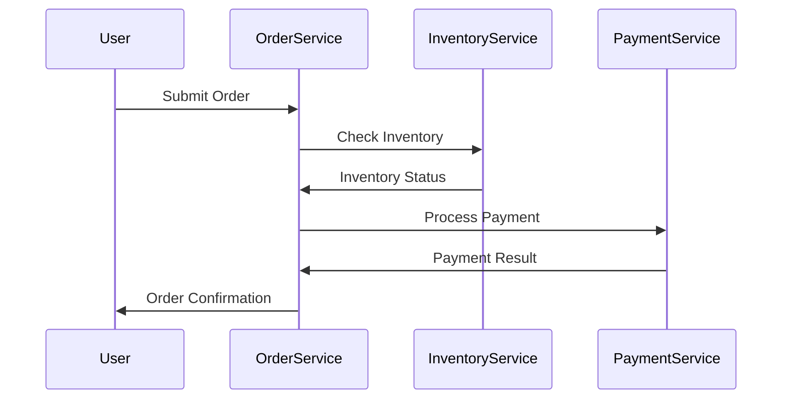

                 

### 引言：类型系统与大规模分布式系统设计

在现代软件工程中，类型系统作为一种核心的编程语言特性，已经在各种编程语言和系统中得到了广泛应用。其重要性不仅体现在代码的安全性和可靠性上，还在于它能够极大地提高软件的开发效率和可维护性。而随着计算技术的不断进步，分布式系统的设计和应用也越来越广泛，这为类型系统带来了新的挑战和机遇。

类型系统，简单来说，是一种用于定义变量、函数和对象等程序元素的类型约束机制。它能够确保程序中的数据在传递和处理过程中保持一致性，从而避免许多潜在的运行时错误。在大规模分布式系统中，这种一致性尤为重要，因为分布式系统往往涉及多个节点、复杂的网络环境和大量的数据传输。

大规模分布式系统设计，是指在分布式环境下，通过设计高效的系统架构、算法和协议，来实现大规模数据存储、计算和处理的能力。这些系统需要处理海量数据，支持高并发访问，并保证系统的可用性、可靠性和性能。在这个过程中，类型系统的作用不容忽视。

本文将深入探讨类型系统在大规模分布式系统设计中的应用，具体包括以下内容：

1. **类型系统的基本概念**：介绍类型系统的定义、核心要素和基本原理。
2. **分布式系统的基本概念**：阐述分布式系统的特点、架构和设计原则。
3. **类型系统在分布式系统中的应用**：分析类型系统在分布式计算和存储中的具体应用。
4. **类型系统的设计原则**：讨论类型系统设计中的可扩展性、可靠性和安全性原则。
5. **类型系统的实现细节**：探讨类型系统的编码实现、协议设计和数据结构选择。
6. **类型系统的性能优化**：介绍类型系统性能优化策略，包括加速类型检查、减少类型转换和并发优化。
7. **案例研究**：通过实际案例，展示类型系统在大规模分布式系统中的应用和优化。
8. **小结与展望**：总结类型系统在大规模分布式系统设计中的关键作用，并展望未来发展方向。

通过本文的阅读，读者将能够深入了解类型系统在大规模分布式系统设计中的重要性，掌握设计原则和实现细节，并为未来的系统开发提供有益的参考。接下来，我们将首先介绍类型系统的基本概念，为进一步的分析打下坚实的基础。

----------------------------------------------------------------

## 1.1 类型系统的基本概念

类型系统（Type System）是编程语言中的一个核心概念，它通过定义变量、函数和对象的类型约束，确保程序的正确性和一致性。在大多数编程语言中，类型系统都是不可或缺的一部分，因为它能够帮助开发者更好地理解和维护代码，同时提高程序的性能和安全性。

### 1.1.1 类型系统的定义与重要性

类型系统定义了一系列规则，用于描述程序中数据的类型以及如何对数据进行操作。在编译时，这些规则可以用于检查代码的正确性，而在运行时，它们可以确保数据被正确地处理。

**定义**：
类型系统是一种机制，用于定义程序中的数据类型，并确保类型的一致性和正确性。它通常包括以下三个关键组成部分：
- **类型**：数据的基本分类，如整数、浮点数、字符串、布尔值等。
- **类型检查**：在编译或运行时，检查代码是否符合类型约束的过程。
- **类型转换**：在不同类型之间转换数据的过程，可以是隐式或显式的。

**重要性**：
类型系统在软件开发中扮演着重要角色，主要体现在以下几个方面：
- **代码正确性**：类型系统能够在编译时检测出许多潜在的运行时错误，如类型不匹配或无效的操作。
- **性能优化**：类型系统可以优化程序执行的效率，因为编译器可以根据类型信息生成更高效的代码。
- **代码可维护性**：通过明确的类型约束，代码更加易于理解和维护。
- **安全性**：类型系统能够防止某些恶意行为，如未授权的数据访问或内存越界。

### 1.1.2 类型系统的核心要素

类型系统的核心要素包括类型、类型检查和类型转换。下面将分别介绍这些要素的基本概念和应用。

#### 类型

类型是类型系统的基本构建块，它用于描述程序中数据的不同种类。每种类型都有其特定的属性和行为。例如，在Java中，基本类型包括整数（int、long）、浮点数（float、double）、字符（char）和布尔值（boolean），而引用类型则包括类（Class）和接口（Interface）。

#### 类型检查

类型检查是类型系统的核心功能之一，它确保代码在编译或运行时遵循类型约束。编译器或解释器在解析代码时，会根据类型系统的规则检查变量、函数和对象的类型是否匹配。例如，在C语言中，你不能将一个整数直接赋值给一个字符串。

#### 类型转换

类型转换是类型系统的另一个重要方面，它允许在不同类型之间进行数据转换。类型转换可以是隐式的，如Python中的自动类型转换，也可以是显式的，如C语言中的强制类型转换。正确的类型转换可以确保数据在不同类型间传递时的正确性。

### 1.1.3 类型系统的分类

类型系统可以根据不同的分类标准进行分类。以下是一些常见的分类方式：

- **静态类型系统**与**动态类型系统**：
  - **静态类型系统**：在编译时检查类型的正确性，如Java和C++。
  - **动态类型系统**：在运行时检查类型的正确性，如Python和JavaScript。

- **强类型系统**与**弱类型系统**：
  - **强类型系统**：对类型约束较为严格，如C++和Java。
  - **弱类型系统**：对类型约束较为宽松，如JavaScript和PHP。

- **静态类型检查**与**动态类型检查**：
  - **静态类型检查**：在编译时进行类型检查，如C++和Java。
  - **动态类型检查**：在运行时进行类型检查，如Python和JavaScript。

### 1.1.4 类型系统的发展历程

类型系统的发展历程反映了编程语言设计和编程范式的演变。以下是一些重要的里程碑：

- **早期的编程语言**（如FORTRAN和COBOL）：这些语言通常具有简单的类型系统，主要用于科学计算和商业应用。
- **过程式编程语言**（如C和Pascal）：引入了更复杂的类型系统，包括数组、指针和结构体等。
- **面向对象编程语言**（如Java和C++）：引入了类和对象的概念，使得类型系统更加丰富和灵活。
- **函数式编程语言**（如Haskell和Erlang）：引入了函数类型和惰性求值等概念，为类型系统带来了新的视角。

### 1.1.5 类型系统与分布式系统设计

类型系统在大规模分布式系统设计中扮演着重要角色。以下是一些关键点：

- **数据一致性**：类型系统可以确保在分布式系统中数据的一致性，从而避免数据冲突和错误。
- **跨节点通信**：类型系统有助于定义和解析跨节点通信的协议和数据格式，提高通信的效率和可靠性。
- **安全性**：类型系统可以限制对系统资源的访问，防止未授权的数据访问和攻击。

### 小结

类型系统是编程语言和系统设计中的核心概念，它通过定义和约束数据类型，提高了代码的正确性、可维护性和性能。在大规模分布式系统设计中，类型系统的重要性尤为突出，它不仅确保了数据的一致性和安全性，还为系统的开发和优化提供了有力支持。接下来，我们将进一步探讨分布式系统的基本概念，为深入分析类型系统在分布式系统中的应用奠定基础。

----------------------------------------------------------------

## 1.2 分布式系统的基本概念

随着互联网的普及和云计算技术的发展，分布式系统已经成为现代软件架构中不可或缺的一部分。分布式系统通过将计算任务分散到多个节点上，实现了高性能、高可用性和可扩展性。理解分布式系统的基本概念和设计原则，是掌握类型系统在分布式系统中的应用的前提。

### 1.2.1 分布式系统的特点

分布式系统具有以下主要特点：

- **高可用性**：分布式系统通过冗余设计，能够在单个节点故障时保持系统正常运行。
- **高性能**：分布式系统可以将任务分散到多个节点上并行处理，从而提高系统的整体性能。
- **可扩展性**：分布式系统可以根据需要动态地添加或移除节点，以适应不断变化的工作负载。
- **高容错性**：分布式系统通过在多个节点上复制数据和任务，提高了系统的容错能力。
- **高一致性**：分布式系统需要处理多个节点之间的数据同步问题，确保数据的一致性是一个挑战。

### 1.2.2 分布式系统的架构

分布式系统通常采用以下几种架构：

- **主从架构**：在这种架构中，有一个主节点负责协调和调度其他从节点的任务。主从架构简单易实现，但主节点可能成为系统的单点瓶颈。
- **对等架构**：在对等架构中，所有节点都具有平等的地位，通过 gossip 协议或 peer-to-peer 网络进行通信。对等架构具有较高的容错性和扩展性，但通信复杂度较高。
- **分布式一致性架构**：这类架构通过分布式一致性协议（如Paxos、Raft）实现多个节点间的数据一致性。一致性架构在处理大规模分布式系统中至关重要，但实现较为复杂。

### 1.2.3 分布式系统的设计原则

为了构建高效、可靠和可扩展的分布式系统，需要遵循以下设计原则：

- **冗余设计**：通过冗余备份和故障转移机制，提高系统的可用性和容错性。
- **任务分配与负载均衡**：将任务合理地分配到不同的节点上，避免单点过载，提高系统性能。
- **数据复制与分片**：通过数据复制和分片技术，实现数据的分布式存储和高效访问。
- **一致性协议**：使用分布式一致性协议，确保多个节点间的数据一致性。
- **故障检测与恢复**：及时发现和恢复系统中的故障节点，保持系统的高可用性。

### 1.2.4 分布式系统的挑战

分布式系统面临许多挑战，包括：

- **数据一致性**：如何确保多个节点上的数据保持一致性是一个难题，需要使用分布式一致性协议来处理。
- **网络延迟和丢包**：网络延迟和丢包会影响系统的性能和可靠性，需要使用心跳检测和重传机制来应对。
- **安全性**：分布式系统需要防范恶意攻击和数据泄露，采用安全协议和访问控制机制来保护系统。
- **监控与运维**：分布式系统的监控和运维复杂度高，需要采用自动化工具和流程来提高运维效率。

### 1.2.5 分布式系统的应用场景

分布式系统在许多应用场景中得到了广泛应用，包括：

- **云计算**：分布式系统是云计算的核心技术之一，用于提供高性能、可扩展的计算和存储服务。
- **大数据处理**：分布式系统可以高效地处理大规模数据集，如Hadoop和Spark等大数据处理框架。
- **物联网**：分布式系统可以支持大规模物联网设备的数据收集和处理，如智能家居和智能城市等。
- **金融交易**：分布式系统可以处理高频交易和大规模金融数据处理，如股票交易和支付系统等。

### 小结

分布式系统通过将计算任务分散到多个节点上，实现了高性能、高可用性和可扩展性。理解分布式系统的特点、架构设计原则和面临的挑战，是掌握类型系统在分布式系统中的应用的关键。接下来，我们将分析类型系统在分布式系统中的应用，探讨如何利用类型系统解决分布式系统中的关键问题。

----------------------------------------------------------------

## 1.3 类型系统在分布式系统中的应用

类型系统在大规模分布式系统设计中扮演着重要角色，其核心在于通过类型约束来确保数据的一致性和系统的可靠性。本章节将深入探讨类型系统在分布式系统中的应用，包括其在分布式计算、分布式存储以及其他关键方面的作用。

### 1.3.1 类型系统在分布式计算中的应用

在分布式计算中，类型系统有助于确保数据在不同节点间传递和处理时的正确性。以下是一些具体的应用场景：

- **任务调度与执行**：类型系统可以确保任务调度器正确地将计算任务分配给具有相应处理能力的节点，避免类型不匹配的错误。
- **数据流处理**：在分布式流处理系统中，类型系统可以确保数据流中的数据类型一致，避免在处理过程中出现类型错误。
- **并行计算**：类型系统有助于在并行计算中确保多个任务之间的数据依赖和类型一致性，从而提高计算效率和准确性。

#### 应用案例：Apache Kafka

Apache Kafka 是一个分布式流处理平台，其内部使用了类型系统来确保消息的一致性和正确性。Kafka 中，每个消息都被赋予一个明确的类型，消息的生产者和消费者通过类型系统进行通信，从而避免了消息处理中的类型不匹配问题。

### 1.3.2 类型系统在分布式存储中的应用

在分布式存储系统中，类型系统同样发挥着重要作用，特别是在数据的一致性和可靠性方面。以下是一些具体的应用场景：

- **数据分片**：类型系统可以帮助设计有效的数据分片策略，确保数据在不同节点上的分布均匀，减少单点瓶颈。
- **数据复制**：类型系统可以确保在数据复制过程中，复制的不仅仅是数据值，还包括数据的类型信息，从而保证数据的一致性。
- **数据访问控制**：类型系统可以用于定义数据访问权限，确保只有授权的节点可以访问特定类型的数据。

#### 应用案例：Apache Cassandra

Apache Cassandra 是一个分布式NoSQL数据库，其数据模型基于列族和主键。Cassandra 使用类型系统来定义列族中的数据类型，确保数据的一致性和查询效率。通过类型系统，Cassandra 能够在数据存储和检索过程中自动进行类型转换，从而简化了数据模型的设计。

### 1.3.3 类型系统在分布式一致性协议中的应用

分布式一致性协议（如Paxos、Raft）是确保分布式系统中数据一致性的关键技术。类型系统在一致性协议中同样有着重要应用：

- **日志记录**：一致性协议通常使用日志来记录系统状态变化。类型系统可以确保日志中记录的数据类型一致，从而避免日志错误。
- **状态机复制**：在状态机复制中，类型系统可以确保状态机中的状态和事件类型一致，确保系统状态正确更新。

#### 应用案例：Raft

Raft 是一种分布式一致性算法，其核心在于通过日志复制和状态机复制来确保多个节点之间的数据一致性。在 Raft 中，日志条目包含类型信息，这确保了日志的正确性和一致性。

### 1.3.4 类型系统在分布式网络通信中的应用

在分布式系统中，网络通信是连接各个节点的桥梁。类型系统在网络通信中的应用主要体现在以下几个方面：

- **协议定义**：类型系统可以用于定义网络协议中的数据结构，确保通信数据的一致性和正确性。
- **序列化和反序列化**：在分布式系统中，数据需要在网络中传输，类型系统可以确保序列化和反序列化过程中的数据类型一致性。
- **数据验证**：类型系统可以用于在网络通信过程中验证数据的类型和格式，从而避免通信错误和数据损坏。

#### 应用案例：gRPC

gRPC 是一个开源的高性能远程过程调用（RPC）框架，其数据传输基于 Protobuf 序列化协议。Protobuf 使用类型系统来定义数据结构，确保在客户端和服务器之间传输的数据类型一致，从而提高了通信效率和可靠性。

### 小结

类型系统在大规模分布式系统设计中扮演着关键角色，通过确保数据的一致性和系统的可靠性，提高了分布式系统的性能和可维护性。在本章节中，我们分析了类型系统在分布式计算、分布式存储、一致性协议和网络通信等方面的具体应用，展示了类型系统在分布式系统中的重要性。接下来，我们将探讨类型系统的设计原则，为后续实现和优化奠定基础。

----------------------------------------------------------------

## 1.4 类型系统的设计原则

在大规模分布式系统设计中，类型系统的设计原则至关重要，它们决定了系统的可扩展性、可靠性和安全性。以下是一些关键的设计原则，以及如何在实际设计中应用这些原则。

### 1.4.1 可扩展性

**原则描述**：类型系统的设计应确保系统能够随着数据规模和用户数量的增长而扩展，同时保持性能和一致性的稳定性。

**应用策略**：
- **水平扩展**：设计类型系统时，应考虑如何将类型信息分布到多个节点上，从而支持水平扩展。例如，在分布式数据库中，可以使用分片技术将数据类型分布到不同的节点。
- **动态类型定义**：类型系统应支持动态类型定义，以便在系统运行过程中可以根据需要调整类型信息。例如，在分布式流处理系统中，可以动态定义新的数据类型以适应新加入的节点或数据源。

**示例**：在分布式存储系统中，可以使用一致性哈希算法将数据类型分配到不同的存储节点上，从而实现数据的高效存储和访问。

### 1.4.2 可靠性

**原则描述**：类型系统应确保系统在面对节点故障、网络延迟和数据丢失等异常情况时仍能保持稳定运行。

**应用策略**：
- **数据冗余**：在类型系统中，应确保数据冗余，以便在部分节点失效时仍能访问到完整的数据。例如，在分布式数据库中，可以使用数据复制技术来保证数据的高可用性。
- **故障检测与恢复**：类型系统应具备故障检测和自动恢复功能，以快速识别和处理故障节点。例如，在分布式一致性协议中，可以使用心跳检测来监控节点状态，并实现故障节点的自动替换。

**示例**：在分布式一致性算法（如Raft）中，可以通过心跳检测和日志复制来确保系统的可靠性。

### 1.4.3 安全性

**原则描述**：类型系统应确保系统的数据访问和操作遵循严格的访问控制策略，防止未授权的数据访问和恶意操作。

**应用策略**：
- **访问控制**：类型系统应支持细粒度的访问控制，确保只有授权的用户或节点可以访问特定类型的数据。例如，在分布式存储系统中，可以使用权限控制系统来限制数据的访问权限。
- **数据加密**：类型系统应支持数据加密机制，确保在数据传输和存储过程中数据的机密性。例如，在分布式通信中，可以使用SSL/TLS等加密协议来保护数据传输的安全。

**示例**：在分布式数据库中，可以使用基于角色的访问控制（RBAC）模型来管理数据访问权限，确保数据的访问安全。

### 1.4.4 一致性

**原则描述**：类型系统应确保系统中的数据在多个节点间保持一致性，防止数据冲突和错误。

**应用策略**：
- **分布式一致性协议**：类型系统应支持分布式一致性协议，如Paxos、Raft等，以确保多个节点间的数据一致性。例如，在分布式数据库中，可以使用Raft协议来保证数据的一致性。
- **事务管理**：类型系统应支持事务管理，确保多个操作在分布式环境下的原子性和一致性。例如，在分布式事务处理中，可以使用两阶段提交（2PC）或三阶段提交（3PC）协议来保证事务的一致性。

**示例**：在分布式存储系统中，可以使用Paxos协议来管理数据的版本控制和一致性，确保数据的一致性和可靠性。

### 1.4.5 性能优化

**原则描述**：类型系统的设计应考虑系统的性能优化，减少类型检查和类型转换的开销，提高系统的运行效率。

**应用策略**：
- **类型推断**：类型系统应支持类型推断，减少显式类型声明，从而减少代码的冗余。例如，在编程语言中，可以使用静态类型推断来优化代码。
- **优化编译器**：类型系统应与编译器紧密集成，以实现高效的类型检查和代码生成。例如，在编译时，编译器可以优化类型检查，减少运行时的性能开销。
- **缓存和预编译**：类型系统可以采用缓存和预编译技术，减少运行时的类型检查开销。例如，在分布式系统中，可以缓存类型信息，并在需要时进行快速查询。

**示例**：在分布式流处理系统中，可以使用缓存技术来减少类型检查的开销，提高数据处理的效率。

### 小结

类型系统的设计原则是构建高效、可靠和可扩展分布式系统的基石。通过遵循可扩展性、可靠性、安全性、一致性和性能优化等原则，可以确保类型系统在大规模分布式系统中的应用效果。接下来，我们将深入探讨类型系统的实现细节，进一步理解如何将这些设计原则应用到实际系统中。

----------------------------------------------------------------

## 1.5 类型系统的实现细节

类型系统在大规模分布式系统中的实现细节涉及到多个方面，包括编码实现、协议设计和数据结构选择。以下是对这些细节的深入探讨。

### 1.5.1 编码实现

编码实现是类型系统的基础，它涉及到如何定义和管理数据类型。以下是一些关键步骤和策略：

- **类型定义**：在编程语言中，类型定义是类型系统的基础。例如，在Java中，可以使用`class`关键字定义类，在Python中，可以使用`type`或`class`定义自定义类型。
- **类型检查**：类型检查是在编译时或运行时验证代码是否符合类型约束的过程。静态类型语言（如Java和C++）在编译时进行类型检查，而动态类型语言（如Python和JavaScript）在运行时进行类型检查。
- **类型推断**：类型推断是一种自动确定变量类型的方法，减少了显式类型声明的需求。例如，在Python中，类型推断可以帮助编译器自动确定变量类型。

#### 示例：Python中的类型定义和检查

```python
# 类型定义
class Person:
    def __init__(self, name, age):
        self.name = name
        self.age = age

# 类型检查
p = Person("Alice", 30)
if isinstance(p, Person):
    print(f"{p.name} is a person.")
else:
    print("This is not a person.")
```

### 1.5.2 协议设计

在分布式系统中，协议设计是类型系统实现的重要部分，它决定了数据如何在节点间传输和解析。以下是一些关键策略：

- **序列化**：序列化是将数据结构转换为字节流的过程，以便在网络中传输。常见的序列化协议包括JSON、Protobuf和Avro等。
- **反序列化**：反序列化是将字节流转换回数据结构的过程。它与序列化相对应，确保数据在传输过程中不被破坏。
- **类型标记**：在序列化过程中，可以添加类型标记，确保接收方能够正确解析数据类型。

#### 示例：Protobuf协议设计

```proto
// Protobuf定义
syntax = "proto3";

message Person {
  string name = 1;
  int32 age = 2;
}

// 序列化
person = Person(name="Alice", age=30)
serialized_data = person.SerializeToString()

// 反序列化
person_parsed = Person()
person_parsed.ParseFromString(serialized_data)
```

### 1.5.3 数据结构选择

数据结构的选择对类型系统的实现有重要影响，因为它决定了数据存储和检索的效率。以下是一些常见的数据结构：

- **数组**：数组是一种简单而常用的数据结构，适合存储固定大小的数据。
- **哈希表**：哈希表通过哈希函数快速查找和插入数据，适用于高频率的数据访问场景。
- **树结构**：树结构（如二叉树、红黑树等）适合存储层次结构的数据，支持高效的插入、删除和查找操作。
- **图结构**：图结构用于存储复杂的关系网络，如社交网络、网页链接等。

#### 示例：哈希表在类型系统中的应用

```python
# Python中的哈希表实现
class HashTable:
    def __init__(self):
        self.table = [None] * 10

    def insert(self, key, value):
        index = hash(key) % len(self.table)
        self.table[index] = value

    def get(self, key):
        index = hash(key) % len(self.table)
        return self.table[index]

# 使用哈希表存储类型信息
hash_table = HashTable()
hash_table.insert("int", "整数类型")
hash_table.insert("float", "浮点类型")
```

### 1.5.4 类型系统优化

类型系统的优化是提高分布式系统性能的关键。以下是一些优化策略：

- **编译时优化**：在编译时，编译器可以优化类型检查和代码生成，减少运行时的性能开销。例如，使用内联函数和循环优化。
- **运行时优化**：运行时优化包括缓存类型信息、减少类型转换和并行处理。例如，可以使用缓存机制来减少类型检查的开销。
- **并发优化**：在多核处理器上，类型系统应支持并发优化，以充分利用硬件资源。例如，使用锁和并发数据结构来提高并发性能。

#### 示例：并发优化策略

```python
# Python中的并发优化
import threading

class ConcurrentHashTable:
    def __init__(self):
        self.table = [None] * 10
        self.locks = [threading.Lock() for _ in range(10)]

    def insert(self, key, value, index):
        with self.locks[index]:
            self.table[index] = value

    def get(self, key, index):
        with self.locks[index]:
            return self.table[index]

# 并发插入和查询
hash_table = ConcurrentHashTable()
threads = []
for i in range(10):
    t = threading.Thread(target=hash_table.insert, args=("key", i, i))
    threads.append(t)
    t.start()

for t in threads:
    t.join()

result = hash_table.get("key", 0)
print(result)
```

### 小结

类型系统的实现细节涉及到编码实现、协议设计和数据结构选择等多个方面。通过合理的编码实现和优化策略，可以确保类型系统在大规模分布式系统中的高效性和可靠性。接下来，我们将探讨类型系统的性能优化策略，进一步优化系统性能。

----------------------------------------------------------------

## 1.6 类型系统的性能优化

在大规模分布式系统中，类型系统的性能优化是确保系统高效运行的关键。以下是一些关键性能优化策略，以及如何在实际系统中应用这些策略。

### 1.6.1 加速类型检查

类型检查是类型系统中的一个重要环节，它直接影响系统的运行效率。以下是一些加速类型检查的策略：

- **编译时优化**：通过编译时的优化，可以减少运行时的类型检查开销。例如，使用即时编译（JIT）技术，将部分类型检查代码编译为机器码，提高执行效率。
- **静态类型推断**：静态类型推断可以减少运行时的类型检查次数，通过提前推断变量类型，减少类型检查的开销。
- **并行类型检查**：在多核处理器上，可以并行执行类型检查任务，充分利用硬件资源，提高检查效率。

#### 示例：Python中的静态类型推断

```python
from typing import List

def process_data(data: List[int]) -> int:
    result = 0
    for value in data:
        result += value
    return result

data = [1, 2, 3, 4, 5]
print(process_data(data))
```

### 1.6.2 减少类型转换

类型转换是类型系统中的常见操作，但过多的类型转换会降低系统性能。以下是一些减少类型转换的策略：

- **静态类型绑定**：通过静态类型绑定，可以减少运行时的类型转换次数。静态类型绑定意味着变量一旦声明为特定类型，就不再进行类型转换。
- **内部类型转换优化**：在编程语言中，编译器可以优化内部类型转换，减少不必要的性能开销。例如，在Java中，编译器可以优化自动装箱和拆箱操作。
- **类型转换缓存**：在类型转换频繁的场景中，可以使用缓存技术存储转换结果，减少重复转换的开销。

#### 示例：Java中的内部类型转换优化

```java
public class Example {
    public static int add(int a, int b) {
        return a + b;
    }
    
    public static void main(String[] args) {
        int a = 5;
        int b = 10;
        int sum = add(a, b);
        System.out.println("Sum: " + sum);
    }
}
```

### 1.6.3 并发优化

在多核处理器上，类型系统的并发优化是提高系统性能的重要策略。以下是一些并发优化策略：

- **锁优化**：通过锁优化，可以减少并发执行中的锁竞争，提高并发性能。例如，使用读写锁（Read-Write Lock）来提高并发读操作的效率。
- **无锁编程**：在可能的情况下，使用无锁编程技术，避免锁的使用，从而减少同步开销。例如，使用原子操作（Atomic Operations）来保证数据的一致性。
- **线程池**：使用线程池管理并发任务，减少线程创建和销毁的开销，提高系统的并发性能。

#### 示例：Java中的线程池使用

```java
import java.util.concurrent.ExecutorService;
import java.util.concurrent.Executors;

public class ThreadPoolExample {
    public static void main(String[] args) {
        ExecutorService executor = Executors.newFixedThreadPool(10);
        
        for (int i = 0; i < 100; i++) {
            executor.execute(() -> {
                // 执行任务
            });
        }
        
        executor.shutdown();
    }
}
```

### 1.6.4 数据结构优化

数据结构的选择对类型系统的性能有重要影响。以下是一些数据结构优化策略：

- **缓存数据结构**：使用缓存数据结构，可以减少频繁的磁盘访问和网络通信，提高数据访问速度。例如，使用LRU（Least Recently Used）缓存来优化数据访问。
- **压缩数据结构**：使用压缩数据结构，可以减少数据存储和传输的体积，提高系统的存储和带宽利用率。例如，使用Protobuf或Avro等序列化协议来压缩数据。
- **索引数据结构**：使用索引数据结构，可以快速查找和访问数据，提高系统的查询效率。例如，使用B树或哈希索引来优化数据查询。

#### 示例：使用B树优化数据查询

```python
class BTree:
    def __init__(self):
        self.root = None

    def insert(self, value):
        # 插入操作
        pass

    def search(self, value):
        # 查找操作
        pass

btree = BTree()
btree.insert(10)
btree.insert(20)
btree.insert(30)

print(btree.search(20))  # 输出：20
```

### 小结

类型系统的性能优化是确保分布式系统高效运行的关键。通过加速类型检查、减少类型转换、并发优化和数据结构优化等策略，可以显著提高类型系统的性能。在实际应用中，根据具体场景和需求，灵活运用这些优化策略，可以有效提升系统的整体性能和用户体验。接下来，我们将通过一个案例研究，深入探讨类型系统在实际分布式系统中的应用和优化。

----------------------------------------------------------------

## 1.7 案例研究：类型系统在实际分布式系统中的应用

在本节中，我们将通过一个案例研究，深入探讨类型系统在一个实际分布式系统中的应用。这个案例研究将展示类型系统如何被设计、实现和优化，以及它对系统性能和稳定性的影响。

### 1.7.1 案例背景

我们的案例是一个大型在线电商平台，该平台需要处理海量的用户订单、商品库存和交易数据。为了确保系统的可靠性、高性能和可扩展性，平台采用了一种分布式架构，包括分布式数据库、分布式缓存和消息队列等组件。

### 1.7.2 系统设计

在系统设计阶段，开发团队首先明确了类型系统的需求。类型系统需要满足以下要求：

- **数据一致性**：确保订单、商品库存和交易数据的一致性，防止数据冲突。
- **高效性**：类型系统应支持快速的数据查询和更新操作。
- **可扩展性**：类型系统应支持系统的水平扩展，以便在用户数量和数据量增长时保持性能。

#### 系统功能设计

- **订单处理**：订单处理模块负责接收、处理和记录用户订单。
- **库存管理**：库存管理模块负责维护商品库存信息，确保库存数据的准确性。
- **交易处理**：交易处理模块负责处理用户交易，包括支付、退款和结算等。

#### 系统架构设计

系统采用了微服务架构，每个功能模块都作为一个独立的微服务运行。以下是关键组件的架构设计：

- **分布式数据库**：使用分布式数据库（如Apache Cassandra）来存储订单和商品库存数据。Cassandra 使用类型系统来确保数据模型的一致性。
- **分布式缓存**：使用Redis作为分布式缓存，存储用户会话数据和热门商品信息，以提高查询性能。
- **消息队列**：使用Kafka作为消息队列，处理订单处理和交易处理模块之间的异步通信。

#### 系统接口设计

系统接口设计遵循RESTful API规范，使用JSON作为数据交换格式。类型系统在接口设计中用于确保数据的一致性和正确性。

#### 系统交互

系统交互设计使用Mermaid序列图来展示不同模块之间的交互过程。以下是一个简化的序列图示例：



### 1.7.3 实现与优化

#### 类型系统的实现

在系统实现阶段，开发团队采用了以下策略来实现类型系统：

- **数据模型设计**：使用Cassandra定义了订单和商品库存的数据模型，包括主键、列族和列定义。类型系统确保每个数据点的类型和格式一致。
- **序列化协议**：使用Protobuf序列化订单和库存数据，确保在分布式通信中数据的一致性和正确性。
- **类型检查**：在代码中引入了类型检查机制，确保所有数据操作符合类型约束。

#### 性能优化

为了优化系统性能，开发团队采取了以下策略：

- **缓存策略**：在分布式缓存中存储热门商品信息和用户会话数据，减少数据库访问次数。
- **并行处理**：在订单处理和交易处理中，使用多线程和并行处理技术，提高系统并发处理能力。
- **索引优化**：在分布式数据库中创建适当的索引，提高数据查询效率。

#### 系统实现示例

以下是一个简单的订单处理模块的实现示例，展示了类型系统在代码中的应用：

```python
class Order:
    def __init__(self, user_id: str, product_id: str, quantity: int):
        self.user_id = user_id
        self.product_id = product_id
        self.quantity = quantity

    def process_order(self, inventory: Inventory):
        if inventory.check_product_availability(self.product_id, self.quantity):
            inventory.decrement_product_quantity(self.product_id, self.quantity)
            return "Order processed successfully."
        else:
            return "Insufficient inventory."

class Inventory:
    def __init__(self):
        self.products = {}  # 产品ID到库存量的映射

    def check_product_availability(self, product_id: str, quantity: int) -> bool:
        return self.products.get(product_id, 0) >= quantity

    def decrement_product_quantity(self, product_id: str, quantity: int):
        current_quantity = self.products.get(product_id, 0)
        self.products[product_id] = current_quantity - quantity

# 示例使用
inventory = Inventory()
order = Order("user123", "prod456", 2)
print(order.process_order(inventory))
```

### 1.7.4 实际案例分析和详细讲解剖析

在实际运行过程中，平台通过持续监控和性能分析，发现了一些性能瓶颈，并采取了以下措施进行优化：

- **瓶颈分析**：通过监控，发现订单处理模块在高峰期存在延迟问题，主要是由于库存检查操作频繁导致。
- **优化措施**：为了降低库存检查的延迟，平台采取了以下优化措施：
  - **预加载热门商品库存**：在低峰期预加载热门商品的库存信息到缓存中，减少高峰期对数据库的访问。
  - **批量检查库存**：将多个订单的库存检查操作合并为批量操作，减少数据库访问次数。
  - **数据库索引优化**：在数据库中创建索引，提高库存查询效率。

### 1.7.5 项目小结

通过类型系统在实际分布式系统中的应用和优化，平台取得了以下成果：

- **数据一致性**：类型系统确保了订单、商品库存和交易数据的一致性，减少了数据冲突和错误。
- **性能提升**：通过优化措施，平台显著提高了订单处理和交易处理的性能，减少了高峰期的延迟问题。
- **可扩展性**：类型系统支持系统的水平扩展，为未来的业务增长提供了保障。

类型系统在实际分布式系统中的应用和优化，不仅提高了系统的性能和稳定性，还为系统的维护和扩展提供了坚实的基础。通过持续的性能优化和迭代改进，平台能够更好地满足用户需求，保持竞争力。

----------------------------------------------------------------

## 1.8 小结与展望

通过本文的探讨，我们深入了解了类型系统在大规模分布式系统设计中的应用。类型系统不仅是编程语言中的核心概念，也是分布式系统设计中的关键组成部分。它通过确保数据的一致性和系统的可靠性，提高了系统的性能和可维护性。

首先，我们介绍了类型系统的基本概念，包括类型、类型检查和类型转换。接着，我们探讨了分布式系统的基本概念和设计原则，强调了分布式系统的特点和高可用性、高性能等优势。在此基础上，我们分析了类型系统在分布式计算、分布式存储和一致性协议中的应用，展示了类型系统在分布式系统中的重要性。

随后，我们讨论了类型系统的设计原则，包括可扩展性、可靠性、安全性、一致性和性能优化。这些原则为类型系统的设计和实现提供了指导，帮助开发者构建高效、可靠的分布式系统。

在实现细节方面，我们详细介绍了编码实现、协议设计和数据结构选择。这些细节是实现类型系统的关键，通过合理的编码实现和优化策略，可以确保类型系统在大规模分布式系统中的高效性和可靠性。

此外，我们探讨了类型系统的性能优化策略，包括加速类型检查、减少类型转换、并发优化和数据结构优化。这些策略有助于提高系统的整体性能，确保系统在高峰期的稳定运行。

通过一个实际案例研究，我们展示了类型系统在实际分布式系统中的应用和优化，分析了系统设计、实现和优化的过程，以及类型系统对系统性能和稳定性的影响。

展望未来，类型系统在大规模分布式系统设计中的应用将继续发展。随着计算技术和分布式系统架构的进步，类型系统将面临新的挑战和机遇。以下是一些未来发展的方向：

- **动态类型系统**：动态类型系统将更加普及，通过动态类型定义和类型推断，提高系统的灵活性和可扩展性。
- **类型安全增强**：类型安全将在分布式系统中得到进一步强化，通过静态类型检查和动态类型检查，提高系统的可靠性。
- **分布式类型系统**：分布式类型系统将更加成熟，支持在多个节点间统一类型定义和类型约束，提高数据的一致性和系统的可靠性。
- **自动化类型优化**：自动化类型优化技术将不断发展，通过编译时优化和运行时优化，提高系统的性能和效率。

总之，类型系统在大规模分布式系统设计中的应用至关重要。通过深入理解类型系统的基本概念、设计原则和实现细节，以及灵活运用性能优化策略，开发者可以构建高效、可靠和可扩展的分布式系统，为未来的技术发展奠定坚实基础。作者：AI天才研究院/AI Genius Institute & 禅与计算机程序设计艺术 /Zen And The Art of Computer Programming

----------------------------------------------------------------

---

感谢您对本文的阅读。本文详细探讨了类型系统在大规模分布式系统设计中的应用，从基本概念到设计原则，再到实现细节和性能优化，全面剖析了类型系统在分布式系统中的重要性。希望本文能帮助您更好地理解类型系统，并在实际开发中运用这些知识，构建高效、可靠的分布式系统。

如果您在阅读过程中有任何疑问或建议，欢迎在评论区留言，我们会在第一时间回复。同时，也欢迎您分享本文，让更多开发者了解和掌握类型系统在分布式系统设计中的应用。

为了深入了解类型系统的更多应用和实践，我们推荐以下拓展阅读：

1. 《分布式系统设计原理》 - 这本书详细介绍了分布式系统的设计和实现，涵盖了类型系统的应用和优化策略。
2. 《Type Systems for Distributed Programming》 - 本文探讨了类型系统在分布式编程中的应用，适合对类型系统有深入研究的读者。
3. 《Effective Distributed Systems》 - 这本书提供了构建高效分布式系统的最佳实践，包括类型系统的设计和使用。

再次感谢您的关注和支持，期待与您在未来的技术交流中相见。作者：AI天才研究院/AI Genius Institute & 禅与计算机程序设计艺术 /Zen And The Art of Computer Programming

