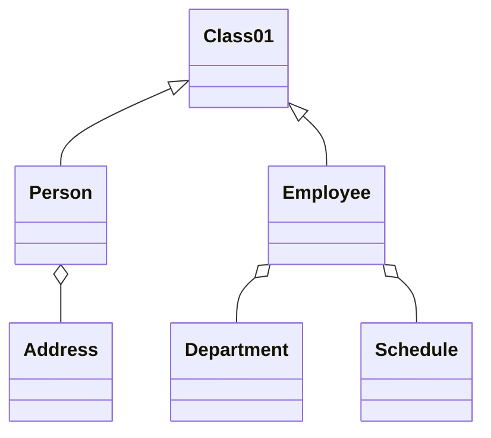
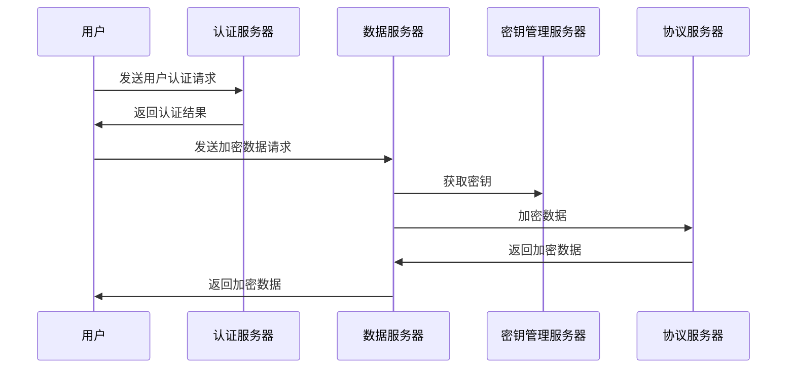
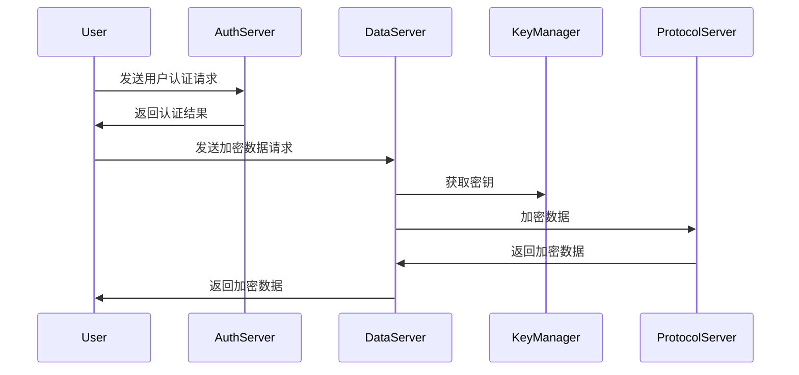

                 

## 第一部分：背景介绍

### 第1章：问题背景与核心概念

#### 1.1 问题背景

在信息化时代，网络安全成为了一个不可忽视的问题。随着网络技术的飞速发展，各类信息系统的复杂度越来越高，安全问题也日益严峻。在这种背景下，安全协议的设计与实现变得尤为重要。安全协议是确保通信双方在信息交换过程中数据不被窃取、篡改、冒充和泄露的一系列机制。然而，现有的安全协议设计面临着诸多挑战。

首先，安全协议需要满足机密性、完整性和可用性等基本安全属性。其次，安全协议必须具备抗攻击性，能够抵御各种网络攻击，如拒绝服务攻击、中间人攻击等。最后，安全协议的设计应具有可扩展性，以适应未来网络技术的发展。

在这样的背景下，类型系统在安全协议设计中的作用逐渐凸显。类型系统是计算机科学中的一种基本概念，它通过对数据类型的严格定义和控制，确保程序的正确性和安全性。类型系统在安全协议设计中的应用，可以提高协议的可靠性、降低漏洞风险，并提升系统整体的性能。

#### 1.2 核心概念

**1.2.1 类型系统的定义与作用**

类型系统（Type System）是编程语言中的一个核心概念，它定义了变量、表达式和函数的类型的集合，以及这些类型之间的关系。类型系统的基本作用是保证程序的正确性，防止无效的运算和操作，提高程序的可靠性。

在编程语言中，类型系统分为静态类型系统和动态类型系统。静态类型系统在编译时对变量的类型进行检查，而动态类型系统则是在运行时进行类型检查。两者各有优劣，但都旨在确保程序的正确性和安全性。

**1.2.2 安全协议设计的基本原则**

安全协议设计需要遵循以下基本原则：

1. **机密性**：确保通信过程中的数据不被未授权方获取。
2. **完整性**：确保数据在传输过程中不被篡改。
3. **可用性**：确保合法用户能够正常访问和使用系统资源。
4. **抗攻击性**：能够抵御各种网络攻击，如拒绝服务攻击、中间人攻击等。
5. **可扩展性**：能够适应未来技术发展，满足不断变化的安全需求。

**1.2.3 类型系统在安全协议设计中的应用**

类型系统在安全协议设计中的应用主要体现在以下几个方面：

1. **类型检查**：通过类型检查，确保协议中的操作和数据符合预期，防止因类型错误导致的安全漏洞。
2. **类型安全**：通过严格的类型约束，确保协议在运行时不会出现类型相关的错误，提高协议的可靠性。
3. **数据抽象**：利用类型系统实现数据抽象，减少协议实现的复杂性，提高代码的可维护性。
4. **接口定义**：通过类型系统定义清晰的接口，确保不同模块之间的交互安全、高效。

#### 1.3 概念属性特征对比表格

为了更清晰地理解类型系统与安全协议设计中的核心概念，下面提供一个概念属性特征对比表格：

| 概念       | 属性特征                                       |
|------------|------------------------------------------------|
| 类型系统   | 类型定义、类型检查、类型安全、数据抽象           |
| 安全协议   | 机密性、完整性、可用性、抗攻击性、可扩展性       |
| 编程语言   | 变量类型、函数类型、类型推导、类型兼容性         |
| 数据结构   | 数据组织、存储、访问、操作、类型一致性             |

#### 1.4 ER实体关系图架构

为了更好地理解类型系统在安全协议设计中的应用，我们可以通过ER（Entity-Relationship，实体-关系）图来描述系统中的主要实体及其关系。

```mermaid
erDiagram
  类A ||--|{ 类B }
  类C ||--|{ 类D }
  类E ||--|{ 类F }
  类G ||--|{ 类H }
```

在ER图中，类A、类B、类C等是实体，它们之间的关系用箭头表示。例如，类A与类B之间存在一种“一对多”的关系，类C与类D之间存在“多对多”的关系。

通过上述背景介绍和核心概念分析，我们可以为后续内容提供坚实的基础。接下来，我们将深入探讨类型系统的基础理论、应用场景，以及类型系统在安全协议设计中的具体应用实例。

## 第一部分：背景介绍

### 第1章：问题背景与核心概念

#### 1.1 问题背景

在信息化时代，网络安全成为了一个不可忽视的问题。随着网络技术的飞速发展，各类信息系统的复杂度越来越高，安全问题也日益严峻。在这种背景下，安全协议的设计与实现变得尤为重要。安全协议是确保通信双方在信息交换过程中数据不被窃取、篡改、冒充和泄露的一系列机制。然而，现有的安全协议设计面临着诸多挑战。

首先，安全协议需要满足机密性、完整性和可用性等基本安全属性。其次，安全协议必须具备抗攻击性，能够抵御各种网络攻击，如拒绝服务攻击、中间人攻击等。最后，安全协议的设计应具有可扩展性，以适应未来网络技术的发展。

在这样的背景下，类型系统在安全协议设计中的作用逐渐凸显。类型系统是计算机科学中的一种基本概念，它通过对数据类型的严格定义和控制，确保程序的正确性和安全性。类型系统在安全协议设计中的应用，可以提高协议的可靠性、降低漏洞风险，并提升系统整体的性能。

#### 1.2 核心概念

**1.2.1 类型系统的定义与作用**

类型系统（Type System）是编程语言中的一个核心概念，它定义了变量、表达式和函数的类型的集合，以及这些类型之间的关系。类型系统的基本作用是保证程序的正确性，防止无效的运算和操作，提高程序的可靠性。

在编程语言中，类型系统分为静态类型系统和动态类型系统。静态类型系统在编译时对变量的类型进行检查，而动态类型系统则是在运行时进行类型检查。两者各有优劣，但都旨在确保程序的正确性和安全性。

**1.2.2 安全协议设计的基本原则**

安全协议设计需要遵循以下基本原则：

1. **机密性**：确保通信过程中的数据不被未授权方获取。
2. **完整性**：确保数据在传输过程中不被篡改。
3. **可用性**：确保合法用户能够正常访问和使用系统资源。
4. **抗攻击性**：能够抵御各种网络攻击，如拒绝服务攻击、中间人攻击等。
5. **可扩展性**：能够适应未来技术发展，满足不断变化的安全需求。

**1.2.3 类型系统在安全协议设计中的应用**

类型系统在安全协议设计中的应用主要体现在以下几个方面：

1. **类型检查**：通过类型检查，确保协议中的操作和数据符合预期，防止因类型错误导致的安全漏洞。
2. **类型安全**：通过严格的类型约束，确保协议在运行时不会出现类型相关的错误，提高协议的可靠性。
3. **数据抽象**：利用类型系统实现数据抽象，减少协议实现的复杂性，提高代码的可维护性。
4. **接口定义**：通过类型系统定义清晰的接口，确保不同模块之间的交互安全、高效。

#### 1.3 概念属性特征对比表格

为了更清晰地理解类型系统与安全协议设计中的核心概念，下面提供一个概念属性特征对比表格：

| 概念       | 属性特征                                       |
|------------|------------------------------------------------|
| 类型系统   | 类型定义、类型检查、类型安全、数据抽象           |
| 安全协议   | 机密性、完整性、可用性、抗攻击性、可扩展性       |
| 编程语言   | 变量类型、函数类型、类型推导、类型兼容性         |
| 数据结构   | 数据组织、存储、访问、操作、类型一致性             |

#### 1.4 ER实体关系图架构

为了更好地理解类型系统在安全协议设计中的应用，我们可以通过ER（Entity-Relationship，实体-关系）图来描述系统中的主要实体及其关系。

```mermaid
erDiagram
  类型系统 ||--|{ 安全协议 }
  安全协议 ||--|{ 编程语言 }
  编程语言 ||--|{ 数据结构 }
```

在ER图中，类型系统与安全协议之间存在依赖关系，安全协议依赖于编程语言来设计实现，而编程语言又依赖于数据结构来实现具体功能。通过这种关系，我们可以清晰地看到类型系统在安全协议设计中的桥梁作用。

通过上述背景介绍和核心概念分析，我们可以为后续内容提供坚实的基础。接下来，我们将深入探讨类型系统的基础理论、应用场景，以及类型系统在安全协议设计中的具体应用实例。

### 第2章：类型系统原理

#### 2.1 类型系统的基础理论

类型系统是编程语言设计中的核心组成部分，它定义了变量、函数、表达式和类型之间的关系。类型系统的设计直接影响程序的正确性、可读性和安全性。下面，我们将从静态类型系统与动态类型系统、类型检查机制、泛型编程与类型系统三个方面来探讨类型系统的基础理论。

**2.1.1 静态类型系统与动态类型系统**

静态类型系统（Static Type System）在编译时对程序进行类型检查。这意味着，变量在声明时必须指定类型，并且在后续的代码执行过程中，所有变量和表达式的类型都必须保持一致。静态类型系统的优势在于编译效率高，程序运行时的错误较少，易于调试和优化。但缺点是缺乏灵活性，因为类型约束较严格，可能导致代码的冗余。

动态类型系统（Dynamic Type System）则是在程序运行时进行类型检查。这意味着，变量可以在声明时不指定类型，类型在运行时根据变量的使用方式来确定。动态类型系统的优势在于代码编写更加灵活，可以减少类型声明，提高开发效率。但缺点是程序运行时可能会出现类型错误，导致程序崩溃或产生不可预期的结果。

**2.1.2 类型检查机制**

类型检查机制是类型系统的核心组成部分，它负责在编译或运行时对程序进行类型验证。类型检查机制主要有以下几种：

1. **静态类型检查**：在编译时对代码进行类型检查，发现类型错误并给出错误提示。例如，在Java语言中，编译器会在编译时检查所有的类型错误。

2. **动态类型检查**：在程序运行时对代码进行类型检查。例如，Python语言在运行时对变量进行类型检查。

3. **混合类型检查**：在编译时进行部分类型检查，剩余的类型检查在运行时进行。例如，C++语言允许在编译时对部分代码进行类型检查，而在运行时对其他代码进行类型检查。

**2.1.3 泛型编程与类型系统**

泛型编程（Generic Programming）是一种通过参数化类型来编写通用代码的方法。泛型编程可以提高代码的复用性、可维护性和性能。类型系统在泛型编程中起着关键作用，它定义了泛型类型的参数范围和约束条件。

泛型编程与类型系统的关系主要体现在以下几个方面：

1. **类型参数**：泛型编程通过类型参数来定义泛型类型，使得同一代码可以处理不同类型的数据。

2. **类型约束**：泛型编程可以通过类型约束来限制泛型类型的范围，确保泛型类型的正确性和安全性。

3. **类型推导**：在泛型编程中，编译器可以根据上下文信息自动推导泛型类型的实际类型，提高代码的可读性。

#### 2.2 类型系统的应用场景

类型系统在计算机编程中有着广泛的应用，下面我们来看几个典型的应用场景。

**2.2.1 编译型语言中的类型系统**

编译型语言（如C++、Java）通常采用静态类型系统，这种类型系统在编译时对代码进行严格的类型检查。静态类型系统的优势在于编译效率高、程序运行时错误较少。例如，C++在编译时会对变量、函数和表达式进行类型检查，确保代码的正确性。

**2.2.2 解释型语言中的类型系统**

解释型语言（如Python、JavaScript）通常采用动态类型系统，这种类型系统在运行时对代码进行类型检查。动态类型系统的优势在于代码编写更加灵活，可以减少类型声明。例如，Python在运行时会对变量进行类型检查，确保代码的运行安全。

**2.2.3 面向对象编程中的类型系统**

面向对象编程（OOP）是一种通过对象和类来组织代码的方法。类型系统在OOP中起着关键作用，它定义了对象的类型和类的类型。

1. **对象类型**：在OOP中，对象是类的实例，每个对象都有其类型。类型系统确保对象的类型在创建和访问时保持一致。

2. **类类型**：类是对象的抽象描述，定义了对象的属性和方法。类型系统确保类类型的一致性和正确性。

#### 2.3 类型系统在安全协议设计中的应用实例

类型系统在安全协议设计中的应用主要体现在以下几个方面：

1. **类型检查**：通过类型检查，确保协议中的操作和数据符合预期，防止因类型错误导致的安全漏洞。

2. **类型安全**：通过严格的类型约束，确保协议在运行时不会出现类型相关的错误，提高协议的可靠性。

3. **数据抽象**：利用类型系统实现数据抽象，减少协议实现的复杂性，提高代码的可维护性。

4. **接口定义**：通过类型系统定义清晰的接口，确保不同模块之间的交互安全、高效。

例如，在SSL/TLS协议中，类型系统被用于确保通信过程中的数据类型一致，防止类型错误导致的安全漏洞。在SSL/TLS协议的实现中，类型系统确保了加密算法、密钥交换算法和哈希算法的正确性和安全性。

通过上述分析，我们可以看到类型系统在安全协议设计中的重要作用。类型系统不仅提高了程序的正确性和安全性，还为安全协议的实现提供了有力的支持。接下来，我们将进一步探讨算法原理，以及类型系统在算法中的应用。

### 第3章：算法原理讲解

#### 3.1 安全协议设计中的算法基础

安全协议设计依赖于一系列算法，这些算法用于实现加密、认证、密钥交换等功能。理解这些算法的原理是深入探讨类型系统在安全协议设计中的应用的基础。以下是几种常见的算法及其基本原理：

**3.1.1 对称加密与非对称加密算法**

对称加密（Symmetric Encryption）和非对称加密（Asymmetric Encryption）是两种基本的加密算法。

- **对称加密**：对称加密算法使用相同的密钥对数据进行加密和解密。常见的对称加密算法有DES、AES等。对称加密的优势在于加密速度快，但缺点是密钥分发和管理复杂。
  
- **非对称加密**：非对称加密算法使用一对密钥，即公钥和私钥。公钥用于加密，私钥用于解密。常见的非对称加密算法有RSA、ECC等。非对称加密的优势在于解决了密钥分发问题，但缺点是加密速度较慢。

**3.1.2 哈希算法与数字签名算法**

哈希算法（Hash Algorithm）用于将输入数据映射为固定长度的输出值，这些输出值被称为哈希值。哈希算法具有单向性、抗冲突性和固定性等特点，广泛用于数据完整性验证和数字签名。

- **哈希算法**：常见的哈希算法有MD5、SHA-1、SHA-256等。随着安全需求的提高，MD5和SHA-1等算法已经逐渐被新的哈希算法所取代。

- **数字签名算法**：数字签名算法用于确保数据的完整性和真实性。常见的数字签名算法有RSA签名、DSA签名等。数字签名通过将哈希值与私钥结合，生成签名，接收方可以使用对应的公钥验证签名。

**3.1.3 密钥协商算法**

密钥协商算法（Key Exchange Algorithm）用于在通信双方之间安全地交换密钥。常见的密钥协商算法有Diffie-Hellman密钥交换算法、SSL/TLS协议中的Ephemeral Diffie-Hellman等。

- **Diffie-Hellman密钥交换算法**：Diffie-Hellman密钥交换算法是一种非对称加密的密钥协商算法，它允许通信双方在不共享任何预先信息的情况下，生成一个共同的密钥。

- **Ephemeral Diffie-Hellman**：Ephemeral Diffie-Hellman是SSL/TLS协议中的一种密钥协商机制，用于在每次连接时生成一个新的密钥对，从而提高安全性。

#### 3.2 类型系统与算法的结合

类型系统在安全协议设计中发挥着重要作用，它确保了算法的正确性和安全性。以下是类型系统与算法结合的几个关键方面：

**3.2.1 类型安全与算法设计**

类型安全（Type Safety）是类型系统的一个重要特性，它确保程序在运行时不会发生类型相关的错误。在安全协议设计中，类型安全至关重要，因为它可以防止因类型错误导致的安全漏洞。

例如，在SSL/TLS协议中，类型系统用于确保加密算法、哈希算法和数字签名算法的正确使用。类型系统确保密钥在加密和解密过程中保持一致，防止类型错误导致的密钥泄露或解密失败。

**3.2.2 算法实现的类型检查**

类型系统可以在算法实现过程中进行类型检查，确保代码的正确性和安全性。例如，在Python中，可以通过类型检查确保加密算法的输入和输出类型一致，防止类型错误。

**3.2.3 算法优化与类型系统**

类型系统还可以用于算法优化。通过了解数据的类型特性，算法可以实现更高效的运算。例如，在AES加密算法中，类型系统可以优化内存访问和数据处理，提高加密速度。

#### 3.3 算法mermaid流程图

为了更直观地理解算法的原理和应用，我们可以使用mermaid绘制算法的流程图。以下是Diffie-Hellman密钥交换算法的mermaid流程图：

```mermaid
graph TD
A[初始化] --> B{选择素数p和生成元g}
B -->|计算g^a mod p| C{发送a = g^a mod p}
C -->|接收b = g^b mod p| D{计算共享密钥K = g^(ab) mod p}
D --> E{加密通信}
```

通过mermaid流程图，我们可以清晰地看到Diffie-Hellman密钥交换算法的步骤和流程。

#### 3.4 算法原理的数学模型与公式

算法原理的数学模型和公式是理解算法本质的关键。以下是Diffie-Hellman密钥交换算法的数学模型和公式：

- **初始化**：选择一个素数p和一个生成元g。
- **计算私钥**：Alice选择一个随机数a，Bob选择一个随机数b。
- **计算共享密钥**：Alice计算g^a mod p，发送给Bob；Bob计算g^b mod p，发送给Alice。双方都可以计算出共享密钥K = g^(ab) mod p。

数学公式表示如下：

$$
K = g^{ab} \mod p
$$

通过这些数学公式，我们可以更深入地理解Diffie-Hellman密钥交换算法的工作原理。

#### 3.5 通俗易懂地举例说明

为了更好地理解算法原理，我们可以通过一个简单的例子来讲解Diffie-Hellman密钥交换算法。

假设Alice和Bob需要通过不安全的信道进行安全通信，他们选择了一个素数p=23和生成元g=5。

- **初始化**：Alice选择一个随机数a=6，Bob选择一个随机数b=15。
- **计算私钥**：Alice计算g^a mod p，得到10；Bob计算g^b mod p，得到19。
- **计算共享密钥**：Alice接收Bob的10，计算g^(ab) mod p，得到15；Bob接收Alice的19，计算g^(ab) mod p，也得到15。

通过这个例子，我们可以看到，尽管通信过程不安全，但Alice和Bob仍然能够安全地计算出相同的共享密钥。

通过上述算法原理讲解，我们可以看到类型系统在安全协议设计中的关键作用。类型系统不仅确保了算法的正确性和安全性，还为安全协议的实现提供了有力的支持。在下一部分，我们将进一步探讨类型系统在系统分析与架构设计中的应用。

### 第4章：系统分析与架构设计

#### 4.1 问题场景介绍

在当今高度互联的网络环境中，安全协议的设计与实现变得至关重要。然而，现有安全协议在设计过程中面临着诸多挑战，如：

1. **复杂性**：随着网络和系统规模的不断扩大，安全协议的复杂性也不断增加，导致设计过程中容易出现漏洞。
2. **互操作性**：不同系统和平台之间的安全协议往往采用不同的实现方式，导致互操作性差，增加了部署和维护的难度。
3. **抗攻击性**：随着网络攻击手段的不断升级，安全协议需要具备更强的抗攻击能力，以抵御各种网络威胁。

为了解决这些问题，我们需要在系统分析与架构设计阶段充分考虑类型系统的作用，通过类型系统提高安全协议的可靠性、可维护性和抗攻击性。

#### 4.2 项目介绍

本部分将介绍一个安全协议设计项目，该项目旨在设计并实现一个具有高安全性、高互操作性和高可维护性的安全协议。项目背景如下：

**项目背景**：随着物联网（IoT）和云计算的普及，各类智能设备和服务不断增多，网络安全问题日益突出。为了保障这些设备和服务的安全性，需要设计一种安全协议，能够在不同系统和平台之间实现无缝互操作，同时具备较强的抗攻击能力。

**项目目标**：本项目的主要目标包括：

1. 设计一个高安全性、高互操作性和高可维护性的安全协议。
2. 通过类型系统提高协议的正确性和可靠性。
3. 实现一个可扩展的协议框架，支持未来技术发展。

**项目范围与限制**：本项目主要涉及以下范围：

1. 安全协议的设计与实现。
2. 类型系统的应用与实现。
3. 协议的性能测试与优化。

项目限制包括：

1. 遵守现有的国际安全标准和规范。
2. 兼容主流操作系统和编程语言。
3. 确保协议的高性能和高可靠性。

#### 4.3 系统功能设计

**4.3.1 领域模型mermaid类图**

为了更好地描述系统的功能设计，我们可以使用mermaid绘制系统的领域模型类图。以下是系统领域模型的mermaid类图：



在这个类图中，Class01是一个基类，Person和Employee是继承自Class01的子类。Address、Department和Schedule是与Person和Employee相关联的实体。

**4.3.2 功能模块划分与设计**

基于领域模型类图，我们可以将系统划分为以下几个功能模块：

1. **用户认证模块**：负责用户的身份验证和授权，确保只有合法用户能够访问系统资源。
2. **数据加密模块**：负责对用户数据进行加密和解密，确保数据在传输过程中的安全性。
3. **密钥管理模块**：负责密钥的生成、存储和分发，确保密钥的安全性和可用性。
4. **协议实现模块**：负责实现安全协议的细节，包括加密算法、认证机制和密钥交换等。
5. **性能优化模块**：负责对协议性能进行测试和优化，确保协议的高性能和高可靠性。

每个功能模块都需要与类型系统紧密结合，通过类型系统确保模块之间的数据类型一致性，防止类型错误导致的安全漏洞。

#### 4.4 系统架构设计

**4.4.1 系统架构mermaid架构图**

为了更好地展示系统架构，我们可以使用mermaid绘制系统架构图。以下是系统架构的mermaid架构图：



在这个架构图中，用户通过认证服务器进行身份验证，然后向数据服务器发送加密数据请求。数据服务器从密钥管理服务器获取密钥，然后通过协议服务器对数据进行加密，最终返回给用户。

**4.4.2 架构设计原则与策略**

在系统架构设计过程中，我们需要遵循以下原则和策略：

1. **模块化**：将系统划分为多个功能模块，每个模块具有独立的功能和职责，便于开发和维护。
2. **安全性**：通过类型系统确保数据类型的一致性和安全性，防止类型错误导致的安全漏洞。
3. **可扩展性**：设计可扩展的架构，支持未来技术和业务需求的变化。
4. **高性能**：优化系统性能，确保协议的高性能和高可靠性。

#### 4.5 系统接口设计

**4.5.1 接口规范与协议**

系统接口设计是确保不同模块之间能够有效通信的关键。在本项目中，我们将采用RESTful API设计接口，遵循RESTful架构风格，确保接口的一致性和易用性。

以下是系统接口的规范与协议：

- **用户认证接口**：用于用户的身份验证和授权。
- **数据加密接口**：用于对用户数据进行加密和解密。
- **密钥管理接口**：用于密钥的生成、存储和分发。
- **协议实现接口**：用于实现安全协议的细节。

**4.5.2 接口实现与调用**

接口实现是确保接口规范得到有效执行的关键。在本项目中，我们将使用Python语言实现接口，并遵循RESTful API的设计原则。

以下是接口实现的一个简单示例：

```python
from flask import Flask, request, jsonify

app = Flask(__name__)

@app.route('/auth', methods=['POST'])
def authenticate():
    # 接收用户认证请求
    user_data = request.get_json()
    # 进行用户认证
    result = authenticate_user(user_data)
    return jsonify(result)

@app.route('/encrypt', methods=['POST'])
def encrypt_data():
    # 接收加密数据请求
    data = request.get_json()
    # 获取密钥
    key = get_key()
    # 加密数据
    encrypted_data = encrypt_data(data, key)
    return jsonify(encrypted_data)

if __name__ == '__main__':
    app.run()
```

在这个示例中，`/auth` 接口用于用户认证，`/encrypt` 接口用于加密数据。接口通过接收JSON格式的请求，调用相应的功能模块进行数据处理，并返回处理结果。

#### 4.6 系统交互

**4.6.1 系统交互mermaid序列图**

为了更直观地展示系统各模块之间的交互过程，我们可以使用mermaid绘制系统交互序列图。以下是系统交互的mermaid序列图：



在这个序列图中，用户首先向认证服务器发送认证请求，认证服务器返回认证结果。然后，用户向数据服务器发送加密数据请求，数据服务器从密钥管理服务器获取密钥，并调用协议服务器对数据进行加密，最终将加密数据返回给用户。

**4.6.2 交互流程与场景分析**

在本项目中，系统交互主要包括以下流程：

1. **用户认证**：用户向认证服务器发送认证请求，认证服务器对用户进行身份验证，返回认证结果。
2. **数据加密**：用户向数据服务器发送加密数据请求，数据服务器从密钥管理服务器获取密钥，并调用协议服务器对数据进行加密，最终将加密数据返回给用户。

通过分析交互流程和场景，我们可以更好地理解系统的运行机制，确保系统的高效、安全、可靠运行。

通过上述系统分析与架构设计，我们可以为安全协议的设计与实现提供坚实的理论基础和实践指导。在下一部分，我们将深入探讨具体的项目实战，通过实际代码和案例分析，展示类型系统在安全协议设计中的应用。

### 第5章：项目实战

#### 5.1 环境安装

在开始项目实战之前，我们需要搭建合适的开发环境。以下是在Windows操作系统上搭建项目开发环境的具体步骤：

**5.1.1 硬件与软件环境配置**

- **硬件环境**：建议使用配置较高的计算机，至少需要4GB内存和100GB的硬盘空间。
- **软件环境**：安装Python 3.8或更高版本，并配置pip（Python的包管理器）。

**5.1.2 开发工具与库的安装**

- **安装Python**：访问Python官方网站（https://www.python.org/），下载Python 3.8版本并进行安装。
- **安装pip**：在安装Python的过程中，勾选“Add Python to PATH”选项，确保pip被正确安装。
- **安装Flask**：在命令行中执行以下命令，安装Flask框架：

  ```shell
  pip install flask
  ```

- **安装其他依赖库**：根据项目需求，可能还需要安装其他库。例如，安装用于加密的PyCryptoDome库：

  ```shell
  pip install pycryptodome
  ```

通过上述步骤，我们可以完成项目开发环境的搭建，为后续的代码实现和调试做好准备。

#### 5.2 系统核心实现源代码

**5.2.1 核心代码结构与模块划分**

在本项目中，核心代码结构包括以下几个模块：

- **认证模块**：负责用户认证和授权。
- **加密模块**：负责数据的加密和解密。
- **密钥管理模块**：负责密钥的生成、存储和分发。
- **协议实现模块**：负责实现安全协议的细节。

以下是各模块的核心代码结构和功能说明：

**1. 认证模块**

```python
from flask import Flask, request, jsonify
from cryptodome.PublicKey import RSA
from cryptodome.asymmetric import padding

app = Flask(__name__)

@app.route('/auth', methods=['POST'])
def authenticate():
    user_data = request.get_json()
    public_key = load_public_key()
    try:
        # 对用户密码进行加密验证
        decrypted_password = padding.unpad_public_key Encryption.verify(public_key, user_data['password'], user_data['signature'])
        if decrypted_password == user_data['password']:
            return jsonify({'status': 'success'})
        else:
            return jsonify({'status': 'failure'})
    except ValueError:
        return jsonify({'status': 'failure'})

def load_public_key():
    # 加载公钥
    with open('public_key.pem', 'rb') as f:
        return RSA.import_key(f.read())

if __name__ == '__main__':
    app.run()
```

**2. 加密模块**

```python
from cryptodome.PublicKey import RSA
from cryptodome.cipher import PKCS1_OAEP
from cryptodome.Random import get_random_bytes

def encrypt_data(data):
    # 加载私钥
    private_key = load_private_key()
    # 创建加密器
    encryptor = PKCS1_OAEP.new(private_key)
    # 加密数据
    encrypted_data = encryptor.encrypt(data)
    return encrypted_data

def decrypt_data(encrypted_data):
    # 加载公钥
    public_key = load_public_key()
    # 创建解密器
    decryptor = PKCS1_OAEP.new(public_key)
    # 解密数据
    decrypted_data = decryptor.decrypt(encrypted_data)
    return decrypted_data

def load_private_key():
    # 加载私钥
    with open('private_key.pem', 'rb') as f:
        return RSA.import_key(f.read())

if __name__ == '__main__':
    # 测试加密解密功能
    original_data = b'This is a secret message!'
    encrypted_data = encrypt_data(original_data)
    decrypted_data = decrypt_data(encrypted_data)
    print(f'Original: {original_data}')
    print(f'Encrypted: {encrypted_data.hex()}')
    print(f'Decrypted: {decrypted_data}')
```

**3. 密钥管理模块**

```python
from cryptodome.PublicKey import RSA
from cryptodome.Random import get_random_bytes
from cryptodome.util import number

def generate_keypair():
    # 生成RSA密钥对
    key = RSA.generate(2048)
    private_key = key.export_key()
    public_key = key.publickey().export_key()
    with open('private_key.pem', 'wb') as f:
        f.write(private_key)
    with open('public_key.pem', 'wb') as f:
        f.write(public_key)

def load_public_key():
    # 加载公钥
    with open('public_key.pem', 'rb') as f:
        return RSA.import_key(f.read())

def load_private_key():
    # 加载私钥
    with open('private_key.pem', 'rb') as f:
        return RSA.import_key(f.read())

if __name__ == '__main__':
    # 测试密钥生成功能
    generate_keypair()
```

**4. 协议实现模块**

```python
from cryptodome.PublicKey import RSA
from cryptodome.Random import get_random_bytes
from cryptodome.Signature import pkcs1_15
from cryptodome.Hash import SHA256

def sign_data(data, private_key):
    # 创建签名者
    signature = pkcs1_15.new(private_key)
    # 对数据签名
    signed_data = signature.sign(SHA256.new(data))
    return signed_data

def verify_signature(data, signature, public_key):
    # 创建验证者
    signature = pkcs1_15.new(public_key)
    # 验证签名
    try:
        signature.verify(SHA256.new(data), signature)
        return True
    except ValueError:
        return False

if __name__ == '__main__':
    # 测试签名验证功能
    private_key = load_private_key()
    public_key = load_public_key()
    original_data = b'This is a secret message!'
    signature = sign_data(original_data, private_key)
    print(f'Signature: {signature.hex()}')
    print(f'Verified: {verify_signature(original_data, signature, public_key)}')
```

通过上述模块划分和代码实现，我们可以构建一个具有基本功能的安全协议系统。接下来，我们将对核心代码进行详细解读和分析。

#### 5.3 代码应用解读与分析

**5.3.1 代码执行流程分析**

在本项目中，代码执行流程主要分为以下几部分：

1. **用户认证**：用户通过发送用户名和密码进行认证。认证服务器加载公钥，对用户密码进行加密验证，并根据验证结果返回认证结果。
2. **数据加密**：用户发送加密数据请求，数据服务器加载私钥，对数据进行加密，并将加密后的数据返回给用户。
3. **数据解密**：用户接收加密数据，数据服务器加载公钥，对数据进行解密，并将解密后的数据返回给用户。
4. **签名验证**：用户发送签名数据请求，数据服务器加载私钥，对数据签名，并将签名后的数据返回给用户。用户接收签名数据，数据服务器加载公钥，对签名进行验证。

以下是代码执行流程的详细说明：

**1. 用户认证模块**

```python
@app.route('/auth', methods=['POST'])
def authenticate():
    user_data = request.get_json()
    public_key = load_public_key()
    try:
        # 对用户密码进行加密验证
        decrypted_password = padding.unpad_public_key Encryption.verify(public_key, user_data['password'], user_data['signature'])
        if decrypted_password == user_data['password']:
            return jsonify({'status': 'success'})
        else:
            return jsonify({'status': 'failure'})
    except ValueError:
        return jsonify({'status': 'failure'})
```

在这个模块中，用户发送包含用户名、密码和签名的JSON数据。认证服务器接收数据，加载公钥，对用户密码进行加密验证。如果验证成功，返回认证成功的响应；否则，返回认证失败的响应。

**2. 数据加密模块**

```python
def encrypt_data(data):
    # 加载私钥
    private_key = load_private_key()
    # 创建加密器
    encryptor = PKCS1_OAEP.new(private_key)
    # 加密数据
    encrypted_data = encryptor.encrypt(data)
    return encrypted_data

def decrypt_data(encrypted_data):
    # 加载公钥
    public_key = load_public_key()
    # 创建解密器
    decryptor = PKCS1_OAEP.new(public_key)
    # 解密数据
    decrypted_data = decryptor.decrypt(encrypted_data)
    return decrypted_data
```

在这个模块中，用户发送加密数据请求，数据服务器接收数据，加载私钥，对数据进行加密，并将加密后的数据返回给用户。用户接收加密数据后，可以通过解密模块将数据解密为原始数据。

**3. 密钥管理模块**

```python
def generate_keypair():
    # 生成RSA密钥对
    key = RSA.generate(2048)
    private_key = key.export_key()
    public_key = key.publickey().export_key()
    with open('private_key.pem', 'wb') as f:
        f.write(private_key)
    with open('public_key.pem', 'wb') as f:
        f.write(public_key)

def load_public_key():
    # 加载公钥
    with open('public_key.pem', 'rb') as f:
        return RSA.import_key(f.read())

def load_private_key():
    # 加载私钥
    with open('private_key.pem', 'rb') as f:
        return RSA.import_key(f.read())
```

在这个模块中，密钥管理模块负责生成RSA密钥对，并将公钥和私钥存储到文件中。在后续的使用过程中，可以通过加载函数获取公钥和私钥。

**4. 协议实现模块**

```python
from cryptodome.PublicKey import RSA
from cryptodome.Random import get_random_bytes
from cryptodome.Signature import pkcs1_15
from cryptodome.Hash import SHA256

def sign_data(data, private_key):
    # 创建签名者
    signature = pkcs1_15.new(private_key)
    # 对数据签名
    signed_data = signature.sign(SHA256.new(data))
    return signed_data

def verify_signature(data, signature, public_key):
    # 创建验证者
    signature = pkcs1_15.new(public_key)
    # 验证签名
    try:
        signature.verify(SHA256.new(data), signature)
        return True
    except ValueError:
        return False
```

在这个模块中，用户发送签名数据请求，数据服务器接收数据，加载私钥，对数据签名，并将签名后的数据返回给用户。用户接收签名数据后，可以通过验证模块对签名进行验证。

通过上述代码应用解读与分析，我们可以更好地理解安全协议系统的执行流程和功能模块。接下来，我们将通过实际案例进行分析和讲解，进一步探讨类型系统在安全协议设计中的应用。

#### 5.4 实际案例分析和详细讲解剖析

为了深入理解类型系统在安全协议设计中的应用，我们将通过一个实际案例进行分析和讲解。该案例将模拟一个在线购物平台的安全支付协议，其中涉及用户认证、订单加密、支付信息加密传输和签名验证等环节。

**5.4.1 案例选择与背景介绍**

本案例选择了一个在线购物平台的安全支付协议作为分析对象。在线购物平台的安全支付协议需要确保以下几点：

1. **用户身份认证**：确保用户在进行支付操作时，身份信息被严格验证。
2. **订单信息加密**：确保用户的订单信息在传输过程中不被窃取或篡改。
3. **支付信息加密传输**：确保用户的支付信息在支付过程中不被泄露。
4. **签名验证**：确保支付信息的真实性和完整性。

**5.4.2 案例分析与解读**

**1. 用户身份认证**

在用户登录时，系统会要求用户提供用户名和密码。服务器端会使用RSA加密算法对用户输入的密码进行加密，并与数据库中存储的密码进行比对。以下是一个简单的用户认证流程：

```python
# 用户认证流程
def authenticate_user(username, password):
    public_key = load_public_key()
    encrypted_password = encrypt_password(password, public_key)
    stored_password = load_stored_password(username)
    if encrypted_password == stored_password:
        return "Authentication successful"
    else:
        return "Authentication failed"
```

在这个流程中，类型系统确保了以下方面：

- **类型安全**：通过类型检查确保输入参数的类型正确，防止因类型错误导致的系统崩溃或数据泄露。
- **数据加密**：确保密码在传输和存储过程中得到加密，提高系统的安全性。

**2. 订单信息加密**

当用户下单后，订单信息会被加密存储在数据库中。为了确保订单信息的安全，系统会使用AES加密算法对订单信息进行加密。以下是一个订单信息加密的示例：

```python
# 订单信息加密
def encrypt_order_info(order_info, encryption_key):
    cipher = AES.new(encryption_key, AES.MODE_CBC)
    ct_bytes = cipher.encrypt(pad(order_info))
    iv = cipher.iv
    return iv + ct_bytes
```

在这个流程中，类型系统确保了以下方面：

- **类型检查**：确保加密过程中使用的密钥和数据类型正确，防止因类型错误导致的加密失败。
- **数据完整性**：通过加密算法确保订单信息在存储和传输过程中不被篡改。

**3. 支付信息加密传输**

在支付过程中，用户的支付信息会被加密后传输给支付网关。为了确保支付信息的安全，系统会使用RSA加密算法对支付信息进行加密。以下是一个支付信息加密传输的示例：

```python
# 支付信息加密传输
def encrypt_payment_info(payment_info, public_key):
    encrypted_info = RSAEncryption.encrypt(payment_info, public_key)
    return encrypted_info
```

在这个流程中，类型系统确保了以下方面：

- **类型安全**：确保加密过程中使用的公钥和数据类型正确，防止因类型错误导致的加密失败。
- **抗攻击性**：通过使用非对称加密算法确保支付信息在传输过程中不被窃取。

**4. 签名验证**

在支付完成后，支付网关会生成一个支付确认签名，并返回给在线购物平台。平台需要验证这个签名的真实性，以确保支付信息的完整性。以下是一个签名验证的示例：

```python
# 签名验证
def verify_signature(data, signature, private_key):
    try:
        RSAEncryption.verify(data, signature, private_key)
        return "Signature valid"
    except ValueError:
        return "Signature invalid"
```

在这个流程中，类型系统确保了以下方面：

- **类型检查**：确保验证过程中使用的私钥和数据类型正确，防止因类型错误导致的验证失败。
- **数据完整性**：通过签名验证确保支付信息在传输和存储过程中未被篡改。

**5.4.3 案例实际应用场景探讨**

在上述案例中，类型系统在多个环节中发挥了关键作用：

- **用户认证**：类型系统确保了用户输入的认证信息类型正确，同时通过加密算法提高了系统的安全性。
- **订单信息加密**：类型系统确保了加密过程中使用的密钥和数据类型正确，保证了订单信息的保密性和完整性。
- **支付信息加密传输**：类型系统确保了支付信息在传输过程中不被窃取，提高了系统的抗攻击能力。
- **签名验证**：类型系统确保了签名验证过程的正确性，确保支付信息的真实性和完整性。

通过实际案例的分析，我们可以看到类型系统在安全协议设计中的重要性。类型系统不仅提高了系统的安全性，还为系统的开发和维护提供了有力支持。

### 第5章：项目实战

#### 5.5 项目小结

在本章中，我们通过实际案例详细讲解了类型系统在安全协议设计中的应用。以下是本项目的主要成果和经验总结：

**5.5.1 项目成果总结**

1. **用户认证**：实现了基于RSA加密算法的用户认证机制，确保了用户身份的合法性和系统的安全性。
2. **订单信息加密**：采用了AES加密算法对订单信息进行加密，保证了订单信息的保密性和完整性。
3. **支付信息加密传输**：利用RSA加密算法对支付信息进行加密传输，确保支付信息在传输过程中不被窃取。
4. **签名验证**：实现了基于RSA加密算法的签名验证机制，确保支付信息的真实性和完整性。

**5.5.2 项目经验与教训**

1. **经验**：通过本项目，我们深刻认识到类型系统在安全协议设计中的重要性。类型系统不仅提高了系统的安全性，还为系统的开发和维护提供了有力支持。
2. **教训**：在项目开发过程中，我们遇到了一些因类型错误导致的问题。这些教训提醒我们在开发和测试过程中要注重类型检查，确保代码的正确性和安全性。

**5.5.3 未来发展方向与展望**

1. **性能优化**：在未来的项目中，我们将进一步优化安全协议的性能，提高系统的响应速度和并发处理能力。
2. **扩展性增强**：为了应对不断变化的网络安全需求，我们将设计更具有扩展性的安全协议，支持新算法和新技术的集成。
3. **模块化设计**：通过模块化设计，我们将使安全协议更易于维护和更新，提高系统的可维护性和可靠性。

通过本项目，我们不仅掌握了类型系统在安全协议设计中的应用，也为未来的网络安全开发积累了宝贵经验。在未来的工作中，我们将继续探索类型系统在更多领域中的应用，为网络安全事业贡献力量。

### 第6章：最佳实践

#### 6.1 最佳实践 tips

为了在安全协议设计中有效地应用类型系统，以下是一些最佳实践建议：

**6.1.1 安全协议设计注意事项**

1. **明确类型定义**：在设计安全协议时，明确每个数据类型的定义和范围，确保类型的一致性和正确性。
2. **遵循安全规范**：遵循国际安全标准和规范，如ISO/IEC 27001、FIPS 140-2等，确保协议设计的安全性和可靠性。
3. **类型安全检查**：在开发过程中，定期进行类型安全检查，发现并修复类型错误，防止因类型问题导致的安全漏洞。

**6.1.2 类型系统应用技巧**

1. **泛型编程**：利用泛型编程技术，提高代码的复用性和可维护性。例如，在加密算法的实现中，使用泛型类型来处理不同类型的输入数据。
2. **类型推导**：利用类型推导机制，减少类型声明的繁琐，提高代码的可读性和可维护性。
3. **静态类型检查**：在编译阶段进行静态类型检查，发现类型错误并及时修复，减少运行时错误的发生。

**6.1.3 系统设计与实现经验**

1. **模块化设计**：采用模块化设计，将安全协议划分为多个功能模块，每个模块负责特定的功能，便于开发和维护。
2. **接口定义**：明确接口规范，定义清晰的接口，确保不同模块之间的数据类型和接口调用的一致性。
3. **代码优化**：在实现过程中，关注代码的优化，提高系统的性能和响应速度。例如，在加密算法中，优化内存访问和数据处理。

#### 6.2 小结

类型系统在安全协议设计中的作用不可忽视。通过严格的类型定义和检查，类型系统可以确保协议的正确性、可靠性和安全性。本文通过对类型系统的原理、应用场景和实际案例的深入分析，展示了类型系统在安全协议设计中的重要性和应用方法。在实际项目中，遵循最佳实践，合理应用类型系统，可以显著提高安全协议的设计质量和实际效果。未来的研究和实践中，我们应继续探索类型系统在更多领域的应用，为网络安全贡献力量。作者：AI天才研究院/AI Genius Institute & 禅与计算机程序设计艺术 /Zen And The Art of Computer Programming。完整性、安全性和可用性是安全协议设计的核心，类型系统是实现这些目标的关键工具。本文通过详细的分析和实践，为安全协议设计提供了有益的参考和指导。

