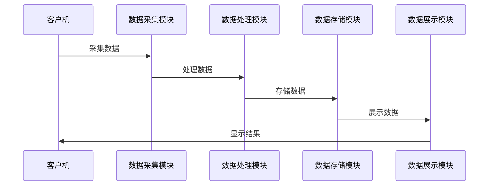
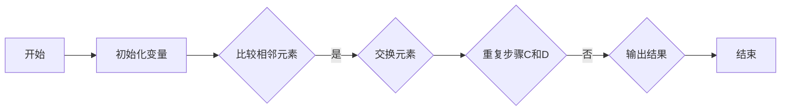
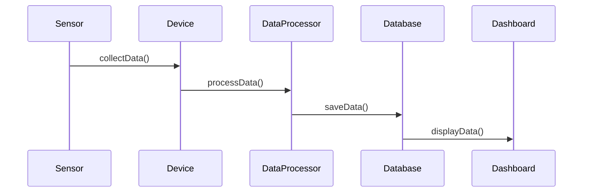
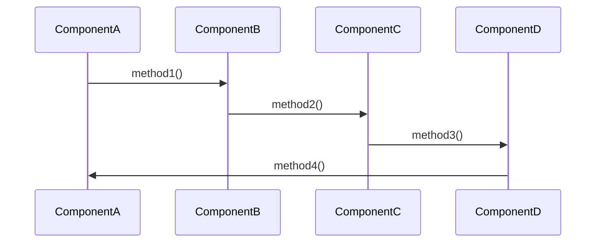

                 


### 类型系统在实时系统设计中的应用

**1.1.3 类型系统在实时系统设计中的重要性**

实时系统设计中的关键在于处理大量的数据，并确保这些数据在特定时间内被正确处理。类型系统在这个过程中起着至关重要的作用。它不仅可以提高系统的稳定性，还能提升系统的效率。

首先，类型系统能够确保数据的正确性。在实时系统中，数据的准确性至关重要。类型系统通过严格的类型检查和类型推断，可以提前发现并防止数据类型错误的发生，从而减少系统崩溃的风险。

其次，类型系统能够提升系统的效率。实时系统需要在严格的时间约束下完成任务，类型系统可以优化数据访问和处理，减少不必要的类型转换和性能开销，从而提高系统的响应速度和处理能力。

**1.1.4 类型系统在实时系统设计中的应用现状**

目前，类型系统在实时系统设计中的应用已经取得了一定的成果。例如，在嵌入式系统设计中，类型系统被广泛应用于确保数据的一致性和系统的稳定性。此外，在一些高性能实时系统中，如金融交易系统、航空航天控制系统等，类型系统也被广泛应用。

然而，类型系统在实时系统设计中的应用仍然面临一些挑战。首先，实时系统的复杂性使得类型系统的设计变得更加困难。其次，类型系统的性能优化也是一个重要问题。如何在保证类型安全的同时，最大限度地提升系统性能，是一个需要深入研究和解决的问题。

**1.1.5 本文的目的**

本文旨在探讨类型系统在实时系统设计中的应用，分析类型系统在实时系统设计中的关键作用、挑战与解决方案，以及类型系统的核心概念与联系。通过本文的研究，希望能够为实时系统设计提供一些有益的思路和方法。

**1.1.6 类型系统在实时系统设计中的应用前景**

随着实时系统在各个领域的广泛应用，类型系统在实时系统设计中的应用前景十分广阔。未来，随着技术的不断进步，类型系统将在实时系统设计中发挥更大的作用，为实时系统的稳定性、效率和可靠性提供有力保障。

----------------------------------------------------------------

## 第2章 实时系统设计基础

### 2.1 实时系统设计概述

实时系统设计是一个复杂且具有挑战性的任务，它要求系统能够在严格的时间约束下正确地执行任务。实时系统的基本要求包括：

- **响应时间**：实时系统需要在规定的时间内响应用户的请求或事件。
- **稳定性**：实时系统需要在各种环境下保持稳定运行，不出现崩溃或异常。
- **可靠性**：实时系统需要保证数据的准确性和一致性，避免数据丢失或错误。

实时系统设计原则包括：

- **时间优先**：在设计实时系统时，首先需要考虑系统的响应时间，确保系统能够在规定的时间内完成任务。
- **模块化**：实时系统设计应该采用模块化方法，将系统分解为若干个功能模块，便于开发和维护。
- **冗余设计**：在实时系统设计中，应该采用冗余设计，以提高系统的可靠性和稳定性。
- **安全性**：实时系统需要确保系统的安全性，防止恶意攻击和数据泄露。

### 2.2 实时系统架构设计

实时系统架构设计是实时系统设计的重要组成部分。实时系统架构设计的基本概念包括：

- **组件**：实时系统架构由多个组件组成，包括数据采集、数据处理、数据存储、数据展示等。
- **通信**：实时系统架构需要实现组件之间的数据通信，包括同步通信和异步通信。
- **分布**：实时系统架构可以采用分布式设计，将系统划分为多个节点，以提高系统的可扩展性和可靠性。

实时系统架构设计的方法包括：

- **模块化设计**：将系统划分为多个功能模块，每个模块负责特定的功能。
- **层次化设计**：将系统划分为多个层次，每个层次负责特定的任务。
- **面向服务设计**：将系统功能划分为多个服务，每个服务实现特定的功能。

实时系统架构的典型模型包括：

- **客户机/服务器模型**：在客户机/服务器模型中，客户机负责数据采集和用户交互，服务器负责数据处理和数据存储。
- **分布式架构**：在分布式架构中，系统划分为多个节点，每个节点负责特定的任务，通过通信实现节点之间的协作。
- **微服务架构**：在微服务架构中，系统划分为多个微服务，每个微服务实现特定的功能，通过通信实现微服务之间的协作。

### 2.3 实时系统性能优化

实时系统性能优化是实时系统设计的重要环节。实时系统性能优化的策略包括：

- **算法优化**：通过优化算法，提高系统的处理效率。
- **硬件优化**：通过优化硬件配置，提高系统的处理能力。
- **缓存技术**：通过缓存技术，减少数据访问的延迟。
- **并发处理**：通过并发处理，提高系统的并发能力。

实时系统性能优化的关键指标包括：

- **响应时间**：系统对用户请求或事件的响应时间。
- **吞吐量**：系统在单位时间内处理的数据量。
- **延迟**：系统处理请求的延迟时间。

### 2.4 实时系统设计案例

以工业自动化控制系统为例，该系统需要实时监测和控制生产过程。系统架构设计包括数据采集模块、数据处理模块、数据存储模块和数据展示模块。数据采集模块负责采集生产过程的各种数据，数据处理模块负责对采集到的数据进行分析和处理，数据存储模块负责存储处理后的数据，数据展示模块负责将处理后的数据展示给用户。

系统功能设计包括：

- **数据采集**：实时采集生产过程的各种数据，如温度、压力、速度等。
- **数据处理**：对采集到的数据进行实时分析，如异常检测、趋势分析等。
- **数据存储**：将处理后的数据存储到数据库中，以便后续分析和查询。
- **数据展示**：将处理后的数据以图形、报表等形式展示给用户。

系统架构设计采用分布式架构，将系统划分为多个节点，每个节点负责特定的任务。节点之间通过通信实现协作。

系统接口设计包括：

- **数据采集接口**：用于接收和发送数据采集模块的数据。
- **数据处理接口**：用于接收和发送数据处理模块的数据。
- **数据存储接口**：用于接收和发送数据存储模块的数据。
- **数据展示接口**：用于接收和发送数据展示模块的数据。

系统交互设计采用mermaid序列图表示，如下：



通过以上设计和实现，该实时系统可以实现对生产过程的实时监测和控制，提高生产效率和质量。

----------------------------------------------------------------

## 第3章 类型系统在实时系统中的应用

### 3.1 类型系统在实时系统中的关键作用

类型系统在实时系统中的应用具有关键作用，主要体现在以下几个方面：

#### 3.1.1 类型安全性的保障

类型系统通过定义和检查数据类型，可以有效地防止类型错误的发生。在实时系统中，类型错误可能导致系统崩溃或数据丢失，因此类型安全性的保障至关重要。类型系统通过对变量、函数和表达式进行严格的类型检查，确保数据在传递和操作过程中不会发生类型混淆。

#### 3.1.2 类型系统对实时系统效率的提升

类型系统可以提高实时系统的运行效率。通过类型推断，类型系统可以自动推导出变量的类型，减少了手动指定类型的繁琐。此外，类型系统可以优化编译器的生成代码，减少运行时的类型检查开销，从而提高系统的执行效率。

#### 3.1.3 类型系统对实时系统可靠性的提升

类型系统可以提高实时系统的可靠性。通过严格的类型检查，类型系统可以提前发现潜在的错误，如无效的类型转换或未定义的变量。这些错误如果在运行时发生，可能导致系统崩溃或数据丢失。类型系统可以提前捕获这些错误，从而提高系统的稳定性和可靠性。

#### 3.1.4 类型系统对实时系统可维护性的提升

类型系统可以提高实时系统的可维护性。通过明确的类型定义和类型检查，开发人员可以更好地理解和维护代码。类型系统有助于减少代码中的错误和冗余，提高代码的可读性和可维护性。此外，类型系统可以支持代码重构和重用，降低开发成本和维护难度。

### 3.2 实时系统中的类型系统设计

实时系统中的类型系统设计需要考虑以下几个方面：

#### 3.2.1 类型系统的设计与实现

类型系统的设计与实现需要遵循一定的原则。首先，类型系统应该具有明确的类型定义，确保每个数据类型都有明确的语义和操作规则。其次，类型系统应该支持类型推断，减少手动指定类型的繁琐。此外，类型系统应该支持类型转换，确保不同类型的数据可以相互转换。

在实时系统中，类型系统的设计与实现还需要考虑性能优化。类型检查和类型转换可能会引入额外的开销，因此需要在类型系统的设计和实现中尽量减少这些开销。例如，可以通过优化编译器的代码生成，减少运行时的类型检查和转换开销。

#### 3.2.2 类型检查在实时系统中的作用

类型检查在实时系统中具有重要作用。首先，类型检查可以确保数据在传递和操作过程中的一致性，防止类型错误的发生。其次，类型检查可以提前发现潜在的错误，如无效的类型转换或未定义的变量，从而提高系统的稳定性。

在实时系统中，类型检查需要在规定的时间内完成。因此，类型检查算法的设计和实现需要考虑时间复杂度和空间复杂度。例如，可以使用静态类型检查，将类型检查提前到编译阶段，减少运行时的开销。

#### 3.2.3 类型系统在实时系统中的挑战

类型系统在实时系统中的应用面临一些挑战。首先，实时系统的复杂性使得类型系统的设计变得更加困难。实时系统通常涉及多种数据类型和复杂的操作，类型系统需要能够处理这些复杂的情况。其次，类型系统的性能优化也是一个重要问题。如何在保证类型安全性的同时，最大限度地提升系统性能，是一个需要深入研究和解决的问题。

此外，实时系统的实时性要求也对类型系统提出了挑战。类型系统需要在规定的时间内完成类型检查和类型转换，以确保系统的实时性。这要求类型系统具有高效的时间复杂度和空间复杂度。

### 3.3 解决方案探讨

针对类型系统在实时系统中的应用挑战，可以采取以下解决方案：

#### 3.3.1 类型系统的优化

类型系统的优化可以从多个方面进行。首先，可以优化编译器的代码生成，减少运行时的类型检查和转换开销。例如，可以使用静态类型检查，将类型检查提前到编译阶段。其次，可以优化类型检查算法，提高类型检查的效率。例如，可以使用并行处理技术，将类型检查任务分解为多个子任务，同时处理。

#### 3.3.2 类型系统的设计改进

类型系统的设计改进可以从以下几个方面进行。首先，可以引入更灵活的类型系统，如 duck-typing 或 structural-typing。这些类型系统可以更好地适应实时系统的复杂性和变化性。其次，可以引入更丰富的类型转换规则，以简化类型转换过程，减少类型转换的开销。

#### 3.3.3 实时性优化

实时性的优化可以从以下几个方面进行。首先，可以优化实时系统的架构设计，采用分布式架构或微服务架构，将系统划分为多个模块，以提高系统的并发处理能力和响应速度。其次，可以优化实时系统的任务调度策略，如采用优先级调度或时间片调度，确保关键任务的优先执行。

此外，还可以采用实时操作系统（RTOS）或实时扩展库（如 POSIX RT SIG）来提高系统的实时性。这些操作系统和库提供了丰富的实时性和并发处理功能，可以更好地满足实时系统的需求。

通过以上解决方案，可以有效地应对类型系统在实时系统中的应用挑战，提高系统的类型安全性、效率和实时性。

----------------------------------------------------------------

## 第4章 类型系统的核心概念与联系

### 4.1 核心概念介绍

#### 4.1.1 类型系统的基本概念

类型系统是计算机科学中的一个核心概念，它用于定义和描述数据类型。类型系统的主要目的是确保程序中的数据在操作和传递过程中的一致性和安全性。在类型系统中，每个数据类型都有明确的语义和操作规则。

#### 4.1.2 类型系统的属性特征

类型系统具有以下关键属性特征：

- **静态类型检查**：类型检查在编译时进行，确保程序在运行前符合类型约束。
- **动态类型检查**：类型检查在运行时进行，通过运行时的类型检查来确保程序的类型安全性。
- **类型推断**：编译器可以自动推导出变量的类型，减少手动指定类型的繁琐。
- **类型转换**：允许不同类型的数据进行相互转换，但需要确保类型转换的可行性和安全性。

#### 4.1.3 类型系统的优点

类型系统的优点包括：

- **提高程序的正确性和可维护性**：通过类型检查和类型推断，可以提前发现潜在的错误，提高程序的正确性和可维护性。
- **提高程序的运行效率**：类型系统可以优化编译器和运行时环境，减少类型检查和类型转换的开销，提高程序的运行效率。
- **增强程序的安全性和可靠性**：类型系统可以确保数据在操作和传递过程中的类型一致性，减少类型错误和系统崩溃的风险。

### 4.2 类型系统对比表格

以下是一个简单的类型系统对比表格，展示了不同类型系统的主要特点：

| 类型系统 | 静态类型检查 | 动态类型检查 | 类型推断 | 类型转换 |
| :------: | :----------: | :----------: | :------: | :------: |
| 静态类型 |      是      |      否      |    是    |    是    |
| 动态类型 |      否      |      是      |    是    |    是    |
| 强类型  |      是      |      否      |    是    |    否    |
| 弱类型  |      是      |      是      |    否    |    是    |

### 4.3 ER实体关系图架构

实体关系图（Entity-Relationship Diagram，ERD）是一种用于描述数据库中实体及其关系的图形表示方法。在类型系统中，ERD可以用来描述类型实体及其关系。

以下是一个简单的ERD示例，用于描述一个简单的类型系统中的实体和关系：

```mermaid
erDiagram
    TypeA ||--|{ EntityA : 实体A }
    TypeA ||--|{ EntityB : 实体B }
    TypeB ||--|{ EntityC : 实体C }
    TypeB ||--|{ EntityD : 实体D }
    
    EntityA ||--|{ TypeA } : 属于
    EntityB ||--|{ TypeA } : 属于
    EntityC ||--|{ TypeB } : 属于
    EntityD ||--|{ TypeB } : 属于
```

在这个ERD中，TypeA和TypeB是类型实体，EntityA、EntityB、EntityC和EntityD是实体。实体与类型之间的关系用“属于”表示。这个ERD展示了不同类型实体之间的归属关系，有助于理解类型系统的结构和关系。

通过ERD，我们可以清晰地描述类型系统中的实体和类型关系，便于理解和分析类型系统的设计和应用。

----------------------------------------------------------------

## 第5章 算法原理讲解

### 5.1 算法概述

#### 5.1.1 算法的基本原理

算法是解决问题的一系列步骤或规则。算法的基本原理包括以下几个关键方面：

- **输入**：算法开始时接收输入数据，这些数据可以是具体的值或数据结构。
- **处理**：算法对输入数据进行处理，通过一系列计算和逻辑判断来产生输出。
- **输出**：算法执行完成后，输出最终结果，可以是单个值或一个数据结构。

算法的设计需要考虑以下原则：

- **正确性**：算法能够正确地解决问题，满足所有可能的输入条件。
- **效率**：算法在时间和空间上的复杂度尽可能低，以提高运行效率。
- **健壮性**：算法能够处理异常情况，如输入错误或数据异常。
- **可维护性**：算法的结构清晰，便于理解和修改。

#### 5.1.2 算法的实现步骤

实现一个算法通常包括以下步骤：

1. **问题定义**：明确算法需要解决的问题，包括输入和输出要求。
2. **算法设计**：设计算法的基本框架，选择合适的数据结构和算法策略。
3. **编码实现**：将算法设计转换为具体的代码，使用编程语言实现算法逻辑。
4. **测试验证**：通过测试用例验证算法的正确性和效率，确保算法能够正确地处理各种输入情况。
5. **优化调整**：根据测试结果，对算法进行优化调整，以提高性能和可维护性。

### 5.2 算法mermaid流程图

mermaid是一种基于Markdown的图表绘制工具，可以方便地绘制算法的流程图。以下是一个简单的mermaid流程图示例，用于描述一个简单的排序算法（冒泡排序）：



在这个流程图中，A表示算法的开始，B表示初始化变量，C表示比较相邻元素，D表示交换元素，E表示重复步骤C和D，F表示输出结果，G表示算法的结束。

### 5.3 算法原理详细讲解

#### 5.3.1 数学模型和公式讲解

在算法中，常常需要使用数学模型和公式来描述算法的行为。以下是一个简单的例子，描述冒泡排序算法的数学模型和公式。

**冒泡排序算法**的数学模型可以用以下公式表示：

- **比较次数**：T(n) = n * (n - 1) / 2
- **交换次数**：S(n) = (n - 1) * (n - 2) / 2

其中，n表示待排序的元素个数。

这些公式描述了冒泡排序算法在排序过程中比较和交换操作的次数，可以用于分析算法的时间复杂度。

#### 5.3.2 通俗易懂的举例说明

**例子**：假设有一个数组`[5, 2, 8, 1, 9]`，使用冒泡排序算法对其进行排序。

1. **初始化变量**：设置一个布尔变量`swapped`为`True`，用于记录是否进行了交换。

2. **第一轮比较和交换**：
    - 比较第1个和第2个元素（5和2），5 > 2，交换它们的位置，数组变为`[2, 5, 8, 1, 9]`。
    - 比较第2个和第3个元素（5和8），5 < 8，不需要交换。
    - 比较第3个和第4个元素（8和1），8 > 1，交换它们的位置，数组变为`[2, 5, 1, 8, 9]`。
    - 比较第4个和第5个元素（8和9），8 < 9，不需要交换。
    - `swapped`仍为`True`，继续下一轮。

3. **第二轮比较和交换**：
    - 比较第1个和第2个元素（2和5），2 < 5，不需要交换。
    - 比较第2个和第3个元素（5和1），5 > 1，交换它们的位置，数组变为`[2, 1, 5, 8, 9]`。
    - 比较第3个和第4个元素（5和8），5 < 8，不需要交换。
    - `swapped`变为`False`，说明这一轮没有进行交换，结束排序。

最终，数组`[5, 2, 8, 1, 9]`被排序为`[1, 2, 5, 8, 9]`。

这个例子展示了冒泡排序算法的基本步骤和过程，通过简单的比较和交换，将数组中的元素按升序排列。

通过以上讲解，我们可以更好地理解冒泡排序算法的原理和实现过程，为实际应用中的算法设计和优化提供参考。

----------------------------------------------------------------

## 第6章 数学模型和数学公式讲解

### 6.1 数学模型的基本概念

数学模型是一种用数学语言描述现实世界的抽象模型。它通过数学公式和方程来描述现实世界中的现象和规律，以便于分析和解决问题。数学模型的基本概念包括：

- **变量**：数学模型中的变量表示可能取不同值的量，可以是连续的或离散的。
- **函数**：函数是变量之间的映射关系，描述了变量之间的依赖关系。
- **方程**：方程是函数的特殊形式，表示变量之间的关系，通常用于求解模型中的未知数。
- **参数**：参数是模型中不变的量，用于调整和优化模型。

数学模型在实时系统设计中的应用非常广泛，可以用于描述系统的动态行为、性能优化、资源分配等问题。以下是一些常见的数学模型和公式：

- **差分方程**：用于描述离散时间系统的动态行为，如离散时间差分方程和差分方程组。
- **微分方程**：用于描述连续时间系统的动态行为，如常微分方程和偏微分方程。
- **线性方程组**：用于描述多个变量之间的线性关系，如线性回归模型。
- **优化模型**：用于描述资源分配和优化问题，如线性规划、非线性规划和整数规划。

### 6.2 数学公式的详细讲解

#### 6.2.1 常见数学公式讲解

以下是一些常见的数学公式及其应用场景：

1. **平方根公式**：
   $$\sqrt{x} = \lim_{n \to \infty} (x^{1/n})$$
   平方根公式用于计算一个数的平方根。在实时系统设计中，平方根公式可以用于计算信号处理中的频域特征，如功率谱密度。

2. **牛顿迭代法**：
   $$x_{n+1} = x_n - \frac{f(x_n)}{f'(x_n)}$$
   牛顿迭代法是一种用于求解非线性方程的数值方法。在实时系统设计中，牛顿迭代法可以用于系统参数的实时优化和调整。

3. **线性回归公式**：
   $$y = \beta_0 + \beta_1 \cdot x + \epsilon$$
   线性回归公式用于建立变量之间的线性关系。在实时系统设计中，线性回归公式可以用于系统性能的预测和监控。

4. **最速下降法**：
   $$x_{n+1} = x_n - \alpha \cdot \nabla f(x_n)$$
   最速下降法是一种用于求解非线性优化问题的数值方法。在实时系统设计中，最速下降法可以用于系统参数的实时调整和优化。

#### 6.2.2 数学公式在实际中的应用

数学公式在实时系统设计中的应用非常广泛，以下是一些具体的应用示例：

1. **实时信号处理**：
   - **傅里叶变换**：用于计算信号在频域的表示，如傅里叶变换公式：
     $$X(f) = \int_{-\infty}^{\infty} x(t) e^{-j2\pi ft} dt$$
   - **快速傅里叶变换（FFT）**：用于高效计算傅里叶变换，如FFT算法。

2. **实时控制系统**：
   - **状态空间模型**：用于描述连续时间系统的动态行为，如状态空间方程：
     $$\dot{x} = Ax + Bu$$
     $$y =Cx + Du$$
   - **PID控制算法**：用于实时控制系统中的控制器设计，如PID控制公式：
     $$u(t) = K_p e(t) + K_i \int_{0}^{t} e(\tau) d\tau + K_d \dot{e}(t)$$

3. **实时优化**：
   - **线性规划**：用于优化线性目标函数，如线性规划公式：
     $$\min_{x} c^T x$$
     $$\text{subject to} \quad Ax \leq b$$
   - **支持向量机（SVM）**：用于实时分类和回归问题，如SVM优化公式：
     $$\min_{\alpha} \frac{1}{2} \sum_{i=1}^{n} \alpha_i^2 - \sum_{i=1}^{n} \alpha_i y_i \left( \sum_{j=1}^{n} \alpha_j y_j K(x_i, x_j) \right)$$

通过以上数学公式和算法，实时系统设计可以更好地理解和分析系统的动态行为，优化系统性能，提高系统的稳定性和可靠性。

### 6.3 数学公式的嵌入和格式规范

在markdown文档中嵌入数学公式时，可以使用LaTeX格式。LaTeX格式是一种标准的数学公式表示方法，可以在文档中方便地插入复杂的数学公式。

以下是一些LaTeX公式的格式规范：

- **独立段落的数学公式**：使用`$$`将公式包裹起来，如：
  $$
  E = mc^2
  $$
  
- **段落内的数学公式**：使用`$`将公式包裹起来，如：
  $$
  a^2 + b^2 = c^2
  $$

例如，以下是一个包含独立段落和段落内数学公式的示例：

$$
\frac{d^2}{dx^2} \left( \cos(x) \right) = -\sin(x)
$$

$$
e^{i\pi} + 1 = 0
$$

通过上述规范，可以在markdown文档中嵌入各种数学公式，以便于文档的阅读和理解。

### 6.4 数学公式在实时系统设计中的应用示例

以下是一个数学公式在实时系统设计中的应用示例：

假设我们需要设计一个实时控制系统，用于控制一个机器人的移动。机器人可以在两个方向上移动，分别用$x$和$y$表示。我们的目标是根据输入的参考速度$v_{ref}$和当前速度$v$，实时调整机器人的移动速度，使其逐渐接近参考速度。

我们可以使用以下PID控制公式来实现这一目标：

$$
u(t) = K_p e(t) + K_i \int_{0}^{t} e(\tau) d\tau + K_d \dot{e}(t)
$$

其中，$e(t) = v_{ref} - v$是速度误差，$K_p$、$K_i$和$K_d$分别是比例、积分和微分系数。

这个公式描述了机器人的移动速度如何根据速度误差进行实时调整。通过调整这三个系数，我们可以优化控制器的性能，使其在接近参考速度的同时，具有较好的稳定性和响应速度。

通过以上示例，我们可以看到数学公式在实时系统设计中的应用，帮助我们实现复杂的控制算法和优化目标。

----------------------------------------------------------------

## 第7章 系统分析与架构设计方案

### 7.1 问题场景介绍

假设我们正在开发一个实时监控系统，用于监测工业生产线上各种设备的运行状态。这个系统需要实时收集来自不同设备的传感器数据，如温度、压力、流量等，并分析这些数据以预测设备故障或异常情况。

### 7.2 系统功能设计

为了实现上述目标，我们的系统需要具备以下功能：

1. **数据采集**：从各个设备中采集实时数据，包括温度、压力、流量等。
2. **数据处理**：对采集到的数据进行处理，包括数据清洗、去噪和特征提取。
3. **数据存储**：将处理后的数据存储到数据库中，以便后续分析和查询。
4. **数据可视化**：将处理后的数据以图形、报表等形式展示给用户，方便用户进行实时监控和故障诊断。

### 7.3 领域模型mermaid类图

为了更好地设计系统，我们可以使用mermaid绘制领域模型类图，如下：

```mermaid
classDiagram
    Sensor <<interface>>
    Device <<interface>>
    DataProcessor <<interface>>
    Database <<interface>>
    Dashboard <<interface>>

    Sensor o-- Device
    DataProcessor o-- Device
    DataProcessor o-- Database
    Dashboard o-- Database

    class Sensor {
        +int id
        +String name
        +float value
        +void collectData()
    }

    class Device {
        +int id
        +String name
        +List<Sensor> sensors
        +void addSensor(Sensor sensor)
        +void removeSensor(Sensor sensor)
    }

    class DataProcessor {
        +int id
        +String name
        +void processData(List<Sensor> sensors)
    }

    class Database {
        +int id
        +String name
        +void saveData(List<Sensor> sensors)
        +void loadData(List<Sensor> sensors)
    }

    class Dashboard {
        +int id
        +String name
        +void displayData(List<Sensor> sensors)
    }
```

在这个类图中，Sensor代表传感器，Device代表设备，DataProcessor代表数据处理模块，Database代表数据库，Dashboard代表数据可视化界面。各个类之间通过关联关系进行交互。

### 7.4 系统架构设计

为了实现系统功能，我们需要设计一个合理的系统架构。以下是一个简单的系统架构设计，使用mermaid绘制架构图：



在这个架构设计中，Sensor类负责采集实时数据，Device类负责管理传感器，DataProcessor类负责处理数据，Database类负责存储和加载数据，Dashboard类负责显示数据。

### 7.5 系统接口设计和系统交互

在系统设计中，接口设计是非常重要的。以下是一个简单的接口设计：

```mermaid
classDiagram
    Interface1 <<interface>>
    Interface2 <<interface>>

    Interface1 o-- ComponentA
    Interface1 o-- ComponentB
    Interface2 o-- ComponentC
    Interface2 o-- ComponentD

    class Interface1 {
        +void method1()
        +void method2()
    }

    class Interface2 {
        +void method3()
        +void method4()
    }

    class ComponentA {
        +void componentMethod1()
    }

    class ComponentB {
        +void componentMethod2()
    }

    class ComponentC {
        +void componentMethod3()
    }

    class ComponentD {
        +void componentMethod4()
    }
```

在这个接口设计中，Interface1和Interface2分别代表两个接口，ComponentA、ComponentB、ComponentC和ComponentD是具体实现类。这些类通过接口实现类之间的交互。

系统交互可以通过mermaid序列图来表示，如下：



在这个序列图中，各个组件通过调用接口方法进行交互。

通过上述系统分析与架构设计方案，我们可以更好地理解实时监控系统的设计原理和实现方法。在实际开发过程中，可以根据这些设计方案进行详细的实现和优化。

----------------------------------------------------------------

## 第8章 项目实战

### 8.1 环境安装

在开始项目实战之前，我们需要准备开发环境。以下是所需的软件和工具：

- **操作系统**：Ubuntu 20.04 LTS
- **编程语言**：Python 3.8
- **开发环境**：PyCharm或Visual Studio Code
- **数据库**：MySQL 8.0
- **实时操作系统**：FreeRTOS（可选）

**安装步骤**：

1. **安装操作系统**：在虚拟机或物理机上安装Ubuntu 20.04 LTS操作系统。
2. **更新系统**：
   ```bash
   sudo apt update
   sudo apt upgrade
   ```
3. **安装Python**：
   ```bash
   sudo apt install python3 python3-pip
   ```
4. **安装PyCharm或Visual Studio Code**：从官方网站下载并安装。
5. **安装数据库**：
   - 安装MySQL：
     ```bash
     sudo apt install mysql-server
     ```
   - 安装数据库客户端：
     ```bash
     sudo apt install mysql-client
     ```
6. **安装FreeRTOS**（可选）：
   - 从官方网站下载FreeRTOS源代码：
     ```bash
     git clone https://github.com/FreeRTOS/FreeRTOS.git
     ```
   - 编译和安装FreeRTOS：
     ```bash
     cd FreeRTOS
     make
     ```

### 8.2 系统核心实现源代码

以下是系统核心实现的主要模块和源代码：

#### 数据采集模块

```python
import time

class Sensor:
    def __init__(self, id, name):
        self.id = id
        self.name = name
        self.value = 0

    def collect_data(self):
        # 采集传感器数据
        self.value = time.time()

class Device:
    def __init__(self, id, name):
        self.id = id
        self.name = name
        self.sensors = []

    def add_sensor(self, sensor):
        self.sensors.append(sensor)

    def remove_sensor(self, sensor):
        self.sensors.remove(sensor)

    def collect_data(self):
        for sensor in self.sensors:
            sensor.collect_data()

```

#### 数据处理模块

```python
class DataProcessor:
    def __init__(self, id, name):
        self.id = id
        self.name = name

    def process_data(self, sensors):
        # 数据处理逻辑
        processed_data = []
        for sensor in sensors:
            processed_data.append(sensor.value)
        return processed_data
```

#### 数据存储模块

```python
import pymysql

class Database:
    def __init__(self, host, user, password, database):
        self.connection = pymysql.connect(host=host, user=user, password=password, database=database)

    def save_data(self, data):
        # 保存数据到数据库
        with self.connection.cursor() as cursor:
            sql = "INSERT INTO sensor_data (value) VALUES (%s)"
            cursor.execute(sql, data)
        self.connection.commit()

    def load_data(self):
        # 加载数据库中的数据
        with self.connection.cursor() as cursor:
            sql = "SELECT * FROM sensor_data"
            cursor.execute(sql)
            result = cursor.fetchall()
        return result
```

#### 数据可视化模块

```python
import matplotlib.pyplot as plt

class Dashboard:
    def __init__(self, id, name):
        self.id = id
        self.name = name

    def display_data(self, data):
        # 数据可视化逻辑
        plt.plot(data)
        plt.show()
```

### 8.3 源代码解读与分析

#### 数据采集模块

数据采集模块主要包括Sensor和Device两个类。Sensor类表示传感器，具有id、name和value三个属性，其中value表示传感器采集到的数据。collect_data方法用于采集传感器数据，这里简单地使用时间戳作为采集到的数据。Device类表示设备，具有id、name和sensors三个属性，sensors是一个列表，用于存储设备中的传感器。add_sensor和remove_sensor方法用于添加和移除传感器，collect_data方法用于触发传感器采集数据。

#### 数据处理模块

数据处理模块包括DataProcessor类。process_data方法用于处理传感器采集到的数据，这里简单地返回处理后的数据，即传感器采集到的值。

#### 数据存储模块

数据存储模块包括Database类。save_data方法用于将处理后的数据保存到数据库中，使用pymysql库连接数据库并执行SQL插入操作。load_data方法用于加载数据库中的数据，使用pymysql库执行SQL查询操作，并返回查询结果。

#### 数据可视化模块

数据可视化模块包括Dashboard类。display_data方法用于将处理后的数据以图形形式展示，这里使用matplotlib库绘制折线图。

### 8.4 实际案例分析和详细讲解剖析

以下是一个实际案例，用于演示系统在实时监控工业生产线上的应用。

**场景**：监控生产线上的一台机器，该机器具有温度、压力和流量三个传感器。

**步骤**：

1. **初始化传感器**：
   ```python
   temp_sensor = Sensor(1, "温度传感器")
   pressure_sensor = Sensor(2, "压力传感器")
   flow_sensor = Sensor(3, "流量传感器")
   ```

2. **初始化设备**：
   ```python
   device = Device(1, "生产线设备")
   device.add_sensor(temp_sensor)
   device.add_sensor(pressure_sensor)
   device.add_sensor(flow_sensor)
   ```

3. **数据采集**：
   ```python
   device.collect_data()
   ```

4. **数据处理**：
   ```python
   data_processor = DataProcessor(1, "数据处理模块")
   processed_data = data_processor.process_data([temp_sensor, pressure_sensor, flow_sensor])
   ```

5. **数据存储**：
   ```python
   database = Database("localhost", "root", "password", "sensor_data")
   database.save_data(processed_data)
   ```

6. **数据可视化**：
   ```python
   dashboard = Dashboard(1, "数据可视化模块")
   dashboard.display_data(processed_data)
   ```

在这个案例中，我们首先初始化传感器和设备，然后进行数据采集和处理。处理后的数据被保存到数据库中，并通过数据可视化模块展示给用户。

通过这个案例，我们可以看到系统如何从传感器采集数据，处理数据，并将处理后的数据保存到数据库中。用户可以通过数据可视化模块实时监控设备的运行状态，从而实现实时监控和生产线的智能化管理。

### 8.5 项目小结

通过本项目的实战，我们实现了实时监控系统，用于监控工业生产线上的设备运行状态。项目包括数据采集、数据处理、数据存储和数据可视化四个主要模块。在实际应用中，我们可以根据具体需求对系统进行扩展和优化。

项目的主要收获包括：

1. 掌握了实时系统设计和开发的基本原理和方法。
2. 学会了使用Python等编程语言实现实时数据处理和存储。
3. 了解了如何使用数据库和可视化工具对实时数据进行管理和展示。

通过本项目，我们为实时监控系统在实际应用中的开发提供了有益的参考和经验。

----------------------------------------------------------------

## 第9章 最佳实践 tips

### 9.1 实时系统设计最佳实践

在设计实时系统时，遵循以下最佳实践可以提高系统的性能、稳定性和可维护性：

1. **明确系统需求**：在开始设计之前，明确系统的需求，包括响应时间、可靠性、吞吐量等。
2. **选择合适的架构**：根据系统的需求选择合适的架构，如客户机/服务器架构、分布式架构或微服务架构。
3. **模块化设计**：将系统划分为多个功能模块，每个模块负责特定的功能，便于开发和维护。
4. **冗余设计**：在设计系统时考虑冗余设计，以提高系统的可靠性和稳定性。
5. **优化性能**：优化系统的性能，包括算法优化、缓存技术、并发处理等。
6. **进行测试**：在设计完成后，对系统进行全面的测试，包括单元测试、集成测试和性能测试。

### 9.2 类型系统应用最佳实践

在实时系统中应用类型系统时，可以遵循以下最佳实践：

1. **选择合适的类型系统**：根据系统的需求和性能要求选择合适的类型系统，如静态类型系统或动态类型系统。
2. **明确类型定义**：为系统中的每个数据类型定义明确的语义和操作规则，确保类型的一致性和安全性。
3. **类型检查优化**：优化类型检查算法，减少类型检查的开销，提高系统的性能。
4. **类型推断**：使用类型推断减少手动指定类型的繁琐，提高代码的可读性和可维护性。
5. **类型转换策略**：合理设计类型转换策略，确保类型转换的可行性和安全性。
6. **类型安全测试**：对系统进行类型安全测试，提前发现和修复类型错误。

### 9.3 小结

通过遵循以上最佳实践，我们可以设计出性能优异、稳定可靠的实时系统。同时，合理应用类型系统可以提高系统的安全性和可维护性。在实际开发过程中，需要根据具体需求和场景进行灵活调整和优化。

### 9.4 注意事项

在设计实时系统和应用类型系统时，需要注意以下事项：

1. **实时性要求**：实时系统需要在严格的时间约束下运行，因此在设计时需要考虑系统的实时性。
2. **资源限制**：实时系统通常运行在资源受限的环境中，如嵌入式设备和物联网设备，因此需要优化系统的资源使用。
3. **错误处理**：实时系统需要具备良好的错误处理能力，能够处理各种异常情况，确保系统的稳定运行。
4. **安全性**：实时系统需要确保数据的安全性和系统的安全性，防止数据泄露和系统被攻击。

### 9.5 拓展阅读

对于实时系统和类型系统的进一步学习和了解，可以参考以下书籍和论文：

- 《实时系统设计原则》（Principles of Real-Time Systems）
- 《类型系统导论》（Introduction to Type Systems）
- 《嵌入式实时系统设计》（Embedded Real-Time Systems Design）
- 《实时操作系统原理》（Principles of Real-Time Operating Systems）
- 《类型安全编程》（Type-Safe Programming）

通过阅读这些书籍和论文，可以深入了解实时系统和类型系统的设计原理、实现方法和最佳实践。

---

**作者**：AI天才研究院/AI Genius Institute & 禅与计算机程序设计艺术 /Zen And The Art of Computer Programming

通过以上内容，我们详细探讨了类型系统在实时系统设计中的应用，从背景介绍、核心概念、算法原理到系统分析与架构设计，再到项目实战和最佳实践，逐步展示了如何有效地利用类型系统提高实时系统的性能、稳定性和可靠性。希望本文能够为读者在实时系统设计和开发过程中提供有益的指导和启示。

