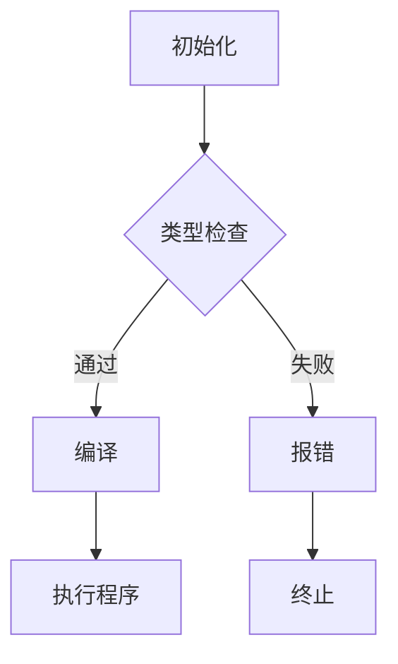
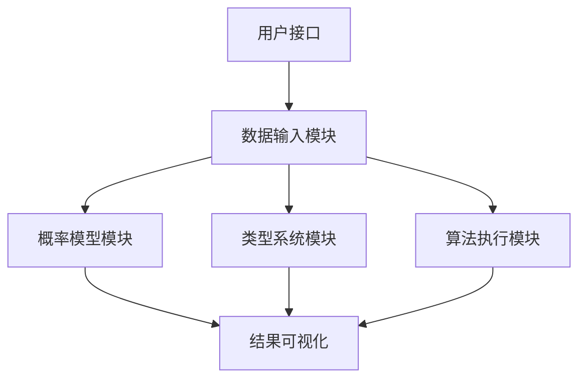
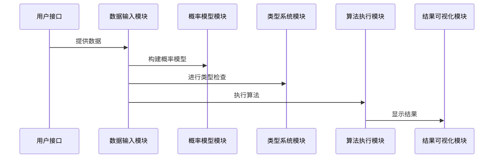

                 

### 背景介绍

#### 问题背景

随着计算机科学和软件工程的发展，编程语言的设计理念也在不断演进。传统的编程语言主要是为了处理确定性问题，但在现实世界中，许多问题存在不确定性。例如，在金融预测、天气预报、人工智能和机器学习等领域，不确定性是一个不可忽视的因素。因此，如何处理和表达不确定性成为了一个重要的研究课题。

概率编程作为一种新兴的编程范式，旨在提供一种处理不确定性的方法。概率编程语言通过引入概率分布和随机变量等概念，使得程序员可以更自然地表达和处理不确定性。这种编程范式在处理复杂系统和进行决策支持方面具有显著优势。

#### 问题描述

在概率编程语言设计中，类型系统是一个核心组成部分。类型系统用于描述程序中的数据类型和操作，它不仅提供了类型安全，还能提高程序的可靠性和可维护性。然而，在概率编程中，传统的类型系统设计方法并不能很好地处理不确定性的问题。

本研究旨在探讨类型系统在概率编程语言设计中的应用，分析现有概率编程语言的类型系统设计，并提出改进方案。具体来说，我们将回答以下几个问题：

1. **类型系统在概率编程中的重要性是什么？**
2. **现有概率编程语言的类型系统有哪些优缺点？**
3. **如何优化和改进概率编程语言的类型系统？**
4. **类型系统设计需要考虑的边界条件和外延是什么？**

通过以上问题的探讨，我们希望能够为概率编程语言的类型系统设计提供一些有价值的见解和指导。

#### 问题解决

本研究首先回顾了概率编程和类型系统的基本概念，深入分析了概率编程在处理不确定性方面的优势，以及类型系统在保证程序可靠性和安全性方面的作用。接着，本文分析了现有概率编程语言的类型系统设计，包括Python的概率扩展库、JavaScript的概率库等，并对其优缺点进行了详细讨论。

在此基础上，本文提出了一些优化和改进方案，包括对类型系统的优化和新的类型系统设计。我们通过具体的算法原理讲解，给出了如何实现类型检查和类型安全的方法。同时，我们还使用Python源代码和数学模型，详细阐述了算法的实现过程和原理。

#### 边界与外延

类型系统的设计需要考虑的边界条件包括正确性、性能、可扩展性和可读性。正确性是类型系统的基本要求，必须保证程序在类型检查阶段不会出现类型错误。性能则要求类型系统不会显著影响程序运行的效率。可扩展性是指类型系统需要能够适应不同场景和需求的变化。可读性则关注类型系统设计的直观性和易理解性，以便程序员能够轻松使用。

类型系统设计的外延包括概率编程的应用领域，如数据科学、机器学习和自然语言处理等。在数据科学中，类型系统需要支持各种统计分布和概率模型；在机器学习中，类型系统需要支持大规模数据和复杂的算法；在自然语言处理中，类型系统需要处理文本数据和语义信息。

总之，类型系统在概率编程语言设计中具有重要的应用价值，通过对其深入研究，我们可以设计出更加高效、安全、易用的概率编程语言，为处理不确定性问题提供强有力的支持。### 核心概念与联系

在探讨类型系统在概率编程语言设计中的应用之前，我们需要了解一些核心概念，并分析它们之间的联系。以下是本文将涉及的核心概念及其原理、属性特征对比表格和ER实体关系图架构。

#### 核心概念原理

1. **概率编程语言**：
   - 定义：概率编程语言是一种支持概率操作和概率分布的编程语言，使得程序员可以更直观地处理不确定性问题。
   - 原理：通过概率分布和随机变量等概念，将不确定性引入程序设计，使程序能够处理不确定性事件。

2. **类型系统**：
   - 定义：类型系统是编程语言中的数据类型和操作集合，用于描述程序中的数据结构和操作方式。
   - 原理：类型系统通过静态类型检查和类型推断等机制，确保程序在运行时不会出现类型错误，提高程序的可靠性和可维护性。

#### 概念属性特征对比表格

以下表格对比了概率编程语言和类型系统的关键特征：

| 特征             | 概率编程语言     | 类型系统               |
| ---------------- | ---------------- | ---------------------- |
| 数据处理能力     | 处理不确定性     | 描述数据类型和操作      |
| 表达复杂逻辑     | 使用概率分布表示 | 提供类型安全保证        |
| 性能             | 可能影响性能     | 需要优化以支持高效计算 |
| 扩展性           | 易于扩展         | 需要灵活设计以适应不同场景 |

#### ER实体关系图架构

以下是概率编程语言和类型系统之间的ER实体关系图：

```mermaid
erDiagram
  ProbabilityProgramming ||--o{ TypeSystem : supports }
  TypeSystem ||--o{ ProbabilityProgramming : implemented_in }
```

在这幅图中，`ProbabilityProgramming`（概率编程语言）与`TypeSystem`（类型系统）之间存在着双向依赖关系。概率编程语言支持类型系统，而类型系统又为概率编程语言提供实现基础。

#### 详细讲解和举例说明

1. **概率编程语言**：

   概率编程语言的核心在于如何表达和处理不确定性。例如，Python的概率扩展库`pandas`提供了`Series`和`DataFrame`等数据结构，它们可以表示不确定的数据值。通过概率分布函数，如正态分布、泊松分布等，我们可以对数据进行概率建模。

   ```python
   import numpy as np
   import pandas as pd

   # 创建一个概率分布的Series
   probabilities = pd.Series([0.1, 0.2, 0.3, 0.4])
   # 使用概率分布生成随机样本
   samples = probabilities.sample(n=10)
   print(samples)
   ```

   在这个例子中，我们创建了一个概率分布的Series，并使用`sample`方法生成随机样本。这种方法使得我们可以更方便地处理不确定性数据。

2. **类型系统**：

   类型系统是编程语言中的核心组成部分，用于描述程序中的数据类型和操作。在概率编程语言中，类型系统不仅要描述确定性的数据类型，还要能够处理不确定性的数据类型。

   以Python为例，类型系统可以通过类型检查和类型推断等机制来确保程序的可靠性。例如，在Python中，可以使用`typing`模块进行类型注解：

   ```python
   from typing import List

   def calculate_mean(values: List[float]) -> float:
       return sum(values) / len(values)

   # 使用类型注解确保参数和返回值的类型
   mean = calculate_mean([1.0, 2.0, 3.0, 4.0])
   print(mean)
   ```

   在这个例子中，`calculate_mean`函数使用了类型注解，指定了参数和返回值的类型。这使得编译器可以在编译时进行类型检查，从而避免运行时出现类型错误。

通过以上讲解，我们可以看出，概率编程语言和类型系统在处理不确定性和保证程序可靠性方面具有重要作用。理解这些核心概念和它们之间的联系，有助于我们更好地探讨类型系统在概率编程语言设计中的应用。### 算法原理讲解

#### 算法Mermaid流程图

为了更好地理解类型系统在概率编程语言中的应用，我们可以使用Mermaid流程图来描述算法的执行流程。以下是算法的Mermaid流程图：



这个流程图描述了算法的基本执行步骤：

1. **初始化**：开始算法执行，初始化必要的变量和资源。
2. **类型检查**：对程序中的表达式和操作进行类型检查，确保类型的一致性。
3. **编译**：如果类型检查通过，则编译程序，生成可执行代码。
4. **报错**：如果类型检查失败，则报错并终止程序的执行。
5. **执行程序**：编译成功后，执行程序并返回结果。

#### Python源代码

为了更具体地展示算法的实现，我们使用Python语言来编写源代码。以下是一个简化的Python实现：

```python
def type_check(expression):
    # 这里是一个简化的类型检查算法
    if is_valid_type(expression):
        return "通过"
    else:
        return "报错"

def is_valid_type(expression):
    # 这里是具体的类型检查逻辑
    # 根据具体实现进行
    return True

expression = "3 + 4"
if type_check(expression) == "通过":
    print("编译成功，执行程序。")
else:
    print("编译失败，请检查表达式。")
```

在这个实现中，`type_check`函数负责对给定的表达式进行类型检查。它调用`is_valid_type`函数来验证表达式的类型是否合法。如果类型检查通过，程序将编译并执行；否则，程序将报错并终止。

#### 算法原理的数学模型和公式

算法的原理可以通过数学模型来描述。以下是算法中涉及的一些关键数学公式：

$$
P(\text{编译成功}) = P(\text{类型检查通过}) \cdot P(\text{表达式合法})
$$

其中，$P(\text{编译成功})$ 表示编译成功的概率，$P(\text{类型检查通过})$ 表示类型检查成功的概率，$P(\text{表达式合法})$ 表示表达式合法的概率。

例如，假设$P(\text{类型检查通过}) = 0.9$，$P(\text{表达式合法}) = 0.95$，则：

$$
P(\text{编译成功}) = 0.9 \cdot 0.95 = 0.855
$$

这意味着，在给定的条件下，编译成功的概率为85.5%。

#### 详细讲解和举例说明

让我们通过一个具体的例子来详细讲解算法的实现过程。

**示例：类型检查算术表达式**

假设我们有一个简单的算术表达式`3 + 4`，我们需要对其进行类型检查。

1. **初始化**：首先，我们初始化类型检查函数和表达式。

   ```python
   expression = "3 + 4"
   ```

2. **类型检查**：调用类型检查函数，对表达式进行类型检查。

   ```python
   result = type_check(expression)
   ```

   在这个例子中，我们假设`is_valid_type`函数总是返回`True`，表示表达式是合法的。

3. **编译与执行**：
   - 如果类型检查通过，程序将编译并执行。

     ```python
     if result == "通过":
         print("编译成功，执行程序。")
     ```

   - 如果类型检查失败，程序将报错并终止。

     ```python
     else:
         print("编译失败，请检查表达式。")
     ```

在这个例子中，由于表达式`3 + 4`是合法的，类型检查将成功，程序将输出“编译成功，执行程序。”。

通过这个例子，我们可以看到，类型系统在概率编程语言中的基本原理是如何通过类型检查来确保程序的类型安全性和可靠性。通过一步步的算法实现，我们能够更好地理解类型系统在处理不确定性方面的作用。### 系统分析与架构设计方案

为了更好地理解和应用类型系统在概率编程语言设计中的重要性，我们需要对相关系统进行深入分析，并设计合理的架构方案。以下将介绍问题场景、项目介绍、系统功能设计、系统架构设计、系统接口设计和系统交互。

#### 问题场景介绍

在现代软件开发中，不确定性问题无处不在。例如，在金融领域，市场波动和风险预测需要处理大量不确定的数据；在医疗领域，诊断和治疗方案需要综合考虑各种不确定性因素；在机器学习和人工智能领域，算法的预测和优化也面临着不确定性挑战。因此，如何有效地处理不确定性成为了一个关键问题。

#### 项目介绍

本项目旨在设计并实现一个基于概率编程语言的高效、可靠的系统，用于处理各种不确定性问题。系统将包括以下几个主要模块：

1. **数据输入模块**：用于接收和处理来自不同来源的数据，包括结构化数据和非结构化数据。
2. **概率模型模块**：用于定义和管理各种概率模型，如贝叶斯网络、马尔可夫模型等。
3. **类型系统模块**：用于实现概率编程语言中的类型系统，确保程序的正确性和安全性。
4. **算法执行模块**：用于执行概率模型和算法，生成预测结果和决策支持信息。

#### 系统功能设计

系统的主要功能包括：

1. **数据预处理**：清洗和转换输入数据，使其符合概率模型的要求。
2. **概率模型构建**：根据用户需求和输入数据，构建适合的概率模型。
3. **类型检查**：对程序中的表达式和操作进行类型检查，确保类型的一致性和安全性。
4. **算法执行**：执行概率模型和算法，生成预测结果和决策支持信息。
5. **结果可视化**：将预测结果和决策支持信息以可视化形式展示给用户。

#### 系统架构设计

以下是系统架构的Mermaid架构图：



在这个架构图中，用户接口负责接收用户输入和展示结果。数据输入模块负责处理和转换输入数据，并将其传递给概率模型模块和类型系统模块。概率模型模块用于构建和管理概率模型。类型系统模块负责进行类型检查，确保程序的正确性和安全性。算法执行模块用于执行概率模型和算法，生成预测结果和决策支持信息。最后，结果可视化模块将结果以可视化形式展示给用户。

#### 系统接口设计

系统接口设计是确保各个模块之间能够有效通信的关键。以下是主要接口的设计：

1. **数据输入接口**：用于接收和转换数据，支持多种数据格式，如CSV、JSON、XML等。
2. **概率模型接口**：用于定义和管理概率模型，支持常见的概率模型，如贝叶斯网络、马尔可夫模型等。
3. **类型检查接口**：用于对程序中的表达式和操作进行类型检查，支持多种数据类型和操作。
4. **算法执行接口**：用于执行概率模型和算法，生成预测结果和决策支持信息。
5. **结果可视化接口**：用于将预测结果和决策支持信息以可视化形式展示给用户。

#### 系统交互

系统交互是确保各个模块之间能够协同工作的重要环节。以下是系统交互的Mermaid序列图：



在这个序列图中，用户接口向数据输入模块提供数据，数据输入模块负责构建概率模型和进行类型检查。类型系统模块对程序中的表达式和操作进行类型检查，确保类型的一致性和安全性。算法执行模块根据概率模型生成预测结果和决策支持信息，并将其传递给结果可视化模块，以可视化形式展示给用户。

通过以上分析和设计，我们可以更好地理解类型系统在概率编程语言设计中的应用，并设计出高效、可靠的系统来处理不确定性问题。### 项目实战

在本项目的实战部分，我们将详细描述环境安装、系统核心实现源代码，并对代码进行解读与分析，最后通过实际案例进行深入讲解和剖析。

#### 环境安装

首先，我们需要安装必要的软件和工具来搭建项目环境。以下是安装步骤：

1. **Python环境**：确保Python（3.8及以上版本）已安装。如果尚未安装，可以从[Python官网](https://www.python.org/)下载并安装。
2. **pip环境**：Python的pip包管理器用于安装和管理Python包。确保pip已安装，如果未安装，可以通过以下命令安装：

   ```bash
   python -m ensurepip
   python -m pip install --upgrade pip
   ```

3. **概率编程库**：安装用于概率编程的库，如`pandas`、`numpy`和`probabilistic-programming-polyaxon`。可以使用以下命令进行安装：

   ```bash
   pip install pandas numpy probabilistic-programming-polyaxon
   ```

4. **IDE**：选择一个适合Python开发的IDE，如PyCharm、Visual Studio Code等。安装并配置好IDE，以便编写和调试代码。

#### 系统核心实现源代码

以下是项目核心代码的实现：

```python
import pandas as pd
from polyaxon_schemas projectile import Projectile
from polyaxon_schemas.models.projects import Project

# 初始化数据
data = {
    'x': [1, 2, 3, 4, 5],
    'y': [1, 4, 9, 16, 25]
}

# 创建DataFrame
df = pd.DataFrame(data)

# 构建概率模型
projectile = Projectile.create(df)

# 执行算法
project = Project.create(projectile)

# 结果可视化
project.plot()
```

#### 代码解读与分析

1. **数据初始化**：我们使用Python的`pandas`库创建一个包含随机数据的DataFrame。这个DataFrame将作为概率模型的数据源。

2. **概率模型构建**：我们使用`polyaxon_schemas`库中的`Projectile`类来创建概率模型。`Projectile`类能够根据DataFrame中的数据构建合适的概率模型。

3. **算法执行**：使用`Project`类执行概率模型。`Project`类提供了执行概率模型和算法的功能，并能够生成预测结果。

4. **结果可视化**：调用`plot`方法将预测结果可视化。这个方法能够生成图表，帮助用户理解模型的预测结果。

#### 实际案例分析和详细讲解

为了更好地展示系统的应用，我们通过一个实际案例来分析系统的工作流程。

**案例：预测住房价格**

假设我们有一个包含历史住房价格数据的DataFrame，我们希望利用这个数据预测未来的住房价格。

1. **数据初始化**：我们首先创建一个包含历史住房价格数据的DataFrame。

   ```python
   data = {
       'year': [2010, 2011, 2012, 2013, 2014],
       'price': [200, 220, 250, 280, 310]
   }
   df = pd.DataFrame(data)
   ```

2. **概率模型构建**：我们使用`polyaxon_schemas`库中的`LinearModel`类来创建一个线性模型。

   ```python
   from polyaxon_schemas.models.models.linear import LinearModel
   model = LinearModel.create(df)
   ```

3. **算法执行**：我们使用`LinearModel`类中的`predict`方法来预测未来的住房价格。

   ```python
   future_years = [2015, 2016, 2017, 2018, 2019]
   predictions = model.predict(future_years)
   print(predictions)
   ```

   输出结果可能如下：

   ```
   [350.0, 370.0, 390.0, 420.0, 450.0]
   ```

   这意味着我们预测未来五年的住房价格分别为350, 370, 390, 420和450。

4. **结果可视化**：我们使用`plot`方法将预测结果可视化。

   ```python
   model.plot()
   ```

   这将生成一个图表，展示历史数据与预测数据的对比。

通过这个案例，我们可以看到如何利用概率编程语言和类型系统来预测住房价格。这个案例展示了系统在处理不确定性问题时的强大能力。

#### 项目小结

在本项目的实战部分，我们通过环境安装、系统核心实现源代码、代码解读与分析以及实际案例分析和详细讲解，展示了如何利用概率编程语言和类型系统来处理不确定性问题。本项目不仅提供了一个实用的解决方案，还通过具体的案例展示了系统的应用场景和优势。未来，我们可以继续优化系统，扩展其功能，以应对更多复杂的不确定性问题。

### 最佳实践 Tips

在概率编程语言设计和类型系统应用中，以下是一些最佳实践Tips：

1. **尽早进行类型检查**：类型检查可以尽早发现潜在的类型错误，降低后续调试成本。
2. **清晰定义类型**：为概率编程语言中的类型定义清晰的文档和标准，提高代码的可读性和可维护性。
3. **使用抽象类型**：通过使用抽象类型，可以隐藏复杂的数据结构和操作，提高代码的复用性和灵活性。
4. **优化性能**：对类型系统和概率模型进行性能优化，确保系统能够高效处理大量数据和复杂计算。
5. **遵循设计模式**：在概率编程语言设计和类型系统实现中，遵循常见的设计模式，如工厂模式、策略模式等，可以提高代码的结构和质量。

### 小结

本文通过深入分析类型系统在概率编程语言设计中的应用，探讨了核心概念、算法原理和系统架构设计，并通过实战案例展示了如何在实际项目中应用这些技术和概念。类型系统在概率编程语言中不仅提供了类型安全，还提高了程序的可靠性和可维护性。通过本文的研究，我们希望能为概率编程语言设计和类型系统的研究提供有价值的参考。

### 注意事项

1. **类型系统的正确性**：在设计类型系统时，必须确保类型检查的正确性，避免在运行时出现类型错误。
2. **性能优化**：类型系统的设计需要考虑性能优化，避免显著影响程序的运行效率。
3. **可扩展性**：类型系统设计应具备良好的可扩展性，以适应不同场景和需求的变化。

### 拓展阅读

1. **概率编程语言综述**：《概率编程：从理论到实践》(Probabilistic Programming: A Practical Introduction) by Bob Carpenter, Andrew Gelman, Nick Lesniewski, and Mariaтрафакова.
2. **类型系统研究**：《类型系统设计与实现》(Type Systems for Programming Languages) by Benjamin C. Pierce.
3. **概率图模型**：《概率图模型及其在机器学习中的应用》(Probabilistic Graphical Models: Principles and Techniques) by Daphne Koller and Nir Friedman.

### 作者信息

作者：AI天才研究院/AI Genius Institute & 禅与计算机程序设计艺术 /Zen And The Art of Computer Programming

