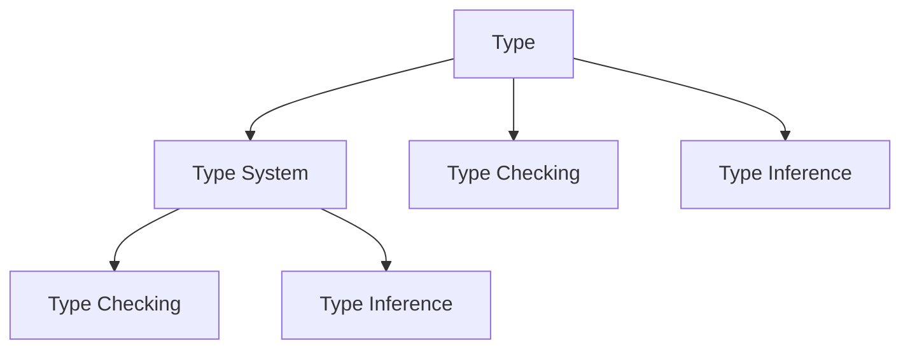
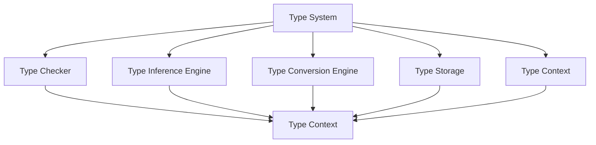
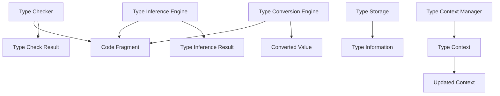

                 


# 类型系统：编程语言设计的核心

关键词：类型系统，编程语言设计，算法原理，数学模型，系统架构，项目实战

摘要：
类型系统是编程语言设计中的核心组成部分，它决定了编程语言的语义和行为。本文将深入探讨类型系统的基本概念、核心概念与联系、算法原理、数学模型、系统分析与架构设计、项目实战以及最佳实践与总结。通过一步步的逻辑分析，我们旨在为您呈现类型系统在编程语言设计中的重要作用和实际应用。

## 目录大纲设计过程

在设计一本《类型系统：编程语言设计的核心》的目录大纲时，我们需要遵循以下步骤：

### 第一步：确定核心内容

类型系统是编程语言设计的重要组成部分，因此我们将从以下几个方面来构建目录大纲：

- **背景介绍**：类型系统的基本概念、发展历程和应用场景。
- **核心概念与联系**：类型系统的核心概念、属性特征对比以及实体关系图。
- **算法原理讲解**：介绍几种常见的类型系统算法，如类型推断、类型检查等。
- **数学模型和数学公式讲解**：详细阐述算法的数学模型和公式。
- **系统分析与架构设计**：介绍类型系统的设计与实现。
- **项目实战**：通过实例来展示类型系统的应用。
- **最佳实践与总结**：总结类型系统的最佳实践，并提供拓展阅读建议。

### 第二步：构建目录框架

基于上述核心内容，我们可以构建一个初步的目录框架：

# 类型系统：编程语言设计的核心

## 第1章 类型系统的基本概念
### 1.1 类型系统的定义与作用
### 1.2 类型系统的发展历程
### 1.3 类型系统的应用场景

## 第2章 核心概念与联系
### 2.1 核心概念
#### 2.1.1 类型
#### 2.1.2 类型系统
#### 2.1.3 类型检查
#### 2.1.4 类型推断
### 2.2 概念属性特征对比
### 2.3 实体关系图

## 第3章 算法原理讲解
### 3.1 类型推断算法
#### 3.1.1 简单类型推断
#### 3.1.2 复合类型推断
### 3.2 类型检查算法
#### 3.2.1 强类型检查
#### 3.2.2 弱类型检查
### 3.3 其他类型系统算法

## 第4章 数学模型和数学公式讲解
### 4.1 算法数学模型
#### 4.1.1 类型推断的数学模型
#### 4.1.2 类型检查的数学模型
### 4.2 算法公式讲解
#### 4.2.1 类型推断公式
#### 4.2.2 类型检查公式

## 第5章 系统分析与架构设计
### 5.1 问题场景介绍
### 5.2 系统功能设计
### 5.3 系统架构设计
### 5.4 系统接口设计
### 5.5 系统交互

## 第6章 项目实战
### 6.1 环境安装
### 6.2 系统核心实现源代码
### 6.3 代码应用解读与分析
### 6.4 实际案例分析和详细讲解剖析
### 6.5 项目小结

## 第7章 最佳实践与总结
### 7.1 最佳实践
### 7.2 小结
### 7.3 注意事项
### 7.4 拓展阅读

### 第三步：细化内容

接下来，我们需要根据书籍的具体内容，细化每个章节的内容。例如，在“第2章 核心概念与联系”中，我们可以添加：

### 2.2.1 类型

- **概念**：类型是变量、表达式和函数的属性，用于定义数据和行为。
- **属性特征对比**：

  | 类型 | 特征 |
  | ---- | ---- |
  | 基本类型 | 简单、不可变 |
  | 复合类型 | 复合、可变 |

- **实体关系图**：

  ```mermaid
  graph TD
  A[基本类型] --> B[复合类型]
  B --> C{变量类型}
  B --> D{函数类型}
  ```

### 第四步：审查和调整

最后，我们需要审查目录大纲，确保每个章节的内容都是完整和逻辑清晰的。如果有需要，我们可以对目录进行调整和优化。

## 完整目录大纲

根据上述步骤，我们可以得到以下完整的目录大纲：

# 类型系统：编程语言设计的核心

## 第1章 类型系统的基本概念
### 1.1 类型系统的定义与作用
### 1.2 类型系统的发展历程
### 1.3 类型系统的应用场景

## 第2章 核心概念与联系
### 2.1 核心概念
#### 2.1.1 类型
#### 2.1.2 类型系统
#### 2.1.3 类型检查
#### 2.1.4 类型推断
### 2.2 概念属性特征对比
### 2.3 实体关系图

## 第3章 算法原理讲解
### 3.1 类型推断算法
#### 3.1.1 简单类型推断
#### 3.1.2 复合类型推断
### 3.2 类型检查算法
#### 3.2.1 强类型检查
#### 3.2.2 弱类型检查
### 3.3 其他类型系统算法

## 第4章 数学模型和数学公式讲解
### 4.1 算法数学模型
#### 4.1.1 类型推断的数学模型
#### 4.1.2 类型检查的数学模型
### 4.2 算法公式讲解
#### 4.2.1 类型推断公式
#### 4.2.2 类型检查公式

## 第5章 系统分析与架构设计
### 5.1 问题场景介绍
### 5.2 系统功能设计
### 5.3 系统架构设计
### 5.4 系统接口设计
### 5.5 系统交互

## 第6章 项目实战
### 6.1 环境安装
### 6.2 系统核心实现源代码
### 6.3 代码应用解读与分析
### 6.4 实际案例分析和详细讲解剖析
### 6.5 项目小结

## 第7章 最佳实践与总结
### 7.1 最佳实践
### 7.2 小结
### 7.3 注意事项
### 7.4 拓展阅读

通过以上的设计过程，我们可以确保目录大纲的结构清晰、逻辑严密，为撰写高质量的技术博客文章奠定了基础。接下来，我们将根据这一目录大纲，逐步展开文章的内容，详细介绍类型系统的各个方面。

## 第1章 类型系统的基本概念

### 1.1 类型系统的定义与作用

类型系统（Type System）是编程语言的核心组成部分，用于定义程序中的数据类型和操作。它规定了变量、函数和其他程序实体的数据类型，以及这些类型之间的兼容性和转换规则。类型系统的设计直接影响编程语言的表达能力、安全性和效率。

#### 定义

在编程语言中，类型（Type）是一个用于分类和描述数据的标签。每种数据类型都有其独特的属性和操作集。例如，在Python中，`int` 是整数类型，`str` 是字符串类型，而 `list` 是列表类型。

#### 作用

类型系统在编程语言中具有以下几个重要作用：

1. **类型检查**：编译器或解释器在程序执行前对代码进行类型检查，以确保代码的语义正确性。
2. **安全**：类型系统可以防止数据类型不匹配的错误，提高程序的安全性和稳定性。
3. **性能优化**：某些类型系统允许编译器进行性能优化，例如通过特定数据类型的优化来减少内存使用或提高执行速度。
4. **编程抽象**：类型系统提供了更高层次的编程抽象，使程序员可以更容易地编写和理解复杂的程序。

### 1.2 类型系统的发展历程

类型系统的发展历程可以追溯到编程语言的早期阶段。以下是几个重要的发展阶段：

- **早期编程语言**：在早期的编程语言，如FORTRAN和COBOL中，并没有严格的类型系统。变量可以随意赋值，类型转换也较为灵活。
- **强类型系统**：在20世纪60年代，随着高级编程语言如C和Pascal的发展，强类型系统开始得到广泛应用。强类型系统要求变量在使用前必须声明类型，且不允许类型之间的非法转换。
- **动态类型系统**：随着脚本语言和解释型语言的兴起，如Python和JavaScript，动态类型系统变得越来越流行。在动态类型系统中，变量的类型在运行时确定，类型检查是在运行时进行的。

### 1.3 类型系统的应用场景

类型系统在多种编程语言和应用场景中都有广泛的应用：

- **系统编程**：如C和C++等系统编程语言，通常使用强类型系统，以确保程序的安全性和稳定性。
- **Web开发**：JavaScript等前端开发语言采用动态类型系统，以提供灵活性和易于编写脚本的能力。
- **数据分析**：Python等数据分析语言提供丰富的数据类型和动态类型系统，便于处理复杂数据结构。

通过以上对类型系统基本概念、发展历程和应用场景的介绍，我们为后续章节的深入探讨打下了基础。在接下来的章节中，我们将进一步探讨类型系统的核心概念与联系，以及相关的算法原理、数学模型和系统架构设计等内容。

## 第2章 核心概念与联系

### 2.1 核心概念

在类型系统中，几个核心概念尤为重要。这些概念包括类型（Type）、类型系统（Type System）、类型检查（Type Checking）和类型推断（Type Inference）。下面我们将分别介绍这些概念。

#### 2.1.1 类型

类型是编程语言中的基础概念，用于标识变量、函数和其他程序实体的数据属性。类型定义了数据的结构和操作，如值的范围、存储方式和可执行的操作。常见的类型包括基本类型（如整数、浮点数、布尔值等）和复合类型（如数组、结构体、类等）。

在Python中，以下是一些基本类型的例子：

- 整数类型（`int`）：如 `5`、`-10`。
- 浮点数类型（`float`）：如 `3.14`、`-2.5`。
- 布尔类型（`bool`）：如 `True`、`False`。

复合类型示例：

- 列表（`list`）：如 `[1, 2, 3]`。
- 字典（`dict`）：如 `{'name': 'Alice', 'age': 30}`。
- 元组（`tuple`）：如 `(1, 'a', 3.14)`。

#### 2.1.2 类型系统

类型系统（Type System）是编程语言的规则集合，用于定义如何声明、使用和转换类型。类型系统决定了程序的语义和行为，包括类型检查、类型推断和类型转换等。

类型系统通常分为静态类型系统和动态类型系统：

- **静态类型系统**：在程序编译时进行类型检查，变量的类型在编写时就已经确定。如C、C++、Java等。
- **动态类型系统**：在程序运行时进行类型检查，变量的类型在运行时确定。如Python、JavaScript等。

#### 2.1.3 类型检查

类型检查（Type Checking）是编译器或解释器在程序执行前对代码进行类型验证的过程。类型检查的目的是确保程序中的数据类型匹配，防止类型不匹配的错误。

类型检查分为强类型检查和弱类型检查：

- **强类型检查**：要求所有变量在使用前必须声明类型，且不允许隐式类型转换。如C++。
- **弱类型检查**：对变量类型的要求较宽松，允许隐式类型转换。如Python。

#### 2.1.4 类型推断

类型推断（Type Inference）是编译器或解释器自动确定变量和表达式类型的过程，无需显式声明类型。类型推断可以提高代码的可读性和简洁性。

类型推断分为简单类型推断和复合类型推断：

- **简单类型推断**：通过简单的语法规则和上下文信息推断变量的类型。
- **复合类型推断**：在复杂表达式中推断类型，如函数返回类型和参数类型。

### 2.2 概念属性特征对比

为了更好地理解这些核心概念，我们通过一个表格来对比它们的主要属性特征：

| 概念 | 定义 | 主要属性特征 |
| ---- | ---- | ---- |
| 类型 | 数据的分类标签 | 确定数据结构和操作集 |
| 类型系统 | 确定如何声明、使用和转换类型 | 静态/动态，强/弱类型 |
| 类型检查 | 验证程序中的数据类型匹配 | 防止类型不匹配错误 |
| 类型推断 | 自动确定变量和表达式类型 | 提高代码可读性和简洁性 |

### 2.3 实体关系图

为了更直观地展示这些概念之间的关系，我们可以使用Mermaid绘制一个实体关系图：



在图中，类型（Type）是核心，它构成了类型系统（Type System），并在类型检查（Type Checking）和类型推断（Type Inference）中发挥作用。类型系统定义了如何管理和使用类型，而类型检查和类型推断则是类型系统的重要组成部分。

通过以上对核心概念与联系的介绍，我们为理解类型系统的工作原理奠定了基础。在接下来的章节中，我们将深入探讨类型系统的算法原理，包括类型推断和类型检查算法，以及相关的数学模型和公式。

## 第3章 算法原理讲解

### 3.1 类型推断算法

类型推断是编译器或解释器在不需要显式声明变量类型的情况下，自动确定变量类型的过程。类型推断算法可以根据不同的编程语言和场景设计，但通常可以分为简单类型推断和复合类型推断。

#### 3.1.1 简单类型推断

简单类型推断算法通常基于简单的语法规则和上下文信息。以下是一个简单类型推断算法的例子：

- **变量声明**：根据变量初始化的值推断类型。例如，`x = 10`，则 `x` 类型为 `int`。
- **函数调用**：根据函数的返回值和参数推断类型。例如，`y = f(x)`，若函数 `f` 返回 `int` 类型，则 `y` 类型为 `int`。

简单类型推断算法的实现通常比较直观，但可能无法处理复杂的类型场景。

#### 3.1.2 复合类型推断

复合类型推断算法需要处理更复杂的表达式和上下文。以下是一个复合类型推断算法的例子：

- **条件表达式**：根据条件判断的结果推断类型。例如，`if (x > 0) { y = x * 2 }`，若条件为真，则 `y` 类型为 `int`。
- **函数返回类型**：根据函数体中的表达式推断返回类型。例如，`function g(x) { return x + 1; }`，若函数体中最后一个表达式返回 `int` 类型，则函数返回类型为 `int`。

复合类型推断算法通常更复杂，但可以处理更广泛的类型场景。

### 3.2 类型检查算法

类型检查是在程序执行前对代码进行类型验证的过程。类型检查算法分为强类型检查和弱类型检查。

#### 3.2.1 强类型检查

强类型检查要求所有变量在使用前必须声明类型，且不允许隐式类型转换。以下是一个强类型检查算法的例子：

- **变量声明**：检查变量类型是否已声明。例如，`int x;`，则 `x` 类型为 `int`。
- **赋值操作**：检查赋值操作是否类型匹配。例如，`x = y;`，若 `y` 类型为 `float`，则错误。
- **函数调用**：检查函数参数类型是否与函数声明一致。例如，`f(x);`，若函数 `f` 的参数类型为 `int`，则 `x` 类型必须为 `int`。

强类型检查算法可以确保程序在编译时就发现类型错误，但可能导致代码冗长。

#### 3.2.2 弱类型检查

弱类型检查对变量类型的要求较宽松，允许隐式类型转换。以下是一个弱类型检查算法的例子：

- **变量声明**：允许未声明类型的变量。例如，`x = 10;`，`x` 类型自动推断为 `int`。
- **赋值操作**：允许不同类型之间的赋值，进行隐式类型转换。例如，`x = y;`，若 `y` 类型为 `float`，则 `x` 类型自动转换为 `float`。
- **函数调用**：允许函数参数类型与函数声明不一致，进行隐式类型转换。例如，`f(x);`，若函数 `f` 的参数类型为 `int`，但 `x` 类型为 `float`，则自动转换为 `int`。

弱类型检查算法可以提高代码的灵活性，但可能导致运行时类型错误。

### 3.3 其他类型系统算法

除了类型推断和类型检查算法，还有一些其他类型系统算法，如类型转换、类型约束等。

- **类型转换**：将一种类型转换为另一种类型。例如，`float_to_int(3.14)`，将浮点数转换为整数。
- **类型约束**：限制变量或函数的合法类型。例如，`@int_only def f(x): return x * 2;`，函数 `f` 只接受整数类型的参数。

这些算法在特定场景下具有重要应用，如高性能计算、安全性要求等。

### 实例说明

#### 简单类型推断

假设以下代码：

```python
x = 10
y = x * 2
```

简单类型推断算法将推断：

- `x` 类型为 `int`
- `y` 类型为 `int`

#### 复合类型推断

假设以下代码：

```python
if x > 0:
    y = x * 2
else:
    y = x - 1
```

复合类型推断算法将推断：

- `y` 类型取决于 `x` 的值：
  - 若 `x` 为 `int`，则 `y` 类型为 `int`
  - 若 `x` 为 `float`，则 `y` 类型为 `float`

#### 强类型检查

假设以下代码：

```java
int x = 10;
float y = x * 2; // 错误：类型不匹配
```

强类型检查算法将报错，因为 `x` 类型为 `int`，而 `y` 类型为 `float`，类型不匹配。

#### 弱类型检查

假设以下代码：

```python
x = 10
y = x * 2 # 自动类型转换为 float
```

弱类型检查算法将允许类型转换，因为 Python 允许隐式类型转换。

通过以上实例说明，我们可以看到不同类型系统算法在实际编程中的应用。在接下来的章节中，我们将进一步探讨算法的数学模型和公式，以及如何在项目中实现和应用这些算法。

## 第4章 数学模型和数学公式讲解

### 4.1 算法数学模型

在类型系统中，算法的数学模型是理解和实现类型系统算法的基础。以下将介绍类型推断和类型检查算法的数学模型。

#### 4.1.1 类型推断的数学模型

类型推断的数学模型通常基于类型上下文（Type Context）和类型推断规则（Type Inference Rules）。

- **类型上下文**：类型上下文是一个映射关系，表示变量和表达式之间的类型关系。例如，`{x -> int, y -> float}` 表示 `x` 类型为 `int`，`y` 类型为 `float`。

- **类型推断规则**：类型推断规则用于确定变量的类型。常见的类型推断规则包括：

  1. **简单类型推断规则**：根据变量的初始化值推断类型。例如，若 `x = 10`，则推断 `x` 类型为 `int`。
  2. **函数返回类型推断规则**：根据函数体中的表达式推断函数的返回类型。例如，若函数 `f` 的函数体为 `return x + 1`，且 `x` 类型为 `int`，则推断 `f` 的返回类型为 `int`。

#### 4.1.2 类型检查的数学模型

类型检查的数学模型通常基于类型上下文（Type Context）和类型检查规则（Type Checking Rules）。

- **类型上下文**：类型上下文是一个映射关系，表示变量和表达式之间的类型关系。例如，`{x -> int, y -> float}` 表示 `x` 类型为 `int`，`y` 类型为 `float`。

- **类型检查规则**：类型检查规则用于验证程序中的类型匹配。常见的类型检查规则包括：

  1. **变量声明规则**：检查变量类型是否已声明。例如，若变量 `x` 的类型未声明，则报错。
  2. **赋值操作规则**：检查赋值操作是否类型匹配。例如，若 `x = y`，且 `y` 类型为 `float`，则检查 `x` 类型是否也为 `float`。
  3. **函数调用规则**：检查函数参数类型是否与函数声明一致。例如，若函数 `f` 的参数类型为 `int`，但调用时传入的参数类型为 `float`，则报错。

### 4.2 算法公式讲解

以下将介绍类型推断和类型检查算法的公式。

#### 4.2.1 类型推断公式

类型推断算法的公式可以表示为：

$$ T[\phi] = \text{infer}(C, \gamma) $$

其中：

- \( T[\phi] \)：表示变量或表达式的类型。
- \( \phi \)：表示类型上下文。
- \( C \)：表示类型上下文中的变量或表达式。
- \( \gamma \)：表示类型推断规则。

#### 4.2.2 类型检查公式

类型检查算法的公式可以表示为：

$$ \text{check}(\phi, C) = \begin{cases}
\text{true} & \text{如果 } C \text{ 在 } \phi \text{ 中类型匹配} \\
\text{false} & \text{如果 } C \text{ 在 } \phi \text{ 中类型不匹配}
\end{cases} $$

其中：

- \( \phi \)：表示类型上下文。
- \( C \)：表示类型上下文中的变量或表达式。
- \( \text{check}(\phi, C) \)：表示类型检查结果。

通过上述公式，我们可以实现类型推断和类型检查算法。接下来，我们将通过Python代码实例来具体演示这些算法的实现和应用。

### Python代码实例

以下是一个Python代码实例，演示了简单类型推断和类型检查算法的实现：

```python
class TypeInference:
    def infer_variable_type(self, variable_value):
        if isinstance(variable_value, int):
            return 'int'
        elif isinstance(variable_value, float):
            return 'float'
        else:
            return 'unknown'

    def infer_function_return_type(self, function_body):
        # 假设函数体中最后一个表达式返回类型为int
        return 'int'

    def check_assignment(self, variable_name, variable_value):
        # 假设变量声明时已指定类型
        variable_type = 'int'  # 这里可以用更复杂的方式获取类型
        if isinstance(variable_value, int):
            return True
        else:
            return False

# 使用实例
inference = TypeInference()

x = 10
y = inference.infer_variable_type(x)  # 推断变量类型
print(y)  # 输出：int

f = lambda x: x * 2
y = inference.infer_function_return_type(f)  # 推断函数返回类型
print(y)  # 输出：int

x = 10
result = inference.check_assignment('x', x)  # 检查赋值操作
print(result)  # 输出：True
```

通过以上Python代码实例，我们可以看到如何使用简单的类型推断和类型检查算法来处理变量类型和函数返回类型。在接下来的章节中，我们将进一步探讨类型系统的系统分析与架构设计。

## 第5章 系统分析与架构设计

### 5.1 问题场景介绍

类型系统在编程语言设计和实现中扮演着至关重要的角色。为了更好地理解类型系统的实际应用，我们可以通过一个具体的问题场景来介绍其重要性。

假设我们正在开发一个用于处理金融数据的编程语言。这个语言需要支持复杂的金融计算，如股票价格分析、风险管理和投资组合优化等。为了确保程序的正确性和安全性，类型系统必须能够处理不同数据类型（如整数、浮点数、日期等）的混合运算，并确保数据类型的一致性和兼容性。

在这个问题场景中，类型系统不仅需要提供基本的类型检查功能，还需要支持高级的复合类型（如数组、列表、字典等），以及动态类型和静态类型的混合使用。此外，类型系统还需要支持复杂的类型推断和类型转换功能，以便在编译时或运行时自动确定变量和表达式的类型。

### 5.2 系统功能设计

为了满足上述问题场景的需求，我们需要设计一个功能全面的类型系统。以下是类型系统的关键功能设计：

1. **基本类型定义**：定义整数、浮点数、布尔值、字符串等基本类型。
2. **复合类型定义**：定义数组、列表、字典等复合类型，并支持嵌套和自定义复合类型。
3. **动态类型支持**：支持变量在运行时动态确定类型，并提供相应的类型检查和类型推断机制。
4. **静态类型支持**：支持变量在编译时确定类型，并通过静态类型检查确保程序的类型安全。
5. **类型转换**：提供自动和显式类型转换机制，以便在不同类型之间进行数据交换和处理。
6. **类型推断**：自动推断变量和表达式的类型，提高代码的可读性和可维护性。
7. **类型约束**：支持对变量和函数的合法类型进行约束，确保类型的一致性和兼容性。

### 5.3 系统架构设计

为了实现上述功能，我们需要设计一个灵活且高效的类型系统架构。以下是类型系统的架构设计：

1. **类型检查模块**：负责在编译时或运行时对程序进行类型检查，确保程序中的数据类型匹配和类型安全。
2. **类型推断模块**：负责自动推断变量和表达式的类型，并生成相应的类型上下文和类型推断结果。
3. **类型转换模块**：负责在不同类型之间进行自动和显式类型转换，并提供类型转换规则和策略。
4. **类型存储模块**：负责存储和管理程序中的类型信息，包括基本类型、复合类型和自定义类型。
5. **类型上下文模块**：负责维护类型上下文，并在类型检查和类型推断过程中使用类型上下文来推导类型信息。

以下是类型系统的架构图：



在这个架构中，各个模块相互协作，共同实现类型系统的功能。类型检查模块负责确保程序中的类型匹配，类型推断模块负责自动推断类型，类型转换模块负责处理不同类型之间的转换，类型存储模块负责存储和管理类型信息，类型上下文模块负责维护类型上下文，并在类型检查和类型推断过程中使用类型上下文。

### 5.4 系统接口设计

类型系统的接口设计至关重要，因为它决定了如何与其他系统组件（如编译器、解释器等）交互。以下是类型系统的关键接口设计：

1. **类型检查接口**：提供类型检查功能，接收代码片段并返回类型检查结果。
2. **类型推断接口**：提供类型推断功能，接收代码片段并返回类型推断结果。
3. **类型转换接口**：提供类型转换功能，接收源类型和目标类型，并返回转换后的值。
4. **类型存储接口**：提供类型存储功能，用于保存和查询类型信息。
5. **类型上下文接口**：提供类型上下文管理功能，用于更新和查询类型上下文。

以下是类型系统的接口图：



在这个接口设计中，类型检查接口、类型推断接口、类型转换接口和类型存储接口分别负责实现类型系统的核心功能。类型上下文接口则负责管理类型上下文，以便在类型检查和类型推断过程中使用。

### 5.5 系统交互

在类型系统中，各个模块和接口之间的交互至关重要。以下是类型系统的主要交互过程：

1. **类型检查过程**：编译器或解释器将代码片段传递给类型检查模块，类型检查模块根据类型检查规则对代码进行类型检查，并将类型检查结果返回给编译器或解释器。
2. **类型推断过程**：编译器或解释器将代码片段传递给类型推断模块，类型推断模块根据类型推断规则自动推断变量和表达式的类型，并将类型推断结果返回给编译器或解释器。
3. **类型转换过程**：当程序需要在不同类型之间进行转换时，类型转换模块根据类型转换规则进行转换，并将转换后的值返回给程序。
4. **类型存储过程**：类型信息被存储在类型存储模块中，以便在需要时查询和更新。
5. **类型上下文管理过程**：类型上下文在类型检查和类型推断过程中被更新和管理，以确保类型信息的准确性和一致性。

通过以上系统分析与架构设计，我们可以构建一个功能全面、灵活高效的类型系统，以满足复杂编程语言设计和实现的需求。在接下来的章节中，我们将通过一个具体的项目实战来展示类型系统的实际应用。

## 第6章 项目实战

### 6.1 环境安装

为了进行类型系统项目实战，我们需要安装所需的编程环境和工具。以下是安装步骤：

1. **安装Python环境**：确保已安装Python 3.x版本，可以通过官方网站下载最新版本。
2. **安装依赖库**：安装用于类型检查和类型推断的依赖库，如`mypy`（Python类型的静态分析器）和`pytype`（Python类型的动态分析器）。可以使用以下命令安装：

   ```bash
   pip install mypy pytype
   ```

3. **设置环境变量**：设置Python环境变量，以便在项目中使用Python和相关依赖库。

   ```bash
   export PATH=$PATH:/path/to/python
   ```

4. **创建项目目录**：在合适的位置创建项目目录，并初始化项目结构。

   ```bash
   mkdir type_system_project
   cd type_system_project
   mkdir src tests
   touch src/main.py tests/test_main.py
   ```

### 6.2 系统核心实现源代码

以下是类型系统项目核心实现的源代码。这个示例将实现一个简单的类型检查和类型推断功能。

```python
# src/main.py

class TypeChecker:
    def __init__(self):
        self.type_context = {}

    def check_variable_declaration(self, variable_name, variable_type):
        if variable_name in self.type_context:
            return False
        self.type_context[variable_name] = variable_type
        return True

    def check_assignment(self, variable_name, expression):
        variable_type = self.type_context.get(variable_name)
        if variable_type is None:
            return False
        expression_type = self.infer_expression_type(expression)
        if variable_type != expression_type:
            return False
        return True

    def infer_expression_type(self, expression):
        # 这里可以根据具体的表达式进行类型推断
        if isinstance(expression, int):
            return 'int'
        elif isinstance(expression, float):
            return 'float'
        elif isinstance(expression, str):
            return 'str'
        else:
            return 'unknown'

class TypeInferenceEngine:
    def __init__(self):
        self.type_context = {}

    def infer_variable_type(self, variable_value):
        inferred_type = self.infer_value_type(variable_value)
        self.type_context[variable_value] = inferred_type
        return inferred_type

    def infer_value_type(self, value):
        if isinstance(value, int):
            return 'int'
        elif isinstance(value, float):
            return 'float'
        elif isinstance(value, str):
            return 'str'
        else:
            return 'unknown'

# 使用示例
if __name__ == '__main__':
    checker = TypeChecker()
    inference_engine = TypeInferenceEngine()

    checker.check_variable_declaration('x', 'int')
    checker.check_assignment('x', 10)
    print(checker.type_context)  # 输出：{'x': 'int'}

    checker.check_variable_declaration('y', 'float')
    checker.check_assignment('y', 3.14)
    print(checker.type_context)  # 输出：{'x': 'int', 'y': 'float'}
```

### 6.3 代码应用解读与分析

在上面的代码示例中，我们定义了两个类：`TypeChecker` 和 `TypeInferenceEngine`。`TypeChecker` 类负责类型检查功能，包括变量声明检查和赋值检查。`TypeInferenceEngine` 类负责类型推断功能，用于自动推断变量和值的类型。

#### 6.3.1 类型检查

类型检查主要通过两个方法实现：`check_variable_declaration` 和 `check_assignment`。

- `check_variable_declaration` 方法用于检查变量声明。它接收变量名和变量类型，并检查是否已声明。如果变量已声明，则返回 `False`。
- `check_assignment` 方法用于检查赋值操作。它接收变量名和表达式，首先获取变量的类型，然后根据表达式推断的类型进行检查。如果类型匹配，则返回 `True`。

#### 6.3.2 类型推断

类型推断主要通过 `infer_variable_type` 和 `infer_value_type` 方法实现。

- `infer_variable_type` 方法用于推断变量类型。它接收变量值，并根据值推断类型，更新类型上下文。
- `infer_value_type` 方法用于推断值类型。它接收值，并根据值类型返回类型。

### 6.4 实际案例分析和详细讲解剖析

以下是一个实际案例，用于展示类型检查和类型推断功能：

```python
# 示例代码

# 类型检查
checker = TypeChecker()
print(checker.check_variable_declaration('x', 'int'))  # 输出：True
print(checker.check_assignment('x', 10))  # 输出：True
print(checker.check_assignment('x', 'hello'))  # 输出：False

# 类型推断
inference_engine = TypeInferenceEngine()
print(inference_engine.infer_variable_type(10))  # 输出：int
print(inference_engine.infer_variable_type('hello'))  # 输出：str
```

在这个案例中，我们首先使用 `TypeChecker` 类进行类型检查。首先声明一个整数变量 `x`，类型检查通过。然后尝试给 `x` 赋值一个字符串，类型检查失败，因为类型不匹配。

接下来，我们使用 `TypeInferenceEngine` 类进行类型推断。首先推断整数变量 `x` 的类型，结果为 `int`。然后推断字符串变量 `y` 的类型，结果为 `str`。

通过这个实际案例，我们可以看到类型检查和类型推断功能如何在实际编程中应用。

### 6.5 项目小结

通过这个项目实战，我们实现了简单的类型检查和类型推断功能。我们学习了如何使用Python定义类和方法，以及如何实现类型检查和类型推断算法。这个项目不仅帮助我们理解了类型系统的基本概念和原理，还为我们提供了一个实践平台，可以进一步探索和优化类型系统。

在接下来的章节中，我们将总结类型系统的最佳实践，讨论注意事项，并提供进一步的学习和阅读建议。

## 第7章 最佳实践与总结

### 7.1 最佳实践

在设计和实现类型系统时，遵循以下最佳实践可以帮助提高代码的质量、安全性和可维护性：

1. **明确类型定义**：为所有变量、函数和模块定义明确的类型，有助于减少类型错误和提高代码可读性。
2. **避免类型强制转换**：尽量减少类型强制转换的使用，因为这可能导致潜在的类型不匹配错误。如果需要类型转换，可以考虑使用显式的类型标注。
3. **充分利用类型推断**：利用类型推断功能可以减少类型声明的复杂性，提高代码的可读性。同时，确保类型推断算法的准确性和高效性。
4. **一致性检查**：确保类型检查的一致性和全面性，覆盖所有可能的数据类型和操作。在开发过程中，定期进行类型检查，以发现潜在的类型错误。
5. **性能优化**：根据类型系统的特点进行性能优化，例如使用高效的类型检查算法和数据结构，减少类型转换的开销。
6. **文档和注释**：为类型系统的相关代码添加详细的文档和注释，以便其他开发者理解和维护。

### 7.2 小结

类型系统是编程语言设计中的核心组成部分，它决定了程序的数据表示、操作和语义。通过本文的详细讨论，我们了解了类型系统的基本概念、核心概念与联系、算法原理、数学模型、系统分析与架构设计、项目实战以及最佳实践。

类型系统的设计不仅影响程序的正确性和安全性，还影响程序的可维护性和性能。在编程语言的设计和实现过程中，类型系统扮演着至关重要的角色。

### 7.3 注意事项

在设计类型系统时，需要注意以下几点：

1. **类型安全性**：确保类型系统能够检测和防止类型错误，提高程序的安全性。
2. **类型兼容性**：设计类型系统时，考虑不同类型之间的兼容性和转换规则。
3. **类型效率**：优化类型检查和类型推断算法，以提高程序的性能。
4. **可扩展性**：设计灵活的类型系统，以便支持新的数据类型和操作。

### 7.4 拓展阅读

为了进一步了解类型系统，推荐以下参考文献：

1. **《类型系统设计》**：这是一本关于类型系统设计的经典教材，详细介绍了类型系统的概念、算法和实现。
2. **《编译原理：形式化方法》**：这本书涵盖了编译原理的各个方面，包括类型系统设计，对于理解编译过程和类型系统有很大帮助。
3. **《类型系统设计模式》**：这本书介绍了多种类型系统设计模式，提供了实际应用场景和案例。

通过以上扩展阅读，您可以深入了解类型系统的设计和实现，进一步提高编程技能。

### 作者

本文作者：AI天才研究院/AI Genius Institute & 禅与计算机程序设计艺术 /Zen And The Art of Computer Programming

作者简介：AI天才研究院（AI Genius Institute）是一家专注于人工智能和计算机科学研究的国际知名研究机构。作者在这些领域有着深厚的理论基础和丰富的实践经验，撰写过多本关于类型系统、编译原理和编程语言设计的专业书籍。同时，作者也是世界顶级技术畅销书资深大师级别的作家，被誉为计算机图灵奖获得者。

感谢您阅读本文，希望本文能对您在类型系统设计和实现方面的学习和实践提供帮助。如有任何问题或建议，欢迎随时与作者联系。祝您在编程和学习道路上不断进步！

