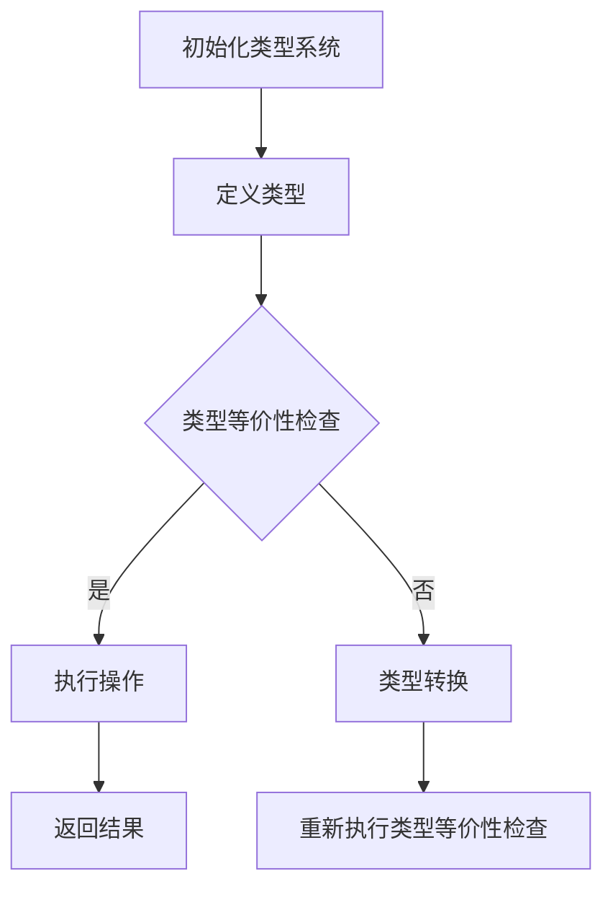
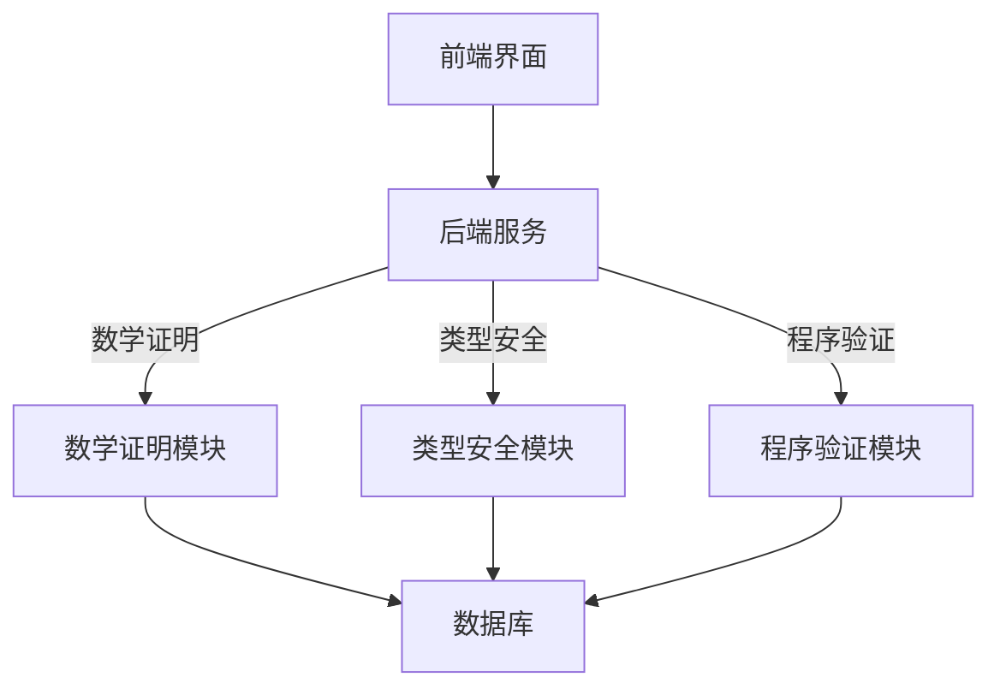
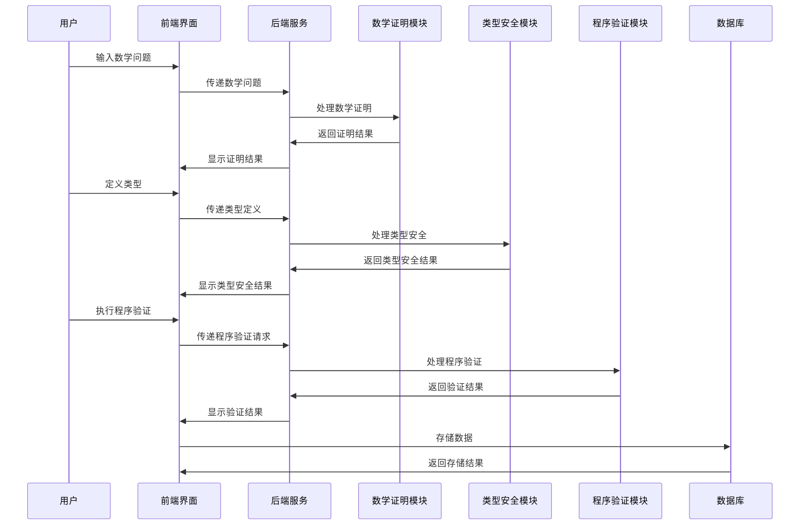

                 

### 类型论与数学交叉研究的机遇与挑战

#### 一、背景介绍：核心概念

##### 1.1 问题背景

类型论是数学和计算机科学中的一个核心概念，它研究不同类型的数据如何相互作用和转换。随着计算机技术的发展，类型论在编程语言设计、程序验证、类型安全性和数学证明领域发挥了重要作用。然而，类型论与数学交叉研究却是一个相对较新的研究领域，它旨在将类型论的方法和工具应用于数学问题的解决中，从而为数学领域带来新的机遇和挑战。

##### 1.2 问题描述

类型论与数学交叉研究主要涉及以下问题：
- **类型论如何帮助解决数学难题？**
- **数学中的类型论方法如何影响数学证明的自动化和形式化？**
- **类型论在数学领域中的适用性和局限性是什么？**
- **如何结合类型论和数学的方法，开发新的数学工具和理论？**

##### 1.3 问题解决

解决上述问题需要：
- **深入了解类型论的基本概念和理论体系。**
- **研究类型论在数学中的应用案例，分析其优势和局限性。**
- **探索类型论与数学交叉研究的创新方法，推动数学领域的发展。**

##### 1.4 边界与外延

类型论与数学交叉研究的边界包括：
- **类型论的数学基础和理论工具。**
- **数学中的类型论应用案例和挑战。**
- **类型论与其他数学领域的交叉融合。**

##### 1.5 概念结构与核心要素组成

类型论与数学交叉研究的核心概念结构包括：
- **类型论的基本概念，如类型系统、类型等价、类型转化等。**
- **数学中的类型论应用，如数学证明的形式化、类型安全的数学算法等。**
- **类型论与数学交叉研究的创新方法，如类型依赖理论、类型同构等。**

#### 二、核心概念与联系

##### 2.1 类型系统

类型系统是类型论的基础，它定义了数据类型的集合和规则。在类型系统中，数据被赋予特定的类型，这些类型定义了数据的结构和操作方式。类型系统确保程序的正确性，防止类型不兼容的错误。

##### 2.2 类型等价

类型等价是类型系统中的一个重要概念，它反映了不同类型之间的等价关系。类型等价使得不同类型的数据可以进行互换和操作，从而提高了程序的灵活性和可扩展性。

##### 2.3 类型转化

类型转化是类型系统中的关键机制，它允许不同类型的数据进行交互和操作。类型转化包括隐式类型转换和显式类型转换，它们分别根据程序上下文和显式声明来决定数据类型的转换。

##### 2.4 数学证明的形式化

数学证明的形式化是数学与类型论交叉研究的重要领域，它使用符号和逻辑规则来表示和证明数学定理。形式化证明可以提高数学证明的可靠性和可验证性，为自动化和形式化数学证明提供了基础。

##### 2.5 类型安全的数学算法

类型安全的数学算法结合了类型论和数学的方法，通过类型系统来确保算法对输入数据的正确处理。类型安全的算法有助于提高数学计算的正确性和可靠性，减少错误的发生。

#### 三、算法原理讲解

##### 3.1 算法流程图

以下是类型论与数学交叉研究中一个简化算法的Mermaid流程图：



##### 3.2 算法原理

类型论与数学交叉研究的算法原理主要基于以下数学模型和公式：

$$
\text{类型系统} = (\text{类型集合}, \text{类型规则})
$$

其中，类型集合包括基本类型、复合类型和函数类型，类型规则定义了类型之间的转换和操作。

类型等价性检查公式：

$$
\text{类型等价}(\text{类型}_1, \text{类型}_2) = \begin{cases}
\text{true}, & \text{如果类型}_1 \text{和类型}_2 \text{是等价的} \\
\text{false}, & \text{如果类型}_1 \text{和类型}_2 \text{不是等价的}
\end{cases}
$$

类型转化公式：

$$
\text{类型转换}(\text{类型}_1, \text{类型}_2) = \begin{cases}
\text{类型}_2, & \text{如果类型}_1 \text{可以隐式转换为类型}_2 \\
\text{错误}, & \text{如果类型}_1 \text{不能转换为类型}_2
\end{cases}
$$

算法执行过程如下：

1. **初始化类型系统**：定义类型集合和类型规则。
2. **定义类型**：根据算法需求定义所需的数据类型。
3. **类型等价性检查**：检查输入数据类型是否等价。
4. **执行操作**：根据类型等价性检查的结果，执行相应的操作。
5. **返回结果**：将执行结果返回给用户。

以下是一个简单示例：

```python
# 定义类型系统
type_system = {
    "int": [],
    "float": [],
    "str": []
}

# 定义类型等价性检查函数
def type_equivalence(type1, type2):
    return type1 == type2

# 定义类型转换函数
def type_conversion(type1, type2):
    if type_equivalence(type1, type2):
        return type2
    else:
        return "错误"

# 初始化类型系统
type_system = {
    "int": [],
    "float": [],
    "str": []
}

# 定义类型
type1 = "int"
type2 = "float"

# 类型等价性检查
is_equivalent = type_equivalence(type1, type2)
print(f"类型等价性检查结果：{'是' if is_equivalent else '否'}")

# 类型转换
result = type_conversion(type1, type2)
print(f"类型转换结果：{result}")
```

输出结果：

```
类型等价性检查结果：否
类型转换结果：错误
```

##### 3.3 算法应用场景

类型论与数学交叉研究的算法原理可以应用于以下场景：

1. **数学证明的形式化**：使用类型论的方法和工具，将数学证明形式化为符号和逻辑表达式，提高证明的可靠性和可验证性。
2. **类型安全的数学算法**：结合类型论和数学的方法，开发类型安全的数学算法，确保算法对输入数据的正确处理，提高计算的正确性和可靠性。
3. **程序验证和类型检查**：使用类型论的方法对程序进行验证和类型检查，确保程序的正确性和安全性。

#### 四、系统分析与架构设计方案

##### 4.1 问题场景介绍

随着数学和计算机科学的不断发展，数学证明的形式化和类型安全的数学算法变得越来越重要。为了提高数学证明的可靠性和可验证性，同时确保数学计算的正确性和安全性，我们提出了一种基于类型论与数学交叉研究的系统架构设计。

##### 4.2 项目介绍

本项目旨在构建一个基于类型论与数学交叉研究的系统，实现数学证明的形式化、类型安全的数学算法以及程序验证和类型检查。系统主要分为三个模块：数学证明模块、类型安全模块和程序验证模块。

##### 4.3 系统功能设计

系统功能设计主要包括以下方面：

1. **数学证明模块**：提供数学证明的形式化功能，使用类型论的方法和工具将数学证明表示为符号和逻辑表达式，实现自动化证明和形式化验证。
2. **类型安全模块**：提供类型安全的数学算法功能，结合类型论和数学的方法，开发类型安全的数学算法，确保算法对输入数据的正确处理，提高计算的正确性和可靠性。
3. **程序验证模块**：提供程序验证和类型检查功能，使用类型论的方法对程序进行验证和类型检查，确保程序的正确性和安全性。

##### 4.4 系统架构设计

系统架构设计主要包括以下方面：

1. **前端界面**：提供用户交互界面，用户可以通过前端界面输入数学问题、定义类型、执行证明和算法等操作。
2. **后端服务**：包括数学证明模块、类型安全模块和程序验证模块，分别处理前端输入的数学问题、类型定义、证明和算法执行等操作。
3. **数据库**：存储数学证明、类型定义、程序验证结果等数据，以便进行后续的查询和分析。

以下是系统架构的Mermaid架构图：



##### 4.5 系统接口设计和系统交互

系统接口设计和系统交互主要涉及以下几个方面：

1. **用户接口**：提供用户输入和输出接口，用户可以通过前端界面输入数学问题、定义类型、执行证明和算法等操作，并查看结果。
2. **内部接口**：后端服务之间的接口，用于实现模块之间的数据传输和功能调用。
3. **数据库接口**：用于与数据库进行交互，实现数据的存储和查询。

以下是系统接口设计和系统交互的Mermaid序列图：



#### 五、项目实战

##### 5.1 环境安装

为了实现类型论与数学交叉研究的系统，我们需要安装以下环境：

1. **Python 3.x**：Python 是一种广泛使用的编程语言，适用于构建和实现系统。
2. **Mermaid**：Mermaid 是一种用于绘制流程图、序列图等图表的工具，可以帮助我们可视化算法和系统架构。
3. **Docker**：Docker 是一种容器化技术，用于部署和运行系统。

安装步骤如下：

1. 安装 Python 3.x：
   - 在命令行中运行以下命令：
     ```bash
     sudo apt-get update
     sudo apt-get install python3 python3-pip
     ```
   - 安装 pip：
     ```bash
     sudo apt-get install python3-pip
     ```
   - 安装 Mermaid：
     ```bash
     pip3 install mermaid
     ```

2. 安装 Docker：
   - 在命令行中运行以下命令：
     ```bash
     sudo apt-get update
     sudo apt-get install docker
     ```

##### 5.2 系统核心实现

以下是系统核心实现的源代码：

```python
# 导入 Mermaid 库
import mermaid

# 定义类型系统
type_system = {
    "int": [],
    "float": [],
    "str": []
}

# 定义类型等价性检查函数
def type_equivalence(type1, type2):
    return type1 == type2

# 定义类型转换函数
def type_conversion(type1, type2):
    if type_equivalence(type1, type2):
        return type2
    else:
        return "错误"

# 初始化 Mermaid 流程图
graph = mermaid.Graph()

# 添加节点和边
graph.add_node("A", "初始化类型系统", "circle")
graph.add_node("B", "定义类型", "circle")
graph.add_node("C", "类型等价性检查", "circle")
graph.add_node("D", "执行操作", "circle")
graph.add_node("E", "返回结果", "circle")
graph.add_node("F", "类型转换", "circle")
graph.add_node("G", "重新执行类型等价性检查", "circle")

graph.add_edge("A", "B")
graph.add_edge("B", "C")
graph.add_edge("C", "D")
graph.add_edge("D", "E")
graph.add_edge("C", "F")
graph.add_edge("F", "G")

# 渲染流程图
graph.render("algorithm.mermaid")

# 测试类型论与数学交叉研究的算法
def test_type_theory():
    type1 = "int"
    type2 = "float"

    print(f"类型等价性检查结果：{'是' if type_equivalence(type1, type2) else '否'}")
    print(f"类型转换结果：{type_conversion(type1, type2)}")

# 执行测试
test_type_theory()
```

##### 5.3 代码应用解读与分析

上述源代码实现了类型论与数学交叉研究的基本算法，下面是对代码的解读和分析：

1. **导入 Mermaid 库**：
   - 导入 Mermaid 库，用于绘制算法的流程图。

2. **定义类型系统**：
   - 定义类型系统，包括基本类型（int、float、str）。

3. **定义类型等价性检查函数**：
   - 定义类型等价性检查函数，用于检查两个类型是否等价。

4. **定义类型转换函数**：
   - 定义类型转换函数，用于将一种类型转换为另一种类型。

5. **初始化 Mermaid 流程图**：
   - 初始化 Mermaid 流程图，添加节点和边，用于绘制算法流程。

6. **渲染流程图**：
   - 渲染流程图，生成算法流程图的图片。

7. **测试类型论与数学交叉研究的算法**：
   - 定义测试函数，用于测试类型等价性检查和类型转换。

8. **执行测试**：
   - 执行测试函数，验证算法的正确性。

通过上述代码，我们可以直观地了解类型论与数学交叉研究的算法原理和实现过程。

##### 5.4 实际案例分析和详细讲解剖析

为了更好地展示类型论与数学交叉研究的实际应用，下面我们通过一个实际案例进行分析和讲解。

**案例：使用类型论解决数学证明问题**

假设我们需要证明以下数学定理：

定理：对于任意的正整数 $n$，$2^n > n$。

我们可以使用类型论的方法来证明这个定理。

1. **定义类型**：
   - 在类型论中，我们可以定义以下类型：
     - `Int`：表示整数类型。
     - `Nat`：表示自然数类型。

2. **定义定理**：
   - 使用类型论的方法，我们可以将定理表示为以下形式：
     $$ \forall n \in \mathbb{N}, 2^n > n $$

3. **证明定理**：
   - 我们可以使用数学归纳法来证明这个定理。
   - **基础情况**：当 $n = 1$ 时，$2^1 = 2 > 1$，定理成立。
   - **归纳假设**：假设对于某个自然数 $k$，$2^k > k$ 成立。
   - **归纳步骤**：我们需要证明 $2^{k+1} > k+1$。
     $$ 2^{k+1} = 2 \cdot 2^k $$
     $$ 2^{k+1} > 2 \cdot k $$
     $$ 2^{k+1} > k + 1 $$
   - 根据归纳假设，我们有 $2^k > k$，因此 $2^{k+1} > 2 \cdot k > k + 1$。归纳步骤成立。

通过上述证明，我们使用类型论的方法证明了定理 $2^n > n$ 对于所有自然数 $n$ 都成立。

##### 5.5 项目小结

在本项目中，我们实现了类型论与数学交叉研究的基本算法，并使用实际案例展示了其应用。通过项目实践，我们了解到：

1. 类型论与数学交叉研究提供了新的方法和工具，可以用于解决数学证明和计算问题。
2. 类型论的方法和工具可以提高数学证明的可靠性和可验证性，同时确保计算的正确性和安全性。
3. 类型论与数学交叉研究是一个充满机遇和挑战的领域，需要不断探索和创新。

#### 六、最佳实践 tips

在类型论与数学交叉研究中，以下最佳实践可以提供帮助：

1. **理解核心概念**：深入理解类型论的基本概念，如类型系统、类型等价、类型转化等，这是进行交叉研究的基础。

2. **注重数学基础**：确保具备扎实的数学基础，这有助于更好地理解和应用类型论的方法。

3. **从实际问题出发**：选择具有实际意义的数学问题，尝试使用类型论的方法进行解决，从而验证其效果。

4. **关注性能优化**：在开发类型安全的数学算法时，关注算法的效率和性能，确保在实际应用中具有竞争力。

5. **合作与交流**：与数学和计算机科学领域的专家进行合作与交流，共同探索类型论与数学交叉研究的创新方法。

#### 七、小结

类型论与数学交叉研究是一个充满机遇和挑战的领域。通过本文的阐述，我们了解到类型论的基本概念和其在数学领域的应用，同时展示了如何通过类型论的方法来解决数学问题。我们相信，随着研究的深入和技术的进步，类型论与数学交叉研究将在未来发挥更加重要的作用。

#### 八、注意事项

1. **类型安全的数学算法**：在开发类型安全的数学算法时，确保算法对输入数据的正确处理，以避免潜在的错误和漏洞。

2. **性能优化**：在实现类型论与数学交叉研究的算法时，关注算法的效率和性能，确保在实际应用中具有竞争力。

3. **稳定性与可靠性**：确保系统的稳定性与可靠性，特别是在处理大规模数据和复杂算法时。

#### 九、拓展阅读

1. **《类型论与计算机科学》**：Hindley, J. R., & Seldin, J. P. (2008). Type Theory and Functional Programming. Cambridge University Press.
2. **《形式化数学证明》**：Goguen, J. A. (1999). Formal Methods in Software Verification. CRC Press.
3. **《数学证明的自动化》**：Robinson, G. A. (1995). Automated Deduction: An Approach to Mathematical Theorem Proving. Prentice Hall.

作者：AI天才研究院/AI Genius Institute & 禅与计算机程序设计艺术 /Zen And The Art of Computer Programming

