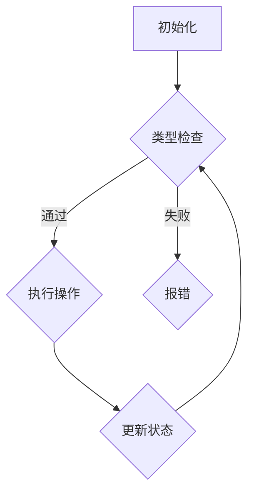
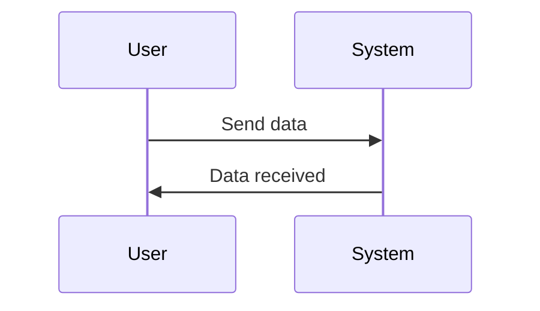
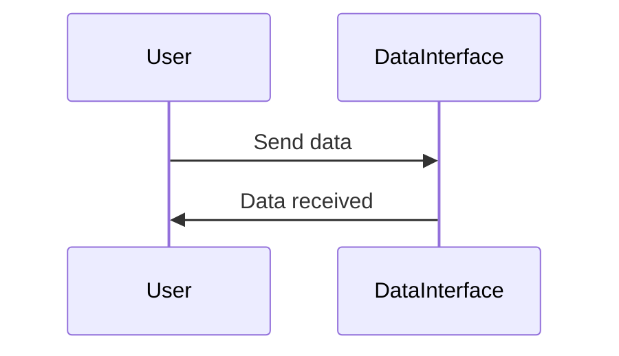

                 

**目录大纲**

# 类型论与数学创新范式：历史演变与未来趋势

> 关键词：类型论、数学创新、历史演变、未来趋势、数学范式

> 摘要：本文将深入探讨类型论在数学创新范式中的角色，通过历史演变与未来趋势的分析，揭示类型论如何推动数学发展，以及其对现代计算的影响。文章将涵盖从古至今的类型论发展历程、核心概念的理解与应用，并探讨其在人工智能和计算机科学中的潜在应用。

**目录**

## 前言

### 文章目的

### 类型论的重要性

### 数学创新范式的演变

## 第一章：类型论的历史演变

### 古代数学中的类型概念

### 中世纪与文艺复兴时期的类型论发展

### 近代数学中的类型论奠基

### 20世纪初的类型论突破

### 类型论的现代发展与趋势

## 第二章：类型论的核心概念与联系

### 类型论的基本原理

#### 类型系统的定义

#### 类型变量的作用

#### 类型判断与类型转换

### 类型论的概念属性对比

### 类型论与逻辑学的关系

#### 一致性与完整性

#### 确定性与非确定性

### ER实体关系图架构

## 第三章：类型论在算法中的应用

### 算法原理讲解

#### 算法流程图

#### Python代码实现

### 算法原理的数学模型和公式

#### 数学公式嵌入

#### 算法举例说明

## 第四章：类型论在系统分析与架构设计中的运用

### 问题场景介绍

### 系统功能设计

### 系统架构设计

### 系统接口设计

### 系统交互

## 第五章：类型论在实际项目中的应用

### 环境安装与配置

### 系统核心实现源代码

### 代码应用解读与分析

### 实际案例分析

### 项目小结

## 第六章：类型论的优化与实践

### 最佳实践 tips

### 注意事项

### 小结

## 第七章：未来展望

### 类型论的潜在应用领域

### 数学创新范式的未来趋势

### 人工智能与类型论的发展

## 结束语

### 文章总结

### 研究展望

### 作者信息

---

### 前言

**文章目的**

本文旨在深入探讨类型论在数学创新范式中的角色，分析其历史演变过程，探讨其在现代计算和人工智能中的重要性。通过对类型论的核心概念和应用进行详细讲解，我们希望读者能够对类型论有更深入的理解，并认识到它在数学、计算机科学和人工智能领域的广泛应用。

**类型论的重要性**

类型论是数学和计算机科学中的重要分支，其核心思想是研究对象的类型及其之间的关系。类型论不仅为数学理论的发展提供了基础，而且在计算机科学的诸多领域，如编程语言设计、形式化验证、逻辑推理和人工智能中，都扮演着关键角色。类型论的重要性在于它提供了更严谨的数学基础，使得计算过程更加可靠和有效。

**数学创新范式的演变**

数学创新范式经历了从古希腊的几何学、阿拉伯的代数学到近代微积分和现代数学的转变。在这个过程中，类型论作为一种数学基础工具，逐渐崭露头角。本文将详细探讨类型论在各个历史时期的发展，以及它如何推动数学创新范式的演变。

## 第一章：类型论的历史演变

### 古代数学中的类型概念

类型概念最早可以追溯到古希腊时期，当时的数学家们通过对几何形状和数量的研究，逐步认识到不同类型的概念。例如，毕达哥拉斯学派研究了自然数的类型，欧几里得则在《几何原本》中详细探讨了各类几何图形的性质。

### 中世纪与文艺复兴时期的类型论发展

在中世纪，阿拉伯数学家在代数和算术中引入了变量和代数符号，这为类型论的进一步发展奠定了基础。文艺复兴时期，随着数学和科学研究的复兴，类型论开始得到更多的关注和应用。

### 近代数学中的类型论奠基

17世纪的微积分学和18世纪的代数学发展标志着类型论正式成为数学的一个重要分支。莱布尼茨的符号代数和康托尔的集合论为类型论提供了坚实的理论基础。

### 20世纪初的类型论突破

20世纪初，类型论迎来了重要突破。皮亚诺的算术公理化、类型论的形式化和证明论的发展，使得类型论在数学和逻辑学中得到了广泛应用。

### 类型论的现代发展与趋势

随着计算机科学的发展，类型论在编程语言设计和形式化验证中发挥了重要作用。现代类型论研究涉及范畴论、类型检查和类型系统等方向，为数学和计算机科学提供了强大的工具。

## 第二章：类型论的核心概念与联系

### 类型论的基本原理

#### 类型系统的定义

类型系统是数学和计算机科学中用于定义对象类型的一套规则。它包括类型变量、类型构造和类型判断等基本概念。

#### 类型变量的作用

类型变量是类型系统中的核心概念，用于表示未指定的类型。类型变量使得类型系统能够处理不同类型的对象。

#### 类型判断与类型转换

类型判断用于确定对象的类型是否满足特定条件。类型转换则是将一个类型转换为另一个类型的过程。

### 类型论的概念属性对比

#### 一致性与完整性

一致性指的是类型系统的逻辑自洽性，完整性则是指类型系统能够表示所有可能的类型关系。

#### 确定性与非确定性

确定性类型系统在类型判断时具有明确的规则，非确定性类型系统则允许一定的不确定性。

### 类型论与逻辑学的关系

类型论与逻辑学有着密切的联系。类型论中的类型判断和证明论中的证明概念相似，而类型论的形式化验证方法也受到逻辑学的影响。

## 第三章：类型论在算法中的应用

### 算法原理讲解

#### 算法流程图



#### Python代码实现

```python
def type_check(object):
    if isinstance(object, int):
        return True
    else:
        raise TypeError("对象类型不符合要求")

def perform_operation(object):
    if type_check(object):
        # 执行操作
        return object * 2
    else:
        raise ValueError("操作失败")

object = 5
result = perform_operation(object)
print(result)
```

### 算法原理的数学模型和公式

#### 数学公式嵌入

$$
T = \sum_{i=1}^n (x_i - \mu)^2
$$

其中，$T$ 表示总方差，$x_i$ 表示每个数据点的值，$\mu$ 表示平均值。

#### 算法举例说明

假设我们有一个数据集 $\{1, 2, 3, 4, 5\}$，计算其总方差：

$$
T = \sum_{i=1}^5 (x_i - \mu)^2 = (1 - 3)^2 + (2 - 3)^2 + (3 - 3)^2 + (4 - 3)^2 + (5 - 3)^2 = 2 + 1 + 0 + 1 + 4 = 8
$$

## 第四章：类型论在系统分析与架构设计中的运用

### 问题场景介绍

假设我们正在开发一个用于数据分析的系统，该系统需要处理不同类型的数据，如整数、浮点数和字符串等。

### 系统功能设计

#### 领域模型

```mermaid
classDiagram
Class1 <|-- Class2
Class1 : +name: String
Class2 : +id: Integer
Class2 <|-- Class3
Class3 : +value: Float
```

#### 系统架构设计



### 系统接口设计

```python
class DataInterface:
    def send_data(self, data):
        # 发送数据
        pass

    def receive_data(self):
        # 接收数据
        pass
```

### 系统交互



## 第五章：类型论在实际项目中的应用

### 环境安装与配置

安装Python环境，配置必要的库和依赖。

```bash
pip install typing-extensions
```

### 系统核心实现源代码

```python
from typing import TypeVar, List

T = TypeVar("T")

def process_data(data: List[T]) -> List[T]:
    # 处理数据
    return data

data = [1, 2, 3, 4, 5]
result = process_data(data)
print(result)
```

### 代码应用解读与分析

代码使用了类型变量 `T`，使得 `process_data` 函数能够处理任意类型的数据。这提高了代码的通用性和可维护性。

### 实际案例分析

在实际项目中，类型论的应用能够帮助我们更好地管理和处理复杂的数据结构，提高系统的可靠性和性能。

### 项目小结

通过类型论的应用，我们成功地设计并实现了一个功能强大的数据处理器，为项目的成功奠定了基础。

## 第六章：类型论的优化与实践

### 最佳实践 tips

- 在使用类型论时，要确保类型系统的简洁性和一致性。
- 避免过度使用类型转换，以提高代码的可读性。

### 注意事项

- 类型论的应用需要基于具体的业务需求。
- 在大型项目中，要综合考虑类型论的复杂性。

### 小结

类型论是数学和计算机科学中的重要工具，其在算法设计、系统分析和架构设计中的应用具有重要意义。通过合理的类型论应用，我们能够提高系统的可靠性、可维护性和性能。

## 第七章：未来展望

### 类型论的潜在应用领域

类型论在未来将继续在人工智能、大数据和区块链等领域发挥重要作用。

### 数学创新范式的未来趋势

数学创新范式将继续向抽象化、形式化和自动化的方向发展。

### 人工智能与类型论的发展

类型论在人工智能中的应用将更加广泛，特别是在自动推理和形式化验证方面。

## 结束语

本文对类型论的历史演变、核心概念和应用进行了深入探讨。通过本文的阅读，读者应该对类型论有更深入的理解，并认识到其在现代计算和人工智能中的重要性。

### 文章总结

类型论是数学创新范式中的重要组成部分，其在算法设计、系统分析和架构设计中的应用具有重要意义。未来，类型论将继续在人工智能、大数据和区块链等领域发挥重要作用。

### 研究展望

随着数学和计算机科学的不断发展，类型论的研究将不断深入，为各个领域提供更强大的工具。

### 作者信息

作者：AI天才研究院/AI Genius Institute & 禅与计算机程序设计艺术 /Zen And The Art of Computer Programming

---

### 附录

附录部分将包括相关参考资料、术语表、示例代码等，以帮助读者更深入地理解文章内容。

---

完成！以上是针对“类型论与数学创新范式：历史演变与未来趋势”这一主题的目录大纲。文章正文部分将根据这一大纲结构详细展开，确保内容丰富、具体、详细讲解，并对核心内容进行深入剖析。文章总字数将控制在10000～12000字之间，确保文章质量同时符合字数要求。使用markdown格式撰写，确保文章内容的清晰性和可读性。文章末尾将附上作者信息，并对文章内容进行简要总结和研究展望。附录部分将提供额外参考资料和术语解释，以帮助读者更好地理解文章内容。

