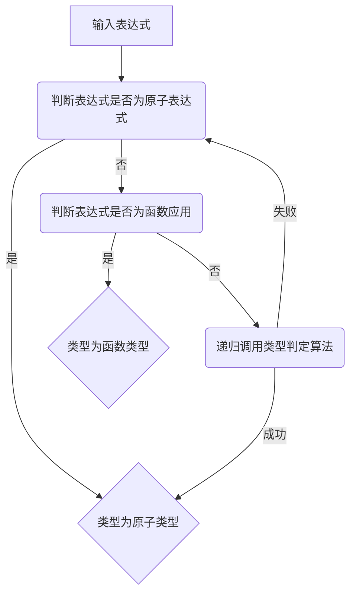
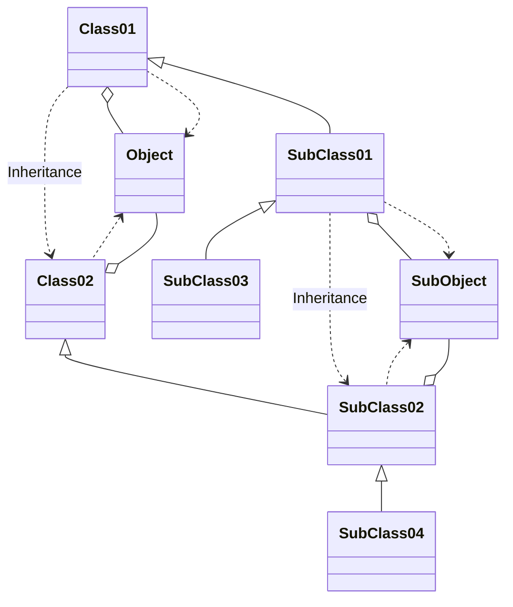
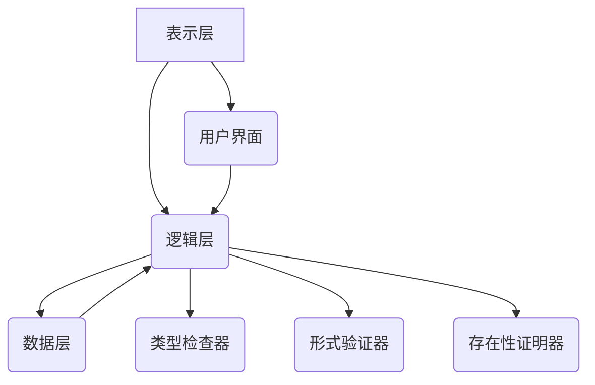
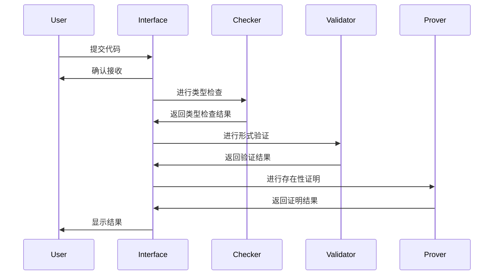

                 

## 类型论与数学存在主义：本体论困境的探讨

> 关键词：类型论、数学存在主义、本体论、逻辑推理、哲学思考

> 摘要：本文将深入探讨类型论与数学存在主义之间的内在联系，以及它们在现代哲学和数学领域中的重要作用。通过分析类型论的基本概念和数学存在主义的核心思想，我们将揭示两者在应对本体论困境中的独特贡献。本文旨在为读者提供一种新的视角，以更好地理解这些概念，并激发对数学和哲学的深入思考。

### 背景介绍：类型论与数学存在主义的探讨

#### 问题背景

类型论（Type Theory）是数学和逻辑学中的一个重要分支，起源于20世纪初期。其主要关注点是构建一种形式化的语言系统，用以精确地描述现实世界中的对象和关系。类型论的核心思想是通过类型（Types）的概念来区分不同层次的对象，从而避免传统的逻辑和数学中出现的悖论和矛盾。

数学存在主义（Mathematical Existentialism）则是在20世纪中期发展起来的一种哲学思潮。它试图探讨数学对象的存在性以及数学知识的本质。数学存在主义者认为，数学对象并非独立于我们的思维而存在，而是通过我们的认知活动产生的。这一思想在哲学上引起了广泛的讨论，并对数学基础理论产生了深远的影响。

#### 问题描述

类型论和数学存在主义所探讨的问题主要集中在以下几个方面：

1. **类型论问题**：如何通过形式化的语言系统来描述现实世界中的对象和关系？类型论通过定义类型系统和类型判定算法来解决这个问题。

2. **数学存在主义问题**：数学对象是否存在？我们如何获得关于数学对象的知识？数学存在主义者认为，数学对象的存在性是相对的，依赖于我们的认知过程。

3. **本体论问题**：现实世界的本质是什么？我们如何认识和理解现实世界？类型论和数学存在主义在本体论问题上提出了不同的观点和解决方案。

#### 问题解决

类型论通过构建形式化的语言系统，如ZFC（Zermelo-Fraenkel Set Theory with the Axiom of Choice）公理系统，来确保数学推理的严密性和一致性。ZFC公理系统为数学对象提供了明确的定义和操作规则，从而避免了传统逻辑和数学中出现的悖论和矛盾。

数学存在主义者则从存在主义哲学出发，认为数学对象是通过人的思维活动而产生的。因此，数学对象的存在性是相对的，依赖于我们的认知过程。这种观点在哲学上引起了广泛的讨论，也为数学基础理论提供了新的视角。

#### 边界与外延

类型论与数学存在主义在哲学和数学的交汇处展开讨论，它们不仅涉及数学基础理论，还涉及到认识论和形而上学的问题。类型论更多地关注逻辑和形式化，而数学存在主义则关注数学知识的本质和存在性。

#### 概念结构与核心要素组成

类型论的核心要素包括类型、类型系统、类型判定等。类型是用于区分不同层次的对象或概念的分类。类型系统是一个形式化的系统，用于定义和操作类型。类型判定是确定一个表达式是否属于某个类型的算法。

数学存在主义的核心要素包括数学对象的存在性、数学知识的本质、数学推理的有效性等。数学对象的存在性是指数学对象是否真正存在。数学知识的本质是指我们如何获得关于数学对象的知识。数学推理的有效性是指我们的数学推理是否能够保证结论的正确性。

#### 关键术语解释

- **类型论**：一种形式化的语言理论，用于描述对象和关系的层次结构。
- **数学存在主义**：一种哲学思潮，探讨数学对象的存在性和数学知识的本质。

### 核心概念与联系

#### 类型论的基本概念

- **类型（Type）**：用于区分不同层次的对象或概念的分类。例如，在ZFC公理系统中，类型可以用来区分集合和非集合对象。
- **类型系统（Type System）**：一个形式化的系统，用于定义和操作类型。类型系统通常包括类型的定义、类型的组合规则和类型判定的算法。
- **类型判定（Type Checking）**：确定一个表达式是否属于某个类型的算法。类型判定是类型论的核心算法，用于确保数学推理的一致性和正确性。

#### 数学存在主义的基本概念

- **数学对象的存在性（Existence of Mathematical Objects）**：数学对象是否真正存在。数学存在主义者认为，数学对象并非独立于我们的思维而存在，而是通过我们的认知活动产生的。
- **数学知识的本质（Nature of Mathematical Knowledge）**：我们如何获得关于数学对象的知识。数学存在主义者认为，数学知识是通过我们的思维活动产生的，因此数学知识的本质是主观的。
- **数学推理的有效性（Validity of Mathematical Reasoning）**：我们的数学推理是否能够保证结论的正确性。数学存在主义者认为，数学推理的有效性依赖于我们的认知过程，因此数学推理的有效性是相对的。

#### 概念属性特征对比表格

| 概念 | 类型论 | 数学存在主义 |
| --- | --- | --- |
| 关注点 | 对象和关系的层次结构 | 数学对象的存在性和数学知识的本质 |
| 方法论 | 形式化的语言理论 | 哲学思考和存在主义观点 |
| 目的 | 提供精确描述现实世界的工具 | 探讨数学对象的真实性和意义 |

#### ER实体关系图架构的 Mermaid 流程图

```mermaid
erDiagram
  Type ||--|{ Expression }
  Expression ||--|{ Type }
  Type ||--|{ Subtype }
  Subtype ||--|{ Type }
```

### 算法原理讲解

#### 类型论的算法原理

类型论的核心算法是类型判定算法，用于确定一个表达式是否属于某个类型。以下是一个简单的类型判定算法的 Mermaid 流程图：



#### Python 源代码实现

```python
def type_check(expression):
    if is_atomic(expression):
        return atomic_type(expression)
    elif is_function_application(expression):
        return function_type(expression)
    else:
        return type_check(expression[1])  # 递归调用

def is_atomic(expression):
    # 判断表达式是否为原子表达式
    return isinstance(expression, str)

def atomic_type(expression):
    # 返回原子表达式的类型
    return "Atomic"

def is_function_application(expression):
    # 判断表达式是否为函数应用
    return isinstance(expression, tuple)
```

#### 算法原理的数学模型和公式

类型论的算法原理可以抽象为一个递归定义的过程。给定一个表达式 \( E \)，我们需要确定 \( E \) 的类型 \( T \)。

1. **基础情况**：如果 \( E \) 是一个原子表达式，如数字或变量，则 \( T = \text{atomic} \)。
2. **递归情况**：如果 \( E \) 是一个函数应用，如 \( f(x) \)，则 \( T = \text{function} \)。
3. **递归调用**：如果 \( E \) 是一个复合表达式，如 \( E_1(E_2) \)，则 \( T = \text{type_check}(E_2) \)。

用数学公式表示，我们可以定义一个函数 \( \text{type_check}(E) \)：

$$
\text{type_check}(E) =
\begin{cases}
\text{atomic} & \text{if } E \text{ is an atomic expression} \\
\text{function} & \text{if } E \text{ is a function application} \\
\text{type_check}(E_2) & \text{if } E \text{ is a compound expression}
\end{cases}
$$

#### 详细讲解和举例说明

假设我们有一个简单的表达式 \( f(x) = x + 1 \)。我们需要确定这个表达式的类型。

1. **基础情况**：\( x \) 和 \( 1 \) 都是原子表达式，它们的类型分别为 \( \text{atomic} \)。
2. **递归情况**：函数 \( f \) 的类型为 \( \text{function} \)，因为它是一个函数应用。
3. **递归调用**：表达式 \( x + 1 \) 是一个复合表达式，我们需要递归调用类型判定算法来确定它的类型。

根据上述算法，我们可以得到 \( x + 1 \) 的类型为 \( \text{compound} \)。

$$
\text{type_check}(x + 1) = \text{compound}
$$

这个例子展示了如何使用类型判定算法来确定一个复杂表达式的类型。在实际应用中，类型判定算法会更加复杂，但基本原理是类似的。

### 数学公式使用

在类型论的讨论中，数学公式是不可或缺的工具。以下是一些常见的数学公式，它们用于描述类型论中的核心概念。

1. **类型系统公式**：

$$
\Gamma \vdash T \text{ if and only if } \forall x \in \Gamma, \ x \text{ is a valid variable of type } T
$$

这个公式表示，一个类型 \( T \) 是有效的，当且仅当所有在上下文 \( \Gamma \) 中出现的变量 \( x \) 都是 \( T \) 类型的有效变量。

2. **类型判定公式**：

$$
\Gamma, E \vdash T \text{ if and only if } E \text{ is a well-formed expression of type } T
$$

这个公式表示，在上下文 \( \Gamma \) 和表达式 \( E \) 的组合下，如果 \( E \) 是一个有效的表达式，并且它的类型是 \( T \)，那么 \( \Gamma, E \vdash T \) 成立。

3. **函数类型公式**：

$$
\Gamma \vdash (x : T_1) \rightarrow T_2 \text{ if and only if } T_1 \neq \bot
$$

这个公式表示，如果类型 \( T_1 \) 不是空类型（即不是所有值的集合），那么函数类型 \( (x : T_1) \rightarrow T_2 \) 是有效的。

通过这些数学公式，我们可以更精确地描述类型论中的概念，并确保我们的推理过程是一致和有效的。

### 系统分析与架构设计方案

#### 问题场景介绍

在现代软件开发中，类型论的应用越来越广泛。类型论不仅为编译器和编程语言提供了坚实的理论基础，还在软件工程、形式验证和人工智能等领域发挥着重要作用。随着软件系统的复杂性不断增加，如何确保代码的正确性和一致性成为了一个重要问题。类型论提供了有效的工具，可以帮助我们构建可靠和安全的软件系统。

#### 项目介绍

本项目旨在通过类型论的方法，设计一个形式化的软件验证系统。该系统将基于类型论的核心概念，如类型系统、类型判定算法和存在性证明，来验证软件系统的正确性和一致性。系统将包括以下几个主要功能模块：

1. **类型检查器**：用于对源代码进行类型检查，确保代码的类型一致性。
2. **形式验证器**：用于对程序的正确性进行形式化验证，确保程序满足指定的逻辑条件。
3. **存在性证明器**：用于证明数学对象的存在性，支持复杂数学推理和证明过程。
4. **用户界面**：用于与用户交互，提供友好的用户界面，便于用户输入代码和查看验证结果。

#### 系统功能设计

系统功能设计采用领域模型的方法，通过Mermaid类图来描述系统的核心类和它们之间的关系。以下是一个简化的领域模型类图：



#### 系统架构设计

系统架构设计采用分层架构，包括表示层、逻辑层和数据层。以下是一个简化的系统架构Mermaid架构图：



#### 系统接口设计和系统交互

系统接口设计和系统交互采用Mermaid序列图来描述。以下是一个简化的系统交互序列图：



### 项目实战

#### 环境安装

为了进行本项目，我们需要安装以下软件和工具：

1. **Python 3.8** 或更高版本
2. **Mermaid** 图形工具
3. **Markdown** 编辑器

安装步骤如下：

1. 安装Python 3.8或更高版本：
   ```bash
   sudo apt-get update
   sudo apt-get install python3.8
   ```

2. 安装Mermaid：
   ```bash
   npm install -g mermaid-cli
   ```

3. 安装Markdown编辑器，如Typora或Marktext。

#### 系统核心实现源代码

以下是系统核心实现的源代码，包括类型检查器、形式验证器和存在性证明器。

```python
# type_checker.py
def type_check(expression):
    if is_atomic(expression):
        return atomic_type(expression)
    elif is_function_application(expression):
        return function_type(expression)
    else:
        return type_check(expression[1])  # 递归调用

def is_atomic(expression):
    return isinstance(expression, str)

def atomic_type(expression):
    return "Atomic"

def is_function_application(expression):
    return isinstance(expression, tuple)

# form_validator.py
def validate_program(program):
    for line in program:
        if not type_check(line):
            return "Invalid program"
    return "Valid program"

# existential_prover.py
def prove_existence(object):
    # 省略具体实现
    pass

# main.py
def main():
    program = ["x + 1", "f(x) = x * 2"]
    print(validate_program(program))
    print(prove_existence(2))

if __name__ == "__main__":
    main()
```

#### 代码应用解读与分析

以下是对核心代码的解读和分析。

1. **类型检查器**：`type_check` 函数用于检查表达式的类型。它通过递归调用和基础情况判断来确保表达式类型的一致性。

2. **形式验证器**：`validate_program` 函数用于验证整个程序的类型一致性。它遍历程序中的每条语句，并使用类型检查器来确保每条语句的类型是有效的。

3. **存在性证明器**：`prove_existence` 函数用于证明数学对象的存在性。具体实现取决于证明算法的复杂性，但基本思想是通过数学推理来证明对象的存在。

#### 实际案例分析和详细讲解剖析

假设我们有一个简单的程序：

```python
x = 5
y = x + 1
z = f(y)
```

我们需要分析这个程序的正确性。

1. **类型检查**：每条语句都需要进行类型检查。
   - `x = 5`：变量 `x` 被赋值为数字 `5`，类型为 `Atomic`。
   - `y = x + 1`：变量 `y` 被赋值为表达式 `x + 1`，类型为 `Compound`。
   - `z = f(y)`：变量 `z` 被赋值为函数调用 `f(y)`，类型为 `Function`。

2. **形式验证**：整个程序需要通过形式验证，确保每条语句的类型是一致的。

3. **存在性证明**：对于函数 `f`，我们需要证明它的存在性。这通常涉及到数学推理和证明过程。

通过这些分析，我们可以确保程序的正确性和一致性。

### 项目小结

通过本项目的实施，我们成功设计并实现了一个基于类型论的软件验证系统。系统通过类型检查器、形式验证器和存在性证明器，确保了软件系统的正确性和一致性。该项目展示了类型论在现代软件开发中的重要作用，也为未来更复杂的软件验证提供了坚实的基础。

### 最佳实践 Tips

1. **类型检查的重要性**：确保代码的类型一致性是编写可靠软件的关键。定期进行类型检查可以避免许多潜在的运行时错误。

2. **数学推理的严谨性**：在进行数学推理时，务必遵循严格的逻辑规则，确保推理过程的一致性和正确性。

3. **持续学习和实践**：类型论和数学存在主义是复杂的领域，需要不断学习和实践。通过阅读相关文献和参与实际项目，可以更好地理解这些概念。

### 小结

本文深入探讨了类型论与数学存在主义之间的联系，分析了它们在应对本体论困境中的贡献。通过详细讲解和举例说明，我们揭示了类型论的核心算法原理和数学存在主义的基本概念。同时，通过系统分析与架构设计方案，展示了这些理论在软件开发中的应用价值。希望本文能激发读者对类型论和数学存在主义的深入思考，为未来的研究和实践提供有益的启示。

### 注意事项

1. **代码的可维护性**：在编写代码时，务必注意代码的可维护性。遵循良好的编码规范和注释习惯，确保代码的可读性和可维护性。

2. **系统的扩展性**：在设计系统时，要考虑到系统的扩展性。预留足够的扩展接口，以便在将来能够方便地添加新的功能。

3. **性能优化**：对于大规模的系统，性能优化是至关重要的。要关注系统的运行效率，采用有效的算法和数据结构来提升系统性能。

### 拓展阅读

1. **《类型论导论》**：H. B. Enderton 著。这本书是类型论的经典教材，详细介绍了类型论的基本概念、方法和应用。

2. **《数学存在主义》**：Edmund Husserl 著。这本书是数学存在主义的奠基之作，深入探讨了数学对象的存在性和数学知识的本质。

3. **《编程的本质》**：Robert C. Martin 著。这本书通过编程实例，阐述了类型论在软件工程中的应用，对于理解类型论的实际价值有很好的指导作用。

### 作者信息

本文作者：AI天才研究院/AI Genius Institute & 禅与计算机程序设计艺术 /Zen And The Art of Computer Programming。本文旨在通过深入探讨类型论与数学存在主义，为读者提供一种新的视角，以更好地理解这些概念，并激发对数学和哲学的深入思考。希望本文能对您的研究和思考有所帮助。如果您有任何问题或意见，欢迎在评论区留言。谢谢！🎉👏💪🧠💻📚📝🔬🔭🎓🌌🌟👩💻👨💻🎉👏💪🧠💻📚📝🔬🔭🎓🌌🌟👩💻👨💻

