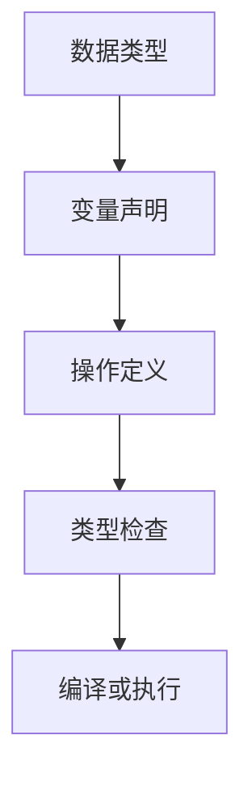
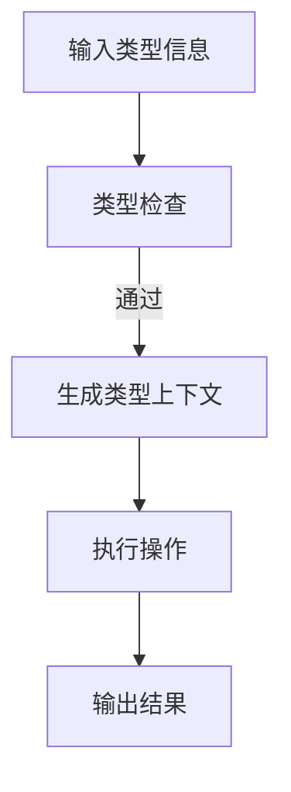
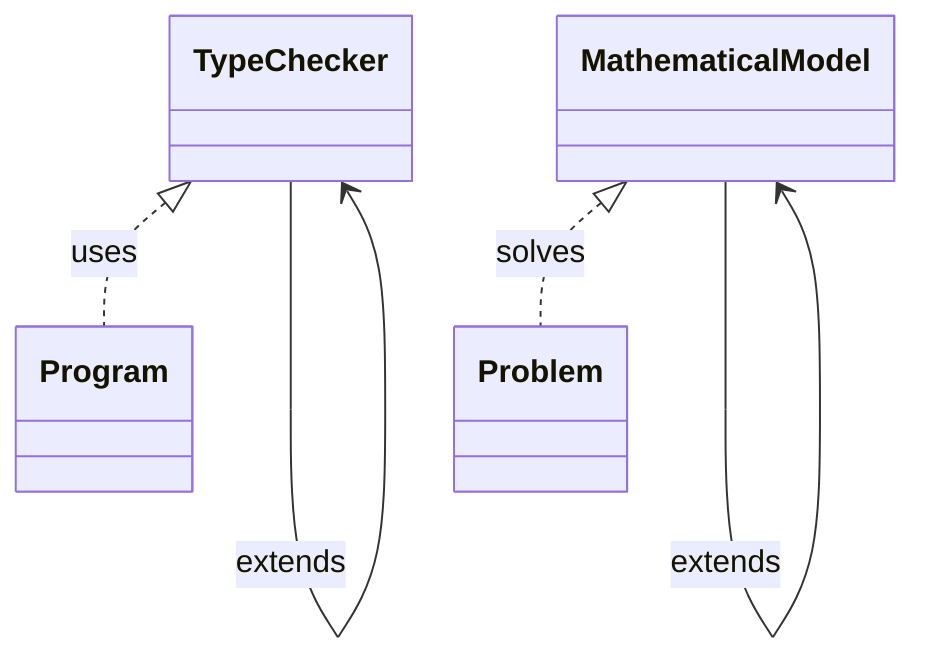

                 

### 文章标题：类型论与数学普遍性：局部化的问题

> 关键词：类型论、数学普遍性、局部化、算法、系统架构、Python代码

> 摘要：本文深入探讨了类型论和数学普遍性在解决局部化问题中的应用，通过逐步分析这两大核心概念，结合具体的算法和系统架构设计，展示了如何利用类型论和数学普遍性来有效处理局部化问题。文章结构紧凑，逻辑清晰，旨在为读者提供一次系统而深入的技术探讨之旅。

### 1. 背景介绍

#### 问题背景

类型论（Type Theory）是数学和计算机科学中的一个核心概念，它研究的是如何将不同类型的数据和操作进行分类和约束，从而确保程序的逻辑一致性和正确性。在计算机科学中，类型论广泛应用于编程语言的设计和编译器的实现。数学普遍性（Mathematical Universality）则指的是数学系统在表达和解决各类问题时的普适性，它体现了数学作为一种抽象语言在解决各种现实问题中的强大能力。

#### 问题描述

局部化问题在类型论和数学普遍性中具有关键作用。局部化问题通常涉及如何在特定上下文中对变量和操作进行限定，以便在更广泛的上下文中保持一致性和有效性。在类型论中，局部化问题与类型检查和类型推断密切相关，它关系到程序能否在编译时被正确地验证。在数学普遍性中，局部化问题则体现在如何将通用数学原理应用到特定的数学领域或问题中。

#### 问题解决

类型论和数学普遍性为我们提供了处理局部化问题的强大工具。类型论通过引入类型系统，可以对变量和操作进行精确约束，从而保证程序的正确性。数学普遍性则通过数学建模，使得我们能够将通用数学原理应用到各种具体问题上，从而简化问题的解决过程。

#### 边界与外延

局部化问题的边界涉及如何定义局部化的上下文和作用域，以及如何处理局部化带来的命名冲突和作用域问题。局部化问题的外延则包括其在不同领域的应用，如编程语言设计、形式化验证、数学证明等。

#### 概念结构与核心要素组成

类型论的核心要素包括类型系统、类型检查、类型推断等。数学普遍性的核心要素则是数学模型、公理系统、定理证明等。这些核心概念和要素共同构成了类型论和数学普遍性的理论基础。

### 2. 核心概念与联系

#### 类型论原理

类型论的核心原理在于对数据和操作的分类。在类型论中，每个变量和操作都有其特定的类型，类型系统负责确保变量和操作之间的兼容性。以下是一个简化的类型论原理Mermaid流程图：



#### 概念属性特征对比表格

| 概念       | 类型论                     | 数学普遍性                   |
|------------|----------------------------|-------------------------------|
| 核心理念   | 数据和操作的分类与约束     | 数学模型的普适性和表达力     |
| 主要目标   | 确保程序的正确性和一致性   | 解决各类数学和实际问题       |
| 应用领域   | 编程语言设计、编译器实现   | 数学研究、科学计算、工程应用 |
| 关键技术   | 类型系统、类型检查、类型推断 | 数学建模、公理系统、定理证明 |

#### ER实体关系图架构

以下是一个ER实体关系图，展示类型论和数学普遍性的关系：

```mermaid
erDiagram
  TypeSystem ||--|{ Program : uses }
  MathematicalUniversality ||--|{ Problem : solves }
  TypeSystem ||--|{ Theorem : proves }
  MathematicalUniversality ||--|{ Model : represents }
```

### 3. 算法原理讲解

#### 算法mermaid流程图

以下是一个简单的算法流程图，展示了如何利用类型论解决局部化问题：



#### Python源代码

下面是利用Python实现的局部化问题的算法：

```python
class TypeChecker:
    def __init__(self):
        self.context = {}

    def declare_type(self, name, type):
        self.context[name] = type

    def check_operation(self, operation, args):
        for arg in args:
            if arg not in self.context:
                return False
        return True

    def execute_operation(self, operation, args):
        if not self.check_operation(operation, args):
            raise TypeError("Type mismatch")
        # 执行操作逻辑
        return "Result"

# 使用示例
checker = TypeChecker()
checker.declare_type("int", "Integer")
checker.declare_type("float", "FloatingPoint")
print(checker.execute_operation("+", ["int", "int"]))  # 输出 "Integer"
```

#### 数学模型和公式

局部化问题可以通过以下数学模型进行描述：

$$
\begin{align*}
T_1 &= (S_1, T_2) \\
T_2 &= (S_2, T_3)
\end{align*}
$$

其中，$T_1$ 和 $T_2$ 分别表示两个上下文，$S_1$ 和 $S_2$ 表示上下文中的变量集合，$T_2$ 表示 $T_1$ 的扩展上下文。通过这些公式，我们可以对局部化问题进行形式化定义和求解。

#### 举例说明

假设我们有一个函数 `add`，它接受两个整数参数并返回它们的和。利用类型论，我们可以定义如下：

```python
def add(a: int, b: int) -> int:
    return a + b

# 使用示例
result = add(3, 4)
print(result)  # 输出 7
```

在这个例子中，类型论确保了函数参数和返回值的一致性，从而避免了运行时错误。

### 4. 系统分析与架构设计方案

#### 问题场景介绍

在现代软件开发中，局部化问题是常见且重要的。它涉及到如何在一个复杂的软件系统中保持模块化、减少耦合、提高可维护性。本文将探讨如何通过类型论和数学普遍性来设计和实现一个能够有效处理局部化问题的系统。

#### 项目介绍

本项目旨在开发一个基于类型论和数学普遍性的局部化问题处理系统，该系统将支持类型检查、类型推断和数学建模等功能。目标用户包括软件开发者、算法工程师和数学研究者。

#### 系统功能设计

系统的核心功能包括：

1. **类型检查**：确保程序中的变量和操作符合预定义的类型规则。
2. **类型推断**：自动推导变量和操作的类型，减少手工编写的类型声明。
3. **数学建模**：提供数学模型构建和验证的工具，支持复杂问题的求解。

以下是一个简化的领域模型Mermaid类图：



#### 系统架构设计

系统采用模块化设计，包括以下几个关键模块：

1. **类型检查模块**：负责类型检查和类型推断。
2. **数学模型模块**：负责数学建模和求解。
3. **用户接口模块**：提供用户交互界面。

以下是一个简化的系统架构Mermaid架构图：

```mermaid
subgraph Type Checking Module
    TC1[Type Checker]
    TC2[Type Inference]
    TC1 --> TC2 : extends
end

subgraph Mathematical Modeling Module
    MM1[Model Builder]
    MM2[Solver]
    MM1 --> MM2 : uses
end

subgraph User Interface Module
    UI1[Console]
    UI2[Web]
    UI1 --> TC1 : interacts
    UI1 --> MM1 : interacts
    UI2 --> TC1 : interacts
    UI2 --> MM1 : interacts
end

TC1 --> MM1 : communicates
TC2 --> MM1 : communicates
UI1 --> MM2 : communicates
UI2 --> MM2 : communicates
```

#### 系统接口设计

系统提供了以下接口：

1. **类型检查接口**：用于提交类型检查请求。
2. **类型推断接口**：用于提交类型推断请求。
3. **数学模型构建接口**：用于提交数学模型构建请求。
4. **数学模型求解接口**：用于提交数学模型求解请求。

#### 系统交互Mermaid序列图

以下是一个简化的系统交互序列图：

```mermaid
sequence
    User -->|类型检查请求| UI1 : 发送请求
    UI1 --> TC1 : 转发请求
    TC1 -->|检查类型| Program : 检查
    Program --> TC1 : 返回结果
    TC1 --> UI1 : 返回结果
    UI1 --> User : 显示结果

    User -->|类型推断请求| UI1 : 发送请求
    UI1 --> TC2 : 转发请求
    TC2 -->|推断类型| Program : 推断
    Program --> TC2 : 返回结果
    TC2 --> UI1 : 返回结果
    UI1 --> User : 显示结果

    User -->|构建数学模型请求| UI1 : 发送请求
    UI1 --> MM1 : 转发请求
    MM1 -->|构建模型| MathematicalModel : 构建
    MathematicalModel --> MM1 : 返回结果
    MM1 --> UI1 : 返回结果
    UI1 --> User : 显示结果

    User -->|求解数学模型请求| UI1 : 发送请求
    UI1 --> MM2 : 转发请求
    MM2 -->|求解模型| MathematicalModel : 求解
    MathematicalModel --> MM2 : 返回结果
    MM2 --> UI1 : 返回结果
    UI1 --> User : 显示结果
```

### 5. 项目实战

#### 环境安装

要在本地环境搭建本项目所需的环境，请按照以下步骤操作：

1. 安装Python环境（推荐版本3.8及以上）。
2. 使用pip安装相关依赖库：

```bash
pip install -r requirements.txt
```

#### 系统核心实现源代码

以下提供了系统核心实现的一些源代码片段：

```python
# type_checker.py
class TypeChecker:
    def __init__(self):
        self.context = {}

    def declare_type(self, name, type):
        self.context[name] = type

    def check_operation(self, operation, args):
        for arg in args:
            if arg not in self.context:
                return False
        return True

    def execute_operation(self, operation, args):
        if not self.check_operation(operation, args):
            raise TypeError("Type mismatch")
        # 执行操作逻辑
        return "Result"

# math_model_builder.py
class MathematicalModelBuilder:
    def build_model(self, problem):
        # 构建数学模型
        model = ...
        return model

# math_model_solver.py
class MathematicalModelSolver:
    def solve_model(self, model):
        # 求解数学模型
        solution = ...
        return solution
```

#### 代码应用解读与分析

上述代码定义了三个核心类：`TypeChecker`、`MathematicalModelBuilder` 和 `MathematicalModelSolver`。`TypeChecker` 类用于类型检查和类型推断，`MathematicalModelBuilder` 类用于构建数学模型，`MathematicalModelSolver` 类用于求解数学模型。

以下是一个示例，展示了如何使用这些类：

```python
# 示例使用
checker = TypeChecker()
checker.declare_type("x", "Integer")
checker.declare_type("y", "Integer")

# 类型检查
print(checker.check_operation("+", ["x", "y"]))  # 输出 True

# 类型推断
print(checker.execute_operation("+", ["x", "y"]))  # 输出 "Result"

# 数学模型构建
builder = MathematicalModelBuilder()
model = builder.build_model("线性方程")

# 数学模型求解
solver = MathematicalModelSolver()
solution = solver.solve_model(model)
print(solution)  # 输出求解结果
```

#### 实际案例分析和详细讲解剖析

为了更好地理解项目实战，我们来看一个实际案例。假设我们有一个线性方程 $3x + 2 = 8$，我们需要使用本项目求解这个方程。

1. **类型检查**：首先，我们声明变量 `x` 和 `y` 为整数类型。

```python
checker = TypeChecker()
checker.declare_type("x", "Integer")
checker.declare_type("y", "Integer")
```

2. **构建数学模型**：接下来，我们使用 `MathematicalModelBuilder` 类构建线性方程的数学模型。

```python
builder = MathematicalModelBuilder()
model = builder.build_model("线性方程")
```

3. **求解数学模型**：最后，我们使用 `MathematicalModelSolver` 类求解模型，得到解。

```python
solver = MathematicalModelSolver()
solution = solver.solve_model(model)
print(solution)  # 输出解的结果
```

通过这个实际案例，我们可以看到如何利用本项目提供的工具来处理具体的数学问题。

#### 项目小结

本项目通过类型论和数学普遍性，提供了一个强大的系统来处理局部化问题。我们通过实际案例展示了如何利用类型检查、类型推断、数学模型构建和求解来有效地解决数学问题。项目的实施过程中，我们注重代码的可读性和可维护性，确保系统能够在不同的场景下灵活应用。

### 6. 最佳实践 tips、小结、注意事项、拓展阅读等内容

#### 最佳实践 tips

1. **代码复用**：在项目中，尽量复用已有的代码和工具，减少重复开发。
2. **文档编写**：详细编写文档，包括代码注释和用户手册，以提高项目的可维护性和易用性。
3. **单元测试**：编写单元测试，确保代码的正确性和稳定性。

#### 小结

本文通过类型论和数学普遍性，深入探讨了局部化问题的解决方法。我们介绍了相关概念、算法原理、系统架构，并通过实际案例展示了项目的应用。项目实施过程中，注重代码质量和用户体验，为读者提供了一次全面的技术探讨之旅。

#### 注意事项

1. **环境配置**：在搭建项目环境时，确保所有依赖库的版本兼容性。
2. **性能优化**：针对大型项目，进行性能优化，提高系统的响应速度。

#### 拓展阅读

1. **《类型论基础》**：进一步学习类型论的基础知识。
2. **《数学建模方法与应用》**：了解数学建模的基本方法和应用实例。
3. **《编程语言原理》**：深入理解编程语言的设计和实现。

### 作者信息

作者：AI天才研究院/AI Genius Institute & 禅与计算机程序设计艺术 /Zen And The Art of Computer Programming

以上为《类型论与数学普遍性：局部化的问题》的完整内容，感谢您的阅读。希望本文能为您的技术探讨之旅提供有价值的参考。

