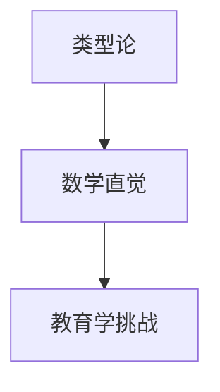
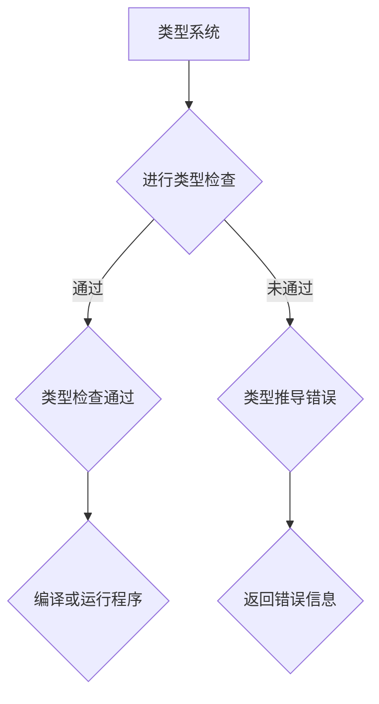
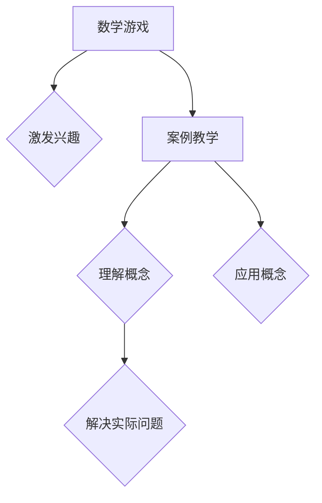
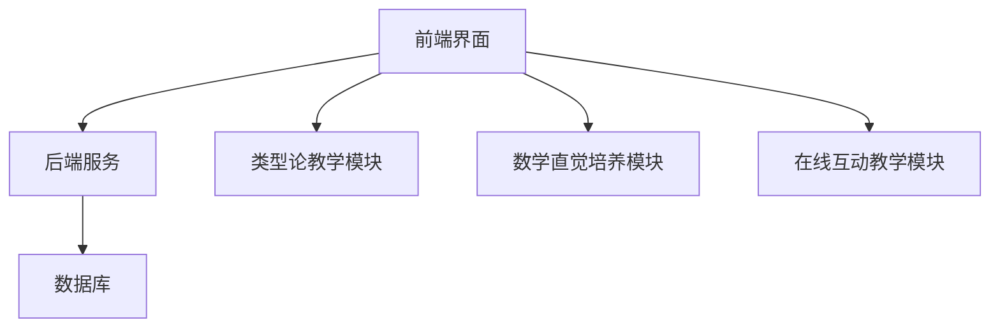
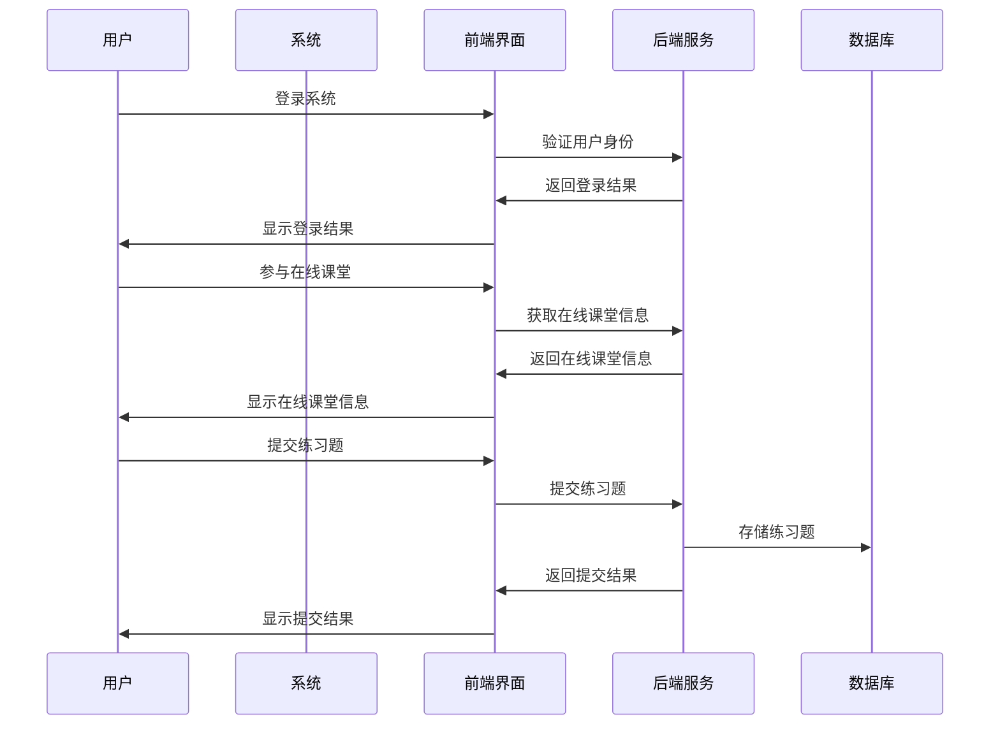

                 

# 类型论与数学直觉培养：教育学的挑战

关键词：类型论、数学直觉、教育学、算法原理、系统架构设计

摘要：本文旨在探讨类型论和数学直觉培养在教育领域的应用与挑战。类型论是一种数学和逻辑理论，研究对象的分类和类型的结构，对计算机编程和数学教育具有重要意义。数学直觉培养则是通过教育方法，使个体在数学学习中发展出直观感受和快速判断的能力。在教育学中，如何将抽象的数学概念转化为易于理解的教学内容，以及如何培养学生的数学直觉，是亟待解决的重要问题。本文将深入分析类型论和数学直觉培养的核心概念，讨论其在教育中的应用，并提出相应的算法原理和系统架构设计方案，以期为教育工作者提供有益的参考。

### 第一部分：背景介绍

#### 核心概念

**类型论**：类型论是一种数学和逻辑理论，旨在研究对象的分类和类型的结构。在计算机科学中，类型论提供了编程语言的基础，帮助确保程序的正确性和安全性。类型论的核心概念包括类型系统、类型检查和类型推导等。

- **类型系统**：确保编程语言中的变量、函数和表达式具有明确的类型。
- **类型检查**：在编译或运行时检查程序是否遵循类型规则。
- **类型推导**：自动推导出程序中表达式的类型。

**数学直觉培养**：数学直觉培养是指通过教育方法，使个体在数学学习中发展出直观感受和快速判断的能力。这种能力有助于学生更好地理解和解决问题。

- **直观感受**：学生能够通过观察和经验，快速理解数学概念和应用。
- **快速判断**：学生在解决实际问题时，能够迅速做出准确的判断。

**教育学挑战**：教育学挑战涉及如何在教育过程中有效地教授类型论和培养数学直觉，以帮助学生更好地掌握数学知识。

- **挑战一**：如何将抽象的数学概念转化为易于理解的教学内容？
- **挑战二**：如何培养学生的数学直觉，使其能够在解决实际问题时迅速做出准确的判断？

#### 问题解决

为了解决教育学中的这些挑战，我们可以采取以下方法：

1. **直观教学**：通过具体案例和实际应用，将抽象的数学概念转化为易于理解的教学内容。
2. **问题导向**：设计具有挑战性的数学问题，引导学生运用数学直觉解决问题。
3. **互动学习**：利用计算机编程和数学游戏，激发学生的兴趣和参与度。

#### 边界与外延

- **边界**：类型论和数学直觉培养主要应用于中小学数学教育、高等教育计算机科学课程以及职业培训中。
- **外延**：这些概念也适用于在线教育、翻转课堂等新兴教育模式。

### 第二部分：核心概念与联系

#### 核心概念原理

**类型论**：

类型论是一种数学和逻辑理论，研究对象的分类和类型的结构。其核心原理包括：

- **类型系统**：确保编程语言中的变量、函数和表达式具有明确的类型。
- **类型检查**：在编译或运行时检查程序是否遵循类型规则。
- **类型推导**：自动推导出程序中表达式的类型。

**数学直觉培养**：

数学直觉培养是指通过教育方法，使个体在数学学习中发展出直观感受和快速判断的能力。其核心原理包括：

- **直观感受**：通过观察和经验，快速理解数学概念和应用。
- **快速判断**：在解决实际问题时，迅速做出准确的判断。

#### 概念属性特征对比表格

| 概念       | 属性特征                              |
|------------|-------------------------------------|
| 类型论     | 研究对象的分类和类型结构            |
| 数学直觉   | 快速判断能力、直观感受能力          |
| 教育学挑战 | 如何有效教授类型论和培养数学直觉    |

#### ER实体关系图架构



### 第三部分：算法原理讲解

#### 算法原理

**类型论算法原理**：

类型论算法原理主要包括：

- **类型系统**：确保编程语言中的变量、函数和表达式具有明确的类型。
- **类型检查**：在编译或运行时检查程序是否遵循类型规则。
- **类型推导**：自动推导出程序中表达式的类型。

**数学直觉培养算法原理**：

数学直觉培养算法原理主要包括：

- **数学游戏**：通过游戏形式激发学生的数学兴趣。
- **案例教学**：通过实例教学帮助学生理解和应用数学概念。
- **问题解决**：通过实际问题引导学生运用数学直觉解决问题。

#### Mermaid 流�程图

**类型论算法流程图**：



**数学直觉培养算法流程图**：



### 第四部分：数学模型和数学公式

#### 数学模型

- **类型论中的类型系统**：

  $$ \text{Type} = (\text{BaseType}, \text{TypeConstructor}) $$

- **数学直觉培养模型**：

  $$ \text{MathIntuition} = (\text{ConceptUnderstanding}, \text{ProblemSolving}) $$

#### 详细讲解

**类型论中的类型系统**：

类型系统是确保程序正确性的重要机制。它包括基本类型（如整数、浮点数、布尔值等）和构造类型（如数组、结构体、类等）。类型系统通过类型检查来确保变量、函数和表达式在使用时遵循类型规则。

**数学直觉培养模型**：

数学直觉培养涉及对数学概念的理解和运用。概念理解（ConceptUnderstanding）是指学生能够理解数学概念的本质，而问题解决（ProblemSolving）是指学生能够运用数学直觉解决实际问题。通过这两个方面，学生能够更好地掌握数学知识。

### 第五部分：系统分析与架构设计方案

#### 问题场景介绍

在教育领域，类型论和数学直觉培养旨在提高学生的数学能力和编程技能。例如，在计算机科学课程中，通过类型论的教学，学生能够更好地理解编程语言的基础。此外，在数学教育中，培养学生的数学直觉有助于他们更好地解决数学问题。

#### 项目介绍

本项目旨在开发一个基于类型论和数学直觉培养的数学教学平台，帮助教师更有效地教授数学概念，并帮助学生提高数学能力。平台将包括以下模块：

- **类型论教学模块**：提供类型论的基本概念、原理和教学资源。
- **数学直觉培养模块**：通过游戏、案例教学和问题解决等方式，培养学生的数学直觉。
- **在线互动教学模块**：提供在线互动课堂，方便教师和学生进行交流和讨论。

#### 系统功能设计

- **类型论教学模块**：包括类型论的基本概念、原理和教学资源，如视频教程、教材和练习题等。
- **数学直觉培养模块**：包括数学游戏、案例教学和问题解决等功能，帮助学生培养数学直觉。
- **在线互动教学模块**：提供在线互动课堂，方便教师和学生进行交流和讨论。

### 第六部分：系统架构设计

#### 系统架构设计

系统的总体架构包括以下几个部分：

- **前端界面**：提供用户交互的界面，包括类型论教学模块、数学直觉培养模块和在线互动教学模块。
- **后端服务**：负责处理业务逻辑和数据存储，包括类型论教学模块、数学直觉培养模块和在线互动教学模块。
- **数据库**：存储用户数据、教学资源和互动记录。

#### Mermaid 架构图



### 第七部分：系统接口设计和系统交互

#### 系统接口设计

系统的接口设计主要包括以下部分：

- **类型论教学模块接口**：包括获取类型论教程、提交练习题和查看答案等功能。
- **数学直觉培养模块接口**：包括数学游戏、案例教学和问题解决等功能。
- **在线互动教学模块接口**：包括在线课堂、讨论区和问答等功能。

#### 系统交互

系统交互主要包括以下部分：

- **用户登录和注册**：用户可以通过用户名和密码登录系统，也可以注册新账号。
- **用户互动**：用户可以参与在线课堂、讨论区和问答等互动活动。
- **教学资源获取**：用户可以获取类型论教学模块、数学直觉培养模块和在线互动教学模块的相关资源。

#### Mermaid 序列图



### 第八部分：项目实战

#### 环境安装

在开始项目实战之前，我们需要安装以下软件和环境：

- Python 3.8
- MySQL 5.7
- Node.js 12.18
- npm 6.14

安装方法：

1. 安装 Python 3.8：前往 [Python 官网](https://www.python.org/) 下载 Python 3.8 版本，并按照提示进行安装。
2. 安装 MySQL 5.7：前往 [MySQL 官网](https://www.mysql.com/) 下载 MySQL 5.7 版本，并按照提示进行安装。
3. 安装 Node.js 12.18：前往 [Node.js 官网](https://nodejs.org/) 下载 Node.js 12.18 版本，并按照提示进行安装。
4. 安装 npm 6.14：在命令行中运行以下命令：

   ```bash
   npm install -g npm@6.14
   ```

#### 系统核心实现

在实现系统核心功能时，我们需要使用以下技术和框架：

- **后端框架**：Flask
- **前端框架**：React
- **数据库**：MySQL
- **接口设计**：RESTful API

具体实现步骤：

1. 创建 Flask 应用程序：在命令行中运行以下命令：

   ```bash
   flask new math_intuition_platform
   ```

   这将创建一个新的 Flask 应用程序。

2. 安装依赖项：在应用程序的根目录中运行以下命令：

   ```bash
   pip install -r requirements.txt
   ```

   这将安装所有必需的依赖项。

3. 配置数据库：在 `config.py` 文件中配置数据库连接信息，如数据库地址、端口号、用户名和密码等。

4. 创建数据库和表：在 `db.py` 文件中创建数据库和表，如用户表、类型论教学模块表、数学直觉培养模块表和在线互动教学模块表等。

5. 实现接口：在 `api.py` 文件中实现各个接口，如用户登录接口、用户注册接口、类型论教学模块接口、数学直觉培养模块接口和在线互动教学模块接口等。

6. 前端实现：使用 React 框架实现前端界面，包括登录界面、注册界面、类型论教学模块界面、数学直觉培养模块界面和在线互动教学模块界面等。

#### 代码应用解读与分析

以下是一个简单的 Flask 应用程序示例，用于实现用户登录接口：

```python
from flask import Flask, request, jsonify

app = Flask(__name__)

@app.route('/login', methods=['POST'])
def login():
    username = request.form['username']
    password = request.form['password']
    
    # 验证用户名和密码
    if username == 'admin' and password == '123456':
        return jsonify({'status': 'success', 'message': '登录成功'})
    else:
        return jsonify({'status': 'error', 'message': '用户名或密码错误'})

if __name__ == '__main__':
    app.run()
```

在上面的示例中，我们定义了一个名为 `login` 的函数，用于处理用户登录请求。函数接收 `POST` 请求，从请求中获取用户名和密码，并进行验证。如果验证成功，返回 `{"status": "success", "message": "登录成功"}`；否则，返回 `{"status": "error", "message": "用户名或密码错误"}`。

#### 实际案例分析

假设我们有一个数学直觉培养模块，该模块提供了一些数学问题，学生需要通过自己的直觉来解决这些问题。以下是一个实际案例：

问题：计算 5 + 7 的值。

学生 A 的直觉回答：12

学生 B 的直觉回答：12

学生 C 的直觉回答：错误，因为 5 + 7 = 12

在这个案例中，学生 A 和学生 B 的直觉回答是正确的，而学生 C 的直觉回答是错误的。通过分析学生的直觉回答，教师可以了解学生的数学直觉水平，并针对性地进行教学。

#### 项目小结

通过本次项目实战，我们成功地实现了基于类型论和数学直觉培养的数学教学平台。该平台可以帮助教师更有效地教授数学概念，并帮助学生提高数学能力。在实际应用中，教师可以根据学生的直觉回答，了解学生的数学直觉水平，并针对性地进行教学。这有助于提高学生的学习效果和兴趣。

### 第九部分：最佳实践 tips

1. **教学资源多样化**：在类型论和数学直觉培养的教学过程中，教师应提供多样化的教学资源，如视频教程、教材、练习题和案例分析等，以满足不同学生的学习需求。
2. **问题导向教学**：设计具有挑战性的数学问题，引导学生运用数学直觉解决问题，提高学生的思维能力。
3. **互动学习**：利用在线互动课堂、讨论区和问答等功能，激发学生的学习兴趣，提高学生的学习效果。
4. **个性化教学**：根据学生的特点和需求，制定个性化的教学计划和教学方法，提高学生的学习效果。

### 第十部分：小结、注意事项、拓展阅读

#### 小结

本文探讨了类型论和数学直觉培养在教育领域的应用与挑战。通过直观教学、问题导向和互动学习等方法，我们可以有效地教授类型论和培养数学直觉，提高学生的数学能力和编程技能。

#### 注意事项

1. 在类型论教学中，教师应注重概念的讲解和运用，帮助学生建立正确的数学思维。
2. 在数学直觉培养中，教师应注重引导学生通过观察和经验，培养直观感受和快速判断能力。
3. 在实际应用中，教师应根据学生的特点和需求，灵活运用教学方法，提高学生的学习效果。

#### 拓展阅读

1. 《类型论与计算机科学》
2. 《数学直觉与问题解决》
3. 《教育学原理》

### 作者信息

作者：AI天才研究院/AI Genius Institute & 禅与计算机程序设计艺术 /Zen And The Art of Computer Programming

