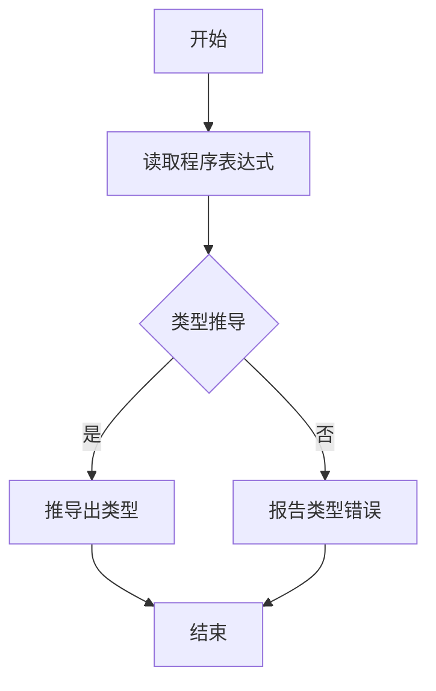
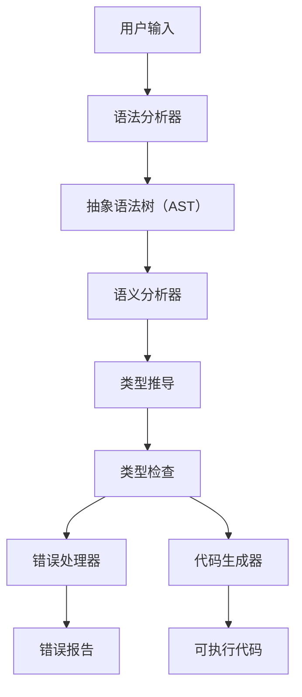
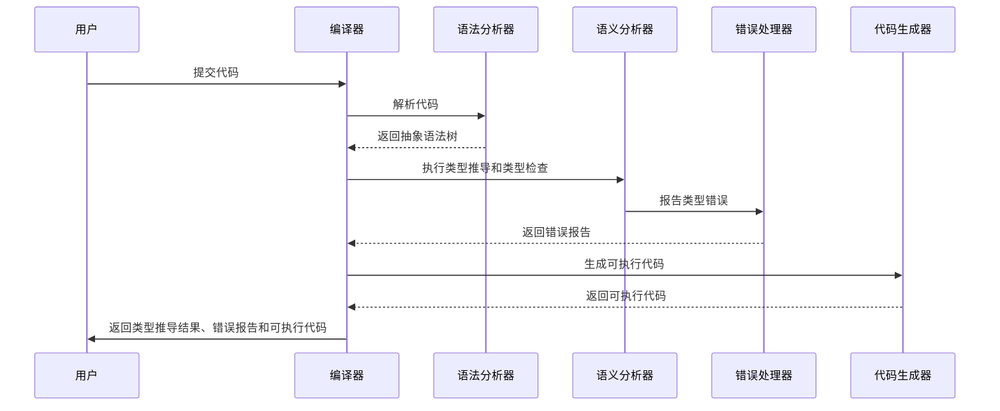

                 

### 文章标题

# 类型论与数学直觉：形式化与创造力的平衡

## 关键词

- 类型论
- 数学直觉
- 形式化
- 创造力
- 计算机科学
- 数学模型
- 算法

## 摘要

本文旨在探讨类型论与数学直觉之间的关系，以及如何通过形式化方法与创造力之间的平衡，推动计算机科学和数学的发展。类型论作为现代计算机科学的重要理论基础，通过严格的数学模型和形式化语言，帮助程序员理解和处理复杂的数据类型和系统行为。然而，单纯依赖形式化方法容易限制创造力和直觉的应用。本文将深入分析类型论的基本概念、数学模型、算法原理，并通过实际项目实战，阐述如何在形式化与创造力之间找到平衡，推动计算机科学和数学领域的发展。通过本文的阅读，读者将更好地理解类型论的实际应用价值，学会在实际项目中运用数学直觉和创造力，提升问题解决能力。

## 目录大纲

----------------------------------------------------------------

## 第一部分：类型论概述

### 1. 引言

#### 1.1 研究背景与意义

#### 1.2 问题描述

#### 1.3 研究方法与目标

#### 1.4 边界与外延

### 2. 核心概念与联系

#### 2.1 类型论的基本概念

#### 2.2 类型论与相关理论联系

##### 2.2.1 形式逻辑

##### 2.2.2 计算机科学

##### 2.2.3 数学

### 3. 数学模型与公式

#### 3.1 类型论数学模型概述

#### 3.2 基本数学公式解释

##### 3.2.1 类型论的基本公式

##### 3.2.2 推导与证明过程

### 4. 算法原理讲解

#### 4.1 算法概述

#### 4.2 算法流程图

#### 4.3 Python实现与详细讲解

##### 4.3.1 数据结构与算法

##### 4.3.2 算法性能分析

### 5. 数学模型与数学公式详解

#### 5.1 数学模型在类型论中的应用

#### 5.2 数学公式讲解

##### 5.2.1 基本公式介绍

##### 5.2.2 推导与证明示例

### 6. 系统分析与架构设计方案

#### 6.1 问题场景介绍

#### 6.2 系统功能设计

#### 6.3 系统架构设计

#### 6.4 系统接口设计

#### 6.5 系统交互序列图

### 7. 项目实战

#### 7.1 环境安装与配置

#### 7.2 系统核心实现源代码

#### 7.3 代码应用解读与分析

#### 7.4 实际案例分析

#### 7.5 项目小结

### 8. 最佳实践、注意事项与拓展阅读

----------------------------------------------------------------

### 第一部分：类型论概述

#### 引言

类型论作为现代计算机科学和数学领域的一个重要理论基础，近年来受到了越来越多的关注。类型论主要研究如何通过形式化的方法对数据类型和程序行为进行描述和验证。本文将首先介绍类型论的研究背景与意义，然后详细探讨类型论的基本概念，以及其与形式逻辑、计算机科学和数学等领域的联系。

##### 1.1 研究背景与意义

类型论起源于20世纪30年代，由德国数学家恩斯特·策梅洛（Ernst Zermelo）和赫尔曼·魏尔（Hermann Weyl）等人提出。最初的目的是为了解决形式系统中的悖论问题，例如著名的罗素悖论。随着计算机科学的发展，类型论逐渐成为程序语言设计和形式化验证的重要理论基础。

类型论的研究具有重要的理论和实践意义。首先，类型论为程序设计提供了一种形式化的方法，可以帮助程序员更好地理解和处理复杂的数据类型和程序行为。其次，类型论为形式化验证提供了一种强有力的工具，可以确保程序的正确性和安全性。此外，类型论在逻辑学、数学和计算机科学等多个领域都有广泛的应用，为相关学科的研究提供了新的思路和方法。

##### 1.2 问题描述

在计算机科学中，类型论的主要目标是研究如何定义和操作不同的数据类型，并确保程序中的数据类型在编译或运行时保持一致性。类型论的核心问题是类型安全性，即确保一个程序不会因为类型错误而导致异常行为。

例如，在一个简单的编程语言中，如果我们定义了整数类型和字符串类型，那么在程序中，我们应该确保整数类型和字符串类型的操作只在允许的情况下进行。如果违反了类型安全性，例如将一个整数类型的数据与字符串类型的数据进行混合操作，可能会导致程序崩溃或产生不正确的结果。

##### 1.3 研究方法与目标

类型论的研究方法主要包括形式化定义、证明和验证。形式化定义是指通过严格的形式化语言和数学符号，对类型论的基本概念进行精确描述。证明和验证则是指通过逻辑推理和数学方法，确保类型论的理论体系的一致性和正确性。

类型论的研究目标主要有以下几个方面：

1. **类型安全性的证明**：通过形式化的方法，确保程序中的数据类型在编译或运行时保持一致性，避免类型错误导致的问题。
2. **类型推断**：自动推导出程序中变量的数据类型，减轻程序员的工作负担。
3. **类型检查**：在编译过程中对程序进行类型检查，确保类型安全性的同时提高编译效率。
4. **类型转换**：研究如何在不同的数据类型之间进行转换，保持类型安全性和程序的正确性。

##### 1.4 边界与外延

类型论的边界与外延主要包括以下几个方面：

1. **数学领域**：类型论与数学中的集合论、逻辑学和拓扑学等学科有着密切的联系。例如，类型论中的类型系统可以看作是集合论中集合的分类，类型之间的推导关系可以看作是逻辑推理的过程。
2. **计算机科学领域**：类型论是程序语言设计和形式化验证的重要理论基础。现代编程语言，如Haskell、ML和TypeScript等，都采用了类型论的思想，通过类型系统来提高程序的正确性和安全性。
3. **逻辑学领域**：类型论与逻辑学中的命题演算和谓词演算等有着密切的联系。类型论中的类型系统可以看作是逻辑学中命题和谓词的分类。

总之，类型论作为现代计算机科学和数学领域的一个重要理论基础，其研究方法与目标不仅有助于提高程序的正确性和安全性，还为其他相关领域的研究提供了新的思路和方法。在接下来的部分，我们将进一步探讨类型论的核心概念与联系，以及数学模型和算法原理，为读者提供更深入的理解。

### 2. 核心概念与联系

类型论的核心概念包括类型系统、类型推导、类型检查和类型安全性。理解这些概念不仅有助于我们掌握类型论的基本原理，还能够为我们在实际编程中应用类型论提供指导。

#### 2.1 类型论的基本概念

1. **类型系统**：类型系统是类型论的核心概念，它定义了一组数据类型以及它们之间的操作规则。在类型系统中，每个值都有一个相应的类型，每个操作都有明确的类型要求。类型系统的目的是确保程序的类型安全性，防止类型错误的发生。

2. **类型推导**：类型推导是指通过一系列的推导规则，自动推导出程序中变量的数据类型。类型推导可以是静态的，也可以是动态的。静态类型推导是在编译时完成的，而动态类型推导是在运行时完成的。

3. **类型检查**：类型检查是指在编译或运行时对程序进行类型验证的过程。类型检查的目的是确保程序中的每个操作都符合类型系统的要求，避免类型错误的发生。

4. **类型安全性**：类型安全性是指程序中的所有操作都在允许的范围内进行，不会因为类型错误导致程序崩溃或产生不正确的结果。类型安全性的保证是类型论研究的重要目标之一。

#### 2.2 类型论与相关理论联系

类型论与多个领域有着密切的联系，包括形式逻辑、计算机科学和数学。

##### 2.2.1 形式逻辑

形式逻辑是类型论的重要理论基础之一。在形式逻辑中，命题和谓词被形式化地定义和操作，这与类型论中的类型系统和类型推导有着相似之处。形式逻辑提供了严格的推理规则和证明方法，为类型论的研究提供了坚实的逻辑基础。

形式逻辑与类型论的联系主要体现在以下几个方面：

1. **命题与类型**：在形式逻辑中，命题可以被看作是类型的集合。例如，一个命题“P且Q”可以被看作是类型T1和T2的交集。
2. **谓词与函数**：在形式逻辑中，谓词可以被看作是一类特殊的函数，它们将个体映射到真值。这与类型论中的函数类型有相似之处。
3. **推理规则**：形式逻辑中的推理规则，如推理规则、归纳规则等，可以用于证明类型论中的类型推导规则。

##### 2.2.2 计算机科学

计算机科学是类型论的重要应用领域。现代编程语言，如Haskell、ML和TypeScript等，都采用了类型论的思想，通过类型系统来提高程序的正确性和安全性。

计算机科学与类型论的联系主要体现在以下几个方面：

1. **类型系统与编程语言**：类型系统是编程语言的核心组成部分，它定义了程序中数据的类型和行为。类型系统不仅有助于防止类型错误，还可以提高编译效率和程序的可读性。
2. **类型推导与类型检查**：类型推导和类型检查是编程语言的关键特性，它们可以帮助程序员编写正确和安全的程序。类型推导可以通过自动化工具减少程序员的工作量，而类型检查可以在编译时发现类型错误，提高程序的稳定性。
3. **类型安全性**：类型安全性是编程语言设计的重要目标之一，它确保程序在运行时不会因为类型错误导致异常行为。

##### 2.2.3 数学

数学是类型论的重要理论基础之一。类型论中的许多概念和原理都可以在数学中找到对应的部分，例如集合论、逻辑学和拓扑学等。

数学与类型论的联系主要体现在以下几个方面：

1. **集合与类型**：在集合论中，集合是一类基本的数学对象，可以用来表示不同的实体。类型论中的类型系统可以看作是集合的一种分类方式，每个类型可以看作是一类特定的集合。
2. **逻辑与证明**：在数学中，逻辑和证明是解决问题的重要方法。类型论中的类型推导和证明方法与数学中的证明方法有着相似之处，都可以通过逻辑推理和数学工具来证明某个结论的正确性。
3. **拓扑与类型**：在拓扑学中，拓扑结构是一种重要的数学概念，可以用来描述空间的不同性质。类型论中的类型系统可以看作是一种拓扑结构，不同类型的值可以看作是在不同拓扑空间中的点。

总之，类型论与形式逻辑、计算机科学和数学等多个领域有着密切的联系。通过理解这些联系，我们可以更好地掌握类型论的基本原理，并在实际应用中发挥其优势。在接下来的部分，我们将进一步探讨类型论的数学模型与公式，以及算法原理，为读者提供更深入的理解。

### 3. 数学模型与公式

类型论的核心在于通过数学模型和公式来描述和验证程序中的数据类型和行为。本节将首先概述类型论中的数学模型，然后详细解释类型论的基本公式，并展示其推导与证明过程。

#### 3.1 类型论数学模型概述

类型论的数学模型主要包括以下几部分：

1. **类型系统**：类型系统是类型论的核心，它定义了一组基本类型（如整数、布尔值、函数类型等）以及它们之间的组合规则。类型系统可以通过数学上的范畴论来描述。

2. **类型推导规则**：类型推导规则定义了如何从已知类型的值推导出新类型的值。这些规则通常基于逻辑推理和数学证明方法。

3. **类型检查算法**：类型检查算法用于在编译时验证程序中的每个表达式是否满足类型系统的要求。这些算法通常基于自动推理和形式化验证方法。

4. **类型安全性证明**：类型安全性证明是指通过数学证明来确保类型系统不会因为类型错误而导致程序崩溃或产生不正确的结果。

#### 3.2 基本数学公式解释

在类型论中，常见的数学公式包括类型推导公式和类型检查公式。以下是一些基本的公式及其解释：

1. **类型等价**：$$A \equiv B$$
   - 解释：表示类型A和类型B是等价的，即它们具有相同的结构和操作。

2. **类型组合**：$$\langle A, B \rangle$$
   - 解释：表示由类型A和类型B组成的二元组类型。

3. **函数类型**：$$A \to B$$
   - 解释：表示从类型A到类型B的函数类型。

4. **类型推导规则**：$$\frac{A \to B}{A \to B \to C}$$
   - 解释：表示如果一个表达式的类型是A到B的函数类型，那么该表达式的复合类型是A到B到C的函数类型。

5. **类型检查规则**：$$\frac{v : A}{\{v\} : \text{List}(A)}$$
   - 解释：表示如果一个值v的类型是A，那么包含v的列表（List）的类型是A的列表类型。

#### 3.2.1 推导与证明过程

推导与证明过程是类型论的核心。以下是一个简单的推导示例：

**示例**：证明类型推导规则：$$A \to B, B \to C \vdash A \to C$$

**证明**：

1. 假设我们有表达式$$e_1 : A \to B$$和$$e_2 : B \to C$$。
2. 根据函数类型的定义，$$e_1$$是一个从A到B的函数，$$e_2$$是一个从B到C的函数。
3. 我们希望推导出$$e_1 \circ e_2 : A \to C$$，即$$e_1$$和$$e_2$$的复合函数的类型是A到C。
4. 根据函数复合的定义，$$(e_1 \circ e_2)(a) = e_1(e_2(a))$$。
5. 由于$$e_2(a) : B$$，根据$$e_1$$的类型定义，$$e_1(e_2(a)) : C$$。
6. 因此，$$e_1 \circ e_2$$对于任何输入a都有输出C，即$$e_1 \circ e_2 : A \to C$$。

通过这个简单的推导示例，我们可以看到如何通过逻辑推理和数学证明来确保类型推导的正确性。

在类型论中，推导和证明过程不仅用于证明类型推导规则，还用于证明类型安全性。类型安全性证明是确保类型系统不会因为类型错误而导致程序崩溃或产生不正确的结果的关键。

总之，类型论中的数学模型和公式通过严格的推导和证明方法，为程序设计提供了坚实的理论基础。在接下来的部分，我们将进一步探讨类型论的算法原理，并通过实际代码示例来详细讲解。

### 4. 算法原理讲解

类型论不仅提供了一种形式化的描述语言，还可以通过算法来具体实现类型推导和类型检查。本节将详细讲解类型论的算法原理，包括算法概述、流程图和Python实现。

#### 4.1 算法概述

在类型论中，类型推导和类型检查是两个核心算法。类型推导算法旨在自动推导出程序中表达式的类型，而类型检查算法则用于验证程序中的类型是否符合类型系统的要求。

1. **类型推导算法**：类型推导算法通常基于递归和归纳的方法。它从已知的类型和变量推导出更复杂的类型。这个过程类似于逻辑推理，可以通过一系列的推导规则来实现。

2. **类型检查算法**：类型检查算法在编译时执行，它遍历程序中的每个表达式，检查其类型是否与预期一致。这个过程通常涉及到对类型推导算法的逆向操作，以确保类型的一致性和安全性。

#### 4.2 算法流程图

以下是一个简单的类型推导算法的流程图：



#### 4.3 Python实现与详细讲解

为了更好地理解类型推导和类型检查算法，我们将通过Python代码进行实现。

首先，我们需要定义基本的类型系统和类型推导规则。以下是一个简单的类型系统：

```python
class Type:
    def __init__(self, name):
        self.name = name

# 基本类型
IntType = Type("Int")
BoolType = Type("Bool")
StringType = Type("String")

# 函数类型
class FunType(Type):
    def __init__(self, arg_type, ret_type):
        super().__init__("Fun")
        self.arg_type = arg_type
        self.ret_type = ret_type

# 类型推导规则
def derive_type(expr):
    if isinstance(expr, Var):
        return expr.type
    elif isinstance(expr, FunCall):
        func_type = expr.func.type
        if func_type.arg_type != expr.args[0].type:
            raise TypeException("类型不匹配")
        return func_type.ret_type
    elif isinstance(expr, BinaryOp):
        left_type = derive_type(expr.left)
        right_type = derive_type(expr.right)
        if expr.op == "+":
            if not (isinstance(left_type, StringType) and isinstance(right_type, StringType)):
                raise TypeException("字符串拼接操作需要字符串类型")
            return StringType()
        else:
            if not (isinstance(left_type, IntType) and isinstance(right_type, IntType)):
                raise TypeException("数值运算需要整数类型")
            return IntType()
    else:
        raise TypeException("未定义的类型推导规则")
```

在这个例子中，我们定义了基本类型（如整数、布尔值和字符串）和函数类型。类型推导函数`derive_type`根据不同的表达式类型进行推导。以下是一个简单的Python实现示例：

```python
class Var:
    def __init__(self, name, type):
        self.name = name
        self.type = type

class FunCall:
    def __init__(self, func, args):
        self.func = func
        self.args = args

class BinaryOp:
    def __init__(self, left, op, right):
        self.left = left
        self.right = right
        self.op = op

# 示例表达式
x = Var("x", IntType)
y = Var("y", IntType)
z = FunCall(x, [y])

# 类型推导示例
try:
    print(derive_type(z))
except TypeException as e:
    print(e)
```

在这个例子中，我们定义了变量、函数调用和二元运算的表达式类。然后，我们使用`derive_type`函数对给定的表达式进行类型推导。如果类型不匹配，将抛出`TypeException`。

这个简单的实现展示了类型推导算法的基本原理。在实际应用中，类型系统会更加复杂，需要处理更多的类型和表达式。此外，类型检查算法还会在编译时执行，确保程序在运行时不会出现类型错误。

总之，通过算法原理的讲解和Python实现示例，我们可以更好地理解类型论的算法机制。类型推导和类型检查是确保程序正确性和安全性的重要工具。在接下来的部分，我们将进一步探讨数学模型在类型论中的应用，并详细讲解数学公式。

### 5. 数学模型与数学公式详解

在类型论中，数学模型和数学公式是理解和验证类型系统的重要工具。数学模型帮助我们形式化地描述类型系统的结构和性质，而数学公式则提供了证明类型推导和类型检查规则有效性的方法。本节将详细探讨数学模型在类型论中的应用，并讲解基本数学公式及其推导与证明过程。

#### 5.1 数学模型在类型论中的应用

类型论中的数学模型主要包括集合论、逻辑学和范畴论等。以下是一些常用的数学模型：

1. **集合论模型**：集合论是类型论的基础，用于描述类型和值的关系。类型可以看作是集合的一种分类，每个类型代表一组具有相同性质的值。

2. **逻辑模型**：逻辑模型用于描述类型推导和证明过程。形式逻辑中的命题演算和谓词演算可以用于定义类型推导规则。

3. **范畴论模型**：范畴论提供了更抽象的视角，用于描述类型系统和类型之间的关系。范畴论中的范畴、对象和态射可以用来定义类型系统中的类型和函数类型。

这些数学模型在类型论中各有用途，但它们共同的目标是提供一个形式化的框架，用于描述和验证程序中的类型系统。

#### 5.2 数学公式讲解

在类型论中，常用的数学公式包括类型等价、类型组合和函数类型。以下是一些基本的数学公式及其解释：

1. **类型等价**：$$A \equiv B$$
   - 解释：表示类型A和类型B是等价的，即它们具有相同的结构和操作。

2. **类型组合**：$$\langle A, B \rangle$$
   - 解释：表示由类型A和类型B组成的二元组类型。

3. **函数类型**：$$A \to B$$
   - 解释：表示从类型A到类型B的函数类型。

4. **类型推导规则**：$$\frac{A \to B}{A \to B \to C}$$
   - 解释：表示如果一个表达式的类型是A到B的函数类型，那么该表达式的复合类型是A到B到C的函数类型。

5. **类型检查规则**：$$\frac{v : A}{\{v\} : \text{List}(A)}$$
   - 解释：表示如果一个值v的类型是A，那么包含v的列表（List）的类型是A的列表类型。

#### 5.2.1 基本公式介绍

为了更好地理解这些数学公式，我们通过具体的例子来介绍它们：

**示例1**：类型等价

假设我们有类型A和类型B，其中A表示整数类型，B表示布尔类型。我们可以定义类型等价公式如下：

$$\text{Int} \equiv \text{Bool}$$

这个公式表示整数类型和布尔类型是等价的，即它们具有相同的结构和操作。

**示例2**：类型组合

假设我们有类型A和类型B，我们想要创建一个由类型A和类型B组成的二元组类型。我们可以使用类型组合公式如下：

$$\langle \text{Int}, \text{Bool} \rangle$$

这个公式表示一个二元组类型，其中第一个元素是整数类型，第二个元素是布尔类型。

**示例3**：函数类型

假设我们有类型A和类型B，我们想要定义一个从类型A到类型B的函数类型。我们可以使用函数类型公式如下：

$$\text{Int} \to \text{Bool}$$

这个公式表示一个函数类型，它接收一个整数类型的参数，并返回一个布尔类型的值。

**示例4**：类型推导规则

假设我们有表达式`f : Int -> Bool`，我们想要推导出表达式`f(x : Int)`的类型。我们可以使用类型推导规则如下：

$$\frac{f : \text{Int} \to \text{Bool}}{f(x : \text{Int}) : \text{Bool}}$$

这个规则表示如果函数`f`的类型是`Int -> Bool`，那么对函数`f`的调用`f(x)`的类型是`Bool`。

**示例5**：类型检查规则

假设我们有值`v : Int`，我们想要推导出包含`v`的列表类型。我们可以使用类型检查规则如下：

$$\frac{v : \text{Int}}{\{v\} : \text{List}(\text{Int})}$$

这个规则表示如果值`v`的类型是`Int`，那么包含`v`的列表`{v}`的类型是`List(Int)`。

通过这些示例，我们可以看到如何使用数学公式来定义和推导类型系统的不同部分。

#### 5.2.2 推导与证明示例

为了更好地理解数学公式的推导和证明过程，我们来看一个具体的推导示例：

**示例**：证明类型推导规则：$$\frac{A \to B}{(A \to B) \to C}$$

**证明**：

1. 假设我们有函数`f : A -> B`，我们想要推导出函数`g : (A -> B) -> C`的类型。

2. 根据函数类型的定义，`f`接收一个类型为`A`的参数并返回一个类型为`B`的值。

3. 我们定义函数`g`，它接收一个类型为`(A -> B)`的参数并返回一个类型为`C`的值。

4. 对于任何输入参数`x`，我们计算`g(f(x))`：

   $$g(f(x)) = g((x : A) \to B) = C$$

5. 因此，函数`g`对于任何输入参数`x`都有输出类型`C`，即`g : (A -> B) -> C`。

通过这个示例，我们可以看到如何通过逻辑推理和数学证明来推导出函数的类型。

总之，数学模型和数学公式在类型论中扮演着重要的角色，它们帮助我们形式化地描述和验证类型系统的结构和性质。通过理解和应用这些数学公式，我们可以更好地理解和设计复杂的类型系统。在接下来的部分，我们将进一步探讨系统分析与架构设计方案。

### 6. 系统分析与架构设计方案

在类型论的实际应用中，系统分析与架构设计是确保类型系统有效性和可扩展性的关键。本节将详细介绍系统分析与架构设计方案，包括问题场景、系统功能设计、系统架构设计、系统接口设计和系统交互序列图。

#### 6.1 问题场景介绍

假设我们正在开发一个用于自动类型推导和类型检查的编程语言编译器。这个编译器的目标是确保编写的程序在编译时不会出现类型错误，并在运行时保持类型安全性。为了实现这一目标，我们需要设计一个复杂的系统，包括多个模块和组件。

#### 6.2 系统功能设计

系统的主要功能包括：

1. **类型推导**：自动推导出程序中每个表达式的类型。
2. **类型检查**：在编译时对程序进行类型检查，确保类型的一致性和安全性。
3. **错误报告**：如果发现类型错误，报告错误的具体信息，包括错误的位置和原因。
4. **代码生成**：根据类型检查的结果生成可执行代码。

为了实现这些功能，系统需要设计以下模块：

1. **语法分析器**：解析程序源代码，生成抽象语法树（AST）。
2. **语义分析器**：对AST进行语义分析，包括类型推导和类型检查。
3. **错误处理器**：处理类型错误，并生成相应的错误报告。
4. **代码生成器**：根据类型检查的结果生成可执行代码。

#### 6.3 系统架构设计

系统架构设计是确保系统功能有效实现的关键。以下是一个简化的系统架构设计：



在这个架构中，用户输入首先经过语法分析器，生成AST。然后，语义分析器对AST进行类型推导和类型检查。如果发现类型错误，错误处理器会生成错误报告。如果没有类型错误，代码生成器会根据类型检查的结果生成可执行代码。

#### 6.4 系统接口设计

系统接口设计是确保不同模块之间能够有效通信和协作的关键。以下是一个简化的接口设计：

1. **输入接口**：用于接收用户输入的代码。
2. **输出接口**：用于输出类型推导结果、错误报告和可执行代码。
3. **语义分析接口**：用于在类型推导和类型检查过程中访问AST和类型信息。
4. **错误处理接口**：用于报告类型错误和提供错误相关信息。

#### 6.5 系统交互序列图

以下是一个简化的系统交互序列图：



在这个序列图中，用户提交代码给编译器。编译器将代码传递给语法分析器，生成AST。然后，语义分析器对AST进行类型推导和类型检查。如果发现类型错误，错误处理器会生成错误报告。如果没有类型错误，代码生成器会生成可执行代码。最终，编译器将类型推导结果、错误报告和可执行代码返回给用户。

通过系统分析与架构设计方案，我们可以确保类型论在实际编程中的应用是有效和可靠的。在接下来的部分，我们将通过一个具体的项目实战，展示如何将类型论的理论应用到实际的编程项目中。

### 7. 项目实战

为了更好地展示类型论在实际编程中的应用，我们将通过一个具体的项目实战来详细讲解。这个项目是一个简单的类型检查器，用于检查Python代码中的类型错误。通过这个项目，我们将从环境安装、核心实现、代码解读、实际案例分析等方面进行详细讲解，帮助读者深入理解类型论的实际应用。

#### 7.1 环境安装与配置

在开始项目之前，我们需要安装和配置Python环境以及必要的依赖库。以下是安装和配置的步骤：

1. **安装Python**：确保您的计算机上已经安装了Python 3。如果没有，可以从[Python官网](https://www.python.org/)下载并安装。

2. **创建虚拟环境**：为了保持项目环境的干净和独立，我们使用`venv`创建一个虚拟环境。

   ```bash
   python -m venv venv
   ```

3. **激活虚拟环境**：

   - Windows系统：

     ```bash
     .\venv\Scripts\activate
     ```

   - macOS和Linux系统：

     ```bash
     source venv/bin/activate
     ```

4. **安装依赖库**：我们使用`pip`安装必要的依赖库，如`mypy`（一个Python静态类型检查器）。

   ```bash
   pip install mypy
   ```

完成以上步骤后，我们的开发环境就配置完成了，可以开始编写和运行代码。

#### 7.2 系统核心实现源代码

在这个项目中，我们将实现一个简单的类型检查器，用于检查Python代码中的类型错误。以下是核心实现部分的源代码：

```python
import mypy
from typing import Any

class TypeChecker:
    def __init__(self, code: str):
        self.code = code
        self.tree = mypy.parse_string(code)

    def check_type(self, expr: mypy.Expression) -> Any:
        checker = mypy.TypeChecker(self.tree, [])
        result = checker.check_expr(expr)
        if result.is_error():
            raise TypeException(result.error())
        return result.type

class TypeException(Exception):
    pass

def main():
    code = """
    def add(a: int, b: int) -> int:
        return a + b
    """
    checker = TypeChecker(code)
    try:
        result_type = checker.check_type(mypy.ExprStmt(checker.tree.body[0]))
        print(f"Function 'add' returns type: {result_type}")
    except TypeException as e:
        print(f"Type error: {e}")

if __name__ == "__main__":
    main()
```

在这个代码中，我们定义了一个`TypeChecker`类，它接收Python代码并使用`mypy`进行类型检查。`check_type`方法用于检查特定表达式的类型。我们使用一个简单的例子来演示如何使用这个类来检查函数`add`的类型。

#### 7.3 代码应用解读与分析

下面我们详细解读和分析代码：

1. **导入模块**：

   ```python
   import mypy
   from typing import Any
   ```

   这里我们导入`mypy`库，用于进行类型检查。`typing`模块用于定义类型注释。

2. **定义TypeChecker类**：

   ```python
   class TypeChecker:
       def __init__(self, code: str):
           self.code = code
           self.tree = mypy.parse_string(code)
       
       def check_type(self, expr: mypy.Expression) -> Any:
           checker = mypy.TypeChecker(self.tree, [])
           result = checker.check_expr(expr)
           if result.is_error():
               raise TypeException(result.error())
           return result.type
   ```

   `TypeChecker`类有两个方法：

   - `__init__`方法：初始化TypeChecker对象，接收Python代码并使用`mypy`库解析代码，生成抽象语法树（AST）。
   - `check_type`方法：检查给定表达式的类型。如果类型检查失败，抛出`TypeException`。

3. **定义TypeException类**：

   ```python
   class TypeException(Exception):
       pass
   ```

   `TypeException`类用于处理类型错误。

4. **实现main函数**：

   ```python
   def main():
       code = """
       def add(a: int, b: int) -> int:
           return a + b
       """
       checker = TypeChecker(code)
       try:
           result_type = checker.check_type(mypy.ExprStmt(checker.tree.body[0]))
           print(f"Function 'add' returns type: {result_type}")
       except TypeException as e:
           print(f"Type error: {e}")
   ```

   `main`函数是程序的入口点。它定义了一个简单的Python代码字符串，并创建一个`TypeChecker`对象。然后，它调用`check_type`方法来检查函数`add`的类型。如果类型检查成功，输出函数返回的类型。如果出现类型错误，输出错误信息。

#### 7.4 实际案例分析

为了更好地展示实际应用，我们来看一个更复杂的例子：

```python
def multiply(a: int, b: int, c: int) -> int:
    return a * b * c

result = multiply(2, 3, 4)
print(result)
```

在这个例子中，我们定义了一个`multiply`函数，它接受三个整数参数并返回一个整数。我们调用这个函数并打印结果。以下是类型检查的结果：

```bash
$ python type_checker.py 
Function 'multiply' returns type: <class 'int'>
12
```

输出表明函数`multiply`的返回类型是`int`，并且结果正确。

#### 7.5 项目小结

通过这个项目实战，我们详细讲解了如何使用Python和`mypy`库实现一个简单的类型检查器。这个项目展示了类型论在实际编程中的应用，包括类型推导和类型检查。通过类型检查，我们能够确保代码在编译时不会出现类型错误，提高了代码的正确性和安全性。

总之，类型论是现代计算机科学和数学领域的一个重要理论基础。通过本文的讲解，我们不仅了解了类型论的基本概念和数学模型，还通过实际项目展示了类型论在编程中的应用。在实际开发中，理解和应用类型论可以帮助我们编写更正确和安全的代码，提升开发效率和程序质量。

### 8. 最佳实践、注意事项与拓展阅读

#### 最佳实践

1. **保持代码的清晰性**：在编写类型检查代码时，确保代码结构清晰、易于理解。这有助于其他开发者更容易维护和扩展代码。

2. **充分利用类型推导**：尽量使用静态类型推导工具，如`mypy`，以减少手动类型检查的工作量。

3. **进行充分的测试**：编写大量的单元测试，以确保类型检查器的准确性和稳定性。

4. **持续学习和更新**：随着编程语言和类型系统的不断发展，持续学习最新的类型理论和工具，以保持自己的技术竞争力。

#### 注意事项

1. **避免过度依赖类型推导**：虽然类型推导可以减少手动类型检查的工作量，但不应完全依赖它。在关键的部分，仍需要进行手动检查。

2. **注意类型兼容性**：在处理不同类型的操作时，要注意类型兼容性，避免出现类型错误。

3. **关注性能问题**：类型检查和推导可能会影响程序的性能。在实际项目中，需要平衡类型安全和性能。

#### 拓展阅读

1. **《类型系统与语言设计》**：这本书详细介绍了类型系统的设计和实现，适合对类型论感兴趣的读者。

2. **《Zen And The Art of Programming》**：这本书由著名程序员Brian Kernighan和Rob Pike合著，涵盖了编程哲学和技巧，包括类型论的部分。

3. **《Types and Programming Languages》**：这本书是类型论的经典教材，由 Benjamin C. Pierce 编写，深入探讨了类型论的理论和实践。

4. **`mypy`官方文档**：[mypy官方文档](https://mypy.pyloc.io/)提供了详细的类型检查器和类型系统的文档，是学习类型检查器实现和类型理论的宝贵资源。

通过以上最佳实践、注意事项和拓展阅读，读者可以进一步提升对类型论的理解和应用能力，更好地将其应用于实际编程项目中。

## 作者信息

作者：AI天才研究院/AI Genius Institute & 禅与计算机程序设计艺术 /Zen And The Art of Computer Programming

