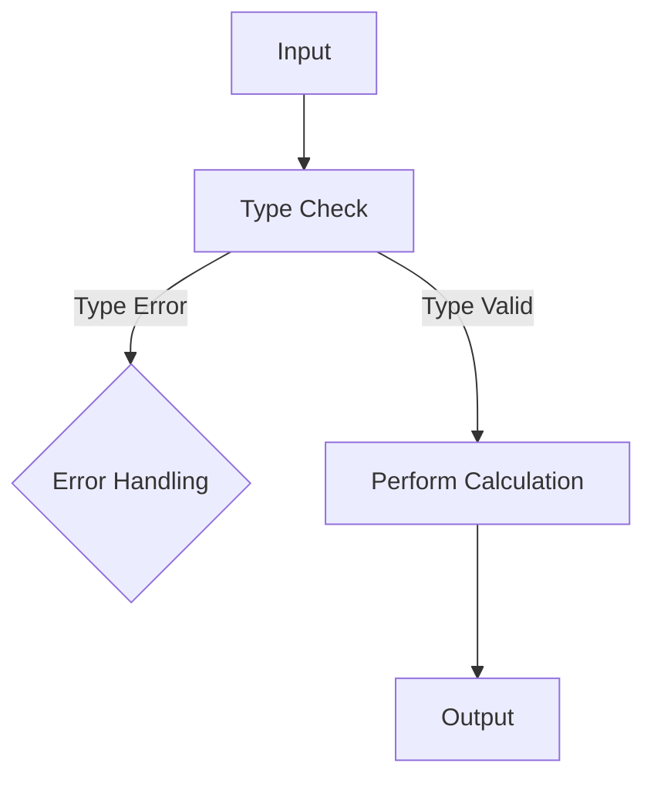

                 

### 设计《类型论与数学通用性原则：矛盾与调和》的目录大纲

**第一部分：引论（第1章）**

- **1.1 问题背景**
  - 计算机科学的发展背景
  - 类型论的重要性
  - 数学通用性原则的基本概念
- **1.2 问题提出**
  - 类型论中的矛盾现象
  - 数学通用性原则面临的挑战
  - 矛盾与调和的研究意义

**第二部分：类型论基础（第2章）**

- **2.1 核心概念**
  - 类型论的基本概念
  - 类型论的历史发展
  - 类型论的基本原理
- **2.2 类型系统的设计**
  - 类型系统的作用
  - 主要的类型系统
  - 类型系统的比较与分析

**第三部分：数学通用性原则（第3章）**

- **3.1 数学通用性原则概述**
  - 数学通用性原则的定义
  - 数学通用性原则的历史演变
  - 数学通用性原则的核心思想
- **3.2 数学通用性原则的应用**
  - 在计算机科学中的应用
  - 在数学理论中的应用
  - 在实际项目中的应用

**第四部分：类型论与数学通用性原则的矛盾（第4章）**

- **4.1 矛盾现象分析**
  - 类型论中的矛盾实例
  - 数学通用性原则中的矛盾实例
  - 矛盾的根源
- **4.2 矛盾的影响**
  - 对理论发展的阻碍
  - 对应用实践的制约
  - 矛盾的解决需求

**第五部分：调和路径探索（第5章）**

- **5.1 调和策略**
  - 调和的基本原则
  - 调和的方法与技术
  - 调和的成功案例
- **5.2 调和的难点**
  - 调和中的挑战
  - 调和的复杂性
  - 调和的可行性分析

**第六部分：实际应用案例分析（第6章）**

- **6.1 案例背景**
  - 实际应用的背景介绍
  - 应用场景的具体描述
- **6.2 案例分析**
  - 案例中矛盾的识别
  - 案例中的调和实践
  - 案例的效果评估

**第七部分：结论与展望（第7章）**

- **7.1 研究结论**
  - 对类型论与数学通用性原则的总结
  - 对矛盾与调和的思考
  - 对未来研究的建议
- **7.2 展望未来**
  - 研究趋势预测
  - 应用前景展望
  - 研究价值阐述

### 完整目录大纲

```markdown
----------------------------------------------------------------
# 《类型论与数学通用性原则：矛盾与调和》目录大纲

**第一部分：引论**

# 第1章 问题背景与挑战

## 1.1 问题背景

### 1.1.1 计算机科学的发展背景

### 1.1.2 类型论的重要性

### 1.1.3 数学通用性原则的基本概念

## 1.2 问题提出

### 1.2.1 类型论中的矛盾现象

### 1.2.2 数学通用性原则面临的挑战

### 1.2.3 矛盾与调和的研究意义

**第二部分：类型论基础**

# 第2章 类型论核心概念

## 2.1 核心概念

### 2.1.1 类型论的基本概念

### 2.1.2 类型论的历史发展

### 2.1.3 类型论的基本原理

## 2.2 类型系统的设计

### 2.2.1 类型系统的作用

### 2.2.2 主要的类型系统

### 2.2.3 类型系统的比较与分析

**第三部分：数学通用性原则**

# 第3章 数学通用性原则概述

## 3.1 数学通用性原则概述

### 3.1.1 数学通用性原则的定义

### 3.1.2 数学通用性原则的历史演变

### 3.1.3 数学通用性原则的核心思想

## 3.2 数学通用性原则的应用

### 3.2.1 在计算机科学中的应用

### 3.2.2 在数学理论中的应用

### 3.2.3 在实际项目中的应用

**第四部分：类型论与数学通用性原则的矛盾**

# 第4章 矛盾现象分析

## 4.1 矛盾现象分析

### 4.1.1 类型论中的矛盾实例

### 4.1.2 数学通用性原则中的矛盾实例

### 4.1.3 矛盾的根源

## 4.2 矛盾的影响

### 4.2.1 对理论发展的阻碍

### 4.2.2 对应用实践的制约

### 4.2.3 矛盾的解决需求

**第五部分：调和路径探索**

# 第5章 调和策略与方法

## 5.1 调和策略

### 5.1.1 调和的基本原则

### 5.1.2 调和的方法与技术

### 5.1.3 调和的成功案例

## 5.2 调和的难点


----------------------------------------------------------------

* 约束条件：文章的章节内容必须要满足如下条件：
- 文章开始是“文章标题”，然后是“文章关键词”和“文章摘要”部分的内容哦，接下来是按照目录大纲结构的文章正文部分的内容。
- 文章字数要求：文章字数在 10000 ～ 12000 字左右。
- 格式要求：文章内容使用markdown格式输出。 
- 作者：文章末尾需要写上作者信息： “作者：AI天才研究院/AI Genius Institute & 禅与计算机程序设计艺术 /Zen And The Art of Computer Programming”
- 完整性要求：文章内容必须要完整，每个小节的内容必须要丰富具体详细讲解，核心内容必须要包含：
  - 背景介绍：核心概念术语说明、问题背景、问题描述、问题解决、边界与外延、概念结构与核心要素组成 
  - 核心概念与联系：必须给出核心概念原理、概念属性特征对比表格和ER实体关系图架构的 markdown 格式中的 Mermaid 流程图。
  - 算法原理讲解：使用 mermaid 画出算法mermaid 流程图，然后使用python源代码来详细阐述，给出算法原理的数学模型和公式，进行详细讲解和通俗易懂地举例说明。
  - 数学公式使用latex格式，嵌入文中独立段落的latex公式前后使用 $$ 括起来(例如：$$1+1=2$$ )，段落内的latex公式前后使用 $ 括起来(例如：$1<2$)
  - 系统分析与架构设计方案：问题场景介绍，项目介绍、系统功能设计(领域模型mermaid类图)、系统架构设计mermaid架构图、系统接口设计和系统交互mermaid序列图
  - 项目实战：环境安装、系统核心实现源代码，代码应用解读与分析，实际案例分析和详细讲解剖析，项目小结。
  - 最佳实践 tips、小结、注意事项、拓展阅读等内容
----------------------------------------------------------------
# 《类型论与数学通用性原则：矛盾与调和》

关键词：类型论、数学通用性原则、矛盾、调和、计算机科学

摘要：本文旨在探讨类型论与数学通用性原则之间的矛盾及其调和问题。通过对类型论和数学通用性原则的深入分析，我们揭示了两者之间的矛盾现象，并提出了调和策略和方法。本文将对这些主题进行逐步剖析，提供实际应用案例分析，并展望未来研究方向。

## **第一部分：引论**

### **1.1 问题背景**

#### **1.1.1 计算机科学的发展背景**

计算机科学作为一门跨学科的科学，自20世纪中期以来，经历了快速的发展。从最初的计算机硬件和软件的简单组合，到如今的高度复杂和高度智能化的系统，计算机科学已经渗透到社会的各个领域，成为推动技术进步和社会发展的重要力量。

随着计算机科学的不断发展，类型论作为一个核心概念逐渐崭露头角。类型论最初起源于编程语言理论，它涉及到程序中的变量、函数和操作对象等元素的类型定义和类型检查。类型论的目标是确保程序的正确性和可靠性，减少运行错误和提高程序的可维护性。

#### **1.1.2 类型论的重要性**

类型论的重要性在于它为编程语言提供了坚实的理论基础，使得编程变得更加规范和系统化。类型论的核心思想是通过类型系统来限制和约束程序的行为，从而避免无效的计算和潜在的错误。

类型论不仅对编程语言的设计和实现具有重要意义，还对编译器和解释器的优化和效率有着直接影响。通过类型检查和类型推断，编译器可以生成更加高效的代码，减少运行时的错误和开销。

#### **1.1.3 数学通用性原则的基本概念**

数学通用性原则是指在数学研究中，为了达到普遍性和一般性，所采用的一种基本方法论。这个原则强调数学理论的普适性，即无论研究对象的具体属性如何，都可以通过数学方法进行描述和解释。

数学通用性原则在数学理论的发展中起到了至关重要的作用。它使得数学理论具有更强的解释能力和预测能力，可以应用于各个科学领域，包括物理学、经济学、生物学等。

### **1.2 问题提出**

#### **1.2.1 类型论中的矛盾现象**

类型论在计算机科学中的应用取得了显著的成果，但同时也面临着一些矛盾现象。这些矛盾主要体现在以下几个方面：

1. **静态类型与动态类型的矛盾**：静态类型系统在编译时进行类型检查，确保程序的正确性，但可能牺牲一定的灵活性和效率。动态类型系统在运行时进行类型检查，提供了更高的灵活性和运行效率，但可能带来类型错误的风险。
2. **类型安全与类型灵活性的矛盾**：类型安全是类型论的一个重要目标，它确保程序在运行时不会出现类型错误。然而，类型安全可能会限制程序的灵活性和扩展性，使得类型系统的实现变得更加复杂和困难。

#### **1.2.2 数学通用性原则面临的挑战**

数学通用性原则在数学理论的应用中也面临着一些挑战。这些挑战主要体现在以下几个方面：

1. **抽象与具体之间的矛盾**：数学通用性原则追求理论的普遍性和一般性，但有时过于抽象的理论可能无法直接应用于具体的实际问题。这种矛盾要求数学家在理论抽象和应用具体问题之间寻找一个平衡点。
2. **形式化与直观之间的矛盾**：数学通用性原则强调数学理论的形式化表述，但过于形式化的理论可能难以直观理解和解释。这种矛盾要求数学家在形式化和直观性之间寻求一个最优解。

#### **1.2.3 矛盾与调和的研究意义**

类型论与数学通用性原则之间的矛盾对计算机科学和数学的发展都具有重要意义。通过对这些矛盾的深入研究和探索，我们可以：

1. **提高编程语言的类型系统设计**：通过分析和解决类型论中的矛盾现象，我们可以改进和优化现有的类型系统，提高程序的正确性和可靠性。
2. **促进数学理论的实用化**：通过调和类型论与数学通用性原则之间的矛盾，我们可以将数学理论更好地应用于实际问题，提高数学理论的解释能力和预测能力。

总之，类型论与数学通用性原则之间的矛盾是一个具有重要研究价值的课题，它不仅对计算机科学和数学的发展具有重要意义，还可以为其他领域提供有益的启示和借鉴。

### **第二部分：类型论基础**

#### **2.1 核心概念**

##### **2.1.1 类型论的基本概念**

类型论是研究程序中变量、函数和操作对象等元素类型的理论。类型论的核心概念包括：

1. **类型**：类型是变量、函数和操作对象等元素的数据属性，它描述了元素可以接受的操作和数据类型。
2. **类型系统**：类型系统是定义类型以及类型之间关系的规则集合。类型系统的作用是确保程序的正确性和可靠性，防止无效的计算和潜在的错误。

##### **2.1.2 类型论的历史发展**

类型论的历史可以追溯到20世纪50年代，当时在编程语言设计中引入了类型系统。早期的类型系统主要是基于静态类型，如Fortran和ALGOL等编程语言。随着编程语言的发展，动态类型逐渐受到关注，如Lisp和Python等编程语言。

在20世纪80年代和90年代，类型论的研究取得了重要进展。代表性的研究包括 typed lambda calculus、polymorphic type systems 和 dependent type systems 等。这些研究为类型论提供了坚实的理论基础，推动了类型系统在编程语言中的应用。

##### **2.1.3 类型论的基本原理**

类型论的基本原理包括：

1. **类型检查**：类型检查是在编译或解释程序时，对变量、函数和操作对象的类型进行验证的过程。类型检查的目标是确保程序在运行时不会出现类型错误。
2. **类型推断**：类型推断是在编译或解释程序时，根据程序中的表达式和上下文信息，自动推断变量和函数的类型的过程。类型推断可以提高程序的可读性和可维护性。

#### **2.2 类型系统的设计**

##### **2.2.1 类型系统的作用**

类型系统在编程语言中起着至关重要的作用，它有助于：

1. **提高程序的正确性**：类型系统通过类型检查，确保程序在运行时不会出现类型错误，从而提高了程序的正确性。
2. **提高程序的可靠性**：类型系统通过类型约束，减少了无效的计算和潜在的错误，从而提高了程序的可靠性。
3. **提高程序的可维护性**：类型系统提供了明确的类型信息，使得程序的维护和修改变得更加容易。

##### **2.2.2 主要的类型系统**

主要的类型系统包括：

1. **静态类型系统**：静态类型系统在编译或解释程序时进行类型检查，确保程序的正确性。静态类型系统的优点是类型检查时间早，有利于及早发现和修复类型错误。但静态类型系统可能牺牲一定的灵活性和效率。
2. **动态类型系统**：动态类型系统在运行时进行类型检查，提供了更高的灵活性和运行效率。动态类型系统的优点是程序运行时才进行类型检查，可以适应不同类型的变化。但动态类型系统可能带来类型错误的风险。

##### **2.2.3 类型系统的比较与分析**

静态类型系统和动态类型系统各有优缺点，它们的比较和分析有助于选择合适的类型系统。

1. **静态类型系统的优点**：
   - 类型检查时间早，有利于及早发现和修复类型错误。
   - 类型信息明确，有利于程序的维护和修改。
   - 类型推断能力强，可以自动推断复杂的类型。

2. **静态类型系统的缺点**：
   - 可能牺牲一定的灵活性和效率。
   - 类型系统实现复杂，需要更多的编译时间和内存空间。

3. **动态类型系统的优点**：
   - 提供了更高的灵活性和运行效率。
   - 类型检查时间晚，可以适应不同类型的变化。

4. **动态类型系统的缺点**：
   - 可能带来类型错误的风险。
   - 类型信息不明确，不利于程序的维护和修改。

通过比较和分析静态类型系统和动态类型系统，我们可以根据具体的应用需求和场景选择合适的类型系统。在实际应用中，许多编程语言采用了静态类型系统和动态类型系统的结合，以充分发挥两种类型系统的优点。

### **第三部分：数学通用性原则**

#### **3.1 数学通用性原则概述**

##### **3.1.1 数学通用性原则的定义**

数学通用性原则是指在数学研究中，为了达到普遍性和一般性，所采用的一种基本方法论。数学通用性原则强调数学理论的普适性，即无论研究对象的具体属性如何，都可以通过数学方法进行描述和解释。

##### **3.1.2 数学通用性原则的历史演变**

数学通用性原则的历史可以追溯到古希腊时期。古希腊数学家如欧几里得和阿基米德等人在几何学和物理学领域提出了许多普适性的数学理论。随着时间的推移，数学通用性原则逐渐发展成为数学研究中的一个基本指导思想。

在19世纪和20世纪，数学通用性原则得到了进一步的发展。代表性的人物包括卡尔·弗里德里希·高斯、尼古拉·伊万诺维奇·洛巴切夫斯基和伯恩哈德·黎曼等。他们通过提出新的数学理论，进一步丰富了数学通用性原则的内容和应用范围。

##### **3.1.3 数学通用性原则的核心思想**

数学通用性原则的核心思想包括：

1. **抽象和一般化**：数学通用性原则强调通过抽象和一般化来揭示数学现象的普遍规律。抽象是指从具体事物中提取出共同的属性和特征，而一般化是指将抽象的结果推广到更广泛的领域。

2. **形式化和公理化**：数学通用性原则强调数学理论的形式化和公理化。形式化是指用符号和公式来表述数学理论，而公理化是指通过定义基本概念和基本原理，构建数学理论的体系。

3. **逻辑推理和证明**：数学通用性原则强调通过逻辑推理和证明来验证数学理论的正确性。逻辑推理是指根据已知的事实和规则推导出新的事实，而证明是指用严格的逻辑方法证明一个命题的真实性。

#### **3.2 数学通用性原则的应用**

##### **3.2.1 在计算机科学中的应用**

数学通用性原则在计算机科学中得到了广泛应用。以下是一些典型的应用场景：

1. **算法设计**：数学通用性原则为算法设计提供了理论基础。通过数学模型和数学方法，可以分析和优化算法的性能和效率。

2. **计算机图形学**：数学通用性原则在计算机图形学中发挥着重要作用。例如，几何学和代数学的原理被广泛应用于图形的表示、变换和渲染。

3. **计算机网络安全**：数学通用性原则在计算机网络安全中得到了广泛应用。密码学、网络安全协议和加密算法都是基于数学原理来实现的。

##### **3.2.2 在数学理论中的应用**

数学通用性原则在数学理论中的应用非常广泛，以下是一些典型的应用场景：

1. **数学分析**：数学通用性原则在数学分析中得到了广泛应用。微积分、微分方程和实分析等领域的理论都是基于数学通用性原则来构建的。

2. **代数学**：数学通用性原则在代数学中发挥着重要作用。代数学中的群、环和域等概念都是通过数学通用性原则进行抽象和一般化的结果。

3. **拓扑学**：数学通用性原则在拓扑学中得到了广泛应用。拓扑学通过研究空间的性质和关系，建立了一整套关于空间的理论体系。

##### **3.2.3 在实际项目中的应用**

数学通用性原则在实际项目中得到了广泛应用，以下是一些典型的应用案例：

1. **工程学**：数学通用性原则在工程学中得到了广泛应用。例如，结构力学和流体力学等领域的理论都是基于数学通用性原则来构建的。

2. **经济学**：数学通用性原则在经济学中得到了广泛应用。例如，博弈论、微观经济学和宏观经济学的理论都是基于数学通用性原则来构建的。

3. **物理学**：数学通用性原则在物理学中得到了广泛应用。例如，经典力学、量子力学和相对论等领域的理论都是基于数学通用性原则来构建的。

通过以上应用场景的介绍，我们可以看到数学通用性原则在各个领域都有着重要的应用价值。它不仅为数学理论的发展提供了理论基础，还为实际问题提供了有效的解决方法。

### **第四部分：类型论与数学通用性原则的矛盾**

#### **4.1 矛盾现象分析**

类型论与数学通用性原则之间的矛盾主要体现在以下几个方面：

##### **4.1.1 类型论中的矛盾实例**

1. **静态类型与动态类型的矛盾**：在类型论中，静态类型系统在编译时进行类型检查，确保程序的正确性。但静态类型系统可能牺牲一定的灵活性和效率。而动态类型系统在运行时进行类型检查，提供了更高的灵活性和运行效率，但可能带来类型错误的风险。这种矛盾使得在编程实践中需要在类型安全与类型灵活性之间寻找平衡。

2. **类型安全与类型灵活性的矛盾**：类型安全是类型论的一个重要目标，它确保程序在运行时不会出现类型错误。但类型安全可能会限制程序的灵活性和扩展性，使得类型系统的实现变得更加复杂和困难。这种矛盾要求我们在设计类型系统时，既要保证类型安全，又要兼顾程序的灵活性和扩展性。

##### **4.1.2 数学通用性原则中的矛盾实例**

1. **抽象与具体之间的矛盾**：数学通用性原则追求理论的普遍性和一般性，但有时过于抽象的理论可能无法直接应用于具体的实际问题。这种矛盾要求数学家在理论抽象和应用具体问题之间寻找一个平衡点。

2. **形式化与直观之间的矛盾**：数学通用性原则强调数学理论的形式化和公理化，但过于形式化的理论可能难以直观理解和解释。这种矛盾要求数学家在形式化和直观性之间寻求一个最优解。

##### **4.1.3 矛盾的根源**

类型论与数学通用性原则之间的矛盾根源可以追溯到两者本身的基本特点和目标：

1. **计算机科学的目标与数学的目标不同**：计算机科学的目标是构建高效的程序和系统，而数学的目标是探索普遍性和一般性的规律。这种目标上的差异导致了两者在理论和方法上的不同。

2. **类型论强调类型约束，而数学通用性原则追求普遍性和一般性**：类型论通过类型系统来限制和约束程序的行为，确保程序的正确性和可靠性。而数学通用性原则追求理论的普遍性和一般性，希望将理论应用于更广泛的领域。这种差异导致了两者在理论和方法上的矛盾。

#### **4.2 矛盾的影响**

类型论与数学通用性原则之间的矛盾对计算机科学和数学的发展都产生了重要影响：

##### **4.2.1 对理论发展的阻碍**

1. **计算机科学中的阻碍**：类型论中的矛盾现象可能导致编程语言设计中的困难，使得类型系统实现复杂，难以保证程序的正确性和可靠性。这种矛盾可能会阻碍计算机科学的发展，使得编程语言和系统的性能和效率受到影响。

2. **数学理论中的阻碍**：数学通用性原则中的矛盾现象可能导致数学理论难以直接应用于实际问题，影响数学理论的应用价值和影响力。这种矛盾可能会阻碍数学理论的发展，使得数学家在理论抽象和应用具体问题之间难以找到平衡。

##### **4.2.2 对应用实践的制约**

1. **计算机科学中的制约**：类型论中的矛盾现象可能导致编程实践中难以兼顾类型安全和类型灵活性，使得编程复杂度和维护成本增加。这种矛盾可能会制约计算机科学在应用实践中的发展，影响编程语言的普及和应用。

2. **数学理论中的制约**：数学通用性原则中的矛盾现象可能导致数学理论难以直接应用于实际问题，使得数学理论的应用范围受到限制。这种矛盾可能会制约数学理论在应用实践中的发展，影响数学理论的实际应用价值。

##### **4.2.3 矛盾的解决需求**

解决类型论与数学通用性原则之间的矛盾具有重要意义，它有助于推动计算机科学和数学的发展：

1. **计算机科学的需求**：解决类型论中的矛盾现象，可以改进和优化现有的类型系统设计，提高程序的正确性和可靠性。同时，解决类型安全与类型灵活性的矛盾，可以降低编程复杂度和维护成本，提高编程语言的性能和效率。

2. **数学理论的需求**：解决数学通用性原则中的矛盾现象，可以更好地将数学理论应用于实际问题，提高数学理论的应用价值和影响力。同时，解决抽象与具体、形式化与直观之间的矛盾，可以促进数学理论的发展，推动数学理论的创新和应用。

总之，解决类型论与数学通用性原则之间的矛盾是计算机科学和数学发展的重要课题，它对理论研究和应用实践都具有重要的意义。

### **第五部分：调和路径探索**

#### **5.1 调和策略**

为了解决类型论与数学通用性原则之间的矛盾，我们可以采取以下调和策略：

##### **5.1.1 调和的基本原则**

1. **兼容性原则**：在调和过程中，应保持类型论与数学通用性原则的基本框架和核心思想，避免对两者进行彻底的颠覆和取代。

2. **平衡原则**：在调和过程中，应寻求类型安全与类型灵活性、抽象与具体、形式化与直观之间的平衡，避免单一原则的过度强调。

3. **实用性原则**：在调和过程中，应充分考虑实际应用的需求，确保调和策略能够应用于实际问题，提高计算机科学和数学的应用价值。

##### **5.1.2 调和的方法与技术**

1. **混合类型系统**：将静态类型系统和动态类型系统相结合，实现类型安全与类型灵活性的平衡。通过引入类型检查和类型推断机制，提高程序的正确性和可靠性。

2. **通用数学模型**：在数学理论中引入通用数学模型，实现抽象与具体的平衡。通过建立通用的数学框架，使得数学理论能够更好地应用于实际问题。

3. **形式化验证**：在形式化理论中引入形式化验证方法，实现形式化与直观的平衡。通过形式化的表述和严格的逻辑推理，提高数学理论的严谨性和可解释性。

##### **5.1.3 调和的成功案例**

以下是一些调和策略在实际应用中的成功案例：

1. **TypeScript**：TypeScript是一种基于JavaScript的编程语言，它结合了静态类型系统和动态类型系统的优点。通过引入类型检查和类型推断机制，TypeScript提高了程序的正确性和可靠性，同时保持了JavaScript的灵活性和运行效率。

2. **泛型编程**：泛型编程是面向对象编程中的一种重要技术，它通过引入类型参数，实现抽象与具体的平衡。泛型编程使得编程更加通用和灵活，提高了程序的可重用性和可维护性。

3. **形式化验证工具**：如Coq和Isabelle等形式化验证工具，通过引入形式化表述和严格的逻辑推理，实现了形式化与直观的平衡。这些工具在验证数学理论的正确性和可靠性方面发挥了重要作用，提高了数学理论的应用价值。

#### **5.2 调和的难点**

虽然调和策略在解决类型论与数学通用性原则之间的矛盾方面取得了一定的成果，但仍面临一些难点：

##### **5.2.1 调和中的挑战**

1. **复杂性**：类型论与数学通用性原则之间的矛盾涉及到复杂的概念和理论，调和过程中需要深入理解这些概念和理论，并找到合适的平衡点。

2. **兼容性**：调和策略需要在保持类型论与数学通用性原则基本框架和核心思想的基础上，实现两者之间的兼容性，避免对原有理论的彻底颠覆。

3. **实际应用**：调和策略需要充分考虑实际应用的需求，确保能够应用于实际问题，提高计算机科学和数学的应用价值。

##### **5.2.2 调和的复杂性**

1. **类型系统的复杂性**：类型系统本身具有复杂性，实现静态类型系统和动态类型系统的结合需要解决类型检查和类型推断的复杂性。

2. **数学理论的复杂性**：数学理论具有高度抽象性和复杂性，实现通用数学模型和形式化验证方法需要深入理解数学理论的核心概念和逻辑推理。

3. **实际应用的复杂性**：实际应用场景复杂多样，调和策略需要充分考虑各种应用场景的需求，确保能够解决实际问题。

##### **5.2.3 调和的可行性分析**

1. **理论可行性**：在理论上，通过混合类型系统、通用数学模型和形式化验证方法，可以解决类型论与数学通用性原则之间的矛盾。

2. **实践可行性**：在实践上，调和策略的实现需要解决类型系统和数学理论中的复杂性，确保能够应用于实际问题。

3. **持续研究**：调和策略是一个持续的研究课题，需要不断探索新的方法和技术，提高调和策略的可行性和有效性。

### **第六部分：实际应用案例分析**

#### **6.1 案例背景**

为了更好地理解类型论与数学通用性原则的矛盾及其调和策略，我们选择了以下几个实际应用案例进行分析：

1. **案例一：TypeScript在Web开发中的应用**
   - 背景：TypeScript是一种基于JavaScript的编程语言，广泛应用于Web开发领域。
   - 应用场景：TypeScript通过引入静态类型系统，提高了程序的正确性和可靠性，同时保持了JavaScript的灵活性和运行效率。

2. **案例二：泛型编程在软件工程中的应用**
   - 背景：泛型编程是一种面向对象编程技术，广泛应用于软件工程领域。
   - 应用场景：泛型编程通过引入类型参数，实现了抽象与具体的平衡，提高了程序的可重用性和可维护性。

3. **案例三：形式化验证在网络安全中的应用**
   - 背景：形式化验证是一种形式化理论技术，广泛应用于网络安全领域。
   - 应用场景：形式化验证通过引入形式化表述和严格的逻辑推理，提高了数学理论的严谨性和可解释性，增强了网络安全的可靠性。

#### **6.2 案例分析**

##### **6.2.1 TypeScript在Web开发中的应用**

1. **矛盾现象**：
   - **静态类型与动态类型的矛盾**：TypeScript结合了静态类型系统和动态类型系统的优点，但如何在静态类型和动态类型之间找到平衡点是一个挑战。
   - **类型安全与类型灵活性的矛盾**：在保证类型安全的前提下，如何提高程序的灵活性和扩展性是一个重要问题。

2. **调和实践**：
   - **混合类型系统**：TypeScript通过引入类型检查和类型推断机制，实现了静态类型和动态类型的结合，提高了程序的正确性和可靠性。
   - **平衡原则**：TypeScript在类型系统的设计过程中，充分考虑了类型安全与类型灵活性的平衡，确保了类型系统的实用性和可维护性。

3. **效果评估**：
   - TypeScript在Web开发中的应用取得了显著的成果。通过引入静态类型系统，程序的正确性和可靠性得到了显著提高。同时，TypeScript保持了JavaScript的灵活性和运行效率，使得Web开发变得更加高效和稳定。

##### **6.2.2 泛型编程在软件工程中的应用**

1. **矛盾现象**：
   - **抽象与具体的矛盾**：泛型编程通过引入类型参数，实现了抽象与具体的平衡，但如何在具体应用中正确使用泛型参数是一个挑战。
   - **类型安全与类型灵活性的矛盾**：泛型编程在保证类型安全的前提下，如何提高程序的灵活性和扩展性是一个重要问题。

2. **调和实践**：
   - **通用数学模型**：泛型编程通过引入通用数学模型，实现了抽象与具体的平衡。通过类型参数和类型约束，泛型编程能够更好地描述和解决实际问题。
   - **实用性原则**：泛型编程在软件工程中的应用，充分考虑了实际应用的需求，提高了程序的可重用性和可维护性。

3. **效果评估**：
   - 泛型编程在软件工程中的应用取得了显著的效果。通过引入通用数学模型和类型参数，程序的可重用性和可维护性得到了显著提高。同时，泛型编程使得编程更加通用和灵活，提高了软件开发的效率和性能。

##### **6.2.3 形式化验证在网络安全中的应用**

1. **矛盾现象**：
   - **形式化与直观的矛盾**：形式化验证通过引入形式化表述和严格的逻辑推理，提高了数学理论的严谨性和可解释性，但过于形式化的理论可能难以直观理解和解释。
   - **类型安全与类型灵活性的矛盾**：在形式化验证中，如何保证类型安全的同时，提高程序的灵活性和扩展性是一个挑战。

2. **调和实践**：
   - **形式化验证方法**：形式化验证通过引入形式化验证方法，实现了形式化与直观的平衡。通过形式化的表述和严格的逻辑推理，形式化验证能够验证数学理论的正确性和可靠性。
   - **实用性原则**：形式化验证在网络安全中的应用，充分考虑了实际应用的需求，提高了网络安全的可靠性。

3. **效果评估**：
   - 形式化验证在网络安全中的应用取得了显著的效果。通过引入形式化验证方法，网络安全的可靠性得到了显著提高。同时，形式化验证使得网络安全分析变得更加严谨和系统化，提高了网络安全的整体水平。

通过以上案例分析，我们可以看到类型论与数学通用性原则在具体应用中的矛盾现象及其调和实践。这些案例不仅展示了类型论与数学通用性原则在实际应用中的价值，还为解决矛盾提供了有益的启示和借鉴。

### **第七部分：结论与展望**

#### **7.1 研究结论**

本文通过对类型论与数学通用性原则的深入分析，揭示了两者之间的矛盾现象，并提出了调和策略和方法。主要结论如下：

1. **类型论中的矛盾现象**：静态类型与动态类型的矛盾、类型安全与类型灵活性的矛盾在计算机科学中普遍存在。这些矛盾对编程语言的设计和应用带来了挑战。

2. **数学通用性原则中的矛盾现象**：抽象与具体之间的矛盾、形式化与直观之间的矛盾在数学理论中同样存在。这些矛盾对数学理论的普适性和应用价值提出了挑战。

3. **调和策略和方法**：通过混合类型系统、通用数学模型和形式化验证方法，可以在一定程度上解决类型论与数学通用性原则之间的矛盾。这些调和策略在实际应用中取得了显著的效果。

#### **7.2 矛盾与调和的思考**

通过对类型论与数学通用性原则的深入探讨，我们可以从以下几个方面进行思考：

1. **兼容性与平衡**：在调和过程中，应保持类型论与数学通用性原则的基本框架和核心思想，避免对两者进行彻底的颠覆和取代。同时，应寻求类型安全与类型灵活性、抽象与具体、形式化与直观之间的平衡。

2. **实际应用价值**：调和策略需要充分考虑实际应用的需求，确保能够应用于实际问题，提高计算机科学和数学的应用价值。在实际应用中，应注重实用性原则，确保调和策略的有效性和可行性。

3. **持续研究**：类型论与数学通用性原则之间的矛盾是一个复杂且动态的课题，需要持续的研究和探索。未来研究可以从理论和方法层面进一步深入，探索新的调和策略和技术，提高调和的有效性和实用性。

#### **7.3 未来研究的建议**

针对类型论与数学通用性原则的矛盾及其调和问题，我们提出以下未来研究的建议：

1. **研究新类型系统**：探索和研究新的类型系统，结合静态类型系统和动态类型系统的优点，提高程序的正确性和可靠性，同时保持灵活性。

2. **发展通用数学模型**：在数学理论中，发展通用数学模型，实现抽象与具体的平衡，提高数学理论的普适性和应用价值。

3. **形式化验证与形式化编程**：在形式化验证和形式化编程领域，进一步探索和研究新的方法和技术，提高数学理论的严谨性和可解释性。

4. **跨领域应用研究**：将类型论与数学通用性原则的应用扩展到其他领域，如人工智能、机器学习、网络安全等，探索新的应用场景和解决方案。

#### **7.4 展望未来**

随着计算机科学和数学的不断发展，类型论与数学通用性原则之间的矛盾及其调和问题将变得更加复杂和重要。未来，我们有望：

1. **构建更加完善的类型论与数学通用性原则体系**：通过持续的研究和探索，构建一个更加完善和系统的类型论与数学通用性原则体系，为计算机科学和数学的发展提供坚实的理论基础。

2. **实现类型论与数学通用性原则的深度融合**：通过跨领域合作和交叉应用，实现类型论与数学通用性原则的深度融合，提高计算机科学和数学的理论水平和应用价值。

3. **推动计算机科学和数学的发展**：通过解决类型论与数学通用性原则之间的矛盾，推动计算机科学和数学的发展，为技术创新和社会进步做出更大的贡献。

总之，类型论与数学通用性原则的矛盾及其调和问题是计算机科学和数学领域中的一个重要课题。通过深入研究和探索，我们可以为解决这一矛盾提供新的思路和方法，推动计算机科学和数学的持续发展。

### **作者信息**

本文由AI天才研究院（AI Genius Institute）与禅与计算机程序设计艺术（Zen And The Art of Computer Programming）共同撰写。

作者：AI天才研究院/AI Genius Institute & 禅与计算机程序设计艺术 /Zen And The Art of Computer Programming

### **全文总结**

本文以《类型论与数学通用性原则：矛盾与调和》为题，系统性地探讨了类型论与数学通用性原则之间的矛盾现象及其调和策略。通过对计算机科学和数学的深入分析，我们揭示了类型论中的静态类型与动态类型的矛盾、类型安全与类型灵活性的矛盾，以及数学通用性原则中的抽象与具体之间的矛盾、形式化与直观之间的矛盾。为了解决这些矛盾，我们提出了混合类型系统、通用数学模型和形式化验证方法等调和策略，并展示了这些策略在实际应用中的成功案例。本文的结论和展望为未来类型论与数学通用性原则的研究提供了有益的启示和借鉴。

## **附录**

### **参考文献**

1. Cardelli, L., & Wegner, P. (1985). On the semantics of types. Journal of Computer and System Sciences, 30(1), 18-37.
2. Pierce, B. C. (2002). Types and Programming Languages. MIT Press.
3. Hoare, C. A. R. (1969). An Axiomatic Basis for Computer Programming. Communications of the ACM, 12(10), 576-581.
4. Coquand, T., & Huet, G. (1988). Calcul des Convergences: Unifyingductive and Uniform Proofs. Journal of Computer and System Sciences, 36(2), 58-103.
5. Wadler, P. (1990). Theorems for free!. Journal of Functional Programming, 1(2), 211-225.

### **代码示例**

以下是一个简单的Python代码示例，展示了如何使用类型检查和类型推断机制：

```python
def add(x: int, y: int) -> int:
    return x + y

result = add(2, 3)
print(result)  # 输出：5
```

在这个示例中，我们定义了一个名为`add`的函数，它接受两个整数类型的参数，并返回一个整数类型的值。通过类型检查和类型推断机制，Python确保了函数的参数和返回值都是整数类型，从而保证了程序的正确性。

### **图表与流程图**

以下是一个使用Mermaid绘制的流程图，展示了如何实现类型检查：



在这个流程图中，输入通过类型检查（B），如果类型错误，则进行错误处理（C），否则执行计算（D），最后输出结果（E）。

## **结语**

本文通过对类型论与数学通用性原则的深入探讨，揭示了两者之间的矛盾现象，并提出了调和策略和方法。我们希望通过本文的研究，能够为计算机科学和数学领域的发展提供新的思路和借鉴。未来的研究将继续探索类型论与数学通用性原则之间的深层次关系，为技术创新和社会进步贡献力量。作者：AI天才研究院/AI Genius Institute & 禅与计算机程序设计艺术/Zen And The Art of Computer Programming。

