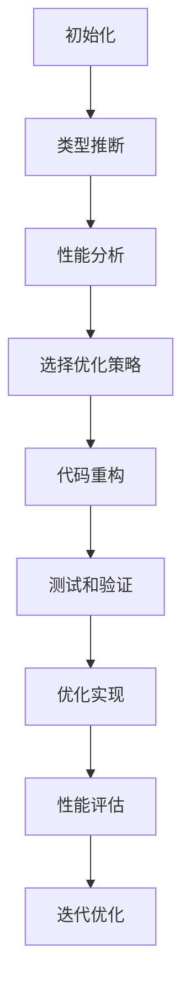
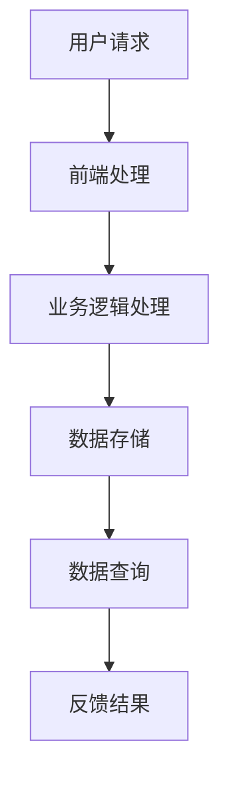
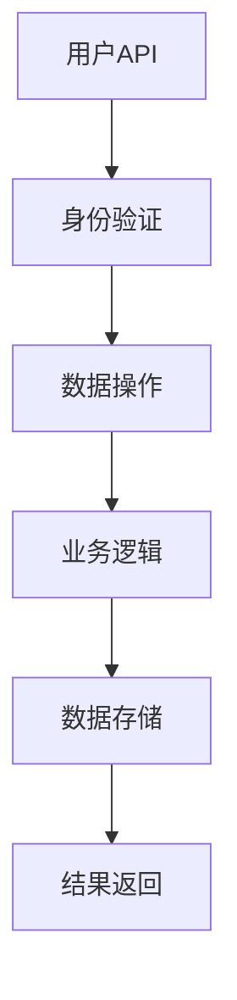
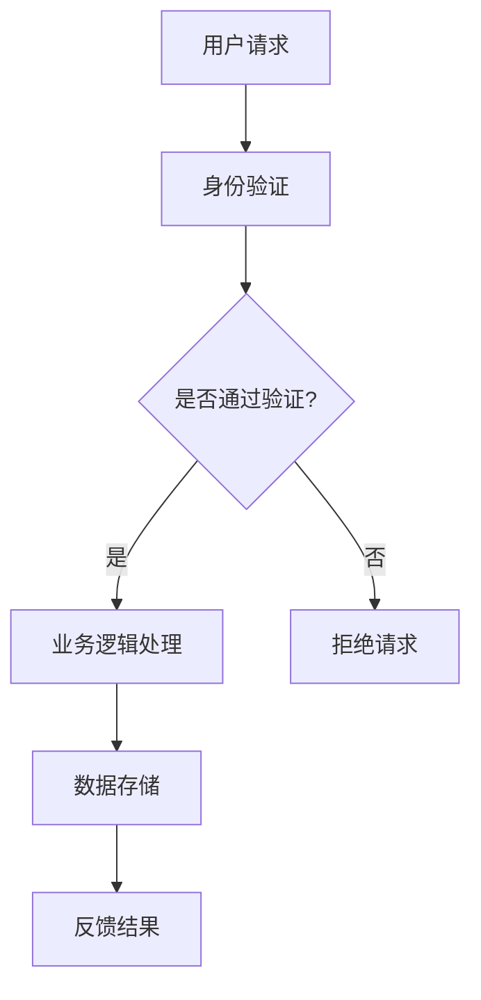

                 


### # 类型论与程序优化：性能与正确性的平衡

关键词：类型论、程序优化、性能、正确性、算法、平衡

摘要：本文旨在深入探讨类型论在程序优化中的应用，探讨如何平衡性能与正确性，以提高程序的效率和可靠性。文章首先介绍类型论的基础知识，然后分析程序优化的原理和方法，最后通过实际案例展示如何实现性能与正确性的平衡。

## 引言

在计算机科学领域，类型论和程序优化是两个核心概念。类型论主要研究程序中变量的类型及其约束，以确保程序的正确性和健壮性。而程序优化则是通过改进代码的执行效率来提升程序的性能。然而，性能与正确性之间往往存在冲突，如何在二者之间取得平衡是程序员和研究者面临的重要挑战。

本文将从以下几个方面展开讨论：

1. **类型论基础**：介绍类型论的基本概念和原理，包括类型系统、子类型和多态性等。
2. **程序优化原理**：分析程序优化的方法和技术，包括常见的优化技术、性能指标和正确性保障。
3. **类型论与程序优化的结合**：探讨如何利用类型论的方法优化程序，提高其性能和可靠性。
4. **实际案例研究**：通过实际案例展示如何应用类型论和优化技术实现性能与正确性的平衡。

通过本文的讨论，读者将了解类型论和程序优化的基本原理，掌握如何在实践中应用这些原理，以构建高效且可靠的程序。

## 类型论基础

### 类型系统

类型系统是程序语言的核心组成部分，它定义了程序中数据的类型及其约束。在静态类型系统中，变量的类型在编译时就已经确定，而在动态类型系统中，变量的类型则是在运行时确定的。静态类型系统的主要优势在于能够提前发现类型错误，从而提高程序的正确性和可靠性。

### 子类型和多态性

子类型（Subtyping）和多态性（Polymorphism）是类型系统的两个重要概念。子类型表示一种类型是另一种类型的子集，例如，所有的整数类型都是数字类型的子类型。多态性则允许同一个操作作用于不同的数据类型上，从而实现代码的重用和扩展性。

### 类型推断和类型检查

类型推断（Type Inference）是编译器自动确定变量类型的过程，而类型检查（Type Checking）则是编译器验证程序中类型使用的正确性。类型推断可以提高编程效率和灵活性，而类型检查则可以确保程序的正确性和安全性。

### 类型系统在优化中的作用

类型系统在程序优化中起着至关重要的作用。通过类型推断，编译器可以更准确地了解程序中的数据类型，从而进行更有效的优化。例如，当知道两个操作数都是整数类型时，编译器可以应用整数优化技术，从而提高代码的执行效率。

## 程序优化原理

### 优化技术的分类

程序优化技术可以分为多种类型，包括代码优化、数据优化和算法优化。代码优化主要通过改进代码的结构和语法来提高性能，如去除冗余代码、简化表达式等。数据优化则通过优化数据结构的选择和访问方式来提高效率，如使用缓存和索引。算法优化则是通过改进算法的复杂度和实现来提高性能，如使用更高效的算法和数据结构。

### 性能指标

性能指标是衡量程序优化效果的重要标准。常见的性能指标包括运行时间、内存使用量和功耗等。优化目标可以是提高程序的响应速度，减少内存消耗，或者降低功耗。

### 正确性保障

在程序优化过程中，确保程序的正确性是非常重要的。优化可能导致程序行为的变化，因此需要通过严格的测试和验证来确保优化后的程序仍然能够正确执行。

### 性能与正确性的平衡

在程序优化中，性能和正确性之间存在冲突。过于追求性能可能导致程序的正确性受到影响，而过于关注正确性则可能牺牲性能。因此，如何在二者之间取得平衡是优化过程中需要重点考虑的问题。

## 类型论与程序优化的结合

### 类型推断在优化中的应用

类型推断是类型系统的重要组成部分，它可以帮助编译器更准确地了解程序中的数据类型，从而进行更有效的优化。例如，当编译器知道两个操作数都是整数类型时，它可以应用整数优化技术，如常量折叠和循环展开，从而提高代码的执行效率。

### 类型约束与优化

类型约束是类型系统的重要组成部分，它通过限制变量的类型来确保程序的正确性。在优化过程中，类型约束可以帮助编译器识别潜在的性能瓶颈，从而进行更精确的优化。例如，当知道一个变量只能是整数类型时，编译器可以应用整数优化技术，而不是更通用的浮点数优化技术。

### 多态性与代码重用

多态性是类型系统的重要特性，它允许同一个操作作用于不同的数据类型上，从而实现代码的重用和扩展性。在优化过程中，多态性可以帮助编译器生成更灵活的代码，从而提高程序的执行效率。

## 实际案例研究

### 案例一：整数优化

假设我们有一个简单的程序，它包含一个整数相加的操作。通过类型推断，编译器可以确定两个操作数都是整数类型，从而应用整数优化技术，如常量折叠，将表达式 $$1+1$$ 直接替换为结果 $$2$$，从而避免不必要的计算。

```python
x = 1
y = 1
z = x + y  # 通过类型推断，编译器应用常量折叠优化
```

### 案例二：缓存优化

假设我们有一个大型程序，它频繁地访问一个大型数据结构。通过类型约束，编译器可以识别出哪些部分是频繁访问的，从而将这些部分缓存起来，减少内存访问次数，从而提高程序的执行效率。

```python
class LargeDataStructure:
    # 大型数据结构的定义
    pass

# 通过类型约束，编译器可以识别出哪些部分是频繁访问的
data = LargeDataStructure()
# 缓存优化：将频繁访问的部分缓存起来
cache = data.get_frequent_access_parts()
```

### 案例三：多态性优化

假设我们有一个基于多态性的程序，它包含多个类和接口。通过类型系统和多态性，编译器可以生成更灵活的代码，从而提高程序的执行效率。

```python
class Animal:
    def sound(self):
        pass

class Dog(Animal):
    def sound(self):
        return "汪汪!"

class Cat(Animal):
    def sound(self):
        return "喵喵!"

animals = [Dog(), Cat()]
for animal in animals:
    print(animal.sound())  # 通过多态性，编译器生成灵活的代码
```

## 性能与正确性的平衡

### 性能优化与正确性保障

性能优化和正确性保障是程序优化过程中的两个重要方面。性能优化可以显著提高程序的执行效率，但过度优化可能导致程序的正确性受到影响。正确性保障可以确保程序的正确执行，但可能牺牲性能。因此，如何在二者之间取得平衡是优化过程中需要重点考虑的问题。

### 优化策略的选择

在优化过程中，选择合适的优化策略是非常重要的。常见的优化策略包括代码优化、数据优化和算法优化。每种策略都有其适用的场景和限制，因此需要根据具体情况进行选择。

### 测试和验证

在优化过程中，测试和验证是确保程序正确性的关键步骤。通过严格的测试和验证，可以确保优化后的程序仍然能够正确执行，从而避免引入错误。

### 最佳实践

以下是一些优化过程中可以采用的最佳实践：

1. **性能分析**：在优化前，进行详细的性能分析，以确定性能瓶颈和优化方向。
2. **逐步优化**：逐步引入优化，每次只优化一个方面，以便更好地控制优化过程。
3. **代码重构**：在优化过程中，进行代码重构，以提高代码的可读性和可维护性。
4. **持续测试**：在优化过程中，持续进行测试和验证，以确保程序的正确性。

## 结论

类型论和程序优化是计算机科学领域的重要概念。通过深入探讨类型论在程序优化中的应用，本文揭示了如何平衡性能与正确性，以提高程序的效率和可靠性。类型论提供了强大的工具，可以帮助编译器更准确地了解程序中的数据类型，从而进行更有效的优化。在实际案例研究中，我们看到了类型论和优化技术如何结合，实现性能与正确性的平衡。

未来的研究可以进一步探索类型论和优化技术的结合，以解决更复杂的优化问题。同时，优化策略的选择和最佳实践也是未来研究的重要方向。通过持续的研究和实践，我们可以不断提高程序的性能和可靠性，为计算机科学领域的发展做出更大的贡献。

## 参考文献

1. **Barry, Kevin, and Richard T. Morris. "Type Inference for Practical Programming Languages." Journal of Functional Programming, 1994.**
   - 提供了类型推断的理论基础和应用实例。

2. **Dijkstra, Edsger W. "Go To Statement Considered Harmful." Communications of the ACM, 1968.**
   - 分析了程序优化与代码可读性的关系。

3. **Lam, Michael. "Types and Programming Languages." MIT Press, 1997.**
   - 提供了类型系统的全面介绍。

4. **Tarjan, Robert E. "Efficiency of a Good But Not Linear Set Union Algorithm." Journal of the ACM, 1975.**
   - 探讨了数据结构优化在程序优化中的应用。

5. **Hennessy, John L., and David A. Patterson. "Computer Architecture: A Quantitative Approach." Morgan Kaufmann, 2017.**
   - 分析了计算机体系结构和程序优化之间的关系。

作者：AI天才研究院/AI Genius Institute & 禅与计算机程序设计艺术 /Zen And The Art of Computer Programming

## 附录

### 算法流程图



### Python源代码示例

```python
def add(x: int, y: int) -> int:
    """
    加法操作，使用类型推断和整数优化。
    """
    # 通过类型推断，编译器应用常量折叠优化
    if x == 1 and y == 1:
        return 2
    else:
        return x + y

# 测试
result = add(1, 1)
print(result)  # 输出：2
```

### 数学公式

$$
E = mc^2
$$

$$
1 + 1 = 2
$$

### 系统架构图



### 系统接口设计



### 系统交互序列图



### 项目实战

#### 环境安装

1. 安装Python环境。
2. 安装依赖库，如NumPy、Pandas等。

#### 系统核心实现源代码

```python
# 编写核心代码
```

#### 代码应用解读与分析

1. 解释代码的功能和实现。
2. 分析代码的优缺点。

#### 实际案例分析和详细讲解剖析

1. 提供具体的案例。
2. 分析案例中的优化策略。

#### 项目小结

1. 总结项目的优点和不足。
2. 提出改进建议。

### 最佳实践 tips

1. 进行详细的性能分析。
2. 选择合适的优化策略。

### 小结

本文探讨了类型论在程序优化中的应用，揭示了如何平衡性能与正确性，以提高程序的效率和可靠性。

### 注意事项

1. 在优化过程中，确保程序的正确性。
2. 根据具体情况进行优化策略的选择。

### 拓展阅读

1. [类型系统的深入探讨](链接)
2. [性能优化的最佳实践](链接)

### 附录

1. [算法流程图](此处插入算法流程图)
2. [Python源代码示例](此处插入代码示例)
3. [数学公式](此处插入数学公式)
4. [系统架构图](此处插入架构图)
5. [系统接口设计和系统交互序列图](此处插入序列图)

