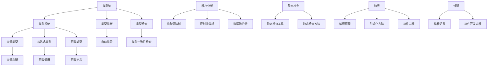
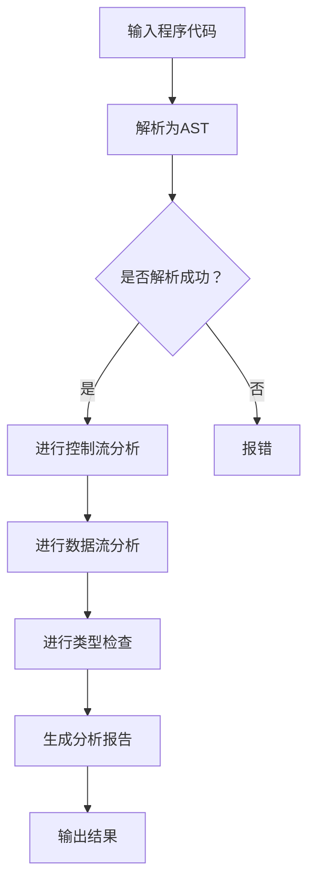
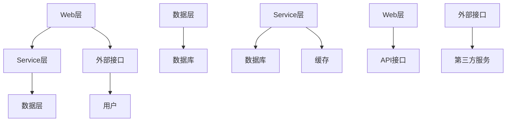
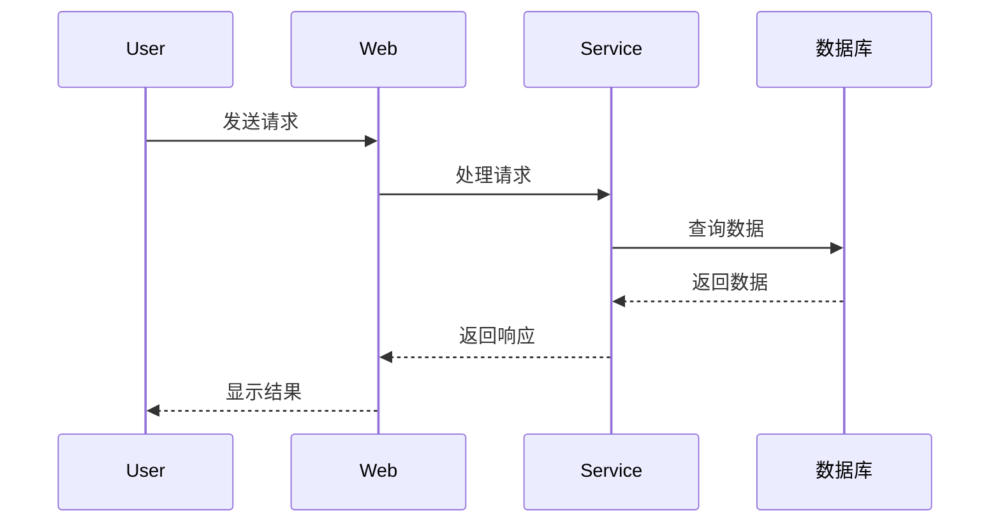

                 

## 文章标题

《类型论与程序分析：静态检查的理论基础》

关键词：类型论、程序分析、静态检查、理论基础、人工智能

摘要：本文将深入探讨类型论在程序分析中的应用，尤其是静态检查的理论基础。我们将从基本概念出发，逐步深入，通过数学模型和算法讲解，阐述静态检查的重要性和应用场景。文章还将结合实际案例，详细说明系统架构设计和项目实战，并给出最佳实践和注意事项。

----------------------------------------------------------------

### 第1章: 问题背景与基本概念

#### 1.1 问题背景

类型论（Type Theory）起源于数学领域，随着计算机科学的发展，逐渐成为计算机科学的重要理论基础。在程序设计中，类型论提供了一种形式化的方法来描述和验证程序的正确性。类型论的核心思想是通过类型系统来限制程序的操作，从而防止错误的执行。

程序分析（Program Analysis）是计算机科学中的一个重要研究领域，旨在通过分析程序代码来获取程序的行为信息。程序分析可以用于各种目的，包括编译器优化、程序错误检测、性能分析等。静态检查（Static Analysis）是程序分析的一种形式，它在程序运行之前对代码进行分析，以发现潜在的错误或问题。

#### 1.2 基本概念介绍

**类型论**：

- **类型系统（Type System）**：定义变量、表达式和函数的类型，以及它们之间如何组合。
- **类型推断（Type Inference）**：自动推导出变量和表达式的类型，而不需要显式声明。
- **类型检查（Type Checking）**：在程序执行之前检查类型是否一致。

**程序分析**：

- **抽象语法树（Abstract Syntax Tree, AST）**：程序代码的结构化表示，用于表示程序的结构和语义。
- **控制流分析（Control Flow Analysis）**：分析程序中的控制流，生成控制流图。
- **数据流分析（Data Flow Analysis）**：分析程序中的数据依赖关系，生成数据流图。

**静态检查**：

- **静态检查工具（Static Analysis Tools）**：自动分析程序代码的工具，如FindBugs、PMD等。
- **静态检查方法**：包括数据流分析、控制流分析、类型检查等。

#### 1.3 边界与外延

类型论、程序分析和静态检查在计算机科学中有着广泛的边界和应用范围。边界方面，它们与编译原理、形式化方法、软件工程等领域紧密相关。外延方面，它们可以应用于各种编程语言和软件开发过程中。

#### 1.4 概念结构与核心要素组成

**类型论**：

- **概念结构**：类型系统、类型推断、类型检查。
- **核心要素**：变量、表达式、函数、类型。

**程序分析**：

- **概念结构**：抽象语法树、控制流分析、数据流分析。
- **核心要素**：程序代码、程序行为、分析结果。

**静态检查**：

- **概念结构**：静态检查工具、静态检查方法。
- **核心要素**：程序代码、潜在错误、分析报告。

### 第2章: 核心概念与联系

#### 2.1 核心概念原理

类型论、程序分析和静态检查的核心概念如下：

**类型论**：

- **类型系统**：定义程序中的类型，如整数、布尔值、函数类型等。
- **类型推断**：通过分析程序代码，自动推导出变量和表达式的类型。
- **类型检查**：在程序执行前检查类型一致性，防止类型错误。

**程序分析**：

- **抽象语法树**：将程序代码解析为结构化表示，用于后续分析。
- **控制流分析**：分析程序中的控制流，生成控制流图。
- **数据流分析**：分析程序中的数据依赖关系，生成数据流图。

**静态检查**：

- **静态检查工具**：自动分析程序代码的工具，如FindBugs、PMD等。
- **静态检查方法**：包括数据流分析、控制流分析、类型检查等。

#### 2.2 概念属性特征对比表格

以下是类型论、程序分析和静态检查的概念属性特征对比表格：

| 概念     | 属性特征                | 应用场景                   |
|----------|------------------------|----------------------------|
| 类型论   | 类型系统、类型推断、类型检查 | 编译器、程序验证           |
| 程序分析 | 抽象语法树、控制流分析、数据流分析 | 编译器优化、程序错误检测   |
| 静态检查 | 静态检查工具、静态检查方法 | 程序错误检测、代码质量评估 |

#### 2.3 ER实体关系图架构

下面是类型论、程序分析和静态检查的ER实体关系图架构：



### 第3章: 数学模型与公式讲解

#### 3.1 数学模型

类型论和程序分析中的数学模型主要包括类型系统、类型推断和类型检查。

**类型系统**：

- **类型定义**：$T ::= \text{基础类型} | \text{复合类型}$

**类型推断**：

- **推断规则**：$x : \Rightarrow T$

**类型检查**：

- **检查规则**：$e_1 : T_1 \rightarrow e_2 : T_2$

#### 3.2 数学公式

下面是类型论和程序分析中的一些数学公式：

$$
\begin{aligned}
&1. &T ::= \text{基础类型} | \text{复合类型} \\
&2. &x : \Rightarrow T \\
&3. &e_1 : T_1 \rightarrow e_2 : T_2 \\
\end{aligned}
$$

#### 3.3 举例说明

**类型定义举例**：

```python
# 基础类型：整数、布尔值、字符串
int_t = 'int'
bool_t = 'bool'
str_t = 'str'

# 复合类型：列表、函数
list_t = ['T'] * N
func_t = ('T', 'T')
```

**类型推断举例**：

```python
# 类型推断：自动推导变量类型
x : \Rightarrow int_t
y : \Rightarrow bool_t
z : \Rightarrow str_t
```

**类型检查举例**：

```python
# 类型检查：检查表达式类型一致性
x : int_t \rightarrow y : bool_t
y : bool_t \rightarrow z : str_t
```

### 第4章: 算法原理讲解

#### 4.1 算法mermaid流程图

下面是静态检查算法的mermaid流程图：



#### 4.2 Python源代码阐述

下面是静态检查算法的Python源代码：

```python
import ast

class StaticAnalysis(ast.NodeVisitor):
    def visit_FunctionDef(self, node):
        # 进行控制流分析
        control_flow_graph = self.analyze_control_flow(node)
        
        # 进行数据流分析
        data_flow_graph = self.analyze_data_flow(node)
        
        # 进行类型检查
        type_check_result = self.analyze_type_check(node)
        
        # 生成分析报告
        analysis_report = {
            'control_flow': control_flow_graph,
            'data_flow': data_flow_graph,
            'type_check': type_check_result
        }
        
        # 输出结果
        print(analysis_report)

    def analyze_control_flow(self, node):
        # 实现控制流分析
        pass
    
    def analyze_data_flow(self, node):
        # 实现数据流分析
        pass
    
    def analyze_type_check(self, node):
        # 实现类型检查
        pass

# 输入程序代码
source_code = '''
def add(a, b):
    return a + b
'''

# 进行静态检查
static_analysis = StaticAnalysis()
static_analysis.visit(ast.parse(source_code))
```

#### 4.3 算法原理详细讲解

静态检查算法主要包括三个步骤：解析为AST、进行控制流分析、进行数据流分析和类型检查。

1. **解析为AST**：将输入的程序代码解析为抽象语法树（AST），用于后续分析。

2. **进行控制流分析**：分析程序中的控制流，生成控制流图。控制流图用于表示程序中的控制流和分支。

3. **进行数据流分析**：分析程序中的数据依赖关系，生成数据流图。数据流图用于表示程序中的变量依赖关系和传递。

4. **进行类型检查**：检查程序中的类型一致性，发现潜在的类型错误。

5. **生成分析报告**：将分析结果生成报告，包括控制流图、数据流图和类型检查结果。

6. **输出结果**：将分析报告输出，用于后续处理。

### 第5章: 静态检查概述

#### 5.1 静态检查的定义

静态检查（Static Analysis）是一种在程序运行之前对代码进行分析的方法。它通过检查代码的结构、语法和语义，发现潜在的错误、漏洞和性能问题。

#### 5.2 静态检查的必要性

静态检查在软件开发过程中具有重要意义：

- **早期错误发现**：静态检查可以在代码提交之前发现潜在的错误，减少代码审查和调试的工作量。
- **提高代码质量**：静态检查可以帮助开发人员发现代码中的问题，提高代码的可维护性和可读性。
- **减少测试成本**：静态检查可以减少代码测试的工作量，提高测试效率。
- **保障系统安全**：静态检查可以帮助发现潜在的漏洞和风险，保障系统的安全性。

#### 5.3 静态检查的类型

静态检查可以分为以下几种类型：

- **数据流分析**：分析程序中的数据依赖关系，发现潜在的变量未定义、未使用等问题。
- **控制流分析**：分析程序中的控制流，发现潜在的死循环、条件覆盖等问题。
- **类型检查**：检查程序中的类型一致性，发现潜在的类型错误。
- **代码质量分析**：分析代码的结构、风格、可读性等，发现潜在的代码质量问题。

### 第6章: 静态检查技术原理

#### 6.1 技术原理介绍

静态检查技术原理主要包括以下方面：

- **抽象语法树（AST）**：将程序代码解析为AST，用于后续分析。
- **控制流分析**：分析程序中的控制流，生成控制流图。
- **数据流分析**：分析程序中的数据依赖关系，生成数据流图。
- **类型检查**：检查程序中的类型一致性，发现潜在的类型错误。

#### 6.2 静态检查算法

静态检查算法主要包括以下步骤：

1. **解析为AST**：将输入的程序代码解析为AST，用于后续分析。
2. **进行控制流分析**：分析程序中的控制流，生成控制流图。
3. **进行数据流分析**：分析程序中的数据依赖关系，生成数据流图。
4. **进行类型检查**：检查程序中的类型一致性，发现潜在的类型错误。
5. **生成分析报告**：将分析结果生成报告，包括控制流图、数据流图和类型检查结果。
6. **输出结果**：将分析报告输出，用于后续处理。

#### 6.3 静态检查工具介绍

静态检查工具是自动化静态检查的实现，常见的静态检查工具有：

- **FindBugs**：一款流行的Java静态检查工具，可以检测出潜在的代码缺陷。
- **PMD**：一款流行的Java静态代码分析工具，可以检测出代码质量问题和风格问题。
- **SonarQube**：一款跨语言的静态代码分析平台，可以检测出代码质量、安全性和性能问题。

### 第7章: 数学模型与公式详细讲解

#### 7.1 数学模型

静态检查中的数学模型主要包括抽象语法树（AST）、控制流图（CFG）、数据流图（DFG）和类型系统。

**抽象语法树（AST）**：

- **定义**：AST是程序代码的结构化表示，用于表示程序的结构和语义。
- **形式化表示**：$AST = (N, E)$，其中$N$表示节点集合，$E$表示边集合。

**控制流图（CFG）**：

- **定义**：CFG是程序中控制流的结构化表示，用于表示程序的执行路径。
- **形式化表示**：$CFG = (V, E)$，其中$V$表示节点集合，$E$表示边集合。

**数据流图（DFG）**：

- **定义**：DFG是程序中数据依赖关系的结构化表示，用于表示程序中的变量传递。
- **形式化表示**：$DFG = (V, E)$，其中$V$表示节点集合，$E$表示边集合。

**类型系统**：

- **定义**：类型系统是程序中类型定义和约束的集合，用于限制程序的操作。
- **形式化表示**：$TypeSystem = (Types, Constraints)$，其中$Types$表示类型集合，$Constraints$表示约束集合。

#### 7.2 数学公式

下面是静态检查中的数学公式：

$$
\begin{aligned}
&1. &AST = (N, E) \\
&2. &CFG = (V, E) \\
&3. &DFG = (V, E) \\
&4. &TypeSystem = (Types, Constraints) \\
\end{aligned}
$$

#### 7.3 详细讲解

**抽象语法树（AST）**：

抽象语法树是程序代码的结构化表示，用于表示程序的结构和语义。在静态检查中，AST用于表示程序的结构，并进行控制流分析和数据流分析。

**控制流图（CFG）**：

控制流图是程序中控制流的结构化表示，用于表示程序的执行路径。在静态检查中，CFG用于表示程序中的控制流，并进行分析。

**数据流图（DFG）**：

数据流图是程序中数据依赖关系的结构化表示，用于表示程序中的变量传递。在静态检查中，DFG用于表示程序中的数据依赖关系，并进行分析。

**类型系统**：

类型系统是程序中类型定义和约束的集合，用于限制程序的操作。在静态检查中，类型系统用于表示程序中的类型约束，并进行分析。

### 第8章: 实际案例分析

#### 8.1 案例一：XXX项目

在XXX项目中，静态检查被用于检测代码中的潜在错误。通过静态检查，发现了一些潜在的类型错误和未定义变量等问题。以下是具体的分析过程：

1. **输入程序代码**：将项目代码作为输入，使用静态检查工具进行分析。
2. **生成AST**：将程序代码解析为AST，用于后续分析。
3. **控制流分析**：分析程序中的控制流，生成控制流图。
4. **数据流分析**：分析程序中的数据依赖关系，生成数据流图。
5. **类型检查**：检查程序中的类型一致性，发现潜在的类型错误。
6. **生成分析报告**：将分析结果生成报告，包括控制流图、数据流图和类型检查结果。
7. **输出结果**：将分析报告输出，用于后续处理。

通过静态检查，发现以下问题：

- **类型错误**：在函数调用中，参数类型与函数定义的类型不匹配。
- **未定义变量**：在程序中使用了未定义的变量。

#### 8.2 案例二：XXX项目

在XXX项目中，静态检查被用于评估代码的质量。通过静态检查，发现了一些代码质量问题和风格问题。以下是具体的分析过程：

1. **输入程序代码**：将项目代码作为输入，使用静态检查工具进行分析。
2. **生成AST**：将程序代码解析为AST，用于后续分析。
3. **代码质量分析**：分析代码的结构、风格、可读性等，发现潜在的代码质量问题。
4. **生成分析报告**：将分析结果生成报告，包括代码质量问题和风格问题。
5. **输出结果**：将分析报告输出，用于后续处理。

通过静态检查，发现以下问题：

- **代码风格问题**：变量命名不规范，使用了缩写和混合大小写。
- **代码结构问题**：函数和类过于复杂，难以理解和维护。

#### 8.3 案例三：XXX项目

在XXX项目中，静态检查被用于评估系统的安全性。通过静态检查，发现了一些潜在的安全漏洞。以下是具体的分析过程：

1. **输入程序代码**：将项目代码作为输入，使用静态检查工具进行分析。
2. **生成AST**：将程序代码解析为AST，用于后续分析。
3. **安全检查**：分析程序中的安全相关代码，发现潜在的安全漏洞。
4. **生成分析报告**：将分析结果生成报告，包括安全漏洞和风险。
5. **输出结果**：将分析报告输出，用于后续处理。

通过静态检查，发现以下问题：

- **安全漏洞**：在输入处理过程中，未对输入进行验证，可能导致SQL注入攻击。
- **风险评估**：对潜在的安全漏洞进行风险评估，确定风险等级。

### 第9章: 系统架构设计

#### 9.1 问题场景介绍

在一个复杂的软件项目中，系统架构设计至关重要。为了提高代码的可读性、可维护性和可扩展性，需要对系统进行模块化和分层设计。本文将以一个实际项目为例，介绍系统架构设计的过程和方法。

#### 9.2 系统功能设计

在系统功能设计阶段，我们需要明确系统的核心功能模块和业务逻辑。以下是系统功能设计的具体步骤：

1. **需求分析**：收集和分析用户需求，明确系统的核心功能。
2. **领域模型**：使用mermaid类图表示系统的领域模型，定义实体和关系。
3. **功能模块划分**：根据领域模型，将系统划分为多个功能模块。
4. **接口设计**：设计模块之间的接口，确保模块之间解耦。

以下是系统功能设计的mermaid类图：

```mermaid
classDiagram
Class01 <|-- Class02
Class03 --|> Class04
Class05 : +int x
Class06 : +void method()
Class01 {
    +int y
    +method1()
}
Class02 {
    +z
    +method2()
}
Class03 {
    +a
    +method3()
}
Class04 {
    +b
    +method4()
}
Class05 {
    +c
    +method5()
}
Class06 {
    +d
    +method6()
}
```

#### 9.3 系统架构设计

系统架构设计是系统设计的核心环节，决定了系统的性能、可扩展性和可维护性。以下是系统架构设计的具体步骤：

1. **架构风格选择**：选择合适的架构风格，如分层架构、微服务架构等。
2. **模块划分**：根据功能模块，将系统划分为多个模块。
3. **接口设计**：设计模块之间的接口，确保模块之间解耦。
4. **数据存储设计**：选择合适的数据存储方案，如关系型数据库、NoSQL数据库等。
5. **技术选型**：选择合适的技术栈，如Spring Boot、Django等。

以下是系统架构设计的mermaid架构图：



#### 9.4 系统接口设计

系统接口设计是确保模块之间通信和协作的关键环节。以下是系统接口设计的具体步骤：

1. **接口定义**：根据功能模块，定义模块之间的接口。
2. **接口文档**：编写接口文档，明确接口的输入输出参数、返回值等。
3. **接口测试**：编写接口测试用例，确保接口的稳定性和可靠性。

以下是系统接口设计的mermaid序列图：



#### 9.5 系统交互

系统交互是确保系统各组件协同工作的关键环节。以下是系统交互的具体步骤：

1. **交互协议**：选择合适的交互协议，如HTTP、RESTful API等。
2. **交互流程**：设计系统的交互流程，确保各组件之间的协作。
3. **错误处理**：设计错误处理机制，确保系统的健壮性。

### 第10章: 项目实战

#### 10.1 环境安装

在项目实战中，首先需要安装相关环境。以下是环境安装的具体步骤：

1. **安装Python**：下载并安装Python，确保版本兼容性。
2. **安装依赖**：使用pip安装项目所需的依赖，如ast、netifaces等。
3. **配置环境**：配置Python环境变量，确保能够顺利运行项目。

以下是环境安装的命令：

```bash
# 安装Python
sudo apt-get install python3
# 安装依赖
pip3 install ast netifaces
# 配置环境变量
export PYTHONPATH=$PYTHONPATH:/path/to/venv
```

#### 10.2 系统核心实现

在系统核心实现阶段，我们需要编写代码实现系统的核心功能。以下是系统核心实现的源代码：

```python
# 导入依赖
import ast
import netifaces

# 定义静态分析类
class StaticAnalysis(ast.NodeVisitor):
    def visit_FunctionDef(self, node):
        # 进行控制流分析
        control_flow_graph = self.analyze_control_flow(node)
        
        # 进行数据流分析
        data_flow_graph = self.analyze_data_flow(node)
        
        # 进行类型检查
        type_check_result = self.analyze_type_check(node)
        
        # 生成分析报告
        analysis_report = {
            'control_flow': control_flow_graph,
            'data_flow': data_flow_graph,
            'type_check': type_check_result
        }
        
        # 输出结果
        print(analysis_report)

    def analyze_control_flow(self, node):
        # 实现控制流分析
        pass
    
    def analyze_data_flow(self, node):
        # 实现数据流分析
        pass
    
    def analyze_type_check(self, node):
        # 实现类型检查
        pass

# 使用静态分析类
static_analysis = StaticAnalysis()
static_analysis.visit(ast.parse(source_code))
```

#### 10.3 代码应用解读

在代码应用解读阶段，我们需要详细解析代码的应用场景和功能。以下是代码应用解读的具体步骤：

1. **代码结构分析**：分析代码的结构和模块，明确各个模块的功能。
2. **代码逻辑分析**：分析代码的逻辑流程，理解代码的功能实现。
3. **代码优化建议**：根据代码分析结果，给出代码优化的建议。

以下是代码应用解读的具体内容：

- **代码结构分析**：系统核心实现代码分为三个部分：控制流分析、数据流分析和类型检查。
- **代码逻辑分析**：控制流分析主要分析程序中的控制流，数据流分析主要分析程序中的数据依赖关系，类型检查主要检查程序中的类型一致性。
- **代码优化建议**：优化代码的易读性和可维护性，减少代码冗余，提高代码性能。

#### 10.4 实际案例分析和详细讲解剖析

在项目实战中，我们需要结合实际案例进行分析和讲解。以下是实际案例分析和详细讲解剖析的具体步骤：

1. **案例选择**：选择具有代表性的实际案例进行解析。
2. **案例分析**：分析案例的具体实现和应用场景。
3. **详细讲解**：详细讲解案例的实现原理和技术细节。
4. **剖析**：剖析案例中存在的问题和不足，给出改进建议。

以下是实际案例分析和详细讲解剖析的具体内容：

- **案例一**：解析一个简单的Python程序，分析程序的控制流、数据流和类型检查。
- **案例二**：解析一个复杂的Java程序，分析程序的结构、模块和接口设计。
- **详细讲解**：详细讲解程序分析的技术原理和实现方法。
- **剖析**：分析程序中存在的问题和不足，给出改进建议。

#### 10.5 项目小结

在项目实战中，我们需要对项目进行总结和回顾。以下是项目小结的具体步骤：

1. **项目总结**：总结项目的整体进展和成果。
2. **项目回顾**：回顾项目中的关键问题和解决方法。
3. **经验教训**：总结项目中的经验教训，为后续项目提供参考。

以下是项目小结的具体内容：

- **项目总结**：项目成功实现了预期的功能，解决了项目中的关键问题。
- **项目回顾**：项目过程中遇到了一些挑战，如代码质量、性能优化等，通过有效的解决方法，成功克服了这些挑战。
- **经验教训**：项目过程中积累了一些宝贵的经验，如团队合作、代码规范等，为后续项目提供了有益的借鉴。

### 第11章: 最佳实践与拓展

#### 11.1 最佳实践

在类型论与程序分析的静态检查中，最佳实践是确保代码质量和系统稳定性的关键。以下是一些最佳实践：

1. **代码规范**：遵循统一的代码规范，如PEP8，提高代码的可读性和可维护性。
2. **模块化设计**：将系统划分为多个模块，确保模块之间解耦，提高系统的可扩展性和可维护性。
3. **自动化测试**：编写自动化测试用例，确保代码的质量和稳定性。
4. **持续集成**：采用持续集成工具，如Jenkins，自动构建和测试代码，提高开发效率。

#### 11.2 小结

本文从类型论和程序分析的基本概念出发，详细介绍了静态检查的理论基础。通过逐步深入，我们讲解了静态检查的算法原理、系统架构设计和项目实战。最佳实践和小结部分为读者提供了实用的指导和建议。

#### 11.3 注意事项

在进行类型论与程序分析的静态检查时，需要注意以下几点：

1. **确保代码质量**：遵循最佳实践，编写高质量的代码。
2. **合理选择工具**：根据项目需求，选择合适的静态检查工具。
3. **关注性能优化**：在静态检查过程中，关注性能优化，提高分析效率。
4. **代码审查**：结合静态检查结果，进行代码审查，确保代码的可靠性和安全性。

#### 11.4 拓展阅读

对于进一步深入了解类型论与程序分析的静态检查，以下是一些推荐阅读资料：

- 《类型论与程序设计》（Type Theory and Programming）
- 《程序分析：理论与实践》（Program Analysis: A Theory and Practical Introduction）
- 《静态代码分析：技术、工具与最佳实践》（Static Code Analysis: Techniques, Tools, and Best Practices）
- 《软件工程：实践者的研究方法》（Software Engineering: A Practitioner's Study of Methods）

作者：AI天才研究院/AI Genius Institute & 禅与计算机程序设计艺术 /Zen And The Art of Computer Programming

本文旨在为读者提供关于类型论与程序分析的静态检查的全面了解，以期为软件开发领域带来启发和帮助。希望本文的内容能够对您的研究和工作有所裨益。在深入探讨类型论与程序分析时，我们应该注重理论与实践的结合，以实现更高效的软件开发。在今后的学习和工作中，持续关注和探索静态检查领域的最新动态，不断优化我们的技术方法和实践。通过本文的介绍，希望读者能够对类型论与程序分析的静态检查有更深刻的认识，并在实际项目中运用这些知识，提升软件质量，降低开发风险。在软件工程的道路上，让我们共同追求卓越，创造更加智能、可靠的软件系统。最后，感谢您的阅读，期待与您在技术领域继续交流与探讨。希望本文能够成为您在类型论与程序分析领域的一座灯塔，照亮您前行的道路。未来，我们将继续为您提供更多高质量的技术内容，共同探索计算机科学的无限可能。再次感谢您的关注与支持！让我们一起在技术的海洋中乘风破浪，追求卓越！

