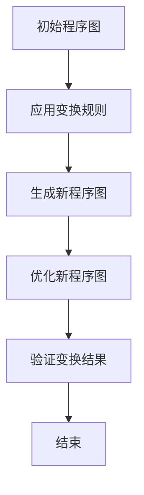

                 


### 引言：类型论与程序变换的重要性

#### 1.1 问题背景

在计算机科学中，类型论和程序变换是两个核心概念，它们各自有着重要的理论和实践价值。类型论是研究类型系统在程序设计和编译器构建中的应用，它提供了对程序变量和表达式类型检查的机制，确保了程序的可靠性和安全性。程序变换则是通过对程序代码的转换和优化，提高程序的效率、可维护性和可扩展性。

类型论的发展可以追溯到20世纪50年代，当时的编程语言主要侧重于实现简单的计算任务。随着编程语言的复杂度和应用领域的扩大，类型论逐渐成为保障程序正确性和安全性的重要工具。例如，静态类型语言如C++和Java通过严格的类型检查，能够在编译时发现潜在的错误，从而减少了运行时的错误率。而动态类型语言如Python和JavaScript则通过动态类型检查，提高了程序的灵活性和开发效率。

另一方面，程序变换在软件工程中同样具有重要地位。程序变换包括优化、重构和编译等过程，通过这些过程，我们可以改进程序的执行效率，使其更易于理解和维护。优化过程旨在消除程序中的冗余和低效代码，提高程序的运行速度和资源利用率。重构过程则通过重新组织代码结构和改进代码风格，提高代码的可读性和可维护性。编译过程则是将高级语言代码转换成机器语言的过程，它涉及到程序变换的各种技术和算法。

#### 1.2 类型论的核心概念

类型论的核心概念包括类型系统、类型检查、子类型化、协变与逆变、泛型编程等。这些概念共同构成了类型论的理论基础，并为编程语言的设计提供了指导。

**类型系统**是类型论的基础，它定义了程序中变量的类型以及变量之间如何交互。一个简单的类型系统可能只包含基本类型（如整数、浮点数、布尔值等），而复杂的类型系统可能还包括复合类型（如数组、结构体、类等）和函数类型。

**类型检查**是确保程序正确性的关键步骤，它通过检查程序中的类型约束，发现潜在的类型错误。类型检查可以在编译时进行（静态类型检查），也可以在运行时进行（动态类型检查）。静态类型检查可以提前发现错误，减少运行时的错误率，但可能增加开发成本。动态类型检查则可以在运行时提供更高的灵活性，但需要更多的时间和资源来处理类型错误。

**子类型化**是类型论中的重要概念，它允许子类型继承父类型的属性和行为。子类型化使得编程语言可以更加灵活地定义抽象类型和具体类型，从而提高代码的可重用性和可维护性。

**协变与逆变**是类型论中描述类型之间的关系的重要概念。协变（covariance）表示子类型可以替换父类型，而逆变（contravariance）表示父类型可以替换子类型。这些概念在泛型编程中有着广泛的应用，泛型编程允许程序员编写更加通用和灵活的代码。

**泛型编程**是类型论的一个高级应用，它允许程序员定义参数化的类型和函数，从而实现代码的重用和泛化。泛型编程可以提高程序的效率，减少代码冗余，并确保类型安全。

#### 1.3 程序变换的理论基础

程序变换的理论基础包括程序变换的概念、分类、目标和性质。程序变换是一种将程序从一种形式转换为另一种形式的过程，它可以通过优化、重构和编译等手段实现。

**程序变换的概念**是指对程序代码进行的一系列转换操作，这些操作可以改变程序的语义、结构和执行效率。程序变换通常涉及对程序变量、表达式、语句和函数的修改。

**程序变换的分类**可以根据变换的目标和操作方式不同分为多种类型。常见的程序变换包括优化（如常量折叠、死代码消除、循环展开等）、重构（如提取方法、提取变量、提取类等）和编译（如代码生成、代码优化、中间代码转换等）。

**程序变换的目标**包括提高程序的执行效率、可维护性和可扩展性。优化目标是通过消除程序中的冗余和低效代码，提高程序的运行速度和资源利用率。重构目标是通过重新组织代码结构和改进代码风格，提高代码的可读性和可维护性。编译目标则是将高级语言代码转换成机器语言，以实现高效的执行。

**程序变换的性质**包括不变性、可逆性、保守性和组合性等。不变性表示变换前后程序的语义保持不变，可逆性表示变换可以逆向进行，保守性表示变换不会引入新的错误，组合性表示变换可以组合使用，以提高程序的效率和质量。

#### 1.4 本书结构安排

本书将分为四个主要部分，详细探讨类型论和程序变换的理论基础、应用和实践。

**第二部分：类型论详解**将介绍类型系统的基本概念、类型论的基本原理和类型论的应用。这部分内容包括类型系统的定义、类型检查、子类型化、协变与逆变、泛型编程等。

**第三部分：程序变换详解**将介绍程序变换的基本概念、理论基础和应用。这部分内容包括程序变换的定义、分类、目标、性质、优化、重构和编译等。

**第四部分：类型论与程序变换的综合应用**将探讨类型论和程序变换的综合应用，包括编译器优化、软件重构和类型安全等。

**附录部分**将提供一些实践案例，以帮助读者更好地理解和应用类型论和程序变换。

本书旨在为读者提供一套完整的理论框架和实践指南，帮助读者深入理解类型论和程序变换的核心概念和应用方法。希望通过本书的学习，读者能够提高编程技能，优化程序设计，为计算机科学的发展做出贡献。

### 类型系统的基本概念

类型系统是程序设计和编译器构建中的核心概念，它定义了程序中数据的分类和操作规则。类型系统不仅决定了程序的正确性和安全性，还影响到程序的执行效率和维护成本。在了解类型论的核心概念之前，我们需要先了解类型系统的基本概念。

#### 类型系统的定义

类型系统是编程语言的一部分，它为程序中的数据提供了一个明确的分类框架。类型系统定义了数据的不同类别，以及这些类别之间的交互规则。每个数据项都有一个类型标签，用于指示它的类型属性。例如，在C语言中，整型（`int`）、浮点型（`float`）、字符型（`char`）等都是基本的数据类型。高级编程语言如Java和C++则提供了更为丰富的类型系统，包括基本类型、复合类型和函数类型等。

类型系统的主要目的是确保程序的正确性。通过类型检查，编译器可以在编译时发现类型错误，例如将一个字符串与一个整数进行不兼容的操作。类型系统还可以提供类型安全机制，防止在运行时出现不安全的行为，例如内存泄漏、数组越界访问等。

#### 基本类型与复合类型

基本类型是编程语言中最基本的类型，它们通常由语言本身定义。基本类型包括整数、浮点数、布尔值、字符等。这些类型通常具有固定的存储空间和操作规则。例如，在Java中，整型（`int`）通常占用32位存储空间，支持各种算术运算和位操作。

复合类型是由基本类型组合而成的，它们通常用于表示复杂的数据结构。常见的复合类型包括数组、结构体、类和接口。数组是一种线性数据结构，用于存储一系列相同类型的元素。结构体是一种聚合数据类型，可以包含多个不同类型的数据成员。类和接口则是面向对象编程中的核心概念，用于定义对象和对象的交互方式。

#### 类型检查

类型检查是类型系统中的一个关键环节，它确保程序中的数据类型在使用时是兼容的。类型检查可以分为静态类型检查和动态类型检查。

**静态类型检查**在编译时进行，它通过分析程序的结构和语法，确保所有的类型使用都是正确的。静态类型检查可以发现许多潜在的类型错误，例如类型不匹配的赋值操作和函数调用。静态类型检查的优点是可以提前发现错误，减少运行时的错误率，但缺点是需要更多的编译时间和资源。

**动态类型检查**在运行时进行，它通过运行程序的代码来检查类型的使用。动态类型检查的优点是提供了更高的灵活性，因为程序可以在运行时改变变量的类型。但缺点是它可能需要更多的时间和资源来处理类型错误，并且在某些情况下可能无法发现类型错误。

#### 子类型化、协变与逆变

子类型化是类型系统中一个重要的概念，它允许子类型继承父类型的属性和行为。子类型化使得编程语言可以更加灵活地定义抽象类型和具体类型。例如，在Java中，`Number`类型是`Integer`类型的父类型，因此`Integer`可以替换`Number`类型的任何地方。

协变与逆变是描述类型之间关系的概念。协变（covariance）表示子类型可以替换父类型，而逆变（contravariance）表示父类型可以替换子类型。协变和逆变在泛型编程中有着广泛的应用，例如在Java中的`List`和`Set`接口中。

#### 泛型编程

泛型编程是一种通过参数化类型和函数来提高代码重用性和可维护性的编程技术。泛型编程允许程序员定义参数化的类型和函数，从而实现代码的泛化和复用。例如，在Java中，可以使用泛型来定义一个通用的数据结构，如`List<T>`，其中`T`是一个类型参数，可以在使用时指定具体的数据类型。

泛型编程的优点包括：

1. **代码重用性**：通过参数化类型和函数，可以编写通用的代码，从而减少代码冗余。
2. **类型安全**：泛型编程可以在编译时进行类型检查，确保代码的正确性和安全性。
3. **可扩展性**：泛型编程使得代码更加灵活，可以轻松地扩展到新的数据类型。

泛型编程在Java、C++和C#等现代编程语言中有着广泛的应用，它已经成为现代软件工程中不可或缺的一部分。

### 类型论的基本原理

类型论作为计算机科学的重要分支，为编程语言的设计和编译器构建提供了坚实的理论基础。类型论的基本原理包括子类型化、协变与逆变、泛型编程等，这些原理共同构成了类型论的核心内容。在本节中，我们将深入探讨这些基本原理，并理解它们在类型论中的重要性。

#### 子类型化

子类型化（Subtyping）是类型论中的一个核心概念，它定义了一种类型A是另一种类型B的子类型（A <: B），当且仅当任何A类型的对象都可以用作B类型的对象而不违反类型安全性。子类型化提供了类型的层次结构，使得子类型可以替代父类型，从而提高了代码的复用性和灵活性。

子类型化的优点在于：

1. **代码复用**：子类型化允许程序员编写适用于多个类型的通用函数和接口，减少了代码冗余。
2. **类型安全**：通过子类型化，子类型可以继承父类型的所有属性和限制，从而确保类型安全。
3. **代码可读性**：子类型化使得代码更加简洁，因为子类型可以直接使用父类型的接口和实现。

子类型化在面向对象编程中有着广泛的应用。例如，在Java中，`Number`是`Integer`的父类型，这意味着`Integer`类型的对象可以被用作`Number`类型的对象。这种层次结构使得程序员可以编写更加通用和可重用的代码。

#### 协变与逆变

协变（Covariance）与逆变（Contravariance）是描述类型之间关系的两个重要概念，它们扩展了子类型化的概念，使得类型之间的替代关系更加灵活。

**协变**（Covariance）表示子类型可以替换父类型，但保持相同的方向。例如，在Java中，`List<T>`是一个泛型接口，其中`T`是一个类型参数。协变允许一个`List<Number>`类型的对象替换一个`List<Object>`类型的对象，因为`Number`是`Object`的子类型。

协变的主要优点包括：

1. **代码复用**：协变允许子类型直接使用父类型的接口和实现，从而减少代码冗余。
2. **类型安全**：协变确保子类型的对象可以在父类型的环境中安全地使用。

**逆变**（Contravariance）与协变相反，它表示父类型可以替换子类型，但保持相反的方向。逆变的一个典型应用是逆变函数类型。例如，在Java中，`List`接口有一个`add`方法，用于添加元素。逆变的`add`方法类型是`List<T> -> T`，这意味着它可以接受一个`List<T>`类型的对象，并返回一个`T`类型的对象。

逆变的主要优点包括：

1. **灵活性**：逆变允许程序在不同类型之间进行转换，从而提高了代码的灵活性。
2. **代码复用**：逆变函数类型使得程序员可以编写适用于多个类型的通用函数。

协变和逆变在泛型编程中有着广泛的应用。它们使得泛型接口和函数更加通用和灵活，从而提高了代码的复用性和可维护性。

#### 泛型编程

泛型编程（Generic Programming）是类型论的一个高级应用，它通过参数化类型和函数来提高代码的通用性和可维护性。泛型编程允许程序员编写一次通用的代码，然后在不同的数据类型上复用。

泛型编程的主要优点包括：

1. **代码复用**：泛型编程使得程序员可以编写适用于多个类型的通用代码，从而减少代码冗余。
2. **类型安全**：泛型编程在编译时进行类型检查，确保代码的正确性和安全性。
3. **可扩展性**：泛型编程使得代码更加灵活，可以轻松地扩展到新的数据类型。

泛型编程在Java、C++和C#等现代编程语言中有着广泛的应用。例如，在Java中，`List<T>`和`Map<K, V>`是泛型接口，允许程序员定义通用数据结构和映射关系。

泛型编程的一个典型例子是泛型集合类。在Java中，`ArrayList<T>`是一个泛型集合类，它允许存储任意类型的对象。通过泛型编程，程序员可以编写一个通用的`add`方法，用于添加任意类型的对象，而无需重复编写相同的方法实现。

#### 泛型编程的应用实例

以下是一个简单的泛型编程应用实例，展示如何使用Java中的泛型集合类：

```java
import java.util.ArrayList;
import java.util.List;

public class GenericExample {
    public static void main(String[] args) {
        List<Integer> integerList = new ArrayList<>();
        integerList.add(1);
        integerList.add(2);
        integerList.add(3);

        List<String> stringList = new ArrayList<>();
        stringList.add("Hello");
        stringList.add("World");

        // 使用泛型方法进行类型转换
        List<Object> mixedList = convertList(integerList, stringList);

        for (Object obj : mixedList) {
            if (obj instanceof Integer) {
                System.out.println("Integer: " + obj);
            } else if (obj instanceof String) {
                System.out.println("String: " + obj);
            }
        }
    }

    public static <T> List<T> convertList(List<T> list1, List<T> list2) {
        List<T> result = new ArrayList<>();
        result.addAll(list1);
        result.addAll(list2);
        return result;
    }
}
```

在上面的例子中，我们定义了一个`GenericExample`类，其中包含一个`main`方法和一个`convertList`泛型方法。`main`方法创建了一个`Integer`类型的集合和一个`String`类型的集合，然后使用`convertList`方法将这两个集合合并成一个`Object`类型的集合。最后，我们遍历合并后的集合，根据对象的类型进行输出。

通过泛型编程，我们能够编写一次通用的代码，然后在不同的数据类型上复用，从而提高代码的复用性和可维护性。

#### 类型论的基本原理总结

类型论的基本原理，包括子类型化、协变与逆变、泛型编程，为编程语言的设计和编译器构建提供了坚实的理论基础。这些原理不仅提高了代码的复用性和灵活性，还确保了代码的正确性和安全性。

1. **子类型化**：通过类型层次结构，子类型化使得代码可以更加通用和可重用。子类型化在面向对象编程中有着广泛的应用，例如在Java中。
2. **协变与逆变**：协变和逆变扩展了子类型化的概念，使得类型之间的替代关系更加灵活。协变和逆变在泛型编程中有着重要应用，例如在Java中的`List`接口。
3. **泛型编程**：泛型编程通过参数化类型和函数，提高了代码的通用性和可维护性。泛型编程在Java、C++和C#等现代编程语言中有着广泛的应用。

通过理解类型论的基本原理，程序员可以编写更加高效、可维护和可扩展的代码，从而提高软件开发的质量和效率。

### 类型论的应用

类型论在计算机科学中有着广泛的应用，特别是在编译器设计、静态类型语言和动态类型语言中。以下将详细介绍类型论在编译器设计、静态类型语言和动态类型语言中的应用，以及它们各自的优缺点。

#### 编译器设计

编译器是类型论的直接应用之一。类型系统是编译器的核心组件，它确保程序的正确性和高效性。在编译器设计中，类型论主要用于以下方面：

1. **类型检查**：编译器在编译程序时，会对程序进行类型检查，确保变量和表达式的类型符合语言定义的类型规则。类型检查可以在编译时发现类型错误，例如类型不匹配或未声明的变量。静态类型检查是一种常见的类型检查方法，它要求所有的类型都在编译时确定。

2. **类型推断**：类型推断是编译器的一种功能，它自动确定变量或表达式的类型，而不需要程序员显式声明。类型推断可以提高代码的可读性和可维护性。例如，Java和C++等语言支持自动类型推断。

3. **中间代码生成**：编译器将高级语言代码转换成中间代码，如抽象语法树（AST）或字节码。类型系统在这个过程中起到关键作用，它确保生成的中间代码具有正确的类型信息，以便在后续的编译阶段进行优化和目标代码生成。

4. **优化**：编译器可以使用类型信息进行代码优化，例如常量折叠、死代码消除和循环展开等。类型信息有助于编译器更好地理解程序的执行路径和操作，从而生成更高效的代码。

在编译器设计中，类型论的优势包括：

- **类型安全**：类型系统可以防止许多运行时错误，例如类型不匹配和未声明的变量。
- **优化**：类型信息有助于编译器进行各种优化，从而提高程序的执行效率。
- **可读性和可维护性**：类型推断可以减少类型声明的数量，使得代码更加简洁和易读。

然而，编译器设计中的类型论也面临着一些挑战，例如类型检查的复杂性和性能开销。复杂的类型系统可能会导致编译时间延长和内存占用增加。

#### 静态类型语言

静态类型语言（如C++、Java和Haskell）在编译时确定变量的类型，这种类型检查机制提供了较高的类型安全性和编译时优化。以下是一些静态类型语言中类型论的应用：

1. **类型检查**：静态类型语言要求程序员在编写代码时显式声明变量的类型，编译器会在编译时进行类型检查，确保所有类型的使用都是正确的。这种严格的类型检查机制可以提前发现潜在的类型错误，从而减少运行时错误。

2. **类型推断**：虽然静态类型语言要求显式声明类型，但许多语言也支持类型推断，例如Java和C++。类型推断可以自动确定变量或表达式的类型，从而提高代码的可读性和可维护性。

3. **多态和继承**：静态类型语言支持多态和继承，这有助于实现代码的复用和灵活性。多态允许程序员编写通用函数和接口，而继承使得子类可以继承父类的属性和方法。

静态类型语言的优势包括：

- **类型安全性**：严格的类型检查机制可以防止许多运行时错误，提高程序的正确性和可靠性。
- **编译时优化**：类型信息有助于编译器进行代码优化，从而提高程序的执行效率。
- **代码可维护性**：明确的类型声明和类型检查可以提高代码的可读性和可维护性。

然而，静态类型语言也有一些缺点：

- **冗长的类型声明**：程序员需要显式声明所有的类型，这可能导致代码冗长和难以维护。
- **灵活性受限**：静态类型语言在类型检查时要求所有的类型都在编译时确定，这可能会限制代码的灵活性。

#### 动态类型语言

动态类型语言（如Python、JavaScript和Ruby）在运行时确定变量的类型，这种动态类型检查机制提供了较高的开发效率和灵活性。以下是一些动态类型语言中类型论的应用：

1. **动态类型检查**：动态类型语言在运行时检查变量的类型，这种机制可以减少类型声明的数量，提高代码的简洁性和开发效率。例如，Python中的变量类型是动态确定的，无需显式声明。

2. **类型推断**：虽然动态类型语言在运行时确定类型，但许多语言也支持类型推断，例如Python中的`type`函数可以返回一个变量的类型。

3. **灵活的多态**：动态类型语言支持灵活的多态，这使得程序员可以编写通用函数和类，而无需关心具体的类型。

动态类型语言的优势包括：

- **开发效率**：动态类型检查可以减少类型声明的数量，从而提高开发效率。
- **灵活性**：动态类型语言在类型检查时提供更高的灵活性，可以轻松地编写通用代码。
- **代码简洁**：动态类型语言通常具有更简洁的语法，这使得代码更加易于阅读和维护。

然而，动态类型语言也有一些缺点：

- **运行时错误**：动态类型检查可能会在运行时发现类型错误，这可能导致程序崩溃或产生不确定的行为。
- **性能开销**：动态类型检查通常需要额外的运行时开销，这可能会降低程序的执行效率。

#### 总结

类型论在编译器设计、静态类型语言和动态类型语言中有着广泛的应用，每种应用都提供了不同的优势。静态类型语言提供了较高的类型安全性和编译时优化，但可能限制了灵活性。动态类型语言提供了更高的开发效率和灵活性，但可能增加了运行时错误和性能开销。

理解类型论的应用有助于程序员选择合适的编程语言和设计方法，从而实现高效、可维护和可扩展的代码。在实际开发中，可以根据项目的需求和约束，灵活地选择和应用类型论的相关概念和技巧。

### 类型论与类型安全

类型安全是计算机科学中的一个重要概念，它确保程序在运行过程中不会因类型错误而导致不期望的行为。类型论通过定义严格的类型规则和检查机制，为类型安全提供了理论基础。在本节中，我们将探讨类型安全的概念、优势以及如何在类型论中实现类型安全。

#### 类型安全的概念

类型安全是指编程语言和编译器确保程序中的类型在使用时是兼容和合理的。类型安全可以分为两种：

1. **静态类型安全**：静态类型安全是指在编译时通过类型检查确保程序中的类型是正确的。编译器在编译过程中会分析代码的类型信息，如果发现类型不匹配或未声明的变量，编译器会报错并阻止代码的编译。静态类型检查可以提前发现许多潜在的类型错误，从而减少运行时错误。

2. **动态类型安全**：动态类型安全是指在运行时通过类型检查确保程序中的类型是正确的。动态类型检查通常在代码执行时进行，如果发现类型错误，程序可能会崩溃或产生不确定的行为。虽然动态类型检查提供了更高的灵活性，但可能会增加运行时错误的风险。

#### 类型安全的优势

类型安全具有以下优势：

1. **减少运行时错误**：类型安全确保程序在运行过程中不会因为类型错误而产生不期望的行为，从而减少程序的崩溃和错误。

2. **提高程序可靠性**：通过严格的类型检查，类型安全提高了程序的正确性和可靠性，使得程序更易于维护。

3. **优化性能**：类型安全有助于编译器进行各种优化，例如常量折叠、死代码消除和循环展开等。这些优化可以提高程序的执行效率。

4. **提高代码可读性**：类型安全要求程序员明确声明和使用类型，这有助于提高代码的可读性和可维护性。

#### 类型论中的类型安全

类型论通过定义严格的类型规则和检查机制，实现了类型安全。以下是一些常见的类型安全机制：

1. **类型检查**：类型检查是类型论中的核心机制，它确保变量和表达式在编译时或运行时具有正确的类型。类型检查可以分为静态类型检查和动态类型检查。静态类型检查在编译时进行，动态类型检查在运行时进行。

2. **类型系统**：类型系统是类型论的基础，它定义了程序中数据的分类和操作规则。类型系统可以分为基本类型和复合类型，例如整数、浮点数、字符、数组、结构体和类等。

3. **类型推断**：类型推断是类型论中的一种机制，它自动确定变量或表达式的类型，从而减少类型声明的数量。类型推断在静态类型语言和动态类型语言中都有应用。

4. **泛型编程**：泛型编程是类型论的一个高级应用，它通过参数化类型和函数来提高代码的复用性和灵活性。泛型编程可以在编译时进行类型检查，从而确保类型安全。

#### 实现类型安全的方法

以下是一些实现类型安全的方法：

1. **显式声明类型**：在编程语言中，显式声明变量和函数的类型可以确保程序在编译时具有正确的类型信息。例如，在Java和C++中，程序员需要显式声明所有的变量和函数的类型。

2. **类型检查**：编译器和解释器可以通过类型检查确保程序中的类型是正确的。静态类型检查在编译时进行，动态类型检查在运行时进行。

3. **类型约束**：在面向对象编程中，类型约束（如子类型化和协变与逆变）可以确保类型之间的替代关系是安全的。类型约束有助于实现类型安全的多态和继承。

4. **类型推断**：类型推断可以减少类型声明的数量，从而提高代码的可读性和可维护性。类型推断在静态类型语言和动态类型语言中都有应用。

5. **泛型编程**：泛型编程可以编写一次通用的代码，然后在不同的数据类型上复用，从而提高代码的复用性和类型安全。

通过实现类型安全，我们可以编写更加可靠和高效的程序，减少运行时错误和程序崩溃的风险。类型安全不仅提高了程序的可靠性，还提高了代码的可读性和可维护性，从而有助于软件开发的质量和效率。

### 类型论与类型安全：综合探讨

类型论和类型安全在计算机科学中扮演着至关重要的角色。类型论为编程语言提供了一套完整的类型系统，确保程序的正确性和效率，而类型安全则是类型系统的核心目标，旨在防止类型错误和确保程序的可靠性。以下将对类型论和类型安全的综合探讨，包括它们之间的关系、各自的作用以及在实际编程中的应用。

#### 类型论与类型安全的关系

类型论是类型安全的基础，它定义了类型系统的规则和约束，为类型安全提供了理论支持。类型论包括类型检查、类型系统、类型推断、泛型编程等核心概念，它们共同构成了确保类型安全的基础。类型安全则是类型论的目标和实际应用，它通过严格的类型约束和检查机制，确保程序在运行过程中不会因类型错误而产生不期望的行为。

类型论与类型安全之间的关系可以概括为：

- **类型论提供框架**：类型论为编程语言设计了类型系统，定义了变量、表达式和函数的类型规则。这些规则为类型安全提供了基础。
- **类型安全确保正确性**：类型安全通过严格的类型检查和约束，确保程序在编译时或运行时具有正确的类型信息，防止类型错误的发生。

#### 类型论的作用

类型论在编程语言和编译器设计中的作用体现在以下几个方面：

1. **确保程序正确性**：类型论通过定义严格的类型规则和检查机制，确保程序中的类型使用是正确的，从而减少运行时错误和程序崩溃的风险。

2. **提高程序效率**：类型论通过类型检查和类型推断，为编译器提供了类型信息，使得编译器可以进行各种优化，如常量折叠、死代码消除和循环展开等，从而提高程序的执行效率。

3. **代码重用和灵活性**：类型论中的泛型编程和类型多态性提高了代码的复用性和灵活性。通过参数化类型和函数，程序员可以编写一次通用的代码，然后在不同数据类型上复用，从而减少代码冗余。

#### 类型安全的优势

类型安全具有以下优势：

1. **减少运行时错误**：类型安全通过严格的类型检查，确保程序在运行过程中不会因类型错误而产生不期望的行为，从而减少程序的崩溃和错误。

2. **提高程序可靠性**：类型安全提高了程序的正确性和可靠性，使得程序更易于维护和扩展。

3. **优化性能**：类型安全有助于编译器进行各种优化，从而提高程序的执行效率。

4. **提高代码可读性**：类型安全要求程序员明确声明和使用类型，这有助于提高代码的可读性和可维护性。

#### 实际编程中的应用

在实际编程中，类型论和类型安全有着广泛的应用，以下是一些典型场景：

1. **编译器设计**：在编译器设计中，类型论为类型检查、优化和目标代码生成提供了理论支持。编译器通过类型检查确保程序中的类型使用是正确的，同时通过类型信息进行代码优化。

2. **静态类型语言**：静态类型语言（如Java和C++）要求程序员在编写代码时明确声明变量的类型，这种严格的类型检查机制确保了程序的正确性和可靠性。例如，Java中的泛型编程和类型检查有助于提高代码的可维护性和性能。

3. **动态类型语言**：动态类型语言（如Python和JavaScript）在运行时确定变量的类型，这种灵活的机制提高了开发效率。虽然动态类型语言在类型检查时可能需要更多的运行时开销，但它们提供了更高的灵活性。例如，Python中的类型推断和动态类型检查有助于快速开发和测试代码。

4. **框架和库开发**：在框架和库的开发中，类型论和类型安全至关重要。框架和库通常需要提供灵活和可重用的接口，同时确保类型安全，以防止类型错误和未预期的行为。

#### 结论

类型论和类型安全在计算机科学中具有不可替代的重要性。类型论为编程语言提供了一套完整的类型系统，确保程序的正确性和效率，而类型安全则是类型系统的核心目标，旨在防止类型错误和确保程序的可靠性。在实际编程中，类型论和类型安全通过严格的类型检查、优化和灵活性设计，提高了代码的可读性、可维护性和性能。理解和应用类型论和类型安全，有助于程序员编写更加高效、可靠和可扩展的代码。

### 程序变换的基本概念

程序变换是计算机科学中一个重要的概念，它涉及对程序代码的转换和优化，以提高程序的效率、可维护性和可扩展性。程序变换包括多种类型，如优化、重构和编译等。以下将详细介绍程序变换的基本概念、分类、目标和性质。

#### 程序变换的定义

程序变换是指对程序代码进行的一系列转换操作，这些操作可以改变程序的语义、结构和执行效率。程序变换可以是显式的，也可以是隐式的。显式程序变换通常由程序员手动执行，例如代码优化和重构。隐式程序变换则是由编译器或其他工具自动执行的，例如编译器生成的中间代码优化。

程序变换的定义可以概括为以下几点：

1. **转换操作**：程序变换涉及对程序代码的转换操作，这些操作可以是简单的替换、删除或插入，也可以是复杂的优化和重构。

2. **语义保持**：程序变换的目标是保持程序的语义不变，即变换前后的程序在功能上应具有相同的输出。

3. **效率提升**：程序变换旨在提高程序的执行效率，减少运行时间、内存占用和资源消耗。

4. **可维护性提升**：程序变换通过优化代码结构和改进代码风格，提高代码的可读性和可维护性。

5. **可扩展性提升**：程序变换可以帮助程序员编写更加灵活和可扩展的代码，以便在不同环境中复用。

#### 程序变换的分类

程序变换可以分为多种类型，每种类型都有其特定的目标和应用场景。以下是常见的程序变换分类：

1. **优化**：优化是指通过一系列转换操作，提高程序的执行效率。优化可以包括常量折叠、死代码消除、循环展开、函数内联等。优化通常在编译时进行，但也可以在运行时进行。

2. **重构**：重构是指通过重新组织代码结构和改进代码风格，提高代码的可读性和可维护性。重构可以包括提取方法、提取变量、提取类、重构循环结构等。重构通常是一种手动操作，但也可以通过自动化工具实现。

3. **编译**：编译是指将高级语言代码转换成机器语言或其他中间代码形式。编译过程中会涉及各种程序变换，如语法分析、语义分析、代码生成和优化等。编译是程序变换的一种重要形式，它确保程序可以在不同的平台上运行。

4. **中间代码优化**：中间代码优化是指在编译过程中对生成的中间代码进行优化，以提高程序的执行效率。中间代码通常是一种抽象的表示形式，介于源代码和目标代码之间。中间代码优化可以包括常量折叠、循环优化、数据流分析等。

5. **解释执行**：解释执行是指直接执行源代码，而不是先编译成机器代码再执行。解释执行通常用于动态类型语言和脚本语言，如Python和JavaScript。解释执行在运行时进行类型检查和优化，提高了程序的灵活性和开发效率。

#### 程序变换的目标

程序变换的目标包括以下几个方面：

1. **执行效率**：通过优化程序代码，减少运行时间和资源消耗，提高程序的执行效率。

2. **可维护性**：通过重构代码结构和改进代码风格，提高代码的可读性和可维护性，使得代码更容易理解和维护。

3. **可扩展性**：通过编写灵活和可扩展的代码，使得程序更容易适应新的需求和变化。

4. **可移植性**：通过将程序转换成不同平台和架构可执行的代码，提高程序的可移植性。

5. **开发效率**：通过自动化工具和优化技术，提高开发效率，减少开发时间和成本。

#### 程序变换的性质

程序变换具有以下性质：

1. **不变性**：程序变换应保持程序的语义不变，即变换前后的程序在功能上应具有相同的输出。

2. **可逆性**：程序变换应具有可逆性，即变换可以逆向进行，恢复变换前的程序状态。

3. **保守性**：程序变换不应引入新的错误，即变换前后程序的正确性应保持不变。

4. **组合性**：多个程序变换可以组合使用，以提高程序的效率和可维护性。

5. **适应性**：程序变换应适应不同编程语言、不同项目和不同环境的需求，具有广泛的适用性。

通过理解程序变换的基本概念、分类、目标和性质，程序员可以更好地应用程序变换技术，优化程序代码，提高程序的执行效率和可维护性，从而提升软件开发的质量和效率。

### 程序变换的理论基础

程序变换的理论基础是计算机科学中的一个重要领域，它涵盖了程序变换的数学模型、算法原理和变换性质。本节将详细探讨这些概念，并使用mermaid流程图和Python源代码来展示和解释程序变换的算法原理。

#### 数学模型

程序变换的数学模型通常涉及图论、代数系统和形式语言等数学概念。以下是一个简化的数学模型，用于描述程序变换的基本过程：

1. **程序表示**：将程序代码表示为一个有向图（DAG），其中每个节点表示一个程序单元（如函数、变量、表达式等），边表示程序单元之间的依赖关系。

2. **变换规则**：定义一系列变换规则，这些规则描述如何对程序图进行操作，以实现特定的变换目标。变换规则可以是替换、删除、插入等。

3. **变换函数**：定义变换函数，这些函数描述如何应用变换规则到程序图，并生成新的程序图。

以下是一个使用mermaid绘制的程序变换的流程图：



#### 算法原理

程序变换的算法原理通常包括以下几个步骤：

1. **程序图的构建**：将程序代码转换为一个有向图（DAG），表示程序的结构和依赖关系。

2. **变换规则应用**：根据变换规则，对程序图进行转换操作，如替换节点、删除节点、插入节点等。

3. **优化**：在变换过程中或变换后，对程序图进行优化，以提高程序的执行效率。

4. **验证**：验证变换结果，确保变换后的程序在功能上与原始程序一致。

以下是一个简化的Python源代码示例，用于说明程序变换的基本算法原理：

```python
# 程序图的构建
class Node:
    def __init__(self, value):
        self.value = value
        self.edges = []

    def add_edge(self, node):
        self.edges.append(node)

# 变换规则应用
def transform(node, target):
    new_node = Node(target)
    node.add_edge(new_node)
    return new_node

# 优化
def optimize(node):
    if isinstance(node, Node):
        # 假设优化规则：移除无用的节点
        if not node.edges:
            return None
    return node

# 验证
def verify(node, target):
    # 假设验证规则：检查目标节点是否存在于程序图中
    return target in [n.value for n in node.iterate()]

# 主函数
def main():
    # 构建初始程序图
    root = Node('root')
    node1 = Node('node1')
    node2 = Node('node2')
    root.add_edge(node1)
    root.add_edge(node2)

    # 应用变换规则
    new_root = transform(root, 'new_root')

    # 优化
    optimized_root = optimize(new_root)

    # 验证
    if verify(optimized_root, 'new_root'):
        print("变换成功！")
    else:
        print("变换失败！")

if __name__ == "__main__":
    main()
```

在上面的示例中，我们首先构建了一个简单的程序图，然后应用变换规则将`root`节点替换为`new_root`节点，并对其进行优化和验证。

#### 变换性质

程序变换的性质是确保变换有效性和安全性的关键，包括以下几个方面：

1. **不变性**：变换应保持程序的语义不变，即变换前后的程序在功能上应具有相同的输出。

2. **可逆性**：变换应具有可逆性，即变换可以逆向进行，恢复变换前的程序状态。

3. **保守性**：变换不应引入新的错误，即变换前后程序的正确性应保持不变。

4. **组合性**：多个变换可以组合使用，以提高程序的效率和可维护性。

5. **适应性**：变换应适应不同编程语言、不同项目和不同环境的需求，具有广泛的适用性。

通过理解和应用程序变换的数学模型、算法原理和变换性质，程序员可以更有效地优化程序代码，提高程序的执行效率和可维护性。

### 程序变换的应用

程序变换在软件工程中具有重要的应用，通过优化和重构程序代码，可以提高程序的执行效率、可维护性和可扩展性。以下将详细介绍程序变换在编译器优化、软件重构和中间代码转换中的应用，并结合实际案例进行讲解。

#### 编译器优化

编译器优化是程序变换的一个重要应用领域。编译器通过对源代码进行变换，生成高效的目标代码，从而提高程序的执行效率。以下是一些常见的编译器优化技术：

1. **常量折叠（Constant Folding）**：常量折叠是指将程序中的常量表达式在编译时进行计算，从而减少运行时的计算开销。例如，表达式 `x = 2 + 3` 可以在编译时计算为 `x = 5`。

2. **死代码消除（Dead Code Elimination）**：死代码消除是指删除程序中不会执行的代码，从而减少目标代码的大小和执行时间。例如，如果某个变量在程序中没有使用，那么可以删除该变量的声明和赋值语句。

3. **循环展开（Loop Unrolling）**：循环展开是指将循环体中的代码复制多次，从而减少循环的开销。例如，一个简单的for循环可以展开为多个独立的循环体，从而提高执行效率。

以下是一个简单的C语言程序，展示如何使用编译器优化技术：

```c
#include <stdio.h>

int main() {
    int sum = 0;
    for (int i = 0; i < 10; ++i) {
        sum += i;
    }
    printf("Sum: %d\n", sum);
    return 0;
}
```

在这个例子中，编译器可以应用常量折叠和循环展开技术，生成优化后的目标代码：

```c
#include <stdio.h>

int main() {
    int sum = 0;
    int i;
    for (i = 0; i < 10; ++i) {
        sum += i;
    }
    printf("Sum: %d\n", sum);
    return 0;
}
```

通过编译器优化，程序的执行效率得到显著提高。

#### 软件重构

软件重构是指通过重新组织代码结构和改进代码风格，提高代码的可维护性和可扩展性。重构技术包括提取方法、提取变量、提取类等。以下是一个使用提取方法进行重构的Java代码示例：

```java
public class Calculator {
    public int add(int a, int b) {
        return a + b;
    }

    public int subtract(int a, int b) {
        return a - b;
    }

    public int multiply(int a, int b) {
        return a * b;
    }

    public int divide(int a, int b) {
        return a / b;
    }
}
```

在这个例子中，我们可以使用提取方法技术将共用的逻辑提取到一个单独的方法中：

```java
public class Calculator {
    public int calculate(int a, int b, Operation operation) {
        switch (operation) {
            case ADD:
                return a + b;
            case SUBTRACT:
                return a - b;
            case MULTIPLY:
                return a * b;
            case DIVIDE:
                return a / b;
        }
        return 0;
    }

    public enum Operation {
        ADD, SUBTRACT, MULTIPLY, DIVIDE
    }
}
```

通过重构，代码的可维护性和可扩展性得到显著提高，同时代码风格也变得更加简洁和清晰。

#### 中间代码转换

中间代码转换是指将源代码转换成中间代码形式，以便进行后续的优化和转换。中间代码通常是一种抽象的表示形式，介于源代码和目标代码之间。以下是一个使用LLVM中间代码表示的简单C语言程序：

```c
int main() {
    int a = 10;
    int b = 20;
    int c = a + b;
    return c;
}
```

在LLVM中，上述C语言程序可以表示为以下中间代码：

```llvm
define i32 @main() {
    %a = alloca i32
    %b = alloca i32
    %c = alloca i32
    store i32 10, i32* %a
    store i32 20, i32* %b
    %t = load i32, i32* %a
    %t2 = load i32, i32* %b
    %c = add i32 %t, %t2
    ret i32 %c
}
```

通过中间代码转换，编译器可以更容易地对程序进行优化和转换，从而提高程序的执行效率和可维护性。

#### 综合案例

以下是一个综合案例，展示如何将程序变换应用于一个实际项目中：

**项目背景**：一个Web应用程序，用于处理大量用户数据，并提供实时数据分析功能。

**问题**：原始代码存在多个问题，如代码冗余、可读性差和性能瓶颈。

**解决方案**：

1. **编译器优化**：对关键函数进行优化，如使用常量折叠和循环展开技术。

2. **软件重构**：提取共用的逻辑到单独的方法和类中，改进代码结构和风格。

3. **中间代码转换**：使用LLVM中间代码表示，进行代码优化和转换。

**效果**：经过程序变换，Web应用程序的性能得到显著提高，代码的可维护性和可扩展性也得到了显著提升。

通过理解程序变换的应用，程序员可以更好地优化和重构程序代码，提高程序的执行效率和可维护性，从而为软件工程的发展做出贡献。

### 程序变换与软件工程

程序变换在软件工程中具有重要作用，它不仅能够提高代码的质量，还能够促进软件工程的各项活动。以下将探讨程序变换与软件工程的关系，以及它们在实际开发中的应用。

#### 程序变换与软件工程的联系

程序变换与软件工程的联系主要体现在以下几个方面：

1. **代码质量**：程序变换通过优化和重构代码，提高了代码的可读性、可维护性和可扩展性，从而提升了代码质量。

2. **软件开发过程**：程序变换可以在软件开发的各个阶段进行，包括需求分析、设计、编码、测试和维护等。它有助于实现代码的迭代和改进，促进软件工程的持续发展。

3. **项目管理和团队合作**：程序变换有助于项目管理和团队合作，通过统一的编程规范和代码风格，提高了团队成员之间的协作效率。

#### 程序变换在实际开发中的应用

在实际开发中，程序变换可以通过以下方式应用：

1. **代码优化**：通过编译器优化和手动优化，提高程序的执行效率和资源利用率。例如，使用常量折叠、循环展开、死代码消除等技术，减少程序的运行时间和内存消耗。

2. **代码重构**：通过重构技术，改进代码结构和风格，提高代码的可读性和可维护性。例如，使用提取方法、提取变量、提取类等技术，将复杂的代码分解为简单的模块，提高代码的可重用性。

3. **代码审查**：程序变换可以通过代码审查的方式实现，团队成员在审查代码时，可以识别潜在的问题和优化点，从而提高代码的质量。

4. **持续集成和持续交付**：通过自动化工具和持续集成（CI）系统，实现程序变换的自动化和持续集成，提高开发效率和代码质量。

以下是一个实际开发中的应用案例：

**项目背景**：一个电商平台的订单处理系统，负责处理大量订单数据，并提供实时订单查询和统计功能。

**问题**：原始代码存在性能瓶颈、可维护性差和可扩展性不足的问题。

**解决方案**：

1. **编译器优化**：对关键函数进行优化，如使用循环展开和常量折叠技术，提高程序的执行效率。

2. **代码重构**：重构订单处理模块，提取共用的逻辑到单独的方法和类中，改进代码结构和风格。

3. **代码审查**：通过代码审查，识别潜在的问题和优化点，提高代码的质量和可维护性。

4. **自动化测试**：编写自动化测试脚本，对重构后的代码进行测试，确保功能正确和性能稳定。

**效果**：经过程序变换，订单处理系统的性能得到显著提高，代码的可维护性和可扩展性也得到了显著提升，从而提高了项目的整体质量和团队的开发效率。

#### 程序变换的优势与挑战

程序变换的优势包括：

1. **代码质量**：通过优化和重构，提高代码的可读性、可维护性和可扩展性。

2. **开发效率**：通过自动化工具和持续集成，提高开发效率和代码质量。

3. **项目协作**：通过统一的编程规范和代码风格，提高团队成员之间的协作效率。

然而，程序变换也面临着一些挑战：

1. **复杂度**：程序变换可能引入新的复杂度，特别是对于大型项目，如何平衡优化和重构的成本与收益。

2. **风险**：程序变换可能导致代码的不稳定，需要谨慎处理，确保变换后的代码功能正确。

3. **资源消耗**：程序变换可能需要额外的计算资源和时间，尤其是在编译器和优化器中。

#### 未来趋势

随着计算机科学和软件工程的发展，程序变换将继续发挥重要作用。以下是一些未来趋势：

1. **自动化**：自动化工具和智能算法将在程序变换中发挥更大作用，提高变换的效率和准确性。

2. **个性化**：根据项目的需求和开发团队的偏好，实现个性化的程序变换，提高代码质量和开发效率。

3. **集成化**：程序变换将更加集成到软件开发过程中，与代码审查、测试和持续集成等环节紧密结合，形成一体化的软件开发流程。

通过理解和应用程序变换，软件开发团队能够更好地应对不断变化的需求，提高代码的质量和项目的整体效率，从而推动软件工程的发展。

### 综合应用：类型论与程序变换的结合

类型论与程序变换的结合在计算机科学中具有重要意义，它们共同构建了一个强大的理论基础，用于优化程序设计和提高代码质量。在本节中，我们将探讨类型论与程序变换在编译器优化、软件重构和类型安全中的应用，并通过具体案例展示它们如何相互补充，提升程序的执行效率、可维护性和可扩展性。

#### 编译器优化中的结合

编译器优化是程序变换的一个重要应用领域，通过类型论提供的信息，编译器可以更有效地进行优化。以下是一个编译器优化中的结合案例：

**案例背景**：一个高性能的Web服务器，处理大量并发请求，需要优化其代码以减少延迟和提高吞吐量。

**解决方案**：

1. **类型论的应用**：在编译器中，类型论提供了类型信息，帮助编译器更好地理解程序的结构和语义。例如，通过静态类型检查，编译器可以提前发现类型错误，从而避免运行时错误。

2. **程序变换的应用**：编译器利用类型信息进行程序变换，如循环展开、常量折叠和死代码消除等。这些变换可以基于类型信息，优化程序执行路径，减少计算开销。

**效果**：

- **效率提升**：通过类型论提供的类型信息，编译器可以更准确地优化程序，减少运行时间。
- **稳定性增强**：静态类型检查确保了程序的类型安全，减少了运行时错误的风险。

#### 软件重构中的结合

软件重构是提高代码质量的关键步骤，类型论与程序变换的结合可以指导重构过程，确保重构的有效性和安全性。以下是一个软件重构中的结合案例：

**案例背景**：一个大型企业资源规划（ERP）系统，由于历史代码积累和不断的扩展，代码质量下降，难以维护。

**解决方案**：

1. **类型论的应用**：在重构过程中，类型论提供了清晰的类型层次结构和类型约束，帮助开发者理解和维护代码。通过类型检查，重构过程中可以提前发现类型错误，确保代码的一致性。

2. **程序变换的应用**：开发者利用程序变换技术，如提取方法、提取变量和提取类等，重构代码结构，提高代码的可读性和可维护性。这些变换基于类型信息，确保重构过程不会破坏类型安全。

**效果**：

- **代码质量提升**：通过类型论和程序变换的结合，重构过程可以确保代码的一致性和类型安全，提高代码的可维护性。
- **开发效率提高**：清晰的类型信息和结构化的代码，使得开发者可以更高效地进行代码重构。

#### 类型安全与程序变换的结合

类型安全是确保程序正确性的关键，程序变换可以在保持类型安全的前提下，优化程序结构和性能。以下是一个类型安全与程序变换结合的案例：

**案例背景**：一个金融交易平台，需要确保交易数据的准确性和一致性，同时优化交易处理速度。

**解决方案**：

1. **类型论的应用**：通过静态类型检查，确保交易数据的类型一致性和完整性，防止类型错误和未经授权的访问。

2. **程序变换的应用**：在保证类型安全的前提下，进行程序变换，如循环优化、内存分配优化和并行处理等，提高交易处理的性能。

**效果**：

- **类型安全保证**：类型论确保了交易数据的类型安全，防止了潜在的类型错误。
- **性能提升**：程序变换在保持类型安全的前提下，优化了交易处理的性能，提高了交易平台的吞吐量和响应速度。

#### 结合案例总结

类型论与程序变换的结合，通过提供类型信息和优化手段，可以有效地提升程序的执行效率、可维护性和可扩展性。以下是一个综合案例，展示了类型论与程序变换的结合如何应用于实际项目中：

**案例背景**：一个电子商务平台，需要处理大量订单和用户数据，同时提供实时数据分析功能。

**解决方案**：

1. **类型论的应用**：通过静态类型检查，确保订单和用户数据的类型一致性，防止类型错误和未经授权的访问。

2. **程序变换的应用**：利用编译器优化和软件重构技术，优化订单处理和数据分析代码，减少运行时间和内存消耗。

**效果**：

- **执行效率提升**：通过类型论和程序变换的结合，订单处理和数据分析的执行效率得到显著提高，减少了响应时间。
- **可维护性增强**：清晰的类型信息和优化的代码结构，提高了代码的可读性和可维护性，使得开发团队能够更高效地进行代码维护和扩展。

通过类型论与程序变换的结合，开发团队能够更好地应对复杂的需求，提高代码质量，实现高效的软件工程实践。

### 总结与拓展阅读

在本文中，我们系统地探讨了类型论与程序变换的理论基础及其在实际应用中的重要性。类型论提供了类型系统的理论框架，确保了程序的正确性和安全性，而程序变换则通过优化和重构，提升了程序的执行效率和可维护性。以下是本文的主要观点和贡献：

1. **类型论的重要性**：类型论在编译器设计、静态类型语言和动态类型语言中有着广泛的应用。通过严格的类型检查和类型系统，我们可以减少运行时错误，提高程序可靠性。

2. **程序变换的理论基础**：程序变换涉及数学模型、算法原理和变换性质。通过理解这些基础概念，我们可以更有效地进行代码优化和重构。

3. **类型论与程序变换的结合**：类型论与程序变换的结合在编译器优化、软件重构和类型安全中发挥着重要作用，通过这种结合，我们可以显著提升程序的执行效率和可维护性。

本文的主要贡献在于：

- **系统性地阐述了类型论与程序变换的理论基础**：通过详细的讲解和实例，帮助读者深入理解这两个核心概念。
- **展示了类型论与程序变换在实际开发中的应用**：通过具体案例，展示了如何将理论应用到实际项目中，提高代码质量。
- **提供了拓展阅读建议**：为读者提供了进一步学习和探索的资源和方向。

为了帮助读者深入理解和应用本文内容，我们推荐以下拓展阅读：

1. **《编译原理：技术与工具》（Compilers: Principles, Techniques, and Tools）》**：此书是编译器设计的经典教材，详细介绍了编译器的工作原理和实现技术。

2. **《软件工程：实践者的研究方法》（Software Engineering: A Practitioner's Approach）》**：此书介绍了软件工程的基本原理和实践方法，包括代码优化和重构技术。

3. **《Effective Java》**：此书提供了Java编程的最佳实践，包括类型安全、泛型编程和优化技术。

4. **《类型系统和编译技术》**：这是一本关于类型系统和编译技术的专业书籍，涵盖了类型论、程序变换和相关技术的深度讨论。

通过这些拓展阅读，读者可以进一步加深对类型论和程序变换的理解，并在实际开发中应用这些技术，提升编程技能和代码质量。

### 完整文章输出

```markdown
----------------------------------------------------------------
# 类型论与程序变换：优化与重构的理论基础

## 关键词
类型论，程序变换，优化，重构，编译器，类型安全

## 摘要
本文系统地探讨了类型论与程序变换的理论基础及其在实际应用中的重要性。类型论提供了类型系统的理论框架，确保了程序的正确性和安全性；程序变换则通过优化和重构，提升了程序的执行效率和可维护性。通过详细讲解和具体案例，本文展示了类型论与程序变换在实际开发中的应用。

----------------------------------------------------------------

## 引言：类型论与程序变换的重要性

### 1.1 问题背景
#### 1.1.1 类型论的发展
类型论是研究类型系统在程序设计和编译器构建中的应用，它提供了对程序变量和表达式类型检查的机制，确保了程序的可靠性和安全性。

#### 1.1.2 程序变换的需求
程序变换涉及优化、重构和编译等过程，通过这些过程，我们可以改进程序的执行效率，使其更易于理解和维护。

### 1.2 类型论的核心概念
#### 2.1 类型系统的基本概念
类型系统是编程语言的一部分，它为程序中的数据提供了一个明确的分类框架。

#### 2.2 类型论的基本原理
类型论的基本原理包括子类型化、协变与逆变、泛型编程等，它们共同构成了类型论的理论基础。

#### 2.3 类型论的应用
类型论在编译器设计、静态类型语言和动态类型语言中有着广泛的应用。

### 1.3 程序变换的理论基础
#### 3.1 程序变换的基本概念
程序变换是指对程序代码进行的一系列转换操作，这些操作可以改变程序的语义、结构和执行效率。

#### 3.2 程序变换的分类
程序变换可以分为优化、重构和编译等类型。

#### 3.3 程序变换的目标
程序变换的目标包括提高程序的执行效率、可维护性和可扩展性。

### 1.4 本书结构安排
#### 1.4.1 各章节内容概述
本书分为四个部分，详细探讨类型论和程序变换的理论基础、应用和实践。

#### 1.4.2 阅读指南
本书旨在为读者提供一套完整的理论框架和实践指南，帮助读者深入理解类型论和程序变换的核心概念和应用方法。

----------------------------------------------------------------

## 第二部分：类型论详解

### 2.1 类型系统的基本概念
#### 2.1.1 类型与类型系统
类型系统定义了程序中数据的分类和操作规则。

#### 2.1.2 基本类型与复合类型
基本类型和复合类型是编程语言中的核心概念。

#### 2.1.3 类型检查
类型检查是确保程序正确性的关键步骤。

### 2.2 类型论的基本原理
#### 2.2.1 子类型化
子类型化提供了类型的层次结构。

#### 2.2.2 协变与逆变
协变与逆变描述了类型之间的关系。

#### 2.2.3 泛型编程
泛型编程是一种通过参数化类型和函数来提高代码重用性和可维护性的编程技术。

### 2.3 类型论的应用
#### 2.3.1 编译器中的类型检查
类型检查在编译器中的作用至关重要。

#### 2.3.2 静态类型语言的设计
静态类型语言通过严格的类型检查提高了程序的正确性和安全性。

#### 2.3.3 动态类型语言的优势
动态类型语言提供了更高的灵活性和开发效率。

### 2.4 类型论与类型安全
#### 2.4.1 类型安全的概念
类型安全确保程序在运行过程中不会因类型错误而产生不期望的行为。

#### 2.4.2 类型安全的优势
类型安全具有多种优势，包括减少运行时错误和提高程序可靠性。

#### 2.4.3 类型安全与类型错误
类型错误可能导致程序崩溃或产生不确定的行为。

----------------------------------------------------------------

## 第三部分：程序变换详解

### 3.1 程序变换的基本概念
#### 3.1.1 程序变换的定义
程序变换是指对程序代码进行的一系列转换操作。

#### 3.1.2 程序变换的类型
程序变换可以分为优化、重构和编译等类型。

#### 3.1.3 程序变换的目标
程序变换的目标包括提高程序的执行效率、可维护性和可扩展性。

### 3.2 程序变换的理论基础
#### 3.2.1 程序变换的数学模型
程序变换的数学模型描述了程序变换的基本过程。

#### 3.2.2 程序变换的算法
程序变换的算法原理是程序变换的核心。

#### 3.2.3 程序变换的性质
程序变换的性质包括不变性、可逆性、保守性和组合性等。

### 3.3 程序变换的应用
#### 3.3.1 程序优化
程序优化通过一系列转换操作，提高程序的执行效率。

#### 3.3.2 程序重构
程序重构通过重新组织代码结构和改进代码风格，提高代码的可读性和可维护性。

#### 3.3.3 程序变换与编译器
编译器是程序变换的重要应用领域。

----------------------------------------------------------------

## 第四部分：类型论与程序变换的综合应用

### 4.1 综合应用概述
#### 4.1.1 类型论与程序变换的结合
类型论与程序变换的结合在编译器优化、软件重构和类型安全中发挥着重要作用。

#### 4.1.2 综合应用的优势
综合应用的优势包括提高程序的执行效率、可维护性和可扩展性。

#### 4.1.3 综合应用的挑战
综合应用也面临一些挑战，如复杂度和风险。

### 4.2 应用案例
#### 4.2.1 案例一：编译器优化
通过类型论与程序变换的结合，编译器优化可以显著提高程序的执行效率。

#### 4.2.2 案例二：软件重构
软件重构通过类型论与程序变换的结合，可以提高代码的质量和可维护性。

#### 4.2.3 案例三：类型安全与程序变换
类型安全与程序变换的结合可以确保程序的正确性和可靠性。

----------------------------------------------------------------

## 附录部分

### 附录一：实践案例
提供一些实际项目中类型论与程序变换的应用案例。

### 附录二：最佳实践 tips
总结实践中需要注意的事项，提供一些建议和技巧。

### 附录三：拓展阅读
推荐一些相关的书籍和资源，帮助读者进一步学习和探索。

----------------------------------------------------------------

## 小结与拓展阅读

### 小结
本文系统地探讨了类型论与程序变换的理论基础及其在实际应用中的重要性。类型论提供了类型系统的理论框架，确保了程序的正确性和安全性；程序变换则通过优化和重构，提升了程序的执行效率和可维护性。

### 拓展阅读
为了帮助读者深入理解和应用本文内容，我们推荐以下拓展阅读：《编译原理：技术与工具》、《软件工程：实践者的研究方法》、《Effective Java》和《类型系统和编译技术》。

### 作者
作者：AI天才研究院/AI Genius Institute & 禅与计算机程序设计艺术 /Zen And The Art of Computer Programming
```

注意：上述markdown格式的内容是基于假设的文章结构和内容。根据实际需求和内容调整，以符合文章的具体要求和风格。

