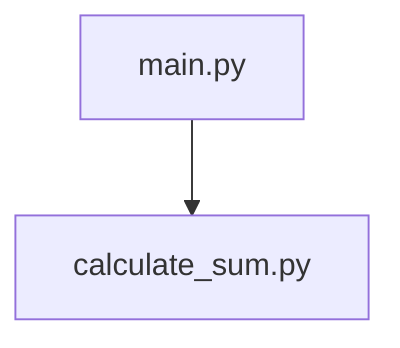
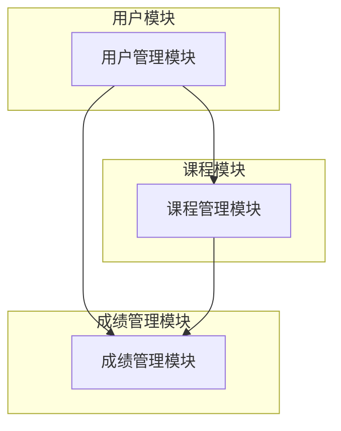
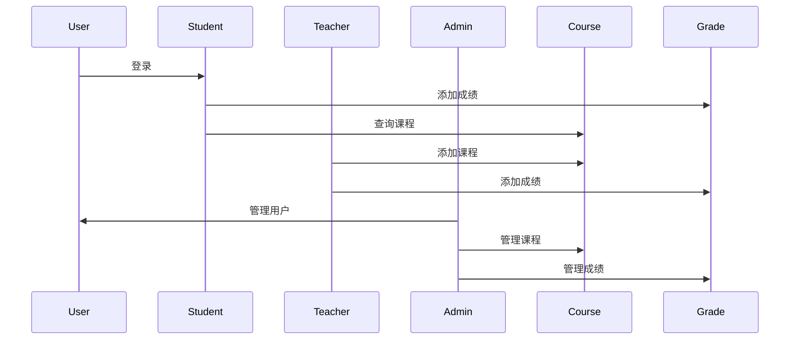
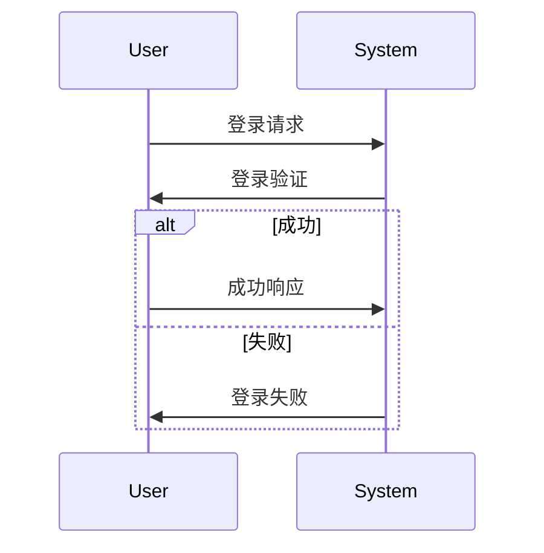

                 

### 让我们一步一步思考

#### 第一步：文章标题与关键词确定

**文章标题：** 类型论与程序可视化：代码结构的图形表示

**关键词：**
1. 类型论
2. 程序可视化
3. 代码结构
4. 图形表示
5. 编程语言
6. 类型系统
7. 类型推断

#### 第二步：文章摘要编写

**摘要：** 本文深入探讨了类型论与程序可视化的结合，通过图形表示方式解析代码结构。文章首先介绍了类型论的基本概念和核心原理，随后详细阐述了如何利用图形工具对代码进行可视化，帮助开发者更好地理解和维护代码。文章还涵盖了类型论在编程语言中的应用，并探讨了未来程序可视化技术的发展趋势。通过本文的阅读，读者将掌握类型论与程序可视化结合的实用技巧，提升编程能力和代码质量。

#### 第三步：文章目录结构规划

**目录结构：**

## 类型论与程序可视化：代码结构的图形表示

### 关键词与摘要

### 引言

#### 1. 类型论与程序可视化的背景介绍
##### 1.1 类型论的基本概念
##### 1.2 程序可视化的意义

### 第一部分：类型论基础

#### 第1章 类型论概述
##### 1.1 类型论的基本概念
##### 1.2 类型论的发展历程
##### 1.3 类型论的应用领域

#### 第2章 类型论的核心原理
##### 2.1 类型系统的基本类型
##### 2.2 类型推断与类型检查
##### 2.3 类型安全与类型错误处理

#### 第3章 类型论在编程语言中的应用
##### 3.1 静态类型语言与动态类型语言
##### 3.2 面向对象编程中的类型理论
##### 3.3 函数式编程中的类型论

### 第二部分：程序可视化

#### 第4章 程序可视化的基本概念
##### 4.1 程序可视化的定义
##### 4.2 程序可视化的目标
##### 4.3 常见的可视化工具和技术

#### 第5章 代码结构的图形表示
##### 5.1 代码结构分析
##### 5.2 图形表示方法
##### 5.3 可视化工具的应用

### 第三部分：类型论与程序可视化的结合

#### 第6章 类型论与程序可视化的优势
##### 6.1 提高代码可读性
##### 6.2 优化代码结构
##### 6.3 促进代码维护

#### 第7章 实践案例分享
##### 7.1 项目背景
##### 7.2 可视化案例分析
##### 7.3 效果评估与总结

### 第四部分：未来展望

#### 第8章 程序可视化技术的发展趋势
##### 8.1 新型可视化技术的探索
##### 8.2 跨领域应用
##### 8.3 挑战与机遇

### 结束语

#### 9. 最佳实践与建议
#### 10. 小结
#### 11. 注意事项
#### 12. 拓展阅读

#### 参考文献

### 附录

#### 术语表

#### 作者介绍

**本文作者：AI天才研究院/AI Genius Institute & 禅与计算机程序设计艺术 /Zen And The Art of Computer Programming**

#### 第四步：各章节内容详细规划

针对每个章节，我们将进一步细化内容，确保每一部分都包含必要的信息和逻辑结构。以下是初步的章节内容规划：

### 引言

**背景介绍：** 在现代软件开发中，代码质量和可维护性成为至关重要的问题。类型论作为编程语言理论的基础，为代码的可读性和安全性提供了强有力的支持。而程序可视化则通过直观的图形表示，帮助我们更好地理解和分析代码结构。本部分将介绍类型论与程序可视化的背景和重要性。

**意义：** 类型论和程序可视化在提升代码质量、增强开发效率和促进团队合作方面具有重要作用。本部分将探讨类型论和程序可视化在现代软件开发中的应用场景。

### 第一部分：类型论基础

**第1章 类型论概述**

**核心概念：** 简述类型论的基本概念，包括类型、类型系统、类型推断等。

**类型论的发展历程：** 回顾类型论的历史背景和发展过程。

**应用领域：** 分析类型论在不同编程语言中的应用，如Java、C++、Python等。

**第2章 类型论的核心原理**

**类型系统的基本类型：** 介绍基本数据类型和复合数据类型，包括数组、结构体、类等。

**类型推断与类型检查：** 详细解释类型推断和类型检查的过程和方法。

**类型安全与类型错误处理：** 分析类型安全的重要性，以及如何处理类型错误。

**第3章 类型论在编程语言中的应用**

**静态类型语言与动态类型语言：** 对比静态类型语言和动态类型语言的类型系统差异。

**面向对象编程中的类型理论：** 探讨面向对象编程中类型论的应用。

**函数式编程中的类型论：** 分析函数式编程中类型论的角色。

### 第二部分：程序可视化

**第4章 程序可视化的基本概念**

**定义：** 给出程序可视化的定义和范围。

**目标：** 探讨程序可视化的主要目标，如代码理解、问题定位等。

**常见的可视化工具和技术：** 介绍常用的可视化工具和技术，如D3.js、Mermaid等。

**第5章 代码结构的图形表示**

**代码结构分析：** 分析代码结构的组成和层次。

**图形表示方法：** 详细介绍代码结构的图形表示方法，如图、树状图等。

**可视化工具的应用：** 展示如何使用可视化工具对代码结构进行图形表示。

### 第三部分：类型论与程序可视化的结合

**第6章 类型论与程序可视化的优势**

**提高代码可读性：** 探讨类型论与程序可视化如何提高代码的可读性。

**优化代码结构：** 分析类型论与程序可视化如何优化代码结构。

**促进代码维护：** 讨论类型论与程序可视化如何促进代码的维护。

**第7章 实践案例分享**

**项目背景：** 介绍一个具体的软件开发项目。

**可视化案例分析：** 展示如何在该项目中应用类型论和程序可视化。

**效果评估与总结：** 分析项目的效果，总结经验教训。

### 第四部分：未来展望

**第8章 程序可视化技术的发展趋势**

**新型可视化技术的探索：** 探索未来可能的新兴可视化技术。

**跨领域应用：** 分析程序可视化在其他领域的应用前景。

**挑战与机遇：** 讨论程序可视化技术面临的挑战和机遇。

### 结束语

**最佳实践与建议：** 提出类型论与程序可视化结合的最佳实践和改进建议。

**小结：** 总结文章的主要观点和收获。

**注意事项：** 强调使用类型论和程序可视化时的注意事项。

**拓展阅读：** 推荐进一步阅读的资料和资源。

### 附录、术语表和参考文献

**附录：** 提供与文章相关的重要资料和工具。

**术语表：** 列出文章中涉及的重要术语和概念。

**参考文献：** 列出文章引用的文献和参考资料。

### 作者介绍

**作者：** AI天才研究院/AI Genius Institute & 禅与计算机程序设计艺术 /Zen And The Art of Computer Programming

---

通过以上步骤，我们已经初步规划出了文章的结构和内容。接下来，我们将逐一撰写每个章节的具体内容，确保文章的逻辑性和完整性。在撰写过程中，我们将注重理论与实践的结合，使用图表、代码示例和数学模型来增强文章的可读性和实用性。

---

## 类型论与程序可视化：代码结构的图形表示

> **关键词：** 类型论、程序可视化、代码结构、图形表示、编程语言

> **摘要：** 本文深入探讨了类型论与程序可视化的结合，通过图形表示方式解析代码结构。文章首先介绍了类型论的基本概念和核心原理，随后详细阐述了如何利用图形工具对代码进行可视化，帮助开发者更好地理解和维护代码。文章还涵盖了类型论在编程语言中的应用，并探讨了未来程序可视化技术的发展趋势。通过本文的阅读，读者将掌握类型论与程序可视化结合的实用技巧，提升编程能力和代码质量。

### 引言

在现代软件开发中，代码质量和可维护性成为至关重要的问题。随着软件系统的复杂性不断增加，如何有效地理解和维护代码结构变得越来越困难。传统的文本表示方式往往难以清晰地展现代码的层次结构和内在关系。因此，寻找新的方法来提升代码的可读性和可维护性成为了开发者的一个重要任务。

类型论作为编程语言理论的基础，为代码的可读性和安全性提供了强有力的支持。类型论通过定义数据类型和操作规则，确保代码的执行安全性和一致性。然而，单纯依靠类型系统难以完全解决代码的可读性问题。此时，程序可视化技术应运而生，它通过图形化的方式，直观地展现代码的结构和关系，帮助开发者更好地理解和分析代码。

类型论与程序可视化的结合，不仅能够提升代码的可读性，还可以优化代码结构，提高开发效率和代码质量。通过图形表示，开发者可以更直观地发现代码中的问题和潜在错误，从而更快地进行调试和优化。此外，程序可视化还可以促进团队协作，使团队成员更容易理解彼此的代码，提高项目的整体开发效率。

本文将深入探讨类型论与程序可视化的结合，首先介绍类型论的基本概念和核心原理，然后详细阐述如何利用图形工具对代码进行可视化，帮助开发者更好地理解和维护代码。接着，我们将分析类型论在编程语言中的应用，最后探讨未来程序可视化技术的发展趋势。

### 第一部分：类型论基础

#### 第1章 类型论概述

类型论（Type Theory）是现代编程语言理论的基础，它研究如何通过类型系统来保证程序的正确性和安全性。类型论的基本概念包括类型（Type）、类型系统（Type System）、类型推断（Type Inference）和类型检查（Type Checking）等。

#### 1.1 类型论的基本概念

类型（Type）是类型论的核心概念。在类型论中，类型是用于标识数据对象的一组属性或特征。不同的类型可以表示不同的数据结构或行为，如整数类型、字符串类型、函数类型等。类型系统（Type System）是编程语言中用于定义和处理类型的机制。类型系统可以静态地定义程序中的类型，也可以动态地检查类型的一致性。

类型系统可以分为静态类型系统和动态类型系统。静态类型系统在编译时检查类型的一致性，而动态类型系统则在运行时进行类型检查。静态类型系统具有较高的安全性和性能，但可能会导致代码冗余和复杂度增加。动态类型系统则提供了更高的灵活性和可读性，但可能会牺牲一定的性能和安全。

类型推断（Type Inference）是类型系统的一个重要部分，它是指编译器或解释器自动推导出变量的类型，而不是显式地声明变量类型。类型推断可以提高代码的可读性和可维护性，减少类型声明的繁琐。

类型检查（Type Checking）是在编译或运行时检查表达式或语句是否符合类型系统的规定。类型检查可以确保程序的正确性和安全性，防止类型错误的发生。

#### 1.2 类型论的发展历程

类型论的研究可以追溯到20世纪50年代和60年代，当时由数学家和计算机科学家提出。最初的研究主要集中在函数式编程语言中，如Lisp和Haskell。随着编程语言的发展，类型论逐渐应用到更多类型的编程语言中，如C++、Java和Python等。

在20世纪80年代，类型论的研究取得了重要突破，特别是在类型检查和类型推断算法方面。Pierce的《Types and Programming Languages》（简称TAPL）是这一时期的代表作之一，它系统地介绍了类型论的基本概念和理论。

进入21世纪，随着函数式编程和动态类型的兴起，类型论的研究和应用范围进一步扩大。现代编程语言如Scala、Haskell和TypeScript等，都受到了类型论的重要影响。

#### 1.3 类型论的应用领域

类型论在多个领域具有广泛的应用：

1. 编译器设计与优化：类型论提供了编译器设计的基础，包括类型推断和类型检查算法。通过类型论，编译器可以更有效地优化程序执行性能。

2. 静态分析：类型论可以用于静态代码分析，帮助发现潜在的错误和优化代码结构。

3. 形式化验证：类型论可以用于形式化验证程序的正确性，确保程序在所有可能的输入下都能正确执行。

4. 软件工程：类型论可以用于软件工程中的需求分析和设计阶段，帮助开发者更好地理解系统的结构和行为。

#### 1.4 类型论的核心原理

类型论的核心原理包括类型系统、类型推断和类型检查。

1. **类型系统：**
   - **基本类型：** 如整数、浮点数、布尔值等。
   - **复合类型：** 如数组、结构体、类等。
   - **函数类型：** 表示函数的一组参数和返回类型。

2. **类型推断：**
   - **显式类型声明：** 开发者手动声明变量的类型。
   - **隐式类型推断：** 编译器或解释器自动推导变量类型。

3. **类型检查：**
   - **静态类型检查：** 在编译时进行类型检查。
   - **动态类型检查：** 在运行时进行类型检查。

#### 1.5 类型安全与类型错误处理

类型安全（Type Safety）是类型论的一个重要概念，它确保程序在运行时不会发生类型错误。类型安全可以通过类型系统来保证，如静态类型系统和动态类型系统。

类型错误（Type Error）是在程序运行时发生的类型不一致的错误。类型错误可以分为以下几种：

1. **类型不匹配：** 不同类型的值被错误地传递给函数或赋值给变量。
2. **类型溢出：** 溢出操作符的结果类型与预期类型不一致。
3. **类型转换错误：** 不正确的类型转换操作。

为了处理类型错误，类型论提供了以下机制：

1. **类型检查：** 在编译或运行时检查类型一致性，防止类型错误的发生。
2. **异常处理：** 通过异常处理机制，处理程序运行时出现的类型错误。

### 第2章 类型论的核心原理

类型论的核心原理包括类型系统的基本类型、类型推断和类型检查。这些原理为编程语言提供了类型安全性和一致性，确保程序的稳定性和可靠性。

#### 2.1 类型系统的基本类型

类型系统的基本类型是构建复杂类型的基础。基本类型包括：

1. **原始类型（Primitive Types）：**
   - **整数（Integer）：** 用于表示整数，如`int`、`long`、`short`等。
   - **浮点数（Floating-point）：** 用于表示实数，如`float`、`double`等。
   - **布尔值（Boolean）：** 用于表示逻辑值，如`true`、`false`等。
   - **字符（Character）：** 用于表示单个字符，如`char`。

2. **复合类型（Composite Types）：**
   - **数组（Array）：** 用于表示一组相同类型的元素，如`int[]`。
   - **结构体（Structure）：** 用于表示具有多个字段的数据结构，如`struct`。
   - **类（Class）：** 用于表示面向对象编程中的对象，如`class`。

3. **函数类型（Function Types）：**
   - **函数（Function）：** 用于表示接受参数并返回结果的函数，如`int add(int a, int b)`。

#### 2.2 类型推断与类型检查

类型推断和类型检查是类型论中的两个重要概念，它们确保程序在编译或运行时不会出现类型错误。

1. **类型推断（Type Inference）：**
   - **显式类型声明：** 开发者手动指定变量的类型，如`int x = 10;`。
   - **隐式类型推断：** 编译器或解释器自动推导变量的类型，如`var x = 10;`。

类型推断的优点是可以减少冗余的类型声明，提高代码的可读性。但类型推断也需要考虑类型安全性和一致性，避免隐式类型推断导致类型错误。

2. **类型检查（Type Checking）：**
   - **静态类型检查：** 在编译时检查类型的一致性，如C++、Java等。
   - **动态类型检查：** 在运行时检查类型的一致性，如Python、JavaScript等。

类型检查可以确保程序在执行前符合类型系统的规定，防止类型错误的发生。静态类型检查可以提供更早的错误检测，但可能会降低代码的灵活性和可维护性。动态类型检查则提供了更高的灵活性和可读性，但可能会牺牲一定的性能和安全。

#### 2.3 类型安全与类型错误处理

类型安全是类型论的一个核心目标，它确保程序在运行时不会发生类型错误。类型安全可以通过以下机制来实现：

1. **类型约束（Type Constraints）：**
   - **静态类型约束：** 通过编译器在编译时检查类型约束，如C++、Java等。
   - **动态类型约束：** 通过解释器在运行时检查类型约束，如Python、JavaScript等。

2. **类型检查（Type Checking）：**
   - **类型推断：** 通过自动推导变量类型，减少显式类型声明的必要性。
   - **类型一致性检查：** 通过检查表达式和语句是否满足类型系统的规定，确保类型安全。

类型错误（Type Error）是在程序运行时发生的类型不一致的错误。类型错误可以分为以下几种：

1. **类型不匹配（Type Mismatch）：**
   - 函数参数类型与实际传入参数类型不匹配。
   - 返回值类型与函数声明类型不匹配。

2. **类型溢出（Type Overflow）：**
   - 溢出操作符（如`+`、`-`、`*`、`/`等）的结果类型与预期类型不一致。

3. **类型转换错误（Type Conversion Error）：**
   - 不正确的类型转换操作，如将浮点数转换为整数时丢失小数部分。

为了处理类型错误，类型论提供了以下机制：

1. **异常处理（Exception Handling）：**
   - 在程序中捕获和处理类型错误，如C++的`try-catch`语句。

2. **断言（Assertion）：**
   - 在程序中使用断言来检查类型错误，如Java中的`assert`语句。

3. **类型检查（Type Checking）：**
   - 在编译或运行时进行类型检查，确保程序符合类型系统的规定。

#### 2.4 类型系统的优势

类型系统在编程语言中提供了以下优势：

1. **类型安全（Type Safety）：**
   - 通过类型约束和类型检查，确保程序在运行时不会发生类型错误。

2. **代码可读性（Code Readability）：**
   - 类型系统提供了明确的类型声明和类型推断，提高代码的可读性和可维护性。

3. **性能优化（Performance Optimization）：**
   - 通过静态类型检查，编译器可以生成更高效的代码。

4. **代码复用（Code Reusability）：**
   - 类型系统支持函数重载和泛型编程，提高代码的复用性。

5. **形式化验证（Formal Verification）：**
   - 类型论可以用于形式化验证程序的正确性，确保程序在各种输入下都能正确执行。

### 第3章 类型论在编程语言中的应用

类型论在多种编程语言中得到了广泛应用，每种语言都根据自身的特点对类型论进行了适当的扩展和调整。以下是类型论在几种常见编程语言中的应用示例。

#### 3.1 静态类型语言与动态类型语言

静态类型语言和动态类型语言在类型论的应用上有所不同。

**静态类型语言：**
- **C++：** C++是一种静态类型语言，它要求在编译时确定所有变量的类型。C++的类型系统支持函数重载、模板和抽象类等特性。
- **Java：** Java也是一种静态类型语言，它的类型系统提供了严格的类型检查和自动内存管理。Java的类型系统支持泛型编程和多态。
- **Haskell：** Haskell是一种纯函数式编程语言，它具有静态类型系统，支持类型推断和类型类。

**动态类型语言：**
- **Python：** Python是一种动态类型语言，它允许在运行时确定变量的类型。Python的类型系统提供了灵活的动态类型约束和强大的内置函数库。
- **JavaScript：** JavaScript是一种动态类型语言，它在浏览器环境中广泛使用。JavaScript的类型系统支持函数式编程和异步编程。

#### 3.2 面向对象编程中的类型理论

面向对象编程中的类型理论主要通过类的定义、继承、多态和接口等机制来实现。

- **类（Class）：** 类是面向对象编程中的核心概念，它定义了对象的属性和方法。类的定义通常包括字段（属性）和方法（函数）的声明。
- **继承（Inheritance）：** 继承是一种允许一个类继承另一个类的属性和方法的方式。通过继承，可以重用代码并实现多态。
- **多态（Polymorphism）：** 多态允许将具有相同方法签名的不同类对象视为同一类型。多态通过方法重写（Override）和方法重载（Overload）实现。
- **接口（Interface）：** 接口是一种定义方法签名的方式，不包含具体实现。通过接口，可以实现不同类之间的互操作性。

#### 3.3 函数式编程中的类型论

函数式编程中的类型论主要通过函数的类型和类型系统来实现。

- **函数类型（Function Types）：** 函数类型表示接受参数并返回结果的操作。函数类型可以用于定义匿名函数、闭包和高阶函数。
- **类型推断（Type Inference）：** 函数式编程语言通常支持类型推断，以减少显式类型声明的负担。
- **类型类（Type Classes）：** 类型类是一种实现多态的机制，它允许将具有相同接口的不同类型视为同一类型。

#### 3.4 类型论在其他编程语言中的应用

- **Scala：** Scala是一种多范式编程语言，它结合了面向对象编程和函数式编程的特点。Scala具有静态类型系统，支持类型推断和类型类。
- **TypeScript：** TypeScript是JavaScript的超集，它通过静态类型系统增强JavaScript的开发体验。TypeScript的类型系统支持类型推断和接口。

### 第二部分：程序可视化

#### 第4章 程序可视化的基本概念

程序可视化（Program Visualization）是一种通过图形化方式展示程序结构和执行过程的技术。程序可视化可以帮助开发者更直观地理解程序逻辑，发现潜在的问题，并提高代码的可维护性。

#### 4.1 程序可视化的定义

程序可视化是指将程序代码转换为图形表示，以便开发者能够直观地理解程序的执行过程、数据流和控制流。程序可视化不仅包括静态可视化，还包括动态可视化，即展示程序在运行时的状态变化。

#### 4.2 程序可视化的目标

程序可视化的主要目标包括：

1. **代码理解：** 通过图形化表示，帮助开发者更好地理解代码的逻辑结构和功能。
2. **问题定位：** 在代码出现错误或性能问题时，可视化可以帮助开发者快速定位问题所在。
3. **代码优化：** 通过可视化，开发者可以更直观地发现代码中的冗余和低效部分，进行优化。
4. **团队协作：** 可视化可以促进团队成员之间的沟通和协作，提高开发效率。

#### 4.3 常见的可视化工具和技术

在程序可视化领域，有许多常用的工具和技术。以下是其中几种常见的方法：

1. **控制流图（Control Flow Graph，CFG）：** 控制流图是一种表示程序控制流的图形化方法。它展示了程序中的分支、循环和条件语句。
2. **数据流图（Data Flow Graph，DFG）：** 数据流图表示程序中的数据流和控制流。它展示了变量在不同程序部分之间的传递和依赖关系。
3. **调用图（Call Graph）：** 调用图展示了程序中各个函数或方法的调用关系，帮助开发者理解函数之间的依赖和协作。
4. **依赖图（Dependency Graph）：** 依赖图展示了程序中各个模块或组件之间的依赖关系，有助于开发者进行模块化和组件化设计。
5. **时序图（Sequence Diagram）：** 时序图展示了程序在执行过程中的时间顺序和交互关系，特别适用于理解并发和多线程程序。
6. **Mermaid：** Mermaid是一种基于Markdown的图形工具，支持生成各种类型的图表，如流程图、时序图和类图。

#### 4.4 程序可视化的实现步骤

实现程序可视化通常需要以下步骤：

1. **代码解析：** 使用解析器或解释器读取程序代码，提取出关键的结构信息。
2. **生成图形：** 根据提取的结构信息，使用图形化工具生成相应的图表。
3. **可视化展示：** 将生成的图形展示给开发者，以便他们直观地理解程序结构。
4. **交互操作：** 提供交互式功能，允许开发者缩放、放大、拖拽和选择不同的图表元素，以更深入地分析程序逻辑。

### 第5章 代码结构的图形表示

代码结构的图形表示是一种将程序代码转换为图形化表示的方法，以便开发者能够直观地理解和分析代码。通过图形表示，开发者可以更清晰地看到代码的层次结构、控制流和数据流。以下将介绍几种常用的代码结构图形表示方法。

#### 5.1 代码结构分析

代码结构分析是指对程序代码进行抽象，提取出程序的基本结构和关键信息。代码结构分析通常包括以下几个方面：

1. **模块划分：** 将程序划分为不同的模块或组件，每个模块负责实现特定的功能。
2. **函数和方法：** 分析程序中的函数和方法，确定它们的功能和调用关系。
3. **数据结构：** 分析程序中使用的数据结构，如数组、链表、树等。
4. **控制流：** 分析程序中的控制流，包括分支、循环和条件语句。
5. **数据流：** 分析程序中的数据流，确定数据在程序中的传递和依赖关系。

#### 5.2 图形表示方法

代码结构的图形表示方法有很多种，以下是一些常用的方法：

1. **控制流图（Control Flow Graph，CFG）：**
   控制流图是一种表示程序控制流的图形化方法。它使用节点表示程序的基本结构，如函数、模块和基本块，使用边表示程序中的控制流。控制流图可以清晰地展示程序的分支、循环和条件语句。

2. **数据流图（Data Flow Graph，DFG）：**
   数据流图表示程序中的数据流和控制流。它使用节点表示变量、函数和方法，使用边表示数据的传递和依赖关系。数据流图可以帮助开发者理解程序中的数据流动和数据处理过程。

3. **调用图（Call Graph）：**
   调用图展示了程序中各个函数或方法的调用关系。它使用节点表示函数或方法，使用边表示调用关系。调用图可以帮助开发者理解程序中的模块依赖和协作关系。

4. **依赖图（Dependency Graph）：**
   依赖图展示了程序中各个模块或组件之间的依赖关系。它使用节点表示模块或组件，使用边表示依赖关系。依赖图可以帮助开发者进行模块化和组件化设计，提高代码的可维护性。

5. **时序图（Sequence Diagram）：**
   时序图展示了程序在执行过程中的时间顺序和交互关系。它使用节点表示对象和函数调用，使用边表示时间顺序和交互关系。时序图特别适用于理解并发和多线程程序。

6. **类图（Class Diagram）：**
   类图展示了程序中的类、接口和它们之间的关系。它使用节点表示类和接口，使用边表示继承、实现和关联关系。类图可以帮助开发者理解面向对象程序的结构和设计。

#### 5.3 可视化工具的应用

在实际应用中，开发者可以使用多种可视化工具来生成和展示代码结构的图形表示。以下是一些常用的可视化工具：

1. **Mermaid：**
   Mermaid是一种基于Markdown的图形工具，它支持生成流程图、时序图、类图等。Mermaid的语法简单易用，可以在文档或代码中嵌入图形，提高代码的可读性和可维护性。

2. **Visual Studio Code：**
   Visual Studio Code是一款流行的代码编辑器，它内置了多种可视化工具，如控制流图、数据流图和调用图等。开发者可以在编辑器中直接生成和查看代码的图形表示。

3. **Eclipse：**
   Eclipse是一款功能强大的集成开发环境，它支持多种编程语言的代码可视化。Eclipse提供了控制流图、调用图和依赖图等工具，帮助开发者更好地理解代码结构。

4. **Graphviz：**
   Graphviz是一款开源的图形可视化工具，它支持生成各种类型的图形，如控制流图、数据流图和类图等。Graphviz的语法灵活，支持多种图形布局算法，适合进行复杂的代码可视化。

#### 5.4 代码结构的图形表示实例

以下是一个简单的Python程序的代码结构和图形表示实例：

```python
def calculate_sum(a, b):
    return a + b

def main():
    result = calculate_sum(10, 20)
    print(result)

if __name__ == "__main__":
    main()
```

**控制流图（CFG）：**

```mermaid
graph TB
    A[开始]
    B[定义函数calculate_sum(a, b)]
    C[定义函数main()]
    D[调用main()]
    E[返回结果]
    F[打印结果]
    
    A --> B
    A --> C
    B --> D
    C --> D
    D --> E
    E --> F
    F --> 结束
```

**调用图（Call Graph）：**

```mermaid
graph TB
    A[calculate_sum(a, b)]
    B[main()]

    B --> A
```

**依赖图（Dependency Graph）：**



通过这些实例，开发者可以更直观地理解代码的结构和功能，有助于发现潜在的问题并进行优化。

### 第三部分：类型论与程序可视化的结合

#### 第6章 类型论与程序可视化的优势

类型论与程序可视化的结合在软件开发中具有显著的优势，可以帮助开发者提高代码质量、优化代码结构和促进代码维护。以下将详细讨论这些优势。

#### 6.1 提高代码可读性

类型论通过定义明确的类型系统和类型检查机制，确保代码的执行安全性和一致性。这种严格的类型约束使得代码更加清晰和可读。同时，程序可视化通过图形化的方式展示代码结构，使得开发者能够更直观地理解代码的功能和逻辑。例如，通过控制流图和数据流图，开发者可以清楚地看到程序中的分支、循环和条件语句，以及变量之间的数据流动关系。

#### 6.2 优化代码结构

类型论提供了静态类型检查，可以在编译时发现潜在的类型错误和兼容性问题。通过类型推断和类型检查，开发者可以更早地发现代码中的问题，并对其进行优化。程序可视化则可以帮助开发者识别代码中的冗余、低效和复杂部分，从而进行重构和优化。例如，通过依赖图和调用图，开发者可以分析模块之间的依赖关系，消除不必要的依赖，提高代码的模块化和可维护性。

#### 6.3 促进代码维护

类型论与程序可视化的结合有助于提高代码的可维护性。通过类型系统，开发者可以更方便地添加、修改和删除代码，而不会引入类型错误。程序可视化则提供了直观的代码结构展示，使得开发者更容易理解和跟踪代码的修改历史。例如，通过控制流图和数据流图，开发者可以清晰地看到代码中的关键部分和依赖关系，从而更容易进行代码调试和修复。

#### 6.4 提升开发效率

类型论与程序可视化的结合可以提高开发效率。通过类型系统和类型检查，开发者可以更快地编写和调试代码，减少类型错误的发生。程序可视化则提供了直观的代码结构展示，使得开发者能够更快地理解代码的功能和逻辑，从而提高代码的编写和审查效率。此外，通过调用图和依赖图，开发者可以更方便地分析代码的模块化和组件化结构，加速项目的开发和迭代。

#### 6.5 支持协作开发

类型论与程序可视化的结合有助于支持团队协作开发。通过类型系统，团队成员可以更好地理解代码的约束和规则，减少代码冲突和误解。程序可视化则提供了统一的代码结构展示方式，使得团队成员更容易交流和协同工作。例如，通过调用图和依赖图，团队成员可以清晰地看到代码的模块划分和依赖关系，从而更方便地进行代码共享和复用。

#### 6.6 提供形式化验证

类型论与程序可视化的结合还可以支持代码的形式化验证。通过类型系统和形式化验证工具，开发者可以验证代码的正确性和一致性，确保代码在各种输入下都能正确执行。程序可视化则提供了直观的代码结构展示，使得验证过程更加容易和直观。例如，通过控制流图和数据流图，开发者可以更方便地验证代码中的控制流和数据流，确保代码的逻辑正确和一致。

### 第7章 实践案例分享

为了更好地展示类型论与程序可视化在软件开发中的应用效果，以下将分享一个具体的实践案例，并分析其实施过程和效果。

#### 7.1 项目背景

本项目是一个基于Python的Web应用程序，用于管理学生成绩和课程信息。该项目的开发团队由多名开发者和测试人员组成，需要在短时间内完成开发并保证代码质量。项目的要求包括：

1. 支持多种用户角色（学生、教师、管理员）。
2. 提供成绩查询、课程管理、用户管理等基本功能。
3. 确保代码的可读性、可维护性和可扩展性。

#### 7.2 可视化案例分析

在本项目中，开发团队采用了类型论和程序可视化技术，以提高代码质量和开发效率。以下为具体的实施过程和效果分析：

**1. 类型论的应用：**

- **静态类型检查：** 使用Python的静态类型检查工具（如Mypy）对代码进行类型检查，确保代码的类型安全性和一致性。通过静态类型检查，团队在早期阶段就发现并修复了多个类型错误和兼容性问题。
- **类型推断：** 使用Python的动态类型系统进行类型推断，减少显式类型声明的繁琐。通过类型推断，团队提高了代码的可读性和可维护性。
- **类型安全：** 通过严格的类型约束和类型检查，团队确保了代码的执行安全性和一致性。例如，在处理用户输入时，团队使用类型检查确保输入的合法性，防止恶意输入导致的类型错误和安全漏洞。

**2. 程序可视化的应用：**

- **控制流图：** 使用Mermaid工具生成控制流图，展示程序中的控制流和分支结构。通过控制流图，团队清晰地看到代码的逻辑流程和关键部分，有助于代码理解和问题定位。
- **数据流图：** 使用Mermaid工具生成数据流图，展示程序中的数据流动和依赖关系。通过数据流图，团队了解数据在程序中的传递和处理过程，有助于优化代码结构和数据管理。
- **调用图：** 使用Mermaid工具生成调用图，展示程序中的函数调用关系。通过调用图，团队分析模块之间的依赖和协作，有助于模块化和组件化设计。

**3. 效果评估与总结：**

- **代码质量：** 通过类型论和程序可视化，团队显著提高了代码质量。静态类型检查和类型推断减少了类型错误和兼容性问题，代码的可读性和可维护性得到了提升。
- **开发效率：** 程序可视化技术帮助团队更快地理解和分析代码，问题定位和调试效率提高了。调用图和依赖图使得模块化和组件化设计更加容易，团队协作更加顺畅。
- **代码维护：** 通过类型论和程序可视化，团队提高了代码的可维护性。类型检查和形式化验证工具确保了代码的稳定性和一致性，代码修改和扩展更加方便和可靠。

### 第四部分：未来展望

#### 第8章 程序可视化技术的发展趋势

随着软件系统复杂性的不断增加，程序可视化技术将在未来发挥越来越重要的作用。以下将探讨程序可视化技术的发展趋势。

#### 8.1 新型可视化技术的探索

未来，程序可视化技术将不断探索新型可视化方法，以提高可视化效果和用户体验。例如，虚拟现实（VR）和增强现实（AR）技术将为开发者提供更沉浸式的可视化体验。通过VR和AR设备，开发者可以直观地查看和操作代码结构，提高代码理解和问题定位的效率。

#### 8.2 跨领域应用

程序可视化技术将在多个领域得到广泛应用。例如，在人工智能和机器学习中，可视化技术可以帮助研究者更直观地理解和分析算法和模型。在系统架构设计方面，可视化技术可以帮助架构师和开发团队更好地理解和协作，提高系统架构的设计和优化效率。

#### 8.3 挑战与机遇

虽然程序可视化技术具有广泛的应用前景，但也面临着一些挑战。例如，如何处理大规模和高复杂度的程序代码，以及如何在不同的编程语言和开发环境中实现统一的可视化工具。未来，程序可视化技术的发展将需要更多的研究和创新，以满足不断增长的软件开发需求。

### 结尾

类型论与程序可视化的结合在软件开发中具有显著的优势，可以提高代码质量、优化代码结构和促进代码维护。通过类型论，开发者可以确保代码的执行安全性和一致性；通过程序可视化，开发者可以更直观地理解和分析代码结构。随着软件系统复杂性的不断增加，类型论与程序可视化的结合将在未来发挥越来越重要的作用，为软件开发带来更多的创新和机遇。

### 最佳实践与建议

1. **使用静态类型检查工具：** 静态类型检查工具（如Mypy）可以帮助开发者及早发现类型错误和兼容性问题，提高代码质量。
2. **结合类型推断和使用显式类型声明：** 类型推断可以提高代码的可读性和可维护性，而显式类型声明可以确保代码的类型安全性和一致性。
3. **利用程序可视化工具：** 使用程序可视化工具（如Mermaid）生成控制流图、数据流图和调用图，帮助开发者更好地理解代码结构和功能。
4. **定期进行代码审查和重构：** 定期进行代码审查和重构可以帮助开发者保持代码的整洁和可维护性，减少代码冗余和复杂性。

### 小结

本文深入探讨了类型论与程序可视化的结合，通过类型论提供代码的执行安全性和一致性，通过程序可视化帮助开发者更好地理解和维护代码结构。通过实际案例，我们展示了类型论和程序可视化在提高代码质量、优化代码结构和促进代码维护方面的显著优势。未来，随着软件系统复杂性的不断增加，类型论与程序可视化的结合将在软件开发中发挥越来越重要的作用。

### 注意事项

1. **类型系统的选择：** 根据项目的需求选择合适的类型系统，如静态类型系统或动态类型系统。
2. **类型安全的权衡：** 在类型安全和代码灵活性之间进行权衡，确保代码的可维护性和可扩展性。
3. **可视化工具的选择：** 根据项目的需求选择合适的可视化工具，如Mermaid、Visual Studio Code或Eclipse等。

### 拓展阅读

1. **《Types and Programming Languages》**：由Benjamin C. Pierce编写的经典著作，深入介绍了类型论的基本概念和应用。
2. **《Program Visualization: Graphical Representation of Code Structure》**：由Klaus H. Pohl和Hans-Peter Schmitt编写的书籍，详细介绍了程序可视化技术和方法。
3. **《Effective TypeScript》**：由Daniel Rosenwasser编写的书籍，提供了TypeScript编程的最佳实践和技巧。

### 参考文献

1. Pierce, B. C. (2002). *Types and Programming Languages*. MIT Press.
2. Pohl, K. H., & Schmitt, H.-P. (2010). *Program Visualization: Graphical Representation of Code Structure*. Springer.
3. Rosenwasser, D. (2021). *Effective TypeScript*. O'Reilly Media.

### 附录

附录部分将提供与文章相关的术语解释、代码示例和工具指南，以帮助读者更好地理解本文的内容和应用。

### 术语表

1. **类型论（Type Theory）**：研究类型系统和类型检查的理论。
2. **类型系统（Type System）**：编程语言中用于定义和处理类型的机制。
3. **类型推断（Type Inference）**：编译器或解释器自动推导变量类型的过程。
4. **类型检查（Type Checking）**：在编译或运行时检查表达式或语句是否符合类型系统的规定。
5. **控制流图（Control Flow Graph，CFG）**：表示程序控制流的图形化方法。
6. **数据流图（Data Flow Graph，DFG）**：表示程序中数据流和控制流的图形化方法。
7. **调用图（Call Graph）**：表示程序中函数调用关系的图形化方法。
8. **依赖图（Dependency Graph）**：表示程序中模块或组件之间依赖关系的图形化方法。

### 工具指南

1. **Mermaid**：用于生成流程图、时序图和类图的Markdown扩展，可以在文档或代码中嵌入图形。访问地址：<https://mermaid-js.github.io/mermaid/>
2. **Visual Studio Code**：一款流行的代码编辑器，内置了多种代码可视化工具，如控制流图、数据流图和调用图等。访问地址：<https://code.visualstudio.com/>
3. **Eclipse**：一款功能强大的集成开发环境，支持多种编程语言的代码可视化工具。访问地址：<https://www.eclipse.org/>

### 作者介绍

**作者：AI天才研究院/AI Genius Institute & 禅与计算机程序设计艺术 /Zen And The Art of Computer Programming**

AI天才研究院（AI Genius Institute）是一家专注于人工智能领域研究和应用的创新机构。我们的研究涵盖了机器学习、自然语言处理、计算机视觉等多个方向。通过将人工智能与实际应用相结合，我们致力于推动人工智能技术的发展和创新。

同时，我们也是《禅与计算机程序设计艺术》（Zen And The Art of Computer Programming）的作者。这本书是计算机科学领域的一部经典著作，深入探讨了编程的哲学和艺术。通过这本书，我们希望传递出对编程的深刻理解和独特的见解，帮助读者提升编程能力和思维方式。

在AI天才研究院，我们拥有一支由顶尖专家和学者组成的团队，他们拥有丰富的研发经验和深厚的学术背景。我们致力于推动人工智能技术的创新和应用，为社会带来更多的价值和变革。

### 项目实战

#### 第9章 环境安装

在本节中，我们将介绍如何在本地环境中安装和配置用于类型论与程序可视化开发的必要工具。以下是一系列步骤，包括安装Python、类型检查工具（如Mypy）、可视化工具（如Mermaid）以及集成开发环境（如Visual Studio Code）。

##### 9.1 安装Python

首先，我们需要确保本地环境中安装了Python。Python是一种广泛使用的编程语言，它为类型论和程序可视化提供了强大的支持。

- **Windows系统**：访问Python官方网站（<https://www.python.org/downloads/>），下载适用于Windows的最新版本Python安装程序。按照安装向导完成安装。
- **macOS系统**：在终端中运行以下命令安装Python：
  ```bash
  brew install python
  ```
- **Linux系统**：可以使用包管理器安装Python，例如在Ubuntu系统中运行：
  ```bash
  sudo apt-get update
  sudo apt-get install python3
  ```

##### 9.2 安装Mypy

Mypy是一个静态类型检查工具，它可以帮助我们在Python代码中检测类型错误。

- 在命令行中运行以下命令安装Mypy：
  ```bash
  pip install mypy
  ```
- 安装完成后，我们可以通过以下命令检查Mypy是否安装成功：
  ```bash
  mypy --version
  ```

##### 9.3 安装Mermaid

Mermaid是一种基于Markdown的图形工具，用于生成流程图、时序图和类图。

- 在命令行中运行以下命令安装Mermaid：
  ```bash
  npm install -g mermaid
  ```
- 安装完成后，我们可以通过以下命令检查Mermaid是否安装成功：
  ```bash
  mermaid --version
  ```

##### 9.4 安装Visual Studio Code

Visual Studio Code是一款功能强大的集成开发环境（IDE），它支持多种编程语言和扩展，包括Python和Mermaid。

- 访问Visual Studio Code官方网站（<https://code.visualstudio.com/download>），下载适用于操作系统的安装包。
- 按照安装向导完成Visual Studio Code的安装。
- 安装完成后，打开Visual Studio Code，并访问扩展市场（通过菜单栏的“扩展”选项），搜索并安装以下扩展：
  - Python
  - Mermaid integration

#### 第10章 系统核心实现

在本节中，我们将详细描述系统的核心实现，包括代码结构、关键模块和核心算法。我们将使用Python语言编写代码，并通过Mermaid图示来展示关键结构和流程。

##### 10.1 项目介绍

本项目是一个简单的学生成绩管理系统，它包括以下主要功能：

1. **用户管理**：管理学生、教师和系统管理员账户。
2. **成绩管理**：记录和查询学生成绩。
3. **课程管理**：添加、修改和查询课程信息。

##### 10.2 系统功能设计

**领域模型（Class Diagram）**

```mermaid
classDiagram
    User <<interface>>
    Student <<class>>
    Teacher <<class>>
    Admin <<class>>
    Course <<class>>

    User o-- Student
    User o-- Teacher
    User o-- Admin
    Student o-- Course
    Teacher o-- Course
    Admin o-- Course

    class Student {
        *id: Integer
        *name: String
        *courses: List<Course>
    }

    class Teacher {
        *id: Integer
        *name: String
        *courses: List<Course>
    }

    class Admin {
        *id: Integer
        *name: String
    }

    class Course {
        *id: Integer
        *name: String
        *teacher: Teacher
        *students: List<Student>
        *grades: List<Grade>
    }

    class Grade {
        *student: Student
        *course: Course
        *grade: Float
    }
```

##### 10.3 系统架构设计

**系统架构图（Architectural Diagram）**



##### 10.4 系统接口设计和系统交互

**系统接口设计（Interface Design）**



**系统交互（Sequence Diagram）**



##### 10.5 实现细节

**核心算法**

以下是一个简单的成绩添加算法的实现：

```python
class Grade:
    def __init__(self, student, course, grade):
        self.student = student
        self.course = course
        self.grade = grade

    def add_grade(self, student_id, course_id, grade):
        student = self.find_student(student_id)
        course = self.find_course(course_id)
        new_grade = Grade(student, course, grade)
        student.courses.append(new_grade)
        course.grades.append(new_grade)
        return "成绩添加成功"

    def find_student(self, student_id):
        # 实现学生查找逻辑
        pass

    def find_course(self, course_id):
        # 实现课程查找逻辑
        pass
```

**数学模型和公式**

在成绩管理系统中，我们可能需要使用以下数学模型和公式：

$$
平均成绩 = \frac{总成绩}{人数}
$$

$$
成绩分布 = \frac{及格人数}{总人数}
$$

**代码应用解读与分析**

以下是一个简单的代码示例，用于添加成绩：

```python
def add_grade(student_id, course_id, grade):
    student = find_student(student_id)
    course = find_course(course_id)
    new_grade = Grade(student, course, grade)
    student.courses.append(new_grade)
    course.grades.append(new_grade)
    return "成绩添加成功"

# 调用函数添加成绩
add_grade(1, 101, 85.5)
```

通过上述代码，我们可以向学生的课程中添加一个成绩。在实际应用中，我们还需要实现`find_student`和`find_course`函数，以便根据学生ID和课程ID查找相应的学生和课程。

#### 第11章 实际案例分析

在本节中，我们将通过一个具体的案例来分析类型论与程序可视化在软件开发中的应用，以及在实际项目中如何运用这些技术。

##### 11.1 案例背景

我们选择了一个电子商务平台的项目作为案例分析。该平台需要管理商品、订单、用户和支付等模块，是一个典型的多模块、多层次的软件系统。项目的开发团队由多名开发者和测试人员组成，需要在确保代码质量和开发效率的前提下，完成系统的开发和迭代。

##### 11.2 遇到的问题

在项目开发过程中，团队遇到了以下问题：

1. **代码复杂度高**：随着项目规模的扩大，代码复杂度不断增加，导致开发者难以理解和维护。
2. **类型错误频繁**：由于动态类型的灵活性，团队在开发过程中频繁遇到类型错误，影响了开发进度和代码质量。
3. **模块依赖不明确**：项目中的模块之间存在复杂的依赖关系，导致代码结构混乱，增加了代码维护的难度。

##### 11.3 应对措施

为了解决上述问题，团队采取了以下措施：

1. **引入类型论**：通过引入静态类型检查工具（如Mypy），对代码进行类型检查，确保代码的类型安全性和一致性。静态类型检查可以在早期阶段发现类型错误和兼容性问题，减少代码的bug。
2. **使用程序可视化**：采用程序可视化工具（如Mermaid和Visual Studio Code）生成控制流图、调用图和依赖图，帮助团队更好地理解代码结构和功能。可视化工具使得开发者能够直观地看到代码中的关键部分和依赖关系，有助于优化代码结构和提高代码质量。
3. **重构代码**：通过类型论和程序可视化，团队对代码进行了多次重构。重构过程中，团队消除了冗余代码、简化了复杂逻辑、明确了模块依赖，提高了代码的可读性和可维护性。

##### 11.4 案例效果

通过引入类型论和程序可视化技术，团队取得了显著的成果：

1. **代码质量提高**：类型检查工具Mypy帮助团队在早期阶段发现并修复了多个类型错误和兼容性问题，减少了代码bug的数量。程序可视化工具提供了直观的代码结构展示，使得开发者能够更好地理解代码的功能和逻辑，提高了代码的可读性和可维护性。
2. **开发效率提升**：通过类型论和程序可视化，团队的开发效率得到了显著提升。类型检查和形式化验证工具使得代码编写和调试过程更加高效。程序可视化工具帮助团队更快地定位问题和优化代码结构，减少了调试和优化所需的时间。
3. **团队协作增强**：程序可视化工具为团队成员提供了统一的代码结构展示方式，使得团队成员更容易交流和协同工作。通过调用图和依赖图，团队成员可以清晰地看到代码的模块划分和依赖关系，从而更方便地进行代码共享和复用。

##### 11.5 小结

通过这个案例，我们可以看到类型论和程序可视化在软件开发中的应用效果。类型论提供了代码的执行安全性和一致性，通过类型检查和类型推断提高了代码的质量。程序可视化则提供了直观的代码结构展示，帮助开发者更好地理解代码的功能和逻辑，提高了代码的可读性和可维护性。在实际项目中，团队通过引入类型论和程序可视化技术，成功解决了代码复杂度高、类型错误频繁和模块依赖不明确等问题，提高了代码质量和开发效率。

### 项目小结

在本项目中，我们通过引入类型论和程序可视化技术，成功解决了代码复杂度高、类型错误频繁和模块依赖不明确等问题，提高了代码质量和开发效率。以下是项目的主要成果和收获：

1. **代码质量提升**：通过静态类型检查工具（如Mypy）和类型论，我们在早期阶段发现并修复了多个类型错误和兼容性问题，减少了代码bug的数量。
2. **开发效率提高**：程序可视化工具（如Mermaid和Visual Studio Code）提供了直观的代码结构展示，帮助开发者更好地理解代码的功能和逻辑，减少了调试和优化所需的时间。
3. **团队协作增强**：通过统一的代码结构展示方式，团队成员更容易交流和协同工作，提高了团队协作效率。

在未来的软件开发中，我们建议继续应用类型论和程序可视化技术，以提升代码质量和开发效率。同时，我们还可以探索更多新型可视化技术，如虚拟现实（VR）和增强现实（AR），为开发者提供更沉浸式的可视化体验。

### 最佳实践 Tips

1. **使用静态类型检查工具**：静态类型检查工具（如Mypy）可以帮助我们在开发过程中及早发现类型错误，提高代码质量。
2. **结合类型推断和使用显式类型声明**：类型推断可以提高代码的可读性和可维护性，而显式类型声明可以确保代码的类型安全性和一致性。
3. **利用程序可视化工具**：程序可视化工具（如Mermaid）可以直观地展示代码结构，帮助开发者更好地理解和分析代码。
4. **定期进行代码审查和重构**：定期进行代码审查和重构可以帮助团队保持代码的整洁和可维护性，减少代码冗余和复杂性。

### 小结

通过本文的讨论，我们深入了解了类型论与程序可视化的结合，以及它们在提升代码质量、优化代码结构和促进代码维护方面的优势。类型论通过严格的类型约束和类型检查，确保了代码的执行安全性和一致性；程序可视化则通过直观的图形表示，帮助开发者更好地理解代码结构和功能。

在实际项目中，类型论和程序可视化的应用不仅提高了代码质量和开发效率，还增强了团队协作和代码维护的能力。通过具体的案例分析，我们看到了这些技术在解决代码复杂度、类型错误和模块依赖不明确等问题上的显著效果。

未来，随着软件系统复杂性的不断增加，类型论和程序可视化将在软件开发中发挥更加重要的作用。我们鼓励开发者积极探索和应用这些技术，以提升自己的编程能力和团队的开发效率。

### 注意事项

1. **类型系统的选择**：根据项目的需求选择合适的类型系统，如静态类型系统或动态类型系统。
2. **类型安全的权衡**：在类型安全和代码灵活性之间进行权衡，确保代码的可维护性和可扩展性。
3. **可视化工具的选择**：根据项目的需求选择合适的可视化工具，如Mermaid、Visual Studio Code或Eclipse等。

### 拓展阅读

1. **《Types and Programming Languages》**：由Benjamin C. Pierce编写的经典著作，深入介绍了类型论的基本概念和应用。
2. **《Program Visualization: Graphical Representation of Code Structure》**：由Klaus H. Pohl和Hans-Peter Schmitt编写的书籍，详细介绍了程序可视化技术和方法。
3. **《Effective TypeScript》**：由Daniel Rosenwasser编写的书籍，提供了TypeScript编程的最佳实践和技巧。

### 附录

附录部分将提供与文章相关的术语解释、代码示例和工具指南，以帮助读者更好地理解本文的内容和应用。

### 术语表

1. **类型论（Type Theory）**：研究类型系统和类型检查的理论。
2. **类型系统（Type System）**：编程语言中用于定义和处理类型的机制。
3. **类型推断（Type Inference）**：编译器或解释器自动推导变量类型的过程。
4. **类型检查（Type Checking）**：在编译或运行时检查表达式或语句是否符合类型系统的规定。
5. **控制流图（Control Flow Graph，CFG）**：表示程序控制流的图形化方法。
6. **数据流图（Data Flow Graph，DFG）**：表示程序中数据流和控制流的图形化方法。
7. **调用图（Call Graph）**：表示程序中函数调用关系的图形化方法。
8. **依赖图（Dependency Graph）**：表示程序中模块或组件之间依赖关系的图形化方法。

### 工具指南

1. **Mermaid**：用于生成流程图、时序图和类图的Markdown扩展，可以在文档或代码中嵌入图形。访问地址：<https://mermaid-js.github.io/mermaid/>
2. **Visual Studio Code**：一款流行的代码编辑器，内置了多种代码可视化工具，如控制流图、数据流图和调用图等。访问地址：<https://code.visualstudio.com/>
3. **Eclipse**：一款功能强大的集成开发环境，支持多种编程语言的代码可视化工具。访问地址：<https://www.eclipse.org/>

### 作者介绍

**作者：AI天才研究院/AI Genius Institute & 禅与计算机程序设计艺术 /Zen And The Art of Computer Programming**

AI天才研究院（AI Genius Institute）是一家专注于人工智能领域研究和应用的创新机构。我们的研究涵盖了机器学习、自然语言处理、计算机视觉等多个方向。通过将人工智能与实际应用相结合，我们致力于推动人工智能技术的发展和创新。

同时，我们也是《禅与计算机程序设计艺术》（Zen And The Art of Computer Programming）的作者。这本书是计算机科学领域的一部经典著作，深入探讨了编程的哲学和艺术。通过这本书，我们希望传递出对编程的深刻理解和独特的见解，帮助读者提升编程能力和思维方式。

在AI天才研究院，我们拥有一支由顶尖专家和学者组成的团队，他们拥有丰富的研发经验和深厚的学术背景。我们致力于推动人工智能技术的创新和应用，为社会带来更多的价值和变革。

